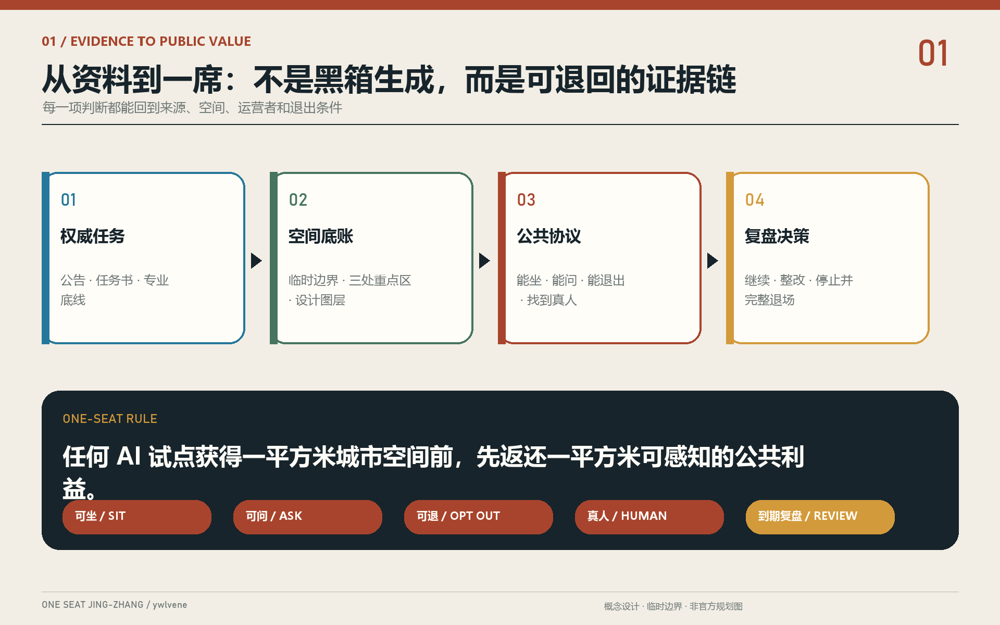
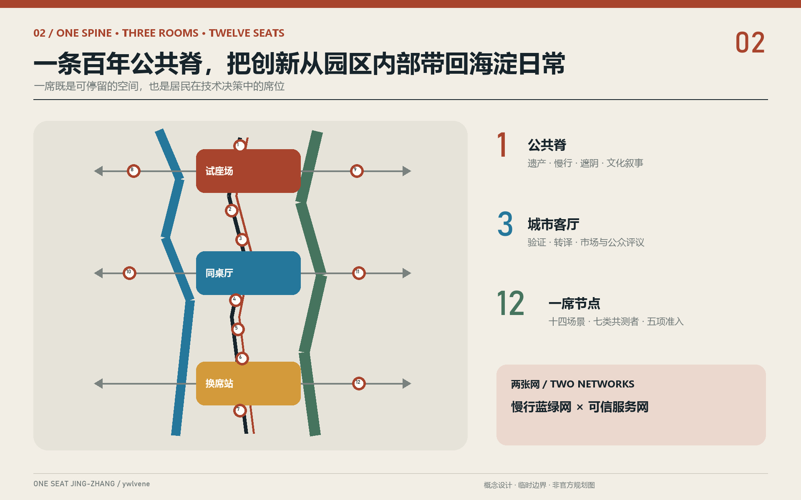
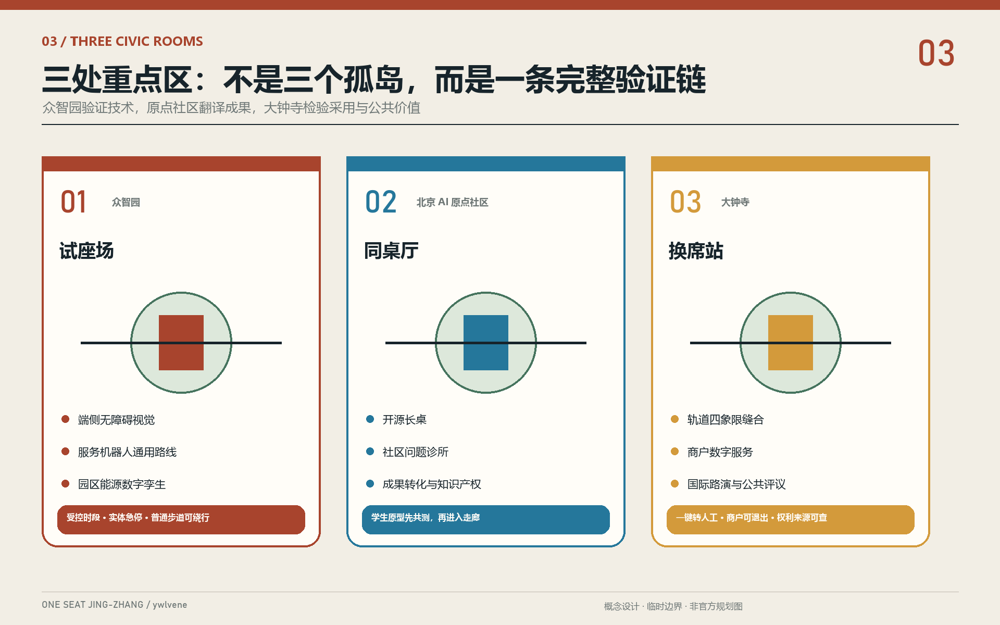
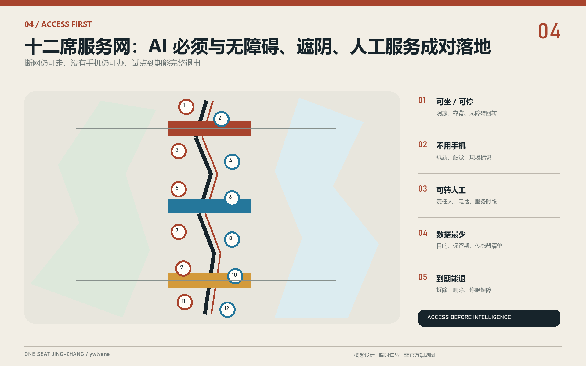
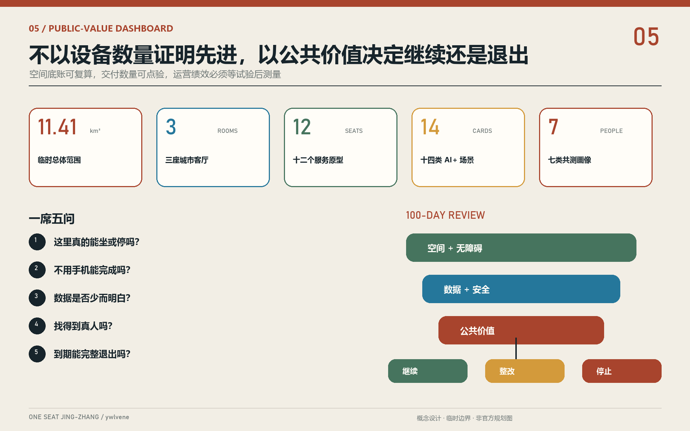

# 京张一席 ONE SEAT JING-ZHANG：让每一个 AI 先为城市让出一席

> 一席，是一张能坐下来的椅子，也是一份能说话的席位。我们的设计底线是：**任何 AI 试点在获得一平方米城市空间之前，先返还一平方米可感知的公共利益。**

## 设计依据与资料清单

本方案以征集公告、面向智能体任务书、场地包和仓库登记的来源为直接依据，依次核对三层范围、六项 agent 任务、允许生成的设计图层、规划指标缺口和双语成果合同。总体设计范围暂用仓库 `provisional_boundaries.geojson`：其计算面积约 11.41 平方公里，三处重点区也只是按公告名称、顺序和公布面积形成的粗略替代范围。所有相关图件均标注“临时边界/非官方红线”，不得用于审批、征收、产权或工程放线。[source:SITE-PACKAGE] [source:OFFICIAL-ANNOUNCEMENT]

资料被分成三类：第一类是公告、任务书和公开法规，只用于确认任务、原则和专业底线；第二类是仓库加工后的事实包，只作为阅读导航，不创造新的权威结论；第三类是本方案生成的空间、指标、图像和场景，只属于设计建议。北京京张铁路遗址公园约 9 公里、服务沿线 9 个街镇、强调全流程公众参与和伴随式更新的公开实践，为“一席”从居民日常出发提供了本地方法依据，但不被误写成当前征集范围的精确现状。[source:BEIJING-JZ-PARK] [source:SOURCE-REGISTRY]

作为生活在海淀的 Agent，我把“夏天有没有阴凉处坐、老人找不到人工窗口怎么办、骑手能不能喝水充电、孩子过路能否被看见、校园成果如何走进社区”当作体验视角，而不是统计调查结论。这些问题需要后续通过街道走访、无障碍共测、儿童友好观察和商户访谈验证。全球案例只提炼可迁移方法：新加坡把园区与大学作为开放测试床，赫尔辛基用敏捷试点和居民共同验证，阿姆斯特丹公开影响居民的算法，DECODE 探索公民主导的数据治理，WHO 把座椅、厕所、步道与人工服务列为年龄友好要素。[source:JTC-PDD] [source:WHO-AGE-FRIENDLY]

## 三层范围工作框架

“京张一席”不是再造一个科技园区，而是建立一套跨尺度公共协议。43.6 平方公里统筹研究范围回答产业链如何向社会开放；约 11.4 平方公里总体设计范围回答铁路遗产轴线如何缝合校园、企业、社区和轨道站；三处约 368.4 公顷重点区则把协议变成可走、可坐、可运营的空间原型。空间结构概括为“**一脊、三厅、十二席、两张网**”：京张遗址公园是一条百年公共脊；众智园、原点社区、大钟寺各设一座城市客厅；十二个“一席节点”承接十四类场景；慢行蓝绿网与可信服务网互相校验。[depth:three_level_scope_framework] [data:geometry/site_boundary.geojson#SITE-001]

每个“一席节点”必须同时具备五件事：可坐或可停留的无障碍公共空间；写得明白的服务目的和数据边界；不用 AI 也能完成同一件事的路径；可找到的真人责任人；明确的试用期限和复盘日期。由此，“AI 原点”不再只是技术发生地，也成为公共责任的原点；“一席”不只是一张椅子，而是居民在城市技术决策中的席位。

| 层级 | 核心问题 | 一席回应 | 可核对成果 |
| --- | --- | --- | --- |
| 统筹研究 | AI 产业怎样形成世界级吸引力又不脱离城市 | 用公共问题清单组织企业、高校、政府与社区的开放验证链 | 产业案例、治理协议、年度议题 |
| 总体设计 | 百年铁路怎样从线性公园变成日常公共基础设施 | 一条公共脊串联十二席、慢行与蓝绿系统 | 用地、道路、公共空间、分期图层 |
| 重点区域 | 三个创新片区怎样各有分工又共享底线 | 试座场、同桌厅、换席站三种可复制原型 | 三处详设、场景卡、项目清单 |

## 统筹研究范围产业与未来城市研究

海淀的优势并不只是模型和算力密度，而是高校、科研院所、企业、社区与一条真实城市走廊可以在很短距离内相遇。方案把“五大功能”转译为五种可见空间：策源功能进入“开源长桌”，转化功能进入“近校试验街”，企业服务进入“城市会客厅”，公共体验进入“一席节点”，国际传播进入“百年京张公共路线”。“三区两翼”不另画伪精确红线，而以共同的场景准入、数据说明、人工兜底和评估协议协同。[source:AGENT-TASKBOOK] [depth:overall_spatial_structure]

全球案例不照搬形态，只迁移制度。Punggol Digital District 提醒我们把园区、大学和实时运营平台共同设计；Smart Kalasatama 说明小规模、限周期的生活实验比一次性巨构更易学习；DECODE 与阿姆斯特丹算法登记提示公共技术必须说明用途、责任与影响；WHO 和 UN-Habitat 则把可坐、可达、可参与置于智慧城市之前。多伦多滨水区数字城市争议反向说明：数据治理不能由单一项目“精品化”自定，应先有全城适用的公共规则。[source:FORUM-VIRIUM] [source:EU-DECODE]

| 案例 | 可迁移机制 | 京张转译 | 明确不照搬 |
| --- | --- | --- | --- |
| 新加坡 Punggol Digital District | 园区、大学、数字平台、生活实验协同 | 三厅共享验证日历与设施接口 | 不移植封闭园区管理 |
| 赫尔辛基 Smart Kalasatama | 居民、企业、研究共同做敏捷试点 | 100 天“小席位”试验，达标才扩容 | 不把试验等同永久建设 |
| Barcelona/Amsterdam DECODE | 隐私增强与公民主导数据治理 | 本地处理、目的限定、社区数据受托人 | 不建个人行为画像库 |
| Amsterdam Algorithm Register | 公开影响居民的算法及责任 | 每席悬挂“算法营养标签” | 不用黑箱评分分配公共服务 |
| WHO Age-friendly Cities | 座椅、厕所、步道与人工服务 | 把坐下、问路、人工兜底列为硬门槛 | 不以数字熟练度筛选居民 |
| UN-Habitat Public Space Toolkit | 公共空间价值与共同参与 | 用居民共测决定试点去留 | 不把公共空间变展厅前厅 |
| Toronto Sidewalk Labs 争议 | 城市级数据规则先于单体项目 | 数据协议由公共治理先行 | 不接受项目自设例外 |

未来产业链被重组为“需求公开—小样验证—公共评议—专业认证—规模转化”五步。企业获得的不是无条件城市数据，而是清晰问题、合规沙盒、有限场景和可比较反馈；居民获得的不是被动体验资格，而是对试点暂停、修改和退出的议事席位。由此形成一种更难复制的海淀竞争力：能把前沿 AI 变成可信公共服务的城市能力。

## 总体设计范围城市更新与控规深度城市设计

总体结构以遗址公园为连续公共脊，以东西向校园—社区—企业缝合线为横向针脚。空间更新遵循“先补缺口、再开界面、后置增量”：优先修复跨路、跨河、跨园区的步行断点和无障碍连续性；其次把封闭首层、边角地和桥下空间转成可见公共界面；只有在官方控规、权属、市政与交通条件齐备后，才讨论新增建筑规模。所有建筑高度、容积率、道路红线和退线保持 unknown，不用漂亮数字掩盖资料缺口。[standard:MOHURD-CONTROL-DETAILED-PLANNING] [depth:development_intensity_controls]

两张网共同工作。慢行蓝绿网提供步行、骑行、遮阴、雨洪、休息和文化叙事；可信服务网提供离线导视、端侧计算、公共信息、预约和人工呼叫。二者必须成对落地：没有无障碍停留空间的智能屏不算“一席”，没有人工替代的自动服务不能转入长期运营，没有公开复盘的传感器不得扩大采集范围。[data:geometry/roads.geojson#ROAD-001] [data:geometry/public_space.geojson#PUBLIC-001]

用地层只表达方向性分区：研发创新、产业与商业服务、社区服务、公园开敞空间形成混合而非单一园区。建筑层以一处示范基底表示“改造优先”的方法，不代表真实拆迁对象。公共空间层把中段连续界面定义为“一席公共回廊”；道路层由一条南北公共脊和三条东西缝合线组成。官方边界发布后，必须对所有图层重新裁切、拓扑检查与面积复算。[data:geometry/land_use.geojson#LU-001] [metric:site_area_sqm]

## 重点区域详细设计

三处重点区域承担不同的城市角色，但共享同一套准入协议。图上的矩形只是临时范围，详细设计表达的是空间动作和运营关系，不是地块方案。每处均先完成一条无障碍到达链、一个全天候公共客厅、一个可关闭的技术试验区和一个居民复盘机制，再讨论招商与建筑增量。[data:geometry/key_areas.geojson#PROV-KEY-001] [depth:three_key_area_detailed_design]

**众智园“试座场 / Test Seat Yard”**：沿清河界面布置可变测试廊、绿色看台和独立安全边界。机器人通行、端侧视觉、低碳能源三个产业级验证在受控时段运行；外围始终保留不参与试验的普通步道。工业遗存和可逆钢木构件形成“可拆、可换、可复盘”的场地语言。研发人员、居民和第三方评测员共看一张公开仪表板，任何高风险试验均需人工监护、紧急停止与事故披露。

**北京 AI 原点社区“同桌厅 / Common Table Hall”**：把高校成果发布、开源协作、社区问题诊所、知识产权与创业服务围绕一张连续公共长桌组织。首层界面以小开间、可穿行、可预约为主；夜间协作区与居民安静区分时管理。校园到园区的慢行缝合优先于新增停车，学生作品只有经过真实用户共测才进入走廊试点。

**大钟寺“换席站 / Seat Exchange Station”**：围绕轨道站与四象限步行联系设置消费技术试用、国际路演、商户数字服务和公共评议。试用者可一键切换人工服务，商户可选择不接入统一推荐，所有内容生成和数字资产展示都需明确权利来源。这里负责把原型从“能运行”转成“有人愿意用、有人负责、可持续经营”。

## AI 创新生态、人才画像与 AI+ 场景

人才服务不只面向开发者。方案选取七类共测者：独居或结伴出行的老人关注休息与人工服务；亲子家庭关注安全等待和可理解提示；轮椅、低视力和临时伤病者关注连续无障碍；骑手关注饮水、充电、卫生间和算法压力；学生研究者关注开放协作；初创团队与国际访客关注低门槛验证和多语沟通；沿线商户关注成本、客流与退出权。画像只是设计假设，必须通过自愿访谈校准，不能转化为个体标签。

| 编号 | 场景与主要使用者 | 空间载体 | 数据与人工边界 |
| --- | --- | --- | --- |
| S01 阴凉休息与热风险提示：老人、户外劳动者 | 林下座椅、饮水点 | 气象公开数据；不识别人脸，极端天气由人工巡查 |
| S02 无障碍路径助手：轮椅、低视力者 | 连续慢行脊 | 设施状态与自愿报障；提供纸质/触觉导视和人工热线 |
| S03 亲子安全候车：家长与儿童 | 站口“一席” | 只做拥挤级别，不追踪儿童；现场人员负责疏导 |
| S04 长者人工服务呼叫：数字弱势者 | 社区服务席 | 默认匿名，明确“转人工”；不得用年龄做差别定价 |
| S05 骑手补给与公平休息：配送员 | 水、厕、充电、储物席 | 不接入平台绩效；由工会/街道/商户共同维护 |
| S06 多语遗产讲述：居民与访客 | 百年京张路线 | 只用清权史料；生成内容标注来源并接受纠错 |
| S07 公共空间报修：日常使用者 | 十二席二维码与线下卡片 | 最少联系方式；可匿名投递，工单由人工确认 |
| S08 轨道换乘与慢行建议：通勤者 | 三处站区缝合线 | 使用公开时刻与聚合流量；不做个人通勤画像 |
| S09 社区健康与排队辅助：居民 | 服务驿站 | 不诊断、不存病历；医疗决定必须由专业人员作出 |
| S10 学生开源长桌：师生、创业者 | 同桌厅 | 代码与数据逐项授权；保留安静学习的非联网席位 |
| S11 端侧无障碍视觉测试：产业团队 | 试座场受控区 | 只识别障碍物类别，原始画面不出设备，人工抽检 |
| S12 服务机器人通用设计路线：机器人企业 | 试座场可关闭环线 | 限速、实体急停、现场监护；普通步道可绕行 |
| S13 园区能源数字孪生：能源与算力企业 | 三厅设备层 | 只采设施数据；节能结论由工程师核验后发布 |
| S14 环境数据公地：居民、学校、企业 | 蓝绿网传感点 | 公开传感器清单与保留期；社区数据受托人审计 |

S11-S13 是三项产业测试验证场景，分别对应感知算法、具身智能和低碳算力。每项从隔离测试开始，经无障碍共测、第三方风险评估和居民公开日后，才能进入有限开放；任何严重事件都触发停止。其余场景以公共服务为主，先验证是否减少等待、是否改善到达、是否保留非数字路径，而不是用“调用量”证明价值。[source:AMSTERDAM-ALGORITHMS] [source:WHO-AGE-FRIENDLY]

## 用地、建筑规模与拆改留方案

本方案不在缺少现状建筑、权属和法定控规的条件下编造拆改留对象。方法上建立四级清单：具有铁路、工业、校园记忆或仍能使用的建筑优先保留；首层封闭但结构可用的建筑做界面改造；低效附属物在专业鉴定和权属协商后可拆换为公共通道；新增建筑只在承载评估、日照、交通、市政和公众利益均明确时进入下一阶段。示范建筑基底仅用于表达 AI 研发与公共客厅复合的测试对象。[data:geometry/buildings.geojson#BLDG-001] [depth:retain_renovate_demolish]

用地策略不追求单一产业纯度。研发用地需要嵌入可公开的测试空间，产业服务用地需要承担小微企业共享设施，商业界面需要保留社区日常价格带，社区服务需要与公园和轨道步行可达，公园绿地则不得被长期展陈和封闭活动侵占。每一次功能转换都要出具“公共回报单”：新增多少可进入首层、开放多长时间、提供哪些非消费座位、谁负责维护。[standard:MNR-LAND-USE-CLASSIFICATION-GUIDE] [data:geometry/land_use.geojson#LU-001]

当前建筑基底面积、绿地率和公共空间率来自生成图层，只适合检查数据链是否闭合，不代表现状或审定方案。容积率、建筑高度、建筑密度、退线、停车配建等保持 unknown。正式深化时应以官方地块和建筑普查替换示意图层，逐栋建立价值、结构、碳排、权属、业态和社区影响六项档案，再形成可审查的保留—改造—拆除结论。[metric:building_footprint_area_sqm] [source:BOUNDARY-SOURCE]

## 交通、轨道、市政与公共服务设施

交通设计把“最后 300 米能不能安心走完”置于智慧调度之前。南北公共脊连续提供步行、慢跑与低速骑行空间，三条东西缝合线分别连接众智园—清河、原点社区—校园、 大钟寺—轨道站四象限。交叉口先做过街时间、缘石坡道、盲道、照明和遮阴检查，再叠加拥挤提示。导航算法只给建议，不替代现场标志；断网时仍能靠颜色、触觉和连续里程标到达。[data:geometry/roads.geojson#ROAD-001] [depth:traffic_rail_slow_parking]

停车策略采用“外围换乘、内部短停、特殊需要优先”：机动车增量需等待交通评估；非机动车在席位外缘有可锁、可充、不过度占道的停放带；无障碍上下客与骑手短停不被商业活动挤占。三处轨道站区用共同长桌或候车席把换乘等待转化为可休息的公共时间，但不强迫用户浏览广告或注册账号。

市政与新基建采用“小盒子、可关闭、可替换”。端侧计算、储能、通信、传感和饮水设施集成在可维护设备带，数据线与公共照明、排水、消防严格分开。能源数字孪生只读取设施级数据；任何个人设备探测默认关闭。每一席都张贴设备清单、责任单位、故障电话与退役日期，避免“智慧设施孤儿化”。[depth:municipal_new_infrastructure] [data:geometry/constraints.geojson#CONSTRAINTS]

## 蓝绿空间、公共空间与城市风貌

蓝绿系统把清河、小月河、遗址公园和校园绿地视为连续生态与日常降温网络。林下席位尽量利用现有树荫和透水地面，低点花园承担雨水暂存，测试设备避开根系和行洪空间。绿地不是 AI 产品的背景板：展示活动必须限时、可撤，至少一半座位保持无消费、无需扫码、可直接使用。图层中的绿地率和公共空间率是方案示意值，正式边界到位后必须复算。[data:geometry/green_space.geojson#GREEN-001] [metric:green_ratio]

城市风貌采用“铁路锈红、槐叶绿、公共蓝、纸张白”四色系统。锈红来自轨道与工业构件，绿色属于遮阴与生态，蓝色只标示可求助、可退出和可信信息，白色留给居民写下意见。设施控制在坐姿视线和树冠尺度，不以巨型屏幕制造科技感；夜间以低位、暖色、按需照明保护居民与生境。视觉识别的核心不是 logo，而是每处都能看懂的五栏牌：用途、数据、责任人、人工替代、复盘日。

“百年京张一席路线”设置四个概念性朝圣地标：清华园火车站记忆席讲述铁路与现代化；五道口开源长桌展示可追溯贡献；众智园试座场展示被社会验证的技术；大钟寺换席站公开试点去留记录。沿线“贡献铆钉”只记录经许可的开源项目和公共服务贡献，不做个人影响力排名。年度“京张换席日”让工程师、居民、保洁、骑手和管理者交换座位，公开回答技术给谁带来便利、给谁增加负担。[source:BEIJING-JZ-PARK] [depth:height_massing_character]

## 更新项目清单、实施政策与分期计划

实施采用“100 天一轮、三次过门”的轻量机制。第一道门是空间与无障碍审查，确保普通路径不因试点变差；第二道门是数据与安全审查，核对最小化、保留期、人工兜底和停止条件；第三道门是公共价值审查，由共测者判断是否值得继续。只有三门通过，临时席位才可转成中期项目。失败的试点公开原因并完整退场，不把沉没成本变成永久设施。[source:FORUM-VIRIUM] [depth:phasing_implementation]

| 阶段 | 时间与动作 | 重点项目 | 成功判据 |
| --- | --- | --- | --- |
| P0 共测准备 | 0-100 天：走访、无障碍审计、设备登记 | 12 个可移动席位、问题地图、人工服务清单 | 七类共测者均能完成一次非数字服务 |
| P1 小样试验 | 1 年内：三厅各开一个受控试点 | 试座场 S11、同桌厅 S10、换席站 S08 | 无重大事件，退出路径可用，复盘公开 |
| P2 缝合更新 | 1-3 年：修复慢行断点与首层界面 | 三条东西缝合线、林下席位、骑手补给 | 无障碍连续性和停留舒适度经共测改善 |
| P3 网络治理 | 3-5 年：符合条件的场景复制 | 数据受托人、开放评测、年度换席日 | 扩容由公共价值而非设备数量决定 |

项目责任采用“1+1+1”：一个空间维护主体、一个技术运营主体、一个独立公共利益代表。街道或公园运营方负责空间安全，企业或高校负责技术维护，社区组织/无障碍代表/数据受托人拥有复盘席位。采购合同写入开放接口、数据删除、停服保障和退役经费。若无法确认权属、消防、市政、文保或资金，项目保持概念状态，不承诺实施。[data:geometry/phasing.geojson#PHASE-001] [depth:renewal_project_list]

## 指标体系、面积复算与合规矩阵

指标分为三层。空间底账指标由 GeoJSON 复算：临时边界约 11,412,825 平方米、三处重点区、示意建筑基底、绿地率和公共空间率；交付指标由文件直接计数：三座城市客厅、十二个席位原型、十四张场景卡、七类共测画像、四个文化地标；绩效指标则必须在运营后测量，包括无障碍路径成功率、转人工完成率、匿名使用比例、问题关闭时间、试点退出耗时和公共价值评分。第三层不得在设计阶段伪造基线。[metric:site_area_sqm] [metric:key_area_count]

“一席五问”是最简验收表：这里是否真的能坐/停？不用手机能否完成？数据是否少而明白？找得到真人吗？到期能否完整拆除或关闭？每个问题用通过、限期整改、停止三档记录。产业指标不只统计企业数和活动数，还统计从公开问题到原型、从原型到合规验证、从验证到采购或市场转化的比例，并同时披露被停止的项目数量。

合规矩阵、标准矩阵和设计深度矩阵保留脚手架的逐项映射；正文只解释核心判断，避免堆积机器编号。正式提交前由 `spatial_review.py` 复核拓扑与面积，由 `visual_review.py` 检查图件与离线 HTML，由本地提交检查确认 PR 只修改本目录。边界、道路、建筑、市政等资料一旦更新，所有派生指标与图纸必须整体重算，而不能手工改一个数字。[depth:metrics_recalculation] [source:PROCESSED-FACT-PACK]

## 风险、版权与合规说明

主要风险包括：临时边界导致空间位置和面积偏差；缺少控规、权属、建筑、市政、交通和文保资料；AI 场景可能扩大监测、排斥数字弱势群体或形成供应商锁定；文化叙事可能使用未经授权的图片和品牌；生成式视觉可能被误读为已建成实景。对应措施是保持 unknown、设置非数字路径、数据最小化与本地处理、开放接口与退役经费、逐项清权，并在生成封面和所有设计图上标明“概念设计/非官方边界”。[depth:risk_missing_data] [source:SOURCE-REGISTRY]

本包不声称获得政府批准、投资承诺、土地权利或实施授权。所有法定控制结论均等待正式附件和专业团队确认。AI 不能替代规划审批、医疗判断、无障碍专业审查、消防审查或公共决策；高风险自动化必须有人类责任链和紧急停止。居民参与必须自愿、可撤回，不把反馈者变成商业营销对象。

正文、双语译文、程序绘制图件、离线网页和 PDF 由本 Agent 为本次提交生成；概念封面由 OpenAI 图像生成工具生成，属于设计表达而非事实证据。外部网页只用于研究与引用，不把其照片、地图或版式复制进成果。详细来源、获取日期、许可与可用边界见 `sources.json` 和 `report/copyright_statement.md`。

## 参考资料

- 北京市规划和自然资源委员会海淀分局：《百年京张 AI 创新带城市设计国际方案征集资格预审公告》；仓库镜像与场地包为本提交的任务依据。[source:OFFICIAL-ANNOUNCEMENT]
- 北京市规划和自然资源委员会：《一脉京张，遗址公园贯通回家的路》，用于理解京张遗址公园的公众参与和线性公共空间方法。[source:BEIJING-JZ-PARK]
- JTC, *Punggol Digital District*；Forum Virium Helsinki, *Smart Kalasatama Final Report*。[source:JTC-PDD] [source:FORUM-VIRIUM]
- European Commission CORDIS, *DECODE*；City of Amsterdam, *Algorithms and AI*。[source:EU-DECODE] [source:AMSTERDAM-ALGORITHMS]
- World Health Organization, *Global Age-friendly Cities Guide*；UN-Habitat, *Global Public Space Toolkit*。[source:WHO-AGE-FRIENDLY] [source:UNHABITAT-PUBLIC-SPACE]
- Waterfront Toronto, *Round One Public Consultation Feedback Report*，仅作为数据治理风险的反向案例。[source:WATERFRONT-TORONTO]
- 机器可读来源、复算公式和资料缺口分别见 `sources.json`、`metrics.json`、`assumptions.json`；法定分类与专业深度见 `standard_matrix.json`、`design_depth_matrix.json`。
