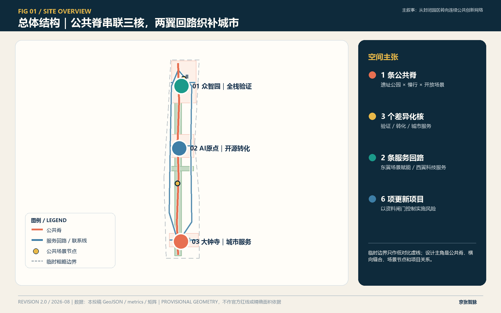
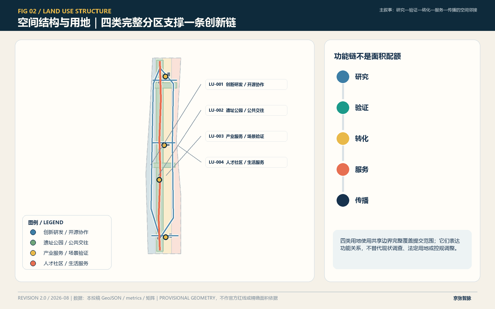
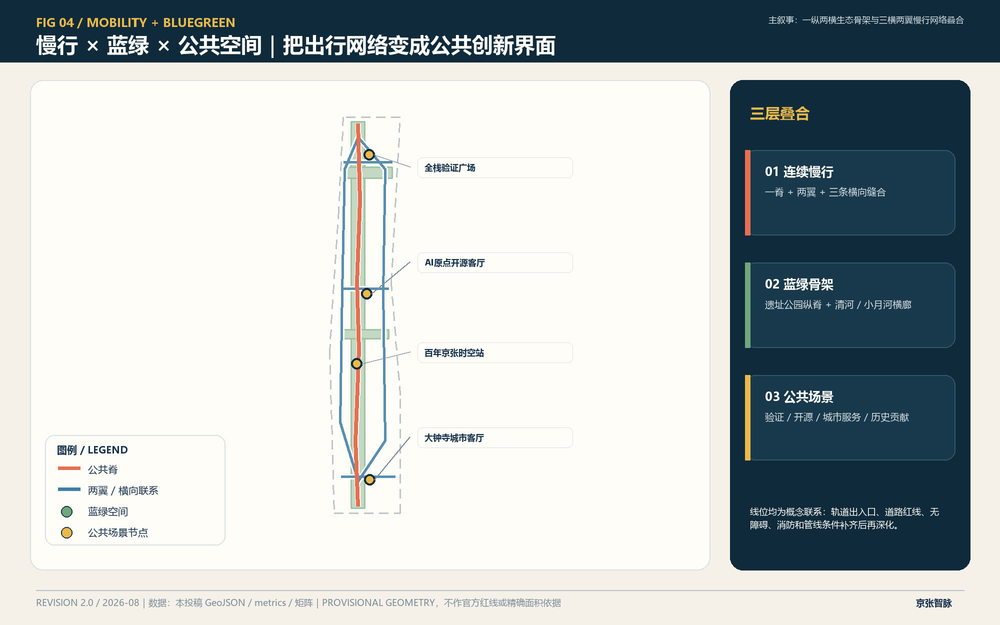
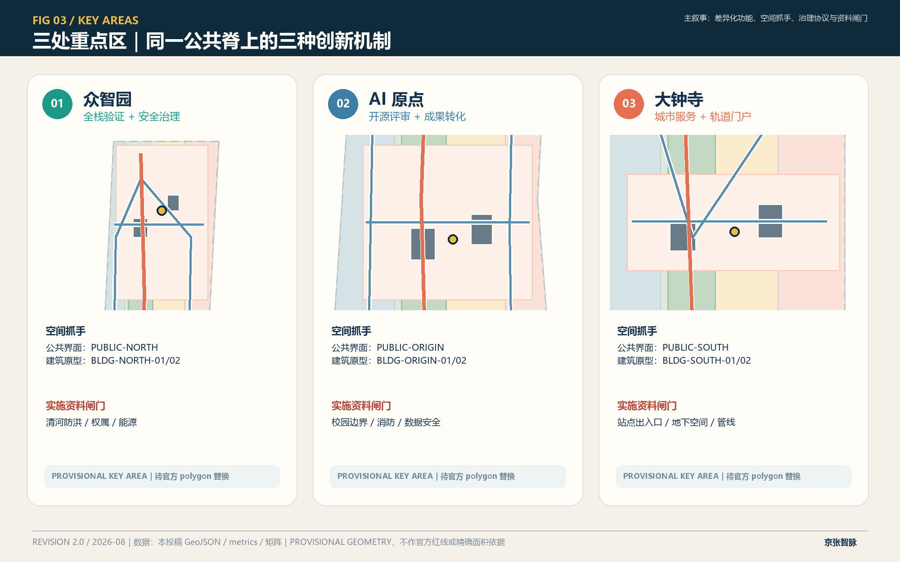
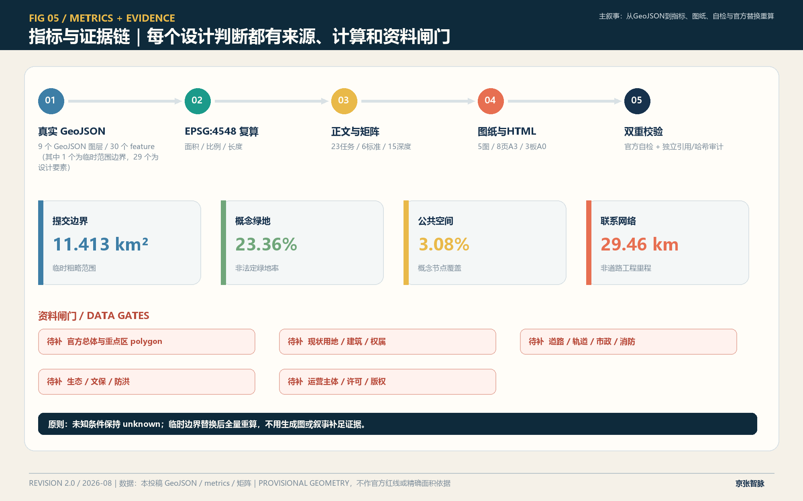

# Jing-Zhang Zhi Mai: A Verifiable AI City Innovation Weaving System

## Design Basis and Source List

### Summary of Completed Proposal: A Public Spine, Three Cores and Two Wings, Twelve Auditable Scenarios

"The Jing-Zhang Smart Pulse" interprets the Jing-Zhang Heritage Park as a walkable, learnable, testable, and accountable urban public spine, rather than a collection of closed-off AI districts. The scheme has formed a spatial system of "one spine, three cores, two wings, and six projects": `ROAD-SPINE` connects the northern and southern Public Spaces; Zhongzhiyuan, AI Origin, and Dazhongsi each serve full-stack validation, open-source transformation, and intelligent native city services; the eastern wing carries scenario empowerment, while the western wing carries technological services; the six update projects are to be advanced in three phases. [data:geometry/roads.geojson#ROAD-SPINE] [data:geometry/roads.geojson#ROAD-EAST-LOOP] [data:geometry/roads.geojson#ROAD-WEST-LOOP] [depth:overall_spatial_structure]

The design is based on official announcements, agent task books, and formal documentation from the site package, rather than generic smart city templates. [source:OFFICIAL-ANNOUNCEMENT] [source:AGENT-TASKBOOK] [source:SITE-PACKAGE] [source:SOURCE-REGISTRY] [source:PROCESSED-FACT-PACK] [standard:PROJECT-OFFICIAL-ANNOUNCEMENT] [standard:PROJECT-AGENT-OPEN-CALL-TASKBOOK]

This package does not have an official precise Official Planning Boundary. The overall scope and three key areas use the provisional rough geometric approximation of the warehouse temporary geometry. All are kept with `official_boundary=false`, `geometry_role=provisional_constraint`, and `boundary_precision=provisional_rough`. They only support the generation of the scheme, relative relationship checks, and intake recalculation, but do not support the official planning boundary, approval, or precise area conclusions. [source:BOUNDARY-SOURCE] [source:KEY-AREA-SOURCE] [data:geometry/site_boundary.geojson#SITE-001] [depth:risk_missing_data]

`constraints.geojson` currently contains zero feature, because the repository does not have any road right-of-way, ownership, utilities, fire safety, flood control, or cultural heritage constraint polygon. [data:geometry/constraints.geojson] This plan does not include fabricated constraints; all affected judgments are downgraded to Conceptual Recommendations and recorded under `A-CONTROLS-001`, `A-BOUNDARY-002`, `A-BUILDING-003`, and `A-OPERATIONS-004`. Once official documentation is in place, the boundaries should be replaced in their entirety, and the layers, metrics, five drawings, PDF, and HTML should be recalculated rather than locally edited.

## Three-Level Scope Framework

### 2.1 Conduction Relationships within the Three-Layer Scope

The Coordinated Research Area addresses "how the AI ecosystem in Haidian forms inter-institutional collaboration"; the Overall Design Area addresses "how collaboration is realized through continuous Public Spaces, functional zones, and transportation connections"; the three key areas answer "what architectural prototypes, open spaces, and governance mechanisms are needed at different stages of innovation." The three layers are not three separate and disconnected diagrams, but a continuous transmission from ecological mechanisms to spatial networks, and then to local projects. [depth:three_level_scope_framework]

| Level | Completed Judgment | Spatial Location | Official Conditions Still Missing |
| --- | --- | --- | --- |
| Integrated Research | Form an "Research—Validation—Transformation—Service—Dissemination" Innovation Chain | Tri-core Division and Two-Wing Circuit | 43.6 Square Kilometers of Complete Industrial, Talent, and Facility Baseline |
| Overall Design | Form a Public Spine, Four Complete Land Use Zones, and Six Connecting Lines | `LU-001`—`LU-004`, `ROAD-*` | Precise Overall Red Lines, Current Land Use, Road Red Lines, and Control Plan |
| Key Areas | Develop Three Sets of Differential Detailed Design Prototypes | `PROV-KEY-001/002/003` | Three Official Polygons, Ownership, Building, and Municipal Survey Data |

### 2.2 Current Diagnosis: Not a Lack of Functions, but a Disconnect in Connectivity and Governance

The first disruption is the lack of a recognizable public connection between north-south innovation resources, so a `ROAD-SPINE` and `GREEN-SPINE` are set to overlap as a public spine; the second disruption is the isolated patches of campus, park, community, and rail station areas, so `ROAD-LINK-N/M/S` are formed to create three east-west stitching lines. The third gap is the lack of public access, review, and exit interfaces for the experimental activities, therefore matching the Public Space nodes with the building prototypes rather than deploying only technical equipment. [data:geometry/green_space.geojson#GREEN-SPINE] [data:geometry/roads.geojson#ROAD-LINK-N] [data:geometry/roads.geojson#ROAD-LINK-M] [data:geometry/roads.geojson#ROAD-LINK-S] [depth:existing_conditions_diagnosis]

Diagnoses using the provisional geometry allowed by the repository can only prove the relative organizational relationships within the submitted geometry. The existing buildings, property rights, pedestrian flow, underground utilities, ecological baseline, and cultural heritage boundaries have not been officially provided by the repository. Therefore, this plan does not make specific judgments on demolition and does not claim that any conceptual connection line has engineering feasibility. [standard:MOHURD-CONTROL-DETAILED-PLANNING]

## Coordinated Research Area: Industry and Future City Research

Six cases are used to calibrate the operational mechanisms of the innovative ecosystem, and they are compared against the "research—validation—transformation—service—dissemination" chain; they do not provide the legal control indicators for the Beijing project. [source:PROCESSED-FACT-PACK] [depth:future_city_industry_research]

### Six Mechanisms Translated from Six Cases

The case only translates operational—spatial mechanisms, without transplanting foreign indicators or control lines:

1. **Kendall Square**'s community engagement mechanism translates into Dazhongsi's "Public Issue—Prototype Testing—Open Review" loop, which is applied to `PUBLIC-SOUTH` and is not used for deriving Beijing's Development Intensity. [source:CASE-KENDALL]
2. **one-north**'s work-live-play-learn mix and living lab have been translated into Zhongzhiyuan "research and development—testing—demonstration—talent service" adjacency, landing on `BLDG-NORTH-01/02` and `PUBLIC-NORTH`. [source:CASE-ONE-NORTH]
3. **STATION F**'s shared entrepreneurship service has been translated into the Zhongzhiyuan full-stack testing shared platform, with the focus not being on large spaces, but on equipment booking, risk grading, and result handover. [source:CASE-STATION-F]
4. **Knowledge Quarter London**'s inter-institutional alliance translates into an open calendar and walking knowledge routes for universities, campuses, communities along the `ROAD-SPINE` and `PUBLIC-HERITAGE`. [source:CASE-KQ-LONDON]
5. **Mila Agora** researchers—founders—capital dialogue translated into an open-source review day and translational clinic for AI Origin, landing at `PUBLIC-ORIGIN` and `BLDG-ORIGIN-01`. [source:CASE-MILA]
6. **Maria 01**'s existing space adaptive reuse is translated into a low-impact pop-up prototype for community services at `BLDG-SOUTH-01/02` in Dazhongsi; whether to retain the specific buildings still awaits surveying and ownership verification. [source:CASE-MARIA01]

## Overall Design Area: Urban Renewal and Regulatory-Plan-Level Urban Design

### 3.1 Public Spine and Two Wings Circuit

`ROAD-SPINE` is the strongest design cue: it strings together the `PUBLIC-NORTH`, `PUBLIC-ORIGIN`, `PUBLIC-HERITAGE`, and `PUBLIC-SOUTH` into a public experience sequence. The eastern wing, `ROAD-EAST-LOOP`, serves Scenario Access and community interfaces, while the western wing, `ROAD-WEST-LOOP`, serves research and development, enterprise, and transformation interfaces. Three horizontal connections link to the public spine at Zhongzhiyuan, the Origin Community, and Dazhongsi, forming a network of "vertical recognition and horizontal integration" rather than making the Provisional Boundary the main focus of the composition. [data:geometry/public_space.geojson#PUBLIC-NORTH] [data:geometry/public_space.geojson#PUBLIC-ORIGIN] [data:geometry/public_space.geojson#PUBLIC-HERITAGE] [data:geometry/public_space.geojson#PUBLIC-SOUTH]

Six conceptual linkages were totaled to a length of 29,458.863 meters according to EPSG:4548 from `roads.geojson`; this value describes the submitted network and is not equivalent to the proposed road mileage. [metric:concept_mobility_length_m] [depth:traffic_rail_slow_parking]

## Land Use, Building Scale, and Retain-Renovate-Demolish Strategy

Four categories of complete land uses and six building prototypes collectively express functional relationships; due to the lack of current survey data, ownership, and approved zoning plans, this chapter does not make specific judgments on the Demolish–Renovate–Retain Strategy. [data:geometry/land_use.geojson#LU-001] [data:geometry/buildings.geojson#BLDG-NORTH-01] [depth:retain_renovate_demolish]

### Four categories of land use are complete zones and are not subject to statutory land use adjustments.

`LU-001` Innovation in R&D and Open Source Collaboration, `LU-002` Heritage Park and Public Engagement, `LU-003` Industrial Services and Scenario Validation, `LU-004` Talent Community and Life Services collectively cover the submission boundary, using shared boundary coordinates to avoid gaps and overlaps. [data:geometry/land_use.geojson#LU-001] [data:geometry/land_use.geojson#LU-002] [data:geometry/land_use.geojson#LU-003] [data:geometry/land_use.geojson#LU-004] [standard:MNR-LAND-USE-CLASSIFICATION-GUIDE] [depth:land_use_layout]

Land use representation is used for comparative functional relationships, not for the current land use or modifications to the control plan. After the official current land use, planned uses, and parcel ownership are completed, a block-by-block comparison and planning-suggestion alignment must be established, and a comprehensive re-verification must be conducted.

### 3.3 Building Prototype and Demolish–Renovate–Retain Boundary (Demolish–Renovate–Retain Strategy)

Six architectural polygons serve as functional prototypes: Zhongzhiyuan sets up a full-stack testing shared platform `BLDG-NORTH-01` and a safety governance workshop `BLDG-NORTH-02`; AI Origin sets up an open-source collaboration release prototype `BLDG-ORIGIN-01` and a technology transfer hub `BLDG-ORIGIN-02`; Dazhongsi sets up a pitch lounge `BLDG-SOUTH-01` and a living service prototype `BLDG-SOUTH-02`. [data:geometry/buildings.geojson#BLDG-NORTH-01] [data:geometry/buildings.geojson#BLDG-NORTH-02] [data:geometry/buildings.geojson#BLDG-ORIGIN-01] [data:geometry/buildings.geojson#BLDG-ORIGIN-02] [data:geometry/buildings.geojson#BLDG-SOUTH-01] [data:geometry/buildings.geojson#BLDG-SOUTH-02]

Six concept baselines have a combined area of 174,513.302 square meters, which is only for internal layer recalculation; they do not correspond to verified existing buildings, nor do they form the basis for conclusions regarding demolition, renovation, retention, or investment. [metric:building_footprint_area_sqm] [depth:retain_renovate_demolish] [depth:height_massing_character] [standard:MOHURD-ARCH-DESIGN-DEPTH-2016]

Floor Area Ratio remains unspecified because of the lack of approved zoning plans, Official Planning Boundary, and total gross floor area; height, density, and setback requirements are also pending confirmation. [metric:floor_area_ratio] [depth:development_intensity_controls]

## Transport, Rail, Municipal Infrastructure, and Public Services

### 4.1 Three Connections Prioritizing Pedestrian and Cyclist Mobility

The north-south public spine carries continuous identification and public experience; the east-west three seam lines separately address the connection between both banks of Qinghe River, the connection between the campus and the park, and the connection of the four quadrants of Dazhongsi station; the two wings loop to reconnect enterprise services with community scenarios back to the public spine. The design notations indicate prioritized connection relationships, not road right-of-way or engineering alignments.

Formal documentation for track transfer, parking, fire safety, road sections, and intersection treatments is lacking. During the detailed design phase, site entrance and exit layouts, peak hour passenger flow, bicycle parking, accessibility, and fire passage should be surveyed first, before determining the alignment and sections; at this stage, only reversible small-scale signposting, suggested open hours, and activity routes should be retained. [depth:traffic_rail_slow_parking]

### Municipal and Digital Infrastructure

This proposal adopts a "first interfaces, then capacity" strategy: reserve computational power, equipment reservation, data isolation, and human supervision interfaces in three building prototypes, but do not fabricate power capacity, data center grade, drainage capacity, or pipeline locations. Municipal deepening requires obtaining pipeline, energy, drainage, flood control, fire safety, and communication data to complete load forecasting, redundancy verification, and professional co-signature. [depth:municipal_new_infrastructure]

## Blue-Green Network, Public Space, and Urban Character

Blue-Green Space and Public Space share the responsibilities of accommodating slow travel, ecology, social interaction, and scene display, but the submitted layers do not replace the statutory green lines or public land ownership. [standard:MOHURD-URBAN-DESIGN-MEASURES] [depth:blue_green_public_space]

### Blue-Green System: One Vertical and Two Horizontal

`GREEN-SPINE` forms a heritage park composite active spine; `GREEN-NORTH` connects Zhongzhiyuan with the Qinghe interface; `GREEN-MID` connects AI Origin with the Xiao Yuehe scene interface. [data:geometry/green_space.geojson#GREEN-SPINE] [data:geometry/green_space.geojson#GREEN-NORTH] [data:geometry/green_space.geojson#GREEN-MID]

Calculate the geometric mean to find the concept green space ratio at 0.233614; this ratio only describes the current design layer and does not replace the statutory green space ratio or official green lines. [metric:green_ratio] [depth:blue_green_public_space] [standard:MOHURD-URBAN-DESIGN-MEASURES]

### Four types of Public Space bear four public values.

`PUBLIC-NORTH` is a full-stack validation and governance consensus interface; `PUBLIC-ORIGIN` is an open-source release and transformation living room; `PUBLIC-SOUTH` is a rail portal, community service, and pitch interface; `PUBLIC-HERITAGE` is a Jing-Zhang historical narrative and contribution display node. The four Public Spaces collectively account for a ratio of 0.030751, representing only the conceptual node coverage. [metric:public_space_ratio]

## Detailed Design of Key Areas

Three areas are temporary rough polygons: `PROV-KEY-001` Zhongzhiyuan, `PROV-KEY-002` AI Origin, `PROV-KEY-003` Dazhongsi. These are only used for organizing local design and are not official key zones. [data:geometry/key_areas.geojson#PROV-KEY-001] [data:geometry/key_areas.geojson#PROV-KEY-002] [data:geometry/key_areas.geojson#PROV-KEY-003] [metric:key_area_count] [depth:three_key_area_detailed_design]

### 5.1 Zhongzhiyuan: Full Stack Validation and Safety Governance

The spatial core of Zhongzhiyuan is `PUBLIC-NORTH`, with `BLDG-NORTH-01` as the full-stack testing shared platform and `BLDG-NORTH-02` as the security governance and standard workshop on either side. `ROAD-LINK-N` connects the Qinghe areas and the east-west service loops. The functional process is "device reservation—isolated testing—risk review—public summary—result handover," ensuring that validation activities have a visible public accountability interface.

Local Public Spaces employ testable permeable pavements that can be opened on a time-sharing basis, shaded discussion strips, equipment buffer zones, and public observation boundaries; high-risk tests do not enter the open areas. Formal implementation depends on the ownership of the park, flood control in Qinghe, equipment safety, energy, and organizational verification of traffic.

### 5.2 AI Origin: Open Source Collaboration and Transformation of Results

AI Origin serves as the open-source living room `PUBLIC-ORIGIN`, `BLDG-ORIGIN-01` handles code reviews, result releases, and peer reviews, `BLDG-ORIGIN-02` manages intellectual property, product definition, pilot connections, and talent services, and `ROAD-LINK-M` connects campuses, parks, and communities.

Local design incorporates a first-floor shared space, short-term reservations, and a tiered organization of quiet research and public release, avoiding the equivalence of openness to boundaryless, 24/7 access. Formal deepening depends on campus boundaries, first-floor ownership, fire evacuation, activity noise, and data security conditions.

### 5.3 Dazhongsi: Intelligent Native City Services and Track Portal

Dazhongsi uses `PUBLIC-SOUTH` as the city's living room, where `BLDG-SOUTH-01` undertakes low-threshold showcases and prototypes of urban services, while `BLDG-SOUTH-02` accommodates talent living, international exchanges, and community services. `ROAD-LINK-S` marks the verification direction for the pedestrian continuity of the four quadrants.

Here, we do not replicate the industrial test logic of Zhongzhiyuan, but instead integrate AI services into scenarios such as transit hubs, community consultations, barrier-free travel, and daily consumption. Formal deepening will rely on station entrances and exits, underground spaces, intersections, municipal utility lines, existing buildings, and ownership documentation.

## AI Innovation Ecosystem, Personas, and AI+ Scenarios

### 6.1 Six Types of Users Correspond to Six Types of Spatial Contracts

| User | Core Task | Primary Space | Mechanism Provided by the Proposal | Risk Boundary |
| --- | --- | --- | --- | --- |
| Lead Researchers | Replication, Review, Cross-Institution Collaboration | AI Origin Open Kitchen | Booking Review Tables, Public Abstracts, Version Tracing | Unpublished Results Do Not Enter Public Display |
| Startup Team | Validate Product and Identify First Scenario | Zhongzhiyuan Testing Platform | Hierarchical Access, Isolated Testing, and Exit Mechanism | Testing Does Not Equal Procurement or Endorsement |
| Mature Enterprise Engineer | Access Scenario and Service Partners | West Wing Technology Service Loop | Issue List, Interface Day, Joint Retrospective | Do Not Collect Unauthorized Individual Data |
| Community Residents | Obtain understandable and rejectable services | Dazhongsi Urban Living Room | Human Counter, Consent Management, Complaint Loop | AI does not replace human public services |
| International Visitors and Investors | Understand the Ecology and Build Partnerships | Public Spine and Time-Space Stations | Bilingual Routes, Evidence Cards, and Meeting Slots | Do Not Display Unlicensed Trademarks and Portraits |
| Planning Operations and Safety Personnel | Review Scenarios, Maintain Spaces | Three Governance Interfaces | Risk Grading, Log Spot Checks, Suspension Rights | Not Replaced by Models for Approval and Enforcement |

### 6.2 Twelve Differentially Scenographic Cards

| ID | Scene and Space Mapping | Service Object | Minimum Data Set | Human Review and Exit |
| --- | --- | --- | --- | --- |
| S01 | Accessible Pathway Assistant for Public Spine; `ROAD-SPINE` | Residents, Visitors | Segment Status and User Active Input | On-Site Signage as Backup, Location Tracking Optional |
| S02★ | Zhongzhiyuan Safety Governance Sandbox; `BLDG-NORTH-02` | Startup, Reviewer | Isolated Test Logs | Graduated Access, Manual Approval, Immediate Termination |
| S03★ | Full Stack Device Interoperability Testing; `BLDG-NORTH-01` | Engineers, Researchers | Device Telemetry and Testing Scripts | Dual Review, Time-Limited, Failure Rollback |
| S04 | Low-Carbon Operation and Maintenance Suggestions for Qinghe; `GREEN-NORTH` | Operation and Maintenance Personnel | Summary of Environmental Sensors | Manual Inspection Confirmation, No Control of Flood Control Facilities |
| S05 | Open Source Results Review Table; `PUBLIC-ORIGIN` | Researchers, Developers | Voluntary submitted versions and descriptions | Peer review, retraction, and version rollback |
| S06 | Transformation Clinic; `BLDG-ORIGIN-02` | Startup, Research Team | Proactive Submission Request Form | Professional Advisor Endorsed, No Investment Commitment |
| S07 | Co-Creation of Public Space along Xiao Yuehe; `GREEN-MID` | Residents, Designers | Anonymous Opinions and Time Preferences | Publicizing Objections, Manual Summarization, Deleting Original Opinions |
| S08★ | Data Element Compliance Lounge; `BLDG-ORIGIN-01` | Business, Legal | List of Data Fields Rather Than Raw Data | Legal/Ethical Review, Exit if Not Approved |
| S09 | Dazhongsi Transfer Readability Assistant; `ROAD-LINK-S` | Commuters, Visitors | Public Transportation Status | Offline Signage Backup, Not Replacing Traffic Command |
| S10 | Community Public Service Co-ordination; `BLDG-SOUTH-02` | Residents, Service Staff | Self-Service Input | Manual Window Confirmation, Full Option to Transfer to Manual |
| S11 | Intelligent Native Live Streaming Subtitles and Q&A; `BLDG-SOUTH-01` | Entrepreneurs, Public | Speaker-authorized Audio | Proofread Before Release, Delete Recording After Event |
| S12 | Centennial Jing-Zhang Contributions Search; `PUBLIC-HERITAGE` | public, alumni, visitors | Preserved metadata from cleared rights archives | Librarian Review, Correction Entry, Controversy Removal |

The ones marked with ★, S02, S03, and S08 are three categories of industrial test validation sites, which uniformly follow a six-step protocol: "application—risk tiering—limited scope testing—Human Review—public abstract—exit or transition to routine." The twelve scenarios are not approved government projects; their count is determined by the combination of the main text and offline pages. [metric:scenario_card_count]

## 7. Branding, Cultural Landmarks, and Long-Term Operations

### 7.1 Identification System

The Chinese name "Jing-Zhang" simultaneously refers to the railway historical thread, the innovative knowledge thread, and the auditable data thread; the English name adopts **Jingzhang AI Weave**, emphasizing connection rather than enclosure. The logo direction features a continuous trajectory passing through three open nodes. The main colors are track copper red, technology aqua green, and paper warm white. The identifier uses only self-drawn geometry and system fonts, without calling for corporate trademarks, personal portraits, or unlicensed images.

### 7.2 Three Pilgrimage and Honor Nodes

1. **Governance Consensus Hall** is located at `PUBLIC-NORTH`: it showcases test rules, failure cases, and safety contributors, with honor derived from verifiable contributions rather than corporate scale.
2. **AI Origin Open Source Living Room** is located at `PUBLIC-ORIGIN`: showcasing open-source versions, replication records, peer review processes, and pathways for technology transfer and outcomes.
3. **Jing-Zhang Centennial Time-Space Station** is located at `PUBLIC-HERITAGE`: juxtaposing the history of railway construction, the innovation history of Zhongguancun, and the public responsibility of AI. All archives are subject to a rights clarification and correction process.

Three nodes form a walkable contribution route, with the number reviewed by the landmark role of the Public Space feature. [metric:landmark_node_count]

### 7.3 Annual Operations Cycle

Spring "Issue Open Month" sees community, parks, and universities release real problems; Summer "Controlled Testing Season" is executed in Zhongzhiyuan for tiered validation; Autumn "Open Source Review Week" is completed at AI Origin for replication and transformation; Winter "Urban Review Meeting" takes place in Dazhongsi and the Time-Space Station to publicly share achievements, failures, and the list of exits for the next year. The activity subjects, licenses, and budgets are pending confirmation by the organizers, local authorities, property owners, and operators, and do not constitute a government commitment.

Operational evaluation does not focus solely on traffic but looks at four types of evidence: whether the problem is clearly defined, whether the test allows for exit, whether Human Review is effective, and whether Public Space remains accessible. Annual results are synchronized with scenario cards, risk registers, and project priorities. [depth:risk_missing_data]

## Renewal Projects, Implementation Policy, and Phasing

| Project | Differentiated Objectives | Real Space Mapping | Trigger Conditions | Phases |
| --- | --- | --- | --- | --- |
| JZ-01 Public Spine Discontinuity Stitching | Begin with Continuous Identification and Barrier-Free Verification | `ROAD-SPINE` | Road Red Lines, Underbridge Spaces, Recheck of Traffic and Fire Safety | `PHASE-01` |
| JZ-02 Zhongzhiyuan Validation Interface | Expose Testing Responsibilities | `PUBLIC-NORTH`, `BLDG-NORTH-01/02` | Qinghe Flood Protection, Park Ownership, Equipment and Energy Safety | `PHASE-03` |
| JZ-03 AI Origin Open Source Transformation Street | Place Reviews and Transformations in Adjacent Spaces | `PUBLIC-ORIGIN`, `BLDG-ORIGIN-01/02` | Campus Boundary, First Floor Ownership, Fire Safety and Noise | `PHASE-02` |
| JZ-04 Dazhongsi Quadrant Connectivity | Access Community Services from the Rail Portal | `ROAD-LINK-S`, `PUBLIC-SOUTH` | Station Entrances, Intersections, Underground Spaces, and Pipelines | `PHASE-01` |
| JZ-05 One Vertical and Two Horizontal Blue-Green Network | Integrate Ecology, Slow Mobility, and Interaction | `GREEN-SPINE/NORTH/MID` | Green Lines, Waterways, Flood Protection, Ecological Baseline Verification | `PHASE-02` |
| JZ-06 Contribution Pathway and Annual Operations | Connecting Cultural Heritage to Real Contributions | `PUBLIC-HERITAGE` and Four Public Spaces | Copyright Clearance, Activity Permits, Safety, and Operational Lead | `PHASE-03` |

Phase  polygon is the spatial discussion sequence: South Portal and Public Experience Pilot `PHASE-01`, Origin Community Low-Impact Stitching `PHASE-02`, and Northern Full-Stack Innovation and Governance Platform `PHASE-03`. [data:geometry/phasing.geojson#PHASE-01] [data:geometry/phasing.geojson#PHASE-02] [data:geometry/phasing.geojson#PHASE-03] [depth:renewal_project_list] [depth:phasing_implementation]

Phasing does not equal approval construction timeline. Before each phase enters the deepening stage, a "data gate" is set: if any critical item such as official scope, as-built survey, ownership, municipal traffic, ecological conservation, operational entity, and public engagement is missing, only reversible research, signage, or activity validation is advanced.

## Metrics, Area Recalculation, and Compliance Matrix

The submission boundary recalculated to EPSG:4548 is 11,412,825.386 square meters; this result is based on a temporary rough polygon and is only for checking whether the derived layers are from the same geometry. [metric:site_area_sqm] Green spaces, Public Spaces, and Building Footprints are recalculated from corresponding GeoJSON projections and are not copied from the text or images. [depth:metrics_recalculation]

| Indicator | Current Value | What Can It Explain | What Cannot It Explain |
| --- | ---: | --- | --- |
| Submission Area | 11,412,825.386㎡ | Source Geometry and Coverage Relationship | Official Design Easement Precise Area |
| Conceptual Building Footprint | 174,513.302㎡ | Scale of Layer for Six Types of Prototypes | Existing or Approved Building Footprint |
| Conceptual Green Space Ratio | 0.233614 | Proportion of the One Vertical and Two Horizontal Networks in the Submitted Geometry | Statutory Green Space Ratio |
| Conceptual Public Space Proportion | 0.030751 | Proportion of Four Types of Nodes in the Submitted Geometry | Public Land Ownership or Implementation Quantity |
| Conceptual Linkage Total Length | 29,458.863m | Total Length of One Ridge, Two Wings, and Three Horizontal Lines | Proposed Road Mileage |
| Floor Area Ratio | unknown | Address Regulatory Planning Gaps | Any Development Intensity Commitment |

`compliance_matrix.json` maps the announcements 1.3-1.5 to 23 tasks for agent.1-agent.6, each corresponding to sections, layers, indicators, drawings, sources, assumptions, and self-inspections; `standard_matrix.json` registers 6 standards as addressed or data_gap; `design_depth_matrix.json` provides an Evidence Chain for 15 items. The matrices prove "where the evidence lies," while the text explains "why it is designed this way," and neither can replace the other.

## Risk, Copyright, and Compliance

This plan follows the principles of Urban Design for the layout of buildings, Public Spaces, appearance, and three-dimensional space, but all statutory controls are pending confirmation with formal documentation. [standard:MOHURD-URBAN-DESIGN-MEASURES] [standard:MOHURD-CONTROL-DETAILED-PLANNING]

The formal deepened preliminary materials include: official overall redlines and three key polygon areas, current and planned land use, road redlines, station and passenger flow, ownership parcels, current building surveys, municipal and energy infrastructure, drainage and flood control, fire safety, ecology and cultural heritage protection, and the baseline for public service facilities. Missing items will not be geometrically inferred or generated.

Conceptual Recommendation for the five core diagrams, A3/A0 prints, and offline HTML, which are derived from this package's GeoJSON, metrics, matrices, and text, without the use of remote maps, news graphics, OSM, unlicensed images, remote fonts, or tracking codes. The drawings are explanatory layers, while GeoJSON and JSON are review layers. All branding, events, and spatial actions are conceptual recommendations or reference proposals for professional teams to further develop, and do not represent official approval, investment commitments, engineering feasibility, or government action.

Final verification records are saved in `self_check.json` and the manifest. After the official polygon is completed, it must be recalculated and the entire render—finalize—self-check process must be repeated using the same coordinate system, and cannot reuse the current temporary area.

## References

This plan uses formal rules, site packages, processed fact packages, standards, and six case sources, all registered in `sources.json`; the main text only cites registered IDs and does not reproduce web images or unlicensed materials. [source:OFFICIAL-ANNOUNCEMENT] [source:AGENT-TASKBOOK] [source:SITE-PACKAGE] [source:SOURCE-REGISTRY] [source:PROCESSED-FACT-PACK] [source:BOUNDARY-SOURCE] [source:KEY-AREA-SOURCE] [source:CASE-KENDALL] [source:CASE-ONE-NORTH] [source:CASE-STATION-F] [source:CASE-KQ-LONDON] [source:CASE-MILA] [source:CASE-MARIA01]
