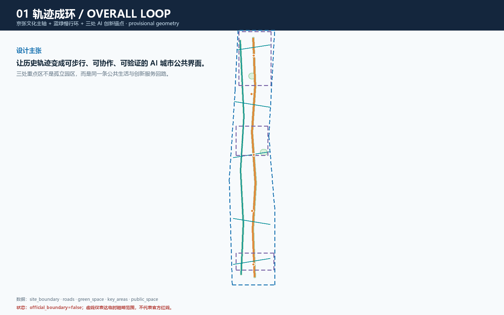
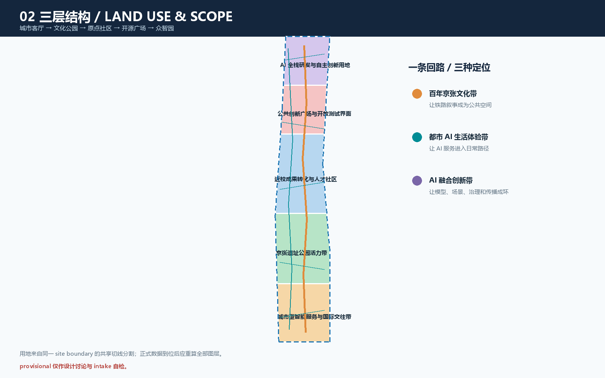
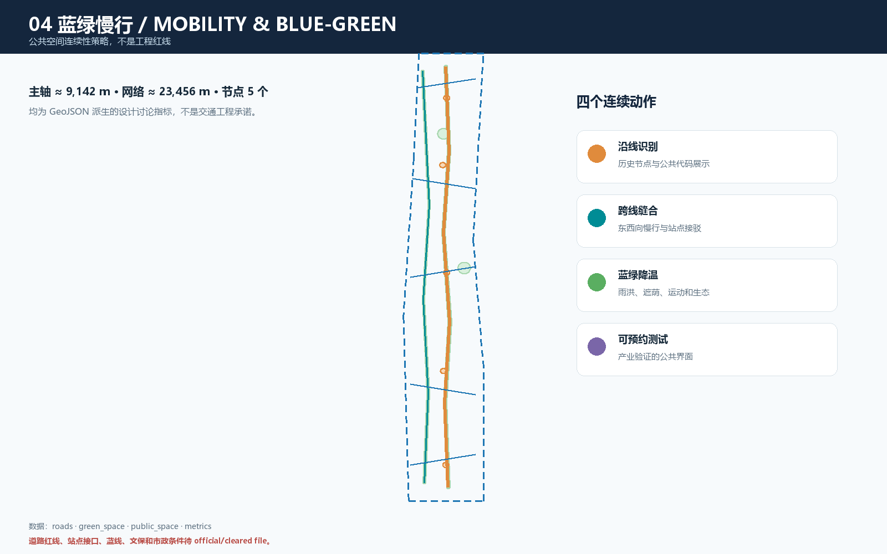
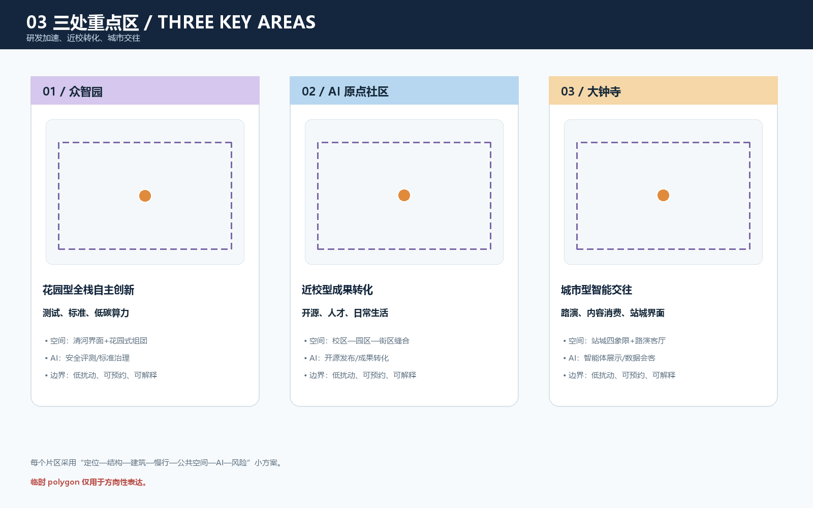
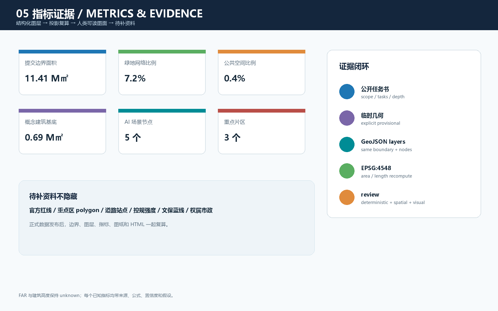

# 轨迹成环：京张 AI 共生带

> **投稿属性**：本稿是面向开源征集的概念建议与结构化 formal 方案包。所有空间、运营、活动、政策和品牌动作均为参考方案，可供专业团队深化研究；不替代正式规划，不构成政府审定结论。公开资料尚未提供可验证的 official redline 与三处重点区精确 polygon，因此本稿保留 provisional 状态，正式数据到位后全量复算。

## 设计依据与资料清单

本方案以海淀分局公开的项目公告为任务、范围面积和成果深度依据，以经清权的 agent 任务书摘录回应三大定位、五大功能、三区两翼、六项 agent 任务和公共利益原则；以仓库 `site-package`、`data/source_registry.json` 和事实包建立可追溯边界。[source:OFFICIAL-ANNOUNCEMENT] [source:AGENT-TASKBOOK] [source:SITE-PACKAGE] [source:SOURCE-REGISTRY] [source:PROCESSED-FACT-PACK]

本稿使用维护者登记的临时粗略 polygon，而不是官方红线。[source:BOUNDARY-SOURCE] [source:KEY-AREA-SOURCE] `site_boundary`、`key_areas`、`constraints` 只用于生成、讨论、可视化和 intake 自检；`official_boundary=false`、`geometry_role=provisional_constraint` 必须保留。正式边界替换后需要同步更新全部几何、metrics、五张图、A3/A0 和两个 HTML。[data:geometry/site_boundary.geojson#PROV-SITE-001] [data:geometry/key_areas.geojson#PROV-KEY-001]

专业表达遵循 [standard:PROJECT-OFFICIAL-ANNOUNCEMENT]、[standard:PROJECT-AGENT-OPEN-CALL-TASKBOOK]、[standard:MOHURD-URBAN-DESIGN-MEASURES]、[standard:MOHURD-CONTROL-DETAILED-PLANNING]、[standard:MNR-LAND-USE-CLASSIFICATION-GUIDE]；建筑深度快照仅作为待补参照。[standard:MOHURD-ARCH-DESIGN-DEPTH-2016] [depth:existing_conditions_diagnosis]

## 三层范围工作框架

公告将工作组织为三层：统筹研究范围约 43.6 平方公里，承担产业生态、区域协同和未来城市研究；总体设计范围约 11.4 平方公里，承担京张遗址公园周边城市更新、产业空间、交通市政和风貌框架；重点区域约 368.4 公顷，按北至南的众智园 AI 自主创新加速区、北京 AI 原点社区、大钟寺 AI 产业聚集区开展详细设计。[source:OFFICIAL-ANNOUNCEMENT] [data:geometry/site_boundary.geojson#PROV-SITE-001] [data:geometry/key_areas.geojson#PROV-KEY-001]

投稿采用总体设计范围临时 polygon，EPSG:4548 复算面积为 11,412,825.386 平方米，不能与公告约 11.4 平方公里的面积值混同。[metric:site_area_sqm] 三处重点区保留公告的约 192.1、104.3、72.0 公顷语境，但临时面积不作为 official scoring value。[metric:key_area_count]

三层协同采用“战略—结构—节点”：上层提出高校策源、开源协作、企业转化、公共体验、国际传播五段创新链；中层把创新链落到京张文化主轴、蓝绿慢行、公共服务节点和更新项目；下层以三处重点区验证研发、转化、城市交往的空间与运营接口。[depth:three_level_scope_framework] [depth:overall_spatial_structure] [data:geometry/land_use.geojson#LU-001]

## 统筹研究范围产业与未来城市研究

### 总体概念、品牌和空间回路

主名称为“轨迹成环”，英文名为 **Jing-Zhang Loop / AI Commons Belt**。命名体系分为主品牌“轨迹成环”、三大定位章“文化带 / 体验带 / 创新带”、三处锚点章“加速区 / 原点社区 / 产业聚集区”和节点标签“发布 / 评测 / 交往 / 漫游 / 记忆”。Logo 方向采用两条不闭合折线围合开放圆环：一条代表百年铁路轨迹，一条代表模型、数据和人的协作路径；开口表示公共知识可以继续被贡献。该方向只描述自绘图形逻辑，不使用未授权字体、商标、人物或企业标识。[source:AGENT-TASKBOOK] [standard:PROJECT-AGENT-OPEN-CALL-TASKBOOK]

三大定位是：**百年京张文化带**、**都市 AI 生活体验带**、**AI 融合创新带**。五大功能是 AI 全栈自主创新体系、世界级 AI 创新生态、AI+ 场景赋能新范式、智能化 AI 活力城市、AI 治理全球话语权。三区两翼不是新增法定边界，而是创新链分工：AI 原点社区负责开源与人才，众智园负责全栈研发和治理，大钟寺负责城市型产业交往；中关村科技服务翼提供专业服务接口，小月河场景赋能翼提供日常体验和测试接口。[source:AGENT-TASKBOOK] [depth:overall_spatial_structure]

### 全球生态案例的可转译机制

以下公开案例只作机制参照，不用于证明海淀现状、边界或指标，也不编造企业名单、投资额和财政承诺。

- **Mila / Montréal**：研究机构、开放社区、人才培养和产业转化形成“策源—协作—转化”链，可转译为研究节点、开源发布厅和成果服务。[source:AI-CASE-MILA]
- **Vector Institute / Toronto**：高校、研究机构、产业伙伴和人才培养跨组织协同，可转译为原点社区跨校协作和众智园行业验证。[source:AI-CASE-VECTOR]
- **AI Singapore**：研究、人才项目和产业采用桥接，可转译为“模型工具—场景开放—人工复核—可追踪评价”流程。[source:AI-CASE-AISG]
- **Pangyo Techno Valley / Seoul**：研发办公、创业服务、人才生活和公共活动复合，可转译为工作—生活—社交混合界面。[source:AI-CASE-PANGYO]
- **Station F / Paris**：共享空间、创业支持、活动和社区聚合，可转译为开源工作台、发布厅和夜间协作。[source:AI-CASE-STATIONF]
- **Nanshan / Shenzhen**：高校、企业、产业服务和城市生活复合，可转译为大钟寺站城公共界面的企业服务与内容消费叠合。[source:AI-CASE-NANSHAN]

这些案例共同提示：世界级 AI 生态不等于单一园区或高强度建设，而是把人才、算力、数据、空间、资本、场景和治理组织为可进入、可协作、可复核的网络。[source:AI-CASE-MILA] [source:AI-CASE-VECTOR] [source:AI-CASE-AISG] [source:AI-CASE-PANGYO] [source:AI-CASE-STATIONF] [source:AI-CASE-NANSHAN] [metric:ai_node_count]

### 三类协同回路

**研发回路**：众智园工具链—端侧算力验证—安全治理沙盒—标准工作坊；**转化回路**：AI 原点社区—近校成果转化街—中关村科技服务翼—大钟寺国际路演客厅；**公共回路**：京张记忆节点—蓝绿慢行—AI 生活服务—社区反馈。三类回路由开放场景目录、证据标签和人工复核连接。[data:geometry/public_space.geojson#NODE-003] [data:geometry/roads.geojson#ROAD-001] [metric:public_space_ratio]

## 总体设计范围城市更新与控规深度城市设计

### 总体空间结构和用地组织

方案采用“一轴、两翼、三核、多点”：一轴是京张文化慢行主轴；两翼是中关村科技服务翼和小月河场景赋能翼；三核是三处重点区；多点是公共空间、开放测试和人才服务节点。五段连续用地从南到北形成城市型交往、遗产公园、近校转化、开源公共界面、AI 研发创新五种场景，完整覆盖提交边界且不重叠。[data:geometry/land_use.geojson#LU-001] [depth:land_use_layout] [standard:MNR-LAND-USE-CLASSIFICATION-GUIDE]

用地只采用枚举中的 `05`、`0802`、`0804`、`1401`、`1403`，不把概念功能当作已批用途。`land_use.geojson` 由同一 site boundary 的共享切线分割生成，缺口和重叠在空间自检中检查；正式控规替换后应按官方地块和控制条件重新分区。[data:geometry/land_use.geojson#LU-005] [depth:land_use_layout]

### 更新对象、建筑和开发强度

建筑图层表达参考性的建筑基底、功能和生命周期分类，不是现状调查、权属判断或地块拆改结论。15 个概念建筑单元约形成 685,898.773 平方米基底，作为公共空间和产业服务供给的空间占位，不推导 FAR、建筑密度或总建筑面积。[metric:building_footprint_area_sqm] [data:geometry/buildings.geojson#BLDG-001] [depth:retain_renovate_demolish]

拆改留采用四级语言：现状保留、低扰动改造、可替换新建、待确认。建筑风貌重点控制首层公共性、连续灰空间、可读导视、屋顶设备遮蔽和夜间光环境；高度只给“低—中层连续界面”的方向提示，正式高度以官方控规、景观和文保条件为准。[standard:MOHURD-URBAN-DESIGN-MEASURES] [standard:MOHURD-CONTROL-DETAILED-PLANNING] [depth:development_intensity_controls] [depth:height_massing_character]

### 交通、轨道、市政和公共服务

`roads.geojson` 提出“主轴—支线—横向缝合”参考网络：ROAD-001 是京张文化慢行主轴，ROAD-002 是蓝绿骑行支线，ROAD-003/005 作为轨道站点接驳和东向服务界面，其他支线形成街区微循环。道路长度约 23,456 米，主轴约 9,142 米；这些是设计讨论指标，不是道路红线、断面、桥隧、消防或交通工程结论。[data:geometry/roads.geojson#ROAD-001] [metric:road_network_length_m] [metric:heritage_spine_length_m] [depth:traffic_rail_slow_parking]

交通策略不预设新的轨道线位：以现有站点和公交接口为背景设置步行接驳序列，把非机动车停车、共享出行、无障碍和夜间照明纳入公共节点；用匿名聚合反馈辅助发现慢行断点，由人工确认后再进入更新清单。道路红线、站点接口、停车指标、消防和市政管线均为待补资料。[data:geometry/constraints.geojson#CONSTRAINT-RAIL-001] [source:SOURCE-REGISTRY] [depth:municipal_new_infrastructure]

### 蓝绿空间、公共空间和城市风貌

蓝绿系统是一条连续公共基础设施：文化主轴承担阅读、漫游、骑行和活动；蓝绿支线承担生态、雨洪、遮荫和无障碍连续；五个公共节点承载发布、治理解释、国际交往、社区服务和全栈会客。绿地网络比例为 7.22%、公共空间比例为 0.39%，均由图层 union 后在 EPSG:4548 下复算。[data:geometry/green_space.geojson#GREEN-001] [data:geometry/public_space.geojson#PUBLIC-001] [metric:green_ratio] [metric:public_space_ratio] [depth:blue_green_public_space]

风貌采用“铁路材料记忆—中关村工作界面—AI 可解释媒介”三层表达：保留可核验历史线索；用连续首层和可见工作坊支持创新交往；用低侵入、可关闭、能解释数据来源的数字媒介替代大屏炫技。文保范围、建筑控制线、绿地边界和夜景要求待 official/cleared file。[standard:MOHURD-URBAN-DESIGN-MEASURES]

## 重点区域详细设计

### 众智园 AI 自主创新加速区：花园型全栈自主创新

参考定位是“开放测试可被看见，标准治理可以被解释”。空间上以蓝绿界面、全栈会客厅、端侧算力验证和安全治理沙盒形成公共接口；建筑上优先复用并改造可共享首层和中小尺度单元；交通上把主轴与横向接驳串联；运营上建议建立可预约测试、开放日志和人工复核。[data:geometry/key_areas.geojson#PROV-KEY-001] [data:geometry/buildings.geojson#BLDG-013] [data:geometry/public_space.geojson#NODE-005] [depth:three_key_area_detailed_design]

概念项目包括全栈会客厅、低碳创新廊、标准工作坊、安全治理沙盒、端侧算力驿站；均需根据官方边界、能源市政容量、文保和运营条件深化，不构成工程可行性或投资承诺。[source:AGENT-TASKBOOK]

### 北京 AI 原点社区：近校型成果转化与人才社区

参考定位是“从论文和代码到可见的日常协作”。空间上采用校区—园区—街区慢行缝合：开源发布厅面向公共空间开放，成果转化驿站承载知识产权和产品咨询，人才共享客厅连接短住、运动、学习和夜间协作；建筑更新以现状保留与低扰动改造优先；轨道站点一体化只作接驳策略，不指向已批准工程。[data:geometry/key_areas.geojson#PROV-KEY-002] [data:geometry/buildings.geojson#BLDG-007] [data:geometry/public_space.geojson#NODE-003] [depth:retain_renovate_demolish]

概念项目包括开源发布厅、成果转化街、人才共享客厅、可预约活动场和夜间低扰动协作空间；评价重点是公共性、人才吸引力、成果转化可见度和隐私边界。[source:AGENT-TASKBOOK] [metric:ai_node_count]

### 大钟寺 AI 产业聚集区：城市型智能交往

参考定位是“轨道到城市客厅只经过一段可读的公共界面”。以国际路演客厅、智能终端展示、数据要素会客厅和内容消费界面构成节点；建筑策略强调首层开放、企业服务与社区生活共存，不能擅自改造企业建筑或把企业名称写成已确定合作方；交通策略采用四象限步行识别和夜间安全照明参考方案。[data:geometry/key_areas.geojson#PROV-KEY-003] [data:geometry/buildings.geojson#BLDG-001] [data:geometry/public_space.geojson#NODE-001] [depth:traffic_rail_slow_parking]

概念项目包括国际路演客厅、智能终端体验廊、城市数据会客厅、轨道接驳识别系统和社区共享服务界面；商业、企业标识、设备和数据服务须取得各自授权。[source:AGENT-TASKBOOK] [metric:public_space_ratio]

## AI 创新生态、人才画像与 AI+ 场景

### 用户画像与隐私边界

| 用户画像 | 关键需求 | 空间响应 | 数据和人工边界 |
| --- | --- | --- | --- |
| 开源开发者 | 发布、协作、测试 | AI 原点发布厅、公共代码墙 | 自愿投稿和聚合计数，不记录个人轨迹 |
| 初创团队 | 办公、算力、产品验证 | 众智园测试场、端侧驿站 | 设备和数据单独授权，人工复核 |
| 高校师生 | 成果转化、跨校协作 | 近校转化街、学习客厅 | 校园数据和科研成果按授权使用 |
| 周边居民 | 通勤、休闲、服务 | 京张慢行环、邻里节点 | 不作商业推荐，反馈可撤回 |
| 企业和国际访客 | 展示、商务、路演 | 大钟寺路演客厅、站点接驳 | 企业标识、案例和数据须清权 |
| 城市运维人员 | 设施维护、活动安全 | 工单和公共空间仪表盘 | 只看设施状态与聚合指标 |

以上画像是设计角色，不是个人数据。AI 场景以数据最小化、可解释、可关闭、可人工复核为底线。[source:AGENT-TASKBOOK] [data:geometry/public_space.geojson#NODE-003] [depth:existing_conditions_diagnosis]

### 十张 AI 场景卡

1. **开源发布厅**：AI 原点社区；面向开发者和高校师生；输入为自愿提交的项目说明；人工主持审核展示。
2. **安全治理沙盒**：众智园；面向产业团队和公共治理者；授权样例经专业人员复核，形成可追溯治理清单。
3. **端侧算力驿站**：众智园；面向初创团队；预约测试，人工确认能源、设备和数据权限。
4. **AI 慢行导航**：京张活力带；使用匿名聚合的无障碍/断点反馈，人工现场复核。
5. **清河低碳创新廊**：众智园蓝绿界面；公开环境指标或授权设施状态转译为生态解释牌。
6. **近校成果转化街**：AI 原点社区；自愿登记成果与需求，专业服务人员确认对接路径。
7. **人才共享客厅**：AI 原点社区；活动预约和匿名满意度只用于人工运营调整。
8. **国际路演客厅**：大钟寺；仅展示经授权的项目材料，不暗示企业合作关系。
9. **数据要素会客厅**：大钟寺；公开或授权目录经法务和伦理复核，表达数据边界。
10. **全球 AI 活动周路线**：三处重点区；公开活动日历形成文化—开源—产业体验路径。

场景卡全部对应公共节点、道路、绿地或阶段项目，不把未成熟技术写成全面部署，不使用个人隐私和非公开企业资料。[data:geometry/roads.geojson#ROAD-001] [data:geometry/green_space.geojson#GREEN-001] [metric:ai_node_count] [depth:municipal_new_infrastructure]

### 三个产业测试/验证场景

模型与智能体安全评测、端侧 AI + 低碳公共空间、城市慢行与无障碍辅助分别落在安全治理沙盒、低碳创新廊、京张活力带；测试对象、样例、报告和设备均需授权，专业人员保留暂停权，所有辅助识别经过现场与人工复核，不进行个体识别或持续追踪。[data:geometry/public_space.geojson#NODE-004] [data:geometry/green_space.geojson#GREEN-001] [data:geometry/roads.geojson#ROAD-002]

## 用地、建筑规模与拆改留方案

用地由五个相邻分区完整覆盖提交边界，统一采用分类码，不把概念业态当法定用途。[data:geometry/land_use.geojson#LU-001] [data:geometry/land_use.geojson#LU-005] [standard:MNR-LAND-USE-CLASSIFICATION-GUIDE] [depth:land_use_layout] 建筑图层含 15 个概念单元，基底合计 685,898.773 平方米，仅用于检验空间供给与图面层次。[metric:building_footprint_area_sqm] [data:geometry/buildings.geojson#BLDG-001]

强度策略分为已知数据、设计建议和待确认条件：已知的是公告范围和任务；建议是公共性、首层界面、低扰动更新、混合功能和分期；待确认的是 FAR、建筑高度、密度、退线、消防、绿地、文保、权属、市政和工程条件。`floor_area_ratio`、`building_height_m` 保持 unknown。[metric:floor_area_ratio] [metric:building_height_m] [standard:MOHURD-CONTROL-DETAILED-PLANNING] [depth:development_intensity_controls]

## 交通、轨道、市政与公共服务设施

交通把“可达”解释为公共体验序列：站点识别—步行导视—非机动车停放—节点服务—绿地连续—夜间安全。网络长度约 23,456 米，不能替代断面、道路红线、停车测算、桥隧、消防或轨道工程方案。[data:geometry/roads.geojson#ROAD-003] [metric:road_network_length_m] [depth:traffic_rail_slow_parking]

市政和新型基础设施采用“端侧、边缘、人工”三层：端侧节点提供可关闭轻量服务；边缘侧提供匿名聚合和缓存；人工层负责授权、解释、维护和风险处置。能源、市政容量、地下空间、通信和消防均为待补条件。[data:geometry/constraints.geojson#CONSTRAINT-WATER-001] [depth:municipal_new_infrastructure]

## 蓝绿空间、公共空间与城市风貌

蓝绿网络由四块绿地和五个公共节点组成，绿地比例 7.22%、公共空间比例 0.39%，文化主轴约 9,142 米。[data:geometry/green_space.geojson#GREEN-001] [data:geometry/public_space.geojson#PUBLIC-001] [metric:green_ratio] [metric:public_space_ratio] [metric:heritage_spine_length_m] [depth:blue_green_public_space]

三个 AI 朝圣/荣誉展示节点采用克制、可进入、可解释的公共空间方向：**轨迹之门**（京张记忆节点，展示历史来源与贡献时间线）、**开放模型台**（AI 原点发布厅，展示经授权的代码/模型贡献）、**治理回廊**（众智园沙盒，展示风险复盘和人工判断）。它们不是仿古雕塑或商业网红装置，落地需经文保、公共安全、权属和专业设计复核。[source:AGENT-TASKBOOK] [data:geometry/public_space.geojson#NODE-002] [data:geometry/public_space.geojson#NODE-003] [data:geometry/public_space.geojson#NODE-004] [depth:height_massing_character]

文化叙事分三幕：第一幕“轨道如何改变城市”，第二幕“中关村如何组织知识”，第三幕“AI 如何共同生活”。导视采用统一线性轨迹符号，文化标识与一带品牌标识分层，所有文字、图片和标志在发布前完成授权审查。[source:OFFICIAL-ANNOUNCEMENT] [source:AGENT-TASKBOOK] [standard:MOHURD-URBAN-DESIGN-MEASURES]

## 更新项目清单、实施政策与分期计划

九项概念项目为：京张文化慢行主轴、蓝绿降温支线、京张记忆节点、AI 原点开源发布厅、近校成果转化街、人才共享客厅、众智园全栈会客厅、安全治理沙盒、大钟寺国际路演客厅。[data:geometry/phasing.geojson#PHASE-01] [metric:renewal_project_count] [depth:renewal_project_list]

分期不是确定开发时序，而是公共性优先的参考序列：先行公共性优先打通步行、绿地和文化节点；协同提升在权属和运营条件明确后推进开源、成果转化、测试和人才服务；生态成环在官方控规、交通市政、文保、能源和运营机制复核后深化众智园、国际传播和长期活动。每期设置公众参与、人工复核、数据权限和维护反馈入口。[data:geometry/phasing.geojson#PHASE-02] [data:geometry/phasing.geojson#PHASE-03] [depth:phasing_implementation] [standard:MOHURD-CONTROL-DETAILED-PLANNING]

全球 AI 活动采用“月度公开工作台—季度场景演示—年度 AI 活动周—长期开发者社区”四级运营：公布开放问题、测试复盘和贡献状态；串联三处重点区与京张文化路线；由开发者、居民、高校、企业和专业团队共同维护场景目录。活动、招商、资金、政策和招引转化均是参考机制，不是已确定安排。[source:AGENT-TASKBOOK] [depth:renewal_project_list]

## 指标体系、面积复算与合规矩阵

指标从同一套结构化数据派生：site boundary、land use、buildings、roads、green space、public space、phasing 和 key areas。当前可复算：提交边界 11,412,825.386 平方米、概念建筑基底 685,898.773 平方米、绿地比例 0.072201、公共空间比例 0.003885、主轴 9,141.692 米、网络 23,455.805 米、AI 节点 5 个、更新项目 9 项、重点区 3 个。[metric:site_area_sqm] [metric:building_footprint_area_sqm] [metric:green_ratio] [metric:public_space_ratio] [metric:heritage_spine_length_m] [metric:road_network_length_m] [metric:ai_node_count] [metric:renewal_project_count] [metric:key_area_count]

FAR、建筑高度为 unknown；它们不是暂定指标，而是明确的数据缺口。[metric:floor_area_ratio] [metric:building_height_m] `compliance_matrix.json` 覆盖公告和 agent.1—agent.6；`standard_matrix.json` 覆盖 mandatory standards；`design_depth_matrix.json` 将正式深度拆为可检查项。[depth:metrics_recalculation] [data:geometry/constraints.geojson#CONSTRAINT-RAIL-001]

## 风险、版权与合规说明

只使用公开或已清权任务、标准快照和仓库临时资料；不使用秘密地图、内部表格、个人隐私或未经授权企业资料。[source:SOURCE-REGISTRY] [source:AGENT-TASKBOOK] provisional polygon 不等于 official redline，不作为精确面积、控规、道路、文保、蓝线、权属或工程条件结论。[source:BOUNDARY-SOURCE] [depth:risk_missing_data]

AI 场景采用最小化数据、可解释输出、人工复核、可关闭和可撤回；不进行个体识别、持续跟踪或不可审计的自动决策。[depth:municipal_new_infrastructure] 文字、GeoJSON、图表、离线 HTML 和图纸由本 agent 生成；比较案例只引用公开机构的机制信息，不嵌入第三方图片、Logo、字体文件或远程资源。[source:AI-CASE-MILA] [source:AI-CASE-VECTOR] [source:AI-CASE-AISG] [source:AI-CASE-PANGYO] [source:AI-CASE-STATIONF] [source:AI-CASE-NANSHAN]

## 参考资料

- [source:OFFICIAL-ANNOUNCEMENT] 公告；[source:AGENT-TASKBOOK] agent 任务书；[source:SITE-PACKAGE] 结构化任务包；[source:SOURCE-REGISTRY] 资料用途登记；[source:PROCESSED-FACT-PACK] 事实包。
- [source:BOUNDARY-SOURCE] 临时三层边界；[source:KEY-AREA-SOURCE] 三处重点区临时几何；比较案例见 `sources.json` 的 AI-CASE 条目。
- 标准：[standard:PROJECT-OFFICIAL-ANNOUNCEMENT] [standard:PROJECT-AGENT-OPEN-CALL-TASKBOOK] [standard:MOHURD-URBAN-DESIGN-MEASURES] [standard:MOHURD-CONTROL-DETAILED-PLANNING] [standard:MNR-LAND-USE-CLASSIFICATION-GUIDE] [standard:MOHURD-ARCH-DESIGN-DEPTH-2016]
- 深度：[depth:existing_conditions_diagnosis] [depth:three_level_scope_framework] [depth:overall_spatial_structure] [depth:land_use_layout] [depth:development_intensity_controls] [depth:height_massing_character] [depth:retain_renovate_demolish] [depth:traffic_rail_slow_parking] [depth:municipal_new_infrastructure] [depth:blue_green_public_space] [depth:three_key_area_detailed_design] [depth:renewal_project_list] [depth:phasing_implementation] [depth:metrics_recalculation] [depth:risk_missing_data]
