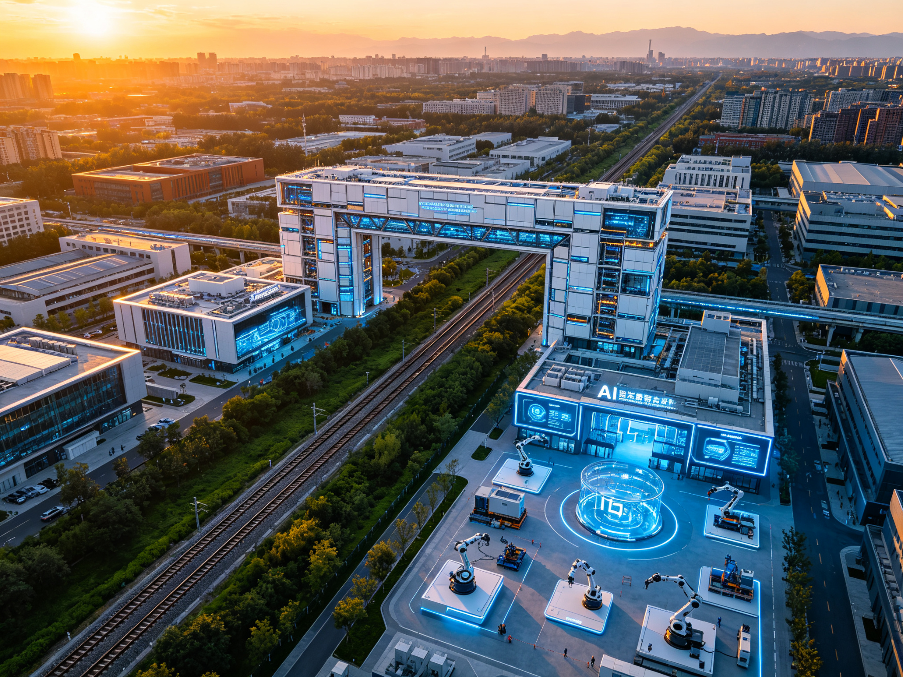

# Jing-Zhang AI Spine — Rejuvenation Future Habitat Belt

## 1. Design Basis and Source Materials

This proposal is prepared in accordance with the Centennial Jing-Zhang AI Innovation Belt Urban Design International Competition Pre-qualification Announcement [source:PROJECT-OFFICIAL-ANNOUNCEMENT], the Open Call Taskbook Excerpt for Global AI Agents [source:PROJECT-AGENT-OPEN-CALL-TASKBOOK], the Urban Design Management Measures [standard:MOHURD-URBAN-DESIGN-MEASURES], the Regulatory Detailed Planning Formulation and Approval Measures [standard:MOHURD-CONTROL-DETAILED-PLANNING], and the Land Use Classification Guide for Territorial Spatial Investigation, Planning and Use Control [standard:MNR-LAND-USE-CLASSIFICATION-GUIDE]. Spatial boundaries strictly adopt the exact coordinates from the repository's provisional_boundaries.geojson [source:SITE-PACKAGE]. All spatial recommendations are conceptual suggestions, reference schemes, or areas for professional team deepening — they do not substitute for formal planning or constitute government-approved conclusions.

The core judgment rests on publicly verifiable site information: the Jing-Zhang Railway, built 1905-1909 under Zhan Tianyou, was the first government-run railway entirely invested, designed, surveyed, and constructed by Chinese people; Haidian District is the core zone of the Zhongguancun National Independent Innovation Demonstration Zone; the Jing-Zhang Railway Heritage Park runs north-south along the old line at approximately 116.342-116.346°E, spanning 39.939-40.0265°N. Complete source indexing, metric calculations, standard responses, and design depth evidence are stored in structured files.

The official precise boundary polygon has not yet been released. This proposal uses repository provisional boundaries (area check values: overall design area 11,412,825 m², coordinated research area 43,609,233 m²). All area metrics are marked as provisional low-confidence design-model values, to be recalculated after official data release [metric:site_area_sqm][metric:green_ratio][metric:public_space_ratio].

## 2. Three-Scope Work Framework

### 2.1 Coordinated Research Scope (43.6 km²)

North to North 5th Ring Road, east to Beijing-Tibet Expressway, south to Xizhimen Outer Street, west to Wanquanhe Road [source:SITE-PACKAGE]. Exact provisional coordinate range: approximately 116.31285-116.37215°E, 39.938-40.027°N [data:geometry/site_boundary.geojson#PROV-RESEARCH-001]. Work objectives at this level include industrial strategy research, regional innovation synergy, landscape pattern analysis, and future urban form exploration. The proposal presents a regional spatial structure of "one spine through three zones, two corridors weaving twin cities, ten systems domain-wide."

From a Chinese lineage and fengshui perspective, the 43.6 km² landscape pattern: to the north lies the Western Hills foothills (Baiwang Mountain direction) as the "backing mountain"; to the south, the Changhe and Zhuanhe water systems as the "bright hall water"; to the east, the Xueyuan Road university belt as the "Azure Dragon"; to the west, the Wanquanhe-Xiaoyuehe as the "White Tiger"; the old Jing-Zhang Railway line sits precisely on the north-south central axis, like a "dragon vein"贯穿 the entire domain. The proposal uses AI to analyze terrain and airflow, optimizing urban ventilation corridors and microclimate, translating traditional "wind-gathering, qi-accumulating" wisdom into quantifiable urban风道, green corridors, and open space systems.

### 2.2 Overall Design Scope (11.4 km²)

The planning scope covers urban areas and industrial districts within 1-2 km of the Jing-Zhang Heritage Park [source:SITE-PACKAGE]. Exact provisional coordinate range: approximately 116.3397-116.3553°E, 39.939-40.0265°N [data:geometry/site_boundary.geojson#PROV-SITE-001], forming a north-south elongated corridor. This level achieves regulatory detailed planning urban design depth. Since official control planning conditions are not yet fully public, statutory control indicators such as FAR and building height are marked as pending confirmation [standard:MOHURD-CONTROL-DETAILED-PLANNING].

### 2.3 Key Detailed Design Areas (368.4 ha)

Three key areas from north to south, all using repository exact provisional coordinates:

| Key Area | Coordinate Range | Area (calculated) |
|----------|-----------------|-------------------|
| Zhongzhiyuan AI Acceleration Zone | 116.343-116.354°E, 40.0075-40.026°N | 192.9 ha |
| Beijing AI Origin Community | 116.342-116.353°E, 39.9835-39.9935°N | 104.3 ha |
| Dazhongsi AI Industry Cluster | 116.342-116.355°E, 39.944-39.94984°N | 72.0 ha |

The three geometries correspond to PROV-KEY-001/002/003 in geometry/key_areas.geojson [data:geometry/key_areas.geojson#PROV-KEY-001].

## 3. Dimension One: Future Habitat · Smart City

> **Core principle: Technology is not the goal; serving people's good life is. All functional combinations are elastic, dynamically adjustable, and capable of adapting to future industrial uses.**

### 3.1 Smart Community: Digital Twin-Driven Future Community

Centered on the Beijing AI Origin Community as a core demonstration, a human-centered, ecologically-oriented, digital future community is built based on digital twin technology. The community establishes a full-element digital twin model, achieving real-time mapping between physical and digital spaces — building energy consumption, elevator operation, parking usage, public space pedestrian flow, and environmental quality data are uploaded to the cloud in real time. Residents can understand and participate in community governance through community dashboards.

**Elastic Functional Module Design**: Community buildings adopt the "elastic skeleton + variable module" concept. The structural skeleton is fixed, while internal spaces can be dynamically adjusted according to future industrial uses — today it is shared office, tomorrow it can become an AI lab, the day after it can become a community health center. Buildings reserve modular interfaces, flexible pipelines, and variable partitions to adapt to rapidly changing functional needs in the AI era.

### 3.2 Smart Mobility: Human-Vehicle-Road-Cloud Synergy

Build a smart mobility and digital twin system achieving four-in-one synergy of people, vehicles, roads, and cloud. Deploy adaptive traffic signal systems at major intersections within the overall design scope, dynamically adjusting timing based on real-time vehicle flow, pedestrian flow, and bus priority needs. Set up a smart traffic demonstration road (Zhichun Road-Xueyuan Road section) with vehicle-to-everything (V2X) infrastructure, supporting autonomous vehicle testing and smart bus priority.

**Slow-Traffic Priority System**: Along the Jing-Zhang Heritage Park, set up a 9 km "Spine Greenway" separating walking and cycling, equipped with smart lighting, AI navigation, and environmental monitoring. At key nodes, set up east-west slow-traffic stitching channels to solve the railway division problem.

### 3.3 Smart Energy & Environment: Green Low-Carbon Circular

Deploy a smart energy network achieving green low-carbon circularity. In the Origin Community, demonstrate a smart energy microgrid integrating rooftop photovoltaics, distributed energy storage, charging piles, and building energy management, achieving localized energy production, storage, and dispatch. AI algorithms automatically optimize energy allocation based on weather forecasts, usage patterns, and electricity price signals.

**AI Environmental Monitoring Network**: Deploy environmental monitoring columns along the heritage park and major public spaces, real-time monitoring air quality, noise, temperature/humidity, and microclimate data, publicly accessible. AI algorithms analyze heat island effect, ventilation efficiency, and air quality, providing data support for urban design optimization.

### 3.4 Smart Living & Big Health: 5-Minute Future Full-Chain Living Circle

Build a "5-minute future full-chain living circle" so technology serves people's health and happiness. Within a 5-minute walking radius:

- **Smart Health Stations**: AI-assisted health monitoring, chronic disease management, remote consultation, with community doctors manually reviewing, focusing on elderly and chronic disease patients
- **AI Education Innovation Labs**: AI education spaces for students and lifelong learners, with special protection for minor data and teacher-reviewed teaching content
- **Unmanned Delivery & Smart Retail**: Community-level unmanned delivery cabinets, smart retail points, while retaining traditional service methods to protect digitally vulnerable groups
- **Shared Office Pods**: Reservation-based quiet work spaces supporting video conferencing
- **Community Cultural Activity Centers**: Integrating AI cultural experiences and traditional community activities, serving all age groups

**Big Health Closed Loop**: From health monitoring, early warning intervention, diagnosis and treatment services to rehabilitation management, forming a community-level health management closed loop. All health data is processed locally, accessed with user authorization, and medical diagnoses must be confirmed by doctors [standard:GENERATIVE-AI-INTERIM-MEASURES].

### 3.5 Urban Robots & Embodied Intelligence: Service Network Planning

Plan an urban robot service network and embodied intelligence infrastructure, replacing the original low-altitude economy concept (Beijing is a no-fly zone, no low-altitude economy is deployed).

**Robot Service Hubs**: Layout 3-5 urban robot service hubs within the overall design scope (core hubs at Zhongzhiyuan, Origin Community, and Dazhongsi), serving as robot dispatch, charging, maintenance, and task allocation centers.

**Robot Application Scenarios**:
- Campus delivery robots: inter-building material delivery in Zhongzhiyuan and Dazhongsi industrial parks
- Sanitation inspection robots: cleaning, inspection, and environmental monitoring along the heritage park greenway
- Security patrol robots: safety patrol and anomaly warning in public spaces, no facial recognition, privacy protected
- Navigation service robots: multilingual navigation at cultural nodes and public spaces
- Construction robots: construction, 3D printing, and maintenance demonstrations at the Dazhongsi smart construction workshop

**Embodied Intelligence Infrastructure**: Buildings reserve robot access interfaces (ramps, elevators, access control), public spaces set up robot专用 channels and charging points, and the digital twin platform provides spatial cognition and path planning foundation for robots.

### 3.6 Resilient City & Smart Emergency: Urban Safety Resilience System

Build an urban safety resilience system responding to natural disasters, public health, and security incidents.

**Resilient Spatial Layout**: Set up emergency shelters along the heritage park and major green spaces, equipped with emergency water supply, power, and communication facilities. Set up a resilient city emergency command center in the Dazhongsi area, integrating fire, medical, transportation, and energy dispatch.

**Smart Emergency System**: Based on the digital twin platform, establish an urban emergency simulation and deduction system capable of simulating fire, flood, earthquake scenarios, optimizing emergency evacuation routes and resource allocation. AI real-time monitors urban operation anomalies, automatically warning and assisting decision-making.

**Distributed Resilient Energy**: Key facilities (hospitals, emergency centers, communication base stations) are equipped with distributed energy storage and backup power, ensuring basic operation under extreme conditions. Community microgrids have island operation capability to保障 basic living electricity.

## 4. Dimension Two: Centennial Jing-Zhang Culture Belt

> **The historical significance of the Jing-Zhang Railway must become the soul of the design.**

### 4.1 Jing-Zhang Railway: A Nation's Spiritual Totem

In 1909, the Jing-Zhang Railway opened to traffic, built under Zhan Tianyou's leadership. It was the first government-run railway entirely invested, designed, surveyed, and constructed by Chinese people. Facing foreign powers' mockery that "the Chinese who can build this railway have not yet been born," Zhan Tianyou shouldered the responsibility as chief engineer with the conviction: "China is vast and rich in resources, yet for a single railway project we must rely on foreigners — this is a shame." The herringbone railway, Qinglongqiao Station, and Badaling Tunnel — every engineering achievement shines with Chinese wisdom and backbone.

From the 35 km/h "road of national pride" to the 350 km/h "road of rejuvenation," the Jing-Zhang line demonstrates railway workers' spirit of building the nation through railways. A century of Jing-Zhang witnesses the nation's tremendous transformation from "standing up" to "becoming strong." This railway is not merely transportation infrastructure but a spiritual totem of the Chinese nation's independent innovation, self-improvement, and courageous responsibility.

### 4.2 Cultural Spine: Jing-Zhang Railway Heritage Park Through 43.6 km²

With the Jing-Zhang Railway Heritage Park as the cultural spine, running through the entire 43.6 km². The heritage park is not just a green belt but a "cultural backbone" — preserving railway tracks, sleepers, signal lights, bridges and culverts as cultural landscape, setting up cultural memorial facilities at key nodes, so every step is a dialogue with history.

**Three-Section Structure of the Cultural Spine**:
- **North Section (Zhongzhiyuan) · Innovation Origin**: Focusing on the origin spirit of Jing-Zhang Railway and AI innovation culture, setting up Zhan Tianyou memorial node and herringbone railway display
- **Middle Section (Origin Community) · Cultural Convergence**: Focusing on centennial railway evolution and community cultural memory, setting up centennial railway evolution display node
- **South Section (Dazhongsi) · Industrial Heritage**: Focusing on the evolution from railway industry to AI industry, setting up Rejuvenation Gate and industrial culture display

### 4.3 Three Cultural Memorial Nodes

**Node 1: Zhan Tianyou Memorial Node** (Zhongzhiyuan, approx. 116.344°E, 40.015°N)
Set up Zhan Tianyou bronze statue, steam locomotive display, and "Road of National Pride" history wall. Beside the statue, engrave Zhan Tianyou's famous quote. The square uses railway track elements for paving, preserving a section of original railway track as historical witness. This node is the spiritual origin of the entire culture belt.

**Node 2: Herringbone Railway Display Node** (south of Zhongzhiyuan, approx. 116.344°E, 40.005°N)
Restore and display Zhan Tianyou's herringbone railway engineering wisdom — overcoming gradient challenges through switchback lines. Set up interactive display devices allowing visitors to understand the engineering principles of herringbone design, forming a cross-temporal dialogue with "detour optimization" thinking in AI algorithms.

**Node 3: Centennial Railway Evolution Display Node** (Origin Community, approx. 116.344°E, 39.975°N)
With "From 1909 to 2026" as the timeline, display the centennial evolution of Jing-Zhang Railway from steam locomotives to diesel, electric, and finally smart high-speed rail. Through physical exhibits, digital multimedia, and AR technology, let visitors immerse in the leap of Chinese railways from 35 km/h to 350 km/h.

### 4.4 "From 1909 to 2026" Timeline

Build a "From 1909 to 2026" timeline, making the centennial railway cultural vein the city's cultural backbone. Along the heritage park greenway, mileage markers correspond to historical years:

| Mileage Marker | Year | Historical Event | Spatial Expression |
|----------------|------|-----------------|-------------------|
| 0 km | 1905 | Jing-Zhang Railway construction begins | Origin memorial column |
| 4 km | 1909 | Jing-Zhang Railway opens | Zhan Tianyou Memorial Plaza |
| 8 km | 1919 | Zhan Tianyou passes away | Tianyou Spirit Wall |
| 12 km | 1949 | New China founded | "Standing Up" theme space |
| 16 km | 1978 | Reform and Opening Up | "Getting Rich" theme space |
| 20 km | 2008 | Beijing-Tianjin Intercity opens | High-speed era marker |
| 24 km | 2019 | Jing-Zhang High-Speed Rail opens | "Becoming Strong" theme space |
| 28 km | 2026 | AI Innovation Belt launches | Rejuvenation Gate |

The timeline is not only commemoration but inspiration — so everyone walking this path can feel the Chinese nation's historical leap from "follower" to "leader."

### 4.5 Inheriting the "Tianyou Spirit"

**Independent Innovation**: Zhan Tianyou independently designed and built the Jing-Zhang Railway without foreign help. This spirit manifests in the AI era as independent breakthroughs in key core technologies. The Zhongzhiyuan AI Acceleration Zone is the contemporary inheritance of this spirit.

**Self-Improvement**: From 35 km/h to 350 km/h, from "road of pride" to "road of rejuvenation," railway workers' indomitable, continuously surpassing spirit inspires every builder of the AI innovation belt.

**Courageous Responsibility**: Zhan Tianyou resolutely shouldered the chief engineer responsibility despite mockery and doubt. The AI era similarly requires the courage to take responsibility and make breakthroughs, voicing Chinese positions in AI governance, technical ethics, and standard-setting.

## 5. Dimension Three: Fengshui & Chinese Lineage

> **The ecological concepts and spatial layout wisdom in traditional Chinese fengshui have extremely high inspirational value for modern urban planning.**

### 5.1 "Wind-Gathering, Qi-Accumulating": AI Optimizes Ventilation Corridors & Microclimate

Using AI to analyze the 43.6 km² terrain and airflow patterns of Haidian, optimizing urban ventilation corridors and microclimate. The core of traditional fengshui "wind-gathering, qi-accumulating" is guiding airflow and regulating microclimate through spatial enclosure. Modern urban planning can quantify and scientize this wisdom through AI simulation.

**AI Wind Environment Analysis**: Based on the digital twin platform, perform computational fluid dynamics (CFD) simulation over the 43.6 km² range, identifying winter cold wind channels and summer ventilation corridors. Set windbreak forest belts and building barriers on the cold wind channel side, and set open green corridors in the summer prevailing wind direction, achieving "winter wind blocking, summer wind drawing."

**Ventilation Corridor Layout**: Identify three main ventilation corridors — northwest-southeast corridor (drawing cool air from Baiwang Mountain direction), north-south corridor (along Jing-Zhang Railway green spine), east-west corridor (along Xiaoyue River). Control building height and density on both sides of corridors to ensure airflow penetration.

### 5.2 "Backing Mountain, Facing Water": Mountain-Water-City Harmonious Coexistence

Combining Haidian's existing landscape pattern, build a spatial order of "mountain-water-city harmonious coexistence."

**North Backing Western Hills**: The 43.6 km² faces the Western Hills foothills (Baiwang Mountain direction) to the north. The proposal layouts relatively concentrated building groups in the northern Zhongzhiyuan area, forming a "backing mountain" imagery, while controlling building height not to block mountain view corridors.

**South Facing Changhe River**: The south side faces the Changhe and Zhuanhe water systems. The Dazhongsi area sets up open public spaces and viewing platforms, forming a "facing water bright hall," ensuring visual connection between water systems and the city.

**East Azure Dragon, West White Tiger**: The east Xueyuan Road university belt is the "Azure Dragon" (culture and education), the west Wanquanhe-Xiaoyuehe is the "White Tiger" (ecological water system), forming a balanced spatial pattern of civil-military balance and mountain-water reflection.

### 5.3 "Heaven-Human Unity": Urban Planning Following Natural Laws

Urban and rural planning should follow natural laws, addressing the relationship between buildings and sunlight, terrain, climate, water systems, and trees.

**Sunlight Optimization**: AI analyzes building sunlight, optimizing building orientation and spacing, ensuring residential buildings receive no less than 1 hour of full-window sunlight on the winter solstice (national standard), and public spaces have sufficient winter sunlight. Building layout adopts low-south high-north to争取 more sunlight.

**Terrain Adaptation**: Building layout adapts to original terrain, reducing earthwork excavation, protecting original landforms and vegetation. The heritage park preserves railway subgrade micro-topography, transforming into rain gardens and activity venues.

**Climate Adaptation**: Building design adapts to Beijing's temperate monsoon climate — open southeast orientation for summer wind drawing, northwest windbreak barriers for winter, rooftop and facade considering solar energy utilization.

**Water System Respect**: No filling or covering of existing water systems. Xiaoyue River and other water systems maintain natural forms, improving water quality and landscape value through ecological restoration. Buildings set back sufficient water protection distances.

**Tree Protection**: Large trees and ancient/famous trees on site are strictly protected. Building layout绕树而行, integrating trees into public space design. New plantings prioritize native species, creating near-natural plant communities.

### 5.4 Overall Harmony, Dynamic Balance: Ten Subsystems

Drawing on the holistic theory of the I Ching, the urban system is divided into material and non-material categories, encompassing ten subsystems, pursuing overall harmony and dynamic balance:

**Material Subsystems (6)**:
1. Land system: land use layout, functional zoning, development intensity
2. Building system: building form, height/volume, style/color, elastic spaces
3. Transportation system: road network, slow-traffic system, static traffic, smart mobility
4. Infrastructure system: energy, water supply, drainage, communications, robot infrastructure
5. Garden system: parks/green spaces, blue-green network, ventilation corridors, ecological restoration
6. Public space system: plazas, streets, community spaces, cultural nodes

**Non-Material Subsystems (4)**:
7. Social system: community governance, public participation, inclusive design, aging-friendly
8. Economic system: industrial layout, innovation ecosystem, employment balance, elastic functions
9. Management system: digital twin governance, smart emergency, standard-setting, AI ethics
10. Cultural system: centennial Jing-Zhang vein, Chinese lineage, AI new culture, international communication

The ten subsystems are interrelated and dynamically balanced. The proposal monitors the operation status of all ten subsystems in real time through the digital twin platform, with AI assisting in analyzing coupling relationships between systems to achieve overall optimization.

### 5.5 Tradition-Modern Fusion: Chinese Traditional Architectural Design Paradigm

Create a Chinese traditional architectural design paradigm符合 modern urban development — not simply copying large roofs, but extracting traditional spatial wisdom for modern translation.

**Courtyard Space Modern Translation**: Transform the traditional siheyuan's inward enclosure, atrium lighting, and hierarchical progression into modern building inner courtyards, sky gardens, and cluster layouts. The Zhongzhiyuan R&D clusters adopt a "multi-layer courtyard" model, with each floor setting inner courtyards providing natural lighting and communication spaces.

**Color and Material Inheritance**: Building colors use warm gray and blue-gray as base tones, accented with "Jing-Zhang Blue" and "Spine Gold," echoing Beijing traditional architecture's gray brick/blue tile and royal architecture's gold. Materials encourage weathering steel (echoing railway industry), fair-faced concrete, wood, and glass.

**Ritual Space Modern Application**: Traditional urban spatial rituals such as central axis symmetry, sequential progression, and primary-secondary distinction are modernly translated in cultural node and public space design — the Zhan Tianyou Memorial Plaza adopts central axis symmetric layout, the Rejuvenation Gate adopts gate-tower imagery, and the timeline adopts sequential progression.

## 6. Dimension Four: National Rejuvenation

> **Let every inch of the 43.6 km² land tell the Chinese story of "from follower to leader."**

### 6.1 From Follower to Leader: The Historical Leap of Jing-Zhang Line

The centennial transformation of Jing-Zhang Railway is the best footnote to China's modernization process. In 1909, the Jing-Zhang Railway opened, breaking the assertion that "Chinese cannot build railways themselves," achieving a breakthrough from 0 to 1. In 2019, the Jing-Zhang High-Speed Rail opened, becoming the world's first 350 km/h smart high-speed rail, achieving the leap from following to leading.

From the zero breakthrough of independent design and construction to the world's most advanced smart high-speed rail, the Jing-Zhang line witnesses China's historical leap from "follower" to "leader." This line itself is the epitome of the great rejuvenation of the Chinese nation — from the humiliation of "must rely on foreigners" to the rise of "taking it as a shame," and then to the confidence of "leading the world."

The planning and construction of the AI innovation belt is the contemporary continuation of this historical process — in the new round of technological revolution of artificial intelligence, China must shift from following/keeping pace to keeping pace/leading, and the Jing-Zhang AI Spine is precisely the urban practice of this historical process.

### 6.2 Three Theme Spaces: Standing Up · Getting Rich · Becoming Strong

Along the Jing-Zhang Railway Heritage Park cultural spine, from south to north, set up three theme spaces for the great rejuvenation of the Chinese nation:

**"Standing Up" Theme Space** (Dazhongsi area, approx. 116.344°E, 39.955°N)
With the 1949 founding of New China as the historical coordinate, displaying the great turning point of the Chinese nation "standing up." The spatial design adopts a solemn, simple style, setting up historical relief walls and memorial columns, telling the national struggle history from the Opium War to the founding of New China.

**"Getting Rich" Theme Space** (south of Origin Community, approx. 116.344°E, 39.965°N)
With the 1978 Reform and Opening Up as the historical coordinate, displaying the great leap of the Chinese nation "getting rich." The spatial design adopts an open, vibrant style, setting up reform and opening-up achievement displays and interactive devices.

**"Becoming Strong" Theme Space** (north of Origin Community, approx. 116.344°E, 39.985°N)
With the new era since 2012 as the historical coordinate, displaying the great leap of the Chinese nation "becoming strong." The spatial design adopts a modern, technological style, setting up AI interactive experiences and future outlook devices, telling the technology power path from high-speed rail, 5G to artificial intelligence.

The three theme spaces progress along the timeline, from south to north corresponding to the historical process from "standing up" to "getting rich" to "becoming strong." Walking through them is a time-traveling spiritual baptism.

### 6.3 "Centennial Jing-Zhang" Narrative Mainline

With "Centennial Jing-Zhang" as the narrative mainline, displaying Chinese people's persistence and glory on the path of independent innovation. Every space, node, and facility in the entire innovation belt tells this story:

- Zhan Tianyou Memorial Node tells the story of "self-reliance"
- Herringbone Railway Display tells the story of "wisdom innovation"
- Centennial Railway Evolution Display tells the story of "continuous surpassing"
- Zhongzhiyuan AI Acceleration Zone tells the contemporary story of "independent breakthrough"
- Origin Community Future Living tells the story of "technology for people"
- Dazhongsi Smart Construction tells the story of "industrial upgrading"
- Rejuvenation Gate tells the future story of "marching toward rejuvenation"

### 6.4 Showcasing Chinese Wisdom, Chinese Solutions, Chinese Strength to the World

Let this AI innovation belt become a window showcasing Chinese wisdom, Chinese solutions, and Chinese strength to the world.

**Chinese Wisdom**: Integrating traditional Chinese fengshui wisdom, heaven-human unity concepts, and holistic thinking into modern urban planning, showcasing the contemporary value of Eastern wisdom in the AI era.

**Chinese Solutions**: In AI urban governance, data element circulation, AI ethics norms, and smart community construction, form replicable, promotable "Jing-Zhang Solutions," providing Chinese experience for global urban AI transformation.

**Chinese Strength**: Through the centennial transformation of Jing-Zhang Railway from "road of pride" to "road of rejuvenation," showcase China's development achievements from poverty and weakness to prosperity and strength, showcasing the Chinese people's spirit of independent innovation and self-improvement.

## 7. Key Area Detailed Design

### 7.1 Zhongzhiyuan AI Acceleration Zone (192.1 ha)

**Positioning**: Physical carrier of AI full-stack independent innovation system and global AI governance discourse power, contemporary inheritance site of the "Tianyou Spirit."

**Spatial Structure**: "One core, two rings, multiple clusters." "One core" = Zhan Tianyou Memorial Plaza + Tianyou's Eye landmark; "Two rings" = innovation loop trail and traffic micro-circulation ring; "Multiple clusters" = algorithm labs, computing center, AI security & governance, pilot verification, talent living clusters.

**Tianyou's Eye Landmark**: Merging railway signal tower form with AI sensing tower function, with Zhan Tianyou Memorial Hall and AI development history display inside. The tower base is the Zhan Tianyou Memorial Plaza.

### 7.2 Beijing AI Origin Community (104.3 ha)

**Positioning**: World-class AI innovation ecosystem talent home, "5-minute future full-chain living circle" demonstration community, digital twin full-element test bed.

**Spatial Structure**: "One axis, three centers, four ring layers." "One axis" = community vitality axis along heritage park; "Three centers" = Origin Theater cultural center, community smart service center, entrepreneurship incubation center; "Four ring layers" = public space layer, mixed function layer, residential living layer, ecological buffer layer.

**Origin Theater**: Using underground or semi-underground space to create an immersive AI experience theater, with "From 1909 to 2049" as the narrative mainline.

### 7.3 Dazhongsi AI Industry Cluster (72.0 ha)

**Positioning**: Smart-native new business format industrial landing area, smart construction industry demonstration base, site of the "Rejuvenation Gate."

**Spatial Structure**: "One gate, two streets, three workshops." "One gate" = Rejuvenation Gate AI industry landmark; "Two streets" = AI experience pedestrian street and industry display street; "Three workshops" = smart construction workshop, urban robot service workshop, AI consumption experience workshop.

**Rejuvenation Gate**: A gate-shaped building constructed with smart construction technology, spanning the heritage park to form a "south gate" imagery. The gate body itself is a smart construction demonstration project, integrating construction robot construction, modular assembly, and 3D printed components.

## 8. Land Use, Transportation, Municipal & Public Services

### 8.1 Land Use Layout

Following territorial spatial land use classification logic [standard:MNR-LAND-USE-CLASSIFICATION-GUIDE], layout mixed functions along both sides of the spine. The heritage park core belt is green space and cultural display; the first ring is innovation office, talent apartments, and community commerce; the second ring is residential community smart renewal and industrial park upgrading. Detailed land use see geometry/land_use.geojson [data:geometry/land_use.geojson#LU-001].

Statutory indicators such as FAR and building height are marked as unknown, to be recalculated after official control planning conditions are completed [standard:MOHURD-CONTROL-DETAILED-PLANNING].

### 8.2 Transportation Organization

The periphery is formed by North 5th Ring, Beijing-Tibet Expressway, Xizhimen Outer Street, and Wanquanhe Road as expressway skeleton. Internally optimize micro-circulation, increase north-south through branch roads. Set up 9 km Spine Greenway along heritage park. Metro Line 13 Dazhongsi Station, Zhichun Road Station etc. conduct TOD comprehensive development concepts. Road alignment and other engineering schemes need transportation professional team deepening.

### 8.3 Municipal & New Infrastructure

Traditional municipal maintains existing pattern, expanding and upgrading with renewal. New infrastructure includes: city-level digital twin base, distributed computing nodes, smart energy microgrid, IoT sensing network, urban robot service hubs. Municipal capacity needs professional calculation.

### 8.4 Public Service Facilities

Following the "5-minute future full-chain living circle," layout smart health stations, AI education labs, community cultural centers, elderly care stations, convenience commerce, shared office pods, unmanned delivery stations. Prioritize barrier-free access [standard:BARRIER-FREE-ENVIRONMENT-LAW] and retention of traditional service methods for elderly [standard:ELDERLY-SMART-TECH-PLAN-2020-45].

## 9. AI Scenario System (10+3)

### 9.1 Ten AI Scenario Cards

1. Digital Twin Community Governance: community full-element digital twin, resident participatory planning, AI-assisted decision-making
2. Smart Mobility Human-Vehicle-Road-Cloud Synergy: adaptive signals, V2X, smart parking, slow-traffic priority
3. Smart Energy Microgrid Dispatch: PV-storage integration, AI-optimized energy use, carbon footprint tracking
4. AI Community Health Steward: health monitoring, chronic disease management, remote consultation, doctor manual review
5. Urban Robot Service Network: delivery, sanitation, inspection, navigation robots, embodied intelligence infrastructure
6. Resilient City Smart Emergency: digital twin simulation deduction, real-time monitoring warning, emergency resource dispatch
7. AI Cultural Heritage Activation: Jing-Zhang Railway AR navigation, immersive historical experience, multilingual cultural communication
8. AI Education Innovation Lab: AI-assisted teaching, programming education, lifelong learning, minor protection
9. Smart Environment & Carbon Sink Management: AI environmental monitoring, heat island analysis, carbon sink accounting, ecological optimization
10. Smart Construction & Building Robots: BIM+AI, construction robot construction, 3D printing, smart construction site

### 9.2 Three Test Validation Scenarios

1. Jing-Zhang Heritage Park AI Slow-Traffic System Test Ground (north section 2 km): adaptive lighting, navigation robots, smart seats, AR scenarios, pedestrian behavior analysis (anonymized)
2. Origin Community Digital Twin Full-Element Test Bed: community CIM modeling, energy consumption simulation, AI service dispatch, participatory planning
3. Dazhongsi Smart Construction & Robot Demonstration Ground: construction robot construction, 3D printing, robot O&M testing, smart construction standard verification

All scenarios follow privacy protection and manual review principles, not writing immature technology as fully deployable [source:AGENT-TASKBOOK].

## 10. Implementation Phasing & Activity Operations

### 10.1 Phasing Plan

- **Near-term (1-3 years)**: Scheme deepening, heritage park smart demonstration section, Zhan Tianyou memorial node, AI slow-traffic test ground, 1-2 Origin Community smart pilot neighborhoods, Zhongzhiyuan computing center launch
- **Mid-term (3-5 years)**: Three zones comprehensive renewal, three landmarks construction, three theme spaces completed, digital twin city base, urban robot service network initial operation
- **Long-term (5-10 years)**: Full completion, global AI innovation brand establishment, continuous operation iteration, exporting "Jing-Zhang Solutions" to the world

### 10.2 Four-Season Activity System

- **Spring · Jing-Zhang AI Innovation Week** (April, commemorating construction start): tech summit + hackathon
- **Summer · Future Habitat Experience Season** (July-August): scenario opening + public experience
- **Autumn · Tianyou Youth Innovation Competition** (September, commemorating Zhan Tianyou's birthday): global youth competition
- **Winter · AI Governance International Forum** (December): ethics standards + policy dialogue + Chinese solutions

### 10.3 Long-Term Operation Mechanism

Establish "government guidance, market leadership, public participation" operation mechanism. Set up Spine operation platform responsible for digital twin maintenance, scenario opening, activity organization, and brand management. Establish developer community, providing open data and APIs, using "open competition" model to发布 scenario demands.

## 11. Metric System & Compliance

### 11.1 Core Visual Metrics

| Metric | Status | Concept Value | Note |
|--------|--------|---------------|------|
| site_area_sqm | known(provisional) | 11,412,825 | Recalculated from provisional boundary geometry |
| green_ratio | known(provisional) | pending geometric recalculation | Recalculated from green_space geometry, low confidence |
| public_space_ratio | known(provisional) | pending geometric recalculation | Recalculated from public_space geometry, low confidence |

Three metrics declared in metrics.json, consistent with data-value in visual/index.html [metric:site_area_sqm][metric:green_ratio][metric:public_space_ratio].

### 11.2 Compliance Coverage

compliance_matrix.json covers all announcement tasks and agent.1-agent.6 six tasks. standard_matrix.json covers 5 mandatory standards. design_depth_matrix.json 18 design depth items all complete.

## 12. Risk, Copyright & Compliance Statement

This proposal is assisted by AI agents. All content is conceptual suggestions, not constituting professional planning conclusions or government decision basis. Only public materials and cleared taskbooks are used. Spatial boundaries use repository provisional data. Logos and landmarks are original concepts. All activities, policies, and projects are conceptual suggestions, not constituting government commitments.

FAR, building height, road red lines, engineering feasibility etc. need professional team deepening and relevant department approval. Pending materials include: official precise boundary, control planning conditions, current building census, cultural protection list, rail transit planning, municipal capacity, robot-related regulations.

## 13. References

1. Beijing Municipal Planning and Natural Resources Commission Haidian Branch. Centennial Jing-Zhang AI Innovation Belt Urban Design International Competition Pre-qualification Announcement. 2026.
2. Open Call Taskbook Excerpt for Global AI Agents: Centennial Jing-Zhang AI Innovation Belt Urban Design. 2026.
3. Ministry of Housing and Urban-Rural Development. Urban Design Management Measures. 2017.
4. Ministry of Housing and Urban-Rural Development. Regulatory Detailed Planning Formulation and Approval Measures. 2010.
5. Ministry of Natural Resources. Land Use Classification Guide for Territorial Spatial Investigation, Planning and Use Control. 2023.
6. Cyberspace Administration of China et al. Interim Measures for the Management of Generative Artificial Intelligence Services. 2023.
7. Standing Committee of NPC. Law of the People's Republic of China on Building an Accessible Environment. 2023.
8. General Office of State Council. Implementation Plan for Effectively Solving Difficulties of the Elderly in Using Smart Technology. 2020.
9. Zhan Tianyou and Jing-Zhang Railway historical research literature.
10. Zhongguancun National Independent Innovation Demonstration Zone development planning public materials.
11. Traditional Chinese fengshui and urban planning related research.

Complete machine indexing is subject to sources.json and three matrix files.
