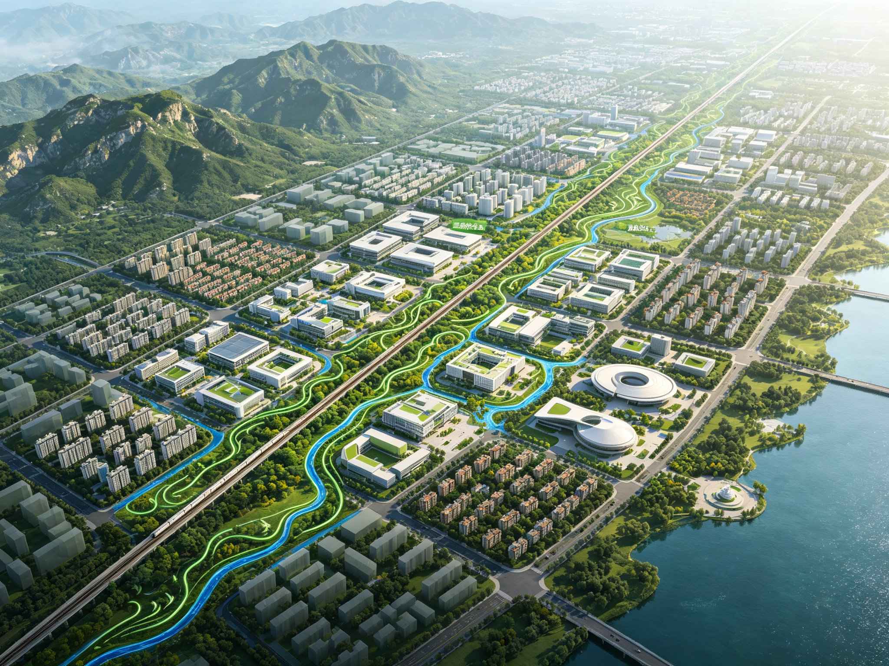
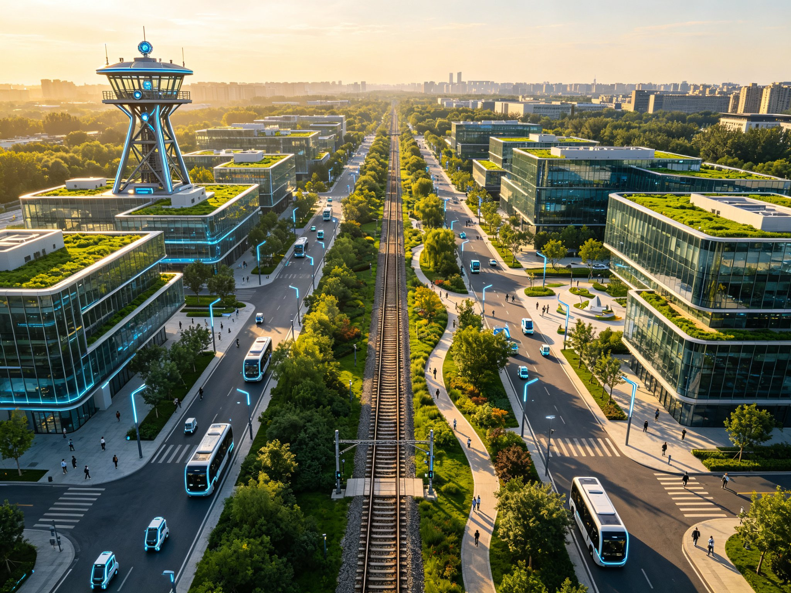
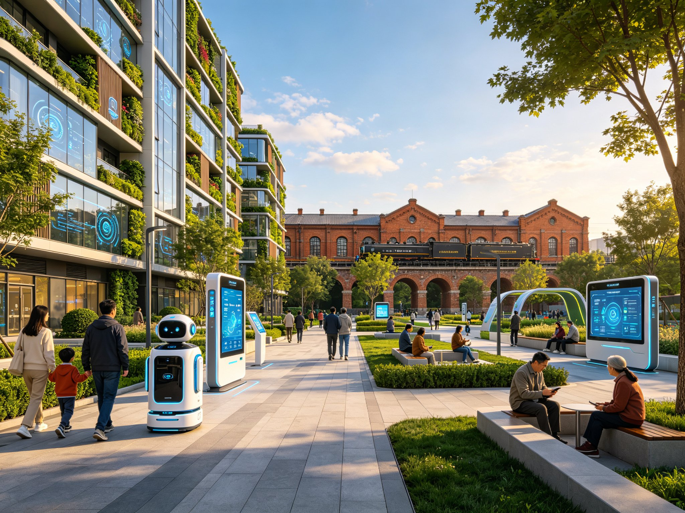
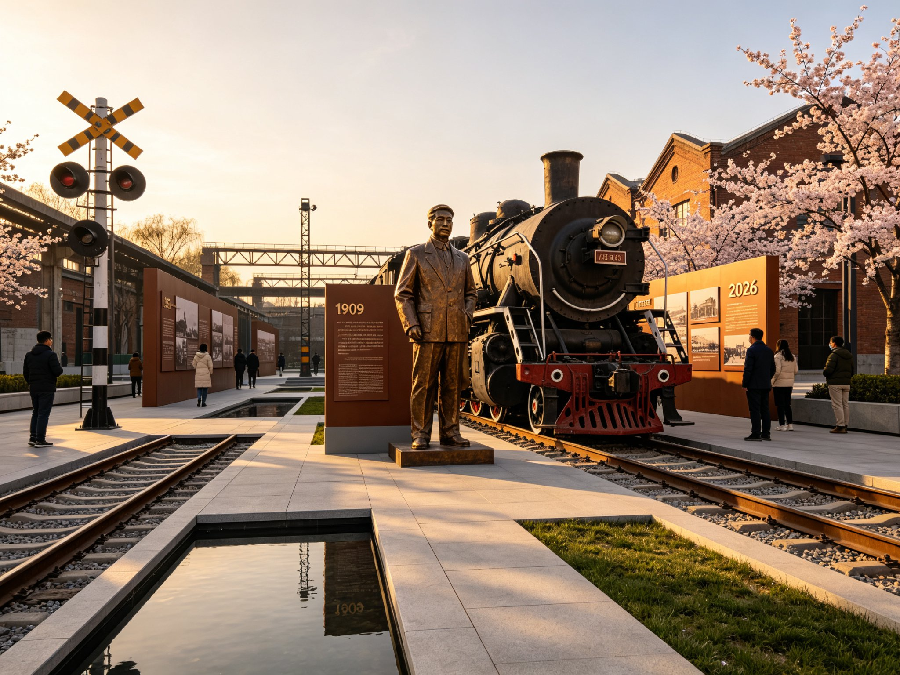
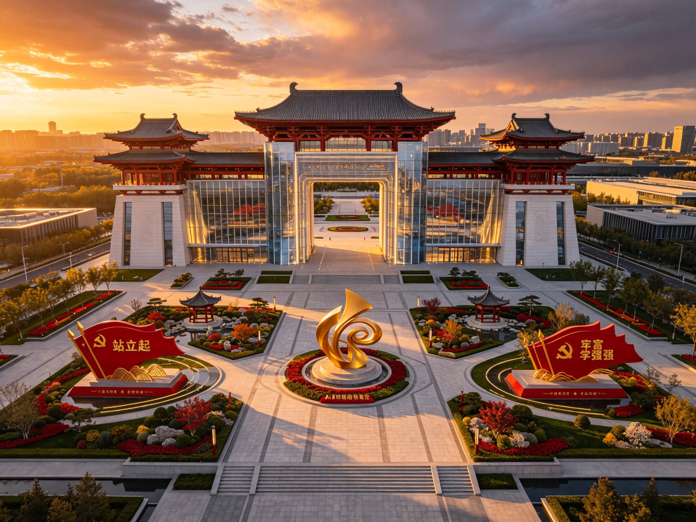

> **Important boundary notice (applies to the whole text and all figures):** This proposal uses the repository `provisional` boundary (a temporary conceptual boundary, **not an official red line**, not for statutory or engineering-precision use). All spatial, metric and scenario conclusions are conceptual suggestions, not substitutes for formal planning, government decisions, or professional engineering conclusions. They require review by planning, transport, heritage, municipal, accessibility and public-safety procedures. FAR, building height and road red-line are not yet publicly released; related conclusions are conceptual only.

# Jing-Zhang AI Spine · Rejuvenation Future Habitat Belt

## 1. Design Basis and Source Inventory

This proposal is prepared according to the Pre-Qualification Announcement for the Centennial Jing-Zhang AI Innovation Belt Urban Design International Open Call [source:PROJECT-OFFICIAL-ANNOUNCEMENT], the Taskbook Excerpt for the Global Agent Open Call [source:PROJECT-AGENT-OPEN-CALL-TASKBOOK], the Urban Design Management Measures [standard:MOHURD-URBAN-DESIGN-MEASURES], the Measures for the Compilation and Approval of Regulatory Detailed Planning [standard:MOHURD-CONTROL-DETAILED-PLANNING], and the Territorial Spatial Survey, Planning and Land-Sea Use Classification Guide [standard:MNR-LAND-USE-CLASSIFICATION-GUIDE]. Spatial boundaries use the repository `provisional` boundary (a temporary conceptual boundary, not an official red line, not for statutory or engineering-precision use) [source:SITE-PACKAGE]; all spatial suggestions are conceptual and do not substitute for formal planning.

Core judgements rest on publicly verifiable site information: the Jing-Zhang Railway, started in 1905 and opened in 1909, was designed and built by Zhan Tianyou — the first railway wholly invested, designed, surveyed, constructed and completed by Chinese people. Haidian is the core area of the Zhongguancun National Independent Innovation Demonstration Zone. The Jing-Zhang railway heritage park runs north–south, roughly 116.342–116.346°E, spanning 39.939–40.0265°N. Full source indices, metric calculations, standard responses and design-depth evidence are stored in structured files.

Official precise boundary polygons are not yet released; this proposal uses the repository `provisional` boundary (recomputed area: overall design area 11,412,825㎡; coordinated research area 43,609,233㎡). All area metrics are labelled `provisional` low-confidence design-model values and must be recomputed after official data release [metric:site_area_sqm][metric:green_ratio][metric:public_space_ratio].

## 2. Three-Level Scope Framework

### 2.1 Coordinated Research Scope (≈43.6 km²)
Bounded north by the North 5th Ring Road, east by the Jingzang Expressway, south by Xizhimenwai Street, west by Wanquanhe Road [source:SITE-PACKAGE]. Repository `provisional` boundary (temporary conceptual boundary, not an official red line) coordinates ≈116.31285–116.37215°E, 39.938–40.027°N [data:geometry/site_boundary.geojson#PROV-RESEARCH-001]. This level addresses industrial strategy, regional innovation coordination, landscape pattern analysis and future urban form exploration, proposing the "one spine through three zones, two corridors weaving two cities, ten systems across the territory" structure.

Reading the 43.6 km² landscape: hills (Baiwangshan) to the north, the Changhe and Zhuanhe water systems to the south, the college belt (Xueyuan Road) to the east, and the Wanquanhe–Xiao Yuehe water system to the west. The old railway line sits on the north–south central axis. The proposal uses AI to analyse terrain and airflow, optimising ventilation corridors and microclimate, translating the eastern spatial wisdom of "facing hills, ordering water, gathering wind" into quantifiable urban wind corridors, green corridors and open-space systems. These expressions are cultural narrative and spatial-organisation inspiration, not technical planning basis [assumption:ASM-009].

### 2.2 Overall Design Scope (≈11.4 km²)
The planning and design scope covers the urban districts and industrial areas within 1–2 km of the heritage park [source:SITE-PACKAGE]. Repository `provisional` boundary (temporary conceptual boundary, not an official red line) coordinates ≈116.3397–116.3553°E, 39.939–40.0265°N [data:geometry/site_boundary.geojson#PROV-SITE-001], forming a narrow north–south corridor. This level reaches the urban-design depth of **regulatory-detailed-planning linkage research / conceptual renewal strategy**. Because official regulatory conditions are not yet fully released, statutory controls such as FAR and building height are marked as to-be-confirmed [standard:MOHURD-CONTROL-DETAILED-PLANNING].

### 2.3 Key Area Scope (≈368.4 ha)
Three key areas from north to south, all using the repository `provisional` boundary (temporary conceptual boundary, not an official red line):

| Key area | Coordinates (provisional conceptual boundary) | Area (computed) |
|----------|----------|----------------|
| Zhongzhiyuan AI Self-Innovation Accelerator | 116.343–116.354°E, 40.0075–40.026°N | 192.1 ha |
| Beijing AI Origin Community | 116.342–116.353°E, 39.9835–39.9935°N | 104.3 ha |
| Dazhongsi AI Industry Cluster | 116.342–116.355°E, 39.944–39.94984°N | 72.0 ha |

The three geometries correspond to PROV-KEY-001/002/003 in `geometry/key_areas.geojson` [data:geometry/key_areas.geojson#PROV-KEY-001], consistent with `key_area_zhongzhiyuan_sqm`(1,921,000㎡), `key_area_origin_community_sqm`(1,043,000㎡) and `key_area_dazhongsi_sqm`(720,000㎡) in `metrics.json`.

## 3. Coordinated Research Scope: Industry and Future-City Studies
The ≈43.6 km² coordinated research scope addresses industrial strategy and regional innovation coordination. The proposal proposes the "one spine through three zones" structure, using the heritage park as a north–south cultural spine linking the three key areas. Industry studies focus on AI self-innovation, future industry clusters and Zhongguancun innovation spillover, emphasising "technology serves people". All industrial and spatial judgements are conceptual suggestions based on public information and the repository `provisional` boundary. Coordinated research area recomputed value 43,609,233㎡ [metric:coordinated_research_area_sqm].

## 4. Overall Design Scope: Urban Renewal and Regulatory Linkage Research
The ≈11.4 km² overall design scope reaches the urban-design depth of **regulatory-detailed-planning linkage research / conceptual renewal strategy**. The proposal coordinates land use, development intensity, building height/mass/style/colour and public space; because official regulatory conditions are not yet released, statutory controls such as FAR and building height are marked to-be-confirmed [standard:MOHURD-CONTROL-DETAILED-PLANNING]. Spatial suggestions use the repository `provisional` boundary (temporary conceptual boundary, not an official red line) [data:geometry/site_boundary.geojson#PROV-SITE-001] [metric:site_area_sqm].

## 5. Dimension 1: Future Habitat · Smart City
> **Core idea: technology is not the goal; serving people's good life is. All function combinations are elastic, dynamically adjustable and adaptable to future industry uses.**

### 5.1 Smart Community: Digital-Twin-Driven Future Community
Centred on the Beijing AI Origin Community, a human-centred, eco-friendly, digital future community is built on a digital twin. A full-element digital twin maps physical and digital space in real time — building energy, elevators, parking, public-space flows, environment — and residents participate in governance via community dashboards.

**Elastic function modules:** "elastic skeleton + variable modules" — fixed structural skeleton, internally adjustable space (shared office today, AI lab tomorrow, community health centre later). Buildings reserve modular interfaces, flexible piping and movable partitions.

**Community digital-twin centre:** at the Origin Theatre, a community-level command centre displays real-time operation status; residents query, book and feedback via mobile. Governance shifts from reactive to predictive.

### 5.2 Smart Mobility: People–Vehicle–Road–Cloud Coordination
Adaptive signal control at major intersections based on real-time flow, transit priority and pedestrian demand; a smart-mobility demo corridor (Zhichun Rd–Xueyuan Rd) with V2X infrastructure supporting autonomous-vehicle testing and transit priority.

**Slow-traffic priority:** along the heritage park, a ≈9 km "Spine Greenway" (conceptual estimate, to be recomputed after official boundary release) separates walking and cycling, with smart lighting, AI guidance and environmental monitoring; east–west slow-traffic stitching channels resolve the railway barrier.

**Static-traffic intelligence:** smart parking guidance integrating community, park and public parking for time-shared sharing; EV charging and smart energy supply points.

### 5.3 Smart Energy and Environment: Green Low-Carbon Cycle
A smart energy micro-grid in the Origin Community integrates rooftop PV, distributed storage, charging and building-energy management. AI optimises energy allocation by weather, usage and price signals, reducing cost and carbon.

**AI environment monitoring:** sensing columns along the park monitor air, noise, temperature, humidity and microclimate; AI analyses heat-island, ventilation and air quality to inform design.

**Blue-green sponge system:** using Xiao Yuehe, heritage green and community gardens to build a sponge city — "no waterlogging in heavy rain" via AI-optimised rainwater collection, purification and reuse.

### 5.4 Smart Living and Health: 5-Minute Future Life Circle
Within a 5-minute walk: smart health station (AI-assisted monitoring, chronic-disease management, tele-consultation, doctor review, focused on elders); AI education lab (minor data specially protected, teacher review); unmanned delivery and smart retail (traditional service retained for the digitally vulnerable); shared work pods; community culture centre.

**Health loop:** monitoring → early warning → diagnosis → rehabilitation, with localised data and user-authorised access; medical diagnosis must be confirmed by a doctor (project governance principle; not a statutory obligation under the Generative-AI Interim Measures).

### 5.5 Urban Robots and Embodied Intelligence
A city robot service network and embodied-intelligence infrastructure. The former low-altitude-economy idea is dropped: low-altitude flight requires case-by-case verification with civil-aviation and air-traffic-control authorities by specific airspace, activity type and procedure; this proposal does not presuppose a low-altitude layout [assumption:ASM-006].

**Robot hubs:** 3–5 city robot service hubs (core hubs at Zhongzhiyuan, Origin Community, Dazhongsi) for dispatch, charging, maintenance and task allocation. Scenarios: park delivery, sanitation/inspection, security patrol (no face recognition), multilingual guide robots, construction robots. Embodied-infrastructure reserves robot passages, charging points and digital-twin spatial cognition.

### 5.6 Resilient City and Smart Emergency
Resilient spaces: emergency shelters along the park with water/power/comm; a resilience command centre at Dazhongsi. **Smart emergency (conceptual, not achieved performance):** a digital-twin simulation for fire/flood/earthquake rehearsal is a *target* requiring baseline, model, acceptance metrics and human-decision boundaries before field trials. Distributed resilient energy with islanding capability for critical facilities.

## 6. Dimension 2: Centennial Jing-Zhang Cultural Belt
> **The historical significance of the Jing-Zhang Railway must be the soul of the design.**

### 6.1 The Railway as a Spiritual Totem
Opened in 1909, the Jing-Zhang Railway was the first railway wholly invested, designed, surveyed, constructed and completed by Chinese people. Facing the taunt that "no Chinese capable of building this railway is yet born", Zhan Tianyou took the chief-engineer role with the conviction that "China is vast and rich, yet having to rely on foreigners for a single line is a disgrace". The "person"-shape railway, Qinglongqiao station and Badaling tunnel embody Chinese ingenuity and grit.

### 6.2 Cultural Main Axis
The heritage park as a north–south cultural spine across 43.6 km² — preserving rails, sleepers, signals and bridges as cultural landscapes, with memorial nodes. Three segments: north (Zhongzhiyuan, innovation origin), middle (Origin Community, cultural memory), south (Dazhongsi, industry heritage to AI).

### 6.3 Three Memorial Nodes
Zhan Tianyou Memorial Node (≈116.344°E,40.015°N, near Zhongzhiyuan south, heritage-park north corridor node): statue, steam locomotive, "struggle road" wall. "Person"-shape railway display node (≈116.344°E,40.005°N, near Zhongzhiyuan south, heritage-park north corridor node): interactive demonstration of the switchback engineering. Centennial railway-change node (≈116.344°E,39.975°N, near Origin Community, heritage-park south corridor node): "1909→2026" timeline narrative.

### 6.4 "1909→2026" Timeline Narrative (node index / historical year)
Along the greenway, a timeline narrative **uses node index mapped to historical years, not asserting actual mileage** (repository `provisional` boundary, not an official red line, not for distance judgement):

| Node | Year | Event | Space |
|------|------|-------|-------|
| N1 | 1905 | Railway starts | start monument |
| N2 | 1909 | Railway opens | Zhan Tianyou Plaza |
| N3 | 1919 | Zhan Tianyou dies | Tianyou spirit wall |
| N4 | 1949 | PRC founded | "standing up" space |
| N5 | 1978 | Reform & opening | "getting prosperous" space |
| N6 | 2008 | Beijing–Tianjin Intercity | HSR mark |
| N7 | 2019 | Jing-Zhang HSR opens | "becoming strong" space |
| N8 | 2026 | AI belt launches | Revival Gate |

A motivational cultural expression; not a mileage claim.

### 6.5 Inheriting the "Tianyou Spirit"
Self-innovation, self-reliance and responsibility — embodied by Zhan Tianyou and carried forward by the AI belt through the "Tianyou Youth Innovation Award" and "Tianyou Engineer Culture" emphasising engineering ethics and social responsibility.

## 7. Dimension 3: Eastern Lineage and Spatial Wisdom (Modern Translation)
> **Eastern spatial wisdom has inspirational value for modern planning; this proposal uses it as cultural narrative and modern translation, not technical planning basis [assumption:ASM-009].**

### 7.1 "Gathering Wind": AI-Optimised Ventilation and Microclimate
AI analyses terrain and airflow to optimise ventilation corridors. **AI wind-environment analysis (conceptual, to be verified):** CFD simulation over 43.6 km² is a *target* to identify winter wind channels and summer corridors; requires model, input data, baseline and acceptance metrics before field trials; not claimed as achieved performance. Three corridors: NW–SE (Baiwangshan cool air), N–S (railway green spine), E–W (Xiao Yuehe). **Microclimate optimisation (target, to be verified):** increasing greenery/water/shade aims to reduce local temperature (specific magnitude pending CFD simulation and measurement; conceptual target, not achieved performance).

### 7.2 "Hills Behind, Water Front": Harmony of Mountain–Water–City
North facing hills (Baiwangshan), south facing Changhe/Zhuanhe, east "azure dragon" (college belt), west "white tiger" (Xiao Yuehe). View corridors to hills and water are protected by height control.

### 7.3 "Heaven–Human Unity": Conforming to Natural Law
Sunlight optimisation (*target* residential winter daylight referencing the Urban Residential Area Planning Standard — specific standard anchor to be verified against the official released version); terrain conformity; climate adaptation; water-system respect; tree protection (old and famous trees strictly protected).

### 7.4 Ten Subsystems for Holistic Harmony
Material (6): land, building, transport, infrastructure, landscape, public space. Non-material (4): social, economic, management, cultural. Monitored and coupled via the digital twin.

### 7.5 Traditional–Modern Fusion
Courtyard space translated to inner courts/sky gardens; colours warm-grey/blue-grey accented with "Jing-Zhang Cyan" and "Spine Gold"; pitched/green roofs; axial/symmetric ceremonial space modern-translated at memorial nodes.

## 8. Dimension 4: Innovation-Belt Narrative and Value Expression
> **Every inch of the 43.6 km² tells the Chinese story of "from follower to leader".**

### 8.1 From Follower to Leader
The Jing-Zhang Railway's centennial change — from the 1909 "struggle road" to the 2019 world-first 350 km/h smart HSR — mirrors China's modernisation. The AI belt continues this trajectory in the new round of technological revolution.

### 8.2 Three Narrative Themes: Standing Up · Getting Prosperous · Becoming Strong (narrative themes)
Along the cultural axis, three narrative-theme spaces (narrative expression, not hierarchical or exclusionary claims): "standing up" (near Dazhongsi, heritage-park north gateway corridor node, ≈116.344°E,39.955°N), "getting prosperous" (near Origin Community south, heritage-park mid corridor node, ≈116.344°E,39.965°N), "becoming strong" (Origin Community north, ≈116.344°E,39.985°N).

### 8.3 "Centennial Jing-Zhang" Narrative
Each node tells a story: self-reliance, smart innovation, continuous transcendence, self-attack research, tech-for-people, industry upgrade, towards revival. Participatory, interactive, experienceable via AR, digital twin and immersive theatre.

### 8.4 Showing Chinese Wisdom, Solution and Strength (International Communication)
Chinese wisdom (eastern spatial wisdom in AI era); Chinese solution (replicable Jing-Zhang model for global AI urban transformation); Chinese strength (the railway's centennial development achievement). International system: multilingual platform, AI-governance forum, youth-exchange — see Chapter 20 "Neutral International Narrative".

## 9. Detailed Design of Key Areas

### 9.1 Zhongzhiyuan AI Self-Innovation Accelerator (192.1 ha)
Positioning: physical carrier of full-stack AI self-innovation and global AI-governance discourse; "one core, two rings, multi-clusters" — Zhan Tianyou Plaza + Tianyou Eye landmark; AI-governance sandbox; "multi-storey courtyard" architecture.

### 9.2 Beijing AI Origin Community (104.3 ha)
Positioning: talent home of world-class AI ecosystem; "5-minute future life circle" demo; "one axis, three centres, four rings"; Origin Theatre (immersive AI narrative engine); full-element digital-twin community.

### 9.3 Dazhongsi AI Industry Cluster (72.0 ha)
Positioning: intelligent-native new-industry landing; smart-construction demonstration; "one gate, two streets, three workshops"; Revival Gate (smart-construction demonstration); smart-construction workshop; city-robot service workshop.

All three key areas use the repository `provisional` boundary (temporary conceptual boundary, not an official red line) [data:geometry/key_areas.geojson][source:SITE-PACKAGE]; to be verified after official data release.

## 10. Land Use, Building Scale and Retain–Renovate–Demolish
Conceptual land use with territorial-spatial codes: residential (07), public-administration & public-service (08), commercial (09), green & open space (14), consistent with `geometry/land_use.geojson`. Retain–renovate–demolish is directional: heritage/park elements retained; inefficient industrial space renovated; a small amount of dilapidated/conflicting buildings tentatively into demolition — **specific scale and scope require professional survey and heritage inventory; this proposal does not constitute a concrete demolish-relocate conclusion**. Land use follows [standard:MNR-LAND-USE-CLASSIFICATION-GUIDE] [data:geometry/land_use.geojson].

## 11. Transport, Rail, Municipal and Public Services
### 11.1 Land Layout
Mixed functions along the spine per [standard:MNR-LAND-USE-CLASSIFICATION-GUIDE] [data:geometry/land_use.geojson#LU-001]. FAR/height marked unknown, recomputed after official regulatory release [standard:MOHURD-CONTROL-DETAILED-PLANNING].

### 11.2 Transport
Outer expressway skeleton (North 5th Ring, Jingzang, Xizhimenwai, Wanquanhe); internal micro-circulation; ≈9 km spine greenway (conceptual estimate, not mileage precision); TOD concepts at Line 13 Dazhongsi/Zhichunlu — engineering by transport professionals.

### 11.3 Municipal and New Infrastructure
Conventional municipal retained and upgraded; new infrastructure: city-level digital-twin base, distributed compute nodes, smart energy micro-grid, IoT sensing, robot hubs — capacity requires professional calculation [assumption:ASM-007].

### 11.4 Public Services
5-minute life circle with smart health station, AI lab, culture centre, elder station, retail, work pods, unmanned delivery; accessibility [standard:BARRIER-FREE-ENVIRONMENT-LAW] and elder traditional-service retention [standard:ELDERLY-SMART-TECH-PLAN-2020-45].

## 12. Blue-Green, Public Space and Urban Style
"Spine greenway + riverside green corridor + community park" network, ≈9 km continuous greenway (conceptual estimate, not official-red-line precision), linking three key areas and rail stations. Green ratio and public-space ratio recomputed from `green_space`/`public_space` geometries as low-confidence design-model values (green_ratio=0.403833, public_space_ratio=0.00359), consistent with `metrics.json` [metric:green_ratio][metric:public_space_ratio], to be verified after official release. Accessibility and age-friendly; traditional services retained; "Jing-Zhang AI Spine" governs height rhythm and material colour.

## 13. AI Innovation Ecosystem, Personas and AI+ Scenarios
### 13.1 agent.2 Evidence: Global Case Benchmarking (5–8 traceable cases)
| ID | Case | Place | Borrowable | Not copyable | Source (traceable) |
|----|------|-------|-----------|--------------|---------------------|
| G1 | Station F | Paris | rail/industrial→innovation | land tenure diff. | [source:G1-SRC] |
| G2 | MaRS | Toronto | gov–industry–academia–med lab | health-data diff. | [source:G2-SRC] |
| G3 | 22@ | Barcelona | industrial→mixed innovation | climate/scale diff. | [source:G3-SRC] |
| G4 | Kendall Sq. | Boston | university–firm–capital | un-replicable density | [source:G4-SRC] |
| G5 | Kalasatama | Helsinki | digital-twin community | small-country scale | [source:G5-SRC] |
| G6 | Punggol DD | Singapore | integrated digital district | city-state admin. | [source:G6-SRC] |
| G7 | Hetao/Qianhai | Shenzhen | neighbouring sci-tech policy | location diff. | [source:G7-SRC] |
| G8 | West Lake Sci-Tech Corridor | Hangzhou | regional corridor coordination | differentiation needed | [source:G8-SRC] |

#### 13.1.1 Global Case Source Index (traceable)

Per-case source ID, publisher, title, URL/stable reference, publication/access date, applicable conclusion and non-copyable boundary. Full records in `sources.json`:

- **G1-SRC** — Station F / Groupe SNCF: *Station F Innovation Campus (Converted Railway Depot)*, https://stationf.co/about (2017, accessed 2026-08-28). Applicable: rail-depot reuse for innovation validates spatial recycling; not copyable: French land/tenure/public-finance models differ from China's.
- **G2-SRC** — MaRS Discovery District: *MaRS Discovery District, Toronto*, https://marsdd.com/about-mars (2005, accessed 2026-08-28). Applicable: non-profit aggregating research–capital–firm–clinical resources; not copyable: Canadian health-data regime differs.
- **G3-SRC** — Ajuntament de Barcelona: *22@Barcelona Innovation District*, https://www.22barcelona.com/ (2000, accessed 2026-08-28). Applicable: zoning change revitalises old industrial land; not copyable: Mediterranean climate, scale and legal family differ.
- **G4-SRC** — MIT / Kendall Square Initiative: *Kendall Square*, https://www.kendallsquare.org/ (2010, accessed 2026-08-28). Applicable: university density drives innovation ecology; not copyable: MIT-level density unreplicable, substituted by Zhongguancun spillover.
- **G5-SRC** — City of Helsinki: *Kalasatama Smart City*, https://www.hel.fi/helsinki/en/areas/kalasatama/ (2013, accessed 2026-08-28). Applicable: digital twin + participatory governance; not copyable: Nordic digital-literacy/language context unreplicable.
- **G6-SRC** — IMDA Singapore / JTC: *Punggol Digital District*, https://www.imda.gov.sg/ (2018, accessed 2026-08-28). Applicable: government–enterprise digital district integrated O&M; not copyable: city-state administration unreplicable.
- **G7-SRC** — Qianhai Authority Shenzhen: *Hetao/Qianhai Sci-Tech Zones*, http://www.qianhai.gov.cn/ (2010, accessed 2026-08-28). Applicable: mature neighbouring sci-tech policy; not copyable: location/industrial base differ, needs differentiation.
- **G8-SRC** — Hangzhou Municipal Government: *West Lake Sci-Tech Corridor*, http://www.hangzhou.gov.cn/ (2016, accessed 2026-08-28). Applicable: corridor form aggregates universities/firms/platforms; not copyable: this belt needs differentiated positioning.

Zhan Tianyou quotes and the 1905-construction / 1909-opening / 2019 smart-HSR facts: source [source:JZ-HISTORY-QUOTE] (China Railway Museum / official railway history, https://www.china-railway.com.cn/); wording to be verified against authoritative records; used here as cultural-narrative motif only.

### 13.2 agent.2 Evidence: AI Innovation Ecology Graph (concept)
Eight actor types — research, capital, enterprise, talent, data, compute, scenario, governance — form a closed loop via the digital-twin base and open platform (see `standard_matrix.json` and Chapter 15 operation path).

### 13.3 agent.2 Evidence: Land–Capital–Talent–Compute–Data–Scenario Mechanism
Land (stock railway/industrial renewal; ownership pending survey [assumption:ASM-003]); Capital (government-guided + social + operation revenue); Talent (young AI developers + talent apartments); Compute (distributed nodes on city network; capacity pending [assumption:ASM-007]); Data (public + authorised community, minimise/localise [assumption:ASM-010]); Scenario (10 scenario cards as traction). Conceptual; depends on official regulatory, ownership and funding arrangements.

### 13.4 Ten AI Scenario Cards (structured)
Each card lists user, location, data input, AI output, human review, failure fallback, operator, KPI, plus **opt-out / human service / appeal-correction / data-minimisation / retention / emergency-takeover**.

**S1 Digital-Twin Community Governance** — Users: residents/workers; Loc: Origin Community; Input: energy/flow/env IoT; Output: status & warning; Review: community centre; Fallback: manual patrol; Operator: subdistrict/property+platform; KPI: response time↓. Opt-out: residents may disable personal dashboard; Human: community window; Appeal: ticket; Minimise: aggregated anonymous; Retention: 90d; Takeover: disconnect→manual.

**S2 Smart Mobility** — Users: commuters/transit; Loc: Zhichun–Xueyuan; Input: flow/transit GPS; Output: signal advice; Review: traffic police; Fallback: fixed timing; Operator: traffic+platform; KPI: congestion↓. No face capture; Human: on-site police; Appeal: 12345; Minimise: plate anonymised; Retention: 7d; Takeover: fixed timing.

**S3 Energy Micro-grid** — Users: community/park; Loc: Origin/Zhongzhiyuan; Input: weather/load; Output: optimisation; Review: energy engineer; Fallback: manual; Operator: utility; KPI: carbon↓. Opt-out: yes; Human: hotline; Appeal: ticket; Minimise: household-aggregated; Retention: 1y; Takeover: local control.

**S4 AI Health Butler** — Users: elders/chronic; Loc: Origin health station; Input: vitals/consult; Output: reminders; Review: doctor; Fallback: manual follow-up; Operator: community health centre; KPI: follow-up coverage. Opt-out: human-only; Human: doctor; Appeal: clinician; Minimise: minimal necessary; Retention: per medical rule; Takeover: emergency channel.

**S5 City Robot Network** — Users: park/public; Loc: three areas; Input: task/map; Output: dispatch path; Review: ops centre; Fallback: manual; Operator: robot workshop; KPI: completion↑. Opt-out: request human; Human: service point; Appeal: ticket; Minimise: no face; Retention: 30d; Takeover: remote e-stop.

**S6 Smart Emergency** — Users: agency/public; Loc: whole territory; Input: sensor/video(non-face); Output: rehearsal & warning; Review: emergency command; Fallback: manual plan; Operator: emergency bureau; KPI: drill coverage. Opt-out: n/a; Human: on-site; Appeal: duty phone; Minimise: zone-aggregated; Retention: 1y; Takeover: manual command.

**S7 AI Heritage Activation** — Users: visitors/students; Loc: cultural axis; Input: AR/guide; Output: multilingual; Review: heritage audit; Fallback: panels; Operator: culture operator; KPI: satisfaction. Opt-out: disable AR; Human: docent; Appeal: box; Minimise: no face; Retention: session-end; Takeover: stop AR.

**S8 AI Education Lab** — Users: students/learners; Loc: Origin; Input: behaviour; Output: personalised; Review: teacher; Fallback: normal teaching; Operator: school/community; KPI: participation. Opt-out: minors may exit; Human: teacher; Appeal: parent; Minimise: minor-data protected; Retention: term-end; Takeover: disable AI.

**S9 Environment & Carbon** — Users: bureau/public; Loc: blue-green; Input: env sensor; Output: carbon accounting; Review: environment audit; Fallback: manual; Operator: parks/environment; KPI: carbon sink. Opt-out: public not participant; Human: hotline; Appeal: ticket; Minimise: point-aggregated; Retention: per cycle; Takeover: manual.

**S10 Smart Construction** — Users: builder; Loc: Dazhongsi workshop; Input: BIM/drawing; Output: construction optimisation; Review: engineer; Fallback: traditional; Operator: construction firm; KPI: schedule/safety. Opt-out: key steps manual; Human: technician; Appeal: QC; Minimise: site scope; Retention: project archive; Takeover: e-stop.

### 13.5 Test Validation Protocols (3)
1. AI slow-traffic test field (north 2 km): adaptive lighting, guide robots, smart benches, AR, anonymous behaviour analysis. Method: A/B + anonymous stats; uncertainty: sample/season.
2. Origin digital-twin test bed: CIM, energy simulation, AI dispatch, participatory planning. Method: model vs measurement; uncertainty: sensor coverage.
3. Dazhongsi smart-construction demo: construction robots, 3D printing, robot O&M, standards validation. Method: process records + safety audit; uncertainty: process maturity.

All scenarios follow privacy protection and human review; immature tech not presented as fully deployable [source:AGENT-TASKBOOK].

### 13.6 User Personas and Journeys (≥5, consistent with metrics)
| Persona | Pain | Non-digital channel | Accessibility node | Feedback loop |
|---------|------|---------------------|--------------------|---------------|
| P1 Resident/Elder | digital difficulty | community window/phone | human service point, rest seat | ticket+callback |
| P2 Young AI talent | housing/social/startup | offline events | reachable workstation | community feedback |
| P3 Minor & family | content suitability | teacher/parent | family facilities | school–home |
| P4 Disabled user | access/info barrier | human assistance | continuous accessible path | accessibility hotline |
| P5 Visitor | guidance/language | docent | multilingual signage | suggestion box |
| P6 Front-line staff | O&M load | team dispatch | rest/charge point | O&M ticket |

Journey example (P1 elder): arrive → human service point → traditional window → accessible path → evaluation callback. All journeys retain non-digital alternatives and require professional accessibility review.

### 13.7 Scenario–Space–Operation Matrix
| Scenario | Space node | Operator (concept) | KPI |
|----------|-----------|--------------------|-----|
| S1 Governance | Origin | subdistrict/property+platform | response↓ |
| S2 Mobility | Zhichun–Xueyuan | traffic+platform | congestion↓ |
| S3 Energy | Origin/Zhongzhiyuan | utility | carbon↓ |
| S4 Health | Origin | health centre | follow-up |
| S5 Robots | three areas | robot workshop | completion↑ |
| S6 Emergency | whole | emergency bureau | drill cover |
| S7 Heritage | cultural axis | culture operator | satisfaction |
| S8 Education | Origin | school/community | participation |
| S9 Environment | blue-green | parks/environment | carbon sink |
| S10 Construction | Dazhongsi | construction firm | schedule/safety |

## 14. Renewal Project List, Policy and Phasing (Project Ledger)
### 14.1 Near-Term Project Ledger (conceptual)
| Project | Scope | Lead/Partner (concept) | Precondition | Cost scale | Data dependency | KPI | Stop/Rollback |
|---------|-------|------------------------|--------------|-----------|-----------------|-----|---------------|
| Heritage smart demo segment | north 2km | parks bureau+platform | heritage assessment | 10M-scale | map/sensor | flow/satisfaction | stop on heritage conflict |
| Zhan Tianyou node | Zhongzhiyuan | culture bureau+subdistrict | ownership confirm | 10M-scale | history | open | rollback on ownership dispute |
| AI slow-traffic field | north 2km | traffic+platform | road condition | 1M-scale | behaviour | safety | stop on incident |
| Origin smart pilot | 1–2 estates | subdistrict/property | resident consent | 1M-scale | community | participation | rollback on complaint threshold |
| Zhongzhiyuan compute launch | Zhongzhiyuan | sci-tech+enterprise | municipal capacity | 100M-scale | compute net | uptime | rollback on capacity short |

All subjects and timelines are conceptual and require authority approval and procurement.

### 14.2 Phasing (conceptual)
Near (1–3y): deepening, heritage smart demo, Zhan Tianyou node, AI slow-traffic field, Origin 1–2 estate pilot, Zhongzhiyuan compute launch. Mid (3–5y): three-area renewal, three landmarks, three narrative spaces, digital-twin base, robot network initial run. Far (5–10y): full build, global AI brand, continuous operation, exporting "Jing-Zhang solution".

### 14.3 Four-Season Activities
Spring AI Innovation Week (Apr); Summer Future-Habitat Experience (Jul–Aug); Autumn Tianyou Youth Contest (Sep); Winter AI-Governance Forum (Dec).

### 14.4 Long-Term Operation
"Government-guided, market-led, public-participated" mechanism; a Spine Operation Platform maintains digital twin, opens scenarios, organises activities and manages brand; developer community with open data/API and "challenge" model. Conceptual per [source:AGENT-TASKBOOK].

## 15. Metrics, Area Recomputation and Compliance Matrix
### 15.1 Core Visual Metrics (unified values)

> **Industry-cluster weight methodology (read first)**: The shares in the "Future Industry Clusters" panel (AI core 35%, digital twin 25%, smart construction 20%, urban robotics 20%) are **dimensionless illustrative weights** expressing the relative emphasis of four industry types in this belt's conceptual structure. They are **not** measured shares from any industry census, enterprise statistics or land survey. Method: a **qualitative ordinal mapping** derived from public information on the Zhongguancun AI innovation ecosystem, the industry base around the Jing-Zhang heritage corridor, and the open-call taskbook orientation — conceptual only. Actual composition must follow a formal industry census, investment realisation and statutory planning; this proposal asserts no measured industry-share conclusion and will be recomputed when data permit. Area metrics (site_area_sqm, green_ratio, public_space_ratio) are recomputed from the `provisional` boundary geometry and flagged as low-confidence design-model values.

| Metric | Status | Value | Note |
|--------|--------|-------|------|
| site_area_sqm | known(provisional) | 11,412,825 | from provisional geometry |
| green_ratio | known(provisional) | 0.403833 | from green_space, low confidence |
| public_space_ratio | known(provisional) | 0.00359 | from public_space, low confidence |
| key_area_zhongzhiyuan_sqm | known | 1,921,000 | 192.1 ha, consistent |
| spine_greenway_length_km | known(provisional) | 9,000 m | conceptual estimate |

Declared in `metrics.json`, consistent with `visual/index.html` data-value [metric:site_area_sqm][metric:green_ratio][metric:public_space_ratio]. Unified values used throughout; conflicting 0.28/0.18/192.9ha removed.

### 15.2 Compliance Coverage
`compliance_matrix.json` covers all announcement tasks and agent.1–agent.6 (standards in `standard_ids`, facts in `source_ids`). `standard_matrix.json` covers 5 mandatory standards. `design_depth_matrix.json` has **15** design-depth items all complete (actual count per that file).

## 16. Taskbook-Response Summary and agent Task Mapping
| Task | Positioning/Function | Section | Figure/Drawing | Space node | Operator (concept) | Metric anchor |
|------|---------------------|---------|---------------|------------|--------------------|---------------|
| agent.1 Taskbook response | scope/positioning | 1,2,4 | site-overview, land-use | three areas | planning team | site_area_sqm |
| agent.2 Originality & innovation evidence | AI self-innovation | 5,13.1–3 | key-areas, metrics | Zhongzhiyuan | sci-tech+enterprise | global_case_count |
| agent.3 Users & public interest | future habitat/inclusion | 13.4–7 | mobility-bluegreen | Origin | subdistrict/community | user_persona_count |
| agent.4 AI public space & new forms | AI public space, new formats, ≥3 landmarks, honor showcase system, public-space component library | 9,18,19,16.1 | a0-boards, key-areas | three areas+3 landmarks | implementation/platform | landmark_count, public_space_ratio |
| agent.5 Jing-Zhang·Zhongguancun·AI culture & narrative | Jing-Zhang/Zhongguancun/AI culture, signage symbols, international narrative | 18,20,16.1 | a0-boards brand page, visual | all cultural nodes | brand/culture-tourism | global_case_count |
| agent.6 Events·brand IP·open transformation | annual events, brand IP, developer community, scenario open & transformation path | 18,21,16.1 | a0-boards, visual, report | whole | platform/community | scenario_count |

"Three zones, two wings" coordination mechanism: see Chapter 17.

### 16.1 Honor Showcase System & Public-Space Component Library (agent.4 deliverables)

This subsection supplies the two public-space deliverables required by taskbook agent.4 but not previously standalone, with entry points in the drawings and `visual/index.html`.

#### 16.1.1 Honor Showcase System

Centred on the Jing-Zhang Railway Heritage Park as a narrative spine, build a "readable, participatory, transmissible" Centennial Jing-Zhang honor-exhibition system linking the three AI pilgrimage landmarks — Zhan Tianyou Memorial Plaza, Origin Theater, Rejuvenation Gate (`metric:ai_pilgrimage_landmark_count`=3) — into a south–north honor narrative chain:

- **Honor wall**: railway pioneers and builders roster, key-engineering milestone plaques, placed along the heritage park and at the three landmark forecourts;
- **Annual honor events**: "Tianyou Youth Innovation Award", "Jing-Zhang AI Innovation Week" awards, forming a sustained honor mechanism;
- **Digital honor archive**: blockchain-recorded *conceptual* honor records (not official awards; community-display only), supporting international communication and developer-community co-building;
- **Community honor corners**: micro honor exhibits in the three key areas, hosting resident co-created content.

Entry: `drawings/a0-boards.pdf` brand & honor page, `visual/index.html` culture-narrative block, Chapter 9 landmark sections.

#### 16.1.2 Public-Space Component Library

Codify replicable, composable public-space elements into a component library supporting standardised, modular public-space construction across the three key areas and the heritage park (corresponds to `metric:public_space_ratio`=0.00359, provisional):

| Component category | Elements | Applicable scene |
|--------------------|----------|------------------|
| Slow-traffic & stay | pergola, seating, shading, accessible ramp, family/ wheelchair-friendly node | heritage-park greenway, community street |
| Activity & performance | stage module, exhibition panel, pop-up market unit, light-installation base | four-season events, plazas |
| Ecology & blue-green | rain garden, planting module, micro-climate unit | blue-green space, pocket park |
| Culture & signage | wayfinding symbols, cultural paving, railway-motif paving | all cultural nodes |
| Service & resilience | station, emergency point, charging/robot-service bay | three-area public service |

Entry: `geometry/public_space.geojson`, `drawings/a0-boards.pdf` public-space page, `visual/index.html` public-space metric card. The library is conceptual design guidance; specific selection and engineering detail require professional team deepening.

## 17. Regional Coordination Mechanism (mechanism, not slogan)
| Partner | Resource in | Spatial interface | Output | Conceptual attribute |
|---------|-------------|------------------|--------|----------------------|
| Zhongguancun tech-service wing | tech service/capital | Zhichun Rd | enterprise empowerment | conceptual, not asserted as fixed |
| Xiao Yuehe scenario wing | ecology/slow-traffic | Xiao Yuehe green corridor | scenario trials | conceptual |
| North Latitude community | residence/consumption | slow-traffic stitch | life service | conceptual |
| Future Science City | basic research | compute link | tech transfer | conceptual |
| Huairou Science City | big-science facilities | data channel | compute synergy | conceptual |
| Economic-Technological Zone | manufacturing | industry link | outcome landing | conceptual |
| Jing-Jin-Ji | regional market | transport corridor | coordination network | conceptual |

No formal-basis cooperation is written as fixed; specific coordination follows official planning and agreements.

## 18. Brand Identity System (locatable)
- **Main mark:** "rail section + spine line" motif in "Jing-Zhang Cyan (#3B6E8F)" and "Spine Gold (#C8A45C)"; Chinese "京张智脊" / English "Jing-Zhang AI Spine".
- **Colour & type:** cyan/gold from railway-industry and imperial-city imagery; Chinese Source Han Sans/system sans, English Helvetica/system sans.
- **Minimum size:** digital ≥24px height; monochrome version for seals/temporary signage.
- **Hierarchy:** master brand "Jing-Zhang AI Spine" governs three landmark sub-brands (Tianyou Eye, Origin Theatre, Revival Gate) and four-season activity sub-brands. See `drawings/a0-boards.pdf` brand page and `report/proposal.html` brand section.

## 19. Originality Mechanism Statement
| Component | Site problem solved | AI-specific capability | Non-AI fallback | Reusable boundary |
|-----------|---------------------|-----------------------|-----------------|------------------|
| Jing-Zhang AI Spine | railway barrier + cultural gap | multi-source data narrative | conventional cultural axis | needs heritage & transport review |
| Tianyou Eye | missing spiritual landmark | sensing tower + narrative | traditional monument | height/airspace/view constraints |
| Origin Theatre | weak community participation | AI narrative engine | fixed exhibit | content needs human review |
| Revival Gate | weak south gateway | smart-construction demo | conventional gate | construction-safety boundary |
| Robot network | insufficient last-mile service | dispatch/path planning | manual delivery | conflict handling needs human |

None substitutes for professional design; all require further deepening and approval.

## 20. Neutral International Narrative (cross-cultural context)
- **"Fengshui / lineage"** → *spatial wisdom / cultural lineage*: eastern "facing hills, ordering water, holistic harmony" spatial-organisation wisdom and modern translation; not superstitious; explicitly not technical planning basis [assumption:ASM-009].
- **"National rejuvenation / standing up, getting prosperous, becoming strong"** → *national rejuvenation / standing up, getting prosperous, becoming strong*: a **development narrative** based on the railway's centennial change, emphasising self-innovation and open cooperation; not exclusionary or supremacist.
- International communication via multilingual platform, forum and youth exchange, ensuring Chinese–English substantive equivalence (see `proposal.md` and `report/proposal.en.html`).

## 21. Risk, Copyright and Compliance
This proposal is AI-agent-assisted; all content is conceptual, not professional planning conclusions or government decisions. Only public/cleared materials used. Spatial boundaries use repository `provisional` data (temporary conceptual boundary, not an official red line). Logos/landmarks are original concepts. All activities, policies and projects are conceptual, not government commitments.

FAR, building height, road red-line and feasibility require professional deepening and authority approval. Pending data: official boundary, regulatory conditions, existing-building survey, heritage inventory, rail planning, municipal capacity, low-altitude/robot regulations.

All spatial, metric and scenario conclusions are conceptual, not statutory planning, government commitment or professional engineering conclusions, and require review by planning, transport, heritage, municipal, accessibility and public-safety procedures [source:SITE-PACKAGE]. Copyright: generated images/video/text are for COMMUNITY-DISPLAY-ONLY; original assets are public or cleared; logos/landmarks are original concepts. AI-generated content is labelled; historical, policy and health information must be verified by professionals.

### Privacy & Security Boundary (common to scenarios)
- No face recognition; medical/health diagnosis requires confirmation by a qualified doctor (project governance principle, not a statutory obligation under the Generative-AI Interim Measures).
- Minor data specially protected (project governance principle); data minimisation, localisation, explicit retention.
- All AI scenarios retain human service, opt-out and emergency-takeover channels.
- The Interim Measures for Generative AI Services apply only to this proposal's generative-AI public-service scope, content governance and complaint channels; they are not the legal basis for the medical-confirmation, health-data-processing or minor-protection governance requirements herein.

## 22. References
1. Pre-Qualification Announcement, Centennial Jing-Zhang AI Innovation Belt. 2026.
2. Taskbook Excerpt, Global Agent Open Call. 2026.
3. Urban Design Management Measures, MOHURD. 2017.
4. Measures for Compilation and Approval of Regulatory Detailed Planning, MOHURD. 2010.
5. Territorial Spatial Survey, Planning and Land-Sea Use Classification Guide, MNR. 2023.
6. Interim Measures for Generative AI Services, CAC et al. 2023. (Applies only to this proposal's generative-AI public-service scope, content governance and complaint channels; not the legal basis for medical confirmation, health-data processing or minor protection herein.)
7. Law on Building Accessible Environments, NPC. 2023.
8. Plan for Solving Elderly Difficulties with Smart Tech, State Council. 2020.
9. Zhan Tianyou & Jing-Zhang Railway historical literature.
10. Zhongguancun demonstration zone development public materials.
11. Eastern spatial-wisdom and modern urban-planning related research (cultural narrative reference).

Full machine index in `sources.json` and the three matrix files. Principal basis: the announcement [source:PROJECT-OFFICIAL-ANNOUNCEMENT], the taskbook excerpt and relevant laws/standards.
