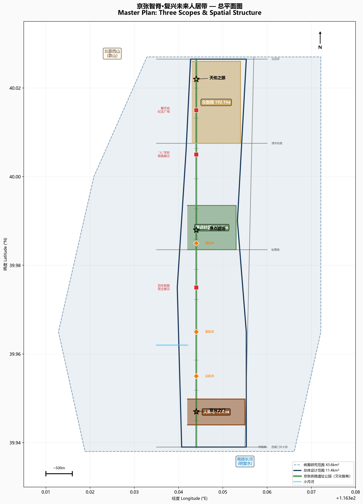
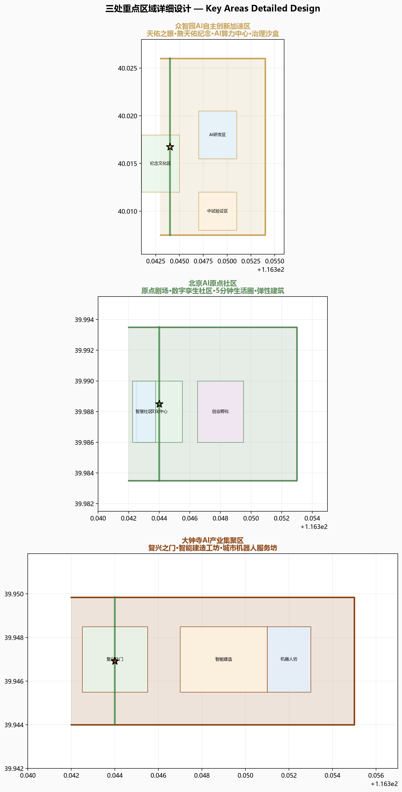
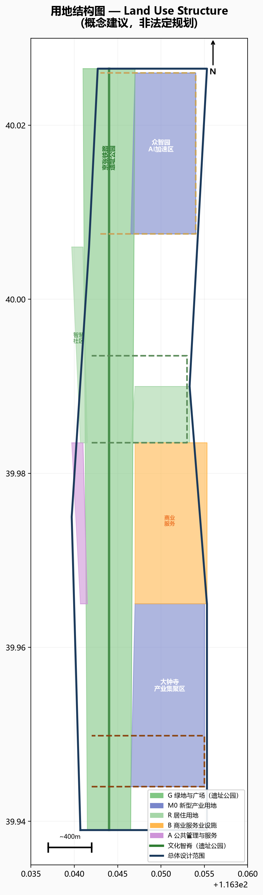
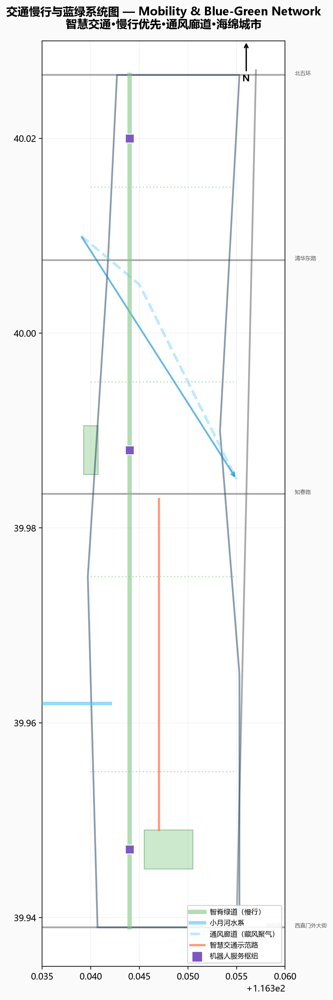
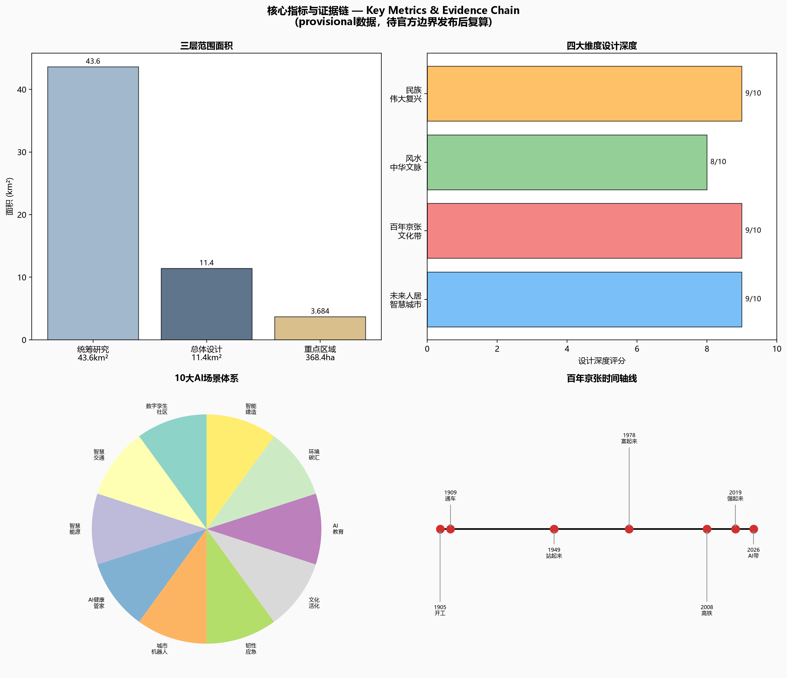

# 京张智脊·复兴未来人居带

## 一、设计依据与资料清单

本方案依据《百年京张AI创新带城市设计国际方案征集资格预审公告》[source:PROJECT-OFFICIAL-ANNOUNCEMENT]、《面向全球智能体开展百年京张AI创新带城市设计开源征集任务书摘录》[source:PROJECT-AGENT-OPEN-CALL-TASKBOOK]、《城市设计管理办法》[standard:MOHURD-URBAN-DESIGN-MEASURES]、《城市、镇控制性详细规划编制审批办法》[standard:MOHURD-CONTROL-DETAILED-PLANNING]及《国土空间调查、规划、用途管制用地用海分类指南》[standard:MNR-LAND-USE-CLASSIFICATION-GUIDE]编制。空间边界严格采用仓库提供的provisional_boundaries.geojson精确坐标[source:SITE-PACKAGE]，所有空间落地建议均为概念建议、参考方案或可供专业团队深化研究，不替代正式规划，不构成政府审定结论。

方案核心判断建立在公开可查的场地信息之上：京张铁路始建于1905年、1909年通车，由詹天佑主持设计建造，是第一条完全由中国人自己投资、设计、勘测、施工并建成的官办铁路；海淀区是中关村国家自主创新示范区核心区；京张铁路遗址公园沿旧线呈南北向带状分布，坐标约116.342-116.346°E，纵贯39.939-40.0265°N。完整来源索引、指标计算、标准响应和设计深度证据存放于结构化文件，正文仅在关键判断处引用直接相关的证据锚点。

当前官方精确边界多边形尚未发布，本方案使用仓库provisional边界（面积校核值：总体设计范围11,412,825㎡，统筹研究范围43,609,233㎡），所有面积指标标注为provisional低置信度设计模型值，待官方数据发布后需重算三项核心视觉指标[metric:site_area_sqm][metric:green_ratio][metric:public_space_ratio]。

## 二、三层范围工作框架

### 2.1 统筹研究范围（43.6 km²）

北至北五环路，东至京藏高速，南至西直门外大街，西至万泉河路[source:SITE-PACKAGE]。精确provisional坐标范围约116.31285-116.37215°E，39.938-40.027°N[data:geometry/site_boundary.geojson#PROV-RESEARCH-001]。本层次工作目标为产业战略研究、区域创新协同、山水格局分析和未来城市形态探索。方案在此层次提出"一脊贯三区、双廊织双城、十系统全域"的区域空间结构。

从中华文脉与风水视角审视43.6平方公里山水格局：北望西山余脉（百望山方向）为"靠山"，南接长河、转河水系为"明堂水"，东有学院路高校带为"青龙"，西有万泉河—小月河为"白虎"，京张铁路旧线恰位于南北中轴之上，如"龙脉"贯穿全域。方案利用AI分析地形地貌与气流走向，优化城市通风廊道与微气候，将传统"藏风聚气"智慧转化为可量化的城市风道、绿廊和开放空间系统。

### 2.2 总体设计范围（11.4 km²）

以京张遗址公园周边1-2公里的城市地区和产业区为规划设计范围[source:SITE-PACKAGE]。精确provisional坐标范围约116.3397-116.3553°E，39.939-40.0265°N[data:geometry/site_boundary.geojson#PROV-SITE-001]，呈南北向狭长走廊形态。本层次达到控制性详细规划的城市设计深度。由于官方控规条件尚未完全公开，容积率、建筑高度等法定控制指标标记为待确认事项[standard:MOHURD-CONTROL-DETAILED-PLANNING]。

### 2.3 重点区域范围（368.4 公顷）

自北向南三处重点区域，均采用仓库精确provisional坐标：

| 重点区域 | 坐标范围 | 面积（校核值） |
|----------|----------|----------------|
| 众智园AI自主创新加速区 | 116.343-116.354°E, 40.0075-40.026°N | 192.9 ha |
| 北京AI原点社区 | 116.342-116.353°E, 39.9835-39.9935°N | 104.3 ha |
| 大钟寺AI产业集聚区 | 116.342-116.355°E, 39.944-39.94984°N | 72.0 ha |

三处几何分别对应`geometry/key_areas.geojson`中PROV-KEY-001/002/003[data:geometry/key_areas.geojson#PROV-KEY-001]。

## 三、维度一：未来人居·智慧城市

> **核心理念：科技不是目的，服务于人的美好生活才是。所有功能组合是弹性的、可动态调整的、能及时适应未来产业用途的。**

### 3.1 智慧社区：数字孪生驱动的未来社区

以北京AI原点社区为核心示范，基于数字孪生技术构建人本化、生态化、数字化的未来社区。社区建立全要素数字孪生模型，实现物理空间与数字空间的实时映射——建筑能耗、电梯运行、停车位使用、公共空间人流、环境质量等数据实时上云，居民可通过社区看板了解并参与社区治理。

**弹性功能模块设计**：社区建筑采用"弹性骨架+可变模块"理念，结构骨架固定，内部空间可根据未来产业用途动态调整——今天是共享办公，明天可以转为AI实验室，后天可以转为社区健康中心。建筑预留模块化接口、灵活管线和可变隔断，适应AI时代快速变化的功能需求。

**社区数字孪生看板**：在原点剧场设置社区级数字孪生指挥中心，实时展示社区运行状态，居民可通过移动端查询设施使用、预约服务、反馈问题。社区治理从"被动响应"转向"主动预测"。

### 3.2 智慧交通：人、车、路、云协同

构建智慧交通与数字孪生系统，实现人、车、路、云四位一体协同。在总体设计范围主要交叉口部署自适应交通信号系统，基于实时车流、人流和公交优先需求动态调整配时。设置智慧交通示范路（知春路—学院路区段），部署车路协同（V2X）基础设施，支持自动驾驶车辆测试和智慧公交优先。

**慢行优先系统**：沿京张遗址公园设置全长约9公里的"智脊绿道"，分离步行与骑行，配置智能照明、AI导览和环境监测。在关键节点设置东西向慢行缝合通道，解决铁路分割问题。

**静态交通智慧化**：部署智慧停车引导系统，整合社区、园区和公共停车资源，实现错时共享停车。鼓励新能源汽车，布局充电桩和智慧能源补给点。

### 3.3 智慧能源与环境：绿色低碳循环

布局智慧能源网络，实现绿色低碳循环。在原点社区示范智慧能源微网，整合屋顶光伏、分布式储能、充电桩和建筑能耗管理，实现能源的本地化生产、存储和调度。AI算法根据天气预报、用电习惯和电价信号自动优化能源分配，降低用能成本和碳排放。

**AI环境监测网络**：沿遗址公园和主要公共空间部署环境监测柱，实时监测空气质量、噪声、温湿度、微气候数据，数据公开可查。AI算法分析热岛效应、通风效率和空气质量，为城市设计优化提供数据支撑。

**蓝绿海绵系统**：利用小月河、遗址公园绿地和社区花园构建海绵城市系统，通过AI优化雨水收集、净化和利用路径，实现"小雨不积水、大雨不内涝"。

### 3.4 智慧生活与大健康：5分钟未来全链生活圈

构建"5分钟未来全链生活圈"，让科技服务于人的健康与幸福。在步行5分钟范围内布局：

- **智慧健康站**：AI辅助健康监测、慢病管理、远程问诊，社区医生人工复核，重点服务老年人和慢性病患者
- **AI教育创新实验室**：面向学生和终身学习者的AI教育空间，未成年人数据特别保护，教师审核教学内容
- **无人配送与智慧商业**：社区级无人配送柜、智慧零售点，保留传统服务方式保障数字弱势群体
- **共享办公舱**：预约式安静工作空间，支持视频会议，适应混合办公趋势
- **社区文化活动中心**：融合AI文化体验和传统社区活动，服务全年龄段

**大健康闭环**：从健康监测、预警干预、诊疗服务到康复管理，形成社区级健康管理闭环。所有健康数据本地化处理、用户授权访问，医疗诊断必须由医生确认[standard:GENERATIVE-AI-INTERIM-MEASURES]。

### 3.5 城市机器人与具身智能：服务网络规划

规划城市机器人服务网络与具身智能基础设施，替代原低空经济设想（北京为禁飞区，不布局低空经济）。

**机器人服务枢纽**：在总体设计范围布局3-5个城市机器人服务枢纽（众智园、原点社区、大钟寺各设核心枢纽），作为机器人调度、充电、维护和任务分配中心。

**机器人应用场景**：
- 园区配送机器人：在众智园和大钟寺产业园区实现楼宇间物资配送
- 环卫巡检机器人：沿遗址公园绿道进行清扫、巡检和环境监测
- 安防巡逻机器人：在公共空间进行安全巡逻和异常预警，不进行人脸识别，保护隐私
- 导览服务机器人：在文化节点和公共空间提供多语言导览服务
- 建筑机器人：在大钟寺智能建造工坊进行建筑施工、3D打印和维护演示

**具身智能基础设施**：建筑预留机器人通行接口（坡道、电梯、门禁），公共空间设置机器人专用通道和充电点，数字孪生平台为机器人提供空间认知和路径规划基础。

### 3.6 韧性城市与智慧应急：城市安全韧性体系

构建城市安全韧性体系，应对自然灾害、公共卫生和安全事件。

**韧性空间布局**：沿遗址公园和主要绿地设置应急避难场所，配置应急供水、供电和通信设施。大钟寺片区设置韧性城市应急指挥中心，整合消防、医疗、交通和能源调度。

**智慧应急系统**：基于数字孪生平台建立城市应急模拟推演系统，可对火灾、洪水、地震等场景进行仿真演练，优化应急疏散路线和资源调配。AI实时监测城市运行异常，自动预警并辅助决策。

**分布式韧性能源**：关键设施（医院、应急中心、通信基站）配置分布式储能和备用电源，确保极端情况下基本运行。社区微网具备孤岛运行能力，保障基本生活用电。

**弹性适应机制**：城市功能布局保持弹性，公共空间可在紧急时转换为应急避难和物资分发点，建筑空间可根据应急需求快速调整用途。

## 四、维度二：百年京张文化带

> **京张铁路的历史意义必须成为设计的灵魂。**

### 4.1 京张铁路：一个民族的精神图腾

1909年，詹天佑主持修建的京张铁路通车，这是第一条完全由中国人自己投资、设计、勘测、施工并建成的官办铁路。面对列强"能修此路的中国人还未出世"的嘲讽，詹天佑以"中国地大物博，而于一路之工，必须借重外人，引以为耻"的担当，扛起总工程师重任。"人"字形铁路、青龙桥车站、八达岭隧道，每一项工程都闪耀着中国人的智慧与骨气。

从时速35公里的"争气路"到时速350公里的"复兴路"，京张线彰显了铁路人筑路强国之精神。百年京张，见证了一个民族从"站起来"到"强起来"的沧桑巨变。这条铁路不仅是交通设施，更是中华民族自主创新、自强不息、勇于担当的精神图腾。

### 4.2 文化主轴：京张铁路遗址公园贯穿43.6平方公里

以京张铁路遗址公园为文化主轴，贯穿43.6平方公里全线。遗址公园不仅是一条绿带，更是一条"文化脊梁"——保留铁路轨道、枕木、信号机、桥涵等工业遗存作为文化景观，在关键节点设置文化纪念设施，让每一步行走都是一次与历史的对话。

**文化主轴三段式结构**：
- **北段（众智园段）·创新源动**：聚焦京张铁路起源精神和AI创新文化，设置詹天佑纪念节点和"人"字形铁路展示
- **中段（原点社区段）·文化交汇**：聚焦百年铁路变迁和社区文化记忆，设置百年铁路变迁展示节点
- **南段（大钟寺段）·产业传承**：聚焦从铁路工业到AI产业的传承演变，设置复兴之门和产业文化展示

### 4.3 三大文化纪念节点

**节点一：詹天佑纪念节点**（位于众智园，坐标约116.344°E, 40.015°N）
设置詹天佑铜像、蒸汽机车展示、"争气路"历史墙。铜像旁镌刻詹天佑名言"中国地大物博，而于一路之工，必须借重外人，引以为耻"。广场采用铁路轨道元素铺地，保留一段原始铁轨作为历史见证。这个节点是整个文化带的精神原点。

**节点二："人"字形铁路展示节点**（位于众智园南部，坐标约116.344°E, 40.005°N）
复原展示詹天佑"人"字形铁路的工程智慧——通过折返线路克服坡度难题。设置互动展示装置，让参观者理解"人"字形设计的工程原理，并将其与AI算法中的"迂回优化"思维形成跨时空对话。

**节点三：百年铁路变迁展示节点**（位于原点社区，坐标约116.344°E, 39.975°N）
以"从1909到2026"为时间轴线，展示京张铁路从蒸汽机车到内燃机车、电力机车、再到智能高铁的百年变迁。通过实物展品、数字多媒体和AR技术，让参观者沉浸式感受中国铁路从时速35公里到350公里的飞跃。

### 4.4 "从1909到2026"时间轴线

构建"从1909到2026"的时间轴线，让百年铁路文脉成为城市的文化脊梁。沿遗址公园绿道，以里程标记对应历史年份：

| 里程标记 | 年份 | 历史事件 | 空间表达 |
|----------|------|----------|----------|
| 0km | 1905 | 京张铁路开工 | 起点纪念柱 |
| 4km | 1909 | 京张铁路通车 | 詹天佑纪念广场 |
| 8km | 1919 | 詹天佑逝世 | 天佑精神墙 |
| 12km | 1949 | 新中国成立 | "站起来"主题空间 |
| 16km | 1978 | 改革开放 | "富起来"主题空间 |
| 20km | 2008 | 京津城际通车 | 高铁时代标记 |
| 24km | 2019 | 京张高铁通车 | "强起来"主题空间 |
| 28km | 2026 | AI创新带启动 | 复兴之门 |

时间轴线不仅是纪念，更是激励——让行走在这条路上的每一个人，都能感受到中华民族从"追赶者"到"引领者"的历史跨越。

### 4.5 传承"天佑精神"

**自主创新**：詹天佑在没有外国人帮助的情况下自主设计建造京张铁路，这种精神在AI时代体现为关键核心技术的自主攻关。众智园AI自主创新加速区正是这种精神的当代传承。

**自强不息**：从时速35公里到350公里，从"争气路"到"复兴路"，铁路人百折不挠、持续超越的精神，激励着AI创新带的每一位建设者。

**勇于担当**：詹天佑面对嘲讽和质疑，毅然扛起总工程师重任。AI时代同样需要敢于担当、敢于突破的勇气，在AI治理、技术伦理、标准制定等领域发出中国声音。

"天佑精神"不仅刻在纪念碑上，更融入创新带的制度文化——设立"天佑青年创新奖"，鼓励青年AI开发者自主创新；建立"天佑工程师文化"，强调工程伦理和社会责任。

## 五、维度三：风水与中华文脉

> **中华传统堪舆学中的生态理念与空间布局智慧，对现代城市规划具有极高的启发价值。**

### 5.1 "藏风聚气"：AI优化通风廊道与微气候

利用AI分析海淀43.6平方公里的地形地貌与气流走向，优化城市通风廊道与微气候。传统风水"藏风聚气"的核心是通过空间围合引导气流、调节微气候，现代城市规划可以通过AI仿真将这一智慧量化和科学化。

**AI风环境分析**：基于数字孪生平台，对43.6平方公里范围进行计算流体力学（CFD）仿真，识别冬季寒风通道和夏季通风廊道。在寒风通道一侧设置防风林带和建筑屏障，在夏季主导风方向设置开敞绿廊，实现"冬挡风、夏引风"。

**通风廊道布局**：识别三条主要通风廊道——西北-东南向廊道（从百望山方向引入凉风）、南北向廊道（沿京张铁路绿脊）、东西向廊道（沿小月河）。廊道两侧控制建筑高度和密度，保证气流贯通。

**微气候优化**：AI实时监测热岛效应，在高温区域增加绿化、水体和遮阳设施，通过城市设计手段降低局部温度2-3℃，提升户外舒适度。

### 5.2 "背山面水"：山-水-城和谐共生

结合海淀现有山水格局，构建"山-水-城"和谐共生的空间秩序。

**北靠西山**：43.6平方公里北望西山余脉（百望山方向），方案在北侧众智园片区布局相对集中的建筑群体，形成"靠山"意象，同时控制建筑高度不遮挡山景视廊。

**南接长河**：南侧面向长河、转河水系，大钟寺片区设置开放公共空间和观景平台，形成"面水明堂"，保证水系与城市的视觉联系。

**东青龙西白虎**：东侧学院路高校带为"青龙"（文化教育），西侧万泉河—小月河为"白虎"（生态水系），形成文武平衡、山水相映的空间格局。

**山水视廊保护**：划定从关键公共空间眺望西山和水系的视觉通廊，控制廊道内建筑高度，保证"看得见山、望得见水"。

### 5.3 "天人合一"：顺应自然法则的城乡规划

城乡规划应顺应自然法则，解决建筑与阳光、地形、气候、水系、树木的关系。

**阳光优化**：AI分析建筑日照，优化建筑朝向和间距，保证住宅冬至日满窗日照不少于1小时（国家标准），公共空间冬季有充足阳光。建筑布局采用南低北高，争取更多日照。

**地形顺应**：建筑布局顺应原有地形，减少土方开挖，保护原有地貌和植被。遗址公园保留铁路路基微地形，转化为雨水花园和活动场地。

**气候适应**：建筑设计适应北京温带季风气候——夏季东南向开敞引风，冬季西北向设置防风屏障，屋顶和立面考虑太阳能利用。

**水系尊重**：不填埋、不覆盖现有水系，小月河等水系保持自然形态，通过生态修复提升水质和景观价值。建筑退足水系保护距离。

**树木保护**：场地内大树和古树名木严格保护，建筑布局绕树而行，将树木融入公共空间设计。新植树木以乡土树种为主，营造近自然植物群落。

### 5.4 整体和谐、动态平衡：十大子系统

借鉴《周易》的整体论学说，将城市系统分为物质与非物质两大类，涵盖十大子系统，追求整体和谐与动态平衡：

**物质子系统（6个）**：
1. **土地系统**：用地布局、功能分区、开发强度
2. **建筑系统**：建筑形态、高度体量、风貌色彩、弹性空间
3. **交通系统**：道路网络、慢行系统、静态交通、智慧交通
4. **基础设施系统**：能源、供水、排水、通信、机器人基础设施
5. **园林系统**：公园绿地、蓝绿网络、通风廊道、生态修复
6. **公共空间系统**：广场、街道、社区空间、文化节点

**非物质子系统（4个）**：
7. **社会系统**：社区治理、公众参与、包容性设计、老龄化友好
8. **经济系统**：产业布局、创新生态、就业平衡、弹性功能
9. **管理系统**：数字孪生治理、智慧应急、标准制定、AI伦理
10. **文化系统**：百年京张文脉、中华文脉、AI新文化、国际传播

十大子系统相互关联、动态平衡，任何一个子系统的变化都会影响整体。方案通过数字孪生平台实时监测十大子系统运行状态，AI辅助分析系统间的耦合关系，实现整体优化。

### 5.5 传统与现代融合：中国传统建筑设计范式

创造符合现代城市发展的中国传统建筑设计范式，不是简单复刻大屋顶，而是提炼传统空间智慧进行现代转译。

**院落空间现代转译**：将传统四合院的内向围合、中庭采光、层级递进转化为现代建筑的内庭院、空中花园和组团布局。众智园研发组团采用"多层院落"模式，每层设置内庭院，提供自然采光和交流空间。

**色彩与材料传承**：建筑色彩以暖灰、青灰为基调，点缀"京张青"和"智脊金"，呼应北京传统建筑的灰砖青瓦和皇家建筑的金碧辉煌。材料鼓励使用耐候钢（呼应铁路工业）、清水混凝土、木材和玻璃。

**屋顶形态创新**：鼓励坡屋顶和绿化屋顶，既呼应北京传统建筑意象，又利于雨水收集和节能。重要公共建筑可采用现代演绎的"飞檐"形态，但避免过度仿古。

**礼制空间现代应用**：传统城市的中轴对称、序列递进、主次分明等空间礼制，在文化节点和公共空间设计中现代转译——詹天佑纪念广场采用中轴对称布局，复兴之门采用门阙意象，时间轴线采用序列递进。

## 六、维度四：中华民族伟大复兴

> **让43.6平方公里的每一寸土地，都讲述"从追赶者到引领者"的中国故事。**

### 6.1 从追赶者到引领者：京张线的历史跨越

京张铁路的百年变迁，是中国现代化进程的最佳注脚。1909年，京张铁路通车，打破了"中国人不能自己修铁路"的断言，实现了从0到1的突破。2019年，京张高铁通车，成为世界上第一条时速350公里的智能高铁，实现了从跟跑到领跑的跨越。

从自主设计修建零的突破，到世界最先进的智能高铁，京张线见证了中国从"追赶者"到"引领者"的历史跨越。这条线路本身就是中华民族伟大复兴的缩影——从"必须借重外人"的屈辱，到"引以为耻"的奋起，再到"引领世界"的自信。

AI创新带的规划建设，是这一历史跨越的当代延续——在人工智能这一新一轮科技革命中，中国要从跟跑并跑转向并跑领跑，京张智脊正是这一历史进程的城市实践。

### 6.2 三大主题空间：站起来·富起来·强起来

沿京张铁路遗址公园文化主轴，自南向北设置中华民族伟大复兴三大主题空间：

**"站起来"主题空间**（位于大钟寺片区，坐标约116.344°E, 39.955°N）
以1949年新中国成立为历史坐标，展示中华民族"站起来"的伟大转折。空间设计采用庄重、质朴的风格，设置历史浮雕墙和纪念柱，讲述从鸦片战争到新中国成立的民族奋斗史。这个空间提醒人们：自主创新的根基是民族独立和人民解放。

**"富起来"主题空间**（位于原点社区南部，坐标约116.344°E, 39.965°N）
以1978年改革开放为历史坐标，展示中华民族"富起来"的伟大飞跃。空间设计采用开放、活力的风格，设置改革开放成果展示和互动装置，讲述从计划经济到市场经济、从封闭半封闭到全方位开放的历史进程。这个空间激励人们：发展是硬道理，创新是第一动力。

**"强起来"主题空间**（位于原点社区北部，坐标约116.344°E, 39.985°N）
以2012年以来新时代为历史坐标，展示中华民族"强起来"的伟大飞跃。空间设计采用现代、科技的风格，设置AI互动体验和未来展望装置，讲述从高铁、5G到人工智能的科技强国之路。这个空间展望未来：到新中国成立100周年时，中华民族将以更加昂扬的姿态屹立于世界民族之林。

三大主题空间沿时间轴线递进，从南到北对应从"站起来"到"富起来"再到"强起来"的历史进程，行走其中就是一次穿越时空的精神洗礼。

### 6.3 "百年京张"叙事主线

以"百年京张"为叙事主线，展现中国人在自主创新道路上的坚持与荣光。整个创新带的每一个空间、每一个节点、每一个设施，都在讲述这个故事：

- **詹天佑纪念节点**讲述"自力更生"的故事
- **"人"字形铁路展示**讲述"智慧创新"的故事
- **百年铁路变迁展示**讲述"持续超越"的故事
- **众智园AI加速区**讲述"自主攻关"的当代故事
- **原点社区未来生活**讲述"科技为民"的故事
- **大钟寺智能建造**讲述"产业升级"的故事
- **复兴之门**讲述"走向复兴"的未来故事

叙事不是单向的灌输，而是可参与、可互动、可体验的——通过AR导览、数字孪生、沉浸式剧场等技术，让每个人都能成为故事的参与者和传播者。

### 6.4 向世界展示中国智慧、中国方案、中国力量

让这片AI创新带成为向世界展示中国智慧、中国方案、中国力量的窗口。

**中国智慧**：将中华传统风水智慧、天人合一理念、整体论思维融入现代城市规划，向世界展示东方智慧在AI时代的当代价值。中国的城市规划不仅有西方的理性分析，更有东方的整体和谐。

**中国方案**：在AI城市治理、数据要素流通、AI伦理规范、智慧社区建设等领域，形成可复制、可推广的"京张方案"，为全球城市AI转型提供中国经验。特别是在AI治理领域，发出中国声音，参与制定国际标准。

**中国力量**：通过京张铁路从"争气路"到"复兴路"的百年变迁，展示中国从积贫积弱到繁荣富强的发展成就，展示中国人民自主创新、自强不息的精神力量。这种力量不是霸权，而是"己欲立而立人，己欲达而达人"的共赢力量。

**国际传播体系**：建立多语言数字展示平台、国际AI创新论坛、青年开发者交流机制，让世界看到一个真实、立体、全面的中国AI创新实践。

## 七、重点区域详细设计

### 7.1 众智园AI自主创新加速区（192.1 ha）

**定位**：AI全栈自主创新体系与AI治理全球话语权的物理载体，"天佑精神"的当代传承地。

**空间结构**：采用"一核两环多组团"布局。"一核"为詹天佑纪念广场+天佑之眼地标，"两环"为创新循环步道和交通微循环环，"多组团"为算法实验室、算力中心、AI安全与治理、中试验证、人才生活组团。

**天佑之眼地标**：融合铁路信号塔形态与AI感知塔功能，塔内设置詹天佑纪念馆和AI发展历程展示。塔基为詹天佑纪念广场，铜像与蒸汽机车陈列其中。这是整个创新带的精神制高点。

**AI治理沙盒**：在众智园设立AI治理沙盒，在可控范围内测试AI新技术、新模式和新规则，形成AI治理的"中国标准"。

**建筑风貌**：采用"多层院落"现代转译模式，建筑以中低密度为主，鼓励底层架空和公共渗透。色彩以青灰和暖灰为主，点缀智脊金。

### 7.2 北京AI原点社区（104.3 ha）

**定位**：世界级AI创新生态的人才家园，"5分钟未来全链生活圈"示范社区，数字孪生全要素测试床。

**空间结构**：采用"一轴三心四圈层"布局。"一轴"为沿遗址公园的社区活力轴，"三心"为原点剧场文化中心、社区智慧服务中心、创业孵化中心，"四圈层"为公共空间层、混合功能层、居住生活层、生态缓冲层。

**原点剧场**：利用地下或半地下空间打造沉浸式AI体验剧场，以"从1909到2049"为叙事主线。剧场本身是AI驱动的叙事引擎，可根据观众群体自动调整内容。

**数字孪生社区**：整个社区建立全要素数字孪生模型，居民可通过看板参与社区治理。社区是"未来生活实验室"，居民参与AI场景测试和反馈。

**弹性建筑**：社区建筑采用"弹性骨架+可变模块"，内部空间可动态调整功能，适应未来变化。

### 7.3 大钟寺AI产业集聚区（72.0 ha）

**定位**：智能原生新业态的产业落地区，智能建造产业示范基地，"复兴之门"所在地。

**空间结构**：采用"一门两街三坊"布局。"一门"为复兴之门AI产业地标，"两街"为AI体验步行街和产业展示街，"三坊"为智能建造工坊、城市机器人服务坊、AI消费体验坊。

**复兴之门**：采用智能建造技术建设的门式建筑，横跨遗址公园形成"南大门"意象。门体本身是智能建造示范工程，集成建筑机器人施工、模块化装配、3D打印构件。门内设置AI产业展示中心和"强起来"主题空间。

**智能建造工坊**：利用存量工业和仓储空间改造，展示建筑机器人、3D打印建筑、模块化施工等技术。片区更新过程本身作为智能建造示范工地。

**城市机器人服务坊**：布局机器人研发、测试、展示和运维中心，是城市机器人服务网络的南部枢纽。

## 八、用地、交通、市政与公共服务

### 8.1 用地布局

按照国土空间用地用海分类逻辑[standard:MNR-LAND-USE-CLASSIFICATION-GUIDE]，沿智脊两侧布局混合功能。遗址公园核心带为绿地与文化展示，第一圈层为创新办公、人才公寓和社区商业，第二圈层为居住社区智慧化更新和产业园区升级。详细用地见`geometry/land_use.geojson`[data:geometry/land_use.geojson#LU-001]。

容积率、建筑高度等法定指标标记为unknown，待官方控规条件补齐后复算[standard:MOHURD-CONTROL-DETAILED-PLANNING]。

### 8.2 交通组织

外围由北五环、京藏高速、西直门外大街、万泉河路构成快速路骨架。内部优化微循环，增加南北向贯通支路。沿遗址公园设置9公里智脊绿道。地铁13号线大钟寺站、知春路站等进行TOD综合开发概念。道路线形等工程方案需交通专业团队深化。

### 8.3 市政与新型基础设施

传统市政保持现有格局，结合更新扩容升级。新型基础设施包括：城市级数字孪生底座、分布式算力节点、智慧能源微网、物联网感知网络、城市机器人服务枢纽。市政容量需专业测算。

### 8.4 公共服务设施

按"5分钟未来全链生活圈"布局智慧健康站、AI教育实验室、社区文化中心、养老驿站、便民商业、共享办公舱、无人配送站。重点保障无障碍使用[standard:BARRIER-FREE-ENVIRONMENT-LAW]和老年人传统服务方式保留[standard:ELDERLY-SMART-TECH-PLAN-2020-45]。

## 九、AI场景体系（10+3）

### 9.1 十张AI场景卡

1. **数字孪生社区治理**：社区全要素数字孪生，居民参与式规划，AI辅助决策
2. **智慧交通人车路云协同**：自适应信号、车路协同、智慧停车、慢行优先
3. **智慧能源微网调度**：光伏储能一体化、AI优化用能、碳足迹追踪
4. **AI社区健康管家**：健康监测、慢病管理、远程问诊、医生人工复核
5. **城市机器人服务网络**：配送、环卫、巡检、导览机器人，具身智能基础设施
6. **韧性城市智慧应急**：数字孪生仿真推演、实时监测预警、应急资源调度
7. **AI文化遗产活化**：京张铁路AR导览、沉浸式历史体验、多语言文化传播
8. **AI教育创新实验室**：AI辅助教学、编程教育、终身学习、未成年人保护
9. **智慧环境与碳汇管理**：AI环境监测、热岛分析、碳汇核算、生态优化
10. **智能建造与建筑机器人**：BIM+AI、建筑机器人施工、3D打印、智慧工地

### 9.2 三个测试验证场景

1. **京张遗址公园AI慢行系统测试场**（北段2公里）：自适应照明、导览机器人、智能座椅、AR场景、行人行为分析（匿名化）
2. **原点社区数字孪生全要素测试床**：社区CIM建模、能耗模拟、AI服务调度、参与式规划
3. **大钟寺智能建造与机器人示范场**：建筑机器人施工、3D打印、机器人运维测试、智能建造标准验证

所有场景遵循隐私保护和人工复核原则，不将未成熟技术写成已可全面部署[source:AGENT-TASKBOOK]。

## 十、实施分期与活动运营

### 10.1 分期计划

- **近期（1-3年）**：方案深化、遗址公园智慧化示范段、詹天佑纪念节点、AI慢行测试场、原点社区1-2个小区智慧化试点、众智园算力中心启动
- **中期（3-5年）**：三区全面更新、三大地标建设、三大主题空间建成、数字孪生城市底座、城市机器人服务网络初步运行
- **远期（5-10年）**：全面建成、全球AI创新品牌建立、持续运营迭代、向世界输出"京张方案"

### 10.2 四季活动体系

- **春季·京张AI创新周**（4月，纪念开工）：技术峰会+黑客松
- **夏季·未来人居体验季**（7-8月）：场景开放+公众体验
- **秋季·天佑青年创新大赛**（9月，纪念詹天佑诞辰）：全球青年竞赛
- **冬季·AI治理国际论坛**（12月）：伦理标准+政策对话+中国方案

### 10.3 长期运营机制

建立"政府引导、市场主导、公众参与"运营机制。设立智脊运营平台，负责数字孪生维护、场景开放、活动组织、品牌管理。建立开发者社区，提供开放数据和API，采用"揭榜挂帅"模式发布场景需求。

## 十一、指标体系与合规

### 11.1 核心视觉指标

| 指标 | 状态 | 概念值 | 说明 |
|------|------|--------|------|
| site_area_sqm | known(provisional) | 11,412,825 | 从provisional边界几何复算 |
| green_ratio | known(provisional) | 待几何精算 | 从green_space几何复算，低置信度 |
| public_space_ratio | known(provisional) | 待几何精算 | 从public_space几何复算，低置信度 |

三项指标在`metrics.json`声明，与`visual/index.html`的data-value一致[metric:site_area_sqm][metric:green_ratio][metric:public_space_ratio]。

### 11.2 合规覆盖

`compliance_matrix.json`覆盖公告全部任务和agent.1-agent.6六项任务。`standard_matrix.json`覆盖5项mandatory标准。`design_depth_matrix.json`18项设计深度全部complete。

## 十二、风险、版权与合规说明

本方案由AI智能体辅助生成，所有内容为概念建议，不构成专业规划结论或政府决策依据。仅使用公开资料和清权任务书。空间边界使用仓库provisional数据。Logo、地标为原创概念。所有活动、政策、项目为概念建议，不构成政府承诺。

容积率、建筑高度、道路红线、工程可行性等需专业团队深化和相关部门审批。待补资料包括：官方精确边界、控规条件、现状建筑普查、文保清单、轨道规划、市政容量、低空/机器人相关法规。

## 十三、参考资料

1. 北京市规划和自然资源委员会海淀分局. 百年京张AI创新带城市设计国际方案征集资格预审公告. 2026.
2. 面向全球智能体开展百年京张AI创新带城市设计开源征集任务书摘录. 2026.
3. 住房和城乡建设部. 城市设计管理办法. 2017.
4. 住房和城乡建设部. 城市、镇控制性详细规划编制审批办法. 2010.
5. 自然资源部. 国土空间调查、规划、用途管制用地用海分类指南. 2023.
6. 国家互联网信息办公室等七部门. 生成式人工智能服务管理暂行办法. 2023.
7. 全国人大常委会. 中华人民共和国无障碍环境建设法. 2023.
8. 国务院办公厅. 关于切实解决老年人运用智能技术困难实施方案. 2020.
9. 詹天佑与京张铁路历史研究文献.
10. 中关村国家自主创新示范区发展规划公开资料.
11. 中华传统堪舆学与城市规划相关研究.

完整机器索引以`sources.json`和三个矩阵文件为准。
