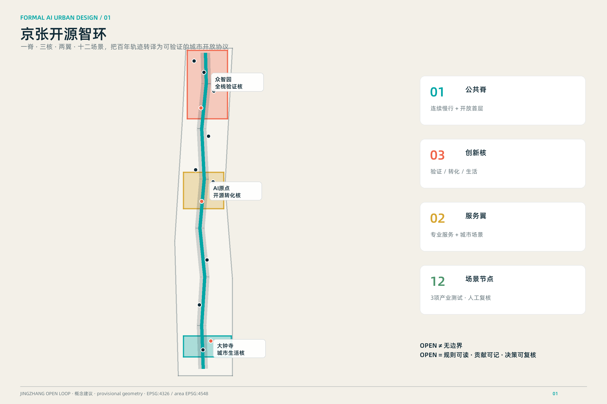
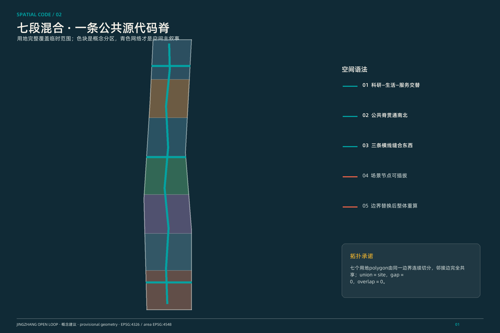
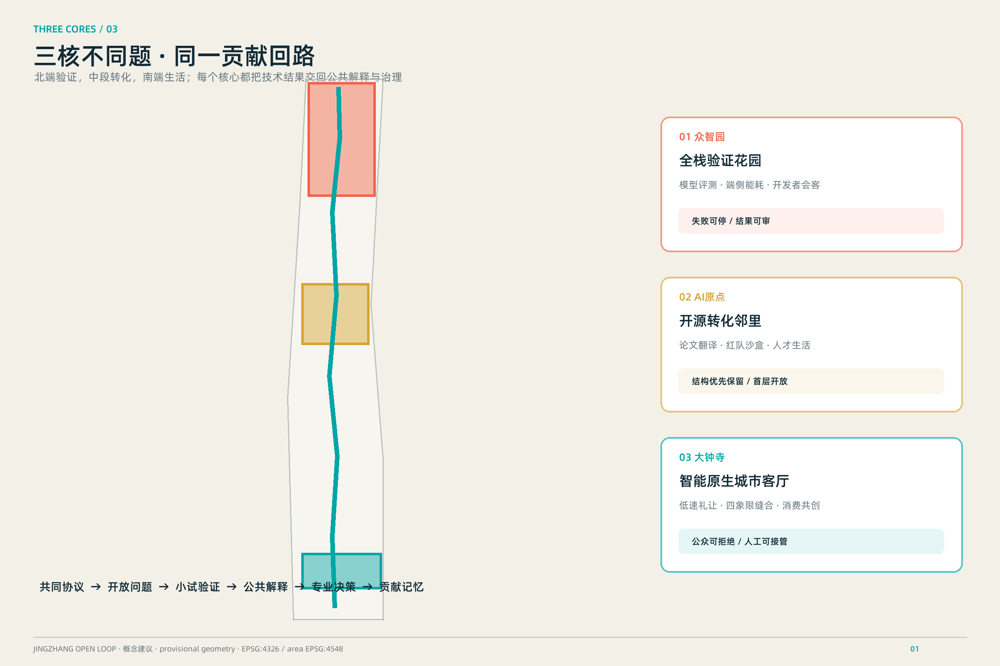
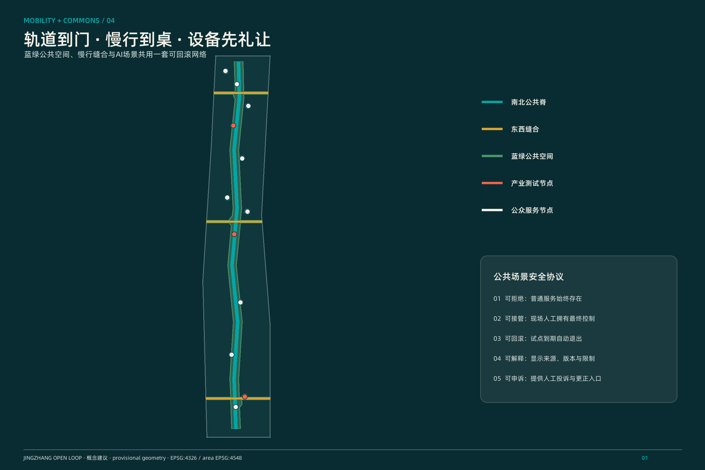
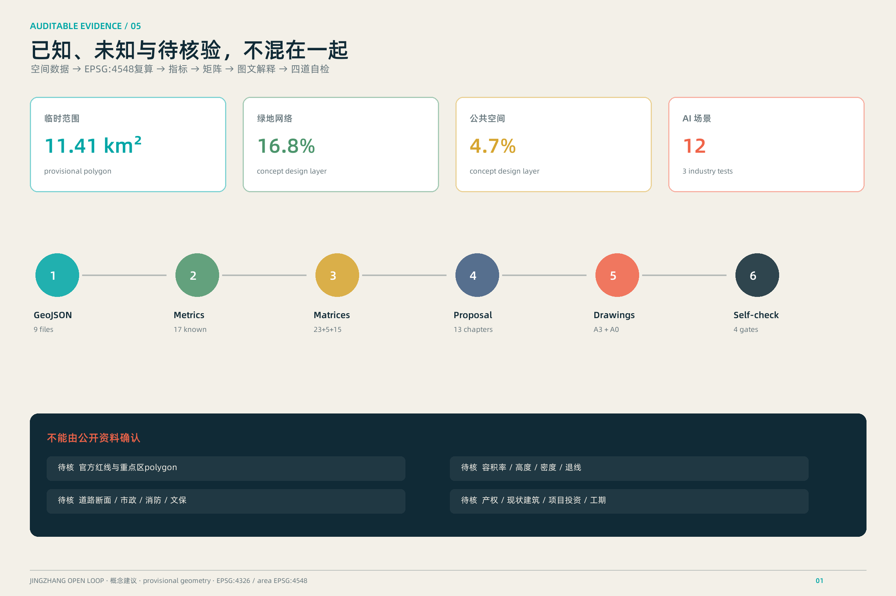

# 京张开源智环 / JINGZHANG OPEN LOOP

> 百年铁路曾把知识、人口与产业带入北京；下一百年，让这条轨迹成为一段可以共同阅读、共同测试、共同修订的城市“开放源代码”。本方案是开放共创建议，不替代正式规划，不构成政府审定结论。

## 设计依据与资料清单

本方案以官方公告确认项目名称、三层范围、约面积与设计任务，以清权的智能体任务书确认三大定位、五大功能、六项必答任务和越界禁区。[source:OFFICIAL-ANNOUNCEMENT] [source:AGENT-TASKBOOK] 城市设计、控规深度与用地分类分别依据本地标准快照，但标准只能约束表达与证据链，不能补造本项目控规条件。[source:URBAN-DESIGN-MEASURES] [source:CONTROL-DETAILED-PLANNING] [source:LAND-USE-CLASSIFICATION] [standard:PROJECT-OFFICIAL-ANNOUNCEMENT] [standard:PROJECT-AGENT-OPEN-CALL-TASKBOOK] [standard:MOHURD-URBAN-DESIGN-MEASURES] [standard:MOHURD-CONTROL-DETAILED-PLANNING] [standard:MNR-LAND-USE-CLASSIFICATION-GUIDE]

`data/source_registry.json`负责判定资料用途，处理事实包只作阅读导航，不升级任何事实确定性。[source:SOURCE-REGISTRY] [source:PROCESSED-FACT-PACK] 当前总体边界和三处重点区均来自仓库临时粗略polygon，只用于生成、展示和intake自检。[source:PROVISIONAL-BOUNDARIES] [data:geometry/site_boundary.geojson#SITE-001] [data:geometry/key_areas.geojson#PROV-KEY-001] 对应影响被拆为九项假设：官方polygon、控规、道路、地块、建筑、文保、市政、服务设施和全球案例。任何需要这些资料才能成立的结论都保持“待确认”或“概念建议”。

## 三层范围工作框架

统筹研究范围43.6平方公里处理“为什么形成AI创新带”：构建三区两翼要素回路与全球协作接口；总体设计范围11.4平方公里处理“空间如何适配AI”：以公共脊、横向缝合、功能混合和可逆更新组织工作—生活—社交—学习；三处重点区约368.4公顷处理“怎样被看见和验证”：把任务拆成空间原型、场景协议和运营闭环。[source:OFFICIAL-ANNOUNCEMENT] [depth:three_level_scope_framework] [depth:existing_conditions_diagnosis]

三层不是三张互不相干的图。产业战略先定义“研究—开源—验证—采用—治理”五步链，总体设计把五步链投影到一条南北公共脊和三条东西缝合线，重点区再分别承担全栈验证、原始创新转化、智能原生消费三种角色。[data:geometry/roads.geojson#ROAD-001] [data:geometry/land_use.geojson#LU-001] 边界若替换为官方polygon，必须重新裁切用地分区、绿地、公共空间、建筑原型和分期；随后在EPSG:4548重算全部面积、比例与图纸。当前11,412,825平方米是provisional polygon的投影复算值，不是官方精确红线面积。[metric:site_area_sqm]

## 统筹研究范围产业与未来城市研究

主名称“京张开源智环”强调三个动作：京张是不可替代的地域记忆；开源意味着规则可读、贡献可记、场景可复核；智环意味着研究、产业、生活和治理形成反馈而非单向招商。英文名 `JINGZHANG OPEN LOOP` 使用开口环符号：两条平行轨迹在三个节点交汇但保留一处开口，表达系统永远允许公众与新贡献进入。Logo方向只使用自绘几何线、系统字与青绿/砖红/铁路金三色，不借用企业标识。[source:AGENT-TASKBOOK] [depth:overall_spatial_structure]

空间结构概括为“一脊、三核、两翼、十二场景”：一脊是京张遗址公共脊；三核依次是众智园全栈验证核、AI原点开源转化核、大钟寺智能原生生活核；中关村科技服务翼提供知识产权、资本和专业服务接口，小月河场景翼提供公共体验与城市验证界面。五大功能被组织成闭环：自主创新产出可测试模型，生态网络配置要素，场景网络完成小规模验证，活力城市让公众获得可理解的服务，治理接口把反馈写回下一轮设计。

全球案例只作背景机制比较，不作本项目控制依据：[source:CASE-MIT-KENDALL]的混合功能与社区协商提示“创新区也必须是生活区”；[source:CASE-VECTOR-TORONTO]的研究—人才—采用链提示建立行业转化接口；[source:CASE-MILA-MONTREAL]的多高校共同体提示共享研究与社区文化并重；[source:CASE-DATAIA-PARIS-SACLAY]提示以跨学科议题而非单一楼宇组织合作；[source:CASE-STATION-F]提示用项目组合、共享服务和高频事件降低创业门槛；[source:CASE-JTC-ONE-NORTH]的产业集群与living lab提示把测试、工作、生活和公共沟通放在同一治理框架中。转化后的共同原则是“小尺度混合、共享中介、开放事件、可控测试、公共反馈”，不复制任何案例的规模、投资或政策。[source:PROVISIONAL-BOUNDARIES]

## 总体设计范围城市更新与控规深度城市设计

总体范围采用“保留城市肌理、增补公共协议”的更新观：不把AI理解为新建一批封闭园区，而是用开放一层、共享会议、可移动试验舱、夜间学习和沿线公共客厅，把校区、园区、社区之间的接口做厚。用地分区由同一边界拓扑切分，七个南北段完整覆盖临时范围；科研、生活、商业与公园功能沿公共脊交替，避免单一功能造成的潮汐通勤。[data:geometry/land_use.geojson#LU-004] [standard:MNR-LAND-USE-CLASSIFICATION-GUIDE] [depth:land_use_layout]

更新项目清单不落到宗地和产权，而是定义六类可供专业团队深化的“动作包”：开放首层与共享门厅、存量建筑轻介入适配、轨道站点周边慢行缝合、遗址公园场景驿站、低速设备测试口袋场、分布式端侧算力服务点。每个动作包都要经过公开来源核验、产权/文保/交通/消防核查、最小可行试点、公众评估和可回滚退出五个门槛。[data:geometry/buildings.geojson#BLDG-001] [data:geometry/phasing.geojson#PHASE-001] [depth:renewal_project_list]

建筑强度、容积率和高度没有官方条件，因此不设审定数值；图中的十五个建筑基底仅是“可逆更新原型”，用于演示功能、公共空间和交通关系，而非现状建筑或建设规模。[metric:building_footprint_area_sqm] [metric:building_footprint_ratio] [depth:development_intensity_controls] [depth:height_massing_character] 城市风貌采用“铁路结构的诚实、校园尺度的克制、AI界面的可解释”：保留可识别的砖、钢和轨迹语言，新介入优先轻质、可拆、低眩光，夜间信息界面默认静默，只有人主动接近时才展开。

## 重点区域详细设计

### 众智园：全栈验证花园

众智园承担从基础模型、算力、系统软件到安全治理的验证接口。概念空间以北段花园型研发带为底，公共脊串联“模型评测廊、端侧算力能耗验证庭、全球开发者会客厅”，横向缝合线连接清河生态课堂。产业试验必须采用预约、分区、数据最小化和人工停机机制；任何设施规模和建筑更新需官方资料与专业团队深化。[data:geometry/key_areas.geojson#PROV-KEY-001] [data:geometry/constraints.geojson#SCN-09] [depth:three_key_area_detailed_design]

### AI原点社区：开源转化邻里

原点社区把“离校最近的一公里”变成从论文到原型、从原型到公共理解的翻译空间。空间结构是开源孵化客厅、模型安全红队沙盒、人才生活协作站和校区—园区慢行缝合线。建筑策略优先保留结构、改造首层和院落、增补共享小空间；拆除、新建、高度与容量均不判断。场景协议要求研究团队公开用途、数据边界、失败条件和人工复核入口。[data:geometry/key_areas.geojson#PROV-KEY-002] [data:geometry/constraints.geojson#SCN-05] [depth:retain_renovate_demolish]

### 大钟寺：智能原生城市客厅

大钟寺承担AI进入日常消费、商务、文化和通勤的公共界面。概念建议围绕地铁站四象限组织步行缝合、非机动车秩序、智能体消费共创台、低速机器人礼让测试场和铁路算法观察站。测试场不是获批运营道路：默认低速、限定时段、物理隔离、人工接管、弱势群体优先，并在异常时退化为普通公共空间。[data:geometry/key_areas.geojson#PROV-KEY-003] [data:geometry/roads.geojson#ROAD-002] [standard:MOHURD-URBAN-DESIGN-MEASURES]

三处重点区共享同一“贡献通行证”：研究贡献、开源维护、公共服务、测试发现与文化叙事都可被记录，但不记录个人敏感行为，也不形成信用分。贡献展示只展示自愿提交、可撤回的项目与团队信息。三处临时polygon只是索引，面积、道路、建筑和权属结论必须在official polygons与调查资料到位后重做。

## AI 创新生态、人才画像与 AI+ 场景

五类核心画像分别是：研究者需要跨机构协作与安静专注；创业团队需要低成本试验与专业服务；产业工程师需要可控真实场景和评测工具；居民与访客需要有用、可拒绝、能求助的公共服务；城市运营与专业人员需要可审计日志、人工复核和明确责任。第六类“儿童、老人、残障人士等易受影响者”不是边缘用户，而是所有公共场景的优先压力测试对象。

十二张场景卡全部对应`SCENARIO_NODE`，其中三项是产业测试验证场景。[data:geometry/constraints.geojson#SCN-01] [metric:scenario_node_count] [metric:industrial_test_scenario_count]

| 场景卡 | 空间—对象—运营 | 数据与人工复核边界 |
|---|---|---|
| SCN-01 智能体消费共创台 | 大钟寺城市客厅；消费者、创业团队；轮换演示 | 仅自愿交互；明显退出键；人工服务兜底 |
| SCN-02 低速机器人礼让测试场〔产业测试〕 | 限定口袋场；设备团队、行人；预约测试 | 不做人脸识别；人工安全员与急停；异常即停 |
| SCN-03 AI通勤协商站 | 换乘节点；通勤者；多方式建议 | 只处理匿名即时需求；不替代交通调度 |
| SCN-04 无障碍路径伴行 | 公共脊；视障、行动不便者；路径辅助 | 端侧优先；用户确认；可随时切换人工帮助 |
| SCN-05 模型安全与红队沙盒〔产业测试〕 | 原点社区；研究与治理团队；隔离评测 | 合成/清权数据；双人复核；结果分级公开 |
| SCN-06 开源成果翻译台 | 原点社区；公众、研究者；通俗解释 | 展示来源与版本；允许质疑和更正 |
| SCN-07 人才生活协作站 | 混合社区；新就业者、家庭；服务导航 | 不形成画像评分；服务机构人工确认 |
| SCN-08 城市知识问答亭 | 公共脊；访客、居民；文化与服务问答 | 只用公开知识库；答案显示出处和不确定性 |
| SCN-09 端侧算力能耗验证〔产业测试〕 | 众智园；工程师、设施团队；负荷试验 | 不接入真实关键系统；人工批准测试窗口 |
| SCN-10 清河生态识别课堂 | 北段绿地；学生、公众；自然学习 | 不采集生物敏感位置；专家审校科普内容 |
| SCN-11 贡献者荣誉墙 | 众智园公共客厅；开源社区；荣誉展示 | 自愿署名、可撤回；不做行为排名 |
| SCN-12 全球开发者会客厅 | 北端门户；开发者、机构；共创活动 | 活动均为建议；参与规则公开、成果可追溯 |

生态运营采用“开放问题—小规模原型—独立评测—公共解释—专业决策”循环。场景不能直接进入城市关键系统，不能以指定供应商为前提，不能用不可解释模型替代行政、医疗、法律或安全判断。每个场景都配失败模式、人工负责人、退出机制和数据删除周期，确保AI增强人的能力而不是削弱人的选择权。

## 用地、建筑规模与拆改留方案

七段用地分区面积由统一拓扑复算：科研用地概念分区[metric:land_use_area_0802_sqm]，居住/人才生活支持分区[metric:land_use_area_0701_sqm]，商业服务与城市客厅分区[metric:land_use_area_05_sqm]，公园绿地分区[metric:land_use_area_1401_sqm]。这些数值只描述提交的概念设计层，不是法定用地、权属面积或规划许可。[data:geometry/land_use.geojson#LU-007] [standard:MOHURD-CONTROL-DETAILED-PLANNING]

拆改留采用四级判断门而不是预设结论：第一门核验产权、结构安全、文保和现状用途；第二门比较保留结构、适配更新和临时嵌入的碳与成本；第三门验证公共利益、租赁可达性和产业需要；第四门才由专业团队形成项目方案。当前`buildings.geojson`展示十五个原型位置，全部标注为概念而非现状。优先顺序是“留结构—改首层—补共享—必要时新建可逆体”，不提交具体地块拆除结论。[data:geometry/buildings.geojson#BLDG-008] [depth:retain_renovate_demolish]

功能混合不是简单叠加比例，而是按24小时节律配置：研发空间白天主导，学习与展示延伸至傍晚，生活服务覆盖周末，安静居住保持夜间优先。地面层连续设置可进入的灰空间、公共卫生间、饮水、无障碍休息和小型会议；屋顶与机房策略须在结构、消防、能耗和文保核验后另行深化。总建筑面积、容积率、建筑高度仍为unknown，不能由概念基底反推。

## 交通、轨道、市政与公共服务设施

交通概念是“轨道到门、慢行到桌、设备先礼让”。一条南北公共脊服务连续步行与骑行，三条东西缝合线分别回应大钟寺四象限、原点校区—园区、众智园—清河联系；它们是关系线而不是道路红线或工程线位。[data:geometry/roads.geojson#ROAD-004] [metric:road_length_m] [depth:traffic_rail_slow_parking] 站点周边优先改善路口等待、非机动车停放、夜间照明和雨雪连续性，再讨论跨线或地下工程。

新型基础设施采用“边缘小站+共享平台+断网降级”三层架构。边缘小站只处理低风险即时服务；共享平台提供授权、模型版本、审计、仿真和能耗记录；断网时公共服务退化为清晰标识和人工流程。端侧算力热负荷、供电等级、通信冗余、市政容量与消防条件尚缺，方案只提出负荷分级、余热复用、可插拔和能耗上限治理原则。[data:geometry/constraints.geojson#SCN-09] [depth:municipal_new_infrastructure]

公共服务设施采用“十五分钟人才生活底盘”清单：托育与家庭支持、夜间学习、健康导航、法律与知识产权咨询、就业与创业服务、体育休息、文化交流。数量和半径需在设施底数与人口资料补齐后校准。所有AI服务显示服务主体、数据用途、人工入口和投诉渠道，不把“智能”作为取消人工服务的理由。

## 蓝绿空间、公共空间与城市风貌

京张遗址公园被定义为“城市开放源代码主界面”：北段串联清河生态课堂与全栈验证花园，中段串联开源成果翻译台与人才协作站，南段串联智能原生城市客厅。绿地和公共空间分别从同一概念网络复算，绿地面积[metric:green_space_area_sqm]、比例[metric:green_ratio]，公共空间面积[metric:public_space_area_sqm]、比例[metric:public_space_ratio]。[data:geometry/green_space.geojson#GREEN-001] [data:geometry/public_space.geojson#PUBLIC-001] [depth:blue_green_public_space]

四个AI朝圣与荣誉节点构成非纪念碑式地标体系：[metric:landmark_count] “开源零公里”标记公开问题的起点；“贡献者墙”记录可撤回的开源与公共服务贡献；“铁路算法观察站”把铁路调度史与现代可解释决策并置；“AI公民论坛”以可移动圆桌承载模型发布、失败复盘和公众质询。地标首先是制度和活动，其次才是物体；文保和绿地控制未核验前，只采用可移动、低照度、无基础或可恢复构造。

文化叙事不是给铁路贴电子屏。第一层“工程报国”讲京张铁路的自主工程传统；第二层“试验田”讲中关村从科研到产业的开放协作；第三层“可验证智能”要求AI时代把模型来源、限制和责任公开。导视系统用双线轨迹表示证据来源与公众反馈，节点编号与GeoJSON一致；国际传播句为 `Follow the track. Read the system. Add your contribution.`，中文为“循轨而行，读懂系统，留下贡献”。

## 更新项目清单、实施政策与分期计划

三期不是确定工期，而是由资料与验证触发的自适应序列。[data:geometry/phasing.geojson#PHASE-002] [metric:phase_count] [depth:phasing_implementation] 近期先做不依赖大工程的公共脊标识、场景协议、贡献展示和无障碍试点；中期在官方边界、现状调查和专业论证完成后深化三核公共空间与建筑适配；远期在独立评估证明公共价值后扩展两翼协作、国际活动和成熟场景。任何阶段都保留暂停、回滚和替换供应商的能力。

年度运营建议形成“四季一总会”：春季开源问题发布周、夏季城市AI小规模测试季、秋季京张文化与技术节、冬季模型安全与公共利益复盘会，年末举行全球AI城市共同体论坛。周常运营包括开发者门诊、公众问题台、场景开放时段和失败案例档案。它们是运营参考方案，不是已确定活动或财政安排。

政策工具以过程为对象：场景开放需公开用途、责任、时限和退出；公共数据使用需最小化、分级授权和可撤回；空间使用需临时许可、无障碍与邻里协商；成果转化需开源许可、知识产权和公共利益条款；项目评价同时看技术有效性、公众可理解性、公平性、能耗和维护成本。招引转化路径是“活动认识—问题匹配—小试验证—独立评测—专业决策”，不以企业数量或投资额作未经来源的承诺。

## 指标体系、面积复算与合规矩阵

指标分三层。第一层是可从提交几何复算的空间指标：临时范围面积、概念建筑基底、绿地、公共空间、道路联系长度和各类概念用地；第二层是任务产出计数：12个场景、3个产业测试场景、4个地标、3个重点区、3个阶段；第三层是必须等待官方资料的控规与实施指标：总建筑面积、容积率、建筑高度、道路容量、市政负荷和项目投资。已知与未知不混写。[depth:metrics_recalculation]

核心复算索引： [metric:site_area_sqm] [metric:building_footprint_area_sqm] [metric:building_footprint_ratio] [metric:green_space_area_sqm] [metric:green_ratio] [metric:public_space_area_sqm] [metric:public_space_ratio] [metric:road_length_m] [metric:scenario_node_count] [metric:industrial_test_scenario_count] [metric:landmark_count] [metric:key_area_count] [metric:phase_count] [metric:land_use_area_05_sqm] [metric:land_use_area_0701_sqm] [metric:land_use_area_0802_sqm] [metric:land_use_area_1401_sqm]。所有面积使用EPSG:4548计算，所有交换几何保持EPSG:4326；HTML中的核心数值与`metrics.json`逐值一致。

`compliance_matrix.json`覆盖公告17项与agent 6项任务；`standard_matrix.json`覆盖5项强制标准；`design_depth_matrix.json`覆盖15项formal深度。图纸、网页和正文只是解释层，若与GeoJSON/JSON冲突，以结构化数据为准。[data:geometry/site_boundary.geojson#SITE-001] [data:geometry/key_areas.geojson#PROV-KEY-002] [data:geometry/land_use.geojson#LU-003] [data:geometry/buildings.geojson#BLDG-003] [data:geometry/roads.geojson#ROAD-003] [data:geometry/green_space.geojson#GREEN-001] [data:geometry/public_space.geojson#PUBLIC-001] [data:geometry/constraints.geojson#SCN-05] [data:geometry/phasing.geojson#PHASE-003]

## 风险、版权与合规说明

最大风险不是“方案不够未来”，而是用漂亮表达掩盖资料不足。为此，本包在地图、正文、HTML和图纸中反复标注provisional；对容积率、高度、拆改留、道路线位、市政容量、文保控制、权属、投资和工期不下最终结论。[depth:risk_missing_data] 官方polygon到位后必须重算所有设计层和指标；现状调查与法定条件到位后才可讨论项目化。[source:SOURCE-REGISTRY]

隐私治理采用数据最小化、端侧优先、目的限定、时限删除、人工复核、可申诉和可退出。公共安全、医疗、法律、教育评价等高风险场景只做信息辅助，不替代有资质人员。所有贡献展示自愿、可撤回，不形成个人排序。设备测试必须设置人工安全员、物理边界、异常停机和普通服务降级路径。

著作权与生成方式见`report/copyright_statement.md`：全部核心图由同一GeoJSON、metrics和矩阵派生；没有使用商业地图截图、远程图片、企业商标或未清权素材。全球案例仅使用官网公开文字做短摘要，标记为background_only。[source:CASE-MIT-KENDALL] [source:CASE-VECTOR-TORONTO] [source:CASE-MILA-MONTREAL] [source:CASE-DATAIA-PARIS-SACLAY] [source:CASE-STATION-F] [source:CASE-JTC-ONE-NORTH]

## 参考资料

- 项目与任务：[source:OFFICIAL-ANNOUNCEMENT] [source:AGENT-TASKBOOK]
- 专业依据：[source:URBAN-DESIGN-MEASURES] [source:CONTROL-DETAILED-PLANNING] [source:LAND-USE-CLASSIFICATION] [standard:MOHURD-ARCH-DESIGN-DEPTH-2016]（该非强制项缺官方文件，仅作为数据缺口记录，不宣称已权威满足）
- 数据治理：[source:SOURCE-REGISTRY] [source:PROCESSED-FACT-PACK] [source:PROVISIONAL-BOUNDARIES]
- 设计深度索引：[depth:existing_conditions_diagnosis] [depth:three_level_scope_framework] [depth:overall_spatial_structure] [depth:land_use_layout] [depth:development_intensity_controls] [depth:height_massing_character] [depth:retain_renovate_demolish] [depth:traffic_rail_slow_parking] [depth:municipal_new_infrastructure] [depth:blue_green_public_space] [depth:three_key_area_detailed_design] [depth:renewal_project_list] [depth:phasing_implementation] [depth:metrics_recalculation] [depth:risk_missing_data]

本提交的中文文本控制解释。所有空间落地建议均为概念建议、参考方案或可供专业团队深化研究，不替代正式规划，不构成政府审定结论。
