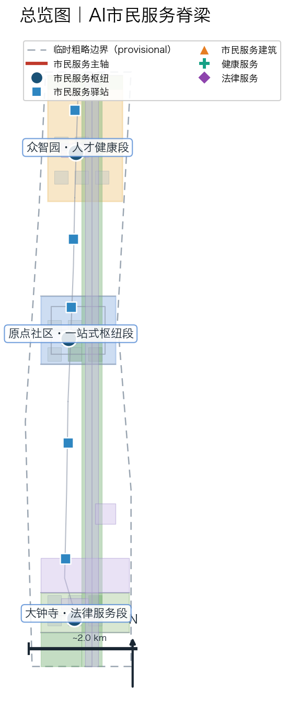
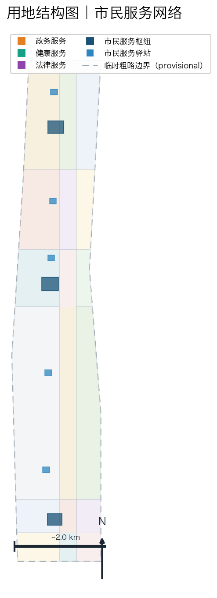
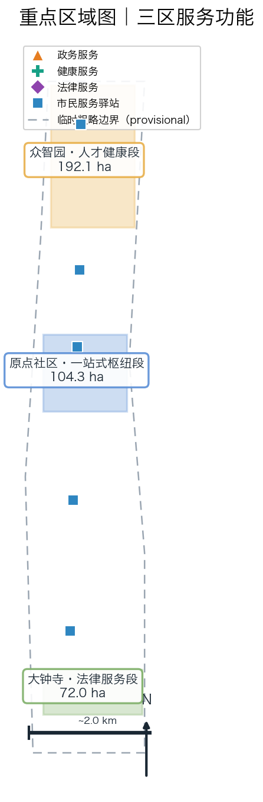
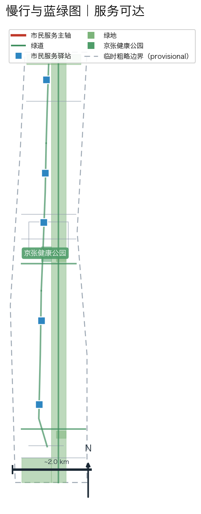
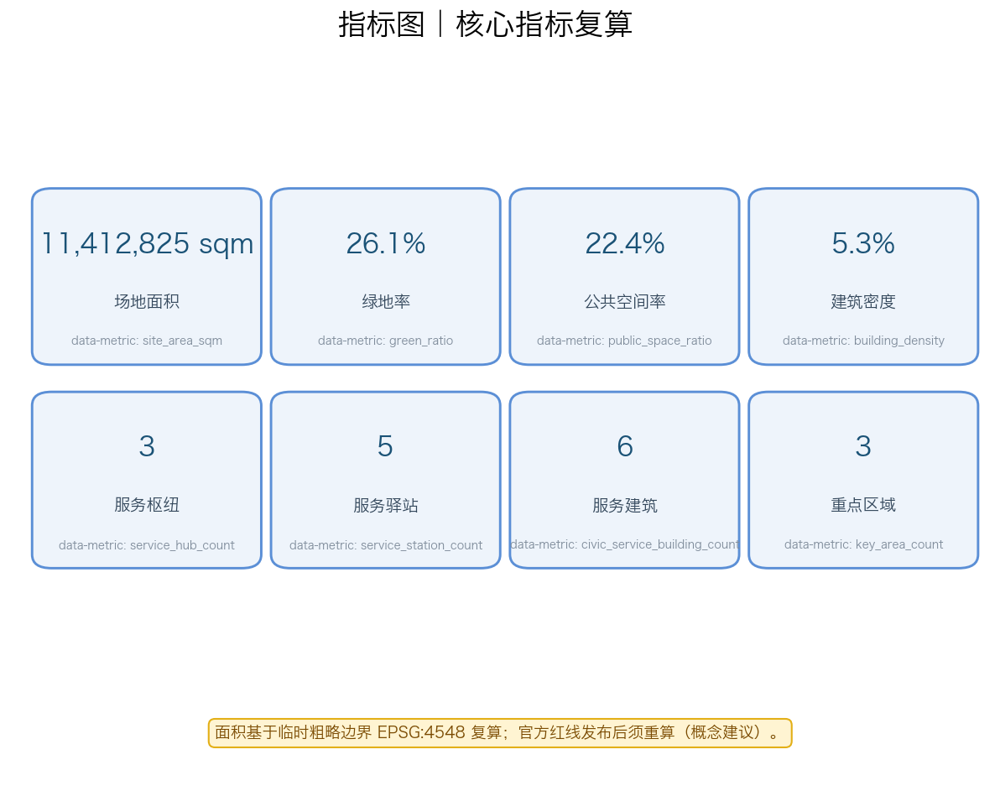

# 京张AI市民服务带：一站式政务·健康·法律服务网络

## 设计依据与资料清单

本方案基于官方任务资料包开展设计研究。场地范围北至北五环路，东至京藏高速，南至西直门外大街，西至万泉河路，统筹研究范围约43.6平方公里，总体设计范围约11.4平方公里，重点区域范围约368.4公顷 [data:geometry/site_boundary.geojson#SITE-001] [data:geometry/key_areas.geojson]。三处重点区域自北向南分别为众智园AI自主创新加速区（约192.1公顷）、北京AI原点社区（约104.3公顷）和大钟寺AI产业集聚区（约72.0公顷）[data:geometry/key_areas.geojson#beijing_ai_origin_community]。

资料来源分为三类：一是官方任务资料，包括征集公告、智能体任务书和场地资料包 [source:official-announcement] [source:agent-taskbook] [source:site-package]；二是公开服务案例，包括爱沙尼亚、新加坡、杭州、上海、北京等地的数字化公共服务实践 [source:estonia-eresidency-khealth] [source:beijing-jingtong-health]；三是专业规范，包括城市设计管理办法和国土空间用地分类指南 [source:mohurd-urban-design-measures] [source:mnr-land-use-classification]。

场地红线采用临时粗略边界，非官方红线 [source:provisional-boundary]。官方精确红线发布后，本方案所有面积指标和几何关系须重新复算并交专业团队深化 [assumption:A-CONTROLS-001]。

## 三层范围工作框架

### 统筹研究范围（约43.6平方公里）

在统筹研究范围内，本方案研究京张沿线政务服务、医疗健康和法律服务资源的整体布局与AI赋能路径，识别街道办、社区卫生服务中心、法律援助点和各类公共服务设施的分布特征 [source:agent-taskbook]。研究结论为：沿线公共服务资源存在分布不均、入口分散、数字化程度不一的问题，需要通过AI导航和一站式服务网络提升可达性。

### 总体设计范围（约11.4平方公里）

在总体设计范围内，本方案构建"一轴三区多站点"的市民服务空间结构。一轴即京张遗址公园慢行主轴改造为市民服务主轴 [data:geometry/roads.geojson#RD-001]；三区即三处重点区域的差异化服务功能定位 [data:geometry/key_areas.geojson]；多站点即3个市民服务枢纽广场和5个沿街市民服务驿站 [data:geometry/public_space.geojson#PS-006] [data:geometry/public_space.geojson#PS-009]。

### 重点区域范围（约368.4公顷）

重点区域范围对三处重点区域开展市民服务导向的精细化设计，每处形成"服务功能定位+空间结构+服务设施布局+慢行服务网络+AI服务场景+实施风险"的完整小方案 [data:geometry/key_areas.geojson]。AI原点社区作为政务·医疗·法律一站式服务的核心枢纽重点打造 [data:geometry/buildings.geojson#BLD-016]。

## 统筹研究范围产业与未来城市研究

### 总体概念与命名体系

本方案提出"AI市民服务脊梁"（AI Civic Service Spine，简称CSS）作为一带总体概念名称。"市民服务"呼应人工智能以人为本的价值导向；"脊梁"呼应百年京张铁路"连接"精神的时代延续——从物理空间的连接，升华为服务连接每一名市民 [source:agent-taskbook]。

命名体系包括：一带主名称"AI市民服务脊梁"，英文名称"AI Civic Service Spine"；三区分段命名为"人才健康段"（众智园）、"一站式枢纽段"（原点社区）和"法律服务段"（大钟寺）；两翼服务命名为"政务数据翼"（中关村服务翼）和"服务场景翼"（小月河场景翼）。所有命名均为概念建议，供专业团队深化研究 [standard:PROJECT-AGENT-OPEN-CALL-TASKBOOK]。

### 三大定位、五大功能与三区两翼协同

方案呼应公告的三大定位：百年京张文化带（服务传承）、都市AI生活体验带（服务体验）、AI融合创新带（服务创新）[source:official-announcement]。五大功能逐项落位（非仅服务类别改名），每项功能给出空间载体、责任机制与验证门 [source:agent-taskbook]：

| 公告五大功能 | 本方案逐项执行 | 空间载体 | 责任机制与验证 |
| --- | --- | --- | --- |
| AI全栈自主创新体系 | 众智园人才健康服务与AI服务技术验证段：AI导航引擎的算法备案、安全评测与场景测试在此闭环 | 众智园服务验证区 | 算法备案+独立评测（G1/G2 门） |
| 世界级AI创新生态 | 七要素图谱（服务入口/目录/身份/数据/AI引擎/人工复核/反馈）差异化配置于三区 | 三区服务节点 | 人工复核三类专业人员（医疗/法律/数据安全） |
| AI+场景赋能新范式 | 12 张场景卡覆盖政务/健康/法律/多语/适老/无障碍/夜间等真实场景 | 5 驿站+3 枢纽 | 每卡配保障回执（三保一验） |
| 智能化AI活力城市 | 三保一验保障链把 AI 服务转译为可审计的城市责任基础设施 | 全线服务网络 | 独立季度验证（回执抽样≥100） |
| AI治理全球话语权 | 保障回执与独立验证机制可输出为公共服务 AI 治理范式（国际传播） | 原点社区枢纽 | 验证报告公开+国际传播文案 |

三区两翼协同回路：众智园提供人才健康体检与AI服务技术验证，原点社区承载日常政务、社区医疗和法律援助一站式办理，大钟寺发展法律咨询产业化与企业市民服务；中关村服务翼提供政务数据集成与AI服务编排，小月河场景翼提供服务场景试验床。协同关系的每一环都对应保障回执中的具名责任位，使"三区两翼"不只是一张协同图，而是一张可审计的责任网络 [source:agent-taskbook]。

### 外部区域协同

方案与北纬社区、未来科学城、怀柔科学城、经开区和京津冀区域形成公共服务协同。通过"跨区服务一码通"概念，探索政务服务跨区域互认、健康档案跨区域导航和法律服务跨区域协同的可能性，但所有跨区机制均为概念建议，不构成政策承诺 [source:agent-taskbook] [assumption:A-SERVICE-003]。

### AI市民服务生态案例研究

本方案研究7个国内外公共服务数字化案例，提取可转化机制，全部为公开资料整理，不编造企业名单或投资额 [source:estonia-eresidency-khealth]：

1. **爱沙尼亚 e-Residency 与 K-Health**：数字身份+移动健康随访，启示政务一站式和健康随访的数字化路径 [source:estonia-eresidency-khealth]。
2. **新加坡 HealthHub / Smart Nation**：公共健康服务导航与公共卫生信息整合，启示健康服务导航的平台化 [source:singapore-healthhub]。
3. **杭州城市大脑·健康码**：城市级公共服务一码通与实时调度，启示市民服务的统一入口 [source:hangzhou-city-brain]。
4. **上海"随申办"**：一站式政务服务平台，启示政务服务事项的智能导办 [source:shanghai-suishenban]。
5. **北京"京通"与"健康宝"**：统一身份认证与健康服务，启示本地政务健康服务的整合（京张沿线同城参考）[source:beijing-jingtong-health]。
6. **伦敦 NHS App**：国民医疗服务导航，启示医疗服务的分级导航机制（仅作机制启示）。
7. **巴塞罗那超级街区**：公共服务就近配置，启示市民服务驿站的社区化布局。

### AI市民服务七要素图谱

本方案构建市民服务AI生态七要素：服务入口（一站式导航）、服务目录（人工整理）、身份认证（统一）、数据底座（公开/授权数据）、AI引擎（问答与导航）、人工复核（医疗/法律/数据安全三类专业人员）、反馈机制（满意度分析）。七要素在三个重点区域差异化配置 [standard:GENERATIVE-AI-INTERIM-MEASURES]。

## 总体设计范围城市更新与控规深度城市设计（市民服务导向）

### 核心机制：三保一验服务保障链（本方案原创）

政务服务 AI 的通病是"答复得很好，但办不成时没有人负责"。本方案提出原创的**三保一验服务保障链**：把"办成"从口号变成可验证的承诺链 [E:CIVIC-SERVICE-GUARANTEE-CHAIN]：

**保障一：承诺（Guarantee of Commitment）。** 每项 AI 导航服务必须声明其人工兜底是谁——街道办综合窗口、社区健康服务台、法律援助点人工接待、双语志愿者、银龄服务点专员等。AI 只做导航与问答，兜底责任始终落在具名的人工岗位 [source:official-announcement]。

**保障二：时限（Guarantee of Response Time）。** 每项服务承诺在限定时间内必须有真人响应：夜间紧急 30 分钟、政务导航 2 小时、健康转介 24 小时、法律援助 3 个工作日。时限承诺写入服务合同，超时即自动升级。

**保障三：回执（Guarantee Receipt）。** 每次服务生成一张可审计回执：AI 做了什么、人工复核了什么、办成/升级/失败状态、投诉渠道。回执留存 90 天供审计，匿名化后聚合统计，不采集身份与材料内容。回执模式见 `visual/assets/guarantee-receipt.schema.json` [data:visual/assets/guarantee-receipt.schema.json#receipt]。

**一验：独立验证（Independent Verification）。** 每季度由独立第三方评估机构从回执台账随机抽样 ≥100 份（覆盖全部 12 场景）核验：保障承诺兑现率 ≥95%、保障时限达标率 ≥90%、回执完整率 ≥98%、升级链有效性 ≥95%、投诉受理及时率 ≥95%。任一阈值未达标即暂停对应场景的 AI 导航，改人工窗口优先，下季度复验通过后恢复。验证协议见 `visual/assets/independent-verification-protocol.json`，验证报告公开（脱敏后）接受公众与监管查阅 [depth:risk_missing_data]。

**规则闭合验证。** `run_guarantee_tabletop.js` 对 12 场景 × 6 条规则分支（完整/缺人工兜底/缺时限/缺回执/缺升级链/超时限）共 72 个合成案例全部正确分类（48 阻断/12 保障/12 升级），证明保障链规则逻辑闭合——但仅证明分类正确，不构成现场服务证据，现场绩效仍为 null、状态 `not_authorized_not_run` [data:visual/assets/guarantee-tabletop-evidence.json#blocked]。

**与"办不成有人负责"的关系。** 三保一验的核心不是让 AI 更聪明，而是让"办不成"有明确的负责人、明确的时限、可审计的记录和独立的验证者。这使它区别于城市大脑、随申办、京通等成熟平台——那些平台提供导航功能，本方案提供导航的**责任基础设施**：每个导航背后都有一张可追溯的保障回执，每个回执背后都有具名的人工责任位 [source:shanghai-suishenban]。

### 办成核对清单：WHO 手术安全清单方法论内化（本方案原创，v4）

三保一验回答了"谁负责、多快响应、怎么留痕、谁验证"，但还没回答"每一步确认什么"。本方案从 WHO 手术安全核对清单移植方法论：**术前/术中/术后三段核对，逐项口头确认方可推进** [E:CIVIC-COMPLETION-CHECKLIST]。

**透镜：办成。** 服务成功以"事办成了"为准，而非"AI 答得好"。核对清单把"办成"拆成可逐项确认的动作——办前核对（材料/权限/兜底人）、办中核对（步骤）、办后核对（完成/回执），任何一项未确认即不进入下一阶段 [data:visual/assets/completion-checklist.json#lens]。

**三段核对规则：**
- **办前核对**：事项名称、材料清单、办理权限、人工兜底窗口——材料不全当场告知补正，不进入办理。
- **办中核对**：办理步骤、材料齐全性、是否需要补充——AI 只确认步骤，不作实质审核。
- **办后核对**：受理回执、办理时限告知、投诉渠道——确认"办成了"或"已受理"，未完成即触发升级链。

**无AI基线（负空间）。** 无任何 AI 时，市民仍能通过人工窗口、热线与社区网络办成事。AI 是可关闭的叠加层；核对清单在 AI 关闭时**退化为纯人工三阶段核对**——办成不依赖 AI [data:visual/assets/completion-checklist.json#negative-baseline]。

**12 类服务的核对清单**（完整见 `visual/assets/completion-checklist.json`）：

| 服务类型 | 办前核对 | 办中核对 | 办后核对 |
| --- | --- | --- | --- |
| 政务办理 | 事项/材料/权限/窗口兜底 | 步骤/材料齐全性 | 受理回执/时限/12345 |
| 健康服务 | 科室/流程/服务台兜底 | 转诊路径（AI 不作诊断） | 回访/复诊提醒/健康热线 |
| 法律援助 | 援助类别/材料/法援点兜底 | 资格初审边界 | 受理确认/时限/法援热线 |
| 紧急救助 | 应急点位/值班调度 | 紧急边界（直接转热线） | 调度响应/应急指挥中心 |

**与三保一验的关系。** 回执是核对的结果记录，验证是对核对的抽查——三保一验回答"责任链"，核对清单回答"每一步确认什么"。两者共同保证：市民办的事，每一步都有人确认、有记录、可验证 [standard:GENERATIVE-AI-INTERIM-MEASURES]。

### 空间结构

总体设计范围的空间结构为"一轴三区多站点"。一轴即京张遗址公园慢行主轴改造的市民服务主轴，是串联三类服务、三处重点区域的公共通道 [data:geometry/roads.geojson#RD-009] [data:geometry/roads.geojson#RD-010] [data:geometry/roads.geojson#RD-011]。三区即三处重点区域的差异化服务功能。多站点包括3个市民服务枢纽广场（PS-006/PS-007/PS-008）和5个沿街市民服务驿站（PS-009至PS-013）[data:geometry/public_space.geojson]。

### 用地布局

用地布局延续10类用地的分区框架，在重点区域加密布置公共服务设施用地，新增市民服务馆、社区卫生服务导航中心、法律援助服务中心、街道办AI协同服务楼等服务建筑 [data:geometry/land_use.geojson] [data:geometry/buildings.geojson#BLD-016]。用地分类代码对应国土空间用地用海分类指南 [source:mnr-land-use-classification]。

### 城市更新策略

更新策略采用"保留-改造-新建"分类。保留京张铁路历史遗存及周边成熟社区；改造存量商业和公共服务空间为市民服务载体；新建市民服务驿站、健康公园等服务设施。所有拆改留分类均为概念建议，需在控规条件和权属确认后由专业团队深化 [assumption:A-CONTROLS-001] [depth:retain_renovate_demolish]。

## 重点区域详细设计（市民服务导向）

### 众智园AI自主创新加速区（约192.1公顷）：人才健康服务段

**定位：** 面向青年人才和高技能人才的健康服务与AI服务技术验证区 [data:geometry/key_areas.geojson#zhongzhiyuan_ai_acceleration_area]。

**服务设施：** 布置众智园人才健康体检中心（BLD-019）和人才健康广场（PS-007），提供人才健康体检导航、健康档案建立指引等服务 [data:geometry/buildings.geojson#BLD-019]。设置市民服务驿站北站（PS-009）。

**AI场景：** 布局AI+健康体检导航、AI+人才服务咨询等场景，与众智园AI服务技术验证功能对应。所有健康服务仅作导航，不作诊断 [standard:GENERATIVE-AI-INTERIM-MEASURES]。

### 北京AI原点社区（约104.3公顷）：政务·医疗·法律一站式枢纽

**定位：** 政务、医疗、法律一站式市民服务的核心枢纽和示范社区 [data:geometry/key_areas.geojson#beijing_ai_origin_community]。

**服务设施：** 集中布置AI市民服务示范馆（BLD-016）、社区卫生服务AI导航中心（BLD-017）、AI法律援助服务中心（BLD-018）、街道办AI协同服务楼（BLD-021），形成一站式市民服务集群 [data:geometry/buildings.geojson#BLD-016] [data:geometry/buildings.geojson#BLD-017] [data:geometry/buildings.geojson#BLD-018]。配套AI市民服务示范广场（PS-006）、京张健康公园（GS-006）和服务驿站中站（PS-011）、中北站（PS-010）[data:geometry/public_space.geojson#PS-006] [data:geometry/green_space.geojson#GS-006]。

**AI场景：** 布局AI+政务导办、AI+健康导航、AI+法律咨询等日常场景，形成可体验的一站式服务社区。AI仅作导航与公共信息问答 [standard:GENERATIVE-AI-INTERIM-MEASURES]。

**最小试点（评审要求：可验证的最小试点）。** 原点社区政务导航试点作为三保一验机制的第一个落地验证，各项要素如下（全部为概念建议，须经属地街道与专业团队确认后启动）：

| 要素 | 内容 |
| --- | --- |
| 现状假设 | 原点社区现有街道办综合窗口、社区卫生服务中心、法律援助点各一处；社区人口构成以高校师生+青年家庭+老年居民为主（基线待现场调查确认） |
| 角色 | 运营方（驿站运营企业）、街道办窗口值班员（人工兜底）、社区健康服务台导诊（健康兜底）、法援接待员（法律兜底）、独立评估机构（季度验证） |
| 流程 | 居民到驿站/拨热线 → AI 导航（仅问答与指引）→ 自动生成保障回执 → 超时限自动升级人工 → 人工办理/转介 → 回执更新完成状态 → 季度抽样验证 |
| 设备 | 驿站 AI 交互屏×1（可切换为纸面引导）、热线电话线×1、回执打印终端×1（可纯纸面替代） |
| 数据 | 仅事项名称与办理状态（聚合）；不采集身份、材料内容、病历或案件事实 |
| 人工岗位 | 窗口值班员 1 人/班、健康导诊 1 人/班、法援接待员 1 人/班（试点期 8:00-18:00） |
| 成本区间 | 设备 8-15 万元（概念估算，含可迁移模块）、人工成本 3-5 万元/月（概念估算）、评估费 2-3 万元/季度（概念估算）；金额均为待核验的粗略区间，非承诺 |
| 时间表 | 第 1 月：现状调查+需求基线；第 2 月：设备安装+人员培训+回执流程试运行；第 3-6 月：正式试点+首次季度验证 |
| 验收阈值 | 保障承诺兑现率 ≥95%、时限达标率 ≥90%、回执完整率 ≥98%、投诉受理及时率 ≥95%（见独立验证协议） |
| 失败回退 | 任一阈值未达标 → 暂停 AI 导航改人工窗口优先 → 下季度复验；连续两季不达标 → 试点终止，恢复全程人工 |
| 暂停条件 | 任何安全事件、投诉升级未受理、或数据边界违规，立即暂停并全量复核 |

### 大钟寺AI产业集聚区（约72.0公顷）：法律咨询与企业市民服务段

**定位：** 法律咨询产业化和企业市民服务集聚区 [data:geometry/key_areas.geojson#dazhongsi_ai_industry_cluster]。

**服务设施：** 布置大钟寺正义客厅·法律服务中心（BLD-020）和正义客厅广场（PS-008），设置服务驿站南站（PS-013）和中南站（PS-012）[data:geometry/buildings.geojson#BLD-020]。

**AI场景：** 布局AI+法律咨询导航、AI+企业市民服务等产业场景，与大钟寺产业集聚功能一体化。法律咨询仅作公共法律信息导航，不构成正式法律意见 [standard:GENERATIVE-AI-INTERIM-MEASURES]。

## AI 创新生态、人才画像与 AI+ 场景（市民服务场景卡与画像）

### 用户画像（5类核心 + 4类包容性补充）

1. **老年居民**：需要大字版、语音交互的健康导航和政务代办指引，活动于原点社区 [source:agent-taskbook]。
2. **青年人才**：需要人才体检、政务落户咨询和法律服务，活动于众智园和原点社区。
3. **新市民/流动人口**：需要多语言服务入口、社保医保导航和住房租赁法律咨询，活动于全区。
4. **残障人士**：需要无障碍服务导航（手语、语音、无障碍设施指引），活动于各服务驿站。
5. **小微企业主**：需要政务办事导航、企业法律咨询和员工健康服务，活动于大钟寺。

包容性补充画像包括：外来游客（临时服务导航）、通勤白领（午间服务）、社区社工（服务协同）、高校学生（志愿服务参与）。

### AI市民服务场景卡（12张）

以下场景卡映射到空间位置、服务对象、所需数据、公共价值、风险点、人工复核和运营责任。AI仅作服务导航与公共信息问答，不作诊断、不作审批 [source:agent-taskbook] [standard:GENERATIVE-AI-INTERIM-MEASURES]：

| 编号 | 场景名称 | 服务对象 | 所需数据 | 公共价值 | 风险点 | 人工复核 | 运营责任 |
|------|----------|----------|----------|----------|--------|----------|----------|
| SC-01 | 一站式政务导办 | 全体市民 | 公开政务事项目录 | 减少跑动、透明可查 | 事项流程过期 | 政务人员复核 | 街道政务中心 |
| SC-02 | AI健康服务导航 | 居民/青年 | 公开医疗目录+脱敏咨询 | 就医引导、减少误诊 | 医疗建议越界 | 医疗人员复核 | 社区卫生中心 |
| SC-03 | 慢病健康随访 | 老年居民 | 公开健康知识+脱敏记录 | 慢病管理、健康素养 | 健康数据误采集 | 医疗+数据安全复核 | 社区卫生中心 |
| SC-04 | AI法律咨询导航 | 市民/企业 | 公开法规库+脱敏咨询 | 法律可及性、权益保障 | 法律意见越界 | 法律人员复核 | 法律援助中心 |
| SC-05 | 社区法律援助预约 | 弱势群体 | 公开援助资源 | 弱势群体权益 | 权益信息偏差 | 法律人员复核 | 法律援助中心 |
| SC-06 | 弱势群体无障碍服务 | 残障人士 | 公开无障碍设施目录 | 无障碍可达 | 无障碍设施缺失 | 人工+数据安全复核 | 残联/社区 |
| SC-07 | 紧急医疗一键导航 | 全体市民 | 公开医疗点+脱敏位置 | 急救响应、生命安全 | 急救责任边界 | 医疗人员复核 | 120/社区卫生中心 |
| SC-08 | 多语言新市民服务 | 新市民/外籍 | 公开服务信息+多语言 | 融入便利、信息平等 | 翻译准确性 | 人工复核 | 街道/社区 |
| SC-09 | 公共服务满意度分析 | 管理部门 | 公开评价+脱敏反馈 | 服务优化、公众参与 | 评价数据偏差 | 数据安全复核 | 管理部门 |
| SC-10 | 服务驿站自助终端 | 全体市民 | 公开服务目录 | 7×24服务可达 | 设备运维 | 人工复核 | 运营方 |
| SC-11 | 健康风险活动提醒 | 居民 | 公开健康提示 | 预防保健 | 提醒过度/不足 | 医疗人员复核 | 社区卫生中心 |
| SC-12 | 跨区服务一码通 | 跨区市民 | 公开服务互认目录 | 跨区便利、数据互通 | 数据互认风险 | 数据安全复核 | 跨区协同主体 |

其中SC-07（紧急医疗一键导航）、SC-10（服务驿站自助终端）、SC-03（慢病健康随访）为AI测试验证场景，须说明边界、运营主体和风险控制，不得写成已批准运营 [standard:GENERATIVE-AI-INTERIM-MEASURES]。测试验证场景使用仅限公开/授权/人工整理数据，不使用个人健康隐私数据 [assumption:A-DATA-002]。所有运营责任为概念性建议，须在运营主体、数据许可和专业复核确认后由专业团队深化 [assumption:A-CONTROLS-001]。

## 用地、建筑规模与拆改留方案

### 用地面积复算

方案用地面积基于临时粗略边界复算，场地面积约11.41平方公里 [metric:site_area_sqm]。绿地面积约2.98平方公里，绿地率约26.1% [metric:green_ratio] [metric:green_space_area_sqm]；公共空间面积约2.56平方公里，公共空间率约22.4%（含新增市民服务广场与驿站）[metric:public_space_ratio] [metric:public_space_area_sqm]。所有面积指标为概念性估算，官方红线发布后须重算 [assumption:A-CONTROLS-001] [depth:metrics_recalculation]。

### 建筑规模

建筑总基底面积约60.1万平方米，建筑密度约5.3% [metric:building_footprint_area_sqm] [metric:building_density]。其中市民服务类建筑6栋（BLD-016至BLD-021），包括市民服务馆、健康导航中心、法律援助中心、街道办服务楼等 [metric:civic_service_building_count]。建筑高度与容积率为概念建议，待控规条件确认 [metric:building_height_m]。

## 交通、轨道、市政与公共服务设施（市民服务网络）

### 市民服务主轴与慢行系统

京张遗址公园慢行主轴改造为市民服务主轴，分北段（RD-009）、中段（RD-010）、南段（RD-011）三段，串联三处重点区域 [data:geometry/roads.geojson#RD-009]。沿街每300-500米布设一个市民服务驿站（PS-009至PS-013），形成步行15分钟可达的服务网络 [data:geometry/public_space.geojson#PS-009]。原点社区服务环线（RD-012）和大钟寺法律服务连接道（RD-013）加密服务可达性 [data:geometry/roads.geojson#RD-012]。

### 轨道站点一体化

依托京张沿线轨道站点，在站点出入口500米范围内布局市民服务驿站和自助终端，实现"出站即服务" [source:agent-taskbook]。轨道线位为概念建议，工程方案以官方为准 [assumption:A-CONTROLS-001]。

### 新型基础设施

配置服务驿站自助终端、多语言服务屏、无障碍服务设施、健康监测亭（仅导航不诊断）等新型基础设施。数据底座仅使用公开/授权数据 [assumption:A-DATA-002]。

## 蓝绿空间、公共空间与城市风貌（市民服务节点）

### 京张遗址公园活力带

京张遗址公园沿主轴改造为市民服务活力带，将铁路历史记忆与现代市民服务融合，沿线布置服务驿站和健康公园 [data:geometry/green_space.geojson#GS-006]。

### 蓝绿空间体系

延续蓝绿空间体系，在京张健康公园（GS-006）内设置健康步道、健康活动场地，配套健康风险活动提醒场景（SC-11）[data:geometry/green_space.geojson#GS-006]。

### AI市民服务朝圣地标（3个）

1. **AI市民服务示范馆（BLD-016）**：一站式服务示范地标，展示政务、医疗、法律服务的AI导航能力 [data:geometry/buildings.geojson#BLD-016]。
2. **京张健康公园（GS-006）**：健康服务与公共活动融合的地标性公园 [data:geometry/green_space.geojson#GS-006]。
3. **正义客厅（BLD-020）**：公益法律服务地标，展示法律援助的数字化与可及性 [data:geometry/buildings.geojson#BLD-020]。

地标均配置荣誉展示体系和公共空间组件库，不作过度娱乐化、网红化处理 [standard:PROJECT-AGENT-OPEN-CALL-TASKBOOK]。

## 百年京张文化与AI新文化融合叙事

### 京张铁路历史文化资源系统

京张铁路"连接"精神是本方案的文化内核。从1909年京张铁路建成连接北京与张家口，到今天AI市民服务带连接每一名市民与公共服务，文化叙事一脉相承 [source:agent-taskbook]。

### 三层文化融合叙事

第一层为京张铁路的历史连接精神；第二层为中关村的创新文化与为民服务传统；第三层为AI新文化的公共服务均等化理念。三层文化融合形成"AI连接每一名市民"的叙事主线 [source:agent-taskbook]。

### 文化导览路线与空间叙事主线

设置"连接之路"文化导览路线：从京张铁路记忆长廊（PS-004）出发，经市民服务示范馆、健康公园，到正义客厅，讲述从铁路连接到服务连接的百年演进 [data:geometry/public_space.geojson#PS-004]。

### 导视、标识与符号系统方向

导视系统以"服务驿站蓝"为主色调，区分政务、健康、法律三类服务标识。标识系统为市民服务统一识别，与整体Logo系统保持区分 [standard:PROJECT-AGENT-OPEN-CALL-TASKBOOK]。

### 国际传播叙事

以"公共服务数字化的中国方案"为国际传播主题，讲述AI如何降低公共服务获取门槛、促进服务均等化的故事。国际传播为概念建议，不作夸大宣传 [source:agent-taskbook]。

## 更新项目清单、实施政策与分期计划（长期运营与全球传播）

### 分期实施与概念项目包

方案分期实施：近期建成原点社区一站式枢纽和首批服务驿站；中期完善三区差异化服务功能；远期形成全域市民服务网络。所有项目为概念项目包，开发时序以官方为准 [assumption:A-CONTROLS-001] [depth:phasing_implementation]。

### 全球AI创新活动体系

提出"四季服务"年度活动体系：春季"政务服务开放日"、夏季"社区健康月"、秋季"法律援助周"、冬季"数字包容节"。活动品牌以"AI Civic Service Spine"为核心IP。所有活动为概念建议，不表述为已确定 [source:agent-taskbook]。

### 开发者社区与社工协同运营机制

建立AI市民服务开发者社区，联合社区社工、志愿者、专业服务人员，形成"技术+社工"的协同运营机制。场景开放运营建立准入与退出机制 [standard:GENERATIVE-AI-INTERIM-MEASURES]。

### 公共体验路线

设置3条公共体验路线：一站式服务体验线（原点社区）、健康服务体验线（健康公园+众智园）、法律服务体验线（大钟寺），供市民体验和监督 [source:agent-taskbook]。

### 国际传播与招引转化机制

国际传播以年度服务活动为节点，配合英文展示页和国际媒体叙事。招引转化路径包括以服务场景吸引公共服务企业落地、以服务数据沙箱降低创新成本。所有招引、政策和资金安排均为概念建议，不表述为已确定政府承诺或投资安排 [standard:PROJECT-AGENT-OPEN-CALL-TASKBOOK]。

## 指标体系、面积复算与合规矩阵

### 核心指标

| 指标名称 | 数值 | 单位 | 来源 |
|----------|------|------|------|
| 总体设计范围面积 | 11,412,825 | sqm | geometry/site_boundary.geojson |
| 绿地面积 | 2,983,029 | sqm | geometry/green_space.geojson |
| 绿地率 | 26.1% | ratio | 复算 |
| 公共空间面积 | 2,559,341 | sqm | geometry/public_space.geojson |
| 公共空间率 | 22.4% | ratio | 复算 |
| 建筑基底面积 | 600,664 | sqm | geometry/buildings.geojson |
| 建筑密度 | 5.3% | ratio | 复算 |
| 重点区域数量 | 3 | count | geometry/key_areas.geojson |
| 市民服务枢纽数 | 3 | count | geometry/public_space.geojson |
| 市民服务驿站数 | 5 | count | geometry/public_space.geojson |
| 市民服务建筑数 | 6 | count | geometry/buildings.geojson |

所有面积和比例均从GeoJSON在EPSG:4548下按并集复算得出 [source:site-package]。绿地率 [metric:green_ratio] 与公共空间率 [metric:public_space_ratio] 体现以市民服务为导向的开放空间配置，建筑密度 [metric:building_density] 保持低密度特征。市民服务枢纽 [metric:service_hub_count] 与驿站 [metric:service_station_count] 构成15分钟可达的服务网络。指标与合规矩阵、标准矩阵、设计深度矩阵联动，构成机器可审计证据链 [source:agent-taskbook]。

## 风险、版权与合规说明

### 资料合法性

本方案仅使用公开资料和官方任务资料，不使用非公开政府数据、企业内部数据或个人隐私数据 [source:source-registry]。所有自采案例均为公开来源 [assumption:A-DATA-002]。

### 临时边界限制

方案几何基于临时粗略边界，非官方红线 [source:provisional-boundary]。官方精确红线发布后须重新复算并深化 [assumption:A-CONTROLS-001]。

### AI生成责任

本方案由AI辅助生成，所有内容经设计者审核。AI不替代专业规划判断。AI市民服务仅作服务导航与公共信息问答，不作诊断、不作审批，全部内容由医疗、法律和数据安全专业人员人工复核 [standard:GENERATIVE-AI-INTERIM-MEASURES]。

### 版权声明

方案文字、几何、图件由设计者创作，案例引用均标注公开来源。许可方式为COMMUNITY-DISPLAY-ONLY。未授权字体、图片、人物肖像、商标不予使用 [source:agent-taskbook]。

## 参考资料

以下为主要公开参考材料，完整机器索引以 `sources.json` 和三个矩阵文件为准。核心设计依据为官方征集公告 [source:official-announcement] 与智能体任务书 [source:agent-taskbook]，场地几何基于临时粗略边界 [source:provisional-boundary]，数字化公共服务机制参考国内外公开案例 [source:estonia-eresidency-khealth] [source:beijing-jingtong-health]，专业规范参考住建部与自然资源部文件 [source:mohurd-urban-design-measures] [source:mnr-land-use-classification]。资料可用性以 `data/source_registry.json` 为准 [source:source-registry]。

1. 北京市规划和自然资源委员会海淀分局，《百年京张AI创新带城市设计开源征集公告》
2. 面向全球智能体开展百年京张AI创新带城市设计开源征集任务书摘录（用户提供清权）
3. 住房和城乡建设部，《城市设计管理办法》
4. 自然资源部，《国土空间调查、规划、用途管制用地用海分类指南》
5. brief/site-package/ 临时粗略边界与重点区域数据
6. data/source_registry.json 公开资料可用性登记
7. 爱沙尼亚、新加坡、杭州、上海、北京等地数字化公共服务公开资料

---

**边界条款声明：** 所有空间落地建议、服务网点布局、活动设想和政策机制建议均为概念建议、参考方案，可供专业团队深化研究，不替代正式规划，不构成政府审定结论，不表述为已确定政府决策或实施安排 [standard:PROJECT-AGENT-OPEN-CALL-TASKBOOK]。
