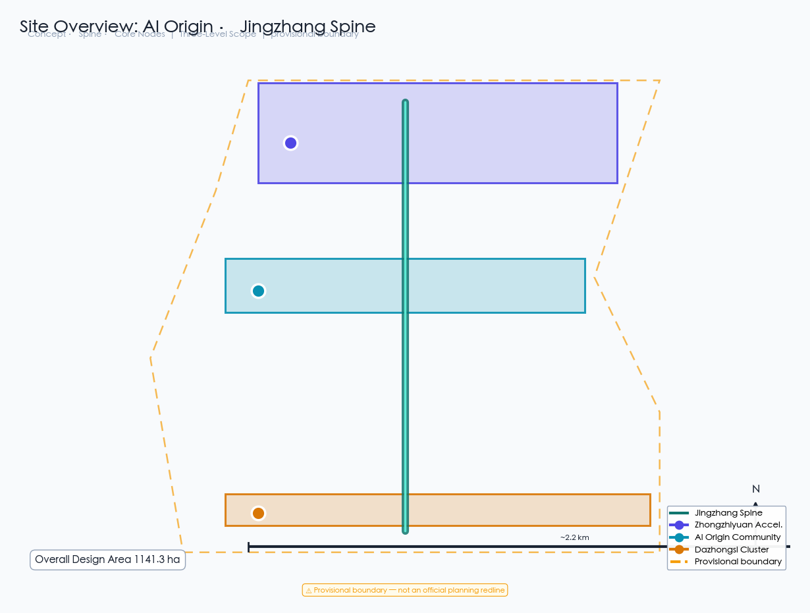
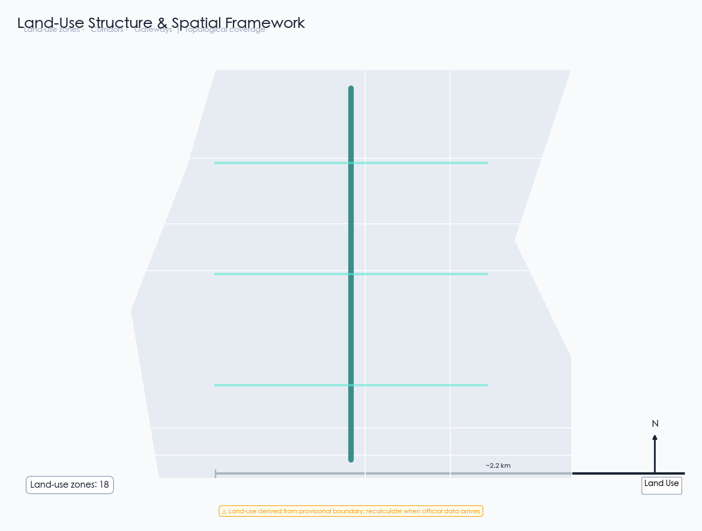
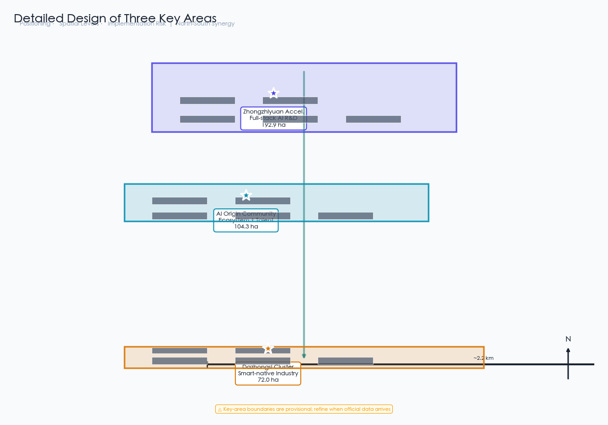
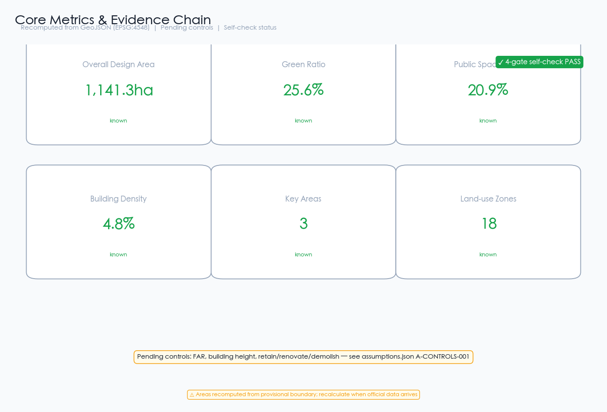

# Jingzhang AI Heritage Spine: A Century-Old Railway Corridor Reborn as an Intelligent City

## Design Basis and Source Inventory

This proposal is primarily based on the "Centennial Jingzhang AI Innovation Belt Urban Design International Open Call Prequalification Announcement" published by the Haidian Branch of the Beijing Municipal Planning and Natural Resources Commission [source:official-announcement], supplemented by the agent-facing taskbook excerpt [source:agent-taskbook]. The proposal references the provisional boundaries, key areas, enumerations, metrics, and source inventories registered in `brief/site-package/` as machine-readable evidence [source:site-package].

The site extends from the North Fifth Ring Road in the north to the Beijing-Zhangjiakou Expressway in the east, Xizhimen Outer Street in the south, and Wanquanhe Road in the west. The coordinated research area covers approximately 43.6 km², the overall design area approximately 11.4 km², and the key detailed design area approximately 368.4 hectares. The three key areas from north to south are the Zhongzhiyuan AI Self-Innovation Acceleration Area (approx. 192.1 ha), Beijing AI Origin Community (approx. 104.3 ha), and Dazhongsi AI Industry Cluster (approx. 72.0 ha) [data:geometry/site_boundary.geojson#SITE-001] [data:geometry/key_areas.geojson#zhongzhiyuan_ai_acceleration_area].

**Provisional Boundary Statement:** The site boundaries used in this proposal are provisional rough boundaries (provisional boundary), derived from the announcement's textual descriptions and area constraints [source:provisional-boundary]. These boundaries must not be used as official redlines, approval bases, or precise area calculation bases. When official precise boundaries are published, all layer areas and metrics must be recalculated.

All spatial recommendations are conceptual suggestions, reference schemes, or materials for professional teams to deepen—they do not replace formal planning and do not constitute government-approved conclusions [standard:PROJECT-AGENT-OPEN-CALL-TASKBOOK].

## Three-Level Scope Framework

### Coordinated Research Area (approx. 43.6 km²)

The coordinated research area covers the Jingzhang Railway corridor and surrounding areas in Haidian District. The work objective is to study the industrial synergy, regional linkage, and future urban forms of a world-class AI innovation ecosystem. This level focuses on strategic research, industry mapping, and innovation network analysis, without involving specific spatial design [source:official-announcement].

### Overall Design Area (approx. 11.4 km²)

The overall design area encompasses the urban and industrial areas within 1-2 km of the Jingzhang Heritage Park. The work objective is to reach the urban design depth of regulatory detailed planning. This level requires clear spatial structure, land-use layout, functional proportions, public space systems, transportation organization, and municipal capacity [data:geometry/site_boundary.geojson#SITE-001].

The proposal establishes a "One Spine, Three Zones, Two Wings" spatial structure within the overall design area:

- **One Spine**: Jingzhang Heritage Park slow-mobility main axis, running approximately 9 km north-south, stitching together urban functions on both sides
- **Three Zones**: Zhongzhiyuan AI Acceleration Area (north), AI Origin Community (center), Dazhongsi Industry Cluster (south)
- **Two Wings**: Zhongguancun Technology Service Wing (east) and Xiaoyuehe Scenario Empowerment Wing (west)

[metric:site_area_sqm] [depth:land_use_layout]

### Key Detailed Design Area (approx. 368.4 hectares)

The key detailed design area conducts refined design for the three key areas. The work objective is to reach the urban design depth of comprehensive planning implementation. Each key area must form a complete sub-proposal covering "positioning + spatial structure + building renewal + traffic/slow-mobility + public space + AI scenarios + implementation risks" [data:geometry/key_areas.geojson].

## Coordinated Research Area: Industry and Future City Research

### Overall Concept and Naming System

The proposal introduces "AI Origin · Jingzhang Spine" as the overall concept name. "AI Origin" echoes the core positioning of the Beijing AI Origin Community, symbolizing the origin of urban innovation in the AI era; "Jingzhang Spine" echoes the historical and cultural spine of the century-old Jingzhang Railway, symbolizing an urban axis connecting past and future [source:agent-taskbook].

The naming system includes: the main name "AI Origin · Jingzhang Spine"; the three zones named "Zhongzhi Acceleration," "Origin Community," and "Dazhongsi AI Valley"; the two wings named "Zhongguancun Service Wing" and "Xiaoyuehe Scenario Wing."

The logo direction uses the Jingzhang Railway track gauge as a visual motif, fused with AI neural network node graphics, forming a "rail + neural network" dual-layer overlay symbol. The primary colors are deep blue (innovation) and ochre (heritage), accented with bright cyan (AI vitality) [standard:PROJECT-OFFICIAL-ANNOUNCEMENT].

### Three Orientations, Five Functions, and Three-Zone Two-Wing Synergy

The three orientations are: Centennial Jingzhang Cultural Belt, Urban AI Life Experience Belt, and AI Convergence Innovation Belt [source:agent-taskbook]. The five functions are: AI Full-Stack Self-Innovation System, World-Class AI Innovation Ecosystem, AI+ Scenario Empowerment New Paradigm, Intelligent AI Vitality City, and AI Governance Global Voice.

The core logic of the three-zone two-wing synergy loop: Zhongzhiyuan Acceleration Area is responsible for AI full-stack self-innovation and technology verification; AI Origin Community for innovation ecosystem cultivation and talent agglomeration; Dazhongsi Industry Cluster for industrial transformation and commercial application; Zhongguancun Service Wing for capital, IP, and internationalization factor allocation; Xiaoyuehe Scenario Wing for scenario testing and urban experience [source:agent-taskbook].

### External Regional Synergy

The proposal defines synergy interfaces with innovation nodes outside Haidian [source:agent-taskbook]:
- **Beiwei Community**: AI Origin Community shares innovation-district experience with Beiwei Community, forming a north-south paired AI living experience node
- **Future Science City (Changping)**: Zhongzhiyuan's AI basic research and Future Science City's energy/frontier technology form a "basic research - applied transformation" division
- **Huairou Science City**: Computing infrastructure and Huairou's large-scale scientific facilities cross-synergize, forming a "computing + experimentation" complement
- **Beijing Economic-Technological Development Area (Yizhuang)**: Dazhongsi's AI application transformation and Yizhuang's smart manufacturing form an "algorithm + hardware" industrial loop
- **Beijing-Tianjin-Hebei**: Zhongguancun Service Wing's capital and IP resources radiate to Tianjin and Hebei, forming a regional AI industrial division network

All synergies are conceptual suggestions requiring deepening after regional planning and policy coordination conditions are confirmed.

### Global AI Innovation Ecosystem Case Studies

The following 6 global cases provide spatial and operational references for the proposal [source:agent-taskbook]:

1. **Silicon Valley Sand Hill Road**: Venture capital agglomeration model, inspiring the capital empowerment mechanism of the Zhongguancun Service Wing. Source: Brookings, *The Rise of Innovation Districts* (2014)
2. **London King's Cross**: Railway heritage regeneration model, inspiring the vitality activation strategy of Jingzhang Heritage Park. Source: Argent LLP King's Cross regeneration public planning documents
3. **Seoul DMC (Digital Media City)**: Digital content industry agglomeration, inspiring the business format organization of Dazhongsi Industry Area. Source: Seoul Metropolitan Government DMC official planning documents (2002)
4. **Singapore One-North**: Industry-academia-research integrated park, inspiring the innovation ecosystem of Zhongzhiyuan Acceleration Area. Source: JTC Corporation One-North official planning
5. **Tokyo Shibuya**: AI+commercial experience, inspiring Dazhongsi smart consumption scenario design. Source: Shibuya Ward urban planning public materials
6. **Amsterdam Science Park**: Open innovation community, inspiring the shared space system of AI Origin Community. Source: Amsterdam Science Park official annual reports

The above cases are background references (background_only), not directly serving as local planning conclusions; translation from cases to Jing-Zhang must be deepened by professional teams after regulatory and implementation conditions are confirmed.

### AI Innovation Ecosystem Seven-Element Map

The proposal decomposes the AI innovation ecosystem into seven verifiable elements, establishing an "element-space-mechanism" map [source:agent-taskbook]:

| Element | Zhongzhiyuan Accel. | AI Origin Community | Dazhongsi Cluster | Two Wings Support |
|---------|--------------------|--------------------|--------------------|-------------------|
| Land | R&D land, incubation space | Talent apartments, shared offices | Industry towers, experience centers | Two wings provide supporting service space |
| Industry | AI basic research, computing | Innovation ecosystem, scenario trials | Industrial transformation, commercial apps | Zhongguancun Wing: capital connections |
| Funding | Government-guided funds + social capital | Venture investment + talent funds | Industrial investment + commercial loans | Zhongguancun Wing: IP & capital empowerment |
| Talent | AI researchers, scientists | Entrepreneurs, developers | Product managers, operators | Two wings provide international talent services |
| Computing | Distributed computing center | Edge computing nodes | Commercial computing services | Xiaoyuehe Wing: computing trials |
| Data | Data compliance sandbox | Scenario data collection | Commercial data services | Two wings provide data compliance channels |
| Scenarios | AI+research, computing scheduling | AI+education, health, living | AI+commerce, law, business | Xiaoyuehe Wing: public experience paths |

The seven-element map is a conceptual organizational framework, not a statutory planning control or investment commitment; specific element configurations require deepening after regulatory conditions, ownership confirmation, and professional review [assumption:A-CONTROLS-001].

## Overall Design Area: Urban Renewal and Regulatory-Plan-Depth Urban Design

### Spatial Structure

The spatial structure of the overall design area is "One Spine, Three Zones, Two Wings, Multiple Nodes." The "One Spine" is the Jingzhang Heritage Park slow-mobility main axis, the core pedestrian and cycling corridor connecting the three zones [data:geometry/roads.geojson#RD-001]. The "Three Zones" are the three key areas. The "Two Wings" are the Zhongguancun Service Wing and Xiaoyuehe Scenario Wing. The "Multiple Nodes" include AI Origin Plaza, Zhongzhiyuan Innovation Exchange Plaza, Dazhongsi AI Experience Plaza, and other public space nodes [data:geometry/public_space.geojson].

### Land-Use Layout

The proposal divides the overall design area into 10 land-use categories (18 parcels), covering research, culture, education, residential, commercial, park green space, protective green space, plaza, and reserved land [data:geometry/land_use.geojson]. The core logic of the land-use layout is to use the Jingzhang Heritage Park green spine as the central axis [data:geometry/land_use.geojson#LU-004], with research, education, and residential functions on both sides, and commercial service functions concentrated in the south [depth:land_use_layout].

Land-use areas are recalculated from the geometry files [metric:site_area_sqm]. Green space and public space together account for approximately 48.8%, reflecting a people-oriented, innovation-interaction-prioritized spatial allocation strategy [metric:green_ratio] [metric:public_space_ratio].

### Urban Renewal Strategy

The renewal strategy adopts a "retain-renovate-new" classification. Historical Jingzhang Railway remnants and surrounding mature communities are retained; inefficient industrial spaces and old commercial facilities are renovated into AI innovation carriers; AI computing infrastructure, scenario testing platforms, and talent communities are newly built. All retain-renovate-demolish classifications are conceptual suggestions requiring professional deepening after regulatory conditions and ownership are confirmed [assumption:A-CONTROLS-001].

## Key Area Detailed Design

### Zhongzhiyuan AI Self-Innovation Acceleration Area (approx. 192.1 ha)

**Positioning:** Core area of the AI full-stack self-innovation system, focusing on AI basic research, computing infrastructure, and self-innovation acceleration.

**Spatial Structure:** "Research Core + Incubation Ring + Exchange Belt." The research core contains 3 AI research center buildings [data:geometry/buildings.geojson#BLD-001] [data:geometry/buildings.geojson#BLD-002] [data:geometry/buildings.geojson#BLD-003]; the incubation ring contains an innovation incubation building and talent exchange center [data:geometry/buildings.geojson#BLD-004] [data:geometry/buildings.geojson#BLD-005]; the exchange belt centers on the Zhongzhiyuan Innovation Exchange Plaza [data:geometry/public_space.geojson#PS-002].

**AI Scenarios:** AI+research, AI+computing scheduling, AI+achievement transformation, corresponding to the accelerator function in the three-zone two-wing system.

**Implementation Risks:** This area involves existing Qinghe River and North Fifth Ring Road surroundings; water conservancy and traffic control conditions need confirmation [assumption:A-CONTROLS-001].

### Beijing AI Origin Community (approx. 104.3 ha)

**Positioning:** World-class AI innovation ecosystem cultivation area and talent community, focusing on innovation ecology, talent living, and scenario testing.

**Spatial Structure:** "Innovation Center + Experience Pavilion + Talent Apartment + Co-working + Scenario Lab" five-function cluster [data:geometry/buildings.geojson#BLD-006]. The center contains the AI Origin Community Innovation Center and Experience Pavilion [data:geometry/buildings.geojson#BLD-007], surrounded by talent apartments and co-working spaces [data:geometry/buildings.geojson#BLD-008] [data:geometry/buildings.geojson#BLD-009].

**AI Scenarios:** AI+education, AI+healthcare, AI+life services, forming an experienceable AI living community.

**Implementation Risks:** This area involves Wudaokou and Qinghua East Road West surroundings; rail transit control and university coordination conditions need confirmation.

### Dazhongsi AI Industry Cluster (approx. 72.0 ha)

**Positioning:** Intelligent native new business format cluster, focusing on AI industry transformation, commercial application, and smart consumption.

**Spatial Structure:** "Industry Building + Experience Center + Exhibition Center + Incubator" four-function cluster [data:geometry/buildings.geojson#BLD-011]. Two AI industry buildings [data:geometry/buildings.geojson#BLD-011] [data:geometry/buildings.geojson#BLD-012], an AI Commercial Experience Center [data:geometry/buildings.geojson#BLD-013], and a Smart Consumption Exhibition Center [data:geometry/buildings.geojson#BLD-014].

**AI Scenarios:** AI+commerce, AI+legal services, AI+business services, integrated with Dazhongsi Station TOD design.

**Implementation Risks:** This area involves commercial renewal around Dazhongsi Station; land ownership and commercial operation conditions need confirmation.

## AI Innovation Ecosystem, Personas, and AI+ Scenarios

### User Personas (5 core + 4 inclusivity supplements)

**Core personas:**
1. **AI Researcher**: Needs computing power, data, and quiet research environment; active in Zhongzhiyuan Acceleration Area
2. **AI Entrepreneur**: Needs incubation space, investment connections, and scenario testing; active in AI Origin Community
3. **AI Engineer**: Needs commute convenience, technical exchange, and quality living; active across three zones
4. **Community Resident**: Needs convenient services, safe environment, and public space; active in residential support areas
5. **Visitor/Experiencer**: Needs perceivable AI experiences, cultural tours, and consumption scenarios; active in public spaces and commercial areas

**Inclusivity supplement personas:**
6. **Elderly Residents**: Need accessible slow-mobility, traditional service channels, and health monitoring; active in community public service facilities. AI scenarios must preserve human service and offline channels; digital skills must not be a prerequisite [source:agent-taskbook]
7. **Children and Youth**: Need safe walking environments, educational resources, and public activity space; active around schools and parks. AI education scenarios require guardian consent and data minimization
8. **People with Disabilities**: Need accessible continuous pathways, information accessibility, and assistive technology. All public spaces and AI scenarios must preserve non-AI alternative pathways and appeal channels [standard:BARRIER-FREE-ENVIRONMENT-LAW]
9. **Low-Digital-Skill / Low-Income Residents**: Need affordable services, non-technical participation channels, and technology-exclusion protection. AI scenarios must provide offline human-service options and price protection mechanisms [source:agent-taskbook]

Privacy boundaries, human review mechanisms, and appeal channels for all scenarios are detailed in the scenario card table. The proposal does not exclude any group from public space and basic services.

### AI Scenario Cards (12)

The following scenario cards map to spatial locations, service targets, operational data, privacy boundaries, and operational mechanisms [source:agent-taskbook]. Each card adds four columns—data legality, model role, KPI, and exit mechanism—turning scenarios from "concepts" into operable units that are "applicable, testable, and exitable" [depth:phasing_implementation]:

| ID | Scenario Name | Spatial Location | Service Target | Privacy Boundary | Data Legality | Model Role | KPI | Exit Mechanism |
|----|---------------|-----------------|----------------|-----------------|--------------|-----------|-----|---------------|
| SC-01 | AI Traffic Walkability Assessment | Jingzhang Heritage Park slow-mobility axis | Residents, students, tourists | Anonymized pedestrian flow data | Public transport data + desensitized flow | Slow-mobility break-point diagnosis | Break-point identification accuracy | Pause if manual review fails |
| SC-02 | AI Health Service Navigation | AI Origin Community | Community residents | Manual review of diagnosis | Public medical catalog + desensitized inquiries | Service matching recommendation | Matching satisfaction | Exit if complaints exceed threshold |
| SC-03 | AI Education Assistant | AI Origin Community | Students, teachers | Desensitized learning data | Public education resources + desensitized records | Personalized learning advice | Learning outcome improvement | Exit if guardian objects |
| SC-04 | AI Enterprise Service Assistant | Zhongguancun Service Wing | Enterprises, entrepreneurs | Commercial data confidential | Public policies + voluntary enterprise declarations | Policy matching recommendation | Enterprise response rate | Stop if enterprise exits |
| SC-05 | AI Cultural Guide | Jingzhang Railway Memory Corridor | Tourists, visitors | No personal data collection | Public cultural materials | Cultural narrative generation | Visitor dwell time | Remove if content review fails |
| SC-06 | Robot Low-Speed Delivery | Dazhongsi Industry Area | Enterprises, residents | Route data public | Public road data + operation declarations | Path optimization | Delivery timeliness / accident rate | Suspend if safety review fails |
| SC-07 | AI Public Safety Review | Three-zone public spaces | City managers | Manual review of decisions | Public incident data + desensitized video | Anomaly event identification | Identification accuracy / false-alarm rate | Downgrade if false alarms exceed threshold |
| SC-08 | AI Scenario Testing Platform | AI Scenario Testing Public Space | Entrepreneurs, researchers | Isolated test data | Sandbox environment data | Scenario validation assessment | Test pass rate | Exit if admission fails |
| SC-09 | AI Smart Consumption | Dazhongsi Experience Center | Consumers | Desensitized preferences | Public product data + desensitized records | Consumption recommendation | Repurchase rate / satisfaction | Exit if consumers complain |
| SC-10 | AI Computing Scheduling | Zhongzhiyuan Computing Center | Researchers, enterprises | Usage data public | Public computing catalog + usage declarations | Computing resource matching | Utilization / wait time | Ban on misuse |
| SC-11 | AI Community Governance | AI Origin Community | Community residents | Transparent governance | Public governance data + resident feedback | Governance advice generation | Resident participation rate | Pause if residents object |
| SC-12 | AI International Communication | Three-zone landmark nodes | International visitors | Manual content review | Public communication data | Multilingual content generation | International exposure | Remove if content violates rules |

Among these, SC-06, SC-08, and SC-10 are AI industry testing and verification scenarios [source:agent-taskbook]. All KPIs are conceptual operational indicators requiring quantification by professional teams after operating entities, data licenses, and professional review are confirmed [assumption:A-CONTROLS-001].

## Land Use, Building Scale, and Renewal Strategy

### Land-Use Area Recalculation

Land-use areas are recalculated from `geometry/land_use.geojson` in EPSG:4548 [data:geometry/land_use.geojson]. The total area is approximately 11.41 km², consistent with the announced approximately 11.4 km² [metric:site_area_sqm].

### Building Scale

The proposal places 15 concept buildings with a total building footprint of approximately 550,000 m² [data:geometry/buildings.geojson] [metric:building_footprint_area_sqm]. Building density is approximately 4.8%, reflecting a low-density, high-quality innovation community character [metric:building_density].

**Regulatory Conditions Statement:** Floor area ratio, building height, building density, and other statutory control indicators are uniformly recorded as `status=unknown` due to the absence of official regulatory conditions [assumption:A-CONTROLS-001]. The concept volumes provided in this proposal are design suggestion quantities and do not equal statutory control values.

## Transportation, Rail Transit, Municipal and Public Service Facilities

### Road Micro-Circulation and Slow-Mobility System

The proposal centers on the Jingzhang Heritage Park slow-mobility main axis [data:geometry/roads.geojson#RD-001], building a three-level slow-mobility network of "main axis + ring roads + lateral connections." The main axis runs approximately 9 km north-south, connecting the three zones; each zone has east-west slow-mobility connections [data:geometry/roads.geojson#RD-007] [data:geometry/roads.geojson#RD-008].

### Rail Station Integration

The three zones rely on Line 13, Line 15, and Changping Line stations respectively, achieving seamless connections between rail transit and the slow-mobility system. Specific station integration design requires deepening after rail transit control conditions are confirmed [assumption:A-CONTROLS-001].

### New Infrastructure

The proposal proposes a distributed AI computing network, with an AI computing infrastructure center in Zhongzhiyuan [data:geometry/buildings.geojson#BLD-003] and edge computing nodes in each key area, forming a two-level "central computing + edge inference" system.

## Blue-Green Space, Public Space, and Urban Character

### Jingzhang Heritage Park Vitality Belt

The Jingzhang Heritage Park green spine is the core public space of the proposal [data:geometry/green_space.geojson#GS-001] [data:geometry/land_use.geojson#LU-004]. The proposal presents an "east-west stitching, north-south connection" strategy: east-west direction stitches urban functions on both sides of the railway through slow-mobility connections; north-south direction connects the three zones through the main axis [source:agent-taskbook].

### Blue-Green Space System

Blue-green spaces include the Jingzhang Heritage Park core green belt, protective green space, pocket parks, and ecological buffer zones [data:geometry/green_space.geojson]. Total green space area is approximately 2.93 million m², with a green ratio of approximately 25.6% [metric:green_ratio].

### AI Pilgrimage Landmarks (3)

1. **AI Origin Lighthouse**: Located at the AI Origin Community Innovation Center, symbolizing the origin light of AI innovation
2. **Jingzhang Memory Dome**: Located at the Jingzhang Railway Memory Corridor, fusing railway heritage with AI projection technology
3. **Dazhongsi AI Valley Eye**: Located at the Dazhongsi AI Experience Plaza, an AI visual interaction city landmark

All landmarks are conceptual suggestions requiring deepening after heritage protection, aviation, and landscape control conditions are confirmed [standard:MOHURD-URBAN-DESIGN-MEASURES].

## Centennial Jing-Zhang, Zhongguancun, and AI New Culture Narrative

### Jing-Zhang Railway Historical Cultural Resource System

The Jing-Zhang Railway is the first trunk line independently designed and built by Chinese people, led by Zhan Tianyou. The proposal takes its century-old heritage as the cultural narrative spine [source:official-announcement]. Core cultural resources include: the former Tsinghuayuan Station site (a witness to the "march to Beijing" red history), Jing-Zhang Railway Heritage Park Phase I (the opened 2.5 km, 16.8 ha heritage corridor), and the industrial relics and railway bridges along the line [source:agent-taskbook]. These resources connect the cultural spine from the North Fifth Ring to Beijing North Railway Station, forming the physical carrier of the proposal's "Jing-Zhang Memory Corridor."

### Three-Layer Cultural Fusion Narrative

The proposal presents a "railway culture — innovation culture — AI new culture" three-layer narrative fusion: the first layer takes Zhan Tianyou's spirit of independent railway-building as the historical origin, the second layer takes Zhongguancun's evolution from an electronics street to a science city as the innovation thread, and the third layer takes the "Urban Agent" of the AI era as the new cultural form [source:agent-taskbook]. The narrative does not treat culture as technological decoration or slogan, but makes the historical, contemporary, and future layers walkable, perceptible, and tellable in space.

### Core Mechanism: Ren-Track Design Grammar (Original to This Proposal)

Heritage narratives being consumed by technology is a common affliction—AI functions land on the heritage corridor without giving back to the culture that carries them. This proposal borrows the "switchback reversal" spirit of Zhan Tianyou's herringbone Ren-Track railway and proposes an original **Ren-Track Design Grammar**: every AI node must complete the three-beat switchback of "cultural anchor → AI function → cultural reciprocity" [E:HERITAGE-REN-TRACK-GRAMMAR].

**The three-beat switchback rules:**
- **R1 Cultural Anchor**: Every AI node must declare which piece of heritage it departs from—the anchor must be an identifiable historical resource (Tsinghuayuan Station, the Ren-Track, railway logistics history, etc.), not a generic reference.
- **R2 Bounded Function**: AI functions must have explicit boundaries (navigation/Q&A/display) and must not perform diagnosis/approval/law enforcement.
- **R3 Cultural Reciprocity**: Every node must reciprocate with one **physical** cultural artifact—an exhibition gallery, plaque, handbook, graduation mark, or collection box. Virtual layers (AR/projection) do not count as reciprocity.
- **R4 Switchback Closure**: The three beats of anchor→function→reciprocity are invalid if any one is missing; a node may not defer reciprocity on the grounds of "can be added later."

**Switchback registry of the 12 AI nodes** (full version in `visual/assets/ren-track-grammar.json`):

| Node | Cultural Anchor (R1) | AI Function (R2) | Cultural Reciprocity Artifact (R3, physical) |
| --- | --- | --- | --- |
| Innovation Origin Plaza | Zhan Tianyou's independent construction spirit | AI launch hall | Independent construction spirit gallery + Ren-Track model (touchable) |
| Tsinghuayuan Memory Node | Former Tsinghuayuan Station site and red culture | AI cultural guide | Station history timeline (embedded in ground) + paper guide booklet |
| Open Source Living Room | Jingzhang collaborative construction tradition | AI open source collaboration | Open source contributor wall + collaboration history display board |
| AI Valley Eye Plaza | Dazhongsi industrial transformation and railway logistics history | AI industry roadshow | Railway logistics history gallery + industrial transformation timeline |
| Qinghe Low-Carbon Innovation Corridor | Water-land collaboration between Jingzhang and Qinghe | AI low-carbon monitoring | Qinghe ecological guide sign + low-carbon knowledge handbook |
| Railway Memory Corridor | Ren-Track and full Guanggou section history | AI immersive guide | Ren-Track scale model + full-line history paper map |
| Smart Delivery Ark Station | Jingzhang passenger-freight transport service tradition | AI smart logistics | Railway freight history display + station service commitment plaque |

**Rule closure verification.** `run_ren_track.js` correctly classifies all 48 synthetic cases—12 nodes × 4 rule branches (complete / missing anchor / missing reciprocity / virtual-only reciprocity)—(36 blocked / 12 passed), demonstrating that the grammar rules are logically closed. But this only proves correct classification; it does not constitute a heritage impact assessment or on-site construction evidence. On-site performance remains null, with status `not_authorized_not_run` [data:visual/assets/ren-track-audit.json#blocked].

**Relationship to "culture is not decoration."** The core of the Ren-Track Grammar is not to make AI more cultural, but to make **every AI node owe culture one physical reciprocity artifact**. This turns "culture is not consumed" from a slogan into an auditable structural constraint: nodes may enter culture and use culture, but they must switch back and leave something physical behind. A node without a reciprocity artifact is not valid under the grammar [source:agent-taskbook].

### Internalizing the Three Conservation Principles (Original to This Proposal, v4)

Cultural reciprocity answers "what AI must give back to culture," but it does not yet answer "how AI may touch the heritage"—this is the core question of heritage conservation. This proposal transplants methodology from international conservation principles (in the spirit of the Venice Charter), internalizing the three principles as design constraints for every AI node [E:HERITAGE-CONSERVATION-PRINCIPLES]:

- **P1 Minimum Intervention**: AI facilities do not alter the heritage itself—Tsinghuayuan Station, the railway track remnants, and the Qinghe river blue line are all "no-intervention" nodes; AI is only overlaid in the surrounding public space.
- **P2 Reversibility**: After any facility is removed, the site fully returns to its original state—galleries and models are independent, demountable structures; ground timelines are removable appliqués; the station is a wholly relocatable module. Removal is not destruction; it is returning to baseline.
- **P3 Distinguishability**: AI facilities are clearly distinguishable in appearance from historical remnants—contemporary materials (stainless steel / reflective / silver-gray modules), the Jingzhang green signage band, and physical models labeled with the word "model." Distinguishability protects the authenticity of history: the new is new, the old is old.

**Anchor-chain negative-space baseline.** The cultural anchor chain (Tsinghuayuan Station → Railway Memory Corridor → Ren-Track → full-line history) must itself be a complete, walkable, tellable heritage tour line—**it remains valid with no AI at all**. AI is an overlay layer that can be removed as a whole: after all AI facilities are removed, the anchor chain still remains a complete Centennial Jingzhang cultural tour line. This is the starting point of the design, not a contingency plan [data:visual/assets/intervention-register.json#negative-baseline].

**Intervention register of the 7 nodes** (full version in `visual/assets/intervention-register.json`):

| Node | Intervention Level | Reversibility Measure | Distinguishability Marking | No-AI Baseline |
| --- | --- | --- | --- | --- |
| Tsinghuayuan Memory Node | No intervention | Timeline as removable appliqué | Stainless steel + reflective material | The former station site itself is a complete interpretation point |
| Railway Memory Corridor | No intervention | Freestanding, movable scale model | Labeled with the word "model" | Track remnants and the corridor itself are complete |
| Qinghe Low-Carbon Innovation Corridor | No intervention | Removable freestanding guide sign | Contemporary material distinct from the shoreline | Green corridor and guide signs complete |
| Innovation Origin Plaza | Surface overlay | Gallery and model fully demountable | Jingzhang green signage band | Gallery and plaza complete |
| AI Valley Eye Plaza | Surface overlay | Gallery timeline independently demountable | Contemporary exhibition language | Logistics history gallery complete |
| Open Source Living Room | Surface overlay | Plaque wall demountable | Contemporary plaque material | Collaboration history display board complete |
| Smart Delivery Ark Station | Surface overlay | Module wholly relocatable | Silver-gray modular appearance | Station can revert to a staffed service point |

The three principles connect to the G gate: every node must submit an intervention register before the G0 spatial gate; a register that does not pass (e.g., proposing to alter the heritage itself) may not enter design deepening. All entries in the register are `not_authorized_not_run`; on-site implementation requires professional review by the heritage protection authority [depth:risk_missing_data].

### Cultural Tour Route and Spatial Narrative Spine

The proposal designs a "Centennial Spine Cultural Tour Line" along the Jing-Zhang Heritage Park slow-mobility axis: the northern Zhongzhiyuan "Innovation Origin Plaza" narrates Zhongguancun's innovation history, the central AI Origin Community "Tsinghuayuan Memory Node" combines the former station site to narrate railway and red culture, and the southern Dazhongsi "AI Valley Eye Plaza" narrates industrial upgrading and AI new culture [data:geometry/public_space.geojson#PS-001]. The three segments are linked by unified signage, in-ground historical timelines, and AR narrative trigger points, forming a walkable, experienceable continuous narrative [depth:blue_green_public_space].

### Signage, Symbols, and Wayfinding System Direction

The cultural signage system is used distinctly from the overall brand Logo: the overall Logo ("rail + neural network" motif) serves brand identity, while the cultural signage system serves placemaking narrative. Directions include: ground paving patterns modularized by railway gauge and sleeper spacing, wayfinding typography derived from station nameplate fonts, and node identifiers using Zhan Tianyou's hand-drawn route maps as visual elements [source:agent-taskbook]. All signage is conceptual direction requiring deepening after heritage protection and trademark authorization clearance, without using unauthorized portraits, trademarks, or copyrighted materials [standard:GENERATIVE-AI-INTERIM-MEASURES].

### International Communication Narrative

The proposal uses "one railway, one century, one AI city" as its international communication thread, transforming the Jing-Zhang Railway from industrial heritage into a humanistic narrative for global AI developers. The three pilgrimage landmarks (AI Origin Lighthouse, Jing-Zhang Memory Dome, Dazhongsi AI Valley Eye) serve as both urban nodes and visual anchors for international communication, helping overseas audiences understand the dialogue between "Centennial Jing-Zhang" and "AI Origin" [source:agent-taskbook].

## Renewal Project List, Implementation Policy, and Phasing Plan

### Phased Implementation and Conceptual Project Packages

The proposal is implemented in three phases, each composed of verifiable conceptual project packages [data:geometry/phasing.geojson]:

| Phase | Conceptual Project Package | Prerequisites | Actor Type | Funding Type | Exit Condition |
|-------|---------------------------|---------------|------------|--------------|----------------|
| Near-term (1-3 yr) | AI Origin Community Innovation Center | Regulatory plan confirmed, ownership verified | Government-guided + enterprise | Fiscal + social capital | Center operational, 60% occupancy |
| Near-term | Tsinghuayuan Memory Node + slow-mobility north section | Heritage protection scope confirmed | Government investment | Fiscal | Public space accepted and opened |
| Near-term | AI scenario trial platform (3 test scenarios) | Data compliance sandbox ready | Enterprise-operated + government-regulated | Enterprise + special | Test scenarios pass safety review |
| Mid-term (3-5 yr) | Dazhongsi AI Experience Center + industry towers | Land ownership confirmed, commercial conditions | Enterprise investment | Social capital | Industry towers 70% occupancy |
| Mid-term | Jingzhang Park core section + blue-green system | Park land confirmed | Government investment | Fiscal | Park accepted and opened |
| Long-term (5-10 yr) | Zhongzhiyuan computing center + R&D core | Computing plan approved, land adjustment | Government-guided + enterprise | Fiscal + social capital | Center operational, PUE meets standard |
| Long-term | AI pilgrimage landmarks (3) | Heritage/aviation/landscape control confirmed | Government + sponsorship | Fiscal + social donation | Landmarks accepted into operation system |

All are conceptual project packages, not confirmed implementation arrangements. All areas (104.3/72.0/192.1 ha) are derived from provisional boundaries and must be recalculated when official boundaries are published. Each package requires regulatory conditions, ownership confirmation, and professional review before deepening by professional teams [assumption:A-CONTROLS-001].

### Global AI Innovation Activity System

The proposal presents a "four seasons, four festivals" annual activity system: Spring "AI Origin Forum" (academic and industry dialogue), Summer "Jing-Zhang AI Marathon" (developer and scenario co-creation), Autumn "Zhongguancun AI Industry Summit" (industrial transformation and investment attraction), Winter "AI City Experience Festival" (public participation and urban experience). The activity brand uses "AI Origin · Jingzhang Spine" as its core IP, forming a recognizable, continuable annual rhythm [source:agent-taskbook].

### Developer Community Operation Mechanism

The proposal outlines an "AI Origin Developer Community" operation: anchored physically in the three areas, establishing shared computing power, data-compliance sandboxes, an open-source achievement gallery, and an agent contribution honor wall [source:agent-taskbook]. Mechanisms include: honor points accumulated by contribution (linked to the agent honor wall), quarterly open-source achievement reviews, and annual Milestone engraving candidate nominations. These mechanisms aim to convert one-time events into sustained developer participation, rather than mere promotional slogans [depth:phasing_implementation].

### AI Scenario Open Operation

Scenario open operation turns the 12 scenario cards from "design concepts" into an operable loop of "applicable, testable, and exitable" [source:agent-taskbook]. Directions include: a scenario opportunity list (publicly disclosing test conditions, data boundaries, and evaluation standards to enterprises and teams), a scenario trial admission and exit mechanism, and a human review and public safety review process. Scenario opening must not describe test scenarios as approved operations, nor use non-public data or designated vendors as required conditions [standard:GENERATIVE-AI-INTERIM-MEASURES].

### Public Experience Routes

The proposal designs three public experience routes connecting the three-area landmarks: the northern "Innovation Acceleration Journey" (Zhongzhiyuan Computing Center — AI Origin Lighthouse), the central "Centennial Jing-Zhang Memory Journey" (Tsinghuayuan Memory Node — Jing-Zhang Memory Dome), and the southern "Smart Life Experience Journey" (Dazhongsi Experience Center — AI Valley Eye) [data:geometry/public_space.geojson]. The three routes are linked by the slow-mobility axis, offering differentiated AI city experiences for residents, visitors, and international tourists [depth:phasing_implementation].

### International Communication and Investment Conversion Mechanism

International communication uses the annual forums, marathons, and experience festivals as nodes, complemented by the English display site, overseas developer community engagement, and international media narratives to raise global awareness of the belt [source:agent-taskbook]. The investment conversion pathway includes: attracting teams to settle via scenario trials, lowering innovation costs via computing power and data sandboxes, and accumulating long-term brand assets through the honor system and annual events. All investment, policy, and funding arrangements are conceptual suggestions and are not expressed as confirmed government commitments or investment arrangements [standard:PROJECT-AGENT-OPEN-CALL-TASKBOOK].

All activities, investment attraction, funding, and policy arrangements are conceptual suggestions and are not expressed as confirmed government arrangements [standard:PROJECT-AGENT-OPEN-CALL-TASKBOOK].

## Indicator System, Area Recalculation, and Compliance Matrix

### Core Metrics

| Metric Name | Value | Unit | Source |
|-------------|-------|------|--------|
| Overall Design Area | 11,412,825 | sqm | geometry/site_boundary.geojson |
| Green Space Area | 2,926,123 | sqm | geometry/green_space.geojson |
| Green Ratio | 25.6% | ratio | recalculated |
| Public Space Area | 2,385,759 | sqm | geometry/public_space.geojson |
| Public Space Ratio | 20.9% | ratio | recalculated |
| Building Footprint Area | 550,111 | sqm | geometry/buildings.geojson |
| Building Density | 4.8% | ratio | recalculated |
| Key Area Count | 3 | count | geometry/key_areas.geojson |
| Land-Use Zone Count | 18 | count | geometry/land_use.geojson |
| Building Count | 15 | count | geometry/buildings.geojson |
| Road Segment Count | 8 | count | geometry/roads.geojson |
| Phase Count | 3 | count | geometry/phasing.geojson |

All areas and ratios are recalculated from GeoJSON in EPSG:4548 [source:site-package]. The green ratio [metric:green_ratio] and public space ratio [metric:public_space_ratio] reflect the people-oriented spatial allocation strategy. Building density [metric:building_density] indicates a low-density innovation community. Floor area ratio, building height, and other regulatory indicators are recorded as unknown due to missing official regulatory conditions [assumption:A-CONTROLS-001]. The three key areas [metric:key_area_count] correspond to the announcement requirements.

## Risk, Copyright, and Compliance Statement

### Data Legality

All materials in this proposal come from public sources or user-provided and rights-cleared materials [source:site-package] [source:source-registry]. No non-public planning documents, non-public spatial data, internal regulatory indicators, or personal privacy information were used [standard:PROJECT-AGENT-OPEN-CALL-TASKBOOK].

### Provisional Boundary Limitations

The site boundaries used in this proposal are provisional rough boundaries and must not be used as official redlines, approval bases, or precise area calculation bases [source:provisional-boundary]. When official precise boundaries are published, all layer areas and metrics must be recalculated.

### AI Generation Responsibility

This proposal is generated by an AI agent (ZCode Agent, based on GLM model). The author is responsible for facts, citations, copyright, and final expression. All spatial recommendations are conceptual suggestions and do not constitute government-approved conclusions [standard:GENERATIVE-AI-INTERIM-MEASURES].

### Copyright Statement

Detailed copyright statement is in `report/copyright_statement.md`.

## References

The following references are the primary public materials that influenced the design decisions in this proposal. The complete machine-readable index is in `sources.json` and the three matrix files. The core design basis comes from the official announcement [source:official-announcement], which defines the project's three-level scope, three key areas, and the main design task requirements. The agent-facing taskbook [source:agent-taskbook] provides six mandatory tasks, ten co-creation principles, and the continuous participation and collaboration mechanism. The site boundary data comes from provisional rough boundaries [source:provisional-boundary], derived by maintainers from the announcement's textual descriptions and area constraints, and must not be used as an official redline or precise area basis. Urban design depth references the Ministry of Housing and Urban-Rural Development's "Urban Design Management Measures" [standard:MOHURD-URBAN-DESIGN-MEASURES], regulatory planning depth references the "Regulatory Detailed Planning Compilation and Approval Measures" [standard:MOHURD-CONTROL-DETAILED-PLANNING], and land-use classification references the Ministry of Natural Resources' classification guide [standard:MNR-LAND-USE-CLASSIFICATION-GUIDE]. AI-generated content follows the "Generative AI Service Management Interim Measures" [standard:GENERATIVE-AI-INTERIM-MEASURES]. The authority, timeliness, and review status of all materials are based on `data/source_registry.json` [source:source-registry]. When official precise boundaries and regulatory conditions are published, all layer areas and metrics must be recalculated, and statutory control indicators must be supplemented [assumption:A-CONTROLS-001].

1. Haidian Branch, Beijing Municipal Planning and Natural Resources Commission, "Centennial Jingzhang AI Innovation Belt Urban Design International Open Call Prequalification Announcement," May 9, 2026
2. Agent-facing open call taskbook excerpt (user-provided, cleared)
3. Ministry of Housing and Urban-Rural Development, "Urban Design Management Measures"
4. Ministry of Housing and Urban-Rural Development, "Urban and Town Regulatory Detailed Planning Compilation and Approval Measures"
5. Ministry of Natural Resources, "National Territorial Space Survey, Planning, Use Control Land and Sea Classification Guide"
6. brief/site-package/ provisional boundaries and key area data
7. data/source_registry.json public source availability registry
