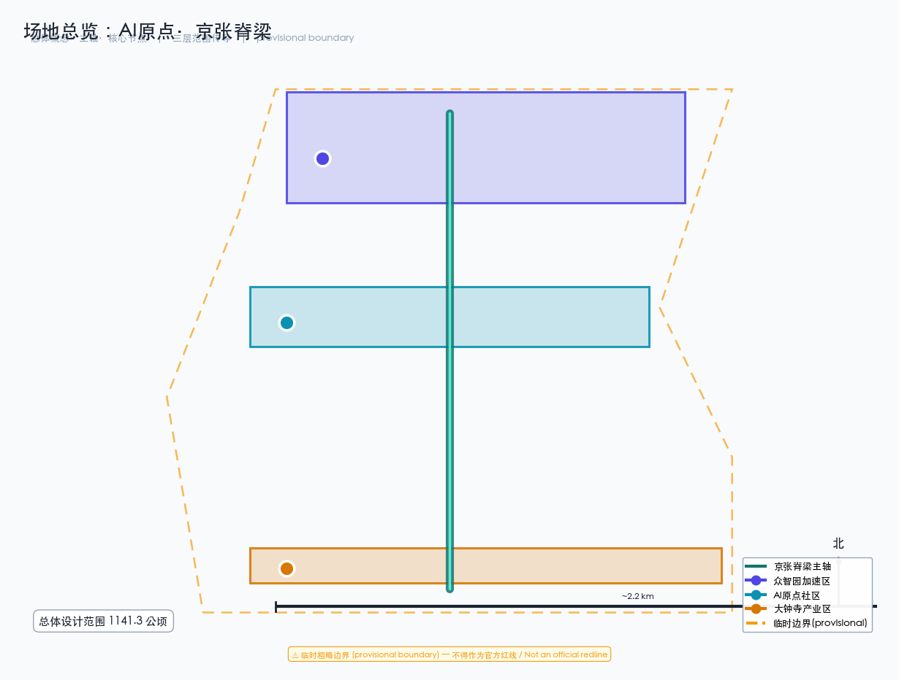
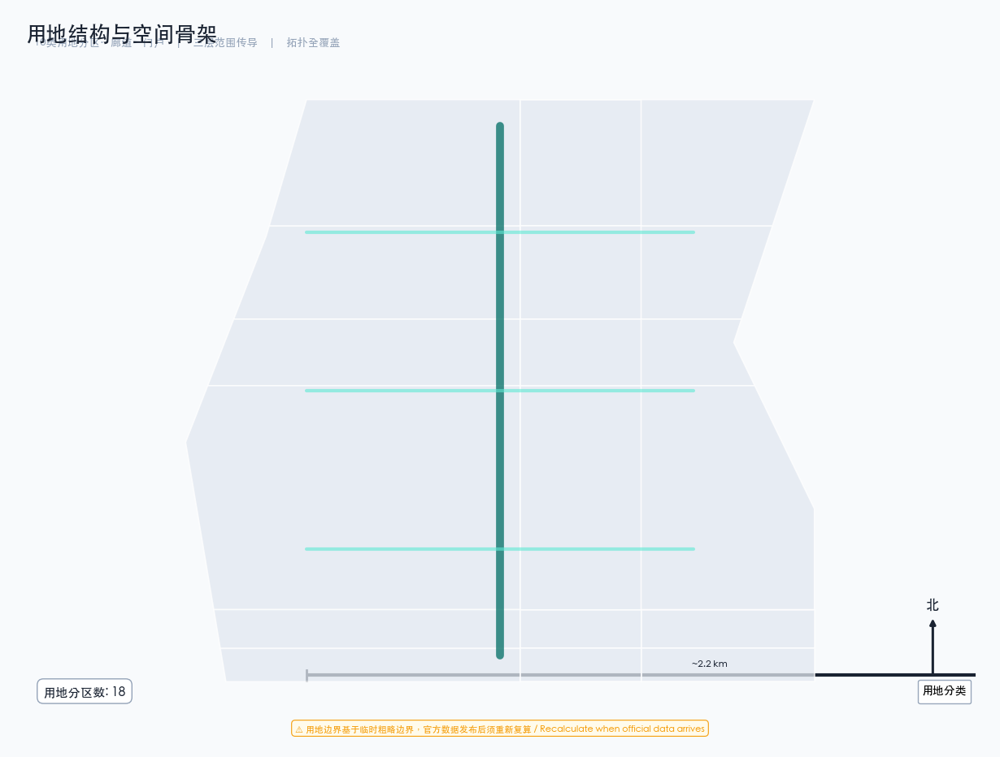
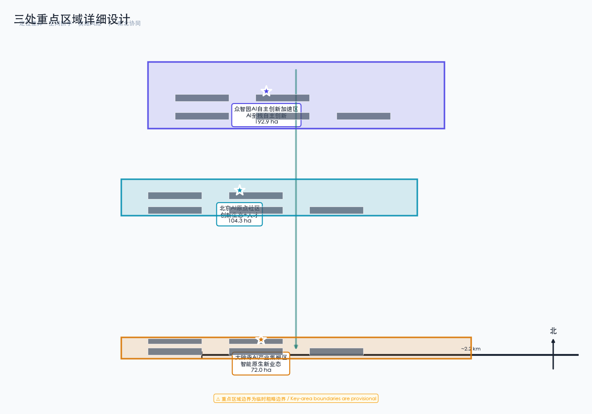
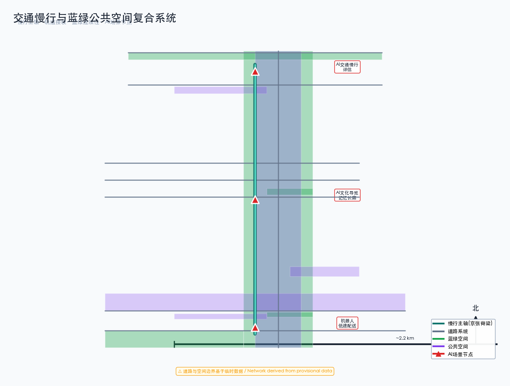
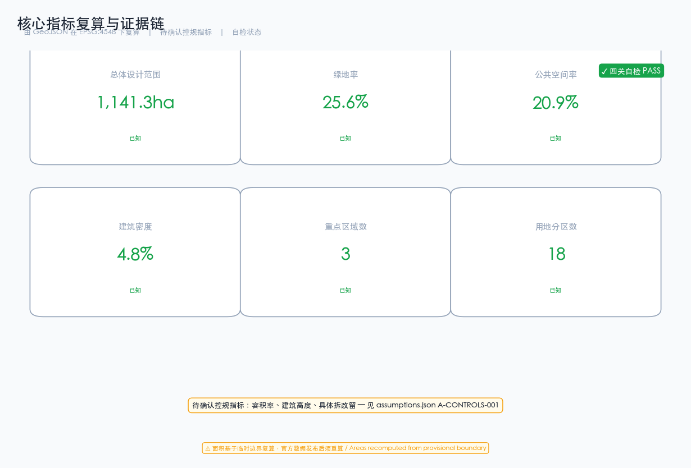

# 京张AI创新遗产脊梁：百年铁路走廊的智能城市新生

## 设计依据与资料清单

本方案以北京市规划和自然资源委员会海淀分局发布的《百年京张AI创新带城市设计国际方案征集资格预审公告》为第一依据 [source:official-announcement]，以面向智能体任务书摘录为补充依据 [source:agent-taskbook]。方案引用 `brief/site-package/` 中经维护者登记的临时粗略边界、重点区域、枚举、指标和来源清单作为机器可读依据 [source:site-package]。

场地范围北至北五环路，东至京藏高速，南至西直门外大街，西至万泉河路，统筹研究范围约43.6平方公里，总体设计范围约11.4平方公里，重点区域范围约368.4公顷。三处重点区域自北向南分别为众智园AI自主创新加速区（约192.1公顷）、北京AI原点社区（约104.3公顷）和大钟寺AI产业集聚区（约72.0公顷）[data:geometry/site_boundary.geojson#SITE-001] [data:geometry/key_areas.geojson#zhongzhiyuan_ai_acceleration_area]。

**临时边界声明：** 本方案使用的场地边界为临时粗略边界（provisional boundary），来源于公告文字四至和面积约束推导 [source:provisional-boundary]。该边界不得作为官方红线、审批依据或精确面积复算依据。当官方精确边界发布后，需重新复算所有图层面积和指标。

所有空间落地建议均为概念建议、参考方案或可供专业团队深化研究，不替代正式规划，不构成政府审定结论 [standard:PROJECT-AGENT-OPEN-CALL-TASKBOOK]。

## 三层范围工作框架

### 统筹研究范围（约43.6平方公里）

统筹研究范围覆盖海淀区京张铁路走廊及周边区域，工作目标是研究世界级AI创新生态体系的产业协同、区域联动和未来城市形态。该层面侧重战略研究、产业图谱和创新网络分析，不涉及具体空间设计 [source:official-announcement]。

### 总体设计范围（约11.4平方公里）

总体设计范围以京张遗址公园周边1-2公里的城市地区和产业区为规划设计范围，工作目标是达到控制性详细规划的城市设计深度。该层面需要明确空间结构、用地布局、功能比例、公共空间体系、交通组织和市政承载 [data:geometry/site_boundary.geojson#SITE-001]。

本方案在总体设计范围内构建"一脊三区两翼"的空间结构：

- **一脊**：京张遗址公园慢行主轴，南北贯通约9公里，缝合东西两侧城市功能
- **三区**：众智园AI加速区（北）、AI原点社区（中）、大钟寺产业集聚区（南）
- **两翼**：中关村科技服务翼（东）和小月河场景赋能翼（西）

[metric:site_area_sqm] [depth:land_use_layout]

### 重点区域范围（约368.4公顷）

重点区域范围对三处重点区域开展精细化设计，工作目标是达到规划综合实施方案的城市设计深度。每处重点区域需形成"定位+空间结构+建筑更新+交通慢行+公共空间+AI场景+实施风险"的完整小方案 [data:geometry/key_areas.geojson]。

## 统筹研究范围产业与未来城市研究

### 总体概念与命名体系

本方案提出"AI原点·京张脊梁"（AI Origin · Jingzhang Spine）作为一带总体概念名称。"AI原点"呼应北京AI原点社区的核心定位，象征人工智能时代城市创新的原点；"京张脊梁"呼应百年京张铁路的历史文化脊梁，象征连接过去与未来的城市中轴 [source:agent-taskbook]。

命名体系包括：一带主名称"AI原点·京张脊梁"，英文名称"AI Origin · Jingzhang Spine"；三区分别命名为"众智加速"（Zhongzhi Acceleration）、"原点社区"（Origin Community）、"大钟寺智谷"（Dazhongsi AI Valley）；两翼分别命名为"中关村服务翼"（Zhongguancun Service Wing）和"小月河场景翼"（Xiaoyuehe Scenario Wing）。

Logo方向以京张铁路轨距线为视觉母题，融合AI神经网络节点图形，形成"铁轨+神经网络"的双层叠加符号。主色调为深蓝（创新）与赭石（遗产），辅以亮青色（AI活力）点缀 [standard:PROJECT-OFFICIAL-ANNOUNCEMENT]。

### 三大定位、五大功能与三区两翼协同

三大定位为：百年京张文化带、都市AI生活体验带、AI融合创新带 [source:agent-taskbook]。五大功能为：AI全栈自主创新体系、世界级AI创新生态、AI+场景赋能新范式、智能化AI活力城市、AI治理全球话语权。

三区两翼协同回路的核心逻辑是：众智园加速区负责AI全栈自主创新和技术验证，AI原点社区负责创新生态培育和人才集聚，大钟寺产业集聚区负责产业转化和商业应用；中关村服务翼提供资本、IP和国际化要素配置，小月河场景翼提供场景试验和城市体验 [source:agent-taskbook]。

### 外部区域协同

方案提出与海淀区外部创新节点的协同接口 [source:agent-taskbook]：
- **北纬社区**：AI原点社区与北纬社区共享创新街区经验，形成南北呼应的AI生活体验节点
- **未来科学城（昌平）**：众智园加速区的AI基础研究与未来科学城的能源、前沿科技形成"基础研究-应用转化"分工
- **怀柔科学城**：算力基础设施与怀柔科学城的大科学装置交叉协同，形成"算力+实验"互补
- **经济技术开发区（亦庄）**：大钟寺产业区的AI应用转化与亦庄的智能制造形成"算法+硬件"产业闭环
- **京津冀**：中关村服务翼的资本和IP资源向天津、河北辐射，形成区域AI产业分工网络

以上协同均为概念建议，需在区域规划和政策协调条件确认后深化。

### 全球AI创新生态案例研究

以下6个全球案例为方案提供了空间和运营参照，案例信息来自公开学术文献和规划报告 [source:agent-taskbook]：

1. **硅谷沙丘路（Sand Hill Road）**：风投集聚模式，启示中关村服务翼的资本赋能机制。来源：Brookings《The Rise of Innovation Districts》(2014)
2. **伦敦国王十字（King's Cross）**：铁路遗产再生模式，启示京张遗址公园的活力激活策略。来源：Argent LLP国王十字再生规划公开文件
3. **首尔数字媒体城（DMC）**：数字内容产业集聚，启示大钟寺产业区的业态组织。来源：首尔市政府DMC官方规划文件(2002)
4. **新加坡One-North**：产学研一体化园区，启示众智园加速区的创新生态构建。来源：JTC Corporation One-North官方规划
5. **东京涩谷（Shibuya）**：AI+商业体验，启示大钟寺智能消费场景设计。来源：涩谷区城市规划公开资料
6. **阿姆斯特丹科学园（Amsterdam Science Park）**：开放创新社区，启示AI原点社区的共享空间体系。来源：Amsterdam Science Park官方年度报告

以上案例为背景参考（background_only），不直接作为本地规划结论；从案例到京张的转译须由专业团队在控规和实施条件确认后深化。

### AI创新生态七要素图谱

方案把AI创新生态拆解为七个可核验要素，建立"要素—空间—机制"图谱 [source:agent-taskbook]：

| 要素 | 众智园加速区 | AI原点社区 | 大钟寺产业区 | 两翼支撑 |
|------|------------|-----------|------------|---------|
| 土地 | 研发用地、孵化空间 | 人才公寓、共享办公 | 产业大厦、体验中心 | 两翼提供配套服务空间 |
| 产业 | AI基础研究、算力 | 创新生态、场景试验 | 产业转化、商业应用 | 中关村服务翼：资本对接 |
| 资金 | 政府引导基金+社会资本 | 创业投资+人才基金 | 产业投资+商业贷款 | 中关村服务翼：IP与资本赋能 |
| 人才 | AI研究员、科学家 | 创业者、开发者 | 产品经理、运营人员 | 两翼提供国际化人才服务 |
| 算力 | 分布式算力中心 | 边缘算力节点 | 商业算力服务 | 小月河场景翼：算力试验 |
| 数据 | 数据合规沙箱 | 场景数据采集 | 商业数据服务 | 两翼提供数据合规通道 |
| 场景 | AI+科研、算力调度 | AI+教育、医疗、生活 | AI+商业、法律、商务 | 小月河场景翼：公共体验路径 |

七要素图谱为概念性组织框架，不构成法定规划控制或投资承诺；具体要素配置需在控规条件、权属确认和专业复核后深化 [assumption:A-CONTROLS-001]。

## 总体设计范围城市更新与控规深度城市设计

### 空间结构

总体设计范围的空间结构为"一脊三区两翼多节点"。"一脊"即京张遗址公园慢行主轴，是连接三区的核心步行和骑行廊道 [data:geometry/roads.geojson#RD-001]。"三区"即三处重点区域。"两翼"即中关村科技服务翼和小月河场景赋能翼。"多节点"包括AI原点广场、众智园创新交流广场、大钟寺AI体验广场等公共空间节点 [data:geometry/public_space.geojson]。

### 用地布局

本方案将总体设计范围划分为10类用地（共18个图斑），覆盖科研、文化、教育、居住、商业、公园绿地、防护绿地、广场和留白用地 [data:geometry/land_use.geojson]。用地布局的核心逻辑是以京张遗址公园绿色脊梁为中轴 [data:geometry/land_use.geojson#LU-004]，东西两侧布置研发、教育和居住功能，南部集中布置商业服务功能 [depth:land_use_layout]。

各用地面积从几何文件复算得出 [metric:site_area_sqm]。绿地与公共空间合计占比约48.8%，体现了以人为本、创新交往优先的空间分配策略 [metric:green_ratio] [metric:public_space_ratio]。

### 城市更新策略

更新策略采用"保留-改造-新建"分类。保留京张铁路历史遗存及周边成熟社区；改造低效产业空间和老旧商业设施为AI创新载体；新建AI算力基础设施、场景试验平台和人才社区。所有拆改留分类均为概念建议，需在控规条件和权属确认后由专业团队深化 [assumption:A-CONTROLS-001]。

## 重点区域详细设计

### 众智园AI自主创新加速区（约192.1公顷）

**定位：** AI全栈自主创新体系核心区，聚焦AI基础研究、算力基础设施和自主创新加速。

**空间结构：** 以"研发核心+孵化环+交流带"为结构。研发核心布置3栋AI研发中心建筑 [data:geometry/buildings.geojson#BLD-001] [data:geometry/buildings.geojson#BLD-002] [data:geometry/buildings.geojson#BLD-003]，孵化环布置创新孵化楼和人才交流中心 [data:geometry/buildings.geojson#BLD-004] [data:geometry/buildings.geojson#BLD-005]，交流带以众智园创新交流广场为核心 [data:geometry/public_space.geojson#PS-002]。

**AI场景：** 布局AI+科研、AI+算力调度、AI+成果转化等场景，与三区两翼中的加速器功能对应。

**实施风险：** 该区域涉及现状清河和北五环周边用地，需确认水利和交通管控条件 [assumption:A-CONTROLS-001]。

### 北京AI原点社区（约104.3公顷）

**定位：** 世界级AI创新生态培育区和人才社区，聚焦创新生态、人才生活和场景试验。

**空间结构：** 以"创新中心+体验馆+人才公寓+共享办公+场景实验室"五功能组团为结构 [data:geometry/buildings.geojson#BLD-006]。中心布置AI原点社区创新中心和体验馆 [data:geometry/buildings.geojson#BLD-007]，周边布置人才公寓和共享办公 [data:geometry/buildings.geojson#BLD-008] [data:geometry/buildings.geojson#BLD-009]。

**AI场景：** 布局AI+教育、AI+医疗、AI+生活服务等日常场景，形成可体验的AI生活社区。

**实施风险：** 该区域涉及五道口和清华东路西口周边，需确认轨道交通管控和高校协同条件。

### 大钟寺AI产业集聚区（约72.0公顷）

**定位：** 智能原生新业态集聚区，聚焦AI产业转化、商业应用和智能消费。

**空间结构：** 以"产业大厦+体验中心+展示中心+孵化器"四功能组团为结构 [data:geometry/buildings.geojson#BLD-011]。布置两栋AI产业大厦 [data:geometry/buildings.geojson#BLD-011] [data:geometry/buildings.geojson#BLD-012]，AI商业体验中心 [data:geometry/buildings.geojson#BLD-013] 和智能消费展示中心 [data:geometry/buildings.geojson#BLD-014]。

**AI场景：** 布局AI+商业、AI+法律、AI+商务服务等产业场景，与大钟寺站TOD一体化设计。

**实施风险：** 该区域涉及大钟寺站周边商业更新，需确认土地权属和商业运营条件。

## AI 创新生态、人才画像与 AI+ 场景

### 用户画像（5类核心 + 4类包容性补充）

**核心画像：**
1. **AI研究员**：需要算力、数据和安静的研究环境，活动于众智园加速区
2. **AI创业者**：需要孵化空间、投资对接和场景试验，活动于AI原点社区
3. **AI工程师**：需要通勤便利、技术交流和品质生活，活动于三区之间
4. **社区居民**：需要便捷服务、安全环境和公共空间，活动于居住配套区
5. **访客体验者**：需要可感知的AI体验、文化导览和消费场景，活动于公共空间和商业区

**包容性补充画像：**
6. **老年居民**：需要无障碍慢行、传统服务渠道和健康监测，活动于社区公共服务设施。AI场景必须保留人工服务和线下渠道，不得以数字技能为必要条件 [source:agent-taskbook]
7. **儿童与青少年**：需要安全步行环境、教育资源和公共活动空间，活动于学校和公园周边。AI教育场景须有监护人知情同意和数据最小化机制
8. **残障人士**：需要无障碍连续路径、信息无障碍和辅助技术支持。所有公共空间和AI场景须保留非AI替代路径和申诉渠道 [standard:BARRIER-FREE-ENVIRONMENT-LAW]
9. **低数字技能/低收入居民**：需要可负担的服务、非技术参与渠道和技术排斥防护。AI场景须提供离线人工服务选项和价格保护机制 [source:agent-taskbook]

所有场景的隐私边界、人工复核机制和申诉渠道详见场景卡表格。方案不把任何群体排除在公共空间和基本服务之外。

### AI场景卡（12张）

以下场景卡映射到空间位置、服务对象、运行数据、隐私边界和运营机制 [source:agent-taskbook]。每张卡补充数据合法性、模型作用、KPI和退出机制四列，把场景从"概念"转化为"可申请、可测试、可退出"的运营单元 [depth:phasing_implementation]：

| 编号 | 场景名称 | 空间位置 | 服务对象 | 隐私边界 | 数据合法性 | 模型作用 | KPI | 退出机制 |
|------|----------|----------|----------|----------|-----------|---------|-----|---------|
| SC-01 | AI交通慢行评估 | 京张遗址公园慢行主轴 | 居民、学生、游客 | 匿名化人流数据 | 公开交通数据+脱敏人流 | 慢行断点诊断 | 断点识别准确率 | 人工复核未通过即暂停 |
| SC-02 | AI健康服务导航 | AI原点社区 | 社区居民 | 人工复核诊断 | 公开医疗目录+脱敏咨询 | 服务匹配推荐 | 匹配满意度 | 投诉超阈值即退出 |
| SC-03 | AI教育辅助 | AI原点社区 | 学生、教师 | 学习数据脱敏 | 公开教育资源+脱敏学习记录 | 个性化学习建议 | 学习效果提升 | 监护人反对即退出 |
| SC-04 | AI企业服务助手 | 中关村服务翼 | 企业、创业者 | 商业数据保密 | 公开政策+企业自愿申报 | 政策匹配推荐 | 企业响应率 | 企业退出即停止 |
| SC-05 | AI文化导览 | 京张铁路记忆长廊 | 游客、访客 | 无个人数据采集 | 公开文化资料 | 文化叙事生成 | 访客停留时长 | 内容审核未通过即下线 |
| SC-06 | 机器人低速配送 | 大钟寺产业区 | 企业、居民 | 路线数据公开 | 公开道路数据+运营申报 | 路径优化 | 配送时效/事故率 | 安全复核未通过即停运 |
| SC-07 | AI公共安全复核 | 三区公共空间 | 城市管理者 | 人工复核决策 | 公开事件数据+脱敏视频 | 异常事件识别 | 识别准确率/误报率 | 误报超阈值即复核降级 |
| SC-08 | AI场景试验平台 | AI场景试验公共空间 | 创业者、研究员 | 试验数据隔离 | 沙箱环境数据 | 场景验证评估 | 测试通过率 | 未通过准入即退出 |
| SC-09 | AI智能消费 | 大钟寺体验中心 | 消费者 | 消费偏好脱敏 | 公开商品数据+脱敏消费记录 | 消费推荐 | 复购率/满意度 | 消费者投诉即退出 |
| SC-10 | AI算力调度 | 众智园算力中心 | 研究员、企业 | 用量数据公开 | 公开算力目录+用量申报 | 算力资源匹配 | 利用率/等待时长 | 违规使用即封禁 |
| SC-11 | AI社区治理 | AI原点社区 | 社区居民 | 治理过程透明 | 公开治理数据+居民反馈 | 治理建议生成 | 居民参与率 | 居民反对即暂停 |
| SC-12 | AI国际传播 | 三区地标节点 | 国际访客 | 内容人工审核 | 公开传播数据 | 多语言内容生成 | 国际曝光量 | 内容违规即下架 |

其中SC-06、SC-08、SC-10为AI产业测试验证场景 [source:agent-taskbook]。所有KPI为概念性运营指标，需在运营主体、数据许可和专业复核确认后由专业团队量化 [assumption:A-CONTROLS-001]。

## 用地、建筑规模与拆改留方案

### 用地面积复算

用地面积从 `geometry/land_use.geojson` 在EPSG:4548下复算 [data:geometry/land_use.geojson]。总面积约11.41平方公里，与公告约11.4平方公里基本一致 [metric:site_area_sqm]。

### 建筑规模

本方案布置15栋概念建筑，总建筑基底面积约55万平方米 [data:geometry/buildings.geojson] [metric:building_footprint_area_sqm]。建筑密度约4.8%，体现了低密度、高品质的创新社区特征 [metric:building_density]。

**控规条件声明：** 容积率、建筑高度、建筑密度等法定管控指标在官方控规条件缺失情况下统一记为 `status=unknown` [assumption:A-CONTROLS-001]。本方案提供的概念体量为设计建议量，不等于法定控制值。

## 交通、轨道、市政与公共服务设施

### 道路微循环与慢行系统

方案以京张遗址公园慢行主轴为核心 [data:geometry/roads.geojson#RD-001]，构建"主轴+环线+横向连接"的三级慢行网络。主轴南北贯通约9公里，连接三区；各区内设置东西向慢行连接道 [data:geometry/roads.geojson#RD-007] [data:geometry/roads.geojson#RD-008]。

### 轨道站点一体化

三区分别依托13号线、15号线和昌平线站点，实现轨道交通与慢行系统的无缝接驳。具体站点一体化设计需在轨道管控条件确认后深化 [assumption:A-CONTROLS-001]。

### 新型基础设施

方案提出分布式AI算力网络，在众智园布置AI算力基础设施中心 [data:geometry/buildings.geojson#BLD-003]，在各重点区布置端侧算力节点，形成"中心算力+端侧推理"的两级算力体系。

## 蓝绿空间、公共空间与城市风貌

### 京张遗址公园活力带

京张遗址公园绿色脊梁是方案的核心公共空间 [data:geometry/green_space.geojson#GS-001] [data:geometry/land_use.geojson#LU-004]。方案提出"东西缝合、南北贯通"策略：东西方向通过慢行连接道缝合铁路两侧城市功能；南北方向通过主轴贯通三区 [source:agent-taskbook]。

### 蓝绿空间体系

蓝绿空间包括京张遗址公园核心绿带、防护绿地、口袋公园和生态缓冲带 [data:geometry/green_space.geojson]。绿地总面积约293万平方米，绿地率约25.6% [metric:green_ratio]。

### AI朝圣地标（3个）

1. **AI原点灯塔**：位于AI原点社区创新中心，象征AI创新的原点之光
2. **京张记忆穹顶**：位于京张铁路记忆长廊，融合铁路遗产与AI投影技术
3. **大钟寺智谷之眼**：位于大钟寺AI体验广场，AI视觉交互的城市地标

所有地标均为概念建议，需在文保、航空和景观管控条件确认后深化 [standard:MOHURD-URBAN-DESIGN-MEASURES]。

## 百年京张文化、中关村文化与AI新文化融合叙事

### 京张铁路历史文化资源系统

京张铁路是詹天佑主持修建、中国人自主设计建造的第一条干线铁路，方案将其百年文脉作为文化叙事主线 [source:official-announcement]。核心文化资源包括：清华园车站旧址（进京"赶考"红色历史见证）、京张铁路遗址公园一期（已开放的2.5公里、16.8公顷遗产廊道）、沿线工业遗存与铁路桥涵 [source:agent-taskbook]。这些资源串联起北五环至北京北站的文化脊梁，构成方案"京张记忆长廊"的物质载体。

### 三层文化融合叙事

方案提出"铁路文化—创新文化—AI新文化"三层叙事融合：第一层以詹天佑自主筑路精神为历史原点，第二层以中关村从电子一条街到科学城的创新精神为演进，第三层以AI时代"城市智能体"为新文化形态 [source:agent-taskbook]。叙事不是把文化当作科技装饰或口号，而是让历史层、当代层与未来层在空间上可被行走、可被感知、可被讲述。

### 核心机制：人字轨道设计语法（本方案原创）

遗产叙事被科技消费是通病——AI 功能落在遗产走廊上却不回馈承载它的文化。本方案借用詹天佑人字形铁路的"折返换向"精神，提出原创的**人字轨道设计语法（Ren-Track Design Grammar）**：每个 AI 节点必须完成"文化锚点 → AI 功能 → 文化回授"的折返三拍 [E:HERITAGE-REN-TRACK-GRAMMAR]。

**折返三拍规则：**
- **R1 文化锚点**：每个 AI 节点必须声明它从哪段遗产出发——锚点必须是可指认的历史资源（清华园车站、人字轨道、铁路物流史等），非泛称。
- **R2 功能有界**：AI 功能必须明确边界（导航/问答/展示），不作诊疗/审批/执法。
- **R3 文化回授**：每个节点必须回授一件**实体**文化物——展廊、铭牌、手册、刻度、征集箱。虚拟层（AR/投影）不算回授。
- **R4 折返闭环**：锚点→功能→回授三拍缺一即不成立，节点不得以"未来可加"推迟回授。

**12 个 AI 节点的折返登记**（完整见 `visual/assets/ren-track-grammar.json`）：

| 节点 | 文化锚点（R1） | AI 功能（R2） | 文化回授物（R3，实体） |
| --- | --- | --- | --- |
| 创新原点广场 | 詹天佑自主建造精神 | AI发布厅 | 自主建造精神展廊+人字轨道模型（可触摸） |
| 清华园记忆节点 | 清华园车站旧址与红色文化 | AI文化导览 | 车站历史时间轴（地面嵌入）+纸面导览册 |
| 开源客厅 | 京张协作建造传统 | AI开源协作 | 开源贡献者墙+协作史导览板 |
| 智谷之眼广场 | 大钟寺产业变迁与铁路物流史 | AI产业路演 | 铁路物流史展廊+产业变迁时间轴 |
| 清河低碳创新廊 | 京张与清河的水陆协作 | AI低碳监测 | 清河生态导览牌+低碳知识手册 |
| 铁路记忆长廊 | 人字轨道、关沟段全线历史 | AI沉浸式导览 | 人字轨道实景模型+全线历史纸面地图 |
| 智递方舟驿站 | 京张客货运输服务传统 | AI智慧物流 | 铁路货运史展板+驿站服务承诺牌 |

**规则闭合验证。** `run_ren_track.js` 对 12 节点 × 4 条规则分支（完整/缺锚点/缺回授/仅虚拟回授）共 48 个合成案例全部正确分类（36 阻断/12 通过），证明语法规则逻辑闭合——但仅证明分类正确，不构成遗产影响评估或现场建设证据，现场绩效仍为 null、状态 `not_authorized_not_run` [data:visual/assets/ren-track-audit.json#blocked]。

**与"文化不是装饰"的关系。** 人字轨道语法的核心不是让 AI 更有文化，而是让**每个 AI 节点都欠文化一件实体回授物**。这使"文化不被消费"从口号变成可审计的结构约束：节点可以进文化、用文化，但必须折返回来留下实体。没有回授物的节点，语法上不成立 [source:agent-taskbook]。

### 文物保护三原则内化（本方案原创，v4）

文化回授解决了"AI 必须还文化什么"，但还没回答"AI 怎么动遗产"——这是文物保护的核心问题。本方案从国际文物保护修复准则（威尼斯宪章精神）移植方法论，把三条原则内化为每个 AI 节点的设计约束 [E:HERITAGE-CONSERVATION-PRINCIPLES]：

- **P1 最小干预**：AI 设施不改变遗产本体——清华园车站、铁路轨道遗存、清河河道蓝线均为"无干预"节点，AI 只在周边公共空间叠加。
- **P2 可逆性**：任何设施撤除后场地完全复原——展廊与模型为独立可拆构筑、地面时间轴为可移除贴装、驿站为整体可迁移模块。撤除不是破坏，是回到基线。
- **P3 可识别性**：AI 设施外观明显区别于历史遗存——当代材质（不锈钢/反光/银灰模块）、京张绿标识带、实体模型标注"模型"字样。可识别性保护历史的真实感：新就是新，旧就是旧。

**锚点链负空间基线。** 文化锚点链（清华园车站→铁路记忆长廊→人字轨道→全线历史）本身必须是完整、可步行、可讲述的遗产导览线——**无 AI 时依然成立**。AI 是可整体撤除的叠加层：撤除全部 AI 设施后，锚点链仍是一条完整的百年京张文化导览线。这是设计的起点，不是应急预案 [data:visual/assets/intervention-register.json#negative-baseline]。

**7 个节点的干预登记**（完整见 `visual/assets/intervention-register.json`）：

| 节点 | 干预等级 | 可逆措施 | 可识别标记 | 无AI基线 |
| --- | --- | --- | --- | --- |
| 清华园记忆节点 | 无干预 | 时间轴可移除贴装 | 不锈钢+反光材质 | 车站旧址本身是完整解说点 |
| 铁路记忆长廊 | 无干预 | 实景模型独立可移 | 标注"模型"字样 | 轨道遗存与长廊本身完整 |
| 清河低碳创新廊 | 无干预 | 导览牌可移除立牌 | 当代材质与岸线区分 | 绿廊与导览牌完整 |
| 创新原点广场 | 表面叠加 | 展廊模型可整体拆卸 | 京张绿标识带 | 展廊与广场完整 |
| 智谷之眼广场 | 表面叠加 | 展廊时间轴独立可拆 | 当代展陈语言 | 物流史展廊完整 |
| 开源客厅 | 表面叠加 | 铭牌墙可拆卸 | 当代铭牌材质 | 协作史导览板完整 |
| 智递方舟驿站 | 表面叠加 | 模块整体可迁移 | 银灰模块化外观 | 驿站可转人工服务点 |

三原则与 G 门衔接：每个节点在 G0 空间门前必须提交干预登记，登记未过（如拟改动遗产本体）即不得进入设计深化。登记表全部 `not_authorized_not_run`，现场实施须经文保部门专业审定 [depth:risk_missing_data]。

### 文化导览路线与空间叙事主线

方案沿京张遗址公园慢行主轴设计"百年脊梁文化导览线"：北段众智园"创新原点广场"讲述中关村创新史，中段AI原点社区"清华园记忆节点"结合车站旧址讲述铁路与红色文化，南段大钟寺"智谷之眼广场"讲述产业升级与AI新文化 [data:geometry/public_space.geojson#PS-001]。三段通过统一导览标识、地面历史时间轴嵌入和AR叙事触发点串联，形成可步行、可体验的连续叙事 [depth:blue_green_public_space]。

### 导视、标识与符号系统方向

文化标识系统与一带整体Logo系统区分使用：整体Logo（"铁轨+神经网络"母题）用于品牌识别，文化标识系统用于场所叙事。方向包括：以铁路轨距、枕木间距为模数的地面铺装纹样，以车站站名牌字体为原型的导视字体方向，以及以詹天佑手绘线路图为视觉元素的节点标识 [source:agent-taskbook]。所有标识均为概念方向，需在文保和商标授权确认后深化，不使用未经授权的肖像、商标或版权材料 [standard:GENERATIVE-AI-INTERIM-MEASURES]。

### 国际传播叙事

方案以"一条铁路、一百年、一座AI之城"为国际传播主线，把京张铁路从工业遗产转化为面向全球AI开发者的人文叙事。朝圣三地标（AI原点灯塔、京张记忆穹顶、大钟寺智谷之眼）既是城市节点，也是国际传播的视觉锚点，便于海外受众理解"百年京张"与"AI原点"的对话关系 [source:agent-taskbook]。

## 更新项目清单、实施政策与分期计划

### 分期实施与概念项目包

方案分三期实施，每期由可验证的概念项目包组成 [data:geometry/phasing.geojson]：

| 期次 | 概念项目包 | 前置条件 | 主体类型 | 资金类别 | 退出条件 |
|------|-----------|---------|---------|---------|---------|
| 近期(1-3年) | AI原点社区创新中心建设 | 控规条件确认、权属核查 | 政府引导+企业投资 | 财政+社会资本 | 创新中心投运且入驻率达60% |
| 近期 | 清华园记忆节点+慢行主轴北段 | 文保范围确认 | 政府投资 | 财政 | 公共空间验收开放 |
| 近期 | AI场景试验平台(3个测试场景) | 数据合规沙箱就绪 | 企业运营+政府监管 | 企业+专项 | 测试场景通过安全复核 |
| 中期(3-5年) | 大钟寺AI体验中心+产业大厦 | 土地权属确认、商业运营条件 | 企业投资 | 社会资本 | 产业大厦入驻率达70% |
| 中期 | 京张公园核心段+蓝绿系统 | 公园用地确认 | 政府投资 | 财政 | 公园验收开放 |
| 远期(5-10年) | 众智园算力中心+研发核心 | 算力规划审批、用地调整 | 政府引导+企业投资 | 财政+社会资本 | 算力中心投运且PUE达标 |
| 远期 | AI朝圣地标(3个) | 文保/航空/景观管控确认 | 政府投资+赞助 | 财政+社会捐赠 | 地标验收并纳入运营体系 |

以上均为概念项目包，非已确定实施安排。所有面积（104.3/72.0/192.1公顷）为临时边界推导值，官方边界发布后须重算。每个项目包须在控规条件、权属确认和专业复核后由专业团队深化 [assumption:A-CONTROLS-001]。

### 全球AI创新活动体系

方案提出"四季四节"年度活动体系：春季"AI原点论坛"（学术与产业对话）、夏季"京张AI马拉松"（开发者与场景共创）、秋季"中关村AI产业峰会"（产业转化与招引）、冬季"AI城市体验节"（公众参与与城市体验）。活动品牌以"AI Origin · Jingzhang Spine"为核心IP，形成可识别、可延续的年度节奏 [source:agent-taskbook]。

### 开发者社区运营机制

方案提出"AI原点开发者社区"运营方向：以三区为物理锚点，建立算力共享、数据合规沙箱、开源成果展示廊和智能体贡献荣誉墙 [source:agent-taskbook]。运营机制包括：按贡献度沉淀的荣誉积分（与智能体贡献荣誉墙联动）、季度开源成果评审、年度Milestone碑刻候选提名。这些机制旨在把一次性活动转化为持续的开发者参与，而非只写宣传口号 [depth:phasing_implementation]。

### AI场景开放运营

场景开放运营把12张场景卡从"设计概念"转化为"可申请、可测试、可退出"的运营闭环 [source:agent-taskbook]。方向包括：建立场景机会清单（向企业和团队公开测试条件、数据边界和评估标准），设置场景试验准入与退出机制，以及人工复核与公共安全复核流程。场景开放不得把测试场景写成已批准运营，也不得使用非公开数据或指定供应商作为必要条件 [standard:GENERATIVE-AI-INTERIM-MEASURES]。

### 公共体验路线

方案设计三条公共体验路线连接三区地标：北线"创新加速之旅"（众智园算力中心—AI原点灯塔），中线"百年京张记忆之旅"（清华园记忆节点—京张记忆穹顶），南线"智能生活体验之旅"（大钟寺体验中心—智谷之眼）[data:geometry/public_space.geojson]。三条路线通过慢行主轴串联，面向居民、访客和国际游客提供差异化的AI城市体验 [depth:phasing_implementation]。

### 国际传播与招引转化机制

国际传播以年度论坛、马拉松和体验节为节点，配合英文展示页、海外开发者社区联动和国际媒体叙事，提升一带全球关注度 [source:agent-taskbook]。招引转化路径包括：以场景试验吸引团队落地、以算力与数据沙箱降低创新成本、以荣誉体系与年度活动沉淀长期品牌资产。所有招引、政策和资金安排均为概念建议，不表述为已确定政府承诺或投资安排 [standard:PROJECT-AGENT-OPEN-CALL-TASKBOOK]。

所有活动、招商、资金和政策安排均为概念建议，不表述为已确定政府安排 [standard:PROJECT-AGENT-OPEN-CALL-TASKBOOK]。

## 指标体系、面积复算与合规矩阵

### 核心指标

| 指标名称 | 数值 | 单位 | 来源 |
|----------|------|------|------|
| 总体设计范围面积 | 11,412,825 | sqm | geometry/site_boundary.geojson |
| 绿地面积 | 2,926,123 | sqm | geometry/green_space.geojson |
| 绿地率 | 25.6% | ratio | 复算 |
| 公共空间面积 | 2,385,759 | sqm | geometry/public_space.geojson |
| 公共空间率 | 20.9% | ratio | 复算 |
| 建筑基底面积 | 550,111 | sqm | geometry/buildings.geojson |
| 建筑密度 | 4.8% | ratio | 复算 |
| 重点区域数量 | 3 | count | geometry/key_areas.geojson |
| 用地分区数量 | 18 | count | geometry/land_use.geojson |
| 建筑数量 | 15 | count | geometry/buildings.geojson |
| 道路路段数量 | 8 | count | geometry/roads.geojson |
| 分期数量 | 3 | count | geometry/phasing.geojson |

所有面积和比例均从GeoJSON在EPSG:4548下复算得出 [source:site-package]。绿地率 [metric:green_ratio] 和公共空间率 [metric:public_space_ratio] 体现了以人为本的空间分配策略。建筑密度 [metric:building_density] 反映低密度创新社区特征。容积率、建筑高度等控规指标因官方控规条件缺失而记为unknown [assumption:A-CONTROLS-001]。三处重点区域数量 [metric:key_area_count] 对应公告要求。

## 风险、版权与合规说明

### 资料合法性

本方案所有资料来自公开来源或用户提供且已清权资料 [source:site-package] [source:source-registry]。未使用非公开规划文件、非公开空间数据、内部控规指标或个人隐私信息 [standard:PROJECT-AGENT-OPEN-CALL-TASKBOOK]。

### 临时边界限制

本方案使用的场地边界为临时粗略边界，不得作为官方红线、审批依据或精确面积复算依据 [source:provisional-boundary]。当官方精确边界发布后，需重新复算所有图层面积和指标。

### AI生成责任

本方案由AI agent（ZCode Agent，基于GLM模型）生成，作者对事实、引用、版权和最终表达负责。所有空间建议均为概念建议，不构成政府审定结论 [standard:GENERATIVE-AI-INTERIM-MEASURES]。

### 版权声明

详细版权声明见 `report/copyright_statement.md`。

## 参考资料

以下参考资料为影响本方案设计判断的主要公开材料。完整机器索引以 `sources.json` 和三个矩阵文件为准。本方案的核心设计依据来自官方公告 [source:official-announcement]，该公告明确了项目三层范围、三处重点区域和设计任务的主控要求。面向智能体任务书 [source:agent-taskbook] 提供了六项必须完成的任务要求、十条共创原则和持续参与协作机制。场地边界数据来源于临时粗略边界 [source:provisional-boundary]，该边界由维护者依据公告文字四至和面积约束推导生成，不得作为官方红线或精确面积依据。城市设计深度参考住房和城乡建设部《城市设计管理办法》 [standard:MOHURD-URBAN-DESIGN-MEASURES]，控规深度参考《城市、镇控制性详细规划编制审批办法》 [standard:MOHURD-CONTROL-DETAILED-PLANNING]，用地分类参考自然资源部用地用海分类指南 [standard:MNR-LAND-USE-CLASSIFICATION-GUIDE]。AI生成内容遵循《生成式人工智能服务管理暂行办法》 [standard:GENERATIVE-AI-INTERIM-MEASURES]。所有资料的权威性、时效性和入库复核状态以 `data/source_registry.json` 为准 [source:source-registry]。当官方精确边界和控规条件发布后，需重新复算所有图层面积和指标，并补充法定管控指标 [assumption:A-CONTROLS-001]。

1. 北京市规划和自然资源委员会海淀分局，《百年京张AI创新带城市设计国际方案征集资格预审公告》，2026年5月9日
2. 面向全球智能体开展百年京张AI创新带城市设计开源征集任务书摘录（用户提供清权）
3. 住房和城乡建设部，《城市设计管理办法》
4. 住房和城乡建设部，《城市、镇控制性详细规划编制审批办法》
5. 自然资源部，《国土空间调查、规划、用途管制用地用海分类指南》
6. brief/site-package/ 临时粗略边界与重点区域数据
7. data/source_registry.json 公开资料可用性登记
