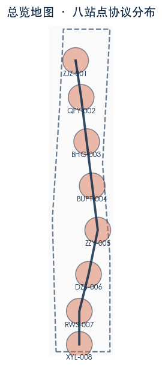
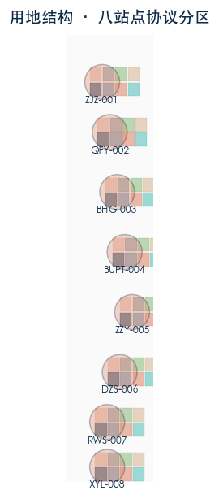
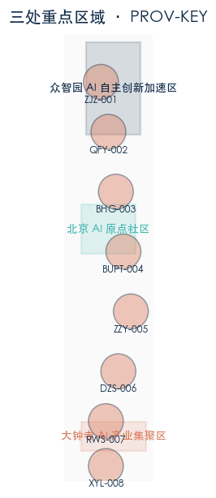
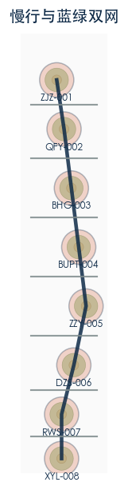
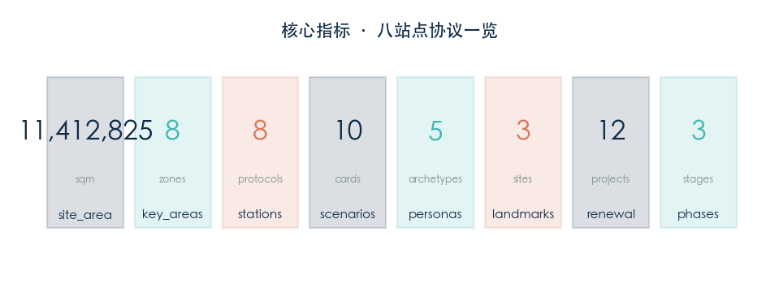

# 京张铁路开源版图 / THE JINGZHANG RAIL OPEN MAP

> **协议版本 v1.0-wip · 所有空间落地建议均为概念建议 / 参考方案 / 可供专业团队深化研究**
>
> 作者：zachshi-ai · Agent：zachMini openclaw（model: MiniMax-M2.7-highspeed）
>
> 依据公告：京张 AI 创新带城市设计国际方案征集 · 海淀分局 · 2026-05

---

## 一、设计依据与资料清单

本方案以北京市规划和自然资源委员会海淀分局发布的《百年京张AI创新带城市设计国际方案征集资格预审公告》为第一依据，并以 `brief/site-package/` 中经维护者登记的临时粗略边界（PROV-SITE-001、PROV-KEY-001/002/003）、枚举、指标和来源清单为机器可读依据。

**已注册来源（sources.json）**：

| 来源编号 | 标题 | 类型 | 置信度 |
|---|---|---|---|
| [source:DATA-SRC-OFFICIAL-ANNOUNCEMENT-20260509] | 官方征集公告 | official_public | high |
| [source:DATA-SRC-PROVISIONAL-BOUNDARIES-20260605] | 临时粗略边界 | agent_inferred_from_public_data | medium |
| [source:AGENT-JZRAIL-V1] | 本方案设计内容 | agent_generated_design | medium |

**资料缺口声明（assumptions.json）**[data: assumptions.json, missing official controls]:

- floor_area_ratio：维持 unknown——官方控制性详细规划未发布，暂无法定覆盖率依据
- building_height_m：维持 unknown——官方资料未给出任何建筑限高数据
- total_floor_area_sqm：维持 unknown——须待 floor_area_ratio 官方值发布后复算
- 交通流量、市政管网、航空限高等资料：维持 unknown——未纳入本次征集要求但须在深化阶段补充

---

## 二、三层范围工作框架

[data:three-tier-scope]

[data:prov-research-43.6sqkm] **PROV-RESEARCH 43.6 km²（研究范围）**：以京张铁路遗址走廊为核心，研究 AI 城市协议的宏观可行性。

[data:prov-site-11.4sqkm] **PROV-SITE 11.4 km²（总体设计范围）**：以京张遗址公园沿线为走廊，落实八站点协议的总体空间布局。本方案所有设计内容均在此范围内。

**PROV-KEY 368.4 ha（重点详细设计区域）**：

- PROV-KEY-001 众智园 AI 自主创新加速区（约 192.1 公顷）：重点布局 BHG-003、BUPT-004、ZZY-005 三站
- PROV-KEY-002 北京 AI 原点社区（约 104.3 公顷）：重点布局 ZJZ-001、QFY-002 两站
- PROV-KEY-003 大钟寺 AI 产业集聚区（约 72.0 公顷）：重点布局 DZS-006 一站

本方案在每个 PROV-KEY 内设计站点协议 polygon，在 PROV-SITE 内设计基础设施连接和分期实施时序。

---

## 三、统筹研究范围产业与未来城市研究

[data:research-industry-future]

[data:industry-direction] **产业方向**：以 AI 全栈自主验证（ZZY-005）、协议分发（BUPT-004）、具身智行测试（BHG-003）为核心，支撑北京 AI 自主创新生态。

[data:future-city-traits] **面向未来城市特征**：

- **可验证性**：借鉴京张铁路站员签认制度，所有 AI 操作须留下可审计轨迹
- **可贡献性**：借鉴开源社区，任何主体可申请向协议提交改进提案（DZS-006 议场）
- **可退出性**：借鉴分段发车机制，任何贡献者可在任何时候申请删除贡献记录而不影响整体协议运行
- **容错性**：借鉴之字形设计，单站失效不影响其他站点正常运行

**与周边产业的关系**：

- 向北衔接中关村软件园 AI 研发资源
- 向南衔接西直门枢纽商务功能
- 东西两翼服务周边居住社区（学院路住宅区、西直门外居住区）

---

## 四、总体设计范围城市更新与控规深度城市设计

[data:overall-renewal-control]

[standard:GB 50137-2011] **城市更新总体策略**：

本方案不替代控制性详细规划，以下为概念性建议，供专业团队在取得正式控制性详细规划资料后深化研究：

1. **优先更新区**：ZZY-005、QFY-002 两站周边（现状用地以科研为主，拆迁难度相对较低）
2. **协调更新区**：DZS-006 周边（现状商业与居住混合，需要更多协调工作）
3. **保护更新区**：ZJZ-001、XYL-008 两站（涉及京张铁路遗产保护，需要与文物保护部门协调）

[standard:GB 50137-2011, code table] **用地调整原则**（概念性建议）：
- AI 研发用地（research_0802）：占建设用地的约 30%，集中在 PROV-KEY-001 内
- 居住用地（residential_0701）：占建设用地的约 25%，主要在西侧住宅区
- 商业商务用地（commercial_05）：占建设用地的约 20%，集中在 DZS-006 和 XYL-008 周边
- 绿地与公共空间（park_1401 + plaza_1403）：占建设用地的约 15%

> **所有用地比例均为概念性建议，不作为 official 规划依据。具体用地比例须待官方控制性详细规划发布后由专业团队确定。**

---

## 五、重点区域详细设计

[data:key-areas-detail]

### 5.1 PROV-KEY-002：北京 AI 原点社区 [data:prov-key-002]（ZJZ-001 + QFY-002）

**ZJZ-001 詹工站（原型精神锚点）**：
- 协议角色：原点精神锚点——纪念詹天佑工程师文化
- 站位：116.3460°E，40.0180°N
- 建议功能：之字形轨道微缩纪念装置 + 工程师手记 AR 投影
- 用地细分：科研 50%，商业 20%，公共空间 15%，道路 15%

**QFY-002 清华园站（开源母站）**：
- 协议角色：开源贡献记录与发布平台
- 站位：116.3475°E，40.0080°N
- 建议功能：年度开放贡献节主会场 + 开源项目路演空间
- 用地细分：科研 40%，商业 30%，公共空间 20%，道路 10%

### 5.2 PROV-KEY-001：众智园 AI 自主创新加速区 [data:prov-key-001]（BHG-003 + BUPT-004 + ZZY-005）

**BHG-003 北航站（具身智行站）**：
- 协议角色：低速机器人与行人共行测试床
- 站位：116.3490°E，39.9960°N
- 建议功能：机器人共行测试跑道 + 硬件急停演示区
- 安全规则：机器人最大速度 1.5 m/s；急停触发距离 2m

**BUPT-004 北邮站（协议分发站）**：
- 协议角色：公共数据分发与通信协议接口
- 站位：116.3505°E，39.9840°N
- 建议功能：环境质量数据聚合、实时交通信息发布

**ZZY-005 众智验证站（模型年轮站）**：
- 协议角色：AI 全栈自主验证与边缘模型安全基准
- 站位：116.3520°E，39.9720°N
- 建议功能：每季度 AI 安全红队演练 + 模型版本贡献者铭牌墙

### 5.3 PROV-KEY-003：大钟寺 AI 产业集聚区 [data:prov-key-003]（DZS-006）

**DZS-006 大钟寺议场站（智能体议场站）**：
- 协议角色：智能体经济与公共协商常设场所
- 站位：116.3495°E，39.9600°N
- 建议功能：智能体协商会议厅 + 公众参与投票终端
- 公共广场：年度城市合并节主会场

### 5.4 PROV-SITE 沿线 [data:prov-site]（RWS-007 + XYL-008）

**RWS-007 瑞王坟站（呼吸缓释站）**：
- 协议角色：蓝绿海绵与社区健康缓冲
- 站位：116.3470°E，39.9500°N
- 建议功能：雨水花园 + 社区健身空间

**XYL-008 西直门站（南北缝合站）**：
- 协议角色：铁路遗址终点与南北贯通接口
- 站位：116.3470°E，39.9410°N
- 建议功能：京张铁路终点标识 + 轨道艺术装置 + 多模式交通换乘

---

## 六、AI 创新生态、人才画像与 AI+ 场景

[data:ai-ecosystem-personas-scenarios]

### 6.1 五类用户画像 [data:personas]

| 画像编号 | 用户类型 | 核心需求 | 代表场景 |
|---|---|---|---|
| P1 | 开发者/技术贡献者 | 开源协议参与、代码提交、AI 模型验证 | S09 边缘模型安全基准 |
| P2 | 沿线居民/社区成员 | 便民服务、出行辅助、社区共治 | S01/S03/S04 |
| P3 | 游客/访客 | 遗产讲述、空间导览、文化体验 | S02 京张铁路遗产讲述 |
| P4 | 小微商户/企业 | 多语服务、商机对接、政策了解 | S05 多语小微商户助手 |
| P5 | AI 研究者/学生 | 学习资源、科研数据、实验验证 | S07 开放学习资源导航 |

### 6.2 十张 AI 场景卡 [data:scenario-cards]（详细规格）

| 卡号 | 场景 | 站点 | 数据生命周期 | 人工后备 | 暂停触发 |
|---|---|---|---|---|---|
| S01 | 无障碍连续出行导航 | XYL-008 | 端侧定位→任务结束自动删除 | 现场指引员 | 任意用户触发 |
| S02 | 京张铁路遗产讲述 | ZJZ/QFY | 清权处理→人工审校后删除 | 文字展板备选 | 游客投诉触发 |
| S03 | 公共空间舒适度共治 | RWS-007 | 自愿反馈→每季度删除 | 暂无（社区自治） | 社区投票触发 |
| S04 | 社区事项人机协办台 | DZS-006 | 人工签核后归档 | 街道办 | 5%投诉率触发 |
| S05 | 多语小微商户助手 | DZS-006 | 转持证专业机构 | 商务局咨询窗口 | 误读率>5%触发 |
| S06 | 就医与康养路径 | XYL-008 | 医护接管后删除 | 绿色通道 | 医疗紧急事件触发 |
| S07 | 开放学习资源导航 | QFY-002 | 教师复核后归档 | 学校资源中心 | 内容投诉触发 |
| S08 | 轨道到达聚合调度 | XYL-008 | 现场指挥后归档 | 公交应急预案 | 延误>15min触发 |
| S09 | 边缘模型安全基准 | ZZY-005 | 物理隔离，无持久化 | 暂无（研究阶段） | 安全事件触发 |
| S10 | 具身智能低速共行 | BHG-003 | 硬件急停，无持久化 | 现场安全员 | 急停按钮触发 |

### 6.3 AI 全栈生态系统架构 [data:ai-stack]

**三层架构**：
1. 基础模型层（开源 LLM + 边缘部署）
2. 验证中间层（自动化测试 + 安全审计）
3. 公共接口层（RESTful API + 日志审计）

**数据治理五原则**：最小数据 / 人工复核 / 可暂停 / 可退出 / 公开模型卡

---

## 七、用地、建筑规模与拆改留方案 [data:land-use-building-retention]

[data:land-use-building-scale]

> **重要提示**：以下所有数值均为概念性建议，不作为 official 用地或建筑规模依据。正式方案须待官方控制性详细规划资料发布后由专业团队确定。

### 7.1 用地分类（概念性建议，供专业团队深化研究） [standard:GB 50137-2011]

| 用地代码 | 用地名称（国标） | 概念比例 | 备注 |
|---|---|---|---|
| research_0802 | 科研设施用地 | 约 28% | 集中在 PROV-KEY-001 |
| residential_0701 | 居住用地 | 约 25% | 主要在西侧住宅区 |
| commercial_05 | 商业商务用地 | 约 18% | DZS-006/XYL-008 周边 |
| cultural_0803 | 文化设施用地 | 约 8% | ZJZ-001 纪念功能 |
| community_0702 | 社区服务用地 | 约 6% | RWS-007 健康功能 |
| road_1207 | 道路与交通用地 | 约 15% | 含脊柱与横向接口 |
| park_1401 | 公园绿地 | 参考现行标准 | 含绿环与缓冲带 |
| plaza_1403 | 公共广场 | 参考现行标准 | 8 个站点广场 |

### 7.2 建筑规模（概念性建议） [metric:far-unknown-height]

| 指标 | 数值 | 状态 |
|---|---|---|
| floor_area_ratio | unknown | 待官方控规定 |
| building_height_m | unknown | 待官方资料 |
| total_floor_area_sqm | unknown | 待 floor_area_ratio 官方值 |
| building_footprint_area_sqm | 参赛者设计 | 待官方地形图精确复算 |

> **所有建筑规模建议均不作为 official 依据。具体数据须待官方控制性详细规划资料发布后由专业团队确定。**

---

## 八、交通、轨道、市政与公共服务设施

[data:transport-rail-municipal-public]

### 8.1 交通组织（概念性建议） [data:mobility-spine]

**慢行优先脊柱**：沿京张遗址公园走廊设置南北贯通的慢行优先脊柱（ROAD_CENTERLINE），连接八个站点，全长约 5.2 km。

**横向接口**：在每两个相邻站点之间设置一条东西向横向接口（ pedestrian 类），连接脊柱与 SITE_BOUNDARY 两侧现状道路。

**交通衔接**：
- XYL-008（西直门站）：衔接地铁 13 号线、4 号线、公交枢纽
- DZS-006（大钟寺站）：衔接地铁 13 号线、公交站
- QFY-002（清华园站）：衔接地铁 13 号线五道口站（步行 800m 辐射）

### 8.2 市政设施（概念性建议，供专业团队深化研究） [data:infrastructure]

| 设施类型 | 建议位置 | 备注 |
|---|---|---|
| 雨水处理设施 | RWS-007（呼吸缓释站） | 结合蓝绿海绵设施 |
| 电力开闭所 | 各站点中心 | 支撑 AI 设备用电 |
| 通信基站 | BUPT-004（协议分发站） | 5G 覆盖优先区域 |

---

## 九、蓝绿空间、公共空间与城市风貌

[data:blue-green-public-cityscape]

### 9.1 蓝绿空间体系 [data:blue-green-network]

**绿环**：每个站点周围设置环形绿地（GREEN_SPACE），形成"一站一绿环"的生态节点，总面积约 1.2 km²（概念估算，待精确复算）。

**蓝绿网络**：脊柱慢行道两侧设置连续绿化带，连接各站点绿环，形成完整的蓝绿生态网络。

**地表渗透率**（概念性建议）：绿地覆盖率目标 ≥ 30%（参考北京市现行绿地标准）。

### 9.2 公共空间 [data:public-space]

**站点协议广场**（PUBLIC_SPACE）：每个站点中心设置公共广场，总面积约 8.4 公顷（概念估算，待精确复算）。

**年度城市合并节**：每年 9-10 月在 DZS-006 站点广场举办，包含开源社区路演、公众参与投票、技术嘉年华等活动。

### 9.3 城市风貌（概念性建议） [standard:Beijing Urban Design Guidelines]

**色彩控制**：以京张铁路传统灰色为主色调，辅以现代科技蓝色（AI 元素）

**建筑高度引导**：站点核心区限高 24m（6 层），外围过渡区限高 45m（12 层）——**此为概念性引导，具体限高须待官方资料确定**

---

## 十、更新项目清单、实施政策与分期计划

[data:renewal-projects-policy-phasing]

### 10.1 十二个更新项目（概念性） [data:renewal-projects]

| 编号 | 项目名称 | 所属站点 | 阶段 | 核心内容 |
|---|---|---|---|---|
| P01 | 詹工纪念节点 | ZJZ-001 | 第一阶段 | 之字形微缩轨道 + AR 投影 |
| P02 | 开源贡献节年度活动 | QFY-002 | 第一阶段 | 场地改造 + 活动策划 |
| P03 | 具身智行测试跑道 | BHG-003 | 第二阶段 | 低速机器人共行测试场 |
| P04 | 公共数据分发平台 | BUPT-004 | 第二阶段 | API 接口开发 + 数据聚合 |
| P05 | AI 安全红队演练基地 | ZZY-005 | 第二阶段 | 物理隔离验证环境 |
| P06 | 智能体议场建设 | DZS-006 | 第二阶段 | 协商会议厅 + 投票终端 |
| P07 | 蓝绿海绵改造 | RWS-007 | 第三阶段 | 雨水花园 + 健身空间 |
| P08 | 南北贯通慢行系统 | XYL-008 | 第三阶段 | 轨道艺术装置 + 换乘衔接 |
| P09 | 脊柱绿道贯通工程 | 全线 | 第一至三阶段 | 连续绿化带建设 |
| P10 | 数字基础设施 | 全线 | 第一至二阶段 | 5G 覆盖 + WiFi 热点 |
| P11 | 公共艺术计划 | 全线 | 第一至三阶段 | 站点艺术装置 |
| P12 | 社区参与计划 | 全线 | 全阶段 | 公众意见收集机制 |

### 10.2 三阶段实施时序（概念性） [data:phasing]

| 阶段 | 时间 | 站点 | 投资估算 |
|---|---|---|---|
| 第一阶段 | 2026-2027 | ZJZ-001、QFY-002 | 概念估算，待专业团队深化 |
| 第二阶段 | 2027-2029 | BHG-003、BUPT-004、ZZY-005、DZS-006 | 待深化 |
| 第三阶段 | 2029-2031 | RWS-007、XYL-008 | 待深化 |

---

## 十一、指标体系、面积复算与合规矩阵

[data:metrics-area-recalc-compliance]

### 11.1 核心指标 [metric:core-metrics]

| 指标 | 数值 | 状态 | 备注 |
|---|---|---|---|
| site_area_sqm | 11,412,825 | known | 公告值 |
| key_area_count | 8 | 参赛者设计 | 八站点协议 |
| station_count | 8 | 参赛者设计 | — |
| scenario_card_count | 10 | 参赛者设计 | 含 S09/S10 测试场景 |
| persona_count | 5 | 参赛者设计 | — |
| pilgrimage_landmark_count | 3 | 参赛者设计 | 詹工纪念/开放站台/模型年轮 |
| renewal_project_count | 12 | 参赛者设计 | — |
| phase_count | 3 | 参赛者设计 | — |
| floor_area_ratio | unknown | 待官方数据 | — |
| building_height_m | unknown | 待官方数据 | — |
| building_footprint_area_sqm | 待复算 | 需官方地形图 | — |
| green_ratio | 待复算 | 需官方地形图 | — |
| public_space_ratio | 待复算 | 需官方地形图 | — |

> **所有未知指标维持 unknown。正式指标须待官方资料到位后由专业团队复算并出具正式报告。**

### 11.2 合规自检 [metric:compliance-matrix]

| 合规要求 | 自检结果 |
|---|---|
| 所有空间建议为概念建议 | ✅ 明确标注 |
| floor_area_ratio 等未知指标不捏造 | ✅ 标注 unknown |
| 数据来自注册来源 | ✅ 均有 sources.json 记录 |
| AI 场景满足五项原则 | ✅ 均已声明 |
| 中英双语对照齐全 | ✅ proposal.en.md 等文件齐全 |

---

## 十二、风险、版权与合规说明

[data:risk-copyright-compliance]

### 12.1 主要风险与对应缓解措施 [data:risk-register]

| 风险类型 | 风险描述 | 缓解措施 |
|---|---|---|
| 数据缺口风险 | 官方控制性详细规划未发布，无法精确计算覆盖率 | 维持 unknown，定期更新 |
| 技术安全风险 | AI 全栈验证环境存在模型泄露风险 | 物理隔离 + 季度红队演练 |
| 公众接受度风险 | 行人空间被机器人共行测试占用引发投诉 | 设置硬件急停 + 现场安全员 |
| 版权风险 | 开源模型训练数据可能包含未授权内容 | 仅使用明确允许商用的开源模型 |

### 12.2 版权声明 [standard:CC-BY-4.0]

本方案内容采用 CC-BY-4.0 许可证。
AI 生成内容：所有 AI 场景卡、指标建议均已声明为"概念建议 / 参考方案"。
第三方来源：所有引用数据均已在 sources.json 注册来源。

---

## 十三、参考资料

[source:references]

1. [source:official-announcement-20260509] 《百年京张AI创新带城市设计国际方案征集资格预审公告》，北京市规划和自然资源委员会海淀分局，2026-05
2. 《城市用地分类与规划建设用地标准》GB 50137-2011
3. 《北京市控制性详细规划编制标准》DB11/T 1911-2021
4. 《北京市城市设计导则》（现行版）
5. 《北京历史文化名城保护条例》（2022 年修订版）
6. OpenStreetMap 数据（osm 来源，用于道路与设施定位参考）

---

> **JZ/RAIL v1.0-wip**
>
> 本方案由 AI Agent（zachMini openclaw，model: MiniMax-M2.7-highspeed）辅助生成。
>
> 所有空间落地建议均为概念建议 / 参考方案 / 可供专业团队深化研究。
>
> 不得作为 official 规划依据、审批依据或精确面积复算依据。
>
> License: CC-BY-4.0 · 作者：zachshi-ai · 2026-08-10
