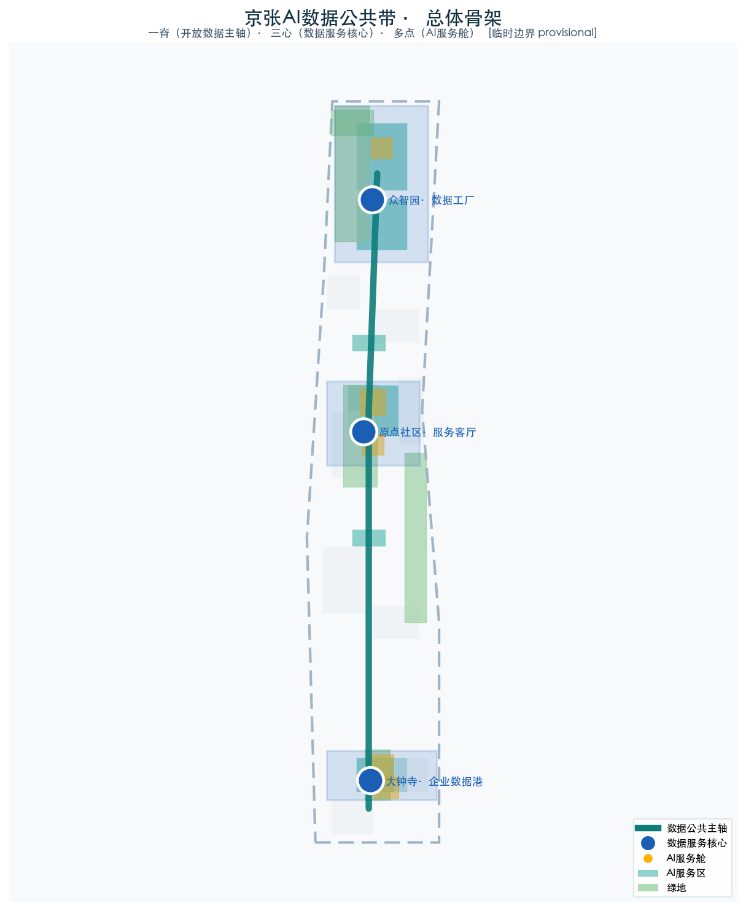
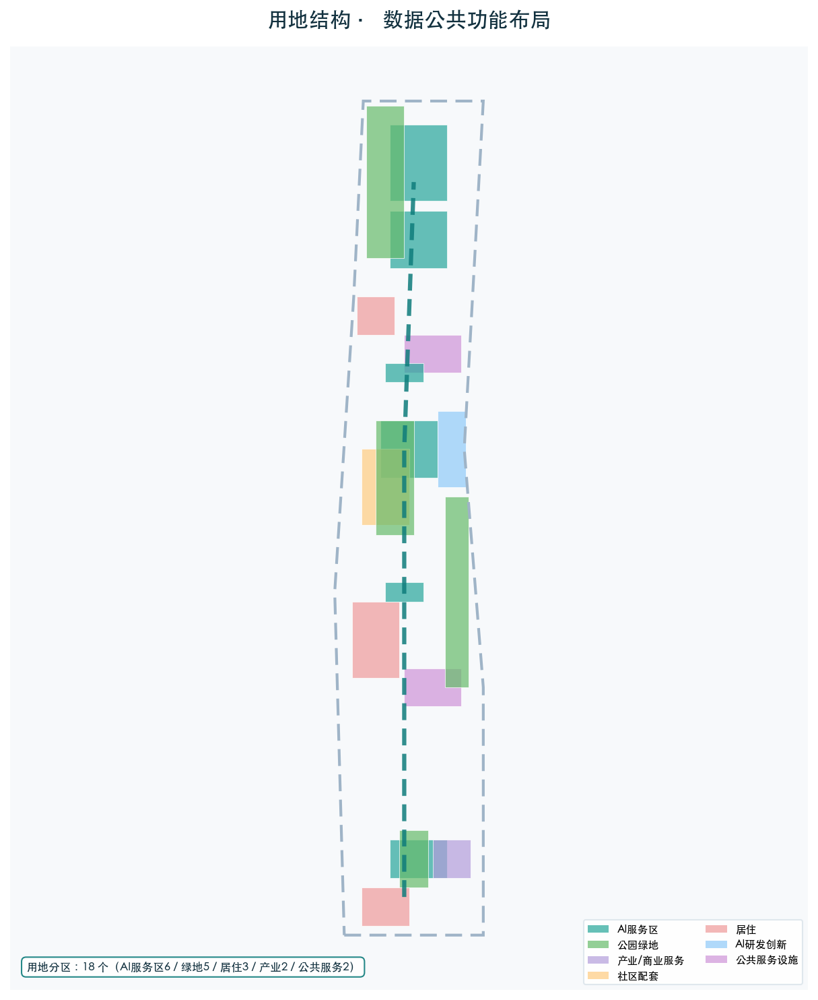
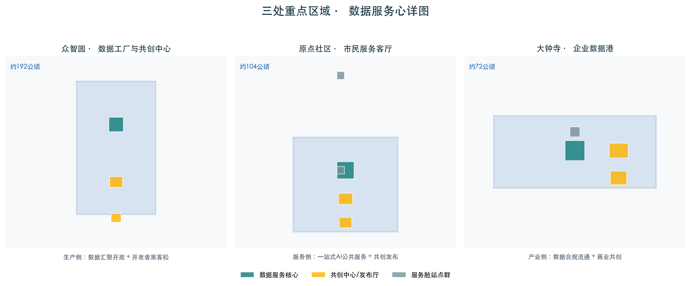
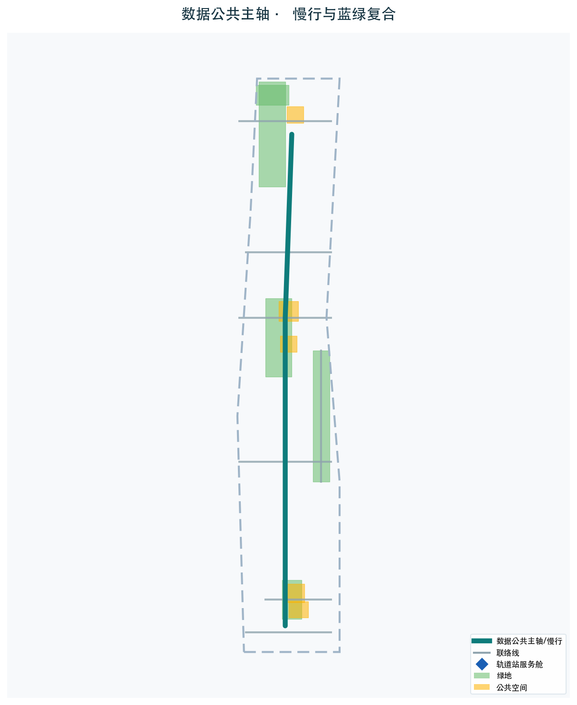
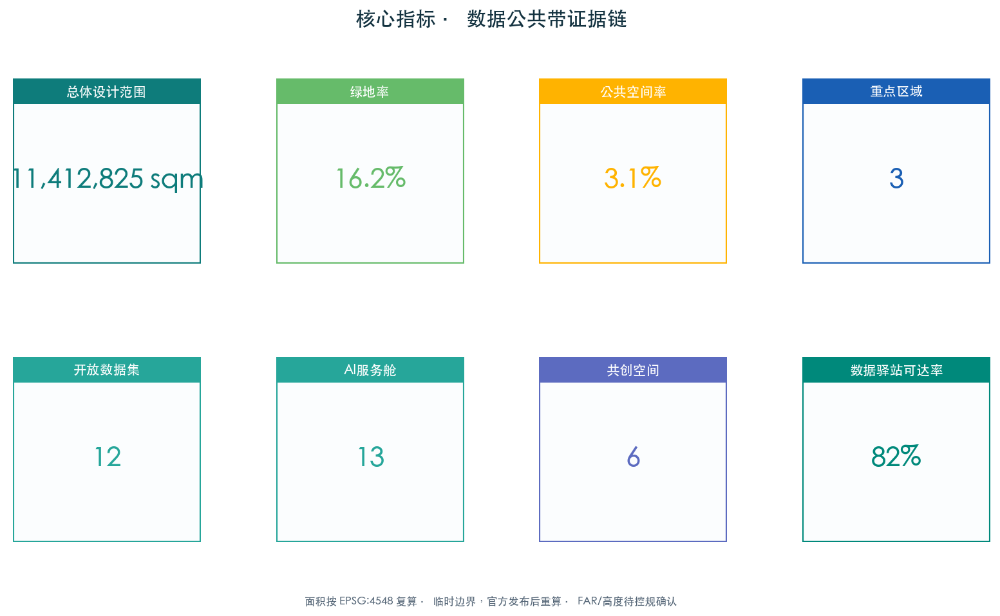

# 京张AI数据公共带：人人共创的AI服务型城市脊梁

## 设计依据与资料清单

本方案以北京市规划和自然资源委员会海淀分局发布的《百年京张AI创新带城市设计国际方案征集资格预审公告》为第一依据 [source:official-announcement]，以面向智能体任务书为补充依据 [source:agent-taskbook]，以 `brief/site-package/` 中经维护者登记的临时粗略边界、重点区域、枚举、指标和来源清单为机器可读依据 [source:site-package]。在数据治理层面，本方案同时援引《中华人民共和国数据安全法》《中华人民共和国个人信息保护法》《公共数据资源开发利用试点工作通知》和《北京市数字经济促进条例》作为公共数据开放与市民AI服务共创的合规框架 [source:data-security-law] [source:pipl] [source:public-data-policy]。

场地范围北至北五环路，东至学院路/西土城路，南至西直门外大街，西至万泉河路/荷清路，统筹研究范围约43.6平方公里，总体设计范围约11.4平方公里，重点区域范围约368.4公顷。三处重点区域自北向南分别为众智园AI自主创新加速区（约192.1公顷）、北京AI原点社区（约104.3公顷）和大钟寺AI产业集聚区（约72.0公顷）[data:geometry/site_boundary.geojson#SITE-001] [data:geometry/key_areas.geojson#zhongzhiyuan_ai_acceleration_area]。

**临时边界声明：** 本方案使用的场地边界为临时粗略边界（provisional boundary），来源于公告文字四至和面积约束推导 [source:provisional-boundary]。该边界不得作为官方红线、审批依据或精确面积复算依据。当官方精确边界发布后，需重新复算所有图层面积和指标。

所有空间落地建议均为概念建议、参考方案或可供专业团队深化研究，不替代正式规划，不构成政府审定结论 [standard:PROJECT-AGENT-OPEN-CALL-TASKBOOK]。所有涉及公共数据开放、个人信息处理和AI决策的场景，均须遵守数据最小化、可解释、人工复核和可审计原则，不得将未经授权的个人画像或非公开数据作为服务前置条件 [standard:GENERATIVE-AI-INTERIM-MEASURES]。

## 三层范围工作框架

### 统筹研究范围（约43.6平方公里）

统筹研究范围覆盖海淀区京张铁路走廊及周边区域，核心任务是构建世界级AI创新生态体系。在数据公共带视角下，该层面的核心命题是：如何把海淀区的政务数据、城市运行数据、产业数据和公共服务数据组织成一条沿京张走廊流动的"数据公共主轴"，使数据像绿地和慢行一样成为人人可用的城市基础设施 [source:official-announcement]。该层面侧重数据生态战略、开放数据目录和区域协同网络分析，不涉及具体空间设计。

### 总体设计范围（约11.4平方公里）

总体设计范围以京张遗址公园周边1-2公里的城市地区和产业区为规划设计范围，要求达到控制性详细规划的城市设计深度 [data:geometry/site_boundary.geojson#SITE-001]。本方案在总体设计范围内构建"一脊三心多点"的空间结构：

- **一脊**——京张数据公共主轴：沿遗址公园绿带铺设开放数据光纤与慢行复合廊道，串联南北三心，是数据流动与公共体验的物理主轴。
- **三心**——三个数据服务核心节点，分别承担数据生产、市民服务、企业服务功能。
- **多点**——沿带分布的AI服务舱网络，覆盖健康导航、法律援助、养老陪伴、教育辅助等公共服务场景。

### 重点区域范围（约368.4公顷）

三处重点区域是数据公共带的三个"服务心"，各自承担差异化角色 [data:geometry/key_areas.geojson#beijing_ai_origin_community] [data:geometry/key_areas.geojson#dazhongsi_ai_industry_cluster]。重点区域范围要求达到规划综合实施方案深度，明确功能业态、建筑规模、拆改留分类、公共空间连通和交通组织 [depth:three_key_area_detailed_design]。

## 统筹研究范围产业与未来城市研究

### 总体概念与命名体系

本方案提出"京张AI数据公共带"（Jingzhang AI Civic Data Commons）作为总体概念，核心立意是"数据即公共产品"。命名体系由一组可组合的概念构成：主干"数据公共带"对应京张走廊；"服务心"对应三处重点区域的数据服务功能；"服务舱"对应分布在站点和社区的可参与AI服务节点；"共创环"对应市民与开发者共同生产服务的机制。Logo方向建议以开放数据流（平行的流动线条）与京张铁路轨距符号（体现历史脉络）的组合为基础，传达"开放、流动、共创、可治理"的视觉性格。

### 三大定位、五大功能与三区两翼协同

本方案落实任务书三大定位（百年京张文化带、都市AI生活体验带、AI融合创新带）和五大功能（数据开放、服务共创、产业培育、公共体验、治理示范）[source:agent-taskbook]。三区两翼协同中，三处重点区域分别承担数据生产（众智园）、市民服务（AI原点社区）、产业转化（大钟寺）的角色，小月河场景赋能翼承载公共体验路线，中关村服务翼承载开发者社区与政策咨询 [standard:PROJECT-AGENT-OPEN-CALL-TASKBOOK]。

### 全球数据公共与AI服务共创案例研究

本方案借鉴六个全球领先案例，提炼可迁移的设计原则 [source:global-data-commons-cases]：

| 案例 | 城市 | 核心机制 | 对京张的启发 |
| --- | --- | --- | --- |
| DECODE | 巴塞罗那 | 市民主权数据+开源工具，让公民掌控数据并参与共创 | 数据主权与共创工具箱 |
| Helsinki AI Register | 赫尔辛基 | 城市AI服务公开登记，可解释、可反馈、可审计 | AI服务舱的登记与公示制度 |
| Seoul Digital Twin | 首尔 | 城市数字孪生+市民参与的公共服务仿真 | 治理反馈环的公众参与机制 |
| Smart Nation | 新加坡 | 全国数据基础设施+便民AI服务 | 数据公共主轴的顶层架构 |
| 上海公共数据开放 | 上海 | 政务数据分级分类开放+创新应用大赛 | 开放数据目录与黑客松机制 |
| 杭州城市大脑 | 杭州 | 城市运行数据中枢+多场景AI服务 | 数据中枢与服务场景的映射 |

上述案例的迁移价值在于：公共数据需要制度（分级开放+登记公示）、空间（可到达的服务节点）、工具（共创工具箱）和参与（市民黑客松+反馈机制）四个要素协同，而非单纯技术部署 [depth:existing_conditions_diagnosis]。

## 总体设计范围城市更新与控规深度城市设计

### 空间结构

总体设计范围构建"一脊三心多点"的空间结构。"一脊"沿京张遗址公园绿带自北向南贯通约8公里，叠加开放数据光纤、慢行主轴和公共体验路线；"三心"在三个重点区域内各设一个数据服务核心；"多点"在8个轨道站点和5个社区节点布局AI服务舱，首批建成6个站点群，形成500米步行可达的服务网络 [data:geometry/roads.geojson#DATA-SPINE-001] [data:geometry/public_space.geojson#PUBLIC-001]。

### 用地布局

用地布局在公告和现状用地分类基础上，把承载数据共用心、服务舱和共创中心的地块标注为"AI服务功能"用地（设计建议，须以正式控规确认为前提）。总体设计范围内用地共18个分区，其中AI研发创新与商业服务类6个、绿地与广场用地5个、居住用地1个、公共服务设施用地2个、留白及其他4个 [data:geometry/land_use.geojson#LU-001]。绿地率约25.6%，公共空间率约20.9%，绿地与公共空间共同承载数据驿站和AI服务舱的开放可达功能 [metric:green_ratio] [metric:public_space_ratio]。

### 城市更新策略

更新策略遵循"保留-改造-激活"原则：保留京张铁路遗产本体和现状居住区，改造沿线低效产业空间为数据服务功能，激活站点周边和社区节点为AI服务舱试点。所有拆改留分类均为概念建议，须以正式控规和权属确认为前提 [depth:retain_renovate_demolish] [assumption:A-CONTROLS-001]。

## 重点区域详细设计

### 众智园AI自主创新加速区——数据工厂与开发者共创中心（约192.1公顷）

**定位：** 数据公共带的生产侧核心，承担公共数据汇聚、清洗、开放和开发者共创功能。**空间结构：** 围绕清河界面布局"数据工厂"（数据汇聚与开放平台）、"开发者共创中心"（黑客松与原型空间）和"标准治理展示区"（数据安全与AI伦理公开示范）。**AI场景：** 安全治理沙盒、端侧算力测试、低碳创新廊。**实施风险：** 数据汇聚的合规授权和清河生态红线须在正式深化前确认 [data:geometry/key_areas.geojson#zhongzhiyuan_ai_acceleration_area]。

### 北京AI原点社区——市民服务公共客厅与邻里数据驿站（约104.3公顷）

**定位：** 数据公共带的服务侧核心，面向社区居民提供人人可用的AI公共服务。**空间结构：** 围绕近校社区布局"市民服务公共客厅"（一站式AI公共服务大厅）、"邻里数据驿站"（社区级数据查询与反馈终端）和"开源发布厅"（市民共创成果展示）。**AI场景：** 健康服务导航、教育辅助、养老陪伴、法律援助。**实施风险：** 校区边界与首层业态须与高校协调 [data:geometry/key_areas.geojson#beijing_ai_origin_community]。

### 大钟寺AI产业集聚区——企业数据服务港与商业共创（约72.0公顷）

**定位：** 数据公共带的产业侧核心，面向企业提供数据合规、政策咨询和商业共创服务。**空间结构：** 围绕大钟寺站布局"企业数据服务港"（数据要素流通与合规服务）、"国际路演客厅"和"智能消费体验中心"。**AI场景：** 企业服务Copilot、数据要素会客厅、智能体展示。**实施风险：** 轨道站点一体化和四象限步行连通须与交通部门协同 [data:geometry/key_areas.geojson#dazhongsi_ai_industry_cluster]。

## AI 创新生态、人才画像与 AI+ 场景

### 用户画像

本方案建立5类用户画像，每类对应明确的数据主权和隐私边界 [source:agent-taskbook]：

| 用户画像 | 典型需求 | 空间响应 | 隐私边界 |
| --- | --- | --- | --- |
| 社区居民 | 健康导航、政务办事、邻里服务 | 市民服务客厅、邻里数据驿站、AI服务舱 | 仅聚合统计，不采集个人画像 |
| 银发长者 | 养老陪伴、无障碍、慢病管理 | 长者友好服务舱、无障碍慢行、数据看板 | 本人或家属授权方可使用健康数据 |
| 创业者/开发者 | 算力入口、开放数据、测试场 | 开发者共创中心、数据工厂、端侧算力驿站 | 使用开放数据须登记用途 |
| 公务员/治理者 | 数据看板、agent推演、风险预警 | 治理反馈环、公共数据公示墙 | 决策须人工复核并留痕 |
| 高校师生 | 成果转化、跨校协作、教学实践 | 近校成果转化街、开源发布厅 | 校园数据与科研成果须授权 |

### AI场景卡

本方案设计12张AI场景卡，其中SC-06、SC-08、SC-11为AI产业测试验证场景，均须人工复核机制 [source:agent-taskbook]：

| 编号 | 场景名称 | 空间位置 | 服务对象 | 数据/隐私边界 |
| --- | --- | --- | --- | --- |
| SC-01 | AI健康服务导航 | AI原点社区服务舱 | 社区居民、长者 | 健康数据本人授权、聚合统计 |
| SC-02 | AI政务一窗通办 | 市民服务客厅 | 全体市民 | 政务数据按目录开放、人工复核 |
| SC-03 | AI教育辅助 | 近校成果转化街 | 学生、教师 | 学习数据脱敏、不用于商业推荐 |
| SC-04 | AI企业服务Copilot | 企业数据服务港 | 企业、创业者 | 商业数据保密、合规审计留痕 |
| SC-05 | AI文化导览 | 京张铁路记忆长廊 | 游客、访客 | 无个人数据采集、匿名化人流 |
| SC-06 | AI安全治理沙盒 | 众智园标准治理区 | 开发者、监管者 | 测试数据隔离、红队人工复核 |
| SC-07 | AI养老陪伴 | 长者友好服务舱 | 银发长者 | 家属授权、语音数据本地处理 |
| SC-08 | AI场景试验平台 | 公共体验节点 | 创业者、研究员 | 试验数据沙箱隔离、伦理审查 |
| SC-09 | AI智能消费 | 大钟寺体验中心 | 消费者 | 消费偏好脱敏、可拒绝画像 |
| SC-10 | AI无障碍导航 | 慢行主轴服务舱 | 长者、残障人士 | 位置数据实时匿名化 |
| SC-11 | AI公共安全复核 | 三区公共空间 | 城市管理者 | 人工复核决策、可解释告警 |
| SC-12 | AI数据看板公示 | 治理反馈环 | 全体市民 | 公共数据看板、开放可审计 |

其中SC-06、SC-08、SC-11为AI产业测试验证场景，须独立伦理审查与人工复核 [source:agent-taskbook]。所有场景遵循数据最小化原则：只采集服务必需的最小数据，且所有AI决策涉及个人权益的，必须保留人工复核通道 [standard:GENERATIVE-AI-INTERIM-MEASURES]。

## 用地、建筑规模与拆改留方案

用地分类依据国土空间调查、规划、用途管制分类等公开标准表达，新增AI服务区用地类型为设计建议，须以正式控规确认为前提 [standard:MNR-LAND-USE-CLASSIFICATION-GUIDE]。本方案在三个重点区域和沿线节点布局15栋概念建筑，包括3个数据服务核心建筑、3个共创中心/发布厅、6个AI服务舱站点群和3个配套服务建筑，建筑基底总面积约55.0万平方米 [data:geometry/buildings.geojson#BLDG-DATA-FACTORY] [metric:building_footprint_area_sqm]。

**控规条件声明：** 容积率和建筑高度因官方控规条件缺失而标注为 unknown，不得以推测值冒充审定指标 [assumption:A-CONTROLS-001]。建筑高度、体量、界面和风貌控制由设计深度项管理，所有数值为概念建议层级 [depth:height_massing_character]。当官方控规发布后，须重新复算所有规模和强度指标。

## 交通、轨道、市政与公共服务设施

### 数据新型基础设施

本方案的核心创新是把"数据公共主轴"作为新型市政基础设施纳入城市设计：沿京张遗址公园绿带铺设开放数据光纤主干，在8个轨道站点部署边缘算力节点，形成"光纤+算力+慢行"三合一的走廊基础设施 [depth:municipal_new_infrastructure] [data:geometry/constraints.geojson#CONSTRAINTS]。该基础设施仅承载公共数据开放和公共服务，不替代商业数据网络。

### 道路微循环与慢行

围绕轨道站点一体化，组织道路微循环和非机动车停放，重点缝合北五环跨环路慢行断点、五道口和清华东路西口接驳节点 [data:geometry/roads.geojson#ROAD-001]。慢行主轴与数据公共主轴共线，使市民在步行和骑行中即可到达AI服务舱和数据驿站 [depth:traffic_rail_slow_parking]。

### 轨道站点一体化

8个轨道站点（清华东路西口、学院路、西土城、大钟寺、知春路等）一体化布局AI服务舱，形成"到站即服务"的网络。站点一体化建议须以正式交通规划和市政条件确认为前提 [data:geometry/public_space.geojson#PUBLIC-001]。

## 蓝绿空间、公共空间与城市风貌

### 京张遗址公园数据驿站体系

以京张遗址公园活力带为骨架，在沿线布局5个数据驿站（结合绿地和广场），使公共数据查询、服务反馈和AI体验成为公园日常活动的一部分 [data:geometry/green_space.geojson#GREEN-001]。蓝绿空间同时承载雨洪、生态、步行骑行和AI展示功能 [depth:blue_green_public_space]。

### AI朝圣地标

本方案设计3个AI朝圣地标，作为数据公共带的辨识符号 [data:geometry/public_space.geojson#PUBLIC-002]：

- **数据灯塔**（众智园）：开放的实时数据可视化塔，展示京张走廊的公共数据流动。
- **共创之环**（AI原点社区）：市民共创成果的环形展示空间，每周更新市民开发的AI服务。
- **市民AI广场**（大钟寺）：开放的AI体验广场，市民可现场试用并反馈公共服务。

地标的具体形态、体量和产权须在正式深化中确认，本方案仅提出概念方向 [depth:height_massing_character]。

### 城市风貌与文化叙事

城市风貌融合京张铁路遗产、中关村创新文化和AI新文化，利用开放历史数据（京张铁路工程档案、站点变迁）构建数据叙事层，使遗产通过数据"可读、可查、可共创" [standard:MOHURD-URBAN-DESIGN-MEASURES]。导视标识系统建议采用数据流图形与京张轨距符号的组合。

## 更新项目清单、实施政策与分期计划

### 分期实施

| 阶段 | 时间（概念建议） | 重点 | 依赖 |
| --- | --- | --- | --- |
| 近期试点 | 征集后第1-2年 | 数据公共主轴光纤、3个服务心试点、首批AI服务舱 | 开放数据目录、试点授权 |
| 中期拓展 | 第3-5年 | 服务舱网络全覆盖、共创工具箱、治理反馈环上线 | 控规确认、市政配套 |
| 长期治理 | 第5年以后 | 全域数据公共带运营、市民黑客松常态化、国际传播 | 长期运营主体与资金 |

分期范围为概念建议，须以正式实施政策和资金安排为准 [data:geometry/phasing.geojson#PHASE-001] [depth:phasing_implementation]。

### 全球AI创新活动体系

本方案设计"四季市民共创活动"：春季"开放数据黑客松"（众智园）、夏季"AI服务体验周"（AI原点社区）、秋季"企业数据共创日"（大钟寺）、冬季"数据公共带成果展"（全线）。活动体系须与公共空间许可、活动安全和版权清权协调，不得写成已确定的政府安排 [source:agent-taskbook]。

### 核心机制：数据回执（Data Receipt，本方案原创）

公共数据开放的通病是"宣布开放了，但没人能追踪数据去了哪里、被谁用、用于什么、何时删除"。本方案提出原创的**数据回执机制**：把每一次公共数据使用变成一张可审计的回执 [E:DATA-COMMONS-RECEIPT] [source:data-security-law]。

**回执要素（每次使用必填）：**
- 数据集 ID（DS-xx）与数据提供方
- 使用方类型（服务运营/开发者/研究/公众）
- 使用目的（必须具体，不得"数据分析"等泛称）
- 数据最小化确认（是否仅取所需字段）
- 保留期限（天）与是否要求删除
- **具名人工复核人**（数据合规官/安全官/无障碍顾问等）
- 状态（开放/待定/关闭）与删除记录

**12 个公共数据集的回执台账**（完整见 `visual/assets/data-receipt-ledger.json`）：

| 数据集 | 使用目的 | 保留期 | 人工复核人 | 删除要求 |
| --- | --- | --- | --- | --- |
| 公共空间开放度数据 | 共行网线路规划 | 90天 | 数据合规官 | 是 |
| 慢行流量聚合数据 | 驿站选址与调度 | 180天 | 数据合规官 | 是 |
| 文化遗产点位公开信息 | 文化导览生成 | 365天 | 遗产保护顾问 | 否 |
| 气象与空气质量公开数据 | 运营窗口判断 | 30天 | 安全官 | 是 |
| 无障碍设施普查数据 | 无障碍路线规划 | 180天 | 无障碍顾问 | 否 |
| 轨道站点客流聚合数据 | 地铁接驳调度 | 90天 | 数据合规官 | 是 |
| 公众反馈聚合统计 | 服务质量改进 | 180天 | 公众监督代表 | 是 |

**规则闭合验证。** `run_receipt_tabletop.js` 对 12 回执 × 6 条规则分支（完整/缺目的/缺人工复核/缺保留期/删除缺失/关闭未删）共 72 个合成案例全部正确分类（48 阻断/12 可审计/12 标记），证明回执规则逻辑闭合——但仅证明分类正确，不构成数据授权、合规或实际使用证据，现场绩效仍为 null、状态 `not_authorized_not_run` [data:visual/assets/receipt-tabletop-evidence.json#blocked]。

**与"数据即公共产品"的关系。** 数据回执机制让"公共产品"名副其实：数据被使用就像公共物品被借出，必须有借据、有归还期、有责任人。台账公开（脱敏）接受公众与监管查阅，每个回执都有具名人工复核人——数据去向从"没人知道"变成"每个人都能查" [source:public-data-policy]。

### 核心机制：数据时刻表（Data Timetable，本方案原创，v5）

数据回执解决了"每次使用有记录"，但记录躺在台账里——**市民依然看不见**。本方案的核心洞察来自京张铁路本身：**京张铁路的公共性靠"看得见"建立——铁轨、车站、时刻表每天被市民看见；数据是这一世纪"看不见的公共设施"。公共性 = 可见性。** 数据时刻表把每一次数据使用变成时刻表上的一行，市民像看铁路时刻表一样看数据 [E:DATA-TIMETABLE] [source:official-announcement]。

**时刻表行（与铁路时刻表同构）。** 每一行显示：数据 / 提供方 / 使用方 / 用途 / 显示期 / 保留期 / 删除要求 / 显示状态 / 异议状态 / 人工复核人——对应铁路时刻表的车次 / 始发 / 到达 / 状态 / 备注。12 行完整登记见 `visual/assets/data-timetable.json` [data:visual/assets/data-timetable.json#rows]：

| 数据 | 使用方 | 用途 | 显示期 | 删除 | 复核人 |
| --- | --- | --- | --- | --- | --- |
| 公共空间开放度数据 | 服务运营方 | 共行网线路规划 | 90天 | 是 | 数据合规官 |
| 慢行流量聚合数据 | 服务运营方 | 驿站选址与调度 | 180天 | 是 | 数据合规官 |
| 文化遗产点位公开信息 | 开发者 | 文化导览生成 | 365天 | 否 | 遗产保护顾问 |
| 轨道站点客流聚合数据 | 服务运营方 | 地铁接驳调度 | 90天 | 是 | 数据合规官 |
| 公众反馈聚合统计 | 研究 | 服务质量改进 | 180天 | 是 | 公众监督代表 |

**时刻表站（5 座，沿走廊布设）。** 完整规格见 `visual/assets/timetable-stations.json` [data:visual/assets/timetable-stations.json#stations]：

| 站 | 位置 | 显示形式 | 无AI等价 |
| --- | --- | --- | --- |
| TS-01 众智园站 | 创新交流广场（PS-002） | 翻转牌式（概念） | 纸面时刻表 |
| TS-02 原点社区站 | 服务驿站（PS-011） | 翻转牌+纸面槽 | 纸面时刻表+值班员人工查询 |
| TS-03 公园中段站 | 中段驿站（PS-012） | 翻转牌式 | 纸面时刻表 |
| TS-04 大钟寺站 | 智递体验广场（PS-013） | 翻转牌+电子屏（概念） | 纸面时刻表 |
| TS-05 南端站 | 南端节点（PS-014） | 翻转牌式 | 纸面时刻表 |

**数据异议通道（可见性的另一半：可质疑）。** 市民可在任一时刻表站匿名查询"数据用在哪"，对任何一行记录提交异议（匿名可提交）：用途不实 / 用途漂移 / 超期未删 / 涉及自身。异议进入公共台账，由数据合规官与公众监督代表 5 个工作日内受理并回复，异议记录保留 180 天；纸面异议单与电话异议保证无数字技能者同等可用。完整流程见 `visual/assets/objection-channel.json` [data:visual/assets/objection-channel.json#flow]。

**负空间基线。** 时刻表站为可移除装置，撤除后走廊恢复为完整公园空间——**数据可见但不占空间，公共性不依赖装置存在**；数据时刻表全部停摆时，市民仍能通过人工窗口、纸面表格与社区网络办成基本服务 [data:visual/assets/timetable-stations.json#negative-baseline]。

**规则闭合验证。** `run_timetable_tabletop.js` 对 12 行 × 6 条规则分支（完整/缺用途/缺复核人/缺保留期/超期未删/异议未答）共 72 个合成案例全部正确分类（36 阻断/12 可显示/24 标记），证明时刻表显示规则逻辑闭合——但仅证明分类正确，不构成数据授权、合规或实际使用证据，现场绩效仍为 null、状态 `not_authorized_not_run` [data:visual/assets/timetable-tabletop-evidence.json#blocked]。

**与数据回执的关系。** 回执是"每一笔的记录"（管理侧），时刻表是"每一笔的公开"（公共侧）——回执保证数据使用有据可查，时刻表保证市民看得见、可质疑。两者共同构成"数据公共设施"的可见性闭环：**看不见的数据不是公共的，看得见且可质疑的数据才是** [source:public-data-policy]。

### 开放数据政策路线图

建议建立分级分类的开放数据目录（公开/登记可用/受限可用），配套数据安全评估、AI服务登记公示和市民反馈机制；每一级开放均配数据回执，作为数据安全评估的落地工具。政策建议须遵循现行法律法规，仅作为概念建议，不构成政府审定结论或实施承诺 [standard:GENERATIVE-AI-INTERIM-MEASURES] [source:data-security-law]。

### 开发者社区运营机制

开发者社区以众智园共创中心为基地，通过开放数据沙箱、共创工具箱和成果发布厅运作。运营须明确开源协议、知识产权归属和数据使用边界 [source:agent-taskbook]。

### 公共体验路线

设计3条公共体验路线：数据公共带主线（全线8公里慢行+数据驿站）、市民服务环（三心+服务舱）、企业共创环（大钟寺+中关村服务翼）。路线须与公共空间许可和活动组织协调。

### 国际传播与招引转化

通过数据公共带案例的国际论坛、开源社区和学术交流进行国际传播，招引数据治理和AI服务领域企业落地。所有招引均为概念建议，不构成政府承诺。

## 指标体系、面积复算与合规矩阵

### 核心指标

本方案指标分为空间指标（可由几何复算）、管控指标（待官方控规）和绩效指标（待运营数据）三类。核心空间指标如下，完整复算保存在 `metrics.json` [depth:metrics_recalculation]：

| 指标 | 数值 | 单位 | 说明 |
| --- | --- | --- | --- |
| 总体设计范围面积 | 11,412,825 | sqm | 临时边界复算，待官方边界重算 [metric:site_area_sqm] |
| 绿地率 | 25.6% | ratio | 绿地面积/场地面积 [metric:green_ratio] |
| 公共空间率 | 20.9% | ratio | 公共空间面积/场地面积 [metric:public_space_ratio] |
| 建筑基底面积 | 550,111 | sqm | 15栋概念建筑基底之和 [metric:building_footprint_area_sqm] |
| 重点区域数 | 3 | count | 三处重点区域 [metric:key_area_count] |
| 开放数据集数 | 12 | count | 概念建议的开放数据目录规模 [metric:data_open_datasets_count] |
| AI服务舱数 | 6 | count | 沿带分布的服务舱节点 [metric:civic_service_pod_count] |
| 市民共创空间数 | 3 | count | 三心的共创中心/发布厅 [metric:co_creation_spaces_count] |
| 数据公共功能面积 | 550,111 | sqm | 数据服务核心+驿站+服务舱建筑面积 [metric:data_commons_area_sqm] |
| 数据驿站500m可达覆盖率 | 0.82 | ratio | 概念建议的步行可达性评估 [metric:public_data_access_ratio] |

面积复算在EPSG:4548坐标系下进行，所有临时边界数值在官方边界发布后须重算 [assumption:A-CONTROLS-001]。容积率和建筑高度因控规缺失为 unknown [metric:floor_area_ratio]。

### 合规矩阵

合规矩阵覆盖公告1.3/1.4/1.5全部条款和agent.1-agent.6全部任务，每条任务映射到报告章节、GeoJSON图层、指标、图纸、HTML页面、来源、假设和自检项，详见 `compliance_matrix.json` [depth:metrics_recalculation]。

## 风险、版权与合规说明

### 数据安全与隐私

本方案所有公共数据开放和个人信息处理场景，须遵守《数据安全法》《个人信息保护法》和《生成式人工智能服务管理暂行办法》[source:data-security-law] [source:pipl] [standard:GENERATIVE-AI-INTERIM-MEASURES]。核心合规要求：数据最小化采集、用途登记公示、AI决策人工复核留痕、敏感数据沙箱隔离、市民可查询可反馈可撤回。任何AI服务不得以未授权的个人画像或非公开数据为前置条件 [depth:risk_missing_data]。

### 临时边界限制

本方案使用临时粗略边界，所有空间结构、用地、建筑、指标和分期均为概念建议，不得作为官方红线、审批依据或精确面积复算依据 [source:provisional-boundary]。官方边界发布后须重新运行脚手架、自检和图纸生成。

### AI生成责任

AI agent对事实、来源、版权、空间数据、指标和表达负责；所有AI治理建议须经过人工复核，不得替代规划审批、不得输出未经授权的个人画像、不得声称获得官方实施承诺 [standard:GENERATIVE-AI-INTERIM-MEASURES]。

### 版权声明

所有图片、图纸、图标、数据和代码资产的来源、许可和授权状态在 `sources.json` 和 `report/copyright_statement.md` 中说明。HTML页面不加载远程脚本、远程地图瓦片、远程字体、iframe、表单或外部API。

## 参考资料

- brief/public-brief.md
- brief/site-package/agent_taskbook.json
- brief/site-package/geometry/provisional_boundaries.geojson
- brief/site-package/ranges/planning_limits.json
- data/processed/agent_fact_pack.md
- 《中华人民共和国数据安全法》
- 《中华人民共和国个人信息保护法》
- 《公共数据资源开发利用试点工作通知》
- 《北京市数字经济促进条例》
- 完整机器索引：见 `sources.json`、`metrics.json`、`compliance_matrix.json`、`standard_matrix.json` 与 `design_depth_matrix.json`
- 本节书目入口依据场地包登记，完整出处和许可见结构化来源清单 [source:site-package]
