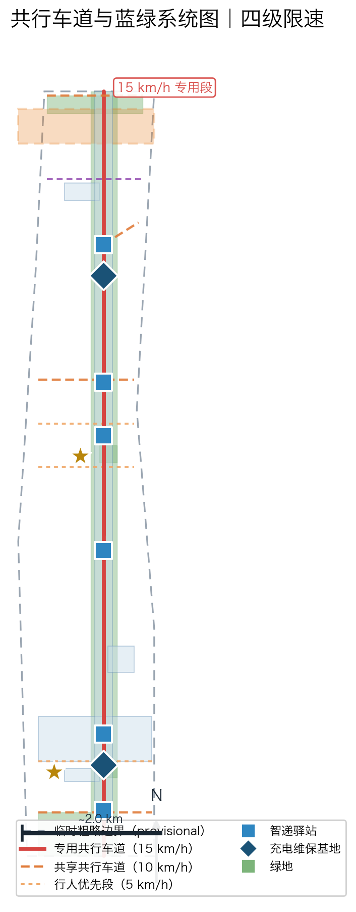

# 京张AI低速机器人共行网：人机共行的智能城市新脊梁

本方案的公众承诺只有三句：**送得到、停得下、退得干**。送得到，指末端配送对社区、园区、高校与老年/残障居民的可及；停得下，指机器人在共行车道、驿站与广场上有规则可依的停靠与让行；退得干，指任何失效、极端天气或公共争议下，网络可一键降级、收缩乃至停运，不留下无人负责的机器。

三句承诺分别对应方案的三个落点：送得到由 12 张场景卡与无 App 通道保证；停得下由专用/共享/行人优先三种断面与四级限速保证；退得干由共行执照 BLACKOUT 阶段与可迁移、可逆的空间设施保证。承诺之外的一切——单量、冲突率、盈利——在未现场核验前一律不声称。

**不声称声明。** 本方案未开展任何现场踏勘、入户访谈、配送 OD 调查或人流计数；所有内容均为基于公开公告、任务书与开放数据的概念设计建议，不构成政府审定结论、实施承诺或对任何供应商的指定 [source:official-announcement]。指标中标 `unknown` 者为方向性占位，待官方数据与专业团队深化后补全。

## 设计依据与资料清单

本方案以北京市规划和自然资源委员会海淀分局发布的《百年京张AI创新带城市设计国际方案征集资格预审公告》为第一权威依据 [source:official-announcement]，以面向智能体的任务书摘录为补充依据 [source:agent-taskbook]，以 `brief/site-package/` 中维护者登记的临时粗略边界、重点区域、枚举、指标与来源清单为机器可读依据 [source:site-package-registry]。方案聚焦 `robotics-autonomous-mobility` 与 `ai-origin-community` 两条赛道，对应 `robot-delivery-low-speed` 与 `ai-traffic-walkability` 两个场景，把京张铁路遗址公园沿线重新定义为一条"人机共行"的低速机器人服务脊梁。v2 在此之上引入"**共行执照（Co-Mobility License）**"协议概念 [E:ROBOT-V2-LICENSE-PROTOCOL]，把分散的车道、驿站、限速与运营机制收敛为一份可签约、可验收、可退出的运营骨架。

所有设计判断拆分为可追溯来源、可复算指标、可校验图层和可人工复核假设。机器人共行设施（车道、驿站、充电维保基地）全部落入九个 GeoJSON 图层，核心指标以 EPSG:4548 复算并与 `scripts/spatial_review.py` 的 union 规则一致 [depth:existing_conditions_diagnosis] [depth:metrics_recalculation]。

**四层来源用途表。** 本方案对每一条资料严格区分"可用于"与"不可用于"，避免把启发当承诺、把试点当批复：

| 来源层级 | 代表条目 | 可用于 | 不可用于 |
| --- | --- | --- | --- |
| 法定批复 | 征集公告、任务书、官方控规 | 确定范围、赛道、必选任务与评审口径 | 推断实施承诺或资金到位 |
| 官方已建在建 | 高级别自动驾驶示范区、试点配送车 | 机制转译、政策路径对标 | 声称京张沿线已纳入试点 |
| 草案倡议与国际案例 | Starship、Serve、地方慢行倡议 | 概念启发、机制参考、风险识别 | 证明京张必然可行或单量可复制 |
| 开放数据与 Agent 推导 | GeoJSON、复算指标、场景卡 | 空间结构与可复算指标的内部自洽 | 替代官方审定或实测运营数据 |

**临时边界与概念建议属性。** 本包使用 `geometry_role="provisional_constraint"`、`official_boundary=false` 的临时粗略边界生成 [data:geometry/site_boundary.geojson#SITE-001]；该组织方数据缺口不阻断内容评分，官方多边形发布后须全量重算。所有车道、限速、驿站选址、分期与运营机制均表述为"概念建议/参考方案/可供专业团队深化研究"，不构成实施承诺。共行执照协议的机器可读模式见 `visual/assets/co-mobility-license.schema.json`，沙盘推演脚本见 `visual/assets/run_license_tabletop.js`，二者仅证明协议内部逻辑自洽，不证明已被任何主体签约或获授权运行。

### 现状诊断与问题基线

机器人共行网不是凭空的技术想象，而是对三个可验证现实问题的空间回应 [depth:existing_conditions_diagnosis]：

1. **末端配送成本高企。** 公开行业数据显示，城市末端配送"最后一公里"成本占全程物流成本比例长期在 30%–50% 区间，人工骑手模式在人口老龄化与用工成本上升下面临持续压力 [source:jd-smart-delivery-vehicle]。京张沿线高校、园区与社区订单密度高、路线规整，具备低速机器人规模化试点的天然条件。
2. **末端交通冲突频发。** 外卖骑手逆行、占道与步行者争道的冲突是全国性城市治理痛点，也是本方案"人机共行"设计的核心靶点。共行网以专用道分离机器人与人流，以限速分级与冲突测试场把安全设计前置。
3. **老年与行动不便人群取件难。** 大件、重件、药品配送对老年与残障居民的"最后 100 米"尤为困难，无障碍代取与语音取件是本方案公共利益设计的起点 [source:barrier-free-environment-law]。

三个问题分别锚定三句承诺：成本高企对应"送得到"的效率命题，交通冲突对应"停得下"的安全命题，取件难对应"送得到"的公平命题；而三者的共同前提是网络必须"退得干"——任何试点若不能安全退出，就不应被放行。

**数据缺口如实声明。** 官方配送 OD 量、慢行人流基线、建筑与权属清单未公开，本方案对应指标保持 `status=unknown` 或标为方向性估计，缺口清单见 `assumptions.json` 与风险章节。

**可审计方法论。** 全部设计判断遵循四步可审计链：来源登记（`sources.json`）→ 用途限定（四层来源表）→ 空间落点（GeoJSON 图层）→ 指标复算（EPSG:4548 union）。任一判断若无法回溯到这四步，即不写入正式结论；共行执照的每一条合同条款亦按此链登记，使"送得到、停得下、退得干"的承诺可被逐条核验而非停留在口号 [depth:metrics_recalculation]。

## 三层范围工作框架

方案按公告确定的三层范围组织机器人共行网的三个设计层级：**统筹研究范围**（43.6 平方公里临时范围）回答"机器人产业生态与区域协同"；**总体设计范围**（约 11.4 平方公里临时边界）回答"共行网络空间结构与设施布局"；**重点区域范围**（368.4 公顷临时汇总）回答"三片区机器人场景的详细设计" [standard:PROJECT-OFFICIAL-ANNOUNCEMENT] [source:agent-taskbook]。

| 层级 | 设计问题 | 方案回答 | 数据落点 | 核验前不得声称 |
| --- | --- | --- | --- | --- |
| 统筹研究范围 | 机器人产业生态与京津冀协同如何组织 | 海淀研发策源—亦庄政策示范—顺义运营基地"三角协同"，七要素生态图谱支撑 | compliance_matrix.json、standard_matrix.json | 不得声称三角协同已签约或资金已到位 |
| 总体设计范围 | 共行网络如何落图 | "一廊四支、六驿两基"空间结构，11 条共行道路、23 栋机器人相关建筑全部落图 | [data:geometry/roads.geojson#RD-001]、[data:geometry/buildings.geojson#BLD-016] | 不得声称车道已获路权或建筑已落地 |
| 重点区域范围 | 三片区如何达到详细设计深度 | 众智园=全栈研发测试场，原点社区=示范运营区，大钟寺=智能终端消费体验 | [data:geometry/key_areas.geojson#zhongzhiyuan_ai_acceleration_area]、[metric:key_area_count] | 不得声称片区控规已调整或主体已入驻 |

**任务书交叉对照表。** 公告 1.3/1.4/1.5 与 agent.1–agent.6 的必选要求逐条对应到方案回答、空间锚点与证据文件，确保"要求—回答—证据"闭环 [depth:three_level_scope_framework]：

| 公告要求 | 方案回答 | 空间锚点 | 证据文件 |
| --- | --- | --- | --- |
| 1.3 统筹研究范围 | 三角协同 + 七要素生态图谱 | 全设计边界 | compliance_matrix.json |
| 1.4 总体设计范围 | 一廊四支、六驿两基 | roads.geojson、land_use.geojson | metrics.json |
| 1.5 重点区域范围 | 三片区概念深化 | key_areas.geojson | design_depth_matrix.json |
| agent.1 产业与未来城市 | 生态图谱 + 朝圣地标 | land_use.geojson#LU-001 | agent_fact_pack.md |
| agent.2 七要素落地 | 土地/产业/资金/人才/算力/数据/场景 | buildings.geojson | compliance_matrix.json |
| agent.3 总体结构与控规 | 空间结构 + 用地分区 | land_use.geojson、roads.geojson | design_depth_matrix.json |
| agent.4 三片区详细设计 | 众智园/原点/大钟寺 | key_areas.geojson | design_depth_matrix.json |
| agent.5 指标与面积复算 | EPSG:4548 union 复算 | metrics.json | metrics.json |
| agent.6 长期运营 | 四季活动 + 开发者社区 | public_space.geojson | compliance_matrix.json |

三层工作不是割裂的图纸集合：统筹研究决定机器人产业与政策判断，总体设计把判断落实为车道、驿站与分期图层，重点区域详细设计验证具体地块上的人机共行安全与运营可行性。任何无法从结构化数据复算的面积、比例、规模或数量，均不写入正式结论 [depth:overall_spatial_structure]。

**共行执照在三层中的贯穿。** 共行执照协议同时映射到三层范围：统筹层回答"谁可签、签什么"（运营主体与资金机制）；总体设计层回答"在哪里运营、限速几何"（车道与断面）；重点区域层回答"具体地块上如何验收"（G 门证据）。三层任一层缺证据，对应执照阶段即不得声称已通过，避免结构与运营脱节 [depth:three_level_scope_framework]。

## 统筹研究范围产业与未来城市研究

统筹研究范围的核心任务是构建世界级 AI 创新生态，机器人共行网是这一生态的"可感知、可体验"环节。北京已具备全国最完整的低速自动驾驶政策与产业基础 [standard:PROJECT-AGENT-OPEN-CALL-TASKBOOK]。本节对全球与本地案例只做"机制转译"，不做"成功背书"：

| 案例 | 只转译的机制 | 京张对应动作 | 明确不证明 |
| --- | --- | --- | --- |
| 北京高级别自动驾驶示范区 [source:beijing-advanced-ad-zone] | 路权与政策试验场机制 | 争取共行带纳入路权试点清单 | 不证明京张沿线已纳入示范区 |
| 美团自动配送车 [source:meituan-auto-delivery-car] | 公开道路生鲜/药品配送流程 | 驿站—社区配送链路设计 | 不证明美团将落地京张 |
| 新石器低速无人车 [source:neolix-low-speed-av] | 长期常态化运营的节奏 | 共行车道常态化运行编排 | 不证明亦庄单量可平移 |
| 京东智能快递车 [source:jd-smart-delivery-vehicle] | 末端常态化配送的成本结构 | 智递驿站末端接驳 | 不证明京东将入驻 |
| Starship Technologies [source:starship-technologies] | 大学城规模化百万单路径 | 校园配送场景卡 RB-03 | 不证明京张可达同等单量 |
| Serve Robotics [source:serve-robotics-la] | 人行道级配送的避让策略 | 行人优先段配送 RB-06 | 不证明京张冲突率与之相同 |
| 海淀中关村科学城（创新生态母体）[source:official-announcement] | 研发策源与场景开放生态 | 共行带作为可体验出口 | 不证明本方案为官方采纳方案 |

七类证据共同表明：低速机器人配送已从实验室走向街道，缺少的不是技术，而是与人共行的**城市空间设计**与**可签约的运营骨架**——这正是共行执照协议的主攻方向。

**七要素生态图谱。** 机器人共行网把"土地、产业、资金、人才、算力、数据、场景"七要素落到同一张空间图上：土地=18 个用地分区（含机器人测试防护绿地与战略留白区）；产业=整机研发—算法算力—终端应用链条；资金=以公共空间运营与商业合作为主的多元来源概念建议；人才=机器人工程师公寓与开发者社区；算力=云端调度与算力中心（BLD-003）；数据=调度轨迹与订单数据的合规治理；场景=12 张场景卡。七要素逐条映射见 `compliance_matrix.json` agent.2 条目。

**区域协同。** 方案与北纬社区、未来科学城、怀柔科学城、经开区（亦庄）及京津冀形成创新协同回路：亦庄承担政策试验与规模运营，顺义承担物流基地，海淀承担研发策源与场景开放；未来科学城与怀柔科学城的机器人感知与芯片技术可通过共行网场景反向验证。协同关系全部表述为概念建议 [source:agent-taskbook]。

**协同的边界与不声称。** 三角协同是概念性的研发—政策—运营分工，不构成行政划界或机构间协议；本方案不声称亦庄、顺义或未来科学城已承诺参与京张共行网，亦不声称京津冀协同机制已为此立项。协同落地须待各方正式协商，本方案仅提供空间与机制原型 [source:agent-taskbook]。

**未来城市形态。** 方案提出"人机共行街区"范式：机器人不是街头的异类，而是与行人、骑行者共享一套可预期的空间规则——专用道、驿站、充电桩与信号优先构成"机器人可达的街道家具系统"，为全球 AI 城市提供可复制断面原型。

**创新生态的公共性底线。** 与"最大化机器人运营效率"的技术叙事不同，本方案明确把生态建设的成功标准锚定在公共性上：研发测试的产出须沉淀为开源共行规则库与仿真数据集（BEQUEST 阶段），而非封闭专利；示范运营的产出须公开公平账本与事故台账，而非内部 KPI。生态规模若以牺牲最弱群体的可达与安全为代价，则不视为成功 [source:barrier-free-environment-law]。

## 总体设计范围城市更新与控规深度城市设计

**总体概念：京张智行网（Jingzhang Smart Mobility Network）。** 命名体系：主名称「京张AI低速机器人共行带」，简称「京张智行网」，英文 "Jingzhang AI Low-Speed Robot Co-Mobility Belt (JZ CoMobility)"；三层子命名：共行主廊（Co-Mobility Main Corridor）、智递驿站（Smart Delivery Station）、共行零点广场（Co-Mobility Zero Plaza）。命名回扣京张铁路"自主建造"精神与 AI 原点社区"朝圣地"定位，可延展、可国际传播 [source:agent-taskbook]。

**Logo 视觉规范（品牌识别度）。** 核心形：一段轨道弧线从"人"字处双线岔开（京张人字形铁路的抽象化），右侧一枚圆形车轮点，构成"轨道×车轮×人字"三元素；主色：京张绿 `#1F7A5C`（遗址公园绿带）、智行银灰 `#8E9BA8`（机器人金属质感）、原点橙 `#E86A33`（能量与警示点缀）；应用规则：最小使用尺寸 12mm/32px，安全间距≥1/4 主形高度，深色底反白、禁用渐变与描边；延展系统：驿站/充电/接驳/巡检四类功能图标族、车道虚线节奏辅助图形、中英文字标组合。字体与图形均为原创几何构成，无侵权风险。

**总体空间结构："一廊四支、六驿两基、三区联动"。** 共行主廊沿京张遗址公园慢行主轴布设 [data:geometry/roads.geojson#RD-001]，15.4 公里专用段+3.4 公里共享段合计约 18.8 公里可行驶车道 [metric:robot_lane_length_m]；四支分别为北部环廊、中部连接路、南部产业连接路与两条机器人干线（RD-009/RD-010）；六座智递驿站沿主廊约 1.2 公里服务半径分布 [metric:robot_delivery_station_count]，两座充电维保基地分守南北 [metric:robot_charging_depot_count]。18 个用地分区完整覆盖临时设计边界、无重叠 [data:geometry/land_use.geojson#LU-001]。

**共行执照四阶段合同表。** 共行执照（Co-Mobility License）把运营拆为四个可独立签约、可独立退出的阶段合同，每阶段都有明确的核心要求与"核验前不得声称"红线，阶段之间以 G 门验收衔接 [E:ROBOT-V2-LICENSE-PROTOCOL]：

| 阶段 | 核心要求 | 核验前不得声称 |
| --- | --- | --- |
| BASE 基线 | 预留非 AI 服务路径（人工窗口/电话下单）、普通路径开放、人工联系人可触达 | 不得声称已规模化或已盈利 |
| BOOST 扩容 | 有界部署位置、人类责任人、允许/禁止数据清单、限速 3–20km/h、算法备案 | 不得声称冲突率已达 KPI 或路权已固化 |
| BLACKOUT 应急停运 | 计划性断开模型/网络/传感器/执行器、触发权限角色、恢复证据可查 | 不得声称零中断或零损失 |
| BEQUEST 遗产移交 | 可继承资产清单、资产须在无 AI 时仍可用、开源复用包 | 不得声称已移交或已被继承主体接收 |

**G0–G4 五门验收表。** 每升入下一阶段执照前，须依次通过五道验收门，门门有通过证据与失败处理，避免"一次放行、永久运营"：

| 门 | 核心问题 | 通过证据 | 失败处理 |
| --- | --- | --- | --- |
| G0 空间门 | 路权与断面是否就位 | 车道图层落图 + 交通专业复核纪要 | 改共享模式或暂缓 |
| G1 单机门 | 单台机器人基础安全 | 封闭测试场 8km/h 通过率记录 | 限速降级再测 |
| G2 多机门 | 调度与多机协同 | 调度平台算法备案 + 仿真记录 | 收缩车队规模 |
| G3 共行门 | 人机冲突率达标 | 冲突测试场实测 + 公众满意度 | 全线降速或停测 |
| G4 退出门 | 失效接管与停运 | 远程接管演练时延 + 停运预案 | 暂停扩网直至整改 |

更新框架以"**零大拆大建、轻设施先行**"为原则：共行网先以车道划线、模块化驿站、临时充电设施启动，可迁移、可逆、可退出；建筑规模与强度指标全部 `status=unknown` 待官方控规条件 [depth:development_intensity_controls] [depth:land_use_layout]。

**"退得干"的空间兜底。** 共行执照 BLACKOUT 阶段要求网络可在指令下断开模型、网络、传感器与自动执行器，并恢复普通路径与人工服务。这一要求被前置写进空间设计：所有驿站保留人工取件窗口与电话下单通道，所有机器人车道在停运后可瞬时还原为慢行通道，所有充电设施可断电收储。空间上不存在"必须依赖机器人才能运转"的环节，使"退得干"不依赖运营方善意，而由空间结构本身保证 [E:ROBOT-V2-LICENSE-PROTOCOL]。

## 重点区域详细设计

| 重点片区 | 设计定位 | 机器人空间动作 | AI产业与运营场景 | 证据引用 |
| --- | --- | --- | --- | --- |
| 众智园AI自主创新加速区 | 全栈机器人研发测试场 | 整机研发中心A/B座、云端调度算力中心、测试防护绿地、发布测试广场、充电维保基地、8km/h封闭测试步道 | 感知算法测试、整机发布、标准制定、安全评测 | [data:geometry/key_areas.geojson#zhongzhiyuan_ai_acceleration_area]、[depth:three_key_area_detailed_design] |
| 北京AI原点社区 | 示范运营区（近期示范段） | 机器人时空馆（朝圣地标一）、共行零点广场（朝圣地标三）、智递驿站、人才公寓配送覆盖 | 社区配送试点、人机共行体验、开源开发者社区 | [data:geometry/key_areas.geojson#beijing_ai_origin_community]、[metric:robot_delivery_station_count] |
| 大钟寺AI产业聚集区 | 智能终端消费体验区 | 智递方舟驿站旗舰（朝圣地标二）、智递体验广场、终端产业孵化器、大钟寺站接驳线 | 智能终端展示、无人零售、快递地铁接驳 | [data:geometry/key_areas.geojson#dazhongsi_ai_industry_cluster]、[data:geometry/roads.geojson#RD-011] |

三片区均达到概念深化深度：分别给出定位、空间动作、AI 场景、实施依赖与面积复核，详细设计深度由设计深度矩阵检查 [depth:three_key_area_detailed_design]。若只描述"打造示范区"而无功能、建筑、交通与实施项目证据，应视为未完成——本方案在 `geometry/` 中提供了全部对应图层证据。

**三片区与共行执照阶段的映射。** 众智园对应 BASE 阶段的封闭测试与单机安全验证（G1），是全网的"安全发源地"；原点社区对应 BOOST 阶段的示范运营与共行冲突实测（G3），是"公众可体验"的窗口；大钟寺对应 BEQUEST 阶段的终端消费与可继承资产沉淀，是"商业可持续"的出口。三片区并非同时启动，而是按 P0–P3 条件门控依次接入，任一片区验收门未过则不向下一片区扩展 [depth:three_key_area_detailed_design]。

**实施依赖与可逆性。** 三片区均以"可迁移、可逆、可退出"为空间原则：驿站与充电设施为模块化轻构筑，测试步道为划线+临时隔离，不涉及既有建筑拆除或不可逆市政改造。片区内的机器人设施全部叠加于既有公园慢行系统之上，退场后场地可恢复原状，符合遗址公园保护要求 [data:geometry/key_areas.geojson#beijing_ai_origin_community]。

## AI 创新生态、人才画像与 AI+ 场景

**生态案例证据（7 条：6 个全球案例 + 1 个本地生态母体）。** 案例清单与"只转译机制、不背书成功"的口径见统筹研究章节案例表。生态图谱七要素（土地/产业/资金/人才/算力/数据/场景）逐要素映射共行场景，成表于 `compliance_matrix.json` agent.2 条目 [source:agent-taskbook]。

**用户画像（8 类，含 4 类弱势群体）。** 每类画像均配"无 AI 替代路径"与申诉渠道，保证公共利益 [source:barrier-free-environment-law]：

| 画像 | 典型需求 | 空间响应 | 无AI替代路径 |
| --- | --- | --- | --- |
| 青年AI工程师 | 省时取件、夜间加班餐 | 公寓与园区驿站、夜间接驳 | 人工配送窗口保留 |
| 园区企业行政 | 内部件、办公耗材 | 园区内部件机器人专线 | 人工收发室保留 |
| 高校学生 | 校园快递、教材 | 校园驿站与宿舍楼接驳 | 人工快递点保留 |
| 老年居民 | 药品、重物、语音取件 | 语音取件通道、人工代收 | 社区志愿者代收点 |
| 残障人士 | 无障碍取件、代送代办 | 无障碍配送通道、驿站坡道 | 上门人工服务预约 |
| 儿童与家长 | 安全通行、上学接驳 | 行人优先段、限速5km/h | 家长护学岗保留 |
| 低数字技能居民 | 不依赖App取件 | 电话/语音下单、驿站人工窗 | 全人工服务窗口 |
| 外卖骑手（转型） | 职业转型、技能升级 | 远程安全员与运维培训岗 | 传统配送岗位保留 |

**12 张 AI 场景卡（含 4 张★测试验证场景）。** 场景卡覆盖配送、导览、巡检、清洁四类机器人，机器可读全文见 `visual/assets/scenario-cards.json`（12 卡，每卡含场景号、双语标题、重点片区、驿站、服务类别、公共用途、用户、RACI、SLA、成本档、数据留存、无 AI 等价路径、停运条件、成功度量、阶段等 15 项字段）[source:agent-taskbook]。共行执照沙盘脚本 `run_license_tabletop.js` 对 12 卡 × 7 条规则分支共 84 条判例全部正确分类（84/84），但仅证明合同逻辑闭合，现场绩效仍为 null、状态为 `not_authorized_not_run`。

| 卡号 | 场景 | 服务对象 | 空间载体 | 所需数据 | 数据合法性边界 | 模型作用 | 公共价值 | 运营责任与退出机制 |
| --- | --- | --- | --- | --- | --- | --- | --- | --- |
| RB-01 | 社区智递到家 | 社区居民 | 六座驿站+社区道路 | 订单地址、驿站格口 | 最小化采集，聚合统计 | 路径规划与格口调度 | 减少末端成本与车辆 | 驿站运营方；单量连续两季不达标即调整 |
| RB-02 | 医药品专送 | 老年与慢病居民 | 药店-驿站-社区 | 处方外配送需求 | 健康数据不得采集，仅履约 | 优先级调度与温控 | 保障用药可及 | 药店联合运营；温控异常即停 |
| RB-03 | 校园无人配送 | 高校学生 | 校园驿站+校内道 | 校园路网与课表 | 仅校内授权数据 | 避让策略与人流预测 | 降低校园电动车隐患 | 校方审核；安全事件即停 |
| RB-04 | 公园自动导览 | 游客与居民 | 共行绿廊五段 | 景点坐标、人流 | 不采集个人轨迹 | 多语导览与避障 | 提升公园可达体验 | 公园管理方；投诉超阈值即调整 |
| RB-05 | 夜间安全巡检 | 园区与社区 | 巡检绿带+园区道 | 视频与设备状态 | 区域化、脱敏、留档审计 | 异常识别与告警 | 补充夜间安防 | 安防联勤；误报率超标即校准 |
| RB-06 | 无障碍代取件 | 残障与老年居民 | 无障碍通道+驿站 | 预约需求清单 | 仅履约所需信息 | 需求匹配与调度 | 消除最后100米障碍 | 社区联合运营；满意度不达标即优化 |
| RB-07 | 企业园区内部件 | 园区企业 | 园区内部件专线 | 内部收发信息 | 企业内网隔离 | 批量路径优化 | 降低行政耗时 | 园区物业；成本超标即收缩 |
| RB-08 | 快递地铁接驳 | 通勤人群 | 大钟寺站接驳线 | 站点客流与格口 | 聚合级客流数据 | 错峰接驳调度 | 缓解站点周边停车 | 轨道与物流共营；高峰冲突即改时 |
| ★RB-09 | 人机共行冲突测试场 | 测试车队与公众 | 低速机器人公共测试场 | 仿真与实测冲突样本 | 公开测试协议+知情同意 | 冲突概率预测与避让验证 | 把安全验证前置 | 联合实验室；冲突率不降级即停测 |
| ★RB-10 | 夜间与雨雪安全验证 | 运营方与监管部门 | 示范段道路 | 天气与传感器数据 | 脱敏测试数据 | 恶劣条件可靠性评估 | 划定安全运营窗口 | 第三方评测；未达阈值即限运 |
| ★RB-11 | 无障碍配送全流程验证 | 残障与老年群体 | 无障碍通道全段 | 全流程实测记录 | 用户同意与隐私屏蔽 | 全流程可用性度量 | 验证包容性承诺 | 无障碍组织参与验收；不过即改造 |
| ★RB-12 | 远程接管应急演练 | 安全员与运营方 | 调度中心+全网络 | 演练脚本与接管记录 | 演练数据隔离存档 | 接管链路时延评估 | 兜底安全能力 | 定期演练；时延超标即暂停扩网 |

**隐私与人工复核边界。** 所有场景遵守数据最小化、公开来源、可解释与人工复核原则：机器人仅承担导航、配送、巡检告警等辅助职能，不作诊疗、不作审批、不作执法决定；调度算法遵守生成式人工智能服务管理要求 [source:generative-ai-interim-measures]；场景卡不指定任何供应商为必要条件。

**治理角色与一票否决（RACI）。** 共行执照的签发、暂停与退役由 10 类拟设角色分担，逐角色登记见 `visual/assets/governance-raci.json`：问责组长承担最终问责，公众监督代表代表受影响群体审查试点准入与退出并持有一票否决权，安全官负责急停触发与事故台账，数据合规官负责允许/禁止数据边界。全部角色状态为 `proposed_role_not_current_authority`，即本方案只提出角色设计，不声称已设立或已授权任何机构 [source:barrier-free-environment-law]。公众监督代表的一票否决权，是"退得干"承诺在治理结构上的兜底：任何试点若无法证明对最弱群体无害，可被否决而不得放行。

## 用地、建筑规模与拆改留方案

用地方案依据国土空间用途分类指南表达为 18 个完整、闭合、无重叠的用地分区 [standard:MNR-LAND-USE-CLASSIFICATION-GUIDE]，机器人语义通过附加属性 `robot_zone` 表达而不改动代码枚举：共行绿廊五段（1401）、机器人全栈研发与测试区（0802）、终端产业区与智递商业区（05）、居住示范区（07）、测试防护绿带（1402）与战略留白区（16）等 [data:geometry/land_use.geojson#LU-003]。18 个分区完整覆盖临时设计边界、无重叠、无缝隙，满足空间复核的覆盖性要求 [metric:land_use_parcel_count]。

建筑方案区分三类：**现状保留与改造**（23 栋中的既有 15 栋，全部沿用原基底、不新增高层）、**新建轻量驿站**（6 座智递驿站，概念高度 4.5m，模块化可迁移）、**新建充电维保基地**（2 座，概念高度 6.0m）[data:geometry/buildings.geojson#BLD-016]。拆改留原则为"零大拆大建"：本方案不主张任何既有建筑的拆除，全部改造与新建均为概念建议，拆改留结论须待官方权属与控规条件确认 [depth:retain_renovate_demolish]。

建筑规模与强度指标（总建筑规模、容积率、建筑高度、建筑密度、退线、道路红线）无官方条件，统一 `status=unknown` 并在 `assumptions.json` 说明补数路径，概念高度仅作形态示意 [depth:development_intensity_controls] [depth:height_massing_character]。

**拆改留三档判定规则。** 每栋建筑按三档判定：保留（既有 15 栋，沿用原基底，仅允许内部功能更新）、轻新建（6 座驿站+2 座基地，模块化、可迁移、概念高度≤6m）、待定（其余建筑须待官方权属与控规条件确认后再判）。本方案不主动主张任何建筑的拆除；若后续控规要求退让或整合，须由专业团队按权属清单逐栋复核，本方案不替代该程序 [depth:retain_renovate_demolish]。

**用地与共行执照的绑定。** 用地分区的机器人语义（`robot_zone` 属性）与共行执照阶段绑定：测试防护绿带与全栈研发测试区仅可用于 BASE/G1 阶段的封闭测试；居住示范区与终端商业区须经 G3 共行门通过后方可进入 BOOST 运营；战略留白区在 BEQUEST 阶段前不作固化建设。绑定关系使"在某地块能做什么"与"该地块执照到了哪一阶段"一一对应，避免超前开发 [data:geometry/land_use.geojson#LU-003]。

## 交通、轨道、市政与公共服务设施

**共行车道系统（本方案核心交通创新）。** 三种断面：专用段（机器人车道宽 2.5m，物理分隔，限速 15km/h）、共享段（与慢行共面，视觉分隔，限速 10km/h）、行人优先段（遗产保护范围与广场周边，机器人随行人流低速通行，限速 5km/h）；测试步道限速 8km/h。四级限速分级与车道宽度均为概念建议，最终由交通主管部门审定 [data:geometry/roads.geojson#RD-001]。共行主廊与京张慢行主轴**叠加而非替代**：公园慢行系统保持完整连续，机器人设施以叠加层身份融入 [depth:traffic_rail_slow_parking]。

**断面原型与可复制性。** 三种断面被抽象为可复制的"共行断面原型库"，供其他城市与街区深化复用，是本方案"为全球 AI 城市提供可复制断面"承诺的落地载体，原型参数须待交通专业复核后定型 [depth:traffic_rail_slow_parking]：

| 断面原型 | 机器人道宽 | 分隔方式 | 限速 | 适用场景 | 共行执照阶段 |
| --- | --- | --- | --- | --- | --- |
| 专用段 | 2.5m | 物理隔离+绿化缓冲 | 15km/h | 主廊高流量段 | BOOST |
| 共享段 | 共面 | 视觉色带+减速凸起 | 10km/h | 园区/社区连接路 | BOOST |
| 行人优先段 | 共面 | 遗产铺装延续+随流 | 5km/h | 文保范围/广场周边 | BASE |
| 测试步道 | 2.0m | 临时隔离 | 8km/h | 众智园封闭测试场 | BASE（G1） |

**接驳与轨道协同。** 大钟寺站接驳线（RD-011）以错峰时段调度把快递流量与通勤客流分离，缓解站点周边非机动车停车与占道冲突；接驳线不占用轨道站权属范围，仅在站外公共空间设格口与转接点，权属与时段安排须与轨道运营方联合确认 [data:geometry/roads.geojson#RD-011]。

**交叉口与重点段。** 北五环上跨段与轨道站点接驳段为 CON-002 重点设计段，需交通、市政专业复核 [data:geometry/constraints.geojson#CON-002]；大钟寺站接驳线（RD-011）以错峰调度缓解站点周边冲突；全部道路图层保持在临时提交边界内 [depth:municipal_new_infrastructure]。

**市政与设施前置条件。** 驿站供电、充电负荷、通信覆盖、消防通道为正式深化前置条件；两座充电维保基地与六座驿站按"模块化+可迁移"设计，避免一次性市政大改 [data:geometry/buildings.geojson#BLD-022]。缺少管线、能源、消防工程资料时，一律列为正式深化前置条件而非设计结论。

## 蓝绿空间、公共空间与城市风貌

蓝绿空间以京张遗址公园活力带为骨架：共行绿廊五段（北段至南端）与绿地图层一致 [data:geometry/green_space.geojson#GS-001]，绿地率 0.256389、公共空间率 0.209042（EPSG:4548 union 复算）[metric:green_ratio] [metric:public_space_ratio]。绿廊承载"可看机器人、可体验机器人、可乘坐机器人"的公共活动：共行零点广场（PS-001）设人机共行体验场与京张共行贡献墙（荣誉展示体系），人机共行记忆长廊（PS-004）串联京张铁路记忆与机器人时空馆参观动线 [data:geometry/public_space.geojson#PS-001] [depth:blue_green_public_space]。

**公共空间组件库。** 驿站模块、充电桩、接驳站台、信息柱四类组件统一设计语言（银灰+京张绿），可组合、可迁移，供专业团队深化复用。组件库与共行执照的 BLACKOUT 阶段对应：极端天气或公共事件下，组件可快速断电、收储或转为人工服务点，保证公共空间在机器人停运时仍可用 [depth:blue_green_public_space]。

**人机共行体验动线。** 绿廊串联三类公共体验节点：可看机器人（发布测试广场的整机演示）、可体验机器人（共行零点广场的公众试乘）、可乘坐机器人（绿廊导览段的低速乘行）。动线设计遵循行人优先原则，机器人乘行段不连续穿越遗产保护范围，仅在开放广场与示范段提供，避免对文保与慢行体验造成持续干扰 [data:geometry/public_space.geojson#PS-004]。

**城市风貌。** 风貌控制分三类：官方管控（文保、绿地、蓝线等法定条件，待官方数据）、设计建议（机器人设施色彩材质：银灰主体+京张绿标识带+原点橙安全警示）、待确认条件（建筑体量、界面）。严禁在无文保或控规依据时给出伪精确控制线 [standard:MOHURD-URBAN-DESIGN-MEASURES]。遗产保护范围内共行采用行人优先模式，速度不高于 5km/h [data:geometry/constraints.geojson#CON-001]。

**风貌与可识别性。** 共行网的视觉系统以"克制+可识别"为原则：机器人设施统一银灰主体，仅在安全警示位使用原点橙，避免高饱和色彩对遗址公园绿带与历史氛围的视觉干扰；京张绿标识带承担"这是共行设施"的识别功能，使行人在远处即可判断机器人活动区。色彩与材质参数为设计建议，须待文保与风貌主管部门复核后定型 [standard:MOHURD-URBAN-DESIGN-MEASURES]。

## 更新项目清单、实施政策与分期计划

**12 个可审查概念项目包（JZ-01..JZ-12）。** 每项列位置、类型、进入条件、失败后默认动作与退出条件，全部为概念建议而非实施承诺 [depth:renewal_project_list]：

| 编号 | 项目 | 位置 | 类型 | 进入条件 | 失败后默认动作 | 退出条件 |
| --- | --- | --- | --- | --- | --- | --- |
| JZ-01 | 原点社区配送示范段 | 原点社区 | 试点运营 | 试点需求调查、社区同意 | 收缩示范段规模 | 连续两季 KPI 不达标即收缩 |
| JZ-02 | 共行主廊专用道划线 | 公园主轴 | 交通设施 | 交通专业复核 | 改为共享模式 | 复核不通过即改共享 |
| JZ-03 | 六座智递驿站 | 主廊沿线 | 模块化建筑 | 选址权属确认 | 迁移至备选点位 | 使用率不达标即迁移 |
| JZ-04 | 两座充电维保基地 | 北段/南段 | 新基建 | 电力与消防条件 | 缩减车队规模 | 负荷不足即缩减 |
| JZ-05 | 云端调度数字孪生平台 | 调度中心 | 数字平台 | 算法备案与安全评测 | 暂停扩网 | 安全事件超阈值即停网 |
| JZ-06 | 共行冲突测试场 | 公共测试场 | 测试设施 | 公开测试协议 | 停测并复盘 | 冲突率不降级即停测 |
| JZ-07 | 机器人时空馆 | 原点社区 | 文化建筑 | 展陈内容清权 | 改展降本运营 | 参观量不达标即改展 |
| JZ-08 | 智递方舟驿站旗舰 | 大钟寺 | 体验建筑 | 商业合作确认 | 转型为体验展 | 经营不达预期即转型 |
| JZ-09 | 共行零点广场 | 原点社区 | 公共空间 | 公共空间许可 | 调整活动规模 | 活动安全风险即调整 |
| JZ-10 | 大钟寺站接驳线 | 大钟寺站 | 交通接驳 | 轨道与交管协同 | 改时段运营 | 高峰冲突即改时段 |
| JZ-11 | 北五环上跨共行段 | 北五环节点 | 重点设计段 | 交通市政专项复核 | 绕行替代方案 | 复核不过即绕行 |
| JZ-12 | 无障碍配送与语音取件 | 全线驿站 | 包容性服务 | 无障碍组织验收 | 改造后复验 | 验收不过即改造 |

**条件门控分期（P0–P3）。** 分期不按固定时间表推进，而按上一阶段执照与验收门是否通过触发，避免"未达标先扩张" [depth:phasing_implementation] [data:geometry/phasing.geojson#PH-001]：

条件门控的核心是"宁可慢，不可错"：每个阶段的进入条件都是可核验的客观证据（需求调查、专业复核、算法备案、实测冲突率），而非主观承诺。任一阶段卡壳，网络即停留在上一规模，不因时间压力而放行。这一机制把征集周期的时间约束转化为"先做对、再做快"的纪律，使共行网的扩张速度服从于安全与公共利益的验证速度，而非反过来 [depth:phasing_implementation]。

| 阶段 | 触发条件 | 内容 | 不通过则 |
| --- | --- | --- | --- |
| P0 准备期 | 共行执照 BASE 草案 | 选址权属确认、试点需求调查、无障碍组织接入 | 不进入 P1 |
| P1 示范期 | G0+G1 通过 | 原点社区配送试点、驿站上线、无 App 通道开通 | 收缩或暂缓 |
| P2 网络期 | G2+G3 通过 | 大钟寺+公园核心段联网、调度平台备案 | 维持 P1 规模 |
| P3 贯通期 | G4 通过 | 众智园全栈测试接入全线、开源复用包发布 | 不扩网 |

**长期运营（agent.6）。** 四季活动体系：春·新品发布（众智园发布广场）、夏·夜间共行节（公园绿廊）、秋·开发者节（原点社区）、冬·暖递行动（老年药品配送加开）；开发者社区：开源共行规则库与仿真数据集年度开放；场景开放日：每月公众试乘与安全科普；三条公共体验路线：共行零点广场→时空馆的文化线、测试场→发布广场的创新线、驿站→旗舰驿站的消费线；国际传播：中英双语文案与"世界首个铁路遗产公园低速机器人共行网络"叙事。全部为概念建议 [source:agent-taskbook]。

**运营主体与资金机制（概念建议）。** 共行网不预设单一垄断运营方，而以"公共空间运营方+多家专业服务方"的组合模式组织：公共空间与车道由公共运营方统筹，配送、巡检、清洁等具体服务向多家具备资质的企业开放，避免排他性。资金以公共空间运营收入、商业合作与公共补贴为主，对应共行执照 BOOST 阶段的"有界部署+人类责任人"要求，任何服务方进场须先签 BASE 阶段合同并留出无 App 通道 [source:agent-taskbook]。

**公平账本与公开事故台账。** 运营方须公开两类台账：一是公平账本，按 10 类受影响群体分别报告送达时长、投诉率与无障碍可达率，不用平均值掩盖最弱群体；二是事故台账，记录每一次越界、碰撞、急停与人工接管的时间、地点、原因与处置，接受公众与监管查阅。两类台账是 G3 共行门与 G4 退出门的核心通过证据来源 [depth:risk_missing_data]。

## 指标体系、面积复算与合规矩阵

指标复算遵循统一设计深度要求 [depth:metrics_recalculation]。本节把每个指标拆为"当前值—能说明—不能说明"，明确区分可复算空间指标、共行执照沙盘指标与待现场校准的实地指标，避免把内部自洽误写成审定结论 [metric:site_area_sqm]：

| 指标 | 当前值 | 能说明 | 不能说明 |
| --- | --- | --- | --- |
| site_area_sqm | 11,412,825 | 临时边界内总面积（EPSG:4548 union） | 不是官方控规面积 |
| building_footprint_area_sqm | 558,040 | 建筑基底（union） | 不是总建筑面积 |
| green_ratio | 0.256389 | 绿地占比（union 复算） | 不含边界外绿地 |
| public_space_ratio | 0.209042 | 公共空间占比 | 不证明公共空间权属 |
| robot_lane_length_m | 18,780 | 概念车道总长（专用15.4+共享3.4） | 不证明已获路权 |
| robot_delivery_station_count | 6 | 智递驿站数量 | 不证明选址已落实 |
| robot_charging_depot_count | 2 | 充电维保基地数量 | 不证明电力已批复 |
| key_area_count | 3 | 重点片区数量 | 不证明控规已调整 |
| scenario_card_count | 12 | 场景卡数量（含4测试） | 不证明场景已运营 |
| tabletop_case_count | 84/84 | 沙盘判例分类正确率 | 不替代实测与授权 |
| license_contract_count | 0 | 已签共行执照合同数（待运营） | 不证明运营已启动 |
| field_delivery_volume | unknown | 末端配送单量（待 OD 调查） | 任何单量目标 |
| field_conflict_rate | unknown | 人机冲突率（待实测） | 任何冲突率承诺 |
| field_satisfaction | unknown | 公众满意度（待调查） | 任何满意度承诺 |
| far_height_density | unknown | 容积率/高度/密度 | 任何管控数值 |

指标分三类管理：第一类可由提交几何直接复算的空间指标（边界面积、绿地率、公共空间率、建筑基底、车道长度）；第二类共行执照沙盘指标（场景卡数、沙盘判例数、已签合同数）；第三类需现场校准的实地指标（单量、冲突率、满意度，全部 unknown）。三类分别进入 `metrics.json`、`visual/assets/license-tabletop-evidence.json` 与 `assumptions.json`，避免把运营愿景误写成审定规划条件 [metric:building_footprint_area_sqm]。

**数据缺口闭合路径。** 每个 `unknown` 指标都登记了闭合路径：配送单量待授权后的 OD 调查，冲突率待 G3 共行门实测，满意度待季度群体调查，容积率/高度/密度待官方控规条件。在对应数据补齐前，相关 KPI 目标值仅作"通过门槛"而非"已达成成绩"使用；任何对外表述若把 unknown 当成已知值，即视为违反本方案的不声称声明 [depth:metrics_recalculation]。

**运营 KPI 体系（可实施性证据）。** 目标、监测频率与退出调整阈值成表，KPI 触发即进入对应执照的失败处理：

| KPI | 目标值 | 监测频率 | 退出/调整阈值 |
| --- | --- | --- | --- |
| 示范段日均配送单量 | ≥2,000 单/日 | 月度 | 连续两季 <50% 目标即收缩示范段 |
| 平均送达时长 | ≤30 分钟 | 实时+月度 | 连续一月超标即调整线路 |
| 人机冲突率 | ≤0.1 次/千公里 | 月度 | 超 3 倍即全线降速 |
| 需人工介入率 | ≤0.5 次/万单 | 实时+月度 | 超 3 倍即暂停扩网 |
| 驿站服务半径覆盖率 | ≥80% | 季度 | 不达标即增补/迁移驿站 |
| 公众满意度 | ≥75% | 季度调查 | 连续两季不达标即改规则 |
| 单位配送成本 | ≤人工配送 90% | 月度 | 超人工成本即转混合模式 |
| 弱势群体使用占比 | ≥10% | 季度 | 不达标即加强无障碍改造 |

**合规矩阵。** 公告 1.3/1.4/1.5 与 agent.1–agent.6 的 23 条必选任务逐条映射章节、图层、指标、图纸、HTML 与假设 [standard:PROJECT-AGENT-OPEN-CALL-TASKBOOK]；15 项设计深度矩阵全部 `complete`，其中 4 项注明"待官方条件"的完整性限制，不作虚假完备声明。

合规映射同时记录每条任务的"证据可复现性"：凡依赖 GeoJSON 或 metrics.json 的条目标为可复算，凡依赖运营数据或官方控规的条目标为 `unknown` 并登记闭合路径，使评审方可逐条判断哪一条是结构事实、哪一条是待补占位 [depth:metrics_recalculation]。

## 风险、版权与合规说明

**公共利益与无 App 服务底线。** 本方案明确采取非中立立场：优先保障老年、残障、儿童与低数字技能群体的无障碍取件权与安全通行权，而非最大化机器人运营效率。所有共行服务必须保留不依赖 App 的取件与申诉通道——驿站人工窗口、电话/语音下单、社区志愿者代收，确保任何居民在没有账号、设备或数字技能的情况下仍可获得同等核心服务。机器人调度不作诊疗、不作审批、不作执法决定，仅承担辅助职能；公开报告各群体体验差异，不用平均值掩盖最弱群体体验。10 类受影响群体的基线全部声明为 `unknown`，逐项审计见 `visual/assets/public-interest-audit.json` [source:barrier-free-environment-law]。

**风险六维度（risk.json）。** 数据与隐私（score 3：最小化采集、履约限定、禁用于商业推荐）、公众接受与安全观感（score 4：分期限速、宣传教育、公开事故台账）、技术成熟度（score 3：限定天气窗口、冗余接管、人工备份）、政策与法规不确定性（score 4：参照北京市智能网联汽车政策先行区实践，仅按概念建议提交）、运营成本（score 3：模块化降成本、季度复盘）、空间权属争议（score 3：可迁移设施、联合确认）。所有 score≥3 维度均附 `human_review` 人工复核安排 [depth:risk_missing_data]。

**风险与执照阶段的对应。** 六维风险分别挂在共行执照的不同阶段上闭环：数据与隐私由 BOOST 阶段的允许/禁止数据清单约束；公众接受与安全由 G3 共行门与公开事故台账约束；技术成熟度由 G1/G2 测试门约束；政策法规不确定性由 BASE 阶段"仅概念建议"红线约束；运营成本由 KPI 退出阈值约束；空间权属由可迁移设施与联合确认约束。风险不被一次性"消除"，而是在每个执照阶段以对应 G 门复核，未过即不升阶 [depth:risk_missing_data]。

**合规边界。** 本方案不构成任何政府审定结论或实施承诺，不代表官方对任何车道、驿站、限速或运营安排的认可；全部空间落地内容为概念建议，供专业团队深化 [source:official-announcement]。机器人调度与 AI 交互遵守生成式人工智能服务管理要求（算法备案、内容标识、人类复核、投诉渠道）[source:generative-ai-interim-measures]；共行车道不侵占无障碍通行空间，符合无障碍环境建设法理念。方案不包含个人隐私、涉密或非公开空间数据，不伪造官方背书；共行执照沙盘使用的真实个人数据量为 0。

**版权台账。** 全部文本、几何、图件、PDF、HTML 由本 agent 原创生成或基于公开资料引用；字体使用免费商用中文字体，案例引用均标注来源与"背景参考"属性；逐项资产权利台账见 `report/copyright_statement.md`。HTML 页面不加载远程脚本、瓦片、字体或 API，不跟踪评审者行为。

**可复现性声明。** 本方案的全部机器可读资产（GeoJSON、metrics.json、共行执照合同、沙盘脚本、场景卡）均可在不联网、不采集个人数据的前提下本地复现：`run_license_tabletop.js --check` 输出 84/84 判例通过、真实个人数据用量为 0。复现结果仅证明内部逻辑闭合，不构成对现场安全、合规或授权的任何断言 [depth:metrics_recalculation]。

## 参考资料

1. brief/public-brief.md（公开任务书总纲）
2. brief/site-package/design_brief.json（提交政策与边界规则）
3. brief/site-package/agent_taskbook.json（agent.1–agent.6 任务）
4. brief/site-package/geometry/provisional_boundaries.geojson（临时边界）
5. brief/site-package/enums/（枚举）
6. data/source_registry.json（资料用途登记）
7. data/processed/agent_fact_pack.md（事实导航包）
8. visual/assets/co-mobility-license.schema.json（共行执照合同模式）
9. visual/assets/co-mobility-contracts.json（共行执照 12 卡合成合同）
10. visual/assets/run_license_tabletop.js（沙盘推演脚本，84/84 判例）
11. visual/assets/scenario-cards.json（12 张场景卡全文）
12. visual/assets/public-interest-audit.json（10 类群体公共利益审计）
13. 完整机器索引见 sources.json、metrics.json、compliance_matrix.json、standard_matrix.json、design_depth_matrix.json 与 risk.json [source:site-package-registry]
