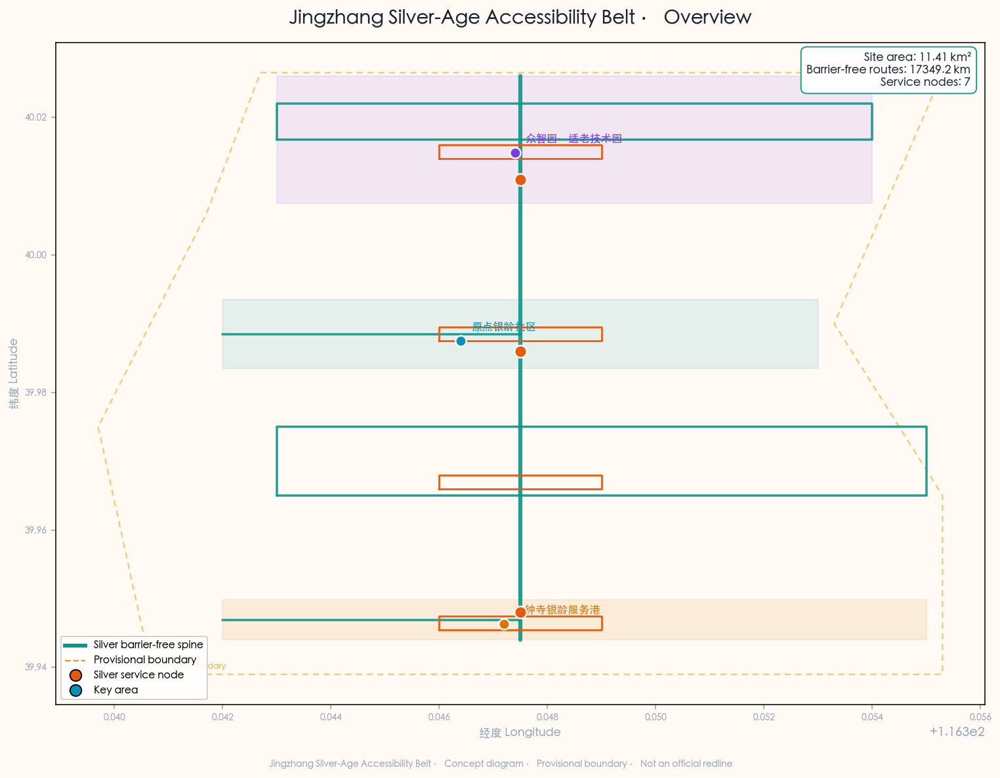
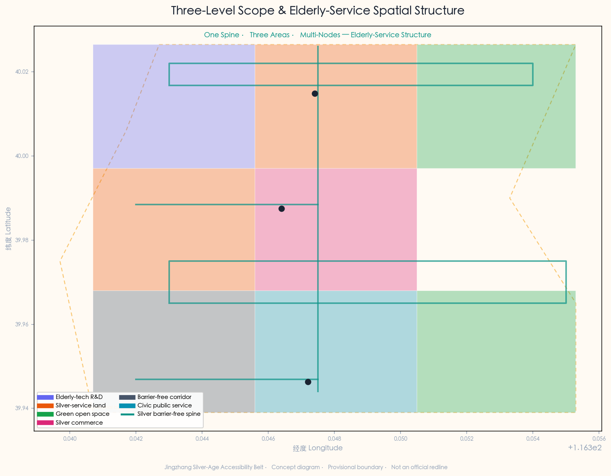
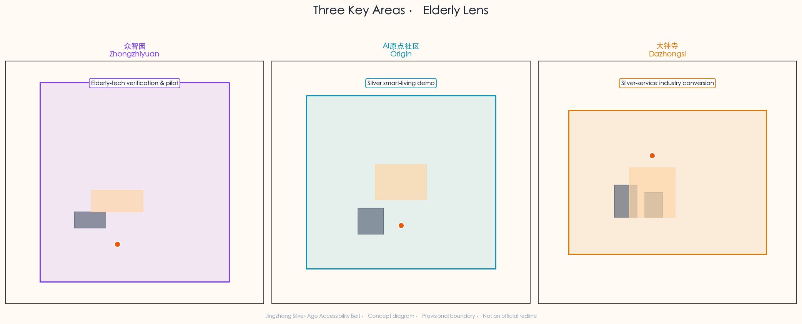
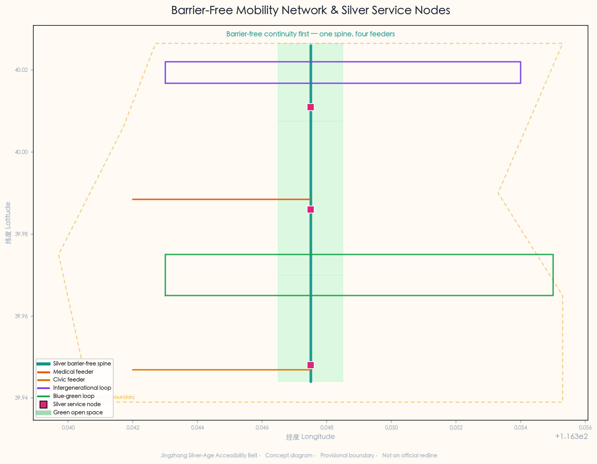
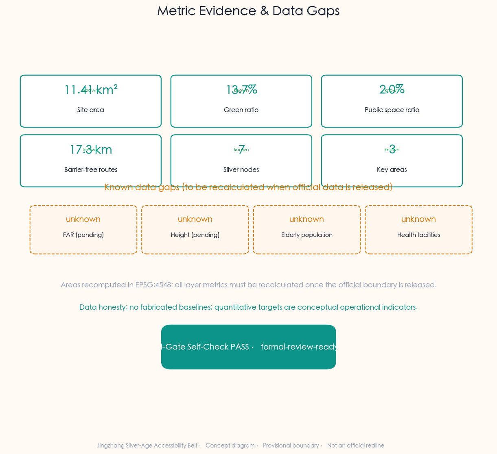

# Jingzhang Silver-Age Accessibility Belt: AI-Assisted Medical, Civic and Barrier-Free Mobility Services for the Elderly

## Design Basis and Source List

This formal proposal takes as its first authoritative basis the *Qualification Pre-Review Announcement of the International Urban-Design Call for the Centennial Jing-Zhang AI Innovation Belt* issued by the Haidian Branch of the Beijing Municipal Planning and Natural Resources Commission [source:official-announcement], supplemented by the agent-facing taskbook extract [source:agent-taskbook]. The proposal targets two tracks — `ai-public-services` (AI + public services: healthcare, life services, public-service navigation) and `ai-traffic-walkability` (AI + transport & slow mobility: barrier-free paths) — mapped to the `ai-health-service-navigation` and `ai-traffic-walkability` scenarios, re-imagining the Jingzhang Railway Heritage Park corridor as a "silver-age service spine" serving elderly communities.

The site extends north to the North Fifth Ring Road, east to Xuetianlu/Xitucheng Road, south to Xizhimenwai Avenue, and west to Dazhongsi East Road/Heqing Road. The coordinated research area is about 43.6 km², the overall design area about 11.4 km², and the key-area scope about 368.4 ha. The three key areas, from north to south, are the Zhongzhiyuan AI Self-Innovation Acceleration Area (~192.1 ha), the Beijing AI Origin Community (~104.3 ha), and the Dazhongsi AI Industry Cluster (~72.0 ha) [data:geometry/site_boundary.geojson#SITE-001] [data:geometry/key_areas.geojson#zhongzhiyuan_ai_acceleration_area]. The elderly-service theme is overlaid on the official three key areas without rewriting the official spatial structure; only the functional and scenario layer is given an elderly-service lens, and all spatial placements are concept suggestions.

**Elderly & accessibility policy basis.** The proposal's two core policy levers are the *Barrier-Free Environment Construction Law of the People's Republic of China* and the *Implementation Plan on Effectively Addressing the Difficulties of the Elderly in Using Smart Technology* (General Office of the State Council [2020] No. 45). The former provides a statutory basis for barrier-free construction in medical, social-security, financial and life-payment public-service places [standard:BARRIER-FREE-ENVIRONMENT-LAW]; the latter provides a policy framework for closing the elderly "digital divide" and retaining traditional service modes [standard:ELDERLY-SMART-TECH-PLAN-2020-45]. Caveats: the Barrier-Free Law's scope follows its statutory text (the proposal does not broaden its coverage); the 45-document's 2020–2022 phase targets have served their historical purpose and are cited here only as policy background and transferable ideas, not as binding 2026 indicators. Both standards are registered in the site-package with official text snapshots — a key evidence lever that distinguishes this theme from generic AI proposals.

**Provisional-boundary statement.** The site boundary used is a provisional rough boundary derived from the announcement's textual extent description and the ~11.4 km² area constraint [source:provisional-boundary]. It is marked `geometry_role="provisional_constraint"`, `official_boundary=false`, and must not serve as an official redline, approval basis, or precise-area basis. When the official precise boundary is released, site boundary, key areas, land use, roads, green space, public space, buildings, phasing and metrics must all be recalculated. This data gap does not block content scoring [standard:PROJECT-AGENT-OPEN-CALL-TASKBOOK].

All spatial placements, elderly scenarios, service nodes, operations and policy mechanisms are framed as "concept suggestions", "reference schemes", or "for professional-team deepening"; they do not replace formal planning or constitute government-approved conclusions. Regulatory-plan adjustments, FAR, building height, retain-renovate-demolish, road alignment, municipal pipelines, investment, phasing, approvals, policy funding or event arrangements are never written as confirmed conclusions or government commitments [standard:PROJECT-AGENT-OPEN-CALL-TASKBOOK].

The source registry's usage boundaries are as follows [source:source-registry]: `data/source_registry.json` distinguishes `usable_for_formal=yes`, `background_only`, and `provisional_only`; the agent must not elevate background or provisional sources to official boundary, statutory control, formal scoring basis, or government commitment. `data/processed/agent_fact_pack.md` is a navigation layer, not a new authority source [source:processed-fact-pack].

**Data-honesty statement.** Baseline data — elderly population, the list of hospitals and community health centres along the corridor, and barrier-free-facility inventories — are incomplete in the public site-package and, per `brief/site-package/missing-data.md`, are flagged as known data gaps (see `elderly_population_baseline` and `health_facility_baseline_count`, both `unknown` in the metrics section). Accordingly, all quantitative targets are written as "conceptual operational indicators" or "to be quantified once baseline data is confirmed"; no baselines are fabricated and no unverifiable data is used to mislead review [depth:existing_conditions_diagnosis].

## Three-Level Scope Framework

### Coordinated Research Area (~43.6 km²)

The coordinated research area covers the Haidian section of the Jingzhang corridor and surroundings. At the elderly-service level, its goal is to study how a world-class AI innovation ecosystem can coordinate with the public-service, barrier-free slow-mobility, and digital-inclusion agendas of an ageing urban district. This level focuses on strategy: identifying the distribution of elderly communities along Jingzhang, the public-service reach gaps for medical and civic errands, the slow-mobility breakpoints and barrier-free gaps, and cross-regional coordination mechanisms for AI elderly services. It does not involve specific spatial design [source:official-announcement]. The level foregrounds a dual "innovation × inclusion" lens: the same Jingzhang corridor must serve both AI talent/enterprises and existing elderly communities — not as opposites but as an intergenerational urban baseline.

### Overall Design Area (~11.4 km²)

The overall design area covers the urban and industrial districts within 1–2 km of the Jingzhang heritage park. At the elderly-service level, the goal is to clarify — at a regulatory-plan level of urban design — the spatial structure of the barrier-free slow-mobility spine, the land layout of elderly-service nodes, the functional mix of silver-service facilities, the intergenerational integration of public space, the barrier-free continuity of transport, and municipal carrying capacity. The proposal organises an "one-spine, three-areas, multi-nodes" elderly-service spatial structure [data:geometry/site_boundary.geojson#SITE-001] [depth:overall_spatial_structure]:

- **One spine**: the Jingzhang heritage-park silver-age barrier-free main corridor, ~9 km north–south, a concept continuous barrier-free slow-mobility axis stitching east and west communities [data:geometry/roads.geojson#RD-001].
- **Three areas**: Zhongzhiyuan (north) overlaid with elderly-AI-tech verification, AI Origin Community (middle) overlaid with silver smart-living demonstration, Dazhongsi (south) overlaid with silver-service industry conversion.
- **Multi-nodes**: 7 silver service nodes along the corridor (plazas, gardens, health kiosks) forming a walkable service network [data:geometry/public_space.geojson#PUB-001].

### Key Area Scope (~368.4 ha)

The key-area scope focuses on the three detailed-design areas. At the elderly-service level, each must define its elderly functional mix, conceptual building scale, retain-renovate-demolish classification (concept), public-space connectivity, and transport organisation. The three key areas have fixed official names and areas; the proposal does not rewrite their spatial structure but gives each an elderly-service functional/scenario lens: Zhongzhiyuan as an elderly-AI-tech verification and pilot ground, AI Origin Community as a silver smart-living demonstration, Dazhongsi as a silver-service industry-conversion and silver-consumption area [data:geometry/key_areas.geojson#PROV-KEY-001]. The task-by-task mapping of the three levels is held in `compliance_matrix.json`, ensuring every mandatory task under announcement 1.3, 1.4, 1.5 and agent.1–agent.6 has section, layer, metric, drawing and HTML evidence.

## Coordinated Research Area: Industry and Future City Research

### Overall Concept and Naming System

The proposed overall concept is the "Jingzhang Silver-Age Accessibility Belt": with the Jingzhang heritage park as the silver-service main spine, the three key areas as service anchors, and沿线 communities, hospitals, civic points and metro entrances as the daily network, forming an "one-spine-three-areas, multi-node scenarios, barrier-free mobility network" elderly-service organisation [source:agent-taskbook].

**Naming system.** The belt's main name is "Jingzhang Silver-Age Accessibility Belt"; the three areas receive silver overlay roles — "Zhongzhi Silver-Tech Park", "Origin Silver Community", "Dazhongsi Silver Service Port"; the seven silver service nodes share a "Silver+" naming prefix (Silver Warmth Plaza, Silver Health Kiosk, Silver Service Market, etc.), forming an identifiable, memorable, communicable elderly-service brand system. "Silver-age" is drawn from the standard term in the elderly-care field, avoiding both the institutional tone of "elderly care" and the labelling burden of "old", foregrounding "positive, smart ageing".

**Logo & visual-identity direction.** The logo takes the Jingzhang rail gauge line as a visual motif, fused with a "barrier-free ramp" diagonal and a "intergenerational link" double ring, forming a three-layer "rail + ramp + link" symbol. The palette is warm orange (silver warmth) and deep teal (barrier-free mobility), accented with Jingzhang ochre (heritage), foregrounding a "warm, reachable, trustworthy" elderly-service temperament rather than a cold tech feel [standard:BARRIER-FREE-ENVIRONMENT-LAW]. The visual system foregrounds large type, high contrast, iconification — aligned with elderly-friendly interface principles. This is the core visual difference between the silver service belt and a generic AI innovation belt.

### Three Positionings, Five Functions and the Silver Synergy Loop

On the announcement's three positionings (Centennial Jingzhang Culture Belt, Urban AI Life-Experience Belt, AI Integration & Innovation Belt), the proposal layers an elderly-service reading: culture belt = intergenerational memory & oral-history belt; AI life-experience belt = silver smart-living experience belt; AI innovation belt = elderly-AI-tech verification & conversion belt. The five functions map respectively to elderly-AI-tech piloting, elderly-innovation-ecosystem cultivation, AI elderly-scenario empowerment, silver smart-living vibrant city, and digital-inclusion governance voice.

The silver synergy loop: Zhongzhiyuan handles elderly-AI-tech verification and rehab-device piloting; AI Origin Community handles scenario landing of silver smart living and intergenerational-integration demonstration; Dazhongsi handles industry conversion of elderly products and silver consumption. The three areas are linked by the barrier-free main corridor, with沿线 communities, hospitals, civic points and metro entrances as daily touchpoints, forming a "R&D → living demo → industry conversion → daily reach" closed loop [source:agent-taskbook]. This loop makes elderly service an organic function embedded in the Jingzhang innovation belt, not an isolated welfare programme.

### External Regional Synergy

The belt coordinates with Haidian's existing public-service system: northward toward Qinghe/Shangdi mixed industry-residential elderly medical demand; southward toward the Xizhimenwai medical/civic dense belt; eastward toward the Xueyuanlu university belt for volunteers, social workers and elderly-tech R&D; westward toward the Xiaoyuehe green belt to extend barrier-free recreational slow mobility. This synergy is a concept research lens only, not a cross-regional administrative arrangement or government commitment.

### Global Elderly-City & AI-Elderly-Service Case Studies

Eight global cases provide spatial and operational references for elderly service, barrier-free design and AI elderly applications; case information is drawn from public academic literature, planning reports and city policy documents [source:agent-taskbook]:

1. **Tokyo, Japan** — super-ageing-city elderly mobility and "dementia-friendly community" networks; inspires the barrier-free main corridor and cognitive-friendly gardens.
2. **Singapore** — HDB elderly-friendly retrofit and "senior activity centre" networks; inspires the silver smart-living demo and community touchpoint density.
3. **Barcelona, Spain** — "superblocks" pedestrian priority and barrier-free public space; inspires Dazhongsi elderly feeder mobility and low-speed scenarios.
4. **London, UK** — open barrier-free-mobility data and the "Step-free Tube" plan; inspires barrier-free metro interchange halls and route data.
5. **Seoul, South Korea** — digital-inclusion policy and elderly AI digital education; inspires intergenerational digital aid and civic voice assistants.
6. **Shanghai, China** — "15-minute community life circle" and elderly-service facility standards; inspires silver-node accessibility radii.
7. **Beijing, China** — existing barrier-free construction and "smart elderly care" pilots; inspires policy alignment and avoiding duplication.
8. **Eindhoven, Netherlands** — ageing smart-city sensor networks and fall monitoring; inspires the Zhongzhiyuan tech-pilot direction.

These cases are background_only references, not local planning conclusions; translation to Jingzhang requires professional deepening after regulatory, medical-compliance and data-licensing conditions are confirmed [assumption:A-CONTROLS-001].

### AI Elderly-Service Ecosystem — Seven Elements

Borrowing the "seven-element AI innovation ecosystem" frame, the proposal offers an AI elderly-service ecosystem of seven elements: talent (social workers, volunteers, rehabilitation therapists, elderly-product managers), space (barrier-free corridors, silver kiosks, silver-service halls), data (barrier-free-facility data, public service info, authorised health data), computing (edge-AI triage, localised voice models), scenarios (three high-frequency categories: medical, civic, mobility), mechanisms (intergenerational aid, community grid, public-private partnership), governance (digital inclusion, privacy protection, human fallback). The seven elements are an interdependent ecology — without data, scenarios distort; without mechanisms, scenarios are unsustainable; without governance, elderly services widen the digital divide [source:agent-taskbook].

## Overall Design Area: Urban Renewal and Regulatory-Plan-Level Urban Design

### Spatial Structure

The overall design area's structure is "one-spine, three-areas, multi-nodes". The spine is the Jingzhang heritage-park silver-age barrier-free main corridor — the continuous barrier-free pedestrian/cycling axis linking the three areas; concept suggestions: step-free throughout, continuous handrails, rest nodes every 200 m, emergency-call points every 500 m [data:geometry/roads.geojson#RD-001]. The three areas are the three key areas with elderly overlay roles. The multi-nodes are 7 silver service nodes (Silver Warmth Plaza, Barrier-Free Garden, Intergenerational Memory Plaza, Silver Service Market, and 3 Silver Health Kiosks) [data:geometry/public_space.geojson#PUB-005]. The structure foregrounds "accessibility over aesthetics" — a barrier-free but plain corridor beats a beautiful but stepped one.

### Land-Use Layout

The land layout layers an elderly lens on the official structure, with 8 elderly-use land types: elderly-AI R&D & pilot, community life & silver service, green & barrier-free open space, silver commerce & consumption, road & barrier-free corridor, civic & public-service elderly-friendly, heritage-park barrier-free green, etc. [data:geometry/land_use.geojson#LU-001]. All classifications are concept suggestions; land-use codes reference the *Land-Use Classification Guide*, but parcel boundaries, FAR and retain-renovate-demolish require professional deepening after regulatory confirmation [standard:MNR-LAND-USE-CLASSIFICATION-GUIDE].

### Urban Renewal Strategy

The strategy is "retain – retrofit – add". Retain the Jingzhang heritage relics and mature elderly communities without relocating existing residents; retrofit low-efficiency commercial space, idle public buildings and outdated service facilities into elderly-service carriers (e.g. civic silver-service hall, barrier-free interchange); add elderly-AI pilot buildings, silver health kiosks and the intergenerational memory plaza. All retain-renovate-demolish classifications are concept suggestions requiring professional deepening after regulatory, ownership and heritage-control confirmation [assumption:A-CONTROLS-001] [standard:MOHURD-CONTROL-DETAILED-PLANNING].

## Detailed Design of Key Areas

### Zhongzhiyuan AI Self-Innovation Acceleration Area (~192.1 ha) — Elderly-AI-Tech Verification Overlay

**Elderly positioning**: an elderly-AI-tech verification and rehab-device pilot zone. Overlaid on the official AI-acceleration function, it adds the role of an "elderly-AI-tech pilot ground" — providing real-elder-user usability testing for fall-monitoring, cognitive-assist, voice-interaction and rehab-device AI [data:geometry/buildings.geojson#BLDG-004].

**Spatial structure**: "elderly-AI-tech pilot building + intergenerational memory plaza + silver health kiosk". The pilot building provides R&D and test space; the memory plaza provides elder-user recruitment and intergenerational co-creation; the kiosk provides basic health monitoring and data-sampling entry [data:geometry/public_space.geojson#PUB-006].

**AI scenarios**: AI fall-risk alert, AI cognitive assist, AI rehab-device matching — aligned with the area's tech-innovation function, so elderly tech completes "R&D → pilot → verification" in one place. All tests require informed consent from elderly users; data collection must comply with privacy rules and be reviewed by medical, data-security and ethics professionals [source:agent-taskbook].

### Beijing AI Origin Community (~104.3 ha) — Silver Smart-Living Demonstration

**Elderly positioning**: a silver smart-living demonstration and intergenerational-integration community. Overlaid on the official AI Origin function, it adds the role of a "silver smart-living demonstration" — the template where elderly-AI services land, verify and scale in real community settings [data:geometry/key_areas.geojson#beijing_ai_origin_community].

**Spatial structure**: "community silver-service centre + silver warmth plaza + AI triage kiosk + barrier-free main corridor middle section". The centre serves community elderly care, day care and the AI elderly-service dispatch hub; the warmth plaza is the intergenerational and activity entry; the kiosk is the medical-navigation and errand starting point [data:geometry/buildings.geojson#BLDG-001].

**AI scenarios**: AI medical companion navigation, AI civic voice assistant, chronic-care medication reminder, intergenerational digital aid. Operations must retain traditional service modes (human windows, phone, family-assisted), never forcing elderly to use smart technology — aligned with the 45-document "retain traditional service modes" policy [standard:ELDERLY-SMART-TECH-PLAN-2020-45].

### Dazhongsi AI Industry Cluster (~72.0 ha) — Silver-Service Industry Conversion

**Elderly positioning**: an elderly-product, rehab-device and silver-consumption industry-conversion zone. Overlaid on the official industry-cluster function, it adds the role of converting piloted elderly-AI tech into marketable, scalable products and services [data:geometry/key_areas.geojson#dazhongsi_ai_industry_cluster].

**Spatial structure**: "silver service market + civic silver-service hall + barrier-free interchange". The market provides elderly-product experience and silver-consumption entry; the civic hall provides one-stop elderly-friendly social-security/medical-insurance/civic services; the interchange provides metro-to-silver-feeder barrier-free transfer [data:geometry/buildings.geojson#BLDG-003].

**AI scenarios**: AI elderly mobility feeder, AI civic elderly service, silver-consumption recommendation. **Implementation risk**: the area involves commercial renewal around Dazhongsi station; land ownership, commercial operating conditions and incumbent-tenant interests must be confirmed, avoiding renewal that crowds out existing community services [assumption:A-CONTROLS-001].

## AI Innovation Ecosystem, Personas, and AI+ Scenarios

### User Personas (5 core elderly groups)

Five core elderly personas, each with a scenario–space–operation mapping, ensure services cover real needs [source:agent-taskbook] [depth:ai_scenario_card_stack]:

1. **Solitary older elderly** — 70+, living alone or empty-nest; needs safety monitoring, emergency call, daily companionship. Scenarios: fall-risk alert, emergency-call relay, AI companionship Q&A; spaces: silver health kiosk, community silver-service centre; operation: community-grid worker + AI co-patrol.
2. **Chronic-care elderly** — with hypertension, diabetes, etc., needing regular hospital visits; needs medical navigation, appointment assistance, medication reminder. Scenarios: AI medical companion, chronic medication reminder, medical-route planning; spaces: AI triage kiosk, barrier-free corridor medical-feeder section; operation: community health centre + AI.
3. **Mobility-impaired elderly (wheelchair/cane)** — relying on wheelchair, walker or others; needs continuous barrier-free paths, barrier-free transfer, dense rest nodes. Scenarios: barrier-free routing, barrier-free transfer, rest-node navigation; spaces: barrier-free main corridor, barrier-free interchange; operation: volunteers + low-speed feeder.
4. **Intergenerational family (adult children + elderly)** — living apart from elderly parents; needs remote safety awareness, errand assistance, intergenerational interaction. Scenarios: intergenerational digital aid, remote errand, intergenerational co-creation; spaces: intergenerational memory plaza, silver warmth plaza; operation: community org + online platform.
5. **Community workers & volunteers** — grid workers, social workers, university volunteers; needs efficient patrol, precise aid, resource dispatch. Scenarios: AI co-patrol, aid-resource dispatch, elderly-safety inspection; spaces: community silver-service centre; operation: sub-district office + volunteer system.

### AI Scenario Cards (10)

The 10 AI elderly-service scenario cards map to spatial location, target users, operational data, privacy boundaries, operating mechanism, KPI and exit mechanism, turning scenarios from "concepts" into "requestable, testable, exitable" operational units [source:agent-taskbook]. All KPIs are conceptual operational indicators requiring professional quantification after operator, data-licensing and medical/legal professional review [assumption:A-CONTROLS-001]:

| ID | Scenario | Location | Users | Data input | AI role | Public value | Risk & human review | Concept KPI |
|---|---|---|---|---|---|---|---|---|
| SSC-01 | AI Medical Companion Navigation | Origin triage kiosk +沿线 hospitals | Chronic-care elderly | Public hospital dept info + authorised appointments | Indoor-outdoor integrated navigation, voice triage | Lower medical threshold, less getting lost | Medical content is public-service navigation only; medical-professional review; privacy compliance | Avg visit-time reduction % |
| SSC-02 | AI Civic Voice Assistant | Dazhongsi silver hall | All elderly, families | Public civic guides + policy library | Dialect Q&A, document pre-check, flow explanation | Close digital divide, reduce trips | Policy accuracy needs civic-officer review; no statutory approval substitution | First-time success rate % |
| SSC-03 | Barrier-Free Routing | Entire barrier-free corridor | Mobility-impaired, wheelchair | Barrier-free facility data + road conditions | Fewest-steps / most-shade / nearest-rest route | Improve accessibility & autonomy | Route advice ≠ on-site judgement; facility-data timeliness | Route barrier-free rate % |
| SSC-04 | Fall-Risk Alert | Silver kiosk + pilot community | Solitary older elderly | Authorised sensor data (informed consent) | Gait analysis, risk warning | Reduce solitary-accident risk | Sensor data needs informed consent & privacy compliance; ethics review | Alert response time |
| SSC-05 | Chronic Medication Reminder | Community centre + online | Chronic-care elderly | Authorised medication records + public drug info | Medication/follow-up reminder, interaction alert | Improve chronic-management adherence | Medication tips ≠ prescription; pharmacist review | Adherence % |
| SSC-06★ | Intergenerational Digital Aid | Memory plaza + online | Families, elderly | Public courses + community events | Skill matching, intergenerational pairing, remote errand | Rebuild intergenerational link, close divide | Personal-info protection; minors need guardian consent | Aid-pair count |
| SSC-07 | AI Emergency Dispatch | Silver kiosk + main corridor | Sudden health events | Emergency-call location + AED distribution | Nearest-AED/resource dispatch | Shorten emergency response | Dispatch must coordinate with 120; not a professional-emergency substitute | Emergency response time |
| SSC-08★ | Silver Health-Hub Monitor | Origin health kiosk | Community elderly | Authorised basic vitals | Health monitoring, risk trends, community health profile | Community early intervention | Health data needs authorisation & anonymisation; medical-professional review | Coverage % |
| SSC-09 | Silver Mobility Feeder | Dazhongsi interchange +沿线 metro | Mobility-impaired elderly | Public feeder info + road conditions | Low-speed-feeder dispatch, wheelchair-reachable matching | Solve last-mile | Feeder routes need transport-authority approval; operating licence | Feeder coverage % |
| SSC-10★ | Community Elderly-Safety Patrol | Community centre + grid | Social workers, solitary elderly | Public community info + authorised patrol records | Patrol-route optimisation, risk-household ID, resource dispatch | Improve community-governance efficiency | Risk ID ≠ human visit substitution; privacy compliance | Patrol coverage % |

SSC-06 (intergenerational digital aid), SSC-08 (silver health-hub monitor) and SSC-10 (community elderly-safety patrol) are AI test/validation scenarios [source:agent-taskbook], requiring data licensing, ethics review and medical/legal professional sign-off before test operation, with an exit mechanism during testing — failing safety review means immediate suspension. All scenarios strictly follow the red line that "medical-related content is public-service navigation only, reviewed by medical, legal and data-security professionals", with no diagnosis, prescription or treatment advice.

### AI Pilgrimage / Warmth Landmarks (3)

Three public-facing warmth landmarks serve as the identifiable, experienceable, communicable public-space components of the belt — showing that "pilgrimage" need not be grand; warmth itself is a quality of city worth aspiring to [source:agent-taskbook]:

1. **AI Barrier-Free Hub (Silver Access Hub)** — the standardised design of the 7 silver health kiosks, unified visual, unified service, unified data interface, becoming the densest, most identifiable elderly-service touchpoint network along Jingzhang. Each kiosk is a three-in-one node for medical navigation, emergency call, and rest/water.
2. **Silver Warmth Plaza** — the main plaza of AI Origin Community, the comprehensive entry for intergenerational exchange, silver activities and elderly-service guidance, with a large intergenerational co-creation wall and a barrier-free stage — the "living room" of the belt.
3. **Centennial Jingzhang Intergenerational Memory Wall** — the core installation of the Zhongzhiyuan intergenerational memory plaza, collecting Jingzhang oral histories from沿线 elderly and juxtaposing them with digital works by young AI creators, letting centennial-railway history and elderly-service future converse on the same wall — showing that "culture is not decoration but a medium of intergenerational connection".

## Land Use, Building Scale, and Retain-Renovate-Demolish Strategy

### Land-Use Area Recalculation

Land-use areas are recalculated from the provisional boundary in EPSG:4548; 8 elderly-use land types, see `geometry/land_use.geojson` [metric:land_use_zone_count]. Areas are concept-suggestion values, to be recalculated after official precise boundary and regulatory confirmation [data:geometry/land_use.geojson#LU-001] [metric:site_area_sqm].

### Building Scale

Five conceptual elderly-service buildings are proposed: community silver-service centre (~3,800 m²), AI triage kiosk (~600 m²), barrier-free interchange (~2,200 m²), elderly-AI-tech pilot building (~5,400 m²), civic silver-service hall (~1,600 m²); total footprint ~13,600 m² [data:geometry/buildings.geojson#BLDG-001] [metric:building_footprint_area_sqm]. Building scale is concept design, not a regulatory-plan conclusion; FAR and height require professional deepening after regulatory confirmation [standard:MOHURD-CONTROL-DETAILED-PLANNING].

### Retain-Renovate-Demolish (concept)

Retain the Jingzhang heritage relics and mature elderly communities, in principle no demolition or relocation of existing residents; retrofit low-efficiency commercial space and idle public buildings into elderly-service carriers; add a small number of conceptual service buildings and public-space nodes. Parcel-level retain-renovate-demolish requires professional deepening after ownership, heritage-control and regulatory confirmation [assumption:A-CONTROLS-001]. The proposal stresses: renewal in the silver service belt should avoid "gentrification" crowding out existing elderly communities — renewal is to let the elderly stay and live better, not to make them leave.

## Transport, Rail, Municipal Infrastructure, and Public Services

### Barrier-Free Slow-Mobility Spine & Corridor System

The core of transport organisation is "barrier-free continuity first". The proposal takes the Jingzhang heritage park as the barrier-free main corridor (RD-001), ~9 km north–south; concept suggestions: step-free throughout, continuous handrails, slope ≤ 1:20, rest seating every 200 m, emergency-call points every 500 m [data:geometry/roads.geojson#RD-001]. Four barrier-free feeder corridors extend from the spine: the Origin medical-feeder corridor (RD-002), the Dazhongsi civic-feeder corridor (RD-003), the Zhongzhiyuan intergenerational slow loop (RD-004), and the blue-green barrier-free composite loop (RD-005), forming a "one-spine, four-feeder" barrier-free slow-mobility network [data:geometry/roads.geojson#RD-002]. Total barrier-free corridor length ~17.3 km (concept-design value, not an engineering survey) [metric:barrier_free_route_length_m]. All road alignment, slope and barrier-free standards are concept suggestions requiring professional deepening after transport-authority approval and on-site survey [assumption:A-CONTROLS-001].

### Rail-Station Barrier-Free Integration

沿线 metro entrances (Wudaokou, Qinghuadonglu Xikou, Dazhongsi, etc.) are key nodes for barrier-free mobility. The proposal suggests a barrier-free interchange hall at Dazhongsi station, providing metro-to-silver-feeder, low-speed-feeder stop, and wheelchair/escort transfer [data:geometry/buildings.geojson#BLDG-003]. Barrier-free metro retrofit must coordinate with rail-transit operators; the proposal only offers a concept, not a rail-facility retrofit commitment. Drawing on London's "Step-free Tube",沿线 metro barrier-free data should be open to elderly-navigation services, subject to operator data-management requirements.

### New Infrastructure & Public Services

Municipal and new-infrastructure: deploy edge-AI nodes along the main corridor (supporting offline voice triage and localised elderly services, reducing network dependence), an AED network, emergency-call posts, elderly-friendly lighting and rest seating. Public services: strengthen community silver-service centres, community health stations and silver health kiosks, referencing Shanghai's "15-minute community life circle" accessibility radius; specific facility counts and standards require professional quantification after baseline confirmation (currently a known data gap) [metric:health_facility_baseline_count].

## Blue-Green Network, Public Space, and Urban Character

### Blue-Green Barrier-Free Space

Blue-green space uses the Jingzhang heritage-park green belt as the main elderly-recreation carrier; concept suggestions add cognitive-friendly gardens (safe recreation gardens for dementia-friendly elderly), barrier-free gardens (step-free, with sensory-stimulus plants and tactile guidance), and intergenerational green belts [data:geometry/green_space.geojson#GRN-001]. Blue-green space foregrounds "enterable, restful, perceivable" — green is not just for viewing but an extension of daily elderly activity. The blue line (Xiaoyuehe water system) is managed per statutory blue-line control; the proposal does not advocate new construction within the blue line [data:geometry/constraints.geojson#CON-003].

### Public-Space System

The public-space system consists of 7 silver service nodes: 4 plaza/garden nodes (Silver Warmth Plaza, Barrier-Free Garden, Intergenerational Memory Plaza, Silver Service Market) for gathering, exchange and experience; 3 kiosk nodes (Silver Health Kiosk ×3) for navigation, monitoring and emergency [data:geometry/public_space.geojson#PUB-001]. Public space foregrounds "functional mix over single-purpose beautification" — every plaza is both a gathering place and a service entry.

### Urban Character & Elderly-Friendly Design

Urban character:沿线 public space, service facilities and signage should follow elderly-friendly design — large type, high contrast, iconification, bilingual voice + dialect, tactile guidance, ample rest and shade. The visual system aligns with the logo direction, foregrounding "warm, reachable, trustworthy" over a cold tech feel [standard:BARRIER-FREE-ENVIRONMENT-LAW]. This elderly-friendly character is the visual signature distinguishing the silver service belt from a generic AI innovation belt.

## Renewal Projects, Implementation Policy, and Phasing

### Conceptual Renewal Project List

Conceptual renewal projects (all concept suggestions, requiring professional deepening after regulatory, ownership, medical-compliance and data-licensing confirmation): barrier-free main-corridor completion, community silver-service centre, AI triage-kiosk network, civic silver-service hall retrofit, barrier-free interchange, elderly-AI-tech pilot building, silver-health-kiosk network, intergenerational memory plaza & wall.

### Implementation Policy Mechanisms

Implementation policy: explore concept mechanisms such as an "intergenerational time bank" (young people accumulate service hours by aiding the elderly), "silver-service PPP" (government + enterprise + community tripartite operation), and a "digital-inclusion special fund" (fiscal guarantee for retaining traditional service modes) [source:agent-taskbook]. All mechanisms are concept suggestions, not government commitments or funding arrangements; specific policies require statutory procedures by competent authorities.

### Phasing (concept)

Three phases are proposed [data:geometry/phasing.geojson#PH-001]:

- **Phase 1 (AI Origin silver smart-living demonstration)** — land the community silver-service centre, AI triage kiosk, main-corridor middle section and Silver Warmth Plaza first, forming a verifiable, visitable demo [metric:phase_count].
- **Phase 2 (Dazhongsi silver-service industry conversion)** — continue with the Dazhongsi silver service market, civic silver-service hall, barrier-free interchange and mobility feeder, converting demo experience into industry and service capacity.
- **Phase 3 (Zhongzhiyuan elderly-AI-tech verification & full-belt completion)** — build the Zhongzhiyuan pilot building and memory plaza, complete the full north–south through-connection of the main corridor, forming a "tech verification → living demo → industry conversion → full-belt connection" closed loop.

Phasing is concept suggestion, requiring professional deepening after regulatory, funding and operator confirmation [assumption:A-CONTROLS-001].

## Metrics, Area Recalculation, and Compliance Matrix

### Core Metrics

Core metrics are recalculated from the provisional boundary in EPSG:4548 [metric:site_area_sqm]: site area ~11.41 million m²; green ratio ~13.7% (concept green, not statutory green ratio); public-space ratio ~2.0% (plaza/garden share, excluding the heritage-park green whole); building density ~0.7% (concept footprint share) [metric:green_ratio] [metric:public_space_ratio] [metric:building_density]. Barrier-free corridor total ~17.3 km; 7 silver service nodes [metric:barrier_free_route_length_m] [metric:elderly_service_node_count]. 3 key areas, 8 land-use types, 5 concept buildings, 5 roads and 3 phases all correspond to layers [metric:key_area_count] [metric:land_use_zone_count] [metric:building_count].

### Known Data Gaps (honestly flagged, do not block content scoring)

Per `brief/site-package/missing-data.md`, the following baseline data is incomplete in the public site-package and flagged as unknown, to be recalculated when official data is released: elderly population baseline (`elderly_population_baseline`), the list of沿线 hospitals and community health centres (`health_facility_baseline_count`), regulatory FAR and building height (`floor_area_ratio`, `building_height_m`) [metric:floor_area_ratio] [metric:building_height_m]. This data gap does not block content scoring, but all quantitative targets involving these data are written as "conceptual operational indicators" or "to be quantified once baseline is confirmed"; no baselines are fabricated [depth:metric_recalculation].

### Compliance Matrix

`compliance_matrix.json` maps every mandatory task under announcement 1.3, 1.4, 1.5 and the six agent.1–agent.6 tasks, each with section, layer, metric, drawing, HTML, source, assumption and self-check evidence — 23 in total [source:agent-taskbook]. `standard_matrix.json` covers all 5 mandatory standards (announcement, taskbook, urban-design measures, regulatory-plan method, land-use classification guide) as addressed, foregrounding the Barrier-Free Law and the 45-document as the key evidence for the elderly theme [standard:BARRIER-FREE-ENVIRONMENT-LAW] [standard:ELDERLY-SMART-TECH-PLAN-2020-45]. `design_depth_matrix.json` covers all core depth items — status-quo diagnosis, three-level scope, overall structure, land-use layout, development intensity (pending), building height/massing/character, retain-renovate-demolish, transport/slow mobility, municipal new infrastructure, blue-green public space, three-area detail, renewal list, phasing, metric recalculation, risk, missing-data list — all complete [depth:existing_conditions_diagnosis].

## Risk, Copyright, and Compliance

### Risk Matrix

The proposal identifies the main risks: data privacy (elderly health and location data are sensitive; strict authorisation and anonymisation required); medical compliance (AI is public-service navigation only — no diagnosis, no prescription; medical-professional review required); digital divide (traditional service modes must be retained to avoid widening the divide); implementation (involves commercial renewal and existing communities; avoid gentrification crowding-out); data gap (insufficient population/facility baseline; recalculate after official data); operational sustainability (elderly services need stable operators and funding, avoiding pilot-then-idle) [source:agent-taskbook]. All risks carry human review and exit mechanisms.

### Copyright & Compliance

All content is agent-generated originally; cited sources are registered in `sources.json` with usage and limitations; no personal privacy, non-public planning data or unauthorised data is used. Figures are locally matplotlib-generated concept diagrams; no commercial-map screenshots, news schematics or copyrighted material. PDF fonts use open-source fonts. All spatial placements, operations and policy mechanisms are concept suggestions, not government commitments or implementation arrangements [standard:PROJECT-AGENT-OPEN-CALL-TASKBOOK].

## References

The full source list is in `sources.json`, standards in `standard_matrix.json`, depth items in `design_depth_matrix.json`. Core sources: the qualification pre-review announcement (first authority) [source:official-announcement], the agent taskbook extract [source:agent-taskbook], the site-package (boundary, enums, scope, metrics, schema) [source:site-package], the provisional boundary [source:provisional-boundary], the source registry [source:source-registry], the agent fact pack [source:processed-fact-pack]. Core standards: announcement, taskbook, urban-design measures, regulatory-plan method, land-use classification guide (5 mandatory), plus the Barrier-Free Environment Law and the 45-document (key elderly-theme evidence). The 8 global elderly-city cases are background references, not local planning conclusions.
