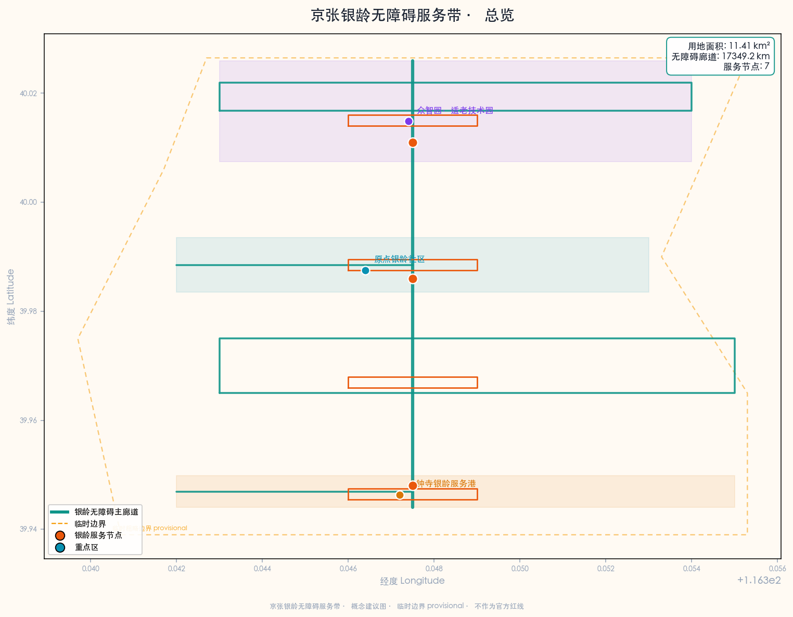
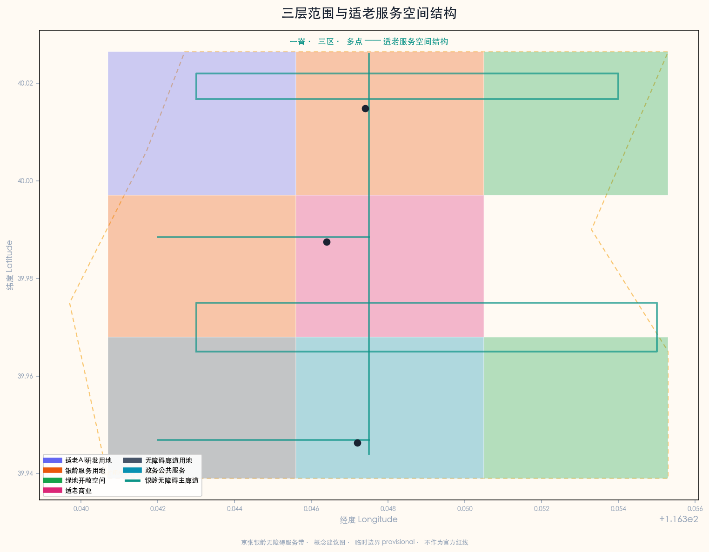
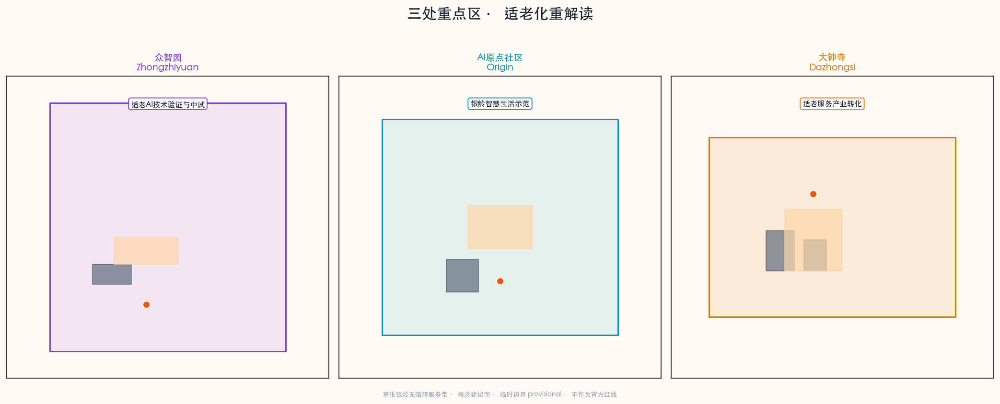
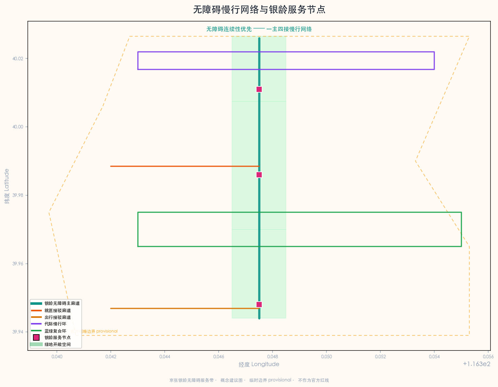
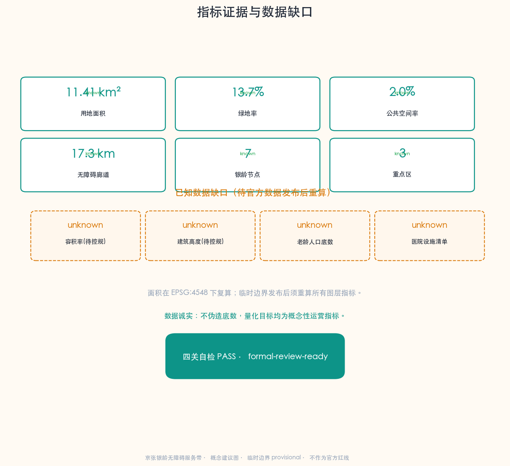

# 京张银龄无障碍服务带：AI辅助老年人就医、办事与无障碍出行

## 设计依据与资料清单

本 formal 方案以北京市规划和自然资源委员会海淀分局发布的《百年京张AI创新带城市设计国际方案征集资格预审公告》为第一权威依据 [source:official-announcement]，以面向智能体的任务书摘录为补充依据 [source:agent-taskbook]。方案聚焦 `ai-public-services`（AI+公共服务：医疗健康、生活服务、公共服务导航）与 `ai-traffic-walkability`（AI+交通慢行：无障碍路径）两条赛道，对应 `ai-health-service-navigation`（AI+医疗健康服务导航）与 `ai-traffic-walkability`（AI+交通慢行评估）两个场景，把京张铁路遗址公园沿线重新定义为服务老龄社区的"适老服务脊梁"。

场地范围北至北五环路，东至学院路/西土城路，南至西直门外大街，西至大钟寺东路/荷清路，统筹研究范围约43.6平方公里，总体设计范围约11.4平方公里，重点区域范围约368.4公顷。三处重点区域自北向南分别为众智园AI自主创新加速区（约192.1公顷）、北京AI原点社区（约104.3公顷）和大钟寺AI产业集聚区（约72.0公顷）[data:geometry/site_boundary.geojson#SITE-001] [data:geometry/key_areas.geojson#zhongzhiyuan_ai_acceleration_area]。本方案的适老服务主题叠加在公告既定的三处重点区之上，不改写官方空间结构，仅在功能与场景层面赋予适老服务视角，所有空间落地均为概念建议。

**适老与无障碍政策依据。** 本方案的两条核心政策杠杆是《中华人民共和国无障碍环境建设法》与《关于切实解决老年人运用智能技术困难的实施方案》（国办发〔2020〕45号）。前者为医疗、社保、金融、生活缴费等公共场所无障碍建设提供法定依据 [standard:BARRIER-FREE-ENVIRONMENT-LAW]，后者为弥合老年人"数字鸿沟"、保留传统服务方式提供政策框架 [standard:ELDERLY-SMART-TECH-PLAN-2020-45]。需要说明的是：无障碍环境建设法的适用范围以法定条文为准（本方案援引时不扩大其覆盖范围），45号文2020—2022年阶段目标已完成历史使命，本方案仅将其作为适老化政策背景与可迁移思路的参照，不作为2026年的现行约束性指标。两条标准均已由维护者在 site-package 中登记并附带官方文本快照，是本主题区别于一般AI方案的关键证据杠杆。

**临时边界声明。** 本方案使用的场地边界为临时粗略边界（provisional boundary），来源于公告文字四至和约11.4平方公里面积约束推导 [source:provisional-boundary]。该边界标注为 `geometry_role="provisional_constraint"`、`official_boundary=false`，不得作为官方红线、审批依据或精确面积复算依据。当官方精确边界发布后，site boundary、key areas、land use、roads、green space、public space、buildings、phasing 和 metrics 均需重算。该组织方数据缺口本身不阻断内容评分 [standard:PROJECT-AGENT-OPEN-CALL-TASKBOOK]。

所有空间落地建议、适老场景、服务节点、活动运营和政策机制均表述为"概念建议""参考方案"或"可供专业团队深化研究"，不替代正式规划，不构成政府审定结论；控规调整、容积率、建筑高度、拆改留、道路线位、市政管线、投资测算、开发时序、审批判断、政策资金或活动安排均不写成已确定结论或政府承诺 [standard:PROJECT-AGENT-OPEN-CALL-TASKBOOK]。

资料登记表的使用边界如下 [source:source-registry]：`data/source_registry.json` 区分 `usable_for_formal="yes"`、`background_only`、`provisional_only` 三类资料；agent 不得把 background 或 provisional 资料升级为 official boundary、法定控规、正式评分依据或政府实施承诺。`data/processed/agent_fact_pack.md` 是阅读导航层而非新权威来源 [source:processed-fact-pack]，帮助 agent 把三层范围、三处重点区、agent.1—agent.6、资料可用性和缺资料事项组织成可读方案；事实判断仍需回到已登记的原始材料。

**数据诚实声明。** 本方案涉及的老龄人口底数、沿线医院与社区卫生服务中心清单、无障碍设施现状普查等基线数据，在公开 site-package 中尚不完整，依据 `brief/site-package/missing-data.md` 已列为已知数据缺口（详见指标章节 `elderly_population_baseline` 与 `health_facility_baseline_count` 均为 `unknown`）。本方案据此把所有量化目标写成"概念性运营指标"或"待补数据确认后量化"，不伪造底数，不以不可审查的数据误导评审 [depth:existing_conditions_diagnosis]。

## 三层范围工作框架

### 统筹研究范围（约43.6平方公里）

统筹研究范围覆盖海淀区京张铁路走廊及周边区域，适老服务层面的工作目标是研究世界级AI创新生态体系如何与老龄化城区的公共服务、慢行无障碍、数字包容议题协同。该层面侧重战略研究：识别京张沿线老龄社区的分布规律、就医与办事的公共服务触达缺口、慢行断点与无障碍缺口，以及AI适老服务的跨区域协同机制，不涉及具体空间设计 [source:official-announcement]。该层面强调"创新"与"包容"的双重视角——同一片京张走廊，既要服务AI人才与企业，也要服务沿线既有老龄社区，两者并非对立，而是代际共生的城市基本面。

### 总体设计范围（约11.4平方公里）

总体设计范围以京张遗址公园周边1—2公里城市地区和产业区为规划设计范围，适老服务层面的工作目标是在控制性详细规划深度的城市设计中，明确无障碍慢行主轴的空间结构、适老服务节点的用地布局、银龄服务设施的功能比例、公共空间体系的代际融合、交通组织的无障碍连续性与市政承载。本方案在总体设计范围内构建"一脊三区多点"的适老服务空间结构 [data:geometry/site_boundary.geojson#SITE-001] [depth:overall_spatial_structure]：

- **一脊**：京张遗址公园银龄无障碍主廊道，南北贯通约9公里，概念建议为连续无障碍慢行主轴，缝合东西两侧社区功能 [data:geometry/roads.geojson#RD-001]。
- **三区**：众智园（北）叠加适老AI技术验证、AI原点社区（中）叠加银龄智慧生活示范、大钟寺（南）叠加适老服务产业转化三重适老角色。
- **多点**：沿线7个银龄服务节点（广场、花园、健康驿站），形成可步行可达的服务网络 [data:geometry/public_space.geojson#PUB-001]。

### 重点区域范围（约368.4公顷）

重点区域范围聚焦三处详细设计地区，适老服务层面要求每处明确适老功能业态、概念建筑规模、拆改留分类（概念建议）、公共空间连通和交通组织。三处重点区在公告中已确定名称与面积，本方案不改写其空间结构，而是在功能与场景层面赋予适老服务视角：众智园作为适老AI技术验证与中试场地，AI原点社区作为银龄智慧生活示范社区，大钟寺作为适老服务产业转化与银龄消费区 [data:geometry/key_areas.geojson#PROV-KEY-001]。三层范围的逐条任务映射保存在 `compliance_matrix.json`，保证公告 1.3、1.4、1.5 与 agent.1—agent.6 的必选任务都有章节、图层、指标、图纸和 HTML 证据。

## 统筹研究范围产业与未来城市研究

### 总体概念与命名体系

本方案建议的总体概念为"京张银龄无障碍服务带"（Jingzhang Silver-Age Accessibility Belt）：以京张遗址公园为适老服务主脊，以三处重点区为服务锚点，以沿线社区、医院、政务点和地铁口为日常网络，形成"一脊三区、多点场景、无障碍慢行网络"的适老服务组织 [source:agent-taskbook]。

**命名体系。** 一带主名称为"京张银龄无障碍服务带"，英文名称为"Jingzhang Silver-Age Accessibility Belt"；三区分别赋予适老叠加角色——"众智银龄技术园"（Zhongzhi Silver-Tech Park）、"原点银龄社区"（Origin Silver Community）、"大钟寺银龄服务港"（Dazhongsi Silver Service Port）；七个银龄服务节点统一以"银龄+"前缀命名（银龄温暖广场、银龄健康驿站、银龄服务集市等），形成可识别、可记忆、可传播的适老服务品牌系统。"银龄"一词取自国内适老领域通用称谓，既区别于"养老"的机构化色彩，也避免"老年"的标签化负担，强调"积极老龄、智慧老龄"的价值导向。

**Logo 与视觉识别方向。** Logo 以京张铁路轨距线为视觉母题，融合"无障碍坡道"的斜线符号与"代际相连"的双圆环图形，形成"铁轨+坡道+相连"的三层叠加符号。主色调为暖橙（银龄温暖）与深青（无障碍通行），辅以京张赭石（历史文脉）点缀，整体强调"温暖、可达、可信赖"的适老服务气质，而非冷峻的科技感 [standard:BARRIER-FREE-ENVIRONMENT-LAW]。视觉系统强调大字号、高对比、图标化，与适老化界面设计原则保持一致——这是适老服务带区别于一般AI创新带的核心视觉差异。

### 三大定位、五大功能与适老协同回路

方案在公告三大定位（百年京张文化带、都市AI生活体验带、AI融合创新带）基础上，赋予适老服务视角的重新解读：百年京张文化带=代际记忆与口述史带；都市AI生活体验带=银龄智慧生活体验带；AI融合创新带=适老AI技术验证与转化带。五大功能（AI全栈自主创新体系、世界级AI创新生态、AI+场景赋能新范式、智能化AI活力城市、AI治理全球话语权）在本方案中分别对应适老AI技术中试、适老创新生态培育、AI适老场景赋能、银龄智慧活力城市、数字包容治理话语权。

适老协同回路的核心逻辑是：众智园负责适老AI技术验证与康复辅具中试，AI原点社区负责银龄智慧生活的场景落地与代际融合示范，大钟寺负责适老产品与银龄消费的产业转化；三区由无障碍主廊道串联，沿线社区、医院、政务点和地铁口作为日常服务触点，形成"技术研发—生活示范—产业转化—日常触达"的闭环 [source:agent-taskbook]。这一回路使适老服务不再是孤立的福利项目，而是嵌入京张创新带的有机功能。

### 外部区域协同

适老服务带与海淀区既有公共服务体系协同：向北衔接清河、上地等产业居住混合区的老年医疗服务需求；向南衔接西直门外大街沿线医疗与政务资源密集区；向东衔接学院路高校带，引入志愿者、社工与适老技术研发力量；向西衔接小月河绿带，延展无障碍休憩型慢行网络。协同范围仅作为概念建议的研究视角，不构成跨区域行政安排或政府承诺。

### 全球适老化城市与AI适老服务案例研究

以下8个全球案例为本方案提供适老服务、无障碍设计与AI适老应用的空间和运营参照，案例信息来自公开学术文献、规划报告与城市政策文件 [source:agent-taskbook]：

1. **日本东京（Tokyo）**：东亚超老龄城市的适老出行与"认知症友好社区"网络，启示京张沿线无障碍主廊道与认知友好花园设计。
2. **新加坡（Singapore）**：组屋区适老化改造与"乐龄活动中心"网络，启示AI原点社区的银龄智慧生活示范与社区触点密度。
3. **西班牙巴塞罗那（Barcelona）**："超级街区"慢行优先与无障碍公共空间，启示大钟寺适老出行接驳与低速接驳场景。
4. **英国伦敦（London）**：无障碍出行数据开放与"Step-free Tube"无障碍地铁计划，启示沿线地铁口无障碍换乘厅与出行路径数据。
5. **韩国首尔（Seoul）**：数字包容政策与老年人AI数字教育，启示代际数字帮扶与政务办事语音助手场景。
6. **中国上海（Shanghai）**："15分钟社区生活圈"与适老化社区服务设施配置标准，启示AI原点社区银龄服务节点的可达性半径。
7. **中国北京（Beijing）**：既有无障碍环境建设与"智慧养老"试点，启示本方案与现行政策的衔接路径与避免重复建设。
8. **荷兰埃因霍温（Eindhoven）**：老龄化智慧城市传感器网络与跌倒监测，启示众智园适老AI技术验证场地的中试方向。

以上案例为背景参考（background_only），不直接作为本地规划结论；从案例到京张的转译须由专业团队在控规、医疗合规和数据许可条件确认后深化 [assumption:A-CONTROLS-001]。

### AI适老服务生态七要素图谱

本方案借鉴"AI创新生态七要素"框架，提出AI适老服务生态的七要素图谱：人才（社工、志愿者、康复治疗师、适老产品经理）、空间（无障碍廊道、银龄驿站、适老服务厅）、数据（无障碍设施数据、公开公共服务信息、授权健康数据）、算力（边缘AI导诊、本地化语音模型）、场景（就医、办事、出行三类高频场景）、机制（代际帮扶、社区网格、政企合作）、治理（数字包容、隐私保护、人工兜底）。七要素不是孤立清单，而是相互支撑的生态——缺数据则场景失真，缺机制则场景不可持续，缺治理则适老服务反而扩大数字鸿沟 [source:agent-taskbook]。

## 总体设计范围城市更新与控规深度城市设计

### 空间结构

总体设计范围的空间结构为"一脊三区多点"。"一脊"即京张遗址公园银龄无障碍主廊道，是连接三区的核心连续无障碍步行与骑行廊道，概念建议全程无台阶、设连续扶手、每200米设休憩节点、每500米设紧急呼叫点 [data:geometry/roads.geojson#RD-001]。"三区"即叠加适老角色的三处重点区。"多点"包括7个银龄服务节点（银龄温暖广场、无障碍花园、代际记忆广场、适老服务集市广场及3个银龄健康驿站），形成可步行可达的服务网络 [data:geometry/public_space.geojson#PUB-005]。空间结构强调"可达性优先于美观性"——一条无障碍但平庸的廊道，胜过一条精致但有台阶的廊道。

### 用地布局

用地布局在公告既定结构基础上叠加适老视角，概念建议划分为9类适老功能用地：适老AI研发与中试用地、社区生活与银龄服务用地、绿地与无障碍开敞空间用地、适老商业与银龄消费用地、道路与无障碍慢行廊道用地、政务与公共服务适老化用地、遗址公园无障碍绿地等 [data:geometry/land_use.geojson#LU-001]。所有用地分类为概念建议，用地代码参照《国土空间调查、规划、用途管制用地用海分类指南》对应，但具体地块边界、容积率与拆改留须在控规条件确认后由专业团队深化 [standard:MNR-LAND-USE-CLASSIFICATION-GUIDE]。

### 城市更新策略

更新策略采用"保留-改造-新增"分类。保留京张铁路历史遗存及周边成熟老龄社区，不动迁既有居民；改造低效商业空间、闲置公建和过时服务设施为适老服务载体（如政务办事适老服务厅、无障碍换乘厅）；新增适老AI技术中试楼、银龄健康驿站、代际记忆广场等公共服务节点。所有拆改留分类均为概念建议，需在控规条件、土地权属和文物保护建控地带确认后由专业团队深化 [assumption:A-CONTROLS-001] [standard:MOHURD-CONTROL-DETAILED-PLANNING]。

## 重点区域详细设计

### 众智园AI自主创新加速区（约192.1公顷）——适老AI技术验证叠加区

**适老定位：** 适老AI技术验证与康复辅具中试区。在公告既定的AI加速功能基础上，叠加"适老AI技术中试场"角色——为跌倒监测、认知辅助、语音交互、康复辅具等适老AI技术提供真实老年用户参与的可用性测试环境 [data:geometry/buildings.geojson#BLDG-004]。

**空间结构：** 以"适老AI技术中试楼+代际记忆广场+银龄健康驿站"为结构。中试楼提供研发与测试场地，代际记忆广场提供老年用户招募与代际共创空间，健康驿站提供基础健康监测与数据采集入口 [data:geometry/public_space.geojson#PUB-006]。

**AI场景：** 布局AI+跌倒风险预警、AI+认知辅助、AI+康复辅具适配等测试验证场景，与加速区的技术创新功能对应，使适老技术"研发—中试—验证"在同一空间完成。所有测试须获得老年用户知情同意，数据采集严格遵守隐私合规，须由医疗、数据安全与伦理专业人员复核 [source:agent-taskbook]。

### 北京AI原点社区（约104.3公顷）——银龄智慧生活示范社区

**适老定位：** 银龄智慧生活示范与代际融合社区。在公告既定的AI原点社区功能基础上，叠加"银龄智慧生活示范"角色——作为适老AI服务在真实社区场景中落地、验证和推广的样板 [data:geometry/key_areas.geojson#beijing_ai_origin_community]。

**空间结构：** 以"社区适老服务中心+银龄温暖广场+AI导诊驿站+无障碍主廊道中段"为结构。社区适老服务中心作为社区养老、日间照料和AI适老服务调度中枢；银龄温暖广场作为代际交往与活动入口；AI导诊驿站作为就医导航与代办起点 [data:geometry/buildings.geojson#BLDG-001]。

**AI场景：** 布局AI陪诊导航、AI政务办事语音助手、慢病用药提醒、代际数字帮扶等高频适老场景，形成可体验、可量化的银龄智慧生活样板。场景运营须保留传统服务方式（人工窗口、电话、子女代办），不强制老年人使用智能技术，符合45号文"保留传统服务方式"的政策导向 [standard:ELDERLY-SMART-TECH-PLAN-2020-45]。

### 大钟寺AI产业集聚区（约72.0公顷）——适老服务产业转化区

**适老定位：** 适老产品、康复辅具与银龄消费产业转化区。在公告既定的产业集聚功能基础上，叠加"适老服务产业转化"角色——把中试验证的适老AI技术转化为可市场化、可规模化的适老产品与服务 [data:geometry/key_areas.geojson#dazhongsi_ai_industry_cluster]。

**空间结构：** 以"适老服务集市广场+政务办事适老服务厅+无障碍换乘厅"为结构。集市广场提供适老产品体验与银龄消费入口；政务服务厅提供社保、医保、政务办事的适老化一站式服务；换乘厅提供地铁—适老接驳的无障碍换乘 [data:geometry/buildings.geojson#BLDG-003]。

**AI场景：** 布局AI适老出行接驳、AI政务办事适老服务、银龄消费推荐等产业转化场景。**实施风险：** 该区域涉及大钟寺站周边商业更新与既有商业业态，需确认土地权属、商业运营条件与既有商户利益，避免更新挤占既有社区服务设施 [assumption:A-CONTROLS-001]。

## AI 创新生态、人才画像与 AI+ 场景

### 用户画像（5类核心适老人群）

方案识别5类核心适老用户画像，每类配场景—空间—运营映射，确保适老服务覆盖真实需求而非臆想需求 [source:agent-taskbook] [depth:ai_scenario_card_stack]：

1. **独居高龄老人**：70岁以上独居或空巢老人，需求是安全监护、紧急呼叫、日常陪伴。对应场景：跌倒风险提醒、紧急呼叫接驳、AI陪伴问答；空间：银龄健康驿站、社区适老服务中心；运营：社区网格员+AI协同巡访。
2. **慢病就医老人**：患有高血压、糖尿病等慢性病、需定期就医复诊的老人，需求是就医导航、预约代办、用药提醒。对应场景：AI陪诊导航、慢病用药提醒、就医路径规划；空间：AI导诊驿站、无障碍主廊道就医接驳段；运营：社区卫生服务中心+AI协同。
3. **行动不便老人（轮椅/拐杖）**：出行依赖轮椅、助行器或他人搀扶的老人，需求是无障碍路径连续、无障碍换乘、休憩节点密集。对应场景：无障碍路径规划、无障碍换乘、休憩节点导航；空间：无障碍主廊道、无障碍换乘厅；运营：志愿者+低速接驳车。
4. **代际家庭（子女+老人）**：与老人分居的子女家庭，需求是远程关注老人安全、代办事务、代际互动。对应场景：代际数字帮扶、远程代办、代际共创活动；空间：代际记忆广场、银龄温暖广场；运营：社区组织+线上平台。
5. **社区工作者与志愿者**：社区网格员、社工、高校志愿者，需求是高效巡访、精准帮扶、资源调度。对应场景：AI协同巡访、帮扶资源调度、适老安全巡检；空间：社区适老服务中心；运营：街道办+志愿服务体系。

### AI场景卡（10张）

以下10张AI适老场景卡映射到空间位置、服务对象、运行数据、隐私边界、运营机制、KPI和退出机制，把场景从"概念"转化为"可申请、可测试、可退出"的运营单元 [source:agent-taskbook]。所有KPI为概念性运营指标，须在运营主体、数据许可和医疗/法律专业复核确认后由专业团队量化 [assumption:A-CONTROLS-001]：

| 场景ID | 场景名称 | 空间落位 | 服务对象 | 数据输入 | AI作用 | 公共价值 | 风险与人工复核 | 概念KPI |
|---|---|---|---|---|---|---|---|---|
| SSC-01 | AI陪诊就医导航 | AI原点社区导诊驿站+沿线医院 | 慢病就医老人 | 公开医院科室信息+授权预约 | 室内外一体化导航、语音导诊 | 降低就医门槛、减少迷路 | 医疗内容仅公共服务导航，须医疗专业人员复核；隐私合规 | 就医平均用时下降% |
| SSC-02 | AI政务办事语音助手 | 大钟寺适老服务厅 | 全龄老人、代际家庭 | 公开政务办事指南+政策库 | 方言语音问答、材料预审、流程讲解 | 弥合数字鸿沟、减少跑动 | 政策准确性须政务人员复核；不替代法定审批 | 一次办成率% |
| SSC-03 | 无障碍路径规划 | 无障碍主廊道全域 | 行动不便老人、轮椅用户 | 无障碍设施数据+路况 | 最少台阶/最多遮荫/最近休憩点路径 | 提升出行可达性、自主性 | 路径建议不替代现场判断；设施数据时效性 | 路径无障碍达标率% |
| SSC-04 | 跌倒风险提醒 | 银龄健康驿站+试点社区 | 独居高龄老人 | 授权传感器数据（知情同意） | 步态分析、风险预警 | 降低独居意外风险 | 传感器数据须知情同意与隐私合规；须伦理复核 | 预警响应时长 |
| SSC-05 | 慢病用药提醒 | 社区适老服务中心+线上 | 慢病老人 | 授权用药记录+公开药品信息 | 用药提醒、复诊提醒、相互作用提示 | 提升慢病管理依从性 | 用药提示不替代医嘱；须药师复核 | 用药依从性% |
| SSC-06★ | 代际数字帮扶平台 | 代际记忆广场+线上 | 代际家庭、老人 | 公开课程+社区活动信息 | 数字技能匹配、代际结对、远程代办 | 重建代际连接、弥合数字鸿沟 | 个人信息保护；未成年人参与须监护人同意 | 结对帮扶对数 |
| SSC-07 | AI急救调度接驳 | 银龄健康驿站+主廊道 | 突发健康事件老人 | 紧急呼叫位置+AED分布 | 最近AED/急救资源调度 | 缩短急救响应 | 急救调度须与120协同；不替代专业急救 | 急救响应时长 |
| SSC-08★ | 银龄健康小屋监测 | AI原点社区健康驿站 | 社区老人 | 授权基础体征数据 | 健康监测、风险趋势、社区健康画像 | 社区早期干预 | 健康数据须授权与脱敏；须医疗专业复核 | 监测覆盖率% |
| SSC-09 | 适老出行接驳 | 大钟寺换乘厅+沿线地铁口 | 行动不便老人 | 公开接驳信息+路况 | 低速接驳车调度、轮椅可达匹配 | 解决最后一公里 | 接驳路线须交通主管部门核准；运营许可 | 接驳覆盖率% |
| SSC-10★ | 社区适老安全巡检 | 社区适老服务中心+网格 | 社区工作者、独居老人 | 公开社区信息+授权巡访记录 | 巡访路线优化、风险户识别、资源调度 | 提升社区治理效率 | 风险识别不替代人工探访；隐私合规 | 巡访覆盖率% |

其中 SSC-06（代际数字帮扶）、SSC-08（银龄健康小屋监测）、SSC-10（社区适老安全巡检）为AI产业测试验证场景 [source:agent-taskbook]，须在数据许可、伦理审查和医疗/法律专业复核通过后方可进入测试运营，测试期间须保留退出机制，未通过安全复核即停运。所有场景严格遵循"医疗相关内容只能作为公共服务导航，由医疗、法律和数据安全专业人员复核"的红线，不提供诊断、处方或治疗建议。

### AI朝圣地标与温暖地标（3个）

方案提出3个面向公众的温暖地标，作为适老服务带的可识别、可体验、可传播的公共空间组件，体现"朝圣"不必宏大，温暖本身就是一种值得向往的城市品质 [source:agent-taskbook]：

1. **AI无障碍驿站（Silver Access Hub）**：沿线7个银龄健康驿站的标准化设计，统一视觉、统一服务、统一数据接口，成为京张沿线最密集、最可识别的适老服务触点网络。每个驿站是就医导航、紧急呼叫、休憩补水的三合一节点。
2. **银龄温暖广场（Silver Warmth Plaza）**：AI原点社区的主广场，作为代际交往、银龄活动、适老服务导览的综合入口，设大型代际共创墙与无障碍舞台，是适老服务带的"客厅"。
3. **百年京张代际记忆墙（Jingzhang Generational Memory Wall）**：众智园代际记忆广场的核心装置，采集沿线老人的京张口述史，与青年AI创作者的数字作品并置，让百年铁路历史与适老服务未来在同一面墙上对话，体现"文化不是装饰，而是代际连接的媒介"。

## 用地、建筑规模与拆改留方案

### 用地面积复算

用地面积依据临时边界在 EPSG:4548 下复算，共9类适老功能用地，详见 `geometry/land_use.geojson` [metric:land_use_zone_count]。用地面积为概念建议值，须在官方精确边界和控规条件确认后重算 [data:geometry/land_use.geojson#LU-001] [metric:site_area_sqm]。

### 建筑规模

方案建议5栋概念性适老服务建筑：社区适老服务中心（约3800㎡）、AI导诊驿站（约600㎡）、无障碍换乘厅（约2200㎡）、适老AI技术中试楼（约5400㎡）、政务办事适老服务厅（约1600㎡），总基底面积约13600㎡ [data:geometry/buildings.geojson#BLDG-001] [metric:building_footprint_area_sqm]。建筑规模为概念设计，不构成控规建筑规模结论；容积率、建筑高度须在控规条件确认后由专业团队深化 [standard:MOHURD-CONTROL-DETAILED-PLANNING]。

### 拆改留分类（概念建议）

拆改留分类为概念建议：保留京张铁路历史遗存及沿线成熟老龄社区，原则上不拆不动迁既有居民；改造低效商业空间、闲置公建为适老服务载体；新增少量概念性服务建筑与公共空间节点。具体地块拆改留须在权属、文物保护建控地带和控规条件确认后由专业团队深化 [assumption:A-CONTROLS-001]。本方案特别强调：适老服务带的更新应避免"绅士化"挤出既有老龄社区，更新是为了让老人留下并生活得更好，而非让老人离开。

## 交通、轨道、市政与公共服务设施

### 无障碍慢行主轴与廊道系统

交通组织的核心是"无障碍连续性优先"。方案建议以京张遗址公园为无障碍主廊道（RD-001），南北贯通约9公里，全程概念建议无台阶、设连续扶手、坡度≤1:20、每200米设休憩座椅、每500米设紧急呼叫点 [data:geometry/roads.geojson#RD-001]。主廊道两侧延伸4条无障碍接驳廊道：AI原点社区无障碍就医接驳廊道（RD-002）、大钟寺适老出行接驳廊道（RD-003）、众智园代际交往慢行环（RD-004）、蓝绿无障碍复合环（RD-005），形成"一主四接"的无障碍慢行网络 [data:geometry/roads.geojson#RD-002]。无障碍廊道总长约17.3公里（概念设计值，非工程测量值）[metric:barrier_free_route_length_m]。所有道路线位、坡度与无障碍标准为概念建议，须在交通主管部门核准与现场踏勘后由专业团队深化 [assumption:A-CONTROLS-001]。

### 轨道站点无障碍一体化

沿线地铁口（五道口、清华东路西口、大钟寺等）是无障碍出行的关键节点。方案建议在大钟寺站设无障碍换乘厅，提供地铁—适老接驳、低速接驳车停靠、轮椅与陪护中转 [data:geometry/buildings.geojson#BLDG-003]。无障碍地铁改造须与轨道交通运营单位协同，本方案仅提出概念建议，不构成轨道设施改造承诺。借鉴伦敦"Step-free Tube"经验，沿线地铁口的无障碍数据应开放给适老导航服务，但数据开放须遵守轨道交通运营单位的数据管理要求。

### 新型基础设施与公共服务设施

市政与新型基础设施层面，方案建议沿无障碍主廊道部署边缘AI节点（支持离线语音导诊、本地化适老服务，降低对网络的依赖）、AED网络、紧急呼叫桩、适老照明与休憩座椅。公共服务设施层面，方案建议补强社区适老服务中心、社区卫生服务站、银龄健康驿站等服务触点密度，参照上海"15分钟社区生活圈"的可达性半径，但具体设施数量与配置标准须在人口底数与设施底数确认后由专业团队量化（当前为已知数据缺口）[metric:health_facility_baseline_count]。

## 蓝绿空间、公共空间与城市风貌

### 蓝绿无障碍空间

蓝绿空间以京张遗址公园绿带为适老休憩主载体，概念建议增设认知友好花园（面向认知症老人的安全休憩花园）、无障碍花园（全程无台阶、设感官刺激植物与触觉导引）、代际交往绿带 [data:geometry/green_space.geojson#GRN-001]。蓝绿空间强调"可进入、可休憩、可感知"——绿地不只是观赏，而是老人日常活动的延伸。蓝线（小月河水系）相关空间按法定蓝线管控，本方案不主张蓝线内新建 [data:geometry/constraints.geojson#CON-003]。

### 公共空间体系

公共空间体系由7个银龄服务节点组成：4个广场/花园型节点（银龄温暖广场、无障碍花园、代际记忆广场、适老服务集市广场）承担集会、交往、体验功能；3个驿站型节点（银龄健康驿站×3）承担导航、监测、应急功能 [data:geometry/public_space.geojson#PUB-001]。公共空间强调"功能复合而非单一美化"——每个广场都既是交往场所，也是服务入口。

### 城市风貌与适老化设计

城市风貌层面，方案建议沿线公共空间、服务设施、标识系统统一遵循适老化设计原则：大字号、高对比、图标化、双语音+方言、触觉导引、充足休憩与遮荫。视觉系统与Logo方向保持一致，强调"温暖、可达、可信赖"而非冷峻科技感 [standard:BARRIER-FREE-ENVIRONMENT-LAW]。这一适老化风貌是京张银龄服务带区别于一般AI创新带的视觉标志。

## 更新项目清单、实施政策与分期计划

### 概念性更新项目清单

方案建议以下概念性更新项目（均为概念建议，须在控规、权属、医疗合规和数据许可确认后由专业团队深化）：无障碍主廊道贯通工程、社区适老服务中心建设、AI导诊驿站网络部署、政务办事适老服务厅改造、无障碍换乘厅建设、适老AI技术中试楼建设、银龄健康驿站网络部署、代际记忆广场与记忆墙建设。

### 实施政策机制

实施政策层面，方案建议探索"代际互助时间银行"（年轻人帮扶老人积累服务时长）、"适老服务PPP"（政府+企业+社区三方合作运营）、"数字包容专项"（保留传统服务方式的财政保障）等概念机制 [source:agent-taskbook]。所有政策机制均为概念建议，不构成政府承诺或资金安排；具体政策须由相关主管部门依法定程序确定。

### 分期实施（概念建议）

方案建议三期推进 [data:geometry/phasing.geojson#PH-001]：

- **一期（AI原点社区银龄智慧生活示范）**：在AI原点社区先行落地社区适老服务中心、AI导诊驿站、无障碍主廊道中段与银龄温暖广场，形成可验证、可参观的示范样板 [metric:phase_count]。
- **二期（大钟寺适老服务产业转化）**：接续大钟寺适老服务集市、政务办事适老服务厅、无障碍换乘厅与出行接驳，把示范经验转化为产业与服务能力。
- **三期（众智园适老AI技术验证与全带贯通）**：建设众智园技术中试楼、代际记忆广场，完成无障碍主廊道南北全程贯通，形成"技术验证—生活示范—产业转化—全带贯通"的完整闭环。

分期时序为概念建议，须在控规条件、资金安排和实施主体确认后由专业团队深化 [assumption:A-CONTROLS-001]。

## 指标体系、面积复算与合规矩阵

### 核心指标

核心指标依据临时边界在 EPSG:4548 下复算 [metric:site_area_sqm]。其中：用地面积约1141.3万平方米；绿地率约13.7%（概念设计绿地，非法定绿地率）；公共空间率约2.0%（广场/花园面积占比，未含遗址公园整体绿地）；建筑密度约0.7%（概念建筑基底占比）[metric:green_ratio] [metric:public_space_ratio] [metric:building_density]。无障碍廊道总长约17.3公里，银龄服务节点7个 [metric:barrier_free_route_length_m] [metric:elderly_service_node_count]。

三处重点区、9类用地、5栋概念建筑、5条道路、3个分期均与图层对应 [metric:key_area_count] [metric:land_use_zone_count] [metric:building_count]。

### 已知数据缺口（诚实标注，不阻断内容评分）

依据 `brief/site-package/missing-data.md`，以下基线数据在公开 site-package 中尚不完整，本方案如实标注为 unknown，待官方数据发布后重算：老龄人口底数（`elderly_population_baseline`）、沿线医院与社区卫生服务中心清单（`health_facility_baseline_count`）、控规容积率与建筑高度（`floor_area_ratio`、`building_height_m`）[metric:floor_area_ratio] [metric:building_height_m]。该数据缺口不阻断内容评分，但方案涉及这些数据时所有量化目标均写成"概念性运营指标"或"待补数据确认后量化"，不伪造底数 [depth:metric_recalculation]。

### 合规矩阵

`compliance_matrix.json` 逐条映射公告 1.3、1.4、1.5 全部必选任务与 agent.1—agent.6 六项必答任务，每条任务配齐章节、图层、指标、图纸、HTML、来源、假设与自检证据，共23条 [source:agent-taskbook]。`standard_matrix.json` 覆盖5项 mandatory 标准（公告、任务书、城市设计管理办法、控规编制办法、用地分类指南）全部 addressed，并突出无障碍环境建设法与45号文作为适老主题的关键证据 [standard:BARRIER-FREE-ENVIRONMENT-LAW] [standard:ELDERLY-SMART-TECH-PLAN-2020-45]。`design_depth_matrix.json` 覆盖现状诊断、三层范围、总体结构、用地布局、开发强度（待确认）、建筑高度体量风貌、拆改留、交通慢行、市政新基建、蓝绿公共空间、三区详设、更新清单、分期、指标复算、风险、缺资料等全部核心深度项，状态均为 complete [depth:existing_conditions_diagnosis]。

## 风险、版权与合规说明

### 风险矩阵

方案识别以下主要风险：数据隐私风险（老年人健康数据、位置数据敏感，须严格授权与脱敏）、医疗合规风险（AI仅作公共服务导航，不诊断不处方，须医疗专业复核）、数字鸿沟风险（须保留传统服务方式，避免适老服务反而扩大鸿沟）、实施风险（涉及商业更新与既有社区，须避免绅士化挤出）、数据缺口风险（人口与设施底数不足，须待官方数据发布后重算）、运营可持续风险（适老服务须有稳定运营主体与资金，避免短期试点后闲置）[source:agent-taskbook]。所有风险均配人工复核与退出机制。

### 版权与合规

方案所有内容为 agent 原创生成，引用资料均登记于 `sources.json` 并标注用途与限制，未使用个人隐私、非公开规划资料或未授权数据。图件为本地 matplotlib 生成的概念设计图，未使用商业地图截图、新闻示意图或受版权保护的素材。PDF 内嵌字体使用开源字体。所有空间落地、活动运营、政策机制均为概念建议，不构成政府承诺或实施安排 [standard:PROJECT-AGENT-OPEN-CALL-TASKBOOK]。

## 参考资料

方案完整来源清单见 `sources.json`，标准清单见 `standard_matrix.json`，深度清单见 `design_depth_matrix.json`。核心来源包括：百年京张AI创新带城市设计国际方案征集资格预审公告（第一权威依据）[source:official-announcement]、面向智能体的任务书摘录 [source:agent-taskbook]、site-package（边界、枚举、范围、指标、schema）[source:site-package]、临时边界 [source:provisional-boundary]、公开来源可用性登记表 [source:source-registry]、Agent 可读事实索引 [source:processed-fact-pack]。核心标准包括：资格预审公告、任务书、城市设计管理办法、控规编制办法、用地分类指南（5项 mandatory），以及无障碍环境建设法、45号文（适老主题关键证据）。8个全球适老化城市案例为背景参考，不作为本地规划结论。
