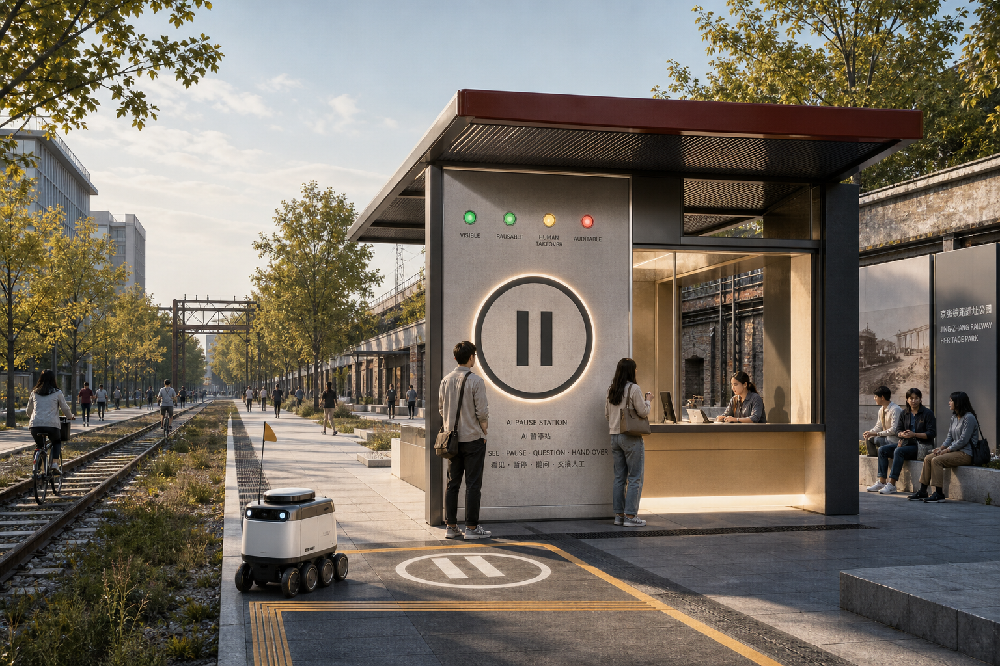
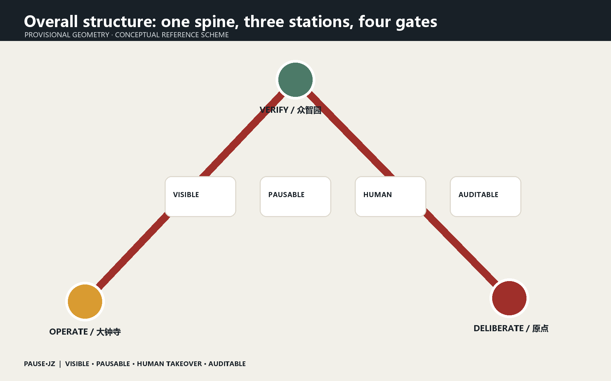
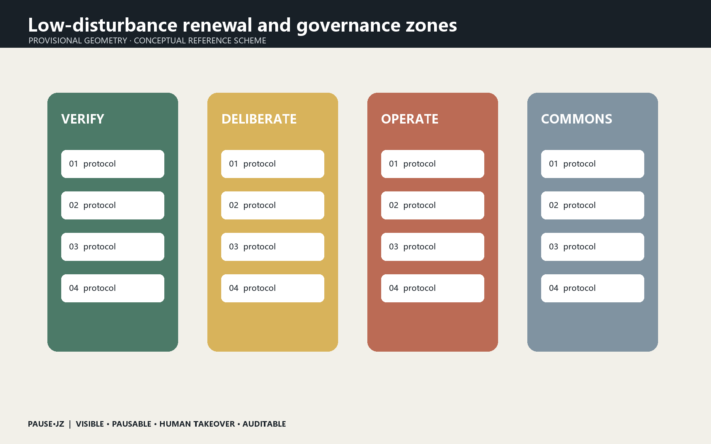
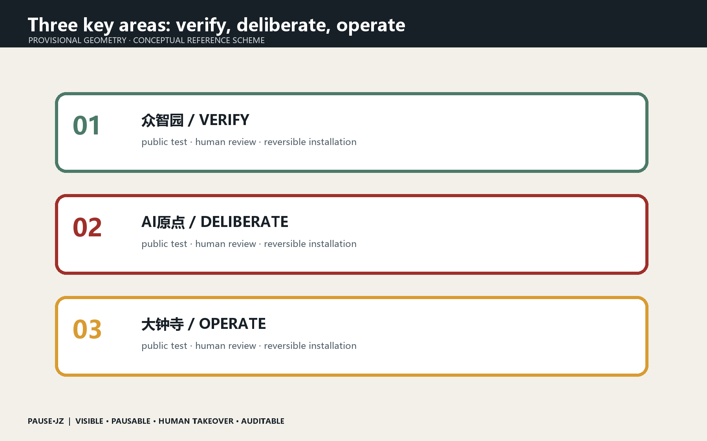
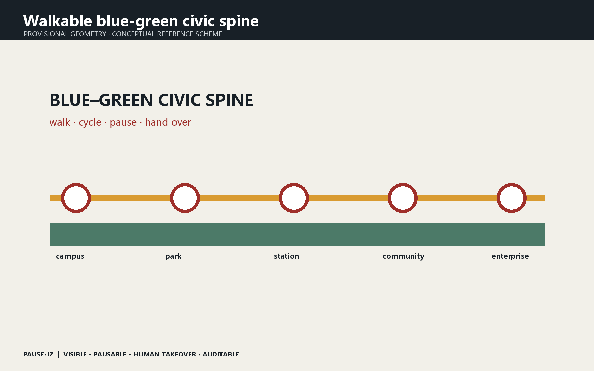
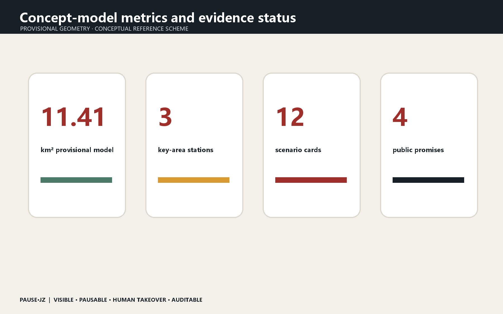

# PAUSE·JZ / The Pausable Jing-Zhang City

> Before AI enters the city, give everyone a pause button.

## Design Basis and Source List

The proposal relies on the official prequalification announcement, the public repository brief, the Agent taskbook and the source registry. It uses the maintainer-defined provisional geometry for the 11.4 km² overall design area and the three key areas. This geometry supports concept generation and review only; it is not an official red line, and every layer and metric must be recalculated when official polygons arrive. [source:OFFICIAL-ANNOUNCEMENT] [source:AGENT-TASKBOOK] [data:geometry/site_boundary.geojson#SITE-001]

## Three-Level Scope Framework

The 43.6 km² coordinated study scope addresses the innovation ecosystem; the overall design scope links industry, daily life and railway heritage through a civic-governance spine; the three key areas host verification, public deliberation and operation. PAUSE·JZ is not a new planning boundary but a public contract overlaid on service interfaces. [depth:three_level_scope_framework] [depth:overall_spatial_structure] [metric:key_area_count]

## Core Concept: A Pausable City

Urban AI should not merely operate invisibly. People must know when it acts, why it recommends, how to pause it and who takes over. Four promises define the system: VISIBLE, PAUSABLE, HUMAN TAKEOVER and AUDITABLE. Railway signals, platforms and dispatching become contemporary rules for release, speed restriction, stopping and review. The identity combines the pause mark with two rails; nodes use Place + Action names and events use Question + Public Test names. [source:AGENT-TASKBOOK] [standard:PROJECT-AGENT-OPEN-CALL-TASKBOOK]

## Coordinated Research Area: Industry and Future City Research

Seven precedents frame the research: the governance lessons of Sidewalk Labs, Helsinki's AI Register, Amsterdam's Algorithm Register, Barcelona's Decidim, Singapore AI Verify, regulatory sandboxes in the United Kingdom and MIT Senseable City Lab. The proposal translates registration, participation, testing, exit and review into spatial and operating rules. The ecosystem runs from university research to Zhongzhiyuan verification, Origin Community deliberation, Dazhongsi operation and public-corridor review. [source:SOURCE-REGISTRY] [depth:existing_conditions_diagnosis]

## Overall Design Area: Urban Renewal and Regulatory-Plan-Level Urban Design

The structure is one spine, three stations, twelve scenarios and four gates. Reversible, low-disturbance insertions reuse public space, ground-floor interfaces and temporary structures. No demolition, FAR or height conclusion is inferred from provisional geometry. [data:geometry/land_use.geojson#LU-001] [data:geometry/public_space.geojson#PUBLIC-001] [depth:land_use_layout]

## Detailed Design of Key Areas

Zhongzhiyuan becomes VERIFY station: red-team testing, robot safety envelopes and low-carbon compute demonstrations are examined before urban release. AI Origin Community becomes DELIBERATE station: university results undergo time-limited, opt-out public trials with an open-source hall and appeal desk. Dazhongsi becomes OPERATE station: agents, devices and content services disclose accountability, service levels and human takeover. All moves are conceptual recommendations for professional development. [data:geometry/key_areas.geojson#PROV-KEY-001] [data:geometry/key_areas.geojson#PROV-KEY-002] [data:geometry/key_areas.geojson#PROV-KEY-003]

## AI Innovation Ecosystem, Personas, and AI+ Scenarios

Five core personas are developers, startups, enterprise visitors, residents and university communities; older adults, caregivers, disabled users and frontline staff are stress-test personas. Twelve scenarios are a model safety garden, robot pause line, open-source launch hall, resident deliberation table, accessible AI guide, human takeover booth, AI walking signal, edge-compute stop, international demo room, data-consent counter, night safety companion and annual urban algorithm inspection. Each records an owner, data-minimization rule, human review, pause method and exit condition. [data:geometry/roads.geojson#ROAD-001] [metric:public_space_ratio] [source:AGENT-TASKBOOK]

## Land Use, Building Scale, and Retain-Renovate-Demolish Strategy

Three restrained pilgrimage landmarks are proposed: the First-Test Signal Tower at Qinghe records open models that pass public-safety verification; the Public Commit Station at Origin Community displays reproducible contributions; and the Human Takeover Bell at Dazhongsi marks moments when technology yields to human judgment. Railway mileage, signal colours and ticket-stamp language connect Zhan Tianyou's independent engineering, Zhongguancun openness and contemporary AI responsibility. [depth:urban_character] [standard:PROJECT-OFFICIAL-ANNOUNCEMENT]

## Transport, Rail, Municipal Infrastructure, and Public Services

Pause stations sit at transit interchange points, park crossings, campus gates and event peaks. Delivery robots and mobile services decelerate before an amber pause line and obey human direction. Blue-green space supports stormwater, shade, rest and low-risk tests without becoming an equipment showroom. Edge compute, power and communications remain replaceable modules pending utility, fire and energy confirmation. [data:geometry/green_space.geojson#GREEN-001] [data:geometry/roads.geojson#ROAD-001] [depth:traffic_rail_slow_parking]

## Blue-Green Network, Public Space, and Urban Character

Phase 1 (0–6 months) prototypes one mobile pause booth, three public tests and a co-authored Civic Contract for Urban AI. Phase 2 (6–18 months) builds one station in each key area with a shared algorithm register, incident report and takeover drill. Phase 3 (18–36 months) expands or removes elements based on evaluation. The annual PAUSE WEEK is a repair exercise rather than a one-way product launch. Metrics privilege takeover response, appeal closure, accessible task completion and voluntary exit over device counts. [data:geometry/phasing.geojson#PHASE-001] [depth:phasing_implementation]

## Renewal Projects, Implementation Policy, and Phasing

Known areas and ratios are recalculated from submitted GeoJSON but describe only this conceptual model. Official boundaries, regulatory controls, ownership, utilities, heritage constraints and surveys remain prerequisites. The hero image is a generated conceptual rendering, not site evidence. The proposal makes no promise of approval, public investment or construction; every spatial move is a reference scheme. [metric:site_area_sqm] [metric:green_ratio] [depth:risk_legal_copyright]

## Metrics, Area Recalculation, and Compliance Matrix

Land-use and building layers are evidence carriers for a conceptual reference scheme, not parcel-level decisions. Existing-building surveys, ownership, regulatory intensity, height, fire access and engineering feasibility remain pending. The proposal therefore prioritizes reversible ground-floor interfaces, temporary pavilions and public-space components; retain, renovate or remove decisions must be made by qualified teams after official surveys. [data:geometry/buildings.geojson#BLDG-001] [depth:retain_renovate_demolish]

## Risk, Copyright, and Compliance

The blue-green spine combines shade, stormwater, everyday rest, cycling and low-risk public testing. It protects the heritage park from becoming an equipment showroom: technology is concentrated at accountable stations, while most space remains legible and device-light. Public-space ratios come from provisional geometry and will be recalculated. [data:geometry/green_space.geojson#GREEN-001] [metric:green_ratio] [depth:urban_character]

## References

The structured compliance, standards and design-depth matrices remain the exhaustive audit layer. The narrative keeps evidence adjacent to claims and discloses every material gap. The generated hero, bilingual diagrams, offline HTML and PDFs are explanatory media; GeoJSON and metrics remain authoritative within the limits of provisional geometry. [source:AGENT-TASKBOOK] [metric:site_area_sqm] [depth:risk_legal_copyright]

## Closing

A century ago, railway safety relied on signals everyone could read. Urban AI now needs equally legible boundaries of responsibility. PAUSE·JZ defines progress not by maximum automation but by the city's ability to stop safely and return judgment to people.
