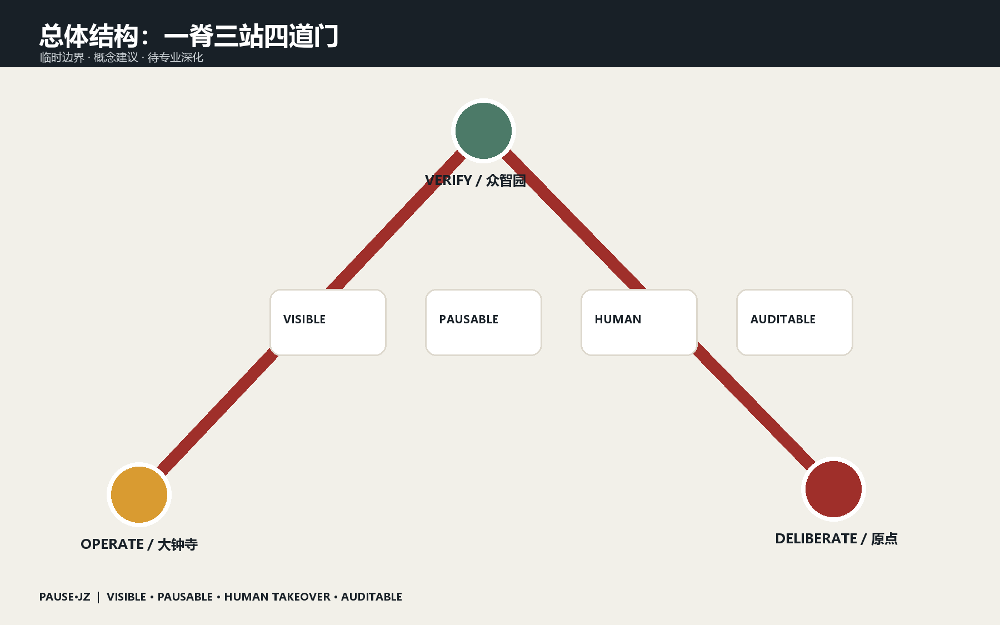
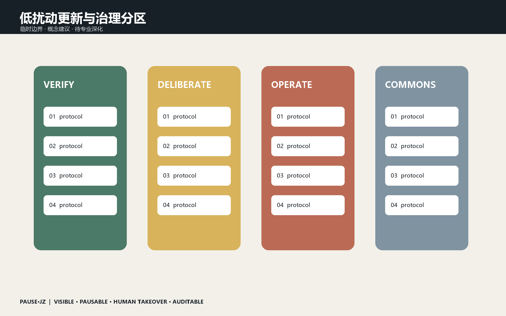
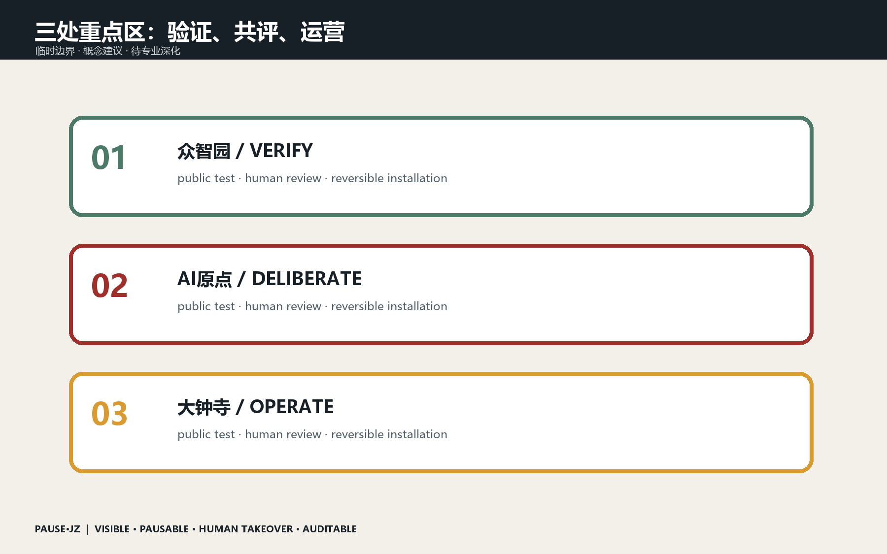
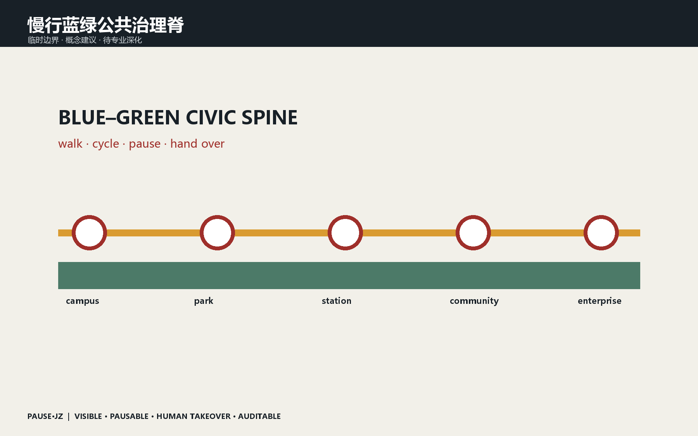
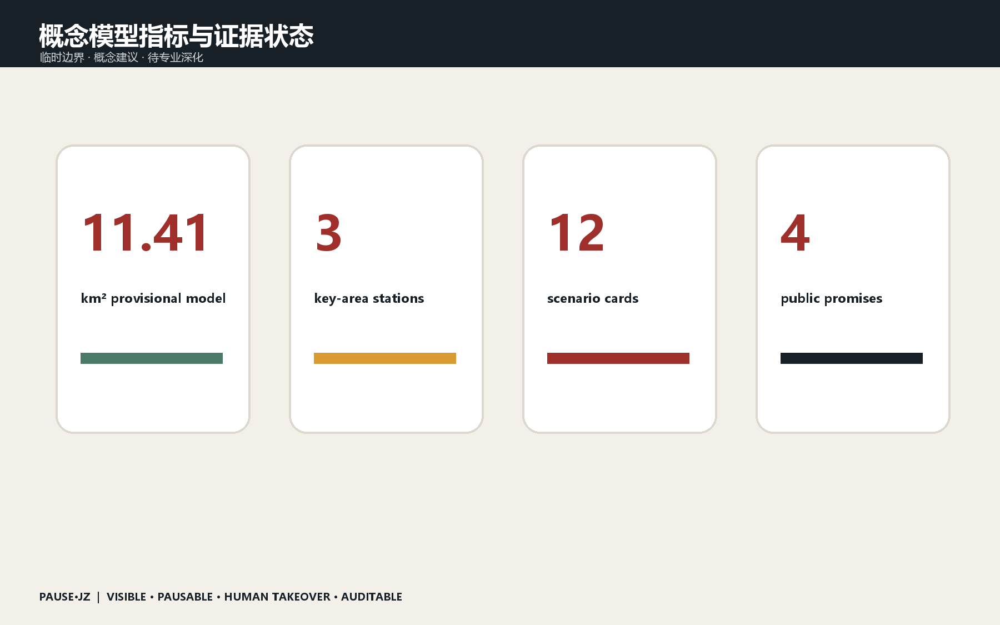

# 京张可暂停城市 / PAUSE·JZ

> 让AI进入城市之前，先给每个人一个暂停键。

## 设计依据与资料清单

本方案以北京市规划和自然资源委员会海淀分局资格预审公告、仓库公开任务书、Agent任务书与来源登记表为依据。场地采用组织方维护的临时粗略边界：总体设计范围约11.4平方公里，三处重点区域为众智园、北京AI原点社区和大钟寺。边界仅支持概念生成、讨论与自检，不是官方红线；正式数据到位后，全部图层和指标应整体复算。[source:OFFICIAL-ANNOUNCEMENT] [source:AGENT-TASKBOOK] [data:geometry/site_boundary.geojson#SITE-001]

资料使用遵循最小必要原则：官方公告确定任务和范围，仓库任务书确定Agent必答项，临时几何只约束本次概念模型。每条外部案例必须记录发布者、链接、检索日期、用途和限制；新闻图、商业地图截图、生成画面和文字四至均不作为精确边界或规划控制依据。正式深化前还需补齐官方红线、现状调查、权属、控规、市政、消防、文保和交通数据。

## 三层范围工作框架

统筹研究范围回答43.6平方公里创新生态如何协同；总体设计范围用一条公共治理脊串联产业、生活和遗址空间；三处重点区分别承担验证、共评与运营。PAUSE·JZ不是新增规划红线，而是一套叠加在城市服务界面上的公共契约。[depth:three_level_scope_framework] [depth:overall_spatial_structure] [metric:key_area_count]

三层范围之间设置明确的反馈关系：重点区试验产生的安全事件、申诉和运营数据，经过去标识化汇总后回到总体设计范围；总体范围的慢行、蓝绿和服务承载评估再反馈统筹研究。每次扩大场景都必须重新回答公共利益、责任人、暂停方式和退出成本，避免从一个成功样板直接推导整片城区适用。

## 统筹研究范围产业与未来城市研究

城市AI不应只追求无感运行，更应让人知道它何时工作、为什么作出建议、怎样暂停以及由谁接管。方案提出四项公共承诺：VISIBLE可见、PAUSABLE可暂停、HUMAN TAKEOVER可人工接管、AUDITABLE可审计。铁路的信号、站台与调度传统被转译为AI时代的放行、限速、停车和复盘机制。主标识以暂停符号与两条铁轨构成；中文主名为“京张可暂停城市”，英文名为“PAUSE·JZ”，节点命名遵循“地点+动作”，活动命名遵循“问题+公开验证”。[source:AGENT-TASKBOOK] [standard:PROJECT-AGENT-OPEN-CALL-TASKBOOK]

七个国际案例只作为方法背景：Helsinki与Amsterdam提示登记透明，Barcelona提示公众参与，Singapore AI Verify与英国沙盒提示测试和责任，Sidewalk Labs提示退出与数据治理的重要性，MIT Senseable City Lab提示城市感知需要公共解释。海淀的转译不是复制平台，而是建立高校策源、园区验证、社区共评、企业运营和公众复盘的空间链。

## 总体设计范围城市更新与控规深度城市设计

案例研究选择Sidewalk Labs数字治理教训、Helsinki AI Register、Amsterdam算法登记册、Barcelona Decidim、Singapore AI Verify、英国监管沙盒与MIT Senseable City Lab。借鉴重点不是复制技术，而是把登记、参与、测试、退出和复核转换为空间与运营规则。创新生态形成“高校策源—众智园验证—原点共评—大钟寺运营—公共走廊复盘”的闭环；土地、人才、算力、数据、资金和场景都须经过来源、授权、责任人和退出条件四道门。[source:SOURCE-REGISTRY] [depth:existing_conditions_diagnosis]

城市更新坚持低扰动、可逆和先运营后建设。公共暂停亭、接管窗口、地面暂停线和算法信息牌优先放入既有首层、广场、轨道接驳点和公园入口；只有通过使用评估、无障碍评估、消防与交通审查后，才进入长期建设研究。用地、建筑和道路图层表达设计关系，不给出法定用地调整、拆除、容积率和高度结论。

## 重点区域详细设计

空间结构概括为“一脊、三站、十二场、四道门”。一脊是京张遗址公园公共治理脊；三站是三处重点区；十二场是日常可体验的AI场景；四道门对应可见、可暂停、人工接管、可审计。更新采用低扰动和可逆植入：优先利用既有公共空间、首层界面和临时设施，不依据临时边界提出拆除、容积率或高度结论。[data:geometry/land_use.geojson#LU-001] [data:geometry/public_space.geojson#PUBLIC-001] [depth:land_use_layout]

众智园验证站以清河安全花园和模型首检信号塔为核心；原点共评站以高校成果公开提交站、居民共评桌和申诉窗口为核心；大钟寺运营站以人工接管钟、数据授权柜台和国际路演客厅为核心。三个样板均设置无技术替代路径：关闭AI后，基本通行、咨询、支付和公共服务仍可由人完成。

## AI 创新生态、人才画像与 AI+ 场景

众智园设置“验证站”：模型红队测试、机器人安全边界和绿色算力展示在进入城市前公开验证；清河界面形成可预约的安全测试花园。AI原点社区设置“共评站”：高校成果在近校街区进行限时、可退出的公众共评，配套开源发布厅、无障碍体验台和申诉窗口。大钟寺设置“运营站”：智能体、终端和内容服务必须公开责任主体、服务等级和人工接管通道，站城四象限以慢行和可达性为先。三处动作均为供专业团队深化的概念建议。[data:geometry/key_areas.geojson#PROV-KEY-001] [data:geometry/key_areas.geojson#PROV-KEY-002] [data:geometry/key_areas.geojson#PROV-KEY-003]

十二张场景卡共享同一登记格式：服务对象、空间载体、输入数据、最小化方式、模型版本、责任主体、人工复核、实体暂停、线上暂停、自动熔断、申诉路径、退出条件和评估周期。五类核心画像之外，老年人、儿童照护者、残障使用者和一线服务人员作为压力测试对象，防止平均用户假设掩盖真实障碍。

## 用地、建筑规模与拆改留方案

五类核心用户为开发者、初创团队、企业访客、周边居民和高校师生；补充老年人、儿童照护者、残障使用者与一线服务人员作为压力测试画像。十二个场景为：模型安全花园、机器人暂停线、开源发布厅、居民共评桌、无障碍AI导览、人工接管亭、AI慢行信号、端侧算力驿站、国际路演客厅、数据授权柜台、夜间安全陪伴和城市算法年检。前三项为产业测试验证场景；每项均记录责任人、数据最小化、人工复核、暂停方式和退出条件。[data:geometry/roads.geojson#ROAD-001] [metric:public_space_ratio] [source:AGENT-TASKBOOK]

拆改留判断明确留给具备资质的专业团队。本方案只提出组件级策略：保留可用建筑和遗产界面，改造可开放首层，利用可移动亭棚补充服务，待正式调查确认后再研究新建。现有脚手架建筑基底仅用于验证文件结构，不能被解释为完整现状普查或指定地块结论；高度、强度、退线和消防均标记待确认。

## 交通、轨道、市政与公共服务设施

提出三个克制而可实施的AI朝圣地标：清河“首检信号塔”记录通过公共安全验证的开源模型；原点“公开提交站”展示可复现贡献而非商业排名；大钟寺“人工接管钟”每次敲响代表技术主动让位于人的判断。沿线采用铁路里程、信号色和检票章语言，连接詹天佑自主建造精神、中关村开放创新和AI公共责任。荣誉墙只记录经验证的贡献、版本与撤回记录，不制造永久不变的英雄榜。[depth:urban_character] [standard:PROJECT-OFFICIAL-ANNOUNCEMENT]

慢行优先级高于自动设备效率。配送机器人、巡检设备和移动服务设施在黄色暂停线前必须降速并让行；轨道站、校园门、公园跨路断点和活动高峰区提供人工调度位置。端侧算力、能源、通信和数据柜采用模块化配置，容量需在供电、散热、排水、消防、网络安全和运维责任确认后深化。

## 蓝绿空间、公共空间与城市风貌

慢行系统把暂停站布置在轨道接驳、园区入口、跨路断点和活动高峰节点；机器配送和移动服务在黄色暂停线前主动降速并服从人工指挥。蓝绿空间承担雨洪、遮荫、休憩和低风险测试，不把公园变成设备展厅。端侧算力、供电、通信和数据设施采用可替换模块，位置和容量须待市政、消防与能耗资料确认。[data:geometry/green_space.geojson#GREEN-001] [data:geometry/roads.geojson#ROAD-001] [depth:traffic_rail_slow_parking]

蓝绿空间承担遮荫、雨洪、休憩、生物多样性和低风险测试，不成为设备陈列场。大部分公园保持无屏幕、低感知和可自由退出，技术集中在少数责任清晰的站点。铁路遗产通过轨道、信号、里程和调度语言延续；三个地标记录验证、贡献和人工接管，而不是夸大技术或制造网红奇观。

## 更新项目清单、实施政策与分期计划

第一阶段0—6个月完成一处移动暂停亭、三项公开测试和《城市AI公共契约》共创；第二阶段6—18个月在三处重点区各建一个样板站，建立统一算法登记、事件报告和人工接管演练；第三阶段18—36个月再依据评估决定扩展或撤除。年度“PAUSE WEEK”不办单向发布会，而让企业、居民和专业人员共同暂停、检查和修复真实场景。运营指标关注暂停响应时间、人工接管成功率、申诉闭环率、无障碍任务完成率与主动退出率，不以设备数量作为成功标准。[data:geometry/phasing.geojson#PHASE-001] [depth:phasing_implementation]

项目包分为移动原型、三站样板和评估后扩展三个阶段。每阶段设退出门：若暂停响应、申诉闭环、无障碍完成或公众信任未达到预设条件，系统应缩小、修复或撤除。政策建议包括统一算法登记、事件分级报告、人工接管演练和公共采购退出条款；年度PAUSE WEEK以公开检查和修复替代单向发布。

## 指标体系、面积复算与合规矩阵

所有已知面积与比例均由提交GeoJSON复算；由于采用临时边界，它们只描述本次概念模型，不构成法定指标。缺失的官方红线、控规、权属、市政、文保和现状调查必须在深化前补齐。生成主视觉是概念效果图，不是现场照片；由OpenAI图像生成工具制作，无第三方商标或人物身份。方案不承诺政府投资、审批或建设，所有空间落地均为参考方案。[metric:site_area_sqm] [metric:green_ratio] [depth:risk_legal_copyright]

指标分为空间模型指标和运营评估指标。前者由GeoJSON在EPSG:4548下复算，但受临时边界限制；后者包括人工接管响应时间、成功率、申诉闭环率、无障碍任务完成率、主动退出率和事件复发率，首轮均不编造基线值。完整任务覆盖、标准覆盖和设计深度分别由三个矩阵审计，正文仅保留与判断直接相邻的证据锚点。

## 风险、版权与合规说明

所有已知面积与比例均由提交GeoJSON复算；由于采用临时边界，它们只描述本次概念模型，不构成法定指标。缺失的官方红线、控规、权属、市政、文保和现状调查必须在深化前补齐。生成主视觉是概念效果图，不是现场照片；由OpenAI图像生成工具制作，无第三方商标或人物身份。方案不承诺政府投资、审批或建设，所有空间落地均为参考方案。[metric:site_area_sqm] [metric:green_ratio] [depth:risk_legal_copyright]

方案不声称获得政府背书、审批、投资或确定实施。生成效果图只表达设计意图，不是现场照片；所有人物为非特定生成形象，不用于身份判断。提案采用COMMUNITY-DISPLAY-ONLY以适配项目展示，第三方资料仍遵循各自许可。涉及公共数据时坚持目的限定、最少采集、保存期限、访问控制和可申诉，涉及安全与权益的决定必须人工复核。

## 参考资料

所有已知面积与比例均由提交GeoJSON复算；由于采用临时边界，它们只描述本次概念模型，不构成法定指标。缺失的官方红线、控规、权属、市政、文保和现状调查必须在深化前补齐。生成主视觉是概念效果图，不是现场照片；由OpenAI图像生成工具制作，无第三方商标或人物身份。方案不承诺政府投资、审批或建设，所有空间落地均为参考方案。[metric:site_area_sqm] [metric:green_ratio] [depth:risk_legal_copyright]

主要依据包括北京市规自委海淀分局资格预审公告、仓库public brief、agent_taskbook、source_registry、专业标准本地快照和provisional boundary basis。案例名称用于公开方法比较，不替代原始资料核查。所有资料路径、用途与限制登记在sources.json；所有待补条件登记在assumptions.json；后续更新应写入changelog并重新渲染、刷新manifest和完成四门自检。

## 结语

百年前，铁路安全依靠人人看得懂的信号；今天，城市AI也需要人人看得见的责任边界。PAUSE·JZ不以更炫的自动化取胜，而以城市在必要时能够稳稳停下、交还给人来定义进步。
