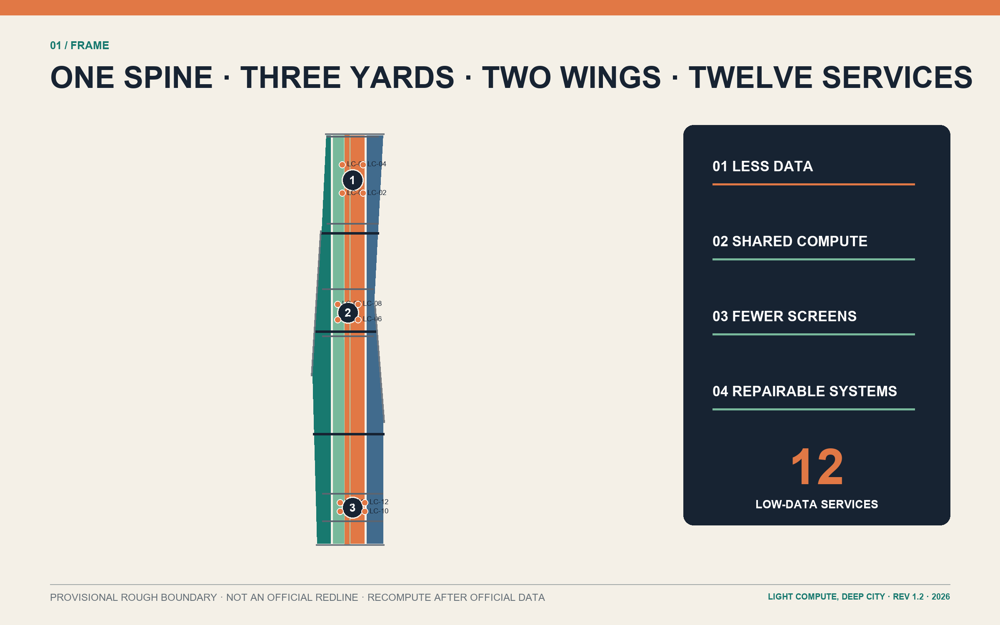
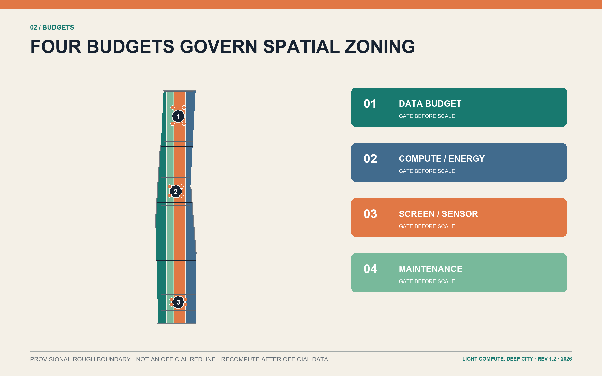
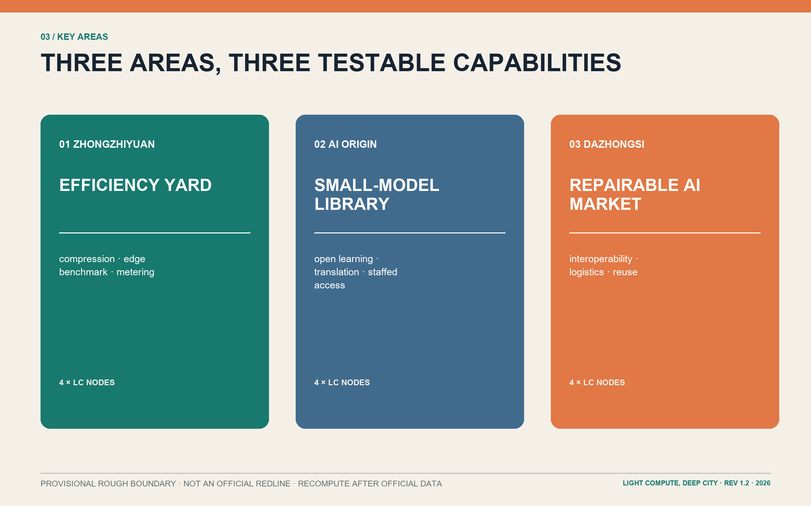
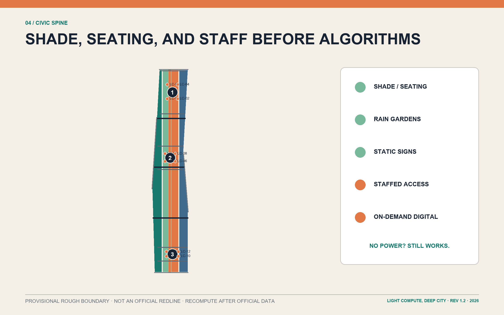
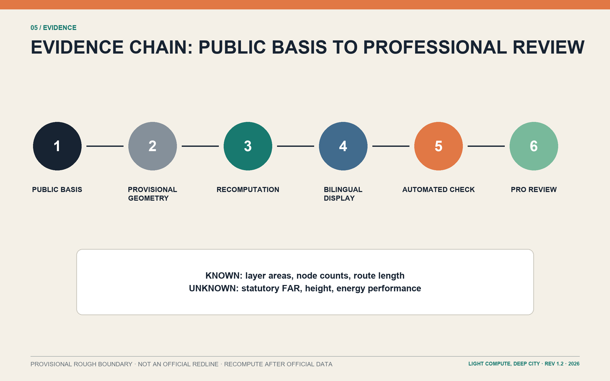

# LIGHT COMPUTE, DEEP CITY / 轻算京张

## Design Basis and Source List

This formal package is **REV 1.2**. LIGHT COMPUTE, DEEP CITY is a public-value constraint before it is a technology image. The official announcement establishes an approximately 43.6 km² coordinated research area, an approximately 11.4 km² overall design area, and three key areas totalling approximately 368.4 ha. The repository site package turns these requirements into auditable layers, matrices, metrics, and deliverables [source:OFFICIAL-ANNOUNCEMENT] [source:AGENT-TASKBOOK]. UNESCO's lifecycle, proportionality, oversight, literacy, and environmental principles, together with the IEA's account of AI-energy relationships, support the rule “prove public benefit before adding computational burden”; neither source is treated as a planning control [source:UNESCO-AI-ETHICS] [source:IEA-ENERGY-AI-2025].

Official overall and key-area polygons, statutory controls, road redlines, parcels, ownership, existing-building surveys, heritage controls, utilities, fire and flood records are absent. The submitted boundary files therefore state `provisional_constraint`, `official_boundary=false`, and `boundary_precision=provisional_rough`. Their dashed lines are not official redlines and their areas are not survey results [data:geometry/site_boundary.geojson#SITE-001] [data:geometry/key_areas.geojson#PROV-KEY-001]. Every downstream metric must be recalculated when official polygons become available.

## Three-Level Scope Framework

The coordinated research area asks how Haidian can export lightweight, trustworthy, transferable urban-AI capability. The overall design area asks how the heritage-park surroundings can share rather than duplicate compute and service infrastructure. The three key areas ask how scenarios land in buildings, streets, public space, and operating rules. One light-infrastructure civic spine, three specialist yards, two feedback wings, and twelve low-data service nodes link the three levels [standard:PROJECT-OFFICIAL-ANNOUNCEMENT] [depth:three_level_scope_framework].

The spine combines walking, cycling, shade, rainwater, and static interpretation. The yards address model efficiency, public learning, and device repair. The two wings connect universities and communities with firms and stations through a common toolchain and real-world feedback. Geometry and counts are traceable to one dataset and must all regenerate after an official-boundary update [metric:key_area_count] [data:geometry/roads.geojson#ROAD-001].

## Coordinated Research Area: Industry and Future City Research

The industrial proposition is not “more compute landmarks” but an exportable frugal-AI capability chain. Universities develop compression, edge inference, safety, and evaluation methods; shared workshops make them usable by small teams; three yards validate public and industry scenarios; maintenance, training, and retirement turn results into reusable civic capacity. Five functions—lightweight R&D, shared testing, public learning, industry adoption, and international exchange—form an R&D-to-transfer-to-feedback loop across the required three zones and two wings [source:AGENT-TASKBOOK] [source:OECD-AI-PRINCIPLES].

Six cases contribute mechanisms only: Station F combines adaptive reuse with programme operations; one-north mixes research, enterprise, and daily life; MaRS supplies commercialisation services; Knowledge Quarter demonstrates network governance; Seoul DMC links industrial clustering and public experience; Cornell Tech combines an open campus with cross-sector partnership. No case metric is imported into Jing-Zhang [source:CASE-STATION-F] [source:CASE-ONE-NORTH] [source:CASE-CORNELL-TECH]. The identity combines twin railway lines, a partially filled compute gauge, and removable sleeper modules; `LC-01—LC-12` links spatial nodes, scenarios, and maintenance records.

An annual cycle is proposed, not promised: a Spring Small-Model Open Week, Summer Screen-Light Public Service Night, Autumn Repair Festival, and Winter Civic AI Ledger. Each publishes service coverage, human takeover, device energy, and removal records [depth:ai_ecosystem_and_operations].

## Overall Design Area: Urban Renewal and Regulatory-Plan-Level Urban Design

The spatial structure is a north-south civic spine with three transverse walking, cycling, and station links. Four conceptual land-use zones—research `0802`, park green `1401`, commercial service `05`, and community service `0702`—cover the provisional study boundary without overlap. They express functional relationships, not statutory land use or development rights [data:geometry/land_use.geojson#LU-001] [depth:land_use_layout]. The strategy prioritises adaptable existing space, small shared facilities, bookable edge compute, lending libraries, and ordinary public space over duplicate server rooms and always-on screens.

Twelve conceptual building footprints carry survey hypotheses rather than approved projects. FAR, height, setbacks, fire access, heritage views, and structural safety remain unknown until official controls and field surveys exist [data:geometry/buildings.geojson#BLDG-001] [metric:floor_area_ratio]. Every action passes four gates: data budget, compute/energy budget, screen/sensor budget, and maintenance budget; the applicant must first explain why a simpler method is insufficient.

Mobility geometry expresses connections rather than official road alignments. Public-space and green metrics are calculated from the same geometry for later professional recalculation [data:geometry/green_space.geojson#GREEN-001] [metric:green_ratio].

## Detailed Design of Key Areas

Zhongzhiyuan becomes the Efficiency Yard: a model-compression lab, shared edge workshop, and resource meter enclose an accessible test courtyard. The task is to compare rules, conventional software, small models, and large models for the same service. The shared edge-model benchmark advances only if combined performance, energy, privacy, and maintainability beat a non-AI baseline [data:geometry/key_areas.geojson#PROV-KEY-001] [metric:industry_validation_scenario_count].

AI Origin becomes the Small-Model Library: near-campus innovation, open collaboration, transfer services, and talent support use a bookable learning lounge, translation room, static knowledge wall, and lending devices. Small and local models are preferred. Residents who decline accounts, personal-data submission, or smartphones retain equivalent staffed and paper routes [data:geometry/key_areas.geojson#PROV-KEY-002] [depth:three_key_area_detailed_design].

Dazhongsi becomes the Repairable AI Market: repair desks, a device-interoperability hall, a low-speed logistics court, and a reuse station test the full procurement-to-retirement chain. The logistics sandbox and interoperability/energy testbench are the other industry-validation scenarios; unsupported, unsafe, or unmaintainable devices should be removed [data:geometry/key_areas.geojson#PROV-KEY-003]. Three pilgrimage landmarks—the Compute Meter Pavilion, Small-Model Library, and Repairable Device Hall—celebrate inspectable methods and public institutions, not closed brands.

## AI Innovation Ecosystem, Personas, and AI+ Scenarios

Six personas set service boundaries: a privacy-sensitive resident needs anonymous and staffed routes; a visually impaired commuter needs tactile and audible guidance; a developer needs reproducible tests; a startup needs shared testing rather than a private server room; a maintainer needs replaceable parts and clear records; an international visitor needs multilingual access without mandatory registration. Each can refuse, correct, or request human takeover [standard:PROJECT-AGENT-OPEN-CALL-TASKBOOK] [source:UNESCO-AI-ETHICS].

Twelve conceptual scenarios are LC-01 offline heritage interpretation, LC-02 local-first accessible wayfinding, LC-03 shade/rest guidance, LC-04 healthcare service navigation without diagnosis, LC-05 public legal-service navigation without professional substitution, LC-06 multilingual arrival concierge, LC-07 campus-to-enterprise IP navigator, LC-08 shared edge-model benchmark, LC-09 low-speed robot logistics sandbox, LC-10 device interoperability and energy testbench, LC-11 public-space maintenance triage, and LC-12 device repair/reuse routing [data:geometry/public_space.geojson#PUBLIC-001] [metric:scenario_count]. LC-08—10 are industry-validation scenarios; all others also compare against static signs, ordinary search, staffed desks, or conventional software.

Each scenario card must record user, public problem, minimum AI test, minimum data, human review, non-digital fallback, maintainer, stop condition, and deletion schedule. No service is claimed as deployed or energy-saving; `energy_savings_percent` stays unknown until independent baselines and operating records exist [metric:energy_savings_percent] [depth:ai_scenarios_and_personas].

## Land Use, Building Scale, and Retain-Renovate-Demolish Strategy

Land-use codes follow the repository's national-classification subset, but every zone is a proposal under provisional geometry. Research space supports shared testing and small teams; park green space carries heritage, walking, rainwater, and static interpretation; commercial-service space hosts repair, lending, and enterprise services; community-service space protects daily life, care, and staffed routes [standard:MNR-LAND-USE-CLASSIFICATION] [data:geometry/land_use.geojson#LU-002].

Twelve footprints use `retain_renovate_demolish` to mark five renovation-first and seven new-infill hypotheses. No demolition is proposed without building safety, ownership, lease, and heritage surveys. Any later demolition decision needs professional review and stakeholder consultation [data:geometry/buildings.geojson#BLDG-005] [metric:building_footprint_area_sqm]. The three landmarks use reversible assemblies and ordinary parts, avoiding disposable media walls and proprietary maintenance lock-in.

“Low spine, loose courtyards, removable nodes” guides character but is not a statutory height rule. Any new floor area must declare sharing rate, opening hours, operator, and five-year maintenance budget; if adaptation or sharing can meet the need, new construction does not advance [depth:retain_renovate_demolish].

## Transport, Rail, Municipal Infrastructure, and Public Services

Mobility first repairs walking, cycling, and accessible gaps between stations, parks, campuses, and communities. The civic spine is a continuous slow route; three transverse links serve southern cycling, central walking, and northern station access. They remain conceptual until checked against official redlines, interfaces, passenger surveys, and fire access [data:geometry/roads.geojson#ROAD-002] [metric:proposed_slow_mobility_length_m].

Municipal infrastructure is shared, metered, and switchable. Bookable edge cabinets first use existing capacity; sensors require a maintainer and data-minimisation case; offline cache, static signs, and staffed desks preserve service during power, network, or model outages. Drainage, power, telecoms, sanitation, fire, and underground-space proposals are interface briefs without invented capacities or alignments [depth:municipal_new_infrastructure] [source:SITE-PACKAGE].

Digital access is embedded in libraries, community centres, repair points, and station desks. Wayfinding includes tactile, audio, and human assistance. Healthcare and legal tools route information only and do not diagnose or replace licensed judgement.

## Blue-Green Network, Public Space, and Urban Character

The heritage civic spine follows “shade and seating before algorithms”: continuous shade, permeable paving, rain gardens, drinking points, quiet rest, accessible crossings, and static distance markers form the base layer. Aggregated short-retention sensing is added only if it measurably improves safety or waiting [data:geometry/green_space.geojson#GREEN-001] [metric:green_space_area_sqm].

Twelve public nodes do not mean twelve screens. Every node retains a no-power version: paper map, tactile model, staff member, ordinary sign, or telephone booking. Digital information is on-demand through personal devices where possible; public interfaces use e-ink, low brightness, or temporary event equipment [data:geometry/public_space.geojson#PUBLIC-012] [metric:public_space_ratio]. A shared `LC` code and replaceable signs provide identity without reproducing corporate branding.

## Renewal Projects, Implementation Policy, and Phasing

Eight projects are proposed: R1 spine shade and accessibility links; R2 Compute Meter Pavilion; R3 shared edge workshop; R4 Small-Model Library; R5 screen-light learning lounge; R6 Repairable AI Market; R7 three industry-validation sandboxes; and R8 civic AI ledger and annual programme. R1—R3 form basic services, R4—R7 follow public evaluation, and R8 plus cross-area replication form the third stage [data:geometry/phasing.geojson#PHASE-001] [metric:renewal_project_count].

Four-budget ledgers and sunset clauses guide implementation. Before a pilot starts, it records data fields, compute location, expected energy, screen/sensor count, spares, and responsible owner. Public benefit, access, privacy, energy, and maintenance are reviewed together. A service downgrades or stops if it cannot beat a non-AI baseline, creates unresolved complaints, lacks a maintainer, or loses critical support [depth:phasing_implementation].

Phases are project organisation, not government investment timing or statutory development arrangements. Each requires official geometry, professional engineering and heritage review, public participation, and a viable funding mechanism.

## Metrics, Area Recalculation, and Compliance Matrix

All geometry uses EPSG:4326; area and length are recalculated in EPSG:4548. `site_area_sqm` is computed from the provisional polygon, while the announcement's approximately 11.4 km² is stored separately as `official_announced_overall_design_area_sqm`; they are not interchangeable [metric:site_area_sqm] [metric:official_announced_overall_design_area_sqm]. Footprint, green, public-space, and slow-mobility values all come from submitted layers.

FAR, height, and energy savings remain unknown because there is no basis for precise claims. Each known metric records status, value, unit, source files, formula, confidence, and assumptions for regeneration after official data arrives [metric:building_height_limit_m] [depth:metrics_recalculation].

`compliance_matrix.json` maps announcement tasks 1.3—1.5 and agent.1—agent.6; `standard_matrix.json` separates official standards from conceptual references; `design_depth_matrix.json` tracks spatial structure, land use, transport, infrastructure, character, key areas, scenarios, implementation, and risk. Figures, tables, HTML, and PDFs share one data source [standard:MOHURD-CONTROL-DETAILED-PLANNING].

## Risk, Copyright, and Compliance

The main spatial risk is mistaking provisional geometry for a redline; the main technology risk is scaling AI faster than public-benefit evidence; the main implementation risk is long-lived burdens from proprietary devices, duplicate server rooms, and unmaintained screens. Dashed boundaries, unknown metrics, non-AI baselines, human takeover, repairable parts, and sunset clauses address them [depth:risk_missing_data] [source:SOURCE-REGISTRY].

The package claims no statutory approval, planning control, government investment, deployed service, energy performance, or corporate commitment. Sites, roads, buildings, and projects require official data, professional review, and participation. Text and visual organisation are original to this proposal; cases are mechanism references only. Copyright and display terms are in `report/copyright_statement.md`.

Self-checks and file hashes establish package consistency only; they do not replace planning, architecture, transport, municipal, heritage, data-protection, or accessibility review [standard:MOHURD-URBAN-DESIGN-MEASURES].

## References

Formal bases are the official announcement, project site package, agent taskbook, national urban-design and regulatory-planning documents, and national land-use classification guidance. Concept and governance sources are UNESCO's AI ethics recommendation, the IEA's Energy and AI report, and OECD AI principles. Mechanism cases use official pages for Station F, JTC one-north, MaRS, Knowledge Quarter, Seoul DMC, and Cornell Tech [source:PROCESSED-FACT-PACK] [source:CASE-MARS] [source:CASE-KNOWLEDGE-QUARTER].

Complete URLs, access dates, uses, and limitations are in `sources.json`. Before statutory or engineering use, the package needs official overall and key-area boundaries, controls, road and rail interfaces, parcel ownership and building surveys, heritage controls, utilities, fire, flood, and public-service baselines [source:KEY-AREA-SOURCE] [source:BOUNDARY-SOURCE].
