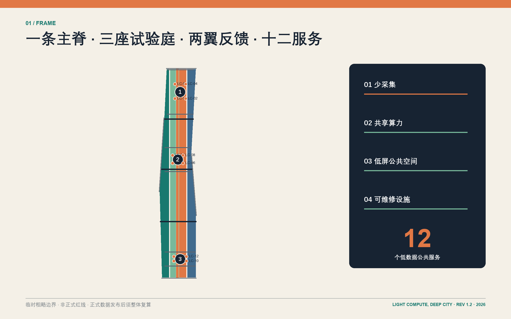
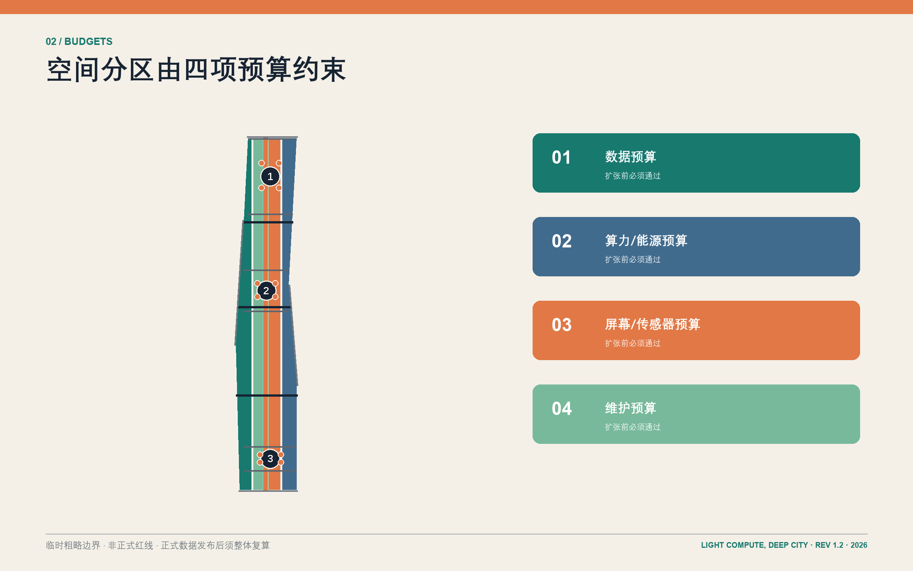
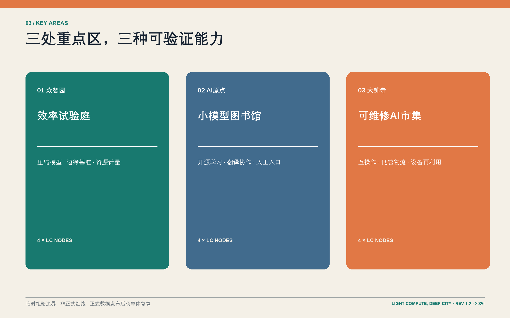
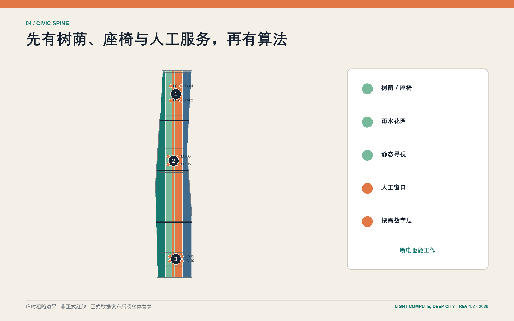
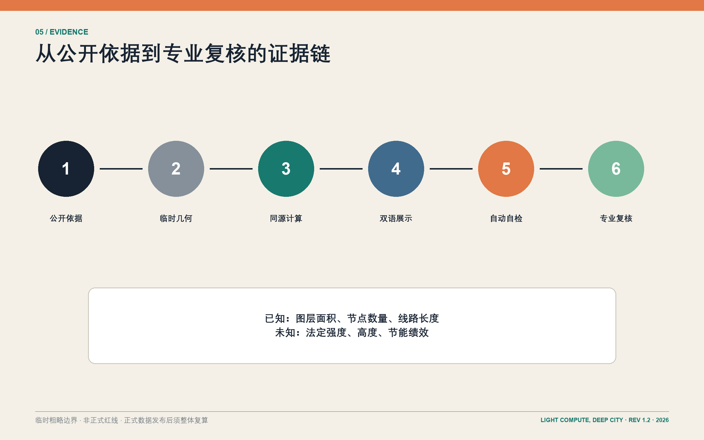

# 轻算京张：少算一点，城市更深 / LIGHT COMPUTE, DEEP CITY

## 设计依据与资料清单

本次正式包为 **REV 1.2**。“轻算京张”首先是一套公共价值约束，其次才是技术形象。官方公告给出约 43.6 平方公里统筹研究范围、约 11.4 平方公里总体设计范围和约 368.4 公顷三处重点区域；本包用 `brief/site-package/` 的结构化任务书、枚举、标准和资料登记表把这些要求转成可审查成果 [source:OFFICIAL-ANNOUNCEMENT] [source:AGENT-TASKBOOK]。UNESCO 关于 AI 全生命周期环境影响、比例原则、监督和公众素养的要求，以及 IEA 对 AI 与能源关系的讨论，支持“先证明公共收益，再增加计算负担”的治理逻辑，但不构成规划控制条件 [source:UNESCO-AI-ETHICS] [source:IEA-ENERGY-AI-2025]。

当前没有正式总边界、三处重点区 polygon、控规指标、道路红线、地块权属、完整现状建筑、文保、市政和洪涝资料。因此 `geometry/site_boundary.geojson` 与 `geometry/key_areas.geojson` 明确标注 `provisional_constraint`、`official_boundary=false` 和 `boundary_precision=provisional_rough`；图中虚线不是法定红线，面积也不是测绘成果 [data:geometry/site_boundary.geojson#SITE-001] [data:geometry/key_areas.geojson#PROV-KEY-001]。假设与影响逐条登记在 `assumptions.json`，正式数据到位后须整体重算。

## 三层范围工作框架

统筹研究范围回答“海淀如何输出轻量、可信、可迁移的 AI 城市能力”；总体设计范围回答“遗址公园周边如何共享而非重复建设算力与服务”；三处重点区域回答“场景如何落到建筑、街道、公共空间和运营制度”。三层以“一条轻基础设施公共主脊、三座专业试验庭、两翼反馈网络、十二个低数据服务节点”联动，而不是把三幅图并列陈列 [standard:PROJECT-OFFICIAL-ANNOUNCEMENT] [depth:three_level_scope_framework]。

主脊沿百年京张文化意象组织连续步行、骑行、遮阴、雨水和静态导视；三座试验庭分别承担模型效率、公共学习、终端维修；两翼把高校/社区与企业/站点接入共同工具链和真实反馈。范围几何与数量可从同一组图层复核，正式边界替换后所有下游图、指标和 PDF 必须重新生成 [metric:key_area_count] [data:geometry/roads.geojson#ROAD-001]。

## 统筹研究范围产业与未来城市研究

产业定位不是追求“更多算力地标”，而是建立可输出的轻量 AI 能力链：高校与研究机构提出压缩、边缘推理、安全与评测方法；共享工坊把方法变成小团队可调用的工具；三处试验庭用公共服务和产业场景验证；维护、培训和退役机制把结果沉淀为可复用的城市能力。五项功能为“轻量研发、共享试验、公共学习、产业采用、国际交流”，并以任务书的“三园两翼”形成研发—转化—反馈闭环 [source:AGENT-TASKBOOK] [source:OECD-AI-PRINCIPLES]。

六个国际案例只提取机制：Station F 的存量空间与项目运营结合、one-north 的研究企业生活混合、MaRS 的转化服务、London Knowledge Quarter 的联盟治理、Seoul DMC 的产业与公众体验、Cornell Tech 的开放校园与跨界合作。任何案例面积、投资或绩效数字均未移植到京张 [source:CASE-STATION-F] [source:CASE-ONE-NORTH] [source:CASE-CORNELL-TECH]。品牌图形由两条铁路平行线、一个未填满的算力表盘和可拆卸“枕木”模块组成；编号系统 `LC-01—LC-12` 让场景、空间和运维台账一致。

年度运营建议形成四个低负担事件：春季“小模型开源周”、夏季“无屏公共服务夜”、秋季“设备维修节”、冬季“城市 AI 账本发布”。它们是概念性运营建议，不是政府既定活动；每次活动都公开服务覆盖、人工接管、设备能耗与移除清单，以形成可复核的全球交流语言 [depth:ai_ecosystem_and_operations]。

## 总体设计范围城市更新与控规深度城市设计

总体结构是一条南北公共主脊加三条横向慢行/轨道接驳线。用地以科研 `0802`、公园绿地 `1401`、商业服务 `05`、社区服务 `0702` 四类概念分区完整覆盖临时总体边界；它们表达功能关系，不替代法定用地或开发权 [data:geometry/land_use.geojson#LU-001] [depth:land_use_layout]。建设不是另起一座“AI 新城”，而是优先改造可用空间、插入小尺度共享设施、把重复机房和常亮大屏转成预约式边缘算力、可借用终端和普通公共空间。

建筑层给出十二处概念性基底，其中“保留改造”和“新建嵌入”只是调查任务标签。容积率、建筑高度、退界、消防、文保视廊与结构安全均保持 unknown；没有正式控制条件前不发布精确建筑规模承诺 [data:geometry/buildings.geojson#BLDG-001] [metric:floor_area_ratio]。每一处设计动作都要通过数据预算、算力/能源预算、屏幕/传感器预算和维护预算四道门：先说明为什么需要 AI，再说明为什么不能用更简单办法。

交通图层只表达绿色主廊、步行、骑行和站点接驳关系，不冒充官方道路中心线或红线。公共空间与绿地由同一几何计算面积，便于专业团队替换正式边界后复算 [data:geometry/green_space.geojson#GREEN-001] [metric:green_ratio]。

## 重点区域详细设计

众智园设置“效率试验庭”：模型压缩实验室、共享边缘工坊、能耗与延迟计量亭围合可进入的测试院落；重点不是展示最大模型，而是公开同一任务在规则、传统软件、小模型和大模型之间的收益/成本对照。三项产业验证中的“共享边缘模型基准”在此完成，只有当性能、能耗、隐私与维护综合优于非 AI 基线时才进入下一阶段 [data:geometry/key_areas.geojson#PROV-KEY-001] [metric:industry_validation_scenario_count]。

AI 原点设置“小模型图书馆”：把近校创新、开源协作、成果转化和人才服务组织成可预约的学习客厅、翻译室、静态资料墙与可借终端。首选小模型和本地运行，居民即使不登录、不提供个人数据、不会使用智能手机，也能通过工作人员和纸质路径获得等价服务 [data:geometry/key_areas.geojson#PROV-KEY-002] [depth:three_key_area_detailed_design]。

大钟寺设置“可维修 AI 市集”：维修柜台、终端互操作厅、低速物流接驳庭和设备再利用站共同验证从采购到退役的完整链条。“低速机器人物流沙盒”和“终端互操作与能耗试验”是另外两项产业验证；失败、投诉或无法维护的设备应被下线，而不是用更多传感器掩盖问题 [data:geometry/key_areas.geojson#PROV-KEY-003]。三处“朝圣地标”为算力计量亭、小模型图书馆、可维修终端厅，朝圣对象是可解释方法与公共制度，而非封闭品牌。

## AI 创新生态、人才画像与 AI+ 场景

六类人物决定服务边界：隐私敏感居民需要匿名与人工窗口；视障通勤者需要可触摸/可听取导行；开发者需要可复现实验；初创团队需要共享测试而非自建机房；维护人员需要可拆换部件和清晰台账；国际访客需要多语但低注册门槛。任何人物都不是“被采集对象”，而是可以拒绝、纠错和要求人工接管的参与者 [standard:PROJECT-AGENT-OPEN-CALL-TASKBOOK] [source:UNESCO-AI-ETHICS]。

十二项概念场景为：LC-01 离线遗产讲解、LC-02 本地优先无障碍导行、LC-03 遮阴休憩提示、LC-04 就医服务导航（不诊断）、LC-05 公共法律事项导航（不替代专业意见）、LC-06 多语到访助手、LC-07 校企成果转化导航、LC-08 共享边缘模型基准、LC-09 低速机器人物流沙盒、LC-10 终端互操作与能耗试验、LC-11 公共空间维修分诊、LC-12 设备维修与再利用路由 [data:geometry/public_space.geojson#PUBLIC-001] [metric:scenario_count]。LC-08—10 为产业验证场景；其余场景也必须与静态导视、普通检索、人工柜台或传统软件基线比较。

每张场景卡固定写入：服务对象、公共问题、最小 AI 测试、最少数据、人工复核、非数字替代、设备维护人、停止条件和删除周期。这里没有宣称任何场景已经部署或节能；`energy_savings_percent` 保持 unknown，直到有独立基线和运行记录 [metric:energy_savings_percent] [depth:ai_scenarios_and_personas]。

## 用地、建筑规模与拆改留方案

用地表达遵循国家用地分类子集，但所有分区都是临时边界下的设计建议。科研区优先共享试验与中小团队空间；公园绿地承担遗址叙事、慢行、雨水和静态导视；商业服务区承载维修、租借和企业服务；社区服务区保障日常生活、人才照护和人工窗口 [standard:MNR-LAND-USE-CLASSIFICATION] [data:geometry/land_use.geojson#LU-002]。四类用地几何无重叠且完整覆盖提交边界，具体比例应在正式用地与产权调查后优化。

十二处建筑基底以 `retain_renovate_demolish` 字段表达五处“改造优先”和七处“新建嵌入”假设。方案不主动标注拆除，因为缺少房屋安全、权属、租约和历史价值调查；任何拆除判断必须由专业团队复核并开展利益相关方协商 [data:geometry/buildings.geojson#BLDG-005] [metric:building_footprint_area_sqm]。三个地标使用可逆构造、普通材料接口和部件清单，避免一次性大型屏幕与专有维护锁定。

建筑体量采用“主脊低、庭院疏、节点可拆”的设计语法，但不写法定高度。每一处新增面积必须同时给出共享率、开放时段、运营主体和五年维护预算；若可通过改造或共享满足需求，新建不应进入下一阶段 [depth:retain_renovate_demolish]。

## 交通、轨道、市政与公共服务设施

道路系统优先修复站点—园区—社区之间的步行、骑行和无障碍断点。绿色主脊作为连续慢行与文化解释路径，三条横向联系分别服务南段骑行、中段步行、北段轨道接驳；线路只是概念关系，需与正式道路红线、站点接口、客流和消防条件校核 [data:geometry/roads.geojson#ROAD-002] [metric:proposed_slow_mobility_length_m]。

市政策略是“共享、计量、可关闭”：预约式边缘算力柜优先利用既有机房余量；传感器只在明确维护责任和数据最小化后安装；离线缓存、静态标识和人工窗口确保停电、断网或模型下线时服务仍可用。排水、供电、通信、环卫、消防和地下空间只列接口任务，不给出无依据的容量或管线位置 [depth:municipal_new_infrastructure] [source:SITE-PACKAGE]。

公共服务设施把数字入口嵌入普通图书馆、社区中心、维修站和站点服务台，而不是另设高门槛“AI 专用馆”。无障碍导行必须同时提供触觉、语音和人工协助；医疗与法律场景只做信息导航，不做诊断或执业判断。

## 蓝绿空间、公共空间与城市风貌

蓝绿系统将遗址公共主脊设计为“先有树荫和座椅，再有算法”的轻基础设施：连续遮阴、可渗铺装、雨水花园、可饮水点、安静休憩、无障碍过街和静态里程标是基础层；只有当环境提示能减少等待或提升安全时，才增加聚合式、短周期感知 [data:geometry/green_space.geojson#GREEN-001] [metric:green_space_area_sqm]。

十二个公共空间节点不是十二块电子屏。每个节点至少保留一个无电版本：纸质地图、可触摸模型、工作人员、普通路牌或预约电话；数字信息优先通过个人设备按需访问，公共界面使用电子墨水、低亮度或活动期间临时投放 [data:geometry/public_space.geojson#PUBLIC-012] [metric:public_space_ratio]。公共空间之间用统一 `LC` 编号和可拆标牌保持识别，材料色彩取自铁路钢、砖、植被与维修标记，而非复制任何企业品牌。

## 更新项目清单、实施政策与分期计划

八项更新项目为：R1 主脊遮阴与无障碍补链、R2 算力计量亭、R3 共享边缘工坊、R4 小模型图书馆、R5 无屏学习客厅、R6 可维修 AI 市集、R7 三项产业验证沙盒、R8 公共 AI 账本与年度运营。R1—R3 是第一阶段基础服务；R4—R7 在公开评估后进入第二阶段；R8 与跨区复制属于第三阶段 [data:geometry/phasing.geojson#PHASE-001] [metric:renewal_project_count]。

实施政策采用四预算台账和“日落条款”。项目立项前登记数据字段、计算位置、预计能耗、屏幕/传感器数量、备件与责任人；试运行后以公共收益、可达性、隐私、能耗和维护成本共同评估。无法证明优于非 AI 基线、连续投诉、没有维护人或关键供应商退出时，应降级到传统服务或拆除设备 [depth:phasing_implementation]。

三阶段范围图只表示项目组织，不表示政府投资时序或法定开发安排。每一阶段都必须在官方边界、专业工程审查、文保审查、公众参与和资金机制确认后才能深化。

## 指标体系、面积复算与合规矩阵

所有几何统一为 EPSG:4326，面积和长度投影到 EPSG:4548 复算。`site_area_sqm` 是临时 polygon 的计算结果；官方公告约 11.4 平方公里单独保存为 `official_announced_overall_design_area_sqm`，两者不可互换 [metric:site_area_sqm] [metric:official_announced_overall_design_area_sqm]。建筑基底、绿地、公共空间和慢行长度都从提交图层求和，避免在文案和图纸中各写一套数字。

容积率、建筑高度和节能率保持 unknown；这不是缺项掩饰，而是防止把没有依据的数字伪装成设计结论。已知指标均记录 `status/value/unit/source_files/formula/confidence/assumptions`，专业团队可以替换正式边界后重跑 [metric:building_height_limit_m] [depth:metrics_recalculation]。

`compliance_matrix.json` 对应公告 1.3—1.5 与 agent.1—agent.6；`standard_matrix.json` 区分官方标准与概念参考；`design_depth_matrix.json` 追踪总体结构、用地、交通、市政、风貌、重点区、场景、实施和风险。图、表、HTML 和 PDF 使用同源数据，避免“漂亮图”脱离可审计方案 [standard:MOHURD-CONTROL-DETAILED-PLANNING]。

## 风险、版权与合规说明

最大的空间风险是临时边界被误读为红线；最大的技术风险是 AI 服务扩张快于公共收益证据；最大的实施风险是专有设备、重复机房和无人维护的屏幕形成长期负担。方案以虚线边界、unknown 指标、非 AI 基线、人工接管、可维修部件和日落条款逐项回应 [depth:risk_missing_data] [source:SOURCE-REGISTRY]。

本包不宣称法定审批、正式规划控制、政府投资、已部署服务、节能绩效或企业合作承诺。站点、道路、建筑和项目位置均须经过正式资料、专业团队和公众参与确认。图形与文本为本次方案原创组织，第三方案例只作机制研究；版权与展示许可见 `report/copyright_statement.md`。

`self_check.json`、哈希清单和验证日志只能证明文件结构与内部一致性，不替代规划、建筑、交通、市政、文保、数据保护和无障碍专业审查 [standard:MOHURD-URBAN-DESIGN-MEASURES]。

## 参考资料

正式依据包括官方公告、项目 site package、agent taskbook、住建部城市设计管理与控规相关文件、自然资源部用地分类指南；概念与治理参考包括 UNESCO AI 伦理建议、IEA《Energy and AI》和 OECD AI 原则。案例研究来自 Station F、JTC one-north、MaRS、Knowledge Quarter、Seoul DMC 和 Cornell Tech 官方页面 [source:PROCESSED-FACT-PACK] [source:CASE-MARS] [source:CASE-KNOWLEDGE-QUARTER]。

完整 URL、访问日期、用途与限制保存在 `sources.json`。正式规划使用前必须补齐：官方总边界与重点区、控规指标、道路与轨道接口、地块权属与建筑调查、文保、市政消防洪涝和公共服务现状 [source:KEY-AREA-SOURCE] [source:BOUNDARY-SOURCE]。
