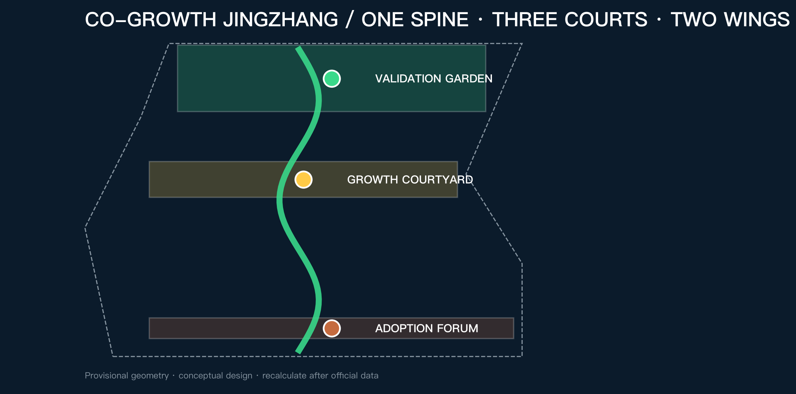
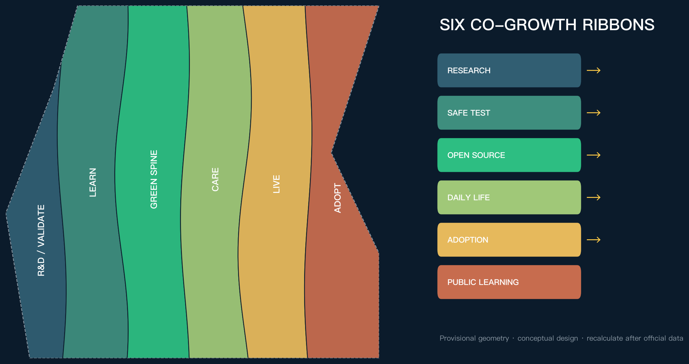
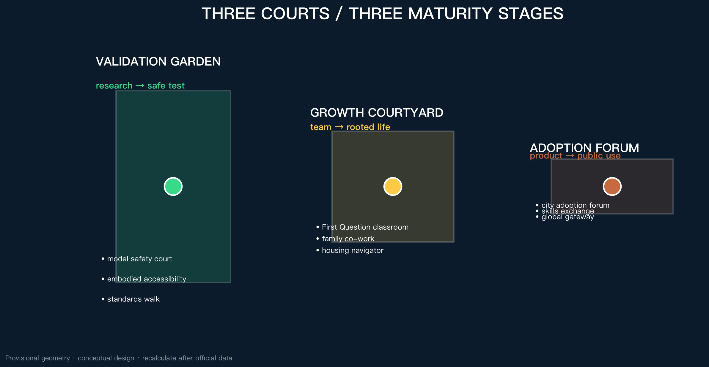
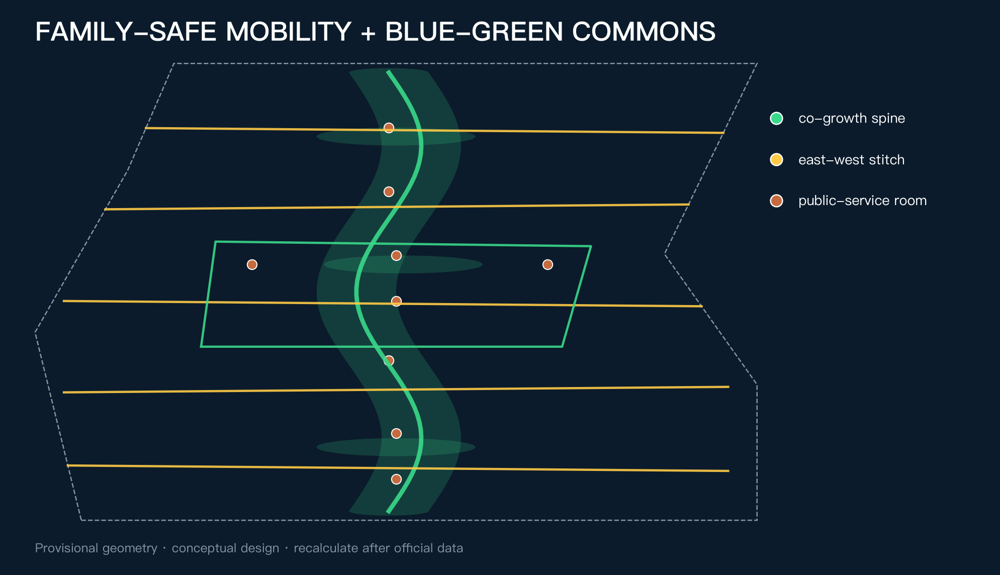
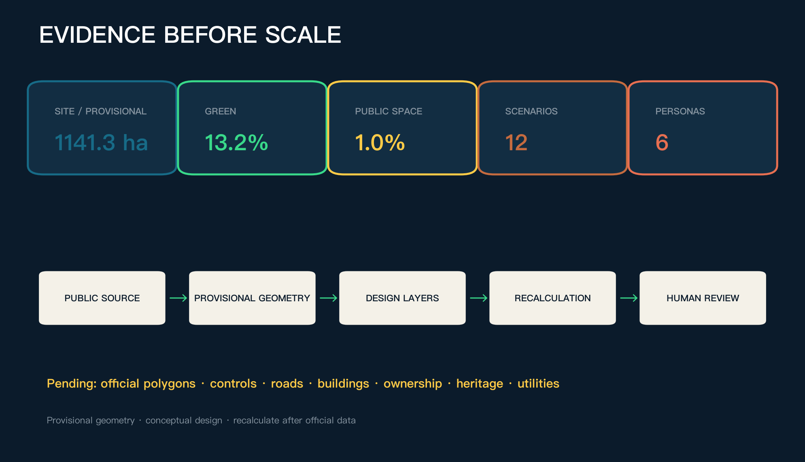

# CO-GROWTH JINGZHANG — An AI Innovation and Living Belt for the Next Generation

## Design Basis and Source List

The starting judgment is simple: a world-class AI belt must answer not only where technology is developed, but why its creators and their families would choose to live here for a decade. The official call seeks a high-quality district attractive to global AI talent; Haidian's 2026 youth housing support and Beijing's child-friendly-city programme show the public value of secure living and spaces for growth. Co-growth therefore connects industry, talent and daily life as long-term innovation capacity [source:OFFICIAL-ANNOUNCEMENT] [source:HD-YOUTH-HOUSING-2026] [source:BJ-CHILD-FRIENDLY-2025].

Official polygons, detailed controls, road redlines, ownership, existing-building surveys, heritage controls and municipal baselines are unavailable. Repository provisional geometry is used only for generation, visualization and intake checking; every geometry-sensitive metric must be recalculated when official data arrives [source:BOUNDARY-SOURCE] [data:geometry/site_boundary.geojson#SITE-001] [depth:existing_conditions_diagnosis].

## Three-Level Scope Framework

The 43.6 sq km coordinated research area frames industry and talent ecology; the approximately 11.4 sq km overall design area frames the co-growth living belt; the three key areas test different maturity stages. The structure is one spine, three courts, two wings and twelve nodes: the heritage park as public spine; Validation Garden at Zhongzhiyuan; Growth Courtyard at AI Origin; Adoption Forum at Dazhongsi; and two service/scenario wings [standard:PROJECT-OFFICIAL-ANNOUNCEMENT] [data:geometry/key_areas.geojson#PROV-KEY-001] [depth:three_level_scope_framework].

This is not a new redline. Six topology-safe longitudinal ribbons express functional coordination, while one north-south spine and five east-west stitches connect both wings. Provisional boundaries remain low-contrast dashed constraints [data:geometry/land_use.geojson#LU-001] [data:geometry/roads.geojson#ROAD-001] [depth:overall_spatial_structure].

## Coordinated Research Area: Industry and Future City Research

The innovation chain has five linked stages: foundational research, controlled validation, open-source incubation, urban adoption and public review. Each stage needs labs and enterprise services, but also housing, child-friendly space, family care, public learning and accessible mobility. The proposal does not invent company lists or investment figures; it uses access, review and exit rules as spatial admission conditions [source:AGENT-TASKBOOK] [standard:PROJECT-AGENT-OPEN-CALL-TASKBOOK].

| Global case | Transferable mechanism | Jingzhang translation | Limit |
| --- | --- | --- | --- |
| Kendall Square | Innovation with housing, public space and community benefits | Treat public life as innovation infrastructure | No copied quantities [source:CASE-KENDALL] |
| one-north | Work-live-play-learn ecosystem | Add care to the two-wing system | No copied land regime [source:CASE-ONE-NORTH] |
| Paris-Saclay | Urban campus, housing, daily services and mobility | Near-campus growth courtyard | No copied targets [source:CASE-PARIS-SACLAY] |
| Smart Kalasatama | Agile real-world pilots with residents | Short, stoppable test windows | Testing is not approval [source:CASE-KALASATAMA] |
| Barcelona 22@ | Productive renewal mixed with housing and green space | Avoid a daytime-only district | No copied ratios [source:CASE-22BARCELONA] |
| Toronto Quayside | Affordable rental and public-benefit delivery | Housing as a service interface, not a promise | No local quota [source:CASE-QUAYSIDE] |

The identity mark turns two rail lines into a leaf and a dialogue bracket. Rail navy signals engineering trust; growth green public life; signal yellow human takeover; heritage copper the centennial railway. All visuals are original vectors using system fonts.

## Overall Design Area: Urban Renewal and Regulatory-Plan-Level Urban Design

Six conceptual ribbons organize research/validation, public learning, the green spine, family/community services, multi-stage talent housing, and urban adoption. They fully partition the submitted boundary without claiming approved land use [standard:MNR-LAND-USE-CLASSIFICATION-GUIDE] [data:geometry/land_use.geojson#LU-001] [depth:land_use_layout].

Twenty-four conceptual footprints follow a retain-or-adapt-first rule. Without surveys, ownership and statutory controls, no specific demolition, FAR, height or construction scale is asserted [data:geometry/buildings.geojson#BLDG-001] [metric:building_footprint_area_sqm] [depth:retain_renovate_demolish].

Services come first, spatial stitching second, capital works only after official conditions. Phases are evidence gates, not promised dates [data:geometry/phasing.geojson#PHASE-001] [depth:phasing_implementation].

## Detailed Design of Key Areas

The three areas are distinct courts along a maturity and adoption path [data:geometry/key_areas.geojson#PROV-KEY-001] [depth:three_key_area_detailed_design].

| Area | Role | Spatial move | First co-growth projects | Prerequisite |
| --- | --- | --- | --- | --- |
| Zhongzhiyuan Validation Garden | Research to safe testing | Controlled test court, standards walk, green exchange edge | Model safety court, embodied-accessibility street, family short-stay service | Official polygon, river/road/safety conditions |
| AI Origin Growth Courtyard | University ideas to rooted teams and families | Near-campus walking, family co-work, housing navigation, public learning | First Question classroom, co-work commons, open-source launch, growth desk | Campus rights, facilities and building survey |
| Dazhongsi Adoption Forum | Product to public adoption | Station-area exchange, public demonstration, commerce and human handoff | Adoption forum, intergenerational skills exchange, global gateway | Station, road, utilities and operations review |

## AI Innovation Ecosystem, Personas, and AI+ Scenarios

The six personas are children and teenagers, early-career researchers, startup teams, caregivers and dual-income families, existing residents and older adults, and international visitors. They describe public needs rather than tracked individuals. Every AI service has a non-AI path and human takeover [source:BJ-CHILD-FRIENDLY-2025] [standard:PROJECT-AGENT-OPEN-CALL-TASKBOOK].

| # | Scenario | Users and place | AI assistance | Human boundary |
| --- | --- | --- | --- | --- |
| 01 | First Question AI literacy | Children and families; Origin | Age-appropriate explanation | Teacher/parent review; no child profiling |
| 02 | Research-to-real sandbox★ | Researchers and firms; Zhongzhiyuan | Test plan and evidence list | Professional release and stop authority |
| 03 | Model safety court★ | Developers and public; Zhongzhiyuan | Red-team case orchestration | Isolated systems and named safety lead |
| 04 | Embodied-accessibility street★ | Disabled users and robotics teams | Conflict simulation | Accessibility advisor and on-site safety lead |
| 05 | Youth housing navigator | Young talent; service wing | Official source aggregation | No eligibility decision |
| 06 | Family co-work scheduling | Caregivers; Origin | Space booking and conflict alerts | Human confirmation; no care licensing claim |
| 07 | Family-safe mobility | Children, older adults, caregivers | Gap and time-risk detection | Field survey and transport review |
| 08 | Intergenerational skills exchange | Residents, students, developers | Public course matching | Moderation, anti-harassment and exit |
| 09 | Health service navigation | Residents and visitors | Search public directories | No diagnosis; clinical review |
| 10 | Jingzhang growth guide | Visitors and students | Sourced heritage narrative | Curatorial fact review |
| 11 | City adoption forum | Firms and residents; Dazhongsi | Compare trial feedback | Public agenda, appeal and exit |
| 12 | Global Co-Growth Week | International teams and communities | Multilingual navigation | Event, safety and copyright approvals |

★ marks three industry validation scenarios, checked by [metric:industry_validation_scenario_count]. All are conceptual suggestions, not approved operations.

## Land Use, Building Scale, and Retain-Renovate-Demolish Strategy

Six land-use areas are split from the same provisional geometry and recalculated in EPSG:4548. They verify coverage and relationships, not statutory ratios. Separating 0701 housing and 0702 community services makes both affordability and quality of daily life visible [data:geometry/land_use.geojson#LU-005] [metric:land_use_0701_area_sqm] [depth:development_intensity_controls].

The R-A-I sequence is Retain after survey, Adapt first, and Infill only after planning, ownership, utilities, daylight, fire safety and public review. Total floor area, FAR and height remain pending official data [standard:MOHURD-CONTROL-DETAILED-PLANNING] [depth:height_massing_character].

## Transport, Rail, Municipal Infrastructure, and Public Services

One north-south spine, five east-west walking stitches and one family-safe loop prioritize children, wheelchairs, pushchairs, bicycles and older walking speeds. All alignments are conceptual pending official redlines and sections [data:geometry/roads.geojson#ROAD-001] [metric:co_growth_route_length_m] [depth:traffic_rail_slow_parking].

Digital infrastructure follows minimum sensing, edge processing, human takeover and shutdown. Services use public or explicitly authorized data; continuous identification or automated eligibility decisions are excluded. Energy, drainage, fire, communications and compute capacity remain pending interfaces [data:geometry/constraints.geojson#CONSTRAINTS] [depth:municipal_new_infrastructure].

## Blue-Green Network, Public Space, and Urban Character

The green spine is public innovation infrastructure. It supports continuous movement, controlled validation, care and adoption. A one-metre viewpoint checks wayfinding, shade, seating, toilets, drinking water, pushchairs and wheelchair continuity [source:BJ-CHILD-FRIENDLY-2025] [data:geometry/green_space.geojson#GREEN-001] [depth:blue_green_public_space].

Rail, sleeper, signal and kilometre markers become a restrained identity grammar. Three pilgrimage/honour concepts - First Question Marker, Open-Source Growth Ring and Centennial Co-Growth Wall - display only cleared public contributions and distinguish submitted, reviewed, selected and implemented status [standard:MOHURD-URBAN-DESIGN-MEASURES] [data:geometry/public_space.geojson#PUBLIC-003].

## Renewal Projects, Implementation Policy, and Phasing

Ten projects cover identity, public learning, youth housing navigation, family co-work, model safety, embodied accessibility, family-safe mobility, urban adoption, intergenerational exchange and the honour wall. Each begins with a light-touch, reversible test and passes rights, evidence, safety and public-review gates before expansion [data:geometry/phasing.geojson#PHASE-001] [depth:renewal_project_list] [depth:phasing_implementation].

An annual cycle opens public questions in spring, runs controlled tests in summer, holds adoption reviews in autumn and publishes learning in winter. Global Co-Growth Week is a proposal subject to approval, not a committed government event.

## Metrics, Area Recalculation, and Compliance Matrix

The submitted geometry recalculates to approximately 1141.3 hectares. This resembles the announced approximate value but is not an official precise area. Green and public-space ratios come from geometry unions; building density describes conceptual footprints only. FAR, total floor area, height and road-area ratio remain pending [metric:site_area_sqm] [metric:green_ratio] [metric:public_space_ratio].

The compliance matrix covers announcement clauses and agent.1-agent.6; standard and depth matrices connect design claims to geometry, metrics and drawings [depth:metrics_recalculation] [standard:PROJECT-AGENT-OPEN-CALL-TASKBOOK].

## Risk, Copyright, and Compliance

The principal risk is false precision. Missing official geometry, controls, roads, buildings, ownership, heritage, utilities and facilities keep all related moves conceptual. External cases transfer mechanisms only, never local controls [source:SOURCE-REGISTRY] [depth:risk_and_missing_data].

Codex generated all text, geometry, figures, HTML and PDFs for this submission. No commercial tiles, news images, corporate logos, portraits or remote fonts are used. Government and public-agency pages are paraphrased and registered with dates, uses and limitations. External publication and final submission require account-owner confirmation.

## References

- Official open-call announcement [source:OFFICIAL-ANNOUNCEMENT]
- Haidian youth talent housing support [source:HD-YOUTH-HOUSING-2026]
- Beijing child-friendly-city progress [source:BJ-CHILD-FRIENDLY-2025]
- Six global cases are fully registered in `sources.json` [source:CASE-KENDALL] [source:CASE-ONE-NORTH] [source:CASE-KALASATAMA]

Evidence is used in three tiers. The call, taskbook and repository fact pack establish scope, required tasks, delivery depth and data gaps; provisional geometry drives generation and recalculation only, never official redlines or controls. Haidian youth-housing and Beijing child-friendly-city sources support the public-value rationale for secure living, care, growth and a one-metre viewpoint, but not any promise of units, eligibility, facility counts or implementation. Six international cases contribute mechanisms such as mixed innovation districts, resident-involved pilots and public-benefit delivery; no quantities, investment figures or powers are transferred.

These limits shape the design package. Land use, buildings, roads and key areas remain conceptual; measurable areas are recalculated from submitted GeoJSON with confidence and assumptions; FAR, height, total floor area, ownership, heritage and utility capacity remain unknown. When official inputs arrive, the release conditions in `assumptions.json` require linked updates across geometry, metrics, matrices, drawings and both narratives.
