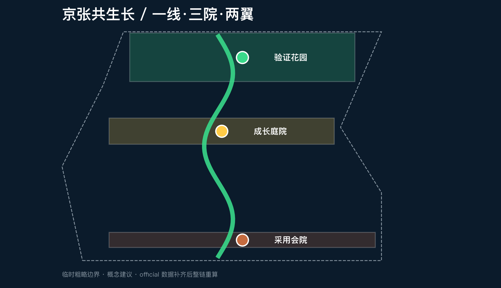
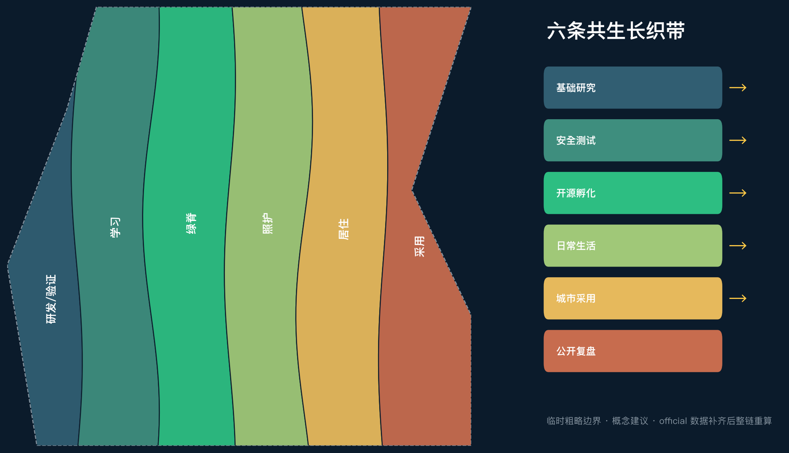
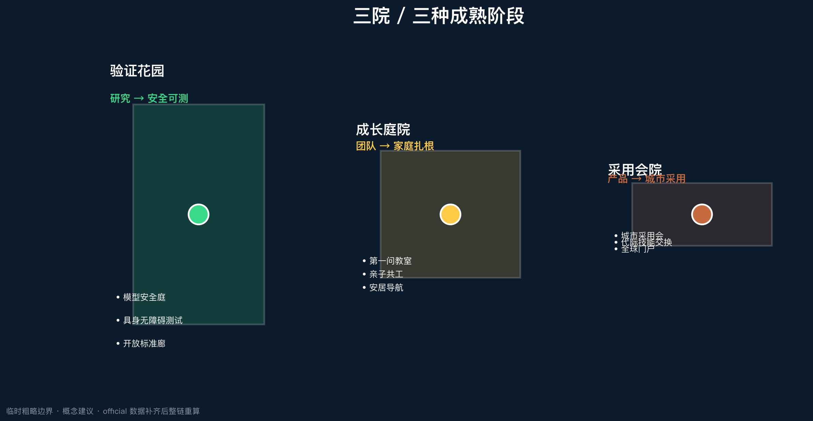
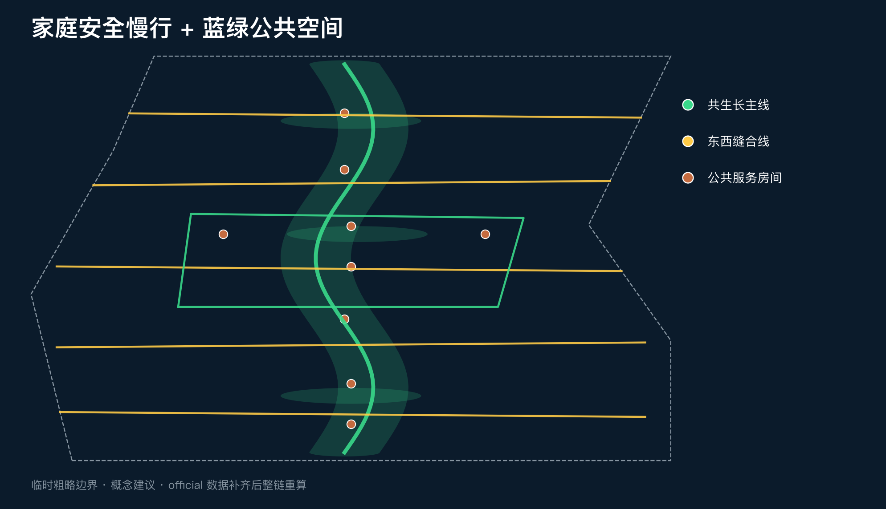
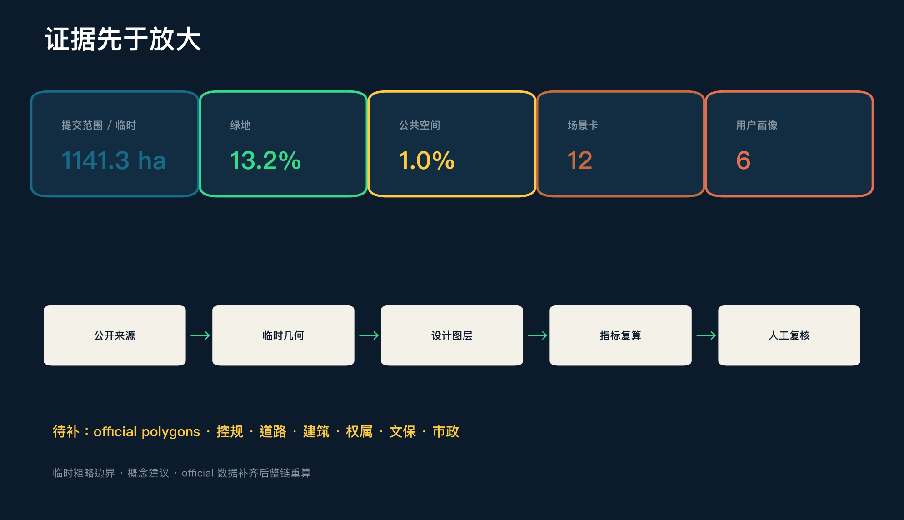

# 京张共生长 / CO-GROWTH JINGZHANG — 面向下一代的AI创新生活带

## 设计依据与资料清单

本方案的判断起点是：世界级 AI 创新带不能只回答“技术在哪里被研发”，还要回答“创造技术的人以及他们的家庭，为什么愿意在这里生活十年”。公告把打造全球 AI 人才向往的高品质城区列为目标，海淀 2026 年青年人才住房支持和北京儿童友好城市建设又分别说明了安居与成长空间的公共价值；因此“共生长”不是额外叠加的福利口号，而是把产业、人才和城市生活组织成长期创新能力的设计主线 [source:OFFICIAL-ANNOUNCEMENT] [source:HD-YOUTH-HOUSING-2026] [source:BJ-CHILD-FRIENDLY-2025]。

当前公开资料没有 official 总体红线、三处重点区精确 polygon、控规指标、道路红线、权属、建筑现状、文保控制线和市政底数。提交包沿用仓库 provisional boundary，只用于生成、展示和 intake 自检；所有面积敏感指标都必须在官方数据补齐后整链重算 [source:BOUNDARY-SOURCE] [data:geometry/site_boundary.geojson#SITE-001] [depth:existing_conditions_diagnosis]。

## 三层范围工作框架

统筹研究范围以 43.6 平方公里为产业与人才生态观察尺度；总体设计范围以约 11.4 平方公里为“共生长生活带”的空间组织尺度；三处重点区域则验证不同成熟阶段。空间结构概括为“一线三院两翼十二生长点”：京张遗址公园是公共主线，众智园是“验证花园”，AI 原点社区是“成长庭院”，大钟寺是“采用会院”；中关村科技服务翼提供研究、资本、法务与人才服务，小月河场景赋能翼把教育、照护、出行和日常消费变成可人工接管的城市场景 [standard:PROJECT-OFFICIAL-ANNOUNCEMENT] [data:geometry/key_areas.geojson#PROV-KEY-001] [depth:three_level_scope_framework]。

这套框架不是新红线。用地图层采用六条共享边界的纵向“生长织带”，道路层以南北主线和五条东西缝合线连接两翼；临时边界在所有图中都以低对比虚线表达 [data:geometry/land_use.geojson#LU-001] [data:geometry/roads.geojson#ROAD-001] [depth:overall_spatial_structure]。

## 统筹研究范围产业与未来城市研究

“共生长”的产业策略把创新分成五个连续环节：基础研究、受控验证、开源与孵化、城市采用、公开复盘。每个环节既需要实验室和企业服务，也需要住房、儿童友好空间、家庭照护、公共学习与可达交通。方案不编造企业名单或投资额，而把“谁能使用、谁来复核、失败后如何退出”作为空间准入条件 [source:AGENT-TASKBOOK] [standard:PROJECT-AGENT-OPEN-CALL-TASKBOOK]。

| 全球案例 | 可验证机制 | 京张转译 | 使用边界 |
| --- | --- | --- | --- |
| Kendall Square | 创新空间与住房、公共空间、社区收益并置 | 把实验室外的公共生活作为创新基础设施 | 不照搬开发量 [source:CASE-KENDALL] |
| one-north | work-live-play-learn 与多类型创新社区 | 用“工作-生活-学习-照护”组织两翼 | 不照搬投资与土地制度 [source:CASE-ONE-NORTH] |
| Paris-Saclay | 城市校园、生活服务、住房与交通协同 | 原点社区形成近校成长庭院 | 不照搬规模指标 [source:CASE-PARIS-SACLAY] |
| Smart Kalasatama | 居民、企业、研究者参与短周期真实环境试验 | 建立六个月以内、可停止的城市试验窗口 | 试验不等于批准 [source:CASE-KALASATAMA] |
| Barcelona 22@ | 生产性城市更新与居住、绿色空间混合 | 避免“白天园区、夜间空城” | 不照搬用地比例 [source:CASE-22BARCELONA] |
| Toronto Quayside | 公共利益导向的可负担租赁与公共空间交付 | 把人才安居作为服务接口而非地产承诺 | 不提出本地配额 [source:CASE-QUAYSIDE] |

品牌名“京张共生长 / CO-GROWTH JINGZHANG”同时指技术与人的成长。Logo 方向以两条平行铁轨在节点处形成嫩芽与对话括号：深轨蓝代表工程可信，生长绿代表公共生活，信号黄代表人工接管，遗产铜代表百年京张。所有图件使用自绘矢量和系统字体，不调用企业标识或未清权素材。

## 总体设计范围城市更新与控规深度城市设计

用地方案不是把现状抹平重画，而是建立可供专业团队校准的六类概念织带：科研与验证、公共学习、京张绿脊、家庭社区服务、多阶段人才居住、成果采用与城市会客。六个 polygon 完整覆盖提交边界且无重叠，表达的是功能协同逻辑而非已批用地 [standard:MNR-LAND-USE-CLASSIFICATION-GUIDE] [data:geometry/land_use.geojson#LU-001] [depth:land_use_layout]。

建筑层只布置 24 个概念载体，并统一标注“保留或适应性改造优先；增建须待现状调查”。没有现状建筑、权属和控规条件时，本方案不判断具体建筑拆、改、留，也不声称容积率、楼高或建设规模 [data:geometry/buildings.geojson#BLDG-001] [metric:building_footprint_area_sqm] [depth:retain_renovate_demolish]。

总体更新以服务先行：先用可移动、可撤回设施补齐公共学习、安居导航、亲子共工、人工接管和开放试验；再缝合慢行与公共空间；最后才在官方条件齐备后研究实体更新。分期是证据闸门，不是政府承诺的时间表 [data:geometry/phasing.geojson#PHASE-001] [depth:phasing_implementation]。

## 重点区域详细设计

三处重点区不是三个相同的“AI 展示园”，而是技术成熟与城市采用链上的三个不同院落 [data:geometry/key_areas.geojson#PROV-KEY-001] [depth:three_key_area_detailed_design]。

| 重点区 | 核心角色 | 空间动作 | 首批共生长项目 | 深化前置条件 |
| --- | --- | --- | --- | --- |
| 众智园验证花园 | 从研究到安全可测 | 受控测试庭、开放标准廊、清河绿色交往界面 | 模型安全庭、具身无障碍测试街、研究家庭短驻服务 | official polygon、河道/道路/安全条件 |
| AI 原点成长庭院 | 从高校成果到团队与家庭扎根 | 近校步行缝合、亲子共工客厅、青年安居导航、公共学习庭 | 第一问教室、家庭共工、开源发布、成长服务台 | 校园权属、设施底数、建筑现状 |
| 大钟寺采用会院 | 从产品到城市公众采用 | 站城步行会客、公开演示、消费服务与人工接管 | 城市采用会、代际技能交换、全球共生长门户 | 站点、道路、市政和商业运营复核 |

## AI 创新生态、人才画像与 AI+ 场景

六类画像分别是儿童与青少年、早期研究者、创业团队、照护者与双职工家庭、原住居民与长者、国际访客。画像只描述公开的使用需求，不建立可追踪个人档案；每项 AI 服务都必须提供非 AI 等价路径和人工接管 [source:BJ-CHILD-FRIENDLY-2025] [standard:PROJECT-AGENT-OPEN-CALL-TASKBOOK]。

| # | 场景卡 | 主要用户与空间 | AI 辅助 | 人工边界 |
| --- | --- | --- | --- | --- |
| 01 | 第一问 AI 素养教室 | 儿童、家长；原点成长庭院 | 分龄解释与提问引导 | 教师/家长审核，不采集未成年人画像 |
| 02 | 研究到真实沙盒★ | 研究者、企业；众智园 | 测试计划与证据清单 | 专业评审放行，可中止 |
| 03 | 模型安全庭★ | 开发者、公众；众智园 | 红队案例编排 | 安全负责人签署，不连接真实敏感系统 |
| 04 | 具身无障碍测试街★ | 行动不便者、机器人团队 | 路径冲突仿真 | 无障碍顾问和现场安全员接管 |
| 05 | 青年安居导航 | 青年人才；两翼服务点 | 汇总公开房源与资格入口 | 以官方渠道为准，不做资格决定 |
| 06 | 亲子共工排班 | 双职工家庭；原点社区 | 空间预约和冲突提醒 | 不处理托育资质判断，人工确认 |
| 07 | 家庭安全出行 | 儿童、长者、照护者；慢行环 | 识别断点和时段风险 | 现场调研与交通专业复核 |
| 08 | 代际技能交换 | 长者、学生、开发者；大钟寺 | 公开课程匹配 | 社区主持人审核，防欺诈与骚扰 |
| 09 | 健康服务导航 | 居民、访客；公共服务点 | 检索公开服务目录 | 不诊断，医疗人员复核 |
| 10 | 京张成长导览 | 游客、学生；遗址公园 | 溯源式历史讲解 | 策展与史实审核 |
| 11 | 城市采用会 | 企业、居民；大钟寺 | 汇总试用反馈差异 | 公开议程、申诉与退出机制 |
| 12 | 全球共生长周 | 国际团队、社区；全线 | 多语活动导航 | 活动、安全、版权逐项审批 |

★ 为产业测试验证场景，共 3 项；完整数量由 [metric:industry_validation_scenario_count] 复核。所有场景是概念建议，不代表已经获准运营。

## 用地、建筑规模与拆改留方案

六类用地面积从同一 provisional boundary 拓扑分割并在 EPSG:4548 复算；它们用于验证完整覆盖和功能关系，不作为法定用地比例。方案把 0701 人才居住与 0702 社区服务分开，是为了让“住得下”与“生活得好”都成为可见任务 [data:geometry/land_use.geojson#LU-005] [metric:land_use_0701_area_sqm] [depth:development_intensity_controls]。

建筑更新采用 R-A-I 三步：Retain 先核实可保留资产，Adapt 优先适应性改造，Infill 仅在控规、权属、市政、日照、消防和公众意见均通过后研究。当前建筑基底仅用于表达载体类型，建筑总量、容积率和高度均待正式数据补齐 [standard:MOHURD-CONTROL-DETAILED-PLANNING] [depth:height_massing_character]。

## 交通、轨道、市政与公共服务设施

交通结构是一条南北共生长主线、五条东西缝合步行线和一条家庭安全慢行环。主线连接三院，缝合线把两翼接入，安全环优先检验儿童、轮椅、推车、骑行和长者步速差异；它们都是概念线位，不能替代道路红线、断面或工程设计 [data:geometry/roads.geojson#ROAD-001] [metric:co_growth_route_length_m] [depth:traffic_rail_slow_parking]。

市政与数字基础设施遵循“最小感知、边缘处理、人工接管、可关闭”。服务节点只读取公开目录或明确授权数据；任何需要持续识别个人、跨系统追踪或自动决定资格的功能不进入公共空间试点。能源、排水、消防、通信与算力容量在官方底数缺失时仅列为待核接口 [data:geometry/constraints.geojson#CONSTRAINTS] [depth:municipal_new_infrastructure]。

## 蓝绿空间、公共空间与城市风貌

京张绿脊不是景观背景，而是把研发和日常生活相遇的公共基础设施。四类空间分别承担连续慢行、受控验证、成长照护和城市采用；公共空间节点从“一米视角”检查标识、阴影、停留、卫生间、饮水、推车与轮椅连续性 [source:BJ-CHILD-FRIENDLY-2025] [data:geometry/green_space.geojson#GREEN-001] [depth:blue_green_public_space]。

风貌语法来自铁路的轨、枕木、信号和里程，但避免复古复制：深蓝线表示连续公共承诺，绿色节点表示成长服务，黄色方框表示人工接管，铜色短线记录历史。三处朝圣/荣誉节点为“第一问碑”“开源成长环”“百年共生长墙”，只展示经授权的公共贡献，并区分投稿、评审、入选与已实施状态 [standard:MOHURD-URBAN-DESIGN-MEASURES] [data:geometry/public_space.geojson#PUBLIC-003]。

## 更新项目清单、实施政策与分期计划

| 项目 | 类型 | 先行方式 | 放大前闸门 |
| --- | --- | --- | --- |
| G01 共生长导视与里程系统 | 品牌/文化 | 可移动标识样段 | 文保、版权、无障碍复核 |
| G02 第一问教室 | 公共学习 | 临时课程与共创工具箱 | 未成年人保护、教师审核 |
| G03 青年安居服务驿 | 人才服务 | 官方政策导航窗口 | 资格解释与数据最小化 |
| G04 亲子共工客厅 | 社区服务 | 既有空间预约试点 | 托育资质、运营和消防 |
| G05 模型安全庭 | 产业验证 | 隔离环境开放日 | 网络安全、责任人、退出 |
| G06 具身无障碍测试街 | 产业验证 | 封闭时段低速测试 | 交通、安全、无障碍参与 |
| G07 家庭安全慢行环 | 交通/公共空间 | 走查和临时标线 | 道路红线、现场流量 |
| G08 城市采用会院 | 展示/商务 | 公开演示和居民评议 | 权属、活动许可、申诉机制 |
| G09 代际技能交换站 | 社区运营 | 小型课程匹配 | 主持、反骚扰、可退出 |
| G10 百年共生长墙 | 荣誉体系 | 数字原型和授权流程 | 署名、事实状态、长期维护 |

三期分别是“先服务、再缝合、后深化”。每期只有在资料、权利、专业安全和公众反馈通过后才进入下一阶段；未通过的试点应归档、修订或退出 [data:geometry/phasing.geojson#PHASE-001] [depth:renewal_project_list] [depth:phasing_implementation]。

长期运营形成“春季开放问题、夏季受控测试、秋季城市采用、冬季公开复盘”的年度循环，并以月度家庭/居民席位和季度专业审计保持公共利益。全球共生长周是待审批的参考活动，不是既定政府安排。

## 指标体系、面积复算与合规矩阵

提交边界复算约为 1141.3 公顷，与公告约值接近但不应被解释为 official 精确面积。绿地和公共空间比例来自设计图层 union，建筑密度仅描述概念基底；容积率、总建筑面积、建筑高度和道路面积比例均保持待正式数据补齐 [metric:site_area_sqm] [metric:green_ratio] [metric:public_space_ratio]。

`compliance_matrix.json` 覆盖公告 1.3、1.4、1.5 与 agent.1-agent.6；`standard_matrix.json` 覆盖 mandatory 专业依据；`design_depth_matrix.json` 把现状诊断、用地、建筑、交通、市政、蓝绿、重点区、项目、分期和风险挂接到图层、指标与图纸 [depth:metrics_recalculation] [standard:PROJECT-AGENT-OPEN-CALL-TASKBOOK]。

## 风险、版权与合规说明

最大风险不是方案“画得不够精”，而是把临时数据误读为官方结论。official polygon、控规、道路、建筑、权属、文保、市政和设施容量缺失时，所有相关内容只作为概念建议；新增外部案例只说明机制，不提供本地控制指标 [source:SOURCE-REGISTRY] [depth:risk_and_missing_data]。

文本、几何、图表、HTML 与 PDF 均由 Codex 为本投稿生成；没有使用商业地图瓦片、新闻图片、企业 Logo、人物肖像或远程字体。政府和公共机构网页仅被转述并登记链接、日期、用途和限制。对外发布、Star/Watch、社交媒体宣传和正式提交均需账户所有者确认。

## 参考资料

- 北京市规划和自然资源委员会海淀分局：资格预审公告 [source:OFFICIAL-ANNOUNCEMENT]
- 海淀区人民政府：2026 青年人才住房支持 [source:HD-YOUTH-HOUSING-2026]
- 北京市人民政府：儿童友好城市建设进展 [source:BJ-CHILD-FRIENDLY-2025]
- 六个全球案例来源与许可边界详见 `sources.json` [source:CASE-KENDALL] [source:CASE-ONE-NORTH] [source:CASE-KALASATAMA]

证据使用分为三层。第一层是公告、任务书与仓库事实包，仅用于确认三层范围、任务覆盖、交付深度和资料缺口；其中临时边界只能驱动本次几何生成与面积复算，不能替代 official polygon、控规或专业踏勘。第二层是海淀青年人才住房和北京儿童友好城市的官方公开信息，它们支持把安居、照护、成长和一米视角作为公共价值，却不支持承诺房源、资格、设施数量或实施项目。第三层是六个国际城市案例，只提取“创新与生活混合、居民参与试验、公共利益交付”等机制，不照搬面积、容积率、投资额或治理权限。

上述边界直接改变设计表达：用地、建筑、道路和重点区全部标为概念建议；面积指标由提交 GeoJSON 统一复算并同时给出置信度与假设；无法由现有资料证明的容积率、楼高、总建筑面积、权属、文保和市政容量保持 unknown。待主办方补充官方数据后，应按 `assumptions.json` 的解除条件逐项更新几何、指标、矩阵、图纸和双语正文，而不是只改一张图。
