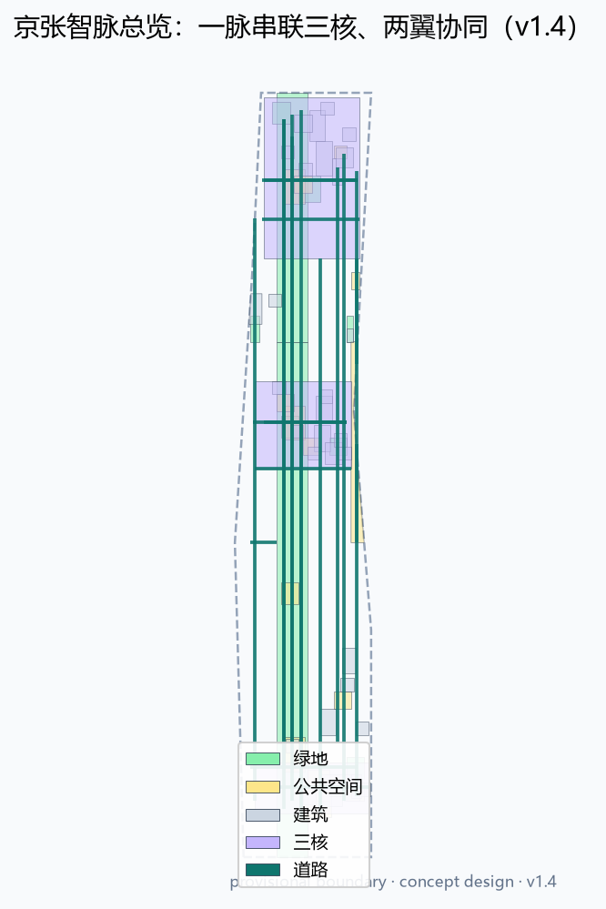
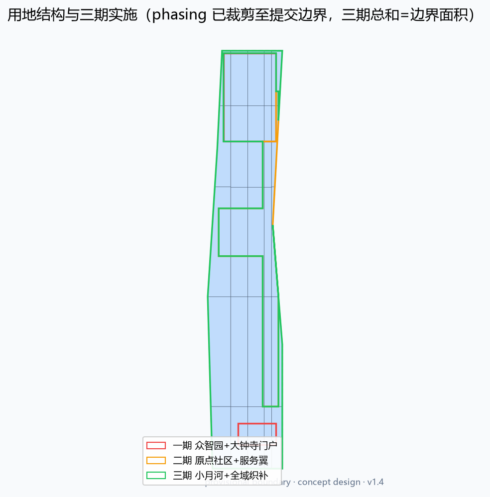
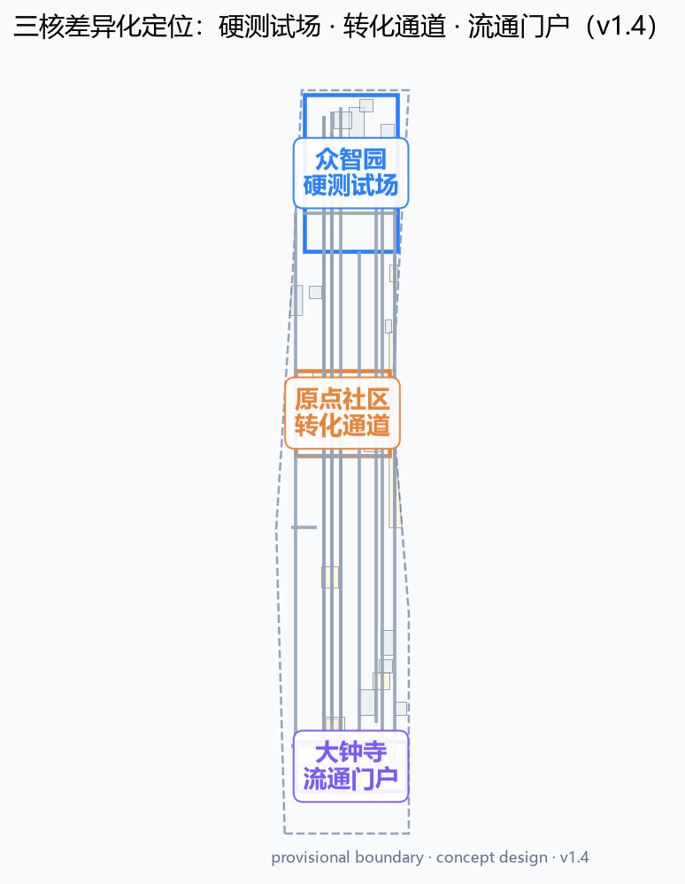
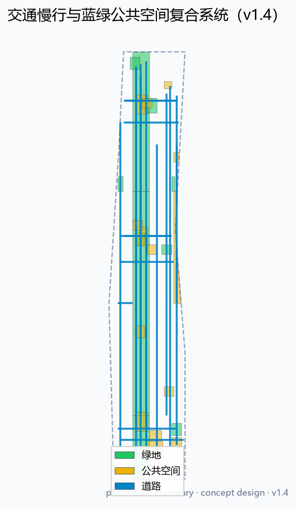
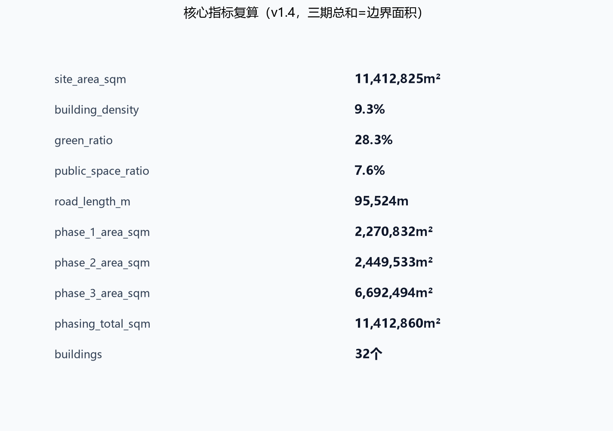

## Facts, Concepts, and Pending Three-Layer Declaration

All content of this proposal is divided into three layers according to the nature of the evidence: **official**, **concept**, and **pending**. Within the text, concept recommendations are uniformly marked with **(concept)**, while pending official confirmation matters are expressed as "pending official confirmation." These three levels of statements correspond to the `evidence_type` field in the `compliance_matrix.json`. (Conceptual Recommendation)

| Level | Content | Evidence Type | Usage Boundary |
| --- | --- | --- | --- |
| Confirmed Facts | Project Name, Organizer, Overall Design Area of approximately 11.4 km², Key-Area Detailed Design Area of approximately 368.4 hectares, three key areas with announced areas (Zhongzhiyuan 192.1 hectares, Origin Community 104.3 hectares, Dazhongsi 72.0 hectares), six tasks of the intelligent body mission statement, and Urban Design management standards etc. | official | can serve as task references and spatial discussion benchmarks [source:OFFICIAL-ANNOUNCEMENT] [source:AGENT-TASKBOOK] [standard:MOHURD-URBAN-DESIGN-MEASURES] |
| Conceptual Recommendation | Jing-Zhang Smart Vein naming and logo direction, height grading, scene cards, Testing and Validation Scenario, pilgrimage landmarks, operational mechanisms, Demolish–Renovate–Retain Strategy and phased implementation | concept | are all conceptual recommendations/reference schemes, provided for the professional team to deepen, and do not constitute a government approval or implementation commitment [source:AGENT-TASKBOOK] |
| Pending | Official Planning Boundary, key area polygon, controlled plan Floor Area Ratio/height/density/setback, road right-of-way, municipal utility lines, ownership and engineering conditions | pending | formal data released need recalculate layers and indicators [source:SITE-PACKAGE] [data:geometry/site_boundary.geojson#SITE-001] |

In `compliance_matrix.json`, each task should be annotated with the dominant evidence type; when the same task includes both conceptual and confirmatory content, the dominant type should be taken and noted in the text.

### Confirmed conclusions, Conceptual Recommendation, and pending confirmation list

To avoid misinterpreting the design recommendations as definitive conclusions, the text is organized into three layers: "Confirmed Conclusions / Conceptual Recommendations / Pending Official Confirmation." **Confirmed Conclusions** only retain verifiable content such as announcements, tasks, standards, and official data status; **Conceptual Recommendations** are uniformly marked with **(Conceptual)** and are intended for professional teams to further develop; **Pending Official Confirmation** indicates that official data has not yet been released, and any values should not be considered as definitive.

| Level | Content | Basis/Dependency |
| --- | --- | --- |
| Confirmed Conclusions | The announced areas for three spatial levels (comprehensive study about 43.6 km², overall design about 11.4 km², and key areas about 368.4 hectares) and three key areas (Zhongzhiyuan 192.1 hectares, Original Point Community 104.3 hectares, Dazhongsi 72.0 hectares) | [source:OFFICIAL-ANNOUNCEMENT] [source:SITE-PACKAGE] |
| Confirmed Conclusions | Six Tasks of the Agent Mandate, Three Orientations, Five Functions, and the Synergistic Loop of Three Zones and Two Wings | [source:AGENT-TASKBOOK] |
| Confirmed Conclusions | Urban Design Management, Control Detailed Planning Approval Standards, Land and Sea Use Classification and Design Depth Standards | [standard:MOHURD-URBAN-DESIGN-MEASURES] [standard:MOHURD-CONTROL-DETAILED-PLANNING] [standard:MNR-LAND-USE-CLASSIFICATION-GUIDE] |
| Confirmed Conclusions | Official Control Regulation Indicators Status: FAR, Building Height, Building Density, Green Space Ratio, and setback distances are all missing, and need to be supplemented by the official control regulation attachment | [source:SITE-PACKAGE] [data:ranges/planning_limits.json] | (Building Coverage Ratio)
| Confirmed Conclusions | Road Classification Enumerated System (Expressway/Principal Arterial/Surface Arterial/Local Street/Block Access Street/Pedestrian/Bicycle/Greenway/Railway Transfer) | [source:SITE-PACKAGE] |
| Conceptual Recommendation | Jing-Zhang Smart Vein Naming, Logo Direction, Height Grading, Scene Cards, Pilgrimage Landmarks, Operational Mechanisms, Demolish–Renovate–Retain Strategy and Phasing Implementation | [source:AGENT-TASKBOOK] [depth:height_massing_character] [depth:phasing_implementation] |
| Conceptual Recommendation | FAR and the Conceptual Range, Interface, and Roof Form Guidance (Building Coverage Ratio) | [depth:development_intensity_controls] [depth:height_massing_character] |
| Conceptual Recommendation | Road Network, Transit-Station Integration, and Layout of Municipal New Infrastructure | [depth:traffic_rail_slow_parking] [depth:municipal_new_infrastructure] |
| To Be Officially Confirmed | Official Planning Boundary, Key Area Polygon, Control Detailed Plan Floor Area Ratio/Height/Density/Green Space Ratio/Buffer, Road Right-of-Way, Track Position, Utility Lines, Ownership and Existing Building Baseline | [source:SITE-PACKAGE] [source:PROCESSED-FACT-PACK] |

Conceptual Recommendation
Conclusions confirmed in the text are not marked additionally; conceptual recommendations are uniformly marked with **(concept)**; pending official confirmation items are to be written as "pending official confirmation." This list corresponds one-to-one with the `evidence_type` field in `compliance_matrix.json`.

## Design Basis and Source List

This plan is based primarily on the first official reference, the "Qualification Pre-Review Announcement for the International Scheme of the Centennial Jing-Zhang AI Innovation Belt Urban Design" issued by the Haidian Branch of the Beijing Municipal Commission of Planning and Natural Resources in May 2026 [source:OFFICIAL-ANNOUNCEMENT], and secondarily on the excerpts from the open-source call for tasks for global intelligent entities [source:AGENT-TASKBOOK], and comprehensively reads the structured task book, enumerations, allowable design spaces, planning indicator ranges, and JSON Schema from `brief/site-package/` [source:SITE-PACKAGE]. The authority of the materials is distinguished according to `data/source_registry.json`: the announcement text and the cleared task book can be used for formal task responses, while temporary rough boundaries are only allowed for generating, self-checking, and visualizing the schemes [source:SOURCE-REGISTRY]. `data/processed/agent_fact_pack.md` serves as a navigation layer to help organize the three layers, six agent tasks, data uses, and missing data lists into a readable plan [source:PROCESSED-FACT-PACK].

This plan uses the `brief/site-package/geometry/provisional_boundaries.geojson` provided by the repository maintainers as the Overall Design Area boundary and the boundaries for three key areas [source:BOUNDARY-SOURCE] [source:KEY-AREA-SOURCE]. This boundary is a temporary rough polygon formed based on the announced text boundaries and an area of approximately 11.4 square kilometers. The `official_boundary=false` and `geometry_role=provisional_constraint`, and it can only be used for design discussions, temporary self-checks, and offline display; it must not be used as the Official Planning Boundary, approval basis, or for precise area recalculation. The organizers' data gaps should not impede content scoring; all layers must be regenerated and re-calculated after the formal red lines are released [data:geometry/site_boundary.geojson#SITE-001] [data:geometry/key_areas.geojson#PROV-KEY-001]. This plan adheres to the following industry standards: the Urban Design Management Measures' requirements for Public Space and overall style coordination [standard:MOHURD-URBAN-DESIGN-MEASURES], the Control Detailed Planning Compilation and Approval Measures' requirements for planning permit and implementation management boundaries [standard:MOHURD-CONTROL-DETAILED-PLANNING], the Land and Sea Use Classification Guide's requirements for land use codes [standard:MNR-LAND-USE-CLASSIFICATION-GUIDE], and the architectural professional design document depth regulations as a reference for additional depth [standard:MOHURD-ARCH-DESIGN-DEPTH-2016]. (Regulatory Detailed Planning)

The main text is organized to the formal proposal depth [depth:existing_conditions_diagnosis], with each core judgment in the text providing machine-readable evidence references. These references allow reviewers to trace back from the text to verify against the GeoJSON, metrics, matrices, and sources.

### Classification and Use of Materials

The proposal materials are divided into four levels of use according to `data/source_registry.json` [source:SOURCE-REGISTRY].

| Level | Documentation | Usage | Prohibited Uses |
| --- | --- | --- | --- |
| A0 Official Formal | Qualification Pre-Review Announcement, Official Standard Snapshot | Task Basis, Scope, and Area, Professional Standard Response | Not in Place of Official GIS Redline and Control Plan Attachments |
| User Data Rights | Excerpt from Intelligent Body Task Statement | Agent Tasks, Scenarios, Brand, Operational Requirements | Not for Legal Planning Determination |
| Warehouse Handling Materials | agent_fact_pack and CSV | Navigation and Task Index | Not in Place of Original Sources |
| provisional | provisional_boundaries.geojson | temporarily generated, self-checked, and visualized | not to be used as a basis for redlines, approval, or precise area calculations |

Generation Method Disclosure: This proposal document, geometry, metrics, drawings, and HTML were generated by the declared AI agent based on the provided information. The generation method and liability boundaries are detailed in `agent.json`, `report/copyright_statement.md`, and `assumptions.json` [source:PROCESSED-FACT-PACK].

## Three-Level Scope Framework

Three layers are defined in the official announcement for organizing the work, which are translated into this scheme: "industrial strategy layer, overall Urban Design layer, and detailed design layer for key areas," to be progressively implemented [standard:PROJECT-OFFICIAL-ANNOUNCEMENT]. The Coordinated Research Area covers approximately 43.6 square kilometers, addressing the AI Innovation Ecosystem, the collaboration between the Three Zones and Two Wings, the future urban form, and the narrative of a global pilgrimage destination [source:OFFICIAL-ANNOUNCEMENT]; the Overall Design Area covers approximately 11.4 square kilometers, addressing the overall structure of Urban Renewal, land use functions, transportation and utilities, blue-green Public Spaces, and facade control [data:geometry/land_use.geojson#LU-001] [metric:site_area_sqm]. The key-area detailed design covers an approximate area of 368.4 hectares and involves conducting detailed design at the depth of the Integrated Planning Implementation Plan for the Zhongzhiyuan, Beijing AI Origin Community, and Dazhongsi three sections [data:geometry/key_areas.geojson#PROV-KEY-001] [metric:key_area_total_sqm]. The three levels of scope are constrained by [depth:three_level_scope_framework] and [depth:overall_spatial_structure], and the specific areas can all be recalculated in the geometric layers. (Key-Area Detailed Design Area)

Due to the Official Planning Boundary not yet being released, all areas and proportions in this proposal are marked as "provisional boundary re-calculations": for example, the submitted boundary area is 11,412,825 square meters, and the three key areas total 3,692,893 square meters. After replacing the official polygon, all must be re-calculated [metric:key_area_count]. The three layers are not independent drawing layers, but a continuous transmission from industrial strategy to plot renewal: comprehensive research determines the "two wings" industrial division of labor, overall design translates the division of labor into land use, corridors, and facilities, and key areas detailed design verifies the implementable relationships between buildings, streets, Public Space, and AI scenarios [depth:overall_spatial_structure].

### Three-tier scope transmission mechanism

The three levels of scope are ensured to be verifiable through a "Goal-Policy-Layer" three-tier framework [depth:three_level_scope_framework]:

1. **Objective Transmission**: Coordinate and research to determine the AI Innovation Ecosystem, talent, and future city goals, and convert them into a positioning for five functional areas and the Three Zones and Two Wings [standard:PROJECT-AGENT-OPEN-CALL-TASKBOOK].
2. **Strategy Implementation**: The overall design translates the positioning into land structure, transportation and utilities, blue-green space, and landscape strategies, which are reflected in layers such as `geometry/land_use.geojson` [data:geometry/land_use.geojson#LU-001].
3. **Layer Transmission**: The detailed design in the key areas further implements the strategies into buildings, streets, Public Spaces, and AI scenario nodes, forming a project that can be further developed [data:geometry/key_areas.geojson#PROV-KEY-002].

The three-layer transmission results should be linked with each item in `compliance_matrix.json`, and the review can be conducted by tracing tasks back to the chapters, layers, indicators, drawings, and HTML [source:SITE-PACKAGE].

## Current Diagnosis and Issue List

The current condition diagnosis serves as the starting point for the formal design proposal. This proposal establishes a problem list based on publicly available materials, the text description in the task book, and verifiable spatial inference [source:OFFICIAL-ANNOUNCEMENT], without drawing unauthorized current condition mapping conclusions or presenting inferences as precise current conditions; all current condition judgments require re-verification after the formal redlines and current condition base map are obtained [source:PROCESSED-FACT-PACK].

### Current Condition Assessment

The Overall Design Area is located along both sides of the Jing-Zhang Railway Heritage Park, historically long divided by the railway corridor, forming a pattern of "west side higher education and research, east side industry and living." The current characteristics can be summarized as follows:

1. **Railway Seam Gap**: Although the Jing-Zhang Heritage Park has initially formed a public green belt, there are still pedestrian discontinuities at the crossings of major roads and ring roads nodes and key areas. The park's role in connecting the east and west sides has not yet been fully realized [data:geometry/roads.geojson#ROAD-006].
2. **Dispersed Industrial Spaces**: Higher education institutions, research institutes, incubators, and enterprises are scattered along the Academy Road, lacking a continuous interface for technology transfer and public service support. The innovation chain is spatially characterized by "multiple points but not interconnected" [data:geometry/land_use.geojson#LU-007].
3. **Fragmentation of Blue-Green System**: There is a lack of continuous connection between Qinghe, Xiaoyuehe, and the Jing-Zhang Green Corridor, with the riverside interface being blocked by roads and walls. The quality of Public Spaces is uneven [data:geometry/green_space.geojson#GREEN-003].
4. **Uneven Facility Load**: The degree of integration around rail stations varies, with significant differences in the pedestrian environment and functional complexity around stations such as Dazhongsi and Wodao Kou. There is a lack of systematic organization for parking and non-motorized vehicle parking [data:geometry/public_space.geojson#PUBLIC-002].
5. **Insufficient Expression of Style and Cultural Heritage**: The spatial expression of Jing-Zhang Railway culture, Zhongguancun entrepreneurial culture, and AI new culture is scattered and lacks a unified sign system, guide system, and narrative framework [depth:height_massing_character].

### Issue List and Design Responses

| Number | Current Issues | Design Response | Spatial Evidence | Depth Item |
| --- | --- | --- | --- | --- |
| D-01 | Railway Slow Travel Discontinuity | Jing-Zhang Smart Vein Green Corridor North-South Permeation and Road Node Seaming | [data:geometry/roads.geojson#ROAD-001] | [depth:traffic_rail_slow_parking] |
| D-02 | Incomplete Innovation Network | Origin Community Transformation Street and Release Axis | [data:geometry/buildings.geojson#BLDG-004] | [depth:three_key_area_detailed_design] |
| D-03 | Blue-Green System Fragmentation | Composite Connection of Green Corridors, Riverbank Green Spaces, and Station Forecourt | [data:geometry/green_space.geojson#GREEN-002] | [depth:blue_green_public_space] |
| D-04 | Insufficient Integration | Integration of Dazhongsi Station and City with Four Quadrant Pedestrian Connectivity | [data:geometry/public_space.geojson#PUBLIC-002] | [depth:traffic_rail_slow_parking] |
| D-05 | Insufficient Expressions of Style and Cultural Heritage | Standardize Signage, Landmarks, and Cultural Narratives | [standard:MOHURD-URBAN-DESIGN-MEASURES] | [depth:height_massing_character] |

The depth of the current condition diagnosis is uniformly constrained by [depth:existing_conditions_diagnosis]; the diagnostic conclusions are expressed in the form of "conceptual assessment + pending official baseline map verification," to avoid presenting inferences as current facts [source:SOURCE-REGISTRY].

## Coordinated Research Area: Industry and Future City Research

The core judgment for the Coordinated Research Area is to connect the "innovation and independent development starting point" of the century-old Jing-Zhang Railway with the "entrepreneurial and innovative ecosystem" of Haidian's Zhongguancun as a sustainable AI innovation pulse. The proposal puts forward an overall conceptual name **(Concept)** "Jing-Zhang Intelligence Pulse" (Jing-Zhang AI Pulse), with an English name "AI Pulse Belt," and a naming system of **(Concept)** "one pulse, two wings, three cores, and multiple scenario nodes": one pulse refers to the Jing-Zhang Intelligence Pulse, two wings refer to the Zhongguancun Technology Services Wing and the Xiaoyue River Scenario Enablement Wing, three cores refer to three key areas, and multiple scenario nodes refer to a network of operational scenarios including AI+public services, industrial services, cultural experiences, and governance experiments [source:AGENT-TASKBOOK] [standard:PROJECT-AGENT-OPEN-CALL-TASKBOOK].

Conceptual Recommendation for Logo and Visual Identity Direction: Abstract the parallel steel rails as two pulse lines forming an infinity loop resembling the letter Z, symbolizing the intersection of the Jing-Zhang Railway, Zhongguancun innovation, and AI data flow; the main colors are suggested to be steel blue, electric blue, and warm orange, where steel blue corresponds to the railway heritage, electric blue corresponds to AI computing power, and warm orange corresponds to human vitality; auxiliary graphics include station numbers, sleeper scales, and pulse waveforms, forming a component system that can be used for signage, exhibition panels, and digital interfaces. This naming and visual direction are conceptual recommendations and do not involve any registered trademarks or unauthorized fonts [depth:overall_spatial_structure].

Global AI Innovation Ecosystem Case Studies **(Concept)** (6 examples, as references for spatial mechanisms rather than investment commitments):

| Case | Relevant Mechanism | Translating to One Belt Space Actions |
| --- | --- | --- |
| Germinal of Silicon Valley University and Risk Capital Ecosystem | University technology transfer, long-term capital investment, density-oriented interactions | Origin Point Community near-school conversion street and exhibition hall [data:geometry/buildings.geojson#BLDG-004] |
| Knowledge Institutions Cluster in the Cambridge Tech Belt | Multiple Universities and Research Institutes Forming a Knowledge District | Coordinated Research Area University Pioneering Network and Cross-Institutional Pedestrian Connections |
| Tel Aviv Technology Transfer Ecosystem | Technological Talent Spillover and Dual-Use Conversion between Military and Civilian Sectors | Zhongzhiyuan Full Stack Testing and Security Governance Sandbox [data:geometry/buildings.geojson#BLDG-003] |
| Smart Nation Scenario Access | Public Data Access, City Lab, Scenario Application System | Xiaoyue River Scenario Enablement Wing Scenario Access Operation Mechanism |
| Cultural Operations at the London Knowledge Quarter | A Public Living Room for Coexistence of Cultural Institutions and Tech Enterprises | Jing-Zhang Zhi Mai Green Corridor Cultural Display and Open Living Room |
| Scenario Access in Hangzhou at City Scale | Driving Industrial Testing and Operations through Real-World Scenarios | Dazhongsi and Comprehensive AI-Enabled Scenario Testing and Validation Nodes [data:geometry/constraints.geojson#CONSTRAINTS] |

The five functional areas are implemented in space as follows: the Full-Stack Independent AI Innovation System corresponds to Zhongzhiyuan, the world-class AI Innovation Ecosystem corresponds to the Origin Community and the Zhongguancun Technology Services Wing, the AI+scenario empowerment new paradigm corresponds to the Xiaoyue River Scenario Enablement Wing, the intelligent AI vibrant city corresponds to the green corridors and community networks, and the AI governance global discourse corresponds to the governance sandbox, standard workshops, and international activity system [standard:PROJECT-AGENT-OPEN-CALL-TASKBOOK]. Future city form research emphasizes the "perceptible AI city": not treating AI as an isolated technology, but through pedestrian-friendly spaces, Public Spaces, nodes, and scenario nodes, residents and businesses can daily perceive AI services, while always retaining Human Review and prioritizing public interest [depth:existing_conditions_diagnosis].

### Regional Collaboration and Innovation Network

The Yidai is not an isolated district but a hub connecting Haidian to a larger innovation network. This plan proposes a "four-tier" collaborative framework and clearly defines the spatial interfaces and collaborative mechanisms for each tier [source:OFFICIAL-ANNOUNCEMENT]:

1. **Collaborate with Beiwěi Community**: Beiwěi Community and its surrounding residential and innovation communities provide a living and daily service hub for the corridor. The collaborative interface is the Jing-Zhang Smart Pulse Green Corridor and the community's pedestrian network, organized through the community public living room, educational facilities, and AI scenario nodes, ensuring that the service network remains integrated and avoids a disconnect between the core area and community life [data:geometry/roads.geojson#ROAD-008].
2. **Collaborate with the Future Science City**: Future Science City is responsible for the development of hard technologies such as large scientific facilities, energy materials, and advanced manufacturing. One belt will serve as the urban service end for the conversion of its research outcomes, forming a division of labor between "source R&D in Future Science City and scenario conversion and headquarters services in Haidian". The collaborative mechanism is facilitated through the interfaces of the Conversion Street and test validation nodes [depth:overall_spatial_structure].
3. **In Synergy with Huairou Science City**: Huairou Science City features basic research and national laboratories. One belt provides an interface for the mid-stage testing and release of basic research results through networks of universities and research institutions, data element lounges, and international roadshow lounges, forming a relay mechanism of "basic research—mid-stage conversion—international release" [data:geometry/buildings.geojson#BLDG-008].
4. **Collaboration with the Jing-Jin-Ji Region**: By leveraging the historical Jing-Zhang railway corridor and the high-speed rail network connecting Beijing and Hebei, a belt can be formed with a gradient of collaboration, including "R&D in Beijing-Tianjin-Hebei, headquarters and scenarios in the Haidian Innovation Belt, manufacturing and computing nodes along the Jing-Zhang line." The collaborative mechanism involves transforming the century-old Jing-Zhang corridor into a global AI industry collaboration corridor [source:AGENT-TASKBOOK].

Conceptual Recommendations for regional collaboration are provided, and do not involve adjustments to cross-regional administrative boundaries or the determination of industrial layouts; formal deepening should be verified with relevant district and county plans, science and technology park plans, and regional collaboration policies [source:PROCESSED-FACT-PACK].

## Overall Design Area: Urban Renewal and Regulatory-Plan-Level Urban Design

The Urban Renewal framework for the Overall Design Area is defined as "green corridor suturing, two wings rejuvenation, and three cores highlighting." Green corridor suturing refers to using the Jing-Zhang heritage park vitality belt as the north-south main axis to stitch together the east and west urban areas divided by the railway [data:geometry/green_space.geojson#GREEN-002]; two wings rejuvenation refers to strengthening element services in the Zhongguancun Technology Services Wing and enhancing scenario testing and public services in the Xiaoyue River Scenario Enablement Wing; three cores highlighting refers to three key areas forming operational AI innovation anchor points [data:geometry/key_areas.geojson#PROV-KEY-002].

The land use structure is primarily based on "central ecological and cultural, western technological services, and eastern industrial living": within the submission boundaries, 25 land use units are divided [data:geometry/land_use.geojson#LU-001], among which research and development land use covers AI research and development and technology transfer [data:geometry/land_use.geojson#LU-013], commercial and service land use covers industrial services and intelligent consumption [data:geometry/land_use.geojson#LU-010], park and green space form the Jing-Zhang Smart Pulse Green Corridor [data:geometry/land_use.geojson#LU-006], and the rest are for education, culture, residential, community services, public squares, blank spaces, and road land uses. The total Building Footprint area is 1,703,291 square meters [metric:building_footprint_area_sqm], with a Building Coverage Ratio of 14.9%, serving as the base supply for conceptual space, but not representing the approved Floor Area Ratio [depth:land_use_layout].

Development Intensity, Building Height, Building Coverage Ratio, green space ratio, and setback distances are official planning control conditions. Currently, all these metrics are missing in the `brief/site-package/ranges/planning_limits.json` [source:SITE-PACKAGE]. Therefore, this plan does not set definitive Floor Area Ratio or building height. Instead, it clearly lists in [depth:development_intensity_controls] the items that are "awaiting formal planning confirmation" and expresses the design recommendations for the building massing and interface relationships at [depth:height_massing_character]. The update objects are expressed in four categories: "preserve, renovate, demolish, and leave blank" [depth:retain_renovate_demolish]: buildings related to education, research, and historical context are suggested to be preserved, inefficient industrial spaces are suggested to be renovated and updated, key functional nodes in priority areas are suggested to be newly constructed, and the northern side of Zhongzhiyuan and the urban fringe are suggested to be left as flexible spaces [data:geometry/buildings.geojson#BLDG-001].

| Control Indicators | Official Status | Conceptual Recommendation Range **(Concept)** | Usage Boundaries |
| --- | --- | --- | --- |
| Floor Area Ratio FAR| missing(pending official control plan) | Key Area Portal 2.0-4.0, General Street Block 1.0-2.5 | Only for volume estimation, does not constitute the determined Floor Area Ratio [metric:floor_area_ratio] |
| Building Height | missing(awaiting official control plan) | Low-rise zone 12-24m, mid-rise zone 24-60m, high-rise zone 60-100m | Final values to be determined based on control plan, aviation, cultural heritage, and view corridor assessments [metric:building_height_max_m] |
| Building Coverage Ratio | missing(pending official control plan) | Concept 25%-45% | For form reference only, not a substitute for official density control [metric:building_density] |
| Green Space Ratio | missing(pending official control plan) | Conceptual Minimum 30% | Refer to the official control plan or local green space standards [metric:green_ratio] |
| Setback | missing (pending official control plan) | Main Street Setback 5-15m (conceptual) | Based on official road right-of-way and building control lines |

### Controlled Building Form Guidance

Urban design control is based on the principle of "coordinating building layout and shaping distinctive features" as determined by the Urban Design Management Measures [standard:MOHURD-URBAN-DESIGN-MEASURES]. Before the control plan conditions are obtained, only a tiered guidance framework is proposed, without setting approved height and Floor Area Ratio [depth:development_intensity_controls].

#### Height Control Guidance

Suggest a hierarchical structure [depth:height_massing_character] of "green corridors low, two wings medium, three core portals high":

| Height Band | Suggested Target | Control Guidance | Corresponding Layer |
| --- | --- | --- | --- |
| Low-Rise Zone (Concept 12-24m) | Jing-Zhang Smart Pulse Green Corridor Sides, Cultural and Riverfront Interface | Maintain Clear Lines of Sight, Light Volumes, Roof Greening, and Cultural Public Interface | [data:geometry/green_space.geojson#GREEN-002] |
| Mid-Level Zone (Concept 24-60m) | Origin Community, Community Service Ring, General Industrial Street District | Control Continuity and Solar Ventilation at the Street Scale | [data:geometry/buildings.geojson#BLDG-004] |
| High-Rise Zone (Conceptual Height 60-100m to be Confirmed) | Zhongzhiyuan and Dazhongsi Station-City Integration Gateway Node | As a district landmark node, control obstruction to the green corridor | [data:geometry/buildings.geojson#BLDG-007] |

#### Interface design guides

- **Street Facade:** The first floor adjacent to the green corridor, riverside areas, and major commercial streets is recommended to feature a continuous public interface, encouraging the integration of setback spaces with arcades, canopies, and open vestibules to create a street living room where people can linger [standard:MOHURD-URBAN-DESIGN-MEASURES].
- **Setbacks and Building Lines**: For important streets, control setback ranges and building line ratios based on the block scale to avoid fragmented street facades caused by scattered setbacks; specific setbacks are to be based on official road red lines and the control plan [depth:development_intensity_controls].
- **First Floor Functions**: The primary area on the first floor should prioritize the arrangement of accessible functions such as display, release, retail, coffee, shared office spaces, and community services, aligning with the AI scenario nodes and Public Space interfaces [data:geometry/buildings.geojson#BLDG-005].

#### Roof Form Guidance

- **Fifth Facade:** Encourage the integration of green roofs, photovoltaic panels, and public activity platforms, with green corridors and riverfront interfaces controlling the exposure of rooftop equipment [depth:height_massing_character].
- **Horizon Line**: The three-core portal nodes should form a recognizable undulation in the horizon line but must not obstruct important sightlines towards the Jing-Zhang Heritage Park; specific height controls will be based on aviation, cultural heritage, and landscape sightline assessments [source:SITE-PACKAGE].
- **Cultural Symbols**: The roof and eaves can moderately incorporate symbols such as the Jing-Zhang railway tracks, signal lights, and the digital grid of Zhongguancun, but must not infringe on any rights or be trivialized [source:AGENT-TASKBOOK].

The architectural forms are all at the design suggestion level, to be refined into approved control lines [depth:retain_renovate_demolish] by the professional team after obtaining the master plan conditions.

### Identification of Urban Renewal Objects

Update object recognition using four categories of methods: "retain, renovate, demolish, and leave blank" [depth:retain_renovate_demolish]:

1. **Preserved Objects**: Cultural Heritage Sites, historical buildings, educational and research main buildings, and well-preserved public facilities, to be protected and functionally enhanced [standard:MOHURD-URBAN-DESIGN-MEASURES].
2. **Target for Transformation**: Low-efficiency industrial spaces, outdated community service facilities, and idle spaces, through functional replacement, facade updates, and the integration of Public Spaces to achieve revitalization of existing assets [data:geometry/buildings.geojson#BLDG-009].
3. **New Objects**: Three-core portal nodes, station-city integrated interfaces, and key Public Spaces. New constructions must meet the control plan, cultural heritage, and engineering conditions [data:geometry/buildings.geojson#BLDG-007].
4. **Blank Space Object**: The elastic space reserved on the north side of Zhongzhiyuan between the urban area and the city edge leaves room for future computational power, experimentation, and operational models [data:geometry/land_use.geojson#LU-019].

Evaluation dimensions include structural safety, functional value, cultural heritage requirements, ownership conditions, public contribution, and implementation costs; specific assessments should be conducted after a current inventory and official documentation are obtained [source:PROCESSED-FACT-PACK].

## Detailed Design of Key Areas

### Zhongzhiyuan AI Independent Innovation Acceleration Area

Located as the "Full Stack Autonomous Innovation and Security Governance Living Room." The spatial structure adopts "one corridor and two belts and one valley": the Qinghe Low-Carbon Innovation Corridor connects the riverside green space with the low-carbon computing power display [data:geometry/green_space.geojson#GREEN-003], the two belts refer to the innovation and research belt and the testing and validation belt, and the one valley refers to the Central Innovation Valley of Zhongzhiyuan. The architectural renewal is conceptualized with the AI Research Center [data:geometry/buildings.geojson#BLDG-001], Open Source Incubator [data:geometry/buildings.geojson#BLDG-002], and Full Stack Testing Laboratory [data:geometry/buildings.geojson#BLDG-003]; the Public Space is carried by the Zhongzhiyuan Testing Display Plaza [data:geometry/public_space.geojson#PUBLIC-005] for open evaluations, standard workshops, and security governance demonstrations [depth:three_key_area_detailed_design]. Diverse Product Logic **(Concept)** is "On-site Closed Loop": The model R&D, computational power scheduling, security testing, and governance standards form a complete demonstrable chain within the same park, allowing companies to bring their models, conduct on-site testing, and release them on-site, reducing the need for travel between parks. Implementation risks include pending confirmation of river blue line, ecological and flood control conditions, and control plan conditions [source:PROCESSED-FACT-PACK].

### Beijing AI Origin Community

Located as "Near-School Technology Transfer and Open Source Talent Community." The spatial structure adopts "street weaving, release axis, and community service ring": through the Technology Transfer Street [data:geometry/buildings.geojson#BLDG-004] to stitch the campus, park, and district, forming a release axis with the Release Hall [data:geometry/buildings.geojson#BLDG-005] and the Origin Community Release Plaza [data:geometry/public_space.geojson#PUBLIC-004] facing the open-source community and university students and faculty, and with the talent apartments [data:geometry/buildings.geojson#BLDG-006] and community services forming a complete living ring. The differentiated product logic **(concept)** is the "near-school transfer—open source release—talent residence" three-segment chain: the Technology Transfer Street takes on university projects, the release axis completes the open-source version and commercial pitch, and the talent apartments and community service ring turn participants into long-term residents, forming a self-circulating loop from campus to district. Focus area detailed design and Transit-Station Integration, slow-moving seam integration, and ground-level business organization [depth:three_key_area_detailed_design]. Implementation risks: adjustments to the campus boundary, ownership, and ground-level business need professional refinement [source:AGENT-TASKBOOK].

### Dazhongsi AI Industry Cluster

Located as the "Smart Natively Generated Consumption and International Exchange Living Room." The spatial structure adopts "integration of station and city, four quadrants connectivity, and cultural and commercial integration": with the smart consumption complex [data:geometry/buildings.geojson#BLDG-007] and AI cultural exhibition hall [data:geometry/buildings.geojson#BLDG-008] forming the station front integrated interface, the Dazhongsi station front square [data:geometry/public_space.geojson#PUBLIC-002] realizes four quadrants pedestrian connectivity [data:geometry/roads.geojson#ROAD-003], and the data elements living room and international roadshow living room carry industry services [depth:three_key_area_detailed_design]. Differing Product Logic **(Concept)** is "Track Arrival Enters the City": The Dazhongsi station's four-quadrant exit directly connects to smart consumption, cultural exhibitions, international showcases, and hotel meetings. The exit route is the commercial route, reducing transfer detours, making the time from the station to the event site a predictable urban experience for international visitors. Implementation risks: The track station, road intersections, and municipal pipeline conditions await official attachments for confirmation [source:OFFICIAL-ANNOUNCEMENT].

Three key areas collectively constitute [metric:key_area_count] detailed design units, all within the submission boundary and non-overlapping, with detailed design depth uniformly reviewed by [depth:three_key_area_detailed_design].

### Detailed Design Supplement for Key Areas

#### Zhongzhiyuan Supplementary Design

- **Functional Uses**: It is recommended to organize functions around autonomous model R&D, computational resource scheduling, security evaluation, standard governance, and industry display. Reserve shared test fields, model evaluation laboratories, and open-source collaboration communities [data:geometry/buildings.geojson#BLDG-002].
- **Building Scale**: The Building Footprint area is approximately the sum of the conceptual R&D building areas, with the total scale, number of floors, and capacity to be determined according to the control plan and engineering conditions [metric:building_footprint_area_sqm].
- **Traffic Organization**: It is recommended to establish a shared traffic node at the intersection of the north-south main axis and the east-west connector line to organize shuttle access to the park, freight diversion, and non-motorized vehicle parking [data:geometry/roads.geojson#ROAD-005].
- **Public Space**: The Qinghe Low-Carbon Innovation Corridor and the Testing and Display Plaza together form the public living room of the park, hosting open testing, result launches, and standard workshops [data:geometry/public_space.geojson#PUBLIC-005].
- **Implementation Risks**: The river blue line, ecological and flood control conditions, control plan indicators, and property boundaries are all pending official confirmation [depth:risk_missing_data].

#### Original Community Supplemental Design

- **Functional Uses**: Organized around near-campus technology transfer, open-source release, talent services, and residential amenities, the design includes a Technology Transfer Street, Release Hall, Talent Apartments, and a Community Service Ring [data:geometry/buildings.geojson#BLDG-006].
- **Building Form**: It is recommended to primarily feature mid-to-low-rise structures that form a continuous display front along the Technology Transfer Street, while maintaining a modest scale and clear line of sight along the campus boundary [depth:height_massing_character].
- **Traffic Organization**: It is recommended to organize a seamless connection between the campus, park, and neighborhood for slow-moving traffic, minimizing the separation effect of walls, and setting up accessible pathways with bike-sharing docking points [data:geometry/roads.geojson#ROAD-004].
- **Public Space**: The original point community release square and green corridor activity field are connected to form a complete release axis from the campus to the street [data:geometry/public_space.geojson#PUBLIC-004].
- **Implementation Risks**: The campus boundary, ownership, first-floor tenant mix, and conditions for connecting to the rail station are pending professional refinement [source:AGENT-TASKBOOK].

#### Dazhongsi Supplemental Design

- **Functional Operations**: Primarily focused on smart terminals, content consumption, data elements, international showcases, and headquarters services, the operations will organize a smart consumption complex, an AI culture exhibition hall, and a data element living room [data:geometry/buildings.geojson#BLDG-007].
- **Building Form**: It is suggested that the station-city integration node form a portal-like massing, creating a composite interface with the rail station, road intersection, and urban square [depth:height_massing_character].
- **Traffic Organization**: Organize four quadrants of pedestrian connectivity around Dazhongsi Station, enhancing underground crossings, accessible pathways, and public transit connections [data:geometry/public_space.geojson#PUBLIC-002].
- **Public Space**: The station forecourt performs the functions of dispersal, display, hosting events, and festivals, and connects with the activity field at the southern end of the green corridor [data:geometry/green_space.geojson#GREEN-001].
- **Implementation Risks**: Track station renovations, road right-of-way, utility line integration, and property consolidation conditions await official annex confirmation [source:OFFICIAL-ANNOUNCEMENT].

The Integrated Planning Implementation Plan concept depth [depth:three_key_area_detailed_design] has been achieved for the supplementary design of the three key areas, reaching the "location + function + architecture + transportation + Public Space + risk" concept.

## AI Innovation Ecosystem, Personas, and AI+ Scenarios

The AI Innovation Ecosystem is organized into five segments—"Initiation, Transformation, Acceleration, Scenario, and Governance"—corresponding one-to-one with the Three Zones and Two Wings [standard:PROJECT-AGENT-OPEN-CALL-TASKBOOK]. This plan forms six user profiles:

| User Profile | Typical Needs | Spatial Response |
| --- | --- | --- |
| Open Source Developer | Release, Collaborate, Test, Community Reputation | Origin Community Launch Pad, Open Source Achievement Gallery, Nighttime Collaboration Space |
| Founding Team | Low-Cost Office, Computing Power Entry Point, Product Test Bed | Zhongzhiyuan Shared Testing Ground, Edge Computing Power Station, Standard Governance Consultation |
| Headquarter Enterprise Visitors | Exhibitions, Business, International Reception, Talent Recruitment | Dazhongsi International Roadshow Living Room, Track Transfer, Key Enterprise Public Interface |
| Surrounding Residents | Commuting, Leisure, Community Services, Low-Impact Updates | Jing-Zhang Smart Pulse Green Corridor, Community Service Loop, Activity Grading and Nighttime Lighting |
| College Students and Faculty | Result Transfer, Cross-Institution Collaboration, Daily Active Transportation | On-Campus Result Transfer Street, Cross-Institution Slow-Travel Network, AI Education Experience Points |
| Urban Governance Actors | Public Data, Human Review, Risk Warning | Urban Agent Governance Sandbox, Safety Governance Sandbox, Standard Workshops |

AI Scenario Cards **(Concept)** Total of 12 cards, among which at least 3 are for industrial Testing and Validation Scenarios:

| Number | Scene Card | Spatial Carrier | Scene Type |
| --- | --- | --- | --- |
| SC-01 | Open Source Release Hall | Original Point Community Outcome Release Hall | Community Operations Scenario |
| SC-02 | Safety Governance Sandbox | Zhongzhiyuan Testing Display Plaza | Industrial Testing and Validation Scenario |
| SC-03 | End-Side Computing Hub | Full-District Public Service Node | New Infrastructure Scenario |
| SC-04 | AI Slow Travel Navigation | Jing-Zhang Smart Vein Green Corridor | Public Service Scenario |
| SC-05 | Dazhongsi International Roadshow Living Room | Dazhongsi Station Front Composite Interface | Industrial Service Scenario |
| SC-06 | Qinghe Low-Carbon Innovation Corridor | Zhongzhiyuan Riverside Green Corridor | Green Scenario |
| SC-07 | Neighborhood Conversion Street Near School | Original Point Community Conversion Street | Industrial Incubation Scenario |
| SC-08 | Data Element Living Room | Dazhongsi Area | Data Governance Scenario |
| SC-09 | AI-Living Service Sample Street | Community Service Ring | Public Service Scenario |
| SC-10 | Global AI Activity Week Route | Jing-Zhang Smart Pulse Green Corridor and Key Areas | Operational Activity Scenarios |
| SC-11 | Full Stack Model Testing and Validation Scenario | Zhongzhiyuan Full Stack Testing Laboratory | Industrial Testing and Validation Scenario |
| SC-12 | Urban Agent Governance Sandbox | Zhongzhiyuan Governance Display Node | Industrial Testing and Validation Scenario |

Each scenario card in the text describes the service target, spatial location, operational data, privacy boundaries, Human Review, operating entity, and risk [depth:metrics_recalculation]; the scenario-space-operation mapping is found in compliance_matrix.json and visual/index.html. All scenarios are Conceptual Recommendations and do not constitute approved operational arrangements; privacy and data usage follow the principles of data minimization, public sources, explainability, and human review [source:AGENT-TASKBOOK].

### Scene-Space-Operation Mapping

| Scenario Card | Spatial Carrier | Service Target | Operational Data | Privacy Boundary | Human Review | Operating Subject (Concept) | Risk |
| --- | --- | --- | --- | --- | --- | --- | --- |
| SC-01 Open Source Release Hall | Origin Community Achievement Release Hall | Developers, University Students | Reservation, Release, Check-in Aggregated Statistics | No Collection of Personal Behavioral Trajectories | Activity Review | Community Operations Consortium | Content Compliance |
| SC-02 Safety Governance Sandbox | Zhongzhiyuan Test Display Plaza | model enterprises, governance institutions | Test Report, Standard Workshop | Data masking for testing | Expert Review | Operating Entity for the District | Data Security |
| SC-03 Edge Side Computing Hub | Global Public Service Node | Residents, Start-up Teams | Usage Duration, Service Invocation Count | Anonymous Aggregation | Service Audit | Public Service Platform | Compute Abuse |
| SC-04 AI Slow Travel Navigation | Jing-Zhang Smart Vein Green Corridor | Pedestrians, Cyclists | Slow Travel Flow, Discontinuity Identification | Does Not Identify Individuals | Human Review | Public Space Management Authority | Excessive Monitoring |
| SC-05 International Roadshow Living Room | Dazhongsi Station Front Composite Interface | Corporate visitors, international teams | Session, Attendee Scale | Authorization for Registration Information | Meeting Review | Convention Operations Entity | Activity Safety |
| SC-06 Low-Carbon Innovation Corridor | Zhongzhiyuan Riverside Green Corridor | Park Employees and Residents | Energy and Green Corridor Usage Statistics | Aggregated Data | Equipment Inspection | Energy Service Provider | Engineering Feasibility |
| SC-07 School Nearby Transformation Street | Original Point Community Transformation Street | University Teams, Startups | Incubation, Financing Matchmaking Statistics | Outcome Data Authorization | Transformation Review | Transformation Service Center | Intellectual Property |
| SC-08 Data Elements Living Room | Dazhongsi Area | Data Vendors, Law Firms, Enterprises | Circulation Compliance Cases | Authorized Auditable | Compliance Review | Data Governance Platform | Privacy Compliance |
| SC-09 Living Service Model Street | Community Service Ring | Residents | Service Booking and Evaluation | Minimized Data Collection | Service Supervision | Community Operator | Service Ethics |
| SC-10 Global AI Activity Week | Jing-Zhang Smart Vein Green Corridor and Key Areas | Global Developers, Public | Activity Participation Statistics | Registration Authorization | Activity Approval | Activity Organizing Committee | Communication Risks |
| SC-11 Full Stack Model Evaluation Field | Zhongzhiyuan Testing Laboratory | Modeling Team, Evaluation Institution | Evaluation Criteria, Results | Model data desensitization | Review Committee | Evaluation Agency | Evaluate Fairly |
| SC-12 Governance Sandbox | Zhongzhiyuan Governance Display Node | Governance Actors, Public | Governance Simulation, Feedback | Public Documentation | Human Decision-Making | Governance Consortium | Decision Responsibility |

All scenarios are Conceptual Recommendations, and the operational entity and data mechanisms are pending confirmation by professional teams and relevant authorities [depth:metrics_recalculation].

## Land Use, Building Scale, and Retain-Renovate-Demolish Strategy

Land use classification uniformly adopted the National Land and Sea Use Classification Code [standard:MNR-LAND-USE-CLASSIFICATION-GUIDE]. Twenty-five land use units were submitted within the submission boundary, with green spaces and open areas covering 3,141,601 square meters, accounting for 27.5% [metric:green_ratio] [metric:green_space_area_sqm], Public Space covering 813,108 square meters, accounting for 7.1% [metric:public_space_ratio] [metric:public_space_area_sqm], and a Building Footprint of 1,703,291 square meters with a Building Coverage Ratio of 14.9% [metric:building_density].

Demolish–Renovate–Retain Strategy **(Conceptual)**: The approach is based on the principles of "prioritizing retention, with renovation as the main focus, precise new construction, and flexible blank spaces": cultural heritage and educational research buildings are recommended for retention, inefficient industrial and community facilities are recommended for renovation, key nodes of the three cores are recommended for new construction, and the north side of Zhongzhiyuan and the urban fringe are recommended for blank spaces. All demolish–renovate–retain expressions are Conceptual Recommendations [depth:retain_renovate_demolish], not involving land ownership or statutory approval; the Floor Area Ratio, Building Height, Building Coverage Ratio, green space ratio, and setback distances are listed as items to be confirmed [depth:development_intensity_controls]. The architectural form and style control are suggested through design based on volume grading, continuous facades, and roof forms [depth:height_massing_character], with visual expression through A3/A0 drawings and HTML [source:SITE-PACKAGE].

### Land Use Structure Refinement

#### Suggested Functional Proportions (Concept)

| Land Use Category | Land Use Code | Functional Orientation | Conceptual Ratio | Recalculation Basis |
| --- | --- | --- | --- | --- |
| Research and Development Land | 0802 | AI Research and Development, Technology Transfer | Approximately 26% | [data:geometry/land_use.geojson#LU-013] |
| Park and Green Spaces | 1401 | Jing-Zhang Wisdom Vein Green Corridor | Approximately 25% | [metric:green_ratio] |
| Commercial and Service Uses | 05 | industrial services, intelligent consumption | About 15% | [data:geometry/land_use.geojson#LU-010] |
| Education and Culture | 0804/0803 | Higher Education and Cultural Display | Approximately 12% | [data:geometry/land_use.geojson#LU-008] |
| Residential Community | 0701/0702 | Talent Community, Living Amenities | Approximately 13% | [data:geometry/land_use.geojson#LU-009] |
| Public Services | 0806/1403 | Healthcare, Sports, Squares | Approximately 7% | [data:geometry/public_space.geojson#PUBLIC-001] |
| Leaving and Elasticity | 16 | Future Elastic Space | Approximately 2% | [data:geometry/land_use.geojson#LU-019] |

The functional proportions are based on provisional recalculated conceptual values within the submitted boundaries. After the formal zoning and official boundaries are determined, [metric:land_use_count] must be recalculated. (Official Boundary)

#### Building Scale and Spatial Supply

- Building Footprint total area 1,703,291 square meters, Building Coverage Ratio 14.9%, serving as the base for concept space supply [metric:building_footprint_area_sqm].
- Suggest configuring the industrial space, talent residential areas, and public service facilities according to the "five-thirty-two" concept structure, which allocates approximately 50% for industrial and innovation spaces, 30% for residential communities, and 20% for public services and amenities. The specific proportions should be determined based on the control plan and market assessment [depth:land_use_layout].
- Priority should be given to utilizing underutilized industrial and warehousing spaces for new and renovation projects, strictly controlling new land use, and highlighting the orientation towards existing stock updates [depth:retain_renovate_demolish].

## Transport, Rail, Municipal Infrastructure, and Public Services

The transportation plan is framed around "integrated station-city development, green corridor and Walking and Cycling Network connectivity, and micro-circulation in the wings" [data:geometry/roads.geojson#ROAD-006]. Within the submission boundary, the total conceptual road length is approximately 92,722 meters [metric:road_length_m], of which the walking and cycling network (including greenways and bicycle paths) is approximately 30,786 meters [metric:greenway_length_m]. The north-south main axis lines [data:geometry/roads.geojson#ROAD-001] [data:geometry/roads.geojson#ROAD-002] and the east-west connecting lines [data:geometry/roads.geojson#ROAD-003] [data:geometry/roads.geojson#ROAD-004] [data:geometry/roads.geojson#ROAD-005] collectively stitch together the three cores and two wings [depth:traffic_rail_slow_parking]. Transit-Station Integration focuses on concepts such as Wudaokou, Qinghua Donglu Xi Kou, and Dazhongsi station. The road right-of-way, track positions, bridges and tunnels, and municipal pipelines are all listed as conditions pending official confirmation [source:OFFICIAL-ANNOUNCEMENT].

| Condition Category | Official Status | This Proposal Expresses | Review Dependencies |
| --- | --- | --- | --- |
| Road Right-of-Way and Cross-Section | To be Officially Confirmed | Conceptual Road Network and Five-Level Classification [data:geometry/roads.geojson#ROAD-006] | Official Road Right-of-Way, Traffic Impact Assessment |
| Track Station Boundaries and Alignment | Pending Official Confirmation | Wudaokou, Qihua East Road West Mouth, Dazhongsi Station Integration Concept [depth:traffic_rail_slow_parking] | Track Specialized Design |
| Municipal Pipelines and Integrated Utility Tunnels | To Be Officially Confirmed | Edge-side Computing, Distributed Energy, Smart City Concept [depth:municipal_new_infrastructure] | Municipal Specialized Projects, Integrated Pipelines |
| Parking and Shuttle | To be Officially Confirmed | Pedestrian Priority + Bus Shuttle + Shared Bicycles + Intensive Parking (Concept) | Traffic Assessment and Operational Conditions |
| Existing Buildings and Public Service Baselines | To Be Confirmed by Official Authorities | 15-Minute Living Circle Conceptual Layout | On-Site Census and Official Baseline Maps |

Municipal and New Infrastructure are suggested to adopt a "traditional municipal + edge-side computing power + distributed energy" composite model: deploy edge-side computing power kiosks in the community service ring and industrial nodes, pilot low-carbon energy demonstrations in riverside and green corridor spaces, and refrain from making engineering conclusions before the underground spaces and utility corridors in key areas are clearly defined [depth:municipal_new_infrastructure]. Public service facilities are organized around a 15-minute living circle, including community services, medical and health care, cultural and educational facilities, and sports facilities. AI health service complexes [data:geometry/buildings.geojson#BLDG-010] and community service complexes are presented as conceptual examples [depth:traffic_rail_slow_parking].

### Traffic, Transit, and Utility Details

#### Paths and Pedestrian Areas

- **Road Hierarchy**: It is recommended to form a five-level network of "expressway-primary road-secondary road-branch road-walkable greenway"; the total conceptual road length within the submitted boundary is 92,722 meters [metric:road_length_m], including 30,786 meters [metric:greenway_length_m] for walkable greenways.
- **Pedestrian and Cyclist Connectivity Gaps**: Prioritize addressing the connectivity gaps between the Jing-Zhang Greenway and the North Fifth Ring Road, University Road, and West Tusheng Road, among others, by comparing multiple solutions such as overhead pedestrian crossings, ground-level signals, or underground passages [data:geometry/roads.geojson#ROAD-006].
- **Parking and Transfer**: It is recommended to adopt a "pedestrian priority + bus transfer + shared bicycles + compact parking" model around rail transit stations. Designated areas for shared parking at peak times should be set up around key enterprises [data:geometry/public_space.geojson#PUBLIC-002].

#### Transit-Station Integration

- **Wudao Kou Station**: It is recommended to organize an interface for the intersection of universities and enterprises around the station, optimizing the entrances and exits and the pedestrian space [depth:traffic_rail_slow_parking].
- **Xīhuá Dōnglù Xīkǒu Station**: It is recommended to link with the Original Point Community Transformation Results Street, organizing track transfers and talent service facilities [data:geometry/buildings.geojson#BLDG-004].
- **Dazhongsi Station**: It is recommended to form a station-city integrated core, with quadrants of pedestrian connectivity and public activity integration [data:geometry/public_space.geojson#PUBLIC-002].

#### Municipal and New Infrastructure

- **Edge Side Computing Hubs**: It is recommended to integrate edge-side computing capacity, edge computing, and AI service terminals with public service facilities, serving as a prototype of New Infrastructure [depth:municipal_new_infrastructure].
- **Distributed Energy**: It is recommended to pilot photovoltaic and geothermal heat pump systems for low-carbon energy demonstrations at riverfront and green corridor nodes. The specific load and capacity requirements should be professionally calculated [source:SITE-PACKAGE].
- **Smart City Governance**: It is recommended to integrate the governance sandbox involving Urban Agents for pipeline monitoring, lighting energy conservation, and public safety early warning scenarios. This should follow the principle of data minimization and Human Review [source:AGENT-TASKBOOK].

Traffic and municipal conclusions do not constitute an engineering feasibility judgment. Road right-of-way, track alignment, utility lines, and energy capacity are pending official confirmation [depth:risk_missing_data].

## Blue-Green Network, Public Space, and Urban Character

Public Spaces are centered around the Jing-Zhang Wisdom Vein Green Corridor [data:geometry/green_space.geojson#GREEN-002], extending northward to the Riverside Green Corridor of Zhongzhiyuan [data:geometry/green_space.geojson#GREEN-003], and southward connecting to the front square of Dazhongsi Station and the city park [data:geometry/green_space.geojson#GREEN-001]. This forms a composite open space system that is north-south through and east-west stitched together [standard:MOHURD-URBAN-DESIGN-MEASURES]. Public Space nodes include the Original Point Community Announcement Square [data:geometry/public_space.geojson#PUBLIC-004], Zhongzhiyuan Testing Display Square [data:geometry/public_space.geojson#PUBLIC-005], and Dazhongsi Station Forecourt Square [data:geometry/public_space.geojson#PUBLIC-002], which carry the functions of announcement, testing, events, and daily interactions [depth:blue_green_public_space].

AI Sacred Landmarks (Conceptual Recommendation) include at least 3: the Tsinghua Yuan Origin Marker (honoring the legacy of the old Tsinghua Yuan railway station with an intelligent body contributing to honor and the origin marker), the Jing-Zhang Smart Pulse Path (developer's walking path and corridor showcasing open-source achievements), the Open Source Results Tower (landmark for the origin community's achievement release hall), and the Dazhongsi AI Era Clock (public art landmark for an international showcase living room) [source:AGENT-TASKBOOK]. All landmarks are conceptual recommendations and do not involve approved construction or violate cultural heritage and green space constraints [depth:blue_green_public_space]. Urban Character is suggested as "steel-blue base color, technological interface, human nodes": building massing decreases along green corridors, forming recognizable gateways in key areas, and public art and wayfinding systems are unified with the Jing-Zhang Smart Pulse visual language [depth:height_massing_character].

### Blue-Green System and Event Organization

#### blue-green network structure

The blue-green system is organized as "one pulse and two waters with multiple gardens": one pulse is the Jing-Zhang Smart Pulse Green Corridor, two waters are the Qinghe and Xiaoyuehe blue-green interfaces, and multiple gardens are community parks and square nodes along the green corridor and on both sides [data:geometry/green_space.geojson#GREEN-002].

#### Activity Organization Guidance

- **Daily Activities**: pedestrian commuting, morning runs, community markets, and outdoor offices organized along the green corridor [data:geometry/public_space.geojson#PUBLIC-003].
- **Main Activities**: Open Source Release, AI Open Day, Standard Workshop, and International Roadshow, organized around [data:geometry/public_space.geojson#PUBLIC-004] Square.
- **Celebration Activities**: The global AI Activity Week route connects the three cores with the green corridor, forming a shareable urban event [data:geometry/phasing.geojson#PHASE-002].

#### Mood and Roof Guidance

The style guide follows "steel-blue base color, tech interface, and human nodes," controlling building colors and material reflectivity along the green corridor [standard:MOHURD-URBAN-DESIGN-MEASURES]; it encourages rooftop greening and photovoltaic integration. Sacred landmarks and wayfinding systems are uniformly adopted using the Jing-Zhang Smart Vein visual language [source:AGENT-TASKBOOK].

## Renewal Projects, Implementation Policy, and Phasing

Update the project list according to the principle of "discussable, verifiable, and deepening," forming a project library. Core projects include: Jing-Zhang Smart Vein Green Corridor Integration Project [data:geometry/phasing.geojson#PHASE-002], Zhongzhiyuan Full Stack Testing and Governance Living Room [data:geometry/phasing.geojson#PHASE-001], Original Community Near-School Conversion Street [data:geometry/buildings.geojson#BLDG-004], Dazhongsi Station-City Integration Public Interface [data:geometry/public_space.geojson#PUBLIC-002], AI Public Services and Edge Computing Nodes, and Global AI Activity Week Public Route [data:geometry/phasing.geojson#PHASE-003] [depth:renewal_project_list]. The recent launch area covers an area of 3,056,480 square meters [metric:phase_1_area_sqm].

Implement phased **(concept)** development in accordance with a sequential logic of "main axis first, three cores leading, and two wings integrated," without simply aggregating the three key areas: In the near term (2026-2028), the Jing-Zhang Smart Axis will be opened to the public, while the gateway nodes and initial light activities at the three key areas are initiated to establish visible operations with lower renovation costs. In the medium term (2028-2030), the main bodies of the three cores and the green corridors will be completed, with the micro-circulation of the two wings integrated. In the long term (2030-2035), comprehensive updates and long-term operational systems will be advanced across the entire area [depth:phasing_implementation]. The investment and opening sequence will be organized as "initiation package—main package—operation package."

| Phases **(Concept)** | Launch Package **(Concept)** | Investment Focus **(Concept)** | Open Objectives **(Concept)** | Key Dependencies **(Concept)** |
| --- | --- | --- | --- | --- |
| Recent Period (2026-2028) | Main Axis Activation and Three Core Gateways: Green Corridor North Segment Pedestrian Connectivity, Station Forecourt, Test Display Plaza, Announcement Plaza | Public Space and Pedestrian Facilities Prioritized, Control Civil Construction Scale | Surrounding Residents, University Students, Open Source Developers | Public Space Permits, Road Right-of-Way, and Underbridge Space Conditions |
| Mid-term (2028-2030) | Core Areas and Wing Integration: Technology Transfer Street, Full-stack Testing Lab, Station-City Integrated Interface | Industrial Carriers and Scene Infrastructure | Start-up Teams, Leading Enterprises, International Visitors | Master Plan, Ownership, Rail, and Municipal Engineering Conditions |
| Urban Renewal (2030-2035) | Regional Operational Network: Update of Wing Blocks, Computational Nodes, and Annual Activity System | Operational Fund and Urban Renewal Coordination | Residents, Enterprises, and Activity Operators of the Region | District Coordination Mechanism, Operational Authorization, and Funding Arrangements |

Implementation policy recommendations **(conceptual)** include an Urban Renewal coordination mechanism, Scenario Access application system, public data governance, developer community operations, international promotion and talent services, all of which are Conceptual Recommendations and do not constitute government commitments [source:AGENT-TASKBOOK]. Annual activity system recommendations **(conceptual)** include the Global AI Activity Week, Developer Open Day, Open Source Achievement Release Season, governance workshops, and AI cultural tours; operational mechanisms explain the operational targets, frequency, responsibility boundaries, transformation pathways, and risks [depth:phasing_implementation].

### Update project list

| Project Number | Project Name | Type | Spatial Location | Main Dependencies | Phases | Evidence Citation |
| --- | --- | --- | --- | --- | --- | --- |
| JZ-01 | Jing-Zhang Smart Pulse Green Corridor Integration Project | Public Space/Transport | Green Corridor North-South Main Axis | Review of Road Right-of-Way, Underbridge Space, and Traffic Organization | Near Term | [data:geometry/phasing.geojson#PHASE-002] |
| JZ-02 | Zhongzhiyuan Full Stack Testing and Governance Living Room | Industrial Revitalization/Public Space | Zhongzhiyuan Middle | Master Plan, Blue Line, Ecological and Flood Control Conditions | Near Term | [data:geometry/phasing.geojson#PHASE-001] |
| JZ-03 | Original Point Community Near-School Transformation Street | Urban Renewal/Industrial Services | East Side of Original Point Community | Campus Boundary, Ownership, Ground Floor Business Types | Near Term | [data:geometry/buildings.geojson#BLDG-004] |
| JZ-04 | Dazhongsi Station-Urban Integration Public Interface | Track Integration/Public Space | Dazhongsi Station Area | Track Stations, Road Intersections, Utility Pipelines | Near-Term | [data:geometry/public_space.geojson#PUBLIC-002] |
| JZ-05 | AI Public Services and Edge Computing Nodes | New Infrastructure/Public Services | Community Service Ring and Industrial Nodes | Energy, Computing Power, Security, and Operational Entities | Mid-term | [data:geometry/constraints.geojson#CONSTRAINTS] |
| JZ-06 | Global AI Activity Week Public Route | Operations/Brand | Green Corridor and Key Areas | Public Space Permits, Activity Safety, Copyright Clearance | Mid-term | [data:geometry/phasing.geojson#PHASE-003] |
| JZ-07 | Xiaoyue River Scenario Enablement Wing Pilot Street | Urban Renewal/AI Scenario | Xiaoyue River Corridor | River Blue Line, Scenario Access Mechanism | Mid-term | [data:geometry/roads.geojson#ROAD-009] |
| JZ-08 | Zhongzhiyuan Riverside Low-Carbon Innovation Corridor | Blue-Green Space/Energy | Zhongzhiyuan Along Qinghe River Interface | River Blue Line, Ecological and Energy Assessment | Mid-term | [data:geometry/green_space.geojson#GREEN-003] |
| JZ-09 | Original Point Community Talent Service Ring | Public Services/Residential Accompaniments | West Side of Original Point Community | Ownership, Control Plan, Public Service Standards | Long-Term | [data:geometry/buildings.geojson#BLDG-006] |
| JZ-10 | A Belt-wide Micro-Circulation | Transportation/Public Space | Wings and Belt-wide | Road Red Lines, Pipelines, Traffic Assessment | Long-term | [data:geometry/roads.geojson#ROAD-007] |

The project list serves as a Conceptual Recommendation, with the implementation entity, funding, and approval pathway yet to be professionally refined.[depth:renewal_project_list].

## Metrics, Area Recalculation, and Compliance Matrix

The indicator system is divided into three categories: the first category includes spatial indicators that can be recalculated directly from the submitted geometry, including the submitted boundary area of 11,412,825 square meters [metric:site_area_sqm], the total area of three key zones of 3,692,893 square meters [metric:key_area_total_sqm], the number of land use units 25 [metric:land_use_count], green space area of 3,141,601 square meters and green space ratio of 27.5% [metric:green_ratio], Public Space area of 813,108 square meters and proportion of 7.1% [metric:public_space_ratio], Building Footprint area of 1,703,291 square meters [metric:building_footprint_area_sqm], Building Coverage Ratio of 14.9% [metric:building_density], and total road length of 92,722 meters [metric:road_length_m], and the length of the pedestrian greenway of 30. 786 meters [metric:greenway_length_m], with the recent launch area covering 3,056,480 square meters [metric:phase_1_area_sqm] and 12 AI scenario cards [metric:ai_scenario_node_count]; the second category includes control indicators that require official master plan support, such as the Floor Area Ratio and Building Height, which are currently listed as unknown [depth:metrics_recalculation]; the third category consists of performance indicators that require continuous calibration with operational and industrial data, serving as future evaluation directions.

Urban Design covers all tasks in Announcements 1.3, 1.4, and 1.5, as well as the six intelligent agent tasks from agent.1 to agent.6 [standard:PROJECT-OFFICIAL-ANNOUNCEMENT] [standard:PROJECT-AGENT-OPEN-CALL-TASKBOOK], with each task corresponding to a report chapter, geometric layer, indicators, drawings, HTML pages, sources, assumptions, and self-check items. The standard matrix covers urban design, control detailed planning, and land use classification guidelines [standard:MOHURD-URBAN-DESIGN-MEASURES] [standard:MOHURD-CONTROL-DETAILED-PLANNING] [standard:MNR-LAND-USE-CLASSIFICATION-GUIDE]. Design depth matrix covers current diagnosis, three-layer framework, spatial structure, Land-Use Layout, Development Intensity, building form, demolish–renovate–retain strategy, traffic and utilities, Blue-Green Space, detailed design of key areas, project list, Phased Implementation, indicator recalculation, and risk with missing data [depth:risk_missing_data]. (Demolish–Renovate–Retain Strategy)

### Classification of Indicators and Review Mechanism

| Indicator Category | Example | Source | Review Mechanism |
| --- | --- | --- | --- |
| Space Recalculation Metrics | Boundary Area, Green Space Ratio, Public Space Rate, Building Coverage Ratio, Road Length | geometry/*.geojson Projected Recalculation | spatial_review.py Automated Comparison |
| Controlled Pending Indicators | Floor Area Ratio, Building Height, Setback, Green Space Ratio Control Values | Official Control Plan Annex | Update After Official Conditions Obtained |
| Performance Operational Metrics | Scenario Usage Frequency, Activity Participation, Talent Density | Operational and Statistical Data | Regular Calibration, No Approved Conclusions Written |

All known metrics are cited within the text as [metric:...], and can be verified by `scripts/spatial_review.py` and `scripts/visual_review.py` [depth:metrics_recalculation]; unknown metrics are expressed according to `brief/site-package/ranges/planning_limits.json` [source:SITE-PACKAGE].

## Risk, Copyright, and Compliance

This scheme primarily includes the following risks: the submitted boundary is provisional, and once the official red lines are released, all layers and indicators will need to be recalculated [data:geometry/site_boundary.geojson#SITE-001]; control plan Floor Area Ratio, Building Height, road red lines, municipal pipelines, ownership, and engineering conditions are missing, making all related conclusions subject to confirmation [depth:risk_missing_data]; AI scenarios and operational arrangements are Conceptual Recommendations and do not constitute approved government activities or implementation commitments; cultural landmarks, logos, fonts, and images must be cleared for copyright before deepening [source:SOURCE-REGISTRY]. The scheme adheres to ten principles of collaborative intelligence, particularly prioritizing public interest, defining the boundaries of publicly available information, recognizing the nature of conceptual recommendations, disclosing generation methods, and ensuring human final judgment [source:AGENT-TASKBOOK].

Copyright notice can be found in `report/copyright_statement.md`: the submitted text, geometry, drawings, and HTML are generated by the AI agent based on publicly available or Rights-Cleared Material, without the use of unauthorized content; `visual/index.html` is an offline static page that does not load remote resources, execute external scripts, or collect behavior data from reviewers [source:SITE-PACKAGE]. In terms of data privacy, no personal behavior trajectories are collected in any scenarios; activity data is only used for aggregated statistics, and the use of computational power and data services requires separate authorization; the Urban Agent only assists in identifying pedestrian discontinuities, Public Space heat maps, facility maintenance, business service needs, and activity safety risks, without substituting for planning approval [standard:PROJECT-AGENT-OPEN-CALL-TASKBOOK].

## Risk Mitigation Strategies

This scheme establishes a "Identification-Evaluation-Response-Review" risk management framework [depth:risk_missing_data], with response strategies and review phases provided for each risk.

| Risk Number | Risk | Impact | Mitigation Strategy | Review Stage |
| --- | --- | --- | --- | --- |
| R-01 | provisional boundary accuracy insufficient | area, layers, and metrics may be offset | retain accuracy warning; replace with Official Planning Boundary upon release: update geometry/site_boundary.geojson and geometry/key_areas.geojson → rerun geometry generation and recalculate metrics → update metrics.json, drawings, HTML, and manifest checksums | upon official data release |
| R-02 | Control Plan Conditions Missing | Floor Area Ratio, height, density, etc. conclusions cannot be verified | All control indicators labeled as unknown, obtain official control plan attachments before further refinement | Professional refinement before |
| R-03 | Missing Conditions for Roads and Utilities | Traffic and Municipal Conclusions Are Only Directional | No Presumed Engineering Solutions; Complete Red Line, Pipeline, and Traffic Assessments Before Deepening | Professional Deepening Before |
| R-04 | Unclear Ownership and Implementation Boundaries | Challenges in Implementing the Project | Express with the Concept of "Preserve/Rehabilitate/Construct/Leave Blank" to Deepen Ownership Verification Before the Update | Implementation Preparation Phase |
| R-05 | Data and Privacy Risks | Scenario Operations May Exceed Boundaries | Data Minimization, Anonymous Aggregation, Authorized Auditable, Human Review | At the Time of Scenario Initiation |
| R-06 | Copyright and Clearance Risks | Potential Infringement of Brands and Materials | All material sources to be registered, copyright clearance to be completed before the refinement of the logo and landmarks | Prior to Visual Refinement |
| R-07 | Conceptual Recommendation Misinterpreted as a Commitment | Public and Decision-Maker Misunderstanding | Uniform Language in the Text "Conceptual Recommendation/Reference Proposal/To Be Further Developed," Prohibiting False Conclusive Statements | Each Time Released |
| R-08 | Immature Scene Technology | Operational Results Fall Short of Expectations | Pilot Phases, Sandbox Validation, Maturity Assessment, No Commitment to Full Deployment | During Pilot Evaluation |
| R-09 | Activity Operations Safety and Communication Risk | Activity Accidents or Public Opinion | Activity Safety Plan, Tiered Approval, Content Review | During Activity Preparation |
| R-10 | AI Governance Decision Responsibility Unclear | AI Agent Assisted Decision Responsibility Fuzzy | The intelligent agent only assists in identification and inference, with the final judgment completed by humans and the relevant authorities | Each Time Governance is Applied |

Risk response strategies align with the co-creation principles of [standard:PROJECT-AGENT-OPEN-CALL-TASKBOOK] and [source:AGENT-TASKBOOK], and should be documented in `assumptions.json` and `compliance_matrix.json` for review and tracking [source:SITE-PACKAGE].

## References

- brief/site-package/design_brief.json [source:SITE-PACKAGE]
- brief/site-package/agent_taskbook.json [source:AGENT-TASKBOOK]
- brief/site-package/sources.json with data/source_registry.json [source:SOURCE-REGISTRY]
- data/processed/agent_fact_pack.md and data/processed/*.csv [source:PROCESSED-FACT-PACK]
- brief/site-package/geometry/provisional_boundaries.geojson [source:BOUNDARY-SOURCE] [source:KEY-AREA-SOURCE]
- Qualification Pre-Review Announcement Official Page [source:OFFICIAL-ANNOUNCEMENT]
- Standard Local Reference Snapshot [standard:PROJECT-OFFICIAL-ANNOUNCEMENT] [standard:PROJECT-AGENT-OPEN-CALL-TASKBOOK] [standard:MOHURD-URBAN-DESIGN-MEASURES] [standard:MOHURD-CONTROL-DETAILED-PLANNING] [standard:MNR-LAND-USE-CLASSIFICATION-GUIDE] [standard:MOHURD-ARCH-DESIGN-DEPTH-2016]
