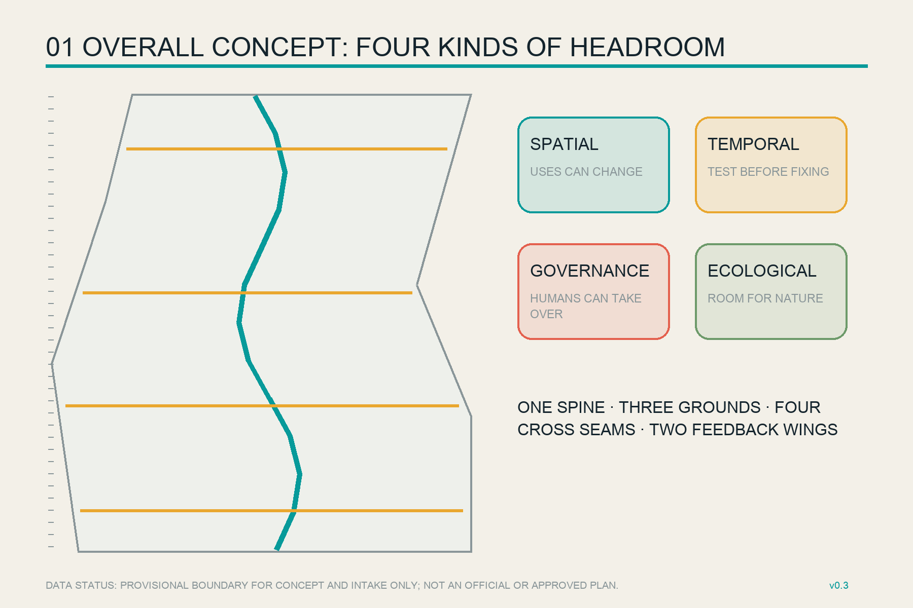
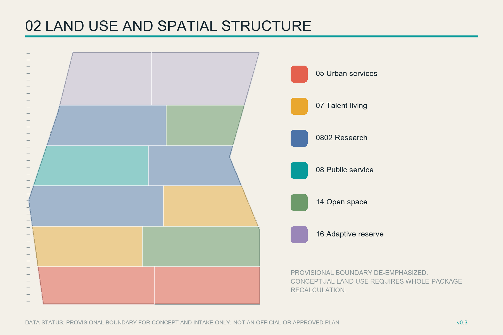
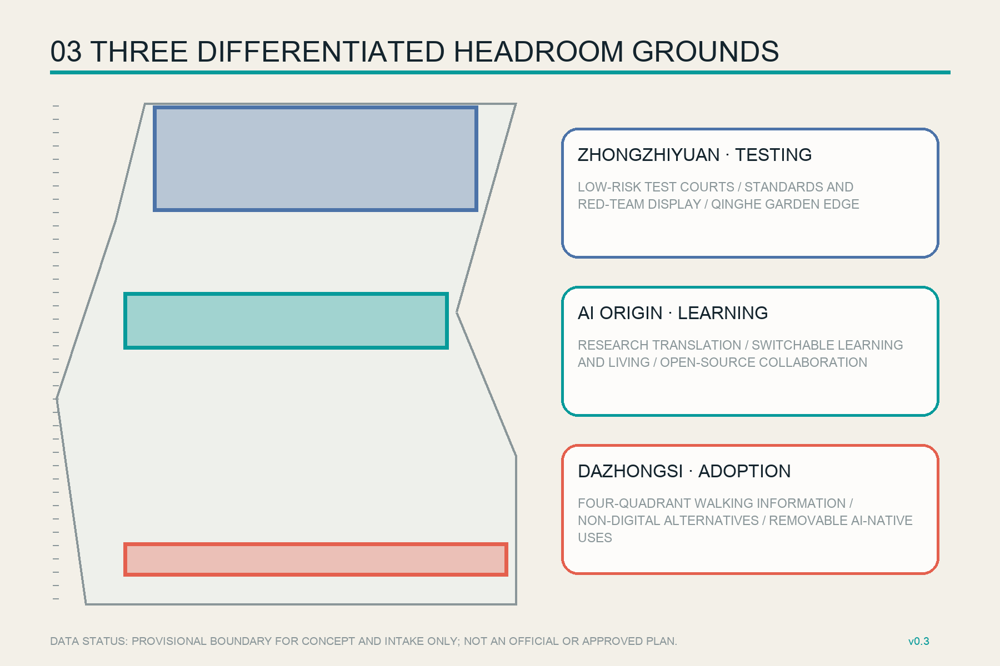
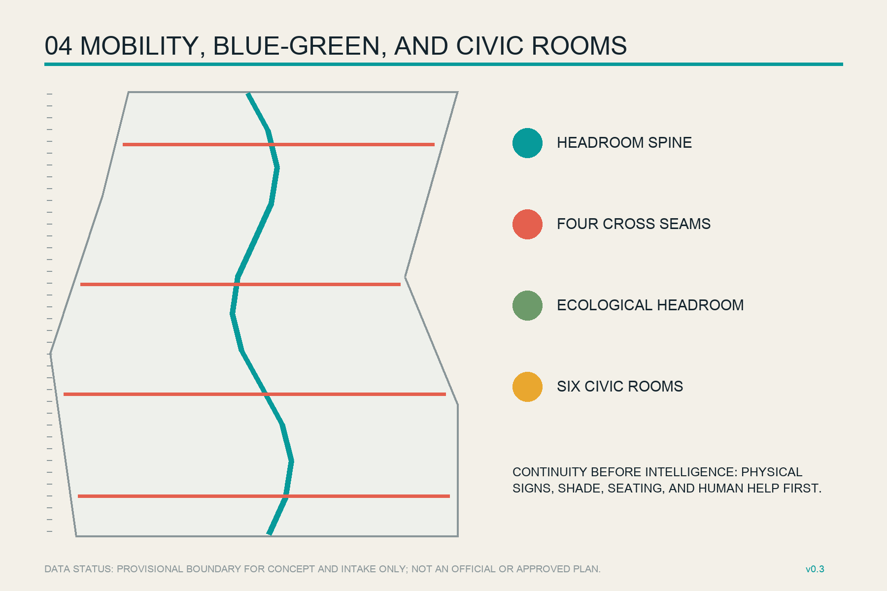
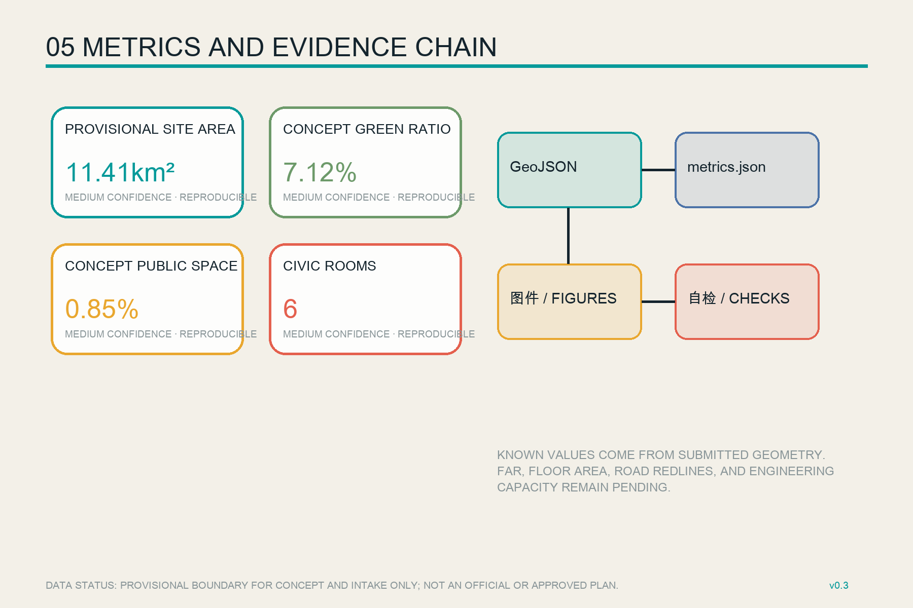

# JING-ZHANG HEADROOM

> Make room for what AI cannot yet know.

## Design Basis and Source List

This proposal draws what is known and unknown at the same time. The official announcement confirms the three scope levels and the tasks for three key areas, but the repository does not yet contain verifiable official polygons, regulatory controls, road sections, existing-building surveys, or ownership data. Repository-maintained provisional polygons are therefore used only for generation, discussion, visualization, and intake checks. Area fitting is never represented as an official planning boundary. [source:OFFICIAL-ANNOUNCEMENT] [source:BOUNDARY-SOURCE] [depth:existing_conditions_diagnosis]

The evidence chain separates official task and standards sources, the cleared Agent taskbook, and provisional geometry. The central registry and processed fact pack help enforce permitted uses without creating new authority. [source:SOURCE-REGISTRY] [source:PROCESSED-FACT-PACK] [source:AGENT-TASKBOOK]

The submitted site and all three key areas remain explicitly provisional. When official CAD, GIS, or cleared PDF geometry becomes available, the whole package - land use, buildings, mobility, green and public space, phasing, figures, and metrics - must be recalculated together. [data:geometry/site_boundary.geojson#SITE-001] [data:geometry/key_areas.geojson#PROV-KEY-001] [metric:site_area_sqm]

## Three-Level Scope Framework

Jing-Zhang Headroom assigns a decision scale to each official scope. The Coordinated Research Area frames industry and regional coordination; the Overall Design Area frames continuous public space and renewal structure; the Key-Area Detailed Design Area tests transferable spatial prototypes. Four kinds of headroom run through all scales: spatial room for changing uses, temporal room to test before fixing, governance room for human takeover and non-digital alternatives, and ecological room for later blue-green and comfort studies. [standard:PROJECT-OFFICIAL-ANNOUNCEMENT] [depth:three_level_scope_framework] [depth:overall_spatial_structure]

The structure is one Headroom Spine, three Headroom Grounds, four cross seams, and two feedback wings. The spine supports heritage reading, walking, and cycling; the three grounds focus on testing, learning and transfer, and civic adoption; cross seams reconnect daily life east and west; the two wings return professional services and real-use feedback to the innovation cycle. [data:geometry/roads.geojson#ROAD-001] [data:geometry/public_space.geojson#PUBLIC-001]

## Coordinated Research Area: Industry and Future City Research

Six cases contribute mechanisms rather than transferable quantities. Kendall Square connects innovation with housing, community, and public space; one-north coordinates work, live, play, and learn precincts; Mila/Mile-Ex co-locates open science, talent, and technology transfer; Paris-Saclay mixes station access, laboratories, housing, and third places; Zhangjiang links science, industry, city, and monitoring; Hetao foregrounds cross-boundary rules, pilot translation, and professional services. [source:CASE-KENDALL] [source:CASE-ONE-NORTH] [source:CASE-MILA]

The local translation is sixfold: shared small units for startups, public ground floors, everyday services alongside workplaces, explicit test-entry and exit gates, cross-institution third places, and public annual evaluation. Paris-Saclay, Zhangjiang, and Hetao remain background comparisons and cannot supply Haidian's statutory controls. [source:CASE-PARIS-SACLAY] [source:CASE-ZHANGJIANG] [source:CASE-HETAO]

The primary name is JING-ZHANG HEADROOM. Its logo direction uses two parallel rail lines below an open-topped frame. The rails carry the century-old lineage; the open frame represents capacity that remains revisable; four gaps stand for spatial, temporal, governance, and ecological headroom. [standard:PROJECT-AGENT-OPEN-CALL-TASKBOOK] [depth:overall_spatial_structure]

## Overall Design Area: Urban Renewal and Regulatory-Plan-Level Urban Design

Twelve gap-free conceptual land-use units cover the provisional boundary. They combine research, public innovation services, talent living, AI-native urban services, open space, and adaptive reserve. Repository land-use codes keep the scheme machine-readable, while every polygon remains a design recommendation rather than an approved parcel use. [standard:MNR-LAND-USE-CLASSIFICATION-GUIDE] [data:geometry/land_use.geojson#LU-001] [depth:land_use_layout]

Twenty-two small reversible building prototypes explain massing, public ground-floor interfaces, and sequencing. They are not claimed as surveyed existing buildings or committed projects. Without ownership, FAR, height, setback, and building-condition data, the strategy is retain first, test with low disturbance, and renew only after evidence gates. [data:geometry/buildings.geojson#BLDG-001] [depth:retain_renovate_demolish] [depth:development_intensity_controls]

Urban character guidance favors low bases, open ground floors, visible maintenance, and traceable materials. Exact heights, intensity, roofs, and skyline controls remain pending official planning, heritage, aviation, and engineering conditions. [standard:MOHURD-CONTROL-DETAILED-PLANNING] [depth:height_massing_character]

## Detailed Design of Key Areas

Zhongzhiyuan becomes the Testing Headroom Ground. Garden research space surrounds low-risk, containable, pausable testing courts for edge devices, robots, model evaluation, and public display of standards and red-team findings. Transport, river, ecological, and engineering conditions require specialist confirmation. [data:geometry/key_areas.geojson#PROV-KEY-001] [depth:three_key_area_detailed_design]

Beijing AI Origin Community becomes the Learning Headroom Ground. Research outputs pass through open critique, skill translation, and limited trials before incubation. Talent living, community service, quiet learning, and night collaboration share switchable rooms; any campus or neighborhood intervention depends on ownership consent and survey evidence. [data:geometry/key_areas.geojson#PROV-KEY-002] [source:AGENT-TASKBOOK]

Dazhongsi becomes the Adoption Headroom Ground. Continuous walking guidance, non-digital information points, and removable AI-native retail prototypes connect the station quadrants. Every public service display must expose scope, human support, and an exit route. [data:geometry/key_areas.geojson#PROV-KEY-003] [standard:MOHURD-URBAN-DESIGN-MEASURES]

Three pilgrimage and honor nodes complete the system: the Headroom Gauge publishes evidence status and scenario entry levels; the Open Switch Hall records code, standards, labor, and corrections; the Century Buffer Garden combines railway history, quiet rest, and non-digital service. All are conceptual public-space components, not approved buildings.

## AI Innovation Ecosystem, Personas, and AI+ Scenarios

Six personas cover researchers and students, startup teams, enterprise engineers, residents with care duties, older or disabled visitors, and international guests and frontline workers. Every persona receives a path to use, refuse, seek help, use human service, and correct records. The proposal does not use personal trajectories or infer sensitive attributes. [source:DATA-SRC-BARRIER-FREE-ENVIRONMENT-LAW] [depth:municipal_new_infrastructure]

Twelve scenario cards form four groups. Three industrial tests cover open-model check-in, pop-up edge compute, and a low-speed robotics sandbox. Civic services cover accessible travel help, a human-parallel community counter, and walking-gap inspection. Learning and culture cover research translation, heritage interpretation, and an open contribution ledger. Operations cover low-disturbance night collaboration, a public-space maintenance assistant, and Headroom Week. Every card specifies public value, minimum data, accountable people, a non-digital alternative, pause conditions, and asset exit. [source:DATA-SRC-GENERATIVE-AI-INTERIM-MEASURES] [data:geometry/public_space.geojson#PUBLIC-001]

| Card | Place | Human and exit boundary |
| --- | --- | --- |
| S01 Open-model check-in (test) | Zhongzhiyuan governance court | Human release and expiry |
| S02 Pop-up edge compute (test) | Removable testing unit | Energy and safety review |
| S03 Low-speed robotics sandbox (test) | Contained loop | On-site steward; stop on anomaly |
| S04 Accessible travel help | Headroom Spine | Physical signs and staffed help remain |
| S05 Human-parallel service counter | Origin Community | No mandatory account or app |
| S06 Walking-gap inspection | Four cross seams | Facility data only; human work order |
| S07 Research translation class | Open classroom | Sources and uncertainty visible |
| S08 Heritage interpretation | Century Buffer Garden | Printed mode remains available |
| S09 Open contribution ledger | Open Switch Hall | Correction and withdrawal supported |
| S10 Low-disturbance night work | Switchable ground floor | Human time and noise management |
| S11 Maintenance assistant | Six Civic Rooms | Suggestions only; no automated enforcement |
| S12 Headroom Week | Public route | Event remains a permitted proposal |

## Land Use, Building Scale, and Retain-Renovate-Demolish Strategy

Twelve units form a complete topology using shared cut lines. Research, public service, living, commercial service, open-space, and reserve areas are recalculated in EPSG:4548. They compare the proposed structure and do not approve parcels. [metric:land_use_05_area_sqm] [metric:land_use_07_area_sqm] [metric:land_use_0802_area_sqm]

Public-service, open-space, and adaptive-reserve areas are equally reproducible. Official polygons trigger a full repartition and prevent current values from becoming fixed ratios. [metric:land_use_08_area_sqm] [metric:land_use_14_area_sqm] [metric:land_use_16_area_sqm]

Building footprints describe conceptual prototypes only. After surveys, four evidence gates test ownership and safety, retention value, low-disturbance adaptation, and only then demolition or new construction. [metric:building_footprint_area_sqm] [depth:retain_renovate_demolish]

## Transport, Rail, Municipal Infrastructure, and Public Services

One north-south walking and cycling spine and four east-west seams support heritage continuity, key-area access, and ordinary crossings. The measured centerline length describes a conceptual network, not a road redline, engineering alignment, or traffic-capacity finding. [metric:road_centerline_length_m] [data:geometry/roads.geojson#ROAD-001] [depth:traffic_rail_slow_parking]

Station integration follows continuity before intelligence: accessible routes, shade, seating, lighting, cycle parking, and physical signs precede live information. On-site guidance and human service remain for the public-service contexts expressly covered by the cited law; the proposal also encourages clear non-digital alternatives elsewhere without misrepresenting the legal scope. [source:DATA-SRC-BARRIER-FREE-ENVIRONMENT-LAW] [source:DATA-SRC-ELDERLY-SMART-TECH-PLAN-2020-45]

Utilities, fire access, drainage, pipelines, and energy loads remain pending professional data. Edge compute is a pluggable, metered, removable prototype; capacity and routing require specialist review. [data:geometry/constraints.geojson] [depth:municipal_new_infrastructure]

## Blue-Green Network, Public Space, and Urban Character

The ecological headroom spine combines a continuous green band with four enlarged pockets; six Civic Rooms sit alongside it. Together they reserve places for shade, rest, encounter, testing buffers, and changing programs. Green and public-space ratios are calculations from conceptual geometry, not statutory controls. [data:geometry/green_space.geojson#GREEN-001] [metric:green_ratio] [metric:public_space_ratio]

The current version contains six rooms to support key-area differentiation and the public experience route. Official boundaries, tree surveys, water and heritage controls, and walking-gap studies must relocate them as needed. [metric:headroom_room_count] [depth:blue_green_public_space]

The character language combines railway discipline with readable AI status: honest structure, visible equipment, low information load, low-glare night lighting, and open maintenance access. Heritage is not technological decoration; it explains how a city works with constraints while retaining the ability to correct itself. [standard:MOHURD-URBAN-DESIGN-MEASURES] [source:SITE-PACKAGE]

## Renewal Projects, Implementation Policy, and Phasing

Seven project packages cover spine calibration, the Zhongzhiyuan testing court, the Origin translation and skills house, Dazhongsi station-quadrant information, six Civic Rooms, three honor nodes, and a scenario entry-pause-exit ledger. Each begins with data, ownership, safety, and accountable-operation checks. [depth:renewal_project_list] [data:geometry/phasing.geojson#PHASE-001]

The three phases are not government commitments or fixed schedules. Phase 1 uses removable pilots and public calibration; Phase 2 allows adaptive renewal after ownership and engineering gates; Phase 3 connects official data and long-term operation. Their areas are provisional work zones only. [metric:phase_1_area_sqm] [metric:phase_2_area_sqm] [metric:phase_3_area_sqm]

Quarterly calibration days, a semiannual open review, and an annual Headroom Week form the proposed operating rhythm. Developers, residents, operators, and professionals review public value, exclusion, maintenance burden, and whether a scenario should expand, pause, or retire. [depth:phasing_implementation]

## Metrics, Area Recalculation, and Compliance Matrix

All known values derive from submission geometry. Site area is calculated from a provisional boundary with medium confidence. Three key areas come from provisional features; floor area and FAR remain unknown because official conditions are absent. [metric:site_area_sqm] [metric:key_area_count] [metric:floor_area_ratio]

Green space, public space, building footprints, centerlines, and the six Civic Rooms are reproducible. Figures and HTML interpret these records without creating separate values. [metric:green_ratio] [metric:public_space_ratio] [metric:building_footprint_area_sqm]

The compliance matrix covers the announcement and all six Agent tasks; the standards matrix covers five mandatory sources; the design-depth matrix covers fifteen formal items. The architectural design-depth reference lacks an official local snapshot and remains a disclosed data gap rather than a claimed compliance result. [standard:MOHURD-ARCH-DESIGN-DEPTH-2016] [depth:metrics_recalculation]

## Risk, Copyright, and Compliance

The leading risk is mistaking provisional geometry, conceptual metrics, or event proposals for official decisions. Other gaps concern existing buildings, ownership, heritage, road, utility, and public-service data. Dashed styling, provisional roles, unknown metrics, human review, and whole-package recalculation reduce but cannot remove those dependencies. [depth:risk_missing_data] [source:KEY-AREA-SOURCE]

Every AI scenario follows a minimum-data, purpose-limited, accountable-human, non-digital-alternative, complaint-correction, and exit contract. Generative-AI rules are cited only within their scope and do not prove filing, security assessment, or case-specific compliance. [source:DATA-SRC-GENERATIVE-AI-INTERIM-MEASURES]

All diagrams, logo directions, HTML, and PDFs were generated from the structured package. No commercial map tiles, news imagery, corporate marks, or uncleared portraits are used. Fonts and software are disclosed in the copyright statement. This is an open co-creation proposal, not a statutory plan or government approval.

Version v0.3 is submitted under the GitHub identity `zhangitit`; this attribution migration does not change the spatial proposal, metric definitions, or evidence limits.

## References

The evidence chain controls design intensity rather than decorating the end of the document. The official announcement and site package establish the three scope levels, task limits, and professional vocabulary. The cleared Agent taskbook establishes the six required responses, scenario directions, and open-source collaboration requirements. [source:OFFICIAL-ANNOUNCEMENT] [source:SITE-PACKAGE] [source:AGENT-TASKBOOK]

The source registry and processed fact pack test what each record can and cannot support. Together they make “headroom” a spatial response to incomplete evidence, not a styling theme. [source:SOURCE-REGISTRY] [source:PROCESSED-FACT-PACK]

Provisional overall and key-area polygons may only generate `SITE_BOUNDARY`, `KEY_AREA`, and derivative conceptual geometry. Current areas, ratios, footprints, and route lengths are reproducible proposal metrics rather than statutory controls. Six case sources contribute mechanisms such as mixed use, open science, third places, cross-boundary coordination, and adaptive evaluation; their scale, policy, governance, and performance are not transferred to Haidian. Full URLs, access dates, authority levels, permitted uses, and limitations are recorded in `sources.json`. [source:BOUNDARY-SOURCE] [source:KEY-AREA-SOURCE] [metric:site_area_sqm]

Official polygons, planning controls, existing buildings, ownership, road sections, utility capacity, heritage, fire, drainage, and service inventories remain missing. Any decisive new dataset must trigger a whole-package review of geometry, metrics, three matrices, bilingual figures, HTML, and PDFs. Until then, the references support concept comparison and a review entry point, not approval, investment, or engineering conclusions.
