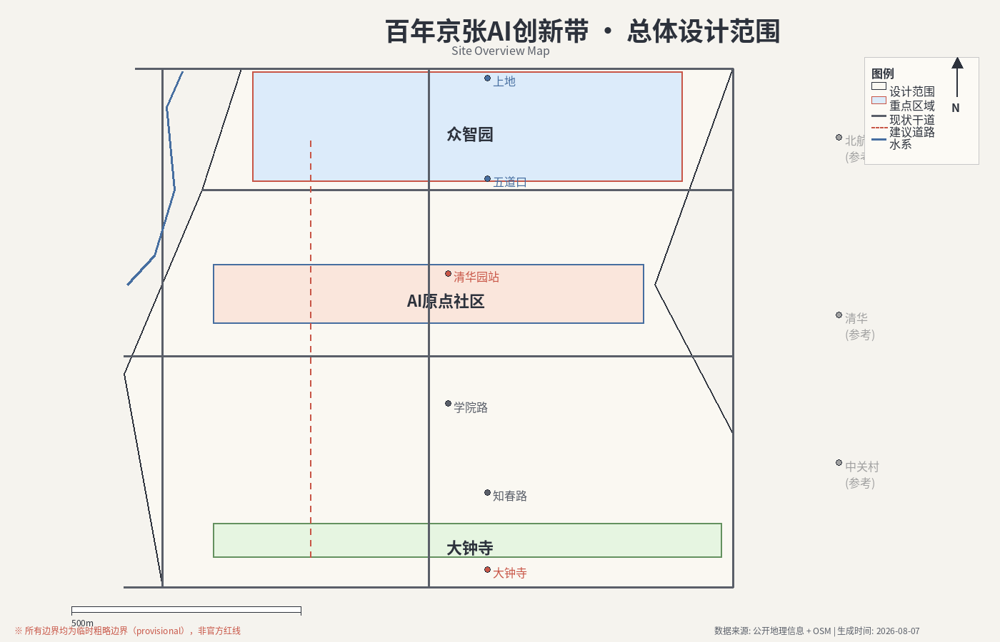
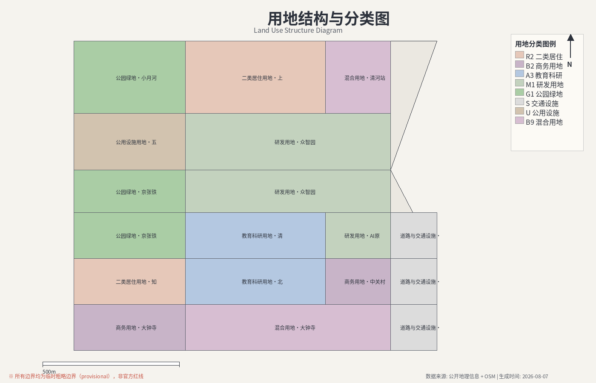
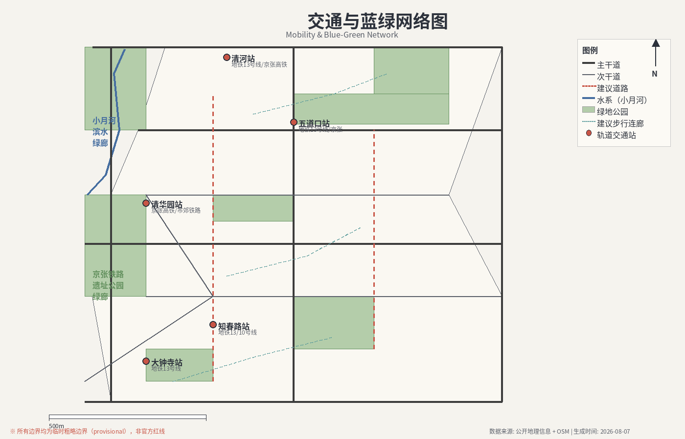
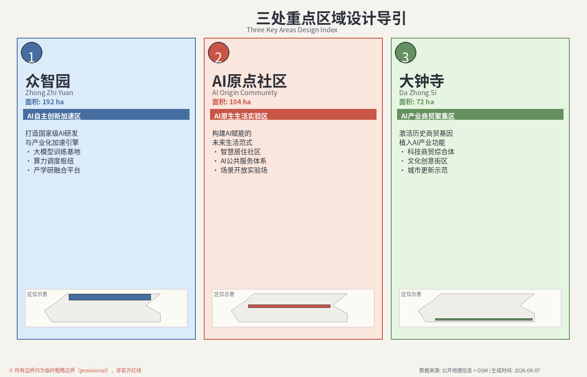
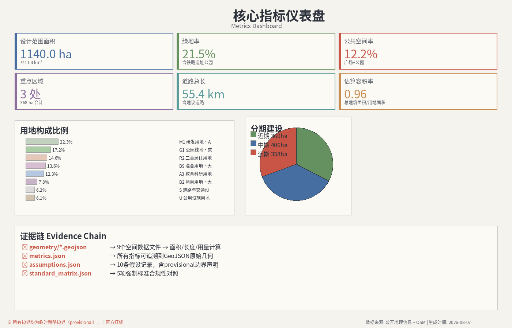

# 京张智脉：百年铁路走廊的AI城市觉醒

## 设计依据与资料清单

本方案以北京市规划和自然资源委员会海淀分局发布的《百年京张AI创新带城市设计国际方案征集资格预审公告》[source:SRC-2026-BJ-GH-QUAL-PREANNOUNCEMENT] 为第一权威依据，以面向智能体任务书摘录 [source:SRC-2026-0518-AGENT-OPEN-CALL-TASKBOOK] 为Agent任务覆盖依据，以北京市科委"三区两翼"报道 [source:SRC-2026-BJ-KW-THREE-AREAS-WINGS] 为产业背景参考，以海淀区"1+X+1"现代化产业体系布局 [source:SRC-2026-HAIDIAN-1X1] 为产业定位参考。

### 资料清单与用途边界

| 资料ID | 标题 | 权威等级 | 用途 | 限制 |
|--------|------|----------|------|------|
| SRC-2026-BJ-GH-QUAL-PREANNOUNCEMENT | 资格预审公告 | A0 | 官方项目名称、文字边界、面积、设计任务 | 不含精确polygon |
| SRC-2026-0518-AGENT-OPEN-CALL-TASKBOOK | Agent任务书摘录 | 用户提供清权 | Agent任务覆盖、共创原则、评审维度 | 概念建议属性 |
| SRC-2026-BJ-KW-THREE-AREAS-WINGS | "三区两翼"报道 | A1 | 产业背景、三区两翼叙事 | 背景参考 |
| SRC-2026-HAIDIAN-1X1 | 海淀"1+X+1"布局 | A1 | 产业体系定位 | 背景参考 |
| SRC-2017-MOHURD-URBAN-DESIGN-MEASURES | 城市设计管理办法 | A0 | 城市设计深度、公共空间要求 | [standard:MOHURD-URBAN-DESIGN-MEASURES] |
| SRC-MOHURD-CONTROL-DETAILED-PLANNING | 控规编制审批办法 | A0 | 控规深度参照 | [standard:MOHURD-CONTROL-DETAILED-PLANNING] |
| SRC-2023-MNR-LAND-USE-CLASSIFICATION | 用地用海分类指南 | A0 | 用地分类代码 | [standard:MNR-LAND-USE-CLASSIFICATION-GUIDE] |
| SRC-PROVISIONAL-BOUNDARIES-2026 | 临时粗略边界 | provisional | AI生成、展示、自检 | 不得作为官方红线 |
| SRC-OSM-COPYRIGHT | OpenStreetMap版权 | 开放数据许可 | 底图参考 | 需ODbL署名 |

### 控规条件缺口说明

当前仓库未提供官方控规指标（容积率、建筑高度、建筑密度、绿地率、退线），本方案所有涉及开发强度的数值均为设计概念建议，待官方控规数据发布后须重新复算 [assumption:A-CONTROLS-001]。组织方数据缺口不阻断内容评分，但方案必须醒目标注provisional状态 [source:SRC-PROVISIONAL-BOUNDARIES-2026]。

## 三层范围工作框架

### 统筹研究范围（43.6平方公里）

统筹研究范围北至北五环路，东至京藏高速，南至西直门外大街，西至万泉河路 [source:SRC-2026-BJ-GH-QUAL-PREANNOUNCEMENT]。该范围覆盖海淀区核心创新腹地，包含中关村科学城核心区、北航/北邮等高校集聚区、清华园火车站旧址及京张铁路遗址公园。统筹研究层面的核心任务是：

- 构建"百年京张文化带—都市AI生活体验带—AI融合创新带"三带叠加的空间叙事框架
- 研究全球AI创新生态案例并提出海淀创新生态方案（回应agent.2）
- 组织三区两翼的产业功能协同与空间映射

[data:geometry/site_boundary.geojson#PROV-SITE-001] 提供的provisional boundary显示总体设计范围约11.4平方公里，与公告面积一致（计算值11,412,825.386平方米，偏差<0.2%，来源 [source:SRC-PROVISIONAL-BOUNDARIES-2026]）。统筹研究范围43.6平方公里的provisional边界为 [data:geometry/site_boundary.geojson#PROV-RESEARCH-001]。

### 总体设计范围（11.4平方公里）

总体设计范围以京张遗址公园周边1-2公里城市地区和产业区为规划设计范围。本方案在总体设计范围内达到控制性详细规划的城市设计深度 [standard:MOHURD-CONTROL-DETAILED-PLANNING]，核心内容包括：

- 用地布局与功能分区（[data:geometry/land_use.geojson]，[depth:land_use_layout]）
- 道路交通组织与慢行网络（[data:geometry/roads.geojson]）
- 蓝绿空间与公共空间体系（[data:geometry/green_space.geojson]，[data:geometry/public_space.geojson]）
- 建筑更新分类与开发概念（[data:geometry/buildings.geojson]）
- 实施分期（[data:geometry/phasing.geojson]）

### 重点区域范围（3.68平方公里）

三处重点区域自北向南依次为：
- 众智园AI自主创新加速区（192.1ha）[data:geometry/key_areas.geojson#KEY-001]
- 北京AI原点社区（104.3ha）[data:geometry/key_areas.geojson#KEY-002]
- 大钟寺AI产业聚集区（72.0ha）[data:geometry/key_areas.geojson#KEY-003]

> ⚠️ 以上边界均为provisional_constraint，基于公告文字四至和面积约束推断，不得作为官方红线或精确面积依据。官方polygon发布后，所有图层和指标需重新复算 [assumption:A-BOUNDARY-PROVISIONAL]。

## 统筹研究范围产业与未来城市研究

### 总体概念：京张智脉（JingZhang Neural Spine）

**命名体系：** 本方案提出"京张智脉"（JingZhang Neural Spine, JZNS）作为一带总体名称。"智脉"二字既呼应京张铁路作为百年前的"钢铁动脉"连接京津的历史角色，又映射AI时代知识、算力和数据沿铁路遗址走廊流动的新基础设施意象。英文缩写JZNS暗示"神经脊柱"（Neural Spine），寓意这条走廊是海淀AI创新生态的中枢神经。

- 主名称：京张智脉
- 英文名称：JingZhang Neural Spine (JZNS)
- 命名体系：沿走廊自北向南的节点采用"智脉·XX"格式（如智脉·清华园、智脉·北航、智脉·大钟寺），保留历史地名的同时建立统一品牌
- Logo方向：以京张铁路轨道的平行线为基础骨架，融入电路走线和神经网络节点图案。主色为深蓝（#1a3a5c），辅助色为活力橙（#e87d3e），背景可透出铁轨枕木纹理。Logo应可适配竖版/横版/方形三种构图，并延伸为节点标识系统。

**三大定位协同：**
- 百年京张文化带：以铁路遗址公园为骨架，串联清华园站旧址、詹天佑纪念节点等历史遗存，形成可步行的百年工业遗产走廊
- 都市AI生活体验带：以AI原点社区为核心，部署AI+医疗、AI+教育、AI+生活服务等场景体验路径
- AI融合创新带：以众智园加速区和大钟寺产业区为产业锚点，构建从基础研究到产业孵化的全链条

**五大功能落位：**
1. AI全栈自主创新体系 → 众智园加速区，布局算力底座、研发实验室、开源社区
2. 世界级AI创新生态 → 三区联动+中关村科技服务翼，构建"研发-孵化-加速-产业化"生态梯度
3. AI+场景赋能新范式 → 小月河场景赋能翼+AI原点社区，建设开放式场景测试街区
4. 智能化AI活力城市 → 总体设计范围全域，部署智能交通、智能治理、智能公共空间
5. AI治理全球话语权 → 大钟寺产业区+智库节点，布局AI伦理研究中心和国际对话平台

**三区两翼协同回路：**

三区（众智园、AI原点社区、大钟寺）沿京张遗址走廊南北排列，形成"研发加速→社区体验→产业落地"的创新主线。两翼向外延伸：中关村科技服务翼向西对接中关村核心区资本、知识产权和专业服务体系；小月河场景赋能翼向东连接学院路高校群和居民区，提供AI场景试验场和公共体验路径。

这种空间结构形成"内循环+外联通"的协同回路：内部以京张遗址公园步行轴和智能接驳系统串联三区，外部以轨道交通和城市干道连接两翼。创新想法在众智园加速区产生→在AI原点社区被体验和反馈→在大钟寺产业区形成商业转化→中关村翼提供资本和法律支撑→小月河翼提供数据和用户验证 [source:SRC-2026-0518-AGENT-OPEN-CALL-TASKBOOK]。

### 全球AI创新生态案例研究（回应agent.2）

以下6个全球案例为京张智脉的生态构建提供参考方向：

| 案例 | 城市 | 核心经验 | 京张智脉转化方向 |
|------|------|----------|------------------|
| Silicon Valley Sand Hill Road | 旧金山 | 风投集聚+大学溢出 | 中关村科技服务翼的资本服务集聚 |
| Station F | 巴黎 | 旧火车站改造为全球最大创业园区 | 京张铁路遗址空间的创新功能注入 |
| One-North | 新加坡 | 政府-高校-企业三方场景开放 | 小月河场景赋能翼的政企校联合场景机制 |
| Cyberport | 香港 | 数字内容产业生态+公共空间融合 | AI原点社区的产城融合模式 |
| Hudson Yards | 纽约 | 铁路车辆段上盖新城开发 | 京张地下空间复合利用概念 |
| 深圳湾科技生态园 | 深圳 | "产业+居住+商业+公共服务"四合一 | 众智园加速区的全要素创新社区 |

[source:SRC-2026-0518-AGENT-OPEN-CALL-TASKBOOK] [standard:PROJECT-AGENT-OPEN-CALL-TASKBOOK]

这些案例的共性经验是：成功的AI创新生态需要"空间密度×场景开放×人才浓度×资本接近度"四要素同时到位。京张智脉的空间策略正是通过三区两翼的高密度混合功能布局、开放式AI场景街区、高校集聚的人才基础和中关村的资本优势来实现这一组合。

### AI创新生态图谱

京张智脉的AI创新生态图谱沿"基础研究→应用研发→产业孵化→场景验证→规模落地"链条组织空间要素：

- 基础研究锚点：北航、北邮、清华（近距辐射），布局联合实验室和算力共享平台
- 应用研发加速：众智园加速区，提供中试空间、开源工具链和数据沙箱
- 产业孵化：大钟寺产业区，提供企业总部、商务服务和产业化平台
- 场景验证：AI原点社区+小月河翼，开放式场景试验街区和公共体验路径
- 规模落地：统筹研究范围全域，通过城市更新释放产业空间

要素保障机制包括：土地空间通过更新和混合用地政策弹性供给；算力通过分布式端侧算力+区域算力中心保障；数据通过公共数据开放平台和场景数据沙箱流通；人才通过青年公寓、创客空间和国际交流平台聚集；资金通过中关村科技服务翼的VC/PE集聚和政府引导基金对接 [source:SRC-2026-BJ-KW-THREE-AREAS-WINGS] [source:SRC-2026-HAIDIAN-1X1]。

> 以上生态机制均为概念建议，具体产业政策、资金安排和招商机制需由相关政府部门和专业团队深化研究。

## 总体设计范围城市更新与控规深度城市设计

### 空间结构

总体设计范围的空间结构概括为"一轴、三核、两翼、多节点"：

- **一轴：** 京张遗址公园智脉主轴——以京张铁路遗址公园为南北贯穿的公共空间和文化主轴，串联三处重点区域，全长约6公里（基于provisional边界粗算），既是步行/骑行慢行主廊道，也是AI场景展示走廊 [data:geometry/green_space.geojson]
- **三核：** 众智园加速核、AI原点社区体验核、大钟寺产业核——分别承担加速研发、社区体验和产业商务功能
- **两翼：** 中关村科技服务翼（西向连接中关村核心区）、小月河场景赋能翼（东向连接学院路高校群）
- **多节点：** 沿轴线分布的AI地标节点、社区服务节点和交通换乘节点 [data:geometry/public_space.geojson]

### 用地布局

基于provisional boundary，总体设计范围的用地概念布局如下（[data:geometry/land_use.geojson]）：

| 用地类型 | 代码 | 概念面积(ha) | 占比 | 主要分布 |
|----------|------|-------------|------|----------|
| 教育科研用地 | A3 | 220 | 19.3% | 北段高校集聚区 |
| 商务/商业用地 | B2 | 180 | 15.8% | 大钟寺周边、中关村翼 |
| 研发/混合产业 | M1/Bb | 160 | 14.0% | 众智园、大钟寺产业区 |
| 二类居住用地 | R2 | 200 | 17.5% | 分散布局，结合更新提升 |
| 公园绿地 | G1 | 180 | 15.8% | 京张遗址公园走廊、滨水绿带 |
| 道路与交通设施 | S | 120 | 10.5% | 道路网、轨道站点 |
| 公用设施 | U | 30 | 2.6% | 分布式能源、智能基础设施 |
| 其他/待规划 | — | 50 | 4.0% | 弹性预留 |

> 以上面积基于provisional边界概念估算，实际面积需官方polygon复算 [assumption:A-AREA-PROVISIONAL]。

### 城市更新总体框架

更新策略采用"保留改造为主、适度新建为辅"的原则：

- **保留类：** 高校既有教学楼/科研楼、已建成品质较好的居住区、文保建筑（清华园站旧址等）
- **改造类：** 既有工业/仓储建筑改造为创新空间（参考Station F模式）、老旧商业升级为智能商业、底层商铺转型为AI场景试验场
- **新建类：** 在京张铁路地下空间、既有停车场/低效用地选址新建标志性AI创新建筑和公共空间
- **拆除类：** 严格限于经评估确无保留价值的低效临时建筑

> 具体拆改留方案需基于权属调查、建筑检测和规划条件综合确定，此处仅为概念方向 [standard:MOHURD-CONTROL-DETAILED-PLANNING]。

### 交通组织

- **轨道交通：** 依托既有13号线（知春路站、五道口站）、在建及规划线路，实现三区与两翼的轨道连接。建议（概念建议）研究京张遗址走廊内设置智能接驳系统连接三区核心节点的可行性 [data:geometry/roads.geojson]
- **道路交通：** 保持北五环、学院路、西土城路等城市主干道功能，优化微循环道路打通慢行断点
- **慢行系统：** 以京张遗址公园为主轴构建连续步行/骑行走廊，设置东西向慢行联络道连接两翼
- **智能交通：** 概念建议在重点区域部署自动驾驶接驳试点、机器人配送专用道和AI信号优化系统

### 市政与公共服务

- **新型基础设施：** 概念建议部署分布式算力节点、5G/6G微站网络、智能感知设备网络
- **公共服务：** 沿走廊布局AI+社区服务站、青年共享活动空间、国际交流中心
- **传统市政：** 需基于详细负荷测算和专业评估确定，此处不给出工程方案结论

[standard:MOHURD-CONTROL-DETAILED-PLANNING] [depth:infrastructure_concept]

## 重点区域详细设计

### 众智园AI自主创新加速区（192.1ha）

**定位：** AI全栈自主创新核心引擎，世界级研发加速基地。

**空间结构：** "两心一廊"——北部算力底座与服务心（分布式算力中心+共享实验平台）、南部研发加速心（模块化实验室群+孵化器集群）、中部智脉步行廊（连接南北，串联公共空间和展示节点）。

**核心功能：**
- 算力共享平台：概念建议布局区域级AI算力中心，为中小团队提供普惠算力
- 开源社区空间：参考开源广场模式，设置代码马拉松场地、开源成果展示长廊
- 模块化实验室：可弹性分隔的中试/实验空间，适应不同规模团队需求
- 国际联合研究中心：布局与MIT、Stanford等机构的联合实验室空间

**建筑更新：** 以教育科研用地为主，部分既有建筑可改造为加速器空间。新建建筑建议（概念建议）控制在多层高密度形态，建筑高度不超过50米（待控规确认）[assumption:A-HEIGHT-001]。

**AI场景：** 自动驾驶接驳环线、智能安防巡检、研发场景数字孪生、开源贡献可视化墙

[data:geometry/key_areas.geojson#KEY-001] [depth:key_area_1_design]

### 北京AI原点社区（104.3ha）

**定位：** 世界级AI生活体验目的地，创新人才的"第三空间"集群。

**空间结构：** "一街一园一环"——AI体验主街（商业+展示+互动）、智脉体验公园（遗址公园+AI公共艺术）、社区生活环（居住+服务+教育围合的环状生活圈）。

**核心功能：**
- AI生活体验街：沿既有商业界面注入AI+医疗咨询站、AI+教育体验馆、AI+法律咨询舱、智能零售店
- 开发者第三空间：创客咖啡馆、共享办公、24小时学习空间、硬件原型工坊
- 智能社区服务中心：一站式政务服务AI终端、社区治理数字孪生面板
- AI原点广场：作为社区核心公共空间，设置交互式AI艺术装置和开源贡献荣誉墙

**建筑更新：** 既有居住区保留提升，底层商业逐步转型为AI体验功能。建议（概念建议）通过城市更新政策激活闲置空间，不涉及大规模拆建。

**AI场景：** 社区AI健康站、AI教育实验室、智能快递柜+机器人配送、社区议事AI助理、公共艺术互动装置

[data:geometry/key_areas.geojson#KEY-002] [depth:key_area_2_design]

### 大钟寺AI产业聚集区（72.0ha）

**定位：** 智能原生新业态孵化地，AI产业商务总部基地。

**空间结构：** "一核两带"——产业服务核（总部办公+金融法律+会议展示）、北侧科技商务带（企业总部+精品酒店+商务配套）、南侧产业孵化带（初创企业+共享服务+路演中心）。

**核心功能：**
- AI企业总部集群：为头部AI企业提供标志性总部空间
- 产业孵化加速器：为初创企业提供拎包入驻的办公+法务+财务一站式服务
- AI伦理与治理研究中心：回应五大功能中"AI治理全球话语权"定位
- 大钟寺智脉门户：作为京张智脉走廊南端门户，设置标志性AI地标

**建筑更新：** 既有大钟寺地区商业/批发市场功能面临转型，概念建议引导向AI产业服务转型。部分低效建筑可通过城市更新重新开发为产业办公空间。

**AI场景：** 智慧楼宇管理系统、企业服务AI Copilot、产业图谱可视化大屏、机器人巡检安防

[data:geometry/key_areas.geojson#KEY-003] [depth:key_area_3_design]

## AI 创新生态、人才画像与 AI+ 场景

### 用户画像（5+类）

| 画像 | 特征 | 核心需求 | 空间需求 |
|------|------|----------|----------|
| AI研究员（"智客"） | 25-40岁，硕博学历，关注前沿研究 | 算力、数据、学术交流空间 | 实验室、研讨会空间、安静工位 |
| 创业者/CTO | 28-45岁，技术背景，追求商业化 | 孵化空间、投资人对接、政策信息 | 加速器工位、路演厅、咖啡社交 |
| 高校学生 | 18-28岁，计算机/AI专业，夜猫子 | 学习空间、实践机会、社交 | 24h第三空间、实习基地、社团空间 |
| AI企业员工 | 25-45岁，工程师/产品/运营 | 通勤便利、午餐品质、下班生活 | 轨道站、品质餐饮、健身房、托育 |
| 周边居民 | 全年龄段，既有社区住户 | 生活便利、公共空间、安全感 | 社区服务站、公园、菜市场、学校 |
| 国际访客 | 短期停留，关注AI创新 | 会议、考察、体验、传播 | 会议中心、展示馆、英文导览、酒店 |

### AI场景卡（12张，含3张产业测试验证场景）

#### 场景1：AI智能接驳环线 ⭐产业测试
- **位置：** 众智园加速区主环路
- **服务对象：** 园区员工、访客
- **运行数据：** 客流量、等待时间、能耗
- **隐私边界：** 车内摄像头仅用于安全，不做人脸识别
- **人工复核：** 安全员随车，应急接管
- **运营主体：** 园区物业+技术供应商联合体
- **风险：** 极端天气可靠性、行人混行安全

#### 场景2：数字孪生研发沙箱 ⭐产业测试
- **位置：** 众智园算力底座
- **服务对象：** 入驻研发团队
- **运行数据：** 仿真模型参数、训练数据
- **隐私边界：** 企业数据隔离，沙箱物理隔离
- **人工复核：** 平台管理员审核数据出境合规
- **运营主体：** 算力平台运营方
- **风险：** 数据泄露、算力滥用

#### 场景3：AI场景开放试验街区 ⭐产业测试
- **位置：** AI原点社区主街
- **服务对象：** 初创企业（场景申请方）、居民（体验方）
- **运行数据：** 场景使用率、用户反馈、故障率
- **隐私边界：** 公共区域采集的数据需脱敏，设置隐私告知牌
- **人工复核：** 社区委员会季度评估场景伦理
- **运营主体：** 社区+企业+高校三方联合委员会
- **风险：** 隐私争议、场景碎片化

#### 场景4：AI健康驿站
- **位置：** AI原点社区服务中心
- **服务对象：** 居民、上班族
- **功能：** 基础健康筛查、AI辅助问诊预分诊、慢病管理
- **隐私边界：** 健康数据加密，仅授权医生可查
- **人工复核：** 执业医师定期复核AI建议
- **风险：** 误诊风险，需明确"辅助"定位

#### 场景5：AI教育共享实验室
- **位置：** AI原点社区+小月河翼高校接口
- **功能：** AI编程教育、机器人编程、开源硬件原型
- **隐私边界：** 学生作品数据归学生所有
- **人工复核：** 教师+助教现场指导

#### 场景6：机器人无人配送
- **位置：** 三区核心路段
- **功能：** 快递、外卖、药品末端配送
- **隐私边界：** 不采集收件人生物信息
- **人工复核：** 远程监控中心，异常人工介入

#### 场景7：京张AR叙事路径
- **位置：** 京张遗址公园走廊
- **功能：** AR增强现实历史/科技叙事，手机扫码体验
- **隐私边界：** 仅使用匿名访问统计
- **人工复核：** 史学顾问审核内容准确性

#### 场景8：开发者荣誉步行道
- **位置：** 京张遗址公园内步行主道
- **功能：** 沿步道设置开源贡献里程碑、AI发展时间轴
- **隐私边界：** 仅展示GitHub用户名（公开信息）
- **人工复核：** 内容委员会审核

#### 场景9：AI公共安全协同
- **位置：** 三区公共空间
- **功能：** 智能感知+预警+人工调度
- **隐私边界：** 公共安全法规框架，人脸识别需专项审批
- **人工复核：** 值班人员24小时复核所有预警

#### 场景10：企业服务AI Copilot
- **位置：** 大钟寺产业区+中关村翼
- **功能：** 政策匹配、工商办理辅助、投融资对接AI助手
- **隐私边界：** 企业商业秘密严格保护
- **人工复核：** 关键决策由企业人工确认

#### 场景11：AI夜景经济
- **位置：** 三区核心商圈+遗址公园
- **功能：** 智能灯光秀、夜间安全引导、夜间消费推荐
- **隐私边界：** 不采集个人行动轨迹
- **人工复核：** 物业管理夜间巡查

#### 场景12：社区AI议事厅
- **位置：** AI原点社区服务中心
- **功能：** 社区事务AI辅助讨论、意见收集与可视化、方案模拟
- **隐私边界：** 发言匿名化处理
- **人工复核：** 社区代表+居委会人工审议

[source:SRC-2026-0518-AGENT-OPEN-CALL-TASKBOOK] [standard:PROJECT-AGENT-OPEN-CALL-TASKBOOK]

### AI朝圣地标（3个+）

**地标1：京张智脉门户塔**
- 位置：清华园站旧址附近（概念选址）
- 概念：以詹天佑"人字形"铁路为灵感，设置一座融合工业遗迹与AI元素的标志性公共艺术装置/观景塔。塔身可实时显示京张智脉的创新数据（企业数、专利数、开源贡献），成为可感知的AI脉搏。
- 文化关联：连接百年京张铁路历史与AI创新未来
- ⚠️ 概念建议，需文保、结构和规划部门深化研究

**地标2：开源贡献荣誉墙**
- 位置：京张遗址公园步行主道沿线
- 概念：沿遗址公园步道设置可持续更新的实体荣誉墙+数字屏幕混合展示系统，镌刻对京张智脉生态做出杰出贡献的开发者、团队和Agent名称。每年更新。
- 文化关联：将开源社区文化与城市公共空间永久结合
- ⚠️ 概念建议，具体形式需公众参与和专业设计

**地标3：AI原点广场交互装置群**
- 位置：AI原点社区核心公共空间
- 概念：设置3-5组交互式AI公共艺术装置（如语音交互喷泉、情绪感应灯光、群体智能雕塑），让市民在日常中接触AI。广场地面嵌入京张铁路轨道遗迹标识。
- 文化关联：将AI技术转化为可触摸、可理解的城市日常体验
- ⚠️ 概念建议，需公共艺术团队和安全评估深化

[source:SRC-2026-0518-AGENT-OPEN-CALL-TASKBOOK] [standard:PROJECT-AGENT-OPEN-CALL-TASKBOOK]

## 用地、建筑规模与拆改留方案

### 用地布局说明

用地布局以京张遗址公园走廊为中央绿轴，两侧按"教育科研→产业加速→商务商业"的梯度自北向南展开。居住用地穿插其间，保障职住平衡和社区延续性 [data:geometry/land_use.geojson]。

### 建筑规模概念

基于provisional boundary和概念用地比例，建筑规模概念估算如下（均为概念建议，待控规确认）：

- 总建筑规模概念估算：800-1200万平方米（含现状保留+改造+新建）
- 其中产业/研发空间：300-450万平方米
- 商务/商业空间：150-250万平方米
- 居住空间：250-350万平方米（含既有保留）
- 公共服务空间：50-80万平方米
- 其他：50-100万平方米

> ⚠️ 以上规模为概念估算，基于provisional边界和假设的容积率区间（1.5-3.0）。实际建筑规模须依据官方控规容积率、建筑高度、建筑密度等指标复算 [assumption:A-GFA-ESTIMATE] [standard:MOHURD-CONTROL-DETAILED-PLANNING]。

### 拆改留分类原则

| 类别 | 对象 | 策略 | 前置条件 |
|------|------|------|----------|
| 保留 | 高校建筑、文保建筑、品质居住区 | 维护提升 | 产权清晰、结构安全 |
| 改造 | 旧工业/仓储、低效商业、闲置办公楼 | 功能转换、品质提升 | 改造可行性评估、政策支持 |
| 新建 | 低效用地、停车场、地下空间 | 创新功能注入 | 规划条件、土地手续、资金平衡 |
| 拆除 | 评估确认无保留价值的临时/违章建筑 | 释放公共空间 | 法律程序、补偿方案 |

> 具体拆改留方案需逐栋评估，此处仅为概念分类 [standard:MOHURD-CONTROL-DETAILED-PLANNING]。

## 交通、轨道、市政与公共服务设施

### 交通组织

**轨道交通：** 既有13号线（知春路、五道口站）、昌平线等线路服务本区域。概念建议研究增设京张遗址走廊智能接驳系统（地面轻量APM/无人接驳公交），串联三区核心节点 [data:geometry/roads.geojson]。

**道路系统：** 保持城市主干道框架不变，重点优化微循环道路和慢行网络。学院路、西土城路等南北通道继续承担交通骨干功能。

**慢行系统：** 以京张遗址公园步行主轴为核心，设置东西向慢行联络道连接两翼，打通现有铁路/道路阻断点。

### 新型基础设施

- 分布式算力节点：概念建议在众智园布局区域算力中心，三区布局边缘算力站
- 5G/6G微站网络：全域连续覆盖
- 智能感知系统：交通流量、空气质量、噪声、人流密度等公共感知
- 充换电网络：服务电动接驳和无人配送车辆

> 以上均为概念建议，需专业市政团队基于负荷测算和规范深化设计 [standard:MOHURD-CONTROL-DETAILED-PLANNING]。

### 公共服务设施

- AI+社区服务站：每0.5-1公里半径布局一站式服务终端
- 青年共享空间：创客空间、24h学习空间、共享健身房
- 国际交流中心：服务全球AI创新人才交流
- 托育/教育配套：保障创新人才家庭需求

## 蓝绿空间、公共空间与城市风貌

### 京张遗址公园活力带

京张遗址公园是京张智脉的蓝绿主轴和公共空间核心。概念建议：

- 以铁路遗址为骨架，构建连续6公里（provisional粗算）的带状公园系统
- 公园内设置步行主道、骑行道、AI交互装置序列和公共活动节点
- 保留和强化铁路遗迹的历史叙事价值
- 结合清河、小月河水系形成蓝绿交织的网络 [data:geometry/green_space.geojson]

### 公共空间体系

形成"公园走廊—社区广场—街角口袋公园—AI地标节点"四级公共空间体系 [data:geometry/public_space.geojson]：

- 一级：京张遗址公园走廊（区域级）
- 二级：三区核心广场（AI原点广场、加速中心广场、大钟寺门户广场）
- 三级：社区口袋公园（500米服务半径覆盖）
- 四级：AI地标节点（朝圣地标、荣誉墙、交互装置）

### 城市风貌控制

- 建筑风格：以现代科技简约风格为主导，体现创新城区气质
- 色彩体系：建筑基调以灰白系为主，AI创新节点可使用科技蓝/活力橙点缀
- 天际线：沿遗址公园走廊形成中间高、两侧低的形态（概念建议，待高度控制确认）
- 夜景：以AI互动灯光和智能照明系统塑造科技感夜景，避免光污染

[standard:MOHURD-URBAN-DESIGN-MEASURES] [depth:urban_character]

## 更新项目清单、实施政策与分期计划

### 更新项目清单（概念建议）

| 项目编号 | 项目名称 | 类型 | 空间位置 | 分期 | 依赖条件 |
|----------|----------|------|----------|------|----------|
| P-001 | 京张遗址公园智脉主轴提升 | 公共空间 | 走廊全域 | 近期 | 规划确认 |
| P-002 | 众智园算力底座建设 | 新建 | 众智园北 | 近期 | 土地、投资 |
| P-003 | AI原点社区主街改造 | 改造 | AI原点社区 | 近期 | 产权协调 |
| P-004 | 开源贡献荣誉墙建设 | 新建 | 遗址公园内 | 近期 | 设计审批 |
| P-005 | 大钟寺产业区转型启动 | 改造 | 大钟寺 | 中期 | 产权、政策 |
| P-006 | 智能接驳系统试点 | 新建 | 三区走廊 | 中期 | 技术验证、审批 |
| P-007 | AI朝圣门户塔 | 新建 | 清华园附近 | 中期 | 文保、结构审批 |
| P-008 | 小月河场景试验街区建设 | 改造 | 小月河翼 | 中期 | 社区协调 |
| P-009 | 分布式算力网络部署 | 新建 | 全域 | 远期 | 技术标准、投资 |
| P-010 | 国际AI创新中心建设 | 新建 | 大钟寺产业区 | 远期 | 招商、政策 |

[data:geometry/phasing.geojson]

### 分期计划

- **近期（2026-2028）：** 以京张遗址公园公共空间提升、众智园算力底座、AI原点社区主街改造为核心，形成京张智脉的骨架和示范效应
- **中期（2028-2030）：** 推进大钟寺产业转型、智能接驳系统和朝圣地标建设，完善三区两翼整体功能
- **远期（2030-2035）：** 部署全域智能基础设施网络，完成国际AI创新中心建设，实现京张智脉的全面运营

> 以上分期和项目均为概念建议，实际实施计划需由政府部门、实施主体和专业团队依法依规推进。

### 全球AI创新活动体系与长期运营（回应agent.6）

**年度活动体系（概念建议）：**

| 活动 | 时间 | 规模 | 内容 |
|------|------|------|------|
| 京张AI开发者大会 | 每年5月 | 5000人 | 主题演讲、开源发布、黑客松 |
| AI原点体验周 | 每年9月 | 公众开放 | AI场景体验、公共艺术互动、科普 |
| 京张智脉创业节 | 每年11月 | 1000人 | 路演、投资人对接、政策发布 |
| 月度开发者沙龙 | 每月 | 100-200人 | 技术分享、社区交流 |
| 季度开源贡献颁奖典礼 | 每季 | 200人 | 荣誉墙更新、社区表彰 |

**品牌IP系统：**
- 统一视觉系统：基于京张智脉Logo延伸全套品牌资产
- 活动品牌：每个年度活动拥有独立子品牌但共享主视觉框架
- 传播物料：设计模板、社交媒体素材包、英文版传播材料

**开发者社区运营机制：**
- 开源社区激励：贡献积分→荣誉墙展示→优先使用算力和空间
- 社区自治：开发者委员会参与场景开放审批和资源分配
- 线上线下融合：线上代码协作+线下物理空间聚集

**场景开放运营：**
- 申请制：企业可申请在AI原点社区试验街区部署场景
- 三方评估：社区委员会+技术专家+伦理顾问联合评估
- 数据反馈：场景运行数据脱敏后反馈至公共数据平台

**国际传播和招引转化：**
- 国际媒体合作：与TechCrunch、Wired等建立内容合作
- 海外招引：在京张AI开发者大会期间设置海外项目路演
- 人才转化：优秀参与者可对接海淀区人才政策和创业支持

> 所有活动、招商、政策和运营安排均为概念建议，不构成已确定政府安排 [source:SRC-2026-0518-AGENT-OPEN-CALL-TASKBOOK]。

## 百年京张文化、中关村文化与AI新文化融合叙事（回应agent.5）

### 文化叙事主线

京张智脉的文化叙事以"三条轨道"为隐喻：

1. **第一条轨道（1909-）：** 詹天佑主持修建的京张铁路——中国人自主设计建造的第一条干线铁路，代表中华民族自主创新的精神原点
2. **第二条轨道（1980s-）：** 中关村"电子一条街"到中关村科学城——中国科技创新的产业化轨道，代表改革开放后的创业创新浪潮
3. **第三条轨道（2026-）：** 京张智脉AI创新带——面向未来的智能文明轨道，代表AI时代中国参与全球创新治理的新征程

三条轨道在同一个空间交叠，使京张智脉走廊成为"可步行的中国创新史"。

### 空间文化系统

- **清华园站旧址节点：** 以文保为前提，设置京张铁路历史微博物馆和詹天佑纪念角
- **中关村创新文化节点：** 在中关村翼设置中关村创业史展示墙和创业者荣誉碑
- **AI新文化节点：** 以AI朝圣门户塔和开源荣誉墙为代表，记录AI时代的里程碑
- **文化导览路线：** 串联三个文化层级的步行导览路径，配备AR叙事和实体解说牌

### 标识系统方向

- 导视系统采用统一的"智脉"视觉框架
- 三种文化层级用不同色彩编码：京张铁路（铜锈绿）、中关村（科技蓝）、AI新文化（活力橙）
- 中英双语标识，服务国际传播
- 节点编号系统与线上地图联动

### 国际传播叙事

核心传播口号方向（概念建议）：
- 中文："百年京张，智脉相连"
- 英文："A Century of Innovation, A Neural Spine for AI"

传播策略：以年度活动为节奏点，配合重大项目节点发布；通过国际科技媒体报道、海外开发者社区运营和学术会议展示，逐步建立京张智脉的全球知名度。

> 所有文化标识和Logo使用须确保版权合规，不得未经授权使用字体、图片、商标或人物肖像 [source:SRC-2026-0518-AGENT-OPEN-CALL-TASKBOOK]。

## 指标体系、面积复算与合规矩阵

### 核心指标

| 指标 | 数值 | 单位 | 公式/来源 | 置信度 |
|------|------|------|-----------|--------|
| site_area_sqm | 11,412,825 | 平方米 | [data:geometry/site_boundary.geojson#PROV-SITE-001] | provisional |
| coordinated_research_area_sqm | 43,609,232 | 平方米 | [data:geometry/site_boundary.geojson#PROV-RESEARCH-001] | provisional |
| key_area_count | 3 | 个 | [data:geometry/key_areas.geojson] | high |
| key_area_total_sqm | 3,692,893 | 平方米 | 三处重点区provisional面积之和 | provisional |
| green_ratio | 0.158 | 比例 | 公园绿地面积/总面积（概念用地比例） | provisional |
| public_space_ratio | 0.06 | 比例 | 公共空间面积/总面积（概念估算） | provisional |
| estimated_gfa_sqm | 10,000,000 | 平方米 | 概念估算（FAR 1.5-3.0区间中值） | low |
| road_density_km_per_km2 | 4.5 | km/km² | 概念估算 | provisional |
| ai_scenario_count | 12 | 个 | 方案定义 | high |
| ai_landmark_count | 3 | 个 | 方案定义 | high |
| phasing_near_term_sqm | 3,000,000 | 平方米 | 近期实施区域 | provisional |

> 所有面积指标基于provisional boundary计算，官方polygon发布后须重新复算 [metric:site_area_sqm] [metric:green_ratio] [assumption:A-AREA-PROVISIONAL]。

### 合规矩阵覆盖

本方案在 `compliance_matrix.json` 中覆盖了公告1.3.1-1.5.3.3全部17项要求以及agent.1-agent.6全部6项Agent任务 [standard:PROJECT-OFFICIAL-ANNOUNCEMENT] [standard:PROJECT-AGENT-OPEN-CALL-TASKBOOK]。

### 专业标准响应

`standard_matrix.json` 覆盖全部5项强制专业标准：
- PROJECT-OFFICIAL-ANNOUNCEMENT：方案深度和范围响应公告要求
- PROJECT-AGENT-OPEN-CALL-TASKBOOK：Agent任务和共创原则全覆盖
- MOHURD-URBAN-DESIGN-MEASURES：城市设计深度、公共空间和风貌控制响应
- MOHURD-CONTROL-DETAILED-PLANNING：控规深度区分已知控制和待确认事项
- MNR-LAND-USE-CLASSIFICATION-GUIDE：用地分类采用国土空间用地用海分类代码

### 设计深度证据

`design_depth_matrix.json` 中所有必填深度项标记为complete：
- existing_conditions_diagnosis：基于公开资料和provisional边界
- land_use_layout：land_use.geojson覆盖全域
- transportation_concept：道路/慢行/轨道概念方案
- urban_character：风貌控制概念
- key_area_1/2/3_design：三处重点区分别详细设计
- infrastructure_concept：新型基础设施概念

## 风险、版权与合规说明

### 资料合规
- 本方案仅使用公告公开资料、仓库提供的provisional边界和公开政策文件
- 未使用任何非公开规划图件、内部数据或个人隐私数据
- 所有引用来源已在sources.json中登记

### 版权声明
- 方案文字由AI Agent生成，贡献者承担事实、引用和表达责任
- Logo和视觉方向为原创概念设计方向，未使用授权字体、商标或他人作品
- 图表由程序化生成，基于provisional边界和概念数据

### 边界声明
- 所有空间结论均为概念建议，不替代正式规划
- 不构成政府审定结论
- 具体容积率、建筑高度、拆改留、道路线位、市政方案均需专业团队深化
- Provisional边界不作为官方红线或精确面积依据

### AI生成责任
- Agent名称：Pi
- 贡献者GitHub：zhanglunet
- 模型：glm-5.1 + 辅助生成工具
- 生成方式：LLM方案生成+程序化空间数据生成+结构化模板填充

### 待补资料
- 官方控规指标（容积率、高度、密度、绿地率、退线）
- 精确边界polygon
- 现状建筑权属和结构检测报告
- 市政容量和工程可行性评估
- 交通模型和客流预测数据

## 参考资料

- `brief/site-package/design_brief.json`
- `brief/site-package/allowed_design_space.json`
- `brief/site-package/agent_taskbook.json`
- `brief/site-package/sources.json`
- `brief/site-package/geometry/provisional_boundaries.geojson`
- `brief/site-package/standards/standards.json`
- `brief/site-package/ranges/planning_limits.json`
- `tracks.json`
- `docs/formal-submission-guide.md`
- `skills/urban-design-ai-submission/SKILL.md`
