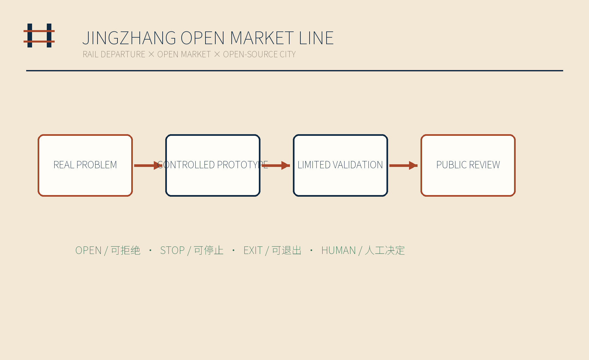
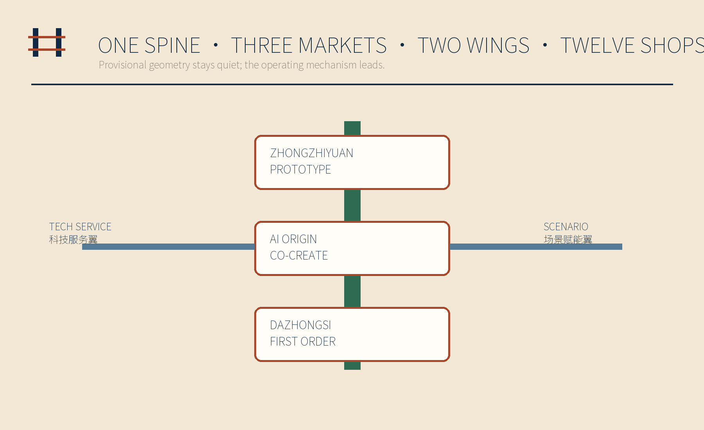
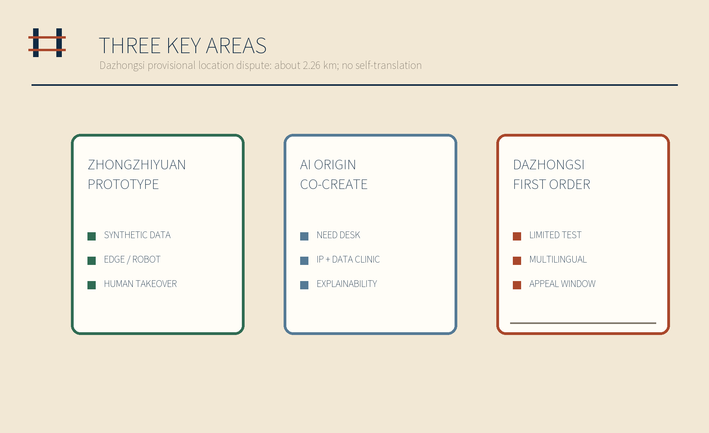
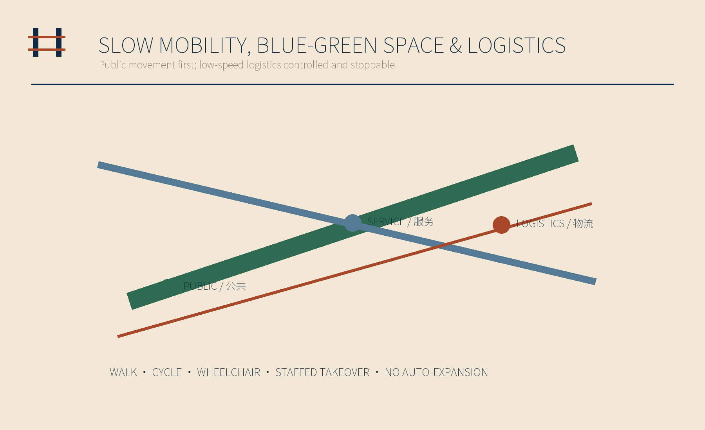
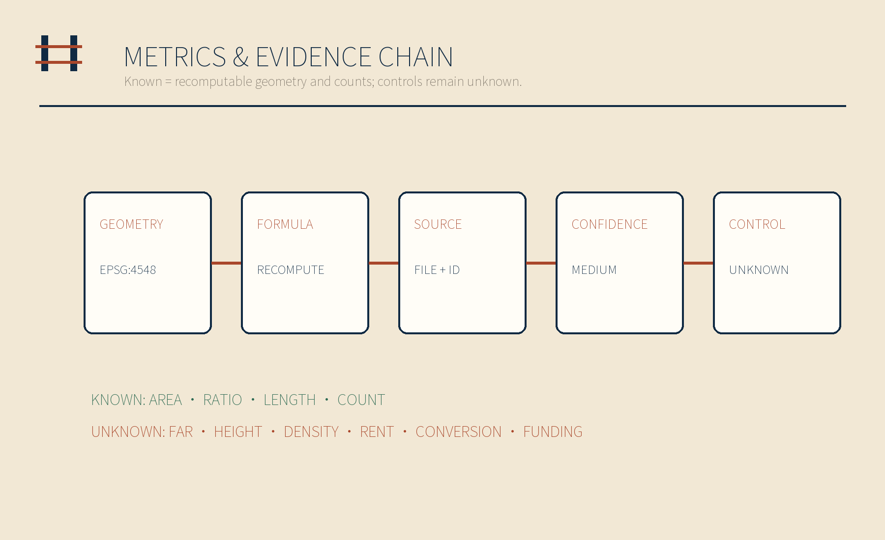

# JINGZHANG OPEN MARKET LINE / 京张开市线

> REAL PROBLEMS → CONTROLLED PROTOTYPES → LIMITED VALIDATION → PUBLIC REVIEW

> Contributor: Ray. Drafted and integrated by OpenAI Codex; reviewed by DeepSeek for government-facing language and by Gemini for visual quality and refinement guidance.

## Design Basis and Source List

This proposal treats the official call, the agent taskbook, the project spatial-data package and the source registry as controlling references. Data-format and text-compliance self-checks are complete. Statutory planning, engineering and other professional conclusions require officially confirmed boundaries and professional source materials. The overall site and all three key areas retain provisional geometry supplied by the project repository. Apparent precision in a drawing is never presented as a legal redline. Haidian’s economic census and 2025 statistical bulletin provide commercial and entrepreneurial context only; they do not establish parcels, merchant counts or development controls. [source:OFFICIAL-ANNOUNCEMENT] [source:AGENT-TASKBOOK] [assumption:A-BOUNDARY-001]

Evidence is separated into four layers: official tasks and standards define what must be answered; provisional area polygons in the project repository provide the current reproducible frame; submitted land use, prototype buildings, routes, green space, public space and phasing are conceptual design proposals; global precedents support mechanism translation only. The Dazhongsi polygon is not shifted. Issue #1029 records an approximately 2.26 km public location discrepancy between the provisional Dazhongsi key-area polygon and Dazhongsi Station. Before an official boundary is published, this proposal makes no setback, scale or engineering calculation from that relationship. An official replacement triggers a full rebuild rather than a local graphic correction. [source:ISSUE-1029] [data:geometry/key_areas.geojson#PROV-KEY-003] [assumption:A-DAZHONGSI-001]

## Three-Level Scope Framework

At the coordinated-research scale, the proposal asks how an innovation mechanism can connect Haidian’s industry, talent and everyday urban life. At the overall-design scale, that mechanism becomes “one spine, three markets, two wings and twelve shops.” At the key-area scale, controlled prototypes test each district role. The Jingzhang Heritage Park is the public display and slow-mobility spine. The three markets are the Prototyping Market at Zhongzhiyuan, the Co-creation Market at AI Origin Community and the First-order Market at Dazhongsi, meaning a small-scale validation district facing a real market. The two wings connect Zhongguancun technology services and Xiaoyuehe scenario feedback. [source:OFFICIAL-ANNOUNCEMENT] [depth:three_level_scope_framework] [data:geometry/roads.geojson#ROAD-001]

The three scales form one operational chain. A street-level problem enters through a staffed need desk, receives legal, standards and talent support through the service wing, proceeds to a controlled prototype, is publicly explained in the co-creation market and receives a small, stoppable validation in the first-order market. Outcomes return to an annual public ledger, including failed prototypes. Any scale, revenue or policy commitment that cannot be recomputed from submitted evidence remains unknown. [metric:scene_card_count] [metric:land_use_gap_sqm] [assumption:A-CONTROLS-001]

## Coordinated Research Area: Industry and Future City Research

The industrial proposition is a two-way market rather than another generic innovation axis. Small shops, frontline workers and residents post problems that technology teams may not see. AI SMEs and developers bring explainable prototypes into the district. Operators and professional reviewers control entry, test limits and exit. The Zhongguancun technology-service wing exposes legal, standards, intellectual-property, talent and finance information. The Xiaoyuehe scenario wing gathers merchant, resident and public-service feedback without collecting personal profiles or transaction ledgers. [source:HAIDIAN-CENSUS-2024] [source:HAIDIAN-STATS-2025] [assumption:A-PRIVACY-001]

Six global precedents are translated into four mechanisms: needs diagnosis from NYC CDNA, plus test-before-invest and testbeds from EDIHs and the UK Catapult Network. [source:NYC-CDNA] [source:EU-EDIH] [source:UK-CATAPULT] Barcelona Activa contributes distributed services, while Singapore SMEs Go Digital and Seoul AI Hub contribute growth-support patterns. No subsidy value, eligibility promise or policy brand is copied. The mechanisms become four local steps: public problem posting, controlled prototyping, limited validation and public review. [source:BARCELONA-ACTIVA] [source:IMDA-SME-GO-DIGITAL] [source:SEOUL-AI-HUB]

The identity uses parallel rails to form an open gate shaped by the Chinese character 开. It combines railway departure, an open market and an open-source city. Paper cream represents the public ledger, ink navy represents civic order, and rust red marks problems and action. Signal green and amber are limited to “continue” and “review required” states.

## Overall Design Area: Urban Renewal and Regulatory-Plan-Level Urban Design

Seven conceptual land-use bands fully cover the submitted area with mutually aligned edges: access streets, first-order neighborhood commerce, prototyping and enterprise services, the Jingzhang public green spine, open-source culture and display, community co-creation services, and a public review plaza. Geometry is split in EPSG:4548 with identical shared edges and transformed back to EPSG:4326, allowing polygon gaps and overlaps to be recomputed as zero. Registered national land-use codes are used for reviewability, but the allocation is not a statutory land-use plan. [standard:MNR-LAND-USE-CLASSIFICATION-GUIDE] [data:geometry/land_use.geojson#LU-001] [metric:land_use_gap_sqm]

Twelve small footprints represent reversible storefront, prototyping and public-service modules. They do not map real buildings and cannot support conclusions on total floor area, FAR, density or height. [data:geometry/buildings.geojson#BLDG-001] [metric:building_footprint_area_sqm] The mobility layer contains one public slow-mobility spine, two service wings and one low-speed logistics connection; none is a legal road redline. Until regulatory planning, ownership, utility, fire-safety, heritage and engineering inputs are available, the design supports content review and mechanism testing only. [data:geometry/roads.geojson#ROAD-004] [assumption:A-PROTOTYPE-001]

## Detailed Design of Key Areas

The Zhongzhiyuan Prototyping Market hosts synthetic-data work, edge devices, embodied back-of-house trials and human takeover tests. Industry staff define the task, success conditions and prohibited zone before a trial; a person retains the stop control during testing; applicability limits and failure reasons are published afterward. It is not an automation showcase but a controlled test space that exposes safety, standards and operational-maintenance problems while retaining human intervention. [data:geometry/key_areas.geojson#PROV-KEY-001] [source:EU-EDIH] [depth:three_key_area_detailed_design]

The AI Origin Co-creation Market combines an enterprise clinic, staffed merchant need desk, IP and data clinic, and explanation workshops for young people and researchers. Teams must explain in plain language what a prototype does, what it does not do, which data it uses and who can stop it. The Dazhongsi First-order Market hosts limited market validation, multilingual assistance, public review and a staffed appeal window. Because the provisional key-area polygon and Dazhongsi Station have an approximately 2.26 km public location discrepancy, this proposal neither relocates the polygon nor infers a station TOD relationship. [data:geometry/key_areas.geojson#PROV-KEY-002] [data:geometry/key_areas.geojson#PROV-KEY-003] [source:ISSUE-1029]

## AI Innovation Ecosystem, Personas, and AI+ Scenarios

Seven groups jointly form the users and evaluators of the pilot scenarios: small shops and sole traders post testable problems; AI SMEs and developers bring prototypes; frontline service workers judge whether a workflow is real; residents, older people and disabled users test access and fairness; students and researchers support documentation; international talent and visitors test multilingual explanation; and operators with professional reviewers control admission, stopping and appeals. A persona is never a personal scoring label. [metric:persona_count] [assumption:A-PRIVACY-001]

The twelve shops are need posting, synthetic-data laboratory, accessible signage, multilingual service, embodied back-of-house testing, workflow shadow assistant, inventory assistance, enterprise-service clinic, IP and data clinic, public first-sample shelf, first-order market test and annual open-market ledger. Five are explicitly industry-validation scenarios: synthetic data, embodied back-of-house, workflow shadow, inventory assistance and first-order testing. Every scenario provides human decision authority, refusal, immediate stop, data deletion and exit. Low-speed robot delivery is allowed only with physical separation, low speed, staffed takeover and permits. [metric:scene_card_count] [metric:industry_validation_scene_count] [source:AGENT-TASKBOOK]

Four standard scenarios registered in the project repository connect enterprise services, accessible walking diagnosis, low-speed back-of-house logistics and Jingzhang cultural guidance. They are service-prototype entry points, never authorization for automated decisions. [data:geometry/buildings.geojson#BLDG-005] [data:geometry/public_space.geojson#PUBLIC-001]

## Land Use, Building Scale, and Retain-Renovate-Demolish Strategy

Land-use representation follows a simple rule: geometry is computable while regulatory controls remain unknown. Seven LAND_USE polygons fully cover the provisional SITE_BOUNDARY. The 1401 park-green and 1403 plaza polygons are reused in the green-space and public-space layers, so the same claim can be cross-checked. [metric:site_area_sqm] [metric:green_ratio] [metric:public_space_ratio] Known quantities are limited to submitted areas, ratios, lengths and structural counts; confidence is medium because the boundary is provisional. Statutory green-space ratio, FAR, height, density, setbacks and real building scale all remain unknown. [assumption:A-CONTROLS-001]

The twelve footprints implement a reversible alternative to premature retain-renovate-demolish decisions. They make no demolition claim about existing buildings and do not depict permanent development volume. Lightweight storefronts, work rooms and service counters test functional relationships only. Each prototype excludes real merchant mapping, precise addresses and uncleared imagery. Ownership, accessibility, fire safety, structural load, energy, utilities and heritage constraints must be professionally checked before siting. [data:geometry/buildings.geojson#BLDG-012] [depth:retain_renovate_demolish] [assumption:A-PROTOTYPE-001]

## Transport, Rail, Municipal Infrastructure, and Public Services

Mobility separates public movement from service logistics. The Jingzhang spine prioritizes walking, cycling, wheelchair movement and stopping. The Zhongguancun and Xiaoyuehe wings carry information and people. The first-order service link is only a conceptual route for booked, low-speed logistics. Accessible signage is co-checked by users, multilingual service includes staffed escalation, and neither a robot nor an algorithm may expand its own test boundary. [data:geometry/roads.geojson#ROAD-001] [data:geometry/roads.geojson#ROAD-004] [metric:design_road_length_m]

Municipal and public-service planning follows “interfaces before facilities.” Phase one defines professional checklists for power, connectivity, storage, fire safety, stormwater, waste and accessibility without promising edge-compute or charging capacity. Phase two may add removable interfaces after permits and an operator exist. Phase three uses the annual ledger to decide whether any capacity should expand. If OSM is later used for roads, transit or candidate merchant context, ODbL attribution will be shown and missing tags will never be treated as proof of absence. [source:OSM-ODBL] [depth:municipal_new_infrastructure] [assumption:A-OSM-001]

## Blue-Green Network, Public Space, and Urban Character

The Jingzhang Heritage Park is an everyday public display and slow-mobility spine rather than a background for events. It links the issue wall, first-sample shelf and failed-prototype window, making stopping, review and appeal visible. The Xiaoyuehe wing receives neighborhood problem feedback, while all ecological, flood-control and bank-line conclusions wait for professional inputs. Submitted green and public-space ratios describe conceptual geometry only. [data:geometry/green_space.geojson#GREEN-001] [data:geometry/public_space.geojson#PUBLIC-001] [metric:green_ratio]

Four non-entertainment memorials make governance visible. The Opening Bell sounds only after a prototype passes admission. The First-order Monument records who raised the problem, who made the human decision and where the result applies. The Failed Prototype Window preserves the reason a test stopped. The Neighborhood Issue Wall keeps unresolved needs public. Together they turn contribution, failure and exit rights into civic memory rather than replacing public narrative with corporate branding. [metric:memorial_node_count] [source:AGENT-TASKBOOK] [depth:blue_green_public_space]

The visual language comes from railway timetables and market ledgers: rails, numbers, stamps and generous paper space. Provisional boundaries appear as low-contrast dashed lines; rust red marks problems and action; signal green and amber are reserved for review status.

## Renewal Projects, Implementation Policy, and Phasing

Annual operation follows four seasons. Season one publicly gathers problems and staff remove posts involving privacy, illegality or untestable claims. Season two performs synthetic-data and controlled back-of-house trials. Season three conducts limited tests in the co-creation and first-order markets, constrained by quantity, time and space. Season four publishes an annual ledger of success, stopping, appeals, deletion and unresolved problems. Failure is not repackaged as a showcase. [data:geometry/phasing.geojson#PHASE-001] [metric:scene_card_count] [depth:phasing_implementation]

Implementation is ordered by reversibility: begin with a staffed need desk, governance templates and the issue wall; add movable first-sample shelves and signs; only then consider controlled equipment or low-speed logistics. Policy interfaces are proposals for small test-before-buy trials, standards advice, IP and data compliance, procurement neutrality—fair treatment of qualified suppliers of different scales and ownership types—and human appeals. They do not claim confirmed funding, venues or partners. Every stage is gated by official area polygons, ownership and professional review. [source:EU-EDIH] [source:BARCELONA-ACTIVA] [assumption:A-PARTNERS-001]

The phasing GeoJSON fully partitions the provisional site as a conceptual sequence, not a construction schedule. Official geometry replacement requires regeneration of every polygon, metric, figure, HTML page, PDF and manifest hash. [data:geometry/phasing.geojson#PHASE-003] [assumption:A-BOUNDARY-001]

## Metrics, Area Recalculation, and Compliance Matrix

Metrics use two columns: known and recomputable, or unknown and never imputed. Every known item stores value, unit, formula, source file, confidence and assumptions. Items include overall area, land-use coverage, gap, overlap, prototype footprint, green and public-space ratios, design route length, and structural counts for three markets, twelve shops, seven personas and four memorial nodes. [metric:site_area_sqm] [metric:land_use_overlap_sqm] [metric:building_footprint_area_sqm] Area and length are recalculated in EPSG:4548, with responsibility recorded in the design-depth matrix. [depth:metrics_recalculation]

Unknown items include FAR, building height, statutory density, actual merchant count, rent, first-order conversion and policy funding. No target or estimate for them appears in a figure. `compliance_matrix.json` covers the official tasks and agent.1–agent.6; `standard_matrix.json` covers professional standards; and `design_depth_matrix.json` links narrative, drawings, geometry, metrics, sources, assumptions and checks. [standard:MOHURD-CONTROL-DETAILED-PLANNING] [assumption:A-CONTROLS-001]

## Risk, Copyright, and Compliance

This submission has completed text and data-format self-checks. It has not entered statutory planning review or engineering approval; all content remains a conceptual design proposal and does not represent an official position or approval. Later conclusions require an officially confirmed site boundary (SITE_BOUNDARY), three key-area polygons (KEY_AREA), regulatory planning, road-redline, ownership, utility, fire-safety, accessibility and heritage inputs. The status semantics in Issue #1368 and location discrepancy in Issue #1029 remain explicit. Any official geometry update triggers a full-chain rebuild. [source:ISSUE-1368] [source:ISSUE-1029] [assumption:A-BOUNDARY-001]

All figures are generated specifically for this submission. No third-party photograph, company mark or uncleared asset is used. PDFs embed a subset of Noto Sans SC under SIL Open Font License 1.1. The web pages load no CDN, remote tile, external font, iframe, form or network request and perform no tracking. Data governance requires minimization, human review, refusal, immediate stop and exit. [source:NOTO-SANS-SC] [assumption:A-PRIVACY-001]

Issue #1545 is closed, but several Actions runs were still queued at the final pre-submission check. If the recorded pre-job queue failure recurs, locally passed evidence will be preserved and the condition reported accurately. `jobs=0`, a queued state or a local PASS will never be presented as official validation. [source:ISSUE-1545] [depth:risk_missing_data]

## References

Controlling project sources are the official call, repository `brief/site-package/`, `data/source_registry.json` and `data/processed/agent_fact_pack.md`. Registered professional references cover urban design, regulatory-plan depth, national land-use classification, generative AI, accessibility and ageing. Each entry, allowed use and license boundary is recorded in `sources.json`. [source:OFFICIAL-ANNOUNCEMENT] [source:SITE-PACKAGE] [source:SOURCE-REGISTRY]

Background sources are Haidian’s fifth economic census bulletin and 2025 statistical bulletin; they describe district-level commercial and entrepreneurial context only. [source:HAIDIAN-CENSUS-2024] [source:HAIDIAN-STATS-2025] The first precedent group is IMDA SMEs Go Digital, European Digital Innovation Hubs and NYC Commercial District Needs Assessments. [source:IMDA-SME-GO-DIGITAL] [source:EU-EDIH] [source:NYC-CDNA] The second group is Barcelona Activa, Seoul AI Hub and the UK Catapult Network. Both groups support needs diagnosis, test-before-buy, distributed services, testbeds and growth support only; they do not support spatial controls or policy commitments. [source:BARCELONA-ACTIVA] [source:SEOUL-AI-HUB] [source:UK-CATAPULT]

Any later open-data background will retain OSM ODbL attribution. Font provenance and generation software are documented in the copyright statement. Complete machine indexes are in `sources.json`, `metrics.json`, `assumptions.json`, `compliance_matrix.json`, `standard_matrix.json` and `design_depth_matrix.json`. [source:OSM-ODBL] [source:NOTO-SANS-SC]
