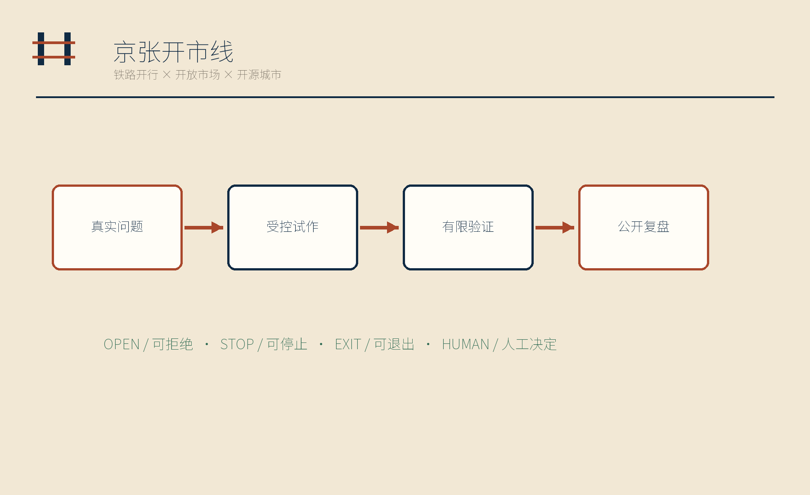
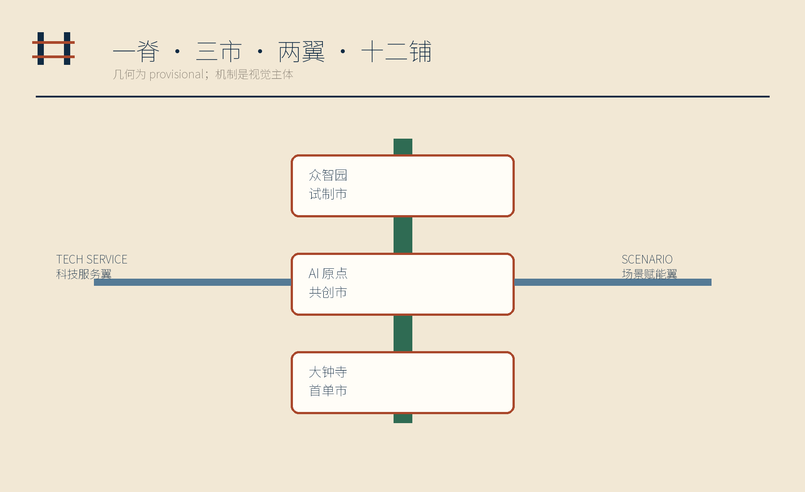
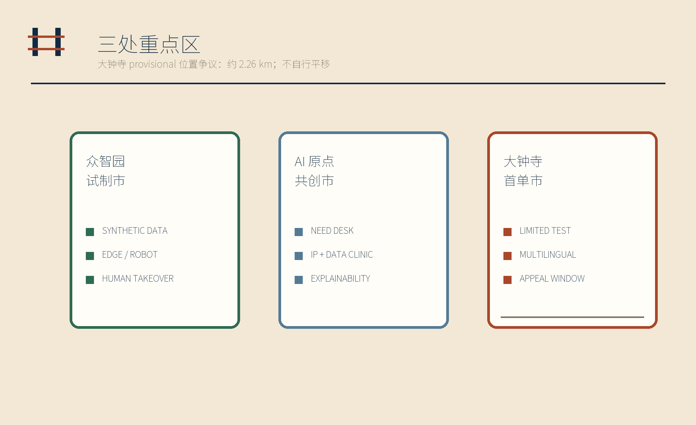
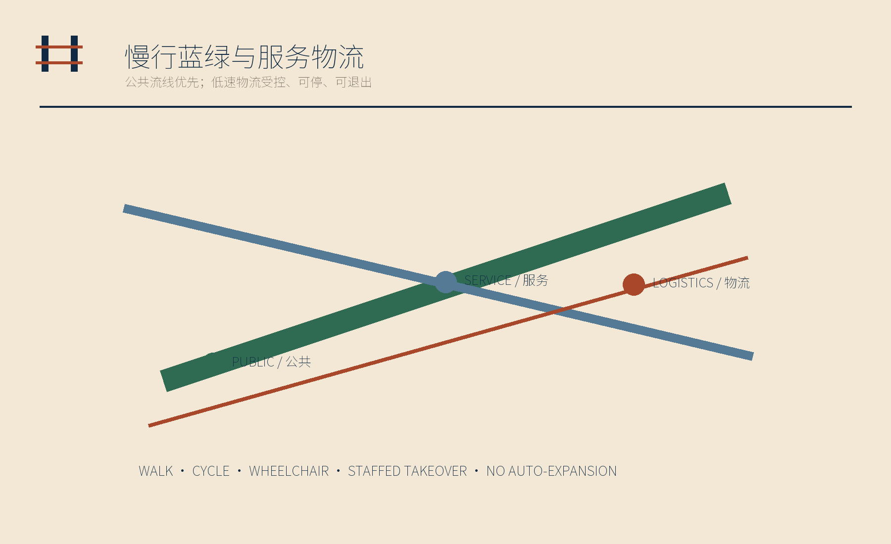
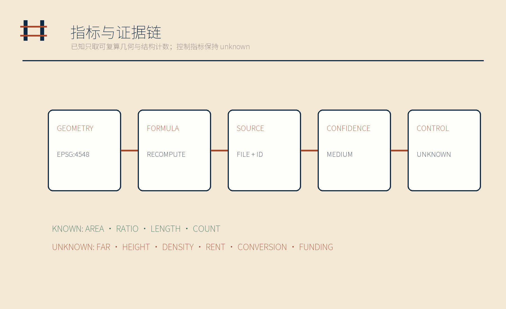

# 京张开市线 / JINGZHANG OPEN MARKET LINE

> 小店提出真实问题 — AI 团队受控试作 — 街区有限验证 — 结果公开复盘

> 贡献者 Ray；由 OpenAI Codex 主笔与整合，DeepSeek 进行政府评审语境文本复核，Gemini 进行视觉复核与优化建议。

## 设计依据与资料清单

本方案以征集公告、面向智能体任务书、项目空间数据包和来源登记表为主控依据；当前已完成数据格式规范性与文本合规性自查。法定规划、工程等专业评审结论，须待官方确定的范围边界及专业资料正式发布后形成。提交中的总体范围与三处重点区均沿用项目数据资源库（Repository）提供的临时几何，不把视觉上的精确边线解释为法定红线。海淀经济普查与 2025 年统计公报只说明商业和创业环境，不用于推导地块、商户数量或开发控制。[source:OFFICIAL-ANNOUNCEMENT] [source:AGENT-TASKBOOK] [assumption:A-BOUNDARY-001]

资料分为四层：官方任务与专业标准决定必须回答什么；项目数据资源库的临时范围图斑提供当前可复算框架；本方案生成的用地、原型建筑、道路、绿地、公共空间和分期属于概念设计建议；全球案例只提供机制对照。大钟寺范围不作自定义平移：Issue #1029 记录的约 2.26 km，是大钟寺临时重点区图斑与大钟寺站之间的公开位置差异；在官方边界发布前，本方案不据此进行退距、规模或工程测算。官方范围图斑一旦发布便触发整链复算，而不是局部替图。[source:ISSUE-1029] [data:geometry/key_areas.geojson#PROV-KEY-003] [assumption:A-DAZHONGSI-001]

## 三层范围工作框架

统筹研究范围回答创新机制如何连接海淀的产业、人才和城市生活；总体设计范围把机制落成“一脊、三市、两翼、十二铺”；三处重点区以受控原型验证各自的空间角色。京张遗址公园是公共展示与慢行主脊，三市分别是众智园试制市、AI 原点社区共创市和大钟寺首单市（即面向真实市场的小规模验证区），两翼分别连接中关村科技服务与小月河场景反馈。[source:OFFICIAL-ANNOUNCEMENT] [depth:three_level_scope_framework] [data:geometry/roads.geojson#ROAD-001]

三层不是三套互不相干的图纸：真实问题从街区进入需求台，经服务翼匹配法务、标准和人才支持，在试制市完成受控试作，再进入共创市公开解释，最后在首单市进行小规模、可停止的市场验证。结果回到年度开市账本，失败原型同样被记录。任何超出提交几何可复算范围的规模、收益和政策承诺都保持 unknown。[metric:scene_card_count] [metric:land_use_gap_sqm] [assumption:A-CONTROLS-001]

## 统筹研究范围产业与未来城市研究

京张开市线的产业命题不是再造一个“创新轴”，而是建立双向市场：小店、一线劳动者和居民提出未被技术团队看见的问题；AI 中小企业和开发者带着可解释原型进入街区；运营与专业复核人员控制准入、测试范围和退出。中关村科技服务翼提供法务、标准、知识产权、人才与融资信息接口，小月河场景赋能翼汇集居民、商户和公共服务反馈，但不汇集个人画像或交易流水。[source:HAIDIAN-CENSUS-2024] [source:HAIDIAN-STATS-2025] [assumption:A-PRIVACY-001]

六个全球案例只被转译为四种机制：NYC CDNA 的需求诊断、EU EDIH 与 UK Catapult 的先测后买和测试床。[source:NYC-CDNA] [source:EU-EDIH] [source:UK-CATAPULT] Barcelona Activa 的分布式服务、Singapore SMEs Go Digital 与 Seoul AI Hub 的成长支持构成另一组对照。方案不复制补贴数值、准入承诺或政策品牌，而把这些机制压缩成公开挂单、受控试作、有限验证和公开复盘四步。[source:BARCELONA-ACTIVA] [source:IMDA-SME-GO-DIGITAL] [source:SEOUL-AI-HUB]

品牌以平行铁轨构成开放的“开”字门架：铁路开行、开放市场、开源城市三义叠合。纸本米色是账页，墨蓝是基础秩序，锈红标记问题与行动；信号绿和琥珀色只表达“可继续/需复核”状态，不制造技术乐观主义。

## 总体设计范围城市更新与控规深度城市设计

总体空间以七个完整覆盖提交范围且边线相互衔接的概念用地带表达，从南到北依次组织接驳街巷、首单邻里商业、试制与企业服务、京张公共绿脊、开源文化展示、社区共创服务和公开复盘广场。切分在 EPSG:4548 中完成并复用共享边，再转回 EPSG:4326；因此图斑间隙（gap）与重叠（overlap）均可由 GeoJSON 复算为零。分类沿用项目数据资源库登记的国土空间用地代码，但结果是设计分配，不是法定用地方案。[standard:MNR-LAND-USE-CLASSIFICATION-GUIDE] [data:geometry/land_use.geojson#LU-001] [metric:land_use_gap_sqm]

十二个小尺度建筑基底只代表可逆店面、试制和公共服务模块，不对应真实楼栋，也不支持总建筑规模、容积率、密度或高度结论。[data:geometry/buildings.geojson#BLDG-001] [metric:building_footprint_area_sqm] 交通图层表达一条公共慢行主脊、两条服务翼和一条低速物流接驳；所有道路均非道路红线。正式控规、权属、市政、消防、文保和工程条件到位前，设计只能支持内容评议和机制验证。[data:geometry/roads.geojson#ROAD-004] [assumption:A-PROTOTYPE-001]

## 重点区域详细设计

众智园“试制市”承载合成数据、边缘设备、机器人后场与人工接管测试。测试前由行业人员界定任务、成功条件和禁区；测试中保留人工停机；测试后公开适用边界和失败原因。它不是无人化展示区，而是用于在受控条件下暴露安全、标准与运维保障问题，并保留人工干预机制的试验空间。[data:geometry/key_areas.geojson#PROV-KEY-001] [source:EU-EDIH] [depth:three_key_area_detailed_design]

AI 原点社区“共创市”设置企业服务诊所、商户需求台、知识产权与数据诊所，以及青年和研究者可参与的解释工作坊。团队必须用普通语言说明原型做什么、不做什么、使用什么数据、谁能停止，并接受小店和一线劳动者的拒绝。大钟寺“首单市”组织小规模市场验证、多语服务、公开复盘和人工申诉；临时重点区图斑与大钟寺站之间存在约 2.26 km 的公开位置差异，本方案不移动该图斑，也不据此推断大钟寺站 TOD 关系。[data:geometry/key_areas.geojson#PROV-KEY-002] [data:geometry/key_areas.geojson#PROV-KEY-003] [source:ISSUE-1029]

## AI 创新生态、人才画像与 AI+ 场景

七类人群共同构成试点场景的使用与评价主体：小店与个体经营者提出可付诸试验的问题；AI 中小企业与开发者提供原型；一线服务劳动者判断工作流是否真实；居民及老年、残障使用者检查可达性与公平；学生和研究者协助记录；国际人才与访客检查多语解释；运营与专业复核人员负责准入、停机和申诉。任何画像都不是个人评分标签。[metric:persona_count] [assumption:A-PRIVACY-001]

十二铺依次为需求挂单、合成数据实验、可达性标牌、多语服务、具身后场测试、工作流影子助手、库存辅助、企业服务诊所、知识产权与数据诊所、公共首样架、首单市场测试、年度开市账本。其中合成数据实验、具身后场测试、工作流影子助手、库存辅助、首单市场测试五项标记为产业测试验证场景。每一项都必须有人工决定权、拒绝参与权、立即停止机制、数据删除与退出路径；机器人低速配送只在物理隔离、低速、有人接管和许可成立时测试。[metric:scene_card_count] [metric:industry_validation_scene_count] [source:AGENT-TASKBOOK]

项目数据资源库登记的四个标准场景分别用于企业诊所、无障碍步行诊断、低速后场物流和京张文化导览；它们是服务原型入口，不是自动决策授权。[data:geometry/buildings.geojson#BLDG-005] [data:geometry/public_space.geojson#PUBLIC-001]

## 用地、建筑规模与拆改留方案

用地表达坚持“几何可算、控制未知”。七个 LAND_USE 面完整覆盖 provisional SITE_BOUNDARY，1401 公园绿地和 1403 广场用地分别复用于绿地与公共空间图层，保证同一空间主张能被交叉审查。[metric:site_area_sqm] [metric:green_ratio] [metric:public_space_ratio] 已知量仅包括提交几何面积、比例、长度和结构计数；其置信度随 provisional 边界降为 medium。法定绿地率、容积率、建筑高度、建筑密度、退线和真实建筑规模全部保留 unknown。[assumption:A-CONTROLS-001]

十二个建筑原型采用“可逆、可拆、可停”的拆改留替代策略：不对现状楼栋作拆除判断，不绘制永久建设量，只以轻量店面、试制间和公共服务台验证功能关系。每个原型约束为无真实商户映射、无精确门牌、无未经清权图片；正式落位前需完成权属、无障碍、消防、荷载、能源和文保核验。[data:geometry/buildings.geojson#BLDG-012] [depth:retain_renovate_demolish] [assumption:A-PROTOTYPE-001]

## 交通、轨道、市政与公共服务设施

交通系统区分公共流线和服务物流：京张公共慢行主脊优先步行、骑行、轮椅与停留；中关村科技服务翼和小月河场景赋能翼承载信息与人员联系；首单服务接驳只为预约式低速物流提供概念路径。可达性标牌由使用者共同校验，多语服务提供人工转接，机器人或算法不得自行扩大测试边界。[data:geometry/roads.geojson#ROAD-001] [data:geometry/roads.geojson#ROAD-004] [metric:design_road_length_m]

市政与公共服务采用“先接口、后设施”原则：阶段一只定义电力、网络、存储、消防、雨洪、垃圾和无障碍的专业核对清单，不承诺端侧算力或充电设施容量；阶段二在许可与运营主体明确后布置可撤回接口；阶段三才依据年度账本判断是否扩展。OpenStreetMap（OSM，开放街道地图）若后续用于道路、公交与候选商户背景，将按 ODbL（开放数据库许可）标注署名，且标签缺失不解释为设施不存在。[source:OSM-ODBL] [depth:municipal_new_infrastructure] [assumption:A-OSM-001]

## 蓝绿空间、公共空间与城市风貌

京张遗址公园被定义为日常公共展示与慢行主脊，而非活动背景板。绿脊串联需求墙、首样架和失败原型橱窗，为停留、复核与申诉提供可见空间；小月河翼承担街坊问题反馈，但任何河道、生态、防洪或岸线判断都等待专业资料。提交中的绿地率和公共空间率只描述概念几何，不构成法定指标。[data:geometry/green_space.geojson#GREEN-001] [data:geometry/public_space.geojson#PUBLIC-001] [metric:green_ratio]

四处纪念节点拒绝娱乐化：开市钟只在一个原型通过准入时响；首单碑记录谁提出问题、谁作人工决定及适用边界；失败原型橱窗保存被停止的原因；街坊问题墙持续展示尚未解决的问题。它们把贡献、失败和退出权变成城市记忆，而不是以企业品牌替代公共叙事。[metric:memorial_node_count] [source:AGENT-TASKBOOK] [depth:blue_green_public_space]

风貌语言取自铁路时刻表与市场账页：线性轨道、编号、盖章和留白形成低成本、可维护的识别系统。临时边界在所有图件中只用低对比虚线，锈红用于问题与行动，信号绿与琥珀色只表示审查状态。

## 更新项目清单、实施政策与分期计划

年度运营遵循四季循环：第一季公开征集问题并由人工剔除涉及隐私、违法或不可验证的挂单；第二季在试制市做合成数据与后场受控试作；第三季在共创市和首单市开展限量、限时、限空间验证；第四季公开年度账本，记录成功、停止、申诉、数据删除和未解决问题。失败不会被包装成展示成果。[data:geometry/phasing.geojson#PHASE-001] [metric:scene_card_count] [depth:phasing_implementation]

实施项目按可逆程度排序：先建立需求台、治理模板和问题墙，再布置可移动首样架与标牌，随后才考虑受控后场设备和低速物流。政策接口只提出建议，包括小额先测后买、标准咨询、知识产权与数据合规、采购中立（即对不同规模与所有制的合格供应方公平对待）和人工申诉；不声称资金、场地或合作已获确认。每阶段都以官方范围图斑、权属与专业核验为前置门槛。[source:EU-EDIH] [source:BARCELONA-ACTIVA] [assumption:A-PARTNERS-001]

分期 GeoJSON 对 provisional 范围作完整概念覆盖，但并不等同于建设时序。正式边界替换后，所有面、指标、五组图件、HTML、A3/A0 与 manifest 哈希必须整体重建。[data:geometry/phasing.geojson#PHASE-003] [assumption:A-BOUNDARY-001]

## 指标体系、面积复算与合规矩阵

指标采用“已知可复算、未知不代填”两栏。已知项保存数值、单位、公式、来源文件、置信度与假设，包括总体面积、用地覆盖、gap、overlap、原型建筑基底、绿地与公共空间比例、设计道路长度，以及三市、十二铺、七类人物和四处纪念节点的结构计数。[metric:site_area_sqm] [metric:land_use_overlap_sqm] [metric:building_footprint_area_sqm] 面积和长度统一在 EPSG:4548 复算，并由深度矩阵登记复算责任。[depth:metrics_recalculation]

未知项包括容积率、建筑高度、法定密度、真实商户数量、租金、首单转化率和政策资金。它们不会以目标值或推测值进入图件。`compliance_matrix.json` 覆盖公告与 agent.1—agent.6，`standard_matrix.json` 回应专业标准，`design_depth_matrix.json` 把正文、图纸、几何、指标、来源、假设和自检串联。[standard:MOHURD-CONTROL-DETAILED-PLANNING] [assumption:A-CONTROLS-001]

## 风险、版权与合规说明

本提交已经完成文本与数据格式自查，尚未进入法定规划审查与工程审批程序，所有内容均属概念设计建议，不代表官方立场或批准意见。后续结论须待官方确定场地边界（SITE_BOUNDARY）、三处重点范围图斑（KEY_AREA）、控制性详细规划、道路红线、权属、市政、消防、无障碍及文保资料正式发布后形成。Issue #1368 的状态语义和 Issue #1029 的位置争议均被保留；任何官方边界更新都触发整链复算。[source:ISSUE-1368] [source:ISSUE-1029] [assumption:A-BOUNDARY-001]

所有图件为本次程序化生成，不使用第三方照片、企业标识或未经授权素材。PDF 使用 Noto Sans SC 字体子集，字体依 SIL Open Font License 1.1；网页不加载 CDN、远程瓦片、外部字体、iframe、表单或网络请求，也不跟踪评审者。数据治理遵守最小必要、人工复核、拒绝参与、随时停止和可退出原则。[source:NOTO-SANS-SC] [assumption:A-PRIVACY-001]

Issue #1545 已关闭，但提交前仍可见多条 Actions 运行处于排队状态。若 job 创建前队列故障再现，将保留本地通过证据并如实报告；jobs=0、排队状态或本地 PASS 不会被声称为官方验证。[source:ISSUE-1545] [depth:risk_missing_data]

## 参考资料

项目主控资料包括官方征集公告、项目数据资源库中的 `brief/site-package/`、`data/source_registry.json` 与 `data/processed/agent_fact_pack.md`；专业要求包括城市设计、控规深度、国土空间用地分类、生成式人工智能、无障碍和适老化相关登记来源。所有条目、用途和许可边界保存在 `sources.json`。[source:OFFICIAL-ANNOUNCEMENT] [source:SITE-PACKAGE] [source:SOURCE-REGISTRY]

背景资料包括海淀第五次经济普查公报与 2025 年统计公报；它们只说明区级商业和创业背景。[source:HAIDIAN-CENSUS-2024] [source:HAIDIAN-STATS-2025] 机制案例第一组为 IMDA SMEs Go Digital、European Digital Innovation Hubs 和 NYC Commercial District Needs Assessments。[source:IMDA-SME-GO-DIGITAL] [source:EU-EDIH] [source:NYC-CDNA] 第二组为 Barcelona Activa、Seoul AI Hub 和 UK Catapult Network。两组案例只支撑需求诊断、先测后买、分布式服务、测试床与成长支持的机制翻译，不支撑空间控制或政策承诺。[source:BARCELONA-ACTIVA] [source:SEOUL-AI-HUB] [source:UK-CATAPULT]

开源数据背景若启用则遵守 OpenStreetMap 的 ODbL 署名要求；字体来源和生成软件记录在版权声明。完整机器索引见 `sources.json`、`metrics.json`、`assumptions.json`、`compliance_matrix.json`、`standard_matrix.json` 与 `design_depth_matrix.json`。[source:OSM-ODBL] [source:NOTO-SANS-SC]
