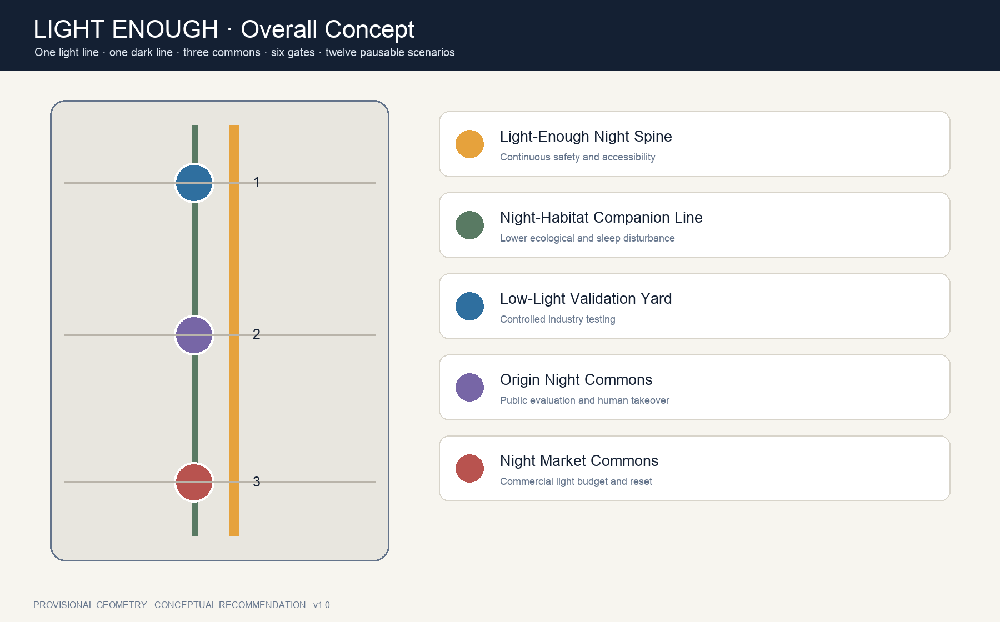
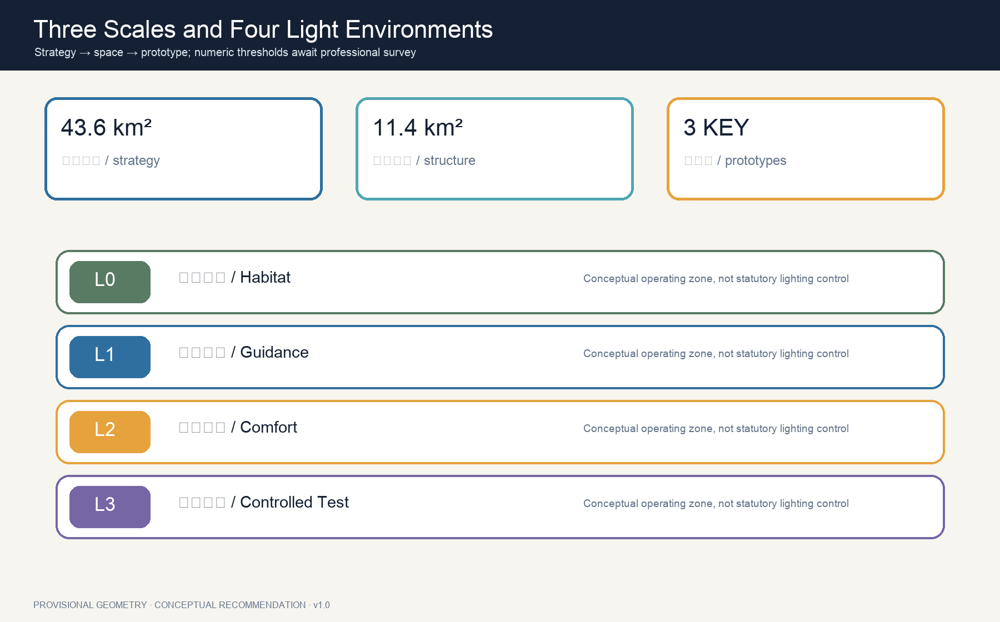
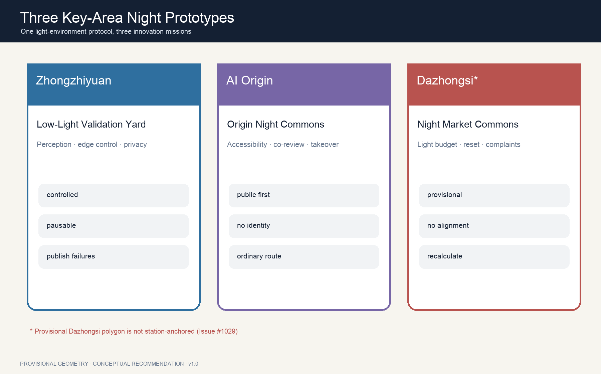
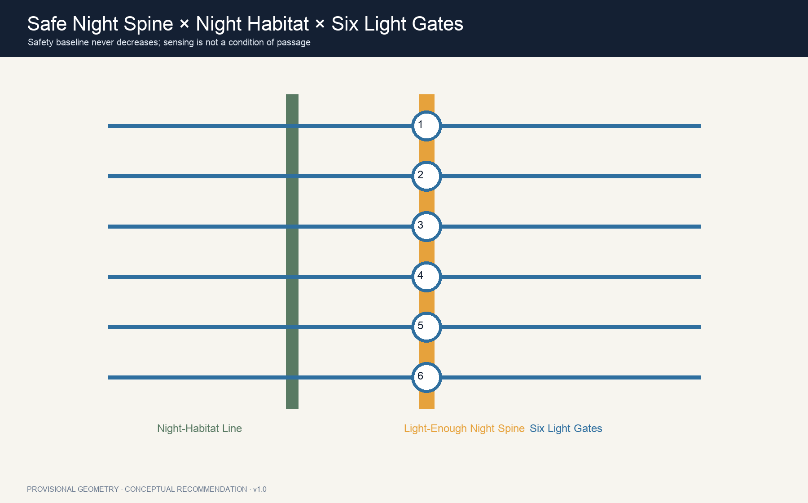
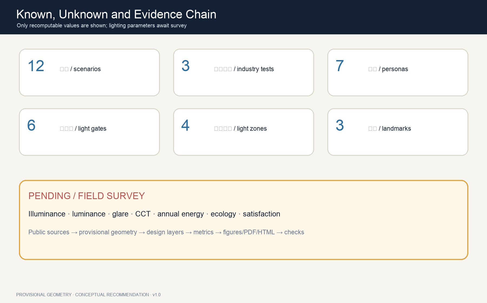

# LIGHT ENOUGH JING-ZHANG

> **No over-lighting. No over-sensing.** An advanced city does not turn night into day. It provides enough visibility, safety and dignity where needed, and returns darkness to sleep, ecology and the stars where it is not.

## Design Basis and Source List

The proposal follows the official announcement, structured Agent taskbook and public site package. It works across the announced 43.6 km² Coordinated Research Area, 11.4 km² Overall Design Area and three key areas [source:OFFICIAL-ANNOUNCEMENT] [source:SITE-PACKAGE]. Exact official boundaries, key-area polygons, regulatory controls, building survey, road sections, utilities and heritage controls are unavailable. Submitted geometry is therefore provisional and cannot be read as an official boundary or approval basis [source:BOUNDARY-SOURCE] [depth:existing_conditions_diagnosis].

“Enough” does not mean that this proposal invents illuminance values. China’s urban-lighting rules address planning, energy and maintenance; Beijing DB11/T 388 covers design, obtrusive light, energy, safety, control and maintenance; CIE’s 2025 position calls for balancing the benefits of light with unwanted effects and adapting solutions to time and demand [source:CN-CITY-LIGHTING-RULES] [source:BEIJING-LIGHTING-STANDARDS] [source:CIE-OBTRUSIVE-LIGHT-2025]. Illuminance, luminance, colour temperature, glare, curfew and ecological thresholds require field measurement and professional design.

## Three-Level Scope Framework

The Coordinated Research Area asks how night-time AI industry, public life and ecology work together. The Overall Design Area establishes a Light-Enough Night Spine, a low-disturbance habitat companion line, six east-west Light Gates and a public-space network. The three key areas test controlled industry validation, public experience and night-commerce stewardship [depth:three_level_scope_framework] [data:geometry/roads.geojson#ROAD-NIGHT-001]. One light-environment ledger links all levels: principles at strategy level, spaces and projects at design level, and open/pause/manual/recovery rules at prototype level.

The structure is **one light line, one dark line, three commons, six gates and twelve scenarios**. The light line is continuous but never uniformly bright; the dark line protects low-disturbance ecology; the three commons are the Low-Light Validation Yard, Origin Night Commons and Light-Enough Night Market Commons. The six gates reveal changes in light conditions before people enter them. Every scenario has human review and a stop rule [metric:light_gate_count] [metric:scenario_card_count].

Open Issue #1029 records that the provisional Dazhongsi rectangle is not anchored to Dazhongsi Station. This proposal retains the shared source geometry instead of moving it independently, limits local claims to directional prototypes and requires whole-package recalculation when official polygons arrive [source:KEY-AREA-SOURCE] [depth:risk_missing_data].

## Coordinated Research Area: Industry and Future City Research

The name **LIGHT ENOUGH / 京张有度** connects three kinds of measure: light has intensity, technology has limits and cities need judgement. The logo combines twin rails, a shielded signal lamp and an open circle. The open circle means that the public can question and switch off a system. Rail navy, human-takeover amber, habitat moss and low-saturation white replace generic cyber-neon [source:AGENT-TASKBOOK] [standard:PROJECT-AGENT-OPEN-CALL-TASKBOOK].

Six global cases contribute mechanisms rather than forms: STATION F for shared startup services, one-north for mixing research, enterprise and urban life, Punggol Digital District for district digital infrastructure and living labs, Barcelona 22@ for innovation-led urban transformation, Smart Kalasatama for resident-facing experimentation and Kendall Square for the relation between dense innovation and public realm [source:CASE-STATION-F] [source:CASE-ONE-NORTH] [source:CASE-PUNGGOL]. Their remaining primary sources are recorded separately and do not provide local controls [source:CASE-BARCELONA-22] [source:CASE-KALASATAMA] [source:CASE-KENDALL].

The Three Zones and Two Wings form a night-innovation loop. Zhongzhiyuan validates low-light perception, edge control and robots. The Beijing AI Origin Community tests human-centred, accessible and publicly legible interfaces. Dazhongsi tests commercial lighting budgets, event closure and operating ledgers. The Zhongguancun Technology Services Wing supplies standards, evaluation, legal and product services; the Xiaoyue River Scenario Enablement Wing tests ecology-sensitive everyday settings.

## Overall Design Area: Urban Renewal and Regulatory-Plan-Level Urban Design

The overall design avoids a uniformly luminous “AI belt”. Four conceptual operating zones are used instead: L0 Night Habitat Conservation, L1 Low-Light Guidance, L2 Community Comfort Lighting and L3 Controlled Event and Testing. They are not statutory lighting zones. Exact extents, hours and parameters await survey and professional review [data:geometry/constraints.geojson#LIGHT-ZONE-01] [depth:overall_spatial_structure].

The land-use layer completely partitions the provisional boundary into research, heritage green space, innovation services and community life [data:geometry/land_use.geojson#LU-001]. Nine building footprints are capacity-test interfaces for labs, staffed services, community rooms and culture; they are neither surveyed existing buildings nor approved construction or demolition [metric:building_capacity_block_count] [depth:retain_renovate_demolish]. FAR, height, coverage and setbacks remain pending official data.

Renewal makes responsibility more visible than luminaires. First survey fixtures, glare, dark gaps, accessibility and ecological receptors. Then test removable shielding, wayfinding and local dimming. Only later consider fixed assets. Every intelligent control should identify its operator, current mode, manual takeover and repair channel.

## Detailed Design of Key Areas

**Zhongzhiyuan — Low-Light Validation Yard.** A controlled concept venue hosts three industry tests: an open low-light perception benchmark, edge-controlled adaptive lighting and privacy-preserving night safety. Shielded lanes, switchable surfaces, staffed observation and public results keep experimentation off unapproved public roads [data:geometry/key_areas.geojson#PROV-KEY-001] [metric:industry_test_scenario_count].

**Beijing AI Origin Community — Origin Night Commons.** Students, residents, children, older adults and disabled people co-evaluate glare, wayfinding, comfort and AI disclosure. The key innovation is safe, tactile and staffed assistance without face recognition or persistent journey histories [data:geometry/key_areas.geojson#PROV-KEY-002] [depth:three_key_area_detailed_design].

**Dazhongsi — Light-Enough Night Market Commons.** The prototype governs shopfronts, displays, events, transit interfaces, closure and complaints through a light budget. Since PROV-KEY-003 is not station-anchored, no four-quadrant engineering alignment or precise commercial boundary is claimed [data:geometry/key_areas.geojson#PROV-KEY-003] [source:KEY-AREA-SOURCE].

## AI Innovation Ecosystem, Personas, and AI+ Scenarios

Seven personas expose conflicts rather than track people: night-shift workers need continuous help; low-vision and wheelchair users need stable accessible cues; children and families need low-glare learning and stars; older adults need readable steps; developers need lawful controlled tests; residents need sleep and complaint channels; ecological stewards need nocturnal habitat protection [metric:persona_count] [source:MEE-LIGHT-POLLUTION].

Twelve readable scenario cards are encoded as SCENARIO_NODE features [data:geometry/constraints.geojson#SCENE-01]:

| No. | Scenario | Type | Spatial and operating boundary |
|---|---|---|---|
| 01 | Open low-light perception benchmark | Industry test | Controlled yard, open benchmark and human review; no public enforcement |
| 02 | Edge-controlled adaptive lighting | Industry test | Local control, safe offline baseline and manual takeover |
| 03 | Privacy-preserving night safety | Industry test | Short-lived anonymous events; no face recognition or persistent tracks |
| 04 | Accessible light-and-tactile wayfinding | Public service | Light, tactile and ordinary signs remain equivalent |
| 05 | Children’s stargazing learning field | Education | Time-limited dimming, adult staff, no child identity collection |
| 06 | Night-shift journey assistance | Mobility | Staffed help points without mandatory continuous location |
| 07 | Low-glare route for older adults | Health-friendly | Readable steps, kerbs and seats; values set by professionals |
| 08 | Manual blackout emergency mode | Emergency | Non-essential AI off; ordinary light and staff work independently |
| 09 | Low-speed robot night run | Controlled test | Limited time/speed, on-site stop operator, people first |
| 10 | Railway signal heritage guide | Culture | Human-edited, multilingual and historically checked |
| 11 | Public obtrusive-light audit | Governance | Report, response deadline and professional remeasurement |
| 12 | Post-event dark-sky reset | Operation | Return to everyday conditions after closing and publish status |

## Land Use, Building Scale, and Retain-Renovate-Demolish Strategy

The proposal uses standard land-use interfaces and does not invent an “AI lighting land-use” category [standard:MNR-LAND-USE-CLASSIFICATION-GUIDE] [data:geometry/land_use.geojson#LU-001]. Provisional areas only check internal package consistency. Total floor area, storeys and intensity remain unknown because official controls and surveys are absent.

A five-question gate precedes any retain/renovate/demolish judgement: Is ownership and survey evidence available? Are structure, fire and heritage reviewed? Can shielding and control solve the issue? Is lifecycle maintenance affordable? Is an equivalent public route retained? Without all five, no demolition or permanent-build list is produced. Nine capacity-test blocks express spatial relationships only [data:geometry/buildings.geojson#BLDG-001] [depth:height_massing_character].

Interfaces should control interior spill light, shield luminaires, keep staffed services visible and separate maintenance access. Heritage buildings and railway remains should avoid large dynamic-media façades; any heritage-lighting proposal requires specialist approval.

## Transport, Rail, Municipal Infrastructure, and Public Services

The Light-Enough Night Spine supports continuous walking, cycling and accessible recognition. The habitat companion line is a low-disturbance ecology and quiet-rest system rather than the brightest shortest route. Six Light Gates connect east-west communities, stations and key areas and reveal mode changes before entry [data:geometry/roads.geojson#ROAD-NIGHT-001] [metric:night_spine_length_m]. These are conceptual centre lines, not road redlines.

Safety precedes energy demonstrations. Crossing, step, kerb and conflict-point baselines are set by transport and lighting professionals. Adaptive systems only adjust above that baseline and fail conservatively. Low-speed robots are time-limited, speed-limited and stoppable. Transit, parking and sections stay unquantified without traffic and official road data [depth:traffic_rail_slow_parking].

New infrastructure uses a four-part kit: luminaire, edge compute, staffed takeover and public ledger. A lighting pole must not automatically become an all-purpose surveillance pole. Aggregated energy and fault data may be public; identity, faces and persistent tracks are not ordinary operating requirements [depth:municipal_new_infrastructure].

## Blue-Green Network, Public Space, and Urban Character

The habitat ribbon treats green space as nocturnal habitat, not decorative background. Shield before adding power, light on demand rather than continuously, and prefer local task lighting over floodlight. DarkSky guidance is voluntary background; detailed local work must follow applicable Chinese and Beijing standards plus ecological survey [source:DARKSKY-LUMINAIRE-GUIDE] [source:BEIJING-LIGHTING-STANDARDS].

Three reversible pilgrimage landmarks avoid megastructures. **Signal Zero Yard** publishes low-light test passes and failures. **Origin Star Window** reduces non-essential light at agreed hours so children, researchers and residents can see the sky. **Bell-Shadow Light Table** presents time, light and complaint response without directly illuminating heritage. Together they tell a story from railway signals to civic rights over light [metric:pilgrimage_landmark_count] [standard:MOHURD-URBAN-DESIGN-MEASURES].

Urban character draws on shields, mileposts, timetables and switches. Amber means human takeover; moss means habitat; muted blue means operating information; red is reserved for stop and risk. The identity avoids corporate marks and does not equate screen count with innovation.

## Renewal Projects, Implementation Policy, and Phasing

Eight conceptual work packages are: baseline survey; removable shielding and wayfinding; six Light Gates; three night commons; three industry tests; night-habitat monitoring; complaint and remeasurement ledger; annual post-event reset drill. Three phase polygons express dependencies, not approved investment or construction [data:geometry/phasing.geojson#PHASE-001] [metric:phase_count].

Near-term work establishes measurement methods, night walks and removable pilots. Medium-term work links controlled testing, public evaluation and commercial-light stewardship in the three zones. Long-term work turns proven practices into maintainable interfaces after official geometry and professional review. Glare, ecology, privacy or safety findings can pause and reverse a pilot [depth:phasing_implementation].

The annual concept brand is **Jing-Zhang Night Calibration Week**: spring ecology checks, summer comfort and energy review, autumn low-light industry benchmarking and winter blackout/manual-takeover drills. Developers submit failures, maintenance and exit plans as well as algorithms. Dates, funding and operators remain future decisions [source:AGENT-TASKBOOK].

## Metrics, Area Recalculation, and Compliance Matrix

Known metrics come only from submitted geometry and content counts: provisional area, conceptual green/public-space coverage, capacity-test footprints, network length, four light zones, six gates, twelve scenarios, three industry tests, seven personas, three landmarks and three phases [metric:site_area_sqm] [metric:light_zone_count] [metric:scenario_card_count]. They prove package consistency, not official planning ratios or performance.

Illuminance, luminance, glare, CCT, annual electricity, incidents, biodiversity and resident satisfaction remain pending. No energy-saving percentage or safety improvement is fabricated [metric:baseline_illuminance_lux] [metric:annual_lighting_energy_kwh] [metric:glare_compliance_rate]. Future pilots require zoned time-based baselines, repeated measurements and publication of adverse findings.

The compliance matrix covers the announcement and agent.1–agent.6. Standard and depth matrices connect prose, figures, GeoJSON, metrics and checks. Areas are recomputed in EPSG:4548; all layers and displays must regenerate when official polygons arrive [depth:metrics_recalculation].

## Risk, Copyright, and Compliance

Risks include provisional-location misunderstanding, especially the unanchored Dazhongsi placeholder; missing night survey; adaptive light becoming surveillance; energy goals degrading safety/accessibility; events disturbing residents and ecology; and maintenance creating new dark gaps. Controls are conspicuous provisional labels, unknown values, data minimisation, manual takeover, professional safety baselines, periodic remeasurement and pausable pilots [source:SOURCE-REGISTRY] [depth:risk_missing_data].

Public-source boundaries, privacy, copyright, implementation risk and human review apply to every scenario. Non-public or uncleared material is excluded; high-impact decisions are never automated; every pilot preserves staffed shutdown, ordinary-service alternatives and appeal. Energy saving cannot reduce traffic safety, accessibility or basic public service, and no event or device is presented as approved.

No remote map, commercial screenshot, unlicensed photo, corporate logo or personal data is used. Text, structured data and figures were generated by Hermes · GPT-5.6 for GitHub user zhangzhishan and are licensed CC BY 4.0. Rights in official standards and case facts remain with their publishers. Every spatial move is a Conceptual Recommendation; none claims approval, investment or implementation.

## References

- China’s urban-lighting management rules [source:CN-CITY-LIGHTING-RULES]
- Beijing public landscape-lighting standards portal [source:BEIJING-LIGHTING-STANDARDS]
- Ministry of Ecology and Environment response on light pollution [source:MEE-LIGHT-POLLUTION]
- CIE position on obtrusive light and light pollution [source:CIE-OBTRUSIVE-LIGHT-2025]
- DarkSky voluntary outdoor-luminaire guidance [source:DARKSKY-LUMINAIRE-GUIDE]
- Official open-call announcement and Agent taskbook [source:OFFICIAL-ANNOUNCEMENT] [source:AGENT-TASKBOOK]
