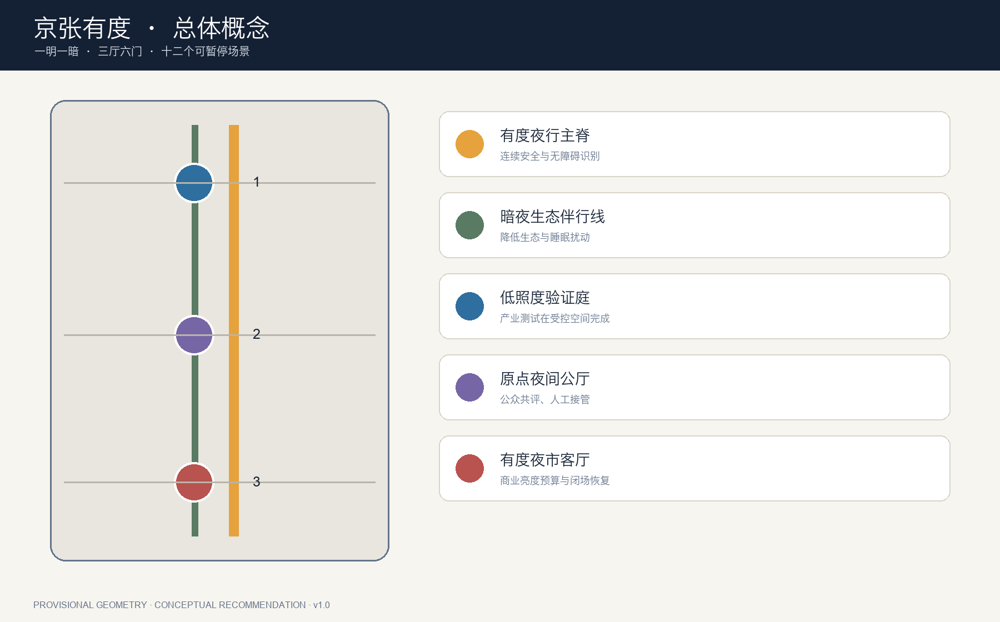
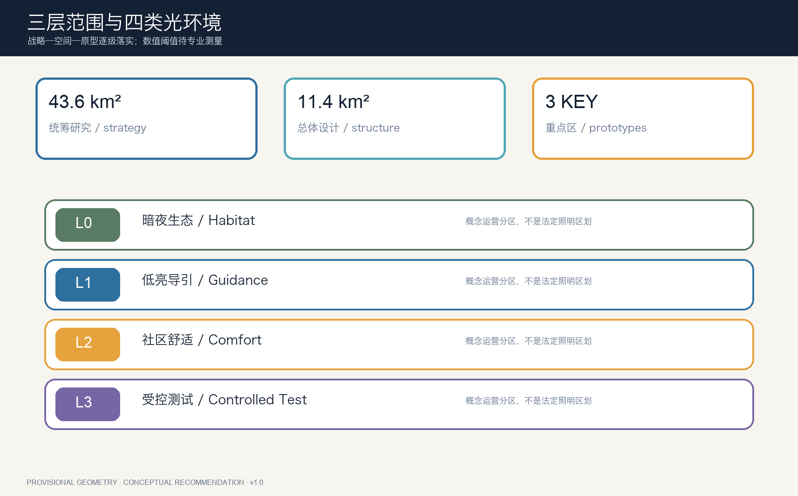
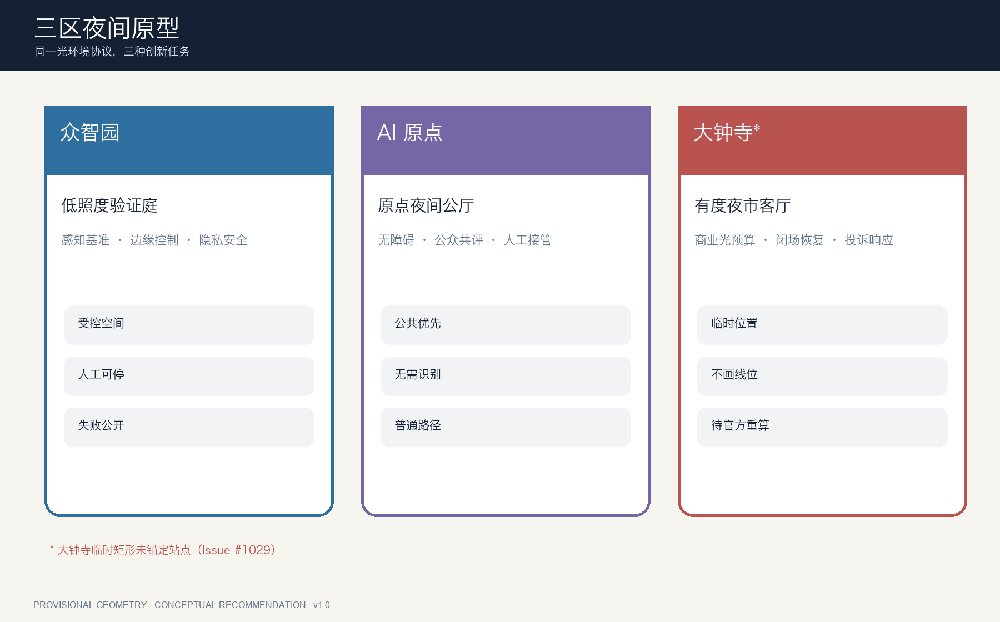
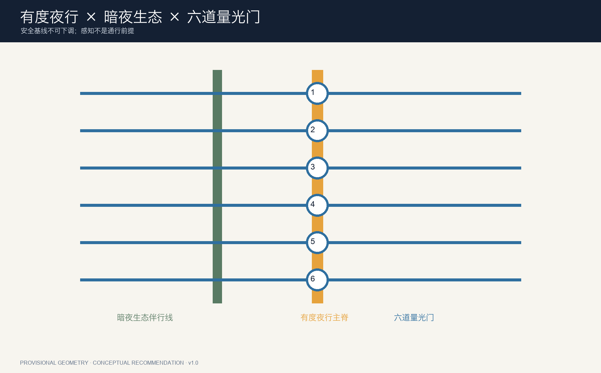
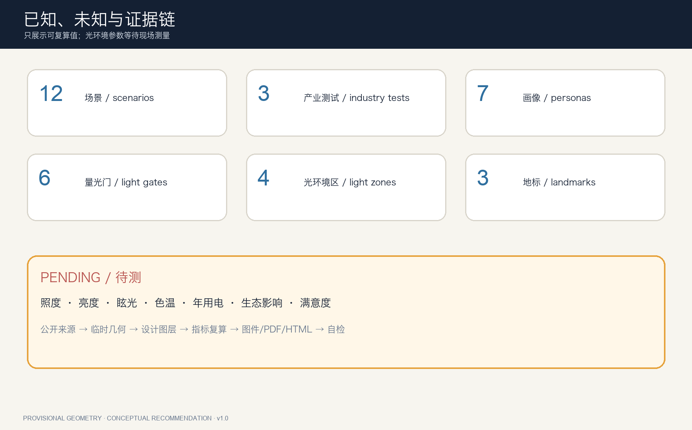

# 京张有度 LIGHT ENOUGH

> **不过度照明，不过度感知。** 城市的先进不是把夜晚照成白昼，而是在需要处给足安全与尊严，在不需要处把黑暗还给睡眠、生态和星空。

## 设计依据与资料清单

本案以征集公告、结构化任务书和公开场地包为项目依据，使用 43.6 平方公里统筹研究范围、11.4 平方公里总体设计范围和三处重点区的公告口径开展工作 [source:OFFICIAL-ANNOUNCEMENT] [source:SITE-PACKAGE]。当前精确官方红线、重点区 polygon、控规、逐栋现状、道路断面、市政和文保控制仍缺失，因此提交几何只采用仓库的临时粗略范围，不构成官方红线或审批依据 [source:BOUNDARY-SOURCE] [depth:existing_conditions_diagnosis]。

“有度”不是自行设定照度值。国家《城市照明管理规定》要求统筹规划、节能和运行维护，北京 DB11/T 388 系列进一步覆盖设计、干扰光、节能、安全、控制与维护；CIE 2025 立场文件强调在夜间照明收益与不期望影响之间平衡，并适应不同时段需求 [source:CN-CITY-LIGHTING-RULES] [source:BEIJING-LIGHTING-STANDARDS] [source:CIE-OBTRUSIVE-LIGHT-2025]。具体照度、亮度、色温、眩光、时控和生态阈值必须由照明、交通、园林、生态及安全专业团队在实测后确定，本案只提出空间和治理协议。

## 三层范围工作框架

统筹研究范围回答“AI 夜间产业、公共生活与生态如何协同”；总体设计范围建立有度夜行主脊、暗夜生态伴行线、六道东西向量光门及公共空间网络；三处重点区域以不同原型检验产业测试、公众体验和夜间商业治理 [depth:three_level_scope_framework] [data:geometry/roads.geojson#ROAD-NIGHT-001]。三层之间以同一份光环境台账衔接：战略层记录原则，设计层记录空间与项目，重点区记录场景的开、停、人工接管和恢复。

总体结构为“**一明一暗、三厅六门、十二场景**”。“一明”是连续但不过亮的有度夜行主脊；“一暗”是降低扰动的生态伴行线；三厅对应众智园低照度验证庭、AI 原点夜间公厅和大钟寺有度夜市客厅；六门是东西穿越时可读的光环境转换节点；十二场景全部有人工复核与停止规则 [metric:light_gate_count] [metric:scenario_card_count]。

临时大钟寺重点区存在公开 Issue #1029 所述的位置锚定缺口：其占位矩形目前不等同于大钟寺站周边。方案不自行平移源几何，只把该片区建议写成方向性原型；官方 polygon 与站点关系到位后整链重算 [source:KEY-AREA-SOURCE] [depth:risk_missing_data]。

## 统筹研究范围产业与未来城市研究

主名称“京张有度”同时指三种尺度：光有亮度、技术有边界、城市有分寸。英文 **LIGHT ENOUGH** 不追求“更亮”，而追求“刚好够用”。Logo 概念由铁路双轨、信号灯遮光罩和一个未闭合的圆组成：未闭合代表公众可以质询和关闭；色彩使用轨道深蓝、人工接管琥珀、生态苔绿与低饱和白，不使用高亮赛博霓虹 [source:AGENT-TASKBOOK] [standard:PROJECT-AGENT-OPEN-CALL-TASKBOOK]。

六个全球案例只提取机制：STATION F 展示大尺度共享创新服务，one-north 展示科研、企业与城市生活混合，Punggol Digital District 展示数字基础设施与试验场协同，Barcelona 22@ 展示产业更新与街区转型，Smart Kalasatama 展示居民参与的生活实验室，Kendall Square 展示高密创新与公共空间关系 [source:CASE-STATION-F] [source:CASE-ONE-NORTH] [source:CASE-PUNGGOL]。其余案例来源分别记录于来源表，均不作为本项目控制指标 [source:CASE-BARCELONA-22] [source:CASE-KALASATAMA] [source:CASE-KENDALL]。

“三区两翼”形成夜间创新闭环：众智园验证低照度感知、边缘控制和机器人；AI 原点社区验证人本、无障碍与公众可理解性；大钟寺验证商业夜景、活动闭场和运营台账；中关村科技服务翼提供标准、评测、法务和产品化；小月河场景赋能翼验证生态敏感、雨洪和日常公园场景。所有产业测试先在受控空间完成，再经人工和公众复核进入开放空间。

## 总体设计范围城市更新与控规深度城市设计

总体设计不新造“发光地标带”，而把既有更新动作编成四类光环境分区：L0 暗夜生态保育区、L1 低亮导引区、L2 社区舒适照明区、L3 受控活动与测试区。四类是概念性运营分区，不是法定照明区划；精确范围、时段和参数待现场测量及专业深化 [data:geometry/constraints.geojson#LIGHT-ZONE-01] [depth:overall_spatial_structure]。

用地分区完整覆盖临时总体边界，以科研、遗产绿地、创新服务和社区生活四类概念单元承接不同夜间需求 [data:geometry/land_use.geojson#LU-001]。九个建筑基底只是容量测试：首层可被评估为夜间人工服务、实验室、社区公厅或文化展示的空间接口，不代表现状建筑、批准新建或拆除结论 [metric:building_capacity_block_count] [depth:retain_renovate_demolish]。容积率、建筑高度、建筑密度和退线保持待正式资料补齐。

城市更新优先级从“看得见的灯”转为“看得见的责任”：先普查灯具、眩光、暗区、无障碍和生态受体；再用可拆装遮光、导视和局部调光试点；最后才讨论固定设施。每个智能灯控都须显示运营主体、当前模式、人工接管与报修路径，避免把公共照明变成不可质询的黑箱。

## 重点区域详细设计

**众智园 AI 自主创新加速区——低照度验证庭。** 概念建议在受控场地组织三个产业测试：低照度视觉公开基准、边缘自适应照明、隐私保护夜间安全。空间由遮光测试巷、可切换路面材料、人工观察席和结果公示墙构成；不以公共道路作为未经批准的试验场 [data:geometry/key_areas.geojson#PROV-KEY-001] [metric:industry_test_scenario_count]。

**北京 AI 原点社区——原点夜间公厅。** 面向高校师生、居民、儿童、老年人和无障碍用户，设置可共同评价眩光、导视、夜间舒适与AI告知方式的公共原型。这里的创新不是增加摄像头，而是让一条路线在不识别人脸、不保存轨迹的前提下仍能提供安全、触觉导向和人工帮助 [data:geometry/key_areas.geojson#PROV-KEY-002] [depth:three_key_area_detailed_design]。

**大钟寺 AI 产业聚集区——有度夜市客厅。** 原型聚焦商业招牌、橱窗、活动照明和轨道接驳的亮度预算、闭场恢复和投诉响应；但因 PROV-KEY-003 尚未锚定大钟寺站，本案不画四象限工程线位，也不声称具体商圈边界。正式位置和道路条件到位后再深化 [data:geometry/key_areas.geojson#PROV-KEY-003] [source:KEY-AREA-SOURCE]。

## AI 创新生态、人才画像与 AI+ 场景

七类画像用于暴露需求冲突而非追踪个人：夜班劳动者需要连续安全和人工求助；低视力或轮椅使用者需要稳定导视与无障碍；儿童家庭需要不刺眼且能看见星空的学习空间；老年人需要低眩光和可读台阶；开发者需要合法受控的低照度测试；沿线居民需要睡眠与投诉反馈；生态维护者需要保护昆虫、鸟类和植物节律 [metric:persona_count] [source:MEE-LIGHT-POLLUTION]。

十二张场景卡全部落入场景节点图层 [data:geometry/constraints.geojson#SCENE-01]：

| 编号 | 场景 | 类型 | 空间与运行边界 |
|---|---|---|---|
| 01 | 低照度感知公开基准 | 产业测试 | 众智园受控测试巷；公开测试集与人工复核，不进入公共执法 |
| 02 | 按需照明边缘控制 | 产业测试 | 本地边缘控制；断网保持安全基线，可一键转人工 |
| 03 | 隐私保护夜间安全 | 产业测试 | 只统计短时匿名事件，不做人脸识别与长期轨迹 |
| 04 | 无障碍光触导视 | 公共服务 | 光、触觉和普通标识等价存在 |
| 05 | 儿童观星学习场 | 教育文化 | 限时降光，成人值守，不采集儿童身份 |
| 06 | 夜班归途助手 | 交通服务 | 提供人工求助点，不以持续定位为前提 |
| 07 | 老年低眩光步道 | 健康友好 | 台阶、路缘和座椅可读，参数待专业测量 |
| 08 | 停电应急手动模式 | 应急 | 关闭非必要AI，普通照明与人工疏导独立运行 |
| 09 | 低速机器人夜行 | 受控试验 | 限时限速、现场停止员、人优先 |
| 10 | 铁路信号文化导览 | 文化 | 不伪造史料；内容人工编辑与多语复核 |
| 11 | 干扰光公众审计 | 治理 | 市民可报点、运营方限时回应、专业人员复测 |
| 12 | 活动闭场暗夜恢复 | 运营 | 活动结束后按时恢复日常光环境并公示状态 |

## 用地、建筑规模与拆改留方案

用地采用现行分类接口，不创造“AI照明用地”。四个概念分区的功能只说明夜间使用组织，不能改变法定用途 [standard:MNR-LAND-USE-CLASSIFICATION-GUIDE] [data:geometry/land_use.geojson#LU-001]。临时几何面积用于检查提交包内部一致性，不作为审定用地比例；建筑总量、楼层和强度因缺少控规与现状底数保持未知。

拆改留采用“五问门槛”：是否有权属和现状资料、是否满足结构消防与文保、能否通过遮光和控制解决、全寿命维护是否可承受、公众是否有替代路径。五问未完成，不进入拆除或固定建设清单。九个容量测试单元仅表达“某类公共接口需要多大占地关系”，应由专业团队在正式地块和建筑调查后替换 [data:geometry/buildings.geojson#BLDG-001] [depth:height_massing_character]。

建筑与公共空间界面强调内透光受控、灯具遮光、首层人工服务可见、设备维护通道独立。历史建筑和遗产界面不使用大面积动态媒体立面；任何对清华园车站旧址、大钟寺文保或京张遗存的照明建议须另行取得文保专业意见。

## 交通、轨道、市政与公共服务设施

有度夜行主脊提供连续步行、骑行和无障碍识别；暗夜生态伴行线不承担“最亮最短”通勤，而作为低扰动生态与安静休憩系统；六道量光门连接东西社区、站点和重点区，在进入不同光环境前显示模式和普通导视 [data:geometry/roads.geojson#ROAD-NIGHT-001] [metric:night_spine_length_m]。概念中心线不是道路红线或工程线位。

交通安全优先于节能展示：过街、台阶、路缘和冲突点由交通与照明专业确定安全基线；自适应系统只能在安全基线上调节，故障时回到保守模式。低速机器人夜行限时、限速、可停止，并保留人行优先。轨道接驳、停车和断面因缺少客流、道路红线和站点资料不设定量结论 [depth:traffic_rail_slow_parking]。

新型基础设施采用“灯—边缘计算—人工值守—公开台账”四件套，禁止把照明杆默认扩张为全功能监控杆。照明数据、能耗和故障可聚合公开；个人身份、脸部和持续轨迹不作为普通运行条件 [depth:municipal_new_infrastructure]。

## 蓝绿空间、公共空间与城市风貌

暗夜生态低扰带把绿地当作夜间栖息地而非景观背景。设计原则是遮光优先于加功率、需求优先于常亮、局部优先于泛光，并控制逸散光和不必要的天光。DarkSky 指南可作为自愿性背景，但本地深化仍以中国和北京适用标准及现场生态调查为准 [source:DARKSKY-LUMINAIRE-GUIDE] [source:BEIJING-LIGHTING-STANDARDS]。

三个朝圣地标均是可逆公共空间而非巨构：北端“**零号信号庭**”公开低照度测试的通过与失败；中段“**原点星窗**”在约定时段降低非必要照明，让儿童、研究者和居民共同看见天空；南端“**钟影量光台**”用不直接照射文物的方式展示光影、时间和公众投诉响应。三者共同形成“从铁路信号到公共光权”的文化叙事 [metric:pilgrimage_landmark_count] [standard:MOHURD-URBAN-DESIGN-MEASURES]。

城市风貌使用遮光罩、里程标、时刻表和轨道分岔的工程语言。琥珀表示人工接管，苔绿表示暗夜生态，低饱和蓝表示运行信息；红色只用于停止和风险。视觉系统不模仿既有企业标识，也不把动态屏幕数量当作科技感。

## 更新项目清单、实施政策与分期计划

八个概念工作包依次为：光环境基线普查、临时遮光与导视、六道量光门、三座夜间公厅、三类产业验证、暗夜生态监测、公众投诉与复测台账、年度闭场恢复演练。它们由三期几何组织，但分期只表达前后依赖，不代表政府投资、审批或建设承诺 [data:geometry/phasing.geojson#PHASE-001] [metric:phase_count]。

近期先做公开测量方法、夜间步行审计和可拆装试点；中期在三区形成受控测试、公众共评和夜景运营原型；长期把经过验证的做法转化为可维护的标准接口，并在官方边界、控规和专业评估到位后重算。任何阶段发现眩光、生态、隐私或安全风险，都可以暂停并回退 [depth:phasing_implementation]。

年度品牌为“**京张校夜 / Jing-Zhang Night Calibration Week**”：春季检查迁徙与物候，夏季检查夜间舒适与用电，秋季举办低照度产业基准，冬季做停电和人工接管演练。开发者社区提交的不只是算法，还要提交失败案例、维护说明和退出方案；所有活动均为概念建议，日期、资金和主体待后续确认 [source:AGENT-TASKBOOK]。

## 指标体系、面积复算与合规矩阵

已知指标只来自提交几何和内容计数：临时范围面积、概念绿地和公共空间覆盖、建筑容量测试基底、路网长度、四类光环境区、六道量光门、十二场景、三类产业测试、七类画像、三地标和三期 [metric:site_area_sqm] [metric:light_zone_count] [metric:scenario_card_count]。这些数值证明包内一致性，不是官方面积、法定比例或实施绩效。

照度、亮度、眩光、色温、年用电量、事故率、生物多样性和居民满意度均保持待测，不虚构节能百分比或安全提升 [metric:baseline_illuminance_lux] [metric:annual_lighting_energy_kwh] [metric:glare_compliance_rate]。正式深化应先建立分区分时基线，再用同一测点比较试点前后，同时公开不利结果。

任务覆盖矩阵响应公告与 agent.1—agent.6，专业标准矩阵和设计深度矩阵分别连接正文、图件、GeoJSON、指标与自检。面积统一在 EPSG:4548 下复算，官方 polygon 发布后必须重跑全部图层和展示成果 [depth:metrics_recalculation]。

## 风险、版权与合规说明

主要风险包括：临时边界造成位置误读，尤其大钟寺占位矩形未锚定站点；缺少夜间测量导致参数不可定；自适应照明可能演变为过度感知；节能目标可能挤压安全与无障碍；暗夜活动可能扰民或伤害生态；设备维护不足可能制造新暗区。对应措施是醒目标注临时性、保持数值未知、数据最小化、人工接管、专业安全底线、定期复测和可暂停试点 [source:SOURCE-REGISTRY] [depth:risk_missing_data]。

公开资料边界、隐私保护、版权、实施风险和人工复核贯穿全部场景：未公开或未清权资料不进入方案，高影响判断不由模型自动作出，任何试点都必须保留人工终止、普通服务替代和事后申诉。照明节能不得降低交通安全、无障碍或基本公共服务，活动与设备也不得被描述为已获批准。

本案不使用远程地图、商业地图截图、未授权照片、企业Logo或个人数据。文本、结构化数据和图件由 Hermes · GPT-5.6 为 GitHub 用户 zhangzhishan 原创生成，采用 CC BY 4.0；官方标准和案例事实权利归原发布者，引用不改变其权利。所有方案均是概念建议，不替代正式规划，不构成政府审定、投资或实施承诺。

## 参考资料

- 中国住房城乡建设主管部门《城市照明管理规定》 [source:CN-CITY-LIGHTING-RULES]
- 北京市城市景观照明技术规范公开入口 [source:BEIJING-LIGHTING-STANDARDS]
- 生态环境部关于光污染治理建议的公开答复 [source:MEE-LIGHT-POLLUTION]
- CIE 关于干扰光与光污染的立场文件 [source:CIE-OBTRUSIVE-LIGHT-2025]
- DarkSky 室外灯具自愿性指南 [source:DARKSKY-LUMINAIRE-GUIDE]
- 征集公告、场地包与面向智能体任务书 [source:OFFICIAL-ANNOUNCEMENT] [source:AGENT-TASKBOOK]
