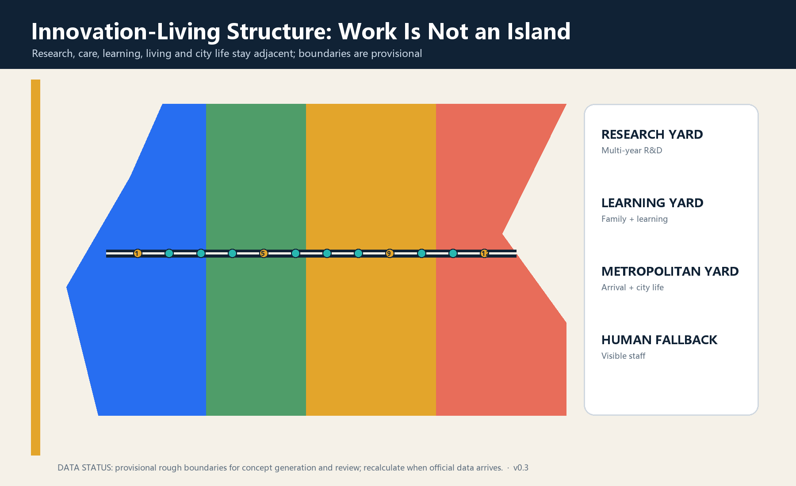
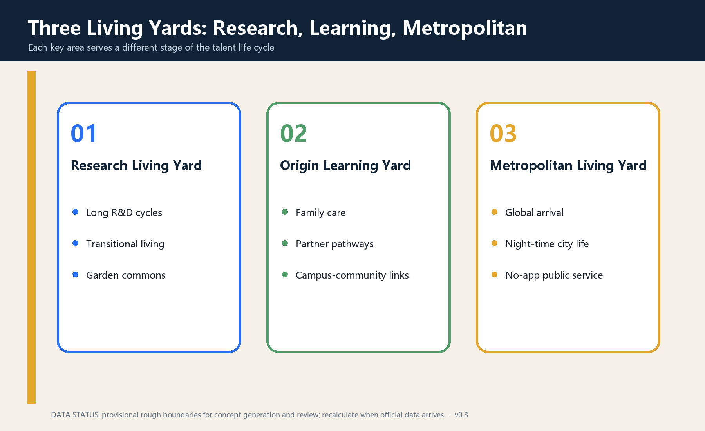
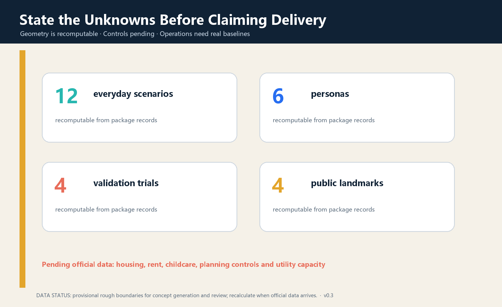

# STAY LONGER JING-ZHANG

> **v0.3 design revision:** All twelve service and test scenarios are recorded in a reviewable spatial layer; numbered map markers now link to a separate legend; automated eligibility decisions remain prohibited.

> **Core judgment:** A world-class AI innovation belt must do more than bring people into laboratories and conferences. It should enable researchers, founders, partners, children, operators and existing residents to live an ordinary life with dignity.

## Design Basis and Source List

The official announcement, site package, Agent taskbook, public-source registry and local standards snapshots are the formal basis. Exact official boundaries, parcels, building surveys, statutory controls, utility capacity and public-service baselines are unavailable; therefore all geometry and implementation moves are conceptual suggestions rather than statutory planning or government commitments. [source:OFFICIAL-ANNOUNCEMENT] [source:SITE-PACKAGE] [standard:PROJECT-AGENT-OPEN-CALL-TASKBOOK]

Six international cases are method references only: one-north suggests work-live-play-learn mixing [source:CASE-ONE-NORTH]; International House Helsinki links arrival, family, partner and retention services [source:CASE-HELSINKI-IHH]; STATION F and Flatmates connect startup space and flexible housing [source:CASE-STATION-F]; Barcelona 22@ combines a mixed innovation district, one-stop service and real-life testing [source:CASE-BARCELONA-22]; Quayside stresses mixed housing, public realm and participation [source:CASE-QUAYSIDE]; Seoul links AI research, talent cultivation, exhibition and creative industries [source:CASE-SEOUL-HUBS]. None supplies Beijing boundaries or planning controls.

## Three-Level Scope Framework

The 43.6 sq km coordinated research area addresses long-term global talent attraction; the approximately 11.4 sq km overall design area connects research, housing, care, learning, consumption and public life; the three key areas test reversible service prototypes. The scopes form one chain from regional talent ecology to the Long-Stay Line and three operable Living Yards. [metric:site_area_sqm] [depth:three_level_scope_framework]

The submitted boundary and key areas are repository provisional polygons. Their rough edges are not roads, parcels or ownership lines. Official polygons must trigger recalculation of land-use coverage, green and public space, footprints, scenarios and every area metric. [data:geometry/site_boundary.geojson#SITE-001] [data:geometry/key_areas.geojson#PROV-KEY-001] [metric:key_area_count]

## Coordinated Research Area: Industry and Future City Research

The name is STAY LONGER JING-ZHANG. Staying longer is voluntary: people may arrive, grow, leave and return across life stages. The identity bends a rail line into an open roof and loop; blue represents research, warm gold everyday life and green the heritage park.

The structure is **one Long-Stay Line, three Living Yards, two service wings and twelve everyday scenarios**. Zhongzhiyuan becomes a Research Living Yard, AI Origin a Learning Living Yard and Dazhongsi a Metropolitan Living Yard. The Zhongguancun wing provides legal, IP, capital and international services; the Xiaoyuehe wing provides community feedback, health and real-life interfaces. [data:geometry/roads.geojson#ROAD-001] [depth:overall_spatial_structure]

The five functions become a talent-life-cycle chain: long research can stay; families and peers can stay; products are tested in daily life; public life continues beyond work hours; and every AI service retains human responsibility and exit.

## Overall Design Area: Urban Renewal and Regulatory-Plan-Level Urban Design

Renewal follows public service first, adaptive reuse before heavy construction. Reversible arrival desks, common rooms, care booking, night staff, shared kitchens and learning tables come first; ground-floor adaptation comes second; construction requiring ownership, fire, utility and regulatory evidence comes last. [depth:renewal_project_list] [data:geometry/phasing.geojson#PHASE-001]

Concept land use keeps research, care, learning, urban consumption and diverse housing adjacent. It expresses relationships only and does not alter statutory land use. FAR, height, housing quantity, rent and childcare capacity remain pending official data. [data:geometry/land_use.geojson#LU-001] [metric:talent_housing_units] [standard:MNR-LAND-USE-CLASSIFICATION-GUIDE]

## Detailed Design of Key Areas

### Zhongzhiyuan Research Living Yard

This garden-like yard supports a normal life across a multi-year R&D cycle through shared labs, verification space, transitional living, quiet rooms, sport and food. Reversible interiors and active ground floors come first. Robots, experimental equipment and energy systems require controlled, graded test areas. [data:geometry/key_areas.geojson#PROV-KEY-001] [depth:three_key_area_detailed_design]

### AI Origin Learning Living Yard

This near-campus yard brings technology transfer, family life and community knowledge together through multilingual service, partner career exchange, childcare and co-learning, ethics advice and open days. A staffed and non-algorithmic channel remains parallel to every digital service. [data:geometry/key_areas.geojson#PROV-KEY-002] [assumption:A-SERVICE-001]

### Dazhongsi Metropolitan Living Yard

This is the first urban stop from arrival to belonging, combining transit arrival, daily consumption, culture, short work, night service and international communities. Four-quadrant walkability is a goal, not a bridge or road engineering alignment. [data:geometry/key_areas.geojson#PROV-KEY-003] [depth:traffic_rail_slow_parking]

## AI Innovation Ecosystem, Personas, and AI+ Scenarios

Six personas stress-test services: a newly arrived international researcher; an R&D family with partner and child; an early-stage founder team; a student or young researcher; a night-shift operator or service worker; and an existing resident. No system may infer sensitive traits or automatically determine housing, education, employment or public-service eligibility. [assumption:A-PRIVACY-001]

| Card | Place and users | Minimum data | Human review and exit |
| --- | --- | --- | --- |
| S01 Multilingual Arrival Desk | Dazhongsi; newcomers | Questions volunteered by user | Staff check, paper list, no-retention option |
| S02 Human-reviewed Housing Match | Three yards | Voluntary preferences | Human final match; no housing promise |
| S03 Partner Career Exchange | Origin | Voluntary skills and needs | Community coordinator; no automated hiring |
| S04 Childcare and Co-learning Booking | Origin | Time and necessary care data | Licensed staff; telephone route |
| S05 Open Lab Booking Sandbox★ | Zhongzhiyuan | Equipment, time, safety level | Lab manager approval and stop |
| S06 Accessible Robot Test★ | Zhongzhiyuan | Device telemetry and incidents | On-site emergency stop; non-robot route |
| S07 Health Navigation Trial★ | Origin | User-entered service question | Clinical/social-work review; no diagnosis |
| S08 Education Translation Review★ | Origin | Public text for translation | Teacher or translator confirms output |
| S09 Founder Legal and IP Clinic | Zhongguancun wing | Voluntary project material | Professional signs advice; AI is not counsel |
| S10 Night Walk and Staffed Steward | Long-Stay Line | No retained personal trace | Fixed staff and phone; digital service can close |
| S11 Community Skill Exchange | Three yards | Voluntary skill and time | Community moderation; credits buy no rights |
| S12 Departure and Return Handover | Whole line | Voluntary public contribution | Contributor selects license; personal data deleted |

S05-S08 are four test and validation scenarios. All twelve nodes are recorded in the spatial layer [data:geometry/constraints.geojson#SCN-01] and counted by [metric:scenario_node_count].

## Land Use, Building Scale, and Retain-Renovate-Demolish Strategy

Four concept zones cover research and long-term entrepreneurship, care-learning-open space, global service and urban consumption, and diverse housing with community support. Their union covers the provisional boundary without overlap but is not a statutory change. Buildings follow retain, light adaptation, reversible addition and pending-confirmation construction. [data:geometry/buildings.geojson#BLDG-001] [depth:retain_renovate_demolish]

Concept building footprints cannot prove total floor area, housing units or capacity. [metric:building_footprint_area_sqm] and the unknown housing metric prevent the concept from being misread as a development commitment. [depth:development_intensity_controls]

## Transport, Rail, Municipal Infrastructure, and Public Services

The Long-Stay Line prioritizes walking and cycling, clear arrival, rest, accessibility and staffed service. Station integration, sections, parking, fire access and engineering alignments await official evidence. Night safety begins with lighting, sightlines, staff and physical signs rather than continuous personal tracking. [data:geometry/roads.geojson#ROAD-001] [standard:MOHURD-URBAN-DESIGN-MEASURES]

Utilities follow verify capacity before connection. Edge computing, charging, communications, water, energy and waste facilities must disclose capacity, cooling, fire safety, maintenance and shutdown states. Care, wayfinding, health navigation and safety retain visible human operations when AI is unavailable. [depth:municipal_new_infrastructure] [assumption:A-CONTROLS-001]

## Blue-Green Network, Public Space, and Urban Character

The heritage park becomes a line where ordinary days matter more than festivals. Seating, water, shade, winter sun, accessibility, toilets and quiet corners precede giant screens. Concept green and public-space ratios are internally recomputable but are not planning controls. [metric:green_ratio] [metric:public_space_ratio]

Four pilgrimage and honour nodes are First Night House, Century Contribution Wall, Jing-Zhang Long Table and Return Ticket Garden. They recognize sourced engineering, research, open-source, care and maintenance contributions. Personal display requires permission; face recognition is off by default. [metric:landmark_count] [assumption:A-HERITAGE-001]

## Renewal Projects, Implementation Policy, and Phasing

| Package | First action | Gate before scaling | Status |
| --- | --- | --- | --- |
| P1 Baseline and inventory | Housing, services, night, accessibility and talent study | Data rights, participation, professional review | Concept |
| P2 Three reversible yards | Temporary desks, common tables, care and staff | Ownership, fire, operator | Concept |
| P3 Four validation scenarios | Small lab, robot, health and education tests | Safety, ethics, accountability and exit drill | Concept |
| P4 Long-Stay Line | Signs, rest and discontinuity audit | Road, park, heritage and access review | Concept |
| P5 Ground-floor adaptation | Kitchen, learning, legal, community and night interfaces | Survey, ownership, fire and utilities | Pending |
| P6 Long-term living supply | Diverse, affordable and family-friendly options study | Demand, rent, land, finance and equity study | Pending data |

Phasing starts with baselines and reversible prototypes, evaluates before networking, and only then transfers effective practices into professional design and operating contracts. [data:geometry/phasing.geojson#PHASE-001] [depth:phasing_implementation]

Suggested annual operations include Open-Source Week, Global Family Arrival Month, Night-Return Test Season, the Long-Stayer Review and Return Day. All events, funding, investment attraction and policies are directions for deeper work, not government commitments.

## Metrics, Area Recalculation, and Compliance Matrix

Metrics have three classes: geometry-recomputable area and node counts; pending official controls such as FAR, height, roads, housing and childcare capacity; and operational outcomes that need real pilot baselines. [metric:site_area_sqm] [metric:scenario_node_count] [depth:metrics_recalculation]

The compliance matrix maps announcement sections and agent.1-agent.6. Standards and design-depth matrices connect each judgment to narrative, geometry, drawings, metrics, sources, assumptions and checks. Passing validation means reviewable packaging, not approval or feasibility. [standard:MOHURD-CONTROL-DETAILED-PLANNING] [depth:risk_missing_data]

## Risk, Copyright, and Compliance

The central risk is presenting provisional boundaries, concept buildings, talent-service aspirations or AI recommendations as official lines, delivery promises, housing guarantees or automated eligibility. This package keeps boundaries provisional, controls pending, ownership unverified, service capacity unknown, data minimized, humans responsible, non-digital routes parallel and pilots stoppable. [source:SOURCE-REGISTRY] [assumption:A-BOUNDARY-001] [assumption:A-PRIVACY-001]

The declared AI agent generated the text, geometry, diagrams, HTML and PDFs. No external image, remote map tile, font file or company logo is redistributed. Cases are attributed qualitative summaries. See `report/copyright_statement.md`.

## References

- Beijing Municipal Commission of Planning and Natural Resources, official open-call announcement, 2026.
- Agent-facing open-call taskbook, cleared repository version.
- MOHURD urban design measures and MNR land-use classification, local repository snapshots.
- JTC Singapore, one-north official guide.
- City of Helsinki, International House Helsinki and settlement services.
- STATION F, campus and Flatmates.
- Barcelona City Council, 22@ and urban innovation services.
- Waterfront Toronto, Quayside planning and public realm.
- Seoul Metropolitan Government, AI and creative-industry hubs.

Complete bibliographic records, permitted uses and limitations are in the structured source register. [source:OFFICIAL-ANNOUNCEMENT]
