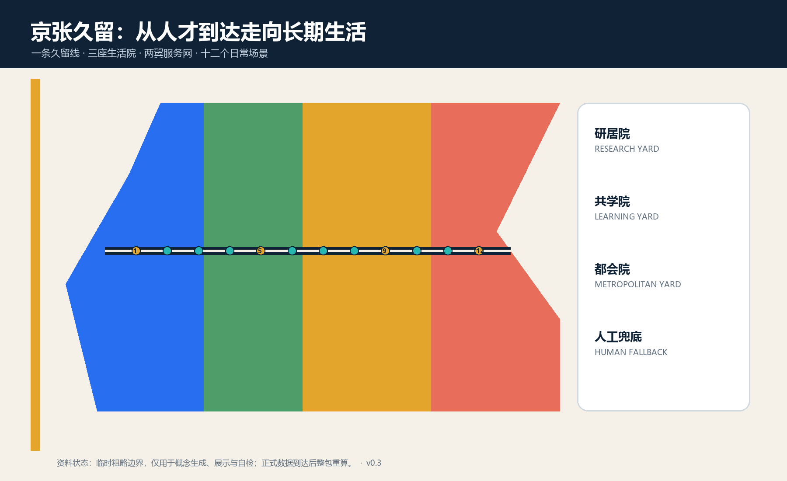
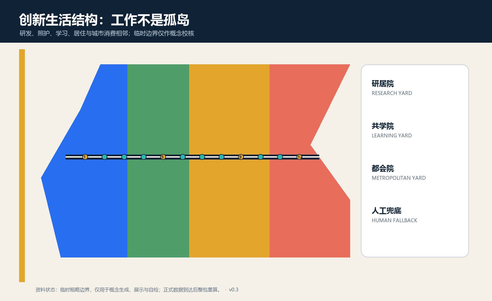
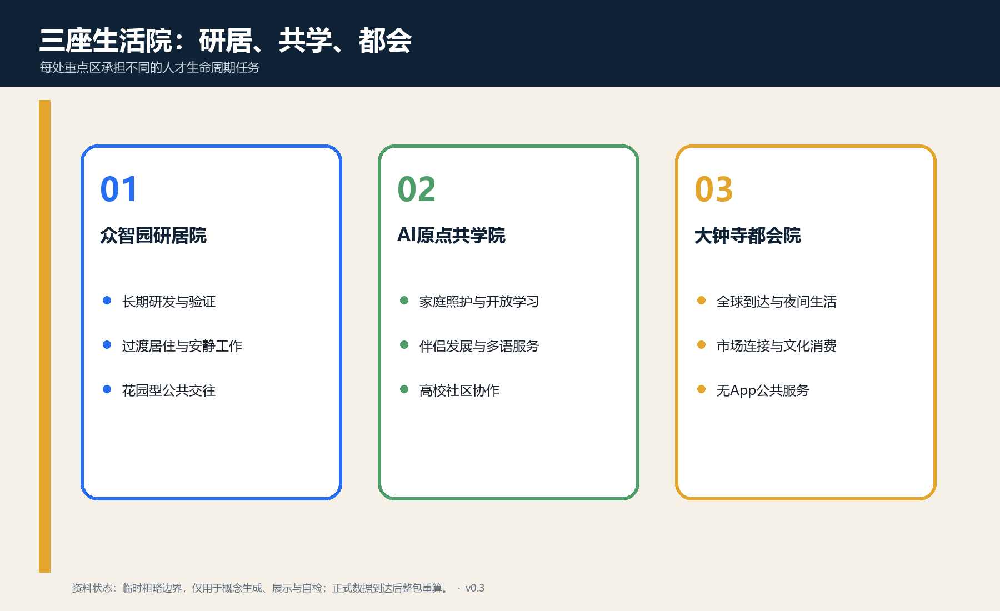
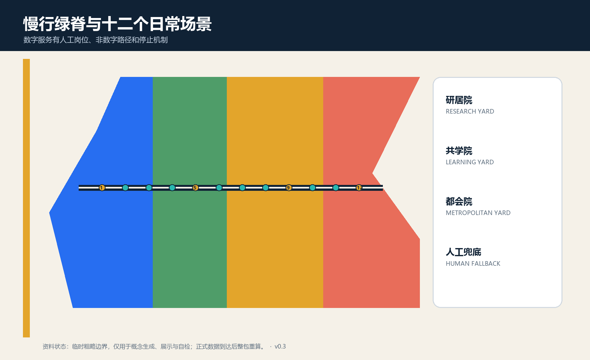
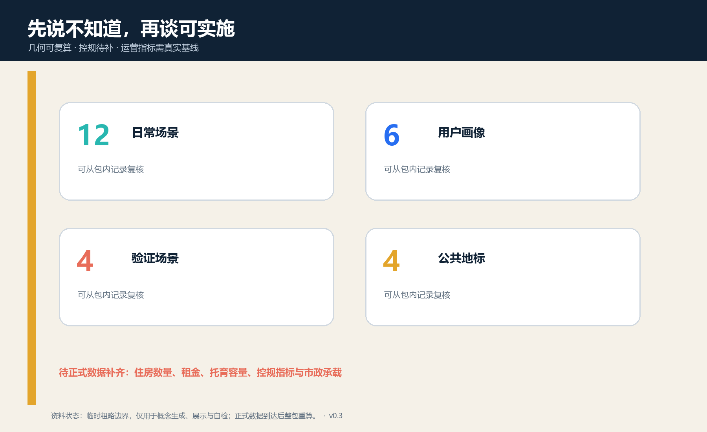

# 京张久留 STAY LONGER

> **v0.3 设计修订**：十二个服务与测试场景已写入可校验空间图层；图面以编号对应图例，避免长标签遮挡空间关系；人才服务禁用自动资格判断。

> **一句话判断**：真正的世界级 AI 创新带，不只让人才来开会、进实验室，也要让研究者、创业者、伴侣、孩子、运维人员与周边居民能够在这里完成一段有尊严的日常生活。

## 设计依据与资料清单

本方案以征集公告、场地包、智能体任务书、公开资料登记表与本地标准快照为正式依据；现阶段未取得官方精确红线、宗地权属、建筑普查、控规指标、市政容量和公共服务底数，因此提交的边界、用地、建筑、道路与分期图层均是用于讨论和机器校核的概念建议，不替代法定规划或政府审定。[source:OFFICIAL-ANNOUNCEMENT] [source:SITE-PACKAGE] [standard:PROJECT-AGENT-OPEN-CALL-TASKBOOK]

六个国际案例只转译方法，不证明可以原样复制：新加坡 one-north 提供 work-live-play-learn 混合与社区运营启发 [source:CASE-ONE-NORTH]；International House Helsinki 把抵达手续、家庭安顿、伴侣发展和长期留任放入连续服务链 [source:CASE-HELSINKI-IHH]；STATION F 与 Flatmates 展示创新空间与灵活居住的邻近关系 [source:CASE-STATION-F]；Barcelona 22@ 展示混合创新城区、单一窗口与真实城市试验 [source:CASE-BARCELONA-22]；Quayside 强调多元住房、公共空间和公众参与 [source:CASE-QUAYSIDE]；首尔的 AI 与创意产业节点提示研发、人才培养、展示和文化生产可形成网络 [source:CASE-SEOUL-HUBS]。所有案例均为背景来源，不用于生成北京的红线或控规指标。

## 三层范围工作框架

统筹研究范围 43.6 平方公里回答“海淀怎样形成对全球人才有连续吸引力的创新生态”；总体设计范围约 11.4 平方公里回答“研发、居住、照护、学习、消费和公共交往怎样在京张走廊上互相可达”；三处重点区回答“哪些服务可以先形成可逆原型”。三层不是三张互不相干的图，而是从区域人才链，到一条生活服务脊，再到三座可运营生活院的逐级落实。[metric:site_area_sqm] [depth:three_level_scope_framework]

当前 `SITE_BOUNDARY` 与三个 `KEY_AREA` 均采用仓库临时粗略 polygon；矩形或粗略边仅用淡色虚线表示，不解释为道路、地块或权属界线。官方数据到达后，应替换边界并重算用地覆盖、绿地、公共空间、建筑基底、场景点位和全部面积指标。[data:geometry/site_boundary.geojson#SITE-001] [data:geometry/key_areas.geojson#PROV-KEY-001] [metric:key_area_count]

## 统筹研究范围产业与未来城市研究

方案命名为“京张久留 / STAY LONGER”。“久留”不是把人锁在一个园区，而是让人可以在不同人生阶段自由进入、停留、成长、离开并再次回来。Logo 以一段铁路线折成开放的屋檐与回环，蓝色代表研发，暖金代表日常生活，绿色代表遗址公园；不开采人脸、简历或行为数据作为品牌资产。

总体结构为“**一条久留线、三座生活院、两翼服务网、十二个日常场景**”。一条久留线沿京张遗址公园组织步行、骑行与公共服务；众智园“研居院”承接长期研发、试验与工程师生活，AI 原点“共学院”承接近校转化、家庭照护与开放学习，大钟寺“都会院”承接全球到达、消费文化与市场连接；中关村科技服务翼提供法务、知识产权、资本与国际服务，小月河场景赋能翼提供社区反馈、公共健康与真实场景接口。[data:geometry/roads.geojson#ROAD-001] [depth:overall_spatial_structure]

五大功能被改写为一条人才全生命周期链：全栈自主创新对应“长期研发能留下”，世界级生态对应“家庭和同伴能留下”，AI+场景对应“产品在日常中被真实检验”，AI 活力城市对应“非工作时间仍有公共生活”，治理话语权对应“每个智能服务都有人工责任与退出路径”。

## 总体设计范围城市更新与控规深度城市设计

城市更新采用“公共服务先行、存量适配优先、重资产后置”的顺序。第一层是可逆服务：多语到达台、公共会客厅、照护预约、夜归值守、共享厨房和学习桌；第二层是存量首层改造与步行界面；第三层才是需要权属、控规、消防和市政论证的建筑更新。这样即使正式条件未齐，也能把设计分解为可验证的小步，而不是用一张终局效果图掩盖实施风险。[depth:renewal_project_list] [data:geometry/phasing.geojson#PHASE-001]

概念用地分区将研发、公共服务、城市消费与多元居住保持相邻，并用连续绿脊与公共客厅串联；它只表达功能关系，不改变法定用地性质。任何容积率、建筑高度、住宅数量、租金或托位数字均待正式数据补齐。[data:geometry/land_use.geojson#LU-001] [metric:talent_housing_units] [standard:MNR-LAND-USE-CLASSIFICATION-GUIDE]

## 重点区域详细设计

### 众智园研居院 / Research Living Yard

定位为“能把三年研发周期过成正常生活的花园型创新院”。建议以共享实验室、工程验证廊、短住与长住过渡空间、24 小时安静工作间、运动和餐饮界面组成步行回路。建筑动作以可逆内装和首层开放为先；机器人、实验设备和能源系统必须在封闭或分级场地完成验证，不能把公共道路当无边界试验场。[data:geometry/key_areas.geojson#PROV-KEY-001] [depth:three_key_area_detailed_design]

### AI 原点共学院 / Origin Learning Yard

定位为“让高校成果、家庭生活与社区知识在同一片日常空间里相遇”。建议设置多语一站式服务、伴侣职业交换、儿童共学、社区讲堂、研究伦理咨询和开放日路线；无手机、无算法的人工窗口与每项数字服务并列。高校、社区和住房的具体开放边界须经权属方和居民协商，不在本方案中预设。[data:geometry/key_areas.geojson#PROV-KEY-002] [assumption:A-SERVICE-001]

### 大钟寺都会院 / Metropolitan Living Yard

定位为“从抵达到融入城市的第一站”。建议把轨道到达、生活消费、文化活动、短时办公、夜间服务和国际社群放在连续公共界面上；四象限步行连通只提出目标，不给出桥隧和道路工程线位。大钟寺承担“城市而非园区”的验证：人才是否能在不进入专用园区、不下载指定 App 的情况下获得服务。[data:geometry/key_areas.geojson#PROV-KEY-003] [depth:traffic_rail_slow_parking]

## AI 创新生态、人才画像与 AI+ 场景

六类画像不是营销标签，而是服务压力测试：初到北京的国际研究者、带伴侣与儿童的研发家庭、处于早期现金流压力的创业团队、高校学生与青年研究者、夜班运维和服务劳动者、长期居住的周边居民。任何系统不得根据国籍、家庭、健康、收入或职业自动决定住房、教育、就业和公共服务资格。[assumption:A-PRIVACY-001]

| 场景卡 | 空间与服务对象 | 最小数据 | 人工复核、退出与运营 |
| --- | --- | --- | --- |
| S01 多语到达服务台 | 大钟寺；初到者与家庭 | 用户主动提交的问题 | 工作人员确认，提供纸质清单，可拒绝留存 |
| S02 住房与室友人工匹配 | 三院；研究者与创业者 | 自愿偏好，不采敏感画像 | 人工最终匹配，可撤回资料，不承诺房源 |
| S03 伴侣职业与学习交换所 | 原点；伴侣与转岗者 | 自愿技能和需求 | 社群协调员复核，不做自动录用推荐 |
| S04 儿童共学与照护预约 | 原点；家庭 | 时段与必要照护信息 | 持证人员确认，线下电话并行 |
| S05 开源实验室预约沙盒★ | 众智园；研发团队 | 设备、时段、安全等级 | 实验室负责人批准，违规立即停用 |
| S06 低速机器人无障碍测试★ | 众智园；居民与运维者 | 设备遥测和事件记录 | 现场安全员急停，保留无机器人路线 |
| S07 健康服务导航验证★ | 原点；公众 | 用户主动输入的服务问题 | 医务/社工复核，不作诊断或分诊决定 |
| S08 教育翻译与人工复核★ | 原点；学生与家长 | 待翻译公开材料 | 教师或翻译确认，原文始终可见 |
| S09 创业法务与知识产权门诊 | 中关村翼；创业者 | 项目主动披露材料 | 律师/专业人员签署意见，AI 不替代法律判断 |
| S10 夜归同行与人工值守 | 久留线；夜班者 | 不留存精确个人轨迹 | 固定值守点与电话并行，可一键关闭数字服务 |
| S11 社区技能时间银行 | 三院；居民与开发者 | 自愿发布技能和时段 | 社区管理员审核，积分不兑换公共权利 |
| S12 离开与回流交接站 | 全线；离开者与校友 | 自愿留下的公开成果 | 本人选择许可，删除个人数据，保留可引用贡献 |

其中 S05-S08 为四项产业或公共服务测试验证场景；十二个节点完整记录在场景图层中 [data:geometry/constraints.geojson#SCN-01]，数量由 [metric:scenario_node_count] 复核。

## 用地、建筑规模与拆改留方案

概念用地采用四类完整分区：研发与长期创业、照护学习与开放空间、全球服务与城市消费、多元居住与社区配套。分区 union 覆盖提交边界且无重叠，但不是法定用地调整。建筑层面采用“留、微改、可逆加装、待核新建”四级：先保留可用结构，再改首层和共享空间，再以可拆构件补充服务，只有在权属、消防、日照、交通、市政和控规确认后才讨论新建。[data:geometry/buildings.geojson#BLDG-001] [depth:retain_renovate_demolish]

本轮建筑基底面积只来自概念图层，不能反推总建筑面积、住房套数或人口容量。[metric:building_footprint_area_sqm] 与 `talent_housing_units` 的 unknown 状态共同防止把“久留”误读为已确定的房地产开发量。[depth:development_intensity_controls]

## 交通、轨道、市政与公共服务设施

交通以步行与骑行优先的久留慢行脊为骨架，三座生活院设置清晰到达、休息、无障碍和人工服务点；轨道接驳、道路断面、停车、消防和工程线位均待正式资料。夜间服务先用照明、清晰视线、值守和实体导视解决基本安全，再考虑数字辅助，不用持续个体跟踪换取“智慧感”。[data:geometry/roads.geojson#ROAD-001] [standard:MOHURD-URBAN-DESIGN-MEASURES]

市政与新基建采用“容量核验后接入”：端侧算力、充电、通信、给排水、能源和垃圾设施必须说明电力、散热、消防、维护和停机状态；公共服务先完成设施盘点、步行可达与需求核验。任何 AI 失效时，照护、问路、健康导航和安全值守仍有可见的人工作业面。[depth:municipal_new_infrastructure] [assumption:A-CONTROLS-001]

## 蓝绿空间、公共空间与城市风貌

京张遗址公园被定义为“日常比节庆更重要”的久留线：连续座椅、饮水、遮荫、冬季日照、无障碍、公共卫生间与安静角落优先于巨型屏幕和高耗能装置。概念绿地与公共空间比例分别由几何复算，但因边界粗略仅用于方案内部一致性，不构成规划指标。[metric:green_ratio] [metric:public_space_ratio]

四个朝圣与荣誉节点是“第一夜之家”“百年贡献墙”“京张长桌”“回程票花园”。它们纪念的不是少数技术英雄，而是可查来源的工程、研究、开源、照护和维护贡献；个人展示必须取得许可，默认不使用人脸识别。构件采用低矮、可维修、可拆除的站牌与屋檐语言，并等待文保控制资料。[metric:landmark_count] [assumption:A-HERITAGE-001]

## 更新项目清单、实施政策与分期计划

| 项目包 | 先做什么 | 放大前的门槛 | 状态 |
| --- | --- | --- | --- |
| P1 久留基线与服务盘点 | 住房、设施、夜间、无障碍和人才需求调研 | 数据许可、社区参与、专业复核 | 概念建议 |
| P2 三座可逆生活院 | 临时服务台、共享桌、照护预约和人工值守 | 场地权属、消防、运营主体 | 概念建议 |
| P3 四项验证场景 | 实验室、机器人、健康导航、教育翻译小规模测试 | 安全、伦理、责任和退出演练 | 概念建议 |
| P4 久留慢行脊 | 导视、休息点和断点核查 | 道路、公园、文保与无障碍审查 | 概念建议 |
| P5 存量首层适配 | 共享厨房、学习、法务、社群和夜间界面 | 建筑普查、权属、消防、市政 | 待核深化 |
| P6 长期居住供给 | 多类型、可负担、家庭友好的居住研究 | 需求、租金、用地、财务与公平性评估 | 待数据补齐 |

分期先完成基线与三座可逆原型，再依据公开评估决定是否网络化，最后才把有效做法写入后续专业设计与运营合同。[data:geometry/phasing.geojson#PHASE-001] [depth:phasing_implementation]

年度运营建议包括“百年京张开源周”“全球家庭到达月”“夜归城市测试季”“久留者年度回访”和“离开者回程日”。开发者社区负责公开工具与文档，生活院运营团队负责人工服务和设施维护，专业机构负责伦理、安全与空间审查。活动、资金、招商和政策均为深化方向，不是政府承诺。

## 指标体系、面积复算与合规矩阵

指标分三类：几何可复算指标包括提交边界面积、概念绿地率、公共空间率、建筑基底与 12 个场景点；待官方资料指标包括容积率、高度、道路红线、住房套数和托育容量；运营指标包括到达服务完成率、家庭留任感受、夜间使用、公平性投诉和场景退出时间，必须在真实试点建立基线后才能给数值。[metric:site_area_sqm] [metric:scenario_node_count] [depth:metrics_recalculation]

任务覆盖矩阵完整映射公告 1.3、1.4、1.5 与 agent.1-agent.6；专业标准矩阵和设计深度矩阵把每项判断连接到正文、几何、图纸、指标、来源、假设和自检。通过机器校验只表示包可审查，不表示方案已获批准、工程可行或数据充分。[standard:MOHURD-CONTROL-DETAILED-PLANNING] [depth:risk_missing_data]

## 风险、版权与合规说明

最大风险不是“创意不够”，而是把临时边界、概念建筑、人才服务愿景和 AI 推荐误说成官方红线、建设承诺、住房保障或自动资格判断。本包明确保持：边界临时、控规待补、权属待核、公共服务容量未知、隐私最小化、人工最终判断、非数字路径并行、试点可停止。[source:SOURCE-REGISTRY] [assumption:A-BOUNDARY-001] [assumption:A-PRIVACY-001]

正文、几何、图件、HTML 和 PDF 由声明的 AI agent 生成；未复用外部图片、地图瓦片、字体文件或企业标识。案例只作带出处的定性方法摘要。完整版权、生成方式和限制见 `report/copyright_statement.md`。

## 参考资料

- 北京市规划和自然资源委员会，百年京张 AI 创新带城市设计国际方案征集资格预审公告，2026。
- 面向全球智能体开展百年京张 AI 创新带城市设计开源征集任务书摘录，仓库清权版本。
- 住房和城乡建设部，《城市设计管理办法》；自然资源部，用地用海分类指南，仓库本地快照。
- JTC Singapore，one-north 官方介绍。
- City of Helsinki，International House Helsinki 与国际人才安顿服务。
- STATION F，园区与 Flatmates 官方介绍。
- Barcelona City Council，22@ 与城市创新服务资料。
- Waterfront Toronto，Quayside 规划与公共空间资料。
- Seoul Metropolitan Government，AI 与创意产业节点资料。

完整书目信息、用途与许可边界见结构化来源清单。[source:OFFICIAL-ANNOUNCEMENT]
