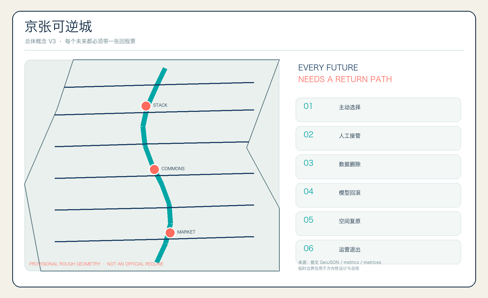
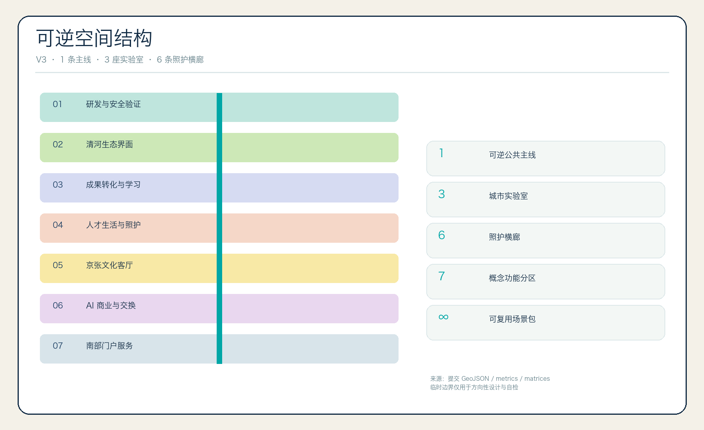
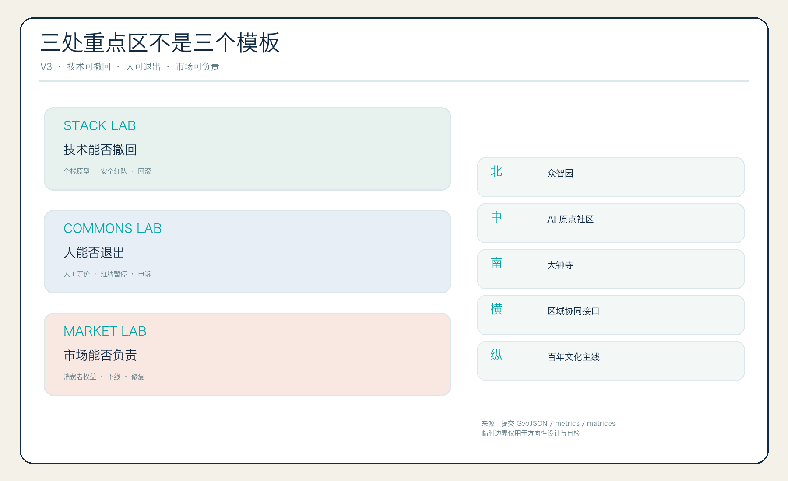
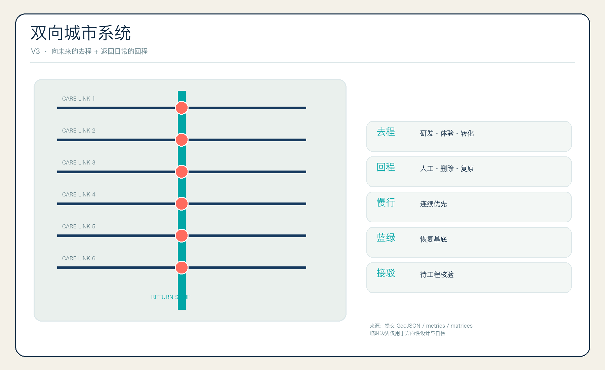
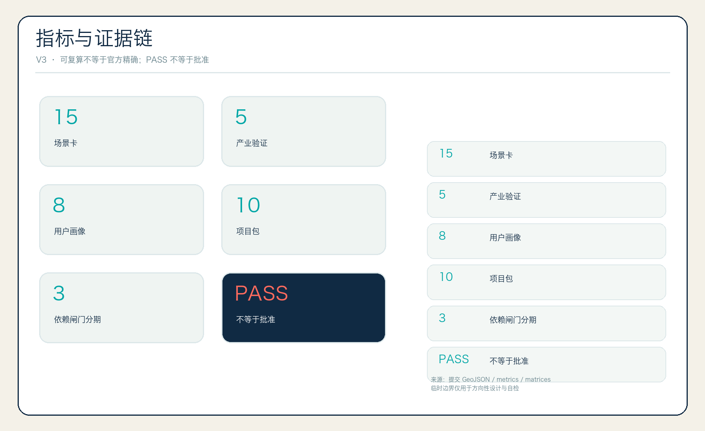

# 京张可逆城｜REVERSIBLE JINGZHANG

> **每个未来，都必须带一张回程票。** 不是先问 AI 能做什么，而是先问：错误发生时，谁能停止、如何恢复、谁来修复、城市是否仍能正常生活？第二轮视觉 QA 已将总图、用地、重点区、交通蓝绿和指标证据拆成五种不同图示语法，减少重复总图。

“可逆城”不是把城市反复推倒重来，也不是否定长期建设。它指的是：在 AI 技术尚不稳定、社会影响尚不确定时，先用小范围、可拆卸、有期限、有人负责的方式试验；居民可以拒绝或退出，服务可以切回人工，数据可以删除，模型可以回滚，设施可以撤走，公共空间可以恢复。真正不可逆的铁路遗产、生态基底、人的尊严与基本公共服务反而要被优先保护。简言之：**大方向长期主义，小试验可逆；城市可以学习，但不能让居民替技术承担无法回头的代价。**

## 设计依据与资料清单

本案把“可逆”作为城市设计、公共治理与产业验证的共同底盘。官方公告给出 43.6 平方公里统筹研究范围、11.4 平方公里总体设计范围、368.4 公顷三处重点区及三层任务；智能体任务书补充三大定位、五大功能、三区两翼、品牌、场景、地标和运营要求。[source:OFFICIAL-ANNOUNCEMENT] [source:AGENT-TASKBOOK] [standard:PROJECT-OFFICIAL-ANNOUNCEMENT] [standard:PROJECT-AGENT-OPEN-CALL-TASKBOOK]

当前精确官方 polygon、控规、道路红线、现状建筑、权属、市政、消防、文保与河道控制资料未进入公开包。因此 `site_boundary` 与三处 `key_areas` 沿用仓库 provisional rough geometry；它只用于生成、方向性讨论、内容评审、自检和可视化，**不是官方红线、审批依据或精确面积结论**。官方资料到位后，必须整体替换九组 GeoJSON、指标、五张图、A3/A0、HTML 和 manifest，而非只换底图。[source:BOUNDARY-SOURCE] [source:KEY-AREA-SOURCE] [data:geometry/site_boundary.geojson#SITE-001] [data:geometry/key_areas.geojson#PROV-KEY-001] [depth:existing_conditions_diagnosis]

专业表达遵循城市设计对公共空间、风貌、建筑体量和空间特色的统筹要求；用地采用国土空间分类术语；所有控规相关内容都区分“已知资料、概念建议、待专业确认”。[standard:MOHURD-URBAN-DESIGN-MEASURES] [standard:MOHURD-CONTROL-DETAILED-PLANNING] [standard:MNR-LAND-USE-CLASSIFICATION-GUIDE] 建筑设计深度规定当前缺官方来源，只登记为缺口，不冒充权威依据。[standard:MOHURD-ARCH-DESIGN-DEPTH-2016]

## 三层范围工作框架

三层范围由同一条“可逆性协议”传导：[depth:three_level_scope_framework] [depth:overall_spatial_structure]

| 层级 | 核心问题 | 可逆城回答 | 证据 |
|---|---|---|---|
| 43.6 km² 统筹研究 | 如何形成世界级生态又不制造不可控锁定 | 建立研究—验证—转化—公共复核—国际互操作的开放回路 | [source:SITE-PACKAGE] |
| 11.4 km² 总体设计 | 如何把产业与生活落到城市结构 | “1 条回程主线 + 3 座实验室 + 6 条照护横廊 + 多个日常接口” | [data:geometry/roads.geojson#ROAD-RETURN-001] |
| 368.4 ha 重点区 | 如何让三个片区互补而不复制模板 | 众智园验证“技术能否撤回”，原点社区验证“人能否退出”，大钟寺验证“市场能否负责” | [data:geometry/key_areas.geojson#PROV-KEY-002] |

总体命名为 **京张可逆城 REVERSIBLE JINGZHANG**。Logo 方向是两张相向的铁路票形成字母 R，中央留白是一条向人开放的步行路径；不使用政府徽记、企业 Logo、人物肖像或历史照片。主色“工程深蓝”代表公共基座，信号珊瑚色只标风险/停止，青绿只标已验证恢复路径，荧光黄绿只标待测试。命名子系统使用“回程票、撤回站、复原园、照护横廊、版本年轮”，文化导视与总品牌保持层级分离。

空间不是一条科技展廊，而是双向系统：向未来的“去程”承载研发、孵化、发布和体验；返回日常的“回程”承载人工服务、数据删除、物理撤场、模型回滚和生态复原。每个 AI 场景只有同时画出两条路径才有资格进入下一阶段。

## 统筹研究范围产业与未来城市研究

产业生态不是企业名单或财政承诺，而是八类可复用接口：基础研究、模型与工具、算力与能耗、安全与评测、成果转化、资本与专业服务、城市议题、公众复核。三区两翼形成闭环：众智园提供全栈原型与安全验证；原点社区提供开源协作、人才生活与受影响群体复核；大钟寺提供产品—市场—责任对接；中关村科技服务翼输入 IP、法务、资本和国际网络；小月河场景翼输入教育、医疗、商业、交通和社区议题。任何输入都必须带来源、权利、退出与失败处理。

八个全球案例只作机制参照，不外推其法律、资金、绩效或机构承诺：Punggol Digital District 的数字孪生先模拟后测试；CitCom.ai 的跨场景测试；Helsinki Mobility Lab 的开放试验；Barcelona Innova Lab 的城市问题征集；Amsterdam 算法登记的透明字段；Mila/Mile-Ex 的研究—转化共址；MassRobotics 的共享原型设施；Sidewalk Toronto 的退出案例提醒“技术完整不等于社会许可”。这些案例均列为背景启发，不支撑本项目法定空间结论。[source:SOURCE-REGISTRY] [metric:global_case_count]

区域协同不是箭头装饰，而是五种接口：北纬社区交换人才生活与近校创新方法；未来科学城交换基础研究与大装置需求；怀柔科学城交换科学智能基准；经开区交换智能制造和具身测试要求；京津冀节点交换场景包与公开评测协议。输出仅是“接口规格、进入条件、证据格式和退出条款”，不假定任何单位已合作。

| 区域接口 | 建议交换内容 | 京张输出 | 进入条件与退出边界 |
|---|---|---|---|
| 北纬社区 | 人才生活、近校创新方法 | 人工等价服务与社区复核模板 | 居民主动参与；不得复制个人画像 |
| 未来科学城 | 基础研究与大装置需求 | 场景问题、公开基准与转化接口 | 无正式合作文件即只保留接口建议 |
| 怀柔科学城 | 科学智能与评测方法 | 可复现包、失败档案与人审记录 | 数据权利不清或不可复现即退出 |
| 经开区 | 智能制造、具身测试要求 | 可逆试验协议与公共价值闸门 | 工业测试不得自动外溢到公共街道 |
| 京津冀节点 | 多地场景与互操作需求 | 开放场景卡、版本与退出条款 | 不宣称统一标准、采购或政策承诺 |

## 总体设计范围城市更新与控规深度城市设计

七类概念功能分区完整覆盖 provisional site：北部可逆研发与安全验证、清河生态与开放测试界面、近校成果转化与学习社区、人才生活与照护服务混合区、百年京张文化公共客厅、AI 原生商业与国际交换、南部门户与公共交通服务。[data:geometry/land_use.geojson#LU-001] [data:geometry/land_use.geojson#LU-007] [depth:land_use_layout]

建筑层采用“先保留、再诊断、后决定”的证据流程：资料待核 → 安全/权属/文保/使用绩效调查 → 保留维护 / 修缮提升 / 适应性再利用 / 专业拆建论证。28 个建筑基底只表达可逆研发、孵化、学习、社区服务、混合使用和商业服务的空间原型，不对应现实楼栋，不构成拆改留结论。[data:geometry/buildings.geojson#BLDG-001] [depth:retain_renovate_demolish]

容积率、建筑高度、密度、退线和总建筑规模全部保持 unknown；不以“看起来专业”的虚假数字替代控规。体量原则是小颗粒、开放首层、可拆内装、可恢复地面、共享庭院和夜间低扰动，待日照、消防、结构、交通、市政、文保与权属资料齐备后深化。[metric:floor_area_ratio] [depth:development_intensity_controls] [depth:height_massing_character]

城市更新的独特抓手是“回程预算”：任何临时设施、数字服务、活动或空间改造在立项前，先登记撤场时间窗、数据删除证据、恢复责任人、人工替代能力、维护资源和未解决申诉。没有回程预算，就不进入有限试验。

## 重点区域详细设计

**众智园｜可撤回技术实验室。** 概念建议以花园型研发组团、封闭安全测试庭院、模型/Agent 评测室和清河公共界面组织。重点验证模型、机器人、端侧算力、能耗协同和安全治理能否在越权、误识别、回滚失败时立即退出。所有对外展示必须同时展示失败样本和恢复记录。[data:geometry/key_areas.geojson#PROV-KEY-001]

**北京 AI 原点社区｜可退出生活实验室。** 概念建议以近校成果转化、AI 公民服务台、适老/无障碍共同测试室、开放学习空间和人才生活配套组织。拒绝 AI、撤回授权或选择人工服务，不得降低服务质量。社区不是默认实验场；受影响群体代表拥有红牌暂停权。[data:geometry/key_areas.geojson#PROV-KEY-002]

**大钟寺｜可负责市场实验室。** 概念建议围绕轨道接驳、四象限慢行、智能体/终端展示、国际互操作和消费者权益复核组织。每个产品试用必须明确人类 Owner、价格/推荐人工确认、投诉处理、退出责任和场地恢复。这里展示“负责任的转化”，不是无条件上线。[data:geometry/key_areas.geojson#PROV-KEY-003] [depth:three_key_area_detailed_design]

## AI 创新生态、人才画像与 AI+ 场景

八类人物画像：开源开发者、科研人员与学生、初创团队、城市运营人员、居民家庭、老年与照护者、无障碍使用者、商户与国际访客。画像只用于设计服务路径，不用于个体商业推荐。每类人都有“去程任务 + 回程权利”：参与、知情、拒绝、退出、申诉、人工等价服务和删除记录。[metric:persona_count]

### 六道回程闸门

1. **同意闸门**：主动选择，可随时撤回；2. **人工闸门**：高影响决定由可识别的人负责；3. **数据闸门**：最小化、限时、可删除、用途不可漂移；4. **模型闸门**：版本冻结、可回滚、可复现；5. **空间闸门**：设施可拆、地面可恢复、日常通行优先；6. **运营闸门**：有 Owner、SLA、申诉、停止与复盘。[metric:reversibility_gate_count]

### 15 张场景卡（其中 5 项产业验证）

| ID | 场景 / 空间 | Owner 与 RACI | 数据与人工复核 | 停止—恢复—退出 |
|---|---|---|---|---|
| 01 | 多 Agent 工具链验证【产业】/众智园 | 技术 Owner 负责，独立红队审核，公众知情 | 合成数据、冻结工具权限；人审发布 | 越权/不可复现即隔离；回滚版本并封存日志 |
| 02 | 具身机器人低速沙盒【产业】/封闭庭院 | 现场安全员负责，交通专业人员批准 | 不做人脸识别；安全员实时接管 | 安全距离、误识别或投诉触发停机；恢复步行空间 |
| 03 | 模型安全与偏差红队【产业】/众智园 | 独立红队负责，模型方整改 | 授权模型与隔离数据；高危项人签 | 高危未关闭即 Reject；删除测试凭据 |
| 04 | 算力—能耗协同【产业】/研发载体 | 设施工程师负责，运维批准 | 只读设备数据；人批准调度 | 舒适/稳定失败即恢复原策略 |
| 05 | AI 原生商业试营业【产业】/大钟寺 | 商户负责，消费者权益代表审核 | 禁止默认跨店画像；价格和高影响推荐人确认 | 歧视定价/误导/无法切人工即下线并退款复盘 |
| 06 | 社区事务解释助手/原点社区 | 窗口人员负责，独立申诉人复核 | 仅公开材料和主动输入 | 无来源答复或申诉上升即降级为目录 |
| 07 | 适老生活协作/社区服务站 | 本人/照护者负责，专业人员咨询 | 单独授权、端侧优先 | 撤回即停；人工渠道不降级 |
| 08 | 无障碍连续导航/照护横廊 | 无障碍体验官负责，交通人员审核 | 不存完整轨迹 | 路线过期即撤回并发布人工替代路线 |
| 09 | AI 医疗服务导航/社区 | 医疗服务人员负责，患者决定 | 不诊断；只解释公开就医路径 | 不确定即转人工；删除会话记录 |
| 10 | 开放 AI 素养课堂/原点 | 教师负责，未成年人权益人审核 | 未成年人数据不训练 | 不当内容即停课复盘 |
| 11 | 京张证据导览/公共主线 | 史料编辑负责，权利策展人审核 | 只用可追溯清权资料 | 来源不明即撤卡，不让 AI 补写历史 |
| 12 | 公园生态养护助手/绿廊 | 园林人员负责，公众知情 | 环境数据，不采邻里信息 | 连续误判即停用建议并恢复人工巡检 |
| 13 | 夜间照明协作/照护横廊 | 值守人员负责，居民代表审核 | 低分辨率计数，不识别人 | 眩光/扰民即恢复固定照明 |
| 14 | 城市议题路由台/回程票大厅 | 场景 Owner 负责，受影响群体审核 | 公开展示默认去标识 | 无 Owner/合法条件/申诉路径即 Hold |
| 15 | 全球 Agent 互操作周/大钟寺 | 联合测试召集人负责，安全员审核 | 沙盒接口、测试密钥、合成数据 | 越权/密钥泄露即隔离并轮换凭据 |

以上 15 项是概念建议而非已批准试点；5 项产业验证仅表示设计分类。[metric:scenario_card_count] [metric:industry_test_scenario_count]

## 用地、建筑规模与拆改留方案

土地分类只表达功能关系，不改变法定用途。七条分区由同一个 provisional site 依次切分，保证边界共享、完整覆盖且无缝隙；这证明提交数据自洽，不证明任何法定用途已经调整。科研、教育、社区、居住、文化体育、商业和交通服务的组合，是对“工作—生活—学习—社交”连续性的概念回答，后续必须用官方控规、现状权属、人口与设施底数校准。[data:geometry/land_use.geojson#LU-003]

概念建筑基底面积由 EPSG:4548 复算，仅描述方案原型的地面投影，不能推导总建筑面积、投资或开发强度。[metric:building_footprint_area_sqm] 每个原型采用 DfD（面向拆解设计）清单：可拆连接、材料护照、设备租赁/回收、地面恢复、消防与无障碍复核、维护与撤场责任。建筑位置、面积和形态均为设计语言，不对应真实楼栋；官方建筑底图到位后，须逐栋重建 geometry/buildings.geojson，而不是把原型强行套用。

拆改留不是红黄蓝猜图，而是逐栋证据卡。取得官方现状与权属数据后，先判断历史、使用、结构、安全、消防、碳与社会价值，再比较保留维护、修缮提升、适应性再利用与拆建论证的全生命周期影响。每张卡还须记录使用者搬迁影响、无障碍、材料去向和可逆性；任何具体结论仍需专业团队和法定程序。[depth:retain_renovate_demolish]

## 交通、轨道、市政与公共服务设施

一条南北“回程主线”连接三处重点区；六条东西“照护横廊”把高校、园区、社区、轨道与公共服务接回日常城市。[data:geometry/roads.geojson#ROAD-RETURN-001] [data:geometry/roads.geojson#ROAD-CARE-01] 线位只表达概念慢行关系，不代表道路红线、桥隧或工程可行性。[depth:traffic_rail_slow_parking]

市政采用“可插拔 + 可降级”：端侧算力只读接入、关键设施保留人工控制，传感器可拆，网络中断时公共服务仍可运行。分布式能源、算力、排水、消防、通信与照明容量均待官方资料和工程专业核验；本案只定义接口、人工接管、回退和责任。由于缺少可信控制线，`constraints.geojson` 保持空集合并作为资料缺口，而不是绘制伪道路红线、河道蓝线或文保边界。[data:geometry/constraints.geojson#intentionally-empty] [depth:municipal_new_infrastructure]

## 蓝绿空间、公共空间与城市风貌

绿色空间是所有试验的恢复基底，而非科技展陈背景。主线绿廊与三座恢复花园形成连续系统；公共空间包含三座地标和六条照护横廊，与 `roads.geojson` 中 ROAD-CARE-01..06 一一对应。道路层表达概念慢行中心线，公共空间层表达其可讨论的步行与停留界面，两者采用不同指标口径但数量一致。[data:geometry/green_space.geojson#GREEN-RETURN-001] [data:geometry/public_space.geojson#PUBLIC-LANDMARK-01] [data:geometry/public_space.geojson#PUBLIC-CARE-06] [depth:blue_green_public_space] 绿地率与公共空间率来自提交几何 union，二者可能重叠，不能相加冒充开放空间总率。[metric:green_ratio] [metric:public_space_ratio]

三座 AI 朝圣地标：**回程票大厅**展示每个场景的退出与恢复承诺；**城市撤回中心**让公众提出暂停、申诉、删除与人工服务请求；**百年版本园**把被采用、被修改、被撤回和失败的公共贡献共同保存。荣誉墙不只刻“成功者”，也记录及时叫停错误方案的人——把负责任的撤回变成城市荣誉。

文化叙事以“1909 自主工程—2026 可逆智能—2109 代际托管”为三幕。铁路让人可以去往远方，也保留返程；中关村文化让思想快速迭代；AI 新文化必须让错误可以被看见和纠正。导视以票孔、年轮、双向箭头与轨距网格为语法，历史事实与版权由人工策展人逐条确认。

## 更新项目清单、实施政策与分期计划

十个项目均为可供专业团队深化的概念包：[depth:renewal_project_list] [metric:renewal_project_count]

| ID | 项目 | 前置材料 / Owner | Go / Hold / Stop |
|---|---|---|
| RJ-01 | 回程票大厅 | 公共空间许可；公共空间 Owner | 无障碍和撤场演练通过才 Go |
| RJ-02 | 城市撤回中心 | 服务流程与申诉权限；公共服务 Owner | 无独立申诉人即 Hold |
| RJ-03 | 百年版本园 | 史料与版权清单；文化 Owner | 来源/权利不明即撤展 |
| RJ-04 | 六条照护横廊 | 道路红线与交通调查；交通 Owner | 通行受损即 Stop 并复原 |
| RJ-05 | 众智园安全验证庭院 | 安全边界；技术 Owner | 回滚失败即 Stop |
| RJ-06 | 原点社区人工等价服务台 | 服务标准；社区 Owner | 拒绝 AI 导致降级即 Stop |
| RJ-07 | 大钟寺责任市场客厅 | 消费者权益流程；商业 Owner | 误导/歧视即下线 |
| RJ-08 | 可拆端侧算力驿站 | 能源与消防；设施 Owner | 容量未知即 Hold |
| RJ-09 | 京张证据导览 | 文保与版权；策展 Owner | 史实争议未解即 Hold |
| RJ-10 | 城市 Undo Week | 场地、安全、值守；运营 Owner | 无恢复演练不举办 |

分期不是承诺日期，而是依赖闸门：一期先建治理、人工服务和轻介入原型；二期在南部和中部测试公共/市场责任；三期在北部扩大研发与区域互操作。每期结束必须举行“Undo Day”实际演练服务降级、数据删除、版本回滚、设备撤场和空间复原，再决定继续、调整或退役。[data:geometry/phasing.geojson#PHASE-001] [data:geometry/phasing.geojson#PHASE-003] [depth:phasing_implementation] [metric:phase_count]

年度运营建议为四季循环：春季 Issue Season 收集城市问题；夏季 Sandbox Season 做合成与封闭验证；秋季 Human Review Week 由受影响群体和专业人员评审；冬季 Undo Week 强制回滚与复盘。开发者贡献转化路径是 Issue → 复现包 → 有限试验 → 人审 → 专业深化/退役；没有“自动上线”。运营 KPI 关注可复现率、退出响应、人工等价服务可用性、未结申诉、恢复演练和资产许可完整度，不编造既有绩效。

落地路径按“近期轻介入试点—中期片区协同—远期区域互操作”三个阶段组织；参与主体建议包括专业部门、维护者、企业、高校、社区、居民与无障碍体验团队。每个试点在进入下一阶段前，用可衡量指标完成评估、监测与反馈：责任主体覆盖、人工等价服务可用、退出响应时长、恢复演练完成、未结申诉数量、资产许可完整和受影响群体反馈。指标是 Go/Hold/Stop 的证据要求，不是本方案声称已达成的绩效。

## 指标体系、面积复算与合规矩阵

提交边界面积为 provisional geometry 在 EPSG:4548 下的内部一致性复算值，仅服务包内校核。[metric:site_area_sqm] 三处重点区数量为 3。[metric:key_area_count] 已知指标均记录公式、来源文件、置信度与假设；容积率保持 unknown。用地完整覆盖由拓扑检查验证，绿地和公共空间按 union 计算。[depth:metrics_recalculation]

合规矩阵覆盖公告 1.3、1.4、1.5 与 agent.1—agent.6；标准矩阵覆盖强制标准；深度矩阵 15 项均有正文、图纸、几何、指标、来源、假设和自检证据。PASS 只表示可进入评审，不表示官方批准、专业审定或现实实施。

## 风险、版权与合规说明

主要风险是：provisional geometry 被误读为官方；居民生活被默认试验化；AI 退出后人工服务不足；物理设施撤场却留下数据/合同锁定；“可逆”被当作免责；品牌与历史资产权利不清。对应措施是显著水印、主动选择、人工等价服务、回程预算、独立申诉、停止阈值、恢复责任和逐资产许可台账。[depth:risk_missing_data]

无障碍 QA 必须包含键盘导航、屏幕阅读器、色彩对比、替代文本、远距展板可读性和真实使用者测试；当前离线 HTML 提供语义结构、跳转链接、alt 与高对比模式基础，正式展示前仍需人工专项审核。所有图形、地图、图表和 PDF 均由本 Agent 基于仓库公开/清权数据和提交几何确定性生成，不使用外部图片、企业标识或商业地图。版权与官方边界声明见 `report/copyright_statement.md`。

**统一边界声明：本方案全部空间落地内容均为开放共创建议、概念建议、参考方案或可供专业团队深化研究的材料，不替代正式规划，不构成政府审定、投资、采购、建设、运营或政策承诺。最终判断由人类和专业团队作出。**

## 参考资料

权威索引见 `sources.json`；公共资料用途边界见 [source:SOURCE-REGISTRY]；处理包仅作导航见 [source:PROCESSED-FACT-PACK]。官方公告用于确认项目名称、三层范围、面积约值和任务，不用于推导精确 polygon；Agent 任务书用于确认六项共创任务、品牌、场景和运营边界，不用于推导法定规划条件；provisional boundaries 只用于生成、自检和方向性可视化。

- brief/public-brief.md — 公开任务书草案，仅用于任务背景、愿景、方向与方案边界。

城市设计管理办法用于公共空间、城市特色、建筑体量与界面的专业语言；控规编制审批办法用于区分已知控制、设计建议和待确认事项；国土空间分类指南用于统一用地代码语义。所有背景案例只支持机制启发，不支持本项目的政府承诺、合作关系、投资规模或绩效结论。官方精确几何、控规、建筑、权属、交通、市政、消防、文保、河道和公共服务底数到位后，应登记来源与哈希，重建全部空间图层并提交版本差异报告；在此之前，任何精确性外观都不能升级资料权威等级。[depth:risk_missing_data]
