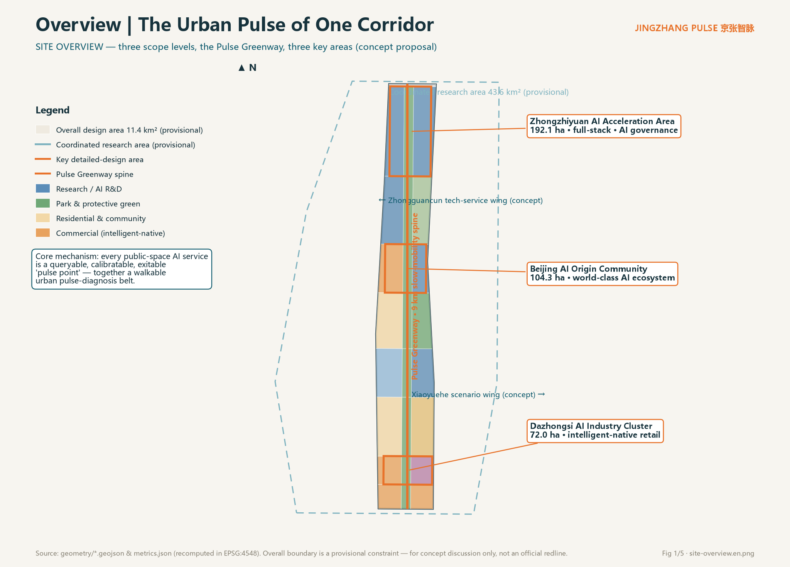
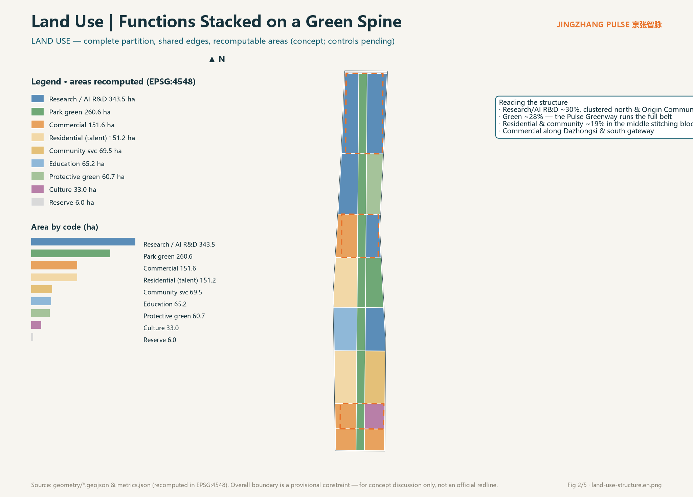
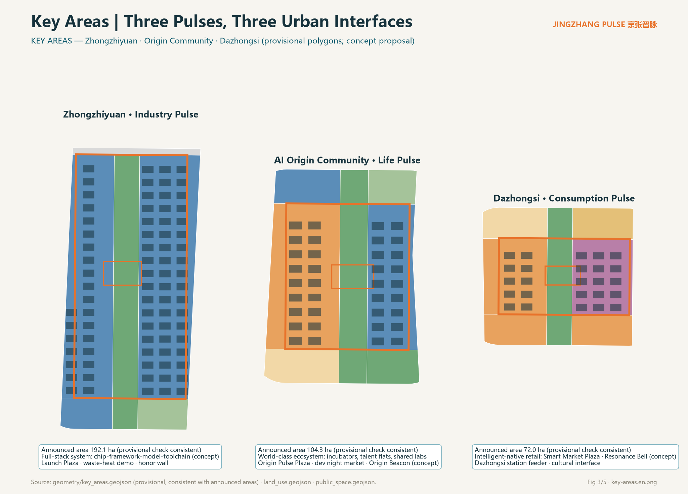
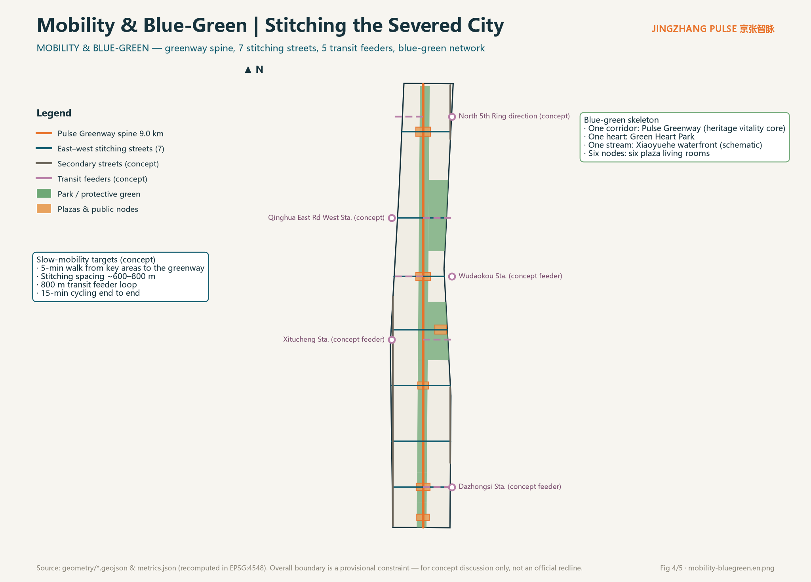
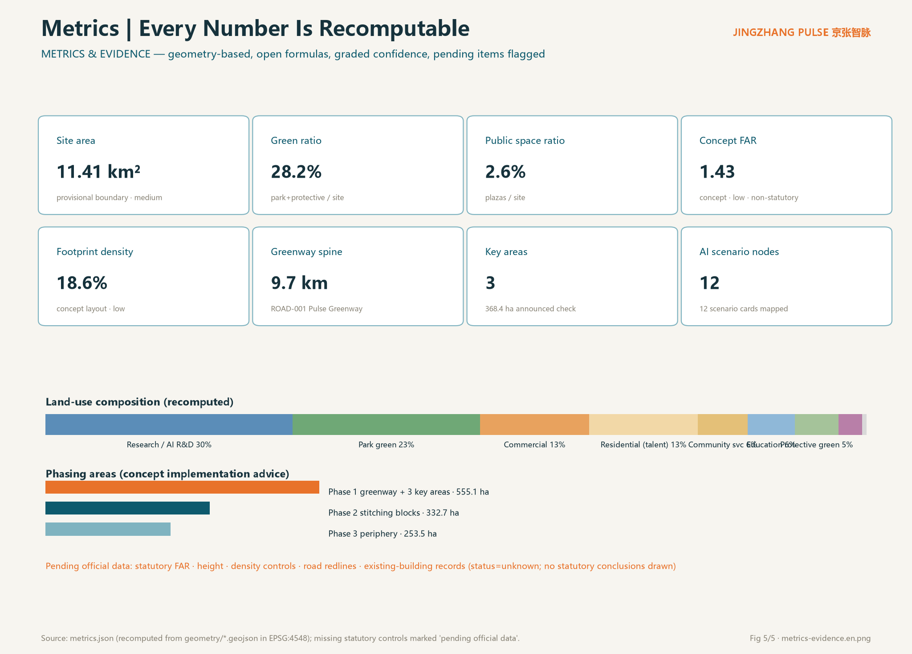

# JINGZHANG PULSE: The Urban Pulse of One Corridor, Three Districts and Two Wings

## Design Basis and Source Inventory

This proposal is governed by the official pre-qualification announcement, which defines the three scope levels, three key areas, and official area figures [source:OFFICIAL-ANNOUNCEMENT] [standard:PROJECT-OFFICIAL-ANNOUNCEMENT], and by the agent open-call taskbook with its ten co-creation principles, six required tasks, and boundary clause [source:AGENT-TASKBOOK]. Land-use coding follows the project subset of the national land-use classification guide [standard:MNR-LAND-USE-CLASSIFICATION-GUIDE]; the boundary between urban-design expression and regulatory-plan judgment follows MOHURD measures [standard:MOHURD-URBAN-DESIGN-MEASURES] [standard:MOHURD-CONTROL-DETAILED-PLANNING].

Source usability follows the public source registry: the announcement and taskbook are formal-ready; the provisional boundary polygons are intake-only leads [source:SOURCE-REGISTRY]. Exhaustive machine indexes live in `sources.json`, `metrics.json`, `standard_matrix.json`, `design_depth_matrix.json`, and `compliance_matrix.json`.

Data gaps, stated plainly: the official precise boundary, regulatory controls (FAR, height, density, green ratio, setbacks), road redlines, existing-building records, and exact heritage extents are not in the public site package. All affected indicators are marked "pending official data", and all spatial placements are conceptual suggestions [source:BOUNDARY-SOURCE].

## Three-Level Scope Framework

The coordinated research area (~43.6 km²) carries industry and future-city strategy; the overall design area (~11.4 km²) is the main spatial design carrier; the key detailed-design area (~368.4 ha) comprises, north to south, the Zhongzhiyuan AI Acceleration Area (192.1 ha), the Beijing AI Origin Community (104.3 ha), and the Dazhongsi AI Industry Cluster (72.0 ha) [source:OFFICIAL-ANNOUNCEMENT] [data:geometry/key_areas.geojson#PROV-KEY-001].

The submitted overall design boundary is a provisional constraint polygon published by the repository maintainers; recalculated in EPSG:4548 it covers about 11.413 million sqm, consistent with the announced 11.4 km² [metric:site_area_sqm]. Its limits must be explicit: it is not an official redline, not a basis for precise area determination, and not an approval basis. Once official polygons arrive, the land-use partition, green/public-space indicators, and phasing areas must be recalculated through the same scripted path [depth:three_level_scope_framework].

The three levels answer three questions in sequence: why here (strategy), how space is organized (one corridor, three districts, two wings), and what the interfaces feel like (experienceable public scenes in the key areas) [depth:overall_spatial_structure].

## Coordinated Research Area: Industry and Future-City Study

**Overall concept: the urban pulse.** In 1909 the Beijing–Zhangjiakou railway organized China's first self-built railway around timetable discipline. Today, as AI services enter public space at scale, the city needs a new public discipline: every AI service behaves like a pulse — continuous, public, and palpable. Each public-space AI service is a "pulse point" that publishes its service status, data usage, human-staffing location, and exit mechanism; along the 9 km heritage greenway these points form a walkable "urban pulse-diagnosis belt" [source:AGENT-TASKBOOK] [standard:PROJECT-AGENT-OPEN-CALL-TASKBOOK].

**Naming system.** Primary name 京张智脉 / JINGZHANG PULSE. Spatial sequence: Pulse Greenway (main spine), Pulse Plazas (six public living rooms), Pulse Kiosks (AI service inquiry points), Stitching Streets (east–west slow-mobility streets); operation brands include Pulse Open Day and Public Scenario Test Week. All sub-names are original concept words coined for this proposal.

**Visual identity and logo direction.** The logo motif combines "sleeper rhythm × pulse waveform": a horizontal baseline interrupted by evenly spaced railway sleepers, rising into a pulse beat at the third stroke — the overlay of century-old railway discipline and the AI-era urban rhythm. The primary color "Jingzhang Teal" draws on the blue-grey of steel and industrial heritage; "Pulse Orange" marks every AI scenario node. This is a directional concept only: final fonts, imagery, and trademarks require separate clearance [source:AGENT-TASKBOOK].

**Three positionings and five functions, spatialized.** The Centennial Jing-Zhang culture belt lands on the heritage corridor and six plaza interfaces; the urban AI life-experience belt lands on the greenway and seven stitching streets; the AI fusion-innovation belt lands on the three key areas. Among the five functions, the full-stack indigenous innovation system anchors Zhongzhiyuan; the world-class innovation ecosystem anchors the Origin Community; the AI+ scenario paradigm runs along the Xiaoyuehe wing and the belt-wide scenario network; the intelligent vibrant city shows in slow mobility and living-room systems; and global AI-governance voice is expressed through the auditable public interface of the "pulse protocol" [source:SRC-2026-BJ-KW-THREE-AREAS-WINGS].

**Three districts and two wings synergy loop.** Zhongzhiyuan exports full-stack capability → the Origin Community offers a real-life testbed → Dazhongsi completes consumer-side validation → the Zhongguancun technology-service wing provides capital and IP services → the Xiaoyuehe scenario wing feeds back demand; the physical carrier of the loop is the greenway plus stitching streets [data:geometry/roads.geojson#ROAD-001].

**Global case lessons (concept transfer, not factual citation).** Kendall Square shows the "half-mile beyond the campus wall" stitched by walkable networks; King's Cross Knowledge Quarter shows heritage fabric carrying knowledge industries; Punggol Digital District shows campus-city hybrid governance; Shenzhen's Yuehai Subdistrict warns that high-density industry districts need strong public services; Hangzhou's Future Sci-Tech City shows platform-enterprise co-building of public space; Zurich's ETH district shows that small-scale, face-to-face networks remain a hard-tech necessity. These convert into three spatial principles: walkable innovation encounter, public-ized heritage interfaces, and institutionalized scenario testing [source:AGENT-TASKBOOK].

**Future-city judgment.** AI as new-quality productive force needs not bigger parks but shorter distances — from lab to real scenario, from failure to review, from technology to public trust. The Pulse Greenway compresses all three to walking scale [depth:existing_conditions_diagnosis].

## Overall Design Area: Urban Renewal at Regulatory-Plan Urban-Design Depth

**Spatial structure: one corridor, three districts, two wings, many pulse points.** The corridor is the Pulse Greenway, about 9.7 km along the heritage alignment [metric:heritage_spine_length_m]; the districts are the three key areas; the wings are the Zhongguancun technology-service wing (west) and Xiaoyuehe scenario-empowerment wing (east), expressed at the stitching-street ends; pulse points are six plazas and twelve AI scenario nodes [data:geometry/public_space.geojson#PS-001].

**Land use (conceptual).** The partition fully covers the provisional boundary with shared edges — no gaps, no overlaps — and every parcel can be recomputed in EPSG:4548 [data:geometry/land_use.geojson#LU-001] [depth:land_use_layout]. Research/AI-R&D land is about 343.5 ha (~30%), concentrated in Zhongzhiyuan and the Origin Community's east side; park and protective green about 321.3 ha (~28%); residential and community services about 220.7 ha (~19%) in the middle stitching blocks; commercial services about 151.6 ha (~13%) anchored at Dazhongsi and the south gateway; education, culture, and reserve land provide flexibility [metric:land_use_0802_sqm].

**Renewal framework.** Three renewal object classes: public-oriented renewal of the heritage corridor and adjacent underused space (conceptual direction, not demolition conclusions); service mending in middle community blocks; and functional-substitution studies in key-area industrial blocks. Statutory retain/renovate/demolish/new-build judgments require the official regulatory plan and existing-building records; all parcel-level conclusions are pending official data and professional review [standard:MOHURD-CONTROL-DETAILED-PLANNING] [depth:retain_renovate_demolish].

**Building scale and intensity.** Conceptual building footprint is about 2.12 million sqm, footprint density ~18.6%, and conceptual FAR ~1.43 — all low-confidence design quantities, not statutory control values. Statutory FAR, height, density, and green-ratio controls follow the approved regulatory plan and are explicitly marked pending official data [metric:building_density] [metric:concept_floor_area_ratio] [depth:development_intensity_controls].

**Traffic and municipal capacity.** Mobility is led by slow-traffic stitching plus transit connection: seven east–west stitching streets repair the century-old severance, and five conceptual transit connections form an 800 m feeder loop. Distributed energy and edge-compute nodes are proposed as conceptual directions; load and capacity calculations remain professional engineering work pending official data [depth:traffic_rail_slow_parking] [depth:municipal_new_infrastructure].

**Heritage park vitality belt.** The greenway core carries three function families — heritage narrative, scenario testing, and public events — producing a rhythm of daily experience, quarterly tests, and an annual summit [depth:blue_green_public_space].

## Key Area Detailed Design

All three key-area polygons are provisional constraints, checked against announced areas with under 1% deviation; the following designs are conceptual and directional, offered for professional teams to deepen [data:geometry/key_areas.geojson#PROV-KEY-002] [depth:three_key_area_detailed_design].

**Zhongzhiyuan AI Acceleration Area · Industry Pulse (192.1 ha).** Hosts the full-stack indigenous innovation system and the AI-governance voice. Structure: "one corridor, two flanks, one plaza" — the greenway passes through, full-stack R&D blocks (chip, framework, model, toolchain as conceptual layout) flank it, and the Zhongzhi Launch Plaza (~64,000 sqm conceptual public space) hosts releases and honor displays [data:geometry/public_space.geojson#PS-002]. Renewal focuses on functional substitution research; mobility relies on two conceptual transit connections; scenarios include waste-heat recovery and a governance-sandbox showroom. Risk: full-stack spatial demand is elastic — mixed-use flexibility must be preserved at the regulatory stage.

**Beijing AI Origin Community · Life Pulse (104.3 ha).** The living carrier of a world-class AI ecosystem. Structure: "one street, one courtyard, one beacon" — the Origin Stitching Street links incubator blocks and talent apartments; the Campus Commons courtyard opens the university–community interface; the AI Origin Beacon (conceptual landmark) anchors the cultural narrative [data:geometry/public_space.geojson#PS-001]. It connects to the Wudaokou conceptual feeder; scenarios include the developer night market, smart community canteens, and shared-lab booking. Risk: complex existing ownership — renewal must be negotiated with residents, and this proposal draws no parcel-level demolition conclusions.

**Dazhongsi AI Industry Cluster · Consumption Pulse (72.0 ha).** Hosts intelligent-native retail and the Dazhongsi cultural interface. Structure: "one market, one bell, one station" — the Smart Market Plaza carries intelligent-native consumption; the Resonance Bell (conceptual installation) dialogues with the ancient temple bell; the Dazhongsi station connector (concept) stitches transit flows [data:geometry/public_space.geojson#PS-003]. Scenarios: the Pulse Health Kiosk and low-speed robot delivery (bounded test conditions). Risk: tension between commercial footfall and heritage protection needs a dedicated study.

## AI Innovation Ecosystem, Talent Personas and AI+ Scenarios

**Six personas (conceptual generalization).** The full-stack researcher (needs quiet R&D plus high-spec release interfaces); the graduate student (needs low-cost trial-and-error space and cross-campus networks); the long-time elderly resident (needs human-fallback services and barrier-free daily life); the commuting developer (needs fast feeders and night-time third places); the AI pilgrim visitor (needs legible urban narrative and ritual nodes); the Dazhongsi shopkeeper (needs footfall conversion and new-format training). Personas inform scenario design and are not statistical claims [source:AGENT-TASKBOOK].

**Twelve scenario cards (including three industry test/validation scenarios).** Each card maps to a spatial node, users, data boundaries, and human review; privacy red lines: no biometric collection, no individual profiling surveillance, and a human exit channel for every public AI service [standard:GENERATIVE-AI-INTERIM-MEASURES].

| # | Scenario card | Spatial node | Users | Privacy & human review | Operator (concept) |
|---|---------------|--------------|-------|------------------------|--------------------|
| 1 | Pulse Health Kiosk: public AI service status inquiry and appeal | Dazhongsi Smart Market Plaza | residents/visitors | read-only disclosure + staffed desk | city operations platform |
| 2 | AI Commute Copilot: slow-mobility routing and feeder advice | Pulse Greenway (belt-wide) | commuters | anonymized traces, on-device compute | mobility operator |
| 3 | Heritage Docent Agent: Jing-Zhang AR guide | heritage corridor | visitors/students | no collection; human-edited content | cultural operator |
| 4 | Smart community canteen (elderly-friendly) | Zhichun community center | elderly residents | staffed window and cash retained | community vendor |
| 5 | Campus–community shared-lab booking | Campus Commons | students/residents | real-name booking, data minimization | university alliance |
| 6 | Park Vitality Manager: events and crowd guidance | Green Heart Park | residents | group-level statistics only | park operator |
| 7 | [Industry test] Low-speed autonomous micro-circulation feeder test corridor | east-side concept street | passengers/firms | bounded segment and hours, safety operator aboard | test alliance |
| 8 | [Industry test] Construction-robot renewal pilot section | phase-2 stitching blocks | contractors | enclosed site, human supervision | builder |
| 9 | [Industry test] Compute waste-heat recovery demo | Zhongzhiyuan | energy firms/public | public operations dashboard | energy operator |
| 10 | AI Public-Service Helper (human fallback) | South Gateway Plaza | residents | human final review; elderly-accessible | public-service vendor |
| 11 | Barrier-free Navigation Angel | Pulse Greenway (belt-wide) | visually impaired / mobility-limited | on-device processing; opt-in family link | public-interest + commercial hybrid |
| 12 | Developer Night Market: pop-up LLM app testing | Origin Community | developers/residents | registration-based; human spot checks | developer community |

Scenario-to-space mapping also appears on the interactive map in `visual/index.html` and in the scenario-node count in `metrics.json` [metric:ai_scenario_node_count]. Industry test scenarios are bounded, conditional concept arrangements — not approved operations [source:AGENT-TASKBOOK].

## Land Use, Building Scale and Retain/Renovate/Demolish/New-build Logic

The layout uses the greenway as spine: residential and education on the west flank, R&D and commerce on the east — a "cool corridor, intense wings" concept structure [data:geometry/land_use.geojson#LU-010] [depth:land_use_layout]. Research/AI-R&D plus commercial land together reach ~43%, matching the innovation-belt positioning; residential and community services (~19%) support the jobs-housing balance direction.

Conceptual building scale: total footprint ~2.12 million sqm; conceptual gross floor area ~16.3 million sqm (type-based assumed storeys); conceptual FAR ~1.43 [metric:total_floor_area_sqm]. These numbers only test the plausibility of the spatial structure; they are not intensity conclusions.

Retain/renovate/demolish/new-build (conceptual intent): protective renewal along the heritage corridor; retain-and-mend in middle communities; functional-substitution studies in key-area blocks. All parcel-level judgments and all height, setback, and intensity controls await the official regulatory plan, building records, and ownership data, and remain marked pending official data [standard:MOHURD-CONTROL-DETAILED-PLANNING] [depth:height_massing_character].

## Traffic, Rail, Municipal and Public Service Facilities

**Slow mobility.** The 9.7 km Pulse Greenway runs the full belt; seven east–west stitching streets at ~600–800 m spacing repair the railway severance, targeting 5-minute walking access to the corridor from the key areas and 15-minute cycling end to end [data:geometry/roads.geojson#ROAD-001] [depth:traffic_rail_slow_parking].

**Rail transit.** Five conceptual feeder connections — Dazhongsi, Xitucheng, Wudaokou, Qinghua East Road West, and North 5th Ring direction — form an 800 m feeder loop; alignment and station-integration schemes are specialized engineering matters subject to official data [data:geometry/roads.geojson#ROAD-020].

**Parking and micro-mobility.** The concept prioritizes transit plus slow traffic, intercepts private cars at the periphery, and reserves spatial intent for stacked cycle parking and shared-fleet dispatch at four gateway nodes; berth sizing awaits a traffic study.

**Municipal and new infrastructure.** Three conceptual directions: corridor-integrated distributed energy with compute waste-heat recovery; edge-compute nodes co-located with pulse plazas; cross-section studies combining utility galleries with slow-mobility channels. No load, capacity, or feasibility conclusions are drawn [depth:municipal_new_infrastructure].

**Public services.** Campus commons, community canteens, talent apartments, and cultural spaces form a 15-minute life-circle concept network; barrier-free continuous paths cover all plazas and the greenway, and staffed service boundaries are retained at public-service venues [standard:BARRIER-FREE-ENVIRONMENT-LAW].

## Blue-Green Space, Public Space and Urban Character

The blue-green skeleton is "one corridor, one heart, one stream, six nodes": the Pulse Greenway (core of the heritage-park vitality belt), Green Heart Park, the Xiaoyuehe waterfront slow path (schematic; water blue-line pending official data), and six pulse plazas [data:geometry/green_space.geojson#GS-001] [depth:blue_green_public_space]. Green and open space totals about 28.2%, with the greenway acting as both ecological corridor and the display interface for AI public space [metric:green_ratio].

**Three AI pilgrimage landmarks (all conceptual).** The AI Origin Beacon (Origin Community) — a memorial installation combining the herringbone-railway and human-AI-collaboration imagery; the Pulse Observatory (Zhongzhiyuan) — a public-art tower visualizing the city's operational pulse, making "who schedules the AI" visible at a glance; the Resonance Bell (Dazhongsi) — a new-media installation in dialogue with the ancient bell, sounded once per completed public scenario test. All three are conceptual suggestions: they respect heritage constraints, draw no engineering-feasibility conclusions, and avoid over-entertainment packaging [source:AGENT-TASKBOOK] [depth:height_massing_character].

**Honor display system.** The Pulse Hall of Fame (annual contributors to public-value AI) and the Open-Source Contribution Wall (organizations and agents contributing code, data, or proposals to this project) are placed along the Launch Plaza and Origin Pulse Plaza, forming an updatable civic honor interface.

**Urban character.** The tone is "industrial-heritage blue-grey + clean sci-tech interfaces": industrial material memory inside the corridor, neutral massing and color backgrounds on new interfaces, letting AI scenarios and public art carry the visual foreground; fifth-facade roofs integrate PV and lookout-walk concepts. Height zoning and design guidelines belong to regulatory deepening and await official conditions [standard:MOHURD-URBAN-DESIGN-MEASURES].

**Public-space component library (concept).** Four standard components — the Pulse Kiosk (inquiry/appeal/staffed service), the Smart Seat (charging plus local info screen), the Pulse Light Ribbon (scenario-status lighting), and the Test Fence (rapidly deployable scenario-test interface) — support fast deployment and withdrawal of scenarios.

## Renewal Project List, Implementation Policy and Phasing

Conceptual renewal projects (mapped to the phasing layer): greenway completion, six pulse plazas, seven stitching-street slow-mobility upgrades, Green Heart Park enhancement, five transit feeder interfaces, functional-substitution studies in key-area blocks, community-service mending packages, and the waste-heat recovery demo section [data:geometry/phasing.geojson#PHASE-001] [depth:renewal_project_list].

**Phasing (conceptual implementation suggestion, not a development-schedule commitment).** Phase 1 (~555.1 ha): the full greenway plus the three key areas — a fast, legible urban-pulse interface; Phase 2 (~332.7 ha): stitching-block mending and community services; Phase 3 (~253.5 ha): peripheral completion and reserve-land pre-control [metric:phase_1_area_sqm] [depth:phasing_implementation].

**Policy directions.** A registration system for scenario testing with public review; study of an integrated heritage-activation and public-space operator; the "pulse protocol" as admission and exit rules for public AI services. All are research directions, not statements of government decision.

**Global AI event system and long-term operation.** Annual brand events: the Jingzhang Pulse Summit (releases and honors), quarterly Public Scenario Test Weeks (firm application plus public review), monthly Developer Night Markets (pop-up testing and recruiting), and ongoing Pulse Open Days (public experience and oversight). The developer community is run on open-source governance: applications, test records, and evaluation reports are public and searchable. International communication follows the narrative "City as a Pulse" with multilingual experience routes. Conversion paths run scenario test → public evaluation → incubation matchmaking → implementation study. All events are proposals and mechanism suggestions, not confirmed government arrangements or investment commitments [source:AGENT-TASKBOOK].

## Indicator System, Area Recalculation and Compliance Matrices

All core indicators are recomputed from `geometry/*.geojson` in EPSG:4548, with formulas, source files, and confidence levels published in `metrics.json` [metric:site_area_sqm] [depth:metrics_recalculation]. Design readings: the 28.2% green ratio supports the greenway-spine claim and daily talent life quality; the 2.6% public-space ratio corresponds to six high-intensity living rooms; ~30% research land answers full-stack innovation supply; the conceptual FAR of 1.43 shows the structure leaves room for intensity debate [metric:green_ratio] [metric:public_space_ratio].

Task coverage: every announcement task (sections 1.3, 1.4, 1.5) and every agent taskbook task (agent.1–agent.6) is registered in `compliance_matrix.json`; professional-standard responses in `standard_matrix.json`; all design-depth items are complete in `design_depth_matrix.json`. Statutory control indicators (FAR, height, density, green ratio, setbacks) are marked pending official data rather than impersonated by concept quantities [metric:floor_area_ratio].

## Risk, Copyright and Compliance Statement

**Sources and copyright.** Only public or cleared materials are used; the provisional boundary's provenance, derivation, and limits are fully registered; the logo, landmarks, and installations are original concept directions, and clearance of fonts, imagery, and trademarks is necessary implementation-stage work [source:SITE-PACKAGE].

**Exclusion of non-public material.** No non-public government data, internal enterprise data, or personal privacy data is used; transit stations and heritage extents are schematic from public reports, with exact extents pending official data.

**AI-generation responsibility.** This proposal is generated by an AI agent. All spatial conclusions are conceptual suggestions and reference schemes for professional teams to deepen; they do not replace statutory planning and constitute no government approval conclusion, investment commitment, or engineering-feasibility judgment; final judgment rests with humans and professional teams. Privacy and human-review boundaries follow applicable generative-AI management rules, and public AI services retain human fallback [standard:GENERATIVE-AI-INTERIM-MEASURES].

**Pending-data list.** Official boundary and key-area polygons, the regulatory indicator system, road redlines, existing-building records, exact heritage and blue-line extents, and municipal-capacity data. Once available, land use, indicators, and drawings must be updated through the recalculation paths registered in `assumptions.json` [depth:risk_missing_data]. Copyright and responsibility details: see `report/copyright_statement.md`.

## References

The entries below correspond to formal registrations in `sources.json` [source:OFFICIAL-ANNOUNCEMENT] [source:AGENT-TASKBOOK]:

1. Haidian Branch, Beijing Municipal Commission of Planning and Natural Resources: Pre-qualification Announcement for the Centennial Jing-Zhang AI Innovation Belt International Urban Design Call, 2026-05-09.
2. Agent Open-Call Taskbook for the Centennial Jing-Zhang AI Innovation Belt (user-provided cleared summary), 2026-05-18.
3. Beijing Municipal Science & Technology Commission / Zhongguancun Administrative Committee: "Three Areas and Two Wings" for a World-Class AI Cluster, 2026-04-03.
4. Haidian District People's Government: "1+X+1" Modern Industrial System Layout, 2026-03-02.
5. MOHURD: Urban Design Management Measures, 2017.
6. MOHURD: Measures for the Preparation and Approval of Regulatory Detailed Planning of Cities and Towns.
7. Ministry of Natural Resources: Land-Use and Sea-Use Classification Guide for Territorial Spatial Survey, Planning and Control, 2023.
8. CAC and six other departments: Interim Measures for the Management of Generative AI Services, 2023.
9. Standing Committee of the National People's Congress: Barrier-Free Environment Development Law, 2023.
10. Repository maintainers: Provisional rough boundaries and three key-area polygons for the Centennial Jing-Zhang AI Innovation Belt, with derivation notes, 2026-06-05.
