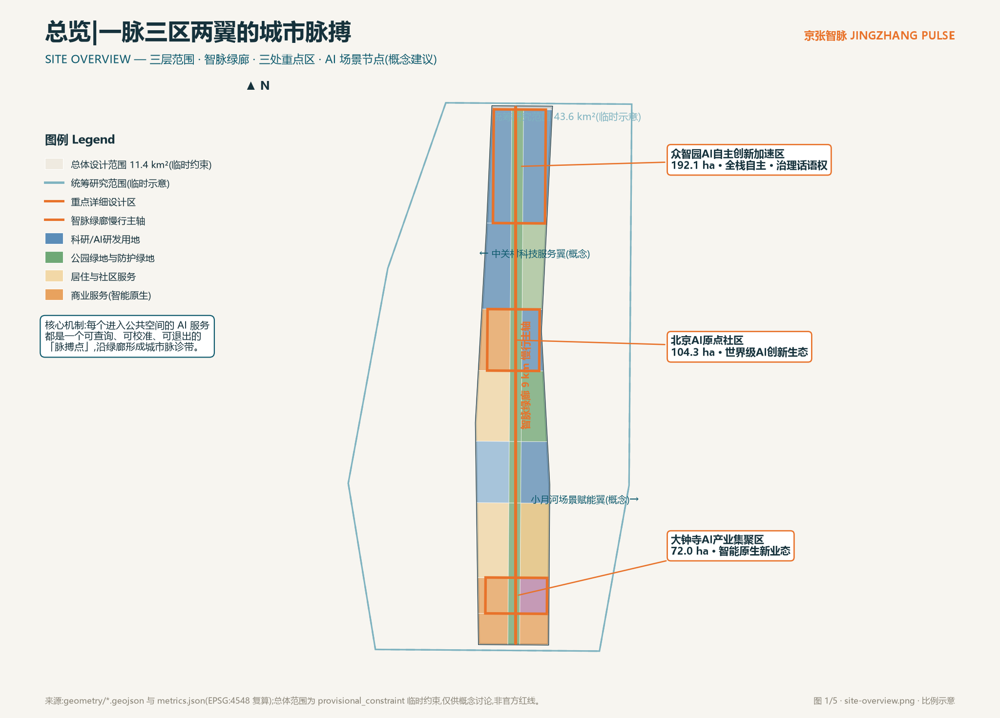
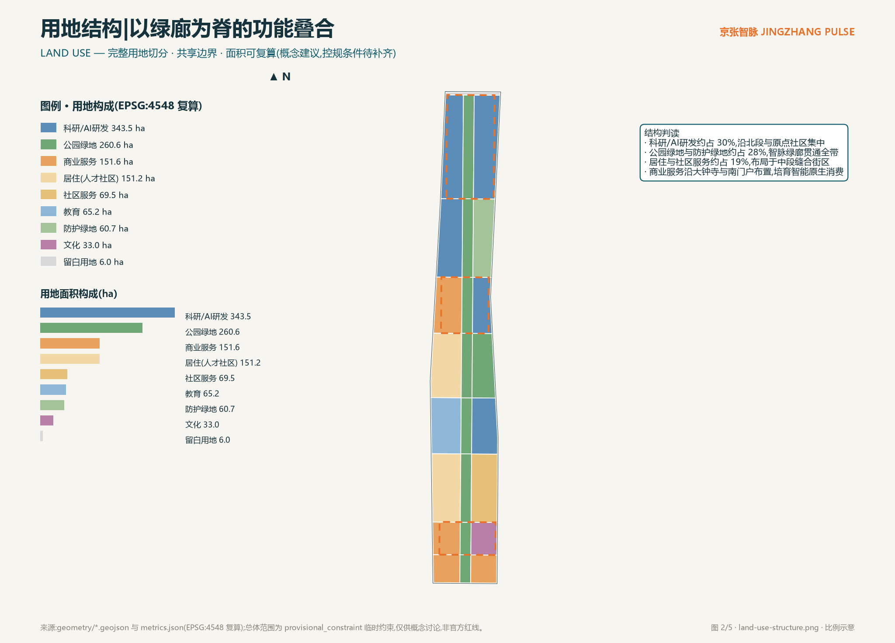
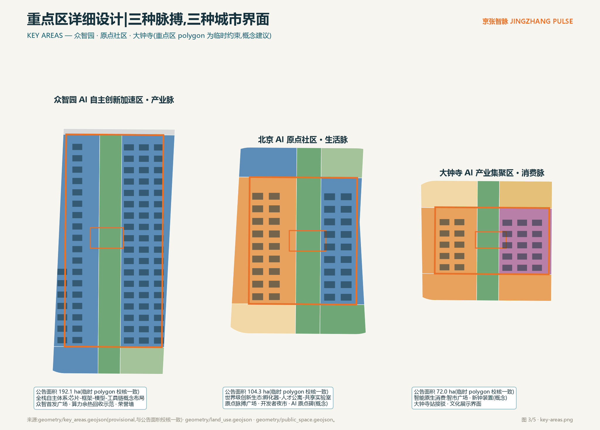
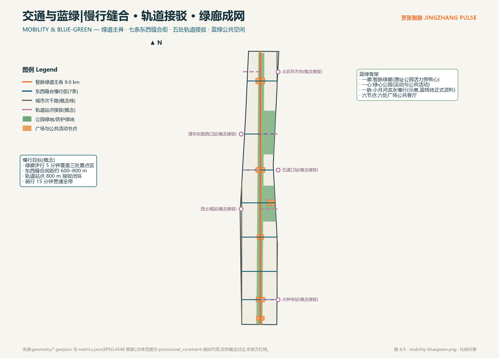
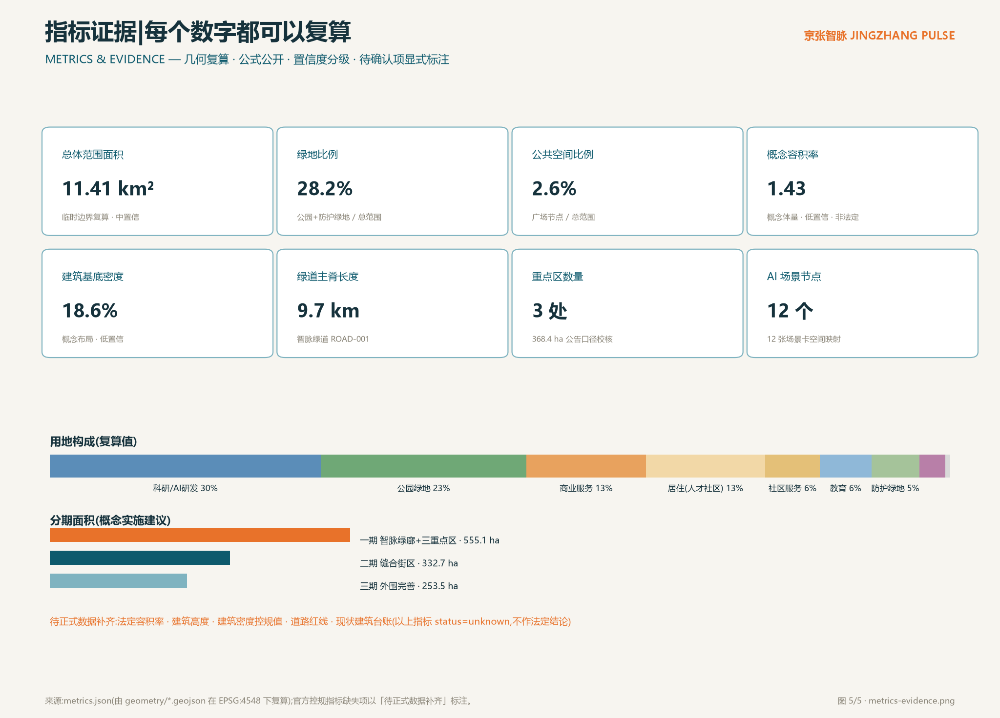

# 京张智脉 JINGZHANG PULSE:一脉三区两翼的城市脉搏

## 设计依据与资料清单

本方案的主控依据是《百年京张AI创新带城市设计国际方案征集资格预审公告》给出的三层范围、三处重点区与面积口径 [source:OFFICIAL-ANNOUNCEMENT] [standard:PROJECT-OFFICIAL-ANNOUNCEMENT],以及面向智能体任务书给出的十条共创原则、六项任务与统一边界条款 [source:AGENT-TASKBOOK]。用地分类逻辑依据自然资源部用地用海分类指南的项目子集 [standard:MNR-LAND-USE-CLASSIFICATION-GUIDE],城市设计与控规深度的表达边界依据住建部相关办法 [standard:MOHURD-URBAN-DESIGN-MEASURES] [standard:MOHURD-CONTROL-DETAILED-PLANNING]。

资料可用性以公开来源登记簿为准:公告与任务书为 formal-ready;临时边界 polygon 仅为 provisional intake 线索 [source:SOURCE-REGISTRY]。完整来源、指标、标准、设计深度与任务覆盖的机器索引分别保存在 `sources.json`、`metrics.json`、`standard_matrix.json`、`design_depth_matrix.json` 与 `compliance_matrix.json`,正文不重复罗列。

需要坦诚说明的资料缺口:官方精确范围线、控规指标(容积率、建筑高度、建筑密度、绿地率、退线)、道路红线、现状建筑台账与文保精确范围均未进入公开站点包,本方案相应指标一律标注为「待正式数据补齐」,空间落位一律表述为概念建议 [source:BOUNDARY-SOURCE]。

## 三层范围工作框架

三层范围按公告口径组织:统筹研究范围约 43.6 平方公里(北至北五环路、东至京藏高速、南至西直门外大街、西至万泉河路),承担产业与未来城市战略研究;总体设计范围约 11.4 平方公里,是本方案空间设计的主载体;重点区域范围约 368.4 公顷,自北向南为众智园AI自主创新加速区(192.1 公顷)、北京AI原点社区(104.3 公顷)、大钟寺AI产业集聚区(72.0 公顷) [source:OFFICIAL-ANNOUNCEMENT] [data:geometry/key_areas.geojson#PROV-KEY-001]。

本包提交的总体设计范围 polygon 为仓库维护者发布的临时约束范围(provisional constraint),在 EPSG:4548 下复算面积约 1141.3 万平方米,与公告 11.4 平方公里口径一致 [metric:site_area_sqm]。它的限制必须讲清楚:不得作为官方红线、不得用于精确面积确权、不得作为审批依据;待正式范围线发布后,用地切分、绿地与公共空间指标、分期面积都需按同一套脚本路径重算 [depth:three_level_scope_framework]。

三层之间的落实逻辑是:统筹研究层回答「为什么是这里」——产业协同与城市战略;总体设计层回答「空间怎么组织」——一脉三区两翼的结构与用地;重点区层回答「界面长什么样」——可体验的公共场景与概念体量 [depth:overall_spatial_structure]。

## 统筹研究范围产业与未来城市研究

**总体概念:城市脉搏。** 1909 年京张铁路用时刻表纪律组织了中国最早的自主铁路运营;今天,当 AI 服务大规模进入城市公共空间,城市需要一种新的公共纪律:每项 AI 服务都像脉搏一样,持续、公开、可被触诊。京张智脉把这条纪律空间化——每个进入公共空间的 AI 服务都是一个「脉搏点」,公示自己的服务状态、数据使用、人工值守位置与退出机制;沿 9 公里智脉绿廊,这些脉搏点连成一条可步行体验的「城市脉诊带」 [source:AGENT-TASKBOOK] [standard:PROJECT-AGENT-OPEN-CALL-TASKBOOK]。

**命名体系。** 主名称「京张智脉」,英文名称 JINGZHANG PULSE;空间序列命名为:智脉绿廊(主轴)、脉搏广场(六处公共客厅)、脉诊亭(AI 服务公共查询点)、缝合街(东西向慢行街);运营品牌为「智脉开放日」「场景公开测试周」。命名避免照搬既有城市、园区与企业名称,全部子命名为本方案原创概念词。

**视觉识别与 Logo 方向。** Logo 母题是「枕木节律 × 脉搏波形」:一条水平基准线被等距枕木节拍打断,在第叁拍处跃起为脉搏波形,寓意百年铁路纪律与 AI 时代城市节律的叠合。主色「京张青」取自钢轨与厂矿建筑的青灰基调,辅色「脉搏橙」标识所有 AI 场景节点;中英文字标采用无衬线字重对比。此仅为方向性概念,正式字体、图像与商标须另行清权,不构成授权使用 [source:AGENT-TASKBOOK]。

**三大定位与五大功能的空间转译。** 百年京张文化带落在遗址廊道与六处脉搏广场的文化界面;都市AI生活体验带落在智脉绿道与七条缝合街的日常场景;AI融合创新带落在三处重点区的产业空间。五大功能中,AI全栈自主创新体系锚定众智园,世界级AI创新生态锚定原点社区,AI+场景赋能新范式依托小月河翼与全带场景网络,智能化AI活力城市体现在慢行与会客厅系统,AI治理全球话语权通过「脉搏协议」这一可审计的公共治理界面表达 [source:SRC-2026-BJ-KW-THREE-AREAS-WINGS]。

**三区两翼协同回路。** 众智园输出全栈技术能力→原点社区提供真实生活试验场→大钟寺完成消费侧商业化验证→中关村科技服务翼提供资本与知识产权服务→小月河场景赋能翼回流场景需求;回路的物理载体就是智脉绿廊与缝合街网络 [data:geometry/roads.geojson#ROAD-001]。

**全球案例镜鉴(概念转化,非事实引用)。** 波士顿 Kendall Square 证明「大学围墙外的半英里」可以靠步行网络缝合产学研;伦敦 King's Cross Knowledge Quarter 证明遗产建筑与公共领域可以承载知识产业;新加坡 Punggol Digital District 展示了「园区即校园、校园即城市」的混合治理;深圳粤海街道提示高密度产业社区需要强公共服务对冲通勤压力;杭州未来科技城展示了平台企业与公共空间的共建机制;苏黎世 ETH 周边则说明小规模、高密度的面对面网络依然是硬科技创新刚需。这些经验转化为本方案的三条空间原则:步行可达的创新交往、遗产界面的公共化、场景测试的制度化 [source:AGENT-TASKBOOK]。

**未来城市形态判断。** AI 新质生产力不需要「更大的园区」,而需要「更短的距离」——从实验室到真实场景的距离、从失败到复盘的距离、从技术到公众信任的距离。京张智脉用一条绿廊把三种距离压缩到步行尺度 [depth:existing_conditions_diagnosis]。

## 总体设计范围城市更新与控规深度城市设计

**空间结构:一脉、三区、两翼、多脉搏点。** 一脉即智脉绿廊,沿京张遗址廊道贯通南北约 9.7 公里 [metric:heritage_spine_length_m];三区即三处重点区;两翼为西侧中关村科技服务翼与东侧小月河场景赋能翼(概念界面,落在缝合街端头);多脉搏点即六处脉搏广场与 12 处 AI 场景节点 [data:geometry/public_space.geojson#PS-001]。

**用地布局(概念建议)。** 用地切分在临时边界内完整覆盖、共享边界、无重叠无缺口,可在 EPSG:4548 下逐块复算 [data:geometry/land_use.geojson#LU-001] [depth:land_use_layout]。科研/AI研发用地约 343.5 公顷(约 30%),集中于众智园与原点社区东翼;公园绿地与防护绿地约 321.3 公顷(约 28%),由智脉绿廊、绿心公园与北段防护绿带构成;居住与社区服务约 220.7 公顷(约 19%),布局中段缝合街区;商业服务约 151.6 公顷(约 13%),锚定大钟寺与南门户;教育与文化和留白用地作为弹性补充 [metric:land_use_0802_sqm]。

**城市更新总体框架。** 更新对象分三类:一是遗址廊道与两侧低效空间的公共化更新(概念方向,非拆改结论);二是中段居住社区的服务织补;三是重点区产业空间的功能置换研究。保留/改造/拆除/新建的法定判断必须以正式控规与现状台账为前提,本方案仅给出概念分类与空间意向,具体地块拆改留一律待正式数据补齐后由专业机构复核 [standard:MOHURD-CONTROL-DETAILED-PLANNING] [depth:retain_renovate_demolish]。

**建筑规模与开发强度。** 概念建筑基底约 212.0 万平方米、建筑基底密度约 18.6%、概念容积率约 1.43,均为设计概念量、低置信度,不等于法定控制指标;法定容积率、建筑高度、建筑密度与绿地率以获批控规为准,本包在指标文件中显式标注为待正式数据补齐 [metric:building_density] [metric:concept_floor_area_ratio] [depth:development_intensity_controls]。

**交通与市政承载。** 交通组织以「慢行缝合 + 轨道接驳」为先导,七条东西缝合街修复铁路走廊的百年割裂,五处轨道站点概念接驳形成 800 米接驳闭环;市政层面提出分布式能源与端侧算力节点的概念布局方向,具体负荷与容量测算属专业工程范畴,待正式资料补齐 [depth:traffic_rail_slow_parking] [depth:municipal_new_infrastructure]。

**京张遗址公园活力带。** 活力带以智脉绿廊为核心公共空间,植入遗产叙事、场景测试与公共活动三类功能,形成「日日可体验、季季有测试、年年有大会」的活力节奏 [depth:blue_green_public_space]。

## 重点区域详细设计

三处重点区 polygon 为临时约束,与公告面积口径校核一致(偏差小于 1%);以下设计均为概念建议与方向性方案,可供专业团队深化研究 [data:geometry/key_areas.geojson#PROV-KEY-002] [depth:three_key_area_detailed_design]。

**众智园 AI 自主创新加速区 · 产业脉(192.1 公顷)。** 定位承载 AI 全栈自主创新体系与 AI 治理全球话语权。空间结构为「一廊两翼一广场」:智脉绿廊穿区而过,两侧为全栈研发街坊(芯片、框架、模型、工具链的概念布局),众智首发广场(约 6.4 万平方米概念公共空间)承担成果发布与荣誉展示 [data:geometry/public_space.geojson#PS-002]。建筑更新以功能置换研究为主,交通依托北五环方向与清华东路西口两处概念接驳;AI 场景为算力余热回收示范与治理沙盒展厅(概念)。实施风险:全栈产业链空间需求弹性大,须在正式控规阶段保留用地混合弹性。

**北京 AI 原点社区 · 生活脉(104.3 公顷)。** 定位世界级 AI 创新生态的生活载体。空间结构为「一街一院一碑」:原点缝合街串联孵化器街坊与人才公寓,学院众创庭院打开高校-社区界面,AI 原点碑(概念地标)锚定文化叙事 [data:geometry/public_space.geojson#PS-001]。交通上衔接五道口站概念接驳;场景包括开发者夜市、社区食堂智能配餐与共享实验室预约。实施风险:现状社区权属复杂,更新须以居民协商为前提,本方案不作任何地块级拆改结论。

**大钟寺 AI 产业集聚区 · 消费脉(72.0 公顷)。** 定位智能原生新业态与大钟寺文化界面。空间结构为「一市一钟一站」:智市广场承载智能原生消费体验,共鸣钟(概念装置)与大钟寺文化形成古今对话,大钟寺站接驳通道(概念)缝合轨道客流 [data:geometry/public_space.geojson#PS-003]。场景为智脉体检站与机器人低速配送(限定测试条件)。实施风险:商业人流与遗产保护的张力须专题评估。

## AI 创新生态、人才画像与 AI+ 场景

**人才画像(六类,概念归纳)。** 全栈研究员(众智园,需要安静研发环境与高规格发布界面);高校研究生(学院段,需要低成本试错空间与跨校社交网络);老街坊与老年人(知春段,需要人工兜底服务与无障碍日常);通勤开发者(需要高效接驳与夜间第三空间);AI 朝圣访客(需要可读的城市叙事与仪式感节点);大钟寺商户(需要客流转化与新业态培训)。画像用于场景设计,不构成人群统计结论 [source:AGENT-TASKBOOK]。

**场景卡(12 张,含 3 张产业测试验证场景)。** 每张场景卡均映射空间节点、服务对象、数据边界与人工复核机制;隐私红线为:不采集生物特征、不做个体画像式监控、所有公共 AI 服务保留人工退出通道 [standard:GENERATIVE-AI-INTERIM-MEASURES]。

| # | 场景卡 | 空间节点 | 服务对象 | 隐私与人工复核 | 运营主体(概念) |
|---|--------|----------|----------|----------------|----------------|
| 1 | 智脉体检站:公共 AI 服务状态查询与申诉 | 大钟寺智市广场 | 市民/访客 | 只读公示+人工坐席 | 城市运营平台 |
| 2 | AI 通勤副驾:慢行路径与接驳建议 | 智脉绿道全线 | 通勤者 | 匿名化轨迹,本地计算 | 交通运营方 |
| 3 | 遗产讲解智能体:京张 AR 导览 | 遗址廊道 | 访客/学生 | 无采集,内容人工审校 | 文化运营方 |
| 4 | 社区食堂智能配餐(老年友好) | 知春段社区中心 | 老年居民 | 保留人工窗口与现金支付 | 社区服务商 |
| 5 | 校园-社区共享实验室预约 | 学院众创庭院 | 学生/居民 | 实名预约,数据最小化 | 高校联盟 |
| 6 | 公园活力管家:活动推荐与人流提示 | 绿心公园 | 市民 | 群体级统计,不识别个体 | 公园运营方 |
| 7 | 【产业测试】低速自动驾驶微循环接驳测试走廊 | 东翼次干路概念段 | 乘客/企业 | 限定路段限定时段,安全员在位 | 测试联盟 |
| 8 | 【产业测试】建筑机器人更新施工试验段 | 二期缝合街区 | 施工企业 | 封闭工区,人工监督 | 建设单位 |
| 9 | 【产业测试】算力余热回收示范 | 众智园 | 能源企业/公众 | 运行数据公开看板 | 能源运营方 |
| 10 | AI 政务帮办站(人工兜底) | 南门户到达广场 | 市民 | 人工终审,适老无障碍 | 政务服务商 |
| 11 | 无障碍导航天使 | 智脉绿道全线 | 视障/行动不便者 | 端侧处理,亲属可授权联动 | 公益+商业混合 |
| 12 | 开发者夜市:大模型应用快闪测试 | 原点社区 | 开发者/市民 | 备案制,内容人工抽检 | 开发者社区 |

场景卡与空间的映射关系同步呈现在 `visual/index.html` 的交互地图与 `metrics.json` 的场景节点计数中 [metric:ai_scenario_node_count]。产业测试场景均为限定时空、限定条件的概念测试安排,不代表已批准运营 [source:AGENT-TASKBOOK]。

## 用地、建筑规模与拆改留方案

用地布局以智脉绿廊为脊,西翼以居住与科教为主、东翼以研发与商业为主,形成「绿廊降温、两翼强度」的概念结构 [data:geometry/land_use.geojson#LU-010] [depth:land_use_layout]。产业功能比例上,科研/AI研发与商业服务合计约 43%,与「创新带」定位匹配;居住与社区服务约 19% 保障职住平衡的概念方向。

建筑规模按概念体量估算:总建筑基底约 212.0 万平方米,概念总建筑规模约 1630 万平方米(按类型假设层数估算),概念容积率约 1.43 [metric:total_floor_area_sqm]。这些数字的意义仅在于检验空间结构的合理性,不构成开发强度结论。

拆改留分类(概念意向):智脉绿廊与遗址廊道范围内以「保护性更新」为主;中段社区以「留改并举、服务织补」为主;重点区产业街坊以「功能置换研究」为主。所有具体地块的保留、改造、拆除、新建判断,以及建筑高度、退线与强度指标,一律待正式控规、现状建筑台账与权属资料补齐后由专业机构确定,本包相应指标标注为待正式数据补齐 [standard:MOHURD-CONTROL-DETAILED-PLANNING] [depth:height_massing_character]。

## 交通、轨道、市政与公共服务设施

**慢行系统。** 智脉绿道主脊约 9.7 公里贯通全带,七条东西缝合街以约 600–800 米间距修复铁路走廊割裂,目标实现重点区 5 分钟步行上廊、15 分钟骑行贯通 [data:geometry/roads.geojson#ROAD-001] [depth:traffic_rail_slow_parking]。

**轨道接驳。** 大钟寺站、西土城站、五道口站、清华东路西口站与北五环方向五处概念接驳通道,形成 800 米接驳闭环;轨道线位与站点一体化方案属专项工程内容,以正式资料为准 [data:geometry/roads.geojson#ROAD-020]。

**停车与非机动车。** 概念策略为「轨道+慢行优先、机动车外围截流」,在四个门户节点预留非机动车立体停放与共享车辆调度点的空间意向;具体泊位规模待交通专项测算。

**市政与新型基础设施。** 提出三项概念方向:分布式能源与算力余热回收的廊道化布局(与智脉绿廊复合);端侧算力节点随脉搏广场布置;传统市政管廊与慢行通道的断面复合研究。负荷、容量与工程可行性不作结论,待专业测算 [depth:municipal_new_infrastructure]。

**公共服务。** 学院众创庭院、社区食堂、人才公寓与文化活动空间构成 15 分钟生活圈概念网络;无障碍连续路径覆盖全部广场与绿道,公共服务场所保留人工服务边界 [standard:BARRIER-FREE-ENVIRONMENT-LAW]。

## 蓝绿空间、公共空间与城市风貌

蓝绿骨架为「一廊一心一脉六节点」:智脉绿廊(遗址公园活力带核心)、绿心公园、小月河滨水慢行(示意,蓝线待正式资料)、六处脉搏广场 [data:geometry/green_space.geojson#GS-001] [depth:blue_green_public_space]。绿地与开敞空间合计约 28.2%,其中智脉绿廊既是生态廊道也是 AI 公共空间的展示界面 [metric:green_ratio]。

**AI 朝圣地标(三处,均为概念)。** AI 原点碑(原点社区):以「人字形铁路」与「人机协作」双重意象构成的纪念性装置,讲述中国 AI 的原点叙事;脉搏观测塔(众智园):把城市运行脉搏数据可视化为公共艺术塔,谁在调度 AI 一目了然;共鸣钟(大钟寺):与大钟寺古钟对话的新媒体装置,每完成一次公开场景测试鸣响一次。三处地标均为概念建议,不违反文保约束、不作工程可行性结论、不进行娱乐化包装 [source:AGENT-TASKBOOK] [depth:height_massing_character]。

**荣誉展示体系。** 智脉名人堂(年度 AI 公共价值贡献者)与开源贡献墙(为本项目提交代码、数据、方案的机构与智能体)沿众智首发广场与原点脉搏广场布置,形成可更新的城市荣誉界面。

**城市风貌。** 基调为「工业遗产的青灰 + 科创界面的明净」:廊道内保留工业材质记忆,新建界面控制体量与色彩的中性背景,让 AI 场景与公共艺术成为视觉主角;屋顶第五立面结合光伏与观景步道概念整合。建筑高度分区、风貌导则属控规深化内容,待正式条件 [standard:MOHURD-URBAN-DESIGN-MEASURES]。

**公共空间组件库(概念)。** 脉诊亭(查询/申诉/人工服务)、智座(带充电与本地信息屏的座椅)、脉搏灯带(场景运行状态光环境)、测试围栏(可快速部署的场景测试界面)四类标准组件,支撑场景的快速部署与撤出。

## 更新项目清单、实施政策与分期计划

更新项目清单(概念,对应分期图层):智脉绿廊贯通工程、六处脉搏广场建设、七条缝合街慢行改造、绿心公园提升、五处轨道接驳界面、重点区产业街坊功能置换研究、社区服务织补包、算力余热回收示范段 [data:geometry/phasing.geojson#PHASE-001] [depth:renewal_project_list]。

**分期建议(概念实施建议,非开发时序承诺)。** 一期约 555.1 公顷:智脉绿廊全线与三处重点区启动,快速建立可读、可体验的城市脉搏界面;二期约 332.7 公顷:缝合街区织补与社区服务更新;三期约 253.5 公顷:外围功能完善与留白预控 [metric:phase_1_area_sqm] [depth:phasing_implementation]。

**实施政策建议(方向性)。** 建立场景测试备案制与公众评议机制;设立遗产活化与公共空间运营的一体化主体研究;以「脉搏协议」作为公共 AI 服务的准入与退出规则。上述均为政策研究方向,不构成政府决策表述。

**全球 AI 创新活动体系与长期运营。** 年度品牌活动:京张智脉大会(年度,成果发布与荣誉授予)、场景公开测试周(季度,企业申请+公众评议)、开发者夜市(月度,快闪测试与招聘对接)、智脉开放日(常态,公众体验与监督)。开发者社区运营采用开源治理思路:场景申请、测试记录、评估报告全部公开可检索;国际传播以「City as a Pulse」为叙事主线,制作多语种城市体验路线。人才、企业与开发者的转化路径为:场景测试→公开评估→孵化对接→落地研究。所有活动均为设想与机制建议,不构成已确定的政府安排或招商承诺 [source:AGENT-TASKBOOK]。

## 指标体系、面积复算与合规矩阵

核心指标全部由 `geometry/*.geojson` 在 EPSG:4548 下复算,公式、来源文件与置信度在 `metrics.json` 中逐项公开 [metric:site_area_sqm] [depth:metrics_recalculation]。设计含义判读:绿地比例 28.2% 支撑「绿廊为脊」的空间主张与人才日常生活品质;公共空间比例 2.6% 对应六处高浓度公共客厅;科研用地约 30% 回应全栈自主创新的空间供给;概念容积率 1.43 说明结构在强度上留有讨论余地 [metric:green_ratio] [metric:public_space_ratio]。

任务覆盖方面:公告 1.3、1.4、1.5 各节任务与智能体任务书 agent.1–agent.6 的覆盖关系,逐条登记于任务覆盖矩阵 `compliance_matrix.json`;专业标准响应登记于 `standard_matrix.json`;设计深度项全部达到 complete,登记于 `design_depth_matrix.json`。法定控制指标(容积率、建筑高度、建筑密度、绿地率、退线)因官方条件缺失而标注待正式数据补齐,不以概念量冒充法定值 [metric:floor_area_ratio]。

## 风险、版权与合规说明

**资料与版权。** 本方案仅使用公开或清权资料;临时边界的来源、推导方法与限制已完整登记;Logo、地标与装置均为原创概念方向,正式使用前的字体、图像、商标清权是实施阶段必要工作 [source:SITE-PACKAGE]。

**非公开资料排除。** 未使用任何非公开政府数据、企业内部数据或个人隐私数据;轨道站点、文保范围等以公开报道示意,精确范围待正式资料。

**AI 生成责任。** 本方案由 AI 智能体生成,全部空间结论为概念建议、参考方案,可供专业团队深化研究;不替代正式规划,不构成政府审定结论、投资承诺或工程可行性判断;最终判断由人类与专业团队完成。隐私与人工复核边界遵循生成式 AI 相关管理边界,公共 AI 服务设计保留人工兜底 [standard:GENERATIVE-AI-INTERIM-MEASURES]。

**待补资料清单。** 官方范围线与重点区精确 polygon、控规指标体系、道路红线、现状建筑台账、文保与蓝线精确范围、市政容量资料。上述资料到位后,用地、指标、图纸需按 `assumptions.json` 登记的复算路径更新 [depth:risk_missing_data]。版权与责任细目见 `report/copyright_statement.md`。

## 参考资料

以下书目信息对应 `sources.json` 中的正式登记项 [source:OFFICIAL-ANNOUNCEMENT] [source:AGENT-TASKBOOK]:

1. 北京市规划和自然资源委员会海淀分局:《百年京张AI创新带城市设计国际方案征集资格预审公告》,2026-05-09。
2. 《面向全球智能体开展"百年京张AI创新带城市设计开源征集"的任务书摘录》(用户提供清权版本),2026-05-18。
3. 北京市科学技术委员会、中关村科技园区管理委员会:《"三区两翼"打造世界级AI集聚地》,2026-04-03。
4. 北京市海淀区人民政府:《海淀区发布"1+X+1"现代化产业体系建设布局》,2026-03-02。
5. 中华人民共和国住房和城乡建设部:《城市设计管理办法》,2017。
6. 中华人民共和国住房和城乡建设部:《城市、镇控制性详细规划编制审批办法》。
7. 自然资源部:《国土空间调查、规划、用途管制用地用海分类指南》,2023。
8. 国家互联网信息办公室等七部门:《生成式人工智能服务管理暂行办法》,2023。
9. 全国人民代表大会常务委员会:《中华人民共和国无障碍环境建设法》,2023。
10. 仓库维护者:《百年京张AI创新带临时粗略边界与三处重点区 polygon》及推导说明,2026-06-05。
