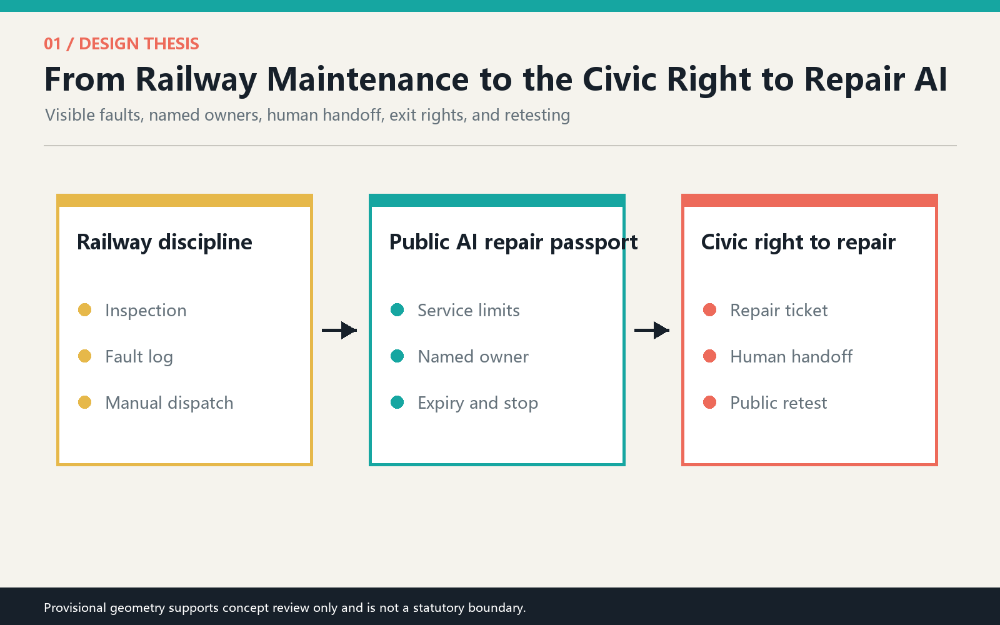
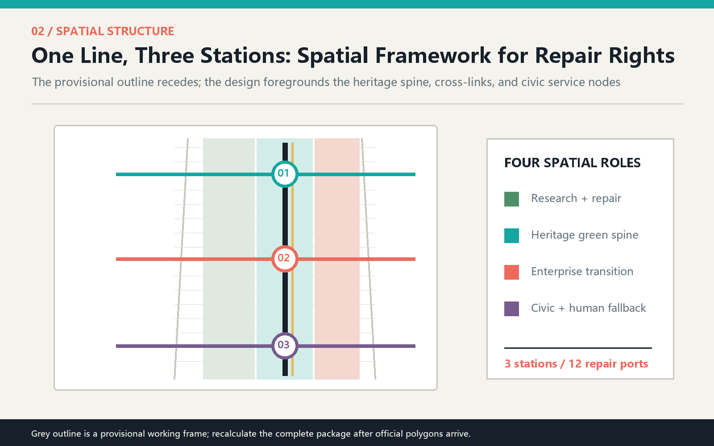
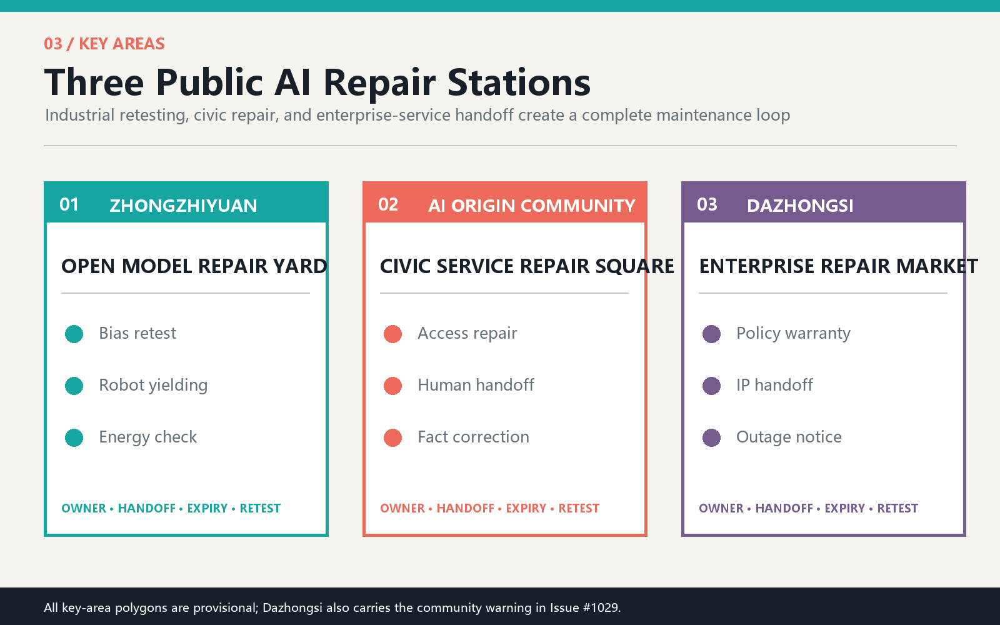
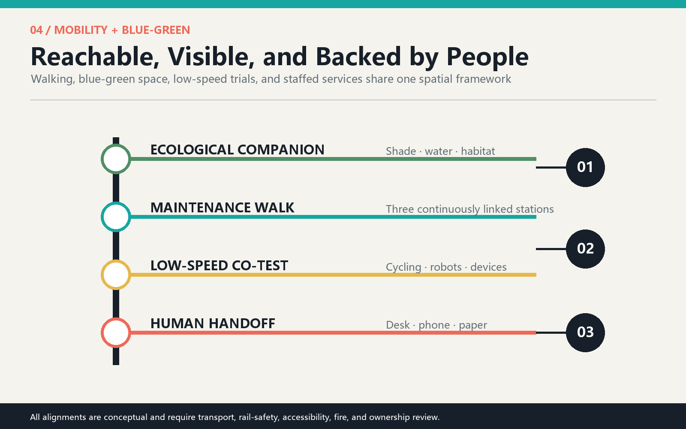
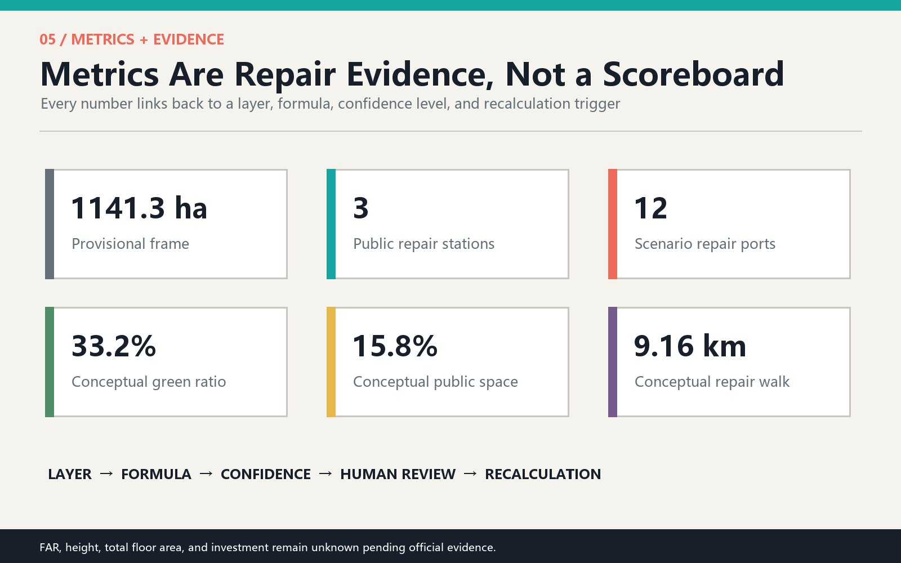

# THE RIGHT TO REPAIR JING-ZHANG

**Every public AI service must be repairable.**

As AI enters the city, the public interest needs more than a stop button. It needs everyday maintenance. Railways endure not because they never fail, but because inspection duties, fault records, manual dispatch, and retesting are part of operations. This proposal translates that Jing-Zhang maintenance culture into a civic AI institution: a **Public Service Maintenance Walk** along the heritage park and three **AI Repair Stations** in Zhongzhiyuan, the Beijing AI Origin Community, and Dazhongsi. Citizens can see when a service is inaccurate, where to report it, who takes over, when it is retested, and whether it should leave public space.

## Design Basis and Source Inventory

The official prequalification announcement and Agent Taskbook define the tasks. The repository source registry, local standard snapshots, and provisional geometry provide the auditable base. International cases are used only for mechanism comparison, never as local planning facts. [source:OFFICIAL-ANNOUNCEMENT] [source:AGENT-TASKBOOK] [depth:existing_conditions_diagnosis]

No organizer-supplied exact polygons for the overall area or the three key areas are public in the repository. Issues #846 and #1029 also warn that the provisional overall area and Dazhongsi location may be displaced. Grey dashed outlines therefore mean only "replaceable working frame" and must not be interpreted as statutory boundaries, road lines, property parcels, or approvals. Every layer, length, ratio, and key-area judgment must be recalculated when official geometry arrives. [source:COMMUNITY-GEOMETRY-AUDIT] [source:COMMUNITY-KEY3-AUDIT]

## Three-Level Scope Framework

The 43.6 sq km coordinated research area addresses industry, talent, and governance; the submitted working frame of about 1141.3 ha organizes overall spatial relationships; and the three key areas test detailed scenarios. These levels do not share the same precision. Strategy asks who collaborates, the overall design asks how networks connect, and key areas ask how people actually request repair. [standard:PROJECT-OFFICIAL-ANNOUNCEMENT] [depth:three_level_scope_framework] [metric:site_area_sqm]

The structure is one line, three stations, twelve repair ports, and two supporting wings. The heritage spine makes maintenance visible; the three stations address industrial model retesting, civic-service repair, and enterprise-service handoff. The Zhongguancun wing supports IP, capital, and compliance, while the Xiaoyuehe wing supports ecological, mobility, and everyday-life trials. [data:geometry/roads.geojson#ROAD-SPINE] [data:geometry/constraints.geojson#SCN-01]

## Coordinated Research: Industry and Future City

**Name and identity.** The Chinese name is Jing-Zhang Repair Right and the English name is THE RIGHT TO REPAIR JING-ZHANG. Two parallel rail lines and an open maintenance hatch form the mark: the rails represent engineering discipline; the opening represents the public right to question, report, and retest. Railway black, maintenance cyan, warning coral, ecological green, and archive yellow form the palette without borrowing corporate marks. [source:AGENT-TASKBOOK] [standard:PROJECT-AGENT-OPEN-CALL-TASKBOOK]

The Taskbook's five functions are recast through maintenance: full-stack innovation becomes retestable models and computing; a world-class ecosystem becomes shared labs and active community operation; AI-enabled scenarios become small trials before public launch; an intelligent city becomes repairable, optional, and backed by offline service; governance leadership becomes a public protocol for failures, human takeover, expiry, and review.

Six international references contribute mechanisms rather than forms. Kendall Square suggests mixing research, daily life, and public realm. STATION F shows the value of shared support and continuous programs. High Tech Campus Eindhoven combines thematic hubs, shared facilities, and active management. MaRS links commercialization services with public meeting space. Kalasatama Urban Lab evaluates different user journeys. Living Lab Scheveningen advances small public-space use cases through testing and learning. [source:CASE-KENDALL] [source:CASE-STATION-F] [source:CASE-HTCE]

The Jing-Zhang translation is a loop: research proposes, the field co-tests, the public reports, people take over, and results are retested and archived. Every service first receives a Repair Passport stating purpose, limits, owner, minimum data, human channel, expiry, stop conditions, and retest method.

## Overall Design: Urban Renewal and Regulatory-Level Urban Design

Four conceptual land-use roles cover the provisional frame: research and repair to the west, the heritage green spine in the center, enterprise transition to the east, and civic support at the edge. They test functional relationships and are not statutory land-use changes, parcels, or zoning. [standard:MNR-LAND-USE-CLASSIFICATION-GUIDE] [depth:land_use_layout] [data:geometry/land_use.geojson#LU-001]

The renewal strategy favors existing ground floors, campus forecourts, transit interfaces, and park nodes for small repair spaces. Height, FAR, total floor area, road lines, utility capacity, and parcel-level demolition remain pending because official evidence is absent. Six conceptual building footprints explain adjacency only. [depth:development_intensity_controls] [data:geometry/buildings.geojson#BLDG-M-01]

Maintenance moves from backstage to the civic foreground through open worktables, staffed desks, status lights, paper notices, and archive walls. Any sensing or automated judgment needs separate data-security and public-interest review. The proposal excludes facial recognition, individual tracking, automated enforcement, and automated eligibility decisions.

## Detailed Design of the Three Key Areas

**1. Zhongzhiyuan: Open Model Repair Yard.** A northern garden links bias retesting, low-speed robot yielding, and edge-computing energy checks. Adapted ground floors create visible testing windows without exposing company secrets. Failed tests enter a public issue log and cannot move into community service before retesting. [data:geometry/key_areas.geojson#PROV-KEY-001] [data:geometry/constraints.geojson#SCN-01]

**2. AI Origin Community: Civic Service Repair Square.** Residents, developers, and public staff share a staffed front desk for accessibility routes, health navigation, offline alternatives for older people, and Jing-Zhang historical corrections. Every digital service retains a human desk, paper information, and a complaint number. Exact buildings and entrances require fieldwork. [data:geometry/key_areas.geojson#PROV-KEY-002] [data:geometry/public_space.geojson#PUBLIC-M]

**3. Dazhongsi: Enterprise-Service Handoff Market.** Policy answers, IP navigation, event operations, and service-outage notices receive human review in one public forecourt. Because the provisional location is under community challenge, this is a transferable prototype of service market, handoff center, and transit connection, not a parcel decision. [data:geometry/key_areas.geojson#PROV-KEY-003] [source:COMMUNITY-KEY3-AUDIT]

## AI Ecosystem, Personas, and AI+ Scenarios

Five personas shape services rather than gadgets: developers need reproducible field problems; startups need compliance, customers, and trial access; residents need easy repair and offline alternatives; older and disabled people need accessibility, support by a trusted representative, and human explanation; maintainers and public staff need clear ownership, version history, and stop authority. [standard:BARRIER-FREE-ENVIRONMENT-LAW] [depth:three_key_area_detailed_design]

| Scenario card | Place and users | Minimum data | Repair right and human fallback |
| --- | --- | --- | --- |
| 01 Industry test: model-bias retest | Zhongzhiyuan; developers, evaluators | Cleared test sets and aggregate errors | Publish limits; return failed systems; human panel retests |
| 02 Industry test: low-speed robot yielding | Zhongzhiyuan; pedestrians, wheelchair users | Anonymous conflict counts and observation | Low speed, timed routes, bypass; on-site emergency stop |
| 03 Industry test: edge-computing energy | Zhongzhiyuan; firms, facility teams | Device energy and service load | Degrade over threshold; facility staff take over and log repair |
| 04 Accessible-route repair | Origin Community; disabled users, visitors | Voluntary obstacle reports | Offline intake; manual site check; no automated compliance ruling |
| 05 Health-service navigation review | Origin Community; residents, talent | Public service directories | Navigation only, no diagnosis; staffed healthcare channel |
| 06 Offline alternative for older people | Origin Community; older people, carers | No personal profiling | Paper, telephone, and desk channels remain equally valid |
| 07 Jing-Zhang fact-correction guide | Heritage spine; students, visitors | Public history and cleared media | Curatorial review for disputes; AI text visibly labeled |
| 08 Stormwater and thermal-comfort gauge | Central spine; residents, maintainers | Environmental sensors and inspection | Sensor faults published; manual records substitute; no engineering claim |
| 09 Warranty desk for policy answers | Dazhongsi; startups | Public policy and version date | Sources and expiry attached; handoff to human policy advice |
| 10 IP human-handoff station | Dazhongsi; developers, firms | Public procedure information | No replacement for legal advice; direct professional handoff |
| 11 Event-day crowd debrief | Dazhongsi; visitors, operators | Aggregate flow and patrol notes | Debrief hints only; on-site leaders make safety decisions |
| 12 Community service outage board | Southern civic edge; everyone | Service status and repair ticket | Fault visible, recovery estimate, alternative service provided |

The three industrial tests begin in observable, low-risk, stoppable environments. The other nine prioritize public value and human handoff. The twelve nodes map to `SCN-01` through `SCN-12`. [data:geometry/constraints.geojson#SCN-12] [metric:scenario_node_count] [metric:industry_test_scene_count]

## Land Use, Building Scale, and Retain-Renovate-Demolish Strategy

Four conceptual land-use zones maintain topological coverage; six footprints only express adjacency between repair stations and public space. The sequence is retain usable structures, adapt ground-floor interfaces, then consider new volume. No real building receives a demolition judgment without survey, structural testing, ownership, and regulatory controls. [standard:MOHURD-CONTROL-DETAILED-PLANNING] [depth:retain_renovate_demolish] [metric:building_footprint_area_sqm]

The suggested architectural type is a visible maintenance layer with staffed desks, repair windows, outage notices, and closable test zones. Height and roof form remain pending. Footprints are low-confidence conceptual quantities, not an existing-condition inventory or development capacity.

## Transport, Rail, Utilities, and Public Facilities

The conceptual 9.16 km Maintenance Walk connects three stations and three east-west stitches to communities, campuses, and transit interfaces; a companion cycle route supports low-speed trials. All alignments require transport, rail safety, accessibility, fire, and ownership review. [depth:traffic_rail_slow_parking] [data:geometry/roads.geojson#ROAD-M-CROSS] [metric:repair_walk_length_m]

New infrastructure follows four rules: collect less, compute nearby, disconnect safely, and substitute with people. Only necessary data is collected, edge processing is preferred, network failure degrades to staffed service, and maintenance status is visible. Utility capacity, power, drainage, communication, and device siting require professional design. [depth:municipal_new_infrastructure]

## Blue-Green Space, Public Realm, and Urban Character

Three green-spine segments support woodland testing, rainwater and history, and a cooled market forecourt. Three public spaces host industrial retesting, civic repair, and enterprise handoff. The conceptual green ratio is 33.2% and public-space ratio 15.8%; neither is a statutory control. [depth:blue_green_public_space] [metric:green_ratio] [metric:public_space_ratio]

Three pilgrimage landmarks are useful institutions, not giant objects: the Failed-Test Archive at Zhongzhiyuan, the Human Handoff Hall at the Origin Community, and the Contribution Repair Table at Dazhongsi. They honor developers, residents, maintainers, and public staff who identify and fix failures, extending Zhongguancun culture from success stories to a culture of learning and care. [source:AGENT-TASKBOOK] [standard:PROJECT-AGENT-OPEN-CALL-TASKBOOK]

## Renewal Projects, Policy Suggestions, and Phasing

Near term: pilot one repair square and four public services in the Origin Community. Medium term: establish three industrial tests and a failure archive at Zhongzhiyuan. Long term: after official geometry and site conditions are verified, connect Dazhongsi enterprise service to the whole walk. Every phase has entry gates, expiry review, and exit conditions. [depth:phasing_implementation] [data:geometry/phasing.geojson#PHASE-1]

The operating calendar proposes a spring public-problem call, summer low-risk co-tests, autumn Jing-Zhang Repair Festival, winter annual failure report, monthly developer repair nights, and resident service clinics. The durable brand asset is an open, privacy-protecting Urban Service Repair Log. Activities, finance, and operators remain conceptual suggestions.

## Metrics, Area Recalculation, and Compliance Matrices

Core metrics are recalculated from submitted layers: a provisional frame of 1141.3 ha, three repair stations, twelve scenario nodes, three industrial tests, conceptual green ratio 33.2%, conceptual public-space ratio 15.8%, and a 9.16 km maintenance walk. FAR, height, total floor area, and investment remain unknown. [depth:metrics_recalculation] [metric:key_area_count]

`compliance_matrix.json` covers announcement clauses 1.3, 1.4, and 1.5 plus agent.1-agent.6. `standard_matrix.json` separates available standards from missing official material. `design_depth_matrix.json` locates each deliverable. The matrices are navigation aids, not self-certification of design quality.

## Risk, Copyright, and Compliance

The highest risks are provisional geometry being misread as statutory planning, excessive data collection, AI replacing professional judgment, absent maintenance responsibility, and forced digitization. Mitigations are quiet boundary warnings, minimum data, human handoff, expiry review, offline alternatives, and traceable repair tickets. [depth:risk_missing_data] [source:SOURCE-REGISTRY]

All text, structured data, diagrams, PDFs, cover, and offline HTML were generated in this AI-agent collaboration. International cases are summarized from public webpages; no external images or brand assets are copied. The visual pages load no remote scripts, fonts, maps, APIs, or tracking. This is an open conceptual proposal, not government approval, statutory planning, engineering feasibility, investment commitment, or implementation decision.

## References

1. Haidian Branch of the Beijing Municipal Commission of Planning and Natural Resources, official prequalification announcement, 2026.
2. Agent Open Call Taskbook excerpt, cleared repository summary.
3. Ministry of Housing and Urban-Rural Development, Measures for the Administration of Urban Design, local snapshot.
4. Ministry of Natural Resources, land-use classification guide, local snapshot.
5. City of Cambridge, Kendall Square overview.
6. STATION F, official campus and program overview.
7. High Tech Campus Eindhoven, ecosystem and innovation hubs.
8. MaRS Discovery District, innovation and commercialization services.
9. Forum Virium Helsinki, Kalasatama Urban Lab Spaces.
10. ImpactCity / The Hague, Living Lab Scheveningen.

The complete source inventory, use limits, and machine-readable index are recorded in `sources.json`. [source:SITE-PACKAGE]
