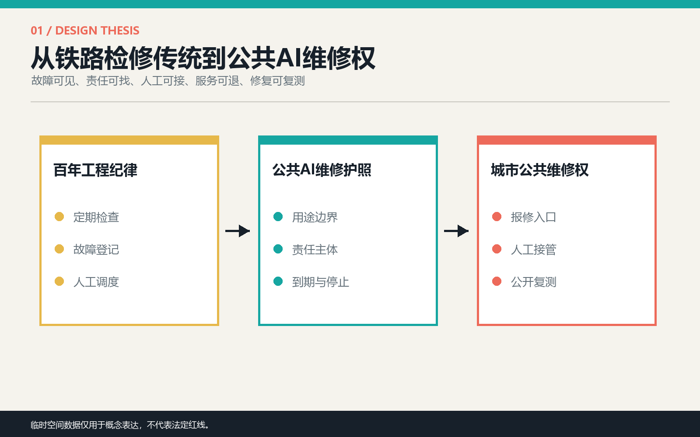
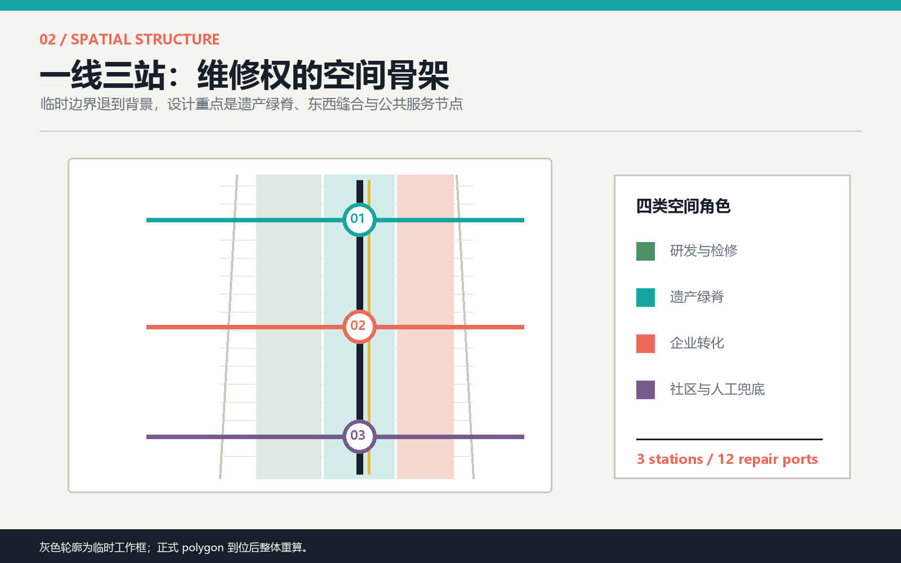
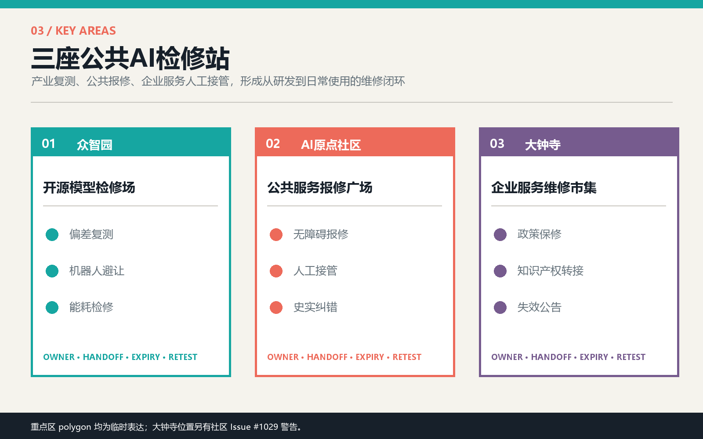
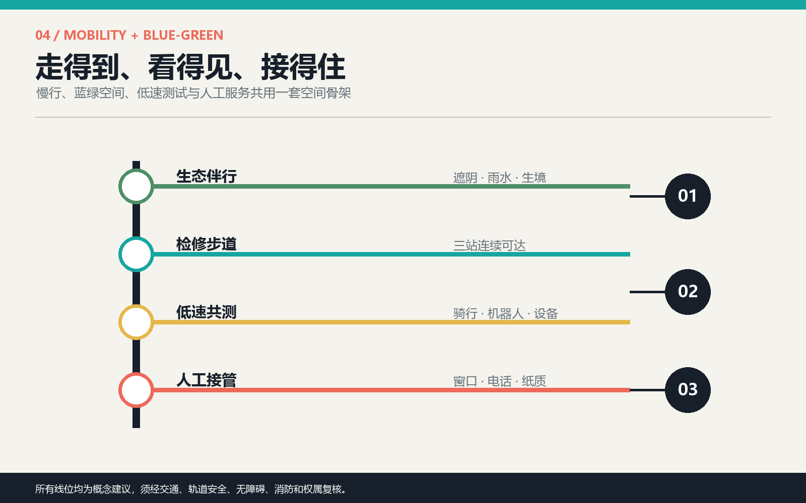
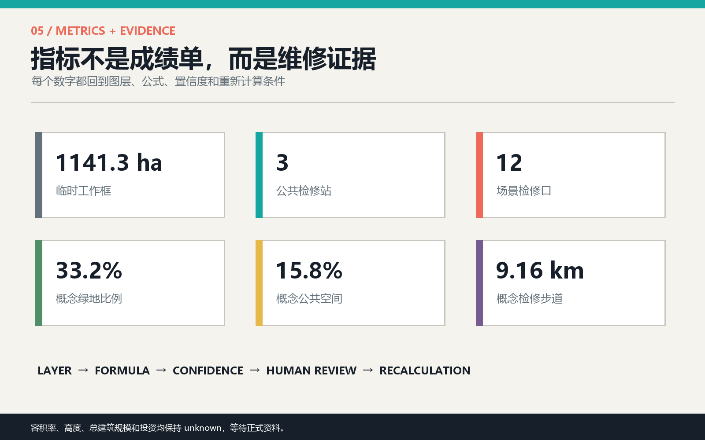

# 京张维修权：让每一项公共AI服务都可报修

**THE RIGHT TO REPAIR JING-ZHANG**

AI进入城市之后，公共利益不只需要一个“停止按钮”，还需要日常维修制度。铁路之所以能长期运行，不是因为从不出错，而是因为检修责任、故障记录、人工调度和复测流程被写进运营。本方案把这套京张铁路的检修传统转译为城市AI的空间制度：沿遗产公园组织一条**公共服务检修步道**，在众智园、AI原点社区和大钟寺设置三座**AI检修站**，让公众能够看见一项服务何时失准、在哪里报修、谁来接管、何时复测，以及是否应退出公共空间。

## 设计依据与资料清单

方案以官方资格预审公告和面向智能体任务书为任务依据，以仓库 source registry、标准本地快照和临时几何为可审计底座；新增国际案例仅用于机制比较，不升级为本地规划事实。[source:OFFICIAL-ANNOUNCEMENT] [source:AGENT-TASKBOOK] [depth:existing_conditions_diagnosis]

当前仓库没有组织方提供的精确总体范围与三处重点区 polygon。提交采用 provisional geometry 维持空间可审查性，但社区 Issues #846 与 #1029 已提示总体范围和大钟寺临时位置可能偏差。因此图中灰色虚线只表示“待替换工作框”，不得解释为法定红线、道路边界、权属地块或审批依据；官方数据到位后，所有图层、长度、比例与重点区判断必须整体重算。[source:COMMUNITY-GEOMETRY-AUDIT] [source:COMMUNITY-KEY3-AUDIT]

## 三层范围工作框架

43.6平方公里统筹研究范围用于讨论产业链、人才链和公共治理；约1141.3公顷的提交工作框用于组织总体空间关系；三处重点区用于验证详细场景。三层不是同一精度：战略层回答“谁协作”，总体层回答“网络如何连接”，重点层回答“公众如何实际报修”。[standard:PROJECT-OFFICIAL-ANNOUNCEMENT] [depth:three_level_scope_framework] [metric:site_area_sqm]

空间结构为“一线、三站、十二检修口、两翼支撑”。一线沿京张遗产空间组织连续慢行与服务可见性；三站分别承担产业模型复测、社区公共服务报修、企业服务人工接管；十二检修口把抽象治理变成可触达的日常设施。中关村科技服务翼提供知识产权、资本与合规支撑，小月河场景赋能翼提供生态、慢行与城市生活测试。[data:geometry/roads.geojson#ROAD-SPINE] [data:geometry/constraints.geojson#SCN-01]

## 统筹研究范围产业与未来城市研究

**命名与识别。** 中文名“京张维修权”，英文名“THE RIGHT TO REPAIR JING-ZHANG”。标志以两条平行轨线和一枚打开的检修口组成：轨线代表百年工程纪律，开口代表公众拥有提问、报修和复测的权利。视觉不使用具体企业标识，主色由铁路黑、检修青、警示珊瑚、生态绿与档案黄组成。[source:AGENT-TASKBOOK] [standard:PROJECT-AGENT-OPEN-CALL-TASKBOOK]

**五大功能的维修化表达。** AI全栈自主创新体系对应“模型与算力可复测”；世界级创新生态对应“共享实验室与主动社区运营”；AI+场景赋能对应“先小规模共测再上线”；智能化活力城市对应“公众可报修、可绕行、可选择线下服务”；AI治理话语权对应“公开故障、人工接管与到期复评的城市协议”。

六个国际案例只提取可迁移机制：Kendall Square提示研发、生活与公共空间必须混合；STATION F提示共享支持与持续活动比单一地标更重要；High Tech Campus Eindhoven提示主题创新枢纽需要共享实验室和主动运营；MaRS提示商业化服务与公共会面空间可以共存；Kalasatama Urban Lab提示试点要研究不同用户旅程；Living Lab Scheveningen提示公共空间技术应以小尺度 use case 持续测试和学习。[source:CASE-KENDALL] [source:CASE-STATION-F] [source:CASE-HTCE]

对京张的转化不是复制园区形态，而是建立“研究提出、现场共测、公众报修、人工接管、复测归档”的循环。每个场景必须先填写维修护照，包含用途、服务边界、责任主体、最小数据、人工入口、到期日、停止条件和复测方法。

## 总体设计范围城市更新与控规深度城市设计

总体设计采用四类概念用地分区：西侧研发与检修、中央遗产绿脊、东侧企业转化、外缘社区与人工兜底。分区完整覆盖临时工作框，但只是用于验证功能关系的设计分区，不等于法定用地、地块或控规修改。[standard:MNR-LAND-USE-CLASSIFICATION-GUIDE] [depth:land_use_layout] [data:geometry/land_use.geojson#LU-001]

更新框架不是大拆大建，而是优先寻找可保留建筑底层、园区前厅、轨道接驳界面和公园节点，嵌入小型检修空间。建筑高度、容积率、总建筑规模、道路红线、市政容量与具体拆改留均缺少正式依据，统一列为待确认；本包只提交六个概念建筑基底，用于说明三站所需的空间关系。[depth:development_intensity_controls] [data:geometry/buildings.geojson#BLDG-M-01]

总体风貌把“后台维护”转到城市前台：设备不做黑箱橱窗，而以开放工位、人工服务桌、状态灯、纸质公告和历史档案墙组成可读界面。任何摄像、传感或自动判断设备均需另行数据安全与公共利益评估，本方案不提出人脸识别、个体追踪或自动执法。

## 重点区域详细设计

**1. 众智园：开源模型检修场。** 定位为产业测试与方法公开区。北段林下花园串联模型偏差复测台、机器人低速避让道和端侧算力能耗柜；建筑更新优先复用研发空间首层，形成可观看但不泄露企业机密的共测窗口。失败测试进入公开问题单，未通过复测的服务不得转入社区场景。[data:geometry/key_areas.geojson#PROV-KEY-001] [data:geometry/constraints.geojson#SCN-01]

**2. AI原点社区：公共服务报修广场。** 定位为居民、开发者和公共部门共同值守的城市服务前台。无障碍路径、健康导航、老年人线下替代与京张史实纠错集中在步行可达的服务界面；每项数字服务旁必须保留人工桌、纸质信息和投诉编号。临时 polygon 仅表达方向，具体建筑与出入口待现场调研。[data:geometry/key_areas.geojson#PROV-KEY-002] [data:geometry/public_space.geojson#PUBLIC-M]

**3. 大钟寺：企业服务人工接管市集。** 定位为创新成果进入市场和公共场景前的维修与责任转接区。企业政策答案、知识产权导航、活动运营和社区服务失效公告在同一公共前庭中接受人工复核。鉴于社区已指出临时位置可能偏差，本片区只提交可迁移的“服务市集+人工接管中心+轨道接驳”原型，不能据此判断具体地块。[data:geometry/key_areas.geojson#PROV-KEY-003] [source:COMMUNITY-KEY3-AUDIT]

## AI 创新生态、人才画像与 AI+ 场景

五类用户画像决定服务而非装置：开发者需要真实问题与可复现实验；创业团队需要合规、客户和场景接入；社区居民需要低门槛报修和非数字替代；老年人与残障人士需要无障碍、代理办理与人工解释；维护者与公共服务人员需要清晰责任、版本记录和停止权限。[standard:BARRIER-FREE-ENVIRONMENT-LAW] [depth:three_key_area_detailed_design]

| 场景卡 | 位置与用户 | 最小数据 | 维修权与人工兜底 |
| --- | --- | --- | --- |
| 01 产业测试：模型偏差公开复测 | 众智园；开发者、评测人员 | 清权测试集与聚合误差 | 公布适用边界；失败即退回；人工评审复测 |
| 02 产业测试：机器人低速避让 | 众智园；行人、轮椅用户、运营者 | 匿名冲突计数与人工观察 | 低速、分时、可绕行；现场人员一键停运 |
| 03 产业测试：端侧算力能耗 | 众智园；企业、设施团队 | 设备能耗与服务负载 | 超阈值降级；设施人员接管并记录维修 |
| 04 无障碍路径报修 | 原点社区；残障人士、访客 | 自愿提交的障碍点 | 线下受理；人工现场核查；不自动判定合规 |
| 05 健康服务导航复核 | 原点社区；居民、青年人才 | 公开服务目录 | 只做导航不诊断；人工医疗服务入口常驻 |
| 06 老年人非数字替代 | 原点社区；老年人、照护者 | 无个人画像要求 | 纸质目录、电话和窗口与数字服务同等有效 |
| 07 京张史实纠错导览 | 遗产绿脊；学生、游客 | 公开史料与清权图文 | 史实争议进入策展复核；AI文本显著标识 |
| 08 雨洪与热舒适仪表 | 中段绿脊；居民、维护者 | 环境传感与人工巡查 | 传感故障公开；人工记录替代；不作工程结论 |
| 09 企业政策答案保修 | 大钟寺；创业团队 | 公开政策与版本日期 | 答案附来源和到期日；转人工政策咨询 |
| 10 知识产权人工转接 | 大钟寺；开发者、企业 | 公开办事信息 | 不替代法律意见；一键转专业服务人员 |
| 11 活动日人流复盘 | 大钟寺；访客、运营者 | 聚合人流与人工巡查 | 只做复盘提示；安全决定由现场负责人作出 |
| 12 社区服务失效公告 | 南段社区界面；所有人 | 服务状态与报修编号 | 故障可见、预计恢复时间可查、提供替代服务 |

三项产业测试均从低风险、可观察、可停止的环境开始；其余九项服务强调公共价值和人工接管。十二个节点对应 `SCN-01` 至 `SCN-12`，数量与类型可在结构化图层复核。[data:geometry/constraints.geojson#SCN-12] [metric:scenario_node_count] [metric:industry_test_scene_count]

## 用地、建筑规模与拆改留方案

四类概念用地保持拓扑完整，六处概念建筑基底只用于表达检修站与公共空间的邻接关系。建议的拆改留顺序是“先保留可用结构，再改造首层界面，最后才讨论新增体量”；没有现状测绘、结构检测、权属和控规时，不对任何真实建筑作拆除判断。[standard:MOHURD-CONTROL-DETAILED-PLANNING] [depth:retain_renovate_demolish] [metric:building_footprint_area_sqm]

建筑形态建议采用可见维护层：首层至少形成公共服务桌、设备检修窗、故障公告面和可关闭的测试区；屋顶与高度控制待正式城市设计与工程条件确定。本方案的 building footprint 是低置信度概念设计量，不是现状盘点或开发容量。

## 交通、轨道、市政与公共服务设施

约9.16公里的概念检修步道连接三站，并以三条东西缝合线接入周边社区、园区和轨道界面；伴行骑行线用于低速共测。所有线位均为方向性建议，须经现状道路、轨道安全、无障碍、消防与权属核查。[depth:traffic_rail_slow_parking] [data:geometry/roads.geojson#ROAD-M-CROSS] [metric:repair_walk_length_m]

新型基础设施采用“少采、近算、可断、可替代”原则：只采集完成服务所需的最少数据，优先端侧处理，网络中断时降级为人工服务，设备维护状态对公众可见。市政容量、供电、排水、通信和设备位置均待专业团队深化，不以本方案图层作工程依据。[depth:municipal_new_infrastructure]

## 蓝绿空间、公共空间与城市风貌

三段绿脊分别承担林下共测、雨水与历史叙事、市场前庭降温；三座公共空间分别承担产业复测、社区报修和企业人工接管。概念绿地比例为33.2%，公共空间比例为15.8%，只表达设计供给关系，不能作为法定指标。[depth:blue_green_public_space] [metric:green_ratio] [metric:public_space_ratio]

三处“朝圣地标”不是巨型雕塑，而是可持续使用的公共制度节点：众智园“失败档案塔”展示经过脱敏的测试问题与修复版本；原点社区“人工接管厅”纪念那些被人及时纠正的城市服务；大钟寺“贡献检修台”记录开发者、居民、维护者和公共人员共同完成的修复。它们把中关村创新文化从成功叙事扩展为可学习的失败与维护文化。[source:AGENT-TASKBOOK] [standard:PROJECT-AGENT-OPEN-CALL-TASKBOOK]

## 更新项目清单、实施政策与分期计划

近期建议先在AI原点社区进行一座报修广场、四类公共服务和统一维修护照试点；中期在众智园建立三项产业共测与失败档案；远期在官方边界和片区条件核实后，将大钟寺企业服务接入整条检修步道。三阶段都必须设置进入门槛、到期复评和退出条件，不以“永久安装”作为成功指标。[depth:phasing_implementation] [data:geometry/phasing.geojson#PHASE-1]

年度运营概念包括：春季公共问题征集、夏季低风险场景共测、秋季京张维修节、冬季年度失效报告；每月举行开发者维修夜与居民服务门诊。长期品牌资产不是活动次数，而是一套开放但保护隐私的“城市服务维修日志”，记录问题、责任、人工接管、修复版本和复测结果。具体活动、资金与主体安排均待组织方和专业团队确认。

## 指标体系、面积复算与合规矩阵

核心指标均从提交图层复算：临时工作框面积1141.3公顷、三座检修站、十二个场景节点、三项产业测试、概念绿地比例33.2%、概念公共空间比例15.8%、检修步道约9.16公里。面积与比例是设计量，置信度受 provisional geometry 限制；容积率、建筑高度、总建筑规模和投资保持 unknown。[depth:metrics_recalculation] [metric:key_area_count]

`compliance_matrix.json` 覆盖公告 1.3、1.4、1.5 与 agent.1-agent.6；`standard_matrix.json` 区分已读取标准与待补官方文件；`design_depth_matrix.json` 说明每项成果在哪里被表达。矩阵不是对设计质量的自我认证，而是让评审者快速定位证据和缺口。

## 风险、版权与合规说明

最高风险包括：临时边界被误读为法定结论、公共服务数据过度采集、AI建议替代专业判断、维修责任无人承担，以及弱势群体被迫数字化。对应措施是低对比边界警示、最小数据、人工接管、到期复评、非数字替代和可公开追踪的维修编号。[depth:risk_missing_data] [source:SOURCE-REGISTRY]

全部文本、结构化数据、图件、PDF、封面与离线HTML由本次AI agent协作生成；国际案例只引用公开网页并以文字概括，不复制其图片或品牌资产。`visual/index.html` 不访问外部脚本、字体、地图、API或跟踪服务。方案是开放共创的概念建议，不构成政府批准、法定规划、工程可行性、投资承诺或实施决定。版权边界详见 `report/copyright_statement.md`。

## 参考资料

1. 北京市规划和自然资源委员会海淀分局，百年京张AI创新带城市设计国际方案征集资格预审公告，2026。
2. 面向全球智能体开展百年京张AI创新带城市设计开源征集任务书摘录，仓库清权摘要。
3. 住房和城乡建设部，城市设计管理办法，本地参考快照。
4. 自然资源部，国土空间调查、规划、用途管制用地用海分类指南，本地参考快照。
5. City of Cambridge, Kendall Square overview.
6. STATION F, official programs and campus overview.
7. High Tech Campus Eindhoven, ecosystem and innovation hubs.
8. MaRS Discovery District, innovation and commercialization services.
9. Forum Virium Helsinki, Kalasatama Urban Lab Spaces.
10. ImpactCity / The Hague, Living Lab Scheveningen.

完整的来源、适用边界与机器索引见 `sources.json`。[source:SITE-PACKAGE]
