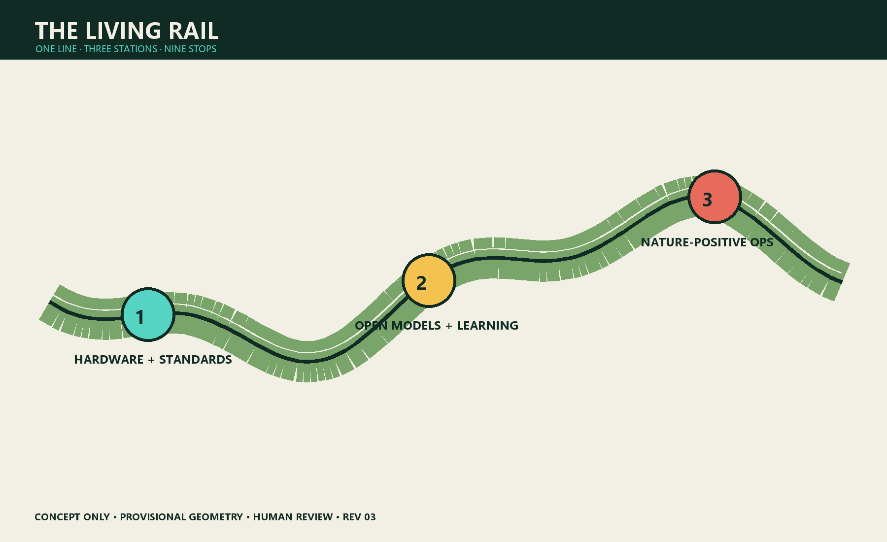
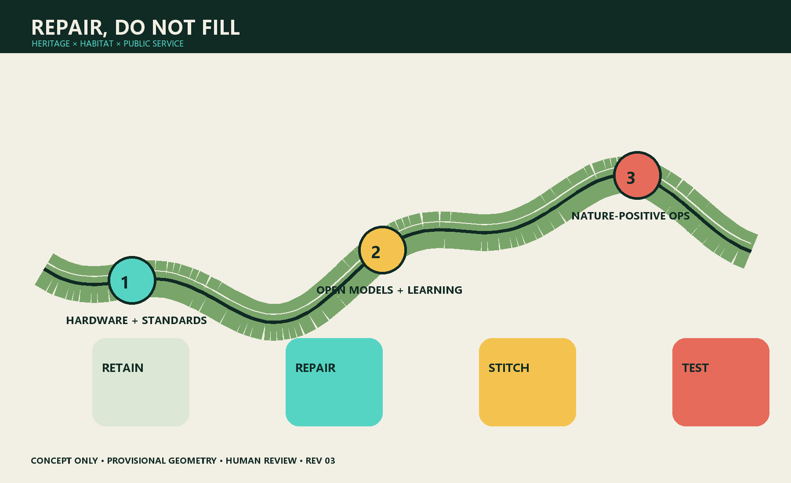
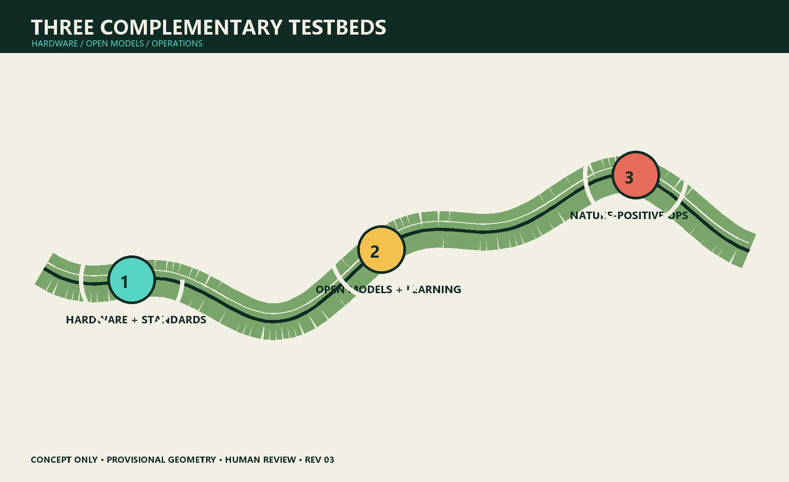
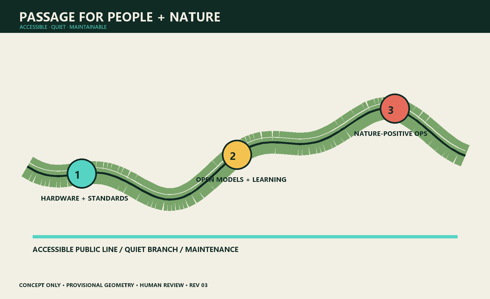
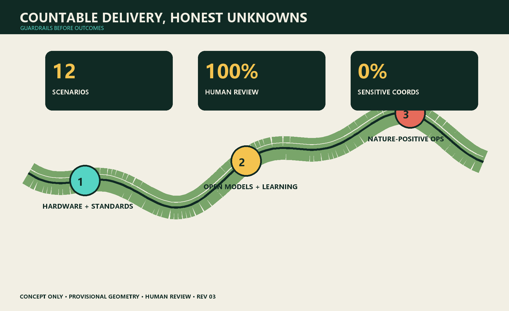

# Thesis

Turn the century-old Jing-Zhang railway from heritage that passes through the city into a learning line where people and nature live together. A continuous habitat network, reversible public space and restrained AI connect the three key areas into a nature commons that can be observed, joined and corrected.

> All spatial moves are conceptual. Submitted boundaries are working geometry, not statutory red lines. Species recognition, warnings and operational advice require human review; sensitive coordinates remain unpublished. AI never replaces ecological surveys or approvals.【SRC-BRIEF】【SRC-LIMITS】【SRC-MEE-BIODIV】

## Design Basis and Evidence Register

The project brief, Agent taskbook, planning-limit register and source registry establish scope. Missing statutory controls, utilities and seasonal ecology baselines stay unknown. The six precedents—Paris Oasis, Medellín green corridors, one-north, Mila, 22@ and Quayside—supply transferable methods, not Jing-Zhang site facts.【SRC-BRIEF】【SRC-TASKBOOK】【SRC-PARIS-OASIS】【SRC-MEDELLIN】【SRC-ONE-NORTH】【SRC-MILA】【SRC-BARCELONA】【SRC-WATERFRONT】

## Three-scale Working Framework

|Scale|Question|Deliverable|Boundary|
|---|---|---|---|
|43.6 km² study|How can ecology and AI industry reinforce each other?|ecosystem map and transfer conditions|no statutory conclusion|
|11.4 km² overall design|How can rail heritage become habitat and public-service backbone?|one line, three stations, nine stops|areas pending official verification|
|368.4 ha key design|How can the three areas become complementary testbeds?|spatial actions, 12 scenarios, 3 industry tests|not specialist design or approval|

## Coordinated Study: Industry and Future City

The identity combines rail and leaf-vein lines into an eye that means observation, not surveillance. Three positions are urban nature commons, responsible-AI test line and Jing-Zhang heritage learning corridor. Five functions are restoration, learning, validation, cultural narrative and maintenance. Data follows minimisation, edge obfuscation, human review, tiered release and deletion. Public access never requires payment or a phone.

Six precedents are tested against Beijing climate, heritage, equity and operational capacity. Oasis informs co-design; Medellín, maintenance; one-north and Mila, research communities; 22@, productive reuse; Quayside, public-interest data governance.

## Overall Urban Design and Regeneration

The proposal repairs gaps rather than drawing a new mega-greenbelt. Rail heritage is the legible spine; campuses, parks, corners, waterways and roofs are stepping stones. Four actions are retain valuable fabric, micro-retrofit hard edges, stitch accessible shaded walking and reversibly adjust conflict points. Land use, development quantum and demolition remain unknown until statutory evidence exists.

Walking separates a public main line, quiet habitat branches and maintenance access. Physical signs, paper observation cards, staff and digital interfaces coexist. Rain gardens and utilities are conceptual and require specialist verification.

## Detailed Design of the Three Key Areas

**Zhongguancun Science City North — Hardware and Standards Station.** Removable sensor racks, low-reflection glazing, low-disturbance lighting and repair benches publish false positives, energy and labour. Industry Test T1 uploads only coarse species/time grids; experts review locally retained raw media.

**AI Origin Community — Open Models and Public Learning Station.** Community classrooms and developer spaces become a model-card school. Industry Test T2 reports seasonal bias, confidence, failures and review cost. The annual BioBlitz never exposes sensitive nests.

**Dazhongsi — Nature-positive Operations Station.** Movable habitat planters, shade, collision-safe glazing and quiet delivery windows connect transit, commerce and heritage. Industry Test T3 produces advisory operational ledgers; managers approve action and no merchant is punished or ranked.

## AI Ecosystem, Personas and AI+ Scenarios

Six personas are families, wheelchair users, night workers, ecologists, developers and maintenance staff. Their red lines are respectively forced apps/child imagery, ecological detours, unsafe darkness, model-as-survey claims, access to sensitive coordinates, and automated worker scoring.

Twelve scenarios—soundscape sentinel, bird-strike log, lighting sandbox, post-rain inspection, accessible-route audit, child nature kiosk, seasonal guide, sensitive-data gatekeeper, bias clinic, merchant assistant, event-capacity negotiation and maintenance-ledger summary—each has a named human gate, log, stop condition and non-AI fallback. They adapt capabilities from the repository scenario prototypes without expanding their governance authority.

## Blue-green Space, Public Realm and Character

Heritage interfaces keep industrial memory; habitat interfaces use locally appropriate, low-maintenance seasonal communities after survey; urban interfaces use warm low-level light, low-reflection material and movable furniture. Submitted green/public-space ratios are machine checks, not statutory promises.

Three cohabitation milestones are the **Leaf-vein Signal Tower** (transparent sensor accuracy), **Model Specimen Hall** (successes beside failures and energy) and **Night-flight Platform** (safe comparison of lighting/glazing). Honours reward repair, model review, accessible companionship and honest failure—not maximum detections.

## Land Use, Building Quantum and Retain/Adapt/Remove

Existing parks, open spaces, ground floors and roofs come first. FAR, height, demolition and new floor area stay unknown. A later building-by-building assessment must cover safety, ownership, heritage, carbon and adaptability.

## Mobility, Rail, Utilities and Public Facilities

The heritage line is a narrative and walking spine; it does not alter statutory rail or utility functions. Crossings, stormwater, lighting, power, communications, fire and sanitation require specialist approvals. Devices are low-power, removable and maintainable; conventional services remain when they fail.

## Project List, Policy and Phasing

P0 (0–6 months) establishes four-season baseline, accessibility audit and data-impact assessment. P1 (6–18 months) tests one reversible space and AI scenario per area. P2 (18–36 months) stitches nine stops only after independent review and public hearing. P3 runs annual BioBlitz, failure-sample week and maintenance assembly. Any missing accountable operator pauses digital service. Governance seats ecology, accessibility, community, operations and data responsibility; material change needs professional and community co-signature.

## Metrics, Recalculation and Compliance

Deliverable metrics are 12 scenarios, 3 industry tests, 6 personas and 3 landmarks. Human-review and non-digital-fallback coverage are 100%; sensitive-coordinate publication is 0%. Ecological outcomes remain unknown before four-season surveys. Geometry-derived 11.41 km², 12.34% green and 7.33% public-space figures are machine checks only.

## Risk, Rights and Compliance

Risks include misidentification, sensitive-location disclosure, surveillance creep, exclusion, worker burden, greenwashing and event disturbance. Controls are minimisation, edge processing, review, permissions, logs, appeal, fallback and independent evaluation. No child facial recognition, automated worker ratings or loss of basic service after consent refusal.

Original text and graphics are CC BY-SA 4.0; cited third-party rights remain with their owners. No unlicensed external photos, fonts or model assets are included. This proposal is not a government commitment, permit, engineering drawing, ecological finding or investment promise.

## References

See `sources.json`: core evidence【SRC-BRIEF】【SRC-TASKBOOK】【SRC-LIMITS】【SRC-MEE-BIODIV】 and background cases【SRC-PARIS-OASIS】【SRC-MEDELLIN】【SRC-ONE-NORTH】【SRC-MILA】【SRC-BARCELONA】【SRC-WATERFRONT】.
