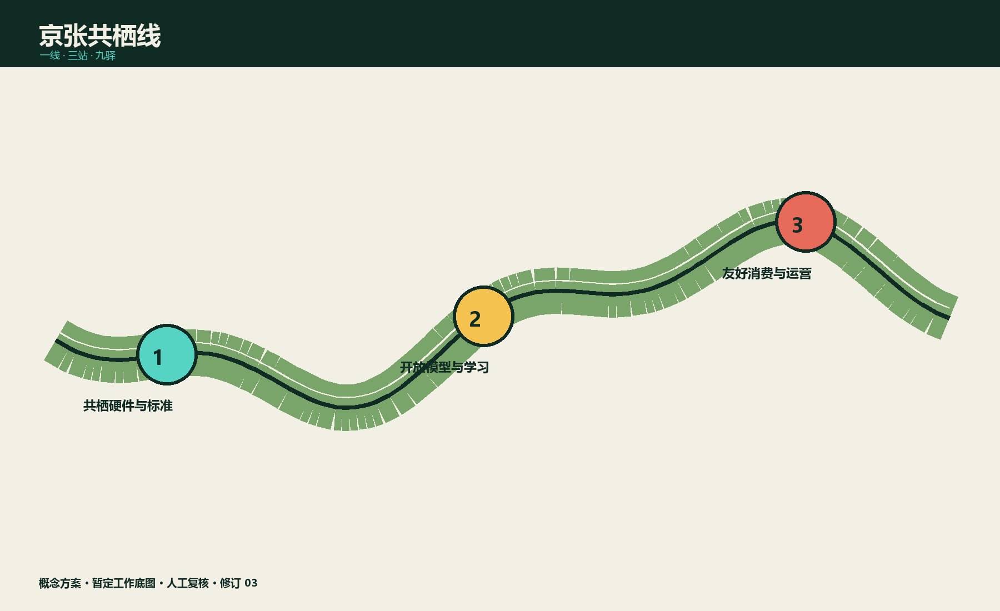
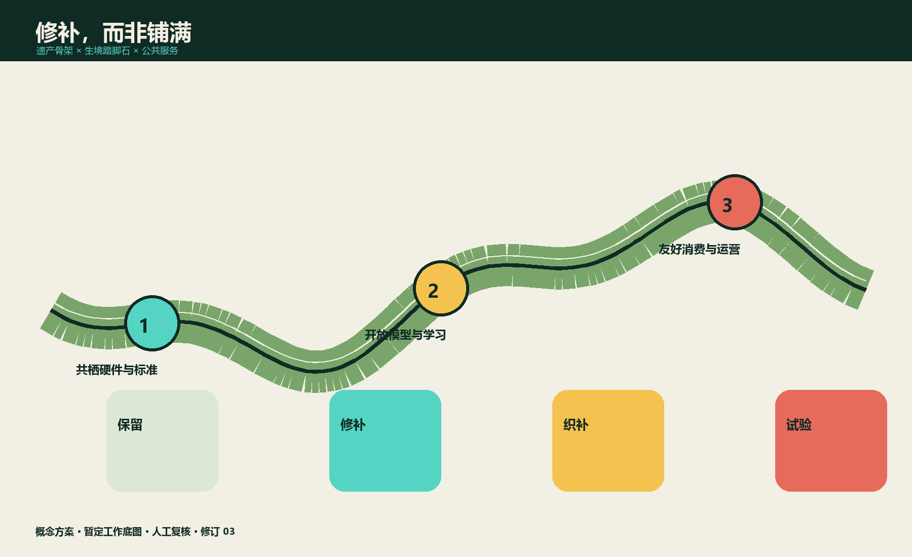
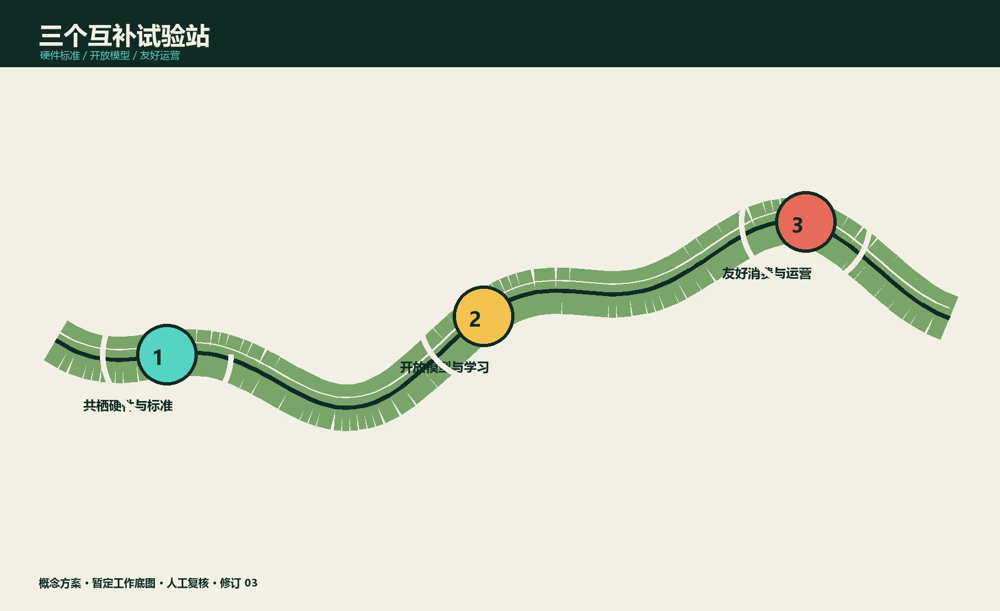
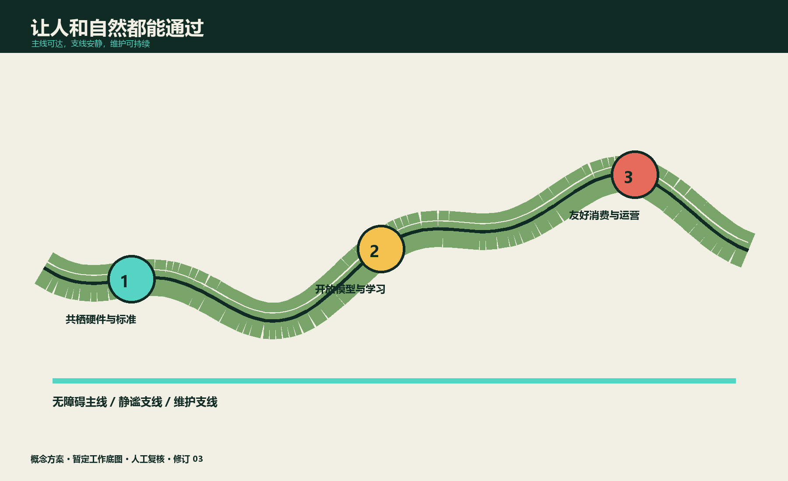
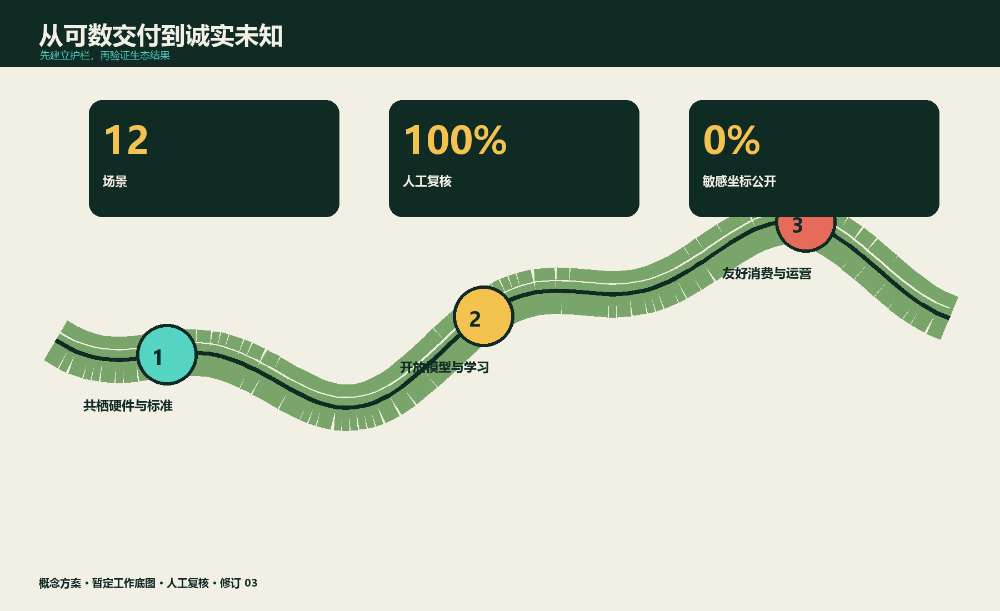

# 一句话主张

把百年京张从“穿过城市的遗产线”升级为“人与自然共同生活的学习线”：用连续生境、可逆公共空间与审慎 AI，把三大重点片区串成一座可观察、可参与、可纠错的城市自然公地。

> 方案边界：所有空间均为概念性提案；提交包中的边界为工作底图，不是法定红线。物种识别、风险提示和运营建议必须由人复核，敏感物种坐标不公开，不以算法替代专业调查或行政审批。[source:SRC-BRIEF][source:SRC-LIMITS][source:SRC-MEE-BIODIV]

## 设计依据与资料清单

[standard:PROJECT-OFFICIAL-ANNOUNCEMENT] [standard:PROJECT-AGENT-OPEN-CALL-TASKBOOK] [depth:existing_conditions_diagnosis]

依据由项目设计任务书、Agent 任务书、规划限制清单和来源登记表构成。官方资料支持项目范围、三大重点区域面积与任务结构；尚缺法定边界、控规指标、四季生态本底和地下管线，因此本方案不宣称精确面积合规、不设未经调查的物种增长 KPI。国际案例只用于提炼方法：巴黎 Oasis 的共建微气候空间、麦德林绿色廊道的持续养护、one-north 与 Mila 的创新社群、22@ 的生产性更新、Quayside 的公共领域治理。[source:SRC-BRIEF] [source:SRC-TASKBOOK] [source:SRC-PARIS-OASIS]

索引续：[source:SRC-MEDELLIN] [source:SRC-ONE-NORTH] [source:SRC-MILA]

索引续：[source:SRC-BARCELONA] [source:SRC-WATERFRONT]

## 三层范围工作框架

[depth:three_level_scope_framework] [data:geometry/site_boundary.geojson#SITE-BOUNDARY-PROVISIONAL] [metric:site_area_sqm]

|层级|问题|本方案交付|不可越界|
|---|---|---|---|
|43.6 km² 统筹研究|生态链与 AI 产业链如何互相增益|区域生态—人才—产业关系图、案例迁移条件|不作法定规划结论|
|11.4 km² 总体设计|铁路遗产如何成为连续生境与公共服务骨架|“一线、三站、九驿”结构、慢行与蓝绿策略|面积均待官方底图复核|
|368.4 ha 重点设计|三个片区如何形成互补试验场|三片区空间动作、12 场景、3 个产业试验|不替代专项设计与审批|

“一线”是京张共栖脊；“三站”是三个重点区的共栖里程碑；“九驿”是分期布置的观察、休憩和维护节点。策略先做低成本、可撤回试点，再以公开评估决定扩展。

## 统筹研究范围产业与未来城市研究

[depth:overall_spatial_structure] [source:SRC-MEE-BIODIV]

### 定位、标识与五项功能

标识以两条并行曲线构成：一条是铁路钢轨，一条是叶脉；交汇处形成“眼睛”，代表观察而非监控。三重定位为：**城市自然公地、负责任 AI 实验线、京张遗产学习廊**。五项功能为生态修复、公众学习、产业验证、文化叙事与长期维护。

生态系统由研究机构/高校、生态专业团队、AI 企业、沿线街道社区、学校、商业运营者和数据治理者组成。数据流遵循“采集最少化—边缘模糊化—人审—分级发布—到期删除”；资金流由年度维护预算、企业测试服务、活动赞助和公益合作构成，但公共服务不以付费或手机作为进入门槛。

### 六个可迁移案例

案例不做“复制清单”，而按条件迁移：Oasis 迁移共建和降温方法；麦德林迁移廊道养护岗位；one-north 与 Mila 迁移产学社群；22@ 迁移存量产业空间；Quayside 迁移公共利益与数据问责。每个方法先接受北京气候、遗产保护、社区公平和运维能力四项检验。

## 总体设计范围城市更新与控规深度城市设计

[depth:land_use_layout] [depth:development_intensity_controls] [data:geometry/land_use.geojson#LU-GREEN]

空间结构不新增一条“大绿带”，而是修补断点：铁路遗产界面为连续识别骨架；校园、园区、街角、河渠和屋顶成为踏脚石；夜间照明、玻璃界面、雨水径流和养护制度成为需要共同设计的隐形空间。

四类更新动作：①保留遗产构筑物、成熟乔木与现有公共通行；②微改造硬质边角为季相生境；③织补无障碍慢行和遮荫停留；④对生态冲突设施做可逆调整。用地性质、建筑规模与拆改量在法定资料缺失时保持 unknown，仅登记“保留优先、最小干预、先评估后建设”。

### 交通、市政与公共服务

慢行采用“人行主线—静谧支线—维护支线”分流；重要路口提供连续无障碍面、夜间低位引导和非视觉提示。雨水花园仅作为概念型源头减排单元，须经海绵城市、土壤、管线和防洪专项复核。公共服务由实体解释牌、纸质观察卡、现场志愿者与数字界面并行，断网仍可使用。

## 重点区域详细设计

[depth:three_key_area_detailed_design] [data:geometry/key_areas.geojson#PROV-KEY-001] [metric:key_area_count]

### 中关村科学城北区：共栖硬件与标准站

在现有研发环境中设置可拆卸传感器测试架、低反射玻璃样段、低干扰照明样段和设备维修台。核心不是“多装传感器”，而是公开误报率、能耗、维护工时与淘汰机制。产业试验 T1“低干扰边缘感知”：只上传物种类别的模糊时空网格，原始声像短期本地保存，生态人员复核后再用于研究。

### AI 原点社区：开放模型与公众学习站

把社区课堂、青年工作坊和开发者空间连接为“模型说明书学校”。产业试验 T2“城市生态模型卡”：企业用统一样本报告季节偏差、置信区间、失败案例和人工复核成本；居民可提交异议。这里运营年度 Living Rail BioBlitz，但不公布敏感巢址。

### 大钟寺：友好消费与车站公地站

用可移动花箱、遮荫座椅、玻璃防撞样段、安静装卸时窗连接地铁、商业与遗产空间。产业试验 T3“生物多样性友好运营账本”：商户自愿记录照明、垃圾、鸟撞和绿化维护，AI 只生成建议，物业经理批准后执行；不作为处罚或商户排名依据。

## AI 创新生态、人才画像与 AI+ 场景

[metric:scenario_count] [metric:persona_count] [metric:industry_test_scenario_count]

### 六类人物

|人物|需要|拒绝被迫承担的成本|
|---|---|---|
|带孩子的周边居民|安全、可解释的自然学习|下载 App、公开儿童影像|
|轮椅使用者|连续平整通行和可达观察点|以“生态保护”为由绕行|
|夜班通勤者|清晰、安心但不过亮的路径|算法降低必要照明|
|生态调查员|可追溯原始记录与复核工具|把模型结果冒充本底调查|
|园区开发者|合法样本、模型卡、测试接口|获取敏感坐标或无限留存|
|一线养护员|明确工单、培训、合理工时|被摄像评分或承担误报责任|

### 十二张场景卡

每张卡都有人工闸门、日志、退出条件和无 AI 备份。

|#|场景|使用者 / AI 作用|人工闸门|退出与备份|
|---|---|---|---|---|
|S1|晨间声景哨兵|调查员 / 聚类异常声段|生态人员确认|误报连续超阈值即停；人工样线|
|S2|鸟撞风险日志|物业 / 归并匿名报告|现场核验后改造|无改善即撤设备；纸质登记|
|S3|低干扰照明沙盒|夜班者 / 比较时段数据|安全与生态联合批准|照度或安全投诉触线即回退|
|S4|雨后生境巡检|养护员 / 排序积水与损坏|班组长派单|离线巡检表|
|S5|无障碍路径体检|轮椅者 / 汇总路障|无障碍审核员复核|现场审计优先|
|S6|儿童自然问答亭|家庭 / 本地知识检索|教师审核内容库|实体图鉴与讲解员|
|S7|季相导览|访客 / 生成多感官路线|运营者审核|固定导览图|
|S8|敏感数据守门员|研究者 / 自动泛化坐标|数据管理员审批导出|只发布区级统计|
|S9|模型偏差诊所|开发者 / 发现季节与设备偏差|跨专业评审|不合格模型下线|
|S10|商户友好运营助手|商户 / 提示照明垃圾时窗|商户自决|纸质清单|
|S11|活动容量协商器|活动方 / 模拟人流干扰|现场负责人定案|人工容量表|
|S12|维护账本摘要|公众 / 汇总预算与工单|财务和社区双审|季度公告栏|

这些应用分别映射仓库场景原型 `ai-cultural-guide`、`ai-traffic-walkability`、`public-safety-operations-review`、`robot-delivery-low-speed`、`ai-health-service-navigation` 与 `enterprise-service-copilot` 的“导览、慢行、运营复核、低速维护、服务导航、企业协作”能力，但不改变其治理边界。

## 蓝绿空间、公共空间与城市风貌

[depth:blue_green_public_space] [data:geometry/green_space.geojson#GREEN-001] [metric:green_ratio]

三类界面控制：遗产界面保持工业记忆和视线连续；生境界面使用北京适生、低维护、季相明确的植物群落，但物种表须经调查；城市界面通过暖色低位照明、低反射材料和可移动家具降低干扰。绿地率与公共空间率仅为提交几何的机器复算值，不是法定指标或新增建设承诺。

### 三个“共栖里程碑”

1. **叶脉信号塔**（中关村科学城北区）：复用铁路信号语汇的可拆卸生态仪器架，公开设备状态和误差。
2. **模型标本馆**（AI 原点社区）：每个模型同时展示正确识别、失败样本、能耗和人审记录。
3. **夜航月台**（大钟寺）：一段可比较不同照明/玻璃策略的公共平台，以安全回退为首要规则。

荣誉体系不奖励“识别最多”，而奖励长期维护：共栖修补者、开放模型审校者、无障碍同行者和年度诚实失败奖。所有荣誉可由社区与专业人员共同提名。

## 用地、建筑规模与拆改留方案

[depth:retain_renovate_demolish] [depth:height_massing_character] [data:geometry/buildings.geojson#BLDG-001]

本方案优先利用既有公园、园区开放空间、建筑首层与屋顶，不以新增地标建筑作为成败条件。保留对象先按遗产价值、成熟树木、既有使用强度和可适应性建立清单；微改造对象须说明使用者、开放时段、维护主体和撤回办法；只有当无障碍、安全和生态断点无法通过轻介入解决时，才进入新建论证。建筑首层鼓励共享工具库、生态调查工作台和雨天课堂，但不预设产权腾退或强制开放。屋顶生境须先校核荷载、防水、消防、眩光与高空维护，不把“屋顶绿化”直接计入公共可达空间。现状建筑面积来自提交几何复算；总建筑规模、容积率、建筑高度、拆除量和新增量均因官方控制和详勘缺失而不赋值。下一阶段以“建筑保留评估表”逐栋确认结构安全、产权、遗产价值、碳排与适应性。

## 交通、轨道、市政与公共服务设施

[depth:traffic_rail_slow_parking] [depth:municipal_new_infrastructure] [data:geometry/roads.geojson#ROAD-001]

京张遗产线是叙事与慢行骨架，不改变铁路、轨道交通或市政设施法定功能。交通设计优先处理过街等待、轮椅转弯、婴儿车坡度、骑行冲突、夜间辨识和养护车辆临停六类断点；每个节点同时画出日常、活动和应急三种状态。轨道站点衔接以连续步行和清晰换乘为目标，不提出未经论证的站位或线路调整。市政设备共享机柜和检修界面，避免生态传感器形成新的杆件森林；供电中断、通信故障或模型停用时，基础照明、排水、导向与求助设施不受影响。新增过街、雨洪、照明、电源、通信、消防和环卫设施须进入对应专项。设备默认低功耗、可拆卸、可维护；故障时空间服务仍由标识、人工和常规设施维持。

## 更新项目清单、实施政策与分期计划

[depth:renewal_project_list] [depth:phasing_implementation] [data:geometry/phasing.geojson#PHASE-001]

|阶段|期限|动作|通过门|停止条件|
|---|---|---|---|---|
|P0 本底|0–6 月|四季首轮调查、无障碍审计、数据影响评估|专业与社区联合确认|缺法定许可或数据治理责任人|
|P1 三站试点|6–18 月|每区一个可逆空间样段+一个 AI 场景|安全、可达、误报、维护四项达标|重大投诉/安全风险/维护失控|
|P2 九驿织补|18–36 月|修补生态与慢行断点|独立复评和公开听证|公平性或生态效果不成立|
|P3 长期运营|持续|年度 BioBlitz、模型诊所、维护议会|年度预算与责任清单|无人负责即暂停数字服务|

年度节奏：春季四季调查启动，夏季开发者“失败样本周”，秋季公众 BioBlitz，冬季维护议会。全球合作只交换去敏方法、模型卡和运营指标，不交换敏感坐标。治理由“生态专业席、无障碍席、社区席、运维席、数据责任席”五方组成，关键变化须至少专业与社区双签。

## 指标体系、面积复算与合规矩阵

[depth:metrics_recalculation] [metric:human_review_coverage_ratio] [metric:public_space_ratio]

指标分成四层：空间复算用于发现图数不一致，治理指标检查权责是否闭环，运营指标记录维护工时与投诉响应，生态结果则必须由四季本底和专业复测支持。指标不做单一总分，防止以新增设备数量抵消隐私、可达性或养护问题。每次发布同时列出数据期、样本缺口、误差、负责人和下一次复测日期；无法解释的变化不转化为绩效结论。硬指标只检查交付完整度和治理护栏：12 个场景、3 个产业测试、6 类人物、3 个里程碑；所有 AI 场景人工复核覆盖率 100%，非数字备份覆盖率 100%，敏感坐标公开率 0%。生态成效指标（物种、本底、连通性、鸟撞、热舒适）在四季调查前均保持 unknown。提交几何复算约 11.41 km²，绿地率约 12.34%，公共空间率约 7.33%，仅用于机器检查，不作为法定或现状结论。

## 风险、版权与合规说明

[depth:risk_missing_data] [standard:MOHURD-URBAN-DESIGN-MEASURES]

风险按“发生前预防—发生中止损—发生后追责”管理。上线前完成数据影响、无障碍、安全和维护评审；运行中保留一键停用、人工接管和告知渠道；运行后公开事件摘要、整改责任与删除证明。儿童、养护人员和敏感物种属于高保护对象，任何扩大采集范围的变更都需重新评审，不能沿用试点同意。主要风险包括误识别诱发错误干预、敏感位置泄露、监控外溢、数字排斥、维护岗位压力、绿色漂洗和活动扰动。控制方式依次为数据最小化、边缘处理、人工复核、角色权限、公开日志、申诉撤回、非数字备份与独立评估。未成年人不做人脸识别；养护员不做自动绩效评分；公众不因拒绝数据授权失去基本服务。

文本与原创图件按 CC BY-SA 4.0 共享；第三方来源仅作事实与方法引用，权利归原权利人。本提交不授权使用仓库外未获许可的照片、字体或模型资产。方案不构成政府承诺、规划许可、工程图纸、生态调查结论或投资承诺。

## 参考资料

[source:SRC-BRIEF] [source:SRC-TASKBOOK] [source:SRC-LIMITS]

来源按“场地事实、规范依据、外部案例、方案生成”分层登记。只有项目包和正式规范可支撑场地及合规判断；生态政策用于说明方向；外部案例只支撑方法启发。网页访问日期、链接状态和适用范围在来源表留痕，若链接失效则不影响已声明的数据缺口，也不会被替换为未经核验的二手材料。所有几何、指标、标准与深度条目均可从下列机器引用回到对应文件。

[standard:MNR-LAND-USE-CLASSIFICATION-GUIDE] [standard:MOHURD-ARCH-DESIGN-DEPTH-2016] [standard:MOHURD-CONTROL-DETAILED-PLANNING]

索引续：[standard:MOHURD-URBAN-DESIGN-MEASURES] [standard:PROJECT-AGENT-OPEN-CALL-TASKBOOK] [standard:PROJECT-OFFICIAL-ANNOUNCEMENT]

索引续：[depth:blue_green_public_space] [depth:development_intensity_controls] [depth:existing_conditions_diagnosis]

索引续：[depth:height_massing_character] [depth:land_use_layout] [depth:metrics_recalculation]

索引续：[depth:municipal_new_infrastructure] [depth:overall_spatial_structure] [depth:phasing_implementation]

索引续：[depth:renewal_project_list] [depth:retain_renovate_demolish] [depth:risk_missing_data]

索引续：[depth:three_key_area_detailed_design] [depth:three_level_scope_framework] [depth:traffic_rail_slow_parking]

索引续：[metric:site_area_sqm] [metric:building_footprint_area_sqm] [metric:green_ratio]

索引续：[metric:public_space_ratio] [metric:key_area_count] [metric:scenario_count]

索引续：[metric:industry_test_scenario_count] [metric:persona_count] [metric:landmark_count]

索引续：[metric:pilot_count] [metric:human_review_coverage_ratio] [metric:non_ai_fallback_coverage_ratio]

索引续：[metric:sensitive_species_coordinate_publication_ratio] [data:geometry/constraints.geojson] [data:geometry/public_space.geojson#PUBLIC-001]

详见 `sources.json`。核心依据：[source:SRC-BRIEF] [source:SRC-TASKBOOK] [source:SRC-LIMITS]

索引续：[source:SRC-MEE-BIODIV]

；背景案例：[source:SRC-PARIS-OASIS] [source:SRC-MEDELLIN] [source:SRC-ONE-NORTH]

索引续：[source:SRC-MILA] [source:SRC-BARCELONA] [source:SRC-WATERFRONT]

。
