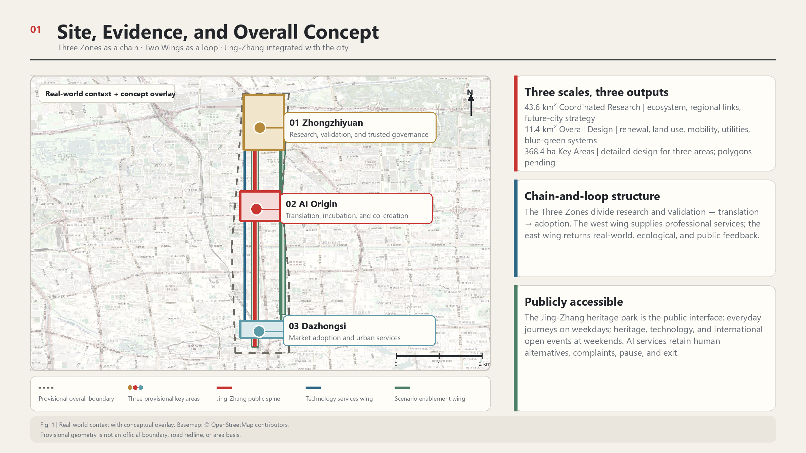
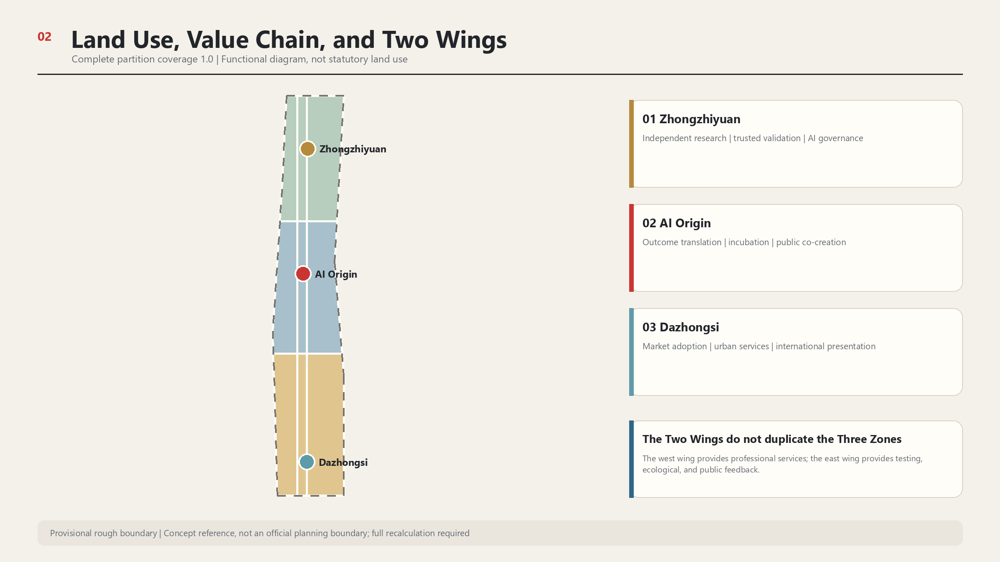
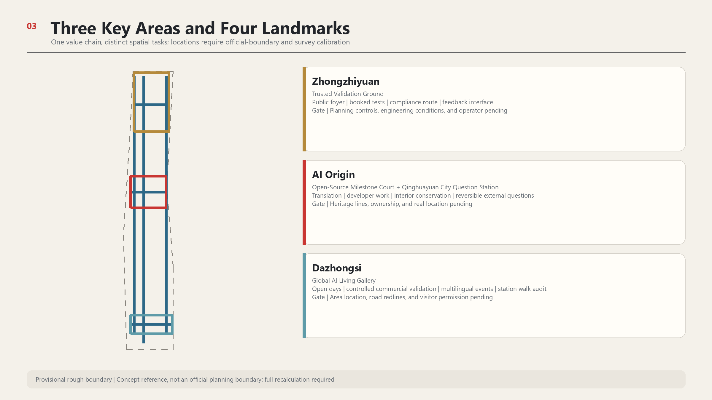
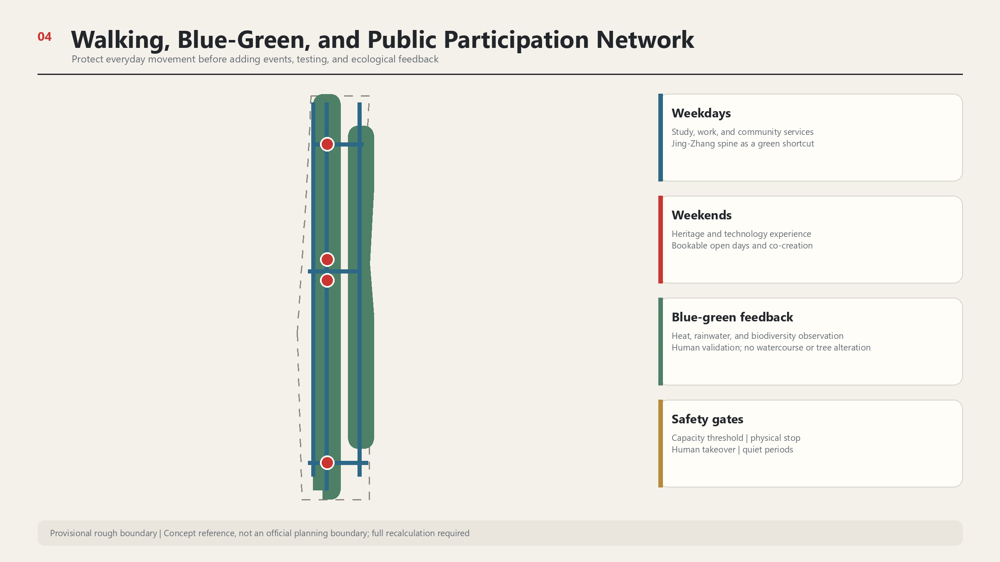
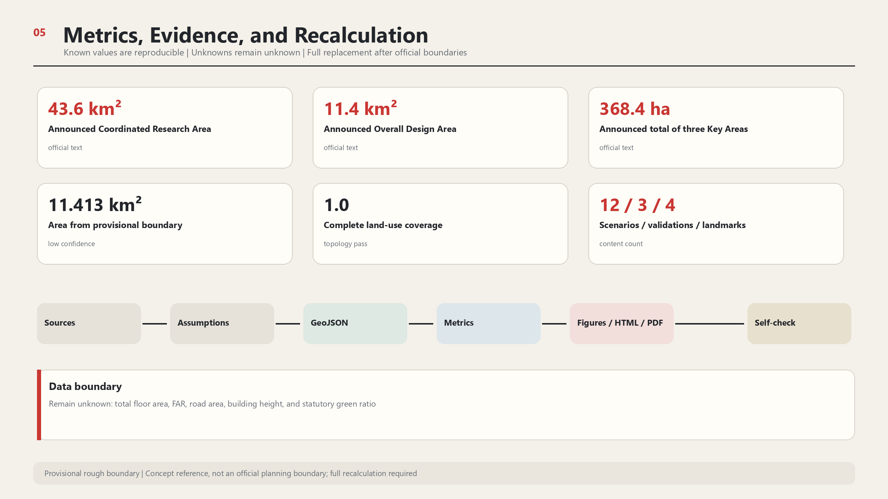

# AI Along Jing-Zhang | Love Along Jing-Zhang

**Centennial Jing-Zhang Global Urban AI Full-Chain Open Innovation and Public Co-Creation Demonstration Belt**

Public slogan　**AI All Along the Way**

Heritage slogan　**One Railway, Two Departures**

Overall structure　**Three Zones as a Chain, Two Wings as a Loop, Jing-Zhang Integrated with the City**

This proposal was generated by OpenAI Codex. All spatial content is a conceptual recommendation for further development by planning, architecture, heritage conservation, transport, ecology, operations, and community teams. It carries no government approval, investment commitment, engineering-feasibility conclusion, or statutory planning effect.

## Design Basis and Source List

The innovation belt already contains railway heritage, parks, universities, research institutions, businesses, communities, and rail stations. The design starts from these functioning urban relationships. The official announcement defines an approximately 43.6-square-kilometre Coordinated Research Area, an approximately 11.4-square-kilometre Overall Design Area, and approximately 368.4 hectares of Key-Area Detailed Design Areas. It also requires an integrated response to the industrial ecosystem, urban renewal, transport and municipal infrastructure, public space, cultural character, and detailed design of three key areas [source:OFFICIAL-ANNOUNCEMENT] [standard:PROJECT-OFFICIAL-ANNOUNCEMENT].

No trusted official precise polygons are currently available in the repository. This submission therefore uses the provisional rough boundaries supplied by the maintainers. Coordinates are stored in EPSG:4326, while areas and lengths are recalculated in EPSG:4548. The provisional geometry serves only conceptual design, layer clipping, and submission validation; it is not an official planning boundary. Once official boundaries are available, all nine GeoJSON layer types, metrics, figures, web pages, and PDFs must be regenerated [data:geometry/site_boundary.geojson#SITE-001] [source:BOUNDARY-SOURCE] [metric:site_area_sqm].

Sources are used at four levels. Announcements, laws, and competent-authority material support formal facts. University archives and institutional sources support historical and case-study judgments. Company, visitor, and activity figures in departmental news retain the publisher's stated scope. OSM is used only to identify real-world place names and positional discrepancies; it is excluded from boundary, road-redline, and statutory-area calculations. An official textual description exists for the protection scope and construction-control zones of Qinghuayuan Station, but the formal control-line drawing remains unavailable [source:TSINGHUA-STATION-CONSERVATION] [data:geometry/constraints.geojson#CONSTRAINT-HERITAGE] [depth:existing_conditions_diagnosis].

## Three-Level Scope Framework

Each level answers a different question. The Coordinated Research Area asks how Haidian's AI resources can form a global collaboration network. The Overall Design Area asks how industry, public life, and the heritage park can be implemented through urban renewal and spatial systems. The three Key-Area Detailed Design Areas ask how research and validation, outcome translation, and market adoption operate as distinct stages of one value chain. All three levels share one set of sources, assumptions, layers, and metrics rather than drawing mutually conflicting boundaries [depth:three_level_scope_framework] [data:geometry/key_areas.geojson#PROV-KEY-001].

| Working level | Core judgment | Main deliverables in this proposal |
| --- | --- | --- |
| Coordinated Research Area | Global competitiveness depends on coordination among research, services, scenarios, talent, and urban life | Seven international cases, an industrial value chain, Three Zones and Two Wings coordination protocols, and annual international events |
| Overall Design Area | The Jing-Zhang Railway Heritage Park is the public spine, while the east and west wings provide cross-area support | Complete land-use partition, walking and cycling links, east-west stitches, blue-green network, public services, and phased projects |
| Key-Area Detailed Design Areas | The Three Zones carry value-chain stages; the Two Wings carry shared capabilities | Differentiated detailed design for Zhongzhiyuan research and validation, AI Origin translation and co-creation, and Dazhongsi adoption and services |

The overall concept places past and present on the same line. The Jing-Zhang Railway, opened in 1909, demonstrated China's ability to independently design and build a modern railway. Today's second departure explores an urban AI innovation belt through openness, trustworthiness, and public participation. Conservation and accurate interpretation carry the historical value; public spaces that people can enter, question, and verify every day carry the present value [source:TSINGHUA-STATION-HISTORY] [source:BEIJING-THREE-ZONES-20260403].

## Coordinated Research Area: Industry and Future City Research

### Three Zones as a Chain

The Three Zones are differentiated by the journey from AI creation to adoption. Zhongzhiyuan is responsible for independent research, trusted validation, and AI governance. The Beijing AI Origin Community translates research outcomes, incubates ventures, and supports public co-creation. Dazhongsi supports enterprise adoption, urban services, and international presentation. Public needs can enter through the park, communities, and Dazhongsi, be translated at AI Origin, validated at Zhongzhiyuan, and return to the city and market. Products that fail can move back along the same chain for revision [source:AGENT-TASKBOOK] [standard:PROJECT-AGENT-OPEN-CALL-TASKBOOK] [depth:overall_spatial_structure].

### Two Wings as a Loop

The Two Wings do not duplicate another research park or lifestyle district. The Zhongguancun Technology Services Wing provides capital, intellectual property, legal, standards, talent, computing, and data services across all three zones. The Xiaoyue River Scenario Enablement Wing accommodates real-world testing, ecological feedback, public experience, and blue-green resilience, and returns operational results to the Three Zones. The Three Zones are stages in the value chain; the Two Wings are shared capabilities [data:geometry/roads.geojson#ROAD-WING-W] [data:geometry/roads.geojson#ROAD-WING-E].

### Jing-Zhang Integrated with the City

The Jing-Zhang Railway Heritage Park is the public spine. It connects history, work, study, leisure, and event-day experiences, while giving the innovation chain an interface open to everyone. Government reporting describes the approximately nine-kilometre heritage park as an innovation link and records existing AI training stations, smart reading rooms, robots, and sports activities. The proposal builds on these existing uses rather than treating the park as an empty exhibition hall [source:BEIJING-JINGZHANG-20260330] [source:JINGZHANG-PARK-OPENING-20230202].

### Seven Global Cases

| Case | Transferable mechanism | Jing-Zhang application | Conditions that cannot be copied |
| --- | --- | --- | --- |
| Kendall Square | Joint planning by university, city, and community; research space coordinated with housing, retail, museums, and open space | Interfaces and public negotiation among campus, park, and neighbourhood at AI Origin | Different land ownership, life-science market, and development finance |
| Toronto MaRS and Vector | Clear division between venture-service platform and independent research institution, with an explicit route to adoption | Handover protocol between AI Origin translation services and Zhongzhiyuan trusted validation | Canadian public funding, health-data rules, and institutional governance cannot be directly transplanted |
| Paris-Saclay | Proof of concept, knowledge transfer, user feedback, and social impact as gates for technology transfer | Evidence thresholds for projects entering urban testing | Different regional scale, campus land, and EU funding system |
| Singapore one-north and AI Verify | A managed industrial community combined with documented testing and governance tools | Test records, accountable owners, pause rules, and exit rules at Zhongzhiyuan | Singapore's single land-agency model and tools are not Chinese certification |
| London Knowledge Quarter and King's Cross | Member networks and shared events connect knowledge institutions around a railway gateway | International knowledge and cultural interfaces toward Dazhongsi and Beijing North Railway Station | Different land assembly, heritage approval, and renewal-value structure |
| Helsinki Kalasatama | Resident co-testing, time-limited experiments, public learning, and city tours | Citizen science and failure-review mechanisms in the Xiaoyue River Wing | Different municipal data, population scale, and procurement system |
| Shenzhen-Hong Kong Hetao | Two parks retain distinct systems while clarifying research, talent, service, and compliance interfaces | Service catalogues and handover protocols among the Three Zones | Customs, taxation, and cross-border legal arrangements are unique |

These cases provide mechanism references only; they provide no local control indicator, policy preference, or certification conclusion [source:CASE-KENDALL-SQUARE] [source:CASE-MARS-VECTOR] [source:CASE-HETAO].

### Brand and Identity

The first appearance uses “AI Along Jing-Zhang | Love Along Jing-Zhang,” placing technological presence and public care together. Formal English prose uses “Jing-Zhang,” while the Logo retains the confirmed brand spelling “AI ALONG JINGZHANG.” The primary symbol remains concise, with transparent-background, monochrome, reversed, and Chinese-English lockups derived for wayfinding. The Logo does not replace maps, evidence, or spatial drawings; it tells residents that they have entered the same public innovation belt.

## Overall Design Area: Urban Renewal and Regulatory-Plan-Level Urban Design

The overall spatial system is organised as “one line, three zones, two wings, three stitches, and four landmarks.” The one line is the Jing-Zhang heritage walking and cycling spine. The Three Zones correspond to the three value-chain stages. The Two Wings carry technology services and scenario feedback. Three east-west stitches connect the key areas to both wings. The four landmarks are Qinghuayuan City Question Station, AI Origin Open-Source Milestone Court, Zhongzhiyuan Trusted Validation Ground, and Dazhongsi Global AI Living Gallery [data:geometry/roads.geojson#ROAD-SPINE] [data:geometry/public_space.geojson#PUBLIC-QST] [data:geometry/public_space.geojson#PUBLIC-LIFE].

Renewal begins with public space and operating protocols. The near term prioritises surveys, temporary wayfinding, accessibility repairs, open days, and controlled testing through reversible components. Building renovation follows only after ownership, structure, fire safety, heritage, and regulatory-planning information is available. New volume is shown only as a conceptual carrier, with no parcel-level demolition or new-build conclusion [data:geometry/buildings.geojson#BLDG-ORIGIN] [depth:retain_renovate_demolish].

The provisional land-use partition completely covers the submitted boundary and shares one set of cut lines. The centre represents the heritage park and blue-green public space; the west represents cross-area technology services; the east represents scenarios and ecological feedback. North, middle, and south are further organised by the dominant relationships of research, translation, and adoption. This is a functional-organisation diagram, not a substitute for statutory existing-land-use or regulatory-planning drawings [data:geometry/land_use.geojson#LU-SPINE-M] [metric:land_use_partition_coverage_ratio] [standard:MNR-LAND-USE-CLASSIFICATION-GUIDE].

## Detailed Design of Key Areas

### Zhongzhiyuan AI Independent Innovation Acceleration Area

The central space at Zhongzhiyuan is the “Zhongzhiyuan Trusted Validation Ground.” Projects involving models, robots, and Urban Agents use it to document safety boundaries, test plans, human-takeover drills, results, and exit reviews. The public may observe the validation process and result levels but cannot enter hazardous test areas. Proposals related to the nearby Qinghe River and green space remain low-disturbance displays and ecological monitoring until hydrological and engineering surveys are completed [data:geometry/key_areas.geojson#PROV-KEY-001] [data:geometry/public_space.geojson#PUBLIC-TRUST] [depth:three_key_area_detailed_design].

Spatial moves include a public validation foyer, a booking-only controlled test ground, a compliance-service route to the Technology Services Wing, and a feedback interface with the Xiaoyue River Wing. Adaptable existing space is preferred. Any new construction, structural alteration, computing, energy, or robot-operation project requires separate development after formal planning controls and engineering conditions are confirmed.

### Beijing AI Origin Community

AI Origin carries the intermediate work of turning laboratory results into understandable products. The Open-Source Milestone Court records open-source contributions, product iterations, public questions, and failure reviews. Small demonstrations, developer collaboration, intellectual property, legal, finance, and talent services are distributed through the everyday neighbourhood, reducing repeated travel between multiple parks [data:geometry/key_areas.geojson#PROV-KEY-002] [data:geometry/public_space.geojson#PUBLIC-MILESTONE].

Qinghuayuan Station is near this innovation-living catchment, but its real-world relationship with the formal scope remains subject to an official base map. The station building remains low-intervention and primarily presents existing historical interpretation. Reversible question devices outside the station collect specific urban and AI questions from residents, students, researchers, and visitors. AI Origin classifies and co-develops the questions; suitable projects go to Zhongzhiyuan for validation, and mature results move to Dazhongsi and public services along the belt for testing. This distributed “City Question Station” gives the heritage asset a continuing public-connective role without requiring complex equipment on the historic fabric [source:TSINGHUA-STATION-HISTORY] [source:TSINGHUA-STATION-CONSERVATION] [data:geometry/public_space.geojson#PUBLIC-QST].

### Dazhongsi AI Industry Cluster

Dazhongsi is responsible for enterprise adoption, urban services, and international presentation. The Global AI Living Gallery emphasises short open days, bookable product experience, controlled commercial validation, and multilingual events rather than permanent technology showcases. Rail access, commercial services, and cultural resources such as the Ancient Bell Museum provide conditions for connecting business visitors, residents, and tourists. Whether these resources fall within the formal key area and how they connect to the metro require confirmation through official boundaries, road redlines, and transport surveys [data:geometry/key_areas.geojson#PROV-KEY-003] [data:geometry/constraints.geojson#CONSTRAINT-DZS].

Walking links across the four quadrants around Dazhongsi Station begin with surveys of crossing time, accessibility, lifts, bicycle parking, and night lighting. The proposal does not presume an underpass, footbridge, or road widening. Engineering options should be developed only if surveys show that small-scale, feasible repairs exist. Global events use booking, timed entry, and temporary traffic management; the operator must retain an attendance threshold and a stop-entry mechanism.

## AI Innovation Ecosystem, Personas, and AI+ Scenarios

### Eight Personas

| Persona | Everyday tasks | Most-needed spaces and services | Risks that cannot be ignored |
| --- | --- | --- | --- |
| Students and researchers | Classes, experiments, exchange, and publication | Campus-to-park walking links, night study, and an outcome-translation entry point | Research outputs, campus data, and personal traces must not be collected without authorisation |
| Start-up teams | Find space, computing, customers, finance, and compliance support | One-stop technology services, short demonstrations, and test booking | Small teams cannot absorb complex compliance and high venue costs |
| Enterprise adopters | Compare products, run pre-procurement validation, and host international partners | Auditable test reports, controlled experience, business and multilingual services | Demonstration results must not be presented as production performance |
| Community residents | Commute, rest, access services, provide care, and express views | Low-threshold public services, quiet periods, and staffed counters | Events and commercial displays must not occupy public space permanently |
| Older people and carers | Health visits, payments, travel, and daily services | Clear wayfinding, seating, paper information, and human alternatives | No compulsory smartphone, facial recognition, or smart device |
| Disabled people | Continuous travel, information access, and on-site services | Accessible routes, multimodal information, and human assistance | Accessibility cannot stop at one device or one event |
| Visitors | Learn railway history, urban innovation, and cultural resources | Heritage interpretation, weekend routes, and bookable open days | Guides must not invent history or direct visitors into controlled areas |
| International talent | Work, live, access services, socialise, and support family life | Multilingual information, international activities, and trusted service entry points | Translation errors and institutional differences require human review |

Weekdays primarily serve commuting and everyday needs of students, researchers, park employees, and nearby residents. Weekends add heritage visitors, families, and technology-experience users. This judgment comes from site functions and official annual visitor reporting; no disaggregated travel survey is yet available. It is an operating assumption, not a population share [source:BEIJING-JINGZHANG-20260330] [source:BEIJING-AI-ORIGIN-20260401] [metric:scenario_card_count].

### Twelve Scenario Cards

Every scenario identifies an operator, minimum data, human review, KPI, failure mode, and exit condition. Digital services retain a human or non-intelligent alternative. High-risk tests use booking, separation, physical emergency stops, and post-event review. Full operating rules must be fixed in implementation agreements.

| No. | Scenario and primary location | Users and public value | Data and human boundary | Core KPI and exit condition |
| --- | --- | --- | --- | --- |
| 01 | City Question Station, conceptual node outside Qinghuayuan Station | Residents raise specific questions and see intake, research, validation, and response status | Anonymous participation allowed; people remove personal and unsuitable public content | Valid response and return-visit rates; remove on heritage or nuisance impact |
| 02 | Multilingual public service, Dazhongsi and event gateways | International talent and visitors obtain service and event guidance | Public information read-only; important matters reviewed by bilingual staff | Correct referral rate; withdraw after repeated misleading advice |
| 03 | Accessible navigation, Jing-Zhang walking and cycling spine | Disabled people, older people, and families with prams receive usable routes | No personal route history retained; slopes, lifts, and construction changes verified on site | Valid-route rate; mark unavailable immediately when field conditions differ |
| 04 | AI Learning Neighbourhood, AI Origin | Students, teachers, and residents join public courses and developer collaboration | Minors require guardianship and content review | Completion and reuse rates; content complaints trigger pause and review |
| 05 | Health-resource navigation, community service nodes | Residents find appropriate health and medical resources | No diagnosis and no medical-record retention; professionals review referral rules | Correct referral rate; stop immediately if the service tends to replace diagnosis or treatment |
| 06 | Heritage guide, heritage park and Qinghuayuan Station | Visitors understand railway, university, and urban history | Historical claims cite registered sources; disputed information is manually edited | Correction time; withdraw until factual errors are repaired |
| 07 | International Open Day, rotating among Dazhongsi and the Three Zones | Residents enter real venues to experience current products and research | Booking and timed entry; commercial demonstration clearly separated from validation conclusions | Public participation and adoption leads; stop entry at capacity |
| 08 | Enterprise compliance service, Zhongguancun Technology Services Wing | Start-ups obtain legal, IP, standards, and internationalisation referrals | AI only triages material; licensed professionals issue professional advice | Time to first referral; no conclusion without qualified personnel |
| 09 | Trusted model validation, Zhongzhiyuan | Models complete transparency, bias, and safety tests before real application | Rights-cleared data, independent review, and version records | Test coverage and reproducibility; major risk blocks the next stage |
| 10 | Controlled robot testing, Zhongzhiyuan and Xiaoyue River Wing | Enterprises validate low-speed robots while the public sees safety boundaries | Enclosed time slots, on-site safety staff, physical emergency stop, and no facial recognition | Human-takeover time; terminate on boundary breach or emergency-stop failure |
| 11 | Smart commercial validation, Dazhongsi | Enterprises validate products in real but controlled consumer settings | Trial disclosure, minimum transaction data, staffed support, and refund channel | Voluntary participation and issue-closure rate; accumulated complaints trigger exit |
| 12 | Blue-green citizen science, Xiaoyue River Wing | Residents and students observe heat, rainwater, and biodiversity | Environmental information only; professionals check sensors and conclusions | Data validity and maintenance rates; remove on sensor drift or ecological disturbance |

The three industry Testing and Validation Scenarios are trusted-model, robot, and smart-commercial validation. They address algorithmic performance, physical safety, and real adoption respectively and cannot share one generic “sandbox rulebook” [data:geometry/public_space.geojson#SCN-09] [data:geometry/public_space.geojson#SCN-10] [metric:industry_validation_scenario_count].

### Four Landmarks for Further Development

Qinghuayuan City Question Station raises questions. AI Origin Open-Source Milestone Court records co-creation. Zhongzhiyuan Trusted Validation Ground makes validation visible. Dazhongsi Global AI Living Gallery presents real adoption. Together the four landmarks form a walkable learning route and an operational chain from public need to product feedback [metric:landmark_count] [data:geometry/public_space.geojson#PUBLIC-MILESTONE] [data:geometry/public_space.geojson#PUBLIC-TRUST].

## Land Use, Building Scale, and Retain-Renovate-Demolish Strategy

The land-use GeoJSON is a complete conceptual functional partition. Nine zones share boundaries and achieve a coverage ratio of 1.0. The central heritage and blue-green belt is divided into three segments to prevent small projected-topology errors where long and segment edges meet. North, middle, and south sectors of the west and east wings organise the dominant relationships among research, community service, and commercial service. All classifications use the allowed land-use-code subset in the repository [data:geometry/land_use.geojson#LU-SPINE-N] [data:geometry/land_use.geojson#LU-W-S] [metric:land_use_partition_area_sqm].

The building layer represents only four conceptual functional carriers. Their total footprint is approximately 20,400 square metres, or about 0.18% of the provisional overall boundary. This value checks drawing and project interfaces; it is not a construction-scale recommendation. Existing building stock, floor area, FAR, building coverage, height, structure, and ownership await formal data, so total floor area and FAR remain unknown [metric:building_footprint_area_sqm] [metric:building_coverage_ratio] [metric:floor_area_ratio].

The retain-renovate-demolish strategy uses four decisions after survey. Heritage and legally protected assets enter the conservation category. Buildings in sound structural and operational condition enter retain-and-repair. Adaptable and safe buildings enter renovation and reuse. Demolition or new construction is discussed only when ownership, structure, fire safety, planning controls, public interest, and whole-life assessment all support it. All four carriers in the current GeoJSON are marked “pending survey”; none is a demolition conclusion [standard:MOHURD-CONTROL-DETAILED-PLANNING] [depth:development_intensity_controls] [depth:height_massing_character].

## Transport, Rail, Municipal Infrastructure, and Public Services

Transport design first addresses everyday walking, cycling, and interchange. The Jing-Zhang spine provides continuous north-south movement, while three east-west stitches connect the key areas to both wings. Conceptual links for the Zhongguancun Technology Services Wing and Xiaoyue River Scenario Enablement Wing show directions of collaboration; they are not new roads. All conceptual lines total approximately 30.31 kilometres and include neither road width nor redline area [data:geometry/roads.geojson#ROAD-STITCH-M] [metric:concept_mobility_link_length_m] [metric:road_area_sqm].

Station areas begin with walking-chain surveys covering exits, lifts, crossing waits, bicycle parking, night lighting, rain and snow, and event-day congestion. Station names such as Wudaokou, Qinghuadongluxikou, and Dazhongsi come from the announcement tasks and background sources; transport and planning authorities must confirm formal integration scopes. The proposal does not presume bridges, tunnels, road widening, or parking capacity [depth:traffic_rail_slow_parking] [data:geometry/constraints.geojson#CONSTRAINT-MOBILITY].

Municipal and New Infrastructure follows “small pilot, separate metering, and disconnectability.” Edge computing, environmental sensing, robot charging, and temporary event power first require capacity, safety, network, and maintenance assessments. Public-service facilities retain staffed counters, paper information, telephone, and on-site volunteers. The requirement for human service in Article 39 of the Barrier-Free Environment Construction Law applies only to the public-service venues named in that article; this proposal does not expand it into a statutory obligation for all public spaces [source:BARRIER-FREE-LAW] [source:ELDERLY-SMART-TECH-2020] [depth:municipal_new_infrastructure].

## Blue-Green Network, Public Space, and Urban Character

The blue-green system combines the Jing-Zhang heritage walking and cycling spine with the Xiaoyue River ecological-feedback test belt. The former accommodates continuous movement, rest, interpretation, and low-intensity public activity. The latter supports observations of heat, rainwater, and biodiversity, producing real feedback for urban projects. The provisional layer derives approximately 2,188,900 square metres of green space, around 19.18% of the provisional boundary. This is a conceptual-geometry result; without existing green-space, tree, hydrology, and formal planning data, it is not a statutory green ratio [data:geometry/green_space.geojson#GREEN-SPINE] [metric:green_ratio] [depth:blue_green_public_space].

Public space follows four rules. Everyday passage precedes event setup. Low-technology alternatives and human service remain available. Trial devices are removable and carry restoration responsibility. Parks and communities retain quiet periods. The four landmarks have a combined conceptual area of approximately 21,000 square metres, used only to test spatial interfaces and not as a basis for land acquisition or construction [metric:public_space_area_sqm] [metric:public_space_ratio].

Urban character does not copy steam-train symbols or turn the entire street into a screen. Railway history appears through retained materials, accurate text, scale, and walking sequence. AI appears through open work processes, legible operating status, and concise wayfinding. Green space, buildings, and temporary devices use low-saturation blue-green and dark-grey backgrounds; accent colours only indicate participation, risk, and suspension. Qinghuayuan Station remains subject to heritage requirements; external devices do not obscure historical interfaces or attach to heritage fabric [standard:MOHURD-URBAN-DESIGN-MEASURES] [data:geometry/constraints.geojson#CONSTRAINT-HERITAGE].

## Renewal Projects, Implementation Policy, and Phasing

| Project | Near-term action | Preconditions for development | Suggested responsibility group |
| --- | --- | --- | --- |
| Baseline survey and open data room | Complete catalogues for boundaries, buildings, visitor flows, accessibility, ecology, and facilities | Data ownership and publication permission | Organiser, planning team, and specialist survey organisations |
| Qinghuayuan City Question Station | Heritage review, reversible external prototype, and small co-creation programme | Formal heritage control lines, ownership, and operating permission | Heritage body, local authority, AI Origin, and public representatives |
| Three east-west stitches | Walking audit, lighting, and wayfinding pilots | Road redlines, traffic counts, accessibility, and safety review | Transport, subdistrict, parks, and communities |
| Zhongzhiyuan Trusted Validation Ground | Publish test charter and booking-only small demonstrations | Operator, insurance, data, and safety accountability | Zhongzhiyuan, independent evaluator, and regulatory advisers |
| AI Origin Open-Source Milestone Court | Contribution register, public demonstrations, and outcome-translation service | Attribution, intellectual property, and community-review rules | AI Origin, universities, and open-source organisations |
| Dazhongsi Global AI Living Gallery | International open days and short product experiences | Real-location calibration, venue, fire, and visitor-flow permission | Local authority, enterprises, cultural and event operators |
| Xiaoyue River blue-green citizen science | Portable sensors and human observation | Hydrology, trees, ecology, and equipment-maintenance assessment | Ecology professionals, schools, and communities |
| Zhongguancun integrated technology service station | Enterprise-service catalogue and professional referrals | Licensed professionals and defined liability | Technology service, legal, and IP organisations |
| “AI All Along the Way” bilingual wayfinding | Small-scale temporary wayfinding and accessibility check | Terminology, heritage, transport, and streetscape review | Brand, accessibility, and operations teams |
| Annual open-activity system | Rotating open days, developer week, and public review meetings | Budget, security, capacity, and complaint mechanisms | Joint Three Zones and Two Wings operating body |

The near-term conceptual sequence begins in 2026–2028 with data, protocols, reversible public spaces, and small scenarios. The medium-term northern section advances research validation, blue-green links, and the AI Origin translation network. The medium-to-long-term southern section advances urban services and international presentation after location and transport conditions are confirmed. The dates indicate work sequence only; approvals, funding, ownership, professional assessment, and public deliberation jointly determine actual initiation [data:geometry/phasing.geojson#PHASE-1] [metric:phasing_total_area_sqm] [depth:phasing_implementation].

Operations combine “one secretariat, three district stations, two specialist wings, and one public committee.” The secretariat maintains the calendar, data register, brand, and annual report. The three district stations manage project handovers. The Two Wings provide professional services and scenario feedback. The public committee joins reviews of high-impact scenarios and complaints. Every pilot has one accountable owner, a budget, restoration assurance, and an end date; extension requires renewed review.

Annual activities include a spring “Urban Questions Season,” summer “Controlled Testing Month,” autumn “Global AI Open Week,” and winter “Failure and Improvement Annual Meeting.” The developer community rotates monthly open-source maintenance, standards discussions, and public explanation. Enterprises enter need registration through open days, move through AI Origin translation, Zhongzhiyuan validation, and Dazhongsi adoption, and return results to Xiaoyue River and community feedback. Investment-attraction count is not the sole goal; open-problem resolution, reproducibility, human-takeover performance, and public trust also enter annual evaluation [source:CASE-KALASATAMA] [source:CASE-ONE-NORTH-AIVERIFY].

## Metrics, Area Recalculation, and Compliance Matrix

| Metric | Current value | Confidence and use |
| --- | --- | --- |
| Announced Coordinated Research Area | 43,600,000 square metres | Official textual figure; describes task scale |
| Announced Overall Design Area | 11,400,000 square metres | Official textual figure; not tied to a precise polygon |
| Announced total Key-Area area | 3,684,000 square metres | Official textual figure; three boundaries await formal drawings |
| Area derived from provisional overall boundary | 11,412,825.386 square metres | Low confidence; temporary recalculation only |
| Land-use partition coverage ratio | 1.0 | Topology check showing complete, gap-free coverage |
| Conceptual green-space area and ratio | 2,188,890.931 square metres; 19.1792% | Low confidence; not a statutory green ratio |
| Conceptual public-space area and ratio | 20,990.464 square metres; 0.1839% | Low confidence; counts only four landmark concept polygons |
| Conceptual building footprint and coverage ratio | 20,395.396 square metres; 0.1787% | Low confidence; not a development scale |
| Total conceptual link length | 30,305.183 metres | Low confidence; no road-width or redline meaning |
| Scenarios, industry validation, and landmarks | 12, 3, and 4 | Proposal content counts auditable from the layers |

Area recalculation uses one common set of GeoJSON files. Known metrics include status, value, unit, source files, formula, confidence, and assumptions. FAR, total floor area, road area, statutory green ratio, and building height remain unknown. Once official boundaries are published, constraints must be replaced first and partitions and metrics rebuilt; the process cannot simply replace a derived area with the announced number [metric:official_overall_design_area_sqm] [metric:total_floor_area_sqm] [depth:metrics_recalculation].

The compliance matrix covers official-announcement tasks 1.3, 1.4, and 1.5 and agent.1 through agent.6. The professional-standards matrix maps the announcement, taskbook, urban-design administration, regulatory planning, land-use classification, and architectural design depth. The design-depth matrix connects diagnosis, structure, land use, intensity, retain-renovate-demolish decisions, transport, municipal infrastructure, blue-green systems, key areas, projects, phasing, metrics, and risks to the narrative, layers, drawings, and self-checks. The prose retains only evidence directly relevant to each judgment; full indexes remain in the structured files [standard:PROJECT-OFFICIAL-ANNOUNCEMENT] [depth:renewal_project_list] [depth:risk_missing_data].

## Risk, Copyright, and Compliance

The largest spatial risk is misalignment between provisional geometry and real-world named places. The relationship of the Dazhongsi key area and the heritage park is explicitly flagged. Before official boundaries arrive, the proposal makes no conclusion on parcel inclusion, demolition, development scale, road engineering, or investment calculation [data:geometry/constraints.geojson#CONSTRAINT-DZS] [source:OSM-CONTEXT-20260809].

Heritage risk concentrates at Qinghuayuan Station. Any fixing, excavation, service route, lighting, sign, or event arrangement requires heritage, ownership, and safety review. The interior prioritises conservation and existing historical interpretation, while external prototypes are reversible. This principle cannot replace a heritage-impact assessment or formal permission [source:TSINGHUA-STATION-CONSERVATION] [data:geometry/constraints.geojson#CONSTRAINT-HERITAGE].

AI scenarios implement data minimisation, purpose limitation, public notice, human review, complaints, suspension, and exit. The Interim Measures for the Management of Generative Artificial Intelligence Services apply only to the domestic public generative-AI services defined by Article 2. The proposal does not misstate Article 14 as a general right to exit and does not invent a complaint deadline. Models, robots, and commercial validation use separate protocols [source:GENERATIVE-AI-MEASURES] [metric:industry_validation_scenario_count].

Equity risks are reduced through human service, paper information, multimodal wayfinding, accessible continuity, and booking alternatives. The 2020–2022 staged targets in the policy on older people's use of smart technology have passed; this proposal adopts only the design principle that traditional and smart services operate in parallel and does not present that policy as a 2026 local implementation fact [source:ELDERLY-SMART-TECH-2020] [source:BARRIER-FREE-LAW].

All prose, structured data, conceptual geometry, and design overlays are produced for this project. The overview uses a visibly attributed OpenStreetMap standard-map snapshot as real-world context; it does not contribute to boundary, road-redline, or area calculations. Third-party web images, trademark assets, and restricted fonts are excluded. The Logo is an AI-generated asset explicitly commissioned and approved by the user; the formal package includes only standardised derivatives. See `report/copyright_statement.md` for the detailed rights statement.

## References

The full source register is in `sources.json`. Key materials include the official open-call announcement, Agent taskbook, the Beijing municipal science and technology authority's Three Zones and Two Wings report, Beijing municipal reporting on Jing-Zhang and AI Origin, the Tsinghua University History Museum's Qinghuayuan Station history, the Beijing Municipal Cultural Heritage Bureau's conservation-scope description, professional urban-design and regulatory-planning standards, accessibility and AI-governance documents, and primary institutional pages for the seven international cases. Each record includes use, limitations, access date, and conclusions it cannot support [source:SOURCE-REGISTRY] [source:SITE-PACKAGE].

The source register also determines how far drawings may go. Official textual areas describe task scale; provisional GeoJSON supports clipping and low-confidence recalculation; the visibly attributed OSM standard-map snapshot provides real-world orientation and helps identify positional conflicts only; and international cases only provide organisational mechanisms. Web images and third-party trademarks do not enter the deliverables. If the rights or scope of any source changes, the corresponding claim, layer, metric, and figure must be withdrawn or revised together.

The most important missing materials are official precise boundaries, Key-Area polygons, planning controls and ownership, building and transport surveys, the heritage-control-line drawing, municipal capacity, and blue-green baseline data. Once professional teams obtain them, they should review the records in `sources.json`, `assumptions.json`, `spatial.json`, and `metrics.json` item by item, retain original versions and calculation logs, and create a traceable replacement record [depth:risk_missing_data] [metric:site_area_sqm].
