# AI在京张｜爱在京张

**百年京张全球城市AI全链开放创新与公众共创示范带**

公众口号　**一路有AI**

历史口号　**一条铁路，两次出发**

总体结构　**三区成链、两翼成环、京张融城**

公共承诺　**AI在场，爱有标准**

本方案由 OpenAI Codex 生成，空间内容均为概念建议，供后续规划、建筑、文保、交通、生态、运营与社区团队深化。方案没有政府批准、投资承诺、工程可行性或法定规划效力。

## 核心判断与工作路径

一条铁路能否运行，要看线路、信号、时刻和责任是否同时成立。一项AI服务能否进入城市，也要接受公众能够理解和复核的验收。方案因此把“爱”从传播语言变成五项公共条件。任何模型、机器人、导览或商业服务都要让人看得见、问得清、用得上、停得下、改得动。

| 公众验收五问 | 最低可见证据 | 对空间提出的要求 | 不满足时 |
| --- | --- | --- | --- |
| 看得见 | 服务状态、数据来源、责任角色和有效期可读 | 入口先看到状态与人工服务，再接触设备 | 不进入公共开放 |
| 问得清 | 能解释用途、限制、费用、数据和下一位负责人 | 设置人工解释、纸面说明与多语入口 | 不进入试用 |
| 用得上 | 真实任务可完成，非AI路径完成同一基本任务 | 日常路径连续，测试空间不能挤占普通服务 | 不得扩大 |
| 停得下 | 现场有停用动作，受影响者有申诉和暂停入口 | 危险测试可物理隔离，公共服务可立即转人工 | 回到日常模式 |
| 改得动 | 失败、修订、复测、恢复和退役均有记录 | 可撤回构件与版本说明不留下失效装置 | 修正后重测或退出 |

五问同时成立才算“AI在场”。其中一问失效，服务状态就要降级。这套标准贯穿问题护照、三区交接、十二个场景和年度复盘，也让普通人不必阅读技术报告就能判断一项服务是否值得留下 [metric:public_acceptance_test_count] [standard:PROJECT-AGENT-OPEN-CALL-TASKBOOK] [depth:overall_spatial_structure]。

`城市问题进入 → 原点社区转译 → 众智园验证 → 大钟寺采用 → 小月河与沿线公众反馈 → 继续、修改或退役`

中关村科技服务翼贯穿每一环，提供资本、知识产权、法律、标准、人才、算力与数据服务。京张铁路遗址公园提供人人可以进入的公共界面。这样一来，三区各做一段工作，两翼持续支撑和纠偏，市民能够看到一个问题走到了哪里，也能知道谁负责下一步 [source:AGENT-TASKBOOK] [standard:PROJECT-AGENT-OPEN-CALL-TASKBOOK] [depth:overall_spatial_structure]。

每个问题使用一份轻量的“城市问题护照”。它不记录无关个人信息，只保存推动共同决策所需的十一项内容。

| 必填内容 | 需要回答的问题 | 缺失时的处理 |
| --- | --- | --- |
| 问题与地点 | 发生了什么，在哪一类空间发生 | 不进入场景匹配 |
| 受影响人群 | 谁使用，谁承担风险 | 不进入共创 |
| 非AI基线 | 目前怎样完成同一任务 | 不得声称AI带来改善 |
| 数据上限 | 最多需要哪些数据 | 未说明的数据不得采集 |
| 责任角色 | 谁受理、复核、接管和恢复 | 不进入试点 |
| 空间模式 | 日常模式怎样保持，测试何时叠加 | 不得占用公共空间 |
| 成功证据 | 什么结果支持继续 | 不得扩大范围 |
| 失败信号 | 什么情况说明无效或有害 | 立即进入复核 |
| 人工等价路径 | 不用AI怎样完成同一基本任务 | 缺失时不得上线 |
| 申诉与暂停 | 谁能提出异议，谁能停用 | 不得向公众开放 |
| 结束与恢复 | 何时结束，谁恢复场地和数据 | 不得启动 |

五道证据门控制问题的推进。G0确认问题已经登记。G1补齐基线、权利和许可。G2只允许小规模受控试点。G3要求独立复测和受影响人群复盘。G4决定继续、修改或退役。日历可以安排工作顺序，不能代替任何一道证据门 [metric:city_problem_passport_required_field_count] [metric:operational_evidence_gate_count] [data:geometry/phasing.geojson#PHASE-1]。

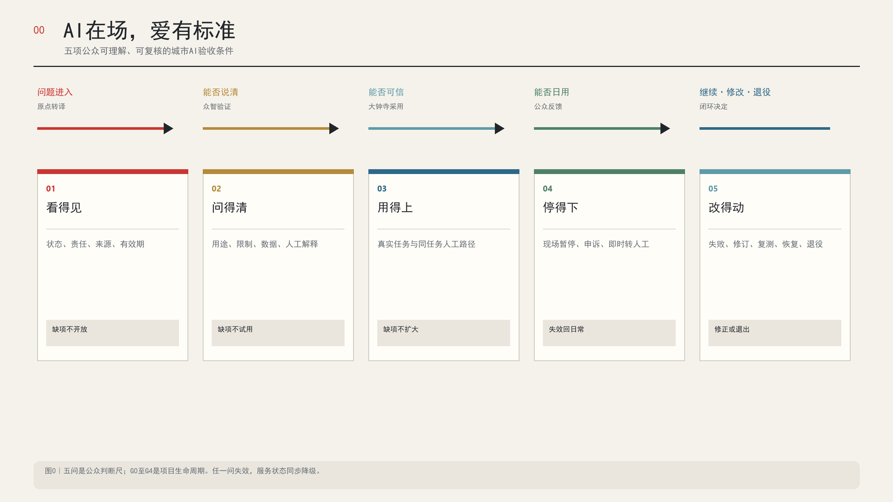

## 设计依据与资料清单

这条创新带已经有铁路遗存、公园、高校、科研机构、企业、社区和轨道站点。设计从这些正在运行的城市关系出发。官方公告给出约43.6平方公里统筹研究范围、约11.4平方公里总体设计范围和约368.4公顷重点区域范围，并要求同时处理产业生态、城市更新、交通市政、公共空间、文化风貌和三处重点区详细设计 [source:OFFICIAL-ANNOUNCEMENT] [standard:PROJECT-OFFICIAL-ANNOUNCEMENT]。

目前仓库没有可信的官方精确多边形。投稿沿用维护者提供的临时粗略边界，存储坐标采用EPSG:4326，面积与长度转入EPSG:4548复算。临时几何只服务于概念设计、图层裁剪和投稿校验，不能被称为官方红线。官方边界到位后，九类GeoJSON、全部指标、图件、网页和PDF须整体重算 [data:geometry/site_boundary.geojson#SITE-001] [source:BOUNDARY-SOURCE] [metric:site_area_sqm]。

资料按四级使用。公告、法规和主管部门资料支撑正式事实。高校校史与机构资料支撑历史和案例判断。部门新闻中的企业、客流和活动数字保留发布者口径。OSM只帮助识别现实地名与位置偏差，不进入边界、道路红线和法定面积计算。清华园车站的保护范围与建设控制地带已有官方文字，正式控制线图件仍待取得 [source:TSINGHUA-STATION-CONSERVATION] [data:geometry/constraints.geojson#CONSTRAINT-HERITAGE] [depth:existing_conditions_diagnosis]。

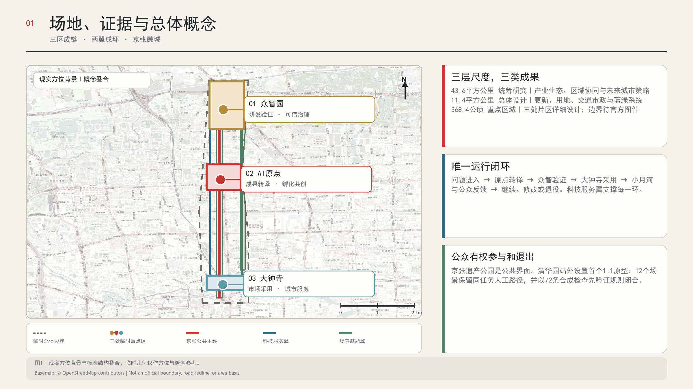

## 三层范围工作框架

三个工作层级各自作出一种判断。约43.6平方公里统筹研究范围处理区域产业与协作关系。约11.4平方公里总体设计范围处理更新结构、公共空间和基础系统。约368.4公顷三处重点区域处理能被专业团队继续深化的空间界面。仓库尚无三层官方精确多边形，因此统筹层不虚构边界，总体层和重点区层只使用维护者提供的临时几何。三层共用一套来源、假设、图层和指标 [depth:three_level_scope_framework] [data:geometry/key_areas.geojson#PROV-KEY-001]。

| 工作层级 | 核心判断 | 本方案的交付重点 |
| --- | --- | --- |
| 统筹研究范围约43.6平方公里 | 全球竞争取决于研发、服务、场景、人才与城市生活的协同 | 区域能力网络、七个案例、五类复测接口和年度国际活动 | 官方范围图件到位前不画精确边界 |
| 总体设计范围约11.4平方公里 | 京张遗产公园是公共主线，东西两翼提供跨区支撑 | 用地分区、慢行缝合、蓝绿系统、公共服务、更新项目和证据分期 | 临时总体边界只支持概念组织和低置信度复算 |
| 重点区域合计约368.4公顷 | 三区承担研发验证、转译共创和采用服务三个阶段 | 三处公共界面原型、日常测试恢复模式、地标和试点合同 | 临时重点区不支持地块、容量和建设结论 |

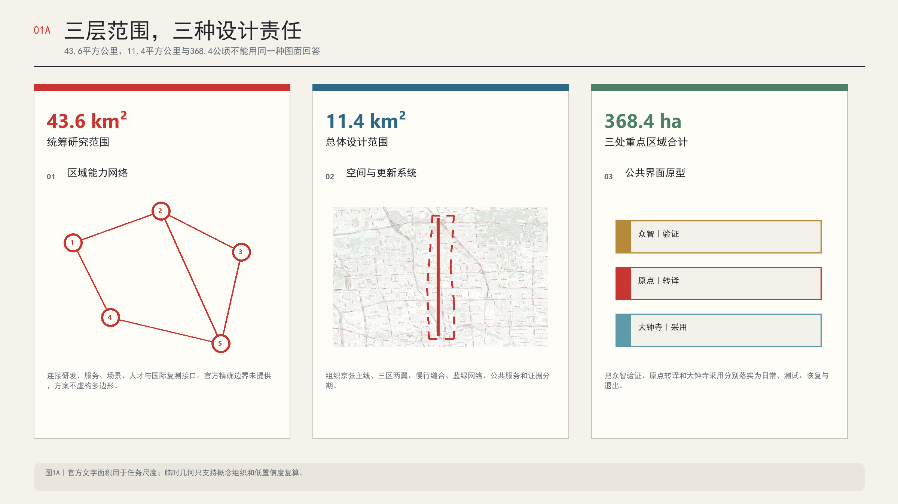

总体概念把过去和现在放在同一条线上。1909年通车的京张铁路证明中国人能够自主设计和建设一条现代铁路。今天的第二次出发，是以开放、可信和公众可参与的方式探索一条城市AI创新带。历史价值由保护和准确讲述来承担，现实价值由每天可进入、可提问、可验证的公共空间来承担 [source:TSINGHUA-STATION-HISTORY] [source:BEIJING-THREE-ZONES-20260403]。

## 统筹研究范围产业与未来城市研究

### 三区成链

三区按照AI成果从产生到采用的过程分工。众智园负责自主研发、可信验证和AI治理。AI原点社区负责成果转译、创业孵化和公众共创。大钟寺负责企业采用、城市服务和国际展示。公众需求可以从公园、社区和大钟寺进入原点社区，经众智园验证后回到城市和市场。失败的产品也能沿同一条链返回修改 [source:AGENT-TASKBOOK] [standard:PROJECT-AGENT-OPEN-CALL-TASKBOOK] [depth:overall_spatial_structure]。

### 两翼成环

两翼不再复制一个研发园或生活街区。中关村科技服务翼提供资本、知识产权、法律、标准、人才、算力与数据服务，服务对象横跨三区。小月河场景赋能翼承载真实测试、生态反馈、公众体验与蓝绿韧性，也把运行结果带回三区。三区是价值链阶段，两翼是共享能力，二者的关系因此清楚 [data:geometry/roads.geojson#ROAD-WING-W] [data:geometry/roads.geojson#ROAD-WING-E]。

### 京张融城

京张铁路遗址公园承担公共主线。它连接历史、工作、学习、休闲和活动日体验，也给创新链增加一条人人能进入的公共界面。部门报道把约九公里遗址公园称为创新联系，并记录了已开放的AI训练驿站、智能书屋、机器人和体育活动。方案在这些现有使用上继续工作，不把公园当作空白展厅 [source:BEIJING-JINGZHANG-20260330] [source:JINGZHANG-PARK-OPENING-20230202]。

### 七个全球案例

| 案例 | 可转化机制 | 京张应用 | 不能照搬的条件 |
| --- | --- | --- | --- |
| Kendall Square | 大学、城市与社区共同规划，科研空间和住房、零售、博物馆、开放空间同步组织 | 原点社区的校区、园区、街区接口与公共协商 | 土地权属、生命科学市场和开发融资不同 |
| Toronto MaRS与Vector | 创业服务平台和独立研究机构分工，研究成果有明确采用通道 | 原点转译服务与众智可信验证形成交接协议 | 加拿大公共资金、健康数据与机构治理不能直接移植 |
| Paris-Saclay | 概念验证、知识转移、用户反馈和社会影响构成成果转化门槛 | 给进入城市测试的项目设置证据门槛 | 区域尺度、校园土地和欧盟资金体系不同 |
| Singapore one-north与AI Verify | 受管理的产业社区配合成文的测试和治理工具 | 众智园建立测试档案、责任人、暂停与退出规则 | 新加坡单一土地机构模式与工具不等于中国认证 |
| London Knowledge Quarter与King's Cross | 以成员网络和共同活动连接铁路门户周边的知识机构 | 大钟寺和北京北站方向形成国际知识与文化活动接口 | 土地整合、遗产审批和更新收益结构不同 |
| Helsinki Kalasatama | 居民共测、限时试验、公开学习与城市导览结合 | 小月河翼建立公民科学和失败复盘机制 | 市政数据、人口尺度和采购制度不同 |
| 深港河套 | 两个园区保留各自制度，同时把科研、人才、服务和合规接口写清 | 三区之间使用服务清单和交接协议 | 海关、税制和跨境法律安排具有唯一性 |

这些案例只提供机制参照，不提供本地控制指标、政策优惠或认证结论 [source:CASE-KENDALL-SQUARE] [source:CASE-MARS-VECTOR] [source:CASE-HETAO]。

### 区域协同接口

统筹研究范围还要回答京张创新带怎样连接更大的创新网络。现阶段没有已确认的跨区合作协议，方案只提出五类可供后续协商的接口。各地之间不传递原始个人数据，只传递问题定义、测试协议、匿名结果、失败记录和复测要求。

| 建议接口 | 京张可提出的需求 | 可接回京张的成果 | 必须保留的边界 |
| --- | --- | --- | --- |
| 北纬社区 | 社区服务问题、使用障碍和公众反馈 | 不同社区条件下的复测意见 | 不虚构共同运营或居民授权 |
| 未来科学城 | 前沿技术的城市使用问题 | 专家复核方法和研发反馈 | 不把研究结论写成可部署产品 |
| 怀柔科学城 | 科学设施成果的城市转译需求 | 跨学科验证建议和测量方法 | 不触及非公开科研与设施数据 |
| 北京经开区 | 机器人和智能制造的真实工况问题 | 生产环境复测记录和安全要求 | 不虚构企业、订单或产线合作 |
| 京津冀城市网络 | 可跨城比较的公共服务问题 | 异地复测、差异说明和失败记录 | 不用单点结果替代跨城验证 |

这一接口把区域协同变成可复核的测试接力。一个方案在京张通过G3，也只能说明它在已披露条件下获得了复测支持。进入另一地区时必须重新登记场地、人群、基线和责任，不能沿用原结论 [source:AGENT-TASKBOOK] [metric:regional_collaboration_interface_count] [depth:overall_spatial_structure]。

### 品牌和识别

首次出现使用“AI在京张｜爱在京张”，把技术存在和公共关怀放在同一处。正式英文正文使用“Jing-Zhang”，Logo保留已经确认的品牌拼写“AI ALONG JINGZHANG”。主符号保持简洁，沿线导视再衍生透明底、单色、反白和中英组合版本。Logo不能取代地图、证据与空间图，只负责让市民知道自己进入了同一条公共创新带。

## 总体设计范围城市更新与控规深度城市设计

总体空间采用“一线、三区、两翼、三口、四标、五问”的组织方式。一线是京张遗产慢行主线。三区对应转译、验证和采用三段责任。两翼分别承载科技服务与场景反馈。三口处理重点区与两翼之间的东西向步行缝合。四标让问题、共创、验证和采用过程进入公共空间。五问成为所有场景的公共验收条件 [data:geometry/roads.geojson#ROAD-SPINE] [data:geometry/public_space.geojson#PUBLIC-QST] [data:geometry/public_space.geojson#PUBLIC-LIFE]。

更新方法从公共空间和运营协议开始。近期先做调查、临时导视、无障碍修补、开放日和受控测试，使用可撤回构件。建筑改造在权属、结构、消防、文保和控规资料齐备后推进。新增体量只以概念载体表达，没有地块级拆除或新建结论 [data:geometry/buildings.geojson#BLDG-ORIGIN] [depth:retain_renovate_demolish]。

临时用地分区完整覆盖提交边界，共享同一组切分线。中央带表达遗产公园和蓝绿公共空间，西侧表达跨区科技服务，东侧表达场景与生态反馈，南北段再按研发、转译、采用的主要关系组织。它是一张功能组织图，不能替代法定用地现状或控规图 [data:geometry/land_use.geojson#LU-SPINE-M] [metric:land_use_partition_coverage_ratio] [standard:MNR-LAND-USE-CLASSIFICATION-GUIDE]。

公共空间采用“日常模式和测试模式”两种状态。日常模式始终优先，保证通勤、休憩、办事和无障碍通行。测试模式只在护照、证据门、责任人、时间窗口和恢复方案齐备后短时叠加。测试结束后，场地、导视、数据和服务都要回到可核验的日常状态。

| 空间接口 | 日常模式 | 受控测试模式 | 必须恢复的内容 |
| --- | --- | --- | --- |
| 众智园公共边 | 参观前厅与正常园区通行 | 观察带与试验场分隔，安全员可实体停机 | 围合、设备、测试数据和通行秩序 |
| 原点社区与清华园站外 | 街区生活、历史参观和人工受理 | 可撤回提问装置、小型共创和结果说明 | 文物环境、安静时段和个人信息 |
| 大钟寺公共界面 | 普通商业、城市服务和非参与路线 | 分时产品体验、国际开放日和商业验证 | 人工服务、退款、容量和休息空间 |
| 京张主线与小月河翼 | 连续慢行、绿地休憩和人工观察 | 临时导览、低扰动传感和公众复测 | 通行连续、树木水体、设备与场地 |

空间双状态把规划图上的功能色块变成可以运行和复位的公共约定。任何测试阻断日常通行、无障碍路径、应急疏散或安静时段，都直接回到日常模式 [data:geometry/public_space.geojson#PUBLIC-TRUST] [data:geometry/public_space.geojson#PUBLIC-LIFE] [depth:blue_green_public_space]。

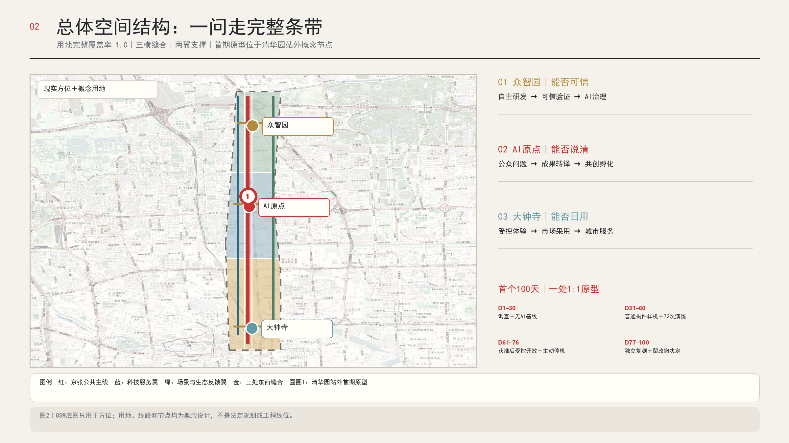

## 重点区域详细设计

### 众智园AI自主创新加速区

众智园回答“能否可信”。核心空间“众智可信验证场”采用四带剖面。公共观察带让访客看到测试对象、状态、责任人和结论等级。受控试验带容纳模型、机器人和城市智能体的小规模测试。人工接管带保留安全员、急停、设备检修和数据隔离。生态恢复带连接临清河方向，只承担低扰动观察与场地复位。公众可以观察，不能跨入危险测试边界 [data:geometry/key_areas.geojson#PROV-KEY-001] [data:geometry/public_space.geojson#PUBLIC-TRUST] [depth:three_key_area_detailed_design]。

日常模式维持园区通行、公共前厅和人工讲解。测试模式只开放预约观察边，试验核心保持围合。恢复模式逐项清点设备、数据、围挡、通行和生态扰动。任何实体急停失效、观察边越界或责任人离场都会结束测试。建筑优先利用可适应改造空间，结构、算力、能源和消防条件仍待专业核验。

### 北京AI原点社区

原点社区回答“能否说清”。空间原型从清华园车站外部公共界面向日常街区展开。第一层保持文物安静边与正常参观。第二层设置可撤回的城市提问前台。第三层容纳人工受理、小型共创和成果解释。第四层把已经答复的问题、失败记录和开源里程碑送回街区。原点开源里程碑庭只展示可核实贡献，不按企业规模和融资金额排名 [data:geometry/key_areas.geojson#PROV-KEY-002] [data:geometry/public_space.geojson#PUBLIC-MILESTONE]。

清华园车站位于这一创新生活圈附近，现实位置与正式范围关系仍待官方底图核定。车站站房保持低干预，展陈以既有历史内容为主。站外提问装置不固定在文物构件上，不采集无关身份。纸质问题卡、人工受理和公开状态牌与数字入口完成同一任务。问题由原点社区归类和共创，合适的项目送往众智园验证，成熟成果再到大钟寺和沿线公共服务中试用。这一分布式“城市提问站”让文物继续承担公共连接的意义 [source:TSINGHUA-STATION-HISTORY] [source:TSINGHUA-STATION-CONSERVATION] [data:geometry/public_space.geojson#PUBLIC-QST]。

### 大钟寺AI产业聚集区

大钟寺回答“能否进入日常”。全球AI生活展厅采用四段城市界面。到达段先显示普通通行、无障碍和非参与路线。服务段保留人工窗口、多语说明与安静休息。体验段只容纳预约、分时和明示的产品试用。恢复段处理客服、退款、投诉、设备撤除和场地复位。周边轨道、商业服务和大钟寺古钟博物馆等文化资源提供多类使用者相遇的条件，不能据此推导现成客流或换乘能力 [data:geometry/key_areas.geojson#PROV-KEY-003] [data:geometry/constraints.geojson#CONSTRAINT-DZS]。

大钟寺站四象限的步行联系先从过街时长、无障碍、电梯、自行车停放和夜间照明调查开始。全球活动不能截断居民通行，也不能要求路人参与试验。容量达到阈值、人工客服缺位或退款失败时，体验段停止，普通商业和城市服务继续。地下通道、连桥、道路拓宽和永久展馆均需在正式资料与专业评估后另行判断。

| 重点区 | 公共界面原型 | 日常模式 | 测试模式 | 恢复与退出 |
| --- | --- | --- | --- | --- |
| 众智园 | 观察边、受控核心、接管带、生态恢复边 | 正常通行与人工讲解 | 预约观察、围合测试、实体急停 | 清点设备和数据，恢复通行与场地 |
| AI原点 | 文物安静边、提问前台、共创界面、街区回传 | 历史参观、街区生活、人工受理 | 可撤回提问与小型共创 | 撤除装置，恢复安静，公开问题去向 |
| 大钟寺 | 到达、普通服务、分时体验、客服恢复 | 通行、商业、城市服务与休息 | 明示体验、国际开放日、商业验证 | 停止入场、人工客服、退款和撤场 |

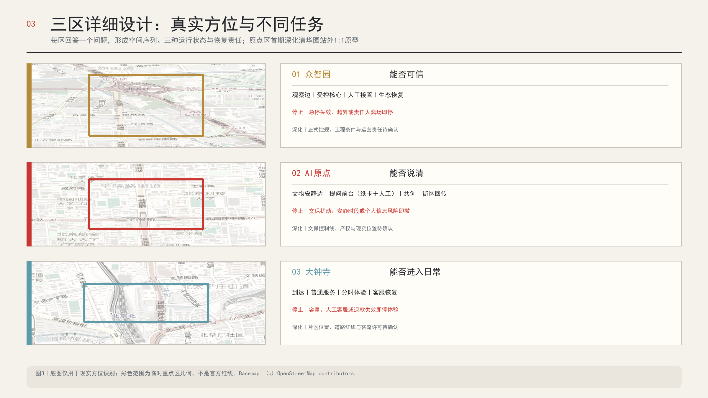

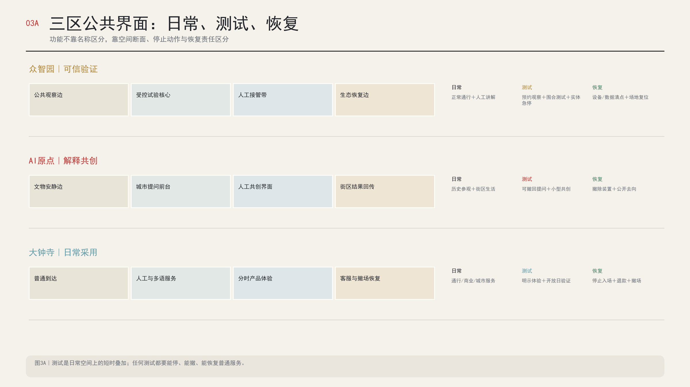

## AI 创新生态、人才画像与 AI+ 场景

### 八类人物画像

| 人物 | 日常任务 | 最需要的空间与服务 | 不能忽略的风险 |
| --- | --- | --- | --- |
| 学生与科研人员 | 上课、实验、交流、成果发布 | 校园到公园的慢行接口、夜间学习、成果转译入口 | 科研成果、校园数据和个人轨迹不得擅自采集 |
| 创业团队 | 找场地、算力、客户、资金和合规支持 | 一站式科技服务、短期路演、测试预约 | 小团队无力承担复杂合规和高额场地成本 |
| 企业采用方 | 比较产品、做采购前验证、接待国际伙伴 | 可复核测试报告、受控体验、商务与多语服务 | 演示结果不能冒充生产环境表现 |
| 社区居民 | 通勤、休闲、办事、照护与表达意见 | 低门槛公共服务、安静时段、人工窗口 | 公共空间不能被活动和商业展示长期占用 |
| 老年人与照护者 | 就医、缴费、出行和生活服务 | 清楚导视、坐席、纸质和人工替代 | 不强迫使用手机、刷脸或智能设备 |
| 残障人士 | 连续出行、信息获取和现场办事 | 无障碍路径、多模态信息、人工协助 | 无障碍不能停留在单个装置或一次活动 |
| 游客 | 了解铁路历史、城市创新和文化资源 | 历史导览、周末体验路线、预约开放日 | 导览不能虚构历史或把游客引入受控区域 |
| 国际人才 | 工作、居住、办事、社交和家庭生活 | 多语信息、国际活动、可信服务入口 | 翻译错误和制度差异需要人工复核 |

工作日以学生、科研人员、园区员工和周边居民的通勤与日常服务为主。周末增加历史文化游客、家庭和科技体验人群。这个判断来自场地功能和官方年度客流报道，尚未有分人群出行调查。方案把它作为运营假设，不把它写成人群占比 [source:BEIJING-JINGZHANG-20260330] [source:BEIJING-AI-ORIGIN-20260401] [metric:scenario_card_count]。

### 十二张场景卡

每个场景都要回答公共验收五问，并写清运营主体、最小数据、人工复核、KPI、失败模式和退出条件。数字服务保留人工或非智能替代。高风险测试使用预约、分区、实体停机和事后复盘。场景卡不能只证明功能存在，还要证明一名普通使用者能够完成任务、拒绝授权、找到真人、提出异议并离开。

| 编号 | 场景与主要位置 | 服务对象与公共价值 | 数据与人工边界 | 核心KPI与退出条件 |
| --- | --- | --- | --- | --- |
| 01 | 城市提问站，清华园站外概念节点 | 市民提出具体问题，看到受理、研究、验证和答复状态 | 允许匿名；人工筛除个人信息和不适合公开内容 | 有效回应率、复访率；文保或扰民问题即撤除 |
| 02 | 多语公共服务，大钟寺与活动门户 | 国际人才和游客获得办事与活动指引 | 只读公开信息；重要事项由双语人员复核 | 正确转介率；连续误导即下线 |
| 03 | 无障碍导航，京张慢行主线 | 残障人士、老年人和推车家庭获得可用路线 | 不保存个人轨迹；现场核验坡度、电梯和施工变化 | 有效路径率；现场条件不符立即标记停用 |
| 04 | AI学习街区，原点社区 | 学生、教师和居民参加公开课程与开发者协作 | 未成年人活动需监护和内容审核 | 完课与复用率；内容投诉触发暂停复核 |
| 05 | 健康资源导航，社区服务节点 | 居民找到合适的医疗和健康资源 | 不诊断、不保存病历；专业人员复核转介规则 | 正确转介率；任何诊疗替代倾向立即停止 |
| 06 | 历史导览，遗产公园与清华园站 | 游客理解铁路、学校与城市发展史 | 史实引用已登记来源；争议信息人工校订 | 纠错处理时间；史实错误未修复前下线 |
| 07 | 国际开放日，大钟寺与三区轮值 | 市民进入真实会场体验最新产品和研究 | 预约分时；商业演示与验证结论明确区分 | 公众参与和转化线索；超容量即停止入场 |
| 08 | 企业合规服务，中关村科技服务翼 | 创业团队获得法律、知识产权、标准和出海转介 | AI只做资料分流；专业意见由持证人员出具 | 首次转介时长；无合格人员时不提供结论 |
| 09 | 可信模型验证，众智园 | 模型进入真实应用前完成透明、偏差与安全测试 | 使用清权数据；独立复核和版本留档 | 测试覆盖与复现率；重大风险即拒绝进入下一阶段 |
| 10 | 机器人受控测试，众智园与小月河翼 | 企业验证低速机器人，公众了解安全边界 | 围合时段、现场安全员、实体急停、不做人脸识别 | 人工接管时间；越界或急停失效立即终止 |
| 11 | 智能商业验证，大钟寺 | 企业在真实但受控的消费场景验证产品 | 明示试验、最小化交易数据、人工客服与退款通道 | 自愿参与和问题关闭率；投诉累积触发退场 |
| 12 | 蓝绿公民科学，小月河翼 | 居民和学生共同观察热环境、雨水与生物 | 只记录环境信息；专业团队校验传感器和结论 | 数据有效率和维护率；设备漂移或生态扰动即撤除 |

十二个场景同时遵守“同任务等价”规则。拒绝使用AI、不同意非必要数据授权或没有智能设备的人，仍能完成同一项基本任务。复核时比较任务是否完成、所需时间、费用、无障碍条件、信息准确性和申诉入口。人工路径缺失、额外收费或长期不可用时，AI路径也不得继续开放。

| 场景 | 同任务人工或低技术路径 | 放行前必须证明的内容 |
| --- | --- | --- |
| 01与06 | 人工接待、纸质问题卡、固定展签和人工讲解 | 不用手机也能提问、纠错和完成历史参观 |
| 02与03 | 双语人员、人工窗口、可触读地图和人工带行 | 关键办事信息经过人工复核，路线经过现场核验 |
| 04与05 | 教师授课、现场辅导、电话转介和纸质目录 | 学习和资源转介不依赖账号、画像或病历采集 |
| 07与11 | 现场接待、普通参观路线、人工客服和退款 | 不参加试验仍能通行和获得正常服务 |
| 08与09 | 持证专业人员面谈、人工资料审查和基线测试 | AI不出具专业结论，测试结论能够独立复现 |
| 10与12 | 现场安全员、人工搬运、人工观察和专业复测 | 急停、接管、生态恢复和纸质记录均可用 |

三类产业测试验证场景是可信模型、机器人和智能商业验证。它们分别处理算法性能、物理安全和真实采用问题，不能共用一份笼统的测试规则 [data:geometry/public_space.geojson#SCN-09] [data:geometry/public_space.geojson#SCN-10] [metric:industry_validation_scenario_count]。十二个场景的同任务路径已经写入场景图层，后续可逐项核验 [metric:same_task_equivalence_scenario_count]。

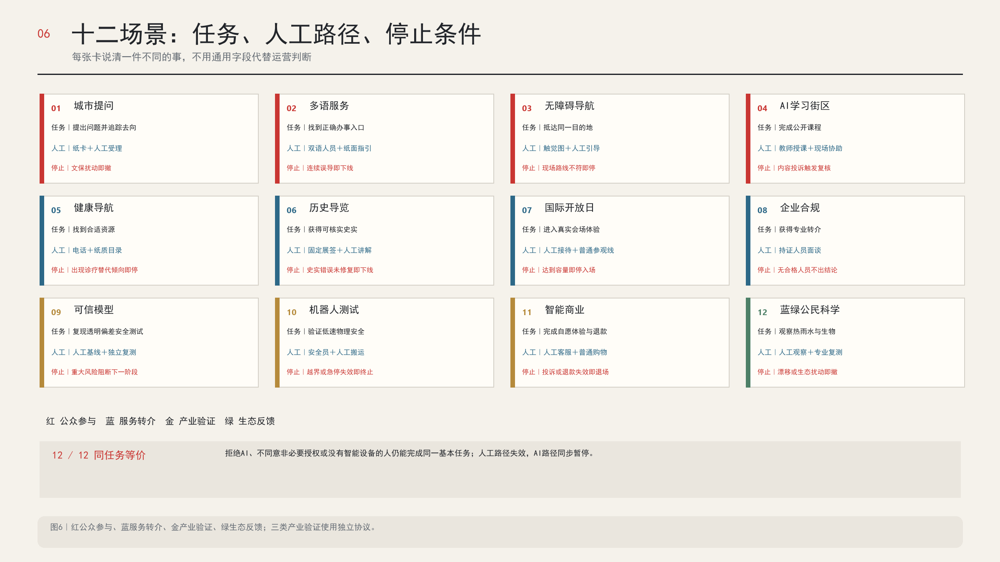

### 最小可复演单元

城市提问站提供一套可离线执行的公共验收桌面演练。`run_tabletop.js`只读取十二份方案场景合同，不联网、不处理个人信息。每个场景运行一条合格样例和五条失败分支，分别模拟责任人缺失、数据越过上限、人工路径失效、无法暂停和修订未公开，共形成72条合成检查与机器可读回执。当前运行结果为72/72符合预期，其中12条合格样例仅获“桌面演练放行”，60条负例全部拦截。任一负例被错误放行，整套演练即失败 [metric:simulation_task_count] [metric:synthetic_negative_branch_count]。

这套单元的意义在于让运营团队在搭建设备以前先复演权利和责任。代码、十二份合同、回执和任务台账位于 `visual/assets/public-acceptance-tabletop/` 与 `simulation.json`，任何审阅者都可离线重跑。当前状态固定为“尚未获准、尚未现场运行”。100%的合成分类正确率只证明规则实现闭合，不能证明服务有效、安全、合规或获得批准 [metric:simulation_success_rate] [depth:renewal_project_list]。

### 清华园城市提问站1:1站外原型

首期产品不是一块智能屏，而是一条可以不用AI完成任务、能够停机并恢复的五段公共空间。普通路径保证路人不参与也能通行。提问门槛提供独立式纸卡和状态说明。人工前台允许匿名提交与真人协助。公开回执板只显示问题编号、责任角色、证据门和下次复核。文物安静边保留无屏幕的历史参观。装置不接触文物本体，宽度、消防、承载和安装位置全部留待实测与专业审查 [metric:question_station_spatial_zone_count] [source:TSINGHUA-STATION-CONSERVATION]。

一次完整演示从“一问”开始，经过问题护照、人工基线、受控AI检查、公开回执，再主动执行一次断电、转人工、撤除构件和场地恢复。实体停机后，人工前台仍完成同一任务。只有正式文保控制线、权属同意、实测、文物影响、消防人流、无障碍、运营责任和恢复资金同时齐备，原型才可从桌面演练进入现场评审。结构化空间协议位于 `visual/assets/question-station-prototype.json`。

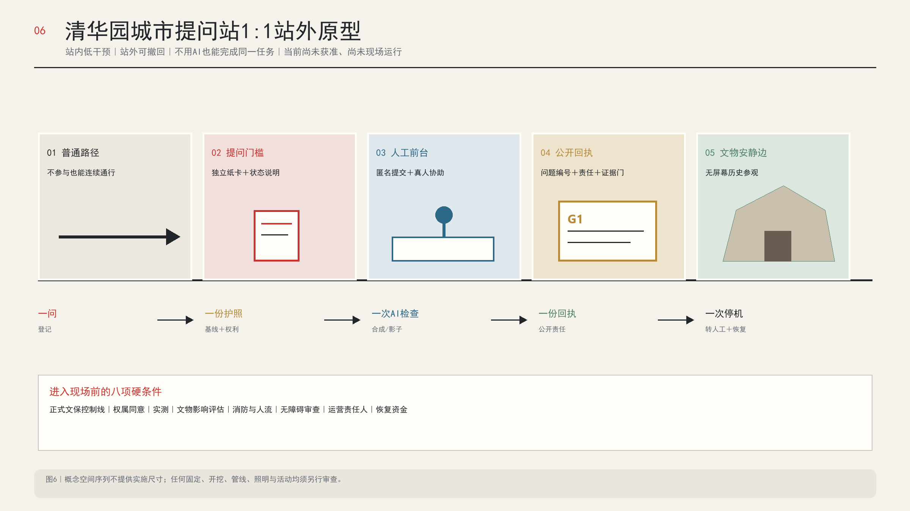

### 四个可深化地标

清华园城市提问站负责提出问题。原点开源里程碑庭记录共同创造。众智可信验证场公开验证过程。大钟寺全球AI生活展厅呈现真实采用。四处地标组成一条可步行的学习路线，也形成从公众需求到产品反馈的工作链 [metric:landmark_count] [data:geometry/public_space.geojson#PUBLIC-MILESTONE] [data:geometry/public_space.geojson#PUBLIC-TRUST]。

## 用地、建筑规模与拆改留方案

用地GeoJSON是一张完整的概念功能分区。九个分区共享边界，覆盖率为1.0。中央遗产与蓝绿带被切成三段，避免投影后长边和分段边产生微小拓扑误差。西翼和东翼按北中南三段配置科研、社区服务和商业服务的主要关系。所有分类都来自仓库允许的用地代码子集 [data:geometry/land_use.geojson#LU-SPINE-N] [data:geometry/land_use.geojson#LU-W-S] [metric:land_use_partition_area_sqm]。

建筑图层只表达四处概念功能载体，总基底约2.04万平方米，约占临时总体边界的0.18％。这个数值用于检验图面和项目接口，不是建设规模建议。现状建筑总量、建筑面积、容积率、密度、高度、结构和权属均待正式资料，所以总建筑面积与容积率保持未知 [metric:building_footprint_area_sqm] [metric:building_coverage_ratio] [metric:floor_area_ratio]。

拆改留采用调查后的四级判断。文物和依法保护对象进入保护类。结构与使用状况良好的建筑进入保留修缮类。空间可适配且符合安全条件的建筑进入更新利用类。只有权属、结构、消防、控规、公共利益和全生命周期评估都支持时，才讨论拆除或新建。当前GeoJSON中的四个载体全部标记为“待调查”，没有任何拆除结论 [standard:MOHURD-CONTROL-DETAILED-PLANNING] [depth:development_intensity_controls] [depth:height_massing_character]。

## 交通、轨道、市政与公共服务设施

交通设计先解决日常可走、可骑、可换乘的问题。京张主线提供南北连续联系，三处东西缝合口连接重点区和两翼。中关村科技服务翼与小月河场景赋能翼使用概念联系线表达协作方向，不被解释为新道路。全部概念线总长约30.31公里，未包含道路宽度和红线面积 [data:geometry/roads.geojson#ROAD-STITCH-M] [metric:concept_mobility_link_length_m] [metric:road_area_sqm]。

轨道站点周边先做步行链调查。调查内容包括出入口、电梯、过街等待、非机动车停放、夜间照明、雨雪条件和活动日拥堵。五道口、清华东路西口与大钟寺等站名来自公告任务和背景资料，正式一体化范围须由交通与规划部门确认。方案不预设连桥、隧道、道路拓宽和停车规模 [depth:traffic_rail_slow_parking] [data:geometry/constraints.geojson#CONSTRAINT-MOBILITY]。

市政与新型基础设施采用“小规模试点、独立计量、可断开”的原则。端侧算力、环境传感、机器人充电和临时活动用电先完成容量、安全、网络和维护评估。公共服务设施保留人工窗口、纸质信息、电话和现场志愿者。无障碍环境建设法第三十九条的人工办理要求只用于该条列明的公共服务场所，方案不会把它扩写为所有公共空间的法定义务 [source:BARRIER-FREE-LAW] [source:ELDERLY-SMART-TECH-2020] [depth:municipal_new_infrastructure]。

## 蓝绿空间、公共空间与城市风貌

蓝绿系统由京张遗产慢行脊和小月河生态反馈试验带构成。前者承载连续步行、休憩、导览和低强度公共活动。后者承载热环境、雨水和生物观察，帮助城市项目形成真实反馈。临时图层派生绿地约218.89万平方米，占临时边界约19.18％。该比例是概念几何结果，缺少现状绿地、树木、水文和正式规划条件，不能当作绿地率控制值 [data:geometry/green_space.geojson#GREEN-SPINE] [metric:green_ratio] [depth:blue_green_public_space]。

公共空间遵循四条规则。日常通行优先于活动布场。低技术替代和人工服务始终可用。试验装置能够撤回并留下恢复责任。公园与社区保留安静时段。四个地标的概念面积合计约2.10万平方米，只用于空间接口测试，不能据此征地或施工 [metric:public_space_area_sqm] [metric:public_space_ratio]。

风貌不复制蒸汽火车符号，也不把整条街变成屏幕。铁路历史通过保留材料、准确文字、尺度和行走顺序呈现。AI通过开放工作过程、可读的运行状态和简洁导视出现。绿地、建筑和临时装置保持低饱和蓝绿与深灰底色，活动色只用于提示参与、风险和停用状态。清华园车站本体服从文保要求，站外装置不遮挡历史界面，不依附文物构件 [standard:MOHURD-URBAN-DESIGN-MEASURES] [data:geometry/constraints.geojson#CONSTRAINT-HERITAGE]。

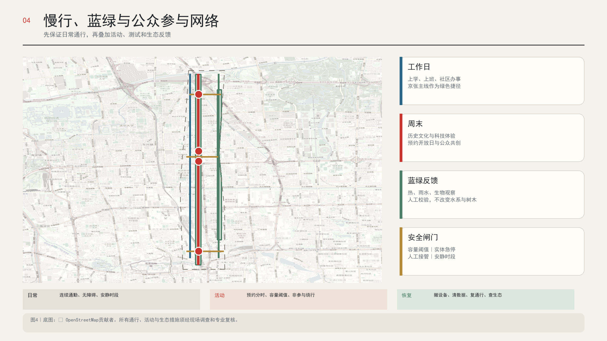

## 更新项目清单、实施政策与分期计划

项目推进服从证据门，不因到达某个年份自动升级。G0只确认问题值得受理。G1要求基线、权利、责任和非AI路径齐备。G2允许小规模受控试点。G3要求独立复测、公众复盘和恢复检查。G4才决定继续、修改或退役。任何一门未通过，项目停在原状态并公开原因。

| 证据门 | 本阶段重点回答 | 最少证据 | 人类决定 | 未通过的处理 |
| --- | --- | --- | --- | --- |
| G0问题登记 | 看得见 | 地点、受影响人群、现行做法和问题来源 | 是否值得进入转译 | 记录后关闭或补充材料 |
| G1基线与权利 | 问得清 | 非AI基线、数据上限、产权许可、责任角色和恢复资金 | 是否允许形成试点方案 | 不占用场地，不采集数据 |
| G2受控试点 | 用得上 | 安全审查、同任务路径、容量、告知、申诉和结束日期 | 是否允许短时开放 | 保持日常模式 |
| G3独立复测 | 停得下 | 原始与失败记录、人工接管、受影响人群意见和场地恢复 | 是否支持扩大或修改 | 修正后重测或退出 |
| G4继续或退役 | 改得动 | 复测结论、持续预算、责任续期、来源有效性和年度公开说明 | 继续、缩小、修改或退役 | 撤除服务并完成数据与场地恢复 |

| 项目 | 下一道证据门 | 近期动作 | 放行证据 | 建议责任组合 |
| --- | --- | --- | --- | --- |
| 基线调查与开放数据室 | G0至G1 | 完成边界、建筑、客流、无障碍、生态和设施调查目录 | 数据权属、发布许可、版本和失效日期 | 组织方、规划团队、专业调查机构 |
| 清华园城市提问站 | G1 | 文保审查、站外可撤回原型、小规模共创 | 正式文保控制线、产权、运营许可和恢复方案 | 文保单位、属地、原点社区、公众代表 |
| 三处东西缝合口 | G1 | 步行审计、照明和导视原型 | 道路红线、分时交通量、无障碍和安全审查 | 交通、街道、园区和社区 |
| 众智可信验证场 | G1至G2 | 发布测试章程和预约制小型演示 | 责任主体、保险、清权数据、急停和独立复测方案 | 众智园、独立评测方、监管咨询 |
| 原点开源里程碑庭 | G1至G2 | 贡献登记、公开路演和成果转译服务 | 署名、知识产权、社区审核和撤除规则 | 原点社区、高校、开源组织 |
| 大钟寺全球AI生活展厅 | G1 | 国际开放日和短期产品体验 | 位置校准、场地、消防、容量、退款和人工服务 | 属地、企业、文化与会展运营方 |
| 小月河蓝绿公民科学 | G1至G2 | 便携传感器和人工观察 | 水文、树木、生态基线、维护和专业复测 | 生态专业团队、学校、社区 |
| 中关村综合科技服务站 | G1 | 企业服务目录和专业转介 | 持证人员、责任边界、服务费用和申诉入口 | 科技服务机构、法律与知识产权机构 |
| 一路有AI双语导视 | G1至G2 | 小范围临时导视和无障碍校验 | 术语、文保、交通、市容和多类用户测试 | 品牌、无障碍与运营团队 |
| 年度开放活动系统 | G2至G3 | 轮值开放日、开发者周和公众复盘会 | 预算、安保、容量、投诉、复盘和场地恢复 | 三区两翼联合运营机构 |

近期阶段从2026至2028年的概念顺序开始，重点完成数据、协议、可撤回公共空间和小型场景。中期北段推进研发验证、蓝绿联系与原点转译网络。中长期南段在位置和交通条件核准后推进城市服务与国际展示。年份只表示工作顺序，证据门决定能否前进。实际启动仍由审批、资金、权属、专业评估和公众协商共同决定 [data:geometry/phasing.geojson#PHASE-1] [metric:phasing_total_area_sqm] [depth:phasing_implementation]。

首个100天把首期工作压缩成可检查的八步。D1—14完成公开资料与调查协议。D15—30建立公众任务和无AI基线。D31—45只用普通可撤回构件搭建站外1:1样机。D46—60运行72条合成检查和影子流程。D61—75只有通过G2并取得许可才小规模开放。D76主动演练停机、转人工与恢复。D77—90由独立方复测并公开失败。D91—100作出继续、修改或撤除决定。日期安排工作顺序，不能越过G0至G4；任一道门失败，场地保持或恢复日常模式 [metric:first_100_days_action_count]。

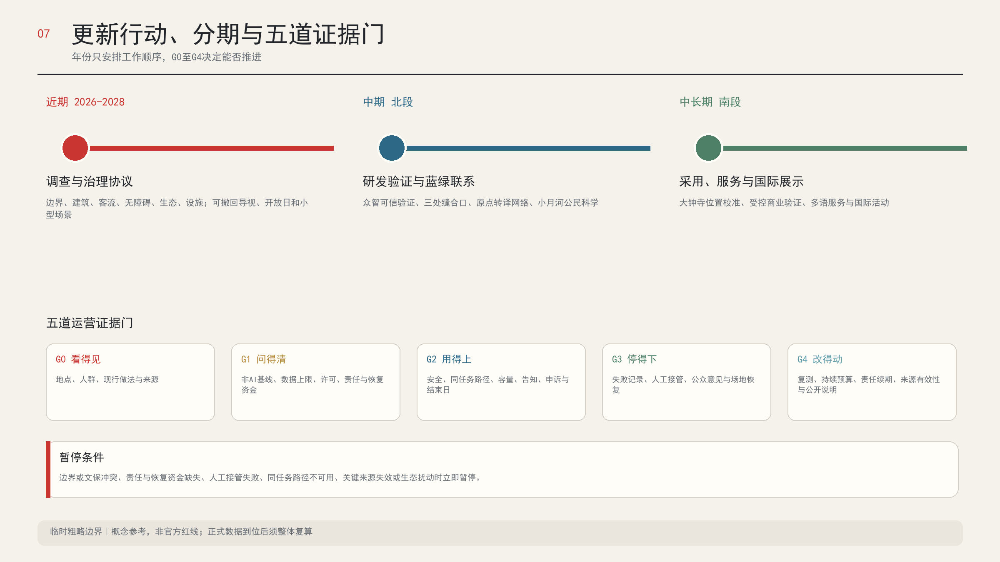

运营采用“一个秘书处、三个片区站、两个专业翼、一个公众委员会”。秘书处维护日历、数据台账、品牌和年度报告。三个片区站负责项目交接。两翼提供专业服务与场景反馈。公众委员会参与高影响场景审议和投诉复盘。每个试点有唯一责任人、预算、恢复保证和结束日期，延期须重新审查。

年度活动包括春季“城市问题季”、夏季“受控测试月”、秋季“全球AI开放周”和冬季“失败与改进年会”。开发者社区每月轮值举行开源维护、标准讨论和公众讲解。企业从开放日进入需求登记，经原点转译、众智验证和大钟寺采用后，结果回到小月河与社区反馈。招商数量不作为唯一目标，公开问题解决率、复现率、人工接管表现和公众信任同样进入年度评价 [source:CASE-KALASATAMA] [source:CASE-ONE-NORTH-AIVERIFY]。

## 指标体系、面积复算与合规矩阵

| 指标 | 当前值 | 置信度与用途 |
| --- | --- | --- |
| 公告统筹研究范围 | 43,600,000平方米 | 官方文字口径，可说明任务尺度 |
| 公告总体设计范围 | 11,400,000平方米 | 官方文字口径，不对应精确多边形 |
| 公告重点区合计 | 3,684,000平方米 | 官方文字口径，三处边界待正式图件 |
| 临时总体边界派生面积 | 11,412,825.386平方米 | 低置信度，只用于临时复算 |
| 用地分区覆盖率 | 1.0 | 拓扑校验值，表示完整无缝覆盖 |
| 概念绿地面积与比例 | 2,188,890.931平方米，19.1792％ | 低置信度，不是法定绿地率 |
| 概念公共空间面积与比例 | 20,990.464平方米，0.1839％ | 低置信度，只计四个地标概念面 |
| 概念建筑基底与覆盖比例 | 20,395.396平方米，0.1787％ | 低置信度，不代表建设规模 |
| 概念联系线总长 | 30,305.183米 | 低置信度，无道路宽度与红线含义 |
| 场景、产业验证与地标 | 12个、3个、4个 | 方案内容计数，可由图层复核 |
| 城市问题护照必填内容 | 11项 | 方案规则计数，缺项不得进入对应证据门 |
| 运营证据门 | 5道 | G0至G4，年份不能替代放行判断 |
| 同任务等价覆盖 | 12个场景 | 每个场景均登记人工或低技术路径 |
| 公共验收条件 | 5项 | 看得见、问得清、用得上、停得下、改得动 |
| 重点区公共界面原型 | 3类 | 众智验证、原点转译和大钟寺采用各有独立剖面 |
| 离线负例演练 | 5类 | 合成样例，当前未获准且未现场运行 |
| 区域协同建议接口 | 5类 | 只表达待协商接口，不代表已建立合作 |

面积复算使用同一组GeoJSON。已知指标包含状态、数值、单位、来源文件、公式、置信度和假设。容积率、总建筑面积、道路面积、法定绿地率与建筑高度继续保持未知。官方边界发布后先替换约束，再重建分区和指标，不能只把面积改成公告数字 [metric:official_overall_design_area_sqm] [metric:total_floor_area_sqm] [depth:metrics_recalculation]。

合规矩阵逐项覆盖公告1.3、1.4、1.5和agent.1至agent.6。专业标准矩阵对应项目公告、任务书、城市设计管理、控规编制、用地分类与建筑设计深度。设计深度矩阵把现状诊断、结构、用地、强度、拆改留、交通、市政、蓝绿、重点区、项目、分期、指标和风险连接到正文、图层、图纸与自检。正文只保留与判断直接相关的证据，完整索引留在结构化文件 [standard:PROJECT-OFFICIAL-ANNOUNCEMENT] [depth:renewal_project_list] [depth:risk_missing_data]。

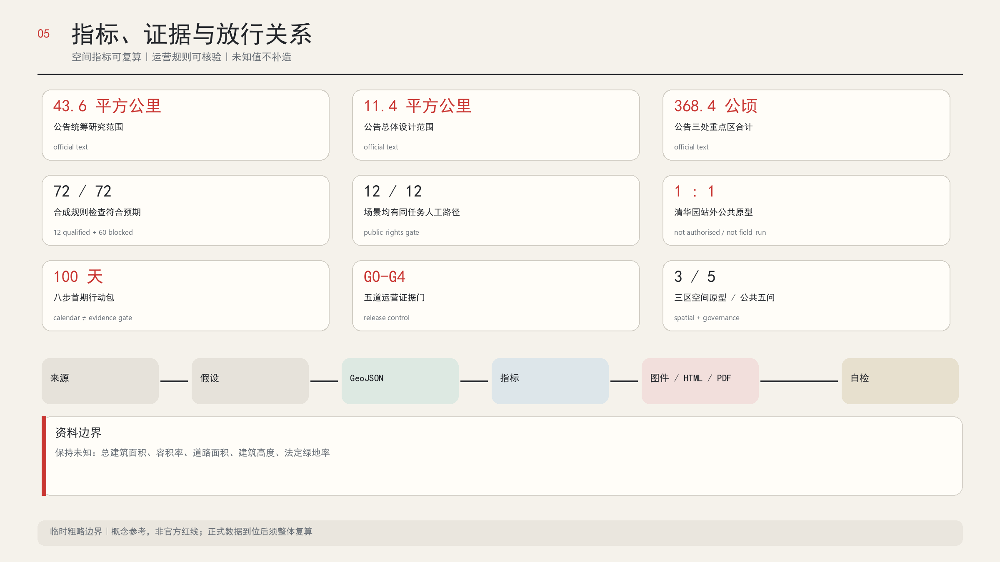

## 风险、版权与合规说明

最大的空间风险是临时边界与现实地名存在偏差。大钟寺重点区和遗址公园关系已明确标记。官方边界到位前，方案不作地块归属、拆迁、建设规模、道路工程和投资测算结论 [data:geometry/constraints.geojson#CONSTRAINT-DZS] [source:OSM-CONTEXT-20260809]。

文保风险集中在清华园车站。任何固定、开挖、管线、照明、标识和活动安排都需要文保、产权和安全审查。站内以保护和既有历史展陈为主，站外原型可撤回。这个原则不能代替文物影响评估和正式许可 [source:TSINGHUA-STATION-CONSERVATION] [data:geometry/constraints.geojson#CONSTRAINT-HERITAGE]。

AI场景执行数据最小化、目的限定、公开告知、人工复核、投诉、暂停和退出。生成式AI管理办法只适用于其第二条所界定的境内公众生成式AI服务，方案不把第十四条写成一般退出权，也不虚构投诉时限。模型、机器人和商业验证分别使用独立协议 [source:GENERATIVE-AI-MEASURES] [metric:industry_validation_scenario_count]。

公平风险通过人工服务、纸质信息、多模态导视、无障碍连续性和预约替代来降低。适老政策中2020至2022年的阶段目标已经过去，本方案只借用传统服务与智能服务并行的设计原则，不把它写成2026年的本地实施事实 [source:ELDERLY-SMART-TECH-2020] [source:BARRIER-FREE-LAW]。

证据也会失效。官方边界、法规、运营信息和动态报道在每次进入新证据门前复核，长期运行阶段至少随年度公开说明复核一次。来源被撤回、适用范围改变或出现更新版本时，依赖它的主张、指标、图件和场景状态同步降级。没有完成复核的内容可以保留为历史记录，不能继续支持扩大试点 [source:SOURCE-REGISTRY] [depth:risk_missing_data]。

全部正文、结构化数据、概念几何和设计叠加由本项目生成。总览图使用带可见署名的OpenStreetMap标准底图快照作为现实方位背景；它不参与边界、道路红线或面积计算。第三方网页图片、商标素材和受限字体不进入投稿。Logo来自用户明确委托并确认的AI生成资产，正式包只纳入规范化派生版本。详细权利说明见 `report/copyright_statement.md`。

## 参考资料

完整来源台账位于 `sources.json`。关键资料包括官方征集公告、智能体任务书、北京市科委“三区两翼”报道、北京市政府京张与AI原点报道、清华大学校史馆清华园车站史料、北京市文物局保护范围说明、城市设计与控规专业标准、无障碍和AI治理文件，以及七个国际案例的原始机构页面。每项记录均含用途、限制、访问日期与不可用于的结论 [source:SOURCE-REGISTRY] [source:SITE-PACKAGE]。

来源台账也决定图面能画到什么程度。官方文字面积用于说明任务尺度，临时GeoJSON用于裁剪和低置信度复算，OSM标准底图快照只用于现实方位背景与发现位置冲突，并在图内署名；国际案例只提供组织机制。网页图片和第三方商标没有进入成果。任何资料的权限或适用范围发生变化时，相应主张、图层、指标与图件须同步撤回或改写。

目前最重要的待补资料包括官方精确边界、重点区多边形、控规与权属、建筑与交通调查、文保控制线图件、市政容量和蓝绿本底。专业团队取得这些资料后，应沿 `sources.json`、`assumptions.json`、`spatial.json` 和 `metrics.json` 的记录逐项复核，保留原始版本与计算日志，形成可以追溯的替换记录 [depth:risk_missing_data] [metric:site_area_sqm]。
