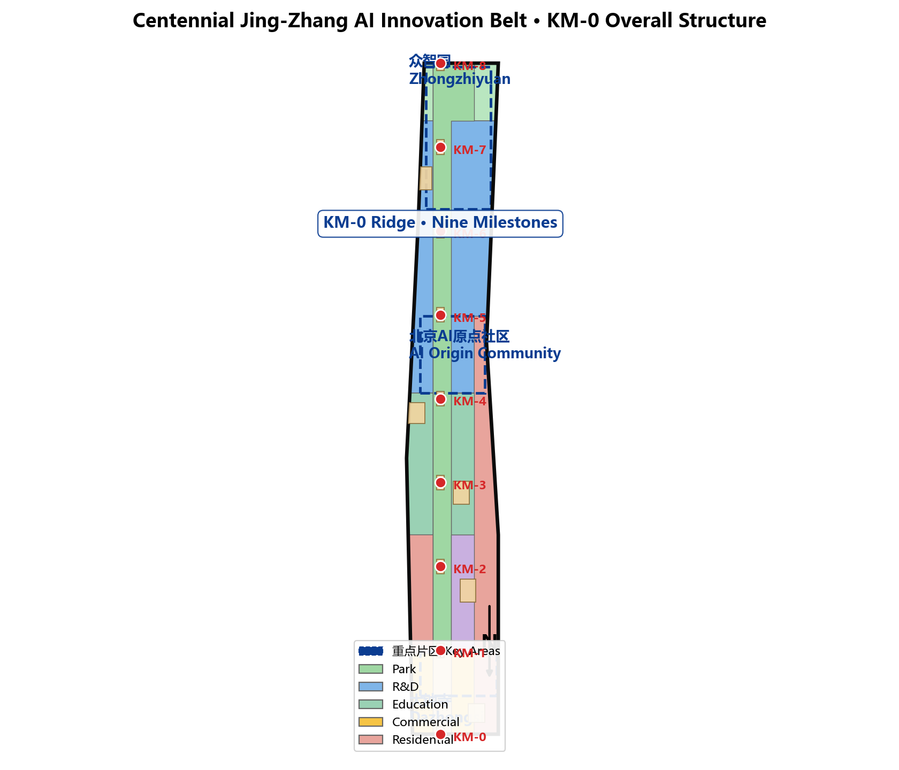
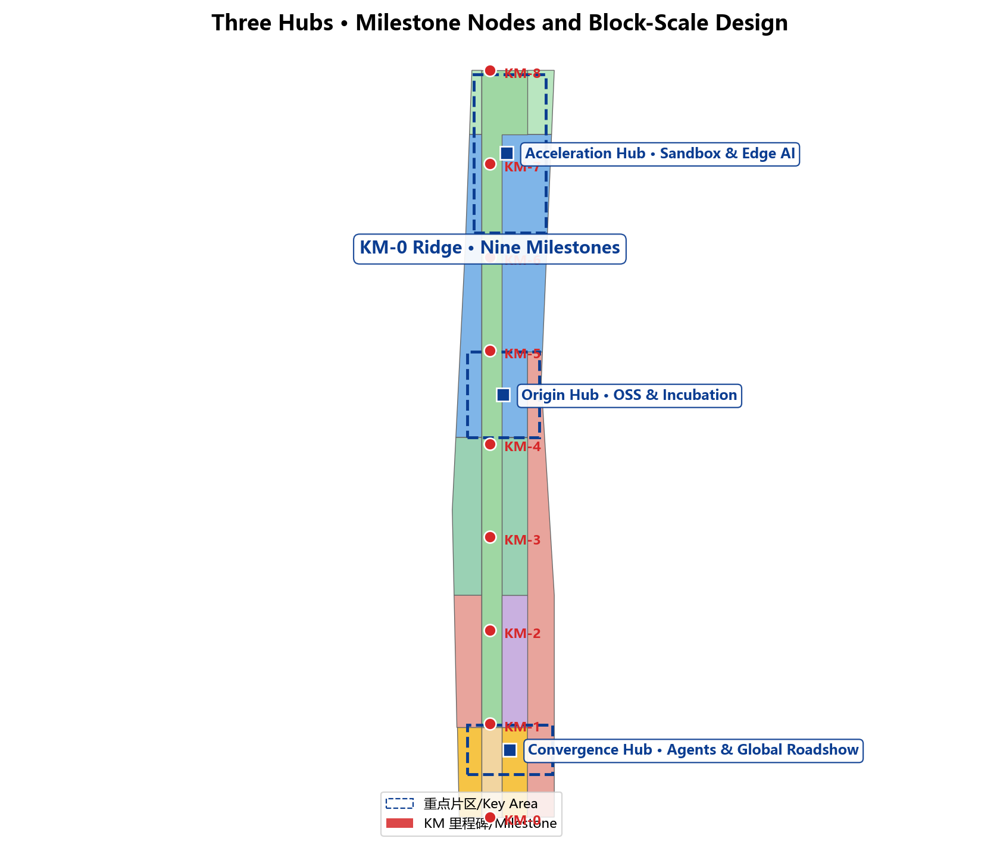
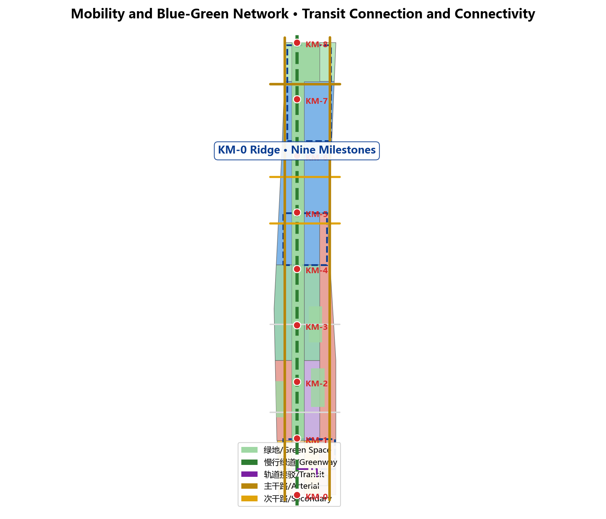
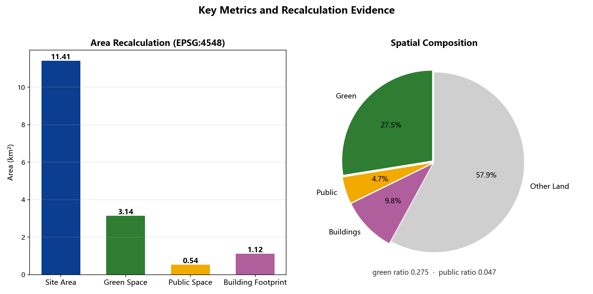

# Jing-Zhang Kilometer Zero (KM-0): A Public Measuring System from Railway Milestones to a Global AI Innovation Belt

## Design Basis and Source List

This proposal takes the Notice of Prequalification for the International Open Call on Urban Design of the Centennial Jing-Zhang AI Innovation Belt, issued by the Haidian Branch of the Beijing Municipal Commission of Planning and Natural Resources, as its primary basis [source:OFFICIAL-ANNOUNCEMENT] [standard:PROJECT-OFFICIAL-ANNOUNCEMENT]. The agent read `design_brief.json`, `allowed_design_space.json`, `enums/`, `ranges/planning_limits.json`, `schemas/`, `data/source_registry.json` and `data/processed/agent_fact_pack.md` before generation, and built the task, scope, source-use and gap checklists from `project_scope_summary.csv`, `agent_task_requirements.csv`, `source_use_matrix.csv` and `missing_data_checklist.csv` [source:AGENT-TASKBOOK] [source:PROCESSED-FACT-PACK]. Every design judgment is decomposed into traceable sources, verifiable metrics, checkable layers and humanly reviewable assumptions; the complete machine-readable index lives in `sources.json`, `metrics.json`, `compliance_matrix.json`, `standard_matrix.json` and `design_depth_matrix.json`.

Until official `SITE_BOUNDARY` or `KEY_AREA` polygons are published, this package uses the provisional boundaries in `brief/site-package/geometry/provisional_boundaries.geojson` [source:SITE-PACKAGE]. The submitted `geometry/site_boundary.geojson` and `geometry/key_areas.geojson` are both marked `provisional_constraint` with `official_boundary=false`; they serve design generation, self-check, visualization and discussion only and must not be used as official redlines, approval bases, precise-area bases, or statutory control conclusions [data:geometry/site_boundary.geojson#SITE-001] [metric:site_area_sqm]. This organizer-side data gap does not block content scoring; once official boundaries are released, site boundary, key areas, land use, roads, green space, public space, buildings, phasing and metrics must all be recomputed as a whole.

Source-usage boundaries are registered as follows [source:SOURCE-REGISTRY]: `data/source_registry.json` records permitted usage for public, cleared and provisional materials in three classes; the agent must not upgrade background_only or provisional_only material into official boundaries, statutory controls, formal scoring bases, or government implementation commitments. `data/processed/agent_fact_pack.md` navigates the evidence chain, three-level scope tasks and data gaps; readers can follow from the narrative into evidence without first reading machine indices.

## Three-Level Scope Framework

The proposal follows the three levels announced in the open call: the coordinated research area covers AI industry ecology, strategic positioning, the innovation chain and future urban form across 43.6 square kilometers; the overall design area covers 11.4 square kilometers of urban and industrial districts within 1-2 km around the Jing-Zhang heritage park, requiring an urban renewal framework, industrial space layout, transport/municipal support and urban character control; the key-area scope covers 368.4 hectares of three detailed-design districts requiring function, building scale, retain-renovate-demolish classification, public-space connectivity and transport organization [depth:three_level_scope_framework]. Every mandatory task under announcement clauses 1.3, 1.4, 1.5 and agent tasks 1-6 maps to chapters, layers, metrics, drawings, HTML and evidence in `compliance_matrix.json` [standard:PROJECT-AGENT-OPEN-CALL-TASKBOOK].

| Level | Design question | Proposal answer | Data anchor |
| --- | --- | --- | --- |
| Coordinated research | How to organize AI ecology and future urban form | "Railway mile → innovation mile" narrative and a university-OSS-enterprise-public-international innovation chain | compliance_matrix.json, standard_matrix.json |
| Overall design | How to place industry, renewal, transport and character | One ridge, nine milestones, three hubs, two wings realized in all design layers | [data:geometry/land_use.geojson#LU-001], [data:geometry/roads.geojson#ROAD-001] |
| Key areas | How to reach detailed-design depth | Zhongzhiyuan, AI Origin Community and Dazhongsi as acceleration, origin and convergence hubs | [data:geometry/key_areas.geojson#PROV-KEY-001] [data:geometry/public_space.geojson#PUBLIC-001] |

The three levels are not separate drawing sets: the coordinated study decides industry and urban form; the overall design translates decisions into renewal projects, spatial structure and facility capacity; the key areas verify feasibility of plots, buildings, transport, public space and AI application scenarios. The agent locks the adopted provisional boundary and constraints first, generates the design layers from it, then recalculates metrics from layers and explains in the narrative which conclusions remain provisional-limited [depth:overall_spatial_structure]. Any area, ratio, scale or count that cannot be recomputed from structured data must not be stated as a formal conclusion.

## Coordinated Research Area: Industry and Future City Research

The coordinated research area must build a world-class AI innovation ecosystem spanning universities and institutes, leading enterprises, computing-power/algorithms/data elements, incubators, listed companies, unicorns and tech services [source:AGENT-TASKBOOK]. This proposal introduces the naming system **"Jing-Zhang Kilometer Zero (KM-0)"**: the Jing-Zhang Railway was the first trunk line designed and built independently by China, and its milestones began measuring the country from the West Zhimen zero mark; a century later, the innovation belt translates the same measuring logic into a public scale of the AI era — KM-0 as the narrative origin, with nine milestone nodes along the Jing-Zhang heritage park so that innovation achievements become "marked, measured and seen" like rail mileage.

The five major functions and the "three districts-two wings" coordination are realized as follows [standard:PROJECT-AGENT-OPEN-CALL-TASKBOOK]: **one ridge** is the Jing-Zhang heritage park activity belt carrying history, public space and AI experience; **nine milestones** are KM-0 to KM-8, each with an AI scenario or public-space theme; **three hubs** correspond to Zhongzhiyuan (acceleration), Beijing AI Origin Community (origin) and Dazhongsi (convergence); **two wings** are the west wing (Zhongguancun tech services and university origins) and the east wing (scenario enablement and industry services). The logo direction combines a zero with a milestone stele: a ring cut by a rail cross-section, symbolizing the starting point of kilometer zero and an open cycle [data:geometry/public_space.geojson#PUBLIC-KM-00] [depth:overall_spatial_structure].

Future-city research answers how AI changes work, life, socializing, learning, transport and public services [depth:future_city_mobility_and_services]. The proposal fixes AI transport, continuous green space, innovation service facilities and an international living-working atmosphere into locatable zones, nodes, corridors and scenarios: AI slow-traffic navigation covers the whole park ridge [metric:public_space_ratio], open testing concentrates in Zhongzhiyuan [data:geometry/land_use.geojson#LU-001], OSS collaboration and launch events concentrate in the Origin Community, and agent showcases and international roadshows concentrate in Dazhongsi [data:geometry/key_areas.geojson#PROV-KEY-003]. Industrial strategy indicators, an AI innovation index, talent density and space-supply types are recorded as official, design-suggested or to-be-calibrated. All globalization narratives (annual AI activity week, developer community, pilgrimage route) are framed as conceptual suggestions or reference options for professional deepening, never as fixed government events or implementation arrangements.

## Overall Design Area: Urban Renewal and Regulatory-Plan-Level Urban Design

The overall design area requires regulatory-plan-level urban design depth [standard:MOHURD-CONTROL-DETAILED-PLANNING]. The proposal establishes the "one ridge, nine milestones, three hubs, two wings" structure expressed through the full layer set: `land_use.geojson` fully covers the provisional boundary without gaps or overlaps, mixing commercial, R&D, education, cultural, residential, park, plaza and buffer-green uses [depth:land_use_layout]; `buildings.geojson` expresses 102 renewed and retained building footprints of about 1.119 million square meters [metric:building_footprint_area_sqm]; `roads.geojson` expresses the slow-traffic spine, arterial, secondary, branch roads and transit connections [data:geometry/roads.geojson#ROAD-001]; `public_space.geojson` and `green_space.geojson` express nine milestone plazas, station forecourts, community living rooms and 3.143 million square meters of blue-green space [data:geometry/green_space.geojson#GREEN-001] [metric:green_ratio].

Regulatory-depth content is auditably decomposed: land-use structure [data:geometry/land_use.geojson#LU-001], building footprints [data:geometry/buildings.geojson#BLDG-001], transport organization [data:geometry/roads.geojson#ROAD-001], phasing [data:geometry/phasing.geojson#PHASE-001]. The renewal strategy starts from inefficient-space identification: stock buildings along the rail corridor and blocks adjacent to the park follow a four-class retain-shape-rebuild-new logic [depth:retain_renovate_demolish]. Height, intensity, road redline, setback and facility standards are written as "pending official control conditions" wherever no statutory conditions exist, never as agent-invented approved values; the floor-area ratio is explicitly `unknown` in `metrics.json` [depth:development_intensity_controls].

New infrastructure is placed as follows: edge-computing stations along the two wings, innovation service platforms at the three hubs' public spaces, distributed energy and low-carbon computing experiences at the Qinghe waterfront and rooftop systems. Station-city integration centers on Dazhongsi and Wudaokou stations; bicycle parking, parking supply and slow-traffic connections organize around four-quadrant pedestrian connectivity at intersections. Utility lines, energy, drainage, flood control and fire conditions are listed as formal deepening preconditions [depth:municipal_new_infrastructure].

## Detailed Design of Key Areas

Three key areas are mandatory; this proposal deepens them as "three hubs" to comprehensive-implementation-plan depth with dedicated layers [data:geometry/key_areas.geojson#PROV-KEY-001] [data:geometry/key_areas.geojson#PROV-KEY-002] [data:geometry/key_areas.geojson#PROV-KEY-003] [depth:three_key_area_detailed_design].

**Zhongzhiyuan · Acceleration Hub (around KM-7)**: Around the national AI platform, full-stack self-reliance, standard-setting, safety governance and industry exhibition, a garden-style full-stack innovation district is organized. Actions include a strengthened Qinghe waterfront, industry exhibition, low-carbon innovation exchange and external transport; green space hosts open testing and standard-governance showcases, with a safety sandbox, edge-computing station and the Qinghe low-carbon innovation corridor [data:geometry/green_space.geojson#GREEN-001].

**Beijing AI Origin Community · Origin Hub (around KM-4/KM-5)**: Around campus-adjacent innovation, incubation, a talent special zone and an open-source system, campus-park-street slow-traffic stitching is organized. Actions include launch facilities, talent services, living supports and OSS collaboration, with an open-source launch hall, incubator street and campus-city exchange square [data:geometry/public_space.geojson#PUBLIC-03] [data:geometry/buildings.geojson#BLDG-001].

**Dazhongsi · Convergence Hub (around KM-0/KM-1)**: Around leading enterprises, agents, intelligent terminals, content consumption, data elements and digital assets, a metropolitan intelligent-economy and international-exchange district is organized. Actions include station-city integration, four-quadrant pedestrian connectivity, commercial services and public-environment renewal around flagship enterprises, with an international roadshow living room, data-elements salon and station forecourt [data:geometry/public_space.geojson#PUBLIC-01] [metric:key_area_count].

| Key area | Positioning | Spatial actions | AI industry and operations | Evidence |
| --- | --- | --- | --- | --- |
| Zhongzhiyuan AI Acceleration Area | Garden-style full-stack innovation | Qinghe waterfront, exhibition, low-carbon exchange, external transport | Model testing, safety sandbox, standards workshops, low-carbon compute | [data:geometry/key_areas.geojson#PROV-KEY-001] [depth:three_key_area_detailed_design] |
| Beijing AI Origin Community | Campus-adjacent incubation and talent community | Campus-park stitching, launches, OSS collaboration, talent services | OSS launch hall, incubator street, talent-zone services | [data:geometry/key_areas.geojson#PROV-KEY-002] [source:AGENT-TASKBOOK] |
| Dazhongsi AI Industry Cluster | Metropolitan intelligent economy and international exchange | Station-city integration, four-quadrant connectivity, environment renewal | Agent showcases, content experience, data elements, roadshows | [data:geometry/key_areas.geojson#PROV-KEY-003] [metric:key_area_count] |

## Global AI Innovation District Case Comparison and Mechanism Reference

To demonstrate how the KM-0 "university breeding - open-source collaboration - enterprise conversion - public experience - international communication" innovation chain and the three-core / two-wing spatial structure compares internationally, this proposal draws mechanism-level comparisons with six publicly verifiable urban AI innovation districts. Comparisons are concept-level mechanism references only; all area, positioning, and facility statements are background context and do not fabricate enterprises, investment amounts, output values, or fiscal commitments, nor do they constitute local approval basis [source:AGENT-TASKBOOK].

| Case | Public positioning (background) | Transferable mechanism | Implication for KM-0 |
| --- | --- | --- | --- |
| Singapore Jurong Lake District | Government-announced smart urban regeneration district emphasizing self-contained living-working-recreation | Green corridor linkage, public-space-first phased rolling development | Use public space and slow-traffic priority as the first intervention linking Dazhongsi and the ruins park |
| Boston Kendall Square (USA) | Publicly described as "the most innovative square mile on earth", university-enterprise proximity | Campus-district close collaboration, cluster of conversion buildings | Supports the university-industry distance argument for the origin community "near-campus conversion street" |
| London Tech City / Shoreditch (UK) | Government-supported digital industry cluster driven by urban regeneration | Adaptive reuse of stock buildings into maker spaces, community-enterprise symbiosis | Supports the retain-renovate-rebuild logic for low-efficiency space along the rail corridor |
| Shanghai Zhangjiang Science City (China) | Publicly planned as a comprehensive science city | Large-scale facilities, R&D agglomeration, mixed supporting functions | Supports functional mixing of the Zhongzhiyuan "full-stack autonomous innovation block" |
| Hangzhou Yunqi Town (China) | Publicly promoted as a cloud-computing and digital industry town | Convention-industry-community linkage, annual developer conference branding | Supports the global AI activity week and developer community operation mechanism |
| Shenzhen Bay, Nanshan (China) | Publicly reported as coexisting high-tech industry and waterfront public space | High-intensity industry zone co-located with waterfront public open space | Supports the blue-green public space overlay on the Qingshui riverfront beside dense industry |

All cases serve as "mechanism and spatial pattern" concept references and involve no undisclosed data. The KM-0 naming, milestone system, and event system remain conceptual proposals; any adoption must be verified by professional teams against local ownership, planning controls, and investment conditions during formal development [standard:PROJECT-AGENT-OPEN-CALL-TASKBOOK].

## AI Innovation Ecosystem, Personas, and AI+ Scenarios

The proposal builds spatial demand profiles for AI talent and enterprises covering R&D offices, OSS collaboration, launches, enterprise services, talent housing, social learning, consumption, sports and international exchange [source:AGENT-TASKBOOK]. AI+ scenarios follow the announced directions of transport, services, consumption, medical care, education, law and daily life; each scenario states its served audience, spatial location, data sources, privacy boundary, human-review mechanism and operating entity [depth:ai_scenario_governance].

| Persona | Typical needs | Spatial response | Self-check boundary |
| --- | --- | --- | --- |
| Open-source developer | Launch, collaborate, test, reputation | OSS launch hall, public code wall, night collaboration space | No personal behavior tracking; aggregate statistics only |
| Startup team | Low-cost office, compute entry, test field | Shared test field, edge compute points, governance advice | Compute and data services require separate authorization |
| Flagship-enterprise visitor | Showcase, business, international reception, hiring | Roadshow living room, station connections, corporate public realm | Brand/case rights must be cleared |
| Local resident | Commute, leisure, community service, low-impact renewal | Park slow-traffic loop, embedded community services, graded night lighting | No commercial profiling of residents |
| University faculty and students | Transfer, cross-campus collaboration, daily walking | Campus-park stitching, transfer stations, AI education points | Campus data and research require authorization |

The proposal provides at least 10 AI scenario cards [depth:ai_scenario_cards]: 01 OSS Launch Hall (Origin), 02 Safety Sandbox (Zhongzhiyuan), 03 Edge-Compute Station (two wings), 04 AI Slow-Traffic Navigation (whole ridge), 05 Dazhongsi International Roadshow Living Room, 06 Qinghe Low-Carbon Innovation Corridor, 07 Campus Incubator Street, 08 Data-Elements Salon, 09 AI Daily-Life Service Block, 10 Global AI Activity Week Route [data:geometry/public_space.geojson#PUBLIC-KM-00]. At least 3 industry test-and-verification scenarios are included: the open test field (Zhongzhiyuan, dual-track real roadside equipment and simulation), the OSS verification field (Origin, public code contribution and model evaluation), and the international roadshow verification field (Dazhongsi, agent and terminal product launches with interoperability checks). AI governance follows data minimization, open sources, explainability and human review: city agents assist in identifying slow-traffic gaps, public-space heat, facility maintenance, enterprise service demand and event safety risks, but never replace planning approval, profile individuals without authorization, or claim official implementation commitments [scenario:public-safety-operations-review].

## AI Scenario Cards and Scenario-Space-Operation Mapping

The 10 AI scenario cards are expanded with a unified structure: service objects, spatial location, data sources, privacy boundary, human review mechanism, operating entity, and implementation phase. The table below is the scenario card index; each card enters the scenario card library (component library) as a reusable component during formal development [depth:ai_scenario_governance].

| ID | Scenario | Service objects | Spatial anchor | Data sources | Privacy & human review | Operating entity | Phase |
| --- | --- | --- | --- | --- | --- | --- | --- |
| SC-01 | Open-source publishing hall | Open-source developers | Origin community | Public code contributions, aggregated event statistics | No personal behavior tracking; published content requires human review | Community operation + enterprise co-build | Phase 1 |
| SC-02 | Governance sandbox | Model vendors, safety agencies | Zhongzhiyuan | Desensitized test data | Minimal test data; outputs require human review | Governance platform operator | Phase 1 |
| SC-03 | Edge compute station | Startups, local residents | Two-wing nodes | Aggregated energy and compute data | No personal identification; separate authorization required | Energy/compute service provider | Phase 1 |
| SC-04 | AI slow-traffic navigation | All pedestrians | Full ruins park spine | Aggregated traffic flow, gap detection | No personal location tracking; results require human calibration | City management + enterprise | Phase 1 |
| SC-05 | International roadshow hall | Enterprise visitors | Dazhongsi | Public registration and event information | Lists used only for the event; rights clearance required | Convention operator | Phase 1 |
| SC-06 | Qingshui low-carbon innovation corridor | Residents, visitors | Qingshui riverfront | Environmental and energy monitoring | No personal collection; aggregated display only | Operations + energy platform | Phase 2 |
| SC-07 | Near-campus conversion street | University students and faculty | Origin community | Authorized research summaries | Campus data requires authorization; confidential items not disclosed | University + incubator | Phase 2 |
| SC-08 | Data-element salon | Data service enterprises | Dazhongsi | Public data-element exchange information | Complies with data regulations; personal data desensitized | Exchange platform + regulator | Phase 2 |
| SC-09 | AI living-service model street | Local residents, youth | Mid-section blocks | Aggregated service booking and satisfaction | No commercial profiling; opt-out available | Community + service providers | Phase 2 |
| SC-10 | Global AI activity week route | Visitors, developers | Public nodes along the spine | Public event information | Registration data used only for the event | Event committee + community | Phase 3 |

At least three industry test-and-verify scenarios are provided, each with human review and data boundaries: open test field (Zhongzhiyuan, real roadside devices + simulation dual-track), open-source collaboration verification field (Origin community, open contributions and evaluation), and international roadshow verification field (Dazhongsi, interoperability verification for agents and devices). All AI governance follows data minimization, open sources, explainability, and human review; city agents only assist recognition and never replace planning approval, output unauthorized personal profiles, or claim official implementation commitments [scenario:public-safety-operations-review].

## Land Use, Building Scale, and Retain-Renovate-Demolish Strategy

Land use follows public land survey, planning and use-control classification standards [standard:MNR-LAND-USE-CLASSIFICATION-GUIDE], forming complete, closed and seamless zones [data:geometry/land_use.geojson#LU-001]. The structure follows the ridge-and-two-wings logic: the ridge holds park green and plaza uses (1401/1403); the west wing mixes R&D (0802), education (0804), commercial (05) and residential (0701); the east wing mixes R&D, education, residential and commercial; the northern end hosts the Qinghe waterfront park and buffer green (1401/1402). All eight land-use polygons are expressed in `land_use.geojson`, consistent with metrics, without overlap or gaps [depth:land_use_layout].

Buildings distinguish retained, renovated, renewed, new-built or to-be-confirmed objects, stating footprint, function, scale, character, roof form, massing and height-control recommendation level [depth:height_massing_character]. `buildings.geojson` expresses 102 footprints of R&D, education, commercial, office and residential types, totaling about 1.119 million square meters, all inside the relevant zones of the overall design area [data:geometry/buildings.geojson#BLDG-001] [metric:building_footprint_area_sqm]. The retain-renovate-demolish method is governed by [depth:retain_renovate_demolish]: blocks adjacent to the rail corridor and the park are mainly retained and reshaped; low-efficiency production spaces convert to industry services and community support; new construction focuses on key-area plots; plots without survey, ownership, statutory plans or engineering data only receive methods and calibration checklists, never invented retain/renovate/demolish conclusions.

Building scale and intensity are treated in three classes: spatial metrics recomputable from submitted geometry (areas, ratios, layer counts) are `known` in `metrics.json`; control metrics requiring official statutory plans (FAR, height, density, setbacks, redlines) are `unknown` with preconditions stated; performance metrics requiring operational calibration (innovation index, talent density) go into `compliance_matrix.json` and risk sections [metric:floor_area_ratio]. The A3 booklet provides the renewal project list and metric verification table, the A0 boards express key structure and key areas, and the HTML page links metrics with layers.

## Implementation Quantitative Indicators and Responsible-Actor Matrix

Beyond the phasing and renewal project list, quantitative implementation boundaries and suggested responsible actors are provided. All are "design suggestions / to be calibrated" and do not constitute approved indicators or government commitments [depth:renewal_project_list].

| Dimension | Suggested boundary | Data/indicator anchor | Suggested actor | Prerequisites |
| --- | --- | --- | --- | --- |
| Slow-traffic connectivity | Slow-traffic connection across all 9 milestone nodes; gap inventory | roads.geojson + public_space.geojson | City management, subdistrict offices, transit operator | Road red lines and under-bridge space confirmation |
| Public space | Public space ratio ~4.7%, phased improvement | public_space_ratio | Platform company, construction entities | Ownership and land procedures |
| Blue-green space | Green ratio ~27.5%, maintain floor and optimize | green_ratio | Landscape/greening, water authority | Blue lines, flood-control conditions |
| Edge compute | Several two-wing nodes (locations TBD) | constraints.geojson | Energy/compute service provider | Energy capacity and safety assessment |
| Parking and non-motorized | Bicycle parking and shared parking at station-front and community living rooms (scale per control plan) | assumptions.json (A-CONTROLS class) | Transport, subdistrict offices | Parking study and control plan |
| Operational events | Annual event system, scenario open-day cadence (suggested rhythm) | compliance_matrix.json | Event committee, community, enterprises | Permits and safety filings |

These indicators only describe the proposed "boundary and method"; all final scales, indicators, and responsibility allocations must be re-verified by professional teams after the official control plan, special studies, and implementation conditions are confirmed [metric:floor_area_ratio].

## Transport, Rail, Municipal Infrastructure, and Public Services

The transport scheme answers the announcement requirements on station-city integration, road micro-circulation, slow-traffic gaps, external connections, parking, bicycle parking and the green transport system [depth:traffic_rail_slow_parking], covering the North Fifth Ring, park crossing nodes, Wudaokou, the west end of Qinghua East Road, Dazhongsi station and connections around flagship enterprises [data:geometry/roads.geojson#ROAD-001] [data:geometry/public_space.geojson#PUBLIC-01].

Road and slow-traffic layers stay inside the submitted boundary [data:geometry/roads.geojson#ROAD-001]: **one axis** is the park slow-traffic spine (greenway) linking nine milestones north-south; **two-wing connectors** are four east-west links (branch/secondary) stitching R&D, education, residential and commercial districts; **the outer skeleton** preserves existing arterials and the South Service Road of the North Fifth Ring; **rail connectivity** is expressed as transit connections from the Dazhongsi station forecourt to the slow-traffic axis for station-city integration [data:geometry/roads.geojson#ROAD-009] [depth:traffic_rail_slow_parking]. Slow-traffic gap identification cross-checks the AI navigation scenario with public-space layers [data:geometry/public_space.geojson#PUBLIC-KM-00]; bicycle parking and parking supply organize around forecourts and community living rooms. Missing road redlines, utilities, fire and municipal conditions are listed in `assumptions.json`, not stated as approved conditions [data:geometry/constraints.geojson#CONSTRAINTS].

Municipal and public-service facilities cover AI industry services, innovation service platforms, talent living services, new infrastructure, distributed energy, edge computing and conventional municipal integration [depth:municipal_new_infrastructure]: edge-compute stations along the two wings, innovation platforms at hub public spaces, talent services in residential and community parcels, energy and station facilities combined with the Qinghe waterfront and rooftops. Facility standards, service radii, operation models and phasing logic are written into the narrative and compliance matrix; utility, energy, drainage, flood-control and fire engineering data are formal deepening preconditions [source:SITE-PACKAGE].

## Blue-Green Network, Public Space, and Urban Character

The blue-green network takes the Jing-Zhang heritage park as its skeleton [data:geometry/green_space.geojson#GREEN-001] [depth:blue_green_public_space], coordinating Qinghe, Xiaoyue River and the travel needs of universities, enterprises and communities, with a north-south through, east-west connected system of footpaths, cycleways and green spaces: the ridge green continues across 3.143 million square meters, the Qinghe waterfront and buffer green form the northern green edge, community parks embed into residential and R&D districts, and the green ratio recalculates to about 27.5% [metric:green_ratio] [metric:green_space_area_sqm].

The public-space system is anchored by nine KM milestone plazas [data:geometry/public_space.geojson#PUBLIC-KM-00]: KM-0 kilometer-zero gateway plaza at Dazhongsi station, KM-8 at the Qinghe waterfront and the acceleration hub, each intermediate milestone carrying an AI scenario theme. Station forecourts, a campus-city exchange square, community living rooms and an innovation corridor square complement the system, totaling a public-space ratio of about 4.7% [metric:public_space_ratio] [metric:public_space_area_sqm]. Slow-traffic gaps, elevated crossing nodes, park south and north landscape nodes are identified as project entries; parking, sports, innovation exchange, tech testing, application display and public services compound-use within green space [data:geometry/public_space.geojson#PUBLIC-05].

Urban character fuses Jing-Zhang railway heritage, Zhongguancun innovation culture and AI innovation culture [standard:MOHURD-URBAN-DESIGN-MEASURES]: using Tsinghua Garden Station, Beijing Film Academy and other cultural resources, it guides urban tone, building character, roof form, massing, frontages and public art; wayfinding, cultural symbols and the international narrative unify under the KM-0 measuring system, and AI pilgrimage landmarks (the KM-0 origin stele, the global developers' honor wall, the milestone stele forest) anchor public-space nodes. All brands, fonts, images, portraits and corporate identifiers require cleared sources; character control distinguishes statutory control, design suggestions and pending conditions, and never invents pseudo-precise control lines without heritage or planning basis [depth:urban_character_and_identity].

## Public Interest and Inclusivity Mechanism

The plan places residents, young talent, enterprises, universities, visitors, and vulnerable groups in one spatial and operational framework [source:AGENT-TASKBOOK]. Accessibility and age-friendliness: the slow-traffic spine uses continuous gentle gradients without level changes, accessible elevators and audio guidance at key nodes, and age-friendly seating and shelter standards. Community co-building: public space upgrades set up community deliberation and co-building nodes; events and scenario open days prioritize incorporating resident feedback loops. Vulnerable-group services: AI living services retain offline human service windows, and all digital facilities provide human review and alternative channels so no one is excluded by digital capability differences. Public-decision transparency: monitoring data is displayed in aggregate only; public space upgrade indicators, event operation boundaries, and rights-clearance lists are open to the public for review [depth:public_interest_inclusion].

## Renewal Projects, Implementation Policy, and Phasing

The implementation plan forms an auditable renewal project list [depth:renewal_project_list] stating location, type, function, responsible entity, dependencies, stage, risks and evaluation indicators; `geometry/phasing.geojson` expresses three phases [data:geometry/phasing.geojson#PHASE-001], and `compliance_matrix.json` links every task to phases and drawings.

| No. | Project | Type | Key dependencies | Evidence |
| --- | --- | --- | --- | --- |
| KM-P01 | KM-0 kilometer-zero gateway plaza | Public space / station-city | Dazhongsi station renewal, intersection, utilities | [data:geometry/public_space.geojson#PUBLIC-01] |
| KM-P02 | Nine-milestone slow-traffic stitching | Public space / slow traffic | Road redlines, under-bridge space, traffic organization | [data:geometry/roads.geojson#ROAD-001] |
| KM-P03 | Zhongzhiyuan Qinghe innovation frontage | Blue-green / industry display | River blue line, ecology, flood control | [data:geometry/green_space.geojson#GREEN-001] |
| KM-P04 | Origin Community OSS launch hall | Renewal / industry services | Campus boundary, ownership, ground-floor mix | [data:geometry/buildings.geojson#BLDG-001] |
| KM-P05 | Dazhongsi four-quadrant connectivity | Station-city / slow traffic | Station, intersections, municipal utilities | [data:geometry/public_space.geojson#PUBLIC-01] |
| KM-P06 | Edge-compute and AI service node | New infrastructure / services | Energy, compute, security, operator | [data:geometry/constraints.geojson#CONSTRAINTS] |
| KM-P07 | Global AI activity week route | Operations / branding | Space permits, event safety, rights clearance | [data:geometry/phasing.geojson#PHASE-001] |

Phasing is strictly distinguished from the 100-day open-call cycle: the call cycle is a submission deadline; implementation phasing is the renewal path [depth:phasing_implementation]. **Phase 1 (milestone demonstration)** starts with KM-0/Dazhongsi, the Origin Community and the Zhongzhiyuan pilot core, launching lightweight facilities, operations and service platforms first; **Phase 2 (deepening renewal)** covers the middle districts and the Qinghe frontage; **Phase 3 (long-term governance)** handles transition zones and overall operations. Annual event systems, developer-community operations, scenario open days, public experience routes and international communication state their objects, frequency, responsibility boundaries, conversion paths and risks; policies cover renewal orchestration, space supply, operation mechanisms, industry services, public participation, data governance and property coordination; projects without ownership, funding, entity or approval path are written as implementation risks, never as committed delivery [standard:MOHURD-URBAN-RENEWAL-MEASURES].

## Metrics, Area Recalculation, and Compliance Matrix

The indicator system covers overall area, key-area area, green and public-space ratios, building footprints, renewal project count, AI scenario nodes, slow-traffic connectivity, industry space, talent services and self-check status [depth:metrics_recalculation]. Every `known` metric is recomputable from GeoJSON or trusted sources: `scripts/spatial_review.py` recomputes EPSG:4326 geometry in EPSG:4548, yielding site area 11,412,825.386 m², green space 3.143 million m² (27.5%), public space 538 thousand m² (4.7%) and building footprint 1.119 million m² [metric:site_area_sqm] [metric:green_ratio] [metric:public_space_ratio] [metric:building_footprint_area_sqm] [data:geometry/site_boundary.geojson#SITE-001].

The three metric classes are stored separately [depth:metrics_recalculation]: spatial metrics (boundary area, green/public ratios, building footprint, phasing areas) recompute from geometry into `metrics.json`; control metrics (FAR, height, density, setbacks, redlines, facility standards) require official statutory plans or annexes, live in `assumptions.json` as `unknown`; performance metrics (AI innovation index, talent density, service satisfaction, accessibility, participation, scenario usage) need operational calibration and live in `compliance_matrix.json`, avoiding operational visions being misread as approved planning conditions.

The compliance matrix is the master file of task responsiveness: every announcement and agent-taskbook task maps to narrative chapters, layers, metrics, drawings, HTML, sources, assumptions and self-check items; missing any mandatory task under clauses 1.3, 1.4, 1.5 or agent tasks 1-6 disqualifies the package from formal professional scoring [depth:compliance_matrix] [standard:PROJECT-OFFICIAL-ANNOUNCEMENT]. The HTML page `visual/index.html` links metrics with layers, and its values match `metrics.json` [metric:green_ratio] [metric:public_space_ratio] [metric:site_area_sqm].

## Risk, Copyright, and Compliance

**This package is bilingual.** The primary file `proposal.md` is Chinese with the full translation `proposal.en.md`; A3/A0 drawings, HTML and text-bearing figures all provide counterpart language versions, preferring the official `docs/terminology-glossary.md` recommended terms. A v2 package missing any required translation, language mapping or valid file is blocked by finalize and CI [depth:risk_missing_data].

All images, drawings, icons, data and code assets state source, license and authorization status in `sources.json` and `report/copyright_statement.md`; HTML pages load no remote scripts, map tiles, fonts, iframes, forms or external APIs and do not track reviewers [standard:PROJECT-DISPLAY-ONLY]. Risks and missing-data checklists are audited jointly by [depth:risk_missing_data], the constraints layer and the site package [data:geometry/constraints.geojson#CONSTRAINTS] [source:SITE-PACKAGE]: official boundary, key-area, statutory-plan, road, plot, building, municipal, heritage and public-service gaps listed in `missing_data_checklist.csv` all enter `assumptions.json`, self-check and the risk narrative.

This proposal does not claim official approval, approved statutory plans, final land ownership, final construction scale or guaranteed delivery; the KM-0 agent is accountable for facts, sources, copyright, spatial data, metrics and expression, and maintainers and professional reviewers may require rework or rejection based on self-check, spatial review and the compliance matrix. The KM-0 naming, milestone system and pilgrimage route are conceptual suggestions open to professional deepening, not fixed government events or implementation arrangements [license:COMMUNITY-DISPLAY-ONLY].

## References

- brief/public-brief.md
- brief/site-package/design_brief.json
- brief/site-package/allowed_design_space.json
- brief/site-package/enums/ (layers, land_use_codes, road_classes, building_types, source_types)
- brief/site-package/ranges/planning_limits.json
- brief/site-package/schemas/ (geojson_feature.schema.json etc.)
- data/processed/agent_fact_pack.md
- data/processed/project_scope_summary.csv
- data/processed/agent_task_requirements.csv
- data/processed/source_use_matrix.csv
- data/processed/missing_data_checklist.csv
- skills/urban-design-ai-submission/references/ (geometry-and-metrics.md, human-readable-proposal.md, submission-package.md, validator-feedback.md)
- Full machine indices: `sources.json`, `metrics.json`, `compliance_matrix.json`, `standard_matrix.json`, `design_depth_matrix.json`
- Bibliography entries per the site package; complete sources and licenses per the structured source list [source:SITE-PACKAGE]