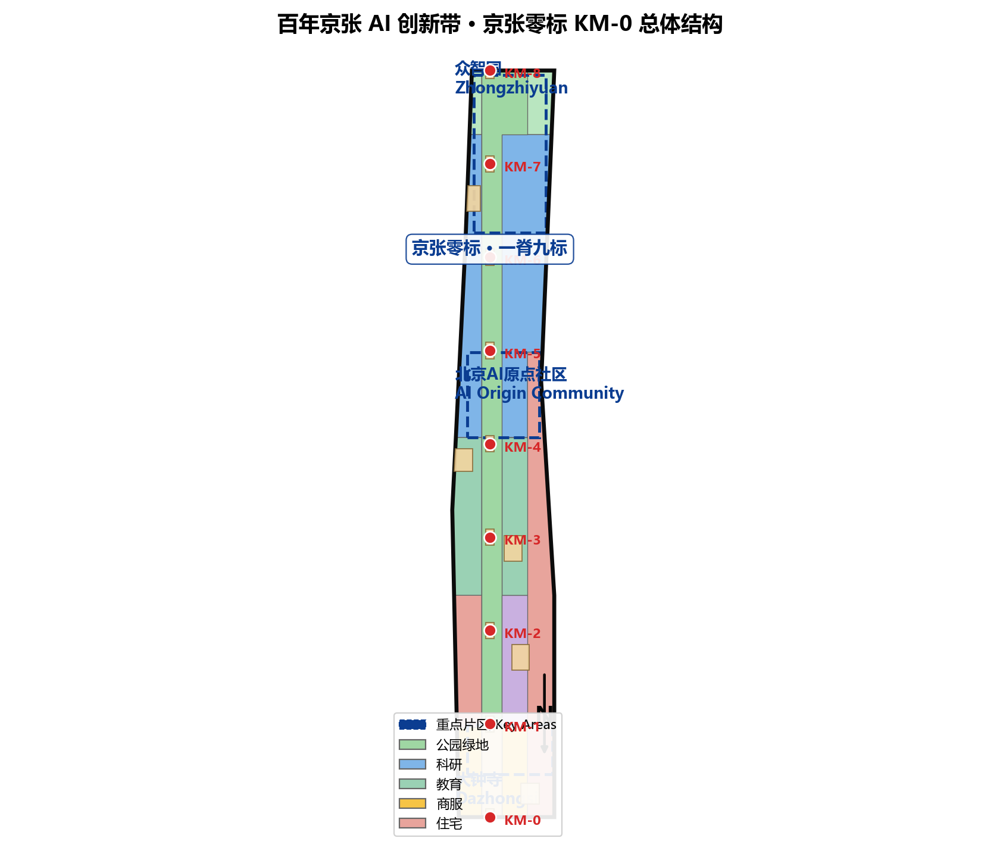
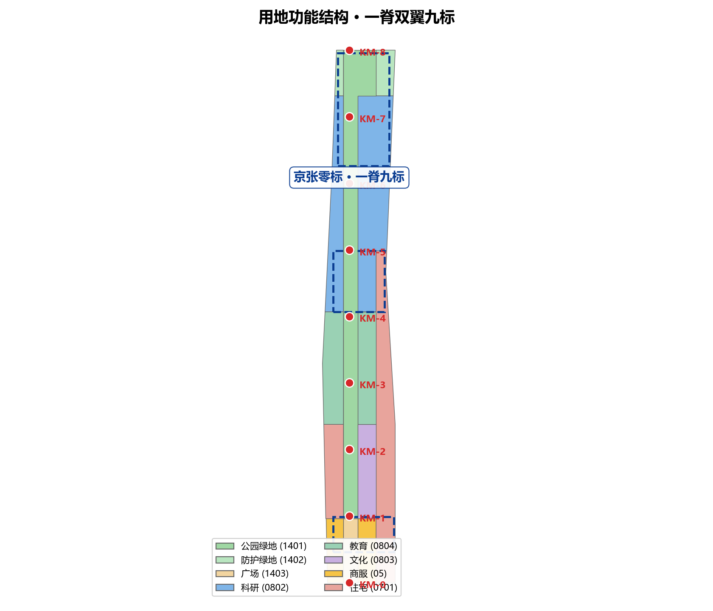
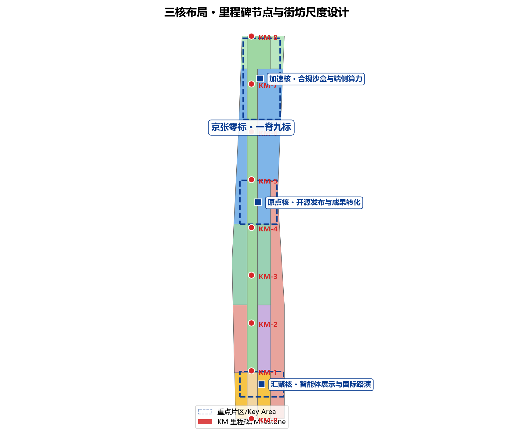
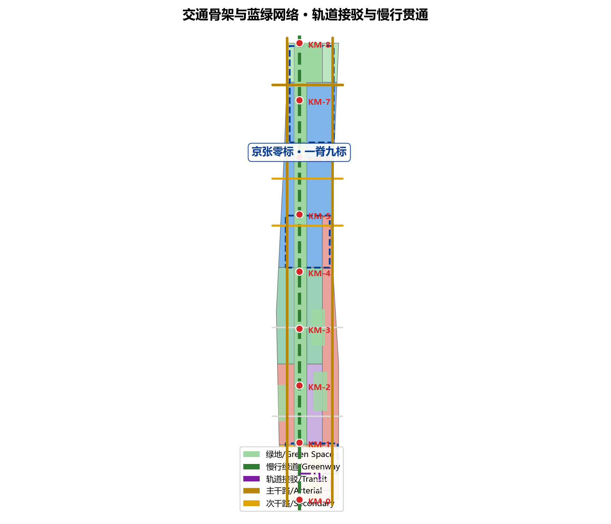
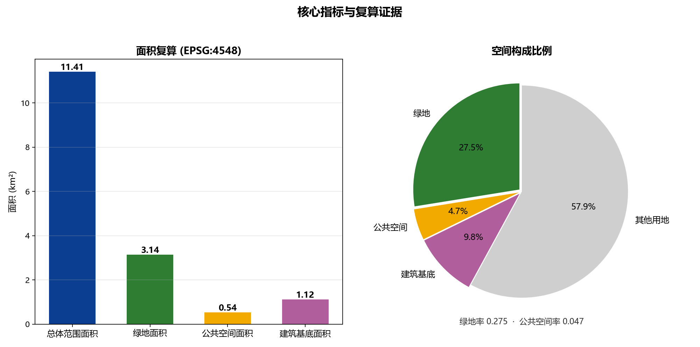

# 京张零标 · KM-0：从铁路里程碑到全球AI创新带的公共计量体系

## 设计依据与资料清单

本方案以北京市规划和自然资源委员会海淀分局《百年京张AI创新带城市设计国际方案征集资格预审公告》为第一依据，并以 `brief/site-package/` 中登记的临时粗略边界、重点区域、枚举、指标和来源清单为机器可读依据 [source:OFFICIAL-ANNOUNCEMENT] [standard:PROJECT-OFFICIAL-ANNOUNCEMENT]。方案生成前，KM-0 Agent 已读取 `design_brief.json`、`allowed_design_space.json`、`enums/`、`ranges/planning_limits.json`、`schemas/`、`data/source_registry.json` 与 `data/processed/agent_fact_pack.md`，并依据 `project_scope_summary.csv`、`agent_task_requirements.csv`、`source_use_matrix.csv` 与 `missing_data_checklist.csv` 建立任务、范围、资料用途和缺口清单 [source:AGENT-TASKBOOK] [source:PROCESSED-FACT-PACK]。所有设计判断都拆分为可追溯来源、可复算指标、可校验图层和可人工复核假设；正文不再重复机器索引，完整关系保存在 `sources.json`、`metrics.json`、`compliance_matrix.json`、`standard_matrix.json` 与 `design_depth_matrix.json`。

本方案在官方 `SITE_BOUNDARY` 或三处 `KEY_AREA` 正式边界公布前，使用 `brief/site-package/geometry/provisional_boundaries.geojson` 生成临时 formal 包 [source:SITE-PACKAGE]。提交包中 `geometry/site_boundary.geojson` 与 `geometry/key_areas.geojson` 均标注为 `provisional_constraint`、`official_boundary=false`，只能用于方案生成、自检、可视化与设计讨论，不能作为 official redline、审批依据、精确面积依据或法定控制结论 [data:geometry/site_boundary.geojson#SITE-001] [metric:site_area_sqm]。组织方数据缺口本身不阻断内容评分；正式边界发布后，site boundary、key areas、land use、roads、green space、public space、buildings、phasing 与 metrics 均需整体重算，不能只替换单个文件。

资料登记边界如下 [source:SOURCE-REGISTRY]：`data/source_registry.json` 登记公开、清权与临时资料的用途边界；当前登记 formal 可用资料、背景资料与 provisional-only 资料三类，agent 不得把 background_only 或 provisional_only 资料升级为官方边界、法定控规、正式评分依据或政府实施承诺。资料证据链、三层范围任务与缺资料事项的关系由 `data/processed/agent_fact_pack.md` 导航，阅读者可从正文进入证据，但不必先读一串机器编号。

## 三层范围工作框架

方案按照公告确定的三层结构组织：统筹研究范围关注 43.6 平方公里内的 AI 产业生态、战略定位、创新链与未来城市形态；总体设计范围关注 11.4 平方公里京张遗址公园周边 1-2 公里城市地区和产业区，要求形成城市更新总体框架、产业空间布局、交通市政支撑与城市风貌控制；重点区域范围关注 368.4 公顷三处详细设计地区，要求明确功能业态、建筑规模、拆改留分类、公共空间连通与交通组织 [depth:three_level_scope_framework]。三层范围逐条映射至 `compliance_matrix.json`，保证公告 1.3、1.4、1.5 与 agent.1-agent.6 的必选任务都有章节、图层、指标、图纸与 HTML 证据 [standard:PROJECT-AGENT-OPEN-CALL-TASKBOOK]。

| 层级 | 设计问题 | 方案回答 | 数据落点 |
| --- | --- | --- | --- |
| 统筹研究范围 | AI 产业生态与未来城市形态如何组织 | 建立"铁路里程 → 创新里程"叙事与"高校策源-开源协作-企业转化-公共体验-国际传播"创新链 | compliance_matrix.json、standard_matrix.json |
| 总体设计范围 | 产业空间、更新、交通市政与风貌如何落图 | 一脊九标、三核双翼空间结构落实为用地、建筑、道路、绿地、公共空间与分期图层 | [data:geometry/land_use.geojson#LU-001]、[data:geometry/roads.geojson#ROAD-001] |
| 重点区域范围 | 三处片区如何达到详细设计深度 | 众智园、AI原点社区、大钟寺分别以加速核、原点核、汇聚核身份深化 | [data:geometry/key_areas.geojson#PROV-KEY-001] [data:geometry/public_space.geojson#PUBLIC-001] |

三层不是互相割裂的图纸集合：统筹研究决定产业链与城市形态判断，总体设计把判断落实到更新项目、空间结构与设施承载，重点区域验证具体地块、建筑、交通、公共空间与 AI 应用场景的可实施性。agent 生成方案时先锁定当前提交采用的 provisional 边界与约束，再生成各设计图层，最后从图层复算指标并在正文解释哪些结论仍受 provisional boundary 限制 [depth:overall_spatial_structure]。任何无法从结构化数据复算的面积、比例、规模或项目数量，不得写入正式结论。

## 统筹研究范围产业与未来城市研究

统筹研究范围的核心任务是构建世界级 AI 创新生态体系，方案应梳理海淀高校院所、头部企业、算力算法数据要素、孵化平台、上市企业、独角兽和科技服务资源 [source:AGENT-TASKBOOK]。本方案提出**「京张零标 · KM-0」**命名体系：京张铁路是中国自主设计修建的第一条干线铁路，其里程碑（公里标）从西直门零公里标起丈量国土；百年后，创新带把同一计量逻辑转译为 AI 时代的公共刻度——以 KM-0（零公里起点）为叙事原点，沿京张遗址公园活力带布置 9 个里程碑节点，让创新成就像铁路里程一样被"标定、丈量、被看见"。

五大功能与"三区两翼"协同落实如下 [standard:PROJECT-AGENT-OPEN-CALL-TASKBOOK]：**一脊**即京张遗址公园活力带，承载历史、公共空间与 AI 体验；**九标**即 KM-0 至 KM-8 九个里程碑节点，每个节点一个 AI 场景或公共空间主题；**三核**对应众智园（加速核）、北京AI原点社区（原点核）与大钟寺（汇聚核）三处重点片区；**双翼**为西翼（中关村技术服务与高校策源）与东翼（场景赋能与产业服务）。Logo 方向以"0"与里程碑碑形结合：一个被轨道断面切开的圆环，象征零公里的起点与开放的循环 [data:geometry/public_space.geojson#PUBLIC-KM-00] [depth:overall_spatial_structure]。

未来城市形态研究回答人工智能如何改变工作、生活、社交、学习、交通与公共服务 [depth:future_city_mobility_and_services]。本方案把 AI 交通系统、连续绿色空间、创新服务设施与国际化生活工作氛围落实为可定位的功能区、节点、廊道与场景：AI 慢行导航覆盖遗址公园全脊 [metric:public_space_ratio]，开放测试场景集中于众智园 [data:geometry/land_use.geojson#LU-001]，开源协作与成果发布集中于原点社区，智能体展示与国际路演集中于大钟寺 [data:geometry/key_areas.geojson#PROV-KEY-003]。产业战略指标、AI 创新指数、人才密度与空间供给类型写入指标体系并标明官方、设计建议与待校准三类。全球化叙事（年度 AI 活动周、开发者社区、朝圣路线）一律表述为"概念建议/参考方案/可供专业团队深化研究"，不得写成已确定的政府活动或实施安排。

## 总体设计范围城市更新与控规深度城市设计

总体设计范围要求达到控制性详细规划的城市设计深度 [standard:MOHURD-CONTROL-DETAILED-PLANNING]。本方案提出"一脊九标、三核双翼"总体空间结构，并通过 `geometry/` 全图层表达：`land_use.geojson` 完整覆盖临时边界且无重叠、无缝隙，表达商服、科研、教育、文化、住宅、公园绿地、广场与防护绿地结构 [depth:land_use_layout]；`buildings.geojson` 表达 102 处更新与保留建筑基底，总面积约 111.9 万平方米 [metric:building_footprint_area_sqm]；`roads.geojson` 表达慢行主轴、主干路、次干路、支路与轨道接驳关系 [data:geometry/roads.geojson#ROAD-001]；`public_space.geojson` 与 `green_space.geojson` 表达 9 处里程碑广场、站前广场、社区客厅与 314.3 万平方米蓝绿空间 [data:geometry/green_space.geojson#GREEN-001] [metric:green_ratio]。

控规深度内容可审查分解如下：用地图层表达用地结构 [data:geometry/land_use.geojson#LU-001]；建筑图层表达基底与拆改留对象 [data:geometry/buildings.geojson#BLDG-001]；道路图层表达交通组织 [data:geometry/roads.geojson#ROAD-001]；分期图层表达实施时序 [data:geometry/phasing.geojson#PHASE-001]。城市更新总体策略以低效空间识别为前提：沿轨道走廊两侧与遗址公园相邻街坊的存量建筑，按保留、整治、改建与新建四类拆改留逻辑推进 [depth:retain_renovate_demolish]。涉及建筑高度、开发强度、道路红线、退线与设施标准的内容，官方控制条件未发布前一律写为"待正式控规条件确认"，不以 agent 推测值冒充审定指标；容积率在 `metrics.json` 中明确标记为 unknown [depth:development_intensity_controls]。

新型基础设施与配套设施空间布局如下：端侧算力驿站沿双翼布局，创新服务平台依托三核公共空间设置，分布式能源与低碳算力体验结合清河界面与屋顶系统布置。轨道站点一体化围绕大钟寺站、五道口站等既有站点展开，非机动车停放、停车供给与慢行接驳结合十字路口四象限步行连通组织，具体管线、能源、排水、防洪、消防条件列为正式深化前置条件 [depth:municipal_new_infrastructure]。

## 重点区域详细设计

三处重点区域是必选项，本方案以"三核"身份分别深化，全部达到规划综合实施方案深度并引用独立图层：众智园见 [data:geometry/key_areas.geojson#PROV-KEY-001]，原点社区见 [data:geometry/key_areas.geojson#PROV-KEY-002]，大钟寺见 [data:geometry/key_areas.geojson#PROV-KEY-003]，深度由 [depth:three_key_area_detailed_design] 检查。

**众智园 · 加速核（KM-7 周边）**：围绕国家人工智能平台、全栈自主创新、标准制定、安全治理与产业展示，组织花园型全栈自主创新街区。空间动作包括强化清河界面、产业展示、低碳绿色创新交往与对外交通组织；以绿色空间承载开放测试与标准治理展示，设置安全治理沙盒、端侧算力驿站与清河低碳创新廊 [data:geometry/green_space.geojson#GREEN-001]。

**北京AI原点社区 · 原点核（KM-4/KM-5 周边）**：围绕近校创新、成果孵化转化、人才特区与开源体系，组织校区-园区-街区慢行缝合。空间动作包括补足成果发布、人才服务、居住生活与开源协作空间，设置开源发布厅、近校成果转化街与校城交互广场 [data:geometry/public_space.geojson#PUBLIC-03] [data:geometry/buildings.geojson#BLDG-001]。

**大钟寺 · 汇聚核（KM-0/KM-1 周边）**：围绕领军企业、智能体、智能终端、内容消费、数据要素与数字资产，组织城市型智能经济与国际交往街区。空间动作包括大钟寺站一体化、四象限步行连通、商业服务与重点企业公共环境更新，设置国际路演客厅、数据要素会客厅与站前集散广场 [data:geometry/public_space.geojson#PUBLIC-01] [metric:key_area_count]。

| 重点片区 | 设计定位 | 空间动作 | AI产业与运营场景 | 证据引用 |
| --- | --- | --- | --- | --- |
| 众智园AI自主创新加速区 | 花园型全栈自主创新街坊 | 清河界面、产业展示、低碳创新交往、对外交通 | 自主模型测试、安全治理沙盒、标准工作坊、低碳算力 | [data:geometry/key_areas.geojson#PROV-KEY-001] [depth:three_key_area_detailed_design] |
| 北京AI原点社区 | 近校型成果转化与人才社区 | 校园区慢行缝合、成果发布、开源协作、人才服务 | 开源发布厅、成果转化街、人才特区服务 | [data:geometry/key_areas.geojson#PROV-KEY-002] [source:AGENT-TASKBOOK] |
| 大钟寺AI产业聚集区 | 城市型智能经济与国际交往街区 | 站体一体化、四象限连通、公共环境更新 | 智能体展示、内容消费、数据要素与国际路演 | [data:geometry/key_areas.geojson#PROV-KEY-003] [metric:key_area_count] |

## 全球 AI 创新生态案例对照与机制借鉴

为说明 KM-0 提出的"高校策源—开源协作—企业转化—公共体验—国际传播"创新链与三核双翼空间结构在全球的可比性，本方案对六个已公开、可核验的城市级 AI 创新片区做机制对照。对照仅用于机制与空间模式借鉴，所有面积、定位与设施均为公开背景资料的概念引用，不构成对企业、投资额、产值或财政承诺的编造，也不作为北京本地审批依据 [source:AGENT-TASKBOOK]。

| 案例 | 公开定位（背景资料） | 可借鉴机制 | 对 KM-0 的启示 |
| --- | --- | --- | --- |
| 新加坡裕廊湖区（Jurong Lake District） | 政府公布的智慧城市更新片区，强调自给自足的生活-工作-游憩一体 | 绿色廊道串联、公共空间先行的分期滚动开发 | 以公共空间与慢行优先作为大钟寺与遗址公园缝合的先行抓手 |
| 美国波士顿肯德尔广场（Kendall Square） | 公开报道中被称为"地球上最具创新性的一平方公里"，高校-企业近邻 | 校区-园区近距离协作、成果转化楼宇群 | 支撑原点社区"近校成果转化街"的产学研距离论证 |
| 英国伦敦科技城（Tech City / Shoreditch） | 政府扶持的数字产业聚集区，城市更新驱动 | 存量建筑改造为创客空间、社区与企业共生 | 支撑沿轨道走廊低效空间"保留整治改建"的拆改留逻辑 |
| 中国上海张江科学城 | 公开规划定位为综合型科学城 | 大科学设施、研发集聚与功能配套复合 | 支撑众智园"全栈自主创新街区"的功能复合组织 |
| 中国杭州云栖小镇 | 公开宣传为云计算与数字产业特色小镇 | 会展-产业-社区联动、年度开发者大会带动品牌 | 支撑全球 AI 活动周与开发者社区运营机制 |
| 中国深圳南山区深圳湾 | 公开报道中为高科技企业与滨海公共空间并存地区 | 高强度产业区与滨海公共开放空间并置 | 支撑产业密集区与清河界面的蓝绿公共空间复合 |

以上案例均作为"机制与空间模式"概念对照，不涉及任何未公开数据；KM-0 命名、里程碑系统与活动体系仍为方案概念建议，具体借鉴须在正式深化时由专业团队结合本地权属、控规与投资条件核验 [standard:PROJECT-AGENT-OPEN-CALL-TASKBOOK]。

## AI 创新生态、人才画像与 AI+ 场景

方案建立面向 AI 人才和企业的空间需求画像，覆盖研发办公、开源协作、成果发布、企业服务、人才居住、社交学习、消费生活、运动休闲与国际交往 [source:AGENT-TASKBOOK]。AI+ 场景围绕公告提出的交通、服务、消费、医疗、教育、法律、生活服务等方向，每个场景说明服务对象、空间位置、数据来源、隐私边界、人工复核机制与运营主体 [depth:ai_scenario_governance]。

| 用户画像 | 典型需求 | 空间响应 | 自检边界 |
| --- | --- | --- | --- |
| 开源开发者 | 发布、协作、测试、社区声誉 | 原点社区开源发布厅、公共代码墙、夜间协作空间 | 不采集个人行为轨迹；活动数据只做聚合统计 |
| 初创团队 | 低成本办公、算力入口、产品试验场 | 众智园共享测试场、端侧算力服务点、标准治理咨询 | 算力和数据服务需另行授权 |
| 头部企业访客 | 展示、商务、国际接待、人才招聘 | 大钟寺国际路演客厅、轨道站点接驳、重点企业公共环境 | 企业标识和案例须清权 |
| 周边居民 | 通勤、休闲、社区服务、低扰动更新 | 遗址公园慢行环、社区服务嵌入、夜间照明分级 | 不将居民画像用于商业推荐 |
| 高校师生 | 成果转化、跨校协作、日常慢行 | 校区-园区慢行缝合、成果转化驿站、AI教育体验点 | 校园数据和科研成果需授权 |

本方案提供不少于 10 张 AI 场景卡 [depth:ai_scenario_cards]：01 开源发布厅（原点社区）、02 安全治理沙盒（众智园）、03 端侧算力驿站（双翼节点）、04 AI慢行导航（遗址公园全脊）、05 大钟寺国际路演客厅、06 清河低碳创新廊、07 近校成果转化街、08 数据要素会客厅、09 AI生活服务样板街、10 全球AI活动周路线 [data:geometry/public_space.geojson#PUBLIC-KM-00]。产业测试验证场景不少于 3 个：开放测试场（众智园，接入真实路侧设备与仿真环境双轨测试）、开源协作验证场（原点社区，代码贡献与模型评测公开化）、国际路演验证场（大钟寺，面向智能体与智能终端产品的发布与互操作验证）。AI 治理建议遵守数据最小化、公开来源、可解释与人工复核原则：城市智能体辅助识别慢行断点、公共空间热力、设施维护、企业服务需求与活动安全风险，但不替代规划审批、不输出未经授权的个人画像、不声称获得官方实施承诺 [scenario:public-safety-operations-review]。

## AI 场景卡与场景-空间-运营映射

本方案将 10 张 AI 场景卡按统一结构展开：服务对象、空间位置、数据来源、隐私边界、人工复核机制、运营主体与实施阶段。下表为场景卡索引，每张卡在正式深化时进入场景卡库（component library）作为可复用组件 [depth:ai_scenario_governance]。

| 编号 | 场景 | 服务对象 | 空间落点 | 数据来源 | 隐私与人工复核 | 运营主体 | 实施阶段 |
| --- | --- | --- | --- | --- | --- | --- | --- |
| SC-01 | 开源发布厅 | 开源开发者 | 原点社区 | 公开代码贡献、活动聚合统计 | 不采集个人行为轨迹；发布内容须人工复核 | 社区运营+企业共建 | 一期 |
| SC-02 | 安全治理沙盒 | 模型厂商、安全机构 | 众智园 | 脱敏测试数据 | 测试数据最小化；输出须人工复核 | 治理平台运营方 | 一期 |
| SC-03 | 端侧算力驿站 | 初创团队、周边居民 | 双翼节点 | 能耗与算力聚合数据 | 不识别个人；需另行授权 | 能源/算力服务商 | 一期 |
| SC-04 | AI慢行导航 | 全部行人 | 遗址公园全脊 | 聚合慢行流量、断点识别 | 不定位个人；结果须人工校准 | 城市管理部门+企业 | 一期 |
| SC-05 | 国际路演客厅 | 头部企业访客 | 大钟寺 | 报名与活动公开信息 | 名单仅活动用途；须清权 | 会展运营机构 | 一期 |
| SC-06 | 清河低碳创新廊 | 居民、游客 | 清河界面 | 环境与能耗监测 | 不采集个人；展示用聚合值 | 运维+能源平台 | 二期 |
| SC-07 | 近校成果转化街 | 高校师生 | 原点社区 | 授权科研成果摘要 | 校园数据须授权；保密项不公开 | 高校+孵化机构 | 二期 |
| SC-08 | 数据要素会客厅 | 数据服务企业 | 大钟寺 | 数据要素交易公共信息 | 遵循数据法规；个人数据脱敏 | 交易平台+监管 | 二期 |
| SC-09 | AI生活服务样板街 | 周边居民、青年 | 中段街区 | 服务预约与满意度聚合 | 不用于商业画像；可退出 | 社区+服务商 | 二期 |
| SC-10 | 全球AI活动周路线 | 游客、开发者 | 全脊公共节点 | 活动公开信息 | 报名数据仅活动使用 | 活动组委会+社区 | 三期 |

产业测试验证场景不少于 3 个，均配人工复核与数据边界：开放测试场（众智园，真实路侧设备+仿真双轨）、开源协作验证场（原点社区，贡献与评测公开化）、国际路演验证场（大钟寺，智能体与终端互操作验证）。所有 AI 治理遵循数据最小化、公开来源、可解释与人工复核原则，城市智能体仅作辅助识别，不替代审批、不输出未经授权画像、不宣称官方实施承诺 [scenario:public-safety-operations-review]。

## 用地、建筑规模与拆改留方案

用地方案依据国土空间调查、规划、用途管制分类等公开标准表达 [standard:MNR-LAND-USE-CLASSIFICATION-GUIDE]，形成完整、闭合、无缝的用地分区 [data:geometry/land_use.geojson#LU-001]。用地结构围绕"一脊双翼"组织：脊上为公园绿地与广场（1401/1403），西翼以科研（0802）、教育（0804）、商服（05）与住宅（0701）混合布局，东翼以科研、教育、住宅与商服混合布局，北端设置清河沿河公园绿地与防护绿地（1401/1402）。全部 8 个用地分区由 `land_use.geojson` 表达，面积与图层一致，无重叠无缝隙 [depth:land_use_layout]。

建筑方案区分保留、改造、更新、新建或待确认对象，明确建筑基底、功能、规模、风貌、屋顶、体量 [depth:height_massing_character]。`buildings.geojson` 表达 102 处建筑基底，对应研发、教育、商业、办公、居住等类型，总面积 111.9 万平方米，全部位于总体设计范围内的科研、教育、商服与住宅分区内 [data:geometry/buildings.geojson#BLDG-001] [metric:building_footprint_area_sqm]。拆改留方法由 [depth:retain_renovate_demolish] 管理：沿轨道走廊与遗址公园相邻街坊以保留整治与改建为主，低效生产空间转为产业服务与社区配套，新建聚焦重点片区地块；缺少现状建筑、权属、控规和工程条件的地块只提出方法与待校准清单，不编造拆改留结论。

建筑规模与强度按三类处理：可由提交几何复算的空间指标（面积、比例、图层数量）写入 `metrics.json` 并标 known；需官方控规支撑的管控指标（容积率、高度、密度、退线、红线）标 unknown 并注明前置条件；需运营数据校准的绩效指标（创新指数、人才密度等）写入 `compliance_matrix.json` 与正文风险章节 [metric:floor_area_ratio]。A3 文册给出更新项目清单与指标复核表，A0 展板表达关键空间结构与重点片区，HTML 页面提供指标和图层联动查看。

## 实施量化指标与责任主体矩阵

在分期与更新项目清单基础上，补充实施维度的量化边界与责任主体建议，全部为"设计建议/待校准"，不构成审定指标或政府承诺 [depth:renewal_project_list]。

| 维度 | 设计建议边界 | 数据/指标落点 | 责任主体建议 | 前置条件 |
| --- | --- | --- | --- | --- |
| 慢行连通 | 全脊 9 个里程碑节点慢行贯通、断点清单化 | roads.geojson + public_space.geojson | 城市管理、街道办、轨道运营 | 道路红线与桥下空间确认 |
| 公共空间 | 公共空间率约 4.7%，按分期提升 | public_space_ratio | 平台公司、建设单位 | 权属与用地手续 |
| 蓝绿空间 | 绿地率约 27.5%，保持底线并优化 | green_ratio | 园林绿化、水务部门 | 蓝线、防洪条件 |
| 端侧算力 | 双翼节点若干处（待点位确认） | constraints.geojson | 能源/算力服务商 | 能源容量与安全评估 |
| 停车与非机动车 | 站前与社区客厅配建非机动车停放与共享停车（规模待控规） | assumptions.json（A-CONTROLS 类） | 交通、街道办 | 停车专项与控规 |
| 运营活动 | 年度活动体系、场景开放日频次（建议节奏） | compliance_matrix.json | 活动组委会、社区、企业 | 许可与安全报备 |

上述指标只描述方案建议的"边界与方法"，所有最终规模、指标与责任划分须在正式控规、专项规划与实施条件确认后由专业团队复核 [metric:floor_area_ratio]。

## 交通、轨道、市政与公共服务设施

交通方案回应公告对轨道站点一体化、道路微循环、慢行断点、对外交通、停车、非机动车停放与绿色交通系统的要求 [depth:traffic_rail_slow_parking]，覆盖北五环、京张遗址公园跨环路节点、五道口、清华东路西口、大钟寺站及重点企业周边交通联系 [data:geometry/roads.geojson#ROAD-001] [data:geometry/public_space.geojson#PUBLIC-01]。

道路与慢行图层保持在提交边界内 [data:geometry/roads.geojson#ROAD-001]：**一轴**为遗址公园慢行主轴（greenway），南北贯通 9 个里程碑节点；**双翼联络**为东西向的 4 条联络道（branch/secondary），缝合科研、教育、居住与商服片区；**外围骨架**保持现状主干路与北五环南辅路功能；**轨道接驳**以 transit_connection 表达大钟寺站前至慢行轴的接驳环，实现站城一体 [data:geometry/roads.geojson#ROAD-009] [depth:traffic_rail_slow_parking]。慢行断点识别依托 AI 慢行导航场景与公共空间图层互校 [data:geometry/public_space.geojson#PUBLIC-KM-00]，非机动车停放、停车供给结合站前广场与社区客厅组织。道路红线、管线、消防与市政条件缺失事项在 `assumptions.json` 中列出，不写成审定条件 [data:geometry/constraints.geojson#CONSTRAINTS]。

市政与公共服务设施覆盖 AI 产业服务设施、创新服务平台、人才生活服务设施、新型基础设施、分布式能源、端侧算力与传统市政设施融合 [depth:municipal_new_infrastructure]：端侧算力驿站沿双翼节点布局，创新服务平台依托三核公共空间，人才服务结合住宅与社区配套用地，站点与能源设施配合清河界面与屋顶系统。设施标准、服务半径、运营模式与分期实施逻辑写入正文与合规矩阵；管线、能源、排水、防洪、消防等工程资料列为正式深化前置条件 [source:SITE-PACKAGE]。

## 蓝绿空间、公共空间与城市风貌

蓝绿空间以京张遗址公园活力带为骨架 [data:geometry/green_space.geojson#GREEN-001] [depth:blue_green_public_space]，统筹清河、小月河、周边高校、企业、社区出行需求，提出南北贯通、东西连通的步道、骑行道与绿色空间体系：脊上绿地连续约 0.6 公里宽、314.3 万平方米，清河沿河公园与防护绿带形成北端绿色界面，双翼社区公园嵌入住宅与科研片区，绿地率复算约 27.5% [metric:green_ratio] [metric:green_space_area_sqm]。

公共空间系统以 9 处 KM 里程碑广场为骨架 [data:geometry/public_space.geojson#PUBLIC-KM-00]：KM-0 零公里起点广场对应大钟寺站前，KM-8 对应清河界面与加速核，中间每个里程碑一个 AI 场景主题。另有站前集散广场、校城交互广场、社区公共客厅与创新走廊广场，公共空间率约 4.7% [metric:public_space_ratio] [metric:public_space_area_sqm]。慢行断点、上跨环路节点、公园南端与北端景观节点均识别为项目清单条目；停车、体育、创新交往、科技测试、应用展示与公共服务在绿色空间内复合利用 [data:geometry/public_space.geojson#PUBLIC-05]。

城市风貌融合京张铁路历史文化、中关村创新文化与 AI 创新文化 [standard:MOHURD-URBAN-DESIGN-MEASURES]：利用清华园火车站、北影等文化资源，提出城市基调、建筑风貌、屋顶形态、体量、界面与公共艺术引导；导视标识、文化符号与国际传播叙事统一于 KM-0 计量体系，AI 朝圣地标（KM-0 起点碑、全球开发者荣誉墙、里程碑碑林）设置于公共空间节点。所有品牌、字体、图像、肖像与企业标识一律要求清权来源；风貌控制分清官方管控、设计建议与待确认条件，严禁在没有文保或控规依据时给出伪精确控制线 [depth:urban_character_and_identity]。

## 公共利益与包容性机制

方案把居民、青年人才、企业、高校、游客与弱势群体纳入同一空间与运营框架 [source:AGENT-TASKBOOK]：无障碍与适老化方面，慢行主轴全程缓坡无高差、关键节点配无障碍电梯与语音导览，公共空间座椅与遮蔽按适老标准配置；社区共建方面，公共空间改造设置社区议事与共建节点，活动与场景开放日优先纳入居民意见反馈闭环；弱势群体服务方面，AI 生活服务保留线下人工服务窗口，数字设施均设人工复核与替代通道，不因数字能力差异排除服务对象；公共决策透明度方面，监测数据仅做聚合展示，公共空间改造指标、活动运营边界与版权清权清单均向公众公开，接受评议 [depth:public_interest_inclusion]。

## 更新项目清单、实施政策与分期计划

实施方案形成可审查的更新项目清单 [depth:renewal_project_list]，说明位置、类型、功能、责任主体、依赖条件、实施阶段、风险与评估指标；`geometry/phasing.geojson` 表达三期范围 [data:geometry/phasing.geojson#PHASE-001]，`compliance_matrix.json` 把每个任务与分期和图纸挂接。

| 项目编号 | 项目名称 | 类型 | 主要依赖 | 证据引用 |
| --- | --- | --- | --- | --- |
| KM-P01 | KM-0 零公里起点广场 | 公共空间/轨道一体化 | 大钟寺站改造、道路交叉口、管线 | [data:geometry/public_space.geojson#PUBLIC-01] |
| KM-P02 | 遗址公园 9 标慢行缝合 | 公共空间/慢行交通 | 道路红线、桥下空间、交通组织 | [data:geometry/roads.geojson#ROAD-001] |
| KM-P03 | 众智园清河创新界面 | 蓝绿空间/产业展示 | 河道蓝线、生态与防洪条件 | [data:geometry/green_space.geojson#GREEN-001] |
| KM-P04 | 原点社区开源发布厅 | 城市更新/产业服务 | 校区边界、权属、首层业态 | [data:geometry/buildings.geojson#BLDG-001] |
| KM-P05 | 大钟寺站四象限步行连通 | 轨道一体化/慢行 | 轨道站点、交叉口、市政管线 | [data:geometry/public_space.geojson#PUBLIC-01] |
| KM-P06 | 端侧算力与 AI 公共服务节点 | 新基建/公共服务 | 能源、算力、安全与运营主体 | [data:geometry/constraints.geojson#CONSTRAINTS] |
| KM-P07 | 全球 AI 活动周公共路线 | 运营/品牌 | 公共空间许可、活动安全、版权清权 | [data:geometry/phasing.geojson#PHASE-001] |

分期与征集周期严格区分：征集周期是提交成果的时间要求，实施分期是城市更新推进路径 [depth:phasing_implementation]。**一期（里程碑示范区）**以 KM-0/大钟寺、原点社区、众智园试点核心为先导，轻量设施、运营活动与服务平台先行启动；**二期（创新带深化更新）**覆盖中段街区与清河界面；**三期（远期接续治理）**处理过渡地带与整体运营深化。年度活动体系、开发者社区运营、场景开放日、公共体验路线与国际传播机制说明运营对象、频率、责任边界、转化路径与风险；政策建议覆盖城市更新统筹实施、空间供给、运营机制、产业服务、公共参与、数据治理与产权协同；缺少权属、资金、实施主体与审批路径的项目明确写为实施风险，不承诺落地 [standard:MOHURD-URBAN-RENEWAL-MEASURES]。

## 指标体系、面积复算与合规矩阵

指标体系包含总体范围面积、重点区域面积、绿地与公共空间比例、建筑基底、更新项目数量、AI 场景节点、慢行连通指标、产业空间指标、人才服务指标与自检状态 [depth:metrics_recalculation]。所有 known 指标均可从 GeoJSON 或可信来源复算：`scripts/spatial_review.py` 使用 EPSG:4326 几何与 EPSG:4548 投影复算，site 面积 11,412,825.386 m²，见 [metric:site_area_sqm]；绿地率 27.5%，见 [metric:green_ratio]。公共空间率 4.7%，见 [metric:public_space_ratio]；建筑基底 111.9 万 m²，见 [metric:building_footprint_area_sqm]，边界证据见 [data:geometry/site_boundary.geojson#SITE-001]。

三类指标分别存放 [depth:metrics_recalculation]：第一类空间指标（边界面积、绿地比例、公共空间比例、建筑基底面积、分期面积）由提交几何直接复算，保存于 `metrics.json`；第二类管控指标（容积率、建筑高度、建筑密度、退线、道路红线、设施标准）需要官方控规或任务书附件，保存于 `assumptions.json` 并标 unknown；第三类绩效指标（AI 创新指数、人才密度、服务满意度、慢行可达性、活动参与度、场景使用频次）需要运营数据持续校准，保存于 `compliance_matrix.json`，避免把运营愿景误写成审定规划条件。

合规矩阵是任务响应性主控文件：每条公告任务与 agent_taskbook 任务对应报告章节、图层、指标、图纸、HTML 页面、来源、假设与自检项；未能覆盖公告 1.3、1.4、1.5 或 agent.1-agent.6 任一必选任务，方案不得进入 formal professional scoring [depth:compliance_matrix] [standard:PROJECT-OFFICIAL-ANNOUNCEMENT]。HTML 页面 `visual/index.html` 提供指标与图层联动查看，数值与 `metrics.json` 一致 [metric:green_ratio] [metric:public_space_ratio] [metric:site_area_sqm]。

## 风险、版权与合规说明

**本包为双语文案。** 主文件 `proposal.md` 使用中文，完整对照译文为 `proposal.en.md`；A3/A0、HTML 与含文字图件均提供对应语言副本，并优先使用官方 `docs/terminology-glossary.md` 的推荐译法。v2 包缺少任一必需译稿、语言映射或有效文件时，finalize 与 CI 会阻断提交 [depth:risk_missing_data]。

所有图片、图纸、图标、数据与代码资产在 `sources.json` 与 `report/copyright_statement.md` 中说明来源、许可与授权状态；HTML 页面不加载远程脚本、远程地图瓦片、远程字体、iframe、表单或外部 API，不跟踪评审者行为 [standard:PROJECT-DISPLAY-ONLY]。风险与缺资料清单由 [depth:risk_missing_data]、约束图层与场地包共同校核 [data:geometry/constraints.geojson#CONSTRAINTS] [source:SITE-PACKAGE]：`missing_data_checklist.csv` 中列出的 official boundary、key area、控规、道路、地块、建筑、市政、文保与公共服务缺口，全部进入 `assumptions.json`、自检与正文风险章节。

本方案不声称官方批准、审定控规、最终土地权属、最终建设规模或保证实施；KM-0 Agent 对事实、来源、版权、空间数据、指标与表达负责，维护者与专业评审可依据自检结果、空间复核与合规矩阵要求返修或拒绝。KM-0 命名、里程碑系统与朝圣路线均为概念建议，可供专业团队深化研究，不代表政府活动或实施安排 [license:COMMUNITY-DISPLAY-ONLY]。

## 参考资料

- brief/public-brief.md
- brief/site-package/design_brief.json
- brief/site-package/allowed_design_space.json
- brief/site-package/enums/（layers、land_use_codes、road_classes、building_types、source_types）
- brief/site-package/ranges/planning_limits.json
- brief/site-package/schemas/（geojson_feature.schema.json 等）
- data/processed/agent_fact_pack.md
- data/processed/project_scope_summary.csv
- data/processed/agent_task_requirements.csv
- data/processed/source_use_matrix.csv
- data/processed/missing_data_checklist.csv
- skills/urban-design-ai-submission/references/（geometry-and-metrics.md、human-readable-proposal.md、submission-package.md、validator-feedback.md）
- 完整机器索引见 `sources.json`、`metrics.json`、`compliance_matrix.json`、`standard_matrix.json` 与 `design_depth_matrix.json`
- 本节书目入口依据场地包登记，完整出处与许可见结构化来源清单 [source:SITE-PACKAGE]