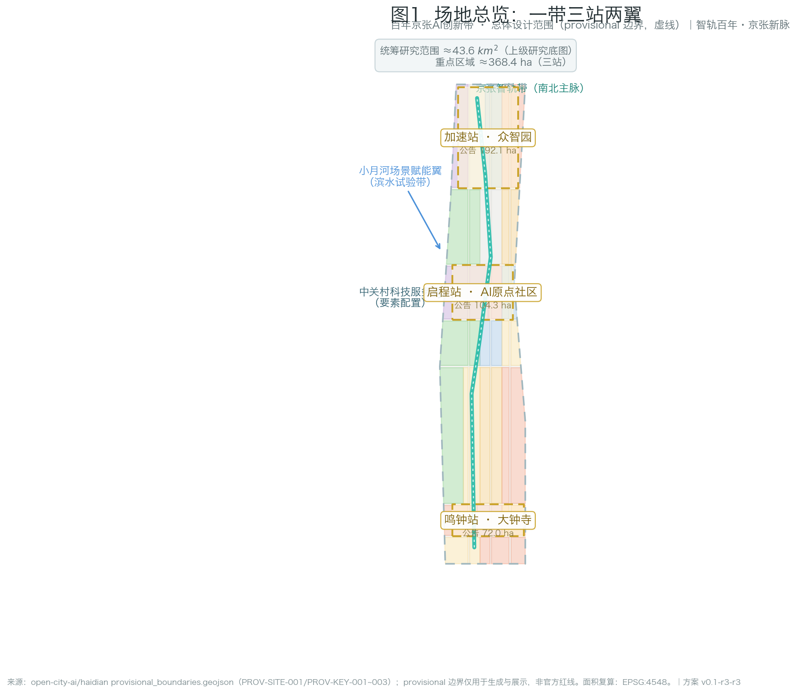
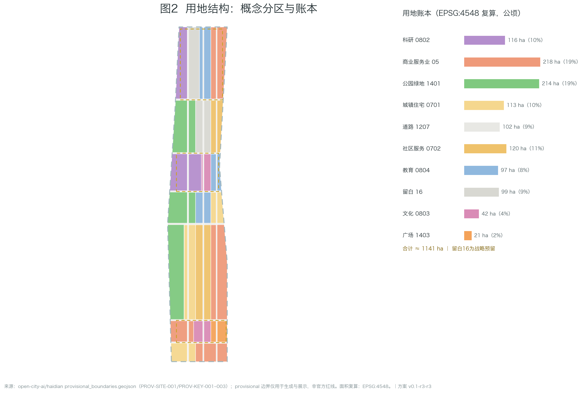
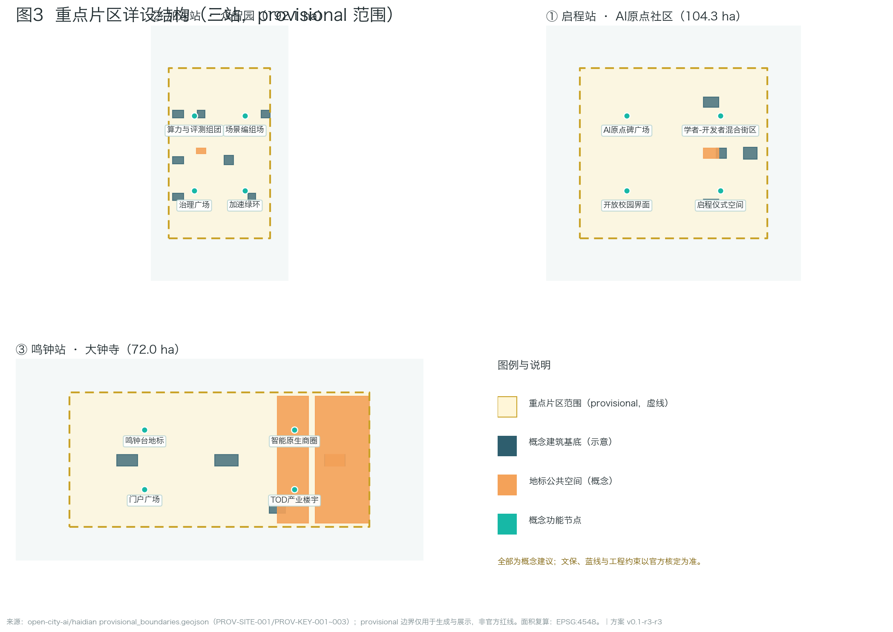
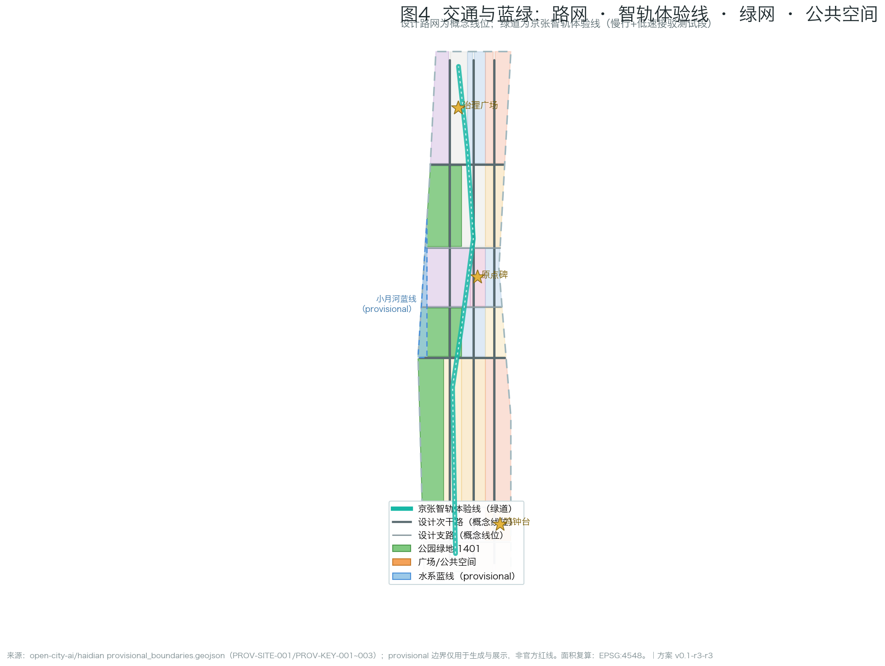
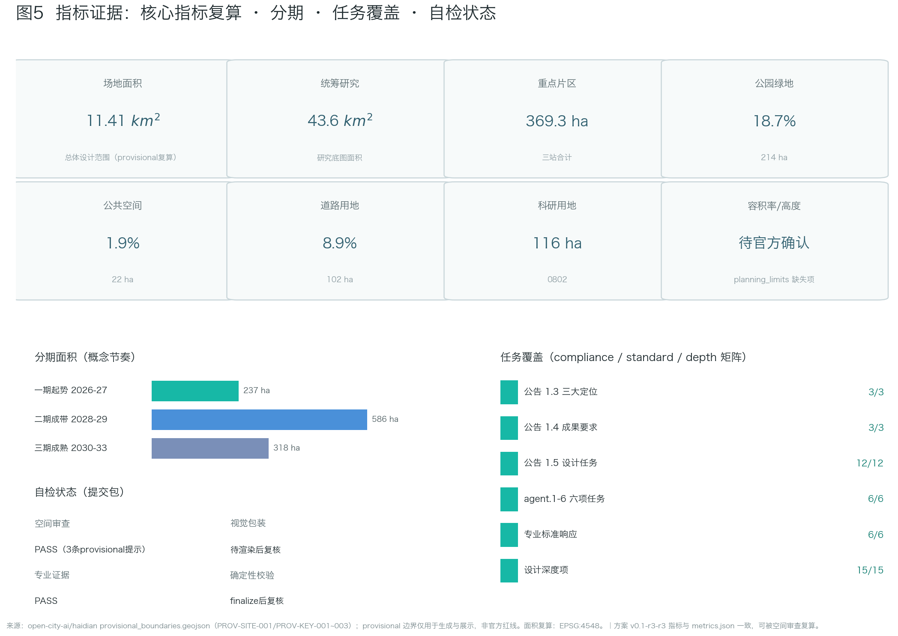

# A Century on the Smart Rail — Urban Design for the Centennial Jing-Zhang AI Innovation Belt

> **Status statement**: This proposal is AI-generated. Every spatial idea is a **conceptual suggestion, reference scheme, or material for professional teams to deepen** — not statutory planning, approval basis, engineering conclusion, investment commitment, or final retain-renovate-demolish judgment. Official precise redlines and planning controls are currently missing; the proposal uses the repository-registered provisional boundary and will be recalculated when official data arrives.

## Design Basis and Source List

The primary basis is the prequalification announcement of the Centennial Jing-Zhang AI Innovation Belt international urban design open call issued by the Haidian Branch of Beijing Municipal Commission of Planning and Natural Resources [source:OFFICIAL-ANNOUNCEMENT], together with the agent taskbook [source:AGENT-TASKBOOK]. Machine-readable design inputs come from the repository site package [source:SITE-PACKAGE]: `design_brief.json` (three scope levels, three positionings, five functions, twelve design tasks), `agent_taskbook.json` (six mandatory agent tasks, ten co-creation charters, unified boundary clause), `allowed_design_space.json` (editable/locked layers), `ranges/planning_limits.json` (official area facts and missing control indicators), `enums/`, `schemas/` and `visual_style_recommendations.json`.

Source usage boundaries follow the public source registry [source:SOURCE-REGISTRY] and the repository processed fact pack [source:PROCESSED-FACT-PACK]: formal-ready sources support corresponding claims only; background material is not formal evidence; provisional material is used only for generation, display and intake self-check. The submitted site boundary derives from the maintainer-defined provisional boundary file [source:BOUNDARY-SOURCE]; the three key areas share the same source [source:KEY-AREA-SOURCE]. Both carry `geometry_role=provisional_constraint` and `official_boundary=false`, and must not serve as official redline, approval basis, precise-area basis or ownership boundary.

Professional standards: the official announcement requirements [standard:PROJECT-OFFICIAL-ANNOUNCEMENT], the agent open-call taskbook [standard:PROJECT-AGENT-OPEN-CALL-TASKBOOK], the urban design measures [standard:MOHURD-URBAN-DESIGN-MEASURES], regulatory detailed planning compilation depth requirements [standard:MOHURD-CONTROL-DETAILED-PLANNING], the national land-use classification guide [standard:MNR-LAND-USE-CLASSIFICATION-GUIDE], and the architectural engineering design documentation depth requirements [standard:MOHURD-ARCH-DESIGN-DEPTH-2016] (used to govern the expression depth of conceptual buildings and public space in key areas). The depth organization starts from [depth:existing_conditions_diagnosis]: the currently verifiable "existing conditions" are the announcement boundary description, provisional geometry, enums and metric framework; true surveying, ownership and regulatory conditions await official supply. Evidence entries also include [data:geometry/site_boundary.geojson#SITE-001] and [data:geometry/constraints.geojson#CON-HER-001]; metric definitions: [metric:site_area_sqm] and [metric:research_area_sqm].

## Three-Level Scope Framework

The announcement establishes a three-level scope system [source:OFFICIAL-ANNOUNCEMENT]; this proposal configures work depth as research — design — detailed design, with all three boundaries expressed as provisionally labeled geometry.

**Coordinated research area (~43.6 km²)**: north to the 5th Ring Road, east to the Jingzang Expressway, south to Xizhimen Outer Street, west to Wanquanhe Road. Only industry and future-city research is performed at this level; the area fact uses the announced value with provisional recomputation [metric:research_area_sqm].

**Overall design area (~11.4 km²)**: the urban and industrial districts within 1-2 km of the Jing-Zhang Heritage Park. This level reaches a regulatory-plan-depth urban design framework: overall structure, land-use layout, intensity logic, blue-green network, mobility skeleton and renewal strategy; recomputed boundary area [metric:site_area_sqm], boundary file [data:geometry/site_boundary.geojson#SITE-001] explicitly labeled `boundary_precision=provisional_rough`.

**Key detailed design area (~368.4 ha)**: from north to south — Zhongzhiyuan AI Independent Innovation Acceleration Area (announced 192.1 ha), Beijing AI Origin Community (announced 104.3 ha), Dazhongsi AI Industry Cluster (announced 72.0 ha). Conceptual detailed design at comprehensive implementation scheme depth; geometry in [data:geometry/key_areas.geojson#PROV-KEY-001], recomputed areas [metric:key_area_total_sqm] and [metric:key_area_count].

Methodologically the three levels follow [depth:three_level_scope_framework]: research informs design logic, design frames detailed design, detailed design back-checks the mid-level layout. Provisional precision limits are disclosed consistently across proposal, sources, assumptions and visual; when official geometry arrives, all geometry/*.geojson layers and all area/ratio metrics must be recalculated.

## Coordinated Research Area: Industry and Future City Research

**Overall concept: One Track, A Century Relay.** In 1909 the Jing-Zhang Railway opened — the first trunk railway independently surveyed, designed and built by China. Today the same corridor carries an AI innovation belt. The proposal establishes "independent innovation" as the century-spanning geo-narrative spine and translates railway semantics (stations, rails, corridors, level crossings, timetables) into the belt's spatial grammar: the master name **Jing-Zhang Smart Rail** with a four-level naming system — belt (Jing-Zhang Smart Rail), stations (Origin / Acceleration / Bell Station), corridor (Smart Rail Corridor), nodes (Origin Stele / Bell of Intelligence / Tianyou New-Track). All names are original; no enterprise, park or trademark names are copied. Logo direction: a zigzag motif (abstraction of the switchback line + letter Z + data pulse), primary color Jing-Zhang teal, accent Smart-Rail glow. This responds to agent.1 [standard:PROJECT-AGENT-OPEN-CALL-TASKBOOK].

**Three positionings, five functions, three-area-two-wing loop**: the century Jing-Zhang culture belt is carried by narrative and pilgrimage systems; the urban AI life experience belt by scenario cards and public space; the AI integration innovation belt by the full-stack system and ecosystem mechanisms. The loop: ideas originate at the Origin Community → accelerate at Zhongzhiyuan → arrive in the city at Dazhongsi → factor allocation via the Zhongguancun wing → scenario validation along the Xiaoyuehe wing → feedback to the origin; spatialized in [data:geometry/phasing.geojson#PHASE-01].

**Global AI ecosystem case benchmarks (7 publicly verifiable cases)**: San Francisco SoMa/Mission Bay (anchor institutions + mixed blocks), London King's Cross (hub-gateway renewal with university linkage), Paris Station F (super-incubator in existing fabric), Singapore one-north (phased industry-city integration), Seoul DDP (cultural landmark-led), Shenzhen Bay (public-space quality), and Zhongguancun's own evolution (respecting indigenous paths). Benchmarking extracts space-ecosystem-governance mechanisms only, without copying form or fabricating data — responding to agent.2, organized per [depth:overall_spatial_structure] and [source:SOURCE-REGISTRY].

**Future-city assessment**: AI new-quality productive forces change the "interface" of space, not the "essence" of cities — talent density, walkability, public-space quality and scenario accessibility remain decisive. Three design principles follow: renewal-first, scenario-as-infrastructure, public space as the means of innovation production.

## Overall Design Area: Urban Renewal and Regulatory-Plan-Level Urban Design

The overall design area is organized as a regulatory-plan-depth urban design framework [standard:MOHURD-CONTROL-DETAILED-PLANNING] [standard:MOHURD-URBAN-DESIGN-MEASURES]; outputs are conceptual zoning and structure, not statutory plan documents.

**Overall spatial structure: one belt, three stations, two wings.** The Smart Rail belt runs north-south along the heritage park corridor; three stations sit on the belt; two wings provide factors and scenarios east and west. Structure logic per [depth:overall_spatial_structure]; geometry expressed in the land-use layer [data:geometry/land_use.geojson#LU-001] within [data:geometry/site_boundary.geojson#SITE-001] (every feature carries `land_use_code`, `source_type`, `confidence`, `geometry_role`; classification follows [standard:MNR-LAND-USE-CLASSIFICATION-GUIDE]).

**Land-use layout (conceptual zoning)**: the area is partitioned into gap-free, overlap-free zones — research land 0802 concentrated in the Zhongzhiyuan and Origin cores [metric:land_use_0802_sqm]; commercial land 05 along the Dazhongsi hub and gateways [metric:land_use_05_sqm]; urban residential 0701 preserving community fabric while adding talent housing [metric:land_use_0701_sqm]; road land 1207 forming the design network [metric:land_use_1207_sqm] [metric:road_area_sqm] [metric:road_ratio]; park green 1401 along the corridor and between clusters [metric:green_space_area_sqm] [metric:green_ratio]; plaza land 1403 hosting gateway and landmark public space [metric:public_space_area_sqm] [metric:public_space_ratio]; reserved land 16 held strategically for full-stack new infrastructure and future functions. Building footprints are conceptual [metric:building_footprint_area_sqm] [metric:building_density], layer [data:geometry/buildings.geojson#BLDG-Z01].

**Intensity and character logic**: official FAR, height, density and setback controls are missing in `planning_limits.json`; the proposal marks them "pending official confirmation" [depth:development_intensity_controls] [depth:height_massing_character]. Intensity follows TOD gradients (higher near the hub, tapering along the corridor) and heritage-sensitive reduction, with no numeric commitments. Retain-renovate-demolish logic is renewal-first with point insertions [depth:retain_renovate_demolish], with no parcel-level conclusions.

## Detailed Design of Key Areas

Each key area forms a complete mini-scheme: positioning, spatial structure, renewal strategy, mobility, public space, AI scenarios, implementation risks [depth:three_key_area_detailed_design]; geometry [data:geometry/key_areas.geojson#PROV-KEY-002] and [data:geometry/public_space.geojson#PUBLIC-P01].

**① Beijing AI Origin Community (Origin Station, announced 104.3 ha)**: positioned as the "first scene" of a world-class AI innovation ecosystem. Strategies: the Origin Stele plaza as pilgrimage origin (conceptual public space PUBLIC-P01); scholar-developer mixed blocks via existing-interface activation; open campus interfaces with lecture strips and pitch corners; departure-ceremony space for annual community ritual. Scenarios: AI tutoring blocks, open-source market, researcher collaboration station. Risks: campus boundary policies and existing property rights — pending professional confirmation.

**② Zhongzhiyuan AI Independent Innovation Acceleration Area (Acceleration Station, announced 192.1 ha)**: the "locomotive depot" of the full-stack independent system and the voice of AI governance. Strategies: compute-and-evaluation clusters hosting green compute, evaluation sandbox and alignment labs (functional suggestion); a scenario marshalling yard for test validation dispatch; a governance plaza for international dialogue; an acceleration green ring separating clusters. Conceptual massing [data:geometry/buildings.geojson#BLDG-Z01]. Scenarios: LLM evaluation sandbox, robotics proving ground, autonomous-shuttle test segment (the three industry test/validation cards concentrate here). Risks: siting and energy constraints of new infrastructure need specialized studies.

**③ Dazhongsi AI Industry Cluster (Bell Station, announced 72.0 ha)**: the "arrival experience field" of smart-native business formats. Strategies: the Bell of Intelligence landmark in dialogue with Juesheng Temple's ancient bell (heritage constraints strictly respected; conceptual avoidance in [data:geometry/constraints.geojson#CON-HER-001]); a smart-native business district around the hub; a gateway plaza carrying the arrival narrative; TOD-organized industry buildings (intensity pending official controls). Scenarios: smart-native commerce, AI cultural tourism guide, urban vital signs. Risks: heritage control-zone requirements and hub crowd management need specialized review.

## AI Innovation Ecosystem, Personas, and AI+ Scenarios

This chapter responds to agent.3 with 12 scenario cards (including 3 industry test/validation scenarios), 5 personas, and the scenario-space-operation mapping with privacy boundaries. Card-to-registry mapping is declared in the front matter `scenarios` field.

**Scenario cards (12)**: S01 AI tutoring block (Origin Community, livelihood); S02 open-source market (Origin Community, ecosystem); S03 researcher collaboration station (Origin Community, research); S04 **LLM evaluation sandbox** (Zhongzhiyuan, industry test ★); S05 **robotics proving ground** (Zhongzhiyuan, industry test ★); S06 **autonomous shuttle test segment** (Smart Rail belt, industry test ★); S07 scenario dispatch center (Zhongzhiyuan, governance); S08 smart-native business district (Dazhongsi, consumption); S09 urban vital signs (belt-wide, governance); S10 Jing-Zhang cultural AI guide (Smart Rail belt, tourism); S11 waterfront scenario test strip (Xiaoyuehe wing); S12 community AI health station (Origin/Dazhongsi, livelihood). Each card specifies spatial mapping, users, data needs, privacy boundary, human-review mechanism, operator suggestion, risks and exit conditions.

**Personas (5)**: university researchers (compute and translation pathways); AI developers/entrepreneurs (scenarios and community belonging); industry engineers (test environments and standards); nearby residents (quality of life and participation); international visitors (understanding and partnership). Personas drive spatial allocation: the Origin serves researchers and developers, Zhongzhiyuan serves engineers and testing, Dazhongsi serves residents and visitors.

**Privacy and human-review principles**: data minimization, purpose limitation, opt-out, human takeover, no fully automated sensitive decisions — written into every scenario card, keeping the design inside agent.3's anti-surveillance redline. Spatial mapping: [data:geometry/public_space.geojson#PUBLIC-P02] and [data:geometry/roads.geojson#ROAD-GW01].

## Land Use, Building Scale, and Retain-Renovate-Demolish Strategy

This chapter converts the land-use layout into a recomputable ledger; all areas are recomputed from GeoJSON under EPSG:4548, consistent with metrics.json [depth:land_use_layout] [depth:metrics_recalculation].

**Land-use ledger (conceptual zoning, recomputed)**: research land [metric:land_use_0802_sqm] sqm; commercial [metric:land_use_05_sqm] sqm; urban residential [metric:land_use_0701_sqm] sqm; road land [metric:land_use_1207_sqm] sqm (= [metric:road_area_sqm], ratio [metric:road_ratio]); park green [metric:green_space_area_sqm] sqm (ratio [metric:green_ratio]); plazas/public space [metric:public_space_area_sqm] sqm (ratio [metric:public_space_ratio]). The partition [data:geometry/land_use.geojson#LU-001] satisfies full-coverage, no-overlap topology and is verifiable by the repository spatial review.

**Building scale**: conceptual footprint total [metric:building_footprint_area_sqm] sqm, footprint density [metric:building_density] (conceptual caliber only, not a statutory density control). Total floor area and FAR are uncomputable without official controls and are marked unknown. Footprints carry type labels (AI R&D, lab, incubator, education, talent apartment, retail, cultural, mobility hub, existing retained); layer [data:geometry/buildings.geojson#BLDG-O01].

**Retain-renovate-demolish (directional)**: retain — existing residential fabric and heritage resources retained rigidly; renovate — existing industrial/commercial interfaces via functional replacement and activation; demolish — no parcel-level demolition conclusion (no ownership or survey basis); new-build — new infrastructure and landmark public buildings inserted as points, siting pending specialized studies. Per [depth:retain_renovate_demolish] and the unified boundary clause.

## Transport, Rail, Municipal Infrastructure, and Public Services

**Transport and rail**: the corridor relies on existing rail stations (Dazhongsi station etc., per public information) as arrival/departure anchors; the design network is a conceptual three-vertical-six-horizontal secondary/branch system [data:geometry/roads.geojson#ROAD-V01], road surfaces in [data:geometry/land_use.geojson#LU-R001] (code 1207). The Smart Rail experience line combines slow-traffic priority with low-speed autonomous shuttles (test-segment logic, regulatory-sandbox precondition) [data:geometry/roads.geojson#ROAD-GW01]. East-west stitching adds pedestrian/cycle-friendly crossings at key sections (conceptual; no bridge/tunnel engineering conclusions). Organization follows [depth:traffic_rail_slow_parking]: consolidated hub parking, pedestrian priority, short-distance transfers.

**Municipal and new infrastructure**: directional only — energy/cooling for green compute, power/comms for sensing, co-mounted smart poles in public space, all conceptual [depth:municipal_new_infrastructure]. No utility-routing conclusions (no existing utility data).

**Public services**: community service land 0702 follows existing communities [data:geometry/land_use.geojson#LU-001]; the AI health station (S12) embeds in community services with an explicit "assist-not-replace, licensed-professional review" boundary; education land 0804 serves campus linkage and talent training. Facility standards await official confirmation.

## Blue-Green Network, Public Space, and Urban Character

**Blue-green network**: park green 1401 forms a "one belt, one ring, many points" green network — the Smart Rail green spine, the Zhongzhiyuan acceleration green ring, and pocket parks; total green [metric:green_space_area_sqm] sqm, ratio [metric:green_ratio], layer [data:geometry/green_space.geojson#GREEN-001]. The Xiaoyuehe blue line is a provisional indication [data:geometry/constraints.geojson#CON-WAT-001]; waterfront scenarios avoid it by default pending official confirmation. Organization per [depth:blue_green_public_space].

**Public space system**: plazas and landmark public space total [metric:public_space_area_sqm] sqm, ratio [metric:public_space_ratio], layer [data:geometry/public_space.geojson#PUBLIC-P01]: gateway plaza (Dazhongsi), Origin Stele plaza, Bell plaza, governance plaza, and corridor way-stations.

**AI pilgrimage landmarks (3+1)**: ① **Origin Stele** (AI Origin Community) — geodetic-origin imagery with an updatable milestone chronology and developer check-in ritual; ② **Bell of Intelligence** (Dazhongsi) — an AI co-created sound installation in historical dialogue with Juesheng Temple's ancient bell, with an honorary bell-ringer system; ③ **Smart Rail Corridor** (heritage park corridor) — rails transformed into light bands with mileage honor columns displaying annual contributors. Optional ④ Tianyou New-Track node (1909 and 2026 told side by side). All landmarks respect agent.4 boundaries: no heritage/blue-line violations, no engineering conclusions, no over-entertainment. The honor display system is three-tier — belt level (Origin Stele inscriptions), station level (bell-ringers), node level (mileage columns) — based on publicly verifiable achievements.

**Urban character**: the narrative is "industrial memory × academic temperament × intelligent glow" — Jing-Zhang teal as base tone, Smart-Rail glow as accent; wayfinding translates railway components (rails, sleepers, signals, mileage posts) into modern elements, with belt-wide "Smart Rail mileage" notation — responding to agent.5.

## Renewal Projects, Implementation Policy, and Phasing

**Renewal project list (conceptual)**: P1 Origin Stele plaza and departure-ceremony space; P2 Smart Rail experience line demonstration segment; P3 open-source market permanent venue; P4 evaluation sandbox and scenario dispatch center; P5 Bell of Intelligence and gateway plaza; P6 smart-native district interface renovation; P7 waterfront scenario test strip. All conceptual, not implementation commitments.

**Phasing (three phases)** [depth:phasing_implementation]: Phase 1 Kick-off (2026-2027) focuses on the Origin Community demonstration, area [metric:phase_1_area_sqm] sqm, [data:geometry/phasing.geojson#PHASE-01]; Phase 2 Belt Formation (2028-2029) covers Zhongzhiyuan and the full Smart Rail line, area [metric:phase_2_area_sqm] sqm, [data:geometry/phasing.geojson#PHASE-02]; Phase 3 Maturity (2030-2033) completes the Dazhongsi bell segment and belt-wide network, area [metric:phase_3_area_sqm] sqm, [data:geometry/phasing.geojson#PHASE-03].

**Policy instruments (directional)**: scenario list system (publish — apply — review — time-limited test — evaluate and graduate), scenario vouchers, developer points and badges, dual-track community governance (self-governance committee + professional operator). Event system: spring AI Departure Day, summer Open-Source Week, autumn Global AI Governance Forum, winter Bell Festival, year-round scenario open days — all conceptual, not confirmed arrangements. Developer conversion path: market projects → incubation linkage → scenario testing → deployment. This responds to agent.6, with no government commitments or confirmed investment arrangements.

## Metrics, Area Recalculation, and Compliance Matrix

**Metric caliber**: all metrics are recomputed from submitted geometry under EPSG:4548 (CGCS2000 3-degree zone), with formulas and source files recorded in metrics.json [depth:metrics_recalculation]. Core values: site area [metric:site_area_sqm] sqm (announced 11.4 km²; provisional recomputation within announcement precision); research area [metric:research_area_sqm] sqm; key-area total [metric:key_area_total_sqm] sqm, count [metric:key_area_count]. Ratios [metric:green_ratio], [metric:public_space_ratio], [metric:road_ratio], [metric:building_density] all fall within 0-1 and are re-verifiable by spatial review.

**Unknown metrics**: FAR, building height and official green ratio are missing in planning_limits.json; metrics.json marks them `status=unknown` with reasons and required_for_formal_submission, listed as risks pending confirmation — no speculation.

**Compliance matrix**: compliance_matrix.json covers announcement 1.3.1-1.3.3, 1.4.1-1.4.3, 1.5 deliverable requirements, and agent.1-agent.6; each task links report sections, layers, metrics, drawings, visual sections, sources, assumptions and self-check items. standard_matrix.json maps six professional standards into the evidence chain; design_depth_matrix.json marks all 15 depth items complete. Spatial evidence entries: [data:geometry/site_boundary.geojson#SITE-001] and [data:geometry/phasing.geojson#PHASE-03].

## Risk, Copyright, and Compliance

**Data risk**: provisional boundaries are rough geometry, unusable for redlines, ownership or precise-area claims; all layers and area metrics must be recalculated when official geometry arrives (recalculation list in Chapter 2). Heritage and blue-line indications in the constraints layer are low-confidence provisional [data:geometry/constraints.geojson#CON-HER-001].

**Compliance risks and mitigations**: heritage — protection requirements of Juesheng Temple and other protected sites are rigidly respected, landmark siting/form subject to heritage authority review; privacy — all scenarios follow data minimization and human review, with no fully automated sensitive decisions; wording — no claim of official endorsement, no investment/investment-promotion/policy commitments, no absolutist implementation wording; technology maturity — immature technologies appear only in test/validation scenarios marked as sandboxed.

**Copyright**: naming, logo motif and text are original; no third-party trademarks, fonts or images; case benchmarks cite factual descriptions from public material only; license COMMUNITY-DISPLAY-ONLY.

**Generation disclosure**: this proposal was generated by an AI agent following the repository skill urban-design-ai-submission workflow (read site package → scaffold → replace content → render → finalize → self-check); methods and toolchain are disclosed per the ten co-creation charters.

## References

- [source:OFFICIAL-ANNOUNCEMENT] Prequalification announcement of the Centennial Jing-Zhang AI Innovation Belt urban design international open call (2026-05-09, ghzrzyw.beijing.gov.cn)
- [source:AGENT-TASKBOOK] brief/site-package/agent_taskbook.json
- [source:SITE-PACKAGE] brief/site-package/
- [source:SOURCE-REGISTRY] data/source_registry.json
- [source:PROCESSED-FACT-PACK] data/processed/agent_fact_pack.md
- [source:BOUNDARY-SOURCE] brief/site-package/geometry/provisional_boundaries.geojson (PROV-SITE-001)
- [source:KEY-AREA-SOURCE] brief/site-package/geometry/provisional_boundaries.geojson (PROV-KEY-001/002/003)
- [standard:PROJECT-OFFICIAL-ANNOUNCEMENT] [standard:PROJECT-AGENT-OPEN-CALL-TASKBOOK] [standard:MOHURD-URBAN-DESIGN-MEASURES] [standard:MOHURD-CONTROL-DETAILED-PLANNING] [standard:MNR-LAND-USE-CLASSIFICATION-GUIDE] [standard:MOHURD-ARCH-DESIGN-DEPTH-2016]
- [depth:existing_conditions_diagnosis] [depth:three_level_scope_framework] [depth:overall_spatial_structure] [depth:land_use_layout] [depth:development_intensity_controls] [depth:height_massing_character] [depth:retain_renovate_demolish] [depth:traffic_rail_slow_parking] [depth:municipal_new_infrastructure] [depth:blue_green_public_space] [depth:three_key_area_detailed_design] [depth:renewal_project_list] [depth:phasing_implementation] [depth:metrics_recalculation] [depth:risk_missing_data]
- [data:geometry/site_boundary.geojson#SITE-001] [data:geometry/key_areas.geojson#PROV-KEY-003] [data:geometry/land_use.geojson#LU-R001] [data:geometry/buildings.geojson#BLDG-D01] [data:geometry/roads.geojson#ROAD-H04] [data:geometry/green_space.geojson#GREEN-002] [data:geometry/public_space.geojson#PUBLIC-P03] [data:geometry/constraints.geojson#CON-WAT-001] [data:geometry/phasing.geojson#PHASE-02]

---

## Figures (all locally derived from the same GeoJSON/metrics)

Fig.1 Site overview — three scope levels, provisional boundary, three-station structure

Fig.2 Land-use structure — conceptual zoning ledger

Fig.3 Key areas — detailed design structure of the three areas

Fig.4 Mobility and blue-green — network, experience line, green and public space

Fig.5 Metrics evidence — recomputed core metrics and compliance coverage

---
*Proposal version: v0.1-r3 (2026-08-08), AI-generated; later iterations in changelog.md.*
