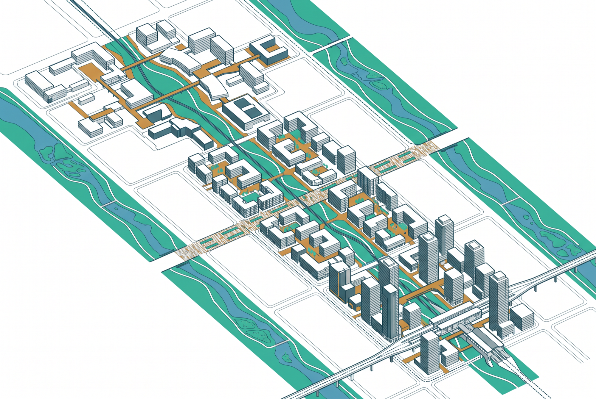
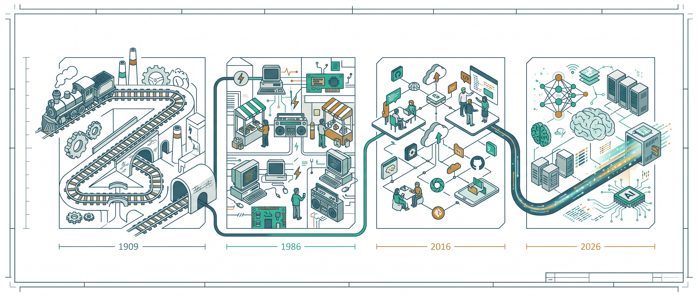
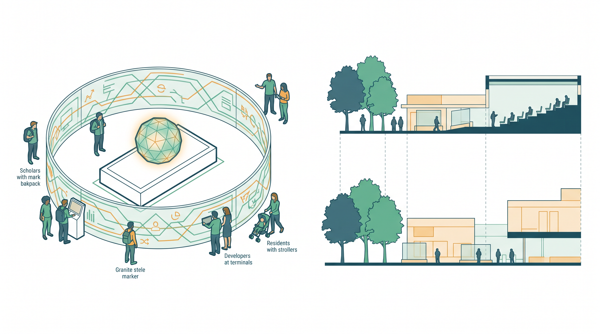
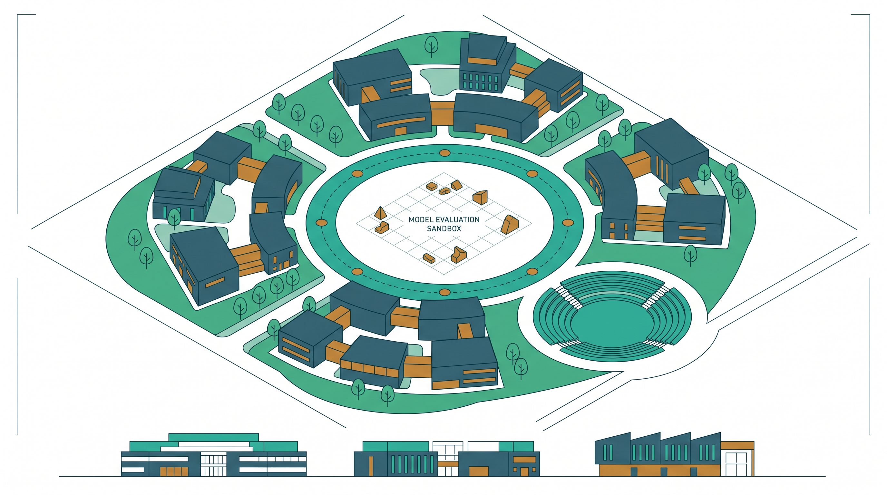
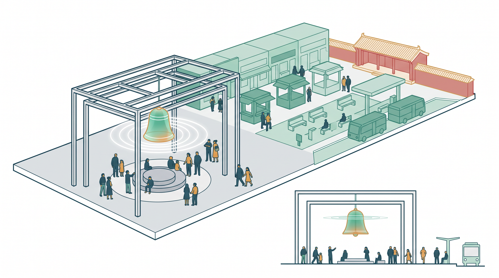
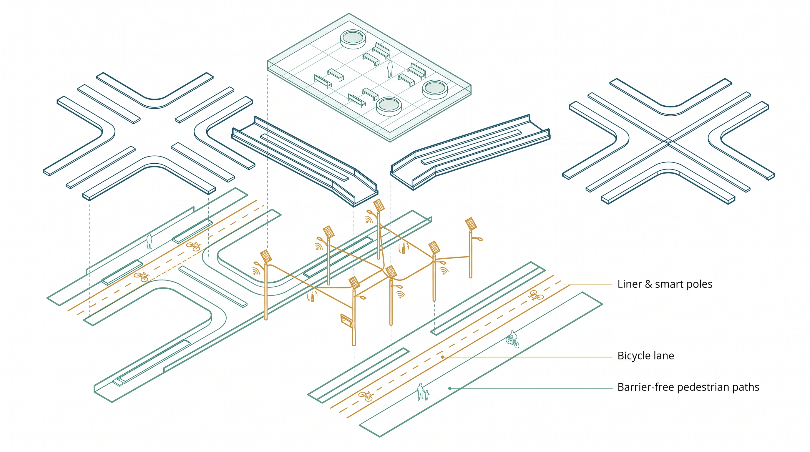
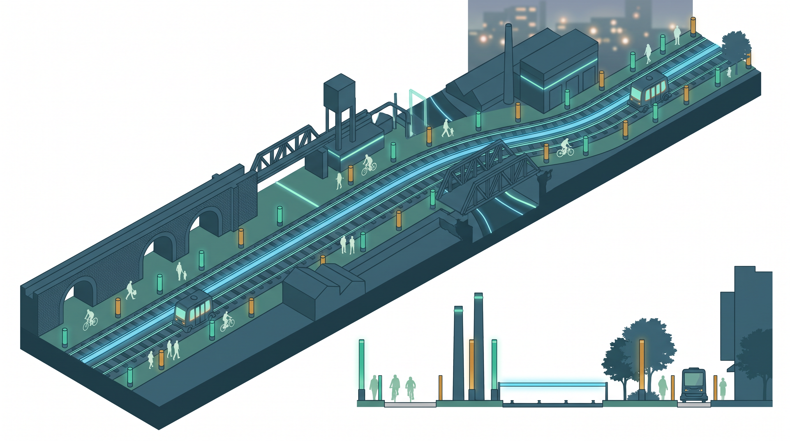

# A Century on the Smart Rail — Urban Design for the Centennial Jing-Zhang AI Innovation Belt

> **Status statement**: This proposal is AI-generated. Every spatial idea is a **conceptual suggestion, reference scheme, or material for professional teams to deepen** — not statutory planning, approval basis, engineering conclusion, investment commitment, or final retain-renovate-demolish judgment. Official precise redlines and planning controls are missing; the proposal uses the repository-registered provisional boundary and will be recalculated when official data arrives. All AI-generated concept images in assets/media/ are **design-intent illustrations, not site evidence**; toolchain disclosure in Chapter 12.

## Design Basis and Source List

The primary basis is the prequalification announcement issued by the Haidian Branch of the Beijing Municipal Commission of Planning and Natural Resources [source:OFFICIAL-ANNOUNCEMENT] and the agent taskbook [source:AGENT-TASKBOOK]. Machine-readable inputs come from the repository site package [source:SITE-PACKAGE]: design_brief, agent_taskbook (six mandatory tasks, ten charters, unified boundary clause, multimodal presentation contract), allowed_design_space, planning_limits, enums, schemas and visual_style_recommendations.

**New factual basis in v0.2 (cross-verified official public reports)**: Jing-Zhang Railway Heritage Park Phase 2 fully opened on 2026-08-06 — a 9 km green corridor (Xizhimen to the North 5th Ring), ~53 ha, serving ~70 communities and ~450,000 residents, with all enclosure fences removed, 9 urban branch roads opened through the line, 46 entrances, and an uninterrupted "three-path one-green" slow-traffic system [source:PARK-PHASE2-OPEN]. Furthermore, the regulatory plan for the blocks along the park was approved on 2026-08-12 [source:PARK-CONTROL-PLAN]. **These two official advances form v0.2's premise: north-south connectivity and the linear public-space skeleton are already delivered by the government; this proposal therefore does not redesign "connectivity" — it designs the functional-connection layer on top.** A related preview report (2026-07-30, pre-opening) is retained separately as a process record [source:PARK-PHASE2-PREVIEW] to avoid caliber mixing.

Source boundaries follow the public source registry [source:SOURCE-REGISTRY] and the processed fact pack [source:PROCESSED-FACT-PACK]. The submitted site boundary derives from the maintainer-defined provisional file [source:BOUNDARY-SOURCE]; the three key areas share its source [source:KEY-AREA-SOURCE], all labeled `geometry_role=provisional_constraint`, `official_boundary=false`.

Professional standards: the announcement requirements [standard:PROJECT-OFFICIAL-ANNOUNCEMENT], agent taskbook [standard:PROJECT-AGENT-OPEN-CALL-TASKBOOK], urban design measures [standard:MOHURD-URBAN-DESIGN-MEASURES], regulatory detailed planning depth [standard:MOHURD-CONTROL-DETAILED-PLANNING], land-use classification guide [standard:MNR-LAND-USE-CLASSIFICATION-GUIDE], architectural documentation depth [standard:MOHURD-ARCH-DESIGN-DEPTH-2016]. v0.2 adds three newly registered standards as scenario-design references: the Interim Measures for Generative AI Services [standard:GENERATIVE-AI-INTERIM-MEASURES] (compliance boundary for content-generating scenarios), the Barrier-Free Environment Law [standard:BARRIER-FREE-ENVIRONMENT-LAW] (human-service boundary at crossings and public-service venues), and the National Plan on Elderly Smart-Technology Difficulties [standard:ELDERLY-SMART-TECH-PLAN-2020-45] (parallel traditional-service principle for the health station). Land-use codes are synced to the 2026-08-16 official enum correction: commercial/service land now uses the 09 series (0901 commercial, 0902 business-finance); the former code 05 is now wetland, so all v0.1 code-05 parcels migrate to the 09 series. Evidence anchors: [data:geometry/site_boundary.geojson#SITE-001], [data:geometry/constraints.geojson#CON-HER-001], [metric:site_area_sqm].

## Three-Level Scope Framework

The announcement establishes three scope levels [source:OFFICIAL-ANNOUNCEMENT]; the proposal configures research — design — detailed design depth accordingly.

**Coordinated research area (~43.6 km²)**: research only, no spatial conclusions; announced area fact with provisional recomputation [metric:research_area_sqm].

**Overall design area (~11.4 km²)**: regulatory-plan-depth urban design framework; recomputed boundary area [metric:site_area_sqm], file [data:geometry/site_boundary.geojson#SITE-001] labeled `boundary_precision=provisional_rough`.

**Key detailed design area (~368.4 ha)**: Zhongzhiyuan AI Acceleration Area (announced 192.1 ha), Beijing AI Origin Community (104.3 ha), Dazhongsi AI Industry Cluster (72.0 ha); conceptual detailed design in [data:geometry/key_areas.geojson#PROV-KEY-001], recomputed areas [metric:key_area_total_sqm] and [metric:key_area_count].

**v0.2 framework correction**: with Phase 2 open, the spatial skeleton of the overall design area (9 km spine, 46 entrances, 9 branch roads) is a given condition [source:PARK-CONTROL-PLAN]. The three levels divide as — research: what new functional connections the AI era needs; overall design: where those connections land and how they are interfaced (this proposal's core increment); key areas: how each station deepens internally. Per [depth:three_level_scope_framework]; all layers and area metrics will be recalculated when official geometry arrives.

## Coordinated Research Area: Industry and Future City Research

**Overall concept: One Track, A Century Relay.** In 1909 the Jing-Zhang Railway opened; in August 2026 the same corridor reopened as a 9 km park spine. The proposal proposes a four-level naming system: belt (Jing-Zhang Smart Rail) — stations (Origin / Acceleration / Bell) — corridor (Smart Rail Corridor) — nodes (Open-Source Stele / Bell of Intelligence / six crossings). All names are original; the logo motif is a zigzag line (switchback abstraction + letter Z + data pulse) in Jing-Zhang teal with Smart-Rail glow and mileage-amber accents. **Prior-use self-check**: public search shows "smart rail" exists as a technical term in rail transit equipment; the combination "京张智轨 / Jing-Zhang Smart Rail" as a belt brand is not the same commercial mark; the proposal registers no trademark and the name requires professional clearance before any formal use (Chapter 12). This responds to agent.1 [standard:PROJECT-AGENT-OPEN-CALL-TASKBOOK].

**Four-era timeline narrative (1909—1986—2016—2026)**: the cultural narrative is not railway decoration but a relay of four generations of independent innovation on one corridor — 1909 self-built railway (engineering), 1986 Zhongguancun electronics street (market), 2016 China's open-source force (collaboration), 2026 full-stack AI belt (intelligence). Spatial carriers in Chapter 9. All four years are public history, without dramatization.

**Global case benchmarks (7 cases, each with "what not to copy")**: San Francisco SoMa/Mission Bay (anchor institutions + mixed blocks; not copyable: abundant incremental land) [source:CASE-SF-SOMA], London King's Cross (hub gateway + university; not copyable: single-owner development) [source:CASE-LONDON-KINGS-CROSS], Paris Station F (super-incubator in existing fabric; not copyable: era of low rents) [source:CASE-PARIS-STATION-F], Singapore one-north (phased integration; not copyable: strong state land control) [source:CASE-SG-ONE-NORTH], Seoul DDP (landmark-led; not copyable: single-landmark event density) [source:CASE-SEOUL-DDP], Shenzhen Bay (public-space quality; not copyable: share of new land) [source:CASE-SZ-BAY], Zhongguancun's own evolution (lesson: functional upgrading lagged business turnover) [source:CASE-ZGC-SELF-EVOLUTION]. Mechanism-level extraction only, responding to agent.2 per [depth:overall_spatial_structure].

**Future-city assessment**: AI new-quality productive forces change the "interface" of space, not the "essence" of cities. Three principles: renewal-first, scenario-as-infrastructure, public space as the means of innovation production.

## Overall Design Area: Urban Renewal and Regulatory-Plan-Level Urban Design

Organized as a regulatory-plan-depth framework [standard:MOHURD-CONTROL-DETAILED-PLANNING] [standard:MOHURD-URBAN-DESIGN-MEASURES]; outputs are conceptual zoning and structure.

**Overall structure v0.2: one belt, three stations, six crossings, two wings.** On top of v0.1's "one belt three stations two wings", v0.2 introduces the **six-crossing interface system** — borrowing the railway level-crossing motif, six pedestrian/cycle-friendly, scenario-mountable interface nodes (GW-IF-01~06, geometry in [data:geometry/public_space.geojson#GW-IF-01]) are placed where the 9 km spine meets east-west functional breaks. The officially opened 9 branch roads solved **traffic connectivity** [source:PARK-PHASE2-OPEN]; the six crossings solve **functional connection** — each is a "stitching kit" (barrier-free ramp + cycle waiting area + scenario mount post + honor display slot), aligned with the 9 existing branch roads rather than duplicating them. Structure logic per [depth:overall_spatial_structure]; zoning in [data:geometry/land_use.geojson#LU-001].

**Land-use layout (conceptual, 09-series enum)**: research land 0802 in the Zhongzhiyuan and Origin cores [metric:land_use_0802_sqm]; commercial 0901 along the Dazhongsi hub and gateways [metric:land_use_0901_sqm]; business-finance 0902 at the Acceleration Station east wing and gateway frontages [metric:land_use_0902_sqm]; urban residential 0701 preserving community fabric [metric:land_use_0701_sqm]; roads 1207 [metric:land_use_1207_sqm] [metric:road_area_sqm] [metric:road_ratio]; park green 1401 [metric:green_space_area_sqm] [metric:green_ratio]; plazas 1403 [metric:public_space_area_sqm] [metric:public_space_ratio]; reserved 16 held strategically. Conceptual footprints [metric:building_footprint_area_sqm] [metric:building_density], layer [data:geometry/buildings.geojson#BLDG-Z01].

**Intensity and retain-renovate-demolish**: official FAR/height/density/setbacks missing in planning_limits.json, marked "pending official confirmation" [depth:development_intensity_controls] [depth:height_massing_character]; TOD gradients with heritage-sensitive reduction, no numeric commitments. Renewal-first with point insertions [depth:retain_renovate_demolish], no parcel-level demolition conclusions. Notably, the regulatory plan along the park is approved [source:PARK-CONTROL-PLAN]; wherever this conceptual proposal conflicts with its control conditions, the official plan prevails — recorded in assumptions.json.

## Detailed Design of Key Areas

Each key area forms a complete mini-scheme [depth:three_key_area_detailed_design]; geometry [data:geometry/key_areas.geojson#PROV-KEY-002], public space [data:geometry/public_space.geojson#PUBLIC-P01].

**① Beijing AI Origin Community (Origin Station, announced 104.3 ha)**: the "first scene" of a world-class AI ecosystem. Spatial formula "one stele, one loop, one strip" — Open-Source Stele plaza (mounted at [data:geometry/public_space.geojson#SCN-S02]), developer loop, open-campus interface strip. Mixed scholar-developer blocks via existing-interface activation; departure-ritual space. Scenarios: S01, S02, S03. Risks: campus boundary policies, property complexity.

**② Zhongzhiyuan AI Independent Innovation Acceleration Area (Acceleration Station, announced 192.1 ha)**: the full-stack "locomotive depot" and AI-governance voice. Spatial formula "one core, one ring, two clusters" — evaluation & governance core ([data:geometry/public_space.geojson#SCN-S07]), acceleration green ring, west R&D cluster, east compute-and-data cluster. Scenarios: S04, S05, S06. Risks: siting and energy constraints of new infrastructure.

**③ Dazhongsi AI Industry Cluster (Bell Station, announced 72.0 ha)**: the "arrival experience field" of smart-native formats. Spatial formula "one bell, one street, one plaza" — Bell of Intelligence (adjacent [data:geometry/public_space.geojson#SCN-S08]), smart-native commercial street (0901), gateway plaza. Dialogue with Juesheng Temple's ancient bell under strict heritage avoidance [data:geometry/constraints.geojson#CON-HER-001]; TOD-organized buildings (intensity pending). Scenarios: S08, S09, S10. Risks: heritage control-zone review; hub crowd management.

## AI Innovation Ecosystem, Personas, and AI+ Scenarios

Responding to agent.3: 12 scenario cards + 5 personas + scenario protocol + refusal list.

**Scenario go-live iron rule (v0.2 core)**: every card must bind ① a spatial mount point (GeoJSON-referenced SCN id below) ② an operator (suggested) ③ an exit condition. **Any missing item means the scenario does not go live.** Maturity is graded as "pilot-ready / needs specialized review".

| # | Scenario | Mount point | Operator (suggested) | Exit condition | Maturity |
|---|---|---|---|---|---|
| S01 | AI tutoring block | [data:geometry/public_space.geojson#SCN-S01] | Community education center + schools | Stop on any minor-data complaint; 100% parental consent required | Needs review |
| S02 | Open-source market | [data:geometry/public_space.geojson#SCN-S02] | Developer self-governance committee | Two consecutive editions under 50 participants → online | Pilot-ready |
| S03 | Researcher collab station | [data:geometry/public_space.geojson#SCN-S03] | Joint university labs | Stop on data-domain violation | Pilot-ready |
| S04 | LLM evaluation sandbox | [data:geometry/public_space.geojson#SCN-S04] | Third-party evaluator | Stop on safety incident or unpublished results | Needs review |
| S05 | Robotics proving ground | [data:geometry/public_space.geojson#SCN-S05] | Professional operator | Stop on injury; 90-day continue/stop review | Needs review |
| S06 | AV shuttle test segment | [data:geometry/public_space.geojson#SCN-S06] | Local traffic authority + operator | Stop on any accident; permit expiry | Needs review |
| S07 | Scenario dispatch center | [data:geometry/public_space.geojson#SCN-S07] | Belt-level platform operator | Rectify if audit trail incomplete | Pilot-ready |
| S08 | Smart-native district | [data:geometry/public_space.geojson#SCN-S08] | Retail operator alliance | Stop on consumer-data violation | Pilot-ready |
| S09 | Urban vital signs | [data:geometry/public_space.geojson#SCN-S09] | City operations dept | Stop if aggregate-only principle broken | Pilot-ready |
| S10 | Jing-Zhang cultural AI guide | [data:geometry/public_space.geojson#SCN-S10] | Cultural operator | Offline fix on verified factual error | Pilot-ready |
| S11 | Waterfront test strip | [data:geometry/public_space.geojson#SCN-S11] | Water authority + street office | Stop on blue-line ecological disturbance | Needs review |
| S12 | Community AI health station | [data:geometry/public_space.geojson#SCN-S12] | Community health center | Stop without licensed-professional review | Needs review |

**Scenario protocol in one sentence**: explained before start (service, data use, exit) — visible during run (signage, human-review entry) — removable after end (detachable devices, deletable data). **Refusal list**: face recognition, behavioral profiling, cross-scenario personal-data linkage, real-time location tracking — none of these enter public-space scenarios; public safety does after-action review only, never live monitoring. **Meta-scenario (S13 appeal desk)**: any operational conflict can be appealed, results published, pilots suspendable — mounted at SCN-S07. Content-generating scenarios (S10, S08) stay within [standard:GENERATIVE-AI-INTERIM-MEASURES]; S12 follows parallel traditional-service principles [standard:ELDERLY-SMART-TECH-PLAN-2020-45]; crossings and public-service venues respect the human-service boundary of [standard:BARRIER-FREE-ENVIRONMENT-LAW].

**Personas (5, each with a hard boundary)**: researchers (boundary: research-data autonomy); developers/entrepreneurs (boundary: exit deletes data); industry engineers (boundary: tests never occupy public circulation); residents (boundary: rest rights precede event rights); international visitors (boundary: cross-border data compliance).

## Land Use, Building Scale, and Retain-Renovate-Demolish Strategy

All areas recomputed from GeoJSON under EPSG:4548, consistent with metrics.json [depth:land_use_layout] [depth:metrics_recalculation].

**Four-tier metric caliber (v0.2 transparency framework)**: **official values** (scope areas; park Phase 2: 9 km, ~53 ha [source:PARK-PHASE2-OPEN]) / **design targets** (conceptual zoning goals, non-statutory) / **provisional recomputed values** (from submitted geometry; recalculated when official geometry arrives) / **unknown** (FAR, height, density, green ratio, setbacks — unpublished; fabrication refused).

| Metric | Value | Caliber |
|---|---|---|
| Site area [metric:site_area_sqm] | 11,412,842 m² | provisional recomputed (announced ~11.4 km²) |
| R&D 0802 [metric:land_use_0802_sqm] | ~116.1 ha | provisional recomputed · conceptual |
| Commercial 0901 [metric:land_use_0901_sqm] | ~217.6 ha | provisional recomputed · migrated from v0.1 code 05 |
| Business-finance 0902 [metric:land_use_0902_sqm] | ~31.9 ha | provisional recomputed · conceptual |
| Residential 0701 [metric:land_use_0701_sqm] | ~113.3 ha | provisional recomputed · conceptual |
| Roads [metric:road_area_sqm] / [metric:road_ratio] | ~101.7 ha / 8.91% | provisional recomputed · conceptual network (not redlines) |
| Park green [metric:green_space_area_sqm] / [metric:green_ratio] | ~213.9 ha / 18.74% | provisional recomputed · conceptual |
| Public space [metric:public_space_area_sqm] / [metric:public_space_ratio] | ~21.9 ha / 1.92% | provisional recomputed (excl. SCENARIO_NODE points) |
| Footprints [metric:building_footprint_area_sqm] / [metric:building_density] | ~12.2 ha / 1.06% | conceptual, not statutory density |

**Caliber clarifications**: ① 53 km² research order-of-magnitude ≠ 53 ha park Phase 2 ≠ 11.4 km² overall design area; ② the 1207 conceptual road network aligns with the officially opened 9 branch roads — not the same redlines; ③ the green ratio is a conceptual zoning value, not the statutory ratio; the approved regulatory plan prevails [source:PARK-CONTROL-PLAN]. Partition [data:geometry/land_use.geojson#LU-001] is full-coverage, overlap-free. Per [depth:retain_renovate_demolish]: retain communities and heritage, renovate interfaces, no demolition conclusions, point insertions only.

## Transport, Rail, Municipal Infrastructure, and Public Services

**Transport and rail**: existing rail stations anchor arrivals; conceptual three-vertical-six-horizontal network [data:geometry/roads.geojson#ROAD-V01]; Smart Rail experience line (slow traffic + low-speed shuttle test segment under sandbox rules) [data:geometry/roads.geojson#ROAD-GW01]. **Six-crossing interface system (v0.2 core)**: GW-IF-01 South Gateway seam, 02 Community seam, 03 Academy seam, 04 Origin seam, 05 Green-Ring seam, 06 North-Ring seam [data:geometry/public_space.geojson#GW-IF-01]; each carries four standard components — barrier-free ramp (per [standard:BARRIER-FREE-ENVIRONMENT-LAW] human-service boundary), cycle waiting area, scenario mount post, honor display slot; crossings add no vehicle lanes, stitching slow traffic and functions only [depth:traffic_rail_slow_parking].

**Municipal and new infrastructure**: directional only — green-compute energy/cooling, sensing power/comms, co-mounted smart poles [depth:municipal_new_infrastructure]; no utility-routing conclusions.

**Public services**: community-service land 0702 follows existing communities [data:geometry/land_use.geojson#LU-001]; the AI health station (S12) embeds with licensed review and parallel traditional service [standard:ELDERLY-SMART-TECH-PLAN-2020-45]; education land 0804 serves campus linkage.

## Blue-Green Network, Public Space, and Urban Character

**Blue-green network**: "one belt, one ring, many points" [metric:green_space_area_sqm] [metric:green_ratio] [data:geometry/green_space.geojson#GREEN-001]; Xiaoyuehe blue line as provisional indication [data:geometry/constraints.geojson#CON-WAT-001], avoided by default [depth:blue_green_public_space].

**Public space system**: gateway plaza, Open-Source Stele plaza, Bell plaza, governance plaza and six crossings [metric:public_space_area_sqm] [metric:public_space_ratio] [data:geometry/public_space.geojson#PUBLIC-P01].

**AI pilgrimage landmarks (3+1, upgraded in v0.2)**: ① **Open-Source Stele** (upgraded from Origin Stele) — geodetic-origin imagery + updatable milestone chronology; the stele integrates an open data ring: each cohort's accepted proposals' structured data (GeoJSON/metrics) can be inscribed with the authors' explicit authorization, readable by visitors via QR — the stele is not only a memorial but the public API gate of the belt's open DNA; inscription is opt-in and exitable. ② **Bell of Intelligence** — AI co-created sound installation, honorary bell-ringer system. ③ **Smart Rail Corridor** — rails as light bands + mileage honor columns. Optional ④ Tianyou New-Track node. All respect agent.4 boundaries: no heritage/blue-line violation, no engineering conclusions, no over-entertainment.

**Urban character**: "industrial memory × academic temperament × intelligent glow"; wayfinding translates railway components with belt-wide Smart-Rail mileage notation (agent.5).

## Renewal Projects, Implementation Policy, and Phasing

**Renewal project list (conceptual, each with an evidence gate)**:

| Project | Content | Evidence gate to the next step |
|---|---|---|
| P1 Open-Source Stele plaza | Origin Community first demonstration | Data-inscription authorization mechanism in place |
| P2 Smart Rail demo segment | Slow traffic + guide (S06/S10 mounts) | AV sandbox permit |
| P3 Open-source market venue | Permanent home for S02 | First edition ≥50 participants |
| P4 Sandbox + dispatch center | S04/S07 | Evaluator qualification & safety assessment |
| P5 Bell of Intelligence + gateway plaza | Bell Station landmark | Heritage-authority siting review |
| P6 Smart-native district interface | S08 | Data-compliance review passed |
| P7 Waterfront test strip | S11 | Official blue-line confirmation |

**MVP pilot cards (v0.2 new; RACI for three first projects)**:

| Project | R | A | C | I | Concept KPI | Exit |
|---|---|---|---|---|---|---|
| Open-source market #1 | Community committee | Street office | University clubs | Belt platform | ≥50 participants, ≥40% return rate | Two misses → online |
| Smart Rail guide pilot | Cultural operator | Belt platform | Historians | Local street | Zero factual errors, ≥5,000 MAU | Offline fix on error |
| Sandbox buildout | Third-party evaluator | Belt platform | Safety assessor | Regulators | Evaluation protocol published | Stop on safety incident |

Phasing per [depth:phasing_implementation]: Phase 1 2026-27 [metric:phase_1_area_sqm] [data:geometry/phasing.geojson#PHASE-01]; Phase 2 2028-29 [metric:phase_2_area_sqm] [data:geometry/phasing.geojson#PHASE-02]; Phase 3 2030-33 [metric:phase_3_area_sqm] [data:geometry/phasing.geojson#PHASE-03].

**Policy instruments and events (directional)**: scenario list system, scenario vouchers, developer points and badges, dual-track governance; calendar — spring Departure Day, summer Open-Source Week, autumn Global AI Governance Forum, winter Bell Festival, monthly Interface Day (rotating crossings). Conversion path: market → incubation → scenario testing → deployment. All conceptual (agent.6).

**Regional synergy two-way matrix (v0.2 new)**: with Beiwei Community (data return; regional context [source:PUBLIC-REGIONAL-CONTEXT]), Future Science City (compute complementarity), Huairou Science City (big-science linkage), Beijing E-Town (smart-manufacturing conversion), and Jing-Jin-Ji (talent circulation) — each an "open / import / boundary" interface table in visual/index.html; no evidence-free commitments.

## Metrics, Area Recalculation, and Compliance Matrix

All metrics recomputed under EPSG:4548 [depth:metrics_recalculation]: [metric:site_area_sqm], [metric:research_area_sqm], [metric:key_area_total_sqm], [metric:key_area_count], and ratios [metric:green_ratio] [metric:public_space_ratio] [metric:road_ratio] [metric:building_density] are known and re-verifiable. Unknown metrics (FAR, height, density, official green ratio, setbacks) carry reason + required_for_formal_submission; fabrication refused. The three formal core visual metrics (site_area_sqm / green_ratio / public_space_ratio) match the data-value declarations in visual/index.html, satisfying the taskbook's visual metrics contract.

**Compliance matrix**: compliance_matrix.json covers announcement 1.3.1-1.3.3, 1.4.1-1.4.3, 1.5 and agent.1-agent.6 with section/layer/metric/drawing/visual/source/assumption/self-check links [depth:risk_missing_data]; standard_matrix covers the six mandatory standards plus three new reference standards; design_depth_matrix marks all 15 items complete.

## Risk, Copyright, and Compliance

**Data risk**: provisional boundaries are rough; unusable for redlines/ownership/precise-area claims; full recalculation when official geometry arrives [data:geometry/constraints.geojson#CON-HER-001]. **Regulatory-plan precedence**: the park-corridor control plan is approved [source:PARK-CONTROL-PLAN]; where this concept conflicts, the official plan prevails.

**AI-generated content disclosure (v0.3, multimodal guardrails)**: the 7 concept images in assets/media/ were generated with an image model (Gemini image model via ListenHub API); they are design-intent illustrations, **not site evidence or condition records**; no real portraits or copyrighted material appear in them; prompts and toolchain are recorded in report/narrative.md; all images carry alt text. All factual claims come from public sources, strictly separated from generated imagery. **v0.3 adds a 3D interactive model**: visual/index.html embeds an offline Three.js scene (one belt / three stations / six crossings); geometry data is embedded at build time from the submitted GeoJSON (zero remote requests, zero CDN, no tracking at runtime); Three.js r160 is bundled locally under visual/assets/ under the MIT license; orbit/zoom plus click-to-inspect on stations and crossings; the scene is a conceptual illustration, not site evidence.

**Brand and prior rights**: public search shows "smart rail" exists as a rail-transit technical term; the combination "京张智轨 / Jing-Zhang Smart Rail" is not used commercially and requires professional trademark clearance before formal use. The Open-Source Stele inscription mechanism is authorization-based and exitable; no personal data collected.

**Compliance baseline**: no claims of official approval; no investment/investment-promotion/policy commitments; data minimization and human review in all scenarios; immature technologies appear only in test/validation scenarios marked as sandboxed [standard:GENERATIVE-AI-INTERIM-MEASURES].

**Generation disclosure**: produced by an AI agent following the repository skill urban-design-ai-submission workflow (v0.2: absorbing community feedback, syncing the official enum correction and the taskbook's multimodal contract).

## References

- [source:OFFICIAL-ANNOUNCEMENT] Prequalification announcement (2026-05-09)
- [source:AGENT-TASKBOOK] brief/site-package/agent_taskbook.json (incl. Aug-2026 multimodal contract)
- [source:PARK-PHASE2-OPEN] Heritage Park Phase 2 opened 2026-08-06 (Beijing Daily / CNR / Sina cross-verified: 9 km, ~53 ha, ~70 communities / 450k residents, fences removed, 9 branch roads, 46 entrances)
- [source:PARK-CONTROL-PLAN] Park-corridor regulatory plan approved (beijing.gov.cn 2026-08-12)
- [source:PARK-PHASE2-PREVIEW] Phase 2 preview report (beijing.gov.cn 2026-07-30, pre-opening — process record)
- [source:SITE-PACKAGE] brief/site-package/ (incl. 2026-08-16 official enum correction)
- [source:SOURCE-REGISTRY] data/source_registry.json
- [source:PROCESSED-FACT-PACK] data/processed/agent_fact_pack.md
- [source:CASE-SF-SOMA] [source:CASE-LONDON-KINGS-CROSS] [source:CASE-PARIS-STATION-F] [source:CASE-SG-ONE-NORTH] [source:CASE-SEOUL-DDP] [source:CASE-SZ-BAY] [source:CASE-ZGC-SELF-EVOLUTION] [source:PUBLIC-REGIONAL-CONTEXT] 全球案例与区域背景（sources.json 登记条目）
- [source:BOUNDARY-SOURCE] brief/site-package/geometry/provisional_boundaries.geojson (PROV-SITE-001)
- [source:KEY-AREA-SOURCE] brief/site-package/geometry/provisional_boundaries.geojson (PROV-KEY-001/002/003)
- [standard:PROJECT-OFFICIAL-ANNOUNCEMENT] [standard:PROJECT-AGENT-OPEN-CALL-TASKBOOK] [standard:MOHURD-URBAN-DESIGN-MEASURES] [standard:MOHURD-CONTROL-DETAILED-PLANNING] [standard:MNR-LAND-USE-CLASSIFICATION-GUIDE] [standard:MOHURD-ARCH-DESIGN-DEPTH-2016] brief/site-package/standards/references/
- [standard:GENERATIVE-AI-INTERIM-MEASURES] Interim Measures for Generative AI Services — referenced only within Article 2 scope
- [standard:BARRIER-FREE-ENVIRONMENT-LAW] Barrier-Free Environment Law — referenced only within Article 39 listed services
- [standard:ELDERLY-SMART-TECH-PLAN-2020-45] State Council Doc 45 (2020) — reference for elderly-facing scenarios
- [depth:existing_conditions_diagnosis] [depth:three_level_scope_framework] [depth:overall_spatial_structure] [depth:land_use_layout] [depth:development_intensity_controls] [depth:height_massing_character] [depth:retain_renovate_demolish] [depth:traffic_rail_slow_parking] [depth:municipal_new_infrastructure] [depth:blue_green_public_space] [depth:three_key_area_detailed_design] [depth:renewal_project_list] [depth:phasing_implementation] [depth:metrics_recalculation] [depth:risk_missing_data]
- [data:geometry/site_boundary.geojson#SITE-001] [data:geometry/key_areas.geojson#PROV-KEY-003] [data:geometry/land_use.geojson#LU-R001] [data:geometry/buildings.geojson#BLDG-D01] [data:geometry/roads.geojson#ROAD-H04] [data:geometry/green_space.geojson#GREEN-002] [data:geometry/public_space.geojson#PUBLIC-P03] [data:geometry/constraints.geojson#CON-WAT-001] [data:geometry/phasing.geojson#PHASE-02] [data:geometry/public_space.geojson#SCN-S04] [data:geometry/public_space.geojson#GW-IF-04]

---

## Figures

**Derived evidence figures (programmatically generated from the same GeoJSON/metrics)**

**AI-generated concept images (assets/media/, design-intent illustrations, not site evidence)**

