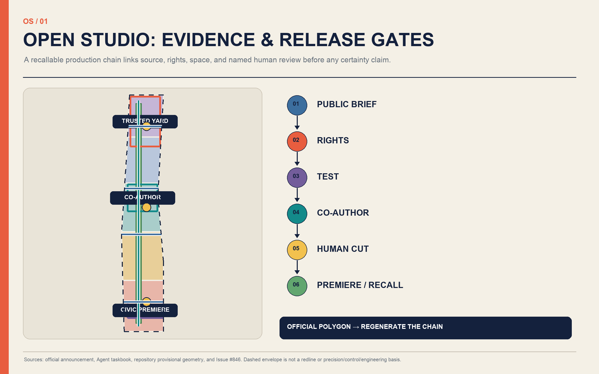
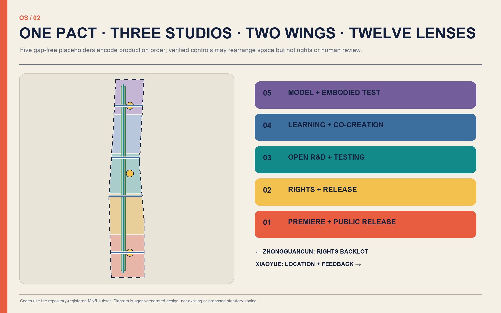
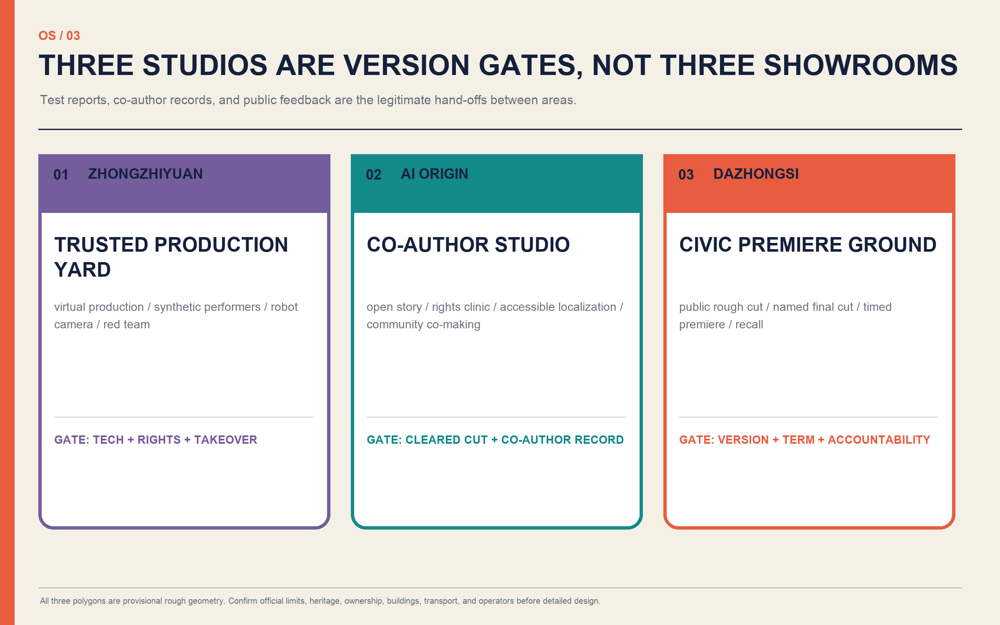
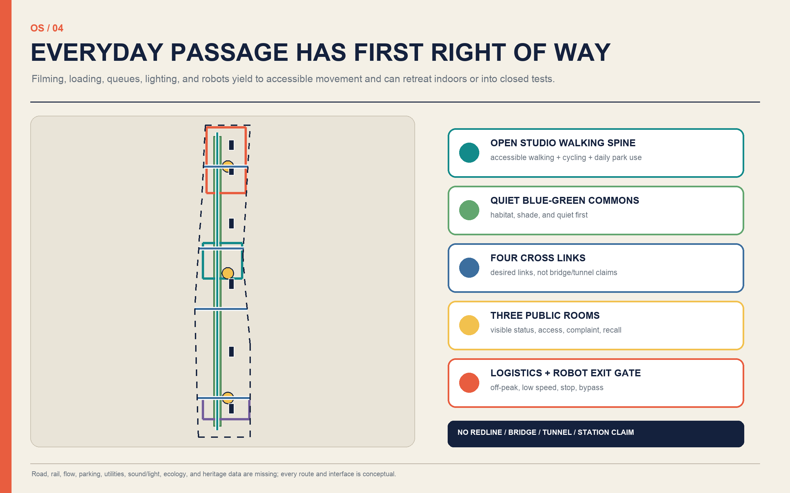
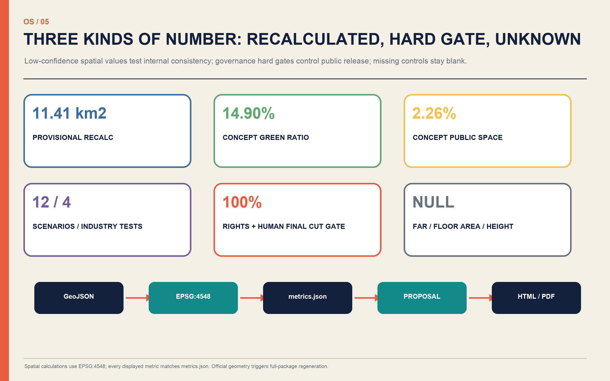

# JINGZHANG OPEN STUDIO

> Rights-cleared, fully credited, human-reviewed, and recallable. The city is not a free film set; residents are not default extras; AI is not the final author.

## Design Basis and Source List

This proposal first follows the official announcement on objectives, three scope levels, three key areas, and required urban-design depth. The Agent taskbook then adds naming, global cases, scenario cards, personas, pilgrimage landmarks, cultural narrative, and long-term operations. Registered references guide land-use codes, urban design, and regulatory-plan language. One evidence chain generates the narrative, nine GeoJSON layers, metrics, three matrices, bilingual figures, offline pages, and PDFs. [source:OFFICIAL-ANNOUNCEMENT] [source:AGENT-TASKBOOK] [standard:PROJECT-OFFICIAL-ANNOUNCEMENT]

The central fact is not that the boundary is settled, but that exact official polygons and verified building, road, rail, ownership, municipal, heritage, and ecological GIS are absent. `SITE-001` and all three key-area polygons are rough working geometries with `official_boundary=false`, `geometry_role=provisional_constraint`, and `boundary_precision=provisional_rough`. Issue #846 also records that this provisional overall envelope does not intersect one OSM representation of Jingzhang Heritage Park and is about 412.5 m away at the closest point. That reproduces a difference between unequal, non-adjudicating sources; it cannot decide the real park or official redline. [source:PROVISIONAL-BOUNDARIES] [source:ISSUE-846] [data:geometry/site_boundary.geojson#SITE-001]

Every placement, area, and ratio is therefore for concept comparison, package validation, and later recalculation—not a statutory plan, government decision, investment promise, or retain/renovate/demolish decision. Global cases contribute only mechanisms summarized from institutional websites; no imagery, logos, scale, or investment figures are copied. Media provenance can improve traceability but cannot automatically prove truth, copyright clearance, or consent. `sources.json` records use boundaries, while `assumptions.json` records release conditions. [source:SOURCE-REGISTRY] [source:CAI-C2PA] [depth:existing_conditions_diagnosis]

## Three-Level Scope Framework

JINGZHANG OPEN STUDIO applies one production chain across the three scales instead of mechanically overlaying three drawings. The 43.6 km² coordinated research area considers creative technology, talent, rights services, release, and international exchange as a regional ecosystem. The officially described approximately 11.4 km² overall design area brings the public production chain into land use, renewal, walking, blue-green systems, infrastructure, and character. The three key areas, announced as 368.4 ha in total, host trusted testing, co-authorship, and civic premiere. Announced areas remain textual references until official polygons arrive. [source:OFFICIAL-ANNOUNCEMENT] [depth:three_level_scope_framework] [metric:announced_overall_area_sqm]

| Level | Core judgment | Design depth | Recalculation / release condition |
| --- | --- | --- | --- |
| Coordinated research | Connect R&D, rights clearance, co-creation, human final cut, release, and archive | Ecosystem, cases, brand, operation, collaboration | Add verified actors and public baselines without promising partners or finance |
| Overall design | Build “One Pact, Three Studios, Two Wings, Twelve Lenses” | Land use, program footprints, mobility, blue-green space, projects, phasing | Redraw after official boundary, controls, ownership, existing-condition, and engineering data |
| Key areas | Test at Zhongzhiyuan, co-create at AI Origin, premiere at Dazhongsi | Position, space, renewal, mobility, public realm, scenarios, risk | Confirm each polygon, protection constraint, building, and operator before parcel design |

The levels share a Jingzhang Public Production Pact: the city is not a free film set, residents are not default extras, and AI is not the final author. Research defines rights and ecosystem rules; overall design turns rules into interfaces; detailed design tests them with scenarios and exit gates. A failure can retreat to an indoor, closed, or digital prototype rather than being concealed by capital construction. [standard:PROJECT-AGENT-OPEN-CALL-TASKBOOK] [data:geometry/key_areas.geojson#PROV-KEY-001] [depth:overall_spatial_structure]

The submitted rough envelope recalculates to about 1141.3 ha in EPSG:4548 solely for topology checking. It is not interchangeable with the announced 11.4 km² as a precision fact. Once the official polygon is issued, all land use, buildings, roads, green/public space, constraints, phasing, maps, PDFs, and metrics must be regenerated and all four review gates rerun. [data:geometry/land_use.geojson#LU-001] [metric:site_area_sqm] [depth:metrics_recalculation]

## Coordinated Research Area: Industry and Future City Research

The Chinese name “Jingzhang Kaipai” turns the railway idea of departure into the start of a responsible city production. `JINGZHANG OPEN STUDIO` signals an open production system, not an enclosed park. The original identity combines twin rail lines, a viewfinder, and a human editing cut. Navy marks a trusted base record, coral an editorial cut or warning, teal the public/blue-green route, and yellow a test status. It does not appropriate railway, temple, university, or company marks. [source:AGENT-TASKBOOK] [depth:overall_spatial_structure]

The spatial brand is “One Pact, Three Studios, Two Wings, Twelve Lenses.” The pact is the public-production charter. The three studios are Zhongzhiyuan Trusted Production Yard, AI Origin Co-Author Studio, and Dazhongsi Civic Premiere Ground. The Zhongguancun wing is a rights-and-release backlot for IP, law, compute, finance, localization, and distribution. The Xiaoyue River wing is a community location and feedback network. Twelve lenses correspond to twelve place-based scenarios. Together they translate the three positions and five functions into heritage narrative, everyday AI experience, full-stack making, global ecology, scenario validation, public vitality, and accountable governance. [source:AGENT-TASKBOOK] [standard:PROJECT-AGENT-OPEN-CALL-TASKBOOK]

The ecosystem is not a fabricated company list. It exposes eight interfaces: public commission, cleared material, model/tool, test stage, co-editing, named human final cut, public premiere, and version archive. Land supplies reversible rooms, talent gains interdisciplinary learning and residencies, compute uses tiered accounts, data is minimized and withdrawable, and scenarios open through operating permits. Institutions enter an operating diagram only after real written intent. [depth:renewal_project_list] [data:geometry/phasing.geojson#PHASE-001]

Seven global cases contribute mechanisms, never copied spaces or commitments:

| Case | Mechanism visible on the official site | Jingzhang translation |
| --- | --- | --- |
| UKRI CoSTAR National Lab | Applied R&D beside production, with prototypes and shared creative infrastructure [source:COSTAR] | Shared facilities and a test-before-public path across three areas |
| C2PA / Content Credentials | Open specification for recording origin and edit history [source:CAI-C2PA] | An Open Studio credential that explicitly does not prove truth, rights, or consent |
| MIT Open Documentary Lab | Storytellers, technologists, and scholars combine research, incubation, teaching, and discussion [source:MIT-ODL] | Co-authorship and reality-based storytelling ethics at AI Origin |
| Ars Electronica Futurelab | Artistic research connects with public expression [source:ARS-FUTURELAB] | Year-round R&D, an annual open week, and public critique |
| ZKM Karlsruhe | Research, studios, archives, and performance overlap in reused industrial fabric [source:ZKM] | “Old frame + removable production layer” renewal |
| Montréal SAT | Research, residency, training, immersive performance, and daily public life share one hub [source:SAT] | A making-learning-premiere-consumption loop and technology commons |
| Seoul XR Center / DMC | Development, verification, commercialization, talent, and public experience connect [source:SEOUL-XR-DMC] | Content launch and industry services at Dazhongsi without copying development scale |

World-class quality is measured not by landmark height or company count, but by whether small teams can access facilities, works can disclose rights and labor, failure is recorded, disputes can trigger recall, and communities may refuse to become source material. Candidate innovation indicators include rights-passport completeness, named Human Final Cut coverage, accessible-version coverage, dispute response time, and lawful reuse; targets await baselines, responsible operators, and audit methods. [metric:case_study_count] [depth:risk_missing_data]

## Overall Design Area: Urban Renewal and Regulatory-Plan-Level Urban Design

Five contiguous north-south bands use registered land-use codes as auditable placeholders: premiere culture/public release; creative enterprise/rights services; open R&D/interdisciplinary testing; talent learning/community co-creation; and foundation-model/embodied-production validation. They encode the sequence that public work must pass rights and human review. They are not a proposed statutory zoning map. Under verified controls the bands may move, mix, or shrink, but the public release chain should remain. [data:geometry/land_use.geojson#LU-001] [standard:MNR-LAND-USE-CLASSIFICATION-GUIDE] [depth:land_use_layout]

Renewal follows “inventory first, light adaptation second, new volume last.” Six `BLDG-*` shapes are program placeholders for a rights desk, city dailies archive, open story room, accessible localization workshop, model review room, and embodied cinematography safety bay. They are not existing buildings and imply no demolition. Professionals must first survey buildings, ownership, structure, fire safety, heritage, and energy, then match programs to retainable or adaptable fabric. Demolition is considered only after public benefit, life-cycle impact, and alternatives are evidenced. [data:geometry/buildings.geojson#BLDG-001] [depth:retain_renovate_demolish]

One desired walking spine, four cross links, and three reversible public rooms organize the public realm. Everyday passage and an accessible bypass come before filming, queues, or robots. Production vehicles use booking, consolidated loading, and off-peak windows; robots remain in slow controlled cells. The blue-green corridor first delivers habitat, shade, noise relief, and daily rest; filming is conditional. Bridges, tunnels, road redlines, station works, parking ratios, and park construction remain for transport, landscape, heritage, and engineering review. [data:geometry/roads.geojson#ROAD-001] [standard:MOHURD-CONTROL-DETAILED-PLANNING] [depth:traffic_rail_slow_parking]

Municipal capacity follows a light-asset sequence. Near-term work uses removable networks, edge processing, controlled compute accounts, equipment metering, and credential services. Power, cooling, communications, acoustics, and fire capacity are assessed before mid-term expansion. Long-term facilities pass energy, carbon, noise, heat, cybersecurity, and operating-cost review. Floor area, FAR, and height remain `unknown` because refusing invented controls is a design-quality decision. [metric:floor_area_ratio] [depth:municipal_new_infrastructure]

Character guidance favors low-glare, demountable, repairable layers with visible operating status. New elements stand apart from confirmed heritage fabric, equipment does not block primary routes, nights default to low light, and test/preview/public/paused content states remain legible. Parcel massing, roofs, interfaces, colors, and view corridors await official controls and professional development. [standard:MOHURD-URBAN-DESIGN-MEASURES] [depth:height_massing_character]

## Detailed Design of Key Areas

Each key area uses the same seven-part template: position, spatial structure, building update, mobility, public realm, AI scenario, and exit gate. Because the polygons are provisional, these are directional designs rather than parcel or engineering proposals. [data:geometry/key_areas.geojson#PROV-KEY-001] [depth:three_key_area_detailed_design]

### Zhongzhiyuan: Trusted Production Yard

This is a low-public-exposure validation area for generative video, virtual production, synthetic performers, robot cameras, real-time rendering, and deepfake red-teaming. A controlled test bay, rights-and-safety review room, failure archive, and small public observation window form the desired sequence, preferably in surveyed adaptable buildings. Logistics and test paths stay separate from daily walking, with physical emergency stops and accessible bypasses. A work advances to AI Origin only when technical operation, source rights, human takeover, and energy/noise/light checks all pass; otherwise it remains closed research or exits. [data:geometry/buildings.geojson#BLDG-005] [source:CAI-C2PA]

### Beijing AI Origin Community: Co-Author Studio

This connects AI researchers, the artistic resources such as Beijing Film Academy mentioned in the announcement, students, open-source developers, local knowledge holders, and independent creators. Mentioning the film academy signals a regional resource, not a partnership or property assumption. Open tables, a copyright clinic, cleared-material library, affordable residencies, accessible localization, and a version ledger support commission, writing, previsualization, and final cut. Campus, community, park, and station links need verified transport data. Residents choose named/anonymous credit, paid/voluntary status, and a withdrawal window. [data:geometry/public_space.geojson#PUBLIC-002] [source:MIT-ODL]

### Dazhongsi: Civic Premiere Ground

This hosts time-limited public previews of low-risk content, intelligent devices, immersive work, accessible multilingual editions, services for small creators, and international exchange. The sequence is public rough cut, named human final cut, then limited premiere. Entrances disclose version, AI use, licence period, responsible person, complaint path, and recall status. Commercial content never overrides public passage, safety, or small-business fairness. Station integration, four-quadrant walking, green-space overlap, and heritage relations require separate approvals; none is represented as approved engineering. [data:geometry/public_space.geojson#PUBLIC-001] [depth:traffic_rail_slow_parking]

Versions, not visitor counts, move between the studios. Zhongzhiyuan sends a test report and risk list; AI Origin sends a rights-cleared rough cut and co-author record; Dazhongsi returns public feedback, release state, and recall history. The Zhongguancun wing supports rights and distribution, while the Xiaoyue River wing supports cleared locations and community response. Any studio may stop without forcing the others to accept the risk. [data:geometry/phasing.geojson#PHASE-003] [metric:key_area_count]

## AI Innovation Ecosystem, Personas, and AI+ Scenarios

The ecosystem is a production protocol with human takeover, not “companies plus exhibition hall.” A public commission defines the problem; a rights backlot checks materials, models, and performer permissions; the Trusted Production Yard conducts controlled tests; the Co-Author Studio makes the narrative and accessible versions; a named Human Final Cut signs the release; the Civic Premiere Ground publishes for a limited period; and the archive preserves versions, complaints, and exit records. AI may organize, translate, generate, and detect, but cannot replace the rights holder, fact checker, director, editor, or public accountable person. [source:AGENT-TASKBOOK] [metric:scenario_count] [depth:overall_spatial_structure]

Six personas anchor design decisions: full-stack/multimodal researchers need reproducible tests and safety interfaces; directors, writers, editors, performers, sound and rights workers need credit, compensation, and Human Final Cut; students, young open-source developers, and startups need affordable equipment, courses, compute, and residencies; residents, local-knowledge holders, and caregivers need refusal, withdrawal, quiet bypasses, and offline feedback; small merchants, public-service bodies, and site operators need low-cost templates, responsibility boundaries, and maintenance support; international creators, visitors, and audiences relying on captions, audio description, plain language, or multilingual editions need accessibility and clear content status. [metric:persona_count] [depth:risk_missing_data]

The twelve readable cards map space, users, data, privacy, human review, suggested operator, visible layer, and risk. A star marks an industry validation scenario:

| ID / scenario | Space and users | Data, privacy, human review | Suggested operator, layer, and exit risk |
| --- | --- | --- | --- |
| SC-01 Civic commission desk | Rotates across three studios; residents, public bodies, creators | Collect minimum task data and de-identify publication; seven-party human committee defines problem and stop rule | Commission secretariat; `PUBLIC-*`; pause if participation is distorted |
| SC-02 Rights-cleared location assistant | Xiaoyue wing and desk simulation; production teams, residents | Public/cleared inputs only, no face or voice scraping; humans verify property, permits, heritage, fire, and traffic | Location-rights desk; `ROAD-*`; unlicensed filming or nuisance moves indoors |
| SC-03 AI storyboard and previs | AI Origin; directors, students, developers | Minimal script/version retention; writer, director, and editor retain Human Final Cut | Co-Author Studio; `BLDG-003`; unclear model sources or erased labor blocks release |
| SC-04 ★ Real-time virtual production bay | Closed Zhongzhiyuan cell; technologists, creators | Test latency, energy, failover, and asset origin without unrelated bystander data; safety officer signs | Trusted Production Yard; `BLDG-005`; stop on rights, energy, or failure risk |
| SC-05 ★ Synthetic performer rights test | Zhongzhiyuan; performers, voice artists, legal reviewers | Bind face, voice, motion, character, territory, and term; rights holder and human editor co-sign | Rights clinic; `BLDG-005`; unauthorized cloning, child simulation, or disputed likeness blocks release |
| SC-06 ★ Robot cinematography/device test | Controlled Zhongzhiyuan route; engineers, observers, disabled users | Log only equipment and safety events, no default identification; on-site human has physical stop | Test operator; `ROAD-005`; exit on geofence breach, lost link, blocked route, or distress |
| SC-07 ★ Provenance and deepfake red team | Review room; platforms, media, researchers | Test origin chain, edit history, and AI disclosure; isolate red-team data and require human explanation | Independent audit group; `CONSTRAINT-001`; broken provenance is labelled incomplete, never “true” |
| SC-08 Jingzhang memory reconstruction | AI Origin/archive; historians, residents, students | Voluntary oral-history rights; separate factual and synthetic layers; expert and community review | Public archive; `BLDG-002`; hallucination, unlabeled synthesis, or harmful portrayal triggers recall |
| SC-09 Community co-authored documentary | Community indoor sites; residents, young makers | Residents choose credit/anonymity, payment/voluntary status, and withdrawal; human editor final cut | Community production committee; `PUBLIC-002`; stop on relational coercion or scope creep |
| SC-10 Accessible multilingual workshop | AI Origin; disabled users, native speakers, international visitors | Minimize content inputs; target users/native speakers review captions, audio description, plain language, translation | Localization cooperative; `BLDG-004`; mistranslation or inaccessible output returns for revision |
| SC-11 Small-merchant content cooperative | Dazhongsi; small businesses, community services | Merchants provide authorized assets; no customer scraping or covert personalization; owner approves | Shared equipment desk; `LU-002`; exit on lock-in, hidden advertising, or unfair fees |
| SC-12 Public rough cut—premiere—recall | Dazhongsi premiere room; public, creators, operators | Show version, AI use, licence, and accountable person; moderated questioning and offline feedback | Premiere/recall desk; `PUBLIC-001`; major fact, rights, or safety issue pauses propagation |

Scenario access has four visible states: experiment, controlled preview, time-limited public release, and paused/archive. The same state appears at the door and in the digital version. Face, voiceprint, and emotion recognition are off by default; minors and bystanders receive higher consent protection. Complaints remain possible by phone or in person. Twelve cards include four explicit industry validation settings, but count never substitutes for quality or exit capacity. [metric:industry_test_scenario_count] [source:CAI-C2PA]

## Land Use, Building Scale, and Retain-Renovate-Demolish Strategy

Five touching, non-overlapping polygons cover the provisional envelope and use the registered MNR subset codes `0803`, `05`, `0802`, and `0804`. They express the functional order of a public production chain, not current land use or proposed statutory zoning. Official use, mix, industry categories, and public-service allocation must be rebuilt within verified boundaries and controls. [data:geometry/land_use.geojson#LU-001] [standard:MNR-LAND-USE-CLASSIFICATION-GUIDE] [depth:land_use_layout]

Six program placeholders total about 27.3 ha in EPSG:4548. This indicates a need for six adaptable room types; it cannot produce total floor area, FAR, height, or new-build scale. Priority is to retain valuable and safely adaptable fabric, renovate ordinary buildings with reversible fit-outs and equipment boxes, and pilot vacant space before construction. Demolition requires verified property, structure, heritage, carbon, public-interest, and alternatives review. No shape here means “must demolish.” [metric:building_footprint_area_sqm] [data:geometry/buildings.geojson#BLDG-001] [depth:retain_renovate_demolish]

The architectural model is “old frame + removable production layer.” Controlled bays need acoustic/light containment, equipment loading, fire safety, and logistics. Co-author spaces need divisible tables, daylight, quiet rooms, and accessible facilities. Premiere spaces need visible content state, queues outside the public route, egress, and low-glare interfaces. Roof equipment is consolidated and maintainable; transparent ground floors do not turn workers into continuous exhibits. [source:ZKM] [depth:height_massing_character]

Development intensity is managed in three columns: known, design proposal, and pending confirmation. Known items are announced areas and tasks. Proposals are program types, shared relationships, and reversible components. Pending items include FAR, floor area, height, density, setbacks, parking, road redlines, green ratio, services, and municipal capacity. `floor_area_ratio`, `total_floor_area_sqm`, and `building_height_m` remain `unknown` with reasons and will be recalculated by parcel. [metric:floor_area_ratio] [standard:MOHURD-CONTROL-DETAILED-PLANNING] [depth:development_intensity_controls]

Shared schedules expand access without assuming a single ownership model: daytime training and public service, evening co-creation and review, and indoor night production only within approved noise/light conditions. Equipment booking should remain affordable for small teams. Tenant, rent, fiscal, investment, and partnership ideas require real operators, financial models, and public-value terms. [source:AGENT-TASKBOOK] [depth:renewal_project_list]

## Transport, Rail, Municipal Infrastructure, and Public Services

The mobility layer contains a desired production walking spine of about 9.27 km and four public cross links. It shows connectivity preference, not an existing street or proposed redline. Continuous accessible walking, cycling, and daily park use have first claim on the route; sets, queues, and robot tests cannot sever it. Any bridge or tunnel across rail, expressway, or water requires separate engineering, safety, heritage, flood, and investment studies. [data:geometry/roads.geojson#ROAD-001] [metric:production_spine_length_m] [depth:traffic_rail_slow_parking]

Station integration follows three principles: understand content status on arrival, reach a public interface on foot, and keep equipment away from commuting flows. Entrances, ridership, connections, accessibility, and four-quadrant links at Dazhongsi and other stations await official data. Near-term work is limited to reversible wayfinding, booking, and walking information; no new entrance, underground link, or road change is presented as approved. [source:OFFICIAL-ANNOUNCEMENT] [standard:MOHURD-CONTROL-DETAILED-PLANNING]

Production logistics mean fewer vehicles, consolidated loads, off-peak windows, and traceable movements. Large equipment transfers at the edge, small electric carts use permitted routes, and loading never occupies the accessible path. Noise and glare are monitored without capturing faces. Robot cinematography stays in enclosed low-speed tests with a safety officer, physical emergency stop, and equivalent bypass. Boundary breach, lost communication, blocked access, or public distress stops the test. [data:geometry/roads.geojson#ROAD-005] [depth:risk_missing_data]

New infrastructure has four service layers: a rights/credential ledger; tiered compute and storage accounts; local-first caption, translation, and previsualization tools; and energy, sound, light, network, and maintenance metering. Sensitive assets never become public training data, logs use minimum retention and role permissions, and offline alternatives remain available. Before power, cooling, communications, fire, water, waste, and emergency capacity are verified, only removable equipment and capped concurrency are appropriate. [source:CAI-C2PA] [depth:municipal_new_infrastructure]

Public services are core infrastructure: copyright/likeness clinics, accessible localization, quiet rooms for children and caregivers, shared equipment, and a community complaint/recall desk occupy reachable ground-floor locations. Operators must record users, opening hours, and recurring cost so real use—not technology spectacle—determines continuation. [metric:slow_mobility_link_count] [source:SAT]

## Blue-Green Network, Public Space, and Urban Character

The blue-green network is ecological and everyday-life infrastructure before it is a location. A conceptual Quiet-Location Blue-Green Commons combines shade, stormwater, habitat, quiet periods, walking/cycling, and removable power. Filming avoids breeding seasons, extreme weather, and peak passage; lighting points downward, runs briefly, and uses low intensity. Trees are not cut and primary paths are not closed for a shot. Official park, river, flood, and heritage layers must reposition the concept. [data:geometry/green_space.geojson#GREEN-001] [depth:blue_green_public_space]

Three pilgrimage landmarks are reversible prototypes outside confirmed protection areas. Zhongzhiyuan SOURCE GATE visualizes material, model, edit, licence, version, and accountable person without judging truth. AI Origin CO-AUTHOR STUDIO uses an open table, production room, and contribution ledger to reveal who participated, what changed, and who made the final cut. Dazhongsi FINAL CUT CLOCK shows the current premiere version, human reviewer, licence term, test/public/paused status, complaint, and recall. “Clock” links railway time and the place name; it never occupies or modifies protected fabric. [metric:pilgrimage_landmark_count] [source:AGENT-TASKBOOK]

The component library includes removable viewfinders, status boxes, credential readers, seats with arms, caption/audio-description terminals, quiet-bypass signs, low-glare power boxes, complaint/recall points, mobile acoustic screens, and a contributors' credit wall. Every component has installation term, responsible person, maintenance cycle, and removal condition. No company mark or unlicensed likeness is used. [data:geometry/public_space.geojson#PUBLIC-001] [depth:height_massing_character]

The cultural narrative has three edits. Centennial Jingzhang provides a base layer of time, engineering, and public memory. Zhongguancun contributes technical experimentation, developer collaboration, and open debate. AI culture adds models, creative labor, rights, and public review to the credits. Historical footage and synthetic reconstruction are visibly separated; historians and communities review factual claims; algorithms never replace testimony. Errors can be corrected, disputes juxtaposed, and withdrawal traced. [source:OFFICIAL-ANNOUNCEMENT] [source:MIT-ODL] [depth:risk_missing_data]

Character avoids the generic formula of giant screens and neon “technology blue.” Paper, steel, signal cuts, and blue-green landscape form the palette. Screens integrate with shade and seating rather than advertising walls; production equipment is honestly visible but stowable; new layers remain distinct without dominating old fabric. Heights, views, and architectural controls await official material. [standard:MOHURD-URBAN-DESIGN-MEASURES] [depth:height_massing_character]

## Renewal Projects, Implementation Policy, and Phasing

The renewal list follows governance before equipment before space. Near-term projects are the Public Production Pact and rights templates, credential/version ledger, three removable public rooms, accessible localization workshop, quiet bypasses, and baseline surveys. Mid-term projects include the open story room, city dailies archive, small-merchant cooperative, community location network, and shared equipment. Long-term evaluation covers virtual production, embodied cinematography, and municipal expansion. Every item needs an owner, operator, maintenance budget, complaint path, and restoration plan. [data:geometry/phasing.geojson#PHASE-001] [depth:renewal_project_list]

| Phase | First deliverables | Gate to the next phase |
| --- | --- | --- |
| Near / PHASE-001 | Pact, rights clinic, dailies ledger, removable premiere interface, baseline survey | Official polygons and ownership/heritage/transport checks; operation can be staffed, challenged, and exited |
| Mid / PHASE-002 | Co-author space, accessible editions, community commissions, residencies, small-business cooperation | Rights passports and Human Final Cut meet hard gates; access, noise/light, cost, and equity reviews pass |
| Long / PHASE-003 | Foundation-model, real-time virtual production, and controlled embodied-camera facilities | Independent need, structure, fire, energy, municipal, technical-safety, and life-cycle finance studies |

Suggested policy tools include cleared-material/model licence templates, credit/compensation clauses, small public-commission prototypes, shared-equipment timeslots, accessible procurement, content-state labelling, recall, and exit bonds. They are directions for authorities, professionals, and operators to develop—not adopted policy, fiscal support, or procurement. [source:AGENT-TASKBOOK] [depth:phasing_implementation]

Long-term operation combines continuous production and annual opening: standing rights, likeness, and data clinics; shared equipment, residencies, and recall desk; monthly City Brief + Public Rough-Cut Night; quarterly cross-sector Open Production Sprint delivering one traceable prototype and one failure/exit record; semiannual red teams for provenance, deepfakes, synthetic performers, robots, and public-space operation; and a conceptual annual JINGZHANG OPEN STUDIO WEEK with open studios, AI screen premieres, rights forum, accessible editions, and community program while preserving a quiet bypass. [source:ARS-FUTURELAB] [source:COSTAR]

A suggested seven-party human council includes residents, creators, technologists, rights/legal, accessibility, history, and operations. AI organizes material but never gives final approval. Every twelve months, lawful reuse, complaints, maintenance, rights expiry, creator benefit, and public return determine continuation, revision, archive, or exit. No partner, event date, prize, fund, or international collaboration is a commitment until documented. [metric:phase_count] [depth:risk_missing_data]

## Metrics, Area Recalculation, and Compliance Matrix

Every spatial metric is recalculated by projecting EPSG:4326 exchange geometry to EPSG:4548. The provisional envelope is about 1141.3 ha; conceptual green space is 14.90%; conceptual public space 2.26%; six program placeholders total about 27.3 ha; and the mobility layer has five links. These numbers test the internal consistency of submitted design layers. Low-confidence values are not represented as statutory metrics, and verified boundaries, controls, and existing conditions trigger full regeneration. [metric:site_area_sqm] [metric:green_ratio] [metric:public_space_ratio]

Innovation/public-interest metrics define formulas before baselines. Rights-passport completeness, named Human Final Cut coverage, and valid consent for identifiable persons are proposed as 100% hard release gates. Continuing metrics are credential retention, accessible-edition coverage, co-author rights records, human review of historical claims, median/P95 dispute response, continuous public passage, noise/light/traffic disturbance minutes, twelve-month lawful reuse, and exit restoration time. Internet recall cannot promise deletion; it records notice, takedown scope, downstream propagation, and unrecoverable copies. [metric:scenario_count] [depth:metrics_recalculation]

Evidence has four types: official textual values retain publisher and use boundary; submitted-design values retain geometry, formula, CRS, and assumptions; unsupported FAR, total floor area, and height use `null + reason`; operating measures keep formulas without invented baselines until an accountable collector exists. Public reporting aggregates area, proportions, versions, and response time without storing biometric identifiers. [metric:floor_area_ratio] [source:SOURCE-REGISTRY]

`compliance_matrix.json` covers 17 announcement requirements and agent.1–agent.6, 23 in total. `standard_matrix.json` addresses all five mandatory standards and retains the architectural-depth document as a data gap. All 15 items in `design_depth_matrix.json` are complete through readable conclusions, geometry, known/unknown metrics, assumptions, and release gates. “Complete” means the evidence and uncertainty handling are complete; it does not mean statutory inputs are confirmed. [standard:PROJECT-OFFICIAL-ANNOUNCEMENT] [depth:risk_missing_data]

## Risk, Copyright, and Compliance

Eight release/exit gates govern the chain. G0 Space and Source: provisional geometry is composition only. G1 Material Rights: unclear copyright, likeness, voice, mark, music, location, or model licence stays internal. G2 Fact and Culture: hallucinated history, false endorsement, or unlabeled reconstruction cannot premiere. G3 Privacy and Vulnerability: no default face/voiceprint; minors, bystanders, and oral history receive higher consent. G4 Technology and Provenance: tools and edits are disclosed; a broken credential becomes “incomplete origin,” never truth. G5 Spatial Operation: failed passage, accessibility, noise/light, fire, traffic, green, or heritage condition moves indoors or pauses. G6 Public Preview: deception, discrimination, cultural harm, unreadable accessibility, or no human takeover returns for revision. G7 Release and Final Cut: version, term, territory, platform, reuse, credit/pay, recall, and a named human signature precede publication. [source:CAI-C2PA] [depth:risk_missing_data]

G8 Post-release Exit triggers on rights withdrawal, major factual error, broken provenance/security, excessive collection, nuisance beyond approved thresholds, or unreachable complaint handling. It pauses new propagation, isolates assets/models, notifies rights holders and downstream users, preserves minimum audit evidence, removes equipment/restores public space, publishes a de-identified incident note, and requires independent human review before reopening. Offline complaint routes remain available; AI is never the final arbiter. [source:AGENT-TASKBOOK] [standard:PROJECT-AGENT-OPEN-CALL-TASKBOOK]

OpenAI Codex generated the original text, code-derived graphics, layout, and conceptual spatial placeholders for this entry. External pages contribute short paraphrases and links only; no external image, logo, or substantial passage is copied. PNGs rasterize local system fonts; PDFs embed only the STHeiti glyph subset used by the document and use Helvetica; no standalone font file is distributed. `report/copyright_statement.md` records generation and limits. The current licence is the repository-supported `COMMUNITY-DISPLAY-ONLY`; the participant may change it before submission only if actual rights support that choice. [source:SOURCE-REGISTRY] [depth:existing_conditions_diagnosis]

The package uses public/cleared repository material and official institutional background; it contains no personal, secret, internal, or non-public spatial data. It fabricates no endorsement, approval, operator, tenant, investment, or reward. Formal development requires planning, urban design, architecture, structure, fire, transport, municipal, landscape/ecology, heritage, copyright/legal, accessibility, data-protection, and community review. [standard:MOHURD-CONTROL-DETAILED-PLANNING] [data:geometry/constraints.geojson#CONSTRAINT-001]

## References

The following works materially informed the proposal; `sources.json` records the complete machine index, access dates, use, and exclusions:

1. Beijing Municipal Commission of Planning and Natural Resources, Haidian Branch, official prequalification announcement for the Centennial Jingzhang AI Innovation Belt, 2026. [source:OFFICIAL-ANNOUNCEMENT]
2. open-city-ai/haidian, Agent Open Call Taskbook excerpt and public site package, 2026. [source:AGENT-TASKBOOK]
3. Ministry of Natural Resources, registered land-use classification reference. [source:MNR-LAND-USE]
4. Ministry of Housing and Urban-Rural Development, registered urban-design and control-detailed-planning references. [source:URBAN-DESIGN-MEASURES] [source:CONTROL-PLANNING]
5. UKRI/AHRC, CoSTAR National Lab; C2PA/Content Authenticity Initiative, Content Credentials. [source:COSTAR] [source:CAI-C2PA]
6. MIT Open Documentary Lab; Ars Electronica Futurelab; ZKM Karlsruhe. [source:MIT-ODL] [source:ARS-FUTURELAB] [source:ZKM]
7. Société des arts technologiques, Montréal; Seoul Metropolitan Government, Seoul XR Center / DMC. [source:SAT] [source:SEOUL-XR-DMC]
8. open-city-ai/haidian Issue #846, reproducible difference between the provisional overall envelope and one OSM park representation. [source:ISSUE-846]

The cases show how different places organize creative-technology R&D, shared facilities, co-authored narratives, media origin, building reuse, talent, and public experience. The Jingzhang Public Production Pact, Human Final Cut, Three Studios/Two Wings/Twelve Lenses, and eight gates are original syntheses for this brief. No local law, scale, finance, partnership, or engineering conclusion is inferred from those cases. [depth:risk_missing_data] [source:COSTAR]
