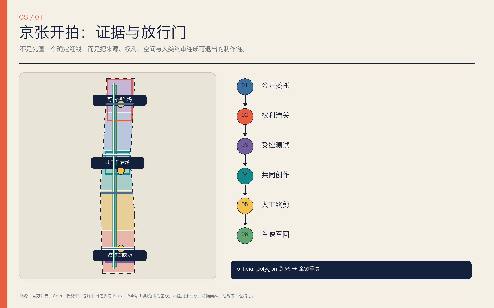
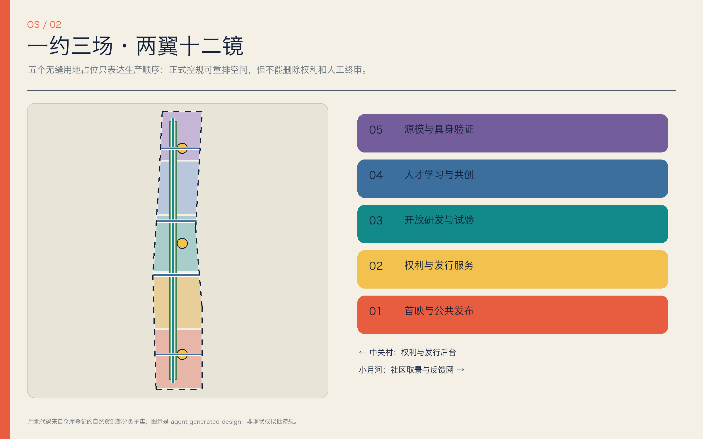
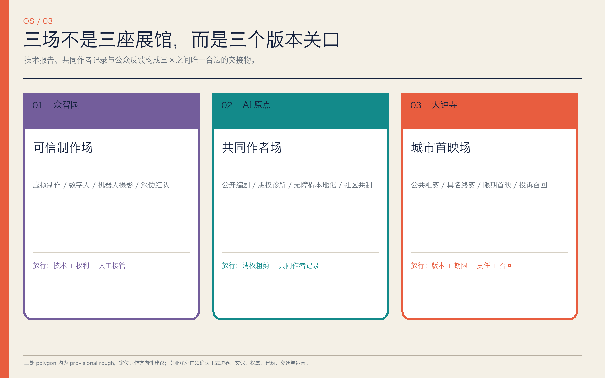
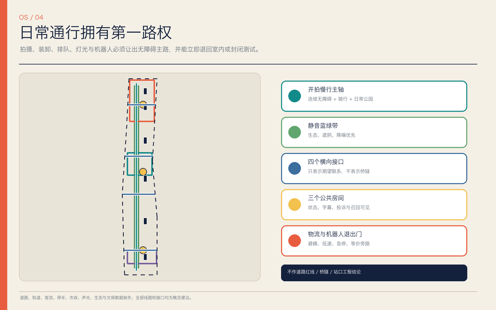
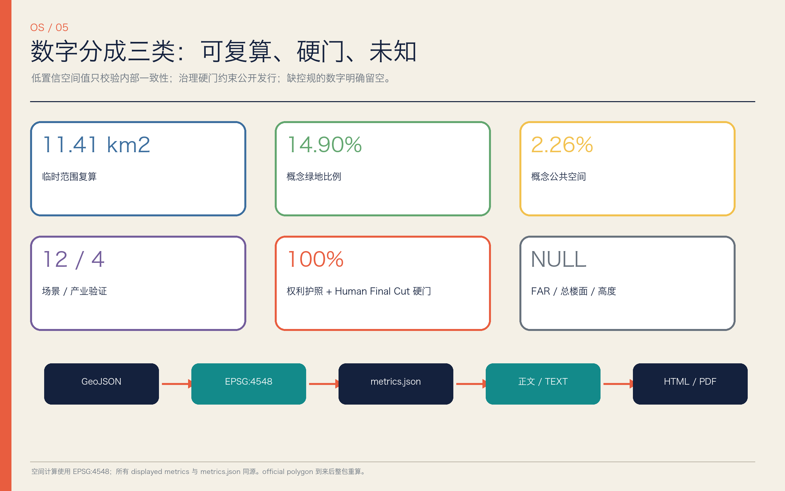

# 京张开拍 / JINGZHANG OPEN STUDIO

> 有版权，有片尾，有人工终审，也有撤片路径。城市不是免费片场，居民不是默认群演，AI 不是最终作者。

## 设计依据与资料清单

本方案首先服从官方公告的项目目标、三层范围、三处重点区和城市设计深度要求，再以面向智能体任务书补充命名、全球案例、场景卡、人物画像、朝圣地标、文化叙事与长期运营。用地分类、城市设计和控规表达分别采用仓库登记的正式参考；正文、九个 GeoJSON、指标、三类矩阵、双语图件、离线网页和 PDF 由同一证据链生成。[source:OFFICIAL-ANNOUNCEMENT] [source:AGENT-TASKBOOK] [standard:PROJECT-OFFICIAL-ANNOUNCEMENT]

当前最重要的事实不是“边界已经清楚”，而是官方精确 polygon、现状建筑、道路轨道、权属、市政、文保和生态 GIS 尚未公开。提交采用的 `SITE-001` 与三处重点区都是临时粗略工作几何，标注 `official_boundary=false`、`geometry_role=provisional_constraint` 和 `boundary_precision=provisional_rough`。Issue #846 还记录该临时总体范围与一份 OSM 京张遗址公园表达不相交、最近约 412.5 米；这只证明两份非同等资料存在可复算差异，不能据此裁定真实公园或正式红线。[source:PROVISIONAL-BOUNDARIES] [source:ISSUE-846] [data:geometry/site_boundary.geojson#SITE-001]

因此，所有落位、面积与比例只用于概念比较、结构化校验和后续复算，不构成法定规划、政府决定、招商承诺或拆改留结论。外部案例只引用机构官网的机制说明，不复制图片、标志、尺度或投资数字；媒体来源凭证只能提高可追溯性，不能自动证明内容真实、版权已清或人物已同意。完整用途边界见 `sources.json`，待确认事项见 `assumptions.json`，任何资料升级都必须重新渲染与自检。[source:SOURCE-REGISTRY] [source:CAI-C2PA] [depth:existing_conditions_diagnosis]

## 三层范围工作框架

“京张开拍”用一套生产链回应三层范围，而不是把三张尺度图机械叠加。43.6 平方公里统筹研究范围回答创作技术、人才、权利服务、发行和国际交流怎样形成区域生态；官方约 11.4 平方公里总体设计范围回答公共制作链怎样进入用地、更新、慢行、蓝绿、市政与风貌；三处重点区合计 368.4 公顷，分别承担可信测试、共同创作和公共首映。面积是公告文字值，正式 polygon 到来前不把粗略几何的计算值当成红线面积。[source:OFFICIAL-ANNOUNCEMENT] [depth:three_level_scope_framework] [metric:announced_overall_area_sqm]

| 层级 | 核心判断 | 交付深度 | 复算/放行条件 |
| --- | --- | --- | --- |
| 统筹研究范围 | 形成“研发—清权—共创—终剪—发行—归档”生态，并联动中关村与小月河两翼 | 产业、案例、品牌、运营与协同机制 | 以公开统计和经核实主体补充基线，不承诺伙伴与资金 |
| 总体设计范围 | 建立“一约三场·两翼十二镜”的公共制作网络 | 用地、建筑占位、慢行蓝绿、项目与分期 | 取得正式边界、控规、权属、现状和工程资料后重画 |
| 重点区域范围 | 众智园验技术，AI 原点共同创作，大钟寺首映反馈 | 定位、空间、更新、交通、公共空间、场景和风险 | 逐区确认 polygon、保护、建筑与运营主体后进入地块深化 |

三层之间设连续的“京张公共片约”：城市不是免费片场，居民不是默认群演，AI 不是最终作者。上层研究定义权利和生态规则，中层把规则转成空间接口，下层用场景和退出门检验它们；每一层失败都能回退到室内、封闭或纯数字原型，不以资本性建设掩盖治理缺口。[standard:PROJECT-AGENT-OPEN-CALL-TASKBOOK] [data:geometry/key_areas.geojson#PROV-KEY-001] [depth:overall_spatial_structure]

提交粗略范围在 EPSG:4548 下复算约 1141.3 公顷，仅为拓扑自检数；它与公告 11.4 平方公里近似值不能互换为精确事实。正式 polygon 发布时应同时裁剪用地、建筑、道路、绿地、公共空间、约束和分期，重算全部空间指标，并重新出图、生成 PDF 与运行四类 gate。[data:geometry/land_use.geojson#LU-001] [metric:site_area_sqm] [depth:metrics_recalculation]

## 统筹研究范围产业与未来城市研究

主名称“京张开拍”把铁路的“出发”转成城市内容的“开拍”，英文 `JINGZHANG OPEN STUDIO` 强调开放制作而非封闭园区。识别系统采用“轨道双线 + 取景框 + 人类终剪切口”：海军蓝代表可信底稿，珊瑚红代表人工切片与警示，青绿代表公共/蓝绿通道，黄色仅表示测试状态。Logo 只用本方案原创几何与系统字形渲染，不挪用铁路、寺院、学校或企业标志。[source:AGENT-TASKBOOK] [depth:overall_spatial_structure]

空间品牌为“一约三场·两翼十二镜”。一约是《京张公共片约》；三场是众智园“可信制作场”、AI 原点“共同作者场”、大钟寺“城市首映场”；中关村科技服务翼提供知识产权、法律、算力、融资、本地化和发行后台，小月河场景赋能翼承接社区出题、清权取景、微放映与环境反馈；十二镜对应十二类可落位场景。它把三大定位转成百年叙事、都市日常体验与 AI 融合创新，把五大功能转成全栈制作、国际生态、场景验证、活力公共空间与可问责治理。[source:AGENT-TASKBOOK] [standard:PROJECT-AGENT-OPEN-CALL-TASKBOOK]

区域生产链不是企业名录，而是八个可开放接口：任务委托、清权素材、模型/工具、测试棚、共创剪辑、人工终剪、公共首映、版本归档。土地提供可逆制作空间，人才获得跨学科课程和驻留，算力采用分级账户，数据坚持最少化与可撤回，场景以运营许可开放，资金和招商只保留建议角色。任何机构名称都须在取得书面意向后才可进入正式运营图。[depth:renewal_project_list] [data:geometry/phasing.geojson#PHASE-001]

七个全球案例只转译机制，不照搬空间或承诺：

| 案例 | 官网可见机制 | 京张转译 |
| --- | --- | --- |
| UKRI CoSTAR National Lab | 应用研发与真实制作并置，提供试验、原型和共享创意技术设施 [source:COSTAR] | 三区共享设备与“先验证、后公开”通路 |
| C2PA / Content Credentials | 记录内容来源与编辑历史的开放技术规范 [source:CAI-C2PA] | “开拍凭证”；同时声明凭证不等于事实、版权或同意 |
| MIT Open Documentary Lab | 叙事者、技术者和学者共同研究、孵化、教学和公开讨论 [source:MIT-ODL] | AI 原点共同作者生态与现实叙事伦理 |
| Ars Electronica Futurelab | 艺术研究实验室与公众表达相连 [source:ARS-FUTURELAB] | 常年研发、年度开拍周与公众批评 |
| ZKM Karlsruhe | 在存量工业建筑中叠合研究、工作室、档案、展演 [source:ZKM] | “旧骨架 + 可撤制作层”的更新优先级 |
| Montréal SAT | 研究、驻留、培训、沉浸展演与日常公共运营同屋 [source:SAT] | 制作—学习—首映—消费闭环与技术公地 |
| Seoul XR Center / DMC | 研发、验证、商业化、人才和公众体验衔接 [source:SEOUL-XR-DMC] | 大钟寺内容首发与产业服务接口，不复制开发规模 |

世界级不以地标高度或企业数量衡量，而看开放设施能否被中小团队使用、作品能否交代授权与劳动、失败能否记录、争议能否召回、社区能否拒绝成为素材。建议将“权利护照完整率、Human Final Cut 覆盖率、无障碍版本覆盖率、投诉响应时钟和合法复用率”纳入 AI 创新指数的候选指标，待基线、责任主体和审计方法确认后再设目标。[metric:case_study_count] [depth:risk_missing_data]

## 总体设计范围城市更新与控规深度城市设计

总体空间以南北五段的法定用地代码作可校验占位：首映文化与公共发布、创意企业与权利服务、开源研发与跨学科试验、人才学习与社区共创、源模与具身制作验证。五段不是拟议控规图，而是把“公开内容必须经过权利与人工终审”写入空间顺序；每段可在正式控规下迁移、混合或缩小，但公共放行链不能消失。[data:geometry/land_use.geojson#LU-001] [standard:MNR-LAND-USE-CLASSIFICATION-GUIDE] [depth:land_use_layout]

更新框架坚持“先盘活、再轻改、后判断增量”。六个 `BLDG-*` 是节目占位符，分别代表权利清关台、城市样片库、开源编剧室、无障碍本地化工坊、源模审片室和具身摄影安全棚；它们不是现状建筑，也不表达拆除。专业团队应先完成建筑测绘、权属、结构、消防、文保和能源审计，再把节目匹配到可保留或可改造载体；只有公共利益、全生命周期和替代方案均充分论证后才讨论拆除。[data:geometry/buildings.geojson#BLDG-001] [depth:retain_renovate_demolish]

公共空间由一条概念慢行主轴、四个横向接口和三个可逆公共房间组织。交通策略优先保持日常通行与无障碍旁路，拍摄车辆采用预约、合并装卸和避峰窗口，机器人只在低速封闭单元内测试。蓝绿带优先承担生态、降噪、遮阴和日常休憩，取景只是条件性附加用途；任何桥隧、道路红线、轨道接驳、停车配额或公园工程都留给交通、景观、文保和工程专业确认。[data:geometry/roads.geojson#ROAD-001] [standard:MOHURD-CONTROL-DETAILED-PLANNING] [depth:traffic_rail_slow_parking]

市政承载采用“轻资产先行”的分级思路：近期部署可撤网络、端侧处理、受控算力账户、设备计量和内容凭证服务；中期才评估电力、制冷、通信、声学和消防扩容；长期设施须通过能耗、碳、噪声、热环境、网络安全和运维成本审查。建筑总规模、容积率和高度目前为 `unknown`，不是缺少设计，而是拒绝用生成数字冒充审定条件。[metric:floor_area_ratio] [depth:municipal_new_infrastructure]

风貌控制建议采用低眩光、可拆装、可维修、可见状态的制作层：新增构件与历史本体保持可辨识距离，设备不遮挡主要公共路径，夜间默认低亮，测试/预览/正式/暂停四种内容状态在入口可读。待官方控制线和城市设计导则到位后，再把体量、屋顶、界面、色彩与视廊要求落到地块。[standard:MOHURD-URBAN-DESIGN-MEASURES] [depth:height_massing_character]

## 重点区域详细设计

三处重点区都采用“定位—空间—更新—交通—公共空间—场景—退出门”七项模板；由于 polygon 为 provisional，以下是方向性设计，不是地块或工程方案。[data:geometry/key_areas.geojson#PROV-KEY-001] [depth:three_key_area_detailed_design]

### 众智园：可信制作场 / Trusted Production Yard

定位为低公众暴露的生成视频、虚拟制作、数字人、机器人摄影、实时渲染与深伪红队验证区。空间上建议形成“受控试验棚—权利与安全审片室—失败样本库—小规模公开观察窗”，优先匹配经测绘可适应性利用的存量建筑；物流与测试路线同公共慢行分开，设人工急停和无障碍旁路。只有技术运行、素材权利、风险接管和能耗声光四项同时通过，样片才进入 AI 原点共同创作；否则降级为封闭研究或退出。[data:geometry/buildings.geojson#BLDG-005] [source:CAI-C2PA]

### 北京 AI 原点社区：共同作者场 / Co-Author Studio

定位为研发者、北影等公告所指艺术资源、高校学生、开源开发者、社区知识持有人和独立创作者的共同制作界面；提及北影只表示区域资源线索，不假定合作或权属。建议以开放长桌、版权诊所、清权素材库、可负担驻留、无障碍本地化和版本账本组织“出题—编剧—预演—终剪”。校区、园区、社区和轨道的具体连通必须以正式交通资料深化；居民拥有署名/匿名、报酬/志愿边界与撤回窗口，未清权素材不得外发。[data:geometry/public_space.geojson#PUBLIC-002] [source:MIT-ODL]

### 大钟寺：城市首映场 / Civic Premiere Ground

定位为通过前序门槛的低风险内容、智能终端和沉浸作品的公开预览、无障碍多语版本、小微内容服务与国际交流节点。三个动作是“先粗剪公测、再具名终剪、后限期首映”，入口公开版本、AI 使用、许可期限、责任人、投诉和召回状态；商业消费不能越过公共通行、内容安全与小微公平。大钟寺站一体化、四象限步行、绿地复合利用和文保关系均需专项审批，本案不作已批准工程判断。[data:geometry/public_space.geojson#PUBLIC-001] [depth:traffic_rail_slow_parking]

三场之间采用版本而不是客流作为交接物：众智园输出测试报告和风险清单，AI 原点输出清权粗剪与共同作者记录，大钟寺输出公众反馈、发行状态和召回记录。中关村翼提供权利与发行后台，小月河翼提供清权取景和社区反馈；任何一场停止都不会要求另两场冒险接续。[data:geometry/phasing.geojson#PHASE-003] [metric:key_area_count]

## AI 创新生态、人才画像与 AI+ 场景

生态不是“企业 + 展厅”，而是一条带人工接管的制作协议：公共委托定义问题，权利后台核对素材、模型和人物授权，可信制作场做受控测试，共同作者场完成叙事与无障碍版本，Human Final Cut 具名签署，城市首映场限期公开，样片库保存版本、投诉与退出记录。AI 可整理、翻译、生成与检测，但不能替代授权人、事实复核者、导演、编辑或公共责任人。[source:AGENT-TASKBOOK] [metric:scenario_count] [depth:overall_spatial_structure]

六类核心画像分别是：①全栈/多模态研究者与工具开发者，需要可复现实验和安全接口；②导演、编剧、剪辑、表演、声音和版权等创意劳动者，需要署名、报酬与 Human Final Cut；③学生、青年开源开发者和初创团队，需要可负担设备、课程、算力与驻留；④居民、地方知识持有人和儿童照护者，需要拒绝、撤回、安静旁路与非数字反馈；⑤小微商户、公共服务机构和场地运营者，需要低成本模板、责任边界与维护支持；⑥国际创作者、访客及依赖字幕、音频描述、简明文本等版本的观众，需要多语、无障碍和清楚的内容状态。[metric:persona_count] [depth:risk_missing_data]

十二张场景卡均把空间、用户、数据、隐私、人工复核、建议运营角色、可视化图层和主要风险写在同一行；“★”为产业测试验证场景：

| ID / 场景 | 空间与用户 | 数据、隐私与人工复核 | 建议运营角色、图层与退出风险 |
| --- | --- | --- | --- |
| SC-01 城市公共委托台 | 三场轮值；居民、公共机构、创作者 | 只收任务最小信息，公开前去个人化；七方人类委员会定义问题与停止条件 | 公共委托秘书处；`PUBLIC-*`；代表性不足或议题被操纵即暂停 |
| SC-02 清权取景助手 | 小月河翼及室内桌面推演；制片与居民 | 仅用公开/清权资料，不抓取人脸声纹；权属、许可、文保、消防和交通由人工核验 | 场地权利台；`ROAD-*`；未许可拍摄或扰民即转室内 |
| SC-03 AI 分镜与预演工坊 | AI 原点；导演、学生、开发者 | 脚本/分镜版本最少留存；编剧、导演和编辑保留 Human Final Cut | 共同作者场；`BLDG-003`；模型来源不清或抹除劳动即禁发 |
| SC-04 ★实时虚拟制作实验棚 | 众智园封闭单元；技术团队与创作者 | 测试延迟、能耗、故障切换、素材来源，不采无关旁观者数据；安全官终审 | 可信制作场；`BLDG-005`；超能耗、失效或权利不清则停机 |
| SC-05 ★数字人/合成表演权利测试 | 众智园；表演者、声音演员、法务 | 逐项绑定肖像、声音、动作、角色和期限；权利人与人类编辑双签 | 权利诊所；`BLDG-005`；未授权克隆、未成年人仿真或争议形象直接禁发 |
| SC-06 ★机器人摄影与智能终端试验 | 众智园受控路线；工程师、路人观察员、无障碍用户 | 只记录必要设备与安全事件，默认不识别人；现场安全员急停 | 测试运营组；`ROAD-005`；越界、失联、堵路或无旁路立即退出 |
| SC-07 ★内容凭证与深伪红队 | 众智园审片室；平台、媒体、研究者 | 验证来源链、编辑记录和 AI 声明；红队数据隔离，人类解释结果 | 独立审计组；`CONSTRAINT-001`；凭证断裂标为“来源不完整”，绝不冒充真实 |
| SC-08 京张记忆再现室 | AI 原点/样片库；文史人员、居民、学生 | 口述史自愿授权，史实与合成层分开；专家和社群双重复核 | 公共档案组；`BLDG-002`；历史幻觉、合成未标或伤害性再现即撤片 |
| SC-09 社区共同纪录片 | 小月河翼/社区室内；居民与青年 | 居民是共同作者，可署名/匿名、设报酬或志愿边界并在窗口期撤回；人类编辑终剪 | 社区制片委员会；`PUBLIC-002`；关系胁迫、二次用途越界即停止 |
| SC-10 无障碍多语版本工坊 | AI 原点；障碍用户、母语者、国际访客 | 内容最小化输入；字幕、音频描述、简明文本与多语由目标用户/母语者终审 | 本地化合作社；`BLDG-004`；误译、不可读或文化伤害退回修改 |
| SC-11 小微商户内容合作社 | 大钟寺；小微经营者与社区服务 | 商户自带并授权素材，禁止抽取顾客数据和暗中个性化；经营者最终批准 | 共享设备台；`LU-002`；平台锁定、隐性广告或不公平费用触发退出 |
| SC-12 公共粗剪—首映—召回 | 大钟寺首映客厅；公众、创作者、运营者 | 展示版本、AI 使用、许可与责任人；人工主持质询并保留线下反馈 | 首映与召回台；`PUBLIC-001`；重大事实/权利/安全问题立即暂停传播 |

场景开放采取四级状态：实验、受控预览、限期公开、暂停/归档；状态在门口和数字版本同屏。数据默认不做人脸、声纹和情绪识别，未成年人和旁观者采用更高同意门槛；投诉必须有电话/现场等非数字路径。场景数量达 12，其中 4 个明确为产业测试验证，但数量不替代质量与退出能力。[metric:industry_test_scenario_count] [source:CAI-C2PA]

## 用地、建筑规模与拆改留方案

用地 GeoJSON 以五个相接、无缝、无叠的分区完整覆盖临时范围，并使用自然资源部分类子集中的 `0803`、`05`、`0802`、`0804` 等代码。它表达公共制作链的功能秩序，不代表现状用地或拟批控规；正式用地、混合比例、产业门类和公共服务配置必须在 official polygon 与控规条件下重做。[data:geometry/land_use.geojson#LU-001] [standard:MNR-LAND-USE-CLASSIFICATION-GUIDE] [depth:land_use_layout]

六个节目占位基底在 EPSG:4548 下合计约 27.3 公顷，只说明当前概念需要六类可适应空间，不能推导总建筑面积、容积率、高度或新建规模。优先级为：保留经鉴定有价值且能安全适配的建筑；以可逆内装、设备盒和共享界面改造一般载体；对闲置空间先试运营；拆除仅在权属、结构、文保、碳和公共利益评估后由专业程序决定，本方案不标出“必拆”。[metric:building_footprint_area_sqm] [data:geometry/buildings.geojson#BLDG-001] [depth:retain_renovate_demolish]

建筑形态建议采用“旧骨架 + 可撤制作层”：受控棚需要声光遮蔽、设备荷载、消防和物流；共同作者场需要可分隔长桌、自然采光、安静室和无障碍卫生间；首映场需要可见状态、排队不占路、疏散和低眩光界面。屋顶设备集中、可维护且不抢夺历史轮廓，首层保持透明但不把工作者变成全天候展品。[source:ZKM] [depth:height_massing_character]

开发强度采用“已知 / 设计建议 / 待确认”三栏管理：已知只有公告面积和任务；设计建议是节目类型、共享关系与可逆构件；待确认包括 FAR、建筑面积、高度、密度、退线、停车、道路红线、绿地率、公共服务和市政容量。`floor_area_ratio`、`total_floor_area_sqm` 与 `building_height_m` 明确为 `unknown`，官方数据进入后以地块为单位重算，不用低置信占位值先占结论。[metric:floor_area_ratio] [standard:MOHURD-CONTROL-DETAILED-PLANNING] [depth:development_intensity_controls]

空间供给采用共享时段而非单一产权想象：白天训练与公共服务，傍晚共创和审片，夜间仅在声光许可内进行室内制作；设备按中小团队可负担规则预约。任何招商、租金、财政、投资或合作机构都是深化建议，须由真实运营主体、财务模型和公共价值条款确认。[source:AGENT-TASKBOOK] [depth:renewal_project_list]

## 交通、轨道、市政与公共服务设施

交通图层是一条约 9.27 公里的概念开拍慢行主轴和四个横向公共接口，表示优先联系，不表示现状道路或拟定红线。主轴以连续无障碍步行、自行车和日常公园使用为第一权利；拍摄布景、排队和机器人测试不得切断它。跨铁路、快速路或河道的位置若需桥隧，应另作工程、安全、文保、洪评和投资论证，本方案不下可行性结论。[data:geometry/roads.geojson#ROAD-001] [metric:production_spine_length_m] [depth:traffic_rail_slow_parking]

轨道站点一体化采用“到站即知状态、步行即达公共界面、设备不与通勤抢道”的原则。大钟寺站、学院路沿线和其他站点的出入口、客流、接驳、无障碍和四象限连通均待官方资料；近期只建议改进可撤导视、预约分流和步行信息，不能把新增出入口、地下连廊或道路改造写成已批准项目。[source:OFFICIAL-ANNOUNCEMENT] [standard:MOHURD-CONTROL-DETAILED-PLANNING]

制作物流采用“少车、合并、避峰、可追踪”：大型设备先在边缘换装，小型电动推车在许可路线和窗口内进入，装卸不占无障碍路径，噪声和眩光实时记录但不采集人脸。机器人摄影设置围合测试、低速、现场安全员、物理急停和等价旁路；超界、失联或公众不适即停机。[data:geometry/roads.geojson#ROAD-005] [depth:risk_missing_data]

新型基础设施由四个服务层组成：权利与内容凭证台账；分级算力/存储账户；本地优先的字幕、翻译和预演工具；能源、声光、网络与设备运维计量。敏感素材不进入公共训练集，测试日志设最短必要保留期和角色权限，离线替代始终可用。电力、制冷、通信、消防、给排水、垃圾和应急容量未核实前，只部署可撤设备并限制并发。[source:CAI-C2PA] [depth:municipal_new_infrastructure]

公共服务设施不是附属配套：版权/肖像诊所、无障碍本地化、儿童与照护者安静室、共享设备、社区投诉与召回台均进入首层可达位置。服务对象、开放时段和运营成本须在试运营中记录，以实际使用决定续期，而非以“科技展示”替代日常服务。[metric:slow_mobility_link_count] [source:SAT]

## 蓝绿空间、公共空间与城市风貌

蓝绿系统首先是生态与日常生活基础设施，其次才是取景地。概念“静音取景与蓝绿共生带”把遮阴、雨洪、栖息地、安静时段、步行骑行和可撤电源接口结合；拍摄须避开繁殖、极端天气和高峰通行窗口，灯光默认向下、限时、低色温，现场不得修剪树木或封闭主要路径来追求画面。实际京张遗址公园、清河/小月河关系必须用官方蓝绿与文保数据重新落位。[data:geometry/green_space.geojson#GREEN-001] [depth:blue_green_public_space]

三个朝圣地标都是保护范围外、可逆、待专业落位的原型：众智园“源片门 / SOURCE GATE”把素材、模型、编辑、许可、版本和责任人可视化，但不做真假裁判；AI 原点“共同作者片场 / CO-AUTHOR STUDIO”以开放长桌、制作棚和贡献账本展示谁参与、怎样改、谁终剪；大钟寺“终剪钟 / FINAL CUT CLOCK”显示当前首映版本、人工终审、许可期限、测试/正式/暂停状态和召回入口。“钟”只借铁路时刻与地名语义，不占用或改造文保本体。[metric:pilgrimage_landmark_count] [source:AGENT-TASKBOOK]

公共空间组件库包括：可撤取景框、状态灯箱、内容凭证阅读台、带扶手座椅、字幕/音频描述终端、安静旁路标识、低眩光电源盒、投诉与召回按钮、移动声屏障和贡献者片尾墙。每个组件都有安装期限、责任人、维护频次与撤场条件，不使用企业商标或未经许可人物形象。[data:geometry/public_space.geojson#PUBLIC-001] [depth:height_massing_character]

文化叙事采用“三次剪辑”：百年京张提供时间、工程与公共记忆的底片；中关村创新文化提供开放讨论、技术试错和开发者协作的剪辑台；AI 新文化把模型、创意劳动、权利与公共审查写进片尾。历史影像与合成复原分层展示，事实由文史专业者与社区复核，算法不替代证言；错误可更正、争议可并置、撤回可追踪。[source:OFFICIAL-ANNOUNCEMENT] [source:MIT-ODL] [depth:risk_missing_data]

总体风貌避免“巨型屏幕 + 霓虹科技蓝”的同质化。主色来自纸、钢、信号切口和蓝绿地景，屏幕嵌入遮阴与座椅，不制造全天候广告墙；制作设备保持诚实可见但可收纳，新增层与旧建筑可辨又不喧宾夺主。正式高度、视廊和建筑控制待资料后深化。[standard:MOHURD-URBAN-DESIGN-MEASURES] [depth:height_massing_character]

## 更新项目清单、实施政策与分期计划

更新清单以“先制度、后设备、再空间”排序，避免用重建设替代权利和运营。近期项目包括《京张公共片约》与权利模板、内容凭证/版本账本、三个可撤公共房间、无障碍本地化工坊和安静旁路；中期包括开源编剧室、城市样片库、小微商户合作社、社区取景网和共享设备；长期才评估虚拟制作棚、具身摄影安全棚与市政扩容。每项均须匹配 owner、operator、维护预算、投诉路径和退出复原方案。[data:geometry/phasing.geojson#PHASE-001] [depth:renewal_project_list]

| 分期 | 先行交付 | 进入下一期的门槛 |
| --- | --- | --- |
| 近期 / PHASE-001 | 片约、权利诊所、样片账本、可撤首映界面、基线调查 | official polygon、权属/文保/交通核验；试运营有人维护、有人投诉、能退出 |
| 中期 / PHASE-002 | 共同作者场、无障碍版本、社区委托、人才驻留与小微合作 | 权利护照与 Human Final Cut 达硬门；公共通行、声光、成本和公平审查通过 |
| 长期 / PHASE-003 | 源模、实时虚拟制作和具身摄影受控验证设施 | 需求、结构、消防、能源、市政、技术安全和全生命周期财务均独立论证 |

建议政策工具包括：清权素材与模型许可模板、创意劳动署名/报酬条款、公共委托小额试制、共享设备分时、无障碍采购、内容状态标识、投诉召回和退出保证金。它们都是供主管部门、专业团队与运营者深化的建议，不是已经确定的政策、财政支持或采购安排。[source:AGENT-TASKBOOK] [depth:phasing_implementation]

长期运营采用常年生产 + 年度开放：常设版权/肖像/数据权利诊所、设备共享、驻留、投诉与召回台；每月“城市出题 + 公开粗剪夜”；每季跨校企社 `Open Production Sprint`，交付一个可追溯原型和一个失败/退出记录；每半年做内容凭证、深伪、数字人、机器人摄影和公共空间联合红队；每年举办概念性 `JINGZHANG OPEN STUDIO WEEK / 京张开拍周`，含开放片场、AI 影视首映、权利论坛、无障碍版本展和社区片单，并保留安静旁路。[source:ARS-FUTURELAB] [source:COSTAR]

七方人类治理委员会建议包含居民、创作者、技术、法律版权、无障碍、文史和运营代表；AI 只辅助整理，不参与最终批准。每 12 个月按合法复用、投诉、维护、权利到期、创作者收益/公共回报决定续期、修订、归档或退出，不以一次首映客流取代长期价值。任何伙伴、活动时间、奖项、资金和国际合作在书面确认前都保持“概念建议”状态。[metric:phase_count] [depth:risk_missing_data]

## 指标体系、面积复算与合规矩阵

空间指标全部由 EPSG:4326 交换几何投影到 EPSG:4548 复算：临时范围约 1141.3 公顷、概念绿地 14.90%、概念公共空间 2.26%、六个节目占位基底约 27.3 公顷、慢行接口 5 个。它们只衡量当前概念图层的内部一致性；低置信值不会被包装成正式规划指标，官方边界、控规和现状进入后必须整体重算。[metric:site_area_sqm] [metric:green_ratio] [metric:public_space_ratio]

创新与公共利益指标先定义公式，再用试运营基线设目标：权利护照完整率、具名 Human Final Cut 覆盖率和可识别主体有效同意率建议作为公开发行的 100% 放行硬门；内容凭证保留率、无障碍版本覆盖率、共同作者权益记录率、历史事实人工复核率、争议响应中位/P95 时钟、公共通行连续率、声光交通扰动分钟、12 个月合法复用率、退出复原时长作为持续绩效。互联网内容不能承诺彻底删除，召回应记录通知、下架范围、下游传播和无法收回部分。[metric:scenario_count] [depth:metrics_recalculation]

指标证据分四类：官方文字值保留发布者与用途；submitted design 值保留 geometry、公式、CRS 和假设；无法支撑的 FAR、总楼面与高度使用 `null + reason`；运营指标在责任主体和采集方法未定时只给公式，不编造基线。面积差、比例、版本数量和投诉时间使用公开聚合，不存个人生物识别信息。[metric:floor_area_ratio] [source:SOURCE-REGISTRY]

`compliance_matrix.json` 覆盖公告 17 项与 agent.1–agent.6 共 23 项；`standard_matrix.json` 对 5 项 mandatory 标准均标为 addressed，并把建筑专业文件缺口保留为 data_gap；`design_depth_matrix.json` 的 15 项均以“可读结论 + 图层 + 指标/unknown + 假设 + 放行门”完成。complete 表示证据链和不确定性处理完整，不等于法定条件已确认。[standard:PROJECT-OFFICIAL-ANNOUNCEMENT] [depth:risk_missing_data]

## 风险、版权与合规说明

八道放行/退出门贯穿制作链：G0 空间与来源门——provisional 只作构图；G1 素材权利门——版权、肖像、声音、商标、音乐、场地和模型许可任一不清只能内部研究；G2 事实与文化门——历史幻觉、虚构背书、合成复原未标不得首映；G3 隐私与弱势保护门——默认不做人脸声纹，未成年人、旁观者和口述史采用更高同意；G4 技术与凭证门——工具与编辑链披露，凭证断裂就标“来源不完整”；G5 空间运营门——通行、无障碍、声光、消防、交通、绿地或文保不满足即转室内或暂停；G6 公共预览门——误导、歧视、文化伤害、无障碍不可读或无人接管即退回；G7 发行与终剪门——版本、期限、地域、平台、再利用、署名/报酬和召回责任明确后，由具名人类签署。[source:CAI-C2PA] [depth:risk_missing_data]

上线后 G8 退出门在权利撤回、重大事实错误、凭证/安全破坏、越界采集、扰民超阈或投诉失联时触发：暂停新传播，隔离资产/模型，通知权利人与下游，保留最小审计证据，撤设备并恢复公共空间，发布去个人信息事故说明，经独立人类复核才可重开。公开版本保留非数字投诉路径；AI 不得做最后仲裁。[source:AGENT-TASKBOOK] [standard:PROJECT-AGENT-OPEN-CALL-TASKBOOK]

版权方面，本提交的文字、代码生成图形、空间占位与版式由 OpenAI Codex 为本次方案生成；外部网页只作短摘要和链接，不复制图像、Logo 或大段文本。PNG 使用本机系统字体栅格化，PDF 仅嵌入本机 STHeiti 所用字形的子集并使用 Helvetica，不提交独立字体文件；完整声明见 `report/copyright_statement.md`。许可证暂选仓库支持的 `COMMUNITY-DISPLAY-ONLY`，参赛者可在提交前基于真实授权改为 CC 许可。[source:SOURCE-REGISTRY] [depth:existing_conditions_diagnosis]

数据方面只使用仓库公开/清权资料与官方机构网站背景；不包含个人资料，也未使用来源登记表之外的空间信息。几何为概念建议，未伪造政府背书、批准、运营主体、企业进驻、投资或奖励。正式深化至少需要规划、城市设计、建筑、结构、消防、交通、市政、景观生态、文保、法务版权、无障碍、数据保护和社区共同复核。[standard:MOHURD-CONTROL-DETAILED-PLANNING] [data:geometry/constraints.geojson#CONSTRAINT-001]

## 参考资料

以下书目是实际影响方案判断的主要材料，完整机器索引、访问日期、用途与禁用范围见 `sources.json`：

1. 北京市规划和自然资源委员会海淀分局，《百年京张 AI 创新带城市设计国际方案征集资格预审公告》，2026。[source:OFFICIAL-ANNOUNCEMENT]
2. open-city-ai/haidian，《面向全球智能体开展百年京张 AI 创新带城市设计开源征集任务书摘录》及场地资料包，2026。[source:AGENT-TASKBOOK]
3. 自然资源部，《国土空间调查、规划、用途管制用地用海分类指南》仓库登记参考。[source:MNR-LAND-USE]
4. 住房和城乡建设部，《城市设计管理办法》与《城市、镇控制性详细规划编制审批办法》仓库登记参考。[source:URBAN-DESIGN-MEASURES] [source:CONTROL-PLANNING]
5. UKRI/AHRC, CoSTAR National Lab；C2PA/Content Authenticity Initiative, Content Credentials。[source:COSTAR] [source:CAI-C2PA]
6. MIT Open Documentary Lab；Ars Electronica Futurelab；ZKM Karlsruhe。[source:MIT-ODL] [source:ARS-FUTURELAB] [source:ZKM]
7. Société des arts technologiques (Montréal)；Seoul Metropolitan Government, Seoul XR Center / DMC。[source:SAT] [source:SEOUL-XR-DMC]
8. open-city-ai/haidian Issue #846，临时总体设计范围与一份 OSM 公园表达的可复算差异记录。[source:ISSUE-846]

外部案例仅说明不同城市怎样组织创意技术研发、开放设施、共同叙事、媒体来源、存量更新、人才与公共体验；本方案作出的“京张公共片约、Human Final Cut、三场两翼十二镜、八道门”是针对本任务的综合设计判断。任何本地法规、规模、资金、合作或工程结论都不由案例推出。[depth:risk_missing_data] [source:COSTAR]
