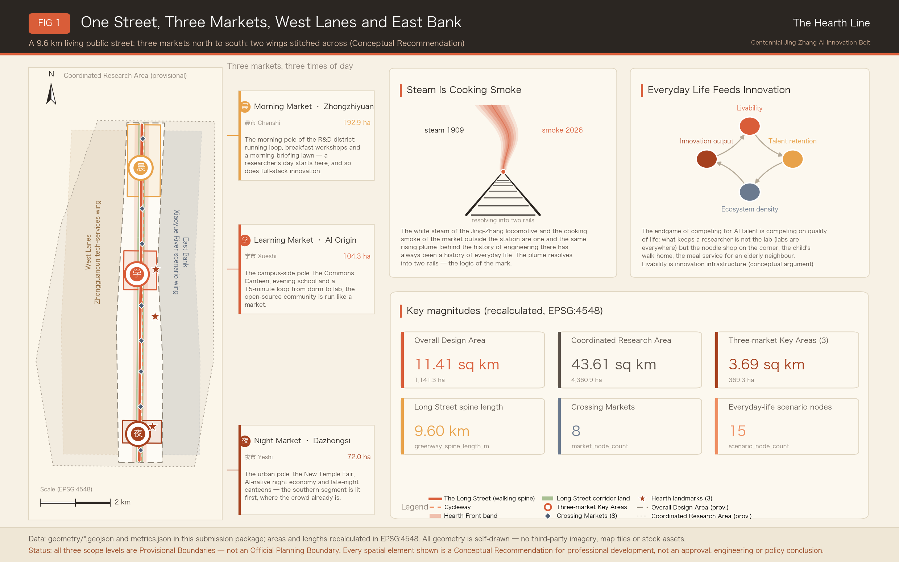
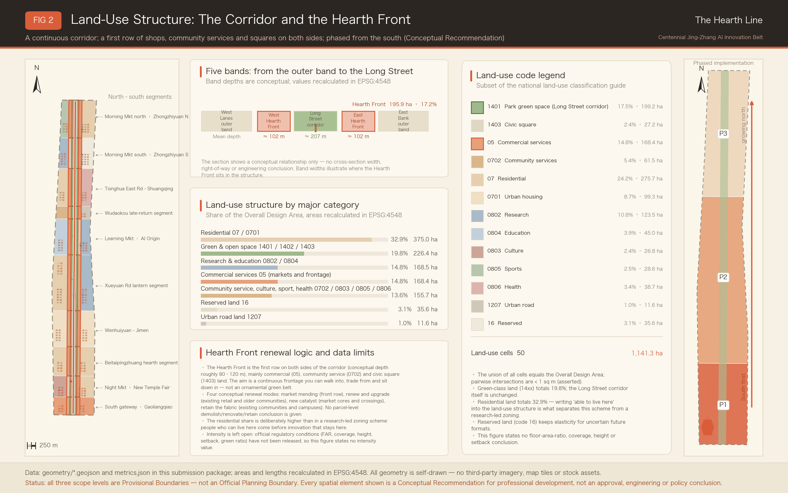
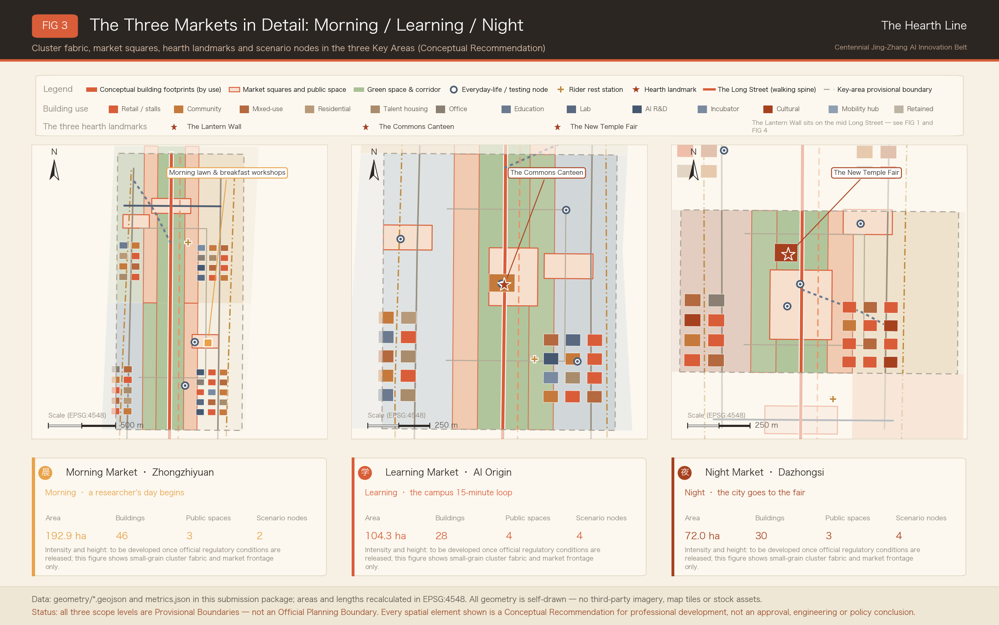
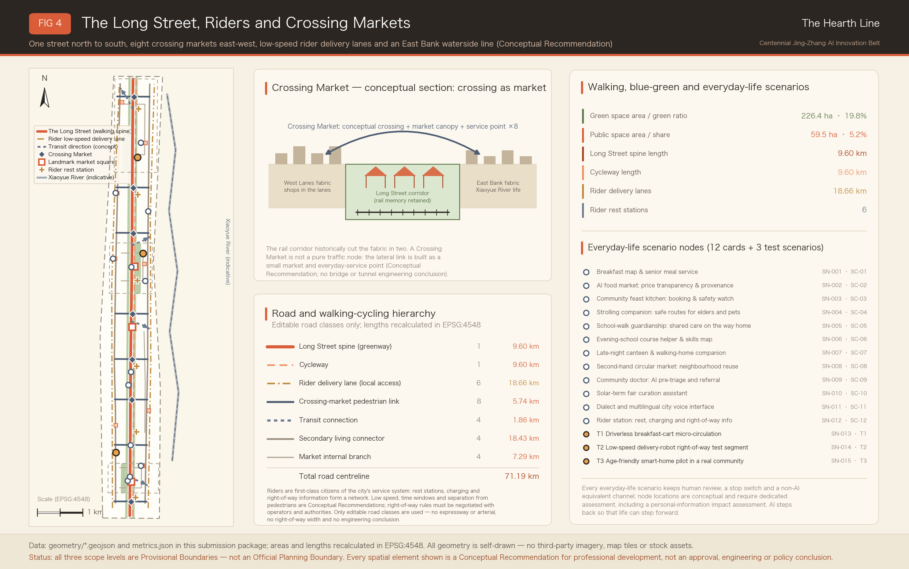
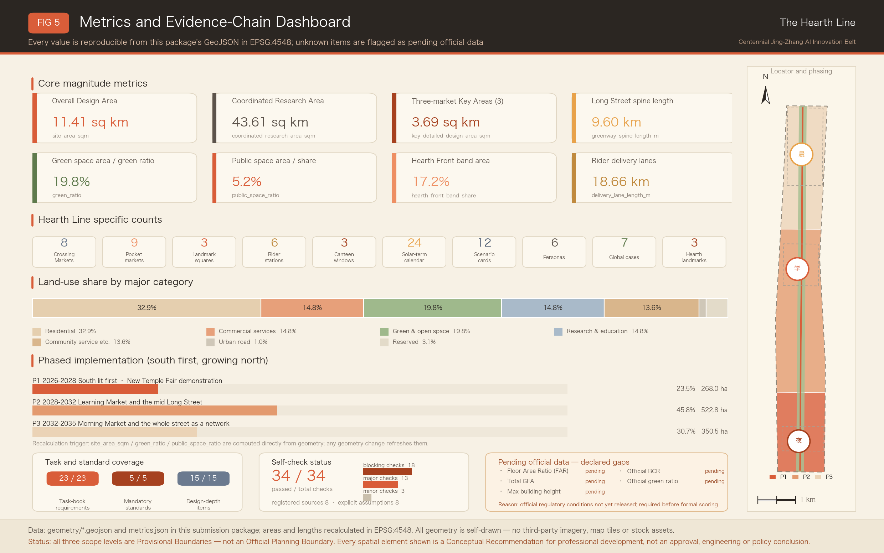

# The Hearth Line — An Open Co-Creation Proposal for the Centennial Jing-Zhang AI Innovation Belt

> One-line positioning: **the most advanced AI district should look like ordinary life** — AI steps back one pace so that life can step forward one pace.
>
> Naming core: **the steam was always cooking smoke**. A century ago the white plume above a Jing-Zhang locomotive and the cooking smoke under the eaves of the market outside the station were one and the same rising column; the reverse side of engineering history has always been the history of everyday life. (The proposal's Chinese name is the Jing-Zhang Yanhuo Line — *yanhuo*, literally "smoke and fire", is the Chinese word for the warmth of cooked meals, lit lamps and crowded street life; **The Hearth Line** is used as the primary brand name throughout this document, since a hearth is the fire that makes a house a home.)
>
> Every spatial statement in this document is a **conceptual recommendation, a reference option, and material for professional teams to develop further**. Nothing here constitutes a statutory planning outcome, an approval decision, an engineering conclusion, or an investment or policy commitment.
>
> Terminology follows the official competition Chinese–English glossary (`docs/terminology-glossary.md`): Coordinated Research Area (CRA), Overall Design Area (ODA), Key-Area Detailed Design Area (KDA), Regulatory Detailed Planning (RDP), Provisional Boundary (PB), Walking and Cycling Network (WCN), Blue-Green Space (BGS), Human Review (HR), Testing and Validation Scenario (TVS) and Conceptual Recommendation (CR) carry their glossary meanings; proper names such as Zhongzhiyuan, Dazhongsi and Jing-Zhang follow the glossary spellings, while the coined names of this proposal (Long Street, Morning Market, Learning Market, Night Market, Crossing Market, Hearth Front Row) are the author's own and are glossed at first use.

## Design Basis and Source List

This proposal takes the pre-qualification announcement issued by the Haidian Branch of the Beijing Municipal Commission of Planning and Natural Resources as its first basis, the open call task book addressed to agents worldwide as its task list, and the maintainer-registered provisional rough boundaries, key areas, enumerations and source registry inside the repository site package as its machine-readable basis [source:SRC-2026-BJ-GH-QUAL-PREANNOUNCEMENT] [source:SRC-2026-0518-AGENT-OPEN-CALL-TASKBOOK]. The announcement requires an outcome that reaches the urban design depth of Regulatory Detailed Planning and the urban design depth of an integrated planning implementation plan, so this proposal breaks every spatial claim into three independently checkable things: a geometry object, a recalculable metric, and a source or assumption that states its own limitation. The text does not replace the GeoJSON layers, the metric table, the A3 booklet, the A0 boards or the offline HTML exhibit; the narrative only threads them into one line a human can read.

The position of the Hearth Line has to be stated in the first section: it does not add another layer of technological skin to the Jing-Zhang Railway Heritage Park, it argues that an AI district is finally judged by the texture of daily life. The spatial vocabulary of this proposal is therefore markets, canteens, night schools, rider stations and lamplight, rather than exhibition halls, gateways and sculptures; here AI is the back kitchen, the road surface, a reminder under a lamp — never the signboard. This orientation must still pass professional scrutiny: urban character, public space and building layout are coordinated under the urban design administration measures [standard:MOHURD-URBAN-DESIGN-MEASURES], and land-use expression follows the national land and sea use classification guide [standard:MNR-LAND-USE-CLASSIFICATION-GUIDE].

The permitted use of each source is set out below; crossing these limits should be treated as a defect of this proposal:

- Five formally usable sources: the announcement, the task book, the urban design administration measures, the regulatory detailed planning formulation and approval measures, and the land-use classification guide, used for tasks, depth and classification conventions [source:SRC-MOHURD-CONTROL-DETAILED-PLANNING].
- Two background-only sources: public reporting on the "Three Zones and Two Wings" structure and on Haidian's "1+X+1" industrial system, used for narrative background only and never as a control basis [source:SRC-2026-BJ-KW-THREE-AREAS-WINGS] [source:SRC-2026-HAIDIAN-1X1].
- One provisional-only source: the rough polygons of the three scope levels and the three key areas, used only for generation, self-check and discussion [source:SRC-PROVISIONAL-BOUNDARIES-2026].
- OpenStreetMap data is not used, so no ODbL attribution clause is cited; every drawing, chart and illustration is drawn by this proposal's own scripts.

Both `geometry/site_boundary.geojson` and `geometry/key_areas.geojson` in the package carry `official_boundary=false`, `geometry_role=provisional_constraint` and `boundary_precision=provisional_rough`. They may be used for generation, self-check, visualisation and design discussion only, never as an official planning boundary, an approval basis, a precise area basis or a statutory control conclusion [data:geometry/site_boundary.geojson#SITE-001]. The recalculated area of the Overall Design Area is 1,141.28 hectares, about 0.11% away from the announced "approximately 11.4 square kilometres", the difference coming from the generalisation of the provisional polygon's corner points [metric:site_area_sqm]. Once official boundaries are released, land use, buildings, roads, green space, public space, phasing and every metric must be recalculated as a whole rather than by swapping a single file.

The scorable status of this proposal is therefore: **provisional boundary, precision warning retained, full recalculation pending release of official data; a data gap on the organiser's side does not by itself block content review**. On that basis, every structure, scenario, project and metric in the text is written under the principle of being discussable, checkable and recalculable once official boundaries replace the provisional ones. On existing conditions, this proposal admits that it holds only publicly available information, so the existing-conditions diagnosis is written as a method and a list of gaps rather than as a conclusion [depth:existing_conditions_diagnosis].

### Review-Dimension Cross-Reference Table (Opening Guide)

To let reviewers build an index before reading the body text, the table below groups the task book's review dimensions into seven working viewpoints, and gives for each one claim from this proposal and a directly checkable evidence entry. The grouping serves navigation only; it neither replaces the task book's own wording nor changes the item-by-item coverage recorded in the matrix files.

| Review dimension | The proposal's claim in one line | Main carrying section | Evidence pointer |
| --- | --- | --- | --- |
| Task book relevance | All six agent tasks and announcement items 1.3–1.5 are actually developed in the body text, not merely ticked in a matrix | All 13 sections | 23 mandatory requirements attached item by item [metric:compliance_requirement_count] |
| Originality | Built on "the steam was always cooking smoke", the naming system of one street, three markets, crossing markets, the new temple fair, the canteen and the lantern wall stands on its own | Coordinated Research Area: Industry and Future City Research | 3 landmarks and 4 flagship events are all original proposals [metric:pilgrimage_landmark_count] [metric:annual_event_count] |
| AI innovation | Every scenario card carries accountability split, non-AI equivalent service and exit conditions, so AI is a governed object rather than a label | AI Innovation Ecosystem, Personas, and AI+ Scenarios | 12 scenario cards and 3 testing scenarios [metric:scenario_card_count] [metric:test_validation_scenario_count] |
| Implementability | South first, lights first: every P1 action is a lightweight, reversible facility that depends on no undetermined regulatory condition | Renewal Projects, Implementation Policy, and Phasing | 15 renewal projects and a three-phase layer [metric:renewal_project_count] [depth:phasing_implementation] |
| Public interest and inclusivity | Riders and city service workers are written as a first-class persona, and every scenario card must keep a non-AI channel open | Blue-Green Network, Public Space, and Urban Character | Public space supply and component requirements [metric:public_space_ratio] [depth:blue_green_public_space] |
| Risk and compliance | All five intensity-type metrics are registered as pending rather than filled with guesses; eight risk dimensions carry human review notes | Risk, Copyright, and Compliance | Unknown metrics and the gap list [metric:floor_area_ratio] [depth:risk_missing_data] |
| Completeness of expression | Bilingual body text, bilingual drawings, an offline exhibit page and three matrices are submitted as a set | Metrics, Area Recalculation, and Compliance Matrix | Recalculation chain and depth-item coverage [depth:metrics_recalculation] [metric:design_depth_item_count] |

The table is meant to be used as "read the claim, then check the evidence": if any row's claim cannot be found developed in the body text, or if the metric or layer it points to does not exist, that should be counted as a defect of this proposal rather than a matter of presentation.

## Three-Level Scope Framework

In this proposal the three scope levels are understood as one transmission chain running from "why would anyone want to live here" down to "which lane lights up at what hour", and their structural relationship is governed by a single depth item [depth:three_level_scope_framework]. The Coordinated Research Area answers how the AI industrial ecosystem and the future urban form should be organised; its recalculated area is 43.61 square kilometres, consistent with the announced figure of about 43.6 square kilometres [metric:coordinated_research_area_sqm]. The Overall Design Area answers how urban renewal, industrial space, transport, municipal systems and character are drawn; its recalculated area is 1,141.28 hectares. The Key-Area Detailed Design Area answers how three districts reach the urban design depth of an integrated planning implementation plan; the three areas together recalculate to 369.29 hectares, about 0.24% from the announced figure of approximately 368.4 hectares [metric:key_detailed_design_area_sqm].

What the Hearth Line adds to the three-level relationship is a fourth dimension running through all of them: the hour of the day. The coordinated level asks how the rhythm of a day decides whether talent stays for years; the overall level asks who uses this 9.6-kilometre long street in the morning, the afternoon and the evening; the key-area level asks which stretch of the day each district leads, and how the shifts are handed over at the seams. That is why the three key areas are named Morning Market, Learning Market and Night Market: they are not three functional labels but three claimed periods of time.

Four transmission rules are fixed between the levels, to stop upper-level conclusions from being quietly rewritten below:

- An upper-level judgement must find one physical landing point below, or the judgement is void and must be rewritten. "Everyday warmth feeds innovation" must become the Hearth Front Row, the canteen and the rider station, not remain a slogan.
- Every design move at a lower level must trace back to one upper-level claim, or it is a redundant move. Every feature in the layers carries segment and market attribution fields so it can be traced item by item [data:geometry/land_use.geojson#LU-007].
- No new precision may be introduced across levels: the provisional boundary gives rough positional relationships, and lower levels may not generate control lines that look precise on that basis [source:SRC-PROVISIONAL-BOUNDARIES-2026].
- A data gap appearing at any level must be registered explicitly at that level, and may never be filled in by the level below with an estimated value [depth:risk_missing_data].

These four rules explain why this proposal writes "pending" in many places instead of offering an attractive number: a gap that can be checked is worth more than a conclusion that cannot.

The three levels are not three unrelated sets of drawings. Coordinated research decides the causal judgements about industry and quality of life; overall design turns those judgements into land use, walking and cycling, public space and facility capacity; key-area detailed design tests whether specific clusters, building grain, traffic organisation and living scenarios can actually be implemented. Any area, ratio, scale or project count that cannot be recalculated from structured data is not written as a formal conclusion; any intensity-type content lacking official conditions is downgraded to a pending item [depth:overall_spatial_structure].

| Level | Design question | The Hearth Line's answer | Data landing point |
| --- | --- | --- | --- |
| Coordinated Research Area | How should the AI industrial ecosystem and future urban form be organised | Everyday warmth feeds innovation: liveability — talent retention — ecosystem density — innovation output | [metric:coordinated_research_area_sqm] |
| Overall Design Area | How should industrial space, urban renewal, transport, municipal systems and character be drawn | One street, three markets, a west lane and an east bank; a Hearth Front Row on both sides of the greenway forms a continuous living frontage | [data:geometry/land_use.geojson#LU-001] [metric:hearth_front_band_share] |
| Key-Area Detailed Design Area | How do the three districts reach detailed design depth | Morning, Learning and Night Market each lead one stretch of the day, each with one landmark and one scenario set | [data:geometry/key_areas.geojson#PROV-KEY-001] [metric:key_area_count] |

## Coordinated Research Area: Industry and Future City Research

### Naming and Identity: The Steam Was Always Cooking Smoke

The Chinese primary name of the proposal is the Jing-Zhang Yanhuo Line; the English primary name is The Hearth Line, where a hearth is the fire beside which a family eats [source:SRC-2026-0518-AGENT-OPEN-CALL-TASKBOOK]. The name carries three layers of meaning: cooking smoke (food and home), lamplight (night and safety), and street warmth (the marketplace and human feeling). The identity direction is a rising column of steam or smoke whose lower end resolves into two rail sections; an alternative direction nests a double rail inside a lantern outline. The brand palette uses warm orange for lamplight as the primary colour, charcoal for type, rice white as the ground and slate blue as the support, and one colour set is shared by every drawing, board and exhibit page. All fonts, trademarks and images must be rights-cleared; this proposal uses no unlicensed type foundry file and no corporate mark.

The legitimacy of the name comes from a frequently forgotten fact: the first nature of Zhongguancun was a marketplace. Electronics Street began as vendors, counters and build-your-own PC stalls, and innovation happened inside the density of haggling rather than inside the reflection of glass curtain walls. Reading new AI activity as a "new marketplace" catches both the history of this street and its future [source:SRC-2026-HAIDIAN-1X1]. The naming system extends downward through four layers: the street (the Jing-Zhang Long Street), the three markets (Morning, Learning, Night), the nodes (Crossing Markets, market plazas, rider stations) and the events (the New Temple Fair, the Lantern Festival of the line, going to market).

### Core Argument: Everyday Warmth Feeds Innovation

The endgame of competition for AI talent is competition over quality of life. Laboratories can be built anywhere, model weights can be migrated, compute can be procured; what is genuinely hard to copy is the bowl of noodles at the corner, the walk home from school, the assisted-meal point for an elderly parent, and a reason for a researcher to stay and eat locally on a Friday night. This proposal therefore offers a four-step causal chain as the industrial logic of the coordinated research level: better liveability lengthens talent retention, longer retention raises local ecosystem density, and higher density raises the probability of innovation output and translation. Within this proposal that chain is a conceptual argument supported by publicly documented cases; it is not an empirical finding, and no data is fabricated for it [depth:overall_spatial_structure].

The argument makes three direct demands on space. First, the first row on both sides of the greenway must be a living frontage rather than walls and substations, hence the control concept of the "Hearth Front Row", whose recalculated band area is 195.86 hectares, or 17.16% of the Overall Design Area [metric:hearth_front_band_area_sqm] [metric:hearth_front_band_share]. Second, public space must be occupiable by stalls, usable, and cleanable again after being made dirty, hence a public space system that is market-type rather than monument-type, recalculated at 5.21% [metric:public_space_ratio]. Third, residential and community service land must carry more weight than the usual configuration of a showcase park, with residential land recalculated at 32.86% and community and public service land at 13.64% combined [metric:residential_land_share].

### The Feedback Loop of Three Positionings, Five Functions and Three Zones with Two Wings

The three positionings set out in the announcement — the centennial Jing-Zhang cultural belt, the metropolitan AI life experience belt, and the AI integrated innovation belt — are read in the Hearth Line as three time periods of a single thing: the cultural belt is the temple fair and the memory of the station forecourt, the life experience belt is three meals a day and the lamp that is still on when you come home, and the innovation belt is the technical validation that actually happens at a stall [source:SRC-2026-BJ-GH-QUAL-PREANNOUNCEMENT]. The five functions are carried not by separate facilities but by the continuous frontage of one street and three markets: research and incubation sit on the research and education land of the Morning and Learning Markets, display and trading sit on the commercial and cultural land of the Night Market, services and governance sit in the small-grain professional shopfronts of the west lane, and everyday amenities are distributed evenly along the whole front row.

The relationship with the regional "Three Zones and Two Wings" structure is organised as an interface rather than as an instruction, so that nothing is arranged beyond this proposal's remit [source:SRC-2026-BJ-KW-THREE-AREAS-WINGS]. The west lane, the Zhongguancun Technology Services Wing, carries government affairs, capital and professional services as "old shops in a lane" — small in grain, enterable, face to face. The east bank, the Xiaoyue River Scenario Enablement Wing, carries waterfront life experiments, where morning exercise, monitored angling and a waterside market take place. Eight "Crossing Markets" stitch the two wings to the long street, each of them both a crossing point and a small market [metric:market_node_count].

### Global Case Studies (Seven Cases, Read Through Everyday Life)

The single question asked of every case is: how does a city organise daily life into public infrastructure, and how does that infrastructure in turn support economic vitality. Only publicly verifiable spatial patterns and operating mechanisms are taken from each case, and no unverified data is cited [standard:MOHURD-URBAN-DESIGN-MEASURES].

| Case | Spatial pattern | Operating mechanism | Lesson for the Hearth Line |
| --- | --- | --- | --- |
| Singapore hawker centres | Distributed public eating facilities embedded in housing estates and transport nodes | Public management of stall entry, rent and hygiene grading | A public canteen can be a nationally significant social adhesive; the Commons Canteen takes three windows from this |
| Shimokitazawa, Tokyo (regeneration above the undergrounded Odakyu line) | A linear, fine-grain district formed after the rail corridor went underground | A long-term operator coordinating small shops and public space | Directly isomorphic with the heritage park corridor: both sides of a corridor should be fine-grain living frontage |
| Copenhagen | A city organised around bicycles and everyday scale | Liveability written into talent and industry strategy | A city-scale precedent supporting "everyday warmth feeds innovation" |
| Barcelona Superblocks | Streets handed back from traffic to life | Phased pilots, reversible retrofits, continuous evaluation | Crossing Markets and rider delivery lanes adopt the same reversible pilot method |
| Melbourne laneways | Small-lane economy and night-time vitality | Coordinated governance of ground-floor uses and night safety | A reference for the west lane "old shops" and for Night Market late hours |
| Chengdu park city and the Yulin district | Parks and community life embedded in each other | Community merchant self-governance and local cultural narrative | A Chinese-context sample of city-making through everyday warmth |
| Seoul Gyeongui Line Forest Park / Ikseon-dong | A disused rail line turned into a linear living greenway | Community participation and micro-business renewal along the line | A path reference for turning the heritage park from a landscape greenway into a living long street |

The shared conclusion of the seven cases is that the density and accessibility of everyday public facilities determine whether a district can keep people better than the size of any single landmark does [metric:case_study_count]. The Hearth Line therefore states its budget and space priority explicitly: canteens and rider stations first, plazas and lights second, display space last.

### Future Urban Form Research: AI Steps Back One Pace

Asked how AI changes work, life, socialising, learning, transport and public services, this proposal answers: it becomes less conspicuous. In the ideal state residents do not feel that a system has been added, they feel that some trouble has been removed — vegetable prices are transparent, someone watches the walk home from school, an elderly person's meal is taken care of, the way home at night is better lit, and a rider has somewhere to rest and charge. Technical intensity sits in the back office; the intensity that faces people sits in daily life. Every AI deployment follows the same order: first prove that it solves one specific piece of trouble, then consider whether it deserves to be connected into a system [depth:municipal_new_infrastructure].

Four moves correspond to this at the level of urban form: the long street keeps a continuous walkable living frontage along its whole length; each of the three markets forms one dense pole of public life; the two wings keep a small-grain, enterable shopfront texture; and a support network for riders and city service workers is distributed along the entire line. All four can proceed before regulatory conditions are settled, because they change frontage and operations rather than intensity and height [depth:height_massing_character].

The translation into six dimensions of daily life is set out below; each line corresponds to a specific scenario card or a specific spatial landing point in this proposal, not to an abstract aspiration:

- Work: a researcher's day begins at a breakfast workshop rather than at an access gate, and a morning-meeting lawn lets discussion happen outdoors; office and R&D land no longer monopolises the greenway frontage.
- Life: prices are checkable, assisted meals are arranged, and the shared home-banquet kitchen can be booked; AI only does scheduling and prompting in the back office, while the front desk is always a person [data:geometry/public_space.geojson#SN-003].
- Socialising: a market is the lowest-threshold social device there is — no booking, no identity, no purchase required in order to stay.
- Learning: night school releases skill learning from the campus into the neighbourhood, and a hot drink after class builds longer-lasting relationships than a conference does [data:geometry/public_space.geojson#PS-015].
- Transport: the walking spine and the rider delivery lanes are layered, so that people delivering things and people taking a walk stop obstructing each other [metric:delivery_lane_length_m].
- Public services: triage assistance, wayfinding and voice enquiry all retain a human-equivalent channel, so that people who do not use a smartphone are not excluded.

Taken together these six lines are this proposal's answer on future urban form: the future is not a flashier interface, it is less trouble, more options, and fewer people left out [depth:blue_green_public_space].

### Organising Regional Coordination as an Interface

Regional coordination is proposed as an "interface" rather than as "coordination from above", to avoid arranging matters that belong to others. The first interface is everyday-amenity coordination towards the Future Science City direction: the two places share the commuting and family needs of the same pool of researchers, so canteen standards, assisted-meal networks, night school curricula and rider station specifications can be mutually recognised first, producing a transferable service specification rather than an administrative arrangement. The second interface is festival coordination among cities along the Jing-Zhang cultural belt: the twenty-four solar term calendar becomes a public interface, with each city organising its own market or performance on the same solar term, unaffiliated but able to send visitors to one another [metric:festival_calendar_count].

The third interface is everyday-life coordination with neighbouring universities and institutes: night school courses, the developer canteen and the second-hand circular market open to campuses, forming a living connection between campus and neighbourhood. All of the above are conceptual recommendations; implementation is a decision for the respective parties, and this proposal makes no commitment on anyone's behalf [depth:risk_missing_data].

### Ecosystem Map: Six Elements Across Three Markets

The innovation elements required at the coordinated research level are given no dedicated carriers in the Hearth Line; each attaches instead to an everyday scenario in one of the three markets. The table shows which market mainly carries each element, the everyday form it takes, and its spatial evidence.

| Innovation element | Main carrier | Everyday form | Spatial evidence |
| --- | --- | --- | --- |
| University and institute origination | Learning Market primarily, Morning Market secondarily | Night school, the long tables of the developer canteen, continuous walking between campus and street | [data:geometry/land_use.geojson#LU-032] |
| Open-source collaboration community | Learning Market | Release days at the market in front of the canteen, and after-class collaboration | [data:geometry/public_space.geojson#PS-014] |
| Enterprises and translation | Night Market primarily | Stall demonstrations at the New Temple Fair, content consumption and device trials | [data:geometry/public_space.geojson#PS-001] |
| Compute and data services | Back office along the whole line | Edge nodes that follow the living facilities, with no standalone station | [depth:municipal_new_infrastructure] |
| Professional and government services | West lane | Old shops in a lane: small-grain services you can walk into, face to face | [data:geometry/buildings.geojson#BLD-070] |
| Public experience and international communication | Rotating among the three markets | Routine activity driven by the solar term calendar rather than one-off conferences | [metric:festival_calendar_count] |

The important column is the last one: none of the six element types needs a dedicated new landmark in order to exist — each can start running attached to a facility that is already there. This is where the Hearth Line takes the least effort to implement, and why it depends least on large capital outlay during its start-up period [depth:overall_spatial_structure].

## Overall Design Area: Urban Renewal and Regulatory-Plan-Level Urban Design

The Overall Design Area must reach the urban design depth of Regulatory Detailed Planning, and this proposal answers with an overall spatial structure of "one street, three markets, a west lane and an east bank" [standard:MOHURD-CONTROL-DETAILED-PLANNING]. "One street" defines the heritage park greenway as a 9.6-kilometre living public long street — the Jing-Zhang Long Street. It is not a purely scenic greenway but a linear public living room where you can go to market, talk into the evening and exercise at dawn; the walking spine recalculates to 9,604.9 metres [metric:greenway_spine_length_m]. "Three markets" refers to three poles of everyday life from north to south: the Morning Market (Zhongzhiyuan), the Learning Market (Beijing AI Origin Community) and the Night Market (Dazhongsi). "A west lane and an east bank" refers to two differentiated living bands on either side of the street.

Land use is organised as five longitudinal bands crossed by ten transverse segments: the central band is the Jing-Zhang Long Street greenway, flanked by the east and west Hearth Front Row bands, with the west lane outer band and the east bank outer band beyond them; transversely, ten segments are divided by living themes, running from the southern gateway at Gaoliangqiao all the way north to the northern Morning Market segment at Zhongzhiyuan [data:geometry/land_use.geojson#LU-025]. All 50 land-use cells cover the design boundary completely without overlapping one another, and the union area matches the boundary area within recalculation tolerance [metric:land_use_polygon_count].

Each of the ten transverse segments carries one living theme, which is what keeps the long street from becoming a homogeneous corridor. Segments are named after places rather than numbers, so that residents can first find their own home on the drawing:

| No. | Segment name | Market | Theme action |
| --- | --- | --- | --- |
| 01 | South Gateway · Gaoliangqiao Market | Night Market wing | Southern entry gateway and Crossing Market, the first "lights on" frontage of the whole line |
| 02 | Night Market Segment · Dazhongsi New Temple Fair | Night Market | Main ground for the New Temple Fair market plaza and the demountable fair rigs |
| 03 | Beitaipingzhuang Everyday Segment | Night Market wing | Topping up existing community services and the starting point of the senior assisted-meal network |
| 04 | Wenhuiyuan–Jimen Living Segment | Middle of the long street | Mending the living frontage, stitched by Crossing Markets 03 and 04 |
| 05 | Xueyuan Road Lamplight Segment | Middle of the long street | Location of the Lantern Wall and the rider station gathering ground |
| 06 | Learning Market Segment · AI Origin Community | Learning Market | The Commons Canteen, the market in front of the developer canteen, and the night school courtyard |
| 07 | Wudaokou Late-Return Segment | Learning Market wing | Walking-home-together services and a youth living frontage |
| 08 | Tsinghua East Road–Shuangqing Living Segment | Northern long street | Second-hand circular market and community renewal upgrading |
| 09 | Morning Market South · Zhongzhiyuan South | Morning Market | Breakfast workshop, morning running track and the driverless breakfast cart test segment |
| 10 | Morning Market North · Zhongzhiyuan North | Morning Market | Morning-meeting lawn, R&D living cluster and the northward rail connection |

Ten segments crossing five bands produce 50 land-use cells, and both the segment and the band attribution are written into the attribute fields of every feature, so a reviewer can start from any cell and trace its place in the overall narrative [data:geometry/land_use.geojson#LU-041].

The Hearth Front Row is one of this proposal's core contributions at regulatory depth. It refers to the continuous band roughly 80–120 metres deep on either side of the greenway, given over mainly to commercial services, community service facilities and squares, so that both sides of the long street always face daily life instead of turning their backs on it. Of the 50 land-use cells, 20 are marked as front-row cells, recalculating to 195.86 hectares [metric:hearth_front_band_area_sqm]. The precise depth of the band, its frontage ratio and its ground-floor use requirements must be developed by professional teams once official regulatory conditions are available; this proposal gives only the structural principle and an indicative position [depth:development_intensity_controls].

Identification of underused space and the judgement of renewal modes are organised in four classes: market mending (20 cells) where the living frontage is discontinuous, renewal upgrading (14 cells) for topping up the service capacity of existing communities and facilities, new catalysts (13 cells) for the public life facilities at the core of the three markets, and texture retention (3 cells) for stretches where a good small-grain living texture already exists [data:geometry/land_use.geojson#LU-013]. The four modes are a working method, not a demolish-renovate-retain conclusion; an actual DRR classification requires tenure, existing building condition, heritage designation and regulatory conditions as prerequisites, and may not be issued before that material exists.

Comprehensive carrying-capacity assessment likewise offers a method and no conclusion. The assessment is organised as four constraint items, each stating the official data it needs and the gap that currently exists:

- Walking capacity of the long street: section capacity of the spine and the cycle line against peak pedestrian flow, requiring official population, employment and travel survey data, currently missing.
- Public space supply in the three markets: public space per capita and walking catchment coverage against resident population, requiring official population distribution data, currently missing.
- Accessibility of community service facilities: service-radius coverage of assisted meals, health, sports, culture and childcare against the elderly and school-age population, requiring official facility and demographic structure data, currently missing.
- Load on the rider delivery network: delivery lane length and station count against actual delivery volumes, requiring published industry data or a dedicated survey, currently missing.

The shared conclusion of the four items is that until official population, employment, building stock and municipal capacity data are published, carrying capacity can exist only as a method framework; any specific carrying-capacity figure would be conjecture, and this proposal does not provide one [depth:land_use_layout].

## Detailed Design of Key Areas

Detailed design of the three key areas is organised around "which stretch of the day", each forming one pole of everyday life, one landmark and one scenario set [depth:three_key_area_detailed_design]. The three areas measure 192.92 hectares (Zhongzhiyuan), 104.32 hectares (AI Origin Community) and 72.05 hectares (Dazhongsi); all three cite provisional polygons and none may be used as a formal area basis [metric:key_area_zhongzhiyuan_sqm].

### Morning Market — Zhongzhiyuan AI Independent Innovation Acceleration Area

The design question of the Morning Market is "a morning worth settling down for". Spatially it has two cores, the breakfast workshop plaza and the morning-meeting lawn, supported by a running track and a continuous morning frontage along the greenway; in building terms it forms three clusters — the breakfast workshop and running cluster, the R&D living cluster, and the mixed living cluster [data:geometry/public_space.geojson#PS-012] [data:geometry/public_space.geojson#PS-013]. Full-stack independent innovation, standard-setting, safety governance and industrial display, all required by the announcement, are carried as usual; but the entrance is rewritten as everyday life — a scientist's day begins here rather than at an access gate.

The detailed design points of the Morning Market are as follows:

- Functions and uses: research and education land keeps ample capacity, but the greenway front row is given to breakfast, convenience, community services and small public facilities; R&D buildings turn their service side inward and their living side to the street.
- Building grain: the Morning Market segment holds four clusters — breakfast workshop and running, R&D living, mixed living, and the cluster around the morning-meeting lawn — all small-grain conceptual footprints kept at a domestic scale [data:geometry/buildings.geojson#BLD-160].
- Public space: the breakfast workshop plaza and the morning-meeting lawn each recalculate to about 1.96 hectares, and together with Crossing Market 08 at Shuangqing Road North they form the three staying points of the Morning Market [data:geometry/public_space.geojson#PS-011].
- Traffic organisation: the running track runs parallel to the walking spine, an internal branch loop carries vehicular micro-circulation, and delivery lanes connect from the outside without crossing the running track or the lawn.
- AI scenarios: SC-01 breakfast map and senior assisted meals, and test segment T1 for the driverless breakfast cart micro-circulation, are both located here, producing an arrangement in which one breakfast is simultaneously one real test.

External transport and the interface towards Qinghe are organised as the announcement requires: an internal branch loop tops up micro-circulation within the Morning Market segment, and the northward rail connection points towards Shangdi and Qinghe [data:geometry/roads.geojson#RD-023] [data:geometry/roads.geojson#RD-028]. The concrete form in which green space carries open testing and low-carbon innovation exchange is to make the running track and the morning-meeting lawn double as the physical carrier of the driverless breakfast cart micro-circulation test segment, so that testing happens in a real morning peak rather than on a closed track. Display needs relating to full-stack independent innovation and standards governance are embedded into existing R&D buildings as bookable, visitable and accountable open days, rather than in a dedicated exhibition hall [depth:three_key_area_detailed_design].

### Learning Market — Beijing AI Origin Community

The design question of the Learning Market is "fitting a dormitory, a laboratory, a canteen and a night school into fifteen minutes". Its core is the forecourt plaza of the Commons Canteen and the market in front of the developer canteen, supported to the west by the night school courtyard plaza and the talent apartment cluster [data:geometry/public_space.geojson#PS-002] [data:geometry/public_space.geojson#PS-014]. The open-source community here is operated as a marketplace: releases no longer happen only in a hall but also on the long tables outside the canteen; collaboration relies not only on issue trackers but also on a hot drink after night school.

The detailed design points of the Learning Market are as follows:

- Functions and uses: canteens, night school, youth housing and talent apartments, and small release and collaboration spaces form the main body; retail stays domestic in character, with no large concentrated shopping mass.
- Building grain: the Commons Canteen and developer community cluster and the night school and talent apartment cluster sit on either side of the long street, both organised around walkable lanes with no fully enclosed superblock [data:geometry/buildings.geojson#BLD-100].
- Public space: the Commons Canteen forecourt plaza at 4.58 hectares, plus the developer canteen market and the night school courtyard plaza at about 1.96 hectares each, string together one after-class route [data:geometry/public_space.geojson#PS-002].
- Traffic organisation: Crossing Market 06 at Wudaokou South draws campus-side flows onto the long street, an internal branch loop carries district traffic, and delivery lanes run along the outer edges of the east bank and the west lane.
- AI scenarios: SC-03 community home-banquet kitchen, SC-06 night school course assistant and test segment T2 for low-speed delivery robot right of way are located here, making the Learning Market the densest stretch for both living scenarios and industrial validation.

Campus-adjacent innovation, incubation and translation of results, and talent services are carried by the research, education and community service land of the Learning Market segment, while the walking stitch between campus, park and neighbourhood is completed jointly by Crossing Market 06 at Wudaokou South and the internal branch loop [data:geometry/public_space.geojson#PS-009] [data:geometry/roads.geojson#RD-022]. Transit-station integration is indicated by a connection segment towards Wudaokou, with the specific interface and engineering conditions to be developed once rail and municipal material is available [depth:traffic_rail_slow_parking]. Running the open-source system as a marketplace is the Learning Market's most important mechanism claim: move "release" out of the meeting room and onto the long table outside the canteen, so that the first user is sitting opposite the developer over a meal.

### Night Market — Dazhongsi AI Industry Cluster

The design question of the Night Market is "the city still belongs to everyone at eight in the evening". Its core is the Dazhongsi New Temple Fair market plaza, supported by the late-night canteen plaza and the senior assisted-meal plaza, forming the southern, metropolitan main ground of everyday warmth [data:geometry/public_space.geojson#PS-001] [data:geometry/public_space.geojson#PS-016]. AI-native night-time economy, display of agents and intelligent devices, content consumption and data-element services, all set out in the announcement, happen here by "setting up a stall" rather than by opening a showroom: companies and developers bring products into real crowds to be judged by real users.

The detailed design points of the Night Market are as follows:

- Functions and uses: commercial services and cultural land dominate, supported by community services and housing; uses emphasise stallability, short leases and fast turnover rather than long leases of large units.
- Building grain: the New Temple Fair market shed group and the late-night canteen night-economy cluster sit on either side of the plaza, with the sheds as demountable modules rearranged with the solar terms [data:geometry/buildings.geojson#BLD-030].
- Public space: the New Temple Fair market plaza at 6.88 hectares is the largest single public space on the line, supported by the late-night canteen plaza and the senior assisted-meal plaza at about 1.96 hectares each [data:geometry/public_space.geojson#PS-020].
- Traffic organisation: Crossing Markets 01 and 02 carry four-quadrant pedestrian connection, an internal branch loop organises district traffic, and delivery lanes can be closed temporarily during fairs.
- AI scenarios: SC-02 the AI vegetable market, SC-07 late-night canteen and walking home together, SC-10 the solar term fair curation assistant, and T3 age-friendly smart home field trials are all located here.

Dazhongsi station integration and four-quadrant pedestrian connection at the junction are organised jointly by Crossing Markets 01 and 02 and the rail connection segment, with the internal branch loop topping up district micro-circulation [data:geometry/roads.geojson#RD-025] [data:geometry/roads.geojson#RD-021]. Composite use of planned green space works by pairing the greening units of the market plaza with the demountable fair rigs: green space and plaza on ordinary days, fairground on solar term days, with all rigs demountable and the ground restorable [data:geometry/green_space.geojson#GS-002]. The Night Market is the only stretch that simultaneously carries metropolitan consumption, corporate display and the daily care of an older community, which makes its governance the hardest of the three: noise, cooking fumes, waste and night-time safety must be solved at the same pace as the liveliness, or the warmth turns into a stream of complaints within half a year [depth:existing_conditions_diagnosis].

## AI Innovation Ecosystem, Personas, and AI+ Scenarios

### Scenario Principles: AI Stays Behind the Scenes

Scenario design in the Hearth Line follows five principles. One, every AI service must have a non-AI equivalent, and the equivalent may not be slower, dearer or harder to find. Two, every judgement about a person must include a human review step and an appeal route. Three, data minimisation: what aggregate statistics can solve does not collect individual data, and what can be processed locally is not uploaded. Four, every scenario must define exit and stop conditions in advance, stating when the service should be suspended or withdrawn. Five, accountability must be written down before deployment — who executes, who approves, who is consulted, who is informed [depth:blue_green_public_space].

Fifteen scenario nodes are placed in the public space layer as point features, twelve of them living scenario cards and three of them testing and validation scenarios [metric:scenario_node_count]. All positions are conceptual siting and require dedicated assessment before implementation [data:geometry/public_space.geojson#SN-001].

### Personas (Six Types)

| Persona | Daily situation | Spatial response | Governance boundary |
| --- | --- | --- | --- |
| Breakfast stallholders and micro-businesses | Prepping before dawn, rent-sensitive, footfall depends on weather | Market shed modules and front-row shopfronts, with short-lease stalls | Trading data visible only to the holder; platforms may not price against it |
| Dual-income families with schoolchildren | Clashing pick-up times, anxiety about the walk home from school | School-route marker posts, watch points at Crossing Markets, community kitchen | No images of children stored; route guardianship only issues anomaly alerts |
| Elderly people living alone | Cooking is hard, medical routes are complex, night falls carry risk | Assisted-meal windows, health stations, companion walking routes | A telephone and an in-person channel must always remain |
| International students and young researchers | Language barriers, food and social costs, unstable tenancies | Developer canteen, night school, multilingual voice interface | Multilingual service may not be used to infer nationality or identity |
| Delivery riders and city service workers | Nowhere to rest, hard to charge, unclear right of way, timed by systems | Rider station network, low-speed delivery lanes, right-of-way information boards | Stations collect no order data and connect to no platform appraisal |
| Resident research entrepreneurs | Nothing to do at weekends, thin family amenities, small social radius | The three market poles, second-hand circular market, home-banquet kitchen | Participation records enter no evaluation or credit system |

The six personas cover the six kinds of people who spend the longest time on this street [metric:persona_count]. Among them, delivery riders and city service workers are deliberately written as a first-class viewpoint. They spend the most time on this street and are seen the least; a district that takes good care of its riders can hardly take bad care of anyone else. Rider stations form a network of six, supported by 18.66 kilometres of low-speed delivery lanes [metric:rider_station_count] [metric:delivery_lane_length_m]. The design premise of a station is unconditional openness: no staff badge checked, no platform affiliation, no purchase required.

### AI Scenario Cards (Twelve)

Each row below is one scenario card; accountability uses the short R/A/C/I form (responsible, accountable, consulted, informed), and the non-AI equivalent service and the exit conditions are mandatory columns [metric:scenario_card_count].

| No. | Name and location | Main users | AI capability | Privacy and human review | Accountability (R/A/C/I) | Non-AI equivalent | Exit and stop conditions |
| --- | --- | --- | --- | --- | --- | --- | --- |
| SC-01 | Breakfast map and senior assisted meals (Morning Market, [data:geometry/public_space.geojson#SN-001]) | Elderly people, commuters | Supply aggregation and queue prediction | No personal diet records; meal eligibility reviewed by social workers | R street assisted-meal point / A sub-district office / C seniors' association / I vendors | Printed meal-point map and telephone ordering | Two consecutive weeks of misleading recommendations, or an error in the meal list, stops the service |
| SC-02 | AI vegetable market: price transparency and provenance (Night Market, [data:geometry/public_space.geojson#SN-002]) | Residents, stallholders | Price comparison display and provenance compilation | Trading data visible to the stallholder; appeals handled by a person within three days | R market operator / A market regulator / C vendor council / I residents | Printed price boards and a staffed enquiry desk | Any sign of price suppression or of stallholder income being priced against stops the service |
| SC-03 | Community home-banquet kitchen: booking and safety monitoring (Learning Market, [data:geometry/public_space.geojson#SN-003]) | Families, young people | Slot scheduling and gas or smoke anomaly alerts | No cameras in the kitchen; anomalies only trigger on-site sound and light alerts | R community operator / A residents' committee / C fire safety adviser / I users | Front-desk paper booking and on-site staffing | A single safety alert without a human response suspends online booking |
| SC-04 | Companion walking: safe routes for elders and pets (Long Street, [data:geometry/public_space.geojson#SN-004]) | Elderly people, pet owners | Route comfort and rest-point prompts | No trajectory retention; routes generated locally | R park maintenance / A park operator / C resident representatives / I volunteers | Physical signposts and rest-point maps | Any risk of location data leaking takes the whole service offline |
| SC-05 | School-route guardianship: community care for children's walking paths (Learning Market–East Bank, [data:geometry/public_space.geojson#SN-005]) | Schoolchildren, parents | Congestion and gap alerts, crossing-guard rostering | No images or identities of children collected; only cordon counts | R schools and sub-district / A education and sub-district / C parents' committee / I traffic police | Fixed crossing guards and a parents' duty roster | Any appearance of individual recognition stops the service immediately |
| SC-06 | Night school course assistant and skills map (Learning Market, [data:geometry/public_space.geojson#SN-006]) | Young people, migrant workers | Course matching and vacancy alerts | Learning records never leave the service or enter any evaluation system | R night school operator / A sub-district office / C volunteer university lecturers / I students | Printed timetables and an on-site enrolment window | Any paid-priority ordering in course recommendations stops the service |
| SC-07 | Late-night canteen and walking home together (Night Market, [data:geometry/public_space.geojson#SN-007]) | Night shift workers, late returners | Opening-status aggregation and lighting call | No identity of companions recorded; calls connect only to staffed points | R canteen operator / A sub-district office / C police and security / I vendors | Staffed booths and fixed lighting call buttons | If night staffing is not in place, the companion function closes |
| SC-08 | Second-hand circular market: neighbourhood reuse (Crossing Markets, [data:geometry/public_space.geojson#SN-008]) | Residents, students | Category matching and market scheduling | Transactions completed offline; no credit scoring | R market operator / A sub-district office / C environmental group / I residents | An on-site listing wall and regular physical markets | Professional resellers crowding out neighbourhood share triggers adjustment or shutdown |
| SC-09 | Community doctor AI pre-triage (health stations line-wide, [data:geometry/public_space.geojson#SN-009]) | Elderly people, chronic patients | Symptom grouping and care navigation | No diagnostic conclusions; always reviewed by a community doctor before being told to the resident | R community health station / A health authority / C partner hospitals / I family members | A triage desk and a face-to-face community doctor | Any diagnostic or medication advice beyond the boundary stops the service immediately |
| SC-10 | Solar term fair curation assistant (Night Market, [data:geometry/public_space.geojson#SN-010]) | Vendors, curators | Solar term material compilation and stall layout suggestions | Vendor registration data visible only to the organiser | R fair office / A sub-district office / C heritage and folklore advisers / I vendors | Human curation meetings and a printed stall plan | Inaccurate or offensive cultural expression stops the service and triggers manual re-planning |
| SC-11 | Dialect and multilingual city voice interface (line-wide, [data:geometry/public_space.geojson#SN-011]) | Elderly people, international residents | Multilingual and dialect voice enquiry | Voice processed locally, not retained; no identity inference | R facility operator / A sub-district office / C language volunteers / I users | A staffed enquiry desk and pictogram wayfinding | Any voice retention or identity inference takes the whole service offline |
| SC-12 | Rider station: rest, charging and right-of-way information (line-wide, [data:geometry/public_space.geojson#SN-012]) | Riders, sanitation and courier workers | Station occupancy, charging and right-of-way aggregation | No order or delivery data collected; no connection to platform appraisal | R station operator / A sub-district office / C rider representatives / I platform companies | Physical notice boards and staffed stations | Any platform demand for appraisal data ends the cooperation |

All twelve cards follow the same writing rule: first say clearly whose trouble it removes, then say which small step AI takes. Notes on each card follow.

**SC-01 Breakfast map and senior assisted meals.** The point is not the map but whether the meal is arranged. Breakfast supply in the Morning Market segment is scattered among stalls, convenience stores and assisted-meal points, and elderly residents often arrive to find a place closed. AI does only two things: aggregate what is actually open today, and tell social workers in advance how much capacity the meal point has left. Eligibility review stays with the social worker, and the printed map and telephone ordering always exist in parallel.

**SC-02 AI vegetable market: price transparency and provenance.** The point is not traceability technology but that stallholders are not priced against. The system publishes prices and provenance only; it opens no stallholder trading data to platforms and generates no form of sales forecast for third parties. At the first sign of price suppression or of a stallholder's income being affected in reverse by an algorithm, the function is stopped and the reason published.

**SC-03 Community home-banquet kitchen: booking and safety monitoring.** So that a young person in the city has somewhere to host a meal. The shared kitchen is booked in slots; gas and smoke anomalies trigger only on-site sound and light alerts and the attendance of a staff member, and there are no cameras inside the kitchen. If any single safety alert goes without a human response, online booking is suspended immediately and reverts to the front desk.

**SC-04 Companion walking: safe routes for elders and pets.** It turns "which route will not hurt my legs today" into a public service. Routes are generated locally with no trajectory retention, and rest points and gradient information appear simultaneously on physical signposts. The value of this card lies in having almost no technical content while directly deciding whether an elderly person is willing to leave the house each day.

**SC-05 School-route guardianship: community care for children's walking paths.** The strictest boundary of all the cards, because the subjects are children. The system counts only cordon numbers and congested periods in order to roster crossing guards; any individual recognition capability is explicitly excluded. Fixed crossing guards and a parents' duty roster are the main scheme, and AI is only an aid to rostering [data:geometry/public_space.geojson#SN-005].

**SC-06 Night school course assistant and skills map.** For people who want to change jobs. Course matching considers only the goal the student writes down, introduces no external profile, and learning records enter no evaluation system and are given to no employer. If paid-priority ordering ever appears in recommendations, the function stops.

**SC-07 Late-night canteen and walking home together.** The first face of the night: people still eating. The system aggregates which windows are still open and connects the lighting call to a staffed booth. The companion function depends on real staffing, and closes when staff are not in place — this proposal's clear statement that technology must not be used to paper over an absence of service.

**SC-08 Second-hand circular market: neighbourhood reuse.** For people who want to save money. Matching handles only category and time; transactions complete offline, with no credit scoring and no seller tiers. If professional resellers begin to crowd out the neighbourhood share, the rules are adjusted by the vendor council or the online matching is simply switched off [data:geometry/public_space.geojson#PS-019].

**SC-09 Community doctor AI pre-triage.** The red line of "no diagnosis" is strictly held: AI makes things clear, the doctor decides. The system performs only symptom grouping and care navigation, its output must be reviewed by a community doctor before being conveyed to the resident, and any diagnostic or medication advice beyond that boundary triggers an immediate stop.

**SC-10 Solar term fair curation assistant.** So that someone can carry the content of the solar term fairs. The assistant compiles thematic material and suggests stall layouts; final placement and content are decided by the fair office and folklore advisers. Any inaccurate or offensive cultural expression stops the service and triggers manual re-planning [data:geometry/public_space.geojson#SN-010].

**SC-11 Dialect and multilingual city voice interface.** So that someone who cannot use a phone and someone who cannot speak Chinese can both ask for directions. Voice is processed locally, not retained, and never used to infer identity or nationality; the staffed enquiry desk and pictogram wayfinding always exist alongside. This is the card with the widest coverage on the line, and the one easiest to get wrong.

**SC-12 Rider station: rest, charging and right-of-way information.** The other face of the night: people still delivering food. Stations provide occupancy, charging and right-of-way information, collect no order or delivery data, and connect to no platform's appraisal system. Any platform request to connect appraisal data ends the cooperation — the value of a station lies precisely in belonging to no platform [data:geometry/public_space.geojson#PS-017].

Together these scenarios make one claim: the best evidence for an AI district is that an elderly person can have a good day without learning anything new.

### Industrial Testing and Validation Scenarios (Three)

All three testing scenarios are conceptual recommendations; before implementation they require dedicated safety assessment, filing and public notice, and this proposal presumes no approval outcome [metric:test_validation_scenario_count].

| No. | Scenario | Location | What is validated | Incident response and rollback |
| --- | --- | --- | --- | --- |
| T1 | Driverless breakfast cart micro-circulation | Morning Market segment ([data:geometry/public_space.geojson#SN-013]) | Low-speed running in the morning peak, mixed-flow avoidance, breakfast delivery timing | Graded response: a minor scrape stops that vehicle at once and hands over to a person on site; any personal injury stops the whole segment immediately, seals the logs and requires public notice within 48 hours; two consecutive incidents of the same type terminate the pilot and restore the original condition |
| T2 | Community delivery robot low-speed right-of-way test segment | Learning Market–East Bank ([data:geometry/public_space.geojson#SN-014]) | Right-of-way rules on delivery lanes, interaction with riders and pedestrians, night-time visibility | Physical speed limiting and remote human takeover; any right-of-way complaint reduces operating hours; an incident frightening an elderly person or a child is handled as a personal safety event and suspends operation |
| T3 | Age-friendly smart home field trials in a real community | Older community at Dazhongsi ([data:geometry/public_space.geojson#SN-015]) | Fall alerts, medication reminders, usability of solo-living safety at the household end | Participants may withdraw at any time without giving a reason and request data deletion; a false-alarm rate above the agreed level suspends the trial; one unanswered call for help triggers a full review |

The three tests share one discipline: everything installed during a pilot is demountable and restorable; logs are kept for later review but never used to evaluate individuals; every pilot must publish a telephone number that reaches a person; and a public retrospective is issued after the pilot ends regardless of the outcome [depth:risk_missing_data]. Low-speed delivery and robotics content touches on road use and safety management, and must be separately assessed by the competent authorities through statutory procedures [standard:PROJECT-AGENT-OPEN-CALL-TASKBOOK].

### Privacy, Human Review and Incident Response (Dedicated Section)

This proposal places three gates on AI services. The first is the collection gate: nothing is collected by default, and any collection must state its purpose, retention period and deletion method, with personal information handling following the public requirements of the personal information protection law and the interim measures for generative AI services. The second is the judgement gate: any judgement affecting personal rights takes effect only after human review, AI output can serve only as advice, and it must be explainable and appealable. The third is the exit gate: every service writes its stop conditions and rollback method before launch, and stopping requires no fresh justification [depth:municipal_new_infrastructure].

Incident response is organised in four levels: level one is an experience problem, handled on site and recorded; level two is a service failure, with the human channel restored within 24 hours; level three is a personal information or personal safety incident, triggering immediate suspension, log sealing, notification of the person concerned and a review; level four is systemic risk, taking all related services line-wide offline with a public explanation. Accessible equivalence is a precondition rather than an add-on: residents with visual, hearing or mobility impairments, and residents who do not use smartphones, must be able to obtain the same service at the same place [metric:public_space_count].

## Land Use, Building Scale, and Retain-Renovate-Demolish Strategy

The land-use plan is expressed under the national guide for the classification of land and sea use in survey, planning and use control, forming a complete, closed and seamless zoning [standard:MNR-LAND-USE-CLASSIFICATION-GUIDE]. The 50 land-use cells are generated by a planar subdivision of five longitudinal bands and ten transverse segments; their union equals the design area, pairwise intersections are smaller than one square metre, and all rings are closed and free of self-intersection [metric:land_use_polygon_count]. Recalculated shares by major category are given below, with the Overall Design Area recalculated area as the denominator [metric:site_area_sqm].

| Major land-use category | Recalculated area (ha) | Share | The Hearth Line's intent |
| --- | --- | --- | --- |
| Residential (07 / 0701) | 375.00 | 32.86% | Being able to live here is the material precondition of "everyday warmth feeds innovation" [metric:residential_land_share] |
| Green and open space (1401 / 1403) | 226.42 | 19.84% | The greenway body of the long street is unchanged; square land carries the markets [metric:green_ratio] [metric:land_use_green_open_sqm] |
| Commercial services (05) | 168.45 | 14.76% | The main land type of the continuous front-row living frontage [metric:commercial_land_share] [metric:land_use_commercial_sqm] |
| Research and education (0802 / 0804) | 168.52 | 14.77% | Ample R&D capacity that no longer monopolises the frontage [metric:research_edu_land_share] [metric:land_use_research_edu_sqm] |
| Community and public services (0702 / 0803 / 0805 / 0806) | 155.71 | 13.64% | Assisted meals, health, sports, culture and community services spread along the line [metric:land_use_public_service_sqm] |
| Reserved (16) | 35.55 | 3.12% | Room left for undetermined needs and future market forms [metric:land_use_reserved_sqm] |
| Urban and rural roads (1207) | 11.64 | 1.02% | A conceptual road band; boundaries follow official conditions [metric:road_land_ratio] [metric:land_use_road_sqm] |

The commercial and community service land that carries the continuous front-row living frontage in the table above is a planning-level land-use proposition: the front row is a planned commercial frontage, not the punching of openings through existing housing, whose street face is limited to environmental improvement. The policy boundary is set out in the risk and compliance section.

The building scheme submits 204 conceptual footprints with a total footprint area of 59.03 hectares and a recalculated conceptual footprint coverage of 5.17% — a statistic of this proposal's own geometry, not a building coverage control conclusion [metric:building_count] [metric:building_footprint_density]. Average footprint per building is about 0.29 hectares, and commercial services, community services and mixed use together account for 135 buildings, or 66.2%, corresponding directly to the intent of a small-grain everyday texture [data:geometry/buildings.geojson#BLD-001]. The three landmark buildings use the cultural type and sit at the New Temple Fair, the Commons Canteen and the Lantern Wall [metric:pilgrimage_landmark_count].

The functional composition of the buildings is set out below, with the count share of the 204 conceptual footprints as the denominator. The intent column explains why each type appears on this street rather than simply listing enumeration values.

| Building type | Count | Share by count | Why it appears |
| --- | --- | --- | --- |
| Retail | 60 | 29.4% | The main body of the continuous front-row frontage, including market sheds and small shops |
| Community service | 44 | 21.6% | Containers for assisted meals, health, night school, rider stations and other daily services |
| Mixed use | 31 | 15.2% | Living above, trading below, avoiding single-function blocks |
| Residential and talent apartments | 32 | 15.7% | The material precondition of being able to live here [metric:residential_land_share] |
| Office, R&D, lab and incubator | 23 | 11.3% | R&D capacity stays ample without monopolising the greenway frontage |
| Education and cultural | 12 | 5.9% | Includes the three landmark buildings, the night school and community cultural facilities |
| Mobility hub and existing retained | 2 | 1.0% | Indicative station interchange and indicative retention of existing texture |

Buildings are organised into 21 clusters, such as the New Temple Fair market shed group in the Night Market, the Commons Canteen and developer community cluster in the Learning Market, the Lantern Wall and rider station group in the middle of the long street, the old-shop cluster of the west lane and the waterfront living cluster of the east bank [data:geometry/buildings.geojson#BLD-120]. Four shared rules apply to the clusters: the side facing the long street must be an enterable living function, with service functions allowed only at the rear; walkable lanes are kept inside each cluster, with no fully enclosed superblocks; at least one sight line perpendicular to the greenway is left between adjacent clusters; and market buildings all use demountable construction so they can be rearranged with the solar terms [depth:height_massing_character].

On intensity and height the position of this proposal is explicit: floor area ratio, building height, building coverage, green space ratio and setback values are all unpublished in the rights-cleared material, so they are registered as pending and no numerical conclusion is offered [metric:building_height_max_m] [metric:building_density_official] [depth:development_intensity_controls]. Form guidance offers principles only: the frontage along the long street should be low, dense and suitable for lingering; the cores of the three markets may cluster moderately while keeping daylight and sight lines along the street; specific controls follow official regulatory conditions [depth:height_massing_character].

The demolish–renovate–retain strategy likewise offers only a method and a classification framework [depth:retain_renovate_demolish]. The method has four steps: first verify tenure and existing building condition; second verify heritage designation, historic buildings and prior approvals; third make a preliminary judgement by renewal mode (market mending, renewal upgrading, new catalyst, texture retention); fourth negotiate parcel by parcel with rights holders and publish the result. Until existing building, tenure and regulatory material is complete, this proposal issues no demolition, renovation or retention conclusion for any existing building; the renewal-mode field in the layers is a design intent annotation with no disposal effect.

## Transport, Rail, Municipal Infrastructure, and Public Services

The road and walking system submits 28 centrelines with a recalculated total length of 71.19 kilometres [metric:road_segment_count] [metric:road_centerline_total_m]. The skeleton has three layers: the 9.60-kilometre Jing-Zhang Long Street walking spine running the full length, with a parallel 9.60-kilometre cycle line carrying commuter cycling [metric:cycleway_length_m]; eight Crossing Market pedestrian connections totalling about 5.74 kilometres, stitching the west lane and the east bank onto the long street [data:geometry/roads.geojson#RD-003]; and four secondary living connectors plus four district branch loops topping up micro-circulation [data:geometry/roads.geojson#RD-017].

The hierarchy of the road network is set out below. Every road class is taken from the editable enumeration, with no expressway or arterial class added; boundaries, cross-sections and speed limits all await official conditions [depth:traffic_rail_slow_parking].

| Class | Count | Recalculated length | Role in the Hearth Line |
| --- | --- | --- | --- |
| Walking spine (greenway) | 1 | 9.60 km | The main line of the Jing-Zhang Long Street as a living public street [metric:greenway_spine_length_m] |
| Cycle line (cycleway) | 1 | 9.60 km | Commuter cycling parallel to the spine [metric:cycleway_length_m] |
| Crossing Market pedestrian links (pedestrian) | 8 | 5.74 km | Eight stitch lines binding the west lane and the east bank to the long street |
| Rider low-speed delivery lanes (local access) | 6 | 18.66 km | Dedicated to delivery and low-speed robot pilots, never competing with the spine |
| Secondary living connectors (secondary) | 4 | 18.43 km | Longitudinal links in the two wings, carrying inter-district vehicular movement |
| District branch loops (branch) | 4 | 7.29 km | Internal micro-circulation of the three markets and the east bank |
| Rail connection segments (transit connection) | 4 | 1.86 km | Pointing towards Dazhongsi, Zhichunlu, Wudaokou and the Shangdi–Qinghe direction |

The rider low-speed delivery lane is the layer that distinguishes the Hearth Line from a conventional walking-and-cycling scheme: six dedicated segments totalling 18.66 kilometres, three along the west lane and three along the east bank, giving delivery, robot pilots and rider movement a path that does not compete with the spine [metric:delivery_lane_segment_count] [data:geometry/roads.geojson#RD-011]. Three premises govern the design: they do not occupy the pedestrian spine, they do not cross children's activity grounds, and they can be closed temporarily during market hours. Road boundaries, cross-sections and speed values must be determined separately by the competent transport authority; this proposal gives only network position and use concept [depth:traffic_rail_slow_parking].

Rail connection is indicated by four connector segments pointing respectively towards Dazhongsi station, Zhichunlu station, Wudaokou station and the Shangdi–Qinghe direction, with every segment kept inside the design area [data:geometry/roads.geojson#RD-025]. The specific interfaces of station-city integration, vertical circulation and underground connection conditions must follow rail engineering material. Bicycle parking and temporary rider stopping are combined with the stations and the Crossing Markets, avoiding a parking strip in front of the long street frontage.

Municipal and new infrastructure is organised as "service first, system second": assisted-meal windows, health stations, rider stations, community kitchens, night schools and other living facilities land first, and distributed energy, edge compute and sensing follow the facilities without standalone stations [depth:municipal_new_infrastructure]. No usable material currently exists for pipelines, energy, drainage, flood control or fire safety, so all of these are listed as prerequisites for formal development, and no capacity or standard conclusion is offered here.

Public service facilities are organised for walking access along the whole line; the core list is as follows:

- Three assisted-meal windows, corresponding to the developer, senior and late-night windows of the Commons Canteen, with a further permanent point at the senior assisted-meal plaza in the Night Market [metric:canteen_window_count].
- Health stations are placed with community service land and carry scenario SC-09 pre-triage; they must be co-located with, or adjacent to, the staffed triage desk of a community health station.
- Six rider stations are placed along the delivery lanes and the Crossing Markets, doubling as rest points for sanitation and courier workers [data:geometry/public_space.geojson#PS-017].
- Facilities for children and elderly people are placed close to the Crossing Markets and the pocket markets, and away from the secondary living connectors.
- Night school and community cultural facilities sit with the community service land of the Learning Market and the middle long street, sharing after-hours footfall with the canteen and the markets.

Service radii, facility sizes and provision standards must be confirmed against official population and facility data; until that data is available, the layout above expresses relative relationships and priorities only, and constitutes no provision conclusion [depth:existing_conditions_diagnosis]. One further municipal discipline is worth stating: the power, communications and maintenance interfaces of every smart facility should be designed together with the living facility itself, to avoid a second round of street excavation or added poles later that would damage a living frontage only just established.

## Blue-Green Network, Public Space, and Urban Character

The blue-green system takes the Jing-Zhang Long Street greenway as its skeleton and submits 13 green space units recalculating to 226.42 hectares, a green space ratio of 19.84% [metric:green_space_count] [metric:green_ratio]. Ten of them are park green space units and three are square units, the latter dedicated to demountable market and fair use [data:geometry/green_space.geojson#GS-002]. The east bank organises a waterfront living experiment band along the Xiaoyue River: morning exercise, monitored angling and a waterside market deck form a second living line parallel to the long street [data:geometry/public_space.geojson#PS-018].

Public space submits 20 area features recalculating to 59.51 hectares, a public space ratio of 5.21% [metric:public_space_area_sqm] [metric:public_space_ratio]. The composition is three landmark plazas at 16.04 hectares, eight Crossing Markets at 25.80 hectares and nine pocket markets at 17.67 hectares [metric:landmark_plaza_count] [metric:market_pocket_count]. The positioning of the Crossing Markets deserves emphasis: they are not pure traffic nodes but small markets where you can buy something on the way and sit for a while, and all eight are distributed along both sides of the long street [metric:stitch_node_count].

### Three Landmarks

**The New Temple Fair at Dazhongsi** — the landmark is a market you can go to, not a monument. The permanent market plaza recalculates to 6.88 hectares and carries a twenty-four solar term fair system that revives the Dazhongsi temple fair tradition as the main showground for AI-native activity [data:geometry/public_space.geojson#PS-001]. Its key mechanism is "AI goes to market": developers demonstrate and validate from a stall in front of real citizens, citizens vote with "warmth votes", and those with the most votes earn a permanent pitch for the following season.

**The Commons Canteen** — a city-scale public canteen with a developer window, a senior assisted-meal window and a late-night window, whose forecourt plaza recalculates to 4.58 hectares [data:geometry/public_space.geojson#PS-002] [metric:canteen_window_count]. Here AI handles only nutrition balancing and surplus management in the back kitchen; the front counter is always a person. It is this proposal's most persuasive display window: how advanced a district is can be measured by whether a stranger can get a cheap, good meal here.

**The Lantern Wall** — a smart lamp array in the middle of the long street, where one lamp corresponds to one household's or one person's memory or wish, and the whole wall lights up at festivals; the plaza in front recalculates to 4.58 hectares [data:geometry/public_space.geojson#PS-003]. Claim information is visible only to the claimant, with no ranking and no ordered display; this is the everyday version of "contribution can be remembered", not an honours board.

### Public Space Component Library (Eight Items)

The component library gives the long street one repeatable vocabulary of objects, all of which must be demountable, restorable and repairable after being worn by daily use [metric:component_library_count].

| Component | Purpose | Distribution | Key requirement |
| --- | --- | --- | --- |
| Market shed module | The basic unit of a stall or temporary display | Three markets and eight Crossing Markets | Carriable by one person, usable in rain, leaving no foundation behind |
| Lamplight column | Night lighting and position marking | Along the whole long street | Warm light, low glare, no nuisance to nearby housing |
| Rider station pavilion | Rest, drinking water, charging and right-of-way information | Six station locations [metric:rider_station_count] | Open without threshold: no badge check, no platform affiliation |
| Assisted-meal window | The collection frontage for senior and late-night meals | Three markets and the assisted-meal plaza | Wheelchair-reachable and standing-reachable at two heights |
| Drying and seasonal fittings | Acknowledging the traces of real life | Street side of residential clusters | Retractable, repurposable at solar term times |
| Children's school-route marker post | Route prompts and crossing-guard positions | The Learning Market–East Bank school route | Child eye height, reflective at night, containing no camera |
| Waterside fishing deck | Angling and waterside lingering on the east bank | East bank of the Xiaoyue River | Railings and rescue equipment installed at the same time |
| Demountable fair rig | The performance and display frame of a solar term fair | The New Temple Fair market plaza | Erected and struck within one day each, ground restored to green space and plaza on ordinary days |

Every component shares three requirements: accessible equivalence, night-time legibility and locally repairable materials; specific dimensions, construction, loading and materials must be developed by professional teams, and this proposal gives no engineering detail or construction drawing [depth:blue_green_public_space]. The point of the component library is not styling but that it turns "setting up a stall" from an act of temporary encroachment into an ordered, standardised and manageable public behaviour.

### Cultural Narrative: From the Market Outside the Station to the AI Temple Fair

The everyday history of the Jing-Zhang Railway follows one clear thread, which this proposal reads in five stages [source:SRC-2026-BJ-GH-QUAL-PREANNOUNCEMENT]:

- **Station and market**: the completion of a station brought markets, inns and porters; the railway's first by-products were not industry but daily life.
- **Railway workers' community**: railway staff settled into the earliest fully formed communities, where dormitories, canteens, bathhouses and staff children's schools made a complete set of living facilities — the historical prototype of the Commons Canteen.
- **The small street outside the station**: Wudaokou grew from a small street outside a station into a youth gathering place, evidence that fine-grain frontage on both sides of a corridor is where vitality comes from.
- **Electronics Street**: Zhongguancun's innovation grew out of vendors and build-your-own counters; the density of haggling came before the density of incubators.
- **The AI temple fair**: new technology needs a new way of going to market, so that products are judged by real users inside real crowds.

The cultural claim is therefore a single line: **the mother of innovation is the marketplace**. Taking the temple fair as a prototype of Chinese urban public life and translating it into contemporary terms comes closer to the intent of this railway than building one more exhibition hall. This narrative also explains the proposal's spatial priorities: first restore the market as the oldest form of public exchange, then discuss what technology can do inside it.

Wayfinding and character direction follow from this: a station-board type and a shop-sign type are placed side by side, the former inheriting the information order of the railway era and the latter the craft of old shop signs; both are directional descriptions only, specify no particular type foundry, and use no unlicensed font or trademark [depth:height_massing_character]. The line for international communication is: in Beijing, the most advanced AI district smells like breakfast. Overall urban character follows a warm, low-reflectance, small-grain route; night lighting is warm and low-glare in principle, keeping the long street safely walkable without disturbing nearby housing [standard:MOHURD-URBAN-DESIGN-MEASURES].

## Renewal Projects, Implementation Policy, and Phasing

### Renewal Project List (Fifteen)

The list is ordered by phase and dependency, and each item is tagged with a spatial landing point; investment, delivery bodies and approval routes are outside the scope of this proposal and are all written as to be confirmed [metric:renewal_project_count] [depth:renewal_project_list].

| No. | Project | Type | Phase | Spatial landing point and prerequisites |
| --- | --- | --- | --- | --- |
| HH-01 | Dazhongsi New Temple Fair market plaza | Public space / operations | P1 | [data:geometry/public_space.geojson#PS-001]; requires site tenure and an event safety plan |
| HH-02 | Late-night canteen and night duty point | Public services | P1 | [data:geometry/public_space.geojson#PS-016]; requires night trading permission and staffing |
| HH-03 | South gateway Gaoliangqiao Crossing Market | Public space / transport | P1 | [data:geometry/public_space.geojson#PS-004]; requires crossing works and traffic organisation review |
| HH-04 | Living conversion of the southern greenway | Blue-green space | P1 | [data:geometry/green_space.geojson#GS-003]; requires landscape maintenance and tree protection assessment |
| HH-05 | Southern pilot of the rider low-speed delivery lane | Transport / new activity | P1 | [data:geometry/roads.geojson#RD-011]; requires road use and speed-limit permission |
| HH-06 | The Commons Canteen (three windows) | Public services | P2 | [data:geometry/public_space.geojson#PS-002]; requires food trading licence and building conditions |
| HH-07 | Night school courtyard and skills map | Public services | P2 | [data:geometry/public_space.geojson#PS-015]; requires teaching qualification and premises |
| HH-08 | Market in front of the developer canteen | Public space | P2 | [data:geometry/public_space.geojson#PS-014]; requires the vendor council to be formed first |
| HH-09 | The Lantern Wall and the middle plaza | Landmark / public space | P2 | [data:geometry/public_space.geojson#PS-003]; requires lighting and information security assessment |
| HH-10 | Rider station network (six stations) | Public services | P2 | [metric:rider_station_count]; requires site tenure and a confirmed operator |
| HH-11 | East bank Xiaoyue River waterside market deck | Blue-green space | P2 | [data:geometry/public_space.geojson#PS-018]; requires water authority and flood control conditions |
| HH-12 | Second-hand circular market ground | Public space / operations | P2 | [data:geometry/public_space.geojson#PS-019]; requires sanitation and market management support |
| HH-13 | Senior assisted-meal plaza and meal network | Public services | P3 | [data:geometry/public_space.geojson#PS-020]; requires alignment with civil affairs meal policy |
| HH-14 | Morning Market breakfast workshop and morning-meeting lawn | Public space | P3 | [data:geometry/public_space.geojson#PS-012]; requires park and sub-district coordination |
| HH-15 | Morning Market Crossing Market and rail connection | Transport | P3 | [data:geometry/roads.geojson#RD-028]; requires rail and municipal engineering conditions |

### Phasing: Start in the South, Grow Northwards

The phasing layer cuts the Overall Design Area transversely into three phases whose union covers the whole area [metric:phase_count] [data:geometry/phasing.geojson#PH-001]. A fire is lit where there are already people, so this proposal starts in the south, the reverse of a conventional north-first sequence.

| Phase | Period | Extent and recalculated area | Main actions |
| --- | --- | --- | --- |
| P1 | 2026–2028 | Southern segment, 267.99 ha, 23.5% | Night Market lights up first: the New Temple Fair market plaza, the late-night canteen, southern Crossing Markets and the delivery lane pilot [metric:phase1_area_sqm] |
| P2 | 2028–2032 | Middle segment, 522.77 ha, 45.8% | The Learning Market and the middle long street take shape: the Commons Canteen, night school, Lantern Wall and a completed rider station network [metric:phase2_area_sqm] |
| P3 | 2032–2035 | Northern segment, 350.52 ha, 30.7% | The Morning Market is completed, the whole street is connected, and regional coordination interfaces are extended [metric:phase3_area_sqm] |

The design discipline of P1 is that every action is reversible: market sheds, station pavilions, rigs and marker posts are all demountable, and lighting and paving stay light-touch, depending on no regulatory condition that has yet to be settled. The purpose of that arrangement is practical — first let the street become lively, then talk about heavier construction [depth:phasing_implementation]. The 100-day open call period is a deadline for submitting the outcome, and is not the same thing as the implementation phasing above; the two must not be confused.

### Solar Term Calendar, Annual Events and Operating Mechanisms

Annual operations are driven by the twenty-four solar term calendar, with each solar term carrying one market theme, producing an uninterrupted rhythm of public life through the year [metric:festival_calendar_count]. There are four flagship events: the Spring Festival New Temple Fair at Dazhongsi, the summer night market season, the autumn harvest market (including the Mid-Autumn fair) and the winter lamplight festival that lights the Lantern Wall [metric:annual_event_count]. The solar term calendar is simultaneously a public interface for regional coordination, allowing cities along the line to organise their own events on the same solar term.

| Season | Solar term range | Main ground | Market theme direction |
| --- | --- | --- | --- |
| Spring | Beginning of Spring to Grain Rain (6 solar terms) | Night Market | Spring Festival fair, opening market, seed and plant market, back-to-school skills market |
| Summer | Beginning of Summer to Great Heat (6 solar terms) | Night Market and east bank | Summer night market season, waterside cooling market, extended late-night canteen hours |
| Autumn | Beginning of Autumn to Frost's Descent (6 solar terms) | Learning Market and the long street | Harvest market, Mid-Autumn fair, second-hand circular market season |
| Winter | Beginning of Winter to Great Cold (6 solar terms) | Middle of the long street | Winter lamplight festival lighting the Lantern Wall, new-year goods market, assisted-meal intensive weeks |

Three operating disciplines govern the calendar. First, no solar term may be left as commercial promotion alone; at least one free offering for elderly people or children must remain. Second, all facilities used in solar term events are demountable components, and the ground is restored within two days after an event. Third, safety, hygiene and noise plans are submitted together with the stall application, and stalls that fail assessment may not enter.

There are three operating mechanisms, all of them conceptual mechanism recommendations whose detailed rules must be determined separately by the relevant parties through statutory procedures [depth:renewal_project_list].

**The vendor co-governance council.** Entry, exit, hygiene and noise rules for the markets and front-row shops are agreed jointly by vendor representatives, resident representatives and the operator, with rules published, appealable and revisable. The key design of the council is that residents hold real power rather than a right to be informed: rules on noise and cooking fumes require the consent of resident representatives to pass, failing which market hours automatically narrow.

**"AI goes to market".** Scenario access takes the form of stalls: developers demonstrate and test inside real crowds, citizens vote with "warmth votes", and those with the most votes earn a permanent pitch for the following season. This is the marketplace version of open-call commissioning; it hands part of the review power to real users and turns "scenario access" from a list on paper into something that happens every week. Only vote counts are tallied; no voter identity is collected.

**Rider and city service worker friendly certification.** The station network and a right-of-way negotiation mechanism advance together: certified shops and buildings open toilets, drinking water and temporary parking, and the certification mark is displayed in a consistent form. Certification standards, incentives and whether to cooperate with industry bodies must be determined separately by the relevant authorities and representative organisations, and this proposal presumes no outcome.

The conversion path for people is written explicitly as a chain: market visitor, repeat visitor, stallholder, shopkeeper, resident company. That chain explains why the Hearth Line deserves to be treated as an industrial strategy rather than merely as an improvement to daily life — it treats public life as the lowest-cost mechanism for attracting investment and retaining talent. All operating content is a conceptual recommendation and constitutes no implementation arrangement or policy commitment for any party.

## Metrics, Area Recalculation, and Compliance Matrix

The metric system contains 64 items, of which 59 are known and 5 are pending. All area and length metrics are computed by the generation script after projecting the EPSG:4326 geometry into EPSG:4548, with the projection written into every formula field, so that any value can be independently recalculated from the submitted GeoJSON [depth:metrics_recalculation]. The three metrics that the spatial review script recomputes from geometry — area of the design scope, green space ratio and public space ratio — are written directly by the script rather than entered by hand, to avoid drifting onto the tolerance limit [metric:site_area_sqm] [metric:green_ratio] [metric:public_space_ratio].

Metrics fall into three classes, which readers can use to judge the force of each number. The first class is spatial metrics recalculable directly from the submitted geometry — scope and key-area areas, green and public space ratios, building footprint area, walking lengths and phase areas — whose credibility depends on the precision of the provisional boundary and which must all be recalculated once the boundary is replaced [metric:building_footprint_area_sqm]. The second class is control metrics requiring official regulatory conditions or task book annexes, such as floor area ratio, total building scale, building height, building coverage and the official green space target; all of these are registered with status=unknown and value=null, with the reason recorded as unpublished official regulatory conditions [metric:total_gfa_sqm] [metric:green_ratio_official_target]. The third class is performance metrics needing continuous calibration against operating data, such as scenario usage frequency, market activity and rider station utilisation; no values are pre-filled for these.

A quick reference of core metrics follows; every value can be independently recalculated from the submitted GeoJSON, with units and formulas recorded in `metrics.json`.

| Metric | Recalculated value | Note |
| --- | --- | --- |
| Overall Design Area | 1,141.28 ha | About 0.11% from the announced value, the difference from corner generalisation [metric:site_area_sqm] |
| Coordinated Research Area | 43.61 km² | The research scope for industry and quality of life [metric:coordinated_research_area_sqm] |
| Key areas combined | 369.29 ha | Sum of the three areas, about 0.24% from the announced value [metric:key_detailed_design_area_sqm] |
| Green space ratio | 19.84% | Recalculated from 13 green space units [metric:green_ratio] [metric:green_space_area_sqm] |
| Public space ratio | 5.21% | Recalculated from 20 public space area features [metric:public_space_ratio] |
| Hearth Front Row share | 17.16% | Recalculated from 20 front-row land-use cells [metric:hearth_front_band_share] |
| Residential land share | 32.86% | Higher than the usual configuration of a showcase park [metric:land_use_residential_sqm] |
| Conceptual footprint coverage | 5.17% | A statistic of this proposal's own geometry, not a building coverage control conclusion [metric:building_footprint_density] |
| Total road centreline length | 71.19 km | Includes walking, delivery lanes and rail connection segments [metric:road_centerline_total_m] |
| Key area (Origin / Dazhongsi) | 104.32 / 72.05 ha | Recalculated from provisional polygons [metric:key_area_origin_sqm] [metric:key_area_dazhongsi_sqm] |

The count metrics specific to the Hearth Line form its self-verification list: 8 Crossing Markets, 9 pocket markets, 3 landmark plazas, 6 rider stations, 6 delivery lane segments, 3 canteen windows and 24 solar terms [metric:market_node_count] [metric:market_pocket_count]. These numbers correspond one to one with layer features; if the text states something the layers do not carry, or the layers carry something the text does not state, it should be judged non-compliant [metric:scenario_node_count].

Coverage across the three matrices is as follows. The compliance matrix covers 23 mandatory requirements across announcement items 1.3, 1.4, 1.5 and agent.1–agent.6, attaching sections, layers, metrics, drawings, exhibit subsections, sources, assumptions and self-check items to each [metric:compliance_requirement_count]. The standard matrix covers 5 mandatory standards, all marked as addressed, and additionally registers the building engineering design document depth provisions as a non-mandatory reference marked as a data gap [metric:mandatory_standard_count]. The design depth matrix covers 15 required items, all marked complete, where completeness for intensity and height items means "principles given plus the data gap stated" rather than numbers given [metric:design_depth_item_count].

There are 8 assumptions, each stating the basis and limitation of the provisional boundary, the land-use subdivision method, the conceptual buildings, the projection recalculation, the missing control values, the derivation of green space, the nature of scenario points and the phase subdivision [depth:risk_missing_data]. Self-check items cover structural completeness, task coverage, standard coverage, depth coverage, bilingual pairing, geometric topology, metric recalculation, exhibit offline behaviour, provisional boundary labelling, prohibited-wording scanning and file size, with results determined by the final validation run.

## Risk, Copyright, and Compliance

**Bilingual requirement.** The primary file of this proposal is in Chinese, with a complete parallel translation provided as `proposal.en.md`; the A3 booklet, the A0 boards, the HTML exhibit page and text-bearing drawings all have corresponding language copies, and terminology follows the competition's recommended translations. All images, drawings, icons, data and code assets have their sources and licence status stated in `sources.json` and `report/copyright_statement.md`; every drawing is produced by this proposal's own scripts, with no third-party image, font file or trademark used and no OpenStreetMap data adopted. The HTML exhibit page loads no remote script, remote tile, remote font, iframe or form, and does not track reviewers [depth:risk_missing_data].

Risks are honestly assessed across eight dimensions and recorded in `risk.json`, with human review notes attached to the higher-scoring items.

| Risk dimension | Its specific form in the Hearth Line | Response direction |
| --- | --- | --- |
| Data privacy | Living scenarios sit close to the person, and harm becomes irreversible once collection scope slips | "No collection by default" written as a precondition; every service carries preset stop conditions |
| Implementation complexity | Markets, canteens and stations require daily coordination among many parties | Every P1 action uses reversible lightweight facilities: prove the coordination first, add weight later |
| Public acceptance | Noise, cooking fumes, waste and night-time disturbance | The vendor council and maintenance arrangements land at the same time, or the market does not open |
| Operating cost | Canteens, stations and night schools are long-term expenditure facilities | Confirm the operator and a sustainable mechanism before launch; assume no subsidy is in place |
| Policy uncertainty | Low-speed delivery, robot pilots and fairs all need multi-department permission | Nothing proceeds without permission; all content is written as a conceptual recommendation |
| Spatial dispute | Front-row frontage and stall occupation touch existing rights | Negotiate parcel by parcel and publish results; presume no disposal conclusion [depth:retain_renovate_demolish] |
| Technology maturity | Reliability of low-speed autonomy and age-friendly devices in real settings is unknown | All three testing scenarios carry graded incident and rollback clauses |
| Equity and inclusion | AI services may exclude people who do not use smartphones | Non-AI equivalent is a mandatory column; accessible equivalence is a precondition |

The four higher-scoring items are elaborated here. Data privacy: living scenarios sit extremely close to the person, and once collection scope slips the harm is irreversible, so this proposal writes "no collection by default" as a precondition rather than a suggestion and requires preset stop conditions for every service. Public acceptance: markets and the night-time economy naturally bring noise, cooking fumes and waste, which must be resolved by the vendor council and maintenance arrangements at the same pace, or everyday warmth quickly turns into a stream of complaints. Operating cost: canteens, stations and night schools are all long-term expenditure facilities, requiring a confirmed operator and a sustainable mechanism before launch, and this proposal assumes no subsidy is in place. Policy uncertainty: low-speed delivery, robot pilots and fairs all involve multi-department permission, and none of them may begin before permission is obtained.

One policy boundary around the Hearth Front Row must also be stated. What the front row asks for is a continuous living frontage, but that frontage is a planning-level land-use proposition for commercial and community service land — commercial services (05), urban community service facilities (0702) and square land (1403) in the land-use layer [data:geometry/land_use.geojson#LU-004] — and it does not include punching openings through the walls of existing residential buildings. Beijing has clear governance requirements against converting the ground floor of housing to commercial use without authorisation, and this proposal sits fully inside that boundary: the front-row frontage is organised only on land designated for commercial and service use in the plan, while the street face of existing housing is limited to environmental improvement and the tidying of public space, with no wall-breaking shopfront proposed anywhere. All of the above is a conceptual recommendation; implementation must be argued by professional teams once official regulatory conditions and the views of the competent authorities are clear.

On spatial dispute and implementation complexity, this proposal acknowledges three limitations. First, all design geometry sits on a provisional rough boundary, whose corner generalisation introduces area and position deviations, so a full recalculation is required once official boundaries are released [source:SRC-PROVISIONAL-BOUNDARIES-2026]. Second, existing building, tenure, municipal, transport, heritage and demographic data are all unavailable, so no demolish-renovate-retain conclusion, carrying-capacity conclusion or engineering conclusion is issued. Third, the land-use subdivision is a conceptual planar subdivision used to express structural intent and share relationships, and it cannot replace parcel delineation or a statutory land-use plan.

This proposal claims no official approval or endorsement, promises no implementation, and makes no arrangement on behalf of any government or corporate body. All spatial suggestions are conceptual recommendations and reference options for professional teams to develop further. The AI agent is responsible for facts, sources, copyright, spatial data, metrics and expression; maintainers and professional reviewers may require revision or reject this proposal on the basis of the self-check results, the spatial review and the compliance matrix requirements [standard:MOHURD-CONTROL-DETAILED-PLANNING].

## References

The following are human-readable entry points; the complete machine index is held in `sources.json`, `metrics.json`, `compliance_matrix.json`, `standard_matrix.json` and `design_depth_matrix.json` [source:SRC-2026-BJ-GH-QUAL-PREANNOUNCEMENT]. Laws and standards are cited by name and by the substance of their requirements only, with no article numbers.

- Pre-qualification announcement for the international open call for urban design of the Centennial Jing-Zhang AI Innovation Belt, Haidian Branch of the Beijing Municipal Commission of Planning and Natural Resources, 2026-05-09 — the three scope levels, the key areas and the design task requirements.
- Task book for the "Centennial Jing-Zhang AI Innovation Belt Urban Design Open Call" addressed to agents worldwide, 2026-05-18 — agent tasks, required counts of scenario cards and personas, and deliverable requirements.
- Measures for the Administration of Urban Design — coordination requirements for urban character, public space and building layout.
- Measures for the Formulation and Approval of Regulatory Detailed Planning for Cities and Towns — the content and depth requirements of regulatory-depth urban design.
- Guide for the Classification of Land and Sea Use in Territorial Survey, Planning and Use Control — the land-use classification convention and code system.
- Personal Information Protection Law of the People's Republic of China — lawfulness, legitimacy, necessity and minimisation in personal information handling.
- Interim Measures for the Administration of Generative Artificial Intelligence Services — safety, transparency and content responsibility requirements for generative services.
- Law of the People's Republic of China on the Construction of a Barrier-Free Environment — the basic requirements for accessible facilities and accessible information.
- Repository site package provisional boundary documentation (`brief/site-package/geometry/provisional_boundaries.geojson`) — the purpose and limitations of the provisional rough polygons.
- Two background reports: public reporting on the "Three Zones and Two Wings" world-class AI cluster, and public reporting on Haidian District's "1+X+1" modern industrial system — used for narrative background only, never as a control basis.
