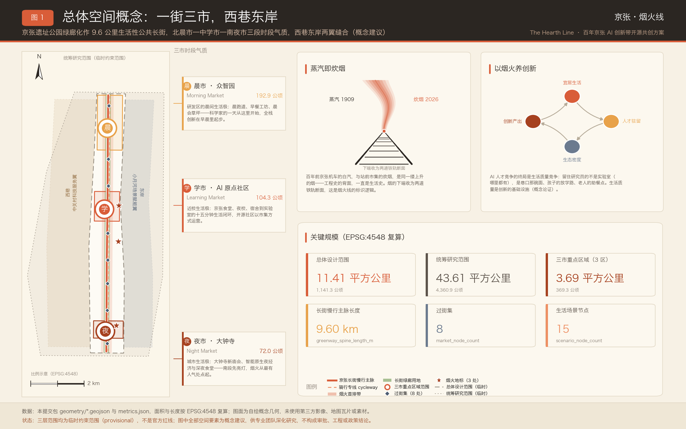
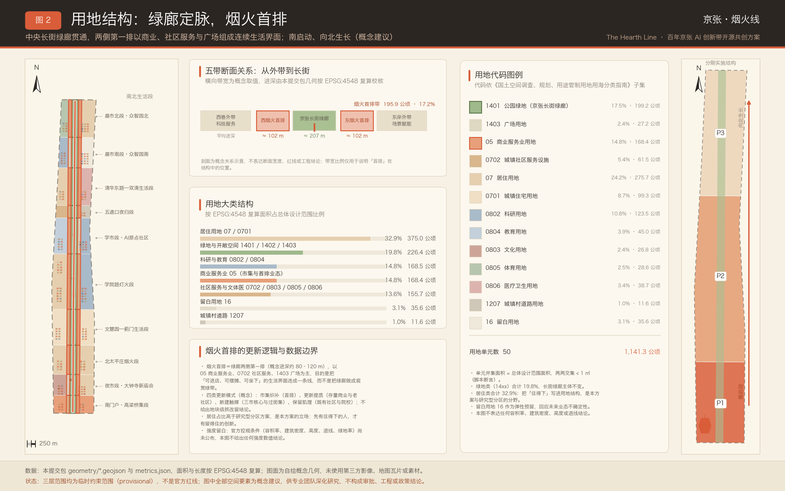
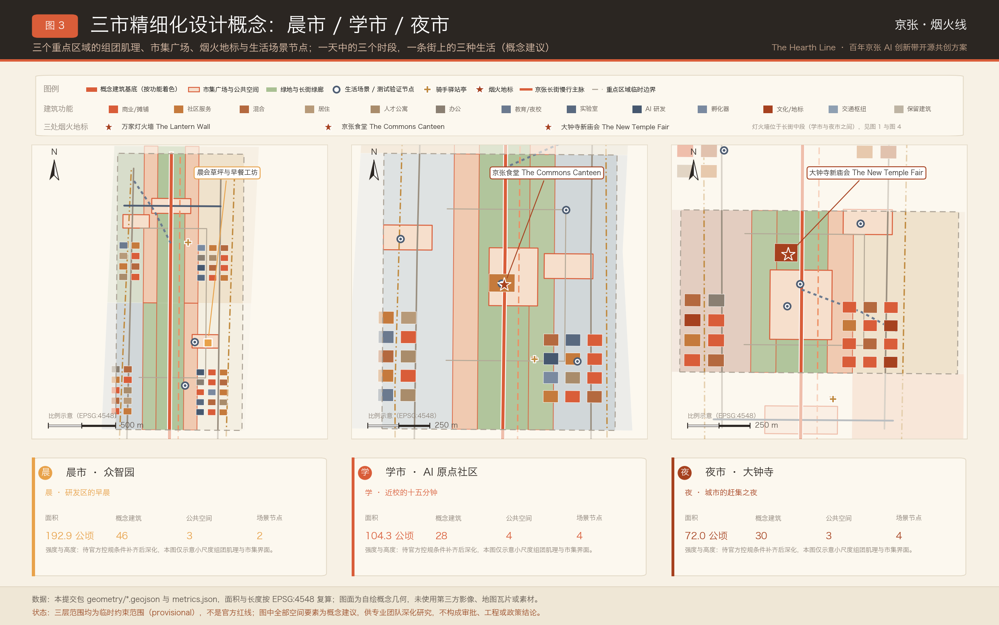
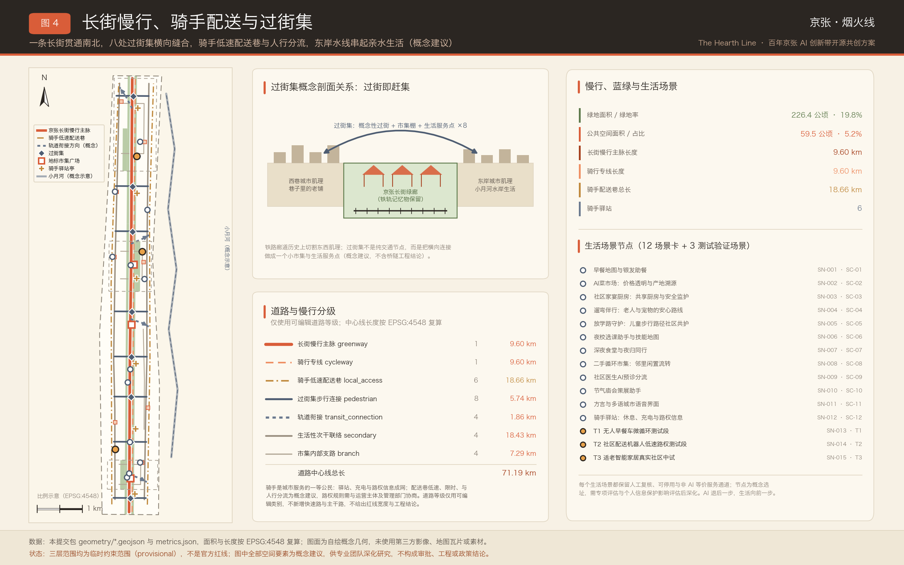
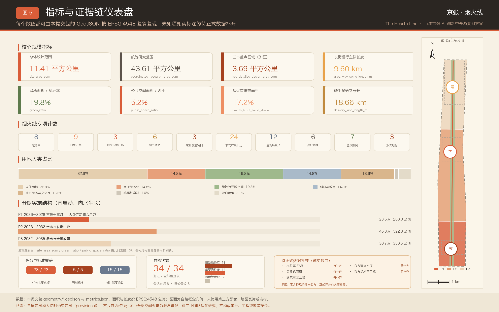

# 京张·烟火线 The Hearth Line——百年京张AI创新带开源共创方案

> 一句话定位：**最先进的 AI 城区，看起来应该像生活本身**——AI 退后一步，生活向前一步。
>
> 命名内核：**蒸汽即炊烟**。百年前京张机车头顶的白汽，与站前市集屋檐下的炊烟，本是同一缕上升的烟；工程史的背面一直是生活史。
>
> 全文所有空间建议均为**概念建议 / 参考方案 / 可供专业团队深化研究**，不构成法定规划成果、审批结论、工程结论或投资与政策承诺。

## 设计依据与资料清单

本方案以北京市规划和自然资源委员会海淀分局发布的资格预审公告为第一依据，以面向全球智能体的开源征集任务书为任务清单，并以仓库场地包中经维护者登记的临时粗略边界、重点区域、枚举与来源清单为机器可读依据 [source:SRC-2026-BJ-GH-QUAL-PREANNOUNCEMENT] [source:SRC-2026-0518-AGENT-OPEN-CALL-TASKBOOK]。公告要求成果达到控制性详细规划的城市设计深度与规划综合实施方案的城市设计深度，因此本方案把每一句空间主张都拆成三件可被独立核对的东西：一个图层对象、一个可复算指标、一条写明限制的来源或假设。文本不替代 GeoJSON、指标表、A3 文册、A0 展板与离线 HTML 展示，正文只负责把它们串成人能读懂的一条线。

烟火线的立场在第一节就要讲清楚：它不是给京张遗址公园再加一层技术皮肤，而是主张 AI 城区的成败最终由生活质感裁定。因此本方案的空间语言是市集、食堂、夜校、驿站、灯火，而不是展厅、门户与雕塑；AI 在这里是后厨、是路面、是灯下的一句提醒，不是招牌。这一取向必须同样接受专业标准的检验，城市风貌、公共空间与建筑布局的统筹依据城市设计管理办法组织 [standard:MOHURD-URBAN-DESIGN-MEASURES]，用地表达依据国土空间用地用海分类指南组织 [standard:MNR-LAND-USE-CLASSIFICATION-GUIDE]。

资料的使用边界如下，越界即视为本方案缺陷：

- 正式可用资料 5 条：公告、任务书、城市设计管理办法、控规编制审批办法、用地分类指南；用于任务、深度与分类口径 [source:SRC-MOHURD-CONTROL-DETAILED-PLANNING]。
- 背景资料 2 条：「三区两翼」与海淀「1+X+1」产业体系报道，仅用于叙事背景，不作为控制依据 [source:SRC-2026-BJ-KW-THREE-AREAS-WINGS] [source:SRC-2026-HAIDIAN-1X1]。
- provisional-only 资料 1 条：三层范围与三处重点区的临时粗略 polygon，仅用于生成、自检与讨论 [source:SRC-PROVISIONAL-BOUNDARIES-2026]。
- 未采用 OpenStreetMap 数据，故不引 ODbL 署名条款；全部图纸、图表与插图由本方案脚本自绘。

提交包中的 `geometry/site_boundary.geojson` 与 `geometry/key_areas.geojson` 全部标注 `official_boundary=false`、`geometry_role=provisional_constraint`、`boundary_precision=provisional_rough`，只能用于方案生成、自检、可视化与设计讨论，不能作为正式红线、审批依据、精确面积依据或法定控制结论 [data:geometry/site_boundary.geojson#SITE-001]。总体设计范围复算面积 1141.28 公顷，与公告「约 11.4 平方公里」相差约 0.11%，差值来源是临时 polygon 的角点概化 [metric:site_area_sqm]。官方边界发布后，用地、建筑、道路、绿地、公共空间、分期与全部指标必须整体重算，而不是替换单个文件。

本方案的可评分状态为：**临时边界，保留精度警示并待正式数据发布后复算；组织方数据缺口本身不阻断内容评分**。据此，正文中出现的所有结构、场景、项目与指标均按「可讨论、可复核、可替换官方边界后重算」的原则写入。现状识别层面，本方案承认自身只掌握公开层级的信息，因此把现状诊断写成方法与待补清单而非结论 [depth:existing_conditions_diagnosis]。

### 评审维度对照速查表（开篇导读）

为便于评审者在读正文之前先建立索引，本表把任务书的评审维度归并为七组常用视角，每组给出本方案的一句主张与可直接核对的证据入口。归并只用于导读，不替代任务书原有维度表述，也不改变矩阵文件中的逐条覆盖关系。

| 评审维度 | 本方案的一句主张 | 主要承载章节 | 证据指向 |
| --- | --- | --- | --- |
| 任务书相关性 | 六项智能体任务与公告 1.3—1.5 全部在正文实际展开，而非只在矩阵里打勾 | 全部 13 章 | 23 条必选要求逐条挂接 [metric:compliance_requirement_count] |
| 原创性 | 以「蒸汽即炊烟」立意，一街三市、过街集、新庙会、食堂、灯火墙自成命名体系 | 统筹研究范围产业与未来城市研究 | 3 处地标与 4 场旗舰活动均为原创提案 [metric:pilgrimage_landmark_count] [metric:annual_event_count] |
| AI 创新性 | 场景卡带责任分工、无 AI 等价服务与退出条件三列，AI 是被治理对象而不是标签 | AI 创新生态、人才画像与 AI+ 场景 | 12 张场景卡与 3 处测试场景 [metric:scenario_card_count] [metric:test_validation_scenario_count] |
| 可实施性 | 南启动、先亮灯：P1 全部动作为轻量可撤回设施，不依赖未定控规条件 | 更新项目清单、实施政策与分期计划 | 15 项更新项目与三期图层 [metric:renewal_project_count] [depth:phasing_implementation] |
| 公共利益与包容性 | 骑手与城市服务者被写成一等公民画像，每张场景卡必须留无 AI 等价通道 | 蓝绿空间、公共空间与城市风貌 | 公共空间供给与组件要求 [metric:public_space_ratio] [depth:blue_green_public_space] |
| 风险合规 | 五项强度类指标一律登记待补，不以推测值填充；八维风险附人工复核意见 | 风险、版权与合规说明 | 未知指标与缺口清单 [metric:floor_area_ratio] [depth:risk_missing_data] |
| 表达完整度 | 中英双语正文、双语图纸、离线展示页与三个矩阵成套提交 | 指标体系、面积复算与合规矩阵 | 复算链路与深度项覆盖 [depth:metrics_recalculation] [metric:design_depth_item_count] |

这张表的用法是「先看主张、再查证据」：任何一行的主张若在正文找不到对应展开，或证据指向的指标与图层不存在，都应视为本方案的缺陷，而不是表达方式问题。

## 三层范围工作框架

三层范围在本方案里被理解成一条从「为什么值得住下来」到「哪条巷子几点亮灯」的传导链，其结构关系由深度项统一约束 [depth:three_level_scope_framework]。统筹研究范围回答「AI 产业生态与未来城市形态如何组织」，复算面积 43.61 平方公里，与公告约 43.6 平方公里基本吻合 [metric:coordinated_research_area_sqm]。总体设计范围回答「城市更新、产业空间、交通市政与风貌如何落图」，复算面积 1141.28 公顷。重点区域范围回答「三处片区如何达到规划综合实施方案的城市设计深度」，三区合计复算 369.29 公顷，与公告约 368.4 公顷相差约 0.24% [metric:key_detailed_design_area_sqm]。

烟火线对三层关系的特殊处理，是把「时辰」作为贯穿三层的第四个维度。统筹层看的是一天的节律如何决定人才是否愿意长期停留；总体层看的是这条 9.6 公里长街在早中晚分别被谁使用；重点层看的是三处片区各自主导哪一段时辰，以及交界处如何交接班。三处重点区因此分别命名为晨市、学市、夜市，它们不是三个功能标签，而是三段被认领的时间。

三层之间的传导规则被写死为四条，用于防止上层结论在下层被悄悄改写：

- 上层的判断必须能在下层找到一个物理落点，否则该判断作废重写。例如「以烟火养创新」必须落成首排带、食堂与驿站，而不是停在一句口号上。
- 下层的每一处设计动作必须能回溯到上层的一句主张，否则视为多余动作。图层里每个要素都带有段落与市集归属字段，便于逐个回溯 [data:geometry/land_use.geojson#LU-007]。
- 跨层不得引入新的精度：临时边界给出的是粗略位置关系，下层不得据此生成看似精确的控制线 [source:SRC-PROVISIONAL-BOUNDARIES-2026]。
- 任何一层出现数据缺口，都必须在该层显式登记，不允许由下一层用推测值补齐 [depth:risk_missing_data]。

这四条规则解释了本方案为何在很多地方主动写「待补」而不是给出漂亮数字：一个能被复核的空缺，比一个不能被复核的结论更有价值。

三层工作不是三套互不相干的图纸。统筹研究决定产业与生活质量的因果判断，总体设计把判断落成用地、慢行、公共空间与设施承载，重点区域详细设计验证具体组团、建筑肌理、交通组织与生活场景的可实施性。任何无法从结构化数据复算的面积、比例、规模或项目数量，都不写入正式结论；凡缺少官方条件的强度类内容，一律降级为待补事项 [depth:overall_spatial_structure]。

| 层级 | 设计问题 | 烟火线的回答 | 数据落点 |
| --- | --- | --- | --- |
| 统筹研究范围 | AI 产业生态与未来城市形态如何组织 | 以烟火养创新：宜居度—人才驻留—生态密度—创新产出的因果链 | [metric:coordinated_research_area_sqm] |
| 总体设计范围 | 产业空间、城市更新、交通市政与风貌如何落图 | 一街三市、西巷东岸；绿廊两侧「烟火首排」形成连续生活界面 | [data:geometry/land_use.geojson#LU-001] [metric:hearth_front_band_share] |
| 重点区域范围 | 三处片区如何达到详细设计深度 | 晨市／学市／夜市各主一段时辰，各配一处地标与一组场景 | [data:geometry/key_areas.geojson#PROV-KEY-001] [metric:key_area_count] |

## 统筹研究范围产业与未来城市研究

### 命名与标识体系：蒸汽即炊烟

方案中文主名称为「京张·烟火线」，英文主名称 The Hearth Line，hearth 指炉膛与灶边，是家的火 [source:SRC-2026-0518-AGENT-OPEN-CALL-TASKBOOK]。命名的三层含义分别是炊烟（食与家）、灯火（夜与安）、烟火气（市井与人情）。标识方向为一缕上升的汽／烟，下端收束为两道铁轨断面；备选方向为灯笼轮廓内嵌双轨。品牌色以暖橙（灯火）为主，炭黑为字，米白为底，青灰为辅，全套图纸、展板与展示页共用一套色值。所有字体、商标与图像均需清权，本方案不使用任何未授权字库或企业标识。

命名的正当性来自一个常被忽略的事实：中关村的第一性其实是市集。电子一条街最初是摊贩、柜台与攒机铺的烟火气，创新发生在讨价还价的密度里，而不是玻璃幕墙的反光里。把 AI 新业态理解成「新市集」，既接得住这条街的历史，也接得住它的未来 [source:SRC-2026-HAIDIAN-1X1]。命名系统由此向下延展为四层：长街（京张长街）、三市（晨市／学市／夜市）、节点（过街集、市集广场、驿站）、事件（新庙会、灯火节、赶集）。

### 核心论点：以烟火养创新

AI 人才竞争的终局是生活质量竞争。实验室哪里都能建，模型权重可以迁移，算力可以采购；真正难以复制的是巷口那碗面、孩子的放学路、老人的助餐点，以及一个研究员在周五晚上愿意留在本地吃饭的理由。本方案据此提出四段因果链作为统筹研究的产业逻辑：宜居度提升→人才驻留时长延长→本地生态密度上升→创新产出与转化概率提高。这一链条在本方案中是概念论证与公开案例支撑，不构成实证结论，也不编造任何数据 [depth:overall_spatial_structure]。

这条论点对空间的直接要求有三条。第一，绿廊两侧第一排必须是生活界面而不是围墙与配电房，因此设立「烟火首排」控制概念，复算带面积 195.86 公顷，占总体设计范围 17.16% [metric:hearth_front_band_area_sqm] [metric:hearth_front_band_share]。第二，公共空间必须能被摆摊、能被占用、能被弄脏后再收拾干净，因此公共空间以市集型而非纪念型为主，复算比例 5.21% [metric:public_space_ratio]。第三，居住与社区服务的用地比重要高于展示型园区的常见配置，复算居住类占比 32.86%，社区与公共服务类合计 13.64% [metric:residential_land_share]。

### 三大定位 × 五大功能 × 三区两翼的协同回路

公告提出的「百年京张文化带、都市 AI 生活体验带、AI 融合创新带」三大定位，在烟火线里被读成同一件事的三个时段：文化带是庙会与站前记忆，生活体验带是一日三餐与晚归的灯，融合创新带是摊位上真实发生的技术验证 [source:SRC-2026-BJ-GH-QUAL-PREANNOUNCEMENT]。五大功能的承载不靠单独设施，而靠「一街三市」的连续界面：研发与孵化落在晨市与学市的科研教育用地，展示与交易落在夜市的商业与文化用地，服务与治理落在西巷的小尺度专业服务铺面，生活配套沿全线首排均布。

与区域「三区两翼」格局的关系按接口方式组织，不做越界安排 [source:SRC-2026-BJ-KW-THREE-AREAS-WINGS]。西巷（中关村科技服务翼）承接政务、资本与专业服务，做成「巷子里的老铺」——小尺度、可进店、面对面；东岸（小月河场景赋能翼）承接水岸生活实验，晨练、垂钓监测与亲水市集在此发生。两翼与长街之间由 8 处「过街集」缝合，每处既是过街点也是小市集 [metric:market_node_count]。

### 全球案例研究（7 例，生活视角）

案例选择的统一提问是：一个城市如何把日常生活组织成公共基础设施，并让它反过来支撑经济活力。每例只取公开可查的空间模式与运营机制，不引用未经核实的数据 [standard:MOHURD-URBAN-DESIGN-MEASURES]。

| 案例 | 空间模式 | 运营机制 | 对烟火线的启示 |
| --- | --- | --- | --- |
| 新加坡小贩中心 | 分布式公共饮食设施嵌入组屋与交通节点 | 摊位准入、租金与卫生分级的公共管理 | 公共食堂可以是国家级社会黏合设施，京张食堂据此设三窗口 |
| 东京下北泽（小田急线地下化上盖再生） | 铁路廊道地下化后形成线性小尺度街区 | 长期运营主体统筹小店与公共空间 | 与遗址公园廊道直接同构：廊道两侧应做细粒度生活界面 |
| 哥本哈根 | 以自行车与日常尺度组织城市 | 把宜居度写进人才与产业战略 | 支撑「以烟火养创新」的城市级先例 |
| 巴塞罗那 Superblocks | 把街道从车流手中交还给生活 | 分阶段试点、可撤回改造、持续评估 | 过街集与骑手配送巷采用同样的可撤回试点方法 |
| 墨尔本 Laneways | 小巷经济与夜间活力 | 首层业态与夜间安全的协同治理 | 西巷「老铺」与夜市深夜时段的组织参照 |
| 成都公园城市与玉林片区 | 公园与社区生活的相互嵌入 | 社区商户自治与在地文化叙事 | 中国语境下的烟火气营城样本 |
| 首尔京义线林荫道／益善洞 | 废弃铁路线转为线性生活绿廊 | 沿线社区参与与小微业态更新 | 遗址公园从景观绿道转向生活长街的路径参照 |

七个案例的共同结论是：公共生活设施的密度与可达性，比单体地标的规模更能决定一个片区能否留住人 [metric:case_study_count]。烟火线因此把预算与空间的优先级明确排序为：先做食堂与驿站，再做广场与灯，最后才做展示空间。

### 未来城市形态研究：AI 退后一步

AI 如何改变工作、生活、社交、学习、交通与公共服务，本方案给出的答案是「变得更不显眼」。理想状态下，居民感受到的不是多了一套系统，而是少了一些麻烦：菜价更透明、放学路上有人看着、老人的饭有着落、夜里回家的路更亮、骑手有地方歇脚充电。技术强度落在后台，界面强度落在生活。所有 AI 能力的部署都遵循同一顺序：先证明它解决了一件具体的麻烦，再考虑是否值得连成系统 [depth:municipal_new_infrastructure]。

形态层面的对应动作有四项：长街全线保持连续可步行的生活界面；三市各自形成一处高密度公共生活极；两翼保持小尺度可进店的铺面肌理；全线布设骑手与城市服务者的支持网络。这四项都可以在不确定控规条件的前提下先行推进，因为它们改变的是界面与运营，而不是强度与高度 [depth:height_massing_character]。

六个生活维度的具体转译如下，每一条都对应本方案某张场景卡或某处空间落点，而不是抽象愿景：

- 工作：研究者的一天从早餐工坊而非门禁开始，晨会草坪让讨论发生在户外；办公与研发用地不再独占绿廊界面。
- 生活：菜价可查、助餐有着落、家宴厨房可预约，AI 只做后台的调度与提示，前台永远是人 [data:geometry/public_space.geojson#SN-003]。
- 社交：市集是最低门槛的社交装置——不需要预约、不需要身份、不需要消费即可停留。
- 学习：夜校把技能学习从校园释放到街区，课后一杯热饮比一场论坛更能形成长期关系 [data:geometry/public_space.geojson#PS-015]。
- 交通：慢行主脉与骑手配送巷分层，让「送东西的人」和「散步的人」不再互相为难 [metric:delivery_lane_length_m]。
- 公共服务：预诊、导航、语音问询三类服务全部保留人工等价通道，不使用智能手机的人不被排除在外。

这六条合起来构成本方案对「未来城市形态」的回答：未来不是界面更炫，而是麻烦更少、可选项更多、被排除的人更少 [depth:blue_green_public_space]。

### 区域协同的接口化组织

区域协同以「接口」而非「统筹」的方式提出，避免越权安排他方事务。接口一是与未来科学城方向的生活配套协同：两地共享同一批研究人员的通勤与家庭需求，可在食堂标准、助餐网络、夜校课程与骑手驿站规格上先做互认，形成可迁移的服务规格而不是行政安排。接口二是京张文化带沿线城市的节庆联动：以二十四节气日历为公共接口，沿线城市在同一节气组织各自的市集与展演，互不隶属但可互相引流 [metric:festival_calendar_count]。

接口三是与周边高校与院所的日常生活协同：夜校课程、开发者食堂与二手循环市集向校园开放，形成校园与街区之间的生活性连接。以上均为概念建议，实施需由相应主体自行决策，本方案不代替任何一方作出承诺 [depth:risk_missing_data]。

### 生态图谱：六要素 × 三市分工

统筹研究要求的创新要素在烟火线里不设独立载体，而是各自附着在三市的生活场景上。下表说明每类要素主要落在哪一市、以什么日常形态出现，以及它对应的空间证据。

| 创新要素 | 主要承载 | 日常形态 | 空间证据 |
| --- | --- | --- | --- |
| 高校与院所策源 | 学市为主、晨市为辅 | 夜校、开发者食堂长桌、校园与街区的连续步行 | [data:geometry/land_use.geojson#LU-032] |
| 开源协作社区 | 学市 | 食堂前市集的发布日与课后协作 | [data:geometry/public_space.geojson#PS-014] |
| 企业与转化 | 夜市为主 | 新庙会摆摊演示、内容消费与终端体验 | [data:geometry/public_space.geojson#PS-001] |
| 算力与数据服务 | 全线后台 | 随生活设施走的端侧节点，不单独设站 | [depth:municipal_new_infrastructure] |
| 专业与政务服务 | 西巷 | 巷子里的老铺：可进店、面对面的小尺度服务 | [data:geometry/buildings.geojson#BLD-070] |
| 公共体验与国际传播 | 三市轮值 | 节气日历驱动的常态活动而非一次性大会 | [metric:festival_calendar_count] |

图谱的关键在最后一列：六类要素没有一类需要新建专属地标才能成立，它们都能挂在既有的生活设施上开始运转。这是烟火线在实施上最省力的地方，也是它在启动期最不依赖大额投入的原因 [depth:overall_spatial_structure]。

## 总体设计范围城市更新与控规深度城市设计

总体设计范围要求达到控制性详细规划的城市设计深度，本方案据此提出「一街三市、西巷东岸」的总体空间结构 [standard:MOHURD-CONTROL-DETAILED-PLANNING]。「一街」指京张遗址公园绿廊被定义为 9.6 公里的生活性公共长街——京张长街，它不是纯景观绿道，而是可赶集、可夜话、可晨练的线性公共客厅，慢行主脉复算长度 9604.9 米 [metric:greenway_spine_length_m]。「三市」指北到南三处生活极：晨市（众智园）、学市（AI 原点社区）、夜市（大钟寺）。「西巷东岸」指长街两侧的两条差异化生活带。

用地组织采用五条纵带与十个横段的结构：中央为京张长街绿廊带，两侧为东西「烟火首排带」，最外为西巷外带与东岸外带；横向按十段生活主题划分，从南门户高梁桥集段一路向北到晨市北段众智园北段 [data:geometry/land_use.geojson#LU-025]。全部 50 个用地单元完整覆盖设计边界且两两不重叠，并集面积与范围面积在复算容差内一致 [metric:land_use_polygon_count]。

十个横段各有一个生活主题，这是长街不至于变成同质长廊的关键。段落命名沿用地名而非编号，目的是让居民在图上先认出自己家：

| 段序 | 段名 | 所属市 | 主题动作 |
| --- | --- | --- | --- |
| 01 | 南门户·高梁桥集段 | 夜市翼 | 南入口门户与过街集，作为全线第一处「先亮灯」界面 |
| 02 | 夜市段·大钟寺新庙会 | 夜市 | 新庙会市集广场与庙会可拆装台架的主场 |
| 03 | 北太平庄烟火段 | 夜市翼 | 既有社区服务补足与银发助餐网络起点 |
| 04 | 文慧园—蓟门生活段 | 长街中段 | 生活界面织补与过街集 03、04 缝合 |
| 05 | 学院路灯火段 | 长街中段 | 万家灯火墙与骑手驿站集散场所在段 |
| 06 | 学市段·AI原点社区 | 学市 | 京张食堂、开发者食堂前市集与夜校院落 |
| 07 | 五道口夜归段 | 学市翼 | 夜归同行与青年生活界面 |
| 08 | 清华东路—双清生活段 | 长街北段 | 二手循环市集与社区更新提质 |
| 09 | 晨市南段·众智园南 | 晨市 | 早餐工坊、晨跑道与无人早餐车测试段 |
| 10 | 晨市北段·众智园北 | 晨市 | 晨会草坪、研发生活组团与向北轨道衔接 |

十段与五带交叉形成 50 个用地单元，段与带的归属分别写入每个要素的属性字段，便于评审者从任一单元反查其在整体叙事中的位置 [data:geometry/land_use.geojson#LU-041]。

烟火首排是本方案对控规深度的核心贡献之一。它指绿廊两侧第一排约 80—120 米进深的连续带，用地以商业服务业、社区服务设施与广场为主，目的是让长街两侧永远面对着生活而不是背对着生活。50 个用地单元中有 20 个被标记为首排单元，复算面积 195.86 公顷 [metric:hearth_front_band_area_sqm]。首排带的具体进深、界面比例与首层业态要求，需在官方控规条件补齐后由专业团队深化，本方案只给出结构原则与位置示意 [depth:development_intensity_controls]。

低效空间识别与更新模式判断按四类组织：市集织补（20 个单元）用于生活界面不连续处，更新提质（14 个单元）用于既有社区与设施的服务能力补足，新建触媒（13 个单元）用于三市核心的公共生活设施，保留肌理（3 个单元）用于现存小尺度生活肌理良好的地段 [data:geometry/land_use.geojson#LU-013]。四类模式是工作方法而非拆改留结论；真正的拆改留分类必须以权属、现状建筑质量、文保与控规条件为前提，在资料补齐前不得给出。

综合承载能力评估同样只给方法，不给结论。评估按四项约束条件逐项组织，每项都写明所需的官方数据与当前缺口：

- 长街慢行容量：以主脉与骑行专线的断面通行能力对照高峰人流，需要官方人口、就业与出行调查数据，当前缺失。
- 三市公共空间供给：以人均公共空间面积与步行可达覆盖率对照居住人口，需要官方人口分布数据，当前缺失。
- 社区服务设施可达性：以助餐、卫生、文体、托幼设施的服务半径覆盖对照老龄与学龄人口，需要官方设施与人口结构数据，当前缺失。
- 骑手配送网络负荷：以配送巷长度与驿站数量对照实际配送量，需要行业公开数据或专项调查，当前缺失。

四项评估的共同结论是：在官方人口、就业、建筑存量与市政容量数据公布前，承载能力只能作为方法框架存在，任何具体的承载力数值都属于推测，本方案不提供 [depth:land_use_layout]。

## 重点区域详细设计

三处重点区域的详细设计以「一天中的哪一段」为组织线索，各自形成一处生活极、一处地标与一组场景 [depth:three_key_area_detailed_design]。三区面积分别为众智园 192.92 公顷、AI 原点社区 104.32 公顷、大钟寺 72.05 公顷，均引用临时 polygon，不作为正式面积依据 [metric:key_area_zhongzhiyuan_sqm]。

### 晨市 Morning Market——众智园 AI 自主创新加速区

晨市的设计命题是「让研究者愿意住下来的早晨」。空间上以早餐工坊广场与晨会草坪为双核，配晨跑道与沿绿廊的连续晨间界面；建筑上形成早餐工坊与晨跑组团、研发生活组团与生活混合组团三处聚落 [data:geometry/public_space.geojson#PS-012] [data:geometry/public_space.geojson#PS-013]。全栈自主创新、标准制定、安全治理与产业展示等公告任务照常承载，但入口被改写成生活——一个科学家的一天从这里开始，而不是从门禁开始。

晨市的详细设计要点如下：

- 功能业态：科研教育用地保持充足承载，但绿廊首排交给早餐、便利、社区服务与小型公共设施；研发建筑的后勤面朝内，生活面朝街。
- 建筑肌理：晨市段共布置早餐工坊与晨跑组团、研发生活组团、生活混合组团与晨会草坪周边组团四处聚落，均为小尺度概念基底，单体基底控制在生活性尺度 [data:geometry/buildings.geojson#BLD-160]。
- 公共空间：早餐工坊广场与晨会草坪复算各约 1.96 公顷，加过街集 08 双清路北集，构成晨市的三处停留点 [data:geometry/public_space.geojson#PS-011]。
- 交通组织：晨跑道与慢行主脉并行，内部支路环承担车行微循环，配送巷从外侧接入，不穿越晨跑与草坪范围。
- AI 场景：SC-01 早餐地图与银发助餐、T1 无人早餐车微循环测试段均落位于此，形成「一顿早饭同时是一次真实测试」的组织方式。

对外交通与清河界面按公告要求组织：晨市段内部支路环补足微循环，向北的轨道衔接段指向上地清河方向 [data:geometry/roads.geojson#RD-023] [data:geometry/roads.geojson#RD-028]。绿色空间承载开放测试与低碳创新交往的具体形式，是把晨跑道与晨会草坪同时作为无人早餐车微循环测试段的物理载体，让测试发生在真实早高峰而不是封闭场地。全栈自主创新与标准治理相关的展示需求，以「可预约、可参观、可问责」的开放日形式嵌入既有研发建筑，不另设专门展馆 [depth:three_key_area_detailed_design]。

### 学市 Learning Market——北京 AI 原点社区

学市的设计命题是「十五分钟里装下宿舍、实验室、食堂与夜校」。核心是京张食堂前庭广场与开发者食堂前市集，向西配夜校院落广场与人才公寓组团 [data:geometry/public_space.geojson#PS-002] [data:geometry/public_space.geojson#PS-014]。开源社区在这里被市集化运营：发布不再只在会场，也在食堂门口的长桌上；协作不只靠工单，也靠夜校课后的一杯热饮。

学市的详细设计要点如下：

- 功能业态：食堂、夜校、青年居住与人才公寓、小型发布与协作空间构成主力；商业以生活性为主，不设大体量集中商业。
- 建筑肌理：京张食堂与开发者社区组团、夜校与人才公寓组团两处聚落分居长街东西，均以可穿行巷道组织，不做整街区封闭 [data:geometry/buildings.geojson#BLD-100]。
- 公共空间：京张食堂前庭广场 4.58 公顷、开发者食堂前市集与夜校院落广场各约 1.96 公顷，三者串成一条课后动线 [data:geometry/public_space.geojson#PS-002]。
- 交通组织：过街集 06 五道口南集把校园侧人流引入长街，学市内部支路环承担片区车行，配送巷沿东岸与西巷外侧通行。
- AI 场景：SC-03 社区家宴厨房、SC-06 夜校选课助手、T2 配送机器人低速路权测试段落位于此，学市因此同时是生活场景与产业验证场景最密集的一段。

近校创新、成果孵化转化与人才服务等任务由学市段的科研教育与社区服务用地承载，校区、园区与街区的慢行缝合由过街集 06 五道口南集与学市内部支路环共同完成 [data:geometry/public_space.geojson#PS-009] [data:geometry/roads.geojson#RD-022]。轨道站点一体化以五道口方向衔接段示意，具体接口与工程条件待轨道与市政资料补齐后深化 [depth:traffic_rail_slow_parking]。开源体系的市集化运营是学市最重要的机制主张：把「发布」从会议室搬到食堂门口的长桌上，让第一个用户在吃饭时就坐在开发者对面。

### 夜市 Night Market——大钟寺 AI 产业聚集区

夜市的设计命题是「城市在晚上八点仍然属于所有人」。核心是大钟寺新庙会市集广场，配深夜食堂广场与银发助餐广场，形成南段城市型烟火主场 [data:geometry/public_space.geojson#PS-001] [data:geometry/public_space.geojson#PS-016]。智能原生夜经济、智能体与智能终端展示、内容消费与数据要素服务等公告任务，在这里以「摆摊」而非「展厅」的方式发生：企业与开发者把产品带到真实人流中被真实使用者挑剔。

夜市的详细设计要点如下：

- 功能业态：商业服务业与文化用地为主，配社区服务与居住；业态强调可摆摊、可短租、可快速更替，而不是长租大铺。
- 建筑肌理：新庙会市集棚群与深夜食堂夜经济组团分居广场两侧，市集棚为可拆装模块，随节气改变排布 [data:geometry/buildings.geojson#BLD-030]。
- 公共空间：新庙会市集广场 6.88 公顷是全线最大单体公共空间，配深夜食堂广场与银发助餐广场各约 1.96 公顷 [data:geometry/public_space.geojson#PS-020]。
- 交通组织：过街集 01、02 承担四象限步行连通，夜市内部支路环组织片区车行，节气庙会期间配送巷可临时关闭。
- AI 场景：SC-02 AI 菜市场、SC-07 深夜食堂与夜归同行、SC-10 节气庙会策展助手、T3 适老智能家居中试均落位于此。

大钟寺站一体化与路口四象限步行连通由过街集 01、02 与轨道衔接段共同组织，夜市内部支路环补足片区微循环 [data:geometry/roads.geojson#RD-025] [data:geometry/roads.geojson#RD-021]。规划绿地复合利用的方式是把市集广场绿化单元与庙会可拆装台架结合，平日为绿地与广场，节气时为庙会场地，设施可拆装、可复原 [data:geometry/green_space.geojson#GS-002]。夜市是全线唯一同时承担城市级消费、企业展示与老社区日常照料的一段，因此它的治理难度最高：噪声、油烟、垃圾与夜间安全必须与热闹同步解决，否则烟火气会在半年内变成投诉源 [depth:existing_conditions_diagnosis]。

## AI 创新生态、人才画像与 AI+ 场景

### 场景总则：AI 隐于幕后

烟火线的场景设计遵循五条总则。一，凡 AI 服务必须有非 AI 等价服务，且等价服务不得更慢、更贵或更难找到。二，凡涉及个人的判断必须有人工复核环节与可申诉入口。三，数据最小化：能用聚合统计解决的不采集个体数据，能本地处理的不上传。四，每个场景必须预设退出与停止条件，说明在什么情况下这项服务应当被暂停或下线。五，责任分工必须在部署前写清楚，谁负责执行、谁批准、谁被咨询、谁被告知 [depth:blue_green_public_space]。

15 个场景节点已作为点要素落入公共空间图层，其中 12 个为生活场景卡、3 个为测试验证场景 [metric:scenario_node_count]。所有点位均为概念选址，实施前需专项评估 [data:geometry/public_space.geojson#SN-001]。

### 用户画像（6 类）

| 画像 | 日常处境 | 空间响应 | 治理边界 |
| --- | --- | --- | --- |
| 早点摊主与小微商户 | 凌晨备料、租金敏感、客流依赖天气 | 市集棚模块与首排铺面，可短租摊位 | 经营数据仅本人可见，平台不得据此定价 |
| 双职工家庭与学童 | 接送时间冲突、放学路安全焦虑 | 放学路标识桩、过街集看护点、社区厨房 | 儿童影像不入库，路径守护仅做异常提示 |
| 银发独居老人 | 做饭困难、就医路线复杂、夜间跌倒风险 | 助餐窗口、健康驿站、遛弯伴行路线 | 必须保留电话与到店的人工通道 |
| 国际学生与青年研究者 | 语言门槛、饮食与社交成本、租住不稳定 | 开发者食堂、夜校、多语语音界面 | 多语服务不得据此推断国籍或身份 |
| 外卖骑手与城市服务者 | 无处休息、充电难、路权模糊、被系统计时 | 骑手驿站网络、低速配送巷、路权信息牌 | 驿站不采集接单数据，不与平台考核挂钩 |
| 驻留创业研究员 | 周末无处可去、家庭配套不足、社交半径小 | 三市生活极、二手循环市集、家宴厨房 | 参与记录不进入任何评价或信用体系 |

六类画像覆盖了这条街上停留时间最长的六种人 [metric:persona_count]。其中，外卖骑手与城市服务者被特意写成一等公民视角。他们是这条街上停留时间最长、被看见最少的人；一个把骑手照顾好的城区，几乎不可能把别人照顾坏。骑手驿站按 6 处成网，配 18.66 公里低速配送巷 [metric:rider_station_count] [metric:delivery_lane_length_m]。驿站的设计前提是无条件开放：不查工牌、不绑定平台、不设消费门槛。

### AI 场景卡（12 张）

下表每行即一张场景卡，责任分工采用 R/A/C/I 简式（执行／批准／咨询／知会），无 AI 等价服务与退出条件为必填列 [metric:scenario_card_count]。

| 编号 | 名称与位置 | 主要用户 | AI 能力 | 隐私与人工复核 | 责任分工（R/A/C/I） | 无 AI 等价服务 | 退出与停止条件 |
| --- | --- | --- | --- | --- | --- | --- | --- |
| SC-01 | 早餐地图与银发助餐（晨市，[data:geometry/public_space.geojson#SN-001]） | 老人、上班族 | 供给聚合与排队预测 | 不记录个人饮食；助餐资格由社工复核 | R 街道助餐点／A 街道／C 老年协会／I 商户 | 纸质助餐点位图与固定电话订餐 | 连续两周误导性推荐或助餐名单出错即停用 |
| SC-02 | AI 菜市场：价格透明与产地溯源（夜市，[data:geometry/public_space.geojson#SN-002]） | 居民、摊主 | 价格公示比对与溯源信息整理 | 摊主经营数据本人可见；申诉三日内人工处理 | R 市场运营方／A 市场监管／C 商户共治会／I 居民 | 纸质公示牌与人工查询台 | 出现比价压价或摊主收入被反向定价即停用 |
| SC-03 | 社区家宴厨房：共享厨房预约与安全监护（学市，[data:geometry/public_space.geojson#SN-003]） | 家庭、青年 | 排期调度与燃气烟感异常提示 | 厨房不设摄像头；异常仅触发现场声光提示 | R 社区运营／A 社区居委会／C 消防顾问／I 使用者 | 前台登记本预约与现场值守 | 任一次安全提示未能人工响应即暂停线上预约 |
| SC-04 | 遛弯伴行：老人与宠物的安心路线（长街，[data:geometry/public_space.geojson#SN-004]） | 老人、养宠居民 | 路线舒适度与休息点提示 | 不做轨迹留存；仅本地生成路线 | R 公园管养／A 园方／C 居民代表／I 志愿者 | 实体路牌与休息点指示图 | 出现位置数据外泄风险即整体下线 |
| SC-05 | 放学路守护：儿童步行路径的社区共护（学市—东岸，[data:geometry/public_space.geojson#SN-005]） | 学童、家长 | 拥挤与断点提示、护学岗排班 | 不采集儿童影像与身份；仅统计断面人数 | R 学校与街道／A 教育与街道／C 家长委员会／I 交警 | 固定护学岗与家长值班表 | 一旦出现个体识别功能即立即停用 |
| SC-06 | 夜校选课助手与技能地图（学市，[data:geometry/public_space.geojson#SN-006]） | 青年、务工者 | 课程匹配与空位提示 | 学习记录不外流、不进入任何评价体系 | R 夜校运营／A 街道／C 高校志愿讲师／I 学员 | 线下课表与现场报名窗口 | 课程推荐出现付费优先排序即停用 |
| SC-07 | 深夜食堂与夜归同行（夜市，[data:geometry/public_space.geojson#SN-007]） | 夜班者、夜归居民 | 营业状态汇总与照明呼叫 | 不记录同行者身份；呼叫仅接通值守人 | R 食堂运营／A 街道／C 警务与保安／I 商户 | 值守岗亭与固定照明呼叫按钮 | 夜间值守人力不到位即关闭同行功能 |
| SC-08 | 二手循环市集：邻里闲置流转（过街集，[data:geometry/public_space.geojson#SN-008]） | 居民、学生 | 品类匹配与市集排期 | 交易在线下完成；不做信用评分 | R 市集运营／A 街道／C 环保组织／I 居民 | 现场登记墙与定期实物市集 | 出现职业转卖挤占邻里份额即调整或停用 |
| SC-09 | 社区医生 AI 预诊分流（全线健康驿站，[data:geometry/public_space.geojson#SN-009]） | 老人、慢病患者 | 症状归类与就诊指引 | 不作诊断结论；一律由社区医生复核后告知 | R 社区卫生站／A 卫生主管部门／C 医联体医院／I 家属 | 分诊台与社区医生面诊 | 出现越界诊断或用药建议即立即停用 |
| SC-10 | 节气庙会策展助手（夜市，[data:geometry/public_space.geojson#SN-010]） | 商户、策展人 | 节气主题素材整理与摊位排布建议 | 商户报名信息仅办会方可见 | R 庙会办／A 街道／C 非遗与民俗顾问／I 商户 | 人工策展会议与纸质排位图 | 文化表达出现失实或冒犯即停用并人工重排 |
| SC-11 | 方言与多语城市语音界面（全线，[data:geometry/public_space.geojson#SN-011]） | 老人、国际居民 | 多语与方言语音问询 | 语音本地处理、不留存；不做身份推断 | R 设施运营方／A 街道／C 语言志愿者／I 使用者 | 人工问询台与图示导引牌 | 出现语音留存或身份推断即整体下线 |
| SC-12 | 骑手驿站：休息、充电与路权信息（全线，[data:geometry/public_space.geojson#SN-012]） | 骑手、环卫与快递员 | 驿站空位、充电与路权信息汇总 | 不采集接单与配送数据；不与平台考核对接 | R 驿站运营／A 街道／C 骑手代表／I 平台企业 | 实体告示牌与值守站点 | 任何平台要求接入考核数据即终止合作 |

十二张卡的写法遵循同一条原则：先说清楚它替谁解决了什么麻烦，再说 AI 做了哪一小步。以下为每张卡的说明。

**SC-01 早餐地图与银发助餐。** 重点不是地图，而是那顿饭有没有着落。晨市段的早餐供给分散在摊位、便利店与助餐点之间，老人常常走到才发现关门。AI 只做两件事：把当日实际开门的供给汇总，把助餐点的余量提前告诉社工。资格审核仍由社工完成，纸质点位图与电话订餐永远同时存在。

**SC-02 AI 菜市场：价格透明与产地溯源。** 重点不是溯源技术，而是摊主不被反向定价。系统只公示价格与产地信息，不向平台开放摊主经营数据，不生成任何形式的销售预测供第三方使用。一旦出现比价压价或摊主收入被算法反向影响的迹象，该功能即停用并公开说明。

**SC-03 社区家宴厨房：共享厨房预约与安全监护。** 让年轻人在城里有地方请一次客。共享厨房按时段预约，燃气与烟感异常只触发现场声光提示与值守人到场，厨房内不设摄像头。任何一次安全提示未被人工响应，线上预约立即暂停，改回前台登记。

**SC-04 遛弯伴行：老人与宠物的安心路线。** 把「今天走哪条路腿不疼」这件小事做成公共服务。路线在本地生成，不做轨迹留存，休息点与坡度信息同时以实体路牌呈现。这张卡的价值在于它几乎没有技术含量，却直接决定一位老人是否愿意每天出门。

**SC-05 放学路守护：儿童步行路径的社区共护。** 边界最严格的一张卡，因为对象是孩子。系统只统计断面人数与拥挤时段，用于安排护学岗排班，任何个体识别功能都被明确排除在外。固定护学岗与家长值班表是主方案，AI 只是排班的辅助工具 [data:geometry/public_space.geojson#SN-005]。

**SC-06 夜校选课助手与技能地图。** 面向想换工作的人。课程匹配只看学员自己填写的目标，不引入任何外部画像；学习记录不进入评价体系，也不提供给用人单位。若课程推荐出现付费优先排序，该功能立即停用。

**SC-07 深夜食堂与夜归同行。** 夜的第一面：还在吃饭的人。系统汇总当前仍在营业的窗口，并把照明呼叫接到值守岗亭。同行功能依赖真实的值守人力，人不到位就关闭功能——这是本方案对「不用技术掩盖服务缺位」的一次明确表态。

**SC-08 二手循环市集：邻里闲置流转。** 面向想省钱的人。匹配只做品类与时间的撮合，交易在线下完成，不做信用评分、不建卖家等级。若职业转卖开始挤占邻里份额，规则由商户共治会调整或直接关停线上匹配 [data:geometry/public_space.geojson#PS-019]。

**SC-09 社区医生 AI 预诊分流。** 严守不作诊断的红线：AI 负责把话说清楚，医生负责说了算。系统只做症状归类与就诊指引，输出必须经社区医生复核后才能告知居民，任何越界的诊断或用药建议都触发立即停用。

**SC-10 节气庙会策展助手。** 让节气庙会的内容有人接得住。助手整理节气主题素材、建议摊位排布，最终排位与内容由庙会办与民俗顾问决定。文化表达一旦出现失实或冒犯，立即停用并人工重排 [data:geometry/public_space.geojson#SN-010]。

**SC-11 方言与多语城市语音界面。** 让不会用手机的人和不会说中文的人同样能问路。语音本地处理、不留存、不做身份或国籍推断，人工问询台与图示导引牌始终并存。这是全线覆盖面最广的一张卡，也是最容易被做错的一张。

**SC-12 骑手驿站：休息、充电与路权信息。** 夜的另一面：还在送饭的人。驿站提供空位、充电与路权信息，不采集接单与配送数据，不与任何平台的考核体系对接。任何平台提出接入考核数据的要求，即终止合作——驿站的价值恰恰在于它不属于任何平台 [data:geometry/public_space.geojson#PS-017]。

这些场景合起来构成一句主张：AI 城区最好的证据，是一个老人不必学会任何新东西，也能过好一天。

### 产业测试验证场景（3 处）

三处测试场景均为概念建议，实施前需完成专项安全评估、备案与公众告知，本方案不预设任何审批结论 [metric:test_validation_scenario_count]。

| 编号 | 场景 | 位置 | 验证内容 | 事故响应与回滚 |
| --- | --- | --- | --- | --- |
| T1 | 无人早餐车微循环 | 晨市段（[data:geometry/public_space.geojson#SN-013]） | 早高峰低速运行、人车混行避让、早餐配送时效 | 分级响应：轻微剐蹭即时停运该车并现场人工接管；发生人身伤害立即全段停运、封存日志、48 小时内公示；连续两次同类事件终止试点并恢复原状 |
| T2 | 社区配送机器人低速路权测试段 | 学市—东岸（[data:geometry/public_space.geojson#SN-014]） | 低速配送巷路权规则、与骑手及行人的交互、夜间可视性 | 设物理限速与人工遥控接管；出现路权冲突投诉即缩减运行时段；老人或儿童受惊事件按人身安全事件处理并暂停 |
| T3 | 适老智能家居真实社区中试 | 大钟寺老社区（[data:geometry/public_space.geojson#SN-015]） | 跌倒提示、用药提醒、独居安全的家庭端可用性 | 参与者可随时无理由退出并要求删除数据；误报率超出约定即暂停；一次未响应的求助即触发全面复核 |

三处测试共用一套纪律：试点期间全部设施可拆卸、可复原；日志保留供事后复核但不用于个体评价；每处试点必须公布一个可打通的人工电话；试点结束后无论成败都公开一份复盘 [depth:risk_missing_data]。低速配送与机器人相关内容涉及道路使用与安全管理，须由相应主管部门依法定程序另行评估 [standard:PROJECT-AGENT-OPEN-CALL-TASKBOOK]。

### 隐私、人工复核与事故响应（专节）

本方案对 AI 服务设置三道闸门。第一道是采集闸门：默认不采集，采集须说明用途、期限与删除方式，个人信息处理遵循个人信息保护法与生成式人工智能服务管理暂行办法的公开要求。第二道是判断闸门：涉及个人权益的判断一律由人复核后生效，AI 输出只能作为建议，且必须可解释、可申诉。第三道是退出闸门：每项服务在上线前就写好停止条件与回滚方式，停止不需要重新论证 [depth:municipal_new_infrastructure]。

事故响应按四级组织：一级为体验问题，现场处理并记录；二级为服务失效，24 小时内恢复人工通道；三级为个人信息或人身安全事件，立即停用、封存日志、通知当事人并启动复核；四级为系统性风险，全线相关服务下线并公开说明。无障碍等价是前置条件而非附加项：视障、听障、行动不便与不使用智能手机的居民，必须能在同一地点获得同等服务 [metric:public_space_count]。

## 用地、建筑规模与拆改留方案

用地方案依据国土空间调查、规划、用途管制用地用海分类指南表达，形成完整、闭合、无缝的用地分区 [standard:MNR-LAND-USE-CLASSIFICATION-GUIDE]。50 个用地单元由五条纵带与十个横段的平面分割生成，单元并集等于设计范围、两两交集面积小于 1 平方米，全部坐标闭合且无自交 [metric:land_use_polygon_count]。各大类复算占比如下表，比例基数为总体设计范围复算面积 [metric:site_area_sqm]。

| 用地大类 | 复算面积（公顷） | 占比 | 烟火线的意图 |
| --- | --- | --- | --- |
| 居住（07／0701） | 375.00 | 32.86% | 住得下才留得住，是「以烟火养创新」的物质前提 [metric:residential_land_share] |
| 绿地与开敞空间（1401／1403） | 226.42 | 19.84% | 长街绿廊主体不变，广场用地承接市集 [metric:green_ratio] [metric:land_use_green_open_sqm] |
| 商业服务业（05） | 168.45 | 14.76% | 首排连续生活界面的主力用地 [metric:commercial_land_share] [metric:land_use_commercial_sqm] |
| 科研与教育（0802／0804） | 168.52 | 14.77% | 研发承载力充足但不再独占界面 [metric:research_edu_land_share] [metric:land_use_research_edu_sqm] |
| 社区与公共服务（0702／0803／0805／0806） | 155.71 | 13.64% | 助餐、卫生、文体与社区服务沿全线均布 [metric:land_use_public_service_sqm] |
| 留白（16） | 35.55 | 3.12% | 为未定需求与未来市集形态留出余地 [metric:land_use_reserved_sqm] |
| 城镇村道路（1207） | 11.64 | 1.02% | 概念道路带，红线以官方条件为准 [metric:road_land_ratio] [metric:land_use_road_sqm] |

表中支撑首排连续生活界面的商业与社区服务用地，是规划层面的用地布局建议：首排是规划性商业界面，不是对存量住宅的「开墙打洞」，既有住宅的沿街面只做环境提升，政策边界见风险与合规章。

建筑方案提交 204 个概念基底，总基底面积 59.03 公顷，概念基底覆盖率复算 5.17%——这是本方案自绘几何的统计值，不是建筑密度管控结论 [metric:building_count] [metric:building_footprint_density]。平均单体基底约 0.29 公顷，其中商业服务、社区服务与混合功能三类合计 135 个，占 66.2%，直接对应小尺度烟火肌理的意图 [data:geometry/buildings.geojson#BLD-001]。三处地标建筑采用文化展示类型，分别落位于新庙会、京张食堂与灯火墙 [metric:pilgrimage_landmark_count]。

建筑功能构成如下表，比例基数为 204 个概念基底的数量占比。表中的意图列说明每一类为什么出现在这条街上，而不是简单罗列枚举值。

| 建筑类型 | 数量 | 数量占比 | 出现意图 |
| --- | --- | --- | --- |
| 商业服务（retail） | 60 | 29.4% | 首排连续生活界面的主力，含市集棚与小铺 |
| 社区服务（community_service） | 44 | 21.6% | 助餐、卫生、夜校、驿站等日常服务的容器 |
| 混合功能（mixed_use） | 31 | 15.2% | 上住下商的生活肌理，避免功能单一化 |
| 居住与人才公寓（residential／talent_apartment） | 32 | 15.7% | 住得下才留得住的物质前提 [metric:residential_land_share] |
| 办公、研发、实验与孵化（office／ai_r_and_d／lab／incubator） | 23 | 11.3% | 研发承载力保持充足但不独占绿廊界面 |
| 教育与文化（education／cultural） | 12 | 5.9% | 含三处地标建筑与夜校、社区文化设施 |
| 交通接驳与既有保留（mobility_hub／existing_retained） | 2 | 1.0% | 站点接驳示意与既有肌理保留示意 |

建筑组团按 21 个聚落组织，如夜市新庙会市集棚群、学市京张食堂与开发者社区组团、长街中段灯火墙与骑手驿站群、西巷老铺组团与东岸水岸生活组团 [data:geometry/buildings.geojson#BLD-120]。组团的共同规则有四条：面向长街的一侧必须是可进入的生活功能，背街一侧才允许后勤；组团内部保留可穿行的巷道，不做整街区封闭；相邻组团之间留出至少一条与绿廊垂直的视线通道；市集类建筑一律采用可拆装构造，以便随节气改变排布 [depth:height_massing_character]。

关于强度与高度，本方案的立场是明确的：容积率、建筑高度、建筑密度、绿地率与退线等控制值在已清权资料中均未发布，因此一律登记为待补，不给出任何具体数值结论 [metric:building_height_max_m] [metric:building_density_official] [depth:development_intensity_controls]。形态引导只给原则性方向：沿长街界面宜低而密、可停留；三市核心可适度聚集但需保证长街日照与视线通透；具体控制以官方控规条件为准 [depth:height_massing_character]。

拆改留同样只给方法与分类框架 [depth:retain_renovate_demolish]。方法为四步：第一步核对权属与现状建筑质量，第二步核对文保、历史建筑与既有批复，第三步按更新模式初判（市集织补／更新提质／新建触媒／保留肌理），第四步逐宗与产权人协商并公示。在现状建筑、权属与控规资料补齐前，本方案不对任何一栋既有建筑作出拆除、改造或保留的结论；图层中的更新模式字段是设计意向标注，不具备处置效力。

## 交通、轨道、市政与公共服务设施

道路与慢行系统提交 28 条中心线，复算总长 71.19 公里 [metric:road_segment_count] [metric:road_centerline_total_m]。骨架由三层组成：京张长街慢行主脉 9.60 公里贯通全线，与之并行的骑行专线 9.60 公里承担通勤性骑行 [metric:cycleway_length_m]；8 条过街集步行连接合计约 5.74 公里，把西巷与东岸缝合在长街上 [data:geometry/roads.geojson#RD-003]；4 条生活性次干联络线与 4 条片区支路环补足微循环 [data:geometry/roads.geojson#RD-017]。

道路网络的分级构成如下表，全部道路等级均取自可编辑枚举，未新增快速路或主干路等级；红线、断面与限速均待官方条件确定 [depth:traffic_rail_slow_parking]。

| 等级 | 条数 | 复算长度 | 在烟火线中的角色 |
| --- | --- | --- | --- |
| 慢行主脉（greenway） | 1 | 9.60 km | 京张长街生活性公共长街的主线 [metric:greenway_spine_length_m] |
| 骑行专线（cycleway） | 1 | 9.60 km | 与主脉并行的通勤性骑行 [metric:cycleway_length_m] |
| 过街集步行连接（pedestrian） | 8 | 5.74 km | 把西巷与东岸缝合到长街上的八处缝合线 |
| 骑手低速配送巷（local_access） | 6 | 18.66 km | 配送与低速机器人试点专用，不与主脉抢道 |
| 生活性次干联络（secondary） | 4 | 18.43 km | 两翼纵向联络，承担片区间车行 |
| 片区支路环（branch） | 4 | 7.29 km | 三市与东岸的内部微循环 |
| 轨道衔接段（transit_connection） | 4 | 1.86 km | 指向大钟寺、知春路、五道口与上地清河方向 |

骑手低速配送巷是烟火线区别于常规慢行方案的关键一层：6 段专用巷道合计 18.66 公里，沿西巷与东岸各布三段，为低速配送、机器人试点与骑手通行提供不与主脉抢道的路径 [metric:delivery_lane_segment_count] [data:geometry/roads.geojson#RD-011]。其设计前提有三条：不占用步行主脉、不穿越儿童活动场地、在市集时段可临时关闭。道路红线、断面与限速值均需交通主管部门另行确定，本方案仅给出网络位置与用途概念 [depth:traffic_rail_slow_parking]。

轨道衔接以 4 段连接线示意，方向分别指向大钟寺站、知春路站、五道口站与上地清河方向，全部线段留在设计范围内 [data:geometry/roads.geojson#RD-025]。站城一体化的具体接口、垂直交通与地下连通条件需以轨道工程资料为准。非机动车停放与骑手临时停靠结合驿站与过街集布置，避免在长街界面前形成停车带。

市政与新型基础设施按「先服务、后系统」组织：助餐窗口、健康驿站、骑手驿站、社区厨房与夜校等生活设施优先落地，分布式能源、端侧算力与传感设施随设施走，不单独设站 [depth:municipal_new_infrastructure]。管线、能源、排水、防洪与消防条件目前均无可用资料，全部列为正式深化前置条件，不在本方案中给出容量或标准结论。

公共服务设施沿全线按步行可达组织，核心清单如下：

- 助餐窗口 3 处，与京张食堂的开发者、银发助餐与深夜三窗口对应，另在夜市银发助餐广场设常设点 [metric:canteen_window_count]。
- 健康驿站结合社区服务用地布置，承载 SC-09 预诊分流场景，必须与社区卫生站的人工分诊台同址或相邻。
- 骑手驿站 6 处沿配送巷与过街集布置，兼作环卫与快递从业者的休息点 [data:geometry/public_space.geojson#PS-017]。
- 儿童与老人设施优先靠近过街集与口袋市集，避免布置在生活性次干联络线沿线。
- 夜校与社区文化设施结合学市与长街中段的社区服务用地，课后时段与食堂、市集共用人流。

服务半径、设施规模与配建标准需与官方人口与设施数据核对后确定；在数据补齐前，上述布局只表达相对关系与优先级，不构成配建结论 [depth:existing_conditions_diagnosis]。市政方面还有一条纪律值得写明：所有智能设施的供电、通信与检修接口应随生活设施一并设计，避免日后在街面上二次开挖或加装立杆，破坏刚刚建立起来的生活界面。

## 蓝绿空间、公共空间与城市风貌

蓝绿系统以京张长街绿廊为骨架，提交 13 个绿地单元，复算面积 226.42 公顷，绿地率 19.84% [metric:green_space_count] [metric:green_ratio]。其中 10 个为公园绿地单元、3 个为广场用地单元，后者专门承接市集与庙会的可拆装使用 [data:geometry/green_space.geojson#GS-002]。东岸结合小月河组织水岸生活实验带：晨练、垂钓监测与亲水市集台构成一条与长街平行的第二条生活线 [data:geometry/public_space.geojson#PS-018]。

公共空间提交 20 个面要素，复算面积 59.51 公顷，公共空间比例 5.21% [metric:public_space_area_sqm] [metric:public_space_ratio]。构成为 3 处地标广场 16.04 公顷、8 处过街集 25.80 公顷、9 处市集口袋 17.67 公顷 [metric:landmark_plaza_count] [metric:market_pocket_count]。过街集的定位值得强调：它们不是纯交通节点，而是「顺路能买点东西、能坐一会儿」的小市集，8 处均布于长街两侧 [metric:stitch_node_count]。

### 三处地标

**大钟寺新庙会 The New Temple Fair**——地标是一个「可赶的集」而不是一座纪念物。常设市集广场复算面积 6.88 公顷，配二十四节气庙会制度，重启大钟寺庙会传统，作为智能原生业态的展销主场 [data:geometry/public_space.geojson#PS-001]。其中最关键的机制是「AI 赶集」：开发者以摊位形式面向真实市民演示与验证，市民以「烟火票」投票，积票靠前者获得下一季常设点位。

**京张食堂 The Commons Canteen**——城市级公共食堂，设开发者、银发助餐与深夜三个窗口，前庭广场复算面积 4.58 公顷 [data:geometry/public_space.geojson#PS-002] [metric:canteen_window_count]。AI 在这里只负责后厨的营养搭配与余量管理，前台永远是人。它是本方案最有说服力的展示窗口：一个城区的先进程度，可以用「陌生人能不能在这里吃上一顿便宜好饭」来衡量。

**万家灯火墙 The Lantern Wall**——长街中段的智能灯阵，一盏灯对应一户家庭或一个人的纪念与心愿，节庆时整墙点亮，前场广场复算面积 4.58 公顷 [data:geometry/public_space.geojson#PS-003]。认领信息仅本人可见，不做任何排行与展示排序；这是「贡献可记忆」的生活版本，而不是荣誉榜。

### 公共空间组件库（8 件）

组件库为长街提供统一而可复制的物件语言，全部要求可拆装、可复原、可被日常使用磨损后修复 [metric:component_library_count]。

| 组件 | 用途 | 分布 | 关键要求 |
| --- | --- | --- | --- |
| 市集棚模块 | 摊位与临时展销的基本单元 | 三市与 8 处过街集 | 单人可搬运、雨天可用、拆后不留基础 |
| 灯火柱 | 夜间照明与位置标识 | 长街全线 | 暖光低眩光，不干扰临近居住 |
| 骑手驿站亭 | 休息、饮水、充电与路权信息 | 6 处驿站点位 [metric:rider_station_count] | 无门槛开放，不查工牌、不绑平台 |
| 助餐窗口 | 银发助餐与深夜供餐的取餐界面 | 三市与助餐广场 | 轮椅可及、站立可及双高度 |
| 晾晒与季节性设施 | 承认生活真实发生的痕迹 | 居住组团临街侧 | 可收纳，节气时可换用途 |
| 儿童放学路标识桩 | 路径提示与护学岗定位 | 学市—东岸放学路 | 儿童视高、夜间反光、不含摄像装置 |
| 水岸钓台 | 东岸垂钓与亲水停留 | 小月河东岸 | 护栏与救生设施同步设置 |
| 庙会可拆装台架 | 节气庙会的演出与展销骨架 | 新庙会市集广场 | 搭拆各一日内完成，平日场地复原为绿地广场 |

每件组件的共同要求是无障碍等价、夜间可辨识、材料可就地维修；具体尺寸、构造、荷载与材料需由专业团队深化，本方案不给出任何工程做法或构造图 [depth:blue_green_public_space]。组件库的意义不在造型，而在于它让「摆摊」这件事从临时占道变成有制式、有秩序、可被管理的公共行为。

### 文化叙事：从站前市集到 AI 庙会

京张铁路的生活史有一条清晰的线索，本方案把它读成五个阶段 [source:SRC-2026-BJ-GH-QUAL-PREANNOUNCEMENT]：

- **站与市**：车站落成带来市集、旅馆与脚行，铁路的第一批附产品不是工业而是生活。
- **职工社区**：铁路职工聚居形成最早的成建制社区，宿舍、食堂、澡堂与子弟学校构成一整套生活设施——这正是「京张食堂」的历史原型。
- **站前小街**：五道口从站前小街长成青年聚集地，说明廊道两侧的细粒度界面才是活力的来源。
- **电子一条街**：中关村的创新从摊贩与攒机柜台里长出来，讨价还价的密度先于孵化器的密度。
- **AI 庙会**：新的技术需要新的赶集方式，让产品在真实人流中被真实使用者挑剔。

文脉主张因此只有一句：**创新的母体是市集**。把庙会作为中国城市公共生活的原型加以当代转译，比再造一个展厅更接近这条铁路的本意。这一叙事同时解释了本方案的空间优先级：先恢复市集这种最古老的公共交换形式，再谈技术如何在其中发挥作用。

导视与风貌方向据此确定：站牌体与市招体并置，前者承接铁路时代的信息秩序，后者承接老市招的匠意，均为方向性描述，不指定任何具体字库，不使用未授权字体或商标 [depth:height_massing_character]。国际传播的一句话是：In Beijing, the most advanced AI district smells like breakfast.（在北京，最先进的 AI 城区闻起来像早饭。）城市风貌整体走暖色、低反射、小尺度的路线；夜间照明以暖光与低眩光为原则，保证长街可安全通行同时不干扰临近居住 [standard:MOHURD-URBAN-DESIGN-MEASURES]。

## 更新项目清单、实施政策与分期计划

### 更新项目清单（15 项）

清单按分期与依赖条件排序，每项均标注空间落点；投资、主体与审批路径不在本方案范围内，均写为待确认 [metric:renewal_project_count] [depth:renewal_project_list]。

| 编号 | 项目 | 类型 | 分期 | 空间落点与前置条件 |
| --- | --- | --- | --- | --- |
| HH-01 | 大钟寺新庙会市集广场 | 公共空间／运营 | P1 | [data:geometry/public_space.geojson#PS-001]；需场地权属与活动安全方案 |
| HH-02 | 深夜食堂与夜归值守点 | 公共服务 | P1 | [data:geometry/public_space.geojson#PS-016]；需夜间经营与值守人力安排 |
| HH-03 | 南门户高梁桥过街集 | 公共空间／交通 | P1 | [data:geometry/public_space.geojson#PS-004]；需过街工程与交通组织复核 |
| HH-04 | 长街南段绿廊生活化改造 | 蓝绿空间 | P1 | [data:geometry/green_space.geojson#GS-003]；需园林管养与树木保护评估 |
| HH-05 | 骑手低速配送巷南段试点 | 交通／新业态 | P1 | [data:geometry/roads.geojson#RD-011]；需道路使用与限速许可 |
| HH-06 | 京张食堂（三窗口） | 公共服务 | P2 | [data:geometry/public_space.geojson#PS-002]；需食品经营与建筑条件 |
| HH-07 | 夜校院落与技能地图 | 公共服务 | P2 | [data:geometry/public_space.geojson#PS-015]；需办学资质与场地条件 |
| HH-08 | 开发者食堂前市集 | 公共空间 | P2 | [data:geometry/public_space.geojson#PS-014]；需商户共治会先行组建 |
| HH-09 | 万家灯火墙与中段广场 | 地标／公共空间 | P2 | [data:geometry/public_space.geojson#PS-003]；需照明与信息安全评估 |
| HH-10 | 骑手驿站网络（6 处） | 公共服务 | P2 | [metric:rider_station_count]；需选址权属与运营主体确认 |
| HH-11 | 东岸小月河亲水市集台 | 蓝绿空间 | P2 | [data:geometry/public_space.geojson#PS-018]；需水务与防洪条件 |
| HH-12 | 二手循环市集场 | 公共空间／运营 | P2 | [data:geometry/public_space.geojson#PS-019]；需环卫与市场管理配套 |
| HH-13 | 银发助餐广场与助餐网络 | 公共服务 | P3 | [data:geometry/public_space.geojson#PS-020]；需民政助餐政策衔接 |
| HH-14 | 晨市早餐工坊与晨会草坪 | 公共空间 | P3 | [data:geometry/public_space.geojson#PS-012]；需园区与街道协同 |
| HH-15 | 晨市段过街集与轨道衔接 | 交通 | P3 | [data:geometry/roads.geojson#RD-028]；需轨道与市政工程条件 |

### 分期计划：南启动、向北生长

分期图层把总体设计范围横切为三期，三期并集覆盖全部范围 [metric:phase_count] [data:geometry/phasing.geojson#PH-001]。烟火从最有人气处点起，因此本方案选择南启动，与常规的北向优先相反。

| 期次 | 时段 | 范围与复算面积 | 主要动作 |
| --- | --- | --- | --- |
| P1 | 2026—2028 | 南段 267.99 公顷，占 23.5% | 夜市先亮灯：新庙会市集广场、深夜食堂、南段过街集与配送巷试点 [metric:phase1_area_sqm] |
| P2 | 2028—2032 | 中段 522.77 公顷，占 45.8% | 学市与长街中段成型：京张食堂、夜校、灯火墙、骑手驿站成网 [metric:phase2_area_sqm] |
| P3 | 2032—2035 | 北段 350.52 公顷，占 30.7% | 晨市建成、全街贯通，并向区域协同接口延伸 [metric:phase3_area_sqm] |

P1 的设计纪律是全部动作可撤回：市集棚、驿站亭、台架与标识桩均为可拆装设施，照明与铺装以轻介入为主，不依赖任何尚未确定的控规条件。这样安排的目的很实际——先让这条街热闹起来，再谈更重的建设 [depth:phasing_implementation]。100 天征集周期是成果提交的时间要求，与上述实施分期不是同一件事，不得混为一谈。

### 节气日历、年度活动与运营机制

年度运营以二十四节气日历驱动，每个节气对应一个市集主题，形成全年不间断的公共生活节奏 [metric:festival_calendar_count]。旗舰活动 4 场：春节大钟寺新庙会、夏夜市季、秋收市集（含中秋庙会）、冬灯火节（点亮万家灯火墙）[metric:annual_event_count]。节气日历同时是区域协同的公共接口，沿线城市可在同一节气各自组织活动。

| 季节 | 节气区间 | 主场 | 市集主题方向 |
| --- | --- | --- | --- |
| 春 | 立春至谷雨（6 个节气） | 夜市 | 春节新庙会、开市、种子与花木市、开学季技能市 |
| 夏 | 立夏至大暑（6 个节气） | 夜市与东岸 | 夏夜市季、水岸纳凉市、深夜食堂延长时段 |
| 秋 | 立秋至霜降（6 个节气） | 学市与长街 | 秋收市集、中秋庙会、二手循环市集季 |
| 冬 | 立冬至大寒（6 个节气） | 长街中段 | 冬灯火节点亮灯火墙、年货市、助餐加强周 |

节气日历的运营纪律有三条：其一，任何一个节气都不得只剩商业促销，必须保留至少一项面向老人或儿童的免费内容；其二，节气活动使用的全部设施为可拆装组件，活动结束后场地在两日内复原；其三，活动的安全、卫生与噪声方案随报名一并提交，未通过评估的摊位不得进场。

运营机制有三项，均为概念机制建议，具体规则须由相关主体依法定程序另行确定 [depth:renewal_project_list]。

**商户共治会。** 市集与首排商铺的准入、退出、卫生与噪声规则由商户代表、居民代表与运营方共同议定，规则公开、可申诉、可修订。共治会的关键设计是给居民实权而不只是知情权：噪声与油烟相关规则须经居民代表同意才能通过，否则市集时段自动收窄。

**「AI 赶集」。** 场景开放以摆摊形式进行：开发者在真实人流中演示与测试，市民以「烟火票」投票，积票靠前者获得下一季常设点位。这是揭榜挂帅的市集化版本，它把评审权部分交给了真实用户，也把「场景开放」从一纸清单变成一件每周都在发生的事。投票只统计票数，不采集投票人身份。

**骑手与城市服务者友好认证。** 驿站网络与路权协商机制配套推进：参与认证的商户与楼宇需开放卫生间、饮水与临时停靠，认证标识统一悬挂。认证标准、激励方式与是否与行业主体合作，由相关部门与代表组织另行确定，本方案不预设结论。

人的转化路径被明确写成一条链：赶集访客→回头客→摊主→店主→驻留企业。这条链解释了烟火线为什么值得作为产业策略而不只是生活改善——它把公共生活当作最低成本的招商与人才留存机制。所有运营内容均为概念建议，不构成对任何主体的实施安排或政策承诺。

## 指标体系、面积复算与合规矩阵

指标体系共 64 项，其中已知 59 项、待补 5 项。全部面积与长度指标由生成脚本将 EPSG:4326 几何投影至 EPSG:4548 后计算，公式字段逐项写明投影信息，任何数值都可由提交的 GeoJSON 独立复算 [depth:metrics_recalculation]。三项会被空间复核脚本按几何反算的指标——范围面积、绿地率、公共空间比例——由脚本直接写入而非人工填写，以避免容差踩线 [metric:site_area_sqm] [metric:green_ratio] [metric:public_space_ratio]。

指标被分为三类，读者可据此判断每个数字的效力。第一类是可由提交几何直接复算的空间指标，如范围与重点区面积、绿地与公共空间比例、建筑基底面积、慢行长度与分期面积，它们的可信度取决于临时边界的精度，边界替换后必须整体重算 [metric:building_footprint_area_sqm]。第二类是需官方控规或任务书附件支撑的管控指标，如容积率、总建筑规模、建筑高度、建筑密度与官方绿地率目标，本方案一律登记 status=unknown、value=null，并写明原因为官方控规条件未公布 [metric:total_gfa_sqm] [metric:green_ratio_official_target]。第三类是需运营数据持续校准的绩效指标，如场景使用频次、市集活跃度与骑手驿站使用率，本方案不预填数值。

核心指标速查如下，全部数值可由提交的 GeoJSON 独立复算，单位与公式见 `metrics.json`。

| 指标 | 复算值 | 说明 |
| --- | --- | --- |
| 总体设计范围面积 | 1141.28 公顷 | 与公告约值相差约 0.11%，差值来自角点概化 [metric:site_area_sqm] |
| 统筹研究范围面积 | 43.61 平方公里 | 用于产业与生活质量的研究范围 [metric:coordinated_research_area_sqm] |
| 重点区域合计面积 | 369.29 公顷 | 三区之和，与公告约值相差约 0.24% [metric:key_detailed_design_area_sqm] |
| 绿地率 | 19.84% | 13 个绿地单元复算 [metric:green_ratio] [metric:green_space_area_sqm] |
| 公共空间比例 | 5.21% | 20 个公共空间面要素复算 [metric:public_space_ratio] |
| 烟火首排带占比 | 17.16% | 20 个首排用地单元复算 [metric:hearth_front_band_share] |
| 居住类用地占比 | 32.86% | 高于展示型园区常见配置 [metric:land_use_residential_sqm] |
| 概念基底覆盖率 | 5.17% | 自绘几何统计值，非建筑密度管控结论 [metric:building_footprint_density] |
| 道路中心线总长 | 71.19 公里 | 含慢行、配送巷与轨道衔接段 [metric:road_centerline_total_m] |
| 重点区面积（原点／大钟寺） | 104.32／72.05 公顷 | 临时 polygon 复算 [metric:key_area_origin_sqm] [metric:key_area_dazhongsi_sqm] |

烟火线特有的计数指标构成本方案的自我检验清单：过街集 8 处、市集口袋 9 处、地标广场 3 处、骑手驿站 6 处、配送巷 6 段、食堂窗口 3 个、节气 24 个 [metric:market_node_count] [metric:market_pocket_count]。这些数字与图层要素一一对应，若正文写了而图层没有，或图层有而正文没写，都应判为不合格 [metric:scenario_node_count]。

三个矩阵的覆盖情况如下：合规矩阵覆盖公告 1.3、1.4、1.5 与 agent.1—agent.6 共 23 条必选要求，逐条挂接章节、图层、指标、图纸、展示页小节、来源、假设与自检项 [metric:compliance_requirement_count]。标准矩阵覆盖 5 条强制标准并全部标记为已回应，另登记 1 条建筑工程设计文件编制深度规定为非强制参照并标注为数据缺口 [metric:mandatory_standard_count]。设计深度矩阵覆盖 15 项必需内容并全部标记为完成，其中强度与高度类条目的完成含义是「给出原则与数据缺口说明」，而不是给出数值 [metric:design_depth_item_count]。

假设清单共 8 条，逐条说明临时边界、用地分割方法、概念建筑、投影复算、控制值缺失、绿地派生、场景点性质与分期切分的依据与限制 [depth:risk_missing_data]。自检项覆盖结构完整、任务覆盖、标准覆盖、深度覆盖、双语配对、几何拓扑、指标复算、展示页离线性、临时边界标注、禁语扫描与文件大小等维度，结果以最终校验运行为准。

## 风险、版权与合规说明

**要求双语言。** 本方案主文件为中文，并提供完整对照译文 `proposal.en.md`；A3 文册、A0 展板、HTML 展示页与含文字图件均提供对应语言副本，术语优先采用赛事推荐译法。所有图片、图纸、图标、数据与代码资产均在 `sources.json` 与 `report/copyright_statement.md` 中说明来源与许可状态；全部图面为本方案脚本自绘，未使用第三方图片、字体文件或商标，未采用 OpenStreetMap 数据。HTML 展示页不加载远程脚本、远程瓦片、远程字体、iframe 或表单，不跟踪评审者行为 [depth:risk_missing_data]。

风险按八个维度诚实评估并记录在 `risk.json`，评分较高的条目均附人工复核意见。

| 风险维度 | 烟火线的具体形态 | 应对方向 |
| --- | --- | --- |
| 数据隐私 | 生活场景贴近个人，采集尺度一旦失控伤害不可逆 | 默认不采集写成前置规则；每项服务预设停止条件 |
| 实施复杂度 | 市集、食堂、驿站涉及多主体日常协同 | P1 全部采用可撤回轻量设施，先跑通协同再加重 |
| 公共接受度 | 噪声、油烟、垃圾与夜间扰民 | 商户共治会与管养安排同步落地，否则不开市 |
| 运营成本 | 食堂、驿站、夜校为长期支出型设施 | 启动前明确运营主体与可持续机制，不假设补贴到位 |
| 政策不确定性 | 低速配送、机器人试点、庙会活动均需多部门许可 | 未获许可不得开展；所有内容写为概念建议 |
| 空间争议 | 首排界面与摊位占用涉及既有权益 | 逐宗协商与公示，不预设处置结论 [depth:retain_renovate_demolish] |
| 技术成熟度 | 低速自动驾驶与适老设备在真实环境中的可靠性未知 | 三处测试场景均设事故分级与回滚条款 |
| 公平与包容 | AI 服务可能把不使用智能手机的人排除在外 | 无 AI 等价服务为必填列，无障碍等价为前置条件 |

其中评分较高的四项在此展开说明。数据隐私风险：生活场景高度贴近个人，一旦采集尺度失控，伤害是不可逆的，因此本方案把「默认不采集」写成前置规则而非建议，并要求每项服务预设停止条件。公共接受度风险：市集与夜间经济天然伴随噪声、油烟与垃圾问题，必须由商户共治会与管养安排同步解决，否则烟火气会迅速变成投诉源。运营成本风险：食堂、驿站与夜校都是长期支出型设施，需要在启动前明确运营主体与可持续机制，本方案不假设任何补贴到位。政策不确定性风险：低速配送、机器人试点与庙会活动均涉及多部门许可，任何一项都不得在获得许可前开展。

关于「烟火首排」，还需明确一条政策边界。首排要的是一条连续的生活界面，但这条界面是规划层面的商业与社区服务用地布局建议，对应用地层中的商业服务业用地（05）、城镇社区服务设施用地（0702）与广场用地（1403） [data:geometry/land_use.geojson#LU-004]，并不包含对既有住宅建筑的「开墙打洞」式改造。北京市对住宅底层擅自改作经营性用途已有明确治理要求，本方案与该边界完全一致：首排界面只在规划确定的商业与服务用地上组织，既有住宅的沿街面以环境提升与公共空间整理为限，不提出任何破墙开店的建议。以上均为概念建议，具体实施须在官方控规条件与主管部门意见明确后由专业团队论证。

空间争议与实施复杂度方面，本方案承认三点局限。第一，全部设计几何建立在临时粗略边界之上，角点概化会带来面积与位置偏差，官方边界发布后需整体重算 [source:SRC-PROVISIONAL-BOUNDARIES-2026]。第二，现状建筑、权属、市政、交通、文保与人口数据均未获得，因此不作任何拆改留结论、承载力结论或工程结论。第三，用地分割为概念性平面分割，用于表达结构意图与占比关系，不能替代地块划分与法定用地方案。

本方案不声称获得任何官方批准或背书，不承诺实施，不代表任何政府或企业主体作出安排。所有空间建议均为概念建议、参考方案，可供专业团队深化研究。AI agent 对事实、来源、版权、空间数据、指标与表达负责；维护者与专业评审可依据自检结果、空间复核与合规矩阵要求返修或拒绝本方案 [standard:MOHURD-CONTROL-DETAILED-PLANNING]。

## 参考资料

以下为人类可读的资料入口，完整机器索引见 `sources.json`、`metrics.json`、`compliance_matrix.json`、`standard_matrix.json` 与 `design_depth_matrix.json` [source:SRC-2026-BJ-GH-QUAL-PREANNOUNCEMENT]。法规与标准仅写名称与要求主旨，不引具体条号。

- 《百年京张AI创新带城市设计国际方案征集资格预审公告》，北京市规划和自然资源委员会海淀分局，2026-05-09——三层范围、重点区域与设计任务要求。
- 《面向全球智能体开展「百年京张AI创新带城市设计开源征集」任务书》，2026-05-18——智能体任务、场景卡与画像数量要求、成果形式要求。
- 《城市设计管理办法》——城市风貌、公共空间与建筑布局的统筹要求。
- 《城市、镇控制性详细规划编制审批办法》——控规深度城市设计的内容与深度要求。
- 《国土空间调查、规划、用途管制用地用海分类指南》——用地分类口径与代码体系。
- 《中华人民共和国个人信息保护法》——个人信息处理的合法、正当、必要与最小化要求。
- 《生成式人工智能服务管理暂行办法》——生成式服务的安全、透明与内容责任要求。
- 《中华人民共和国无障碍环境建设法》——无障碍设施与信息无障碍的基本要求。
- 仓库场地包临时边界说明（`brief/site-package/geometry/provisional_boundaries.geojson`）——临时粗略 polygon 的用途与限制。
- 背景报道两条：「三区两翼」世界级 AI 集聚地相关公开报道、海淀区「1+X+1」现代化产业体系相关公开报道——仅用于叙事背景，不作控制依据。
