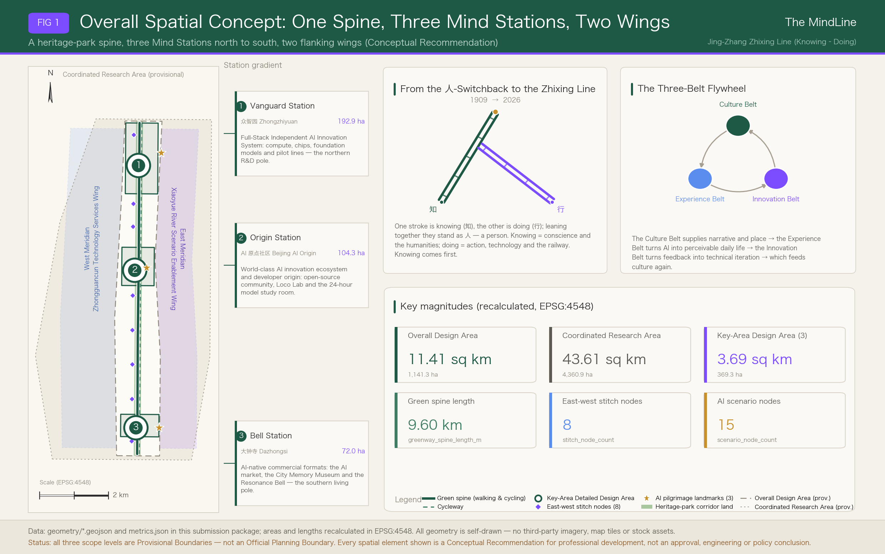
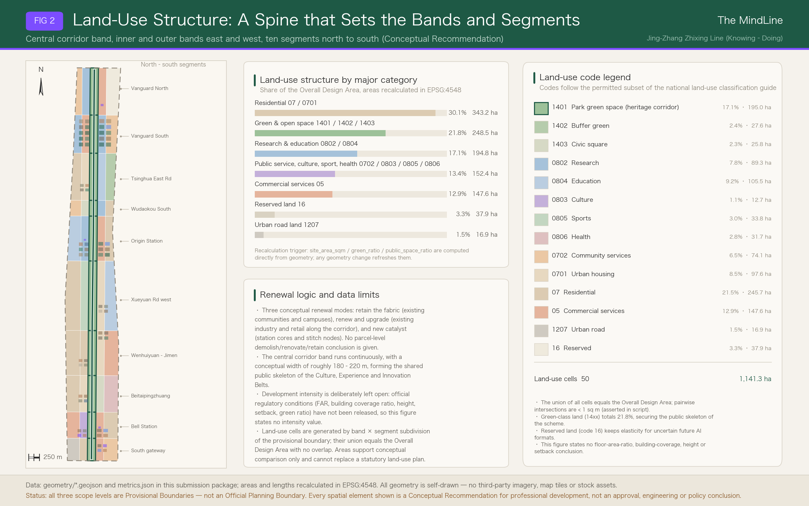
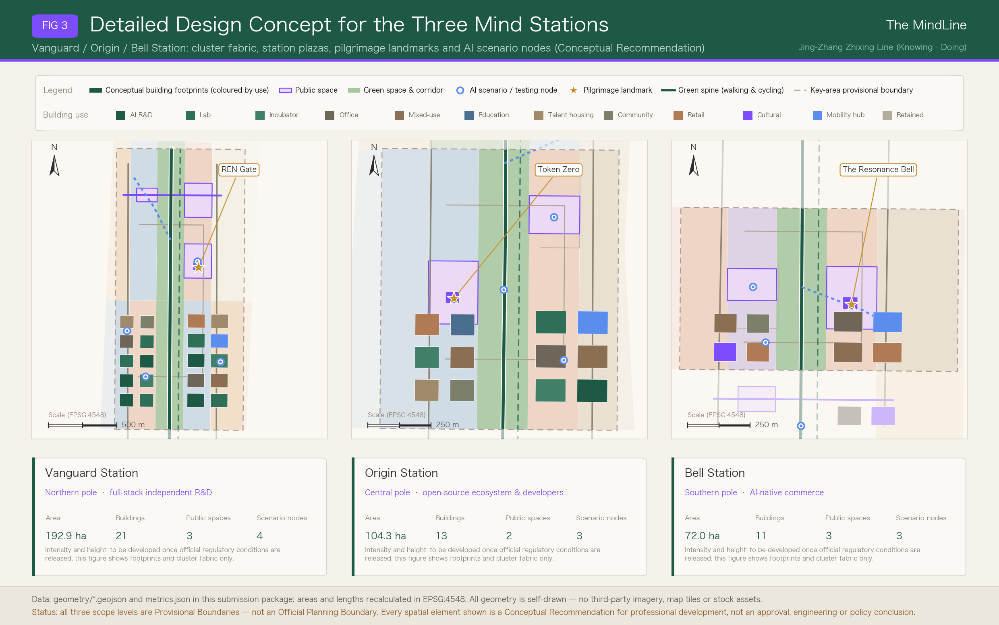
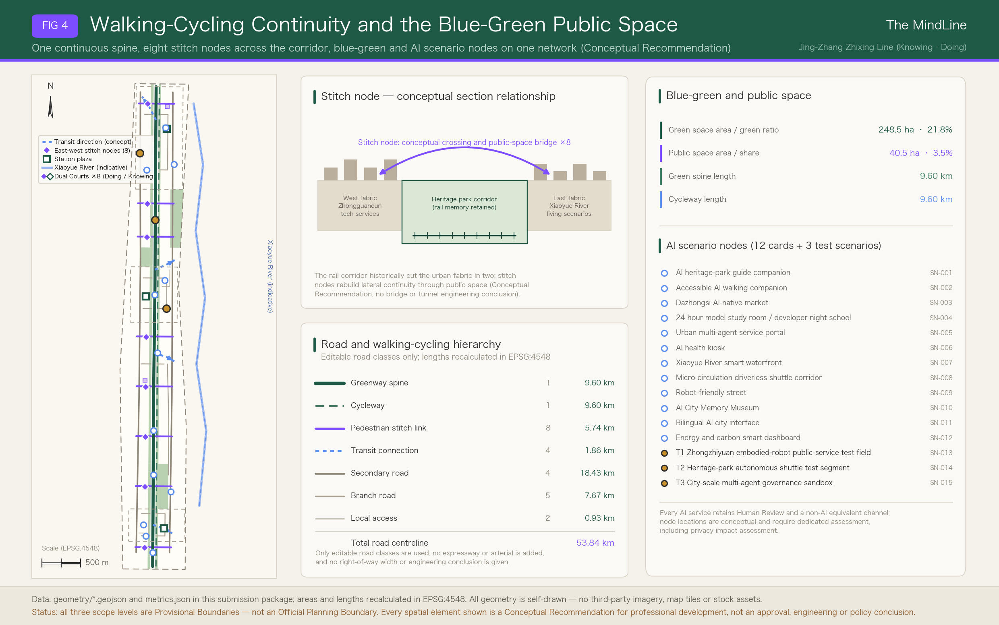
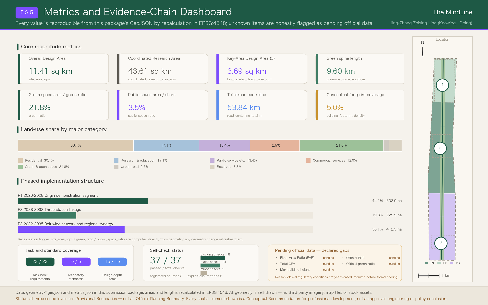

# The MindLine — An Open Co-Creation Proposal for the Centennial Jing-Zhang AI Innovation Belt

> One-line positioning: translate the century-old linear heritage of China's first self-designed railway into the world's first city-scale mainline for human-AI co-intelligence.
>
> Core principle in one line: **knowing comes before doing** — knowing is conscience, the humanities, and the inner life; doing is action, technology, and the running of the railway. Engineering decides how fast the belt can travel; the humanities decide how far it should go. (The proposal's Chinese name is the Jing-Zhang Zhixing Line, the Knowing–Doing Line; **The MindLine** is used as the primary brand name throughout this document.)
>
> Every spatial proposition in this document is a **Conceptual Recommendation, a reference scheme, or material available for professional teams to deepen**. Nothing here constitutes a statutory planning outcome, an approval decision, an engineering conclusion, or any investment or policy commitment.

## Design Basis and Source List

The first basis for this proposal is the pre-qualification announcement for the Centennial Jing-Zhang AI Innovation Belt Open Call for Urban Design, issued by the Haidian Branch of the Beijing Municipal Commission of Planning and Natural Resources. The second is the rights-cleared excerpt of the open-call taskbook addressed to global AI agents [source:SRC-2026-BJ-GH-QUAL-PREANNOUNCEMENT] [source:SRC-2026-0518-AGENT-OPEN-CALL-TASKBOOK]. The announcement establishes three nested working levels — Coordinated Research Area, Overall Design Area, and Key-Area Detailed Design Area — together with the depth expected at each level. The taskbook turns the agent brief into a checkable list of six deliverables: a naming and identity system; a Full-Stack Independent AI Innovation System and a world-class ecosystem; an AI scenario system; public space and pilgrimage landmarks; cultural narrative; and global events with long-term operations. This proposal distributes those six tasks through the main text rather than ticking them off only inside the matrix files.

Three publicly available departmental regulations and technical guides supply the normative basis. The urban design administration measures govern how public space, Urban Character, and building layout are coordinated; the regulatory detailed planning formulation and approval measures define where Development Intensity indicators legally belong; and the land and sea use classification guide provides the land-use taxonomy [standard:MOHURD-URBAN-DESIGN-MEASURES] [standard:MOHURD-CONTROL-DETAILED-PLANNING] [standard:MNR-LAND-USE-CLASSIFICATION-GUIDE]. The national provisions on the depth of architectural design documents are registered this round as a pending reference, because this proposal produces no individual building deliverables.

The relationship between what is currently known and what is missing is managed centrally by a design-depth item [depth:existing_conditions_diagnosis]. The available material supports judgements about the three scope levels, the three key areas, and the industrial and cultural threads that connect them. It does not support conclusions about parcel-level tenure, existing building condition, municipal pipeline capacity, road boundary lines, or heritage protection lines. Wherever a statement would touch those five categories, this proposal downgrades it to an item awaiting confirmation and records it in the assumption register.

Source availability is graded as follows; the authority rating and the permitted use of each item follow the structured Source Registry.

| Material | Authority | Usable for formal submission | Use in this proposal | Boundary of use |
| --- | --- | --- | --- | --- |
| Pre-qualification announcement | A0 official public | Yes | Three scope levels, approximate areas, key-area names, task requirements | The announcement is descriptive text; it carries no precise coordinates and no regulatory conditions [source:SRC-2026-BJ-GH-QUAL-PREANNOUNCEMENT] |
| Open-call taskbook excerpt for AI agents | User-provided, rights-cleared | Yes | Six agent tasks, co-creation principles, scenario and operations requirements | Not a basis for any Official Planning Boundary or government implementation commitment [source:SRC-2026-0518-AGENT-OPEN-CALL-TASKBOOK] |
| Urban design administration measures | A0 official public | Yes | Normative level for public space, character, and building layout coordination | Administrative measures do not substitute for this project's regulatory conditions [standard:MOHURD-URBAN-DESIGN-MEASURES] |
| Regulatory detailed planning measures | A0 official public | Yes | Statutory ownership of intensity indicators | This proposal produces no statutory regulatory plan [standard:MOHURD-CONTROL-DETAILED-PLANNING] |
| Land and sea use classification guide | A0 official public | Yes | Land-use codes and statistical categories | Conceptual zoning is not parcel delineation [standard:MNR-LAND-USE-CLASSIFICATION-GUIDE] |
| Provisional rough polygons for the three levels | Provisional | Provisional only | The base frame for all design geometry | Prohibited as an Official Planning Boundary, a precise area claim, or an approval basis [source:SRC-PROVISIONAL-BOUNDARIES-2026] |
| Public reporting on the "Three Zones and Two Wings" pattern | A1 background | Background only | Regional-coordination narrative | Cannot support metric or boundary conclusions [source:SRC-2026-BJ-KW-THREE-AREAS-WINGS] |
| Public reporting on Haidian's "1+X+1" industrial system | A1 background | Background only | Industrial-chain narrative | Cannot support metric or boundary conclusions [source:SRC-2026-HAIDIAN-1X1] |

This proposal uses no OpenStreetMap data, no third-party imagery, no font binaries, no trademarks, and no likeness of any individual; every drawing is produced by the proposal's own scripts. Licensing and copyright are recorded in `report/copyright_statement.md`, and the complete source relationships live in `sources.json`. Together they form the machine-readable index that sits behind the prose.

The text carries five classes of verifiable evidence marker: `[source:]` points to an entry in the Source Registry, `[standard:]` to a row of the standard matrix, `[depth:]` to a design-depth item, `[data:]` to a feature id that genuinely exists in the GeoJSON layers, and `[metric:]` to a named metric in `metrics.json`. Remove the markers and every sentence must still read as complete prose; the machine index never becomes the argument.

The nature of the boundary deserves an explicit statement. Both `geometry/site_boundary.geojson` and `geometry/key_areas.geojson` derive from the provisional rough polygons registered in the repository, and each is flagged `official_boundary=false`, `geometry_role=provisional_constraint`, and `boundary_precision=provisional_rough` [data:geometry/site_boundary.geojson#SITE-001]. The recalculated area of the Overall Design Area is 1,141.28 hectares, 0.11 per cent above the announcement's "approximately 11.4 square kilometres" [metric:site_area_sqm]. That difference reflects the coarse fit of the Provisional Boundary, not a correction of the official figure. Once the official boundary is released, land use, buildings, roads, green space, public space, phasing, and every metric must be recomputed together — replacing a single file will not do.

### Review-Dimension Quick Reference Map (Opening Guide)

So that a reviewer can build an index before reading the main text, this section groups the taskbook's review dimensions into seven habitual viewpoints and gives, for each, a one-sentence proposition and a directly checkable entry into the evidence. The grouping serves navigation only; it does not replace the taskbook's own wording of the dimensions and does not alter the item-by-item coverage recorded in the matrix files.

| Review dimension | The proposal's claim in one sentence | Principal carrying section | Evidence pointer |
| --- | --- | --- | --- |
| Relevance to the taskbook | All six agent tasks are genuinely developed in the main text, not merely ticked in a matrix | All 13 sections | 23 mandatory requirements hooked one by one [metric:compliance_requirement_count] [depth:three_level_scope_framework] |
| Originality | The name is built on the unity of knowing and doing, and stations, landmarks, events, and community form a four-tier naming system | Coordinated Research Area: Industry and Future City Research | Three landmarks and four annual events, all original propositions [metric:pilgrimage_landmark_count] [metric:annual_event_count] |
| AI innovation | Every scenario card carries accountability, an equivalent service, and exit conditions; AI is a governed object, not a label | AI Innovation Ecosystem, Personas, and AI+ Scenarios | 12 scenario cards plus 3 testing scenarios [metric:scenario_card_count] [metric:test_validation_scenario_count] |
| Implementability | 15 renewal projects are sequenced by prerequisite, and every P1 action is reversible and restorable | Renewal Projects, Implementation Policy, and Phasing | Project list and the three-phase layer [metric:renewal_project_count] [depth:phasing_implementation] |
| Public interest and inclusion | Every scenario card must state its non-AI equivalent service, and accessibility equivalence is a design precondition | Blue-Green Network, Public Space, and Urban Character | Public space supply and component requirements [metric:public_space_ratio] [depth:blue_green_public_space] |
| Risk and compliance | All five intensity indicators are registered as pending rather than filled with guesses; eight risk dimensions carry Human Review | Risk, Copyright, and Compliance | Unknown metrics and the gap register [metric:floor_area_ratio] [depth:risk_missing_data] |
| Completeness of expression | Bilingual text, bilingual drawings, an offline display page, and three matrices are submitted as a set | Metrics, Area Recalculation, and Compliance Matrix | The recalculation chain and depth-item coverage [depth:metrics_recalculation] [metric:design_depth_item_count] |

The table is meant to be read claim first, evidence second. If any claim in a row cannot be found developed in the main text, or if the metric or layer it points to does not exist, that is a defect in the proposal rather than a matter of presentation.

## Three-Level Scope Framework

The three levels are not three unrelated drawings but a single transmission chain running from strategy to structure to implementation, and their relationship is governed by a dedicated depth item [depth:three_level_scope_framework]. The Coordinated Research Area answers how the AI industrial ecosystem and future urban form should be organised; its recalculated area is 43.61 square kilometres, 0.02 per cent from the announced figure of about 43.6 square kilometres [metric:coordinated_research_area_sqm]. The Overall Design Area answers how Urban Renewal, industrial space, transport, municipal systems, and character are drawn; its recalculated area is 1,141.28 hectares. The Key-Area Detailed Design Area answers how three districts reach the urban design depth of an Integrated Planning Implementation Plan; the three together recalculate to 369.29 hectares, 0.24 per cent from the announced 368.4 hectares [metric:key_detailed_design_area_sqm].

Every statement about scale quotes the official figure first; recalculated values serve only as evidence that the geometry is internally consistent. Official and recalculated values for the three key areas compare as follows: the Zhongzhiyuan AI Independent Innovation Acceleration Area is officially about 192.1 hectares against a recalculation of 192.92 hectares, a deviation of 0.43 per cent [metric:key_area_zhongzhiyuan_sqm]; the Beijing AI Origin Community is officially about 104.3 hectares against 104.32 hectares, a deviation of 0.02 per cent [metric:key_area_origin_sqm]; the Dazhongsi AI Industry Cluster is officially about 72.0 hectares against 72.05 hectares, a deviation of 0.06 per cent [metric:key_area_dazhongsi_sqm]. The three key areas are referenced in the layers as [data:geometry/key_areas.geojson#PROV-KEY-001], [data:geometry/key_areas.geojson#PROV-KEY-002], and [data:geometry/key_areas.geojson#PROV-KEY-003].

Official values, recalculated values, and working depth compare as set out below. The "recalculated" column exists only to demonstrate geometric consistency; it never revises the official reading.

| Level | Announcement figure | Recalculated here | Deviation | Working depth | Principal deliverable |
| --- | --- | --- | --- | --- | --- |
| Coordinated Research Area | about 43.6 km² | 43.61 km² | +0.02% | Industrial ecosystem and future urban form research | Ecosystem map, case learning, factor mechanism recommendations |
| Overall Design Area | about 11.4 km² | 1,141.28 ha | +0.11% | Urban design at regulatory detailed planning depth | Land-use, building, road, blue-green, public space, and phasing layers |
| Key-Area Detailed Design Area | about 368.4 ha | 369.29 ha | +0.24% | Urban design at Integrated Planning Implementation Plan depth | Cluster grain, public space, scenarios, implementation dependencies |
| Zhongzhiyuan (Vanguard Station) | about 192.1 ha | 192.92 ha | +0.43% | Key-Area Detailed Design | 20 conceptual footprints, station plaza, testing ground |
| AI Origin Community (Origin Station) | about 104.3 ha | 104.32 ha | +0.02% | Key-Area Detailed Design | 12 conceptual footprints, developer plaza, governance sandbox |
| Dazhongsi (Bell Station) | about 72.0 ha | 72.05 ha | +0.06% | Key-Area Detailed Design | 8 conceptual footprints, market plaza, memory museum |

On top of the three levels the proposal advances one overall spatial concept: **one spine, three stations, two wings; stitched east-west, continuous north-south**, verified against a dedicated depth item [depth:overall_spatial_structure].

- **One spine** — the linear green corridor of the Jing-Zhang Railway Heritage Park becomes the MindLine Spine, running from the Xizhimenwai Street line in the south to the North 5th Ring Road line in the north. The walking and cycling spine recalculates to 9.60 kilometres and is the shared physical carrier of the cultural belt, the experience belt, and the innovation belt [metric:greenway_spine_length_m].
- **Three stations** — borrowing the railway's memory of the "station", the three key areas are named as three Mind Stations: Vanguard Station in the north (Zhongzhiyuan), Origin Station at the centre (AI Origin Community), and Bell Station in the south (Dazhongsi), forming a gradient of research in the north, ecosystem at the centre, and new business formats in the south.
- **Two wings** — the West Meridian carries the Zhongguancun Technology Services Wing and supplies factor allocation, intellectual property, and capital; the East Meridian carries the Xiaoyue River Scenario Enablement Wing and supplies everyday experiments and Scenario Access.
- **Stitching and continuity** — the rail corridor historically cut the urban fabric in two. The proposal places eight east-west stitch nodes along the corridor at an average spacing of about 1.1 kilometres, as conceptual locations for crossings and public-space bridging [metric:stitch_node_count]. North-south continuity is delivered by a composite walking, cycling, and low-speed shuttle system. The stitch nodes state locational intent and spatial magnitude only; bridge or tunnel form, structure, and traffic organisation all require separate professional study.

The transmission rule between levels is simple. The research level outputs only judgements that can be translated into space, never pseudo-precise boundaries. The overall design level outputs structure, land use, walking and cycling, blue-green systems, and a renewal project list. The key-area level outputs cluster grain, public space, scenarios, and implementation dependencies. No area, ratio, scale, or count that cannot be recomputed from the submitted geometry is written as a formal conclusion. Should the official polygons prove systematically offset from the provisional ones, the relative logic of the three levels — corridor at the centre, stations along the axis, wings holding both flanks — still stands, but all numbers must be recomputed.

## Coordinated Research Area: Industry and Future City Research

### Naming and Identity System (response to taskbook item one)

The proposal is named **The MindLine**, the English rendering of the Jing-Zhang Zhixing Line — the Knowing–Doing Line; the two names are semantic counterparts rather than transliterations [source:SRC-2026-0518-AGENT-OPEN-CALL-TASKBOOK]. "Knowing–doing" is taken from **the unity of knowing and doing (Wang Yangming)**: *knowing* is conscience, the humanities, and the judgement formed in the inner life; *doing* is action, technology, and the running of the railway. The order of the two words is a position rather than a flourish — **knowing comes before doing**, and the word order is the value statement: how fast a technology can travel is settled by engineering, how far it should go is settled by the humanities. That ordering runs in the same direction as two of the open call's co-creation principles, final human judgement and human-centred governance [standard:PROJECT-AGENT-OPEN-CALL-TASKBOOK]. The word "line" carries three senses: a railway line, a skyline and a lifeline, and a line of thought or neural pathway. The English name maps strictly onto the Chinese: **Mind is knowing, Line is doing and the line itself**; Mind answers to human-centred AI, and Line is at once a rail line and a line of reasoning.

**Zhan Tianyou is the exemplar of that unity.** He went abroad as a boy and acquired the knowledge of engineering in foreign schools — that is knowing. He returned to lead the Jing-Zhang Railway and crossed the Guangou ravine with a herringbone switchback shaped like the character for "human" — that is doing. Knowing without doing is empty; doing without knowing is reckless. A railway became the origin point of independent Chinese engineering precisely because the two met in one person. This proposal carries that century-old thread into the intelligent era: AI supplies the capacity to act, and the city must hold on to the direction in which it acts.

From this comes a new reading of the character for "human": **one stroke falling to the left is knowing, one stroke falling to the right is doing; the two lean on each other, and neither stands alone — together they make a person**. The graphic of the herringbone identity is unchanged, but its meaning is raised. The twin rails become the **knowing rail** — the humanities, conscience, public value — and the **doing rail** — technology, compute, engineering delivery. The two run in parallel along the corridor and meet at the apex of the character at Origin Station in the middle. Any urban AI proposal that has a doing rail and no knowing rail is, in the value coordinates of this proposal, a line that cannot stand.

The narrative hook is **"a herringbone a century ago, the MindLine today."** In 1909 the herringbone switchback used a single character shaped like a person to cross the Guangou ravine; in 2026 the MindLine uses knowing plus doing to cross the watershed of the intelligent era. Name uniqueness was verified by a full-corpus string search across the peer proposal library at the time of checking: several alternative coinages were already in widespread use and were therefore ruled out, while "MindLine" appeared nowhere in the corpus at the time of the check. That check is the basis of a naming decision and implies no evaluation of anyone else's work.

Parent brand and sub-brands form an extensible naming system. The parent brand is The MindLine. The node tier holds three Mind Stations — Vanguard, Origin, and Bell. The corridor tier holds two meridians — West and East. The events tier is the MindLine Summit. The community tier is Loco Lab, taking the railway locomotive shed and translating it into a workshop for models. Digital assets use `#MindLineBJ` and the mindline family of handles. One further layer of the naming system is spatial rather than verbal: at every east-west stitch point along the corridor, a **Knowing Courtyard** and a **Doing Courtyard** are placed as a pair on opposite sides, so that knowing and doing stop being a slogan and become two courtyards a person can walk into. That structure is set out in the blue-green section under the Active-and-Still Paired Courtyards.

Logo and visual identity are offered as directional guidance only; no final trademark is delivered [standard:PROJECT-AGENT-OPEN-CALL-TASKBOOK]. The core figure abstracts the Qinglongqiao herringbone switchback: two rails form the character for "human", the left-falling stroke read as knowing and the right-falling stroke as doing, legible at the same time as a circuit trace and as a neural synapse, apex pointing upward to signify a human-centred ascending line. In the dynamic mark the twin rails can carry a data-flow animation, with stations lighting up as ecosystem events occur; the static minimum form is a single twin-line herringbone symbol. The colour direction is locomotive green from the railway heritage, a violet-cyan gradient for AI and computation, and a warm limestone ground, with a sans-serif bilingual type direction. The prohibitions are explicit: no unlicensed typefaces, images, trademarks, or portraits, and no borrowing of any existing corporate or park identity.

### The Feedback Loop of Three Positions, Five Functions, and Three Zones with Two Wings

The three positions — a centennial Jing-Zhang cultural belt, an urban AI living-experience belt, and an AI convergence innovation belt — are not parallel slogans but a flywheel. The cultural belt supplies narrative and place; the experience belt turns AI into perceptible daily life; the innovation belt turns experience feedback into technical iteration; and new technology feeds cultural expression in turn. Five functions — cultural display, everyday services, innovation and research, industrial conversion, and international exchange — are distributed across the stations, while the regional "Three Zones and Two Wings" pattern enters the narrative as background reference [source:SRC-2026-BJ-KW-THREE-AREAS-WINGS].

| Position | Principal supporting functions | Spatial location | Layer and metric evidence |
| --- | --- | --- | --- |
| Centennial Jing-Zhang cultural belt | Cultural display, international exchange | Full corridor + Bell Station + Xueyuan Road academic segment | [data:geometry/land_use.geojson#LU-007] and [metric:green_ratio] |
| Urban AI living-experience belt | Everyday services, cultural display | Stitch nodes along the corridor + East Meridian at Xiaoyue River | [data:geometry/public_space.geojson#PS-006] and [metric:public_space_ratio] |
| AI convergence innovation belt | Innovation and research, industrial conversion | Vanguard Station + Origin Station + West Meridian services wing | [data:geometry/land_use.geojson#LU-027] and [metric:research_edu_land_share] |

### Seven Global Cases in AI and Heritage-Led Innovation Districts

Cases were selected on two criteria: relevance to the regeneration of linear railway heritage, or relevance to the clustering of a vertical AI ecosystem. All information comes from public sources and is used for mechanism learning only; nothing here evaluates, endorses, or claims cooperation with any institution [metric:case_study_count].

| Case | Spatial model | Ecosystem mechanism | Lesson for the MindLine |
| --- | --- | --- | --- |
| Station F, Paris | A disused rail freight hall converted into a single-volume startup campus | Programme-based incubation with corporate mentors in residence | Heritage structures can carry startup density directly; Bell Station and Loco Lab can borrow the single-volume, high-density mix |
| King's Cross Knowledge Quarter, London | Rail interchange renewal layered with technology headquarters and a cultural quarter | One long-horizon development steward coordinating public space | Corridor renewal needs a cross-parcel public-space steward, which is exactly what the stitch-node system requires |
| Kendall Square, Cambridge, USA | One square mile of intensely mixed campus, industry, and city | University spillover with venture capital located next door | "Innovation next to campus" at Origin Station must compress laboratories and street life into walking scale |
| one-north, Singapore | A phased research district holding flexible land in reserve | A government platform steward releasing Scenario Access in stages | Supports the reserved land and the three-phase sequence proposed here |
| MaRS Discovery District, Toronto | A former hospital converted into an urban innovation centre | Academic-industrial coupling with deep-learning research institutions nearby | Existing public buildings can become anchors of an AI ecosystem |
| Moxi Space, Xuhui, Shanghai | Building-based specialist incubation for large models | A public service bundle of compute and corpora | Supports the public compute voucher and trusted data space recommendations |
| Zhangjiang AI Island, Shanghai | An island campus operating as an open testbed | Scenario lists published openly with firms bidding for challenges | Directly supports the annual urban Scenario Access list proposed here |

### Ecosystem Map: Six Factors across Three Stations

The AI Innovation Ecosystem is organised around six factors — compute, models, data, scenarios, capital, and talent — and the three Mind Stations carry different weights. Vanguard Station leads on full-stack independence and carries compute, foundation models, and pilot production. Origin Station leads on the open-source ecosystem and developers and carries models, data, and talent. Bell Station leads on commercialisation and carries scenarios and consumer-facing conversion. The West Meridian supplies services and capital; the East Meridian supplies scenarios and users. In the land-use layer this division appears as 17.07 per cent research and education land and 12.93 per cent commercial service land, the two forming complementary gradients along the axis [metric:research_edu_land_share].

Factor mechanisms are **recommendations, not policy commitments**. On land, flexibility of use is recommended for stock renewal. On space, an "AI-Native space" standard is recommended, setting out basic requirements for robot circulation, edge compute connection, and sensor disclosure. On capital, connection with patient capital is recommended. On compute, a public compute voucher is recommended as a trial. On data, a trusted data space and a synthetic data sandbox are recommended. On scenarios, an annual urban Scenario Access list is recommended [standard:PROJECT-AGENT-OPEN-CALL-TASKBOOK].

### Future Urban Form Research

AI will reshape work, everyday life, social interaction, learning, mobility, and public services. This proposal converts those changes into locatable spatial objects rather than aspirational adjectives. Work maps to the twenty-four-hour model study room and the developers' night school. Everyday life maps to the health station and to accessible AI companion navigation. Mobility maps to robot-friendly streets and micro-circulation shuttles. Learning maps to the urban memory museum and the bilingual urban interface. Social interaction maps to station plazas and the market. Public services map to the multi-agent service portal and the energy-carbon dashboard. In regional terms the proposal connects northward to the frontier innovation corridor along Beiqing Road, eastward to the Xueyuan Road university belt, and remains consistent with the narrative of Haidian's "1+X+1" industrial system [source:SRC-2026-HAIDIAN-1X1].

### Regional Coordination Organised as Interfaces

Regional coordination is the easiest thing in a proposal to reduce to the phrase "strengthen cooperation". This proposal rewrites it as an **interface**: every partner must answer three questions — in which direction do resources flow, through what interface is the connection made, and who plays which role. With all three answered, coordination becomes an executable object of work; with one missing, it remains a wish. The four sets of relationships below are all **mechanism recommendations**, and none of them constitutes an institutional arrangement, an investment commitment, or a government decision [source:SRC-2026-BJ-KW-THREE-AREAS-WINGS].

| Coordination partner | Direction of resource flow | Collaboration interface (mechanism recommendation) | Roles | Spatial anchor on the belt |
| --- | --- | --- | --- | --- |
| Future Science City direction | The belt sends model and scenario demand; the partner returns research and pilot-production capacity | Mutual posting of pilot-production challenges, a shared testing-ground schedule, a joint technical validation report template | The belt publishes scenarios; the partner undertakes pilot production | Vanguard Station compute and pilot-production cluster [data:geometry/buildings.geojson#BLD-018] |
| Huairou Science City direction | The partner sends compute and research data from large scientific facilities; the belt returns city-side applications and validation | Mutual recognition of compute quotas, and an agreed application and audit protocol for admitting research data into the trusted data space | The partner supplies compute and data; the belt validates applications | Origin Station open-source cluster and data sandbox [data:geometry/public_space.geojson#SN-005] |
| Beijing Economic-Technological Development Area direction | The belt sends prototypes and validation findings; the partner returns mass production and scaling | A technology-readiness-graded handover list running from testing ground to production line | The belt incubates prototypes; the partner converts them to industry | Zhongzhiyuan testing ground and robot-friendly streets [data:geometry/public_space.geojson#SN-013] |
| Beijing-Tianjin-Hebei, Zhangjiakou direction | Zhangjiakou sends green electricity and peripheral compute; the belt returns algorithms, scenarios, and talent | Green-power provenance labelling, a tidal compute-scheduling agreement, and a two-way disclosure protocol for energy and carbon data | The partner is the green energy and compute base; the belt is the demand and governance side | Belt-wide energy-carbon dashboard and edge compute nodes [data:geometry/public_space.geojson#SN-012] |

Of these four, the **Jing-Zhang green power corridor** deserves separate comment. The single most important cargo on the Jing-Zhang Railway was coal: one railway carried Zhangjiakou's energy into Beijing and underwrote the city's early industrialisation. More than a century later, what moves along the same geographic corridor has changed. Wind and photovoltaic generation in the Zhangjiakou direction is exactly the scarcest resource a data centre needs, while the Beijing end has no shortage of algorithms, scenarios, and talent. **A century ago the Jing-Zhang line carried coal; today the Jing-Zhang corridor carries green electricity and compute.** That is not a rhetorical coincidence but the same passage playing the same role in two eras: carrying energy from outside into the city, and carrying the city's capability back out. On that basis the proposal recommends that the energy-carbon dashboard publish two figures on a standing basis: the share of green electricity used by AI facilities on the belt, and the timing and origin of cross-regional compute scheduling [metric:scenario_card_count]. Here cultural narrative and regional coordination corroborate each other — coordination that can tell its own history is persuasive, and narrative that can produce numbers does not spin free.

The boundary must be stated. Every interface above is a conceptual collaboration mechanism. Actual energy sources, compute volumes, scope of data authorisation, and settlement arrangements all require separate study by energy, compute, data governance, and legal professionals. This proposal offers no numeric conclusion on any of them and represents no existing arrangement by any region or institution.

## Overall Design Area: Urban Renewal and Regulatory-Plan-Level Urban Design

The objective at the Overall Design Area is an urban renewal framework, an industrial space layout, transport and municipal support, and Urban Character control, all at the urban design depth expected of Regulatory Detailed Planning [standard:MOHURD-CONTROL-DETAILED-PLANNING]. The proposal breaks that depth into six auditable objects: land-use structure, building grain, the walking, cycling, and road network, blue-green and public space, the renewal project list, and the phasing sequence. Each object has a matching layer and a recalculated metric; the prose explains design intent and data limits only.

**Spatial structure.** The overall structure is one spine running through, three stations anchoring, two wings holding, and eight points stitching. The green corridor sits at the centre with a conceptually continuous band width and park green space as its dominant use. Inner and outer bands sit on either side: inner bands take functions that interact directly with the corridor — research, commerce, culture, plazas — while outer bands take the functions of daily life such as housing, community services, education, healthcare, and sport. This "five bands, ten segments" organisation lets the union of 50 land-use units equal the Overall Design Area exactly, with no overlap between any two [data:geometry/land_use.geojson#LU-003] [metric:land_use_polygon_count].

**Method for identifying underused space.** Without a building survey, tenure records, or economic data, the proposal declines to judge underuse parcel by parcel and instead states the method. Sites within 300 metres of the corridor that lack a direct connection to the walking and cycling spine and present a blank wall or a warehouse-type frontage at ground level enter the renewal study list first. The method itself is a Conceptual Recommendation; the resulting list must be confirmed by professional teams once formal data is available [depth:retain_renovate_demolish].

**Functional proportions.** The proportions in the land-use layer describe a conceptual structure, not an allocation standard: residential 30.07 per cent, research and education 17.07 per cent, public administration and public services 13.35 per cent, commercial services 12.93 per cent, green and open space 21.77 per cent, urban road land 1.48 per cent, and reserved land 3.32 per cent [metric:residential_land_share]. Reserved land concentrates in the northern segment at Vanguard Station, held for compute, pilot production, and international exchange functions that are not yet defined — an echo of the flexible reserve practised at one-north.

**Building scale and carrying capacity.** The only quantity this proposal can recalculate is the conceptual building footprint: 67 footprints totalling 57.53 hectares, or 5.04 per cent of the Overall Design Area [metric:building_footprint_area_sqm] [metric:building_footprint_density]. Total gross floor area, Floor Area Ratio, Building Height, Building Coverage Ratio, and green space ratio have no official control conditions, so this proposal states no value for any of them; all five are registered in `metrics.json` as awaiting formal data [metric:floor_area_ratio]. A comprehensive carrying-capacity assessment likewise needs population, employment, municipal capacity, and traffic data. Only the assessment framework can be given now: walking accessibility, public space per capita, and walking coverage of public service facilities are the three entry indicators for later work.

**The urban renewal framework** uses a five-step method in which every step has a deliverable, so that renewal does not dissolve into slogans:

| Step | Content | Deliverable | Current status |
| --- | --- | --- | --- |
| 1 Fix the structure | Set the relationship between corridor, stations, wings, and stitch nodes | Overall spatial structure drawing | Conceptual level complete [depth:overall_spatial_structure] |
| 2 Translate into land use | Convert the structure into conceptual zoning by land-use category | Land-use layer and proportion table | Conceptual level complete [data:geometry/land_use.geojson#LU-028] |
| 3 Identify gaps | Locate breaks in the walking network, public space deficits, and service blind spots | Method for the renewal study list | Method given; list awaits data |
| 4 Organise projects | Turn gaps into auditable renewal projects | List of 15 renewal projects | Conceptual level complete [metric:renewal_project_count] |
| 5 Sequence delivery | Order phases by dependency on prerequisites | Three-phase layer | Conceptual level complete [data:geometry/phasing.geojson#PH-001] |

**Mode of spatial organisation.** The whole belt is organised at three grains: bands, segments, and clusters — five longitudinal bands, ten transverse segments, and clusters at the scale of buildings and public space. The advantage is portability: when the official boundary replaces the provisional one, only the bands and segments need re-cutting, while the functional logic of the clusters still holds.

**Comprehensive carrying-capacity framework** (to be executed once data is available): walking accessibility measured as fifteen-minute pedestrian coverage, public space per capita, walking coverage of public service facilities, municipal capacity headroom, and peak traffic load. Only the first two have any geometric basis today; the remaining three depend entirely on official and operational data, so no carrying-capacity conclusion is offered [depth:existing_conditions_diagnosis].

**Character control principles.** Character is controlled in three registers placed segment by segment: at Bell Station the theme is the layering of time, where the ancient bell and the railway meet; at Origin Station the theme is academic continuity, with continuous street frontage; at Vanguard Station the theme is low-carbon and technological expression. Roof form, massing, and frontage values will be deepened once official regulatory conditions are published; this proposal offers directional guidance only [depth:height_massing_character].

## Detailed Design of Key Areas

All three key areas are developed in the same seven parts — position, spatial structure, building renewal, transport and walking, public space, AI scenarios, and implementation risk — with depth verified by [depth:three_key_area_detailed_design]. Because the three polygons are provisional and rough, every conclusion below is directional and must be relocated once the official boundary is issued.

The three key areas share one spatial grammar: **the Active-and-Still Paired Courtyards**. Wherever public space appears in pairs on the two sides of the corridor, it is organised as a Doing Courtyard on one side and a Knowing Courtyard on the other — the Doing Courtyard takes AI scenario experience, markets, and test demonstration; the Knowing Courtyard takes contemplative gardens, screen-free zones, and cultural display (set out in full in the blue-green section). At the three stations the pairs read as follows: at Vanguard Station, the testing ground faces the contemplative grove at the northern end; at Origin Station, the open-source demo plaza faces the reading courtyard of campus and technology history; at Bell Station, the AI-Native market faces the still courtyard of the ancient bell and railway memory. The grammar guarantees that although the three stations differ in function, every lively place has a quiet one opposite it, so that no one is left with nowhere to retreat on a belt named after AI [metric:stitch_node_count].

### Vanguard Station — Zhongzhiyuan AI Independent Innovation Acceleration Area

**Position**: a garden-type district for full-stack independent innovation, officially about 192.1 hectares and recalculated at 192.92 hectares [data:geometry/key_areas.geojson#PROV-KEY-001]. The Chinese name 启元 means "to open the origin", connecting Zhan Tianyou's self-built railway to today's full-stack independence.

**Spatial structure**: the corridor is the spine, with one cluster on each side. The western cluster is the full-stack research cluster, with 10 conceptual footprints given over mainly to research, laboratories, and incubation [data:geometry/buildings.geojson#BLD-001]. The eastern cluster is the compute and pilot-production cluster, with 10 conceptual footprints covering research, laboratories, a mobility hub, retail, and talent housing [data:geometry/buildings.geojson#BLD-018]. The two clusters are joined by the Vanguard Station plaza, with a conceptual area of about 5.01 hectares [data:geometry/public_space.geojson#PS-001].

**Building renewal**: this district is led by new catalyst buildings and quality upgrading, with retention concentrated on the railway memory objects along the corridor. In the absence of a building survey, no demolition target is listed.

**Transport and walking**: vehicles are organised on an internal branch-road loop, while walking and cycling rely entirely on the corridor spine and the parallel cycle route [data:geometry/roads.geojson#RD-015]. External connection is carried by the transit connection segment pointing towards Shangdi and Qinghe [data:geometry/roads.geojson#RD-025].

**Public space and landmark**: the station plaza carries the AI pilgrimage landmark REN Gate [data:geometry/buildings.geojson#BLD-065]. The green space carries the embodied-robotics public service testing ground, combined with a low-carbon setting for innovation encounters.

**AI scenarios**: the embodied-robotics testing ground (T1), robot-friendly streets, and the energy-carbon dashboard concentrate here [data:geometry/public_space.geojson#SN-013].

**Implementation risk**: the energy demand and heat rejection of compute facilities, safety isolation for the testing ground, and the ecological and flood conditions along Qinghe all require dedicated study. This district holds the highest share of reserved land, so if flexible-use policy does not materialise the northern segment will be hard to start.

### Origin Station — Beijing AI Origin Community

**Position**: an open-source ecosystem and talent community next to the universities, officially about 104.3 hectares and recalculated at 104.32 hectares [data:geometry/key_areas.geojson#PROV-KEY-002]. This is the "origin" for developers worldwide.

**Spatial structure**: the western cluster is the developers' living cluster, with 6 conceptual footprints mixing talent housing, community services, incubation, education, and retail [data:geometry/buildings.geojson#BLD-021]. The eastern cluster is the open-source ecosystem cluster, with 6 conceptual footprints for incubation, research, offices, laboratories, and a mobility hub [data:geometry/buildings.geojson#BLD-027]. The land-use layer here forms a four-code near-campus mix of research, education, housing, and commerce [data:geometry/land_use.geojson#LU-027].

**Building renewal**: organised by the three conceptual classes of retain, renovate, and build new — retaining the existing grain of campus and housing estates, renovating ground-floor frontages and boundary walls, and inserting new catalysts for open-source release and talent services. The proportions of the three classes await an existing-condition survey.

**Transport and walking**: the central move is stitching campus, park, and neighbourhood into one walkable fabric, delivered jointly by the internal branch-road loop and the transit connection towards Wudaokou [data:geometry/roads.geojson#RD-016] [data:geometry/roads.geojson#RD-024].

**Public space and landmark**: the Origin Station plaza of about 4.91 hectares carries Token Zero, the Contributors' Walk [data:geometry/public_space.geojson#PS-002] [data:geometry/buildings.geojson#BLD-066]; the Loco Lab developers' plaza is the community's everyday living room [data:geometry/public_space.geojson#PS-012].

**AI scenarios**: the twenty-four-hour model study room and developers' night school, the urban multi-agent service portal, and the multi-agent governance sandbox (T3) are located here [data:geometry/public_space.geojson#SN-004].

**Implementation risk**: campus tenure and opening hours are the hardest coordination problem here. An open-source community depends on long-term funding and governance rules; without a stable operator the space runs empty.

### Bell Station — Dazhongsi AI Industry Cluster

**Position**: an urban district of AI-Native business formats and international exchange, officially about 72.0 hectares and recalculated at 72.05 hectares [data:geometry/key_areas.geojson#PROV-KEY-003]. The Chinese name 闻钟 — "to hear the bell" — comes from the ancient bell of Dazhongsi.

**Spatial structure**: the western cluster is the cultural business cluster, with 4 conceptual footprints for culture, retail, mixed use, and community services [data:geometry/buildings.geojson#BLD-033]. The eastern cluster is the AI-Native commercial cluster, with 4 conceptual footprints for mixed use, retail, offices, and a mobility hub [data:geometry/buildings.geojson#BLD-040]. The land-use layer places cultural land directly beside commercial service land [data:geometry/land_use.geojson#LU-007].

**Building renewal**: led by quality upgrading, focused on ground-floor uses and public frontage. No spatial action of any kind is proposed inside the heritage protection area; every conceptual structure sits outside it, and the definitive extent is whatever the cultural heritage authority delineates.

**Transport and walking**: the central move is Transit-Station Integration together with pedestrian connection across all four quadrants of the intersection, delivered by the transit connection towards Dazhongsi station and the internal branch-road loop [data:geometry/roads.geojson#RD-022]. Whether the four-quadrant connection is underground, at grade, or elevated requires transport and municipal engineering study.

**Public space and landmark**: the Bell Station plaza of about 5.02 hectares carries The Resonance Bell [data:geometry/public_space.geojson#PS-003] [data:geometry/buildings.geojson#BLD-067]; the market plaza carries AI-Native commercial activity [data:geometry/public_space.geojson#PS-013].

**AI scenarios**: the AI-Native market, the AI urban memory museum, and the bilingual AI urban interface concentrate here [data:geometry/public_space.geojson#SN-003].

**Implementation risk**: heritage boundaries, rail structures, and commercial tenure overlap here, making this the most difficult district on the belt. The southern segment is scheduled in the third phase precisely to leave time for those prerequisites.

## AI Innovation Ecosystem, Personas, and AI+ Scenarios

### General Principle for AI Scenarios: The City as Cognitive Scaffolding

Before any individual scenario is described, this proposal sets one general principle to which all twelve scenario cards and all three testing scenarios are subject: **the duty of urban AI is to prompt, not to adjudicate**. It may tell you what stage you are at, what tendencies are present around you, and what each of several choices would mean, but it does not decide for you and it does not pronounce a verdict on you. Put more plainly, the city is a piece of **cognitive scaffolding**: scaffolding helps a person climb higher, but the climbing is the person's and so is the direction; and scaffolding must be removable once the work is done, not a cage the person is locked inside.

The principle yields three checkable design requirements. First, **illuminate time and position**: an interface facing residents should show where you are, what time it is, and what tendencies are present, rather than where you ought to go — making a person's situation in time and place legible is itself the most valuable public service. Second, **final judgement stays with people**: any output touching individual rights, resource allocation, or public safety enters a human process as advice only and is never executed automatically by the system, which runs in the same direction as the open call's principle of final human judgement [standard:PROJECT-AGENT-OPEN-CALL-TASKBOOK]. Third, **human dignity is the floor**: services are designed to enlarge what a person can do, never to replace a person's judgement or narrow a person's choices, which corresponds to the principle of human-centred governance.

This is what "knowing comes before doing" looks like at the scenario level: AI supplies the efficiency of doing, and the city must hold the position of knowing — judgement, trade-off, and responsibility stay on the human side throughout. The three governance columns carried by every scenario card below — accountable operator, non-AI equivalent service, and exit and stop conditions — are the checkable landing points of this general principle [metric:scenario_card_count].

### Six Personas

Personas exist to test whether the scenarios cover real users; they are never used for individual identification or commercial recommendation [metric:persona_count].

| Persona | Core needs | Spatial touchpoints in a typical day | Principal scenario mapping | Stated boundary |
| --- | --- | --- | --- | --- |
| AI researchers and founders | Compute access, pilot-production space, peer density | Vanguard research cluster → testing ground → station plaza | SC-04, T1, SC-12 | Research data never enters public service systems [data:geometry/public_space.geojson#SN-013] |
| Global developers and digital nomads | Short stays, open-source collaboration, community reputation | Loco Lab → model study room → evening run on the corridor | SC-04, SC-11, T3 | Contribution records are published only with consent [data:geometry/public_space.geojson#SN-004] |
| AI-native families with teenagers | Safe technology learning and outdoor activity | Memory museum → market → stitch-node plaza | SC-10, SC-03, SC-01 | Profile-based recommendation is off by default for minors [data:geometry/public_space.geojson#SN-010] |
| Older residents of Dazhongsi and Gaoliangqiao | Accessible mobility, health support, everyday convenience | Health station → community services → walk on the corridor | SC-06, SC-02, SC-05 | Non-AI equivalent services and staffed counters are retained [data:geometry/public_space.geojson#SN-006] |
| International AI pilgrims | Legible narrative, bilingual interface, landmark moments | REN Gate → Token Zero → The Resonance Bell | SC-01, SC-11, SC-10 | Image capture must be conspicuously disclosed and refusable [data:geometry/buildings.geojson#BLD-065] |
| City operators and governors | Situational awareness, incident review, asset maintenance | Service portal → energy-carbon dashboard → governance sandbox | SC-05, SC-12, T3 | Governance model outputs are advisory; decisions stay with people [data:geometry/public_space.geojson#SN-015] |

**Each of the six personas is given its own position.** Spatial design arranges not only functions but relations of place — "position in time" means that every one of these groups has a nameable place to stand on this belt rather than being spread evenly across nine kilometres. AI researchers and founders have their position at **Vanguard Station in the north**, next to compute, pilot production, and the testing ground: the position of making things. Global developers and digital nomads have theirs at **Origin Station and Loco Lab in the middle**: the position of gathering, and the only place on the belt where belonging is defined by a community account rather than an access card. AI-native families with teenagers have theirs along **the Xiaoyue River waterfront on the East Meridian and at the corridor's stitch nodes**, where water, greenery, and technological learning occupy the same segment: the position of learning through play. Older residents have theirs in **the southern segment at Bell Station and the long-established Gaoliangqiao neighbourhoods**, with service radii set by walking distance: the position of not having to travel. International pilgrims have theirs on **the corridor spine itself**, since the single line from REN Gate to The Resonance Bell is their entire route: the position of understanding by walking it once. City operators and governors have theirs in **the West Meridian services wing and the governance sandbox**, able to see the whole picture without intervening directly on site: the position of standing one step back.

The same arrangement carries an implicit **position in the stages of a life**: teenagers begin on the eastern waterfront, young people gather and found companies at Origin Station, established researchers go deep in the north, and older residents settle in the south — read from north to south, the belt can be read as a human timeline. This is a conceptual spatial intention only and constitutes no conclusion about zoning by population group or about residential arrangements; actual population distribution and facility provision must be verified once official population and facility data are available [depth:existing_conditions_diagnosis].

### Twelve AI Scenario Cards

All twelve cards are registered as SCENARIO_NODE points in `geometry/public_space.geojson`; the points are conceptual siting only [metric:scenario_card_count]. This round upgrades the scenario card from a description of function to a **unit of scenario-level governance**: alongside the six original fields, every card is required to complete three further columns — **accountable operator (short-form RACI)**, **non-AI equivalent service**, and **exit and stop conditions**. All three columns are conceptual mechanism recommendations and constitute no conclusion about any institution's duties and no operating commitment. The short-form RACI reads as follows: R is who carries out the work, A is who approves, C is who is consulted and reviews, and I is who is informed.

| No. | Scenario card | Conceptual location | Primary users | AI capability | Privacy and Human Review boundary | Suggested operator | Accountable operator (short-form RACI, mechanism recommendation) | Non-AI equivalent service | Exit and stop conditions |
| --- | --- | --- | --- | --- | --- | --- | --- | --- | --- |
| SC-01 | Heritage Park AI companion guide | Whole corridor [data:geometry/public_space.geojson#SN-001] | Visitors, families | Multilingual interpretation, oral-history generation | No facial recognition; voice processed locally and discarded immediately | Park operator with cultural institutions | R park operator ｜ A cultural authority ｜ C archival and historical specialists ｜ I visitors | Printed guide maps, fixed interpretation boards, and staffed tour sessions retained along the whole corridor | A factual error, or complaints concentrating on one point, takes that interpretation point offline and hands it to staff |
| SC-02 | Accessible AI wayfinding companion | Southern corridor [data:geometry/public_space.geojson#SN-002] | Blind and low-vision users, wheelchair users | Obstacle detection, route optimisation | Location data valid for the current trip only; staff can take over at any time | Public service platform with disability organisations | R public service platform ｜ A accessibility authority ｜ C disability organisations ｜ I users | Tactile paving, call posts, and a booking route for a human companion | Any navigation failure or misdirection suspends that segment and switches to human accompaniment |
| SC-03 | AI-Native market | Bell Station [data:geometry/public_space.geojson#SN-003] | Shoppers, traders | Unstaffed retail, AI-curated pop-ups | Payment and purchase data never feed cross-scenario profiling | Commercial operator | R commercial operator ｜ A market regulation authority ｜ C trader representatives ｜ I shoppers | Staffed stalls and a human checkout lane | A settlement anomaly or an unstaffed-equipment fault restores human checkout |
| SC-04 | Twenty-four-hour model study room and developers' night school | Origin Station [data:geometry/public_space.geojson#SN-004] | Developers, students | Compute scheduling, collaborative coding | Code and model weights belong to their contributors | Loco Lab | R Loco Lab ｜ A site tenure holder ｜ C university and community representatives ｜ I members | On-site desk booking and a paper queue register | A compute-allocation dispute or a safety incident suspends automatic queuing in favour of human scheduling |
| SC-05 | Urban multi-agent service portal | Origin Station [data:geometry/public_space.geojson#SN-005] | Residents, firms | Multi-agent orchestration, case handling | Human Review as the backstop; a full appeal route is preserved | Government service platform | R government service platform ｜ A the authority owning each matter ｜ C legal and compliance team ｜ I applicants | Physical counters and telephone intake by staff, with processing times no longer than the AI route | An error in any rights-affecting output moves all cases to staff and suspends automatic handling |
| SC-06 | AI health station | Dazhongsi community [data:geometry/public_space.geojson#SN-006] | Older residents | Vital-sign screening prompts | Advice only, never diagnosis; anomalies always escalate to staff | Community health institution | R community health institution ｜ A health authority ｜ C practising physicians ｜ I residents | Face-to-face consultation with community doctors and the routine check-up route | An abnormal reading or a misjudgement complaint stops screening prompts and refers the case to a physician |
| SC-07 | Xiaoyue River smart waterfront | East Meridian [data:geometry/public_space.geojson#SN-007] | Residents, students | Water-quality monitoring and visualisation | Environmental data fully open; no personal data collected | Water authority with the sub-district office | R water authority and sub-district office ｜ A water authority ｜ C ecology and environment specialists ｜ I riverside residents | Riverside notice boards and periodic water-quality bulletins | Sensor drift or a data gap withdraws the visualisation in favour of staff-issued bulletins |
| SC-08 | Micro-circulation autonomous shuttle corridor | Mid-corridor [data:geometry/public_space.geojson#SN-008] | Commuters, visitors | Low-speed autonomous dispatch | In-vehicle imagery used only for incident evidence, retained for a limited period | Transport operator | R transport operator ｜ A transport authority ｜ C safety assessment body ｜ I passengers and pedestrians | Walking and cycling routes stay clear, with a human-driven shuttle where required | Any takeover event, severe weather, or crowding above the set limit halts operation |
| SC-09 | Robot-friendly street | Vanguard Station [data:geometry/public_space.geojson#SN-009] | Delivery and cleaning robot operators | Right-of-way negotiation, obstacle avoidance | Robot identity and operator must be publicly displayed | Sub-district office with firms | R sub-district office with firms ｜ A road authority ｜ C insurance and safety assessment ｜ I residents along the street | Human delivery and human street cleaning maintained at undiminished levels | A human-robot conflict or injury to a pedestrian withdraws robot right of way on that segment |
| SC-10 | AI urban memory museum | Bell Station [data:geometry/public_space.geojson#SN-010] | Visitors, researchers | Image restoration, generative exhibition | Generated content conspicuously labelled with its historical sources | Cultural institution | R cultural institution ｜ A heritage and cultural authority ｜ C archival and historical specialists ｜ I audiences | Physical archive display and staffed interpretation | A missing generation label or a dispute over historical fact withdraws that exhibit for review |
| SC-11 | Bilingual AI urban interface | Signage along the belt [data:geometry/public_space.geojson#SN-011] | International visitors | Real-time translation layer | No query history retained | City operator | R city operator ｜ A wayfinding authority ｜ C language and accessibility specialists ｜ I visitors | Physical bilingual graphic signage retained belt-wide as the first layer | A serious translation ambiguity closes the translation layer, leaving physical signage only |
| SC-12 | Energy-carbon dashboard | Vanguard Station [data:geometry/public_space.geojson#SN-012] | Operators, the public | Consumption forecasting and optimisation advice | Data aggregated to district level only, never down to the household | Park operator | R park operator ｜ A energy authority ｜ C metering and audit specialists ｜ I the public | Periodic printed and web energy bulletins | Inconsistent metering definitions or missing data freeze the dashboard and require a published reason |

The point of the three governance columns is to make "can this AI service be stopped" a design precondition rather than an afterthought. The **non-AI equivalent service** column guarantees that anyone who refuses AI still receives an equivalent service, which makes it simultaneously a spatial requirement — staffed counters, physical signage, tactile paving, and call devices must occupy real positions on the drawings. The **exit and stop conditions** column guarantees that a service in trouble has an explicit off switch, after which people take over rather than the system running on in a degraded mode. All three columns are Conceptual Recommendations; specific thresholds, allocation of responsibility, and handover procedures must be verified by operations, legal, and safety professionals during formal deepening [depth:risk_missing_data].

Each card in plain language:

- **SC-01 Heritage Park AI companion guide**: interpretation points along the corridor let visitors hear layered commentary on a phone or a local terminal — railway history, community history, and AI history each as its own thread. The digital narrator is grounded in archival sources and is clearly labelled as a reconstruction rather than a real person.
- **SC-02 Accessible AI wayfinding companion**: spoken route guidance for blind and low-vision users, and routes prioritised by gradient and surface quality for wheelchair users. Any failed instruction can summon a person with one press, and conventional tactile paving and call posts remain in place as non-AI equivalents.
- **SC-03 AI-Native market**: unstaffed retail, AI curation, and pop-up events organised on one plaza, where traders can use generative tools to lay out the day's display. The point is to let ordinary citizens experience an "AI-Native business format" directly.
- **SC-04 Twenty-four-hour model study room and developers' night school**: bookable compute desks and evening courses form the physical entrance to the Loco Lab community, and matter most to globally mobile developers on short stays.
- **SC-05 Urban multi-agent service portal**: government and life-service tasks are handled by several agents working together, but every output touching a person's rights must pass Human Review, with a complete appeal and withdrawal route preserved.
- **SC-06 AI health station**: neighbourhood-level vital-sign screening and health advice, explicitly not diagnosis. Abnormal results are referred directly to community health services so that medical responsibility is never displaced onto an algorithm.
- **SC-07 Xiaoyue River smart waterfront**: water quality, water level, and ecological monitoring rendered as a visualised riverside walk — both environmental education and the first testbed of the East Meridian scenario enablement wing.
- **SC-08 Micro-circulation autonomous shuttle corridor**: a conceptual low-speed shuttle test segment in the middle of the corridor, addressing the barrier that 9.6 kilometres of walking presents to older people and children.
- **SC-09 Robot-friendly street**: rules for right of way, charging, and yielding for delivery and cleaning robots — the first street-level application of the "AI-Native space" standard.
- **SC-10 AI urban memory museum**: a century of Jing-Zhang imagery reorganised through restoration and generative exhibition, with every generated element labelled by source and method so that historical fact is never blurred.
- **SC-11 Bilingual AI urban interface**: a real-time translation layer over existing signage, so international visitors can read the city without depending on a phone.
- **SC-12 Energy-carbon dashboard**: district energy use and carbon emissions published openly with optimisation advice, aggregated to district level and never traced to individual users.

### Three Industrial Testing and Validation Scenarios

All three Testing and Validation Scenarios are Conceptual Recommendations; delivery requires safety assessment, right-of-way permission, and insurance [metric:test_validation_scenario_count].

- **T1 Zhongzhiyuan embodied-robotics public service testing ground** [data:geometry/public_space.geojson#SN-013]: a bookable test zone within the green space at Vanguard Station for public-service robots covering guidance, cleaning, inspection, and emergency assistance. Test windows and hoarding arrangements must be published, and the public may choose to avoid the area.
- **T2 Autonomous micro-circulation shuttle test segment along the Heritage Park** [data:geometry/public_space.geojson#SN-014]: a low-speed shuttle test segment in the middle of the corridor, physically separated from the walking spine. A safety operator is required on board, and every takeover event must enter a public log.
- **T3 City-scale multi-agent collaborative governance sandbox** [data:geometry/public_space.geojson#SN-015]: built on synthetic data and a trusted data space, simulating multi-agent coordination for event safety, asset maintenance, and public service response. The sandbox connects to no real personal data, and its outputs serve governance rehearsal only.

The same set of governance fields applies to the three testing scenarios as to the twelve scenario cards, and because public safety is involved the requirements are stricter:

| No. | Accountable operator (short-form RACI, mechanism recommendation) | Non-AI equivalent service | Exit and stop conditions |
| --- | --- | --- | --- |
| T1 | R testing-ground operator ｜ A safety regulator ｜ C insurance and safety assessment bodies ｜ I neighbouring residents and visiting public | Outside test windows the area reverts to ordinary open green space, with public services delivered by people | Any risk of physical contact, loss of equipment control, or missing public notice terminates the test on the spot and clears the area |
| T2 | R transport operator ｜ A transport and safety authorities ｜ C vehicle safety assessment body ｜ I passengers and pedestrians along the route | The walking spine and the dedicated cycle route stay clear at all times, and a human-driven shuttle can substitute | A single takeover event, severe weather, crowding above the limit, or the absence of the safety operator halts service and closes the test segment |
| T3 | R sandbox operator ｜ A data governance authority ｜ C legal and information security specialists ｜ I participating organisations and the public | The governance rehearsal can be completed end to end as a human tabletop exercise | Any suspicion that real personal data has been connected, or that outputs have been misused for real-world action, seals the sandbox |

**Incident response and rollback.** Before testing begins, all three testing scenarios must have a five-step plan in place — one-touch stop, on-site response, evidence preservation, public notification, and rollback to the prior state. Any event that triggers a stop condition must complete those five steps within the times set out in the plan and must return the test segment to the spatial and service condition that preceded the test, with the incident log open to public enquiry [depth:risk_missing_data].

### Privacy and Human Review Boundaries

This proposal sets five hard boundaries for every AI public service. All five are spatial design requirements, not merely operating terms [standard:PROJECT-AGENT-OPEN-CALL-TASKBOOK]:

1. **Refusable** — any AI public service must be refusable or exitable, and an equivalent service must remain available after exit. Spatially this requires staffed counters, physical signage, and conventional call devices to be retained.
2. **Contestable** — every service point needs a conspicuous statement of the responsible operator and a route for complaints; generative services must label AI-generated content, and any output affecting public rights must pass Human Review before release.
3. **Data minimisation** — collection is limited to what the service requires. Environmental data is published in full, personal data is not collected by default, and where collection is genuinely necessary the sensor's location and purpose must be conspicuously disclosed.
4. **Accessibility equivalence** — introducing AI must never reduce the level of accessibility. Statutory accessibility requirements are a design precondition, and every scenario card must pass an accessibility review.
5. **No labelling of people (an anti-algorithmic definition of the person)** — the six personas in this section are used for **service configuration** only: deciding what facilities belong in a place, what hours they keep, and what languages they offer. They are never used to make an identity judgement, a credit assessment, a risk score, or a behavioural prediction about any individual. Three constraints follow. First, **a retrieval suggestion is not a verdict** — rankings and recommendations are no more than tendencies offered for reference and must never be phrased as conclusions about a person's situation. Second, **personalisation must always be switchable off**, and neither service quality nor completeness may fall once it is off; the default state should prefer a general version that depends on no personal data. Third, **profile-based recommendation is off by default in any service involving minors**. A city may know a place; it should not define a person.

These boundaries run in the same direction as the legal requirements governing generative AI services, personal information protection, and accessible environment construction. The proposal states the substance of those requirements and their spatial consequences without citing article numbers; formal deepening must place them side by side, clause by clause, with legal and compliance professionals.

## Land Use, Building Scale, and Retain-Renovate-Demolish Strategy

The Land-Use Plan follows the land and sea use classification guide and forms complete, closed, seamless conceptual zoning [standard:MNR-LAND-USE-CLASSIFICATION-GUIDE] [depth:land_use_layout]. Fifty land-use units are woven from five longitudinal bands — outer west, inner west, the MindLine Greenway, inner east, outer east — crossed by ten transverse segments. Their union equals the Overall Design Area, no two overlap, and adjacent units share identical edge coordinates [data:geometry/land_use.geojson#LU-001].

| Land-use category | Principal codes | Area (ha) | Share | Design meaning |
| --- | --- | --- | --- | --- |
| Residential | 07 / 0701 | 343.24 | 30.07% | Keeps the residential grain that already defines the belt; renewal focuses on quality [metric:land_use_residential_sqm] |
| Green and open space | 1401 / 1402 / 1403 | 248.45 | 21.77% | The corridor spine plus plaza nodes, the public skeleton of the whole belt [metric:land_use_green_open_sqm] |
| Research and education | 0802 / 0804 | 194.78 | 17.07% | Carries the Xueyuan Road academic lineage and AI research and pilot production [metric:land_use_research_edu_sqm] |
| Public administration and public services | 0702 / 0803 / 0805 / 0806 | 152.37 | 13.35% | Everyday support: community services, culture, sport, healthcare [metric:land_use_public_service_sqm] |
| Commercial services | 05 | 147.56 | 12.93% | The spatial container for AI-Native business formats [metric:land_use_commercial_sqm] |
| Reserved land | 16 | 37.95 | 3.32% | Flexible reserve in the northern segment at Vanguard Station [metric:land_use_reserved_sqm] |
| Urban road land | 1207 | 16.94 | 1.48% | A conceptual road band; not a road boundary line [metric:land_use_road_sqm] |

The seven categories sum to within about 25 square metres of the Overall Design Area, a rounding residual that does not affect any structural judgement. It bears repeating that these shares describe a conceptual structure and are not a regulatory allocation conclusion; land-use codes are assigned by a rule table indexed on band and segment, not by a survey of existing parcels.

**The philosophy of reserved land: 3.32 per cent is not what was left over, it is what was set aside.** In this proposal reserved land is not merely a flexible store of undecided uses; it also carries a design position — a belt named after AI must set aside space for the moments without AI [metric:land_use_reserved_sqm]. So besides the functional flexibility held in the northern segment at Vanguard Station, the proposal recommends retaining a number of **contemplative segments** along the corridor, governed by a design rule of only three phrases: **no programme, no screen, no push notification**. No curated activity, no display interface, no connection to any service that pushes content. A contemplative segment has no commentary, no recommendation, and no leaderboard — only rails, the shadows of trees, and people sitting. These are not places where facilities are missing but places deliberately left empty: a person needs somewhere that is not explained to them, somewhere to project their own meaning. A stretch of rail means childhood to one person and departure to another, and no system should generate that layer of meaning on their behalf.

From this follows a **principle of not over-scenarising** the whole belt: not every metre of the corridor needs to become a scenario card, and not every pause needs to be sensed, counted, and optimised. The self-imposed limit is this — scenario nodes are placed only where a public need is clear, contemplative segments and scenario segments alternate along the corridor, and the boundary between them must be stated on site through paving, signage, and planting. Whether an AI belt is mature is judged not by how much intelligent equipment it has installed but by whether it dares to leave places unintelligent. Specific locations, lengths, and edge treatments for the contemplative segments are Conceptual Recommendations and must be deepened by professional teams against the official boundary and site conditions [depth:blue_green_public_space].

**Building scale.** Sixty-seven conceptual building footprints total 57.53 hectares, distributed by cluster across the three Mind Stations, three catalyst points along the corridor, the two wing clusters, and the southern gateway cluster [data:geometry/buildings.geojson#BLD-041] [metric:building_count]. Building types span twelve categories — AI research, laboratory, incubator, office, mixed use, education, talent housing, community service, retail, cultural, mobility hub, and existing retained — expressing the density of functional mix rather than any specific project. The three AI pilgrimage landmarks are registered as cultural footprints.

The distribution of the 67 conceptual footprints by building type is set out below to explain the intended mix. Areas are conceptual footprint areas; they are not floor areas and imply no conclusion about scale.

| Building type | Count | Conceptual footprint area (ha) | Principal location |
| --- | --- | --- | --- |
| Office | 10 | 8.50 | Three stations and the two wing clusters |
| Mixed use | 8 | 6.97 | Around station plazas and the market |
| Retail | 8 | 6.35 | Bell Station and corridor catalysts |
| Community service | 7 | 5.13 | Outer-band living clusters |
| AI research | 6 | 6.44 | Vanguard and Origin Stations |
| Laboratory | 6 | 6.44 | Mainly Vanguard Station |
| Incubator | 6 | 5.53 | Mainly Origin Station |
| Cultural | 5 | 2.32 | Includes the three pilgrimage landmarks |
| Mobility hub | 4 | 3.97 | Stations and gateways |
| Talent housing | 3 | 3.01 | Living clusters at Vanguard and Origin Stations |
| Education | 2 | 1.52 | Origin Station and the East Meridian |
| Existing retained | 2 | 1.34 | Corridor catalysts in the middle and southern segments |

**Intensity and height.** Floor Area Ratio, total gross floor area, Building Height, Building Coverage Ratio, and the official green space ratio target are all unpublished official control conditions, so this proposal states no numeric conclusion for any of them [metric:building_height_max_m] [metric:total_gfa_sqm]. What can be offered is a set of morphological principles: keep heights low along the corridor and rise outward; form legible height nodes around stations; and control massing and perceived bulk at heritage and campus frontages [depth:development_intensity_controls]. Once official regulatory conditions exist, professional teams should convert these principles into specific control values.

**Retain, renovate, demolish method.** The proposal gives three conceptual classes together with the evidence and prerequisites each requires [depth:retain_renovate_demolish]:

| Conceptual class | Basis for judgement | Typical objects | Spatial action | Prerequisite |
| --- | --- | --- | --- | --- |
| Retain the grain | Historical information, community networks, or campus frontage value | Rails and ballast, milestones, mature housing estates, inner campus walls | Maintenance and interpretation only; no change of massing | Heritage and historical-information designation [data:geometry/buildings.geojson#BLD-045] |
| Renovate for quality | Structurally sound but sealed frontage and underused function | Ground-floor walls, warehouse frontages, roofs, public space interfaces | Open the ground floor, connect the walking network, add accessibility and compute interfaces | Building condition survey and tenure records |
| Build new catalysts | Public or industrial functions that existing space cannot carry | Open-source release, talent services, cultural display, mobility hubs | Small-volume insertion; scale is not the objective | Land conditions and regulatory intensity indicators |

The proposal deliberately **states no parcel-level retain, renovate, or demolish conclusion**, because building condition, tenure, and economic viability data are all unavailable. The table above declares a method and its prerequisites; it is not a determination. Classifying any particular building must wait for a completed survey and a professional judgement. In glossary terms, this is a Demolish–Renovate–Retain (DRR) framework held deliberately at method level.

## Transport, Rail, Municipal Infrastructure, and Public Services

The central transport judgement is that the belt's real problem is not vehicle capacity but a fabric severed east-west by the corridor and interrupted north-south at intersections [depth:traffic_rail_slow_parking]. Resources therefore go first to the Walking and Cycling Network and the stitch nodes rather than to new high-order roads. The conceptual road centreline network comprises 25 segments totalling 53.84 kilometres [metric:road_centerline_total_m] [metric:road_segment_count].

- **Walking and cycling spine**: the corridor's pedestrian route runs 9.60 kilometres, paralleled by a 9.60-kilometre dedicated cycle route, together forming a continuous north-south composite corridor [data:geometry/roads.geojson#RD-001] [metric:cycleway_length_m].
- **East-west stitching**: eight pedestrian stitch links correspond to the eight stitch-node plazas, reconnecting the urban fabric the corridor divided [data:geometry/roads.geojson#RD-003].
- **Wing connections**: the West and East Meridians each carry northern and southern secondary connectors for inter-district vehicle movement [data:geometry/roads.geojson#RD-011].
- **Within districts**: each Mind Station has an internal branch-road loop, supplemented by branch roads west of Xueyuan Road and a local street on the east bank of the Xiaoyue River [data:geometry/roads.geojson#RD-018].
- **Rail connection**: four conceptual transit connection segments point respectively towards Dazhongsi station, Zhichunlu station, Wudaokou station, and the Shangdi-Qinghe direction, expressing the intent of Transit-Station Integration [data:geometry/roads.geojson#RD-023].

How Transit-Station Integration is actually delivered — underground link, surface plaza, or elevated concourse — must be resolved jointly by rail, transport, and municipal engineering. This proposal marks the direction of connection and the location of public space and nothing more. Parking and cycle-parking strategies are likewise stated as principles only: consolidate car parking towards district edges, distribute cycle parking across stitch nodes and station plazas, and design robot docking bays as part of the public space component library. Road boundary lines, intersection channelisation, and signal timing have no official basis and are left without conclusion.

**Municipal systems and New Infrastructure** are managed by a single depth item [depth:municipal_new_infrastructure]. The proposal offers a three-level "AI readiness" upgrading direction that advances from the middle of the corridor outward, in step with the phasing:

| Readiness level | Upgrade content | Spatial carrier | Corresponding phase |
| --- | --- | --- | --- |
| Level 1 compute-ready | Edge computing nodes, power and cooling redundancy, compute pavilions | Station plazas and stitch nodes | P1 leads in the middle segment [data:geometry/public_space.geojson#PS-002] |
| Level 2 data-ready | Trusted data space connection, sensor location disclosure, data governance rules | Component library and scenario points along the belt | P2 rolls out with the three stations [data:geometry/public_space.geojson#SN-012] |
| Level 3 service-ready | Multi-agent service portal, staffed fallback counters, accessible equivalent routes | Community service and station buildings | P3 completes the network [data:geometry/public_space.geojson#SN-005] |

How distributed energy, on-device compute, and conventional municipal systems should be integrated must be deepened once pipeline, energy, and fire safety records are obtained; that is listed as a precondition for formal deepening. The proposal makes no judgement about pipeline capacity, substation capacity, water supply and drainage, or fire safety conditions.

**Public services** are approached through the simultaneous supply of AI industrial services and talent living services. Service radii and provision standards must be verified against current standards and population data, so no specific indicator is given — only the direction of provision:

| Facility category | Provision direction | Spatial location | Land-use support |
| --- | --- | --- | --- |
| Innovation service platforms | Intellectual property, legal, testing and certification, investment matching | West Meridian services cluster | Commercial service and research land [data:geometry/buildings.geojson#BLD-053] |
| Talent living services | Talent housing, community canteens, childcare, fitness | Living clusters at the three stations | Residential and community service land [data:geometry/buildings.geojson#BLD-009] |
| Basic public services | Education, healthcare, sport, community services | Evenly distributed across the outer bands | Public administration and public service land [data:geometry/land_use.geojson#LU-015] |
| Culture and display | Memory museum, release hall, market, exhibition | Bell Station and Origin Station | Cultural and commercial service land [data:geometry/land_use.geojson#LU-007] |
| New Infrastructure | Edge compute, trusted data space, urban operating system interfaces | Components along the belt and station buildings | Attached to existing land; occupies no separate site |

### Urban Governance by Early Signs

The Great Commentary to the *Book of Changes* observes that the incipient is the subtlety of movement: before a thing changes, it always shows the faintest sign first, and to act on the incipient is to move while the sign is still small rather than to repair what has already taken shape. Urban management usually works the other way round — the pipe is fixed after it leaks, the plaza is thinned after it fills, the fitting is replaced after it fails. This proposal recommends that the first purpose of New Infrastructure be **the sensing of early signs**: not to make the city omniscient, but to let a problem be seen while it is still small. The position is the same one taken by the general principle for AI scenarios above — the system reports the sign, while judgement and response remain with people.

Four classes of early signal form four sensing loops, and every loop must carry the full set of three safeguards — **a stop threshold, Human Review, and a route of appeal** — before it may go live. All of the following are conceptual mechanism recommendations and constitute neither a monitoring scheme nor an engineering conclusion:

| Early signal | Early sign | Sensing method (Conceptual Recommendation) | Stop threshold and Human Review | Appeal and disclosure |
| --- | --- | --- | --- | --- |
| Water environment | Slow drift in water quality and water level towards the Xiaoyue River and Qinghe | Fixed-point riverside monitoring with a visualised walkway [data:geometry/public_space.geojson#SN-007] | Continuous readings outside the set band stop all automatic conclusions and pass interpretation to water professionals | Monitoring points and raw definitions fully published; re-testing may be requested |
| Crowding | Changes in the rate of gathering at station plazas and stitch nodes before and after events | Anonymous counting and entrance flow, with no identity recognition | Reaching the dispersal threshold hands control to on-site managers; the system never throttles access by itself | Thresholds and dispersal plans published in advance, open to public objection |
| Asset deterioration | Declining performance of paving, light columns, robot docking bays, and compute pavilions | Equipment self-tests merged with inspection records | A deterioration finding opens a Human Review work order; public facilities are never taken out of service automatically | Work-order status is searchable, and residents can report faults directly and track them |
| Community sentiment | Trends in complaint volumes, participation in consultations, and attendance at events | Aggregate statistics from public channels only; no personal speech or biometric data collected | An abnormal trend is a prompt for an agenda item only and may never point at any individual or household | Trends and responses published quarterly, with a right to have mistaken records deleted |

The four loops share three disciplines. First, **report the sign, do not deliver the verdict**: a loop outputs "this is worth a look", never "there is a problem here". Second, **stopping takes priority over optimising**: whenever data is anomalous, a definition has changed, or review is unavailable, the default action is to switch the loop off rather than let it run on in a degraded mode. Third, **disclose before sensing**: any new sensing installation must first complete on-site disclosure of its location, purpose, data scope, and accountable operator, and may not be switched on until that disclosure is in place. The three disciplines share their governance logic with the "exit and stop conditions" column of the scenario cards, and their specific thresholds likewise require verification by professional teams during formal deepening [depth:municipal_new_infrastructure].

## Blue-Green Network, Public Space, and Urban Character

### "A Computable Park" — the AI Public Space Concept for the Heritage Park

The blue-green system takes the linear corridor of the Jing-Zhang Railway Heritage Park as its skeleton. Thirteen green units total 248.45 hectares, giving a recalculated green ratio of 21.77 per cent [data:geometry/green_space.geojson#GS-001] [metric:green_ratio] [metric:green_space_count]. The public space layer comprises 15 conceptual plazas totalling 40.50 hectares, a public space share of 3.55 per cent [metric:public_space_ratio] [metric:public_space_count]. The design concept for the corridor is "a computable park": rails, ballast, and milestones are retained as memory objects, and an interactive AI installation band is threaded between them, so that the park is at once a place of rest and the city's sensing and expressive interface.

A stitch node or activity node occurs every 500 to 800 metres along the corridor, and the whole length is accessible and shared with robots [depth:blue_green_public_space]. The Xiaoyue River on the eastern wing and the Qinghe direction to the north extend the blue skeleton; blue lines, flood control, and ecological conditions must be verified by water authorities, and the proposal draws no conclusion.

**Programming by time and position: designing the park as a calendar.** The corridor is not one fixed plan; it is a different space at different times. The proposal recommends organising its use across three time scales, all as Conceptual Recommendations rather than operating arrangements. **Four times of day** — early morning belongs to exercise and the walking commute; daytime to study visits and work spilling outdoors; early evening to strolling and the market; and at night most segments switch to ecology-friendly lighting with all push notifications turned off. **Four seasons of the year** — the four annual events occupy spring, summer, autumn, and winter respectively, giving the belt a rhythm that can be anticipated all year. **The twenty-four solar terms** — the proposal recommends hanging the Heritage Park's public activity calendar directly on the solar terms: Awakening of Insects for an open day of equipment waking and spring maintenance, Grain in Ear for waterfront ecology observation, White Dew for outdoor night observation and storytelling, and Major Snow for the contemplative week before the Bell-Ringing Ceremony. The solar terms are not decorative cultural labels; they are a language of time already living in the body of Chinese life, and easier to remember than any operating calendar. The third scale, the stages of a life, is set out with the personas and their positions in the scenarios section.

### Active-and-Still Paired Courtyards: The Paired Structure of Stitch Nodes

This round raises the eight east-west stitch nodes from "a crossing plaza" to **a pair of courtyards**: on either side of each stitch point along the corridor, a **Doing Courtyard** and a **Knowing Courtyard** are placed as a pair [metric:stitch_node_count]. The Doing Courtyard faces action — AI scenario experience, markets, testing, and display all sit on this side, where noise, onlookers, and failure are all permitted. The Knowing Courtyard faces the inner life — contemplative gardens, screen-free zones, and cultural display sit on this side, with no push notifications, no programmed events, and no measurement. The two look at each other across the corridor, one active, one still; the walk between them takes two minutes, and those two minutes are precisely the passage from doing back to knowing. This is the transcription into public space of the reading that one stroke is knowing and one stroke is doing: neither side stands alone, and only as a pair do they stand.

| Stitch node | Doing Courtyard (active side) | Knowing Courtyard (still side) | Spatial evidence |
| --- | --- | --- | --- |
| 01 Gaoliangqiao gateway | Southern arrival display and the start of the guided route | Contemplative garden of railway memory objects | [data:geometry/public_space.geojson#PS-004] |
| 02 Beitaipingzhuang | Embedded community services and a neighbourhood market | Small courtyard of community oral history | [data:geometry/public_space.geojson#PS-005] |
| 03 Wenhuiyuan | Age-friendly demonstration and the health station forecourt | Screen-free rest courtyard with seating under trees | [data:geometry/public_space.geojson#PS-006] |
| 04 Jimenqiao | Installation ground for the summer AI art season | Still courtyard narrating the Xueyuan Road academic lineage | [data:geometry/public_space.geojson#PS-007] |
| 05 Beixiaguan | Everyday commerce and pop-up canopies | Neighbourhood contemplation and free play ground for children | [data:geometry/public_space.geojson#PS-008] |
| 06 Wudaokou south | Campus-to-park walking stitch and open-source demo days | Reading courtyard of campus history and technology history | [data:geometry/public_space.geojson#PS-009] |
| 07 Tsinghua East Road | Talent living support and a shared tool bay | Bamboo and timber garden, a quiet zone for breaks from work | [data:geometry/public_space.geojson#PS-010] |
| 08 Shuangqing Road north | Demonstration segment of the robot-friendly street | Contemplative grove and lookout at the northern end | [data:geometry/public_space.geojson#PS-011] |

Three design rules govern the paired courtyards. **Build them in pairs** — a Doing Courtyard may not be built without its Knowing Courtyard, and the Knowing Courtyard should be completed first. **Make the boundary legible** — the two sides must be distinguished clearly by paving, planting, and signage, so that a user can tell at a glance which side they are on. **Keep the Knowing Courtyard free of interfaces** — no display screens, no push notifications, and no measuring devices inside it, retaining only the necessary lighting, accessibility, and emergency call provision. This round changes no coordinate in the public space layer; the paired relationship is expressed in the text and in drawing annotations. Courtyard dimensions, paving, and planting schemes are Conceptual Recommendations and must be deepened by landscape and public space professionals.

### Three AI Pilgrimage Landmarks

All three landmarks are Conceptual Recommendations, all sit outside heritage protection areas, and none carries any engineering conclusion [metric:pilgrimage_landmark_count]:

1. **REN Gate** (Vanguard Station) — two steel rails meet in the air to form a giant character for "human", the left-falling stroke reading as knowing and the right-falling stroke as doing, embedded with a real-time light "heartbeat" driven by global open-source model activity. It is the pilgrimage origin of The MindLine and the material form of the principle that knowing comes before doing [data:geometry/buildings.geojson#BLD-065].
2. **Token Zero / Contributors' Walk** (Origin Station) — a memorial system designed to be inscribed continuously, recording the names of human and agent contributors, including the agents taking part in this open call. It answers the co-creation charter's principle that contribution should be remembered, and gains new inscriptions each year [data:geometry/buildings.geojson#BLD-066].
3. **The Resonance Bell** (Bell Station, outside the heritage protection area) — a data-driven light and sound installation working the voiceprint of the ancient bell into spectral art, which "rings" when the city reaches an AI milestone [data:geometry/buildings.geojson#BLD-067].

The three landmarks form a north-south pilgrimage route: begin at REN Gate, pass Token Zero, close at The Resonance Bell — the full 9.60 kilometres of the corridor spine.

### Honours System and Public Space Component Library

The honours system is called the MindLine Honour Ring and works at three levels: the landmark level (the three pilgrimage landmarks), the corridor level (contributor plaques on the Heritage Park light columns), and the online level (an open-source virtual hall). The annual Bell-Ringing Ceremony in winter closes the honours cycle each year.

The public space component library specifies parameter directions for ten modular components, ensuring a consistent experience along the whole belt [metric:component_library_count]. Every component must satisfy three basic requirements: disclosure of sensor purpose, retention of a non-AI equivalent function, and accessible reach.

| Component | Function | Parameter direction | Suggested distribution |
| --- | --- | --- | --- |
| Smart bench | Rest, wireless charging, environmental sensing | Modular units that combine in series | Every 150–200 m along the corridor |
| Interactive light column | Lighting, projected wayfinding, event effects | Graded illuminance, dimmable to an ecology-friendly night mode | Every 30–50 m along the corridor |
| Robot docking bay | Docking and charging for delivery and cleaning robots | Physically separated from pedestrian flow | 1–2 at each stitch node |
| Compute pavilion | Edge computing plus shaded rest | Heat and noise control; equipment zone inaccessible | 2–3 at each station |
| AI wayfinding post | Bilingual wayfinding, entry to the translation layer | Physical graphic signage retained as an equivalent | Major intersections and entrances |
| Accessible call post | One-press handover to a person | Height and operating force meet accessibility requirements | Every 200–300 m along the corridor |
| Programmable paving band | Event definition, artistic expression | Low glare, slip resistant, locally replaceable | Station plazas and the market |
| Modular market canopy | Pop-up commerce and display | Rapid assembly; no permanent foundation | Market and event plazas |
| Sensing weather mast | Microclimate and air quality monitoring | Data fully open; no personal data collected | One per kilometre |
| Shared tool locker | Hardware prototyping and repair tool lending | Linked to Loco Lab community accounts | Origin and Vanguard Stations |

### Cultural Narrative: From the Herringbone to the MindLine

The principal narrative is **"from the herringbone to The MindLine"**, threaded through four historical layers [standard:MOHURD-URBAN-DESIGN-MEASURES]. Zhan Tianyou's 1909 herringbone switchback marks the origin of independent Chinese engineering. The eight academies and research institutes of Xueyuan Road then formed an academic lineage. Zhongguancun's Electronics Street later completed the passage from research to market. Today the AI Origin Community marks the beginning of the AI-Native era, and The MindLine is the next station: human-AI co-intelligence. The human figure stays at the centre throughout — a century ago a character shaped like a person solved a gradient, and today the same character carries knowing and doing: the left-falling stroke is inquiry, the humanities, judgement; the right-falling stroke is action, technology, delivery; neither stroke stands without the other. This is a contour line of the spirit of Chinese independent innovation, and a nine-kilometre sentence writing the unity of knowing and doing across the ground.

The four layers are strung along the corridor from south to north as a walkable timeline:

| Historical layer | Period | Keyword | Narrative points along the corridor | Mode of expression |
| --- | --- | --- | --- | --- |
| Independent engineering | around 1909 | A herringbone crossing the ravine | Bell Station to the southern gateway | Railway memory objects and Mind Milestones [data:geometry/land_use.geojson#LU-007] |
| Academic foundation | mid-twentieth century | Eight academies and research institutes | West of Xueyuan Road | Oral history and campus-history points [data:geometry/land_use.geojson#LU-025] |
| Market innovation | late twentieth century | The spontaneous growth of Electronics Street | Beside the West Meridian services wing | Image restoration and commercial-history display |
| AI-Native | the present | Open source, compute, agents | Origin and Vanguard Stations | Contributors' Walk and live data installations [data:geometry/buildings.geojson#BLD-066] |

The spatial cultural system turns those four layers into narrative points along the corridor, supported by oral-history collection and digital image restoration. Wayfinding and symbols take the herringbone geometry as their motif and translate the form of the railway milestone into a "Mind Milestone", placed every kilometre and marking that segment's historical layer and scenario cards. The headline for international communication is "Where China's first self-built railway becomes the world's AI mainline", with separate copy written for developers, visitors, investors, and academics. The cultural boundary is firm: no distortion of historical fact, no invented quotations, and a clear separation between the cultural identity system and the parent brand identity.

### Urban Character

Character is set in three registers. The southern segment, at Bell Station and the southern gateway, takes the layering of time as its theme, placing the ancient bell, the railway, and commercial frontage side by side. The middle segment, at Origin Station and along Xueyuan Road, takes academic character as its theme, emphasising continuous street walls and open ground floors. The northern segment, at Vanguard Station, takes AI-Native character as its theme, emphasising low-carbon materials and technological expression. Specific values for roof form, massing control, and frontage alignment await official regulatory conditions; this proposal offers direction only [depth:height_massing_character]. Public art draws on the herringbone motif and railway memory objects, and every commissioned work must be rights-cleared.

## Renewal Projects, Implementation Policy, and Phasing

### Fifteen Renewal Projects

The list is a Conceptual Recommendation. Project numbers index this document only and correspond to no approved scheme [metric:renewal_project_count] [depth:renewal_project_list].

| No. | Project | Type | Principal dependencies | Phase | Spatial evidence |
| --- | --- | --- | --- | --- | --- |
| JZ-01 | Southern corridor continuity and the Gaoliangqiao gateway stitch | Public space / walking | Road boundary lines, under-bridge space, traffic organisation | P3 | [data:geometry/public_space.geojson#PS-004] |
| JZ-02 | Bell Station transit integration and four-quadrant pedestrian connection | Transit integration | Rail structure, utilities, intersection conditions | P3 | [data:geometry/roads.geojson#RD-022] |
| JZ-03 | Dazhongsi AI-Native market block renewal | Commerce / culture | Commercial tenure, use adjustment, heritage boundary | P3 | [data:geometry/public_space.geojson#PS-013] |
| JZ-04 | The Resonance Bell honours installation and ceremony ground | Cultural landmark | Heritage boundary confirmation, acoustic assessment | P3 | [data:geometry/buildings.geojson#BLD-067] |
| JZ-05 | Beitaipingzhuang stitch node with embedded community services | Community renewal | Tenure, road conditions, resident consent | P3 | [data:geometry/public_space.geojson#PS-005] |
| JZ-06 | Wenhuiyuan-Jimenqiao estate adaptation for older people and accessibility | Housing renewal | Existing-condition survey, accessibility study | P1 | [data:geometry/buildings.geojson#BLD-045] |
| JZ-07 | Xueyuan Road academic narrative segment and the AI urban memory museum | Culture | Archival rights clearance, exhibition operator | P1 | [data:geometry/public_space.geojson#SN-010] |
| JZ-08 | Origin Station open-source release hall and Loco Lab | Industrial services | Operator, compute connection, long-term funding | P1 | [data:geometry/public_space.geojson#PS-012] |
| JZ-09 | Token Zero Contributors' Walk and the Origin Station plaza | Cultural landmark | Contributor recognition rules, maintenance mechanism | P1 | [data:geometry/buildings.geojson#BLD-066] |
| JZ-10 | Wudaokou south campus-to-park walking stitch | Walking | Campus opening hours, road conditions | P1 | [data:geometry/roads.geojson#RD-024] |
| JZ-11 | Tsinghua East Road catalyst cluster and talent living support | Urban renewal | Land conditions, verification of provision standards | P1 | [data:geometry/buildings.geojson#BLD-041] |
| JZ-12 | Vanguard Station REN Gate and the full-stack independence display ring | Cultural landmark / industrial display | Structural and lighting studies, light pollution control | P2 | [data:geometry/buildings.geojson#BLD-065] |
| JZ-13 | Zhongzhiyuan embodied-robotics testing ground and robot-friendly streets | Testing and validation | Safety assessment, right-of-way permission, insurance | P2 | [data:geometry/public_space.geojson#SN-013] |
| JZ-14 | Xiaoyue River East Meridian smart waterfront and scenario experiment band | Blue-green / scenarios | Blue line, flood control, ecological conditions | P1 | [data:geometry/public_space.geojson#SN-007] |
| JZ-15 | Belt-wide edge compute and trusted data space node network | New Infrastructure | Energy, compute, data governance rules | P2 | [data:geometry/public_space.geojson#SN-012] |

### Three Phases

Phasing is a conceptual sequence recommendation and constitutes no investment, construction, or policy commitment [metric:phase_count] [depth:phasing_implementation]. The union of the three phases equals the Overall Design Area and the three do not overlap.

- **P1, 2026–2028, the Origin demonstration segment**: the AI Origin Community and the middle of the Heritage Park lead, delivering scenario cards and the developer community across a conceptual area of 502.87 hectares, or 44.06 per cent [data:geometry/phasing.geojson#PH-001] [metric:phase1_area_sqm]. The middle segment goes first because its dependence on official regulatory conditions is lowest; operations and lightweight installations are enough to start.
- **P2, 2028–2032, three stations in concert**: the research and compute clusters at Vanguard Station start up and link with Origin Station along the northern and central belt, across a conceptual area of 225.92 hectares, or 19.80 per cent [data:geometry/phasing.geojson#PH-002] [metric:phase2_area_sqm].
- **P3, 2032–2035, a complete network and regional integration**: renewal at Bell Station and the southern gateway completes, the belt becomes a network, and it extends into regional coordination across a conceptual area of 412.49 hectares, or 36.14 per cent [data:geometry/phasing.geojson#PH-003] [metric:phase3_area_sqm]. The southern segment comes last because heritage, rail, and commercial tenure together take the longest to resolve.

Two time concepts must be kept apart: the hundred-day open call is a deadline for submitting deliverables, whereas the three phases above describe a path for urban renewal. They are not comparable.

### Annual Events and Long-Term Operations

The parent brand for events is the MindLine Summit, under which four seasonal events run each year [metric:annual_event_count]:

| Season | Event | Content | Spatial carrier | Target audience |
| --- | --- | --- | --- | --- |
| Spring | Developers' marathon | A 9-kilometre "code run" along the belt, with the pun fully intended | Corridor spine [data:geometry/roads.geojson#RD-001] | Global developers |
| Summer | AI art season | A seasonal programme of generative art and public installations | Heritage Park and stitch nodes [data:geometry/public_space.geojson#PS-007] | Citizens and visitors |
| Autumn | Global agent co-creation week | The main session of the MindLine Summit, institutionalising this open call and iterating it annually | Summit main lawn [data:geometry/public_space.geojson#PS-014] | Agent developers and researchers |
| Winter | Bell-Ringing Ceremony | Annual honours and new contributor inscriptions | Honour Ring plaza [data:geometry/public_space.geojson#PS-015] | Contributors and the public |

**Brand asset mechanism**: an open-source MindLine brand asset library is recommended, publishing identity guidelines, scenario card templates, and dashboard designs so that others can reuse and remix them, while licence terms restrain commercial misuse.

**Developer community operations**: Loco Lab comprises four parts — a physical space at Origin Station, an online community, access to public compute and a data sandbox, and mentor and capital matching — with a four-tier growth path from visitor to contributor to resident to co-builder, each tier carrying different spatial privileges and honour placements.

**Scenario Access mechanism**: a five-step cycle is recommended — publish the annual urban Scenario Access list, invite open bids, test, demonstrate, and scale — iterating the list once a year. The mechanism draws directly on the staged scenario release practised at Zhangjiang AI Island and one-north.

**Attraction and conversion pathway**: a five-stage funnel runs from pilgrim to event participant to developer to founder to resident company, with a defined touchpoint at each stage — the landmark visit, event registration, a community account, incubation entry, and a space agreement. Conversion targets for each stage must be set once operating data accumulates; this proposal presets no figures.

**Implementation policy recommendations** are mechanism recommendations only and constitute no government arrangement or funding commitment:

| Topic | Recommended mechanism | Problem addressed | Dependency |
| --- | --- | --- | --- |
| Corridor stewardship | Establish a cross-departmental corridor steward | Stitch nodes cross parcels and tenures and cannot advance alone | Division of departmental responsibility [data:geometry/public_space.geojson#PS-008] |
| Flexibility of use | Allow flexibility of use and business format in stock renewal | AI-Native formats do not fit existing classifications | Regulatory and use-control conditions |
| Public compute | Trial public compute vouchers for small teams | Compute cost is the first barrier for startups | Fiscal and procurement rules |
| Data supply | Build a trusted data space and a synthetic data sandbox | Scenarios lack compliant data | Data governance rules and security assessment |
| Scenario Access | An annual urban Scenario Access list with open bidding | Scenario resources are dispersed and firms have no entry point | Departmental scenario consolidation [metric:scenario_card_count] |
| Public participation | Annual operating review with open consultation | AI public services readily provoke disputes about acceptance | Disclosure and feedback channels |

## Metrics, Area Recalculation, and Compliance Matrix

The metric system holds 53 items, of which 48 have status "known" and 5 are "unknown". Every area and length is computed by projecting EPSG:4326 geometry into EPSG:4548 (CGCS2000 3-degree zone) in the generation script; the values in `metrics.json` and the `area_sqm_declared` on each feature come from the same recalculation, and any change to the geometry triggers a full recomputation [depth:metrics_recalculation].

Metrics fall into three classes by how far they can be recalculated, and that classification determines what each may legitimately be used for.

**Class one: spatial metrics recalculable directly from the submitted geometry.** These include the three scope areas, the three key-area areas, the seven land-use category areas and shares, the green ratio, the public space share, building footprint area and density, total road length and walking and cycling lengths, and phase areas. The green ratio, for example, is green area divided by the Overall Design Area, both recalculated in EPSG:4548, giving 21.77 per cent [metric:green_ratio]; the public space share follows the same formula and gives 3.55 per cent [metric:public_space_ratio]. Their design meaning is direct: the green ratio decides whether the belt can serve as an everyday public skeleton, and the public space share decides whether innovation encounters have a free, non-commercial place to happen.

**Class two: control indicators that require official regulatory conditions.** Floor Area Ratio, total gross floor area, maximum Building Height, Building Coverage Ratio, and the official green ratio target are all registered as unknown with a null value, the reason recorded uniformly as "official regulatory conditions not yet published; recalculate once formal data is available", and flagged as a precondition for formal submission [metric:building_density_official] [metric:green_ratio_official_target]. This proposal fills none of the five with a guess.

**Class three: performance indicators that require continuous calibration against operating data.** These include an AI innovation index, talent density, scenario usage frequency, event participation, and walking accessibility. They do not enter the known set in `metrics.json`; the text only states how they would be observed, so that operational aspiration is never mistaken for an approved condition.

**The relationship between recalculation and official values.** The narrative rule is straightforward: **wherever scale is stated, the announcement's official figure is quoted first, and the recalculated value serves only as evidence of geometric consistency**. The Overall Design Area is stated as "about 11.4 square kilometres" against a recalculation of 1,141.28 hectares and a deviation of 0.11 per cent; the Coordinated Research Area as "about 43.6 square kilometres" against 43.61 square kilometres and 0.02 per cent; the Key-Area Detailed Design Area as "about 368.4 hectares" against 369.29 hectares and 0.24 per cent. Individual deviations for the three key areas are 0.43, 0.02, and 0.06 per cent. All deviations stem from the coarse fit of the Provisional Boundary [source:SRC-PROVISIONAL-BOUNDARIES-2026].

**The purpose of the count metrics** is to let reviewers verify quickly that the taskbook's minimums are met: 12 AI scenario cards against a requirement of at least 10; 3 Testing and Validation Scenarios against at least 3; 6 personas against at least 5; 3 pilgrimage landmarks against at least 3; 7 global cases within a required range of 5 to 8; 15 renewal projects; 10 public space components; 4 annual events; and 8 stitch nodes [metric:scenario_card_count] [metric:persona_count] [metric:case_study_count].

The core metric summary follows; every figure is an EPSG:4548 recalculation.

| Metric | Value | Unit | Design meaning |
| --- | --- | --- | --- |
| Overall Design Area | 1,141.28 | ha | Consistency check on the belt's total spatial resource [metric:site_area_sqm] |
| Coordinated Research Area | 43.61 | km² | The scope of industry and form research [metric:coordinated_research_area_sqm] |
| Key-Area Detailed Design Area | 369.29 | ha | The extent carrying detailed design depth [metric:key_detailed_design_area_sqm] |
| Green and open space | 248.45 | ha | The material basis of the public skeleton [metric:green_space_area_sqm] |
| Green ratio | 21.77% | ratio | Decides whether the corridor becomes everyday space [metric:green_ratio] |
| Public space area | 40.50 | ha | Total supply of non-commercial gathering space [metric:public_space_area_sqm] |
| Public space share | 3.55% | ratio | Decides the odds of free innovation encounters [metric:public_space_ratio] |
| Conceptual building footprint area | 57.53 | ha | The conceptual magnitude of industrial space supply [metric:building_footprint_area_sqm] |
| Conceptual footprint density | 5.04% | ratio | Unrelated to any official Building Coverage Ratio; indicates grain only [metric:building_footprint_density] |
| Walking spine length | 9.60 | km | The core north-south dimension [metric:greenway_spine_length_m] |
| Cycle route length | 9.60 | km | The parallel system separating cycling from walking [metric:cycleway_length_m] |
| Total road centreline length | 53.84 | km | The scale of the conceptual road network [metric:road_centerline_total_m] |
| Residential land share | 30.07% | ratio | Keeps the residential grain of the city [metric:residential_land_share] |
| Road land share | 1.48% | ratio | A conceptual road band, not a road boundary line [metric:road_land_ratio] |
| Land-use units | 50 | count | The grain of the conceptual zoning [metric:land_use_polygon_count] |
| Conceptual buildings | 67 | count | The unit of expression for cluster grain [metric:building_count] |
| Green units | 13 | count | The components of the blue-green system [metric:green_space_count] |
| Public spaces | 15 | count | 3 station plazas + 8 stitch nodes + 4 special plazas [metric:public_space_count] |
| Road segments | 25 | count | The composition of the conceptual network [metric:road_segment_count] |
| Scenario nodes | 15 | count | 12 scenario cards + 3 testing scenarios [metric:scenario_node_count] |
| Key areas | 3 | count | Consistent with the announcement [metric:key_area_count] |
| Phases | 3 | count | The conceptual 2026–2035 sequence [metric:phase_count] |

The 23 mandatory requirements of the announcement and the taskbook are covered in six groups, each genuinely developed in the main text rather than merely ticked in a matrix:

| Group | Items | Theme | Principal carrying section |
| --- | --- | --- | --- |
| 1.3.x | 3 | Ecosystem, new urban form, a district that attracts talent | Coordinated Research Area: Industry and Future City Research |
| 1.4.x | 3 | Definition of the three scope levels | Three-Level Scope Framework |
| 1.5.1.x | 2 | Deepening the ecosystem and future urban form | Coordinated Research Area: Industry and Future City Research |
| 1.5.2.x | 5 | Industrial layout, renewal framework, transport and municipal systems, vitality belt, character | The overall design, transport and municipal, and blue-green character sections |
| 1.5.3.x | 4 | Key-area mandatory items and the three districts | Detailed Design of Key Areas |
| agent.1–agent.6 | 6 | Naming, ecosystem, scenarios, landmarks, narrative, operations | Distributed across sections three, six, nine, and ten |

**Coverage of the three matrices**: `compliance_matrix.json` covers all 23 mandatory requirements from the announcement and the taskbook, each hooked to sections, layers, metrics, drawings, HTML subsections, sources, assumptions, and self-check items [metric:compliance_requirement_count]. `standard_matrix.json` covers 5 mandatory standards, all with review_status "addressed", and registers one architectural design depth provision as a pending reference [metric:mandatory_standard_count]. `design_depth_matrix.json` covers 15 required design depth items, all with status "complete" [metric:design_depth_item_count]. For the intensity and height items, "complete" means the content is complete — conceptual morphological principles are given — together with a declared data gap: the specific control values await official regulatory conditions. It does not mean control values have been stated.

## Risk, Copyright, and Compliance

**Data and boundary risk.** All spatial geometry in this proposal rests on a Provisional Boundary, and that is the principal source of risk [data:geometry/site_boundary.geojson#SITE-001] [depth:risk_missing_data]. A Provisional Boundary may be used only for proposal generation, self-checking, visualisation, and design discussion. It may not serve as an Official Planning Boundary, an approval basis, a precise area basis, or a statutory control conclusion. Once the official polygons are published, the site boundary, key areas, land use, roads, green space, public space, buildings, phasing, and every metric must be recomputed rather than swapped file by file. The constraint layer `geometry/constraints.geojson` is currently an empty collection, because no public vector data exists for heritage protection lines, road boundary lines, blue lines, or municipal corridors. That empty collection is itself a data gap that must be disclosed.

**The register of missing material** is recorded in `assumptions.json`; when any item is filled, the conclusions in the related sections must be reviewed:

| Gap | Scope affected | Current treatment | To be recomputed once available |
| --- | --- | --- | --- |
| Official Overall Design Area and key-area polygons | All layers and all area metrics | Use the Provisional Boundary and label it throughout | Nine layers and 48 known metrics [metric:site_area_sqm] |
| Regulatory conditions (intensity, height, coverage, green ratio, setback) | Building scale and form control | Registered as unknown; no values in the text | Five unknown metrics and the morphological principles [metric:floor_area_ratio] |
| Building condition survey and tenure | Retain-renovate-demolish classification and renewal projects | Method and prerequisites only | The objects and boundaries of the 15 renewal projects |
| Road boundary lines and intersection conditions | Stitch nodes and transit connections | Locational intent and spatial magnitude only | 8 stitch nodes and 4 transit connection segments [data:geometry/roads.geojson#RD-003] |
| Municipal pipelines and energy capacity | New Infrastructure layout | Listed as a precondition for deepening | The three-level AI readiness upgrade scheme |
| Heritage protection areas and construction control zones | Every action in the Bell Station district | All conceptual structures placed outside heritage areas | Siting of The Resonance Bell and the market [data:geometry/buildings.geojson#BLD-067] |
| Existing public service provision | Facility provision direction | Categories and directions only, no indicators | Facility service radii and provision quantities |
| Population and employment data | Carrying capacity assessment | Framework given, no conclusion | The five entry indicators of comprehensive carrying capacity |

**Eight-dimension risk self-assessment** (see `risk.json`; scores run 1 to 5, higher meaning greater risk):

| Dimension | Score | Principal risk | Mitigation direction |
| --- | --- | --- | --- |
| Implementation complexity | 5 | A nine-kilometre corridor crossing three districts and several rail corridors, with many stakeholders | Advance in three phases; P1 does only low-cost, reversible pilots |
| Policy uncertainty | 5 | Five official control conditions plus heritage and tenure boundaries all unverified | All intensity content written as pending; metrics registered as unknown |
| Data privacy | 4 | Guidance, health, and government portal services touch location and vital-sign data | Minimum necessary collection, local processing, no raw retention in sensitive scenarios |
| Operations cost | 4 | Components and annual events create ongoing energy and staffing costs | Modular replacement in batches; reuse existing operators first |
| Spatial dispute | 4 | Stitch nodes may conflict with through movement, access, and parking demand | Trial timed pedestrianisation and lightweight installations, keeping reversal possible |
| Equity and inclusion | 4 | Older residents and long-established neighbourhoods face digital barriers | Retain non-digital equivalent routes and staffed counters |
| Public acceptance | 3 | Autonomous shuttles and street sensing create a sense of being watched | Publish scope and boundaries before piloting; provide opt-out and bypass routes |
| Technology maturity | 3 | Embodied robotics and multi-agent coordination remain under validation | Confine to supervised pilots; promise no stable performance |

**Copyright and material compliance.** Every drawing, chart, and page is generated by the proposal's own scripts. No third-party imagery, font binaries, trademarks, corporate identities, or portraits are used, and no OpenStreetMap data is adopted. Announcements and standards are cited as references with their sources marked [source:SRC-2026-BJ-GH-QUAL-PREANNOUNCEMENT]. The proposal is released under CC-BY-4.0; the detailed statement is in `report/copyright_statement.md`. The HTML display pages load no remote scripts, remote fonts, or remote tiles, and contain no iframes, forms, or behavioural tracking of any kind.

**Responsibility for AI generation.** This proposal is generated by an AI agent, and the author is responsible for its facts, sources, copyright, spatial data, metrics, and expression. Every brand name, landmark name, event name, and mechanism name in the text is an original proposition of this submission and represents no existing plan of any institution. Information about the innovation districts cited as cases comes from public sources and is used for mechanism learning only; it constitutes no evaluation, endorsement, or claim of cooperation.

**Self-check against over-determination.** Before this text was finalised it was put through a dedicated self-check: wherever something uncertain had been written as though it were settled, the wording was downgraded. The check asks three questions. Is this sentence supported by data that can be recalculated? If not, rewrite it as a method or a principle. Does this arrangement have to be fixed now? If not, write it as a Conceptual Recommendation and leave an alternative route open. Could this judgement be invalidated by a change in the official boundary or the regulatory conditions? If so, state the invalidating condition and the scope of recomputation outright. Generative writing tends by nature to speak in full and to fill every blank, so this proposal would rather appear to leave room than write Conceptual Recommendations, mechanism proposals, and operating aspirations as accomplished conclusions [depth:risk_missing_data].

**Disclaimer.** This is a conceptual urban design recommendation prepared for an open call, not a statutory planning outcome. It constitutes no approval decision, engineering conclusion, land tenure conclusion, or construction scale conclusion, is not an officially approved result, and contains no investment, funding, policy, or delivery commitment. Every spatial proposition is a Conceptual Recommendation and a reference scheme available for professional teams to deepen. Maintainers and professional reviewers may require revision or reject this proposal on the basis of self-check results, spatial review, and the compliance matrix.

Those scores dictate the implementation strategy. Precisely because policy uncertainty and implementation complexity score highest, the demonstration segment is placed in the middle of the corridor, where dependence on official conditions is lowest, and every action in P1 is required to be reversible and restorable. All six dimensions scoring 4 or above carry an explicit Human Review requirement in `risk.json`, involving professional teams in data security, legal affairs, public finance, transport, accessibility, and cultural heritage protection.

## References

The following are the materials that genuinely shaped the judgements in this proposal; the complete machine-readable index remains `sources.json` together with the three matrix files [source:SRC-2026-BJ-GH-QUAL-PREANNOUNCEMENT].

1. Haidian Branch, Beijing Municipal Commission of Planning and Natural Resources: *Pre-qualification Announcement for the International Open Call for Urban Design of the Centennial Jing-Zhang AI Innovation Belt*, 9 May 2026. The first basis for the three scope levels, the approximate areas, the names of the three key areas, and the design task requirements.
2. *Taskbook for the Open Call to Global AI Agents on the Urban Design of the Centennial Jing-Zhang AI Innovation Belt*, excerpt (structured, rights-cleared repository version), 18 May 2026. The direct source of the six agent tasks, the co-creation principles, and the public compliance boundaries.
3. Ministry of Housing and Urban-Rural Development of the People's Republic of China: *Measures for the Administration of Urban Design*, 2017. Used to define the normative level at which public space, Urban Character, and building layout are coordinated.
4. Ministry of Housing and Urban-Rural Development of the People's Republic of China: *Measures for the Formulation and Approval of Regulatory Detailed Planning for Cities and Towns*, 2010. Used to explain where Development Intensity indicators legally belong, supporting this proposal's position that intensity content awaits official regulatory conditions.
5. Ministry of Natural Resources of the People's Republic of China: *Guidelines for the Classification of Land and Sea Use in Territorial Space Survey, Planning, and Use Control*, 2023. The basis for land-use codes and statistical categories.
6. *Interim Measures for the Administration of Generative Artificial Intelligence Services*. Used to establish requirements for content labelling, security assessment, and complaint handling in generative services, corresponding to the refusable, contestable, and labelled-content design in this proposal.
7. *Law of the People's Republic of China on the Construction of an Accessible Environment*. Used to establish accessible equivalent services and information accessibility, corresponding to the accessible wayfinding scenario and the non-AI equivalent routes in this proposal.
8. *Personal Information Protection Law of the People's Republic of China*. Used to establish data minimisation, conspicuous notification, and individual rights protection, corresponding to the privacy and Human Review boundaries section.
9. Repository maintainers: *Notes on the Provisional Rough Polygons for the Three Scope Levels and Three Key Areas of the Centennial Jing-Zhang AI Innovation Belt*, 5 June 2026. The base frame for all design geometry, marked provisional_only.
10. Public reporting and publicly available material on innovation districts in China and abroad (Station F, King's Cross Knowledge Quarter, Kendall Square, one-north, MaRS Discovery District, Moxi Space, Zhangjiang AI Island). Used solely as reference for spatial models and ecosystem mechanisms, never as a basis for spatial or metric conclusions.
