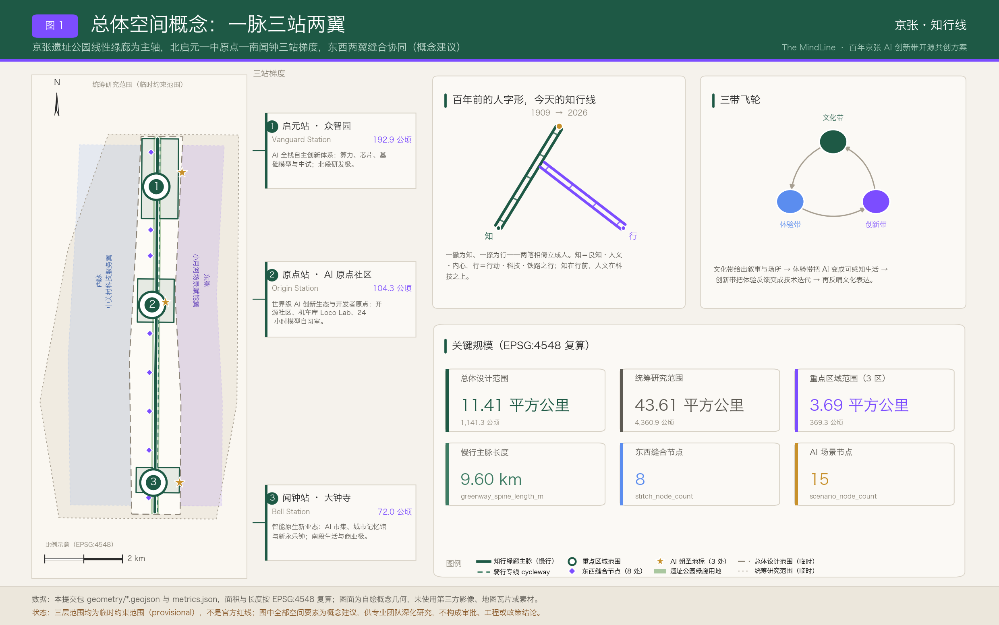
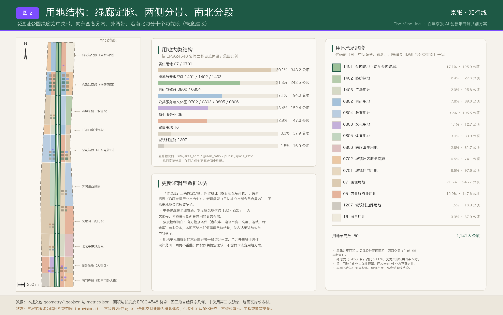
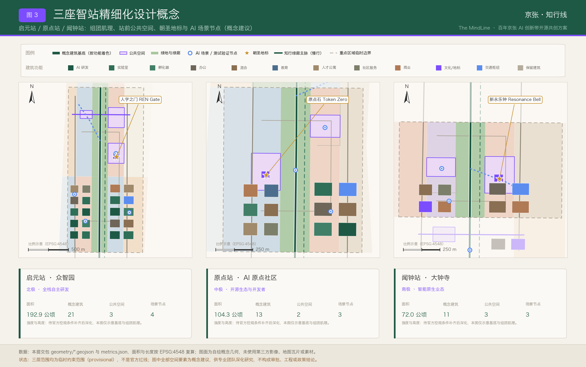
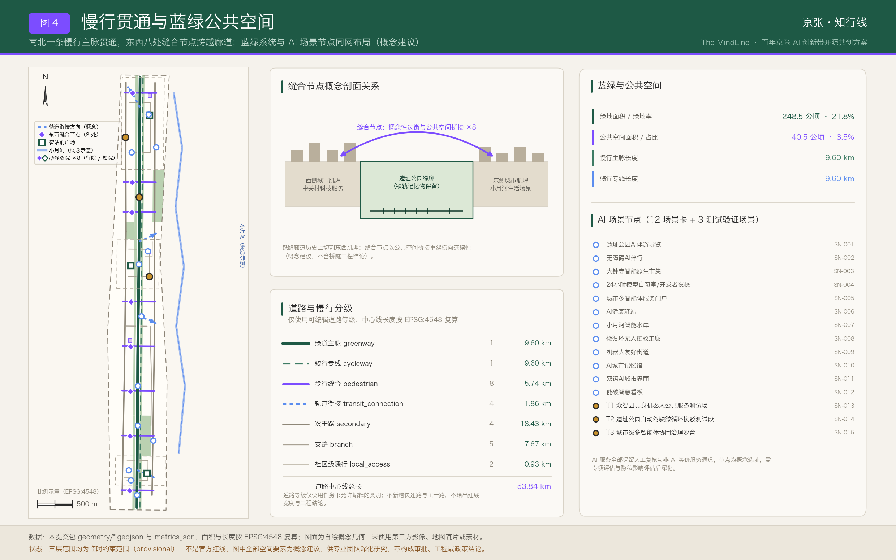
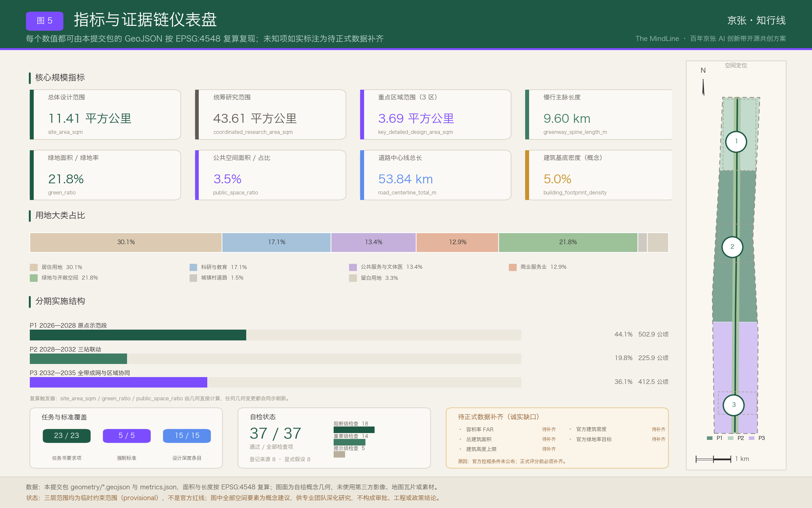

# 京张·知行线 The MindLine——百年京张AI创新带开源共创方案

> 一句话定位：把中国第一条自主设计铁路的百年线性遗产，转译为全球第一条「人机共智」的城市级 AI 主线。
>
> 内核一句话：**知在行前**——知是良知、人文与内心，行是行动、科技与铁路之行；技术走多远，由人文决定方向。
>
> 全文所有空间建议均为**概念建议 / 参考方案 / 可供专业团队深化研究**，不构成法定规划成果、审批结论、工程结论或投资与政策承诺。

## 设计依据与资料清单

本方案的第一依据是北京市规划和自然资源委员会海淀分局发布的《百年京张AI创新带城市设计国际方案征集资格预审公告》，第二依据是面向全球智能体的开源征集任务书摘录 [source:SRC-2026-BJ-GH-QUAL-PREANNOUNCEMENT] [source:SRC-2026-0518-AGENT-OPEN-CALL-TASKBOOK]。公告确定了统筹研究范围、总体设计范围、重点区域范围三个层次的工作目标与深度要求，任务书则把智能体需要回答的六项任务写成了可核对的清单：命名与标识体系、AI 全栈自主创新体系与世界级生态、AI 场景体系、公共空间与朝圣地标、文化叙事、全球活动与长期运营。方案把这六项任务拆进正文各章，而不是只在矩阵文件里打勾。

规范依据取自三部公开的部门规章与技术指南：城市设计管理办法约束公共空间、城市风貌与建筑布局的统筹层次；控制性详细规划编制审批办法界定了开发强度类指标的法定归属；国土空间调查、规划、用途管制用地用海分类指南提供了用地分类口径 [standard:MOHURD-URBAN-DESIGN-MEASURES] [standard:MOHURD-CONTROL-DETAILED-PLANNING] [standard:MNR-LAND-USE-CLASSIFICATION-GUIDE]。建筑工程设计文件编制深度相关规定在本轮登记为待补参照，因为本方案不出建筑单体成果。

现状认知与资料缺口的对照关系由设计深度项统一管理 [depth:existing_conditions_diagnosis]。当前可用资料能够支撑「三层范围—三处重点区—产业与文化线索」的判断，但不能支撑地块级权属、现状建筑质量、市政管线容量、道路红线与文物保护线的结论。凡涉及这五类信息的表述，本方案一律降级为待确认事项并写入假设清单。

资料可用性分级如下，等级判断与用途边界以结构化来源清单为准：

| 资料 | 权威等级 | 正式可用性 | 本方案用途 | 使用边界 |
| --- | --- | --- | --- | --- |
| 资格预审公告 | A0 官方公开 | 是 | 三层范围、约面积、重点区名称与任务要求 | 公告为文字描述，不含精确坐标与控规条件 [source:SRC-2026-BJ-GH-QUAL-PREANNOUNCEMENT] |
| 面向智能体开源征集任务书摘录 | 用户提供清权 | 是 | 六项任务、共创原则、场景与运营要求 | 不作为官方红线或政府实施承诺依据 [source:SRC-2026-0518-AGENT-OPEN-CALL-TASKBOOK] |
| 城市设计管理办法 | A0 官方公开 | 是 | 公共空间、风貌、建筑布局统筹的规范层次 | 管理办法不替代本项目控规条件 [standard:MOHURD-URBAN-DESIGN-MEASURES] |
| 控规编制审批办法 | A0 官方公开 | 是 | 强度类指标法定归属说明 | 本方案不产出法定控规成果 [standard:MOHURD-CONTROL-DETAILED-PLANNING] |
| 用地用海分类指南 | A0 官方公开 | 是 | 用地代码口径与统计大类 | 概念分区不等于地块划定 [standard:MNR-LAND-USE-CLASSIFICATION-GUIDE] |
| 三层范围临时粗略 polygon | provisional | 仅临时 | 全部设计几何的落位底框 | 禁止用于官方红线、精确面积主张与审批依据 [source:SRC-PROVISIONAL-BOUNDARIES-2026] |
| 「三区两翼」区域格局公开报道 | A1 背景 | 仅背景 | 区域协同叙事的背景参照 | 不支撑指标与边界结论 [source:SRC-2026-BJ-KW-THREE-AREAS-WINGS] |
| 海淀「1+X+1」产业体系公开报道 | A1 背景 | 仅背景 | 产业链叙事的背景参照 | 不支撑指标与边界结论 [source:SRC-2026-HAIDIAN-1X1] |

本方案未采用 OpenStreetMap 数据，也未使用任何第三方图片、字库文件、商标与人物肖像；全部图纸由本方案自有脚本绘制。版权与许可说明保存在 `report/copyright_statement.md`，完整来源关系保存在 `sources.json`，两者共同构成正文之外的机器索引层。

正文使用五类可校验证据标记：`[source:]` 指向来源清单条目，`[standard:]` 指向标准矩阵条目，`[depth:]` 指向设计深度矩阵条目，`[data:]` 指向 GeoJSON 中真实存在的 feature id，`[metric:]` 指向 `metrics.json` 中的指标名。删除标记后句子仍应完整可读；机器索引不进入正文堆叠。

需要特别声明的是边界性质。提交包中的 `geometry/site_boundary.geojson` 与 `geometry/key_areas.geojson` 均来自仓库登记的临时粗略多边形，全部标注为 `official_boundary=false`、`geometry_role=provisional_constraint`、`boundary_precision=provisional_rough` [data:geometry/site_boundary.geojson#SITE-001]。总体设计范围的复算面积为 1141.28 公顷，与公告「约 11.4 平方公里」相差 0.11% [metric:site_area_sqm]。这一差值来自临时边界的粗略拟合，而非对官方面积的修正；正式红线发布后，用地、建筑、道路、绿地、公共空间、分期与全部指标必须整体重算，不能只替换单个文件。

### 评审维度对照速查表（开篇导读）

为便于评审者在阅读正文之前先建立索引，本节把任务书的统一评审维度归并为七组常用视角，每组给出本方案的一句主张与直接可核对的证据入口。归并只用于导读，不替代任务书原有维度表述，也不改变矩阵文件中的逐条覆盖关系。

| 评审维度 | 本方案的一句主张 | 主要承载章节 | 证据指向 |
| --- | --- | --- | --- |
| 任务书相关性 | 六项智能体任务全部在正文实际展开，而不是只在矩阵里打勾 | 全部 13 章 | 23 条必选要求逐条挂接 [metric:compliance_requirement_count] [depth:three_level_scope_framework] |
| 原创性 | 命名以「知行合一」立意，站点、地标、活动、社区四层命名自成体系 | 统筹研究范围产业与未来城市研究 | 三处地标与四场年度活动均为原创提案 [metric:pilgrimage_landmark_count] [metric:annual_event_count] |
| AI 创新性 | 场景卡带责任、等价服务与退出条件三列，AI 是被治理的对象而非标签 | AI 创新生态、人才画像与 AI+ 场景 | 12 张场景卡 + 3 处测试场景 [metric:scenario_card_count] [metric:test_validation_scenario_count] |
| 可实施性 | 15 项更新项目按前置条件排期，P1 全部动作可撤回、可复原 | 更新项目清单、实施政策与分期计划 | 项目清单与三期图层 [metric:renewal_project_count] [depth:phasing_implementation] |
| 公共利益与包容性 | 每张场景卡必须写明无 AI 等价服务，无障碍等价是设计前提 | 蓝绿空间、公共空间与城市风貌 | 公共空间供给与组件要求 [metric:public_space_ratio] [depth:blue_green_public_space] |
| 风险合规 | 五项强度类指标一律登记待补，不以推测值填充；八维风险附人工复核 | 风险、版权与合规说明 | 未知指标与缺口清单 [metric:floor_area_ratio] [depth:risk_missing_data] |
| 表达完整度 | 中英双语正文、双语图纸、离线展示页与三个矩阵成套提交 | 指标体系、面积复算与合规矩阵 | 复算链路与深度项覆盖 [depth:metrics_recalculation] [metric:design_depth_item_count] |

这张表的用法是「先看主张、再查证据」：任何一行的主张若在正文找不到对应展开，或证据指向的指标与图层不存在，都应视为本方案的缺陷而非表达方式问题。

## 三层范围工作框架

三层范围不是三张互不相干的图，而是一条「战略—结构—实施」的传导链，其结构关系由深度项统一约束 [depth:three_level_scope_framework]。统筹研究范围回答「AI 产业生态与未来城市形态如何组织」，复算面积 43.61 平方公里，与公告约 43.6 平方公里相差 0.02% [metric:coordinated_research_area_sqm]。总体设计范围回答「城市更新、产业空间、交通市政与风貌如何落图」，复算面积 1141.28 公顷。重点区域范围回答「三处片区如何达到规划综合实施方案的城市设计深度」，三区合计复算 369.29 公顷，与公告约 368.4 公顷相差 0.24% [metric:key_detailed_design_area_sqm]。

面积叙述一律以公告官方值为准，复算值只作为几何自洽性的校核证据。三处重点区的官方值与复算值对照为：众智园 AI 自主创新加速区官方约 192.1 公顷、复算 192.92 公顷，偏差 0.43% [metric:key_area_zhongzhiyuan_sqm]；北京 AI 原点社区官方约 104.3 公顷、复算 104.32 公顷，偏差 0.02% [metric:key_area_origin_sqm]；大钟寺 AI 产业聚集区官方约 72.0 公顷、复算 72.05 公顷，偏差 0.06% [metric:key_area_dazhongsi_sqm]。三处重点区的图层引用分别为 [data:geometry/key_areas.geojson#PROV-KEY-001] 与 [data:geometry/key_areas.geojson#PROV-KEY-002] 以及 [data:geometry/key_areas.geojson#PROV-KEY-003]。

三层范围的官方值、复算值与工作深度对照如下。表中「复算值」只用于证明几何自洽，不用于修正官方口径：

| 层级 | 公告口径 | 本方案复算 | 偏差 | 工作深度目标 | 主要成果表达 |
| --- | --- | --- | --- | --- | --- |
| 统筹研究范围 | 约 43.6 平方公里 | 43.61 平方公里 | +0.02% | 产业生态与未来城市形态研究 | 生态图谱、案例借鉴、要素机制建议 |
| 总体设计范围 | 约 11.4 平方公里 | 1141.28 公顷 | +0.11% | 控制性详细规划的城市设计深度 | 用地、建筑、道路、蓝绿、公共空间、分期图层 |
| 重点区域范围 | 约 368.4 公顷 | 369.29 公顷 | +0.24% | 规划综合实施方案的城市设计深度 | 三站组团肌理、公共空间、场景与实施依赖 |
| 众智园（启元站） | 约 192.1 公顷 | 192.92 公顷 | +0.43% | 片区详细设计 | 20 个概念基底 + 站前广场 + 测试场 |
| AI 原点社区（原点站） | 约 104.3 公顷 | 104.32 公顷 | +0.02% | 片区详细设计 | 12 个概念基底 + 开发者广场 + 沙盒 |
| 大钟寺（闻钟站） | 约 72.0 公顷 | 72.05 公顷 | +0.06% | 片区详细设计 | 8 个概念基底 + 市集广场 + 记忆馆 |

本方案在三层范围之上提出总体空间概念：**「一脉三站两翼，东西缝合、南北贯通」**，其空间结构由深度项校核 [depth:overall_spatial_structure]。

- **一脉**——京张遗址公园线性绿廊即「知行主轴」，南起西直门外大街一线，北至北五环一线，慢行主脉复算长度 9.60 公里，是文化带、体验带与创新带共用的物理载体 [metric:greenway_spine_length_m]。
- **三站**——沿用铁路「站」的记忆，把三处重点区命名为三座「智站 Mind Stations」：北端启元站 Vanguard Station（众智园）、中部原点站 Origin Station（AI 原点社区）、南端闻钟站 Bell Station（大钟寺），呈「北研发、中生态、南业态」的梯度。
- **两翼**——西翼「西脉 West Meridian」承接中关村科技服务，供给要素配置、知识产权与资本；东翼「东脉 East Meridian」承接小月河水绿场景，供给生活实验与场景开放。
- **缝合与贯通**——铁路廊道历史上切割了东西城市肌理，方案沿绿廊两侧布置 8 处东西向缝合节点，平均间距约 1.1 公里，作为概念性过街与公共空间桥接的落点 [metric:stitch_node_count]；南北则以步行、骑行与低速接驳复合的慢行系统贯通。缝合节点只给出位置意图与空间量级，桥隧形式、结构与交通组织均需专业团队另行论证。

三层之间的传导规则是：统筹研究层只输出可转译为空间的判断，不输出伪精确红线；总体设计层输出结构、用地、慢行、蓝绿与更新项目；重点区层输出组团肌理、公共空间、场景与实施依赖。任何无法由提交几何复算的面积、比例、规模或数量，都不写入正式结论。若官方 polygon 与本方案临时边界存在系统性偏移，三层图层的相对关系（绿廊居中、三站沿轴、两翼夹持）仍可保留，但全部数值必须重算。

## 统筹研究范围产业与未来城市研究

### 命名与标识体系（回应任务书第一项）

方案名为**「京张·知行线」**，英文主名**The MindLine**，两者互为语义对译而非音译 [source:SRC-2026-0518-AGENT-OPEN-CALL-TASKBOOK]。「知行」取自王阳明的「知行合一」：**知**是良知、人文与内心的判断，**行**是行动、科技与铁路之行。两个字的先后不是修辞而是立场——**知在行前**，语序即价值观：技术能跑多快由工程决定，能走多远由人文决定。这一顺序与开源征集共创原则中的「人类最终判断」与「人本治理」两条同向 [standard:PROJECT-AGENT-OPEN-CALL-TASKBOOK]。「线」有三义：铁路线、天际线与生活线、思维线与神经通路。英文 MindLine 与中文严格对位：**Mind 即知，Line 即行、即线**；Mind 呼应 human-centered AI，Line 同时是铁路线与思维之线。

**詹天佑正是知行合一的典范**。他少年出洋、在海外学堂求得工程之知，这是「知」；归国主持京张铁路，在关沟天险上用一个「人」字形折返翻过坡度，这是「行」。知而不行则空，行而无知则险——一条铁路之所以成为中国自主工程的原点，正因为两者在同一个人身上合一。本方案把这条百年前的合一线索接续到智能时代：AI 提供的是「行」的能力，城市要守住的是「知」的方向。

由此得到「人」字的新释义：**一撇为知，一捺为行，两笔相倚，缺一不立，合起来才立成一个「人」**。人字形标识的图形不变，含义升级——双轨即**知轨**（人文、良知、公共价值）与**行轨**（科技、算力、工程实现），两轨沿绿廊并行，在中部原点站交汇成人字顶点。凡是只有行轨没有知轨的城市 AI 提案，在本方案的价值坐标里都是一条站不住的斜线。

主叙事钩子是**「百年前的人字形，今天的知行线」**：1909 年，人字形铁路用一个「人」字翻越关沟天险；2026 年，知行线用「知+行」翻越智能时代的分水岭。命名候选在同类提案库内做过字符串检索核对，「人字线」「智轨」「共智线」等候选均已被同行高频使用因而排除，英文「MindLine」在检索时点未见同行使用——这项核对只是命名决策的依据，不构成对他人成果的评价。

母品牌与子品牌构成一套可扩展的命名法：母品牌「京张·知行线 The MindLine」；节点层为三座智站（启元站 / 原点站 / 闻钟站）；廊道层为两脉（西脉 / 东脉）；活动层为「知行大会 MindLine Summit」；社区层为「机车库 Loco Lab」，取铁路机车库转译为模型车间之意；数字资产层统一使用 `#MindLineBJ` 与 mindline 系列标识。空间上还有一层与命名同构的配对关系：绿廊每处东西缝合点两侧成对布置「知院」与「行院」，把知行二字从口号落成可走进去的院子，详见蓝绿空间章的动静双院一节。

标识（Logo）与视觉识别只给方向性建议，不交付最终商标 [standard:PROJECT-AGENT-OPEN-CALL-TASKBOOK]。核心图形取青龙桥「人」字形折返线的抽象：两条铁轨构成「人」字，一撇一捺分别读作知与行，同时可读作电路走线与神经突触，顶点向上，寓意「以人为本的上行线」。动态标识中双轨可承载数据流动画，站点亮起对应生态事件；静态最简形即一个「人」字形双线符号。色彩方向为机车绿（百年京张的铁路绿系）、行轨紫青渐变（AI 与计算）、暖石灰底色，字体方向为无衬线双语字库。禁用边界明确：不使用未经授权的字体、图片、商标与人物肖像，不照搬既有企业或园区标识。

### 三大定位 × 五大功能 × 三区两翼的协同回路

三大定位（百年京张文化带、都市 AI 生活体验带、AI 融合创新带）不是并列口号，而是一个飞轮：文化带给出叙事与场所，体验带把 AI 变成可感知的日常生活，创新带把体验反馈变成技术迭代，新技术再反哺文化表达。五大功能——文化展示、生活服务、创新研发、产业转化、国际交往——按站点分工落位；「三区两翼」的区域格局作为背景参照纳入协同叙事 [source:SRC-2026-BJ-KW-THREE-AREAS-WINGS]。

| 定位 | 主要支撑功能 | 空间落位 | 图层与指标证据 |
| --- | --- | --- | --- |
| 百年京张文化带 | 文化展示、国际交往 | 绿廊全线 + 闻钟站 + 学院路学脉段 | [data:geometry/land_use.geojson#LU-007] 与 [metric:green_ratio] |
| 都市 AI 生活体验带 | 生活服务、文化展示 | 绿廊沿线缝合节点 + 东脉小月河 | [data:geometry/public_space.geojson#PS-006] 与 [metric:public_space_ratio] |
| AI 融合创新带 | 创新研发、产业转化 | 启元站 + 原点站 + 西脉服务翼 | [data:geometry/land_use.geojson#LU-027] 与 [metric:research_edu_land_share] |

### 全球 AI 与遗产型创新区案例（7 例）

案例选取遵循两条标准：与线性铁路遗产再生相关，或与 AI 垂直生态集聚相关。全部信息来自公开资料，仅作机制借鉴，不构成对任何机构的评价或合作声明 [metric:case_study_count]。

| 案例 | 空间模式 | 生态机制 | 对知行线的启示 |
| --- | --- | --- | --- |
| Station F（巴黎） | 废弃铁路货运站改造为单体巨构创业园 | 项目制孵化 + 大企业驻场导师 | 遗产建筑可直接承载创业密度，闻钟站与机车库可借鉴单体高密度混合 |
| King's Cross 知识区（伦敦） | 铁路枢纽更新叠加科技总部与文化街区 | 长周期单一开发主体统筹公共空间 | 廊道更新需要跨地块的公共空间统筹主体，对应本方案的缝合节点体系 |
| Kendall Square（美国剑桥） | 校区—产业—城市高度混合的一平方英里 | 大学溢出 + 风险资本紧邻布局 | 原点站「近校创新」需把实验室与街道生活压缩到步行尺度 |
| one-north（新加坡） | 分期开发的科研城区，预留弹性用地 | 政府平台主导 + 场景开放分期释放 | 支持本方案设置留白用地与三期时序 |
| MaRS Discovery District（多伦多） | 医院旧址改造为城市创新中心 | 与深度学习研究机构形成学术—产业耦合 | 存量公共建筑可成为 AI 生态的锚点 |
| 模速空间（上海徐汇） | 楼宇型大模型专业孵化集聚 | 算力与语料的公共服务包 | 支持本方案的公共算力券与可信数据空间机制建议 |
| 张江人工智能岛（上海） | 岛式园区作为 AI 场景开放试验场 | 场景清单化开放与企业揭榜 | 直接支撑本方案的年度城市场景开放清单机制 |

### 生态图谱：六要素 × 三站分工

AI 创新生态按「算力—模型—数据—场景—资本—人才」六要素组织，三座智站承担不同侧重：启元站以全栈自主为主，承载算力、基础模型与中试；原点站以开源生态与开发者为主，承载模型、数据与人才；闻钟站以商业化业态为主，承载场景与消费端转化。西脉供给服务与资本，东脉供给场景与用户。这一分工在用地层表现为科研与教育类用地占比 17.07%、商业服务业用地占比 12.93%，二者沿轴呈北高南低与南高北低的互补梯度 [metric:research_edu_land_share]。

要素机制均为**机制建议**，不构成政策承诺：土地方面建议对存量更新用途给予弹性；空间方面建议建立「智能原生空间」标准，明确机器人通行、边缘算力接入与传感器公示的基本要求；资金方面建议对接耐心资本；算力方面建议试行公共算力券；数据方面建议建设可信数据空间与合成数据沙盒；场景方面建议年度发布城市场景开放清单 [standard:PROJECT-AGENT-OPEN-CALL-TASKBOOK]。

### 未来城市形态研究

AI 将改变工作、生活、社交、学习、交通与公共服务六个维度，本方案把这些改变落成可定位的空间对象而非愿景形容词。工作维度对应 24 小时可用的模型自习室与开发者夜校；生活维度对应健康驿站与无障碍伴行；交通维度对应机器人友好街道与微循环接驳；学习维度对应城市记忆馆与双语城市界面；社交维度对应站前广场与市集；公共服务维度对应多智能体服务门户与能碳看板。区域协同上，方案向北衔接北清路方向的前沿科创走廊，向东衔接学院路高校带，并与海淀「1+X+1」产业体系叙事保持一致 [source:SRC-2026-HAIDIAN-1X1]。

### 区域协同的接口化组织

区域协同最容易写成一句「加强对接」的空话。本方案把它改写成**接口**：每一个协同对象都必须回答三个问题——资源往哪个方向流、用什么接口对接、谁来承担这个角色。三要素齐了，协同才是可执行的工作对象；缺一项，就只是一句愿望。以下四组协同关系全部为**机制建议**，不构成任何机构安排、投资承诺或政府决策 [source:SRC-2026-BJ-KW-THREE-AREAS-WINGS]。

| 协同对象 | 资源流向 | 协作接口（机制建议） | 参与角色 | 在本带的空间落点 |
| --- | --- | --- | --- | --- |
| 未来科学城方向 | 本带出模型与场景需求，对方出研发中试能力 | 中试任务互挂榜单、共享测试场排期表、联合技术验证报告模板 | 本带为场景发布方，对方为中试承接方 | 启元站算力与中试组团 [data:geometry/buildings.geojson#BLD-018] |
| 怀柔科学城方向 | 对方出大科学装置的算力与科研数据，本带出城市侧应用与验证 | 算力配额互认、科研数据接入可信数据空间的申请与审计口径 | 对方为算力与数据供给方，本带为应用验证方 | 原点站开源生态组团与数据沙盒 [data:geometry/public_space.geojson#SN-005] |
| 北京经开区方向 | 本带出原型与验证结论，对方出量产与规模化转化 | 从测试场到量产线的技术就绪度分级交接清单 | 本带为原型孵化方，对方为产业转化方 | 众智园测试场与机器人友好街道 [data:geometry/public_space.geojson#SN-013] |
| 京津冀·张家口方向 | 张家口方向出绿电与外围算力，本带出算法、场景与人才 | 绿电溯源标识、算力潮汐调度约定、能碳数据双向公开口径 | 对方为绿色能源与算力基地，本带为需求与治理侧 | 全带能碳看板与边缘算力节点 [data:geometry/public_space.geojson#SN-012] |

四组关系里，**京张绿电走廊**这一组值得单独说。京张铁路当年最重要的运量是煤——一条铁路把张家口的能源运进北京，支撑了这座城市的近代工业化。一百多年后，同一条地理走廊上流动的东西变了：张家口方向的风电与光伏，正是今天数据中心最稀缺的资源，而北京这一端最不缺的是算法、场景与人才。**百年前京张线运煤，今天京张走廊送绿电与算力**——这不是修辞上的巧合，而是同一条通道在两个时代承担同一种角色：把外部的能量送进城市，把城市的能力送回外部。本方案据此建议在能碳智慧看板中长期公开两项口径：本带 AI 设施的绿电使用比例，以及跨区域算力调度的时段与来源 [metric:scenario_card_count]。文化叙事与区域协同在这里互为证据——讲得出历史的协同才有说服力，算得出数据的叙事才不空转。

需要说明边界：上述接口全部是概念性的协作机制建议，具体的能源来源、算力规模、数据授权范围与结算方式，均须由能源、算力、数据治理与法务专业团队另行论证，本方案不给出任何数值结论，也不代表相关地区或机构已有安排。

## 总体设计范围城市更新与控规深度城市设计

总体设计范围的工作目标是形成城市更新总体框架、产业空间布局、交通市政支撑与城市风貌控制，达到控制性详细规划的城市设计深度 [standard:MOHURD-CONTROL-DETAILED-PLANNING]。本方案把这一深度拆成六个可审查对象：用地结构、建筑肌理、慢行与道路网络、蓝绿与公共空间、更新项目清单、分期时序。每个对象都有对应图层与复算指标，正文只解释设计意图与数据边界。

**空间结构**。总体结构为「一脉贯通、三站锚定、两翼夹持、八点缝合」。绿廊居中，宽度控制在概念性的连续带状范围内，全线以公园绿地为主导用地；东西两侧各设内带与外带，内带承接与绿廊直接互动的功能（科研、商业、文化、广场），外带承接生活性功能（居住、社区服务、教育、医疗、体育）。这一「五带十段」的组织方式使得 50 个用地单元的并集恰好等于总体设计范围，两两无重叠 [data:geometry/land_use.geojson#LU-003] [metric:land_use_polygon_count]。

**低效空间识别方法**。在缺少现状建筑普查、权属与经济数据的条件下，方案不给出地块级的低效判定，而是给出识别方法：沿绿廊两侧 300 米范围内、与慢行主脉缺乏直接连接、且首层为封闭围墙或仓储型界面的地段，优先进入更新研究名单。方法本身属于概念建议，名单需在正式数据补齐后由专业团队核定 [depth:retain_renovate_demolish]。

**产业功能比例**。用地层给出的功能比例是概念结构而非配比指标：居住 30.07%、科研与教育 17.07%、公共管理与公共服务 13.35%、商业服务业 12.93%、绿地与开敞空间 21.77%、城镇村道路 1.48%、留白 3.32% [metric:residential_land_share]。留白用地集中在启元站北段，用于承接尚未明确的算力、中试与国际交往功能，呼应新加坡 one-north 的弹性预留经验。

**建筑总规模与承载能力**。方案能够复算的只有概念建筑基底：67 个基底合计 57.53 公顷，占总体设计范围的 5.04% [metric:building_footprint_area_sqm] [metric:building_footprint_density]。总建筑规模、容积率、建筑高度、建筑密度与绿地率均无官方控制条件，本方案不给出任何数值结论，五项指标在 `metrics.json` 中登记为待正式数据补齐 [metric:floor_area_ratio]。综合承载能力评估同样需要人口、就业、市政容量与交通流量数据支撑，当前只能给出评估框架：以慢行可达性、公共空间人均量与公共服务设施步行覆盖三项作为后续评估的入口指标。

**城市更新总体框架**采用五步工作法，每一步都对应一个可交付对象，避免更新沦为口号：

| 步骤 | 工作内容 | 交付对象 | 当前状态 |
| --- | --- | --- | --- |
| 一 结构定型 | 确定绿廊、智站、两翼与缝合节点的相对关系 | 总体空间结构图 | 已完成概念层 [depth:overall_spatial_structure] |
| 二 用地转译 | 将结构转译为用地大类的概念分区 | 用地图层与占比表 | 已完成概念层 [data:geometry/land_use.geojson#LU-028] |
| 三 缺口识别 | 识别慢行断点、公共空间缺口与服务盲区 | 更新研究名单方法 | 方法已给出，名单待数据 |
| 四 项目组织 | 把缺口组织为可审查的更新项目 | 15 项更新项目清单 | 已完成概念层 [metric:renewal_project_count] |
| 五 时序安排 | 按前置条件依赖度排定分期 | 三期分期图层 | 已完成概念层 [data:geometry/phasing.geojson#PH-001] |

**空间组织模式**。全带采用「带—段—团」三级组织：带为五条纵带，段为十个横向区段，团为组团尺度的建筑与公共空间集合。这一组织方式的好处是，官方边界替换后只需重新切分带与段，组团的功能配比逻辑仍然成立。

**综合承载能力评估框架**（待数据补齐后执行）：以慢行可达性（15 分钟步行覆盖率）、公共空间人均量、公共服务设施步行覆盖率、市政容量裕度、交通高峰负荷五项为入口指标。当前只有前两项具备部分几何基础，后三项完全依赖官方与运营数据，因此本方案不给出承载能力结论 [depth:existing_conditions_diagnosis]。

**风貌控制原则**。风貌控制以「铁路记忆 + 学院气质 + 智能原生」三种基调分段落位：闻钟站段强调古钟与铁路的时间层叠，原点站段强调校园与街道的连续界面，启元站段强调低碳与技术表达。屋顶形态、体量与界面的具体控制值待官方控规条件明确后深化，本方案仅提供形态引导方向 [depth:height_massing_character]。

## 重点区域详细设计

三处重点区均按「定位 + 空间结构 + 建筑更新 + 交通慢行 + 公共空间 + AI 场景 + 实施风险」七段式展开，深度由 [depth:three_key_area_detailed_design] 校核。因三区 polygon 为临时粗略范围，以下结论均为方向性设计，正式边界发布后需重新落位。

三处重点区共用一条空间语法：**动静双院**。凡是绿廊两侧成对出现的公共空间，都按「一侧行院、一侧知院」组织——行院承接 AI 场景体验、市集与测试展示，知院承接静观庭园、无屏区与文化展示（详见蓝绿空间章）。落到三站上，启元站的双院是「测试场 ↔ 北端林下静观」，原点站的双院是「开源路演广场 ↔ 校史与技术史阅读院」，闻钟站的双院是「智能原生市集 ↔ 古钟与铁路记忆静院」。这条语法保证了三站虽然功能不同，但每一处热闹的对面都有一处安静，人不至于在一条以 AI 命名的带子上无处可退 [metric:stitch_node_count]。

### 启元站 Vanguard Station——众智园 AI 自主创新加速区

**定位**：花园型全栈自主创新街区，官方约 192.1 公顷，复算 192.92 公顷 [data:geometry/key_areas.geojson#PROV-KEY-001]。名称取「启元」，呼应詹天佑自主修路到今日全栈自主的谱系。

**空间结构**：以绿廊为脊，东西各组一团。西组团为全栈自主研发组团，布置 10 个概念基底，功能以研发、实验室、孵化为主 [data:geometry/buildings.geojson#BLD-001]；东组团为算力与中试组团，布置 10 个概念基底，功能包含研发、实验室、交通枢纽、零售与人才公寓 [data:geometry/buildings.geojson#BLD-018]。两组团之间以启元站前广场连接，广场概念面积约 5.01 公顷 [data:geometry/public_space.geojson#PS-001]。

**建筑更新**：本片区以新建触媒与更新提质为主，保留类主要为绿廊侧的铁路记忆物。因缺少现状建筑普查，方案不列具体拆除对象。

**交通慢行**：内部以支路环组织机动车，慢行完全依托绿廊主脉与骑行专线 [data:geometry/roads.geojson#RD-015]；对外由指向上地清河方向的轨道衔接段承担 [data:geometry/roads.geojson#RD-025]。

**公共空间与地标**：站前广场承载 AI 朝圣地标「人字之门 REN Gate」 [data:geometry/buildings.geojson#BLD-065]。绿色空间承载具身机器人公共服务测试场，与低碳创新交往环境结合。

**AI 场景**：具身机器人测试场（T1）、机器人友好街道、能碳智慧看板三类场景在此集中 [data:geometry/public_space.geojson#SN-013]。

**实施风险**：算力设施的能耗与散热、测试场的安全隔离、清河沿线的生态与防洪条件均需专项论证；本片区留白用地比例最高，若弹性用途政策未落地，北段功能将难以启动。

### 原点站 Origin Station——北京 AI 原点社区

**定位**：近校型开源生态与人才社区，官方约 104.3 公顷，复算 104.32 公顷 [data:geometry/key_areas.geojson#PROV-KEY-002]。这里是全球开发者的「原点」。

**空间结构**：西组团为开发者生活组团，6 个概念基底以人才公寓、社区服务、孵化、教育、零售混合为主 [data:geometry/buildings.geojson#BLD-021]；东组团为开源生态组团，6 个概念基底以孵化、研发、办公、实验室与交通枢纽为主 [data:geometry/buildings.geojson#BLD-027]。用地层在此形成科研、教育、居住、商业四码混合的近校社区结构 [data:geometry/land_use.geojson#LU-027]。

**建筑更新**：以「留改建」三类概念分类组织——保留校园与住区的既有肌理，更新首层界面与院墙，新建开源发布与人才服务触媒。三类比例待现状普查后确定。

**交通慢行**：核心动作是校区—园区—街区的慢行缝合，由内部支路环与五道口方向轨道衔接段共同承担 [data:geometry/roads.geojson#RD-016] [data:geometry/roads.geojson#RD-024]。

**公共空间与地标**：原点站前广场约 4.91 公顷，承载「原点石·贡献者链 Token Zero」 [data:geometry/public_space.geojson#PS-002] [data:geometry/buildings.geojson#BLD-066]；机车库 Loco Lab 开发者广场为社区日常客厅 [data:geometry/public_space.geojson#PS-012]。

**AI 场景**：24 小时模型自习室与开发者夜校、城市多智能体服务门户、多智能体协同治理沙盒（T3）在此落位 [data:geometry/public_space.geojson#SN-004]。

**实施风险**：校区权属与开放时段协调难度最高；开源社区的持续运营依赖长期资金与治理规则，若无稳定运营主体，空间容易空转。

### 闻钟站 Bell Station——大钟寺 AI 产业聚集区

**定位**：城市型智能原生业态与国际交往街区，官方约 72.0 公顷，复算 72.05 公顷 [data:geometry/key_areas.geojson#PROV-KEY-003]。「闻钟识智」取自大钟寺古钟意象。

**空间结构**：西组团为文化业态组团，4 个概念基底以文化、零售、混合与社区服务为主 [data:geometry/buildings.geojson#BLD-033]；东组团为智能原生商业组团，4 个概念基底以混合、零售、办公与交通枢纽为主 [data:geometry/buildings.geojson#BLD-040]。用地层在此配置文化用地与商业服务业用地相邻的结构 [data:geometry/land_use.geojson#LU-007]。

**建筑更新**：以更新提质为主，重点是首层业态与公共界面；文物保护范围内不做任何空间动作，全部概念构筑物均布置在文保范围之外，具体范围以文物主管部门划定为准。

**交通慢行**：核心动作是站城一体与路口四象限步行连通，由指向大钟寺站方向的轨道衔接段与内部支路环承担 [data:geometry/roads.geojson#RD-022]。四象限连通的形式（地下、地面或立体）需交通与市政专业论证。

**公共空间与地标**：闻钟站前广场约 5.02 公顷，承载「新永乐钟 The Resonance Bell」 [data:geometry/public_space.geojson#PS-003] [data:geometry/buildings.geojson#BLD-067]；市集广场承载智能原生商业活动 [data:geometry/public_space.geojson#PS-013]。

**AI 场景**：智能原生市集、AI 城市记忆馆、双语 AI 城市界面在此集中 [data:geometry/public_space.geojson#SN-003]。

**实施风险**：文保边界、轨道结构与商业权属三重约束叠加，是全带实施难度最高的片区；南段更新排在第三期，正是为了给这些前置条件留出时间。

## AI 创新生态、人才画像与 AI+ 场景

### AI 场景总则：城市作为认知脚手架

在展开具体场景之前，本方案先立一条总则，全部 12 张场景卡与 3 处测试场景都受其约束：**城市 AI 的职责是提示，不是裁决**。它可以告诉你现在处在什么阶段、周边有哪些走向、若干选择各自意味着什么，但它不替你作决定，也不为你下判语。用一个更直白的说法——城市是一副**认知脚手架**：脚手架帮人爬得更高，但爬的是人，方向也由人选；脚手架搭完之后要能拆走，而不是把人锁在里面。

这条总则落到设计上有三条可检查的要求。其一，**给「时与位」的照见**：面向居民的界面优先呈现「你在哪里、现在是什么时候、有哪些走向」，而不是「你应该去哪里」；把时间与位置的处境说清楚，本身就是最有价值的公共服务。其二，**最终判断权保留在人**：凡涉及个人权益、资源分配与公共安全的输出，一律只作为建议进入人工环节，系统不得自动执行，这与开源征集共创原则中的「人类最终判断」一条同向 [standard:PROJECT-AGENT-OPEN-CALL-TASKBOOK]。其三，**以人的尊严为底线**：服务的设计目标是增强人的能力，而不是替代人的判断或压缩人的选择，对应共创原则中的「人本治理」一条。

这也是「知在行前」在场景层的具体形态：AI 提供的是「行」的效率，城市必须守住的是「知」的位置——判断、取舍与责任始终在人这一侧。后文每张场景卡的三列治理字段（责任主体、无 AI 等价服务、退出与停止条件），就是这条总则的可核对落点 [metric:scenario_card_count]。

### 用户画像（6 类）

画像用于检验场景是否覆盖真实使用者，而非用于任何个体识别或商业推荐 [metric:persona_count]。

| 画像 | 核心需求 | 典型一天的空间触点 | 主要场景映射 | 边界约定 |
| --- | --- | --- | --- | --- |
| AI 研究员与创业者 | 算力入口、中试场地、同行密度 | 启元站研发组团 → 测试场 → 站前广场 | SC-04、T1、SC-12 | 研发数据不进入公共服务系统 [data:geometry/public_space.geojson#SN-013] |
| 全球开发者与数字游民 | 短期驻留、开源协作、社区声誉 | 机车库 → 模型自习室 → 绿廊夜跑 | SC-04、SC-11、T3 | 贡献记录以自愿公开为前提 [data:geometry/public_space.geojson#SN-004] |
| AI 原住民青少年家庭 | 安全的科技启蒙与户外活动 | 记忆馆 → 市集 → 缝合节点广场 | SC-10、SC-03、SC-01 | 未成年人相关服务默认关闭画像化推荐 [data:geometry/public_space.geojson#SN-010] |
| 银发居民（大钟寺、高梁桥老社区） | 无障碍出行、健康支持、生活便利 | 健康驿站 → 社区服务 → 绿廊散步 | SC-06、SC-02、SC-05 | 保留非 AI 等价服务通道与人工窗口 [data:geometry/public_space.geojson#SN-006] |
| 国际 AI 朝圣访客 | 可理解的叙事、双语界面、打卡点 | 人字之门 → 原点石 → 新永乐钟 | SC-01、SC-11、SC-10 | 影像采集须显著公示并可拒绝 [data:geometry/buildings.geojson#BLD-065] |
| 城市运营者与治理者 | 态势感知、事件复盘、设施维护 | 服务门户 → 能碳看板 → 治理沙盒 | SC-05、SC-12、T3 | 治理类模型输出仅作辅助，决策留人 [data:geometry/public_space.geojson#SN-015] |

**六类画像各得其「位」**。空间设计不只安排功能，也安排位置关系——所谓「时位」，就是让每一类人在这条带子上都有一个说得出名字的落脚处，而不是被平均地摊在九公里上。AI 研究员与创业者的位在**北端启元站**，紧邻算力、中试与测试场，是「做出来」的位；全球开发者与数字游民的位在**中部原点站与机车库**，是「聚起来」的位，也是全带唯一以社区账号而非门禁定义归属感的地方；AI 原住民青少年家庭的位在**东脉小月河水岸与绿廊缝合节点**，水、绿与科技启蒙同处一段，是「玩着学」的位；银发居民的位在**南段闻钟站与高梁桥老社区**，服务半径以步行可达为准，是「不必远行」的位；国际朝圣访客的位在**绿廊主脉本身**，从人字之门到新永乐钟的一条线就是他们的全部动线，是「走一遍就懂」的位；城市运营者与治理者的位在**西脉服务翼与治理沙盒**，看得见全局但不直接干预现场，是「退一步」的位。

这一安排同时暗含**人生阶段的时位**：青少年在东翼水岸启蒙，青年在原点站聚集与创业，成熟研发者在北端深耕，银发居民在南段安居——一条带子从北到南，恰好可以读成一条人的时间轴。这只是概念性的空间意图，不构成任何人群分区或居住安排结论；实际的人口分布与设施配置须待官方人口与设施数据补齐后核定 [depth:existing_conditions_diagnosis]。

### AI 场景卡（12 张）

12 张场景卡全部在 `geometry/public_space.geojson` 中登记为 SCENARIO_NODE 点位，点位为概念选址 [metric:scenario_card_count]。本轮把场景卡从「功能描述」升级为**场景级治理单元**：在原有六项字段之外，每张卡强制补齐三列——**运营责任主体（RACI 简式）**、**无 AI 等价服务**、**退出与停止条件**。三列均为概念性的机制建议，不构成任何机构的职责划分结论或运营承诺；其中 RACI 简式的读法是 R 谁负责执行、A 谁审批、C 谁被咨询复核、I 谁被告知。

| 编号 | 场景卡 | 概念点位 | 主要用户 | AI 能力 | 隐私与人工复核边界 | 运营主体建议 | 运营责任主体（RACI 简式，机制建议） | 无 AI 等价服务 | 退出与停止条件 |
| --- | --- | --- | --- | --- | --- | --- | --- | --- | --- |
| SC-01 | 遗址公园 AI 伴游导览 | 绿廊全线 [data:geometry/public_space.geojson#SN-001] | 访客、家庭 | 多语种讲解、口述史生成 | 不做人脸识别，语音数据本地处理后即时丢弃 | 公园运营方 + 文化机构 | R 公园运营方｜A 文化主管部门｜C 史料与档案专业｜I 游客 | 纸质导览图、定点解说牌与人工讲解场次全线保留 | 出现史实错误或讲解投诉集中即下线该讲解点转人工 |
| SC-02 | 无障碍 AI 伴行 | 绿廊南段 [data:geometry/public_space.geojson#SN-002] | 视障者、轮椅使用者 | 障碍识别、路径优化 | 位置数据仅本次行程有效，人工客服随时接管 | 公共服务平台 + 助残组织 | R 公共服务平台｜A 无障碍主管部门｜C 助残组织｜I 使用者 | 盲道、呼叫柱与人工陪同预约通道 | 任一次导航失败或误导即停用该路段并转人工陪同 |
| SC-03 | 智能原生市集 | 闻钟站 [data:geometry/public_space.geojson#SN-003] | 消费者、商户 | 无人零售、AI 策展快闪 | 支付与消费数据不用于跨场景画像 | 商业运营方 | R 商业运营方｜A 市场监管部门｜C 商户代表｜I 消费者 | 有人值守摊位与人工结算通道 | 结算异常或无人设备故障即恢复人工收银 |
| SC-04 | 24 小时模型自习室与开发者夜校 | 原点站 [data:geometry/public_space.geojson#SN-004] | 开发者、学生 | 算力调度、代码协作 | 代码与模型权重归贡献者所有 | 机车库 Loco Lab | R 机车库 Loco Lab｜A 场地权属方｜C 高校与社区代表｜I 会员 | 线下前台预约与纸质排队登记 | 算力分配争议或安全事件即暂停自动排队改人工调度 |
| SC-05 | 城市多智能体服务门户 | 原点站 [data:geometry/public_space.geojson#SN-005] | 居民、企业 | 多智能体编排、事项办理 | 人工复核兜底，保留全程可申诉通道 | 政务服务平台 | R 政务服务平台｜A 事项主管部门｜C 法务与合规团队｜I 申请人 | 实体窗口与电话人工受理，办理时限不得更长 | 涉及权益的输出出现错误即全量转人工并暂停自动办理 |
| SC-06 | AI 健康驿站 | 大钟寺社区 [data:geometry/public_space.geojson#SN-006] | 银发居民 | 体征筛查提示 | 只做建议不做诊断，异常一律转人工 | 社区卫生机构 | R 社区卫生机构｜A 卫生主管部门｜C 执业医师团队｜I 居民 | 社区医生面诊与常规体检通道 | 出现异常体征或误判申诉即停止筛查提示并转接医师 |
| SC-07 | 小月河智能水岸 | 东脉 [data:geometry/public_space.geojson#SN-007] | 居民、学生 | 水质监测可视化 | 环境数据全量公开，不采集个人信息 | 水务与街道联合 | R 水务与街道｜A 水务主管部门｜C 生态环境专业｜I 沿岸居民 | 岸边公示牌与定期水质公告 | 传感器失校或数据缺口即撤下可视化改人工公告 |
| SC-08 | 微循环无人接驳走廊 | 绿廊中段 [data:geometry/public_space.geojson#SN-008] | 通勤者、访客 | 低速自动驾驶调度 | 车内影像仅事故取证使用并限时留存 | 交通运营方 | R 交通运营方｜A 交通主管部门｜C 安全评估机构｜I 乘客与行人 | 步行与骑行路径畅通，必要时人工驾驶摆渡 | 任一接管事件、恶劣天气或人流超限即停运 |
| SC-09 | 机器人友好街道 | 启元站 [data:geometry/public_space.geojson#SN-009] | 配送与清扫机器人运营方 | 路权协商、避障 | 机器人身份与运营方须公示 | 街道 + 企业联合 | R 街道与企业联合｜A 道路主管部门｜C 保险与安全评估｜I 沿街居民 | 人工配送与人工清扫作业维持不减 | 发生人机冲突或伤及行人即收回该路段机器人路权 |
| SC-10 | AI 城市记忆馆 | 闻钟站 [data:geometry/public_space.geojson#SN-010] | 访客、研究者 | 影像修复、生成式展陈 | 生成内容显著标注并注明史料出处 | 文化机构 | R 文化机构｜A 文物与文化主管部门｜C 史料与档案专业｜I 观众 | 实体档案陈列与人工讲解 | 生成标注缺失或史实争议即下架该展项复核 |
| SC-11 | 双语 AI 城市界面 | 全线导视 [data:geometry/public_space.geojson#SN-011] | 国际访客 | 实时翻译层 | 不留存查询记录 | 城市运营方 | R 城市运营方｜A 导视主管部门｜C 语言与无障碍专业｜I 访客 | 实体双语图文导视全线保留为第一层 | 翻译出现严重歧义即关闭翻译层，仅保留实体导视 |
| SC-12 | 能碳智慧看板 | 启元站 [data:geometry/public_space.geojson#SN-012] | 运营者、公众 | 能耗预测与优化建议 | 数据聚合到片区级公开，不下探到户 | 园区运营方 | R 园区运营方｜A 能源主管部门｜C 计量与审计专业｜I 公众 | 定期纸质与网页能耗公告 | 计量口径不一致或数据缺失即停更看板并公示原因 |

三列治理字段的意义在于把「AI 服务能不能停」变成设计前置条件，而不是事后补救：**无 AI 等价服务**列保证任何人拒绝 AI 之后仍能获得同等服务，因此它同时是空间要求——人工窗口、实体导视、盲道与呼叫装置必须在图上留有位置；**退出与停止条件**列保证服务在出问题时有明确的下线开关，触发后由人工接管而不是降级运行。三列内容均为概念建议，具体阈值、责任划分与接管流程须由运营、法务与安全专业团队在正式深化阶段核定 [depth:risk_missing_data]。

各场景卡的通俗说明如下：

- **SC-01 遗址公园 AI 伴游导览**：沿绿廊设置若干讲解点，游客用手机或现场终端即可听到分层讲解——铁路史、社区史、AI 史各成一条线索；数字讲解形象以史料为底，明确标注为再现而非真人。
- **SC-02 无障碍 AI 伴行**：为视障者提供语音路径指引，为轮椅使用者提供坡度与路面质量优先的路径；任何一次指引失败都能一键呼叫人工，且沿线保留传统盲道与呼叫柱等非 AI 等价手段。
- **SC-03 智能原生市集**：把无人零售、AI 策展与快闪活动组织在同一广场，商户可以用生成式工具做当日陈列方案；核心是让「智能原生业态」被普通市民直接体验到。
- **SC-04 24 小时模型自习室与开发者夜校**：提供可预约的算力工位与夜间课程，是机车库社区的实体入口；对短期驻留的全球开发者尤其重要。
- **SC-05 城市多智能体服务门户**：把政务与生活服务事项交给多个智能体协同处理，但所有涉及权益的输出都必须经人工复核，并保留完整的申诉与撤回路径。
- **SC-06 AI 健康驿站**：在社区层面提供体征筛查与健康建议，明确不做诊断；异常结果直接转接社区卫生机构，避免把医疗责任转嫁给算法。
- **SC-07 小月河智能水岸**：把水质、水位与生态监测数据做成沿岸可视化步道，既是环境教育，也是东脉场景赋能翼的第一块试验田。
- **SC-08 微循环无人接驳走廊**：在绿廊中段设置概念性低速接驳测试段，解决南北 9.6 公里步行距离对老人与儿童的门槛问题。
- **SC-09 机器人友好街道**：为配送与清扫机器人划定路权、充电与避让规则，是「智能原生空间标准」的第一项街道级实践。
- **SC-10 AI 城市记忆馆**：用影像修复与生成式展陈把京张百年影像重新组织，所有生成内容都必须标注来源与生成方式，不得混淆史实。
- **SC-11 双语 AI 城市界面**：在既有导视之上叠加实时翻译层，让国际访客不依赖手机也能读懂城市。
- **SC-12 能碳智慧看板**：把片区能耗与碳排放做成公开看板并给出优化建议，数据只聚合到片区级，不下探到具体用户。

### 产业测试验证场景（3 处）

三处测试验证场景均为概念建议，落地需安全评估、路权许可与保险方案 [metric:test_validation_scenario_count]。

- **T1 众智园具身机器人公共服务测试场** [data:geometry/public_space.geojson#SN-013]：在启元站绿色空间内划出可预约的公共服务机器人测试区，测试内容包括导览、清扫、巡检与应急协助；测试时段与围挡方案须公示，公众可选择回避。
- **T2 遗址公园沿线自动驾驶微循环接驳测试段** [data:geometry/public_space.geojson#SN-014]：在绿廊中段设置低速接驳测试段，与慢行主脉物理分离；测试须配备安全员，任何接管事件都要进入公开台账。
- **T3 城市级多智能体协同治理沙盒** [data:geometry/public_space.geojson#SN-015]：以合成数据与可信数据空间为基础，模拟活动安全、设施维护与公共服务响应的多智能体协同；沙盒不接入真实个人数据，输出仅供治理演练。

三处测试场景与 12 张场景卡适用同一套治理字段，且因涉及公共安全，要求更严：

| 编号 | 运营责任主体（RACI 简式，机制建议） | 无 AI 等价服务 | 退出与停止条件 |
| --- | --- | --- | --- |
| T1 | R 测试场运营方｜A 安全监管部门｜C 保险与安全评估机构｜I 周边居民与到访公众 | 测试时段之外恢复为普通开放绿地，公共服务由人工提供 | 出现人身接触风险、设备失控或公示未到位即当场终止测试并清场 |
| T2 | R 交通运营方｜A 交通与安全主管部门｜C 车辆安全评估机构｜I 乘客与沿线行人 | 慢行主脉与骑行专线全时段畅通，可由人工驾驶摆渡替代 | 单次接管、恶劣天气、人流超限或安全员缺位即停运并封闭测试段 |
| T3 | R 沙盒运营方｜A 数据治理主管部门｜C 法务与信息安全专业｜I 参演单位与公众 | 治理演练可全程以人工桌面推演方式完成 | 出现真实个人数据接入嫌疑或输出被误用于真实处置即封存沙盒 |

**事故响应与回滚**：三处测试场景均须在开测前备妥「一键停止—现场处置—证据封存—公开通报—回滚复原」五步预案，任何一次触发停止条件的事件都必须在预案时限内完成上述五步，并把测试段恢复到测试前的空间状态与服务状态，事件台账对公众开放查询 [depth:risk_missing_data]。

### 隐私与人工复核边界（专节）

本方案对所有 AI 公共服务设定五条硬边界，五条边界同时是空间设计要求，而不只是运营条款 [standard:PROJECT-AGENT-OPEN-CALL-TASKBOOK]：

1. **可停用**——任何 AI 公共服务都必须能被使用者拒绝或退出，且退出后仍能获得等价服务。这要求空间上保留人工窗口、实体导视与传统呼叫装置。
2. **可投诉**——每个服务点位须有显著的责任主体标识与投诉入口；生成式服务须标注内容由 AI 生成，涉及公众权益的输出须经人工复核后方可发布。
3. **数据最小化**——采集范围限于服务必需，环境类数据全量公开、个人类数据默认不采集；确需采集时须显著公示传感器位置与用途。
4. **无障碍等价**——公共服务的 AI 化不得降低无障碍水平，无障碍环境建设的相关法律要求是设计前提，所有场景卡都须通过无障碍复核。
5. **不给人贴标签（反算法定义）**——本方案第六章的六类用户画像只用于**服务配置**，即决定某处该放什么设施、开什么时段、配什么语言，绝不用于对具体的人作出身份判断、信用评价、风险评分或行为预测。三条随之而来的约束是：其一，**检索建议 ≠ 判语**——系统给出的排序与推荐只是「可供参考的若干走向」，不得表述为对个人处境的结论；其二，**个性化一律可关闭**，且关闭之后的服务质量与内容完整度不得下降，默认态优先采用不依赖个人数据的通用版本；其三，**未成年人相关服务默认不启用画像化推荐**。城市可以认识一个地方，但不该定义一个人。

上述边界与生成式人工智能服务管理、个人信息保护、无障碍环境建设三方面的法律法规要求方向一致；本方案只写要求主旨与空间后果，不引具体条号，正式深化时须由法务与合规专业团队逐条对照。

## 用地、建筑规模与拆改留方案

用地方案依据用地用海分类指南组织，形成完整、闭合、无缝的概念分区 [standard:MNR-LAND-USE-CLASSIFICATION-GUIDE] [depth:land_use_layout]。50 个用地单元由五条纵带（西外带、西内带、知行绿廊带、东内带、东外带）与十个横向区段交织而成，并集等于总体设计范围，两两不重叠，相邻单元共享边坐标一致 [data:geometry/land_use.geojson#LU-001]。

| 用地大类 | 主要代码 | 面积（公顷） | 占比 | 设计含义 |
| --- | --- | --- | --- | --- |
| 居住用地 | 07 / 0701 | 343.24 | 30.07% | 保持既有居住主导的城市肌理，更新以提质为主 [metric:land_use_residential_sqm] |
| 绿地与开敞空间 | 1401 / 1402 / 1403 | 248.45 | 21.77% | 绿廊主轴 + 广场节点，是全带的公共骨架 [metric:land_use_green_open_sqm] |
| 科研与教育用地 | 0802 / 0804 | 194.78 | 17.07% | 承载学院路学脉与 AI 研发中试 [metric:land_use_research_edu_sqm] |
| 公共管理与公共服务 | 0702 / 0803 / 0805 / 0806 | 152.37 | 13.35% | 社区服务、文化、体育、医疗的日常支撑 [metric:land_use_public_service_sqm] |
| 商业服务业用地 | 05 | 147.56 | 12.93% | 智能原生业态的空间容器 [metric:land_use_commercial_sqm] |
| 留白用地 | 16 | 37.95 | 3.32% | 启元站北段弹性预留 [metric:land_use_reserved_sqm] |
| 城镇村道路用地 | 1207 | 16.94 | 1.48% | 概念性道路带，不代表道路红线 [metric:land_use_road_sqm] |

七类分项之和与总体设计范围面积相差约 25 平方米，为分项四舍五入的残差，不影响结构判断。需要强调的是，上述占比是概念结构比例，不是控规配比结论；用地代码的落位依据是「带 × 区段」的规则表，而不是对现状地块的调查。

**留白的哲学：3.32% 不是剩下的，是留出来的**。留白用地在本方案中不只是「尚未安排用途的弹性储备」，它同时承担一条设计立场：一条以 AI 命名的城市带，必须为「没有 AI 的时刻」留出空间 [metric:land_use_reserved_sqm]。因此除了启元站北段的功能性弹性预留之外，绿廊沿线还建议保留若干**静观段**，其设计准则只有三句话——**无程序、无屏幕、无推送**：不安排策划活动，不设置显示界面，不接入任何主动推送的服务。静观段里没有讲解、没有推荐、没有排行榜，只有铁轨、树影和坐着的人。这些段落不是设施缺位，而是刻意的空处：人需要一块不被解释的地方，去投射自己的意义——一段铁轨对某个人是童年，对另一个人是离别，这层意义不能由任何系统代为生成。

由此引出全带的**「不过度场景化」原则**：并非每一米绿廊都要变成场景卡，也并非每一处停留都需要被感知、被计量、被优化。本方案给出的自我约束是——场景节点只在有明确公共需求处设置，静观段与场景段沿绿廊交替出现，二者的边界须在现场以铺装、标识与植栽明确告知使用者。判断一条 AI 城市带是否成熟，不看它铺了多少智能设施，而看它敢不敢留下不智能的地方。静观段的具体位置、长度与界面做法为概念建议，须结合正式边界与现场条件由专业团队深化 [depth:blue_green_public_space]。

**建筑规模**。67 个概念建筑基底合计 57.53 公顷，按组团分布于三座智站、三处绿廊触媒点、两翼组团与南门户组团 [data:geometry/buildings.geojson#BLD-041] [metric:building_count]。建筑类型覆盖研发、实验室、孵化、办公、混合、教育、人才公寓、社区服务、零售、文化、交通枢纽与既有保留十二类，用以表达功能混合的密度而非具体项目。三处 AI 朝圣地标以文化类基底登记。

67 个概念基底按建筑类型的分布如下，用以说明功能混合的意图。表中面积为概念基底面积，不是建筑面积，也不构成任何规模结论：

| 建筑类型 | 数量 | 概念基底面积（公顷） | 主要落位 |
| --- | --- | --- | --- |
| 办公 office | 10 | 8.50 | 三站与两翼组团 |
| 混合使用 mixed_use | 8 | 6.97 | 站前与市集周边 |
| 零售 retail | 8 | 6.35 | 闻钟站与绿廊触媒 |
| 社区服务 community_service | 7 | 5.13 | 外带生活组团 |
| AI 研发 ai_r_and_d | 6 | 6.44 | 启元站与原点站 |
| 实验室 lab | 6 | 6.44 | 启元站为主 |
| 孵化器 incubator | 6 | 5.53 | 原点站为主 |
| 文化 cultural | 5 | 2.32 | 含三处朝圣地标 |
| 交通枢纽 mobility_hub | 4 | 3.97 | 站点与门户 |
| 人才公寓 talent_apartment | 3 | 3.01 | 启元站与原点站生活组团 |
| 教育 education | 2 | 1.52 | 原点站与东脉 |
| 既有保留 existing_retained | 2 | 1.34 | 绿廊中段与南段触媒 |

**强度与高度**。容积率、总建筑规模、建筑高度、建筑密度与绿地率五项官方控制条件当前均未公布，本方案不给出任何具体数值结论 [metric:building_height_max_m] [metric:total_gfa_sqm]。可给出的只是形态引导原则：绿廊两侧宜低、向外渐高，站点周边宜形成可识别的高度节点，文保与校园界面宜控制体量与压迫感 [depth:development_intensity_controls]。这些原则待官方控规条件补齐后由专业团队转化为具体控制值。

**拆改留方法**。方案给出三类概念分类，并说明各类的判断依据与前置条件 [depth:retain_renovate_demolish]：

| 概念分类 | 判断依据 | 典型对象 | 空间动作 | 前置条件 |
| --- | --- | --- | --- | --- |
| 保留肌理 | 具有历史信息、社区网络或校园界面价值 | 铁轨与道砟、里程碑、成熟住区、校园围墙内侧 | 只做维护与解说，不改变体量 | 文物与历史信息认定 [data:geometry/buildings.geojson#BLD-045] |
| 更新提质 | 结构安全但界面封闭、功能低效 | 首层围墙、仓储型界面、屋顶、公共空间接口 | 打开首层、连通慢行、加装无障碍与算力接口 | 现状建筑质量普查与权属 |
| 新建触媒 | 现有空间无法承载的公共或产业功能 | 开源发布、人才服务、文化展示、交通枢纽 | 小体量插入，不追求规模 | 用地条件与控规强度指标 |

方案**不给出地块级的拆改留结论**，因为现状建筑质量、权属与经济可行性数据均未取得。上表是方法与前置条件的声明，不是判定结果；任何具体建筑的归类都必须在现状普查完成后由专业团队作出。

## 交通、轨道、市政与公共服务设施

交通策略的核心判断是：这条带子的主要矛盾不是机动车通行能力，而是东西向被廊道切断、南北向被路口打断 [depth:traffic_rail_slow_parking]。因此方案把资源优先投向慢行系统与缝合节点，而不是新增高等级道路。道路中心线概念网络共 25 条、总长 53.84 公里 [metric:road_centerline_total_m] [metric:road_segment_count]。

- **慢行主脉**：绿廊步行主线 9.60 公里，与之并行的骑行专线 9.60 公里，构成南北贯通的复合慢行走廊 [data:geometry/roads.geojson#RD-001] [metric:cycleway_length_m]。
- **东西缝合**：8 条步行缝合连接对应 8 处缝合节点广场，把被廊道分隔的东西城市肌理重新接上 [data:geometry/roads.geojson#RD-003]。
- **两翼联络**：西脉与东脉各设南北两段次干联络线，承担片区间的车行联系 [data:geometry/roads.geojson#RD-011]。
- **片区内部**：三座智站各设内部支路环，另有学院路西侧支路补网与小月河东岸生活性支路 [data:geometry/roads.geojson#RD-018]。
- **轨道衔接**：4 段轨道衔接概念线分别指向大钟寺站、知春路站、五道口站与上地清河方向，用以表达站城一体的意图 [data:geometry/roads.geojson#RD-023]。

轨道站点一体化的具体做法（地下连通、地面广场或立体连廊）必须由轨道、交通与市政专业联合论证，本方案只标注衔接方向与公共空间落点。停车与非机动车停放策略同样只给原则：机动车停车向片区边缘集约布置，非机动车停放沿缝合节点与站前广场分散布置，机器人泊位纳入公共空间组件库统一设计。道路红线、交叉口渠化与信号配时均无官方条件，方案不作结论。

**市政与新型基础设施**由深度项统一管理 [depth:municipal_new_infrastructure]。方案提出「AI 就绪度」三级改造方向，沿绿廊由中段向南北推进，与分期时序一致：

| 就绪等级 | 改造内容 | 空间载体 | 与分期的对应 |
| --- | --- | --- | --- |
| 一级 算力就绪 | 边缘计算节点、供电与散热冗余、算力凉亭 | 站前广场与缝合节点 | P1 中段先行 [data:geometry/public_space.geojson#PS-002] |
| 二级 数据就绪 | 可信数据空间接入、传感器位置公示、数据治理规则 | 全线组件库与场景点位 | P2 随三站联动铺开 [data:geometry/public_space.geojson#SN-012] |
| 三级 服务就绪 | 多智能体服务门户、人工兜底窗口、无障碍等价通道 | 社区服务与站点建筑 | P3 全带成网 [data:geometry/public_space.geojson#SN-005] |

分布式能源、端侧算力与传统市政设施的融合方式需在取得管线、能源与消防资料后深化，当前列为正式深化的前置条件。方案不对管线容量、变电容量、给排水与消防条件作任何判断。

**公共服务设施**方面，方案强调 AI 产业服务设施与人才生活服务设施的同步供给。设施服务半径与配置标准需按现行标准与人口数据核定，本方案不给出具体指标，只给出配置方向：

| 设施类别 | 配置方向 | 空间落位 | 用地支撑 |
| --- | --- | --- | --- |
| 创新服务平台 | 知识产权、法务、检测认证、投融资对接 | 西脉服务翼组团 | 商业服务业与科研用地 [data:geometry/buildings.geojson#BLD-053] |
| 人才生活服务 | 人才公寓、社区食堂、托育、健身 | 三站生活组团 | 居住与社区服务用地 [data:geometry/buildings.geojson#BLD-009] |
| 基础公共服务 | 教育、医疗、体育、社区服务 | 东西外带均衡布置 | 公共管理与公共服务用地 [data:geometry/land_use.geojson#LU-015] |
| 文化与展示 | 记忆馆、发布厅、市集、展陈 | 闻钟站与原点站 | 文化与商业服务业用地 [data:geometry/land_use.geojson#LU-007] |
| 新型基础设施 | 边缘算力、可信数据空间、城市操作系统接口 | 全线组件与站点建筑 | 依附既有用地，不单独占地 |

### 城市见微治理机制

《周易·系辞》讲「几者动之微」——事情将变未变时，总先露出极细的苗头；见几而作，是在苗头阶段就动手，而不是等事情成形再补救。城市治理的常态却往往相反：管道漏了才修，广场挤了才疏，设施坏了才换。本方案建议把新型基础设施的第一用途定为**微兆感知**：不是为了让城市更全知，而是为了让问题在还小的时候被看见。这是一条与前述 AI 场景总则同源的立场——系统负责提示苗头，处置与判断仍然归人。

四类微兆信号构成四条感知回路，每条回路都必须同时配齐**停止阈值、人工复核、可申诉**三件套，缺一不得上线（全部为概念性机制建议，不构成监测方案或工程结论）：

| 微兆信号 | 早期迹象 | 感知方式（概念建议） | 停止阈值与人工复核 | 可申诉与公示 |
| --- | --- | --- | --- | --- |
| 水环境 | 小月河与清河方向水质、水位的缓慢偏移 | 岸线固定点位监测与可视化步道 [data:geometry/public_space.geojson#SN-007] | 连续超出设定区间即停止自动结论，转水务专业人工判读 | 监测点位与原始口径全量公开，可申请复测 |
| 人流拥挤 | 站前广场与缝合节点在活动前后的聚集速率变化 | 匿名计数与出入口流量，不做身份识别 | 达到疏导阈值即由现场管理人员接管，不由系统自动限流 | 阈值与疏导预案事前公示，公众可提出异议 |
| 设施劣化 | 铺装、灯柱、机器人泊位与算力凉亭的性能衰减 | 设施自检与巡检记录合并 | 判定为劣化即进入人工复核工单，不自动停用公共设施 | 工单状态可查询，居民可直接报修并追踪 |
| 社区情绪 | 投诉量、意见征集参与度与活动到场率的趋势变化 | 仅使用公开渠道的聚合统计，不采集个人言论与生物特征 | 趋势异常只作为议题提示，不得指向任何个人或住户 | 每季度公开趋势与回应记录，可要求删除误录内容 |

四条回路共同的设计纪律有三条。第一，**只报苗头，不下结论**：回路的输出是「此处值得看一眼」，而不是「此处有问题」。第二，**停止优先于优化**：任何一条回路在数据异常、口径变更或复核缺位时，默认动作是停用该回路而不是继续以降级方式运行。第三，**先公示后感知**：任何一处新增感知设施都必须先完成位置、用途、数据范围与责任主体的现场公示，公示未到位即不得启用。三条纪律与场景卡的「退出与停止条件」列共用同一套治理逻辑，也同样需要专业团队在正式深化阶段核定具体阈值 [depth:municipal_new_infrastructure]。

## 蓝绿空间、公共空间与城市风貌

### 「可计算的公园」——遗址公园 AI 公共空间概念

蓝绿系统以京张遗址公园线性绿廊为骨架，13 个绿地单元合计 248.45 公顷，绿地率复算 21.77% [data:geometry/green_space.geojson#GS-001] [metric:green_ratio] [metric:green_space_count]。公共空间层由 15 处概念广场组成，合计 40.50 公顷，公共空间占比 3.55% [metric:public_space_ratio] [metric:public_space_count]。绿廊的设计概念是「可计算的公园」：保留铁轨、道砟、里程碑等记忆物，在其间嵌入可交互的 AI 装置带，让公园既是休憩空间，也是城市的感知与表达界面。

沿绿廊每 500 至 800 米设置一处缝合节点或活动节点，全线无障碍且支持机器人共行 [depth:blue_green_public_space]。东翼小月河与北端清河方向的水系是蓝色骨架的延伸，具体的蓝线、防洪与生态条件需水务专业核定，方案不作结论。

**时位编程：把公园按时间来设计**。绿廊不是一张固定不变的平面图，它在不同的时间是不同的空间。本方案建议按三重时间尺度编排使用方式（均为概念建议，不构成运营安排）：**一天四时**——清晨归晨练与通勤慢行，白天归研学与办公外溢，傍晚归遛弯与市集，夜间大部分段落调至生态友好照明并关闭主动推送；**一年四季**——四场年度活动分踞春夏秋冬，形成全年可预期的节奏；**二十四节气**——建议把遗址公园的公共活动日历直接挂在节气上，惊蛰做设施苏醒与春季检修的公众开放日，芒种做水岸生态观察，白露做户外夜观与讲述，大雪做鸣钟礼前的静观周。节气不是装饰性的文化标签，它是一套已经存在于中国人身体里的时间语言，比任何运营日历都更容易被记住。第三重尺度是人生阶段，已在第六章的画像「位」中说明。

### 动静双院：缝合节点的成对结构

8 处东西向缝合节点在本轮从「一个过街广场」升级为**一对院子**：绿廊每处缝合点的两侧成对布置，一侧为**行院**，一侧为**知院** [metric:stitch_node_count]。行院朝向行动——AI 场景体验、市集、测试与展示都放在这一侧，允许喧闹、允许围观、允许失败；知院朝向内心——静观庭园、无屏区与文化展示放在这一侧，不设推送、不办活动、不做计量。两院隔绿廊相望，一动一静，走过去只需两分钟，但那两分钟正是从「行」回到「知」的路。这就是「一撇为知、一捺为行」在公共空间层的复写：单独一侧都不成立，成对才立得住。

| 缝合节点 | 行院一侧（动） | 知院一侧（静） | 空间证据 |
| --- | --- | --- | --- |
| 01 高梁桥门户 | 南门户到达展示与导览起点 | 铁路记忆物静观庭园 | [data:geometry/public_space.geojson#PS-004] |
| 02 北太平庄 | 社区服务嵌入与便民市集 | 社区口述史小院 | [data:geometry/public_space.geojson#PS-005] |
| 03 文慧园 | 适老化体验与健康驿站前场 | 无屏休憩院与树下座席 | [data:geometry/public_space.geojson#PS-006] |
| 04 蓟门桥 | 夏季 AI 艺术季装置场 | 学院路学脉叙事静院 | [data:geometry/public_space.geojson#PS-007] |
| 05 北下关 | 生活性商业与快闪棚 | 邻里静观与儿童自由玩耍地 | [data:geometry/public_space.geojson#PS-008] |
| 06 五道口南 | 校区—园区慢行缝合与开源路演 | 校史与技术史阅读院 | [data:geometry/public_space.geojson#PS-009] |
| 07 清华东路 | 人才生活配套与共享工具舱 | 竹木庭园与工作间歇静区 | [data:geometry/public_space.geojson#PS-010] |
| 08 双清路北 | 机器人友好街道演示段 | 北端林下静观与远眺台 | [data:geometry/public_space.geojson#PS-011] |

动静双院的三条设计准则是：**成对布置**（不得只建行院不建知院，知院优先于行院完工）、**边界可读**（两侧以铺装、植栽与标识明确区分，使用者一眼可辨自己身处哪一侧）、**知院无接口**（知院内不设显示屏、不设主动推送、不设计量装置，只保留必要的照明、无障碍与呼救设施）。本轮不改动公共空间图层的几何坐标，双院关系以正文与图纸注记表达，具体的院落尺度、铺装与植栽方案为概念建议，须由景观与公共空间专业团队深化。

### AI 朝圣地标（3 处）

三处地标全部为概念建议，均位于文物保护范围之外，不涉及任何工程结论 [metric:pilgrimage_landmark_count]：

1. **「人字之门」REN Gate**（启元站）——两条钢构轨道在空中交汇成一个巨型「人」字，一撇为知、一捺为行，内嵌全球开源模型活动的实时「心跳」光影。它是知行线的朝圣原点，也是「知在行前」这一价值观的物质化 [data:geometry/buildings.geojson#BLD-065]。
2. **「原点石·贡献者链」Token Zero / Contributors' Walk**（原点站）——一组可持续增刻的纪念系统，镌刻人类与智能体贡献者的名字，包括本次开源征集中的参与 Agent。它回应共创公约中「贡献可记忆」的原则，每年增刻一次 [data:geometry/buildings.geojson#BLD-066]。
3. **「新永乐钟」The Resonance Bell**（闻钟站，文保范围外）——一件数据驱动的声光装置，以古钟声纹为素材做频谱艺术；当城市 AI 发生里程碑事件时「鸣钟」 [data:geometry/buildings.geojson#BLD-067]。

三处地标构成一条南北朝圣路线：从人字之门出发，经原点石，到新永乐钟收束，全程即绿廊主脉 9.60 公里。

### 荣誉展示体系与公共空间组件库

荣誉展示体系名为「知行荣誉环」，分三级：地标层（三处朝圣地标）、廊道层（遗址公园灯柱的贡献者铭牌）、线上层（开源在线馆）。年度「鸣钟礼」在冬季举行，是荣誉体系的年度收束仪式。

公共空间组件库给出 10 类模块化组件的参数方向，用于保证全线体验一致 [metric:component_library_count]。每类组件都需满足三项基本要求：传感器用途公示、非 AI 等价功能保留、无障碍可达。

| 组件 | 功能 | 参数方向 | 布置密度建议 |
| --- | --- | --- | --- |
| 智能座椅 | 休憩、无线充电、环境感知 | 模块化拼接，单元长度可组合 | 绿廊每 150—200 米 |
| 交互灯柱 | 照明、导视投影、事件光效 | 分级照度，夜间可调至生态友好模式 | 绿廊每 30—50 米 |
| 机器人泊位 | 配送与清扫机器人停靠充电 | 与人行流线物理分离 | 每处缝合节点 1—2 个 |
| 算力凉亭 | 边缘计算 + 遮荫休憩 | 散热与噪声控制，设备区不可进入 | 每站 2—3 处 |
| AI 导视桩 | 双语导视、翻译层入口 | 保留实体图文导视作为等价手段 | 主要路口与出入口 |
| 无障碍呼叫柱 | 一键人工接管 | 高度与操作力符合无障碍要求 | 绿廊每 200—300 米 |
| 可编程铺装带 | 活动划分、艺术表达 | 低眩光、防滑、可局部更换 | 站前广场与市集 |
| 模块化市集棚 | 快闪商业与展陈 | 快速拆装，不做永久基础 | 市集与活动广场 |
| 感知气象杆 | 微气候与空气质量监测 | 数据全量公开，不采集个人信息 | 每公里 1 处 |
| 共享工具舱 | 硬件原型与维修工具借用 | 与机车库社区账号联动 | 原点站与启元站 |

### 文化叙事：从人字形到知行线

主叙事是**「从人字形到知行线」**，由四个时代层串珠成线 [standard:MOHURD-URBAN-DESIGN-MEASURES]：1909 年詹天佑的人字形折返代表中国自主工程的原点；此后学院路八大学院与科研院所形成「学脉」；再后中关村电子一条街完成从学术到市场的转换；今天 AI 原点社区代表智能原生的开始；知行线则是人机共智的下一站。「人」始终在中心——百年前用一个「人」字解决爬坡，今天用同一个「人」字承住知与行：一撇是求知、是人文、是判断，一捺是行动、是技术、是落地，两笔缺一不立。这是中国自主创新的一条精神等高线，也是一条把「知行合一」写在地面上的九公里长句。

四个时代层沿绿廊由南向北串珠成线，形成一条可步行的时间轴：

| 时代层 | 年代 | 精神关键词 | 沿线叙事点位 | 表达方式 |
| --- | --- | --- | --- | --- |
| 自主工程 | 1909 前后 | 「人」字翻越天险 | 闻钟站至南门户段 | 铁路记忆物 + 智程碑 [data:geometry/land_use.geojson#LU-007] |
| 学脉奠基 | 20 世纪中叶 | 八大学院与科研院所 | 学院路西侧段 | 口述史与校史叙事点 [data:geometry/land_use.geojson#LU-025] |
| 市场创新 | 20 世纪末 | 电子一条街的自发生长 | 西脉服务翼一侧 | 影像修复与商业史展陈 |
| 智能原生 | 当下 | 开源、算力、智能体 | 原点站与启元站 | 贡献者链与实时数据装置 [data:geometry/buildings.geojson#BLD-066] |

空间文化系统把四个时代层落成沿线叙事点位，并配合口述史采集与影像数字修复。导视与符号系统以「人」字几何为母题，把铁路里程碑的形制转译为「智程碑」，每公里一处，标注该段的时代层与场景卡。国际传播叙事的主句是「Where China's first self-built railway becomes the world's AI mainline」，并按开发者、访客、投资者、学界四类受众分别撰写文案。文化表达的边界是：不歪曲史实，不虚构人物言论，文化标识系统与母品牌标识分层使用、不混用。

### 城市风貌

风貌基调分三段：南段（闻钟站及南门户）以时间层叠为主题，古钟、铁路与商业界面并置；中段（原点站及学院路侧）以学院气质为主题，强调连续街墙与开放首层；北段（启元站）以智能原生为主题，强调低碳材料与技术表达。屋顶形态、体量控制与界面贴线的具体数值待官方控规条件明确，本方案只给方向 [depth:height_massing_character]。公共艺术以「人」字母题与铁路记忆物为素材，全部委托创作须清权。

## 更新项目清单、实施政策与分期计划

### 更新项目清单（15 项）

清单为概念建议，项目编号仅用于本方案内部索引，不对应任何已立项工程 [metric:renewal_project_count] [depth:renewal_project_list]。

| 编号 | 项目名称 | 类型 | 主要依赖条件 | 分期 | 空间证据 |
| --- | --- | --- | --- | --- | --- |
| JZ-01 | 知行绿廊南段贯通与高梁桥门户缝合 | 公共空间 / 慢行 | 道路红线、桥下空间、交通组织 | P3 | [data:geometry/public_space.geojson#PS-004] |
| JZ-02 | 闻钟站站城一体与路口四象限步行连通 | 轨道一体化 | 轨道结构、管线、交叉口条件 | P3 | [data:geometry/roads.geojson#RD-022] |
| JZ-03 | 大钟寺智能原生市集街区更新 | 商业 / 文化 | 商业权属、业态调整、文保边界 | P3 | [data:geometry/public_space.geojson#PS-013] |
| JZ-04 | 新永乐钟荣誉装置与鸣钟礼场地 | 文化地标 | 文保范围核定、声环境评估 | P3 | [data:geometry/buildings.geojson#BLD-067] |
| JZ-05 | 北太平庄缝合节点与社区服务嵌入 | 社区更新 | 权属、道路条件、居民意愿 | P3 | [data:geometry/public_space.geojson#PS-005] |
| JZ-06 | 文慧园—蓟门桥存量社区适老化与无障碍改造 | 居住更新 | 现状普查、无障碍专项 | P1 | [data:geometry/buildings.geojson#BLD-045] |
| JZ-07 | 学院路学脉叙事段与 AI 城市记忆馆 | 文化 | 史料清权、展陈运营主体 | P1 | [data:geometry/public_space.geojson#SN-010] |
| JZ-08 | 原点站开源发布厅与机车库 Loco Lab | 产业服务 | 运营主体、算力接入、长期资金 | P1 | [data:geometry/public_space.geojson#PS-012] |
| JZ-09 | 原点石·贡献者链与原点站前广场 | 文化地标 | 贡献者认定规则、维护机制 | P1 | [data:geometry/buildings.geojson#BLD-066] |
| JZ-10 | 五道口南校区—园区慢行缝合 | 慢行 | 校区开放时段、道路条件 | P1 | [data:geometry/roads.geojson#RD-024] |
| JZ-11 | 清华东路触媒组团与人才生活配套 | 城市更新 | 用地条件、配套标准核定 | P1 | [data:geometry/buildings.geojson#BLD-041] |
| JZ-12 | 启元站人字之门与全栈自主展示环 | 文化地标 / 产业展示 | 结构与照明专项、光污染控制 | P2 | [data:geometry/buildings.geojson#BLD-065] |
| JZ-13 | 众智园具身机器人测试场与机器人友好街道 | 测试验证 | 安全评估、路权许可、保险 | P2 | [data:geometry/public_space.geojson#SN-013] |
| JZ-14 | 小月河东脉智能水岸与场景实验带 | 蓝绿 / 场景 | 蓝线、防洪、生态条件 | P1 | [data:geometry/public_space.geojson#SN-007] |
| JZ-15 | 全带边缘算力与可信数据空间节点网络 | 新型基础设施 | 能源、算力、数据治理规则 | P2 | [data:geometry/public_space.geojson#SN-012] |

### 分期计划（3 期）

分期为概念时序建议，不构成投资、建设或政策承诺 [metric:phase_count] [depth:phasing_implementation]。三期并集等于总体设计范围且互不重叠。

- **P1 2026—2028 原点示范段**：以 AI 原点社区与遗址公园中段为先行示范，落地场景卡与开发者社区，概念范围 502.87 公顷，占 44.06% [data:geometry/phasing.geojson#PH-001] [metric:phase1_area_sqm]。选择中段先行，是因为这里对官方控规条件的依赖最低，靠运营与轻量设施即可启动。
- **P2 2028—2032 三站联动**：启元站研发与算力组团启动，与原点站形成北中联动，概念范围 225.92 公顷，占 19.80% [data:geometry/phasing.geojson#PH-002] [metric:phase2_area_sqm]。
- **P3 2032—2035 全带成网与区域协同**：南段闻钟站与南门户段更新完成，全带成网并向区域协同延伸，概念范围 412.49 公顷，占 36.14% [data:geometry/phasing.geojson#PH-003] [metric:phase3_area_sqm]。南段排在最后，是因为文保、轨道与商业权属三重前置条件的解决周期最长。

需要区分两个时间概念：100 天征集周期是成果提交的时间要求，上述三期是城市更新的推进路径，两者不可混淆。

### 年度活动体系与长期运营

活动体系的母品牌是「知行大会 MindLine Summit」，其下设 4 场年度节令活动 [metric:annual_event_count]：

| 季节 | 活动 | 内容 | 空间载体 | 目标人群 |
| --- | --- | --- | --- | --- |
| 春 | 开发者马拉松 | 沿线 9 公里「代码长跑」，程序与跑步双关 | 绿廊主脉 [data:geometry/roads.geojson#RD-001] | 全球开发者 |
| 夏 | AI 艺术季 | 生成式艺术与公共装置的季节性展陈 | 遗址公园与缝合节点 [data:geometry/public_space.geojson#PS-007] | 市民与访客 |
| 秋 | 全球智能体共创周 | 知行大会主会期，本次开源征集机制化并每年迭代 | 知行大会主会场草坪 [data:geometry/public_space.geojson#PS-014] | 智能体开发者与研究者 |
| 冬 | 鸣钟礼 | 年度荣誉授予与贡献者增刻 | 知行荣誉环广场 [data:geometry/public_space.geojson#PS-015] | 贡献者与公众 |

**品牌资产机制**：建议建立 MindLine 开源品牌资产库，把标识使用规范、场景卡模板与数据看板一并开源，使各方可复用、可二次创作，同时以许可条款约束商业滥用。

**开发者社区运营**：机车库 Loco Lab 由实体空间（原点站）、线上社区、公共算力与数据沙盒接入、导师与资本对接四部分构成，设置访客→贡献者→常驻→共建者的四级成长路径，每级对应不同的空间权限与荣誉展示位。

**场景开放机制**：建议按「年度城市场景开放清单发布→揭榜挂帅→测试→示范→推广」五步推进，每年迭代一次清单。这一机制直接借鉴张江人工智能岛与新加坡 one-north 的场景分期释放经验。

**招引转化路径**：设计「朝圣访客→活动参与者→开发者→创业者→驻留企业」的五段漏斗，每段配置明确触点——地标打卡、活动报名、社区账号、孵化入驻、空间签约。漏斗各段的转化目标需在运营数据积累后设定，本方案不预设数值。

**实施政策建议**均为机制建议，不构成任何政府安排或资金承诺：

| 议题 | 机制建议 | 要解决的问题 | 依赖条件 |
| --- | --- | --- | --- |
| 廊道统筹 | 设立跨部门的绿廊统筹主体 | 缝合节点跨地块、跨权属难以单独推进 | 部门职责划分 [data:geometry/public_space.geojson#PS-008] |
| 用途弹性 | 对存量更新给予用途与业态弹性 | 智能原生业态无法套用既有分类 | 控规与用途管制条件 |
| 公共算力 | 试行面向中小团队的公共算力券 | 算力成本是初创团队的首要门槛 | 财政与采购规则 |
| 数据供给 | 建设可信数据空间与合成数据沙盒 | 场景落地缺少合规数据 | 数据治理规则与安全评估 |
| 场景开放 | 年度城市场景开放清单 + 揭榜挂帅 | 场景资源分散、企业无入口 | 各部门场景归集 [metric:scenario_card_count] |
| 公众参与 | 年度运营复盘与公开听取意见 | AI 公共服务易引发接受度争议 | 公示与反馈渠道 |

## 指标体系、面积复算与合规矩阵

指标体系共 53 项，其中 48 项 status 为 known、5 项为 unknown。所有面积与长度均由生成脚本将 EPSG:4326 几何投影至 EPSG:4548（CGCS2000 3 度带）后计算，`metrics.json` 中的数值与各 feature 的 `area_sqm_declared` 来自同一次复算，几何一旦变更即触发全量重算 [depth:metrics_recalculation]。

指标按可复算程度分三类，这个分类决定了它们能被用于什么：

**第一类：可由提交几何直接复算的空间指标**。包括三层范围面积、三处重点区面积、用地七大类面积与占比、绿地率、公共空间占比、建筑基底面积与密度、道路总长与慢行长度、分期面积。以绿地率为例，其公式是绿地面积除以总体设计范围面积，两者均为 EPSG:4548 复算值，结果 21.77% [metric:green_ratio]；公共空间占比 3.55%，公式同理 [metric:public_space_ratio]。这两个比例的设计含义是：绿地率决定了这条带子能否成为日常可用的公共骨架，公共空间占比决定了创新交往是否有免费的、非消费性的发生场所。

**第二类：需要官方控规条件支撑的管控指标**。容积率、总建筑规模、建筑高度上限、建筑密度与绿地率官方目标值五项均登记为 unknown，value 为 null，原因统一记为「官方控规条件未公布，待正式数据补齐后复算」，并标记为正式提交前置条件 [metric:building_density_official] [metric:green_ratio_official_target]。本方案不以任何推测值填充这五项。

**第三类：需要运营数据持续校准的绩效指标**。如 AI 创新指数、人才密度、场景使用频次、活动参与度与慢行可达性。这类指标当前不进入 `metrics.json` 的 known 集合，只在正文中说明观测口径，避免把运营愿景误写为审定条件。

**面积复算与官方值的关系**。本方案的叙述原则是：**凡涉及规模表述，一律优先引用公告官方值，复算值仅用于证明几何自洽**。总体设计范围以「约 11.4 平方公里」为准，复算 1141.28 公顷、偏差 0.11%；统筹研究范围以「约 43.6 平方公里」为准，复算 43.61 平方公里、偏差 0.02%；重点区域以「约 368.4 公顷」为准，复算 369.29 公顷、偏差 0.24%。三处重点区的单项偏差分别为 0.43%、0.02% 与 0.06%。全部偏差来自临时边界的粗略拟合 [source:SRC-PROVISIONAL-BOUNDARIES-2026]。

**计数类指标的用途**是让评审者快速核对任务书要求的下限是否达成：AI 场景卡 12 张（要求不少于 10 张）、测试验证场景 3 处（要求不少于 3 处）、用户画像 6 类（要求不少于 5 类）、朝圣地标 3 处（要求不少于 3 处）、全球案例 7 个（要求 5 至 8 个）、更新项目 15 项、公共空间组件 10 类、年度活动 4 场、缝合节点 8 处 [metric:scenario_card_count] [metric:persona_count] [metric:case_study_count]。

核心指标速查如下，全部为 EPSG:4548 复算结果：

| 指标 | 数值 | 单位 | 设计含义 |
| --- | --- | --- | --- |
| 总体设计范围面积 | 1141.28 | 公顷 | 全带空间资源总量的复算校核 [metric:site_area_sqm] |
| 统筹研究范围面积 | 43.61 | 平方公里 | 产业与形态研究的作用域 [metric:coordinated_research_area_sqm] |
| 重点区域合计面积 | 369.29 | 公顷 | 详细设计深度的承载范围 [metric:key_detailed_design_area_sqm] |
| 绿地与开敞空间 | 248.45 | 公顷 | 公共骨架的物质基础 [metric:green_space_area_sqm] |
| 绿地率 | 21.77% | 比例 | 决定绿廊能否成为日常可用空间 [metric:green_ratio] |
| 公共空间面积 | 40.50 | 公顷 | 非消费性交往场所的总量 [metric:public_space_area_sqm] |
| 公共空间占比 | 3.55% | 比例 | 决定创新交往的免费发生概率 [metric:public_space_ratio] |
| 概念建筑基底面积 | 57.53 | 公顷 | 产业空间供给的概念量级 [metric:building_footprint_area_sqm] |
| 概念基底密度 | 5.04% | 比例 | 与官方建筑密度指标无关，仅示意肌理 [metric:building_footprint_density] |
| 慢行主脉长度 | 9.60 | 公里 | 南北贯通的核心尺度 [metric:greenway_spine_length_m] |
| 骑行专线长度 | 9.60 | 公里 | 与步行分流的并行系统 [metric:cycleway_length_m] |
| 道路中心线总长 | 53.84 | 公里 | 概念路网的规模 [metric:road_centerline_total_m] |
| 居住用地占比 | 30.07% | 比例 | 保持居住主导的城市肌理 [metric:residential_land_share] |
| 道路用地占比 | 1.48% | 比例 | 概念道路带，不代表道路红线 [metric:road_land_ratio] |
| 用地单元数 | 50 | 个 | 概念分区的颗粒度 [metric:land_use_polygon_count] |
| 概念建筑数 | 67 | 个 | 组团肌理的表达单元 [metric:building_count] |
| 绿地单元数 | 13 | 个 | 蓝绿系统的构成单元 [metric:green_space_count] |
| 公共空间数 | 15 | 处 | 三站广场 + 8 缝合节点 + 4 专项广场 [metric:public_space_count] |
| 道路段数 | 25 | 条 | 概念路网的构成 [metric:road_segment_count] |
| 场景节点数 | 15 | 个 | 12 场景卡 + 3 测试场景 [metric:scenario_node_count] |
| 重点区数 | 3 | 个 | 与公告一致 [metric:key_area_count] |
| 分期数 | 3 | 期 | 2026—2035 概念时序 [metric:phase_count] |

公告与任务书的 23 条必选要求按六组覆盖，每组均在正文有实际展开，而非仅在矩阵中打勾：

| 分组 | 条目数 | 主题 | 主要承载章节 |
| --- | --- | --- | --- |
| 1.3.x | 3 | 生态体系、新型城市形态、人才向往城区 | 统筹研究范围产业与未来城市研究 |
| 1.4.x | 3 | 三层范围界定 | 三层范围工作框架 |
| 1.5.1.x | 2 | 生态体系与未来城市形态深化 | 统筹研究范围产业与未来城市研究 |
| 1.5.2.x | 5 | 产业布局、更新框架、交通市政、活力带、风貌 | 总体设计、交通市政、蓝绿风貌三章 |
| 1.5.3.x | 4 | 重点区必选项与三处片区 | 重点区域详细设计 |
| agent.1—agent.6 | 6 | 命名、生态、场景、地标、叙事、运营 | 分布于第三、六、九、十章 |

**三个矩阵的覆盖情况**：`compliance_matrix.json` 覆盖公告与任务书的 23 条必选要求，逐条挂接章节、图层、指标、图纸、HTML 小节、来源、假设与自检项 [metric:compliance_requirement_count]；`standard_matrix.json` 覆盖 5 条 mandatory 标准，review_status 均为 addressed，另登记 1 条建筑设计深度规定为待补参照 [metric:mandatory_standard_count]；`design_depth_matrix.json` 覆盖 15 个必需设计深度项，status 均为 complete [metric:design_depth_item_count]。其中强度与高度两项的「complete」含义是：内容完成（给出概念性形态引导原则）加数据缺口说明（具体控制值待官方控规条件补齐），而不是给出了控制数值。

## 风险、版权与合规说明

**数据与边界风险**。本方案全部空间几何建立在临时约束范围（provisional）之上，这是最主要的风险源 [data:geometry/site_boundary.geojson#SITE-001] [depth:risk_missing_data]。临时边界只能用于方案生成、自检、可视化与设计讨论，不能作为官方红线、审批依据、精确面积依据或法定控制结论。官方 polygon 发布后，site boundary、key areas、land use、roads、green space、public space、buildings、phasing 与全部指标都必须重新计算，而不是替换单个文件。约束图层 `geometry/constraints.geojson` 当前为空集合，因为文物保护线、道路红线、蓝线与市政廊道等法定约束均未取得公开矢量数据；这一空集合本身就是一条必须公示的数据缺口。

**资料缺口清单**均已进入 `assumptions.json`，任一项补齐后相关章节的结论都需复核：

| 缺口 | 影响范围 | 当前处理方式 | 补齐后需重算的内容 |
| --- | --- | --- | --- |
| 官方总体设计范围与重点区 polygon | 全部图层与全部面积指标 | 使用临时约束范围并全程标注 | 九个图层与 48 项 known 指标 [metric:site_area_sqm] |
| 控规条件（强度、高度、密度、绿地率、退线） | 建筑规模与形态控制 | 登记为 unknown，正文不给数值 | 五项 unknown 指标与形态引导原则 [metric:floor_area_ratio] |
| 现状建筑普查与权属 | 拆改留分类与更新项目 | 只给方法与前置条件 | 15 项更新项目的对象与边界 |
| 道路红线与交叉口条件 | 缝合节点与轨道衔接 | 只给位置意图与空间量级 | 8 处缝合节点与 4 段轨道衔接 [data:geometry/roads.geojson#RD-003] |
| 市政管线与能源容量 | 新型基础设施布局 | 列为深化前置条件 | AI 就绪度三级改造方案 |
| 文物保护范围与建控地带 | 闻钟站片区全部动作 | 概念构筑物一律置于文保范围外 | 新永乐钟与市集的落位 [data:geometry/buildings.geojson#BLD-067] |
| 公共服务设施现状配置 | 设施配置方向 | 只给类别与方向，不给指标 | 设施服务半径与配置量 |
| 人口与就业数据 | 承载能力评估 | 给出评估框架，不给结论 | 综合承载能力五项入口指标 |

**风险八维自评**（详见 `risk.json`，评分 1 至 5，分值越高风险越大）：

| 维度 | 评分 | 主要风险点 | 缓解方向 |
| --- | --- | --- | --- |
| 实施复杂度 | 5 | 九公里廊道跨三区与多条轨道走廊，多主体协同 | 分三期推进，P1 只做低成本可撤回试点 |
| 政策不确定性 | 5 | 五项官方控制条件与文保、权属边界均未核定 | 强度类内容全部写为待补，指标登记 unknown |
| 数据隐私 | 4 | 导览、健康、政务门户涉及位置与体征数据 | 最小必要采集、就地处理、敏感场景不留存原始数据 |
| 运维成本 | 4 | 组件与年度活动形成持续能耗与人力支出 | 模块化分批更换，优先复用既有运营主体 |
| 空间争议 | 4 | 缝合节点可能冲突于通行、出入口与停车需求 | 先以分时步行化与轻质设施试行，保留恢复可能 |
| 公平与包容性 | 4 | 银发与老住区居民面临数字使用门槛 | 保留非数字化等价路径与人工窗口 |
| 公众接受度 | 3 | 无人接驳与街道感知设施引发被观察感 | 试点前公开范围与边界，设置退出与绕行路径 |
| 技术成熟度 | 3 | 具身机器人与多智能体协同仍在验证阶段 | 限定受监管试点，不承诺稳定效果 |

**版权与素材合规**。全部图纸、图表与页面均由本方案自有脚本生成，未使用任何第三方图片、字库文件、商标、企业标识与人物肖像；未采用 OpenStreetMap 数据；引用的公告与标准均以引用方式标注出处 [source:SRC-2026-BJ-GH-QUAL-PREANNOUNCEMENT]。方案以 CC-BY-4.0 许可发布，详细声明见 `report/copyright_statement.md`。HTML 展示页面不加载远程脚本、远程字体、远程瓦片，不含 iframe、表单与任何行为追踪。

**AI 生成责任**。本方案由 AI agent 生成，作者对事实、来源、版权、空间数据、指标与表达负责。文中提及的所有品牌名、地标名、活动名与机制名均为本方案原创提案，不代表任何机构的既有计划。案例部分引用的境内外创新区信息来自公开资料，仅作机制借鉴，不构成对相关机构的评价、背书或合作声明。

**反过度确定化自查**。本方案在定稿前做过一次专门的自查：凡是把不确定的事写得像确定的地方，一律降级表述。自查用三问——这句话有没有可复算的数据支撑？没有就改写成方法或原则。这个安排是不是必须现在定死？不是就写成概念建议并留出替代路径。这项判断会不会因为官方边界或控规条件变化而失效？会就直接写明失效条件与重算范围。生成式写作天然倾向于把话说满、把留白填实，因此本方案宁可显得留有余地，也不把概念建议、机制设想与运营愿景写成既成结论 [depth:risk_missing_data]。

**免责声明**。本方案是面向开源征集的概念性城市设计建议，不是法定规划成果。方案不构成审批结论、工程结论、土地权属结论、建设规模结论，亦非官方批准成果，不含任何投资、资金、政策或实施承诺。所有空间建议均为概念建议、参考方案，可供专业团队深化研究。维护者与专业评审可依据自检结果、空间复核与合规矩阵要求返修或拒绝本方案。

上述评分决定了实施策略：正因为政策不确定性与实施复杂度最高，本方案才把先行示范段放在对官方条件依赖最低的绿廊中段，并要求 P1 阶段的全部动作都可撤回、可复原。评分不低于 4 的六个维度均在 `risk.json` 中附有明确的人工复核要求，涉及数据安全、法务、财政、交通、无障碍与文物保护等专业团队。

## 参考资料

以下为真正影响本方案判断的主要材料，完整机器索引以 `sources.json` 与三个矩阵文件为准 [source:SRC-2026-BJ-GH-QUAL-PREANNOUNCEMENT]。

1. 北京市规划和自然资源委员会海淀分局：《百年京张AI创新带城市设计国际方案征集资格预审公告》，2026 年 5 月 9 日。本方案三层范围、约面积、三处重点区名称与设计任务要求的第一依据。
2. 《面向全球智能体开展「百年京张AI创新带城市设计开源征集」任务书》摘录（仓库结构化清权版本），2026 年 5 月 18 日。六项智能体任务、共创原则与公共合规边界的直接来源。
3. 中华人民共和国住房和城乡建设部：《城市设计管理办法》，2017 年。用于界定公共空间、城市风貌与建筑布局统筹的规范层次。
4. 中华人民共和国住房和城乡建设部：《城市、镇控制性详细规划编制审批办法》，2010 年。用于说明开发强度类指标的法定归属，支撑本方案「强度类指标待官方控规条件补齐」的表述。
5. 中华人民共和国自然资源部：《国土空间调查、规划、用途管制用地用海分类指南》，2023 年。用地分类口径与统计大类的依据。
6. 《生成式人工智能服务管理暂行办法》。用于确立生成式服务的内容标识、安全评估与投诉受理要求，对应本方案的可停用、可投诉与生成内容标注设计。
7. 《中华人民共和国无障碍环境建设法》。用于确立无障碍等价服务与信息无障碍要求，对应本方案的无障碍伴行场景与非 AI 等价通道设计。
8. 《中华人民共和国个人信息保护法》。用于确立数据最小化、显著告知与个人权利保障要求，对应本方案的隐私与人工复核边界专节。
9. 仓库维护者：《百年京张AI创新带三层范围与三处重点区临时粗略 polygon 说明》，2026 年 6 月 5 日。全部设计几何的落位底框，标注为 provisional_only。
10. 公开报道与公开资料中的境内外创新区案例（Station F、King's Cross 知识区、Kendall Square、one-north、MaRS Discovery District、模速空间、张江人工智能岛）。仅作空间模式与生态机制的借鉴参照，不作为空间或指标依据。
