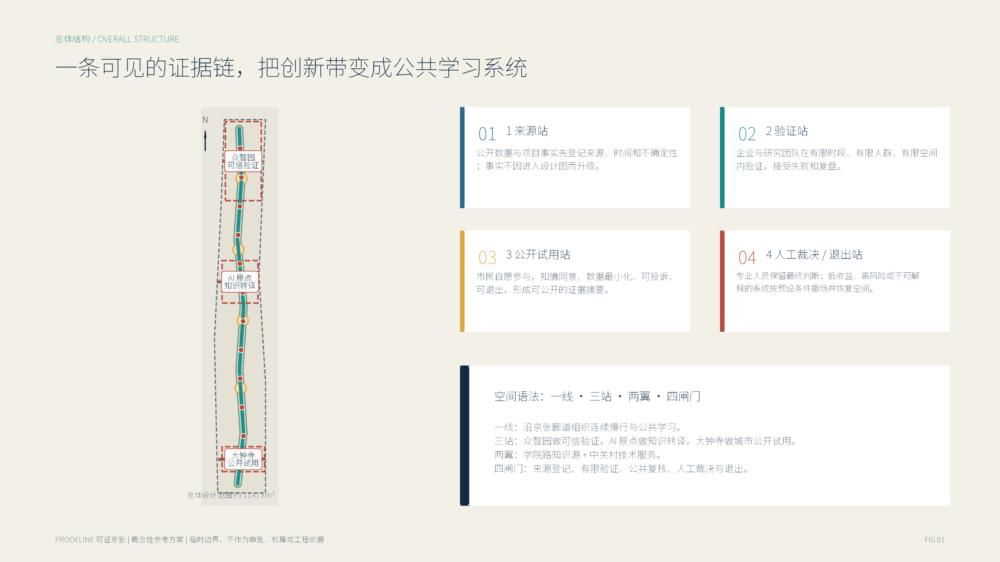
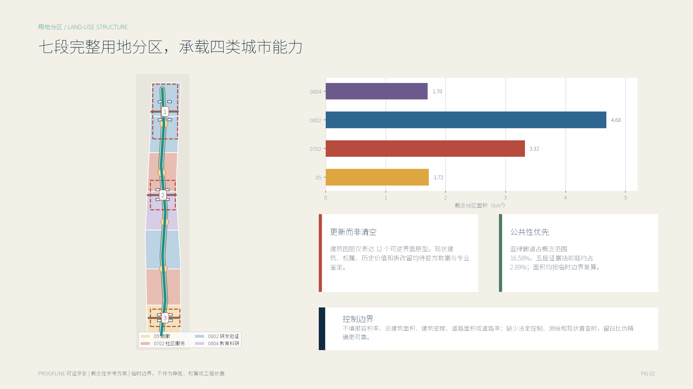
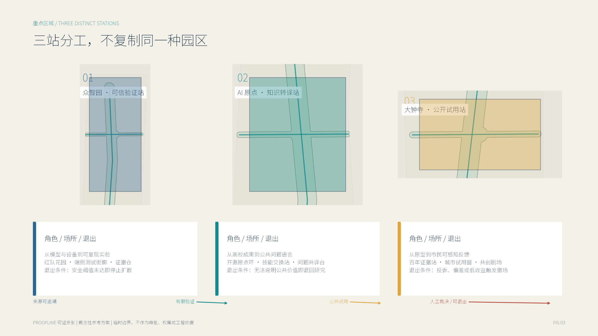
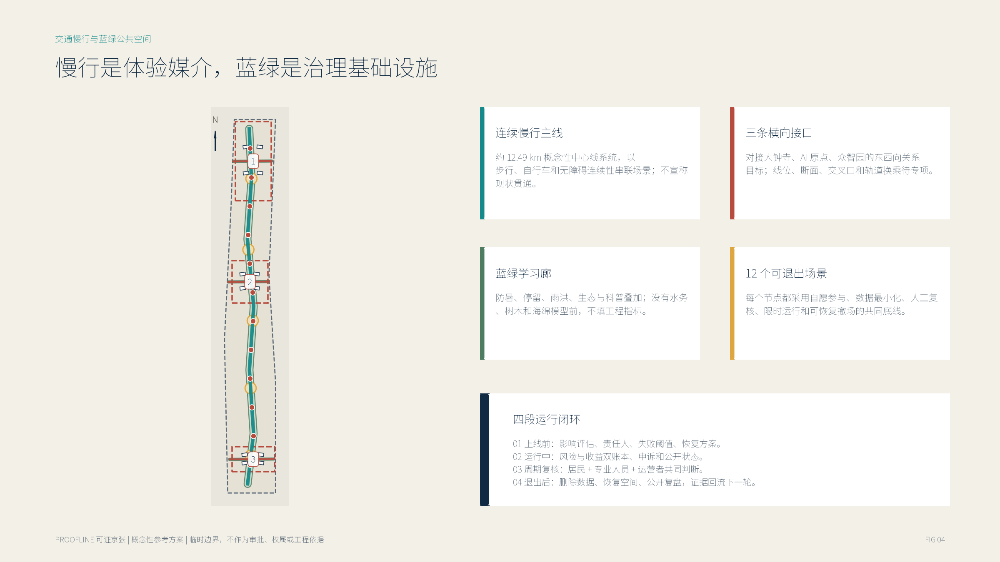
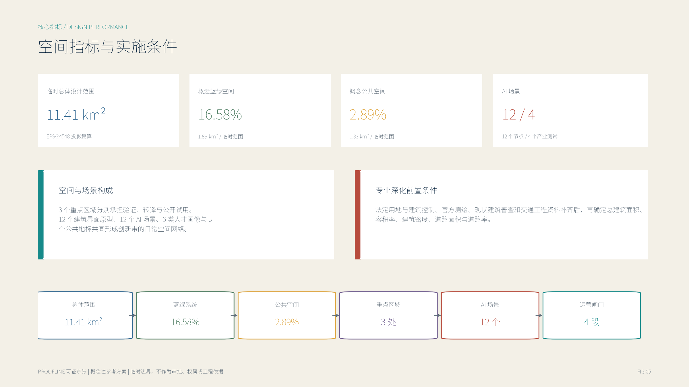

# Provable Jing-Zhang PROOFLINE: provable, exitable, and co-governable AI urban innovation belt

## Design Basis and Source List

"Proofline" is not about using AI as a new urban decoration, but about transforming "how to prove that a technology is worthy of entering the city" into the main thread of spatial design. The proposal starts from the engineering practices and century-old cultural threads carried by the Jing-Zhang Railway, and proposes **PROOFLINE**: a city Evidence Chain that connects source disclosure, controlled testing, public review, Human Review, and exit restoration. Here, "line" refers to the conceptual relationship between Public Space and governance processes, not an additional railway, track, or road alignment. The proposal responds to independent community open-source submissions; it is not the official submission results of the government organizer, nor does it replace the formal work of professional teams in urban and rural planning, architecture, transportation, cultural heritage protection, municipal services, and operations. [source:OFFICIAL-ANNOUNCEMENT] [source:AGENT-TASKBOOK]

Design is based on four levels. First, the official announcement confirms the project name, the textual description of the three-level work scope, the approximate area, the names of three key areas, and the tasks outlined in sections 1.3, 1.4, and 1.5. It cannot be used to recreate precise polygons. [source:OFFICIAL-ANNOUNCEMENT] [standard:PROJECT-OFFICIAL-ANNOUNCEMENT] Second, the agent task book confirms the three positioning principles, five functional areas, the Three Zones and Two Wings, six agent tasks, co-creation principles, and the no-crossing boundaries clause. [source:AGENT-TASKBOOK] [standard:PROJECT-AGENT-OPEN-CALL-TASKBOOK] Third, a local standard snapshot for Urban Design, control plan preparation, and land use classification is used to constrain Public Spaces, urban character, known and to-be-confirmed conditions, land use codes, and implementation language. [standard:MOHURD-URBAN-DESIGN-MEASURES] [standard:MOHURD-CONTROL-DETAILED-PLANNING] [standard:MNR-LAND-USE-CLASSIFICATION-GUIDE] Fourth, the warehouse site package, source registry, and processed fact package are used to constrain fields, source licenses, spatial accuracy, and missing data lists. [source:SITE-PACKAGE] [source:SOURCE-REGISTRY] [source:PROCESSED-FACT-PACK]

The current repository does not have official overall design boundaries or precise boundaries for the three key areas. The submitted package uses the rough geometry provided by the maintainer and explicitly sets `official_boundary=false` and `geometry_role=provisional_constraint`. It is only used for generating, visualizing, topological checking, and content intake, and not for official planning boundaries, approval, land tenure, engineering feasibility, or precise area determination. (Official Planning Boundary) [source:BOUNDARY-SOURCE] [source:KEY-AREA-SOURCE] [data:geometry/site_boundary.geojson#SITE-001] [data:geometry/key_areas.geojson#PROV-KEY-001] After the official polygon is in place, Boundaries, key areas, land use, buildings, roads, green spaces, Public Space, phases, all indicators, five maps, two documents PDF With two HTML Must be regenerated as a set of data rather than being locally replaced. [depth:existing_conditions_diagnosis]

`proposal.md` is the sole main text; `geometry/*.geojson` and `metrics.json` are spatial and computational evidence; three matrices respectively address "whether the task is covered, how the standards respond, and the depth of the outcomes"; images, A3/A0 formats, and offline web pages are responsible for explaining, without reversing the structured facts. `geometry/constraints.geojson` is intentionally left empty because there are no clear conservation rights, road redlines, control plans, utility or ownership control lines. The text responds to the data gaps rather than with pseudo-layers. [data:geometry/constraints.geojson#CONSTRAINTS-DATA-GAP] The local entries for the architectural profession depth requirements are missing official documentation and URL, Only as pending documentation, not declared as an authoritative source that has been satisfied.[standard:MOHURD-ARCH-DESIGN-DEPTH-2016]

## Three-Level Scope Framework

The three levels of scope address different scales of issues. Approximately 43.6 square kilometers of the Coordinated Research Area address the question of "how do innovative elements cycle"; approximately 11.4 square kilometers of the Overall Design Area address the question of "how are industries, public life, and renewal interfaces organized"; and three key areas covering approximately 368.4 hectares address the question of "which prototypes can be validated." These areas are derived from the announcement text and are task boundaries rather than the precise legal area of the submitted polygon. The temporary site geometry recalculated under EPSG:4548 is only for intra-package consistency checks. [source:OFFICIAL-ANNOUNCEMENT] [metric:site_area_sqm] [depth:three_level_scope_framework]

PROOFLINE The spatial structure is "**one line, three stations, two wings, and four gates**". One line is a continuous public experience and learning line organized along the cultural context of the Jing-Zhang Heritage Park. Three stations are the "Source Station" of the AI Origin community, the "Validation Station" of Zhongzhiyuan, and the "City Trial Station" of Dazhongsi. Two wings are the professional service feedback of the Zhongguancun Technology Services Wing and the city use feedback of the Xiaoyue River Scenario Enablement Wing. Four gates are the Source Gate, Test Gate, Human Judgment Gate, and Exit Gate. Four doors are not for checking passwords: any scenario must disclose its source and responsible party, enter the limited temporal and spatial trial, undergo evaluation by users and professionals, be decided upon by humans whether to continue, and retain paths for suspension, withdrawal, and site restoration. [source:AGENT-TASKBOOK] [depth:overall_spatial_structure]

At the strategic level, "source—validation—trial—feedback—reinvestment" replaces isolated competition among individual parks. The AI Origin community transforms university and research outcomes into traceable prototypes; Zhongzhiyuan incorporates models, terminals, security, and governance claims into controlled validation; Dazhongsi allows products to be tested by the public under clear information and human service; the Xiao Yuehe Wing returns real-use issues to the scenario list; and the Zhongguancun Technology Services Wing provides intellectual property, legal, talent, capital, and professional services. This loop is a Conceptual Recommendation, not indicating any commitment by any institution, company, funding, or policy. [source:AGENT-TASKBOOK]

At the overall design level, the seven conceptual zones are completely and fully divided by a single temporary site polygon. A north-south public green corridor, five evidence stations, and three east-west interfaces form an overlay network. The land partition completely covers and does not overlap; green spaces, Public Spaces, roads, and scene nodes are separately entered as recalculable layers into the Evidence Chain. [data:geometry/land_use.geojson#LU-001] [data:geometry/green_space.geojson#GREEN-001] [data:geometry/public_space.geojson#PUBLIC-001] [data:geometry/roads.geojson#ROAD-001] At the focus area level, three provisional polygons only help express differentiated tasks and do not support the formal placement of parcels, buildings, or roads. [data:geometry/key_areas.geojson#PROV-KEY-002] [data:geometry/key_areas.geojson#PROV-KEY-003]

Visual identity continues with "proof" rather than "show-off." The original logo direction is formed by two parallel trajectories meeting at a node to create an open parenthesis and a hook: one representing the century-old Jing-Zhang cultural trajectory, and the other representing the AI evidence trajectory; the unclosed outer frame signifies that the proposal allows for questioning, revision, and exit. The main colors are Jing-Zhang brick red, evidence blue, artificial judgment gold, and paper deep blue. Graphics do not use corporate logos, portraits, existing trademarks, or external maps; formal registration, font trademarks, and public symbols still require separate legal searches and professional design.

## Coordinated Research Area: Industry and Future City Research

Integrate and propose an "Innovation not ending with the arrival, but with a closed evidence loop." The industrial ecosystem should not merely count enterprises, talents, or buildings, but record where prototypes come from, how they are tested, who takes responsibility, how the public provides feedback, and when they are paused. Corresponding to the three positioning goals: the Jing-Zhang Cultural Heritage Belt provides "memory and origin"; the Urban AI Living Experience Belt provides "testing and feedback"; the AI Integration Innovation Belt provides "research and transformation". Corresponding to the five functional goals: full-stack independent innovation entering the validation station, a world-class innovation ecosystem entering an inter-institutional service network, AI-Enabled Scenarios entering boundary-limited experiments, an AI vibrant city entering Public Space, and human-centric governance obtaining a visible interface through human judgment and exit mechanisms. [source:AGENT-TASKBOOK] [standard:PROJECT-AGENT-OPEN-CALL-TASKBOOK]

The plan studied seven international case examples, but only examined the migration mechanisms, without projecting foreign systems, performance metrics, or land policies onto Haidian. [metric:international_case_count] [source:CASE-CAMBRIDGE-ENTERPRISE] [source:CASE-TORONTO-VECTOR-INSTITUTE] [source:CASE-HELSINKI-CITY-TESTBED] [source:CASE-BARCELONA-DECIDIM] [source:CASE-SINGAPORE-AI-VERIFY] [source:CASE-SEOUL-AI-SMART-CITY-CENTER] [source:CASE-BARCELONA-22AT]

1. **Cambridge Enterprise: University Technology Transfer Front.** Cambridge University's wholly-owned subsidiary undertakes functions such as technology transfer, company creation, consulting, and seed funding. The transfer mechanism involves disclosing results, judging intellectual property, validating concepts, and licensing or establishing company organizations as a continuous process; it cannot be extrapolated to the Haidian context, nor can it be used to predict Haidian's transfer rates. [source:CASE-CAMBRIDGE-ENTERPRISE]
2. **Vector Institute: Neutral AI Anchor Institution.** This independent nonprofit organization connects research with talent, engineering support, and the adoption of trustworthy AI. Transformative mechanisms include adjacent but clearly delineated research, controlled data compute, joint engineering, and public communication interfaces; they should not be overstated as a full co-located ecosystem from chip to application, nor should self-reported impact metrics be taken as causal evaluations. [source:CASE-TORONTO-VECTOR-INSTITUTE]
3. **Testbed Helsinki: Constrained Experiments in a Real City.** Helsinki opens scenarios such as education, mobility, and built environment to experimentation through Open Calls or proactive proposals. The transformation mechanism includes a scenario directory, responsible entities, timeframe, success metrics, exit and recovery mechanisms; it is not a regulatory exemption and does not imply procurement or scaled-up implementation. [source:CASE-HELSINKI-CITY-TESTBED]
4. **Decidim / Metadecidim: Open Source Co-Governance.** Open-source code, public roadmaps, feature proposals, and code reviews form a traceable public-commons infrastructure. Conversion mechanisms ensure that decisions regarding needs, adoption, versions, and deprecation are traceable; this case is not an AI industry platform, and open-source licensing does not automatically guarantee fairness, safety, and sustained maintenance. [source:CASE-BARCELONA-DECIDIM]
5. **AI Verify Foundation: Test Statements Rather than Issuing Safety Myths.** The Singapore IMDA initiated an open community development of responsible AI testing tools and report formats, clearly stating that the tools do not guarantee system safety. The translatable mechanism is to form a model version, data descriptions, test results, failed items, and Human Review records before entering public trials; testing does not equal government certification or compliance exemptions. [source:CASE-SINGAPORE-AI-VERIFY]
6. **Seoul AI Smart City Center: a transparent showcase for public understanding.** This public experience space combines urban use cases, corporate displays, education, and experiences based on public data. The transformation mechanism involves annotating each exhibit with a version, data, risks, feedback, and deactivation date; entering the gallery does not equate to market validation, procurement, or product efficacy certification. [source:CASE-SEOUL-AI-SMART-CITY-CENTER]
7. **Barcelona 22@: Heritage, Mixed-City Uses, and Public Benefits.** Official materials include knowledge activities, university research, mixed-use developments, advanced infrastructure, and the preservation of industrial heritage. Transformative mechanisms include evidence of individual building value, adaptive reuse, and continuous public pathways; Barcelona's volumetric rewards, land covenants, and governance systems cannot be replicated as Beijing's policy conclusions. [source:CASE-BARCELONA-22AT]

Seven cases collectively point to a suite of "evidence infrastructure": the transformation front desk is responsible for origins, the validation institution for testing, the scenario brokerage platform for defining experiments, the open-source community for contributing memory, the assurance laboratory for risk reporting, the public showcase for understandable trials, and the heritage update for incorporating temporal continuity into innovative spaces. Haidian's advantage is not simply replicating any one park, but organizing universities, businesses, communities, cultural heritage, and public governance into verifiable synergistic loops. Case facts are only used for background mechanisms; specific spatial arrangements, policies, operations, and institutional arrangements require local professional teams to deepen. [depth:overall_spatial_structure]

## Overall Design Area: Urban Renewal and Regulatory-Plan-Level Urban Design

The overall design will regard the temporary 11.4 square kilometers area as the "spatial container for the evidence infrastructure." Seven functional bands from north to south are sequentially: urban public trial use, human-centric service neighborhood, product validation, open-source knowledge exchange, talent living services, full-stack R&D and security governance, northern garden validation. They use the warehouse-allowed codes `05`, `0702`, `0802`, `0804`, and are sequentially divided by the same boundary to ensure no gaps or overlaps. [data:geometry/land_use.geojson#LU-001] [data:geometry/land_use.geojson#LU-004] [data:geometry/land_use.geojson#LU-007] [standard:MNR-LAND-USE-CLASSIFICATION-GUIDE] These codes are structural expressions of the plan, not proving any specific land use has been approved. [depth:land_use_layout]

PROOFLINE Form a public spine above the functional bands: a north-south axis that accommodates walking, cycling, cultural tours, and scene interpretation, with three east-west interfaces visualizing the feedback relationships between the focus area and the wings, and five evidence stations providing a public vestibule for source verification, testing, evaluation, human judgment, and exit. [data:geometry/roads.geojson#ROAD-001] [data:geometry/public_space.geojson#PUBLIC-001] These spatial relationships do not hide technology behind the scenes: each AI scenario must be visible on the public interface for "who is responsible, what data is used, the current version, what the risks are, and how to appeal and exit."

Urban Renewal adopts the method of "first interfaces, then carriers; first reversible, then permanent." The first step involves inventorying legal access to Public Spaces and existing space interfaces. The second step involves establishing public feedback through lightweight signage, events, mobile exhibits, and temporary trials. Only then does a professional team decide, based on ownership, building safety, control plans, and cultural heritage conditions, whether to proceed with adaptive reuse. The 12 submitted building polygons are merely indicative volumes and test blocks for the three key areas, not current surveys, plot boundaries, demolition decisions, or new construction permits. [data:geometry/buildings.geojson#BLDG-001] [depth:retain_renovate_demolish]

The key depth of the control plan is not in fabricating numbers, but in clearly distinguishing three categories of conclusions. The first category is within-package recalculable: land area, green spaces, Public Spaces, indicative Building Footprints, and conceptual route lengths within the temporary boundary. The second category is design principles: open ground floors, fine-grained street interfaces, reversible components, continuous slow-moving and low-disturbance historical environments. The third category must await official conditions: Floor Area Ratio, Building Height, Building Coverage Ratio, green space ratio control, road red lines, setbacks, parking, utilities, and the four lines. The latter are kept as `unknown` in `metrics.json` and are not replaced by graphical numbers. [standard:MOHURD-CONTROL-DETAILED-PLANNING] [depth:development_intensity_controls] [depth:height_massing_character]

The proposal suggests a "brick red memory base, blue evidence interface, and golden artificial judgment node." Existing historical context values should be investigated before making judgments; the new interface emphasizes modularity, maintainability, low luminance, and non-obstruction of historical reading. The ground floor of buildings encourages transparency but does not require full glass; the roof and massing only propose the qualitative direction of decomposing large masses, forming shared rooftop terraces, controlling glare, and respecting vista corridors. Any specific height, roof form, or skyline along the route must be re-argued under the conditions of official cultural heritage protection, landscape, and control plans. [standard:MOHURD-URBAN-DESIGN-MEASURES]

## Detailed Design of Key Areas

Three key areas are defined as three complementary "evidence stations" rather than three homogeneous AI districts. The current polygon is a temporary rough range, and the following functions, buildings, transportation, and Public Space actions are all Conceptual Recommendations; official planning boundaries, ownership, existing buildings, roads, municipal, and cultural heritage data must be completed, after which a professional team must reposition them. [data:geometry/key_areas.geojson#PROV-KEY-001] [data:geometry/key_areas.geojson#PROV-KEY-002] [data:geometry/key_areas.geojson#PROV-KEY-003] [depth:three_key_area_detailed_design] (Official Planning Boundary)

**Zhongzhiyuan: Trusted Full-Stack Validation Hub.** Positioning itself from "technology stack" to "trust stack." The spatial structure adopts a gradient of "R&D Interface—Controlled Testing Courtyard—Red Team Garden—Governance Forum—Qinghe Cultural Interface." The indicative carrier covers laboratories, AI R&D, incubation, and shared validation, all marked as adaptable capacity blocks, neither representing the current buildings nor concluding on the Demolish–Renovate–Retain Strategy. [data:geometry/buildings.geojson#BLDG-001] The scene focuses on the test street block for edge-side intelligent devices and the model safety Red Team Garden: the boundaries of the experiment, the responsible parties, versions, data, accident reports, and exit conditions must be established before display. Traffic is only expressed in terms of external connections and the target for lateral cycling interfaces, without depicting the Fifth Ring Road crossing, road sections, or bridge and tunnel engineering. Public Space emphasizes garden-type exchanges and low-disturbance testing; when the blue line of the river, flood protection, and ecological requirements are absent, no engineering judgment is made on the Qinghe interface.

**Beijing AI Origin Community: Open Source Source and Transformation Hub.** Positioning extends from "0 to 1" to "a neighborhood for people and knowledge." The spatial structure adopts "university outcomes interface—open source evidence showcase—short-cycle prototype space—talent living services—community feedback." The indicative carrier covers a composite interface for education, incubation, community services, and talent residence, but does not imply any agreement for the renovation of any university, park, community, or building. [data:geometry/buildings.geojson#BLDG-005] Open source contributions must include a license, source, model card, and failure logs; the transformation front desk provides information and professional service navigation but does not promise funding, policy, or business landing. The goal for slow travel is easier walking and cycling between campuses, parks, and neighborhoods, with specific integrated solutions for Wudaokou and Tsinghua East Road West Mouth sites requiring official transportation data and professional review.

**Dazhongsi: Urban Public Trial and International Exchange Station.** Positioning shifts from "1 to N" to "a city market where trials are possible, questions can be asked, and products can be returned." The spatial structure adopts a "railway portal—public trial window—human service counter—content co-creation theater—international exchange living room." The indicative carrier covers mixed functions, commercial, office, and cultural interfaces, without binding to any specific enterprise or supplier. [data:geometry/buildings.geojson#BLDG-009] Each product must clearly state whether it is merely a demonstration, what data is used, how to contact human customer service, and when it will be removed; the public is not a passive data source. Dazhongsi station quadrants pedestrian connection is only a target and should not be written as an approved project; specific line positions and feasibility conclusions are not made until road red lines, station body, underground space, pipeline, and traffic safety conditions are fully addressed.

Three zones collaborate in a cycle of "original point production knowledge—Zhongzhiyuan validation—Dazhongsi public trial use—Xiaoyuehe feedback—Zhongguancun service re-investment." Knowledge, test reports, public issues, and exit reasons should be recorded in the same scenario register to form reusable rather than merely displayed successful urban learning assets. The temporary geometric recalculated values of the three key zones are only used for package checks and are disclosed alongside the announced approximate area, without implying official accuracy. [metric:key_area_count] [metric:key_area_zhongzhiyuan_ai_acceleration_area_sqm] [metric:key_area_beijing_ai_origin_community_sqm] [metric:key_area_dazhongsi_ai_industry_cluster_sqm]

## AI Innovation Ecosystem, Personas, and AI+ Scenarios

The proposal uses six types of personas to assess whether an AI city is truly people-centric, rather than merely serving its developers. [metric:persona_count] **Original Research Innovators** require a trustworthy infrastructure, interdisciplinary collaboration, and interfaces for technology transfer; **Open Source Developers and Early Entrepreneurs** need low-threshold prototyping spaces, contribution memories, and professional services; **Youth and Global Talents** require an integrated daily environment for work, living, learning, and socializing; **Local Residents and Families** are concerned with quietness, safety, convenience, transparency, and the ability to make complaints; **Elderly, Children, and Persons with Disabilities** prioritize accessibility, explainability, and human fallbacks; **Urban Operators and Public Service Staff** need clear versions, risk grading, the ability to pause, and auditability in their support tools. Each persona is not an individual profile, does not collect identity or trajectory data, but serves as a design review role. [source:AGENT-TASKBOOK]

Twelve scenario cards were written into `public_space.geojson` under the `SCENARIO_NODE`, all of which require voluntary participation, data minimization, no reliance on facial recognition, Human Review, time-limited testing, and the ability to revert and exit. [metric:scenario_node_count] [data:geometry/public_space.geojson#SCN-01]

1. **Centennial Trajectory Guide Agent.** Located on the cultural experience path, it provides multilingual and accessible interpretation using verified public records; historical information that cannot be confirmed must indicate source gaps, with the final content edited by hand.[data:geometry/public_space.geojson#SCN-01]
2. **Universal Accessibility for All.** Provide pedestrian assistance for the elderly, children, persons with disabilities, and visitors; route suggestions do not replace traffic safety judgments. Location and demand data are handled locally in real time and with active authorization. [data:geometry/public_space.geojson#SCN-02]
3. **Urban Issues Translation Hub.** Convert residents' oral opinions into structured issues in the public forecourt, with the original text confirmed by the author before submission for manual review; do not automatically represent the residents' stance or generate administrative decisions. [data:geometry/public_space.geojson#SCN-03]
4. **Open Source Achievement Showcase.** Display code, model cards, data licenses, failure experiences, and contributor attributions; unlicensed content shall not be displayed, and version and deprecation status shall remain visible. [data:geometry/public_space.geojson#SCN-04]
5. **AI Startup Day Service Chain.** Linking intellectual property, space, talent, and professional service information, serving only as a navigation and matchmaker, without promising policy, capital, or approval. [data:geometry/public_space.geojson#SCN-05]
6. **AI Skills Exchange Station.** Students, developers, and residents voluntarily post publicly available skills and learning needs, without collecting sensitive educational, employment, or family background information, and without forming an unappealable credit ranking. [data:geometry/public_space.geojson#SCN-06]
7. **End-Side Intelligent Device Test Street Segment (Industrial Test).** Verify interaction, safety, and maintenance within a closed or clearly isolated temporal and spatial range, without directly controlling public transportation, fire services, or critical infrastructure.[data:geometry/public_space.geojson#SCN-07]
8. **Model Safety Red Team Garden (Industrial Testing).** Conducted by developers, ethicists, target users, and human supervisors, this involves bias, robustness, and explainability testing with issue resolution deadlines and a pause switch. [data:geometry/public_space.geojson#SCN-08]
9. **Multimodal Slow Mobility Assistant (Industrial Testing).** Simulate routes and transfer suggestions using public or voluntary data; it does not alter traffic signals, is not equivalent to road engineering, and does not collect continuous individual trajectories. [data:geometry/public_space.geojson#SCN-09]
10. **AI-Native New Consumption Experiment Store (Industrial Test).** Conduct short-term trials of agents, terminals, and content products, requiring mandatory labeling of "experiment," data usage, human customer support, refund, and de-listing conditions. [data:geometry/public_space.geojson#SCN-10]
11. **Urban Content Co-Creation Theater.** The public and creators generate content together in Qingquan Space, retaining source materials, licensing, and manual edits; unauthorized portraits, trademarks, academic images, and training materials are not to be used. [data:geometry/public_space.geojson#SCN-11]
12. **Blue-Green Space Co-Protect Agent.** Collects public environmental data and voluntary observations to provide recommendations to maintenance personnel, without serving as a law enforcement, cultural preservation, or flood control measure. [data:geometry/public_space.geojson#SCN-12]

Among items 7-10 are four industry Testing and Validation Scenarios, exceeding the three required by the task, but the number does not equal approval and maturity. [metric:industry_test_scenario_count] Each test must include "site owner, operational responsible party, participants, data list, risk level, test period, Human Review, accident report, stop conditions, and recovery method." Whether to enter procurement, formal operation, or scale-up is an independent human decision after testing. This governance agreement operationalizes "AI-Native" as an auditable operating model rather than affixing a technological label to traditional space. [depth:three_key_area_detailed_design]

## Land Use, Building Scale, and Retain-Renovate-Demolish Strategy

Use a complete partition for the land layers, rather than scattered conceptual color blocks. Four code categories form seven north-south bands in the temporary site geometry: commercial and service industry `05` for the southern portal and urban product transformation; community services `0702` for human-centric services and talent living support; research `0802` for product validation, full-stack R&D, and northern collaboration; education `0804` for open-source knowledge and learning exchange. The land area is recalculated using EPSG:4548 geometry and is only used as a scheme proportion in the text and indicator diagram, not as approved land. [metric:land_use_05_area_sqm] [metric:land_use_0702_area_sqm] [metric:land_use_0802_area_sqm] [metric:land_use_0804_area_sqm] [data:geometry/land_use.geojson#LU-002] [data:geometry/land_use.geojson#LU-006]

A continuous green corridor overlaps with five public evidence stations on the land partition, expressing the "land classification—Public Space—operating protocol" three-layer relationship. The green corridor does not claim to be an existing park, official green line, or river blue line; the public stations do not claim to be approved squares. The value of the layers lies in providing a locatable, replaceable, and recalculable container for each function, allowing for a holistic reconstruction once the official boundaries are in place, without writing the narrative into a single effect image. [data:geometry/green_space.geojson#GREEN-001] [data:geometry/public_space.geojson#PUBLIC-001] (Official Boundary)

The building layers adopt 12 small-scale "adaptive module blocks," each testing Zhongzhiyuan experimental/research/incubation, original point community education/open-source/community/talent services, and Dazhongsi mixed/commercial/office/cultural functions. Their total gross floor area is a geometric fact within the design, rather than the current condition or construction scale. [metric:building_footprint_area_sqm] Since there are no current building outlines, number of floors, age, structural safety, ownership, and control plan, this scheme makes no decisions regarding the retention, renovation, demolition, or new construction of any buildings. Formal deepening must first establish a building register, followed by a sequential evaluation of historical and cultural value, structural safety, carbon emissions and reuse potential, public interest, ownership, and economic viability. [data:geometry/buildings.geojson#BLDG-001] [depth:retain_renovate_demolish]

Qualitative massing principles include: forming a continuous but not overly commercialized open ground floor along the public spine; breaking large masses into traversable courtyards and shared interfaces; prioritizing adaptive reuse and modular components; controlling screen glare, noise, and nighttime disturbances; and ensuring that roofs are reviewed for safety and property rights before being used for public learning, low-carbon technology demonstrations, or ecological improvements. Building Coverage Ratio, total floor area, building density, and height are kept unknown, as these metrics require official zoning, precise boundaries, and professional calculations. [metric:total_floor_area_sqm] [metric:floor_area_ratio] [metric:building_density] [depth:development_intensity_controls] [depth:height_massing_character] (Floor Area Ratio)

Therefore, "reaching the depth of Control and Detailed Planning Urban Design" in this package is manifested as a structurally complete, clearly defined evidence boundary, with locatable items for confirmation, rather than overstepping to provide statutory indicators. Each update object is expressed in a chain of "Unknown Present Condition—Need Additional Data—Evaluation Method—Reversible Experiment—Human Decision." Official present conditions and control conditions entering the repository require that the indicative building blocks must be deleted or replaced, and cannot be continued to be used by adjusting decimals.

## Transport, Rail, Municipal Infrastructure, and Public Services

Traffic layers express connections, not engineering lines. `ROAD-001` is a conceptual PROOFLINE public experience path, with three horizontal interfaces responding to Dazhongsi public trials, AI Origin knowledge neighborhoods, and Zhongzhiyuan trustworthy validation. The conceptual central line total length is only used for in-package graphics and evidence checks; when road redlines, sections, stations, passenger flow, parking, fire safety, and accessibility mapping are missing, it should not be interpreted as implementation length. [metric:road_centerline_length_m] [data:geometry/roads.geojson#ROAD-001] [depth:traffic_rail_slow_parking]

Slow-moving strategies adopt the principle of "continuity before speed and accessibility before technology." The north-south path provides cultural tours, while the east-west interfaces serve community, park, public transport, and short-distance connections between key areas; the five evidence stations function as resting, inquiring, human service, and emergency exit nodes. AI slow-moving assistants only provide explainable suggestions, do not continuously track individuals, and do not control traffic signals. Specialized traffic, structural, fire safety, and municipal arguments are required for crossing the fifth ring road, park discontinuities, the Dazhongsi quadrants, and Transit-Station Integration. This plan does not draw bridges, tunnels, underground spaces, or approve alignments. [source:OFFICIAL-ANNOUNCEMENT]

Static traffic follows the principle of "manage first, then increase." Formal deepening should first inventory the supply and usage times of motor vehicles and non-motor vehicles, as well as accessible parking spaces, loading and unloading, and emergency needs, before deciding on shared, reservation, event day organization, or additional facilities. Robotic delivery and low-speed shuttle services can only be tested in physically separated, low-speed, manually take-over-able, clearly insured, and with a clear liability subject scenarios; they must not encroach on the blind path, fire lanes, or safe spaces for ordinary pedestrians.

Municipal and New Infrastructure establish six verification items: power and edge-side computational load, communication and data security, water supply and drainage with flood prevention, fire safety and emergency response, solid waste and equipment maintenance, and thermal environment and carbon emissions. Each item should record the current capacity, peak usage, redundancy, responsible party, and failure conditions. Currently, `constraints.geojson` is empty, indicating that there is no pipeline, flood prevention, fire protection, or control line data available for engineering design; therefore, no conclusions can be drawn regarding distributed energy capacity, pipeline relocation, or data center location. [data:geometry/constraints.geojson#CONSTRAINTS-DATA-GAP] [depth:municipal_new_infrastructure]

Public service facilities use a dual-channel approach of "human front desk + AI navigation." Talent services, intellectual property, legal, educational, medical and health, living services, and event information can be assisted in retrieval by AI, but must display the source of information, update time, scope of applicability, and contact information for human assistance. Medical, legal, and administrative advice are not determined solely by the model; accessibility for children, the elderly, and people with disabilities is evaluated by actual user participation, not inferred from synthetic profiles. Before the public service baseline is met, no fabricated capacity is assigned to schools, medical facilities, sports, cultural, or community facilities.

## Blue-Green Network, Public Space, and Urban Character

The blue-green system converts "proof" into everyday public experience: green corridors carry cultural reading, walking and cycling, low-disturbance learning, and environmental observation. Five evidence stations carry source disclosure, experimental explanation, public comment, artificial service, and exit recovery. The green spaces within the package and Public Space areas come from the concept geometry; their ratio to the temporary boundary is used for topological and visual consistency checks, not as official green space rates, green lines, or public space control indicators. [metric:green_space_area_sqm] [metric:green_ratio] [metric:public_space_area_sqm] [metric:public_space_ratio] [data:geometry/green_space.geojson#GREEN-001] [depth:blue_green_public_space]

Public Space component library consists of six reversible elements: source plaques display historical records, data, and versions; test plaques display responsible parties, duration, and risks; human service counters provide non-digital channels; feedback tables support anonymous or voluntary opinions; exit signs explain closure, revocation, and site restoration; contribution tracks record open-source code, public knowledge, accessibility improvements, and failure experiences. Components are designed with principles of easy maintenance, low energy consumption, non-overwhelming lighting, and ease of disassembly. Specific materials, structures, fire safety, accessibility, and cultural heritage adaptation are refined by professional teams.

Three AI pilgrimage landmarks form a public narrative of "memory—open source—trial use." [metric:pilgrimage_landmark_count] **The Centennial Evidence Station** juxtaposes a verified timeline of Jing-Zhang history with contemporary technological evidence, without recreating historical architecture; **The Open Source Origin Loop** continuously displays licenses, model cards, failure logs, and contributor attributions; **The Urban Trial Window** allows products to be used, questioned, and removed under artificial service and clear notification. [data:geometry/public_space.geojson#LANDMARK-001] [data:geometry/public_space.geojson#LANDMARK-002] [data:geometry/public_space.geojson#LANDMARK-003] All three are reversible device directions, with specific locations requiring review by ownership, cultural heritage, transportation, and safety authorities.

Cultural narrative is not simply "railway form + tech screen." This proposal understands Jing-Zhang culture as engineering proof, public memory, and autonomous exploration, and understands Zhongguancun culture as research, open-source, entrepreneurship, and continuous iteration, and understands AI new culture as traceable origins, admitting errors, public accountability, and human oversight. The international communication language is **"Proof before scale. People before automation." / "Proof before scale; people before automation."** This is a design value proposition, not a summary of historical facts or government policy. [standard:MOHURD-URBAN-DESIGN-MEASURES]

Urban Character adopts low-contrast backgrounds with high-identifying evidence interfaces: temporary boundaries are always presented with light-gray dashed lines; primary colors are used only for public paths, three stations, and governance nodes; large screens, neon, and immersive devices are not the default expression. Historical resources, Qinghe and Xiaoyuehe spaces, park implementation areas, and cultural nodes still require official lists and control lines. Without these materials, the map does not draw precise protection boundaries, nor does it make conclusions about rivers, flood control, or heritage projects.

## Renewal Projects, Implementation Policy, and Phasing

Updates are not to be sequenced by "which building to construct first," but rather by the maturity of the evidence. The project list includes eight categories of conceptual actions: JZ-P01 Official Boundary and Control Data Completion; JZ-P02 Verification of Jing-Zhang Historical Resources and Public Narrative Core; JZ-P03 PROOFLINE Continuous Audit for Accessibility; JZ-P04 AI Origin Open Source Transformation Front Desk; JZ-P05 Zhongzhiyuan Assurance Laboratory and Red Team Garden; JZ-P06 Dazhongsi Urban Test Window; JZ-P07 Scenario Registry, Event Reporting, and Exit Mechanism; JZ-P08 Annual Public Evaluation and Knowledge Archiving. Each must specify a human responsible party, required documentation, public engagement, risks, success criteria, and termination conditions. [depth:renewal_project_list]

Space phasing will use three readiness gates, rather than construction timelines. **First stage: Evidence Completion and Low-Impact Prototyping**, corresponding to the conceptual scope of the public green corridor and five evidence stations, focusing on documentation, tours, accessibility, and mobile activities; **Second stage: Controlled Sandbox in Key Areas**, only experimenting after the site's main body, zoning, cultural heritage, safety, data, and operational responsibilities are clearly defined; **Third stage: Professional Deepening and Institutional Transformation**, determined by an independent assessment on whether to enter formal planning, engineering, procurement, or operations. The three-stage polygons fully cover the temporary site, but do not represent investment, development timelines, or government plans. [data:geometry/phasing.geojson#PHASE-001] [data:geometry/phasing.geojson#PHASE-002] [data:geometry/phasing.geojson#PHASE-003] [metric:phase_1_area_sqm] [metric:phase_2_area_sqm] [metric:phase_3_area_sqm] [depth:phasing_implementation]

The policy mechanism proposes a research direction of "scene registry + evidence ticket + exit bond." The scene registry records the responsible party, data, model version, test scope, Human Review, and incidents; the evidence ticket records the source, tests passed and failed, user feedback, and applicable boundaries. The exit bond is not a financial system determined by this plan but rather a requirement for any operator to explain the resources required for exiting, data deletion, facility restoration, and user notification before the trial. Specific legal, financial, and procurement mechanisms must be studied by the relevant authorities and professional teams.

Long-term operations are conducted using a seasonal cycle concept framework: the spring "Source and Open Source Week" focuses on disclosing new projects and contributions; the summer "Urban Testing Season" runs time-limited scenarios; the autumn "Global Evidence Forum" compares testing methods with public issues; and the winter "Public Evaluation and Archiving Month" publishes lists of continuations, modifications, pauses, and exits. The developer community maintains an open-source roadmap, residents and target users participate in problem definition, professional teams are responsible for safety and compliance, while agents only perform data organization, conflict alerts, and version tracking. All activities are reference proposals, not confirmed schedules or government commitments. [source:AGENT-TASKBOOK]

Transformation pathways adhere to the principle that "testing ≠ procurement, demonstration ≠ certification, participation ≠ authorization for permanent data use." Even after a scenario passes, it still requires professional, ethical, legal, financial, and public interest evaluations; failure to pass also contributes to public knowledge, avoiding the documentation of only successful cases. Operational metrics prioritize recording the Human Review rate, exit response, closure of accessibility issues, reuse of open-source contributions, and accident transparency. Baseline and target values for these metrics will be established after the public operational data is made available.

## Metrics, Area Recalculation, and Compliance Matrix

Metrics are divided into three groups. The first group consists of recalculable facts submitted for the geometry: temporary site area of approximately 1,141.28 hectares; conceptual green space area of approximately 189.17 hectares, representing 16.58%; conceptual Public Space area of approximately 32.97 hectares, representing 2.89%; and a combined area of approximately 14.52 hectares for twelve indicative building interface bases; conceptual route centerlines of approximately 12.49 kilometers. Decimals are used for file consistency checks and do not represent official surveying or control plan accuracy. [metric:site_area_sqm] [metric:green_space_area_sqm] [metric:green_ratio] [metric:public_space_area_sqm] [metric:public_space_ratio] [metric:building_footprint_area_sqm] [metric:road_centerline_length_m] [depth:metrics_recalculation]

The second group is the content count of the proposal: three key areas, twelve scenario nodes, four industry test scenarios, six types of personas, three pilgrimage landmarks, and seven international cases. These numbers demonstrate the scope of the task coverage, without predicting visitor flow, businesses, talent, gross value added, or social impact. [metric:key_area_count] [metric:scenario_node_count] [metric:industry_test_scenario_count] [metric:persona_count] [metric:pilgrimage_landmark_count] [metric:international_case_count]

The third group is the conceptual land use and phase area. Commercial and service uses cover approximately 171.70 hectares, community services about 332.09 hectares, research approximately 467.97 hectares, and education about 169.51 hectares; the three readiness gates are approximately 197.11, 283.88, and 660.30 hectares, respectively. They are derived from the complete land-use partition and phase partition, describing only the container of this scheme. [metric:land_use_05_area_sqm] [metric:land_use_0702_area_sqm] [metric:land_use_0802_area_sqm] [metric:land_use_0804_area_sqm] [metric:phase_1_area_sqm] [metric:phase_2_area_sqm] [metric:phase_3_area_sqm]

The parcel recalculated for the key area within the package amounts to approximately 192.92 hectares for Zhongzhiyuan, 104.32 hectares for AI Origin, and 72.05 hectares for Dazhongsi; the announced approximate values are 192.1, 104.3, and 72.0 hectares respectively. The differences are due to temporary rough polygons, which cannot be used to revise the announcement or claim greater precision. [metric:key_area_zhongzhiyuan_ai_acceleration_area_sqm] [metric:key_area_beijing_ai_origin_community_sqm] [metric:key_area_dazhongsi_ai_industry_cluster_sqm] [source:BOUNDARY-SOURCE]

Floor Area Ratio, total gross floor area, Building Coverage Ratio, road area, and road ratio are kept unknown because official controls, existing buildings, floors, road redlines, and sections are missing. [metric:total_floor_area_sqm] [metric:floor_area_ratio] [metric:building_density] [metric:road_area_sqm] [metric:road_ratio] unknown is not a defect cover-up, but rather leaves the legal and engineering judgments in the correct professional process. [standard:MOHURD-CONTROL-DETAILED-PLANNING]

`compliance_matrix.json` covers 17 items of the announcement, including the 23 requirements for agent.1 to agent.6; `standard_matrix.json` covers five mandatory standards and registers one gap in building standards; the 15 required depths in `design_depth_matrix.json` are all established with Evidence Chains through the text, layers, metrics, drawings, sources, assumptions, and self-inspections. Complete depth references include [depth:existing_conditions_diagnosis], [depth:three_level_scope_framework], [depth:overall_spatial_structure], [depth:land_use_layout], [depth:development_intensity_controls], [depth:height_massing_character], [depth:retain_renovate_demolish], [depth:traffic_rail_slow_parking], [depth:municipal_new_infrastructure], [depth:blue_green_public_space], [depth:three_key_area_detailed_design], [depth:renewal_project_list] [depth:phasing_implementation], [depth:metrics_recalculation], [depth:risk_missing_data].

## Risk, Copyright, and Compliance

The primary risk is the "precise sense misguidance." Temporary boundaries, focus area polygons, and derived decimals are only used for intake; the drawings should uniformly use light gray dashed lines and prominent notes, with the announced values and package recalculations listed side by side in the text to avoid packaging geometric precision as official precision. The second risk is overstepping the planning authority: all FAR, height, density, Demolish–Renovate–Retain Strategy, road alignments, municipal capacity, ownership, investment, and development timelines should remain as unknown or Conceptual Recommendation. The third risk is overstepping the boundaries of history and cultural preservation: when there is no formal list of historical resources and control lines, no reconstruction, relocation, or permanent landmarks should be set. [depth:risk_missing_data]

The fourth risk is AI scenarios infringing on privacy and dignity. All scenarios default to opt-in, data minimization, not requiring facial recognition as a necessary condition, providing an artificial channel, allowing appeals and exits; high-risk scenarios such as children, healthcare, legal, accessibility, and public safety must enhance human review. Model outputs must not be the sole basis for planning approval, law enforcement, medical diagnosis, or resource allocation. Events, misidentifications, and exit reasons should be recorded, and not just successful cases should be published. [source:AGENT-TASKBOOK]

The fifth risk is the misuse of international case studies. Seven cases are drawn from firsthand publicly available pages of governments, universities, parks, or institutions, and are only used for mechanism research; page descriptions do not equal independent causal evaluation, foreign laws, land, capital, and procurement systems do not directly transfer, and any numbers are not used for performance predictions of Haidian. [source:CASE-CAMBRIDGE-ENTERPRISE] [source:CASE-TORONTO-VECTOR-INSTITUTE] [source:CASE-HELSINKI-CITY-TESTBED] [source:CASE-BARCELONA-DECIDIM] [source:CASE-SINGAPORE-AI-VERIFY] [source:CASE-SEOUL-AI-SMART-CITY-CENTER] [source:CASE-BARCELONA-22AT]

Copyright-wise, the text, graphics, GeoJSON design layers, five images, HTML, and PDF are generated by the AI agent for this project, with the main proposal licensed under CC BY-SA 4.0; the official announcements, standards, task book excerpts, temporary geometry, and international case studies retain their respective source rights and usage boundaries. The deliverables do not include commercial map tiles, external photos, news images, company logos, portraits, figures from papers, or third-party renderings. Visuals are limited to the submitted geometry, metrics, and original graphics; Chinese typography uses Noto Sans SC, which is used under the SIL Open Font License 1.1 and embedded in the document only, not included in the submission package. For a detailed statement, see `report/copyright_statement.md`.

The generation method has been disclosed: Shapely/PyProj in EPSG:4548 Derive the geometric and metric design from the prototype; Matplotlib/ReportLab generate original static graphics and PDF; Warehouse Script Rendering Offline Proposal HTML Perform a definitive, spatial, visual, and professional evidence check. HTML does not load CDN, remote fonts, maps, scripts, API, iframes, forms, or tracking codes. `agent.json` records the generation identity and toolchain. Maintainers, human reviewers, and professional teams retain the final judgment, PASS only means that the submission package meets the basic conditions for Content Review, and does not constitute a real approval or implementation guarantee.

## References

The local authority entry for this proposal is `brief/site-package/design_brief.json`, `agent_taskbook.json`, `allowed_design_space.json`, `standards/standards.json`, `standards/references/`, `data/source_registry.json`, and `data/processed/agent_fact_pack.md`. [source:SITE-PACKAGE] [source:SOURCE-REGISTRY] [source:PROCESSED-FACT-PACK] Official announcements are used for task and agreement areas, while temporary geometry is used for intake; these roles are not interchangeable. [source:OFFICIAL-ANNOUNCEMENT] [source:BOUNDARY-SOURCE] [source:KEY-AREA-SOURCE]

Professional references include the Urban Design Management Measures, the Compilation and Approval Measures for Control Detailed Planning of Cities and Towns, and the local snapshot of the Ministry of Natural Resources Land Use Classification Notice; they provide principles, depth, and classification language but do not prove that the project already has an approved control plan. [standard:MOHURD-URBAN-DESIGN-MEASURES] [standard:MOHURD-CONTROL-DETAILED-PLANNING] [standard:MNR-LAND-USE-CLASSIFICATION-GUIDE] The depth items of the architectural design documents are only data gaps due to the absence of official documents. [standard:MOHURD-ARCH-DESIGN-DEPTH-2016] (Regulatory Detailed Planning)

First-hand entries for international case studies include the official or institutional pages of Cambridge Enterprise, Vector Institute, Testbed Helsinki, Decidim, Singapore AI Verify Foundation, Seoul AI Smart City Center, and Barcelona 22@. The title, publisher, URL, access date, permitted uses, and prohibited extrapolations are recorded in `sources.json`. [source:CASE-CAMBRIDGE-ENTERPRISE] [source:CASE-TORONTO-VECTOR-INSTITUTE] [source:CASE-HELSINKI-CITY-TESTBED] [source:CASE-BARCELONA-DECIDIM] [source:CASE-SINGAPORE-AI-VERIFY] [source:CASE-SEOUL-AI-SMART-CITY-CENTER] [source:CASE-BARCELONA-22AT]

Machine evidence entries are for [data:geometry/site_boundary.geojson#SITE-001], [data:geometry/key_areas.geojson#PROV-KEY-001], [data:geometry/land_use.geojson#LU-001], [data:geometry/buildings.geojson#BLDG-001], [data:geometry/roads.geojson#ROAD-001], [data:geometry/green_space.geojson#GREEN-001], [data:geometry/public_space.geojson#PUBLIC-001], [data:geometry/constraints.geojson#CONSTRAINTS-DATA-GAP], and [data:geometry/phasing.geojson#PHASE-001]. Any reader can verify that the text, images, HTML, and PDF use the same set of geometry, metrics, sources, and limitations.
